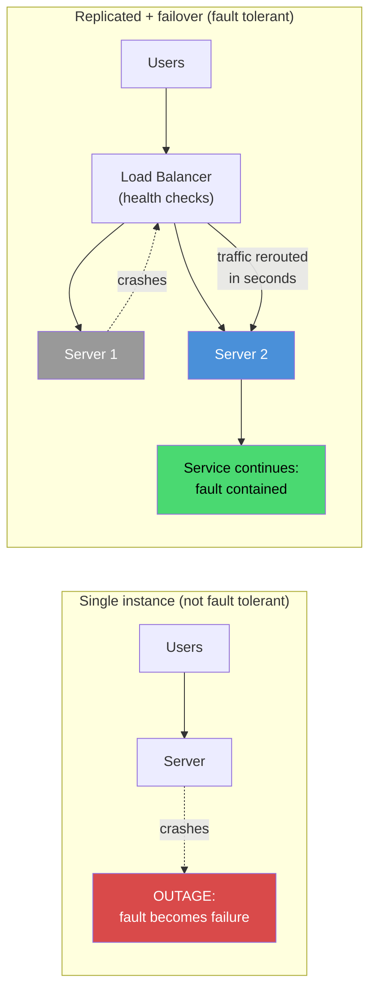
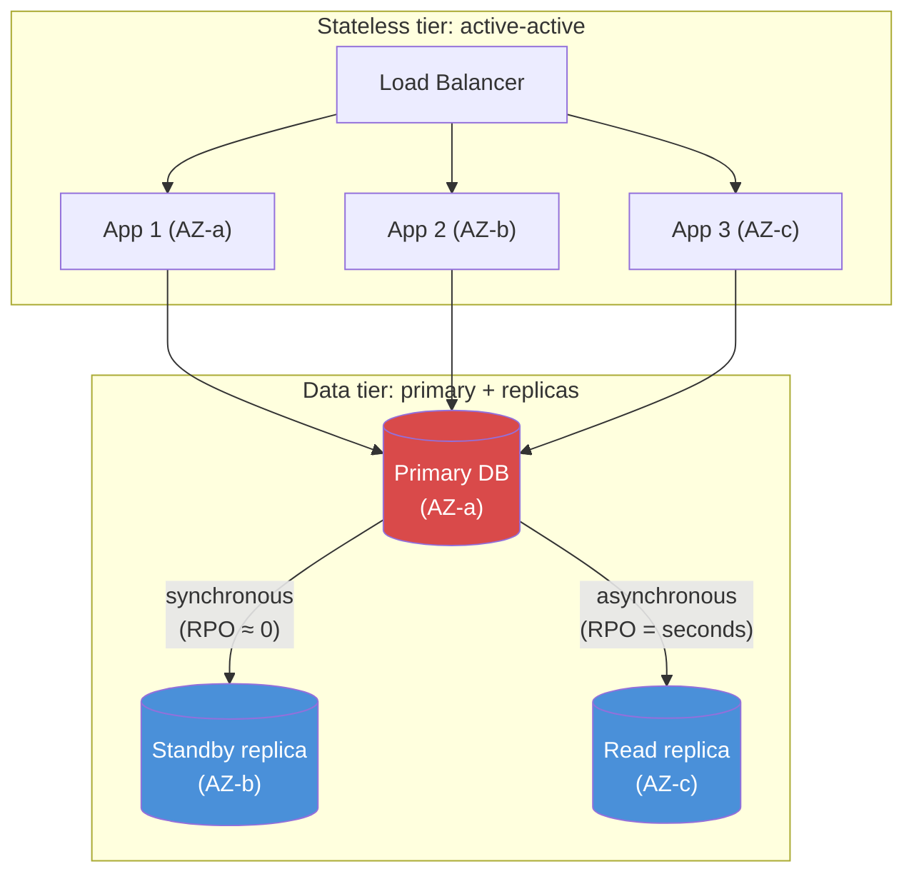
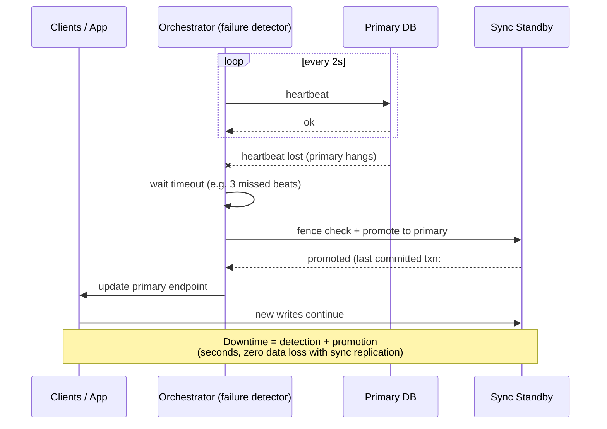
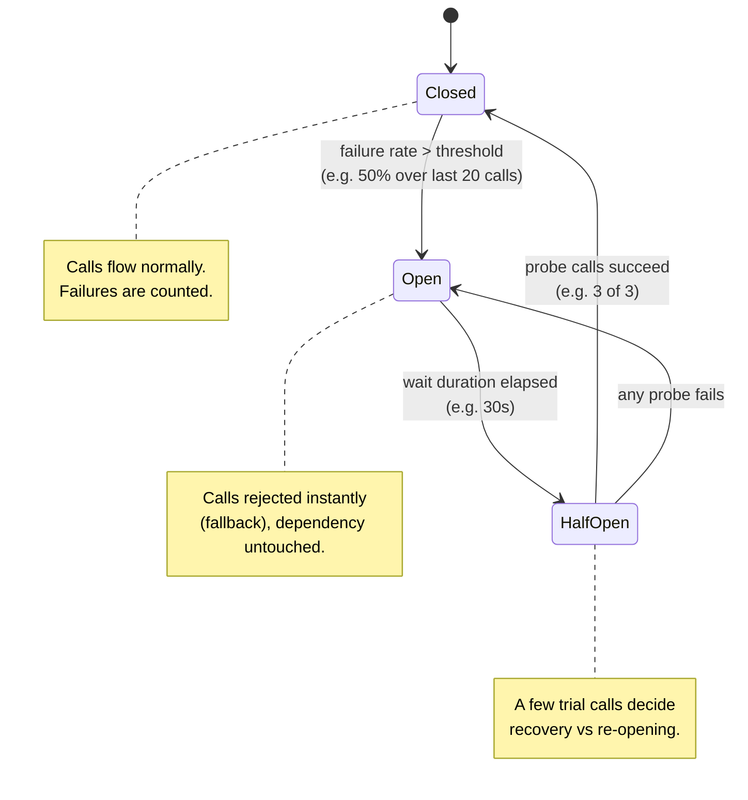
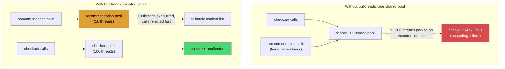
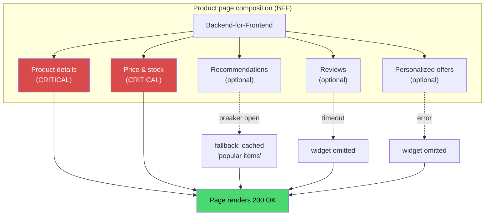
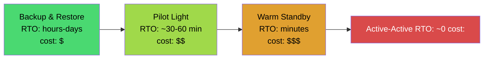
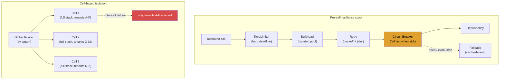

# Fault Tolerance

## Blogs and websites


## Medium


## Youtube


## Theory

Fault tolerance is the property that lets a **system continue operating despite failures** in some of its components. Instead of assuming hardware, networks, and dependencies will never fail (they will), a fault-tolerant design assumes failure is normal and builds in the mechanisms to absorb it: detecting faults quickly, isolating them before they spread, and keeping the system serving — at full or gracefully reduced capacity — while the broken part recovers or is replaced.

**Techniques:**
- **Replication** — running multiple copies of the same component (or data) so that one copy's failure leaves others to carry the load; the foundation of most fault tolerance.
- **Redundancy** — having spare capacity or duplicate resources (servers, AZs, regions, network paths) ready to take over; replication is redundancy applied to software, but redundancy also covers hardware and infrastructure.
- **Graceful degradation** — when something fails, shedding non-essential functionality instead of failing entirely: serve a slightly stale cache, hide a recommendations widget, keep checkout working even if reviews are down.
- **Failover** — automatically switching to a healthy standby (a replica database, a secondary region, a new leader) when the active component fails, ideally without human intervention.
- **Circuit breakers** — stop calling a failing dependency for a while instead of hammering it and exhausting your own resources; fail fast, recover automatically when it heals.
- **Retry mechanisms** — re-attempt failed operations (with backoff and jitter) because many failures are transient: a dropped packet, a brief overload, a restarted instance.

### Disaster Recovery

Disaster recovery (DR) is the discipline of **planning for recovery from catastrophic failures** — the loss of an entire data center, region, or data itself — as opposed to the component-level failures the techniques above handle minute-to-minute. DR answers: "when the worst happens, how fast can we be back, and how much data can we afford to lose?"

**Metrics:**
- **RTO (Recovery Time Objective)**: the maximum downtime tolerated — how long the system may be unavailable after a disaster before the business impact becomes unacceptable. An RTO of 15 minutes demands hot standby automation; an RTO of 24 hours permits restore-from-backup procedures.
- **RPO (Recovery Point Objective)**: the maximum data loss tolerated — how far back in time the last recoverable state may be. An RPO of zero requires synchronous replication; an RPO of one hour permits hourly backups or asynchronous replication with up to an hour of lag.

**Strategies:**
- **Regular backups** — scheduled, automated, encrypted snapshots of data, stored off-site/in another region; useless unless also tested for restorability. Backups set the floor for RPO.
- **Multi-region replication** — continuously copying data to another region (async for cost, sync for near-zero RPO) so a regional loss doesn't mean data loss.
- **Disaster recovery site** — a standby environment to fail over to, ranging from cold (backup & restore: cheapest, hours of RTO) through warm (pilot light / active standby: minimal always-on core, tens of minutes) to hot (active-active multi-region: near-zero RTO, most expensive).
- **Regular testing** — scheduled DR drills and game days that actually perform the failover and restore; an untested DR plan is a hypothesis, not a plan.

The full deep dive — with diagrams, code, and trade-off analysis — is in the [Disaster Recovery: RTO, RPO, and Backup Strategies](#disaster-recovery-rto-rpo-and-backup-strategies) topic below.

### Topics Covered

This page is organized into the following topics. Each topic includes a detailed explanation, a diagram, a real-life use case, a Java/Spring Boot code example, and interview questions with answers.

1. [Introduction: What Is Fault Tolerance](#introduction-what-is-fault-tolerance)
2. [Redundancy and Replication](#redundancy-and-replication)
3. [Failover and Health Checking](#failover-and-health-checking)
4. [Retry Mechanisms and Backoff](#retry-mechanisms-and-backoff)
5. [Circuit Breakers](#circuit-breakers)
6. [Timeouts, Bulkheads, and Isolation](#timeouts-bulkheads-and-isolation)
7. [Graceful Degradation and Fallbacks](#graceful-degradation-and-fallbacks)
8. [Disaster Recovery: RTO, RPO, and Backup Strategies](#disaster-recovery-rto-rpo-and-backup-strategies)
9. [Chaos Engineering and Fault Injection](#chaos-engineering-and-fault-injection)
10. [Fault Tolerance in Microservices and Distributed Systems](#fault-tolerance-in-microservices-and-distributed-systems)
11. [Fault Tolerance: Characteristics, Pros, Cons, Use Cases, Components, Patterns, Benefits, Challenges, Best Practices and When to Use](#fault-tolerance-characteristics-pros-cons-use-cases-components-patterns-benefits-challenges-best-practices-and-when-to-use)

### Introduction: What Is Fault Tolerance

Fault tolerance is a system's ability to **keep functioning correctly (or acceptably) when parts of it fail**. It is not the absence of failures — failures are guaranteed at scale: disks die, networks partition, processes crash, dependencies hang. Fault tolerance is the discipline of designing so that these inevitable faults do not become user-visible outages.

Three terms from dependability theory sharpen the idea:

- A **fault** is a defect inside a component (a crashed JVM, a dead disk, a misrouted network packet).
- An **error** is the incorrect internal state that fault produces (a request that can't be served, a corrupted read).
- A **failure** is when the system, as seen by its users, stops delivering its specified service.

The whole goal of fault tolerance is to **break the chain fault → error → failure**: contain the fault inside the component so the system as a whole never fails. A system where one server's crash is invisible to users is fault tolerant; a system where it takes down the site is not.

Fault tolerance relates to, but differs from, neighboring concepts:

- **Availability** is the *outcome metric* (percentage of time the service works — see [Availability and Reliability](availability-and-reliability.md)); fault tolerance is one of the main *mechanisms* for achieving high availability.
- **Reliability** includes correctness over time (no data loss, correct results), not just being up.
- **Resilience** is the broader ability to absorb stress and recover — fault tolerance plus fast recovery, overload handling, and adaptation (see [Resilience Patterns](resilience-patterns.md)).

The economics matter: moving from 99% to 99.9% availability allows ~8.8 hours of downtime per year down to ~53 minutes; each additional nine is typically an order of magnitude more engineering. Fault tolerance is how those nines are bought — redundancy, fast detection, automatic failover, and degraded-but-alive operation — and the right target is set by the business cost of downtime, not by engineering aesthetics.

#### Diagram: Containing a Fault Before It Becomes a Failure



The same fault (a crashed server) occurs in both systems; only the second has the detection (health checks) and redundancy (a second server) to keep it from becoming a user-visible failure.

#### Real-Life Use Case: Aircraft Flight Control Systems

Commercial aircraft are the canonical fault-tolerant systems: a Boeing or Airbus flies with triple-redundant flight computers running independently, continuously cross-checking each other's outputs. If one computer disagrees or dies, the remaining two vote it out and continue flying the plane — passengers never notice. The design principles are the same ones used in software systems: redundancy (three computers instead of one), automatic fault detection (continuous cross-checking = health checks), isolation (a faulty unit is excluded), and no single point of failure. The aircraft industry accepts the 3x hardware cost because the cost of failure is catastrophic — exactly the trade-off analysis every system designer performs, with different numbers.

#### Java/Spring Boot Code Example: Exposing Health for Fault Detection

Fault tolerance starts with detection: the platform can only route around a sick instance if the instance exposes its health. Spring Boot Actuator makes this a first-class concept.

```java
// Kubernetes / load balancers call these to decide: route traffic here or not?
// application.yml:
//   management.endpoints.web.exposure.include: health
//   management.endpoint.health.probes.enabled: true   // liveness + readiness probes

// A custom health contributor: this instance is only "ready" if its
// critical dependency (the orders database) is reachable.
@Component
public class OrdersDatabaseHealthIndicator implements HealthIndicator {

    private final JdbcTemplate jdbcTemplate;

    public OrdersDatabaseHealthIndicator(JdbcTemplate jdbcTemplate) {
        this.jdbcTemplate = jdbcTemplate;
    }

    @Override
    public Health health() {
        try {
            jdbcTemplate.queryForObject("SELECT 1", Integer.class);
            return Health.up().withDetail("ordersDb", "reachable").build();
        } catch (DataAccessException e) {
            // Readiness goes DOWN -> orchestrator stops routing traffic to this
            // instance while keeping it alive for diagnosis
            return Health.down().withDetail("ordersDb", e.getMessage()).build();
        }
    }
}
```

With `liveness` and `readiness` probes enabled, Kubernetes restarts deadlocked instances (liveness) and stops sending traffic to instances whose dependencies have failed (readiness) — the infrastructure-level equivalent of the aircraft's voting-out of a sick computer.

#### Interview Questions and Answers

**Q1: What is fault tolerance?**
A: The property of a system to continue operating — at full or gracefully reduced capacity — despite failures of some of its components. It is achieved through redundancy, fast failure detection, isolation, and automatic recovery, so that internal faults never become user-visible failures.

**Q2: What is the difference between a fault, an error, and a failure?**
A: A fault is a defect within a component (crashed process, dead disk); an error is the incorrect internal state it causes; a failure is the system no longer delivering its specified service to users. Fault tolerance means preventing the fault → error → failure chain from completing.

**Q3: How does fault tolerance relate to availability and reliability?**
A: Availability is the measurable outcome (uptime percentage); reliability is correctness and continuity of service over time. Fault tolerance is a primary mechanism for achieving both: redundant components, failover, and degradation keep the system available and correct even while parts of it are broken.

**Q4: Is 100% fault tolerance achievable?**
A: No. There is always a scope of failures a system tolerates (one server, one AZ, one region) and a scope it doesn't (two simultaneous regions, a bug in the failover logic itself, a global network event). Engineering chooses which failure modes to tolerate based on their probability and the business cost of downtime; chasing absolute tolerance has infinite cost.

**Q5: Why is fault tolerance described as "designing for failure"?**
A: Because at any meaningful scale, component failures stop being exceptional and become routine — with thousands of servers, some hardware fails daily. Designing for failure means assuming every dependency, instance, and network link will fail, and building detection, isolation, and recovery in from the start, rather than adding them after the first major outage.

---

### Redundancy and Replication

Redundancy — having **more of a resource than you minimally need, so spares can absorb failures** — is the foundational fault-tolerance technique; nearly everything else on this page is built on it. **Replication** is redundancy applied concretely: multiple identical copies of a service, or of data, each able to serve while siblings are broken.

The key designs:

- **Active-active.** All copies serve traffic simultaneously behind a load balancer. One dies, the rest simply absorb its share — failure is a capacity reduction, not an outage. This is the standard for stateless application servers and multi-AZ/region deployments.
- **Active-passive (standby).** One copy serves; one or more standbys stay synchronized and idle until the active fails, then one takes over (failover). Used when only one copy may act at a time — typically primaries of stateful systems (databases, leaders).
- **Data replication: synchronous vs asynchronous.** Synchronous replication confirms a write on the primary *and* a replica before acknowledging it — zero data loss on failover (RPO ≈ 0) but higher write latency and write unavailability when replicas are down. Asynchronous replication acknowledges at the primary and lets replicas catch up — fast writes, but a failover can lose the last few seconds of data (RPO > 0). This latency-vs-durability trade-off is one of the most consequential choices in system design.
- **Quorums.** For replicated data stores, writes and reads can require acknowledgment from W and R of N replicas respectively, with W + R > N guaranteeing reads see acknowledged writes (e.g., N=3, W=2, R=2) — tolerating N − W replica failures on writes.
- **The math of redundancy.** If one component has 99% availability, two independent active-active copies give 1 − (0.01)² = 99.99% for that layer — *if* failures are truly independent. Shared power, shared network, shared code, and correlated deploys all break independence, which is why replicas must be spread across failure domains (racks, AZs, regions).
- **Replication is not backup.** Replication protects against *component loss*; it faithfully propagates `DELETE`s and corruption to every copy. Backups protect against *logical loss* (bad deploy, accidental deletion, ransomware). Fault-tolerant systems need both.

#### Diagram: Active-Active vs Active-Passive, Sync vs Async



The app tier tolerates instance loss with no failover event at all (the LB just stops using the dead one); the data tier keeps a synchronously updated standby ready for near-zero-loss failover, plus a cheaper async replica for reads.

#### Real-Life Use Case: A Payment Platform's Database Tier

A payment processor cannot lose confirmed transactions (RPO ≈ 0 for the ledger) and cannot pause checkout during a database failure (RTO in seconds). Its PostgreSQL tier runs one primary with a **synchronous standby in a second availability zone**: every transaction commits on both before the API returns success. When the primary's AZ loses power, the orchestrator promotes the standby in ~20 seconds with zero committed transactions lost. A third, **asynchronous** replica in another region serves analytics reads and provides disaster-recovery coverage — accepting seconds of replication lag because analytics tolerate it and cross-region synchronous latency would slow every payment. One tier, two replication modes, chosen per requirement: exactly the sync/async trade-off in production.

#### Java/Spring Boot Code Example: Read/Write Splitting Across Primary and Replicas

```java
// Routes writes to the primary and read-only transactions to replicas,
// so the app uses replication capacity without code changes per query.
public class ReplicationRoutingDataSource extends AbstractRoutingDataSource {
    @Override
    protected Object determineCurrentLookupKey() {
        return TransactionSynchronizationManager.isCurrentTransactionReadOnly()
                ? "replica" : "primary";
    }
}

@Configuration
public class DataSourceConfig {

    @Bean
    public DataSource dataSource() {
        Map<Object, Object> targets = new HashMap<>();
        targets.put("primary", primaryDataSource());   // read-write
        targets.put("replica", replicaDataSource());   // read-only pool

        ReplicationRoutingDataSource routing = new ReplicationRoutingDataSource();
        routing.setTargetDataSources(targets);
        routing.setDefaultTargetDataSource(targets.get("primary"));
        return routing;
    }
}

@Service
public class OrderService {

    private final OrderRepository orderRepository;

    @Transactional            // -> routed to PRIMARY
    public String placeOrder(Order order) {
        orderRepository.save(order);
        return order.getId();
    }

    @Transactional(readOnly = true)   // -> routed to a REPLICA
    public List<Order> orderHistory(String customerId) {
        return orderRepository.findByCustomerId(customerId);
    }
}
```

The same topology that provides fault tolerance (replicas ready to be promoted) also serves read scale — and when the primary fails and the standby is promoted, only the primary pool's target changes; the application code does not.

#### Interview Questions and Answers

**Q1: What is the difference between redundancy and replication?**
A: Redundancy is the general principle of having spare/duplicate resources (hardware, network paths, power, instances) ready to absorb failures. Replication is redundancy applied to software and data: running multiple identical service copies or maintaining multiple copies of data that can serve when a sibling fails.

**Q2: Active-active vs active-passive — when do you choose which?**
A: Active-active when any copy can serve any request (stateless services, read replicas): failure is seamless and all capacity is used. Active-passive when exactly one copy may act at a time to preserve correctness (database primaries, leaders, anything requiring a single writer): the standby provides fast takeover at the cost of idle capacity and a failover event.

**Q3: Synchronous vs asynchronous replication — what is the trade-off?**
A: Synchronous gives near-zero data loss on failover (RPO ≈ 0) but adds replica latency to every write and can block writes when replicas are down. Asynchronous keeps writes fast and decoupled but a primary failure can lose the unreplicated tail (RPO > 0). Choose per data class: sync for money/ledger data, async where seconds of loss are acceptable.

**Q4: Why must replicas be placed in different failure domains?**
A: Because redundancy only helps if failures are independent. Two replicas in the same rack/AZ/region share power, network, and fate — the event that kills one likely kills both. Spreading across racks, AZs, and regions ensures a single physical event cannot take out all copies at once.

**Q5: Why is replication not a substitute for backups?**
A: Replication propagates *everything*, including mistakes: an accidental `DELETE`, data corruption, or a bad deploy is instantly copied to every replica. Backups provide point-in-time recovery against logical errors; replication provides continuity against physical component loss. You need both.

---

### Failover and Health Checking

Redundancy only tolerates faults if the system **notices failure and switches to a healthy copy** — that switch is failover, and the noticing is health checking. Together they convert a dead component from an outage into a brief blip.

The building blocks:

- **Health checks.** Load balancers and orchestrators periodically probe instances (HTTP `/health`, TCP connect, or deep checks of critical dependencies). Fail enough probes and the instance is removed from rotation; recover and it returns. Probes must be cheap, fast, and *shallow vs deep by design*: a deep check that fails because a non-critical dependency hiccuped can eject your entire fleet at once (a "health check thundering herd").
- **Heartbeats and failure detectors.** Nodes (or a coordinator) emit periodic "I'm alive" signals; missing N heartbeats within a timeout marks a node suspected/dead. The tuning tension: detect too slowly and failover takes minutes; detect too aggressively and transient GC pauses or network blips cause flapping — nodes oscillating between alive and dead, which is often worse than no failover at all.
- **Failover: automatic vs manual.** Automatic failover (orchestrator restarts, LB rerouting, database promotion) recovers in seconds but risks wrong decisions — especially **split-brain**, where a network partition makes two nodes each believe the other is dead and both become primary, diverging data. Manual failover is safe but slow (humans take minutes to hours). Production systems automate with safeguards.
- **Leader election and fencing.** Stateful failover needs a new single leader chosen safely: consensus-based election (Raft/ZooKeeper/etcd) ensures only one node can win a majority, and **fencing** (STONITH, fencing tokens, storage-level locks) guarantees the old leader cannot keep writing even if it is merely paused, not dead.
- **Failback.** Returning traffic to the recovered original component — should be deliberate (after it has resynchronized), not automatic flapping.
- **Client-side failover.** Smart clients (database drivers, gRPC/HTTP clients with multiple endpoints) retry a different endpoint on connection failure, providing failover without any central coordinator.

#### Diagram: Automatic Failover of a Database Primary



Downtime is bounded by detection time plus promotion time; synchronous replication keeps data loss at zero; fencing ensures the old primary cannot accept writes if it recovers unexpectedly.

#### Real-Life Use Case: Kubernetes Restarting and Rerouting Around a Crashed Pod

A Spring Boot service runs six pods across three availability zones behind Kubernetes. At 03:12 one node suffers a kernel panic; its two pods vanish. Kubelet heartbeats stop, the node is marked `NotReady` after ~40 seconds, the endpoints controller removes both pods from the Service, and the scheduler recreates them on healthy nodes. Users experience at worst a few failed requests (retried to surviving pods); total capacity dips by a third for about a minute. No human is paged for the routine event — this is failover fully automated by health checking, and it is why the platform team invests in fast, honest `/health` endpoints: the entire automation chain is only as good as the signals it consumes.

#### Java/Spring Boot Code Example: Leader Election for a Scheduled Job (ShedLock)

Failover matters for singleton jobs too: a nightly settlement job must run on *exactly one* instance, and if that instance dies mid-window, another must take over. ShedLock implements this with a database-backed lock.

```java
// build.gradle: net.javacrumbs.shedlock:shedlock-spring + shedlock-provider-jdbc-template
// Table: shedlock(name varchar(64) PK, lock_until timestamp, locked_at timestamp, locked_by varchar)

@Configuration
@EnableScheduling
@EnableSchedulerLock(defaultLockAtMostFor = "PT30M")
public class ShedLockConfig {

    @Bean
    public LockProvider lockProvider(DataSource dataSource) {
        return new JdbcTemplateLockProvider(JdbcTemplateLockProvider.Configuration.builder()
                .withJdbcTemplate(new JdbcTemplate(dataSource))
                .usingDbTime()   // avoids clock-skew disputes between nodes
                .build());
    }
}

@Service
public class SettlementJob {

    // Runs on every instance's schedule, but the DB lock guarantees only ONE
    // executes; if the holder crashes, the lock expires (lockAtMostFor) and
    // another instance takes over on the next tick -> automatic failover.
    @Scheduled(cron = "0 0 2 * * *")
    @SchedulerLock(name = "nightlySettlement",
            lockAtMostFor = "PT30M", lockAtLeastFor = "PT5M")
    public void runNightlySettlement() {
        // ... settle the day's transactions ...
    }
}
```

The lock row is the fencing mechanism: a crashed holder's lock expires, a slow-but-alive holder is protected by `lockAtLeastFor`, and the database's atomic update guarantees no two instances ever settle the same day twice.

#### Interview Questions and Answers

**Q1: What is failover, and what are its main types?**
A: Failover is switching from a failed component to a redundant one. Cold/standby variants differ by readiness: hot standby (running and synchronized, seconds), warm standby (running but minimal, minutes), cold (provision-from-backup, hours). Failover is automatic (health-check-driven, fast but needs split-brain safeguards) or manual (safe, slow).

**Q2: What is split-brain, and how do you prevent it?**
A: Split-brain is when a network partition makes two nodes each believe the other is dead, so both act as primary and accept divergent writes — data corruption that is painful to reconcile. Prevention: quorum/majority-based leader election (a node can't lead without majority votes, and a partition has a majority on at most one side), fencing (tokens/locks that block the old leader's writes), and never relying on heartbeats alone for promotion decisions.

**Q3: How do health checks work, and what is the danger of deep health checks?**
A: A balancer/orchestrator periodically probes instances and removes those that fail consecutive checks. Shallow checks ("is the process up?") are safe for traffic routing; deep checks ("are all dependencies up?") risk correlated mass ejection — if a shared dependency hiccups, *every* instance reports unhealthy at once and the whole fleet is removed from rotation. Use deep checks for alerting/readiness nuance, shallow checks for load-balancer membership.

**Q4: What is flapping, and how is it avoided?**
A: Flapping is a node oscillating between healthy and unhealthy (aggressive timeouts + transient slowness), causing repeated failovers and traffic churn. Avoid it with conservative detection (multiple missed beats before declaring death), hysteresis (different thresholds for removing vs re-adding), grace periods, and failback that waits for full resynchronization.

**Q5: What is fencing?**
A: Techniques that guarantee a suspected-dead leader cannot keep mutating shared state even if it is actually alive-but-slow: revoking its storage access (STONITH), requiring a monotonically increasing fencing token that storage rejects once superseded, or expirable distributed locks (as in the ShedLock example). Fencing closes the gap between "we think it's dead" and "it's actually stopped".

---

### Retry Mechanisms and Backoff

A large share of failures in distributed systems are **transient**: a dropped packet, a briefly overloaded server, a connection reset during a rolling deploy, a leader election taking two seconds. For these, simply trying again — a **retry** — is often all the fault tolerance needed. Done carelessly, though, retries multiply load on an already-struggling dependency and turn a brownout into an outage. The engineering is in *how* you retry.

The rules of responsible retrying:

- **Retry only transient, retryable failures.** Connection timeouts, HTTP 429, 502/503/504, and "leader not ready" errors are retryable; HTTP 400/401/404, validation errors, and business rejections are not — retrying them wastes time and can never succeed. Classify errors before wiring retries.
- **Idempotency is a prerequisite.** A retry may arrive after the original request actually succeeded (the response was lost in the network). Retrying a non-idempotent operation — "charge card $50" — can double-charge. Safe retrying requires idempotent endpoints (natural idempotency like upserts, or idempotency keys the server deduplicates on).
- **Exponential backoff.** Wait progressively longer between attempts (100ms, 200ms, 400ms, 800ms…): immediate hammering gives an overloaded dependency no room to recover, while growing intervals ride out longer brownouts.
- **Jitter.** Add randomness to each delay so thousands of clients that failed together don't retry in synchronized waves (the "thundering herd" — see [Thundering Effect](thundering-effect.md)). Full jitter (`delay = random(0, min(cap, base * 2^attempt))`) is the standard recommendation.
- **Cap the attempts and the total time.** Three to five attempts with a deadline is typical; infinite retries just delay the inevitable error and hold resources (threads, connections) hostage.
- **Retry budgets / client-side rate limiting.** In a microservices mesh, cap what fraction of traffic may be retries (e.g., retries ≤ 10% of requests). Without a budget, a slow dependency causes every caller to retry, multiplying total load — **retry amplification** — precisely when the system can least afford it. Multi-level retries make it worse: 3 retries at each of 4 call layers = up to 81 backend calls per user request.

#### Diagram: Exponential Backoff with Jitter, and Retry Amplification

```mermaid
graph TB
    subgraph "Good: backoff + jitter + cap"
        T1["attempt 1"] -->|"fail, wait ~0.1s ± jitter"| T2["attempt 2"]
        T2 -->|"fail, wait ~0.2-0.4s ± jitter"| T3["attempt 3"]
        T3 -->|"fail, wait ~0.4-0.8s ± jitter"| T4["attempt 4 (cap)"]
        T4 -->|"fail"| E["return error / open circuit"]
    end

    subgraph "Bad: nested retries amplify load"
        U["1 user request"] --> L1["3 attempts (gateway)"]
        L1 --> L2["x 3 attempts (service A)"]
        L2 --> L3["x 3 attempts (service B)"]
        L3 --> DB[("up to 27 DB calls<br/>for ONE user request")]
    end

    style T4 fill:#e0a030,color:#000
    style DB fill:#d94a4a,color:#fff
```



Backoff stretches attempts over time and jitter desynchronizes clients; but retries at every layer of a call stack multiply — retry at the *outermost* meaningful layer, or enforce retry budgets at every layer.

#### Real-Life Use Case: Mobile App on Flaky Cellular Networks

A ride-hailing app requests a fare quote over a cellular connection that drops packets inside tunnels and elevators. The app classifies errors: a network timeout or a 503 from the API triggers up to 3 retries with exponential backoff and jitter (the quote endpoint is idempotent — quotes are keyed by a client-generated request ID, so a retried quote never creates two quotes). A 422 "destination outside service area" is shown to the user immediately, never retried. When the backend later suffers a genuine overload, the API's retry budget (retries capped at 5% of traffic) plus server-side load shedding keep the client retries from burying it — the two ends of the retry contract, each doing their half.

#### Java/Spring Boot Code Example: Resilience4j Retry with Backoff, Jitter, and Idempotency Key

```java
// application.yml
// resilience4j.retry.instances.paymentGateway.maxAttempts: 4
// resilience4j.retry.instances.paymentGateway.intervalFunction:
//   type: randomized  (exponential interval + jitter)
//   initialInterval: 200ms
//   multiplier: 2.0
//   randomizationFactor: 0.5
// resilience4j.retry.instances.paymentGateway.retryExceptions:
//   - org.springframework.web.client.ResourceAccessException   # network/timeout
//   - java.util.concurrent.TimeoutException

@Service
public class PaymentService {

    private final PaymentGatewayClient gatewayClient;

    // Retried ONLY on transient exceptions (configured above);
    // a 4xx mapped to PaymentDeclinedException fails immediately.
    @Retry(name = "paymentGateway", fallbackMethod = "chargeFallback")
    public Receipt charge(ChargeRequest request) {
        // Idempotency key: server deduplicates, so a retry after a lost
        // response can never double-charge the customer
        return gatewayClient.charge(request.withIdempotencyKey(
                request.getOrderId())); // same order -> same key -> at most one charge
    }

    private Receipt chargeFallback(ChargeRequest request, Throwable t) {
        // All retries exhausted: park the charge for async settlement
        throw new PaymentTemporarilyUnavailableException(
                "Payment could not be completed; will be retried asynchronously", t);
    }
}
```

Note the contract: retries fire only on configured transient exceptions, waits grow exponentially with randomization (jitter), attempts are capped at 4, and the idempotency key makes every retry safe against lost-but-successful responses.

#### Interview Questions and Answers

**Q1: When should you retry a failed operation, and when should you not?**
A: Retry transient failures: network errors, timeouts, 429/5xx responses, temporary unavailability — cases where a later attempt can plausibly succeed. Never retry permanent failures: validation errors (400), auth failures (401/403), not-found (404), business-rule rejections — they can never succeed and retries only add latency and load. And only retry operations that are idempotent or made idempotent via keys.

**Q2: What are exponential backoff and jitter, and why is jitter essential?**
A: Exponential backoff increases the wait between attempts (base × 2^attempt, capped) so an overloaded dependency gets room to recover. Jitter randomizes each wait so that many clients that failed simultaneously don't all retry in lockstep waves, re-crushing the service — without jitter, backoff still produces synchronized retry storms.

**Q3: What is retry amplification (the retry storm), and how is it prevented?**
A: When multiple layers each retry, attempts multiply (3 retries × 3 layers ≈ 27 backend calls per request), and a struggling dependency receives multiplied load exactly when it is weakest. Prevention: retry at only one layer (usually the outermost), cap total attempts, enforce client-side retry budgets (retries as a bounded % of traffic), and pair retries with circuit breakers that cut off futile attempts.

**Q4: Why is idempotency a prerequisite for safe retries?**
A: Because the client cannot distinguish "request failed before execution" from "request executed but the response was lost". Retrying the second case re-executes the operation — a double charge, a duplicate order. Idempotent operations (or idempotency keys letting the server deduplicate) make re-execution harmless, turning retries into a safe default.

**Q5: How do you choose retry parameters (attempts, delays)?**
A: From the dependency's recovery profile and your latency budget: a few attempts (3–5) is typical; total added delay must fit inside the caller's timeout/SLO (a user-facing request can't retry for 30 seconds); initial delay should exceed the typical transient blip (100–500ms); cap the max delay at seconds, not minutes. Monitor retry rates — a sustained high retry rate is an early-warning signal, not background noise.

---

### Circuit Breakers

A **circuit breaker** protects a system from a dependency that is failing *persistently*, not transiently. Once a downstream service crosses a failure threshold, the breaker **opens** and calls fail fast — immediately, without touching the network — instead of piling threads and timeouts onto a dying dependency. After a cooldown, the breaker lets a few probe calls through (**half-open**); if they succeed, it **closes** and traffic resumes; if they fail, it reopens. Named after the electrical device, it trades latency and error rate now for recovery capacity later — for both sides.

Why circuit breakers are indispensable:

- **Fail fast instead of hanging slow.** Without a breaker, calls to a hung dependency consume your threads/connections until *their* timeout — often tens of seconds — and under load your own service exhausts its thread pool and goes down too. This is how one sick service causes **cascading failure** across an architecture. The breaker converts minutes of thread starvation into microseconds of rejected calls.
- **Give the dependency room to recover.** A service falling over under load needs fewer requests, not more; opened breakers cut its inbound traffic to near zero while still probing for recovery.
- **Automatic recovery detection.** The half-open state continuously tests the waters and restores traffic without human intervention, often before on-call even reads the alert.
- **Fallback hook.** Open-breaker rejections route naturally to degraded behavior: cached data, a default, or a queued retry — the bridge to graceful degradation (next topics).

Breaker tuning is a real design exercise: the failure-rate threshold (open too eagerly and you cause outages during harmless blips; too reluctantly and the cascade has already happened), the sliding window (count or time based), the minimum call volume before statistics matter, the wait duration in open state, and how many half-open probes to allow.

#### Diagram: The Circuit Breaker State Machine



Closed is normal operation; Open is the protection mode that fails fast and sheds load; Half-Open is the cautious probe that automates recovery.

#### Real-Life Use Case: Checkout Surviving a Hung Recommendations Service

An e-commerce checkout page calls a recommendations service that begins hanging (a bad deploy; every call holds for the full 30s timeout). Within a minute, the checkout service's Tomcat threads are all parked on recommendation calls and checkout itself — which does not actually need recommendations — starts timing out: a cascading failure from a non-critical widget. With a circuit breaker around the recommendations client (open at 50% failures over 20 calls, wait 30s), checkout instead rejects recommendation calls in microseconds after the first ~20 failures, renders the page with a fallback ("popular right now" cached list), and keeps processing payments at full speed. When the bad deploy is rolled back, half-open probes succeed and recommendations quietly return.

#### Java/Spring Boot Code Example: Resilience4j Circuit Breaker with Fallback

```java
// application.yml
// resilience4j.circuitbreaker.instances.recommendations:
//   slidingWindowType: COUNT_BASED
//   slidingWindowSize: 20
//   minimumNumberOfCalls: 10        # no stats until 10 calls
//   failureRateThreshold: 50        # open when >=50% fail
//   slowCallRateThreshold: 50       # ALSO open when >=50% are slow...
//   slowCallDurationThreshold: 2s   # ...where "slow" means >2s
//   waitDurationInOpenState: 30s
//   permittedNumberOfCallsInHalfOpenState: 3
//   automaticTransitionFromOpenToHalfOpenEnabled: true

@Service
public class RecommendationService {

    private final RecommendationsClient client;
    private final Cache<String, List<Product>> fallbackCache;

    @CircuitBreaker(name = "recommendations", fallbackMethod = "popularFallback")
    public List<Product> forUser(String userId) {
        return client.getRecommendations(userId);  // timed, counted, possibly rejected
    }

    // Invoked both when calls fail AND when the breaker is open (CallNotPermittedException)
    private List<Product> popularFallback(String userId, Throwable t) {
        return fallbackCache.get("popular", k ->
                List.of()); // degraded but instant: never blocks the checkout page
    }
}
```

Two thresholds protect against two distinct failure modes: outright errors (`failureRateThreshold`) and the more insidious "answers but too slowly" mode (`slowCallRateThreshold`) that causes thread exhaustion. The fallback keeps the user experience intact in both.

#### Interview Questions and Answers

**Q1: What problem does a circuit breaker solve?**
A: Persistent dependency failure causing cascading resource exhaustion: callers block on timeouts, burn their threads/connections, and fall over themselves. The breaker detects sustained failure, fails fast without calling the dependency, protects both sides, probes for recovery automatically, and routes to fallbacks.

**Q2: Walk through the three states of a circuit breaker.**
A: Closed: calls flow normally while failure metrics are collected; when failures (or slow calls) cross the threshold over the sliding window, it trips. Open: every call is rejected immediately (fallback executed) for the wait duration. Half-open: a small number of probe calls are allowed; success closes the breaker, any failure reopens it for another wait period.

**Q3: Circuit breaker vs retry — how do they relate?**
A: Retries handle transient failures (try again, it will probably work); circuit breakers handle sustained failures (stop trying, it definitely won't — for now). They compose: retry 2–3 times with backoff inside a closed breaker; if the breaker is open, don't retry at all. Retrying through an open breaker defeats both mechanisms.

**Q4: What are the key tuning parameters, and what goes wrong if mis-tuned?**
A: Failure/slow-call thresholds, sliding window size, minimum call volume, open-state wait duration, and half-open probe count. Too sensitive (tiny window, low threshold): trips on harmless blips, causing self-inflicted outages and flapping. Too lenient: the thread pool is exhausted before the breaker ever trips — protection arrives after the cascade.

**Q5: Should the breaker count slow calls as failures?**
A: Usually yes. A dependency that always responds in 29 seconds (just under a 30s timeout) technically "succeeds" while destroying the caller's capacity — the classic thread-exhaustion cascade. Slow-call thresholds (e.g., count calls >2s, open at 50% slow) treat dangerous slowness as the failure it operationally is.

---

### Timeouts, Bulkheads, and Isolation

Retries and circuit breakers manage a failing *dependency*; timeouts and bulkheads protect *your own resources* so a failing dependency cannot take you down with it. They are the containment layer of fault tolerance.

- **Timeouts: every network call needs one, always.** Without a timeout, a hung dependency is not a slow call — it is a thread held *forever*. Every outbound call (HTTP, DB, cache, gRPC, message broker) needs explicit connect *and* read timeouts; "default" timeouts in many clients are effectively infinite. Choose values from the dependency's latency distribution (e.g., p99.9 plus margin), not from hope.
- **Deadline propagation.** A timeout budget must be honored across the whole call chain: if the user-facing request allows 2s and the gateway already spent 1.5s, downstream calls must inherit the remaining 500ms (gRPC deadlines and `X-Request-Timeout` style headers do this) — otherwise inner retries keep working on requests the user has already abandoned (**wasted work amplification**).
- **Bulkheads: partition resources so one failure floods one compartment, not the ship.** Named after ship hull compartments: give each dependency (or tenant, or feature) its own bounded thread pool / connection pool / semaphore. A hung recommendation service then saturates only its own 10-thread pool; checkout's pool is untouched. Without bulkheads, all dependencies share one pool — and the worst-behaved one owns it.
- **Two flavors.** *Semaphore bulkheads* (limit concurrent calls on the calling thread — cheap, no queueing, no timeout on the wait) and *thread-pool bulkheads* (dedicated pool + queue — real isolation of latency, at the cost of context switching and queue tuning). Resilience4j supports both.
- **Load shedding and rate limiting as the outer bulkhead.** When total load exceeds capacity, reject early and cheaply (HTTP 429/503) at the edge rather than queueing until everything times out — a server that sheds 20% of requests at full health serves 80% well; a server that accepts everything serves nothing. (See [Resilience Patterns](resilience-patterns.md) for rate-limiting algorithms.)
- **Queues are not infinite patience.** Any unbounded queue between components (thread pool queue, message backlog) converts overload into latency until memory dies. Bounded queues with explicit full-policy (reject, shed, backpressure) are the fault-tolerant choice.

#### Diagram: Shared Pool vs Bulkheads



The same hung dependency in both systems: without isolation it starves every feature; with bulkheads it degrades exactly one feature and nothing else.

#### Real-Life Use Case: A Trading Platform Isolating Market Data from Order Execution

A trading platform's backend both streams market data (high volume, latency-tolerant-ish, occasionally spiky) and executes orders (low volume, latency-critical, financially sensitive). Market data feeds burst during volatility events — exactly when order execution matters most. The platform gives each path its own connection and thread pools (bulkheads), sets aggressive deadlines on order calls (150ms — beyond that the order is assumed failed and reconciled), and sheds market-data subscriptions when CPU crosses 80% (load shedding of the less critical path). During a volatility spike, market-data users see dropped ticks while order execution stays at p99 < 50ms — the deliberate, pre-designed trade instead of both dying together.

#### Java/Spring Boot Code Example: Timeouts + Bulkhead + TimeLimiter Around a Client Call

```java
// application.yml
// resilience4j.bulkhead.instances.marketData.maxConcurrentCalls: 25
// resilience4j.bulkhead.instances.marketData.maxWaitDuration: 0   # reject, don't queue
// resilience4j.thread-pool-bulkhead.instances.orderExecution:
//   coreThreadPoolSize: 10
//   maxThreadPoolSize: 20
//   queueCapacity: 50
// resilience4j.timelimiter.instances.orderExecution.timeoutDuration: 150ms

@Configuration
public class HttpClientConfig {

    @Bean
    public RestTemplate restTemplate(RestTemplateBuilder builder) {
        return builder
                .connectTimeout(Duration.ofMillis(500))   // TCP connect
                .readTimeout(Duration.ofSeconds(2))       // waiting for response bytes
                .build();
    }
}

@Service
public class MarketDataService {

    private final RestTemplate restTemplate;

    // Semaphore bulkhead: at most 25 concurrent calls, excess rejected instantly
    @Bulkhead(name = "marketData", fallbackMethod = "staleSnapshotFallback")
    public Quote latestQuote(String symbol) {
        return restTemplate.getForObject("/quotes/" + symbol, Quote.class);
    }

    private Quote staleSnapshotFallback(String symbol, BulkheadFullException e) {
        return QuoteCache.lastKnown(symbol); // degraded: last cached price
    }
}

@Service
public class OrderExecutionService {

    // Thread-pool bulkhead + hard 150ms deadline: order path isolated AND bounded
    @TimeLimiter(name = "orderExecution")
    @Bulkhead(name = "orderExecution", type = Bulkhead.Type.THREADPOOL)
    public CompletableFuture<ExecutionResult> execute(Order order) {
        return CompletableFuture.supplyAsync(() -> placeWithBroker(order));
    }
}
```

Three layers cooperate: the HTTP client's socket timeouts bound any single call, the semaphore bulkhead caps concurrent load on the flaky market-data path, and the thread-pool bulkhead plus `TimeLimiter` guarantee the order path has dedicated threads and a hard latency ceiling.

#### Interview Questions and Answers

**Q1: Why is "no timeout" one of the most dangerous defaults in distributed systems?**
A: Because a hung dependency then holds your thread/connection forever; under load every request parks permanently and your service dies of resource exhaustion — the dependency's fault becomes your failure. Explicit connect and read timeouts on every call convert "hangs forever" into "fails after N ms", which the rest of the resilience machinery (retry, breaker, fallback) can then handle.

**Q2: What is the bulkhead pattern?**
A: Partitioning resources (thread pools, connection pools, semaphores) per dependency/feature/tenant so that exhaustion in one compartment cannot starve the others — like watertight compartments in a ship's hull. A failing or slow dependency saturates only its own small pool; everything else keeps running.

**Q3: Semaphore bulkhead vs thread-pool bulkhead — trade-offs?**
A: Semaphore bulkheads limit concurrent calls on the caller's own thread: cheap, no queueing, but the caller still waits for slow calls (bounded only by the call's timeout). Thread-pool bulkheads execute on a dedicated pool with a queue: full isolation including latency (a TimeLimiter can abandon the call while it runs), at the cost of extra threads, context switching, and queue tuning. Semaphores suffice for fast, usually-healthy dependencies; thread pools for genuinely risky or latency-critical isolation.

**Q4: What is load shedding, and when is it better than queueing?**
A: Rejecting excess requests immediately (429/503) once the system is at capacity, instead of accepting and queueing them. Queueing under sustained overload just converts rejection into timeout — every queued request still fails, only later and after consuming resources the whole time. Shedding keeps the served majority fast and healthy; it is the right choice whenever total demand can exceed total capacity, which is always.

**Q5: How should timeout values be chosen?**
A: From measured dependency latency (p99 or p99.9 plus margin), from the end-to-end deadline budget (a 2s user request cannot afford a 10s inner timeout), and with deadline propagation so abandoned work stops early. Too tight: false failures and retry storms on healthy-but-slow dependencies; too loose: resource exhaustion during genuine hangs.

---

### Graceful Degradation and Fallbacks

Even with replication, failover, retries, breakers, and bulkheads, some failures still reach the user-facing surface. **Graceful degradation** decides in advance what the system does then: instead of an all-or-nothing outage, it sheds the least important functionality and keeps the core experience alive. A **fallback** is the mechanism that delivers the degraded answer when the real one is unavailable.

The design vocabulary:

- **Rank features by criticality before the incident.** "Checkout must always work; recommendations, reviews, and 'recently viewed' are nice-to-have." This ranking, made calmly in design reviews, is what lets the system (and the on-call engineer) make instant triage decisions during an incident.
- **Fallback strategies, best first:** (1) **cached/stale data** — serve last known good values (a 5-minute-old price list beats no price list); (2) **default/static content** — a generic "popular items" list instead of personalized recommendations; (3) **reduced functionality** — search works but without autocomplete; (4) **read-only mode** — the site browses fine while writes are paused; (5) **queued/async completion** — accept the order now, confirm by email when the downstream recovers; (6) **honest, fast failure** — a clear error message in 50ms instead of a spinner for 30 seconds.
- **Degradation must be designed, tested, and observable.** A fallback that has never been exercised will fail when first needed in production (the classic "the fallback also calls the broken service"). Degraded states should be visible in dashboards and logs — silent degradation hides real outages and stale data longer than anyone intended.
- **Avoid fallback chains on the same dependency.** A fallback that calls another service with the same failure modes (or the same one via a different path) is a false sense of redundancy; each fallback level must be *simpler and more reliable* than what it replaces — ideally local (cache, static data), with no network at all.
- **Partial responses.** For aggregated UIs (a page assembling 12 widgets), return the 10 that succeeded and omit/hide the 2 that didn't, rather than failing the whole page — the composite/BFF layer treats each downstream call as independently degradable.

#### Diagram: One Page, Independently Degradable Parts



The two critical calls must succeed for the page to be meaningful; each optional widget has its own fallback or is simply omitted — the page as a whole degrades, it does not fail.

#### Real-Life Use Case: Amazon's Homepage During a Personalization Outage

When a personalization service degrades, a major e-commerce homepage does not show an error page — it renders with generic best-seller modules where personalized ones would be. The order of preference is exactly the fallback ladder: real personalization → cached personalization from an hour ago → curated generic content → omitted module. Shoppers browsing during the incident mostly never notice; the business keeps selling. Meanwhile an internal dashboard flags "homepage is in degraded mode: personalization fallback active for 22 minutes" so the missing functionality is loud to the people who fix it and silent to the people it would disturb.

#### Java/Spring Boot Code Example: A Fallback Ladder with Cache

```java
@Service
public class HomepageService {

    private final PersonalizationClient personalizationClient;
    private final Cache<String, List<Module>> moduleCache;
    private final StaticContentRepository staticContent;

    @CircuitBreaker(name = "personalization", fallbackMethod = "cachedModules")
    @TimeLimiter(name = "personalization")
    public CompletableFuture<List<Module>> personalizedModules(String userId) {
        return CompletableFuture.supplyAsync(() -> {
            List<Module> modules = personalizationClient.modulesFor(userId);
            moduleCache.put(userId, modules); // keep last-known-good for fallback level 2
            return modules;
        });
    }

    // Level 2: last-known-good from cache (stale is fine for recommendations)
    private CompletableFuture<List<Module>> cachedModules(String userId, Throwable t) {
        List<Module> cached = moduleCache.getIfPresent(userId);
        if (cached != null) {
            log.warn("personalization degraded: serving cached modules for user");
            return CompletableFuture.completedFuture(cached);
        }
        return genericModules(userId, t); // cache miss -> next level down
    }

    // Level 3: static curated content — no network, cannot fail with the dependency
    private CompletableFuture<List<Module>> genericModules(String userId, Throwable t) {
        log.warn("personalization degraded: serving generic modules");
        return CompletableFuture.completedFuture(staticContent.bestSellers());
    }
}
```

Each fallback level is strictly simpler and more local than the one above it: live call → local cache → local static content. Nothing in the ladder touches the failing dependency twice, and every degraded response is logged and metered so the degraded mode is visible to operators.

#### Interview Questions and Answers

**Q1: What is graceful degradation?**
A: Designing a system to shed its least critical functionality during failures while keeping the core experience working — serving stale data, default content, reduced features, or read-only mode instead of failing outright. The degradation plan is defined in advance by feature criticality, not improvised during the outage.

**Q2: Give examples of fallback strategies, ordered from best to last resort.**
A: Cached/stale data (last known good); static/default content (generic instead of personalized); reduced functionality (search without autocomplete); read-only mode (browse but no writes); asynchronous completion (accept now, process later, confirm by message); and finally a fast, honest error — always better than a 30-second hang that fails anyway.

**Q3: What makes a good fallback, and what is a fallback anti-pattern?**
A: A good fallback is strictly simpler and more reliable than what it replaces — ideally fully local (cache, static data) with no network dependency. The anti-pattern is a fallback that calls another remote service with the same failure modes (or retries the same dependency through a second client): it fails at the exact moment it is invoked, having provided false comfort in every design review.

**Q4: Why must degraded states be observable?**
A: Because silent degradation hides incidents: users see subtly wrong or stale behavior for hours while dashboards stay green ("requests are succeeding!"). Degraded responses should emit metrics and logs (which fallback level, for how long, for how many users) so operators see the incident even though users don't — and so a fallback never quietly becomes the permanent behavior.

**Q5: How do you keep partial failures from failing an entire aggregated page or API response?**
A: Treat each downstream call as independently degradable: per-call timeouts, breakers, and fallbacks at the composition layer (BFF/aggregator), then assemble the response from whatever succeeded — rendering the page with 10 of 12 widgets and omitting the rest, marking reduced data explicitly where correctness matters (e.g., don't guess at a price).

---

### Disaster Recovery: RTO, RPO, and Backup Strategies

Component-level techniques (replication, failover, breakers) handle the routine failures; **disaster recovery** handles the catastrophic ones — an entire region lost, data corrupted or ransomwared, an accidentally dropped production database. DR planning is driven by two numbers the business, not engineering, must ultimately own:

- **RTO (Recovery Time Objective)** — the maximum tolerable *downtime*: how long from disaster until the service is back. RTO determines the recovery architecture: minutes demand automated failover to a standing environment; hours permit restore-from-backup runbooks; days permit rebuilding from scratch.
- **RPO (Recovery Point Objective)** — the maximum tolerable *data loss*: the age of the newest recoverable state. RPO determines the data architecture: zero requires synchronous replication or continuous log shipping; minutes-to-hours permit asynchronous replication or frequent snapshots; 24 hours permits nightly backups.

The classic DR strategy ladder, cheapest to most expensive (and slowest to fastest RTO):

- **Backup & restore** (cold): data backed up to another region/account; infrastructure rebuilt from IaC and data restored when disaster strikes. RTO hours-to-days, RPO = backup frequency. Cheap (pay for storage only) and perfectly acceptable for internal tools.
- **Pilot light** (warm): the irreducible core — database replicas, minimal services — always running in the DR region; application servers spun up from images at failover time. RTO tens of minutes.
- **Warm standby**: a scaled-down but fully functional copy always running; failover is a DNS/routing change plus scale-up. RTO minutes.
- **Active-active multi-region** (hot): full capacity in multiple regions serving simultaneously; a region loss is a capacity event, not a DR event. RTO near zero, RPO near zero — at roughly double (or more) the cost and with significant data-consistency engineering (conflict resolution, latency, [CAP trade-offs](cap-theorm.md)).

Two rules cut across all of them: **replication is not backup** (replicas faithfully copy corruption and deletions; only point-in-time backups protect against logical damage), and **untested DR is not DR** — backups must be restore-tested, and failover must be rehearsed, on a schedule, because restore procedures rot as systems evolve.

#### Diagram: The DR Strategy Ladder



Moving right buys lower RTO (and usually lower RPO) with permanently higher running cost; the correct rung is the cheapest one whose RTO/RPO the business can genuinely live with.

#### Real-Life Use Case: A SaaS Company Surviving a Region Loss

A B2B SaaS company runs primarily in one cloud region with contractual SLAs of 4-hour RTO and 15-minute RPO. Its DR architecture: continuous asynchronous database replication to a second region (RPO ~1 minute, comfortably inside the 15), nightly point-in-time backups with quarterly restore drills, all infrastructure expressed as Terraform, and a pilot-light deployment (database replica + minimal API nodes) in the DR region. When the primary region suffers a full-day outage, the on-call executes the rehearsed runbook: promote the replica (12 minutes), `terraform apply` the app tier at scale (25 minutes), shift DNS (5 minutes, low TTL pre-set). Total: ~45 minutes of downtime against a 4-hour objective — and the quarterly game day is why every step worked the first time it mattered.

#### Java/Spring Boot Code Example: Automated Backup Job with Restore Verification

```java
// RPO/RTO are configuration, not folklore: make them explicit and enforce them.
@ConfigurationProperties("dr")
public record DrProperties(Duration rpo, Duration rto, String backupBucket) {}

@Service
public class BackupService {

    private final JdbcTemplate jdbc;
    private final S3Client s3;
    private final DrProperties dr;
    private final MeterRegistry metrics;

    // Snapshot more frequently than RPO requires; alert if a backup is late.
    @Scheduled(cron = "0 */10 * * * *")  // every 10 min for a 15-min RPO
    public void snapshot() {
        String key = "snapshots/" + Instant.now() + ".dump";
        Path dump = databaseDump();                       // pg_dump / export
        s3.putObject(b -> b.bucket(dr.backupBucket()).key(key), dump);

        // Cross-account copy so a compromised primary account can't destroy backups
        s3.copyObject(b -> b.sourceBucket(dr.backupBucket()).sourceKey(key)
                .destinationBucket(dr.backupBucket() + "-dr-account").destinationKey(key));

        metrics.gauge("dr.backup.age.seconds", 0); // watchdog resets; alert fires if stale
    }

    // Quarterly restore drill as code: restore latest backup into a scratch
    // database and run sanity queries — a backup that has never been restored
    // is not a backup, it is a hope.
    @Scheduled(cron = "0 0 3 1 1,4,7,10 *")  // quarterly, 03:00
    public void restoreDrill() {
        Path latest = fetchLatestSnapshot();
        ScratchDatabase scratch = ScratchDatabase.spinUp();
        scratch.restore(latest);
        long orders = scratch.query("SELECT COUNT(*) FROM orders", Long.class);
        Preconditions.checkState(orders > 0, "restore drill: empty orders table");
        scratch.destroy();
        metrics.counter("dr.restore_drill.success").increment();
    }
}
```

The code embodies the two rules: backups are scheduled tighter than the RPO and copied outside the blast radius, and restorability is continuously proven rather than assumed — with metrics so a silently failing backup pages someone within minutes, not after the disaster.

#### Interview Questions and Answers

**Q1: Define RTO and RPO, and explain how they drive DR architecture.**
A: RTO is the maximum tolerable downtime after a disaster; RPO is the maximum tolerable data loss (age of the newest recoverable state). RTO selects the recovery posture — restore-from-backup (hours) vs pilot light (tens of minutes) vs warm standby (minutes) vs active-active (~zero). RPO selects the data mechanism — nightly backups (24h) vs async replication (seconds–minutes) vs synchronous replication (~zero). The business sets both; engineering prices and implements them.

**Q2: Compare pilot light, warm standby, and active-active.**
A: Pilot light: only the data layer and minimal core run in DR; app tier is provisioned at failover — cheap, RTO tens of minutes. Warm standby: a full but scaled-down environment always runs — failover is routing plus scale-up, RTO minutes, moderate cost. Active-active: full capacity in all regions serving live traffic — a region loss is a capacity reduction, RTO/RPO near zero, highest cost plus real multi-writer consistency complexity.

**Q3: Why is "we have backups" not a disaster recovery plan?**
A: Because backups only address RPO for data — they say nothing about how fast the service returns (RTO): the infrastructure rebuild, dependency wiring, DNS, secrets, and the people/runbook to execute it all. And untested backups may not even address RPO: backups fail silently for months. A DR plan is tested restore + tested rebuild + rehearsed failover against stated RTO/RPO.

**Q4: Why does replication not eliminate the need for backups?**
A: Replication protects against loss of a component or site, but it propagates logical damage instantly and faithfully: an accidental `DROP TABLE`, a corrupting deploy, or ransomware exists on every replica within seconds. Point-in-time backups (or delayed replicas) are the only defense against logical/data-integrity disasters.

**Q5: How do you actually test disaster recovery?**
A: Scheduled restore drills (restore latest backup into scratch infrastructure and run sanity checks), game days that execute the full failover runbook in a controlled way, periodic chaos-style region/AZ evacuation tests for active-active setups, and post-drill reviews that fix what broke — because something always breaks, and drills are where you want to learn that.

---

### Chaos Engineering and Fault Injection

Every technique on this page shares a weakness: they are all *designed* to work, and design reviews cannot prove they do. **Chaos engineering** closes that gap by deliberately injecting failures into the system — in production or production-like environments — and verifying that the fault-tolerance machinery actually contains them. It turns "we believe the circuit breaker will save us" into "we watched it save us, last Tuesday, on purpose."

The discipline:

- **Start from the steady-state hypothesis.** An experiment is not "break things"; it is "we hypothesize that killing one recommendations pod will not affect checkout success rate or p99 latency beyond X" — then measure whether reality agrees. The hypothesis is about the *user-visible steady state*, not about components.
- **Inject realistic faults.** Instance kills, AZ evacuation, network latency/loss between specific services, DNS failure, disk pressure, clock skew, dependency brownouts. The faults are chosen from real incident history and plausible failure modes, not at random for drama.
- **Minimize blast radius; automate the stop button.** Start in staging, then production at 1% of traffic or one host, with automatic experiment abort the moment SLOs breach (chaos tooling integrates with metrics for exactly this). Chaos engineering is controlled, reversible, and pre-approved — not vandalism.
- **Game days and scheduled chaos.** One-off experiments find today's bugs; *continuous* chaos (always-on instance killing, scheduled game days) prevents regression — the resilience mechanisms rot quietly as code evolves unless something continuously exercises them.
- **What it catches that tests cannot.** Missing timeouts, fallback chains that call the same dead dependency, health checks that report healthy while broken, retry storms, alerts that don't fire, runbooks that are wrong. Integration tests verify code paths; chaos experiments verify *systems* — including monitoring, on-call, and humans.
- **The cultural output is as valuable as the technical.** Teams that regularly watch their systems absorb injected failures design the next system differently: timeouts and degradation plans appear in design docs without being asked.

#### Diagram: Anatomy of a Chaos Experiment

```mermaid
sequenceDiagram
    participant Eng as Engineer
    participant Chaos as Chaos Tool
    participant Sys as System Under Test
    participant Mon as Metrics / SLOs

    Eng->>Chaos: define: kill 1 of 6 checkout pods
    Note over Eng,Chaos: Hypothesis: success rate stays >= 99.9%,<br/>p99 latency +<50ms
    Chaos->>Mon: baseline steady state (10 min)
    Chaos->>Sys: inject fault (kill pod)
    Sys-->>Mon: orchestrator reschedules pod;<br/>LB reroutes (failover path exercised)
    Mon-->>Chaos: success rate 99.97%, p99 +12ms
    Chaos->>Sys: auto-rollback (fault removed)
    Chaos-->>Eng: PASS — hypothesis held
    Note over Eng,Mon: if SLO breached: auto-abort,<br/>page, and file a resilience bug
```

The experiment is a controlled loop: hypothesize, measure baseline, inject, observe, abort-or-pass, learn. The abort path is what makes production chaos safe.

#### Real-Life Use Case: Netflix's Simian Army

Netflix — the origin of chaos engineering — runs **Chaos Monkey**, which terminates random production instances during business hours, and **Chaos Kong**, which evacuates entire regions. The reasoning: instance and even region failures *will* happen (AWS instances die daily at Netflix's scale), so they must be non-events, and the only way to keep them non-events is to experience them constantly. Engineers cannot merge services that die when a single instance is killed, because Chaos Monkey proves it within days. The cultural result is the goal: every Netflix service is built assuming its instances are disposable, because they demonstrably are. The same pattern scaled down works for any team: a weekly game day killing one staging pod teaches more about a system's real fault tolerance than a month of architecture review.

#### Java/Spring Boot Code Example: Chaos Monkey for Spring Boot

The `chaos-monkey-spring-boot` library injects latency, exceptions, and app kills into a Spring Boot app — ideal for validating that breakers, retries, and fallbacks behave as configured.

```yaml
# application-chaos.yml — enable ONLY in staging (or tightly scoped production)
chaos:
  monkey:
    enabled: true
    assaults:
      level: 3                       # 1 in 3 attacked requests affected
      latency-active: true
      latency-range-start: 2000      # inject 2-5s latency...
      latency-range-end: 5000        # ...simulating a hung dependency
      exceptions-active: true
      kill-application-active: false # no app kills in this profile
    watcher:
      rest-controller: true          # attack all @RestController endpoints
      service: false
```

```java
// A chaos experiment as a test: with latency assaults enabled on the
// recommendations client, the breaker must open and the fallback must serve.
@SpringBootTest(properties = "spring.profiles.active=chaos")
class RecommendationResilienceIT {

    @Autowired RecommendationService recommendations;
    @Autowired MeterRegistry metrics;

    @Test
    void breakerOpensUnderInjectedLatencyAndFallbackServes() {
        List<Product> result = null;
        for (int i = 0; i < 25; i++) {
            result = recommendations.forUser("user-1"); // slow assaults inside
        }
        assertThat(result).isNotNull(); // fallback responded, never hung
        double openCalls = metrics.get("resilience4j.circuitbreaker.calls")
                .tag("name", "recommendations")
                .tag("kind", "not_permitted").counter().count();
        assertThat(openCalls).isGreaterThan(0); // breaker actually protected us
    }
}
```

The test proves the *system property* — under injected 2–5s dependency latency, calls still return fast via fallback and the breaker genuinely opens — rather than merely asserting the breaker bean exists.

#### Interview Questions and Answers

**Q1: What is chaos engineering?**
A: The discipline of deliberately injecting failures (instance kills, latency, dependency outages, region loss) into a system — increasingly in production — to verify that its fault-tolerance mechanisms actually contain them and to find weaknesses before real incidents do. Experiments are hypothesis-driven, measured against user-visible steady state, and bounded by automatic aborts.

**Q2: Why test failure in production instead of only in staging?**
A: Because production is where the real configuration, scale, data, traffic mix, and monitoring live — the things resilience claims are made about. Staging experiments miss production-only failure modes (real load balancers, real IAM, real lag). Production chaos is made safe by tiny blast radius, abort-on-SLO-breach automation, and starting during business hours with engineers watching.

**Q3: What is a steady-state hypothesis?**
A: A measurable statement about user-visible behavior that should hold during the experiment — "checkout success rate ≥ 99.9% and p99 latency within 50ms of baseline while one pod is killed". It anchors the experiment on what users experience rather than on component-level expectations, and its violation triggers automatic abort.

**Q4: What kinds of faults are typically injected?**
A: Instance/pod kills, CPU/memory/disk pressure, network latency, packet loss and partitions between specific services, DNS failures, clock skew, dependency errors and brownouts, and — at the extreme — AZ or region evacuation. Good programs choose faults from real incident history and plausible architecture-level failure modes.

**Q5: How does continuous chaos differ from one-off game days?**
A: A game day validates the system as it exists today; continuous chaos (always-on tools killing instances, scheduled automated experiments) prevents *regression* — resilience mechanisms silently rot as code, configs, and dependencies change, and only continuous exercise keeps failover paths, timeouts, and fallbacks proven rather than assumed.

---

### Fault Tolerance in Microservices and Distributed Systems

Everything discussed so far compounds in a microservices architecture, because a single user request fans out across many services, networks, and data stores — each an independent failure candidate. The math is unforgiving: if a request touches 10 services each at 99.9% availability, the request's success ceiling is 0.999¹⁰ ≈ 99.0% — a full nine lost to composition alone, before any single service is "bad". Distributed fault tolerance is therefore about *architecture*, not just per-service hardening.

The architecture-level principles:

- **Eliminate single points of failure (SPOFs) — including the "resilience" ones.** Every component needs a replica or a failover story: the load balancer (use managed/anycast or redundant pairs), the service registry, the message broker (clustered), the DNS layer. A circuit breaker library does nothing if the one database it protects calls has no replica. SPOF analysis is an explicit design activity: walk every hop of a request and ask "what happens to users when *this* dies?"
- **Synchronous call chains are availability multipliers.** A → B → C → D in series means the weakest link sets availability and the slowest sets latency. Prefer **asynchronous, event-driven decoupling** (queues/streams) so downstream outages become backlog, not user-facing errors; prefer caching and local copies (event-carried state transfer) so reads don't cross the network at all. (See [Asynchronous Communication](asynchronus-communication.md).)
- **Cell-based architecture.** Partition the system into independent, self-contained *cells* (each with its own full stack serving a subset of tenants). A failure — including a bad deploy or data corruption — is contained to one cell's tenants instead of everyone. This is how large SaaS and cloud providers bound blast radius beyond what per-service breakers can achieve.
- **Deploy safety is fault tolerance.** Most outages are self-inflicted by change. Rolling deployments, blue/green, canary releases with automatic rollback on error-rate regression, and feature flags are fault-tolerance mechanisms for the *most common fault of all: our own deploys*.
- **Multi-AZ as default, multi-region as a business decision.** Spreading instances and data across availability zones is cheap and non-negotiable for serious systems; multi-region active-active is a major investment in consistency engineering (see [CAP Theorem](cap-theorm.md)) justified only when the business cost of a regional outage exceeds it.
- **The resilience stack per outbound call.** In code, the principles compose into a standard chain around every remote call: **timeout → bulkhead → retry (with backoff/jitter, idempotent) → circuit breaker → fallback** — each layer handling what the layer inside it cannot.

#### Diagram: The Per-Call Resilience Stack and Cell Isolation



The stack bounds what any single dependency can do to a caller; cells bound what any failure — even total — can do to the customer base.

#### Real-Life Use Case: A Food-Delivery Platform's Checkout Path

A food-delivery platform handles dinner-rush spikes where a request touches 14 services. Its architecture applies every principle above: the order pipeline is asynchronous (checkout publishes `OrderPlaced`; restaurant confirmation, driver dispatch, and payment capture are event-driven, so a dispatch-service outage delays driver assignment by a minute instead of failing checkouts); every synchronous read (menus, prices) is served from local caches fed by events; all services run across three AZs with per-call resilience stacks; and tenants are sharded into four cells, so when a bad dispatch-service deploy once corrupted state in Cell 2, 75% of the platform never noticed and rollback affected a quarter of the traffic. During the incident, checkout success rate stayed at 99.98% platform-wide — architecture, not heroics.

#### Java/Spring Boot Code Example: The Full Resilience Stack Around One Call

```java
// application.yml — the whole stack as configuration
// resilience4j.timelimiter.instances.restaurantApi.timeoutDuration: 800ms
// resilience4j.bulkhead.instances.restaurantApi.maxConcurrentCalls: 20
// resilience4j.retry.instances.restaurantApi.maxAttempts: 3
// resilience4j.retry.instances.restaurantApi.intervalFunction.type: randomized
// resilience4j.circuitbreaker.instances.restaurantApi.failureRateThreshold: 50
// resilience4j.circuitbreaker.instances.restaurantApi.waitDurationInOpenState: 20s

@Service
public class RestaurantService {

    private final RestaurantApiClient apiClient;
    private final MenuCache menuCache;

    // Annotations compose outermost-first: TimeLimiter wraps Bulkhead wraps
    // Retry wraps CircuitBreaker wraps the actual call.
    @TimeLimiter(name = "restaurantApi")
    @Bulkhead(name = "restaurantApi")
    @Retry(name = "restaurantApi")
    @CircuitBreaker(name = "restaurantApi", fallbackMethod = "menuFromCache")
    public CompletableFuture<Menu> getMenu(String restaurantId) {
        return CompletableFuture.supplyAsync(() -> {
            Menu menu = apiClient.fetchMenu(restaurantId);
            menuCache.put(restaurantId, menu);   // feed the fallback cache on success
            return menu;
        });
    }

    private CompletableFuture<Menu> menuFromCache(String restaurantId, Throwable t) {
        return CompletableFuture.completedFuture(
                menuCache.get(restaurantId)      // last-known-good (stale is fine for menus)
                        .orElse(Menu.unavailable(restaurantId))); // explicit, honest degradation
    }
}
```

One annotation per layer, each layer with a distinct job: the `TimeLimiter` abandons hopeless waits, the `Bulkhead` caps concurrency, the `Retry` absorbs blips, the `CircuitBreaker` refuses to beat a dead dependency, and the fallback degrades to cached data — five lines of annotations replacing hundreds of lines of hand-rolled failure handling.

#### Interview Questions and Answers

**Q1: Why do microservices make fault tolerance harder than monoliths?**
A: Because availability composes multiplicatively: a request touching N services at 99.9% each succeeds at best 0.999^N — ten services cost a full nine. Every inter-process call adds a network that can fail, hang, or lie; partial failure (B is down, A and C are fine) becomes the normal case; and a single slow dependency can cascade thread-pool exhaustion through the whole call graph.

**Q2: What is a cell-based architecture, and what failure property does it buy?**
A: The system is partitioned into independent cells, each a full stack serving a subset of tenants, with routing by tenant. It bounds the blast radius of *any* failure — including bad deploys and data corruption, which redundancy does not help (corruption replicates) — to one cell's tenants, converting potential global outages into partial ones.

**Q3: How does asynchronous communication improve fault tolerance?**
A: It converts downstream outages into backlog instead of user-facing errors: the caller writes a message and moves on; the consumer processes when it recovers. It also decouples latency (callers never wait on slow consumers) and absorbs load spikes. The costs — eventual consistency, ordering and idempotency handling, delayed failure visibility — must be engineered for explicitly.

**Q4: What is the standard resilience stack for an outbound service call?**
A: Timeout/deadline (bound the wait) → bulkhead (bound the resource share) → retry with backoff+jitter on idempotent transient errors (absorb blips) → circuit breaker (stop calling a persistently failing dependency) → fallback (degrade gracefully). Each layer handles the failure mode the others cannot.

**Q5: Why are deployment practices part of fault tolerance?**
A: Because change is the leading cause of outages — more than hardware. Canary releases with automatic rollback, blue/green deploys, and feature flags limit how much damage a bad change can do and how fast it can be undone; they are fault-tolerance mechanisms aimed at the most probable fault source: ourselves.

---

### Fault Tolerance: Characteristics, Pros, Cons, Use Cases, Components, Patterns, Benefits, Challenges, Best Practices and When to Use

This section consolidates everything above into a complete reference profile of the discipline, with a detailed explanation for every point.

#### Characteristics

- **Assumes failure, rather than preventing it.** Fault-tolerant design starts from the premise that hardware, networks, dependencies, and deploys *will* fail, and engineers the response — detection, isolation, absorption, recovery — instead of hoping to eliminate faults, which is impossible at scale.
- **Scoped, never absolute.** A system tolerates a defined set of failure modes (one instance, one AZ, one region, one bad deploy) and remains vulnerable outside that scope (correlated failures, bugs in the failover logic itself). The scope is an explicit, cost-driven design decision, not an accident.
- **Built on redundancy plus automation.** Spare capacity alone does nothing without machinery that detects failure and uses the spares — health checks, failure detectors, failover, breakers — and that machinery must be automatic, because human reaction time (minutes) dwarfs the detection-to-recovery budgets (seconds) that high availability demands.
- **Trades cost and complexity for uptime.** Every nine of availability is bought with duplicate infrastructure, additional moving parts, and operational discipline; each additional nine costs roughly an order of magnitude more than the previous. Fault tolerance is therefore an economic decision made with the business, not an engineering default.
- **Degrades rather than dies.** The signature user-visible behavior: under failure, the system gets *worse* — stale data, missing widgets, reduced throughput — instead of becoming unavailable, shedding the least critical functionality first according to a pre-made criticality ranking.
- **Requires continuous proof.** Fault tolerance decays silently as code and topology change; it remains real only if exercised — DR drills, game days, continuous chaos — because an untested failover is a hypothesis, and hypotheses fail at 3 a.m.

#### Pros / Benefits

- **Higher availability from the same unreliable parts.** Redundancy plus failover turns components with ordinary reliability into a system with extraordinary uptime — 99% instances behind health-checked load balancing yield 99.99% layers — without buying better hardware.
- **Smaller blast radius for every incident.** Bulkheads, cells, and graceful degradation bound how much of the system any single failure can touch: an outage that would have been total becomes a partial, often user-invisible, event.
- **Faster, often automatic, recovery.** Automated detection and failover recover in seconds — long before a human could even be paged — directly improving MTTR, which is the term availability math actually rewards (availability ≈ MTBF / (MTBF + MTTR)).
- **Protection against self-inflicted outages.** Canary deploys, feature flags, and automatic rollback treat the most common fault source — our own changes — as a first-class failure mode, converting potential multi-hour outages into minutes-long partial regressions.
- **Business continuity and contractual compliance.** Meeting SLAs/SLOs, regulatory uptime requirements, and customer trust during incidents is what justifies the entire investment; DR planning extends that protection to catastrophic, not merely routine, failures.
- **Freedom to operate boldly.** Teams with proven failover, rollback, and chaos-validated resilience deploy more often and migrate infrastructure with less fear — fault tolerance compounds into delivery velocity.
- **Predictable behavior under stress.** Pre-designed degradation and load shedding mean the system fails in known, rehearsed ways under extreme load rather than in chaotic, never-seen-before ways.

#### Cons / Challenges

- **Direct infrastructure cost.** Redundancy literally multiplies parts of the bill: standby databases, extra AZs/region capacity, DR environments, and the observability tooling to watch it all. Warm/hot DR strategies in particular spend significant money on capacity used only in disasters.
- **Accidental complexity.** Every mechanism adds moving parts that can themselves fail or misfire: breakers that trip on blips, health checks that eject healthy fleets, failover automation that split-brains. Poorly tuned resilience machinery is a leading cause of the outages it was bought to prevent.
- **The correctness hard parts.** Split-brain, lost writes during failover, async-replication lag surfacing as stale reads after promotion, double execution from retries on non-idempotent operations — the fault-tolerance failure modes are subtle data-correctness problems, harder to reason about than plain crashes.
- **Testing burden.** Happy-path tests prove nothing about failover; fault tolerance demands fault-injection testing, game days, restore drills, and chaos experiments — ongoing operational ceremonies, not one-time QA.
- **Tuning is empirical and endless.** Timeouts, retry budgets, breaker thresholds, heartbeat intervals: all must be derived from measured latency and failure distributions and revisited as traffic and dependencies evolve. Defaults shipped with libraries are rarely right for a given system.
- **False confidence.** A dashboard full of "resilience" features that were never exercised under real failure produces worse outcomes than honest fragility — teams defer hardening because they believe they're protected, and discover otherwise during the incident.
- **Latency and consistency costs.** Synchronous replication adds write latency; multi-region active-active forces [CAP trade-offs](cap-theorm.md) (eventual consistency or reduced availability during partitions); stale-cache fallbacks serve old data. Fault tolerance is never free in system properties either.

#### Use Cases

- **Customer-facing revenue systems.** Checkout, payments, booking, trading — where downtime maps directly and measurably to lost money, making the redundancy investment trivially justifiable.
- **Safety- and health-critical systems.** Medical devices and records, aviation, industrial control, emergency services — where failure is measured in harm, not dollars, and layered fault tolerance (as in triple-redundant flight computers) is mandatory.
- **Multi-tenant SaaS with contractual SLAs.** Committed uptime percentages with financial penalties require engineered availability: multi-AZ, automated failover, DR runbooks, and evidence (drills) to back contractual claims.
- **High-scale consumer platforms.** Social, streaming, e-commerce at scale — where component failure is a daily statistical certainty and only automation-first fault tolerance keeps operations humanly manageable.
- **Regulated data custodianship.** Banking, insurance, healthcare records — where data-loss tolerance (RPO ≈ 0) and provable recovery procedures are legal obligations, not preferences.
- **Infrastructure and platform services.** Databases, queues, service meshes, CI systems that many other teams depend on — their failure is everyone's failure, so they carry the heaviest redundancy and isolation investment.

#### Components

- **Redundant instances / replicas.** The spare copies (active-active or standby) that absorb failures; spread across failure domains (racks, AZs, regions) so failures stay independent.
- **Load balancer / router.** Distributes traffic across healthy instances and, driven by health checks, removes sick ones from rotation — the simplest and most universal failover mechanism.
- **Health checks and failure detectors.** The sensory layer: probes, heartbeats, and timeouts that convert "something is wrong" into a signal the automation can act on, tuned to avoid both slow detection and flapping.
- **Failover orchestrator / leader election.** The decision layer for stateful components: promotes standbys, elects new primaries via quorum, and applies fencing so old leaders cannot write.
- **Replication channel.** The data link keeping copies synchronized — synchronous for near-zero RPO, asynchronous for lower latency — including its lag monitoring, because lag at failover time *is* data loss.
- **Timeouts, retries, circuit breakers, bulkheads.** The per-call client-side stack (libraries like Resilience4j) that keeps a sick dependency from exhausting the caller's resources and gives transient faults room to heal.
- **Fallbacks and degradation paths.** The pre-built diminished modes — caches of last-known-good data, static content, read-only mode — ranked by feature criticality before any incident occurs.
- **Backup and restore system.** Scheduled, encrypted, off-site/off-account snapshots plus the restore machinery — the only defense against logical data loss (deletion, corruption, ransomware).
- **DR environment.** The cold/pilot-light/warm/hot standby capacity in another region, with IaC to rebuild and runbooks to cut over, sized to the RTO.
- **Observability and alerting.** Metrics, dashboards, and alarms covering failovers, breaker state, retry rates, replication lag, backup freshness, and degraded modes — the layer that keeps silent failures and silent degradations from hiding.
- **Chaos/testing tooling.** Fault injection (Chaos Monkey-style), game-day runbooks, and restore-drill automation that continuously prove the whole apparatus works.

#### Patterns

- **Active-active redundancy.** All copies serve; failure is capacity loss, not outage — default for stateless tiers.
- **Active-passive with automated failover.** One writer plus synchronized standby, promoted by health-driven automation with fencing — default for stateful primaries.
- **Quorum reads/writes.** W + R > N acknowledgment across replicas, tolerating replica loss without losing consistency guarantees.
- **Retry with exponential backoff and jitter.** Spread and desynchronize re-attempts on transient failures; always capped, always on idempotent operations.
- **Circuit breaker.** Fail fast when a dependency is persistently sick; probe for recovery half-open; the standard cascade-failure breaker.
- **Bulkhead isolation.** Per-dependency/per-tenant resource partitions so exhaustion stays in one compartment.
- **Timeout and deadline propagation.** Every call bounded; budgets inherited down the call chain so abandoned work stops early.
- **Load shedding / rate limiting.** Reject early and cheaply at the edge when demand exceeds capacity, keeping the served majority healthy.
- **Graceful degradation / fallback ladder.** Live → cached → default → reduced → read-only → honest error, each level simpler and more local than the last.
- **Leader election with fencing tokens.** Quorum-chosen leaders whose write access expires when superseded — the split-brain cure.
- **Cell-based architecture.** Tenant-partitioned full stacks bounding the blast radius of even total failures and bad deploys.
- **Canary / blue-green deployment with auto-rollback.** Treating change itself as a fault to be contained.
- **Backup & restore → pilot light → warm standby → active-active.** The DR ladder, chosen by RTO/RPO against cost.
- **Chaos engineering / game days.** Scheduled, hypothesis-driven fault injection keeping every other pattern proven rather than assumed.

#### Best Practices

- **Design for failure from the first whiteboard sketch.** Walk every dependency and hop asking "what happens to users when this dies?" Retrofitting fault tolerance onto a system built assuming success costs multiples of designing it in.
- **Eliminate single points of failure explicitly.** Maintain a SPOF inventory — including load balancers, registries, DNS, and the failover tooling itself — and give each entry a redundancy or runbook story.
- **Set timeouts on every call, derived from measurement.** Connect and read timeouts everywhere, sized from p99 latency data, propagated as deadlines; "no timeout" is a standing bug, not a default.
- **Make everything retryable before enabling retries.** Idempotency keys and safe upserts first; retries second. Then cap attempts, add backoff with jitter, and budget retry traffic so it can never amplify an incident.
- **Tune breakers and bulkheads per dependency, and observe their state.** One size fits none; alert on open breakers and full bulkheads — they are the earliest, clearest incident signals you have.
- **Rank features by criticality and pre-build the fallback ladder.** Decide in calm design reviews what degrades, to what, in what order; ensure each fallback is simpler and more local than what it replaces, and make degraded modes loudly observable.
- **Spread copies across failure domains and watch replication lag.** Redundancy within one rack/AZ/region is cosmetic; lag is un-promoted data loss waiting to be discovered at the worst moment.
- **Automate failover, but fence it.** Human-speed recovery cannot meet modern availability targets; automation without quorum and fencing creates split-brain. Automate the switch, and make the unsafe state impossible.
- **Test the failure paths on a schedule.** Restore backups quarterly, run game days, inject faults continuously. The only fault tolerance you actually have is the kind you have watched work.
- **Budget error rates and practice with them.** SLOs with error budgets tell you when you can afford risk (deploy fast, run experiments) and when to harden — fault tolerance as an managed investment, not a vibes-based one.

#### When to Use

- **Invest heavily** when downtime has a clear, quantified cost — revenue per minute, SLA penalties, safety, or regulatory exposure — because the redundancy and automation spend is trivially justified against it.
- **Invest heavily** at scale, where component failures are daily certainties and manual recovery is operationally impossible; automation-first fault tolerance is the only way thousands of components stay up.
- **Apply the basics universally.** Timeouts, health checks, multi-instance deployment, backups, and monitored alerts are cheap enough and valuable enough to be defaults for any production system, however small.
- **Scale the investment to the tier.** Not every service needs multi-region active-active: map each service to its business criticality, and give checkout-grade mechanisms to checkout, and simpler profiles to internal tools. Uniform maximum hardening is as wasteful as uniform fragility.
- **Choose DR rungs by honest RTO/RPO.** Buy the cheapest DR strategy whose recovery time and data-loss bounds the business has *actually* accepted in writing — and re-check the answers as the business grows.
- **Defer exotic mechanisms when simpler ones suffice.** A well-run single-region, multi-AZ system with tested backups beats a poorly operated multi-region active-active deployment; add cells, multi-region writes, and chaos programs only when the failure math and team maturity genuinely call for them.
- **Never skip the practice loop.** If you cannot commit to drills, game days, and restore tests, prefer simpler architectures you can operate — untested complexity is a liability dressed as an asset.

---

