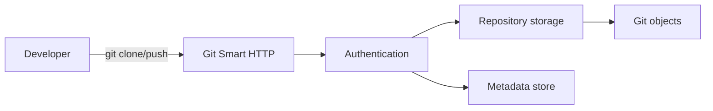
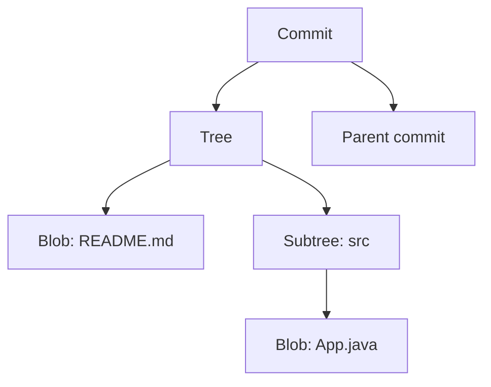
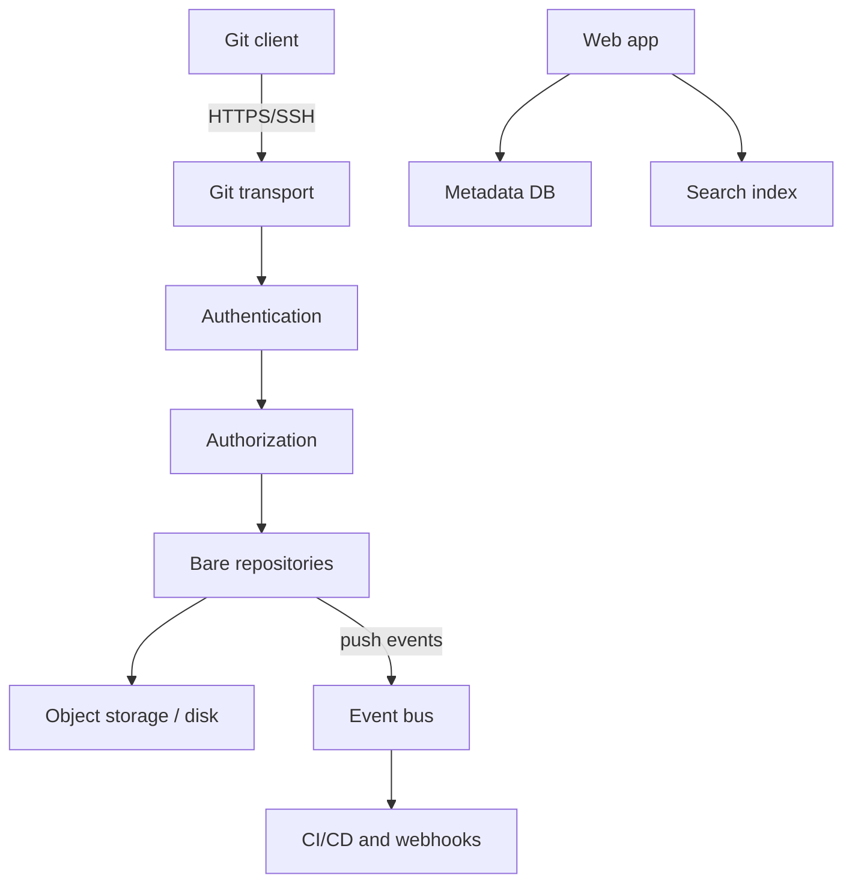
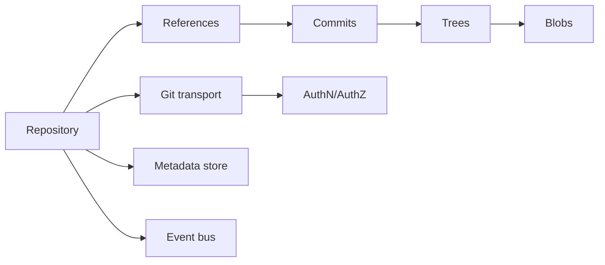

# Build Your Own Github

## Blogs and websites


## Medium


## Youtube

- [Build Your Own Github | Git Server Setup](https://www.youtube.com/watch?v=jp83Gbn4Wq8)


## Theory

### Topics Covered

1. [Introduction](#introduction)
2. [Git Internals](#git-internals)
3. [A Git Server Architecture](#a-git-server-architecture)
4. [Authentication and Authorization](#authentication-and-authorization)
5. [Characteristics](#characteristics)
6. [Pros](#pros)
7. [Cons](#cons)
8. [Use Cases](#use-cases)
9. [Components](#components)
10. [Patterns](#patterns)
11. [Benefits](#benefits)
12. [Challenges](#challenges)
13. [Best Practices](#best-practices)
14. [When to Use](#when-to-use)
15. [Java and Spring Boot Examples](#java-and-spring-boot-examples)

---

### Introduction

Building a GitHub-like service means providing a Git server plus the collaboration features around it: repositories, users, authentication, access control, pull requests, issues, and CI/CD integrations. The core of the product is a remote Git repository that users can clone, push, and pull.



**Real-life use cases**

- **Source code hosting**: store and version application code.
- **Internal Git server**: keep proprietary code on-premises.
- **Documentation and wikis**: version collaborative documents.
- **Package and artifact versioning**: use Git as a source of truth.
- **CI/CD trigger**: notify pipelines when code changes.

**Interview questions and answers**

- **Q: What is the difference between Git and GitHub?**
  **A:** Git is the distributed version-control system; GitHub is a hosting service that adds users, access control, and collaboration features around Git repositories.

- **Q: What transport protocols does Git support?**
  **A:** Git supports local, SSH, HTTP(S), and the older Git protocol.

- **Q: What does a bare repository mean?**
  **A:** A repository without a working tree, used as the remote copy that clients push to and pull from.

---

### Git Internals

Git stores content as objects addressed by SHA-1 (and now SHA-256 where configured) hashes. Understanding these objects is essential for building a Git server.

**Object types:**

- **Blob**: file content.
- **Tree**: directory structure mapping names to blobs and subtrees.
- **Commit**: a snapshot pointing to a tree, parent commits, author, and message.
- **Tag**: a named reference, usually pointing to a commit.

**References:**

- **Branches**: pointers under `refs/heads/`.
- **Tags**: pointers under `refs/tags/`.
- **HEAD**: the currently checked-out commit.



**Interview questions and answers**

- **Q: How does Git identify objects?**
  **A:** Each object is named by the hash of its content, which provides integrity and content addressing.

- **Q: Why are Git commits immutable?**
  **A:** The commit hash depends on its content and history, so changing anything invalidates the hash.

- **Q: What is a packfile?**
  **A:** A compressed format that stores many Git objects efficiently, using deltas to reduce space.

---

### A Git Server Architecture

A GitHub-like service layers collaboration features on top of a remote Git repository.

**Core layers:**

- **Transport**: SSH and Git Smart HTTP endpoints.
- **Authentication**: verify user identity and credentials.
- **Authorization**: enforce read/write permissions per repository.
- **Repository storage**: bare repositories on disk or object storage.
- **Metadata store**: users, organizations, repositories, and permissions.
- **Web application**: browsing, pull requests, issues, and search.
- **Event bus**: notify CI, webhooks, and integrations.



**Interview questions and answers**

- **Q: Why separate the metadata store from Git object storage?**
  **A:** Repository metadata such as users, issues, and permissions has different access and scaling patterns than Git objects.

- **Q: What is Git Smart HTTP?**
  **A:** An HTTP protocol where Git uses standard POST requests to exchange objects with a server, making it firewall-friendly.

- **Q: How do webhooks fit into a Git server?**
  **A:** The server emits events on pushes and pull requests so external systems such as CI can react asynchronously.

---

### Authentication and Authorization

A Git server must identify users and control what they can do.

**Authentication methods:**

- SSH keys for command-line access.
- Personal access tokens for HTTPS and APIs.
- OAuth and OpenID Connect for web sign-in.
- Deploy keys for repository-scoped machine access.

**Authorization models:**

- Repository read/write/admin permissions.
- Organization and team membership.
- Branch protection rules.
- Signed commit verification.


**Interview questions and answers**

- **Q: What is a personal access token?**
  **A:** A credential that authenticates API and HTTPS Git access without exposing the user's password.

- **Q: How does SSH key authentication work?**
  **A:** The user registers a public key; on connection, the server verifies a signature made with the corresponding private key.

- **Q: What are branch protection rules?**
  **A:** Policies that require reviews, checks, and signed commits before a branch can be merged.

---

### Characteristics

- **Distributed**
  Every clone contains the full history and can operate offline.

- **Content-addressed**
  Objects are named by content hashes.

- **Immutable**
  Git history cannot be altered without rewriting hashes.

- **Versioned**
  Every commit is a point-in-time snapshot.

- **Concurrent**
  Multiple developers can work on branches independently.

- **Merge-oriented**
  Pull requests and merges integrate parallel work.

- **Permission-sensitive**
  Access control governs repository operations.

- **Event-driven**
  Pushes trigger hooks, CI, and integrations.

- **Auditable**
  History and metadata provide a trail of changes.

---

### Pros

- **Full history**
  Complete revision tracking and blame.

- **Branching and merging**
  Parallel development with lightweight branches.

- **Offline capability**
  Local commits and history work without a server.

- **Integrity**
  Content hashing detects corruption and tampering.

- **Collaboration**
  Pull requests and reviews centralize code quality.

- **Automation**
  Hooks and CI/CD enable continuous delivery.

- **Provenance**
  Signed commits establish authorship.

- **Ecosystem**
  Rich tooling and integrations.

---

### Cons

- **Complexity**
  Git's model has a steep learning curve.

- **Large repositories**
  Very large histories and binaries can degrade performance.

- **Storage growth**
  Objects and packfiles accumulate over time.

- **Access control complexity**
  Fine-grained permissions require careful management.

- **Concurrency conflicts**
  Merges and rebases can conflict.

- **Operational overhead**
  Hosting a reliable, secure Git server is nontrivial.

- **History rewriting risks**
  Force pushes and rebases can disrupt collaborators.

- **Security surface**
  Credentials, hooks, and CI integrations expand attack surface.

---

### Use Cases

- **Application source control**
  Track code across teams.

- **Infrastructure as code**
  Version Terraform and Kubernetes manifests.

- **Documentation**
  Version wikis and technical documents.

- **Configuration management**
  Store application and environment configs.

- **Release management**
  Tag versions and manage release branches.

- **Open source collaboration**
  Host public projects with issues and pull requests.

- **CI/CD**
  Trigger pipelines on pushes and merges.

- **Data versioning**
  Version datasets and machine learning artifacts.

---

### Components

- **Repository**
  A collection of commits, trees, blobs, and references.

- **Commit**
  An immutable snapshot of the repository.

- **Tree**
  A directory representation at a point in time.

- **Blob**
  File content.

- **Reference**
  A named pointer to a commit or tag.

- **Git transport**
  SSH or HTTP(S) endpoints.

- **Authentication provider**
  Verifies identities.

- **Authorization service**
  Enforces permissions.

- **Metadata database**
  Stores users, organizations, and repository settings.

- **Event bus**
  Distributes push and PR events.



---

### Patterns

- **Smart HTTP transport**
  Serve Git operations over HTTPS.

- **SSH transport**
  Serve Git operations over SSH with key authentication.

- **Pull request workflow**
  Review and merge changes through a controlled process.

- **Branch protection**
  Enforce reviews and checks before merge.

- **Fork-and-PR**
  Contribute to public projects without direct write access.

- **Trunk-based development**
  Short-lived branches and frequent merges.

- **Git hooks**
  Run scripts on push, commit, and merge events.

- **Webhook notifications**
  Emit events to CI and external systems.

---

### Benefits

- **Reliable history**
  Content addressing and immutability protect data.

- **Effective collaboration**
  Branches and pull requests support parallel work.

- **Automation**
  CI/CD hooks accelerate delivery.

- **Accountability**
  History and signed commits establish authorship.

- **Portability**
  Repositories are self-contained and easy to migrate.

- **Disaster recovery**
  Every clone is a full backup.

- **Scalability**
  A well-designed server can host many repositories and users.

---

### Challenges

- **Scaling object storage**
  Millions of objects and large packfiles need efficient storage.

- **Handling large files**
  Binary files bloat history and slow operations.

- **Search performance**
  Searching code across many repositories is expensive.

- **Permission management**
  Teams and organizations need fine-grained access control.

- **Concurrency**
  Simultaneous pushes and ref updates need locking.

- **Security**
  Credentials, hooks, and CI secrets must be protected.

- **Availability**
  A source-control outage blocks the whole team.

- **Migration**
  Moving repositories with history requires care.

---

### Best Practices

- **Use bare repositories for remotes**
  Serve bare repos to avoid working-tree conflicts.

- **Authenticate with keys or tokens**
  Avoid plaintext passwords for Git access.

- **Enforce least privilege**
  Grant minimal repository permissions.

- **Use branch protection**
  Require reviews and passing checks before merge.

- **Compress with packfiles**
  Run garbage collection to reduce storage.

- **Use Git LFS for large files**
  Keep binaries out of the main history.

- **Emit webhook events**
  Integrate CI/CD asynchronously.

- **Back up repositories**
  Replicate to multiple locations.

- **Monitor repository size and health**
  Detect corruption and runaway growth.

- **Require signed commits**
  Establish code provenance.

---

### When to Use

- **Use a self-hosted Git server when** code must stay on-premises.
- **Use a Git server when** teams need collaboration and review workflows.
- **Use Git when** full version history and branching are required.
- **Use a Git server when** CI/CD should trigger on code changes.
- **Use a Git server when** infrastructure and docs need versioning.

**Prefer a managed hosting service when**

- Operational overhead outweighs the need for control.
- The team wants mature search, CI, and collaboration features out of the box.
- Compliance does not require self-hosting.

---

### Java and Spring Boot Examples

#### 1. Repository metadata service

```java
import org.springframework.stereotype.Service;

@Service
public class RepositoryService {

    public Repository create(String name, String owner) {
        return new Repository(name, owner);
    }

    public String cloneUrl(Repository repository) {
        return "https://git.example.com/" + repository.owner() + "/" + repository.name() + ".git";
    }

    public record Repository(String name, String owner) {
    }
}
```

#### 2. Access control check

```java
import org.springframework.stereotype.Service;

import java.util.Set;

@Service
public class AccessControlService {

    public boolean canRead(Set<String> userRoles) {
        return userRoles.contains("reader") || userRoles.contains("writer") || userRoles.contains("admin");
    }

    public boolean canWrite(Set<String> userRoles) {
        return userRoles.contains("writer") || userRoles.contains("admin");
    }

    public boolean canAdmin(Set<String> userRoles) {
        return userRoles.contains("admin");
    }
}
```

#### 3. Webhook event publisher

```java
import org.springframework.context.ApplicationEventPublisher;
import org.springframework.stereotype.Service;

@Service
public class PushEventPublisher {

    private final ApplicationEventPublisher publisher;

    public PushEventPublisher(ApplicationEventPublisher publisher) {
        this.publisher = publisher;
    }

    public void publish(PushEvent event) {
        publisher.publishEvent(event);
    }

    public record PushEvent(String repository, String branch, String commit) {
    }
}
```

#### 4. Git object hash helper

```java
import java.nio.charset.StandardCharsets;
import java.security.MessageDigest;
import java.util.HexFormat;

public final class GitObjectHasher {

    private GitObjectHasher() {
    }

    public static String sha1(String content) {
        try {
            MessageDigest digest = MessageDigest.getInstance("SHA-1");
            byte[] hash = digest.digest(content.getBytes(StandardCharsets.UTF_8));
            return HexFormat.of().formatHex(hash);
        } catch (Exception e) {
            throw new IllegalStateException("Unable to hash Git object", e);
        }
    }
}
```

**Interview questions and answers**

- **Q: What does it mean for Git to be distributed?**
  **A:** Every clone is a full repository with complete history, so work can continue offline and any clone can act as a backup.

- **Q: Why are Git objects content-addressed?**
  **A:** Naming objects by content hash guarantees integrity and enables deduplication of identical content.

- **Q: How does a Git server know which repository a request targets?**
  **A:** The request path identifies the repository, and the server uses that to load the corresponding bare repository and enforce permissions.

- **Q: What is the role of a bare repository on a server?**
  **A:** It stores the Git history and refs without a working tree, acting as the canonical remote that clients push to and fetch from.
