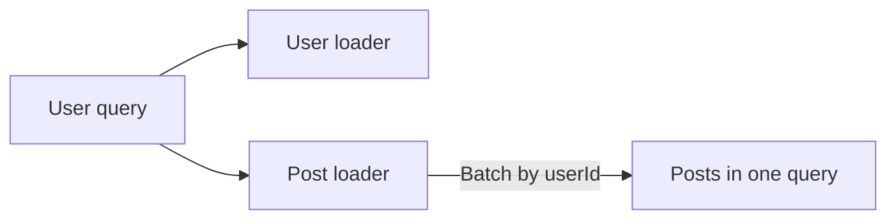
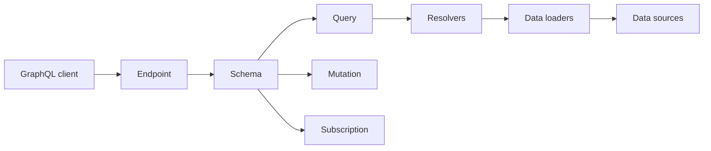

# GraphQL

## Blogs and websites


## Medium


## Youtube


## Theory

### Topics Covered

1. [Introduction](#introduction)
2. [Schema and Types](#schema-and-types)
3. [Resolvers and Data Loading](#resolvers-and-data-loading)
4. [Subscriptions](#subscriptions)
5. [Characteristics](#characteristics)
6. [Pros](#pros)
7. [Cons](#cons)
8. [Use Cases](#use-cases)
9. [Components](#components)
10. [Patterns](#patterns)
11. [Benefits](#benefits)
12. [Challenges](#challenges)
13. [Best Practices](#best-practices)
14. [When to Use](#when-to-use)
15. [Java and Spring Boot Examples](#java-and-spring-boot-examples)

---

### Introduction

GraphQL is a query language and runtime that lets clients request exactly the data they need from a single endpoint. The server defines a schema, and clients specify which fields to fetch, avoiding over-fetching and under-fetching.

```mermaid
flowchart LR
    Client[Client] -->|GraphQL query| Endpoint[/graphql]
    Endpoint --> Schema[Schema]
    Schema --> Resolver[Resolvers]
    Resolver --> Data[Data sources]
```

**Real-life use cases**

- **Mobile apps**: reduce bandwidth with precise queries.
- **Aggregation APIs**: combine many services behind one endpoint.
- **Dashboards**: fetch multiple resources in one request.
- **E-commerce**: query product details, reviews, and inventory.
- **Public APIs**: let consumers shape responses.

**Interview questions and answers**

- **Q: What is GraphQL?**
  **A:** A query language and runtime that allows clients to request exactly the fields they need from a single endpoint.

- **Q: How does GraphQL prevent over-fetching?**
  **A:** The client specifies the exact fields, and the server returns only those fields.

- **Q: What is the role of a schema?**
  **A:** It defines types and operations, serving as the contract between clients and the server.

---

### Schema and Types

The schema is the contract. It defines queries, mutations, subscriptions, and object types.

```graphql
type Query {
  user(id: ID!): User
}

type User {
  id: ID!
  name: String!
  email: String!
  posts: [Post!]!
}

type Post {
  id: ID!
  title: String!
}
```

**Core types:**

- **Scalars**: `Int`, `Float`, `String`, `Boolean`, `ID`.
- **Objects**: named fields.
- **Enums**: fixed sets of values.
- **Interfaces and unions**: abstract types.
- **Lists and non-null**: shape and nullability.

**Interview questions and answers**

- **Q: What is a non-null field?**
  **A:** A field marked with `!` that guarantees a non-null value.

- **Q: What is the difference between a query and a mutation?**
  **A:** Queries read data; mutations change data. Mutations also execute serially.

- **Q: What is an interface in GraphQL?**
  **A:** An abstract type that defines fields shared by multiple object types.

---

### Resolvers and Data Loading

Resolvers are functions that fetch data for each field.

```java
public User user(String id) {
    return userRepository.findById(id);
}

public List<Post> posts(User user) {
    return postRepository.findByUserId(user.id());
}
```

**The N+1 problem:**

When each `post` field fetches from the database separately, one user query can trigger many queries. Data loaders batch and cache those requests.



**Interview questions and answers**

- **Q: What is the N+1 problem in GraphQL?**
  **A:** Resolving a list of parent objects triggers one query per child relationship, causing many round trips.

- **Q: How do data loaders solve N+1?**
  **A:** They batch requests for the same field and cache results within a request.

- **Q: What is a root resolver?**
  **A:** The resolver for a top-level query, mutation, or subscription field.

---

### Subscriptions

Subscriptions enable real-time updates over a persistent connection, usually WebSocket or SSE.

```graphql
subscription {
  orderCreated {
    id
    status
  }
}
```

**When to use subscriptions:**

- Live notifications.
- Chat messages.
- Streaming dashboards.
- Real-time collaboration.

**Interview questions and answers**

- **Q: How do GraphQL subscriptions work?**
  **A:** The client subscribes to a field, and the server pushes events when the underlying data changes.

- **Q: What transport do subscriptions typically use?**
  **A:** WebSocket or server-sent events, depending on the implementation.

- **Q: What is the difference between subscriptions and queries?**
  **A:** Queries return once; subscriptions remain open and stream updates over time.

---

### Characteristics

- **Declarative**
  Clients describe the data they need.

- **Schema-driven**
  Types define the API contract.

- **Single endpoint**
  One endpoint serves all operations.

- **Hierarchical**
  Queries mirror the shape of the data.

- **Strongly typed**
  The schema is introspectable and validated.

- **Flexible**
  Clients evolve queries without server changes.

- **Real-time capable**
  Subscriptions stream updates.

- **Resolver-based**
  Each field has a function that fetches data.

---

### Pros

- **No over-fetching**
  Clients receive exactly the requested fields.

- **No under-fetching**
  Related data can be fetched in one request.

- **Strong typing**
  Schema catches errors at development time.

- **Single endpoint**
  Simplifies API routing.

- **Introspection**
  Clients can discover the schema.

- **Versionless evolution**
  Fields can be added without breaking existing queries.

- **Great for mobile**
  Reduced payloads save bandwidth.

- **Aggregation**
  One GraphQL layer can combine many services.

---

### Cons

- **Complexity for simple cases**
  Overkill for basic CRUD APIs.

- **Caching harder**
  Responses are query-shaped, not URL-shaped.

- **File upload handling**
  Requires multipart extensions or separate endpoints.

- **Learning curve**
  Schema and resolver concepts are new to teams.

- **Query cost unpredictability**
  Deep or wide queries can be expensive.

- **N+1 risk**
  Naive resolvers cause many database calls.

- **Security**
  Rate limiting and authorization are harder.

- **Tooling maturity**
  Some ecosystems are less mature than REST.

---

### Use Cases

- **Mobile and web clients**
  Fetch tailored payloads.

- **API aggregation**
  Combine multiple backends behind one endpoint.

- **Complex data relationships**
  Query nested resources efficiently.

- **Dashboards**
  Gather many data points in one request.

- **Public APIs**
  Let consumers choose fields.

- **Real-time features**
  Use subscriptions for live updates.

- **E-commerce**
  Fetch product details, reviews, and pricing.

- **Content platforms**
  Serve varied content models.

---

### Components

- **Schema**
  Defines types and operations.

- **Query**
  A read operation.

- **Mutation**
  A write operation.

- **Subscription**
  A real-time stream.

- **Resolver**
  Fetches data for a field.

- **Data loader**
  Batches and caches field fetches.

- **Type system**
  Scalars, objects, interfaces, and unions.

- **Execution engine**
  Validates and runs operations.

- **Client**
  Sends queries and manages cache.



---

### Patterns

- **Schema stitching**
  Combine multiple schemas into one.

- **Federation**
  Distribute a schema across services.

- **Data loader batching**
  Solve N+1 queries.

- **Relay pagination**
  Cursor-based pagination for lists.

- **Query depth limiting**
  Prevent expensive nested queries.

- **Persisted queries**
  Send query hashes instead of full text.

- **Field-level authorization**
  Enforce permissions in resolvers.

- **Error union types**
  Model errors as part of the schema.

---

### Benefits

- **Efficiency**
  Fewer bytes and requests.

- **Developer experience**
  Strong types and introspection.

- **Flexibility**
  Clients evolve independently.

- **Reduced versioning**
  Additive schema changes avoid API versions.

- **Aggregation**
  One endpoint for many services.

- **Real-time support**
  Subscriptions are built in.

- **Consistency**
  Schema is a single source of truth.

- **Faster iteration**
  Clients can experiment without server changes.

---

### Challenges

- **Caching**
  Query-shaped responses complicate HTTP caching.

- **Performance**
  Deep queries and N+1 issues.

- **Security**
  Rate limiting, authorization, and query cost.

- **Error handling**
  Partial errors differ from REST status codes.

- **File uploads**
  Not native to the spec.

- **Complexity**
  Resolver and schema design can grow intricate.

- **Monitoring**
  Tracing field-level performance is harder.

- **Team learning**
  Requires a shift from REST mental models.

---

### Best Practices

- **Design the schema first**
  Use the schema as the API contract.

- **Use data loaders**
  Avoid N+1 queries.

- **Limit query depth and complexity**
  Prevent expensive operations.

- **Enforce field-level authorization**
  Check permissions in resolvers.

- **Use cursor-based pagination**
  Follow Relay-style connections.

- **Model errors explicitly**
  Use error types or unions.

- **Cache persisted queries**
  Reduce payload and improve performance.

- **Monitor resolver latency**
  Trace slow fields.

- **Version by adding fields**
  Avoid breaking changes.

- **Validate all input**
  Apply input types and validation.

---

### When to Use

- **Use GraphQL when** clients need flexible, precise queries.
- **Use GraphQL when** multiple client types consume the API.
- **Use GraphQL when** aggregating many services.
- **Use GraphQL when** the data model is highly relational.
- **Use GraphQL when** real-time subscriptions are needed.

**Prefer REST when**

- The API is simple CRUD.
- Caching is a primary requirement.
- The team already has REST expertise.
- Browsers and CDNs are the main consumers.

---

### Java and Spring Boot Examples

#### 1. GraphQL schema

```graphql
type Query {
  user(id: ID!): User
}

type Mutation {
  createUser(name: String!, email: String!): User
}

type User {
  id: ID!
  name: String!
  email: String!
}
```

#### 2. Query resolver

```java
import org.springframework.graphql.data.method.annotation.Argument;
import org.springframework.graphql.data.method.annotation.QueryMapping;
import org.springframework.stereotype.Controller;

@Controller
public class UserController {

    private final UserRepository userRepository;

    public UserController(UserRepository userRepository) {
        this.userRepository = userRepository;
    }

    @QueryMapping
    public User user(@Argument String id) {
        return userRepository.findById(id);
    }

    public record User(String id, String name, String email) {}
}
```

#### 3. Mutation resolver

```java
import org.springframework.graphql.data.method.annotation.Argument;
import org.springframework.graphql.data.method.annotation.MutationMapping;
import org.springframework.stereotype.Controller;

@Controller
public class UserMutationController {

    private final UserRepository userRepository;

    public UserMutationController(UserRepository userRepository) {
        this.userRepository = userRepository;
    }

    @MutationMapping
    public User createUser(@Argument String name, @Argument String email) {
        return userRepository.create(name, email);
    }
}
```

#### 4. Repository service

```java
import org.springframework.stereotype.Service;

import java.util.Map;
import java.util.concurrent.ConcurrentHashMap;
import java.util.concurrent.atomic.AtomicLong;

@Service
public class UserRepository {

    private final Map<String, UserController.User> users = new ConcurrentHashMap<>();
    private final AtomicLong sequence = new AtomicLong();

    public UserController.User findById(String id) {
        return users.get(id);
    }

    public UserController.User create(String name, String email) {
        String id = String.valueOf(sequence.incrementAndGet());
        UserController.User user = new UserController.User(id, name, email);
        users.put(id, user);
        return user;
    }
}
```

**Interview questions and answers**

- **Q: How does GraphQL differ from REST?**
  **A:** GraphQL uses a single endpoint and lets clients select fields; REST uses multiple endpoints with server-defined responses.

- **Q: What is the N+1 problem and how do you avoid it?**
  **A:** It is repeated per-object queries for nested fields, avoided by using data loaders that batch and cache requests.

- **Q: Why is caching harder in GraphQL?**
  **A:** Responses depend on the query shape, so URL-based caching does not map directly.

- **Q: How do you secure a GraphQL API?**
  **A:** Authenticate before execution, authorize per field, limit query depth and complexity, and rate limit clients.
