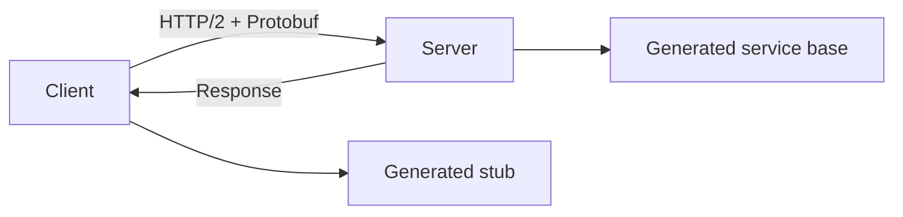
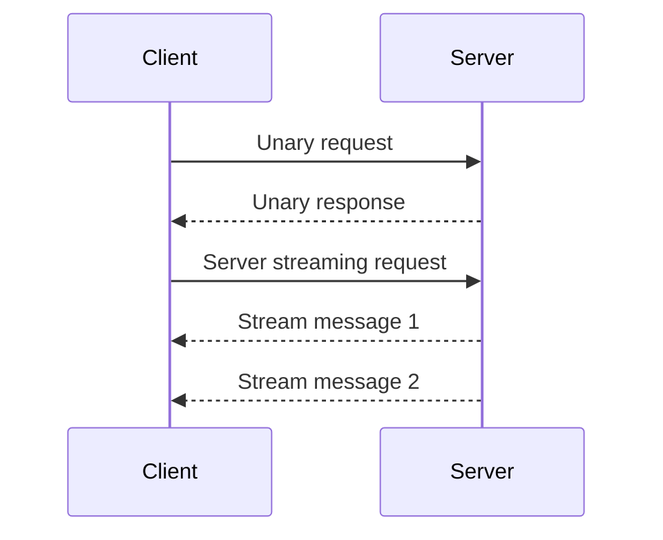
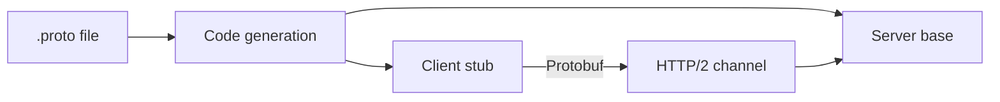

# gRPC (Google Remote Procedure Call)

## Blogs and websites


## Medium


## Youtube


## Theory

### Topics Covered

1. [Introduction](#introduction)
2. [Protocol Buffers](#protocol-buffers)
3. [Communication Types](#communication-types)
4. [REST vs gRPC](#rest-vs-grpc)
5. [Characteristics](#characteristics)
6. [Pros](#pros)
7. [Cons](#cons)
8. [Use Cases](#use-cases)
9. [Components](#components)
10. [Patterns](#patterns)
11. [Benefits](#benefits)
12. [Challenges](#challenges)
13. [Best Practices](#best-practices)
14. [When to Use](#when-to-use)
15. [Java and Spring Boot Examples](#java-and-spring-boot-examples)

---

### Introduction

gRPC is a high-performance RPC framework that uses Protocol Buffers for serialization and HTTP/2 for transport. It is designed for service-to-service communication with strongly typed contracts, low latency, and streaming support.



**Real-life use cases**

- **Microservices communication**: connect internal services.
- **Real-time streaming**: push data continuously.
- **Polyglot environments**: generate clients in many languages.
- **Mobile and IoT**: reduce bandwidth with binary payloads.
- **High-performance APIs**: serve low-latency endpoints.

**Interview questions and answers**

- **Q: What is gRPC?**
  **A:** A high-performance RPC framework that uses Protocol Buffers and HTTP/2.

- **Q: Why is gRPC faster than JSON over HTTP/1.1?**
  **A:** Binary serialization is smaller, and HTTP/2 multiplexes streams over one connection.

- **Q: How are gRPC APIs defined?**
  **A:** With Protocol Buffer `.proto` files that define messages and services.

---

### Protocol Buffers

Protocol Buffers (Protobuf) is a binary serialization format with a schema.

```
syntax = "proto3";

service UserService {
  rpc GetUser (GetUserRequest) returns (User);
}

message GetUserRequest {
  string id = 1;
}

message User {
  string id = 1;
  string name = 2;
  string email = 3;
}
```

**Why a schema matters:**

- Strongly typed contracts.
- Backward-compatible field evolution.
- Code generation for many languages.
- Compact binary wire format.

**Interview questions and answers**

- **Q: How does Protobuf differ from JSON?**
  **A:** Protobuf is binary, schema-driven, and smaller; JSON is text, self-describing, and human-readable.

- **Q: How do you evolve a Protobuf schema safely?**
  **A:** Add new fields with new numbers, avoid renumbering, and reserve removed field numbers.

- **Q: What is the role of field numbers?**
  **A:** They identify fields on the wire, so they must remain stable for backward compatibility.

---

### Communication Types

gRPC supports four RPC styles.

- **Unary**: one request, one response.
- **Server streaming**: one request, many responses.
- **Client streaming**: many requests, one response.
- **Bidirectional streaming**: many requests and responses.



**Interview questions and answers**

- **Q: When would you use server streaming?**
  **A:** When the server needs to push a sequence of results, such as live updates or large result sets.

- **Q: What is bidirectional streaming?**
  **A:** Both client and server send multiple messages over a single call, suitable for chat or telemetry.

- **Q: How does HTTP/2 enable these streaming types?**
  **A:** HTTP/2 multiplexes independent streams over one connection, allowing concurrent and long-lived message flows.

---

### REST vs gRPC

**REST:**

- Human-readable JSON.
- Wider adoption.
- Browser-friendly.
- Uses HTTP methods and status codes.

**gRPC:**

- Binary Protocol Buffers.
- Smaller, faster payloads.
- Strongly typed contracts.
- Streaming built-in.
- HTTP/2 multiplexing.

| Aspect | REST | gRPC |
|--------|------|------|
| **Payload** | JSON text | Protobuf binary |
| **Transport** | HTTP/1.1 or HTTP/2 | HTTP/2 |
| **Contract** | Loose | Strongly typed |
| **Streaming** | Limited | First-class |
| **Browser** | Native | Requires grpc-web |

**Interview questions and answers**

- **Q: Why is gRPC better for service-to-service?**
  **A:** Strong types, binary payloads, and streaming reduce latency, bandwidth, and integration errors.

- **Q: Why is REST still common?**
  **A:** It is human-readable, browser-native, and universally supported by tooling and infrastructure.

- **Q: How do browsers call gRPC?**
  **A:** Through grpc-web, which adapts gRPC to browser-compatible HTTP.

---

### Characteristics

- **Binary serialization**
  Uses Protocol Buffers for compact messages.

- **HTTP/2-based**
  Multiplexes streams and supports bidirectional flow.

- **Strongly typed**
  Schemas define messages and services.

- **Contract-first**
  Clients and servers are generated from `.proto` files.

- **Streaming-native**
  Four RPC styles including streaming.

- **Language-neutral**
  Code generators support many languages.

- **Low latency**
  Efficient transport and serialization.

- **Deadline-aware**
  Calls carry deadlines and cancellation.

---

### Pros

- **High performance**
  Binary payloads and HTTP/2 reduce overhead.

- **Small payloads**
  Protobuf is more compact than JSON.

- **Strong contracts**
  Types catch errors at build time.

- **Code generation**
  Reduces boilerplate across languages.

- **Built-in streaming**
  Supports unary and streaming RPCs.

- **Language interoperability**
  Polyglot services share schemas.

- **Deadlines and cancellation**
  Built into the protocol.

- **Great for microservices**
  Efficient service-to-service calls.

---

### Cons

- **Not human-readable**
  Debugging requires tooling.

- **Browser support**
  Requires grpc-web and extra setup.

- **Learning curve**
  Protobuf and code generation add complexity.

- **Tooling overhead**
  `.proto` files must be generated and versioned.

- **Limited HTTP status mapping**
  Errors map to a smaller set of gRPC status codes.

- **No native JSON**
  JSON transcoding needs configuration.

- **Caching harder**
  Binary messages are less cache-friendly in CDNs.

- **Schema evolution discipline**
  Field numbers and compatibility require care.

---

### Use Cases

- **Microservices communication**
  Connect internal services efficiently.

- **Real-time streaming**
  Push events, logs, or telemetry.

- **Mobile and IoT**
  Reduce bandwidth and latency.

- **Polyglot systems**
  Generate clients in multiple languages.

- **High-performance APIs**
  Serve latency-sensitive endpoints.

- **Internal RPC**
  Replace REST for service-to-service.

- **Video and data streaming**
  Stream chunks continuously.

- **Cloud control planes**
  Efficiently connect infrastructure components.

---

### Components

- **`.proto` file**
  Defines services and messages.

- **Message**
  A structured data type.

- **Service**
  A set of RPC methods.

- **Generated stub**
  Client-side proxy.

- **Generated service base**
  Server-side implementation skeleton.

- **Channel**
  A logical connection to a server.

- **Deadline**
  A time limit for a call.

- **Metadata**
  Key-value headers for a call.

- **Codec**
  Serializes and deserializes Protobuf messages.



---

### Patterns

- **Unary RPC**
  Simple request-response.

- **Server streaming**
  Stream responses for a single request.

- **Client streaming**
  Stream requests for a single response.

- **Bidirectional streaming**
  Full-duplex message flow.

- **Deadline propagation**
  Pass timeouts across services.

- **Metadata propagation**
  Carry tracing and auth context.

- **Load balancing**
  Distribute gRPC calls across replicas.

- **Health checking**
  Expose a standard health service.

- **Reflection**
  Expose service definitions for tooling.

---

### Benefits

- **Performance**
  Lower latency and bandwidth.

- **Type safety**
  Contracts reduce integration bugs.

- **Productivity**
  Code generation removes boilerplate.

- **Interoperability**
  One schema serves many languages.

- **Streaming**
  First-class support for real-time data.

- **Scalability**
  Multiplexed HTTP/2 connections handle many calls.

- **Reliability**
  Deadlines and cancellation prevent hangs.

- **Maintainability**
  Central schema is a single source of truth.

---

### Challenges

- **Debugging**
  Binary messages need tooling.

- **Browser access**
  Requires grpc-web.

- **Schema governance**
  Protobuf evolution needs discipline.

- **Tooling setup**
  Build integration for code generation.

- **Error mapping**
  gRPC status codes differ from HTTP.

- **Load balancing**
  HTTP/2 connections complicate simple L7 balancing.

- **Caching**
  CDN and gateway caching is harder.

- **Team learning**
  Protobuf and gRPC concepts are new to many.

---

### Best Practices

- **Define contracts first**
  Keep `.proto` files as the source of truth.

- **Version schemas carefully**
  Add fields and reserve removed numbers.

- **Use deadlines**
  Set and propagate deadlines on every call.

- **Propagate metadata**
  Carry trace IDs and auth context.

- **Implement health checks**
  Use the standard gRPC health service.

- **Use streaming only when needed**
  Prefer unary for simple calls.

- **Enable reflection for tooling**
  Expose service definitions in development.

- **Handle cancellation**
  Respect client cancellation and deadlines.

- **Secure with TLS**
  Encrypt gRPC traffic.

- **Load balance properly**
  Use client-side or proxy load balancing for HTTP/2.

---

### When to Use

- **Use gRPC when** microservices need high-performance RPC.
- **Use gRPC when** strong contracts and code generation matter.
- **Use gRPC when** streaming is required.
- **Use gRPC when** building polyglot systems.
- **Use gRPC when** bandwidth and latency are critical.

**Prefer REST or GraphQL when**

- Browsers consume the API directly.
- Human-readable debugging matters.
- A broad ecosystem of tools and CDN caching is required.
- The team is unfamiliar with Protobuf and gRPC.

---

### Java and Spring Boot Examples

#### 1. Proto definition

```protobuf
syntax = "proto3";

package example.user;

option java_multiple_files = true;

service UserService {
  rpc GetUser (GetUserRequest) returns (UserResponse);
}

message GetUserRequest {
  string id = 1;
}

message UserResponse {
  string id = 1;
  string name = 2;
}
```

#### 2. gRPC service implementation

```java
import example.user.GetUserRequest;
import example.user.UserResponse;
import example.user.UserServiceGrpc;
import io.grpc.stub.StreamObserver;
import org.springframework.stereotype.Service;

@Service
public class UserGrpcService extends UserServiceGrpc.UserServiceImplBase {

    @Override
    public void getUser(GetUserRequest request, StreamObserver<UserResponse> responseObserver) {
        UserResponse response = UserResponse.newBuilder()
                .setId(request.getId())
                .setName("Sample User")
                .build();
        responseObserver.onNext(response);
        responseObserver.onCompleted();
    }
}
```

#### 3. gRPC client service

```java
import example.user.GetUserRequest;
import example.user.UserResponse;
import example.user.UserServiceGrpc;
import io.grpc.ManagedChannel;
import io.grpc.ManagedChannelBuilder;
import org.springframework.beans.factory.annotation.Value;
import org.springframework.stereotype.Service;

@Service
public class UserGrpcClient {

    private final UserServiceGrpc.UserServiceBlockingStub stub;

    public UserGrpcClient(@Value("${app.grpc.user-service}") String target) {
        ManagedChannel channel = ManagedChannelBuilder.forTarget(target)
                .usePlaintext()
                .build();
        this.stub = UserServiceGrpc.newBlockingStub(channel);
    }

    public UserResponse getUser(String id) {
        return stub.getUser(GetUserRequest.newBuilder().setId(id).build());
    }
}
```

#### 4. Server streaming handler

```java
import example.user.UserResponse;
import example.user.UserServiceGrpc;
import io.grpc.stub.StreamObserver;
import org.springframework.stereotype.Service;

@Service
public class UserStreamGrpcService extends UserServiceGrpc.UserServiceImplBase {

    @Override
    public void streamUsers(example.user.StreamUsersRequest request,
                            StreamObserver<UserResponse> responseObserver) {
        for (int i = 0; i < 10; i++) {
            responseObserver.onNext(UserResponse.newBuilder()
                    .setId("user-" + i)
                    .setName("User " + i)
                    .build());
        }
        responseObserver.onCompleted();
    }
}
```

**Interview questions and answers**

- **Q: How does gRPC use HTTP/2?**
  **A:** gRPC uses HTTP/2 multiplexing, headers, and flow control to support concurrent and streaming RPCs over a single connection.

- **Q: What is the advantage of Protobuf over JSON?**
  **A:** Protobuf is smaller, faster to serialize, and schema-driven, but less human-readable.

- **Q: Why are deadlines important in gRPC?**
  **A:** They bound call duration and prevent hung requests from consuming resources.

- **Q: How do you evolve a gRPC API without breaking clients?**
  **A:** Add new fields with new numbers, reserve removed numbers, and avoid changing field semantics.
