# Microservices patterns

## Blogs and websites


## Medium

- [10 microservices design patterns for better architecture](https://medium.com/capital-one-tech/10-microservices-design-patterns-for-better-architecture-befa810ca44e)
- [Top 10 Microservice Anti-Patterns](https://blog.bitsrc.io/10-microservice-anti-patterns-278bcb7f385d)
- [Saga, CDC with Transactional Inbox/Outbox](https://ishansoninitj.medium.com/saga-cdc-with-transactional-inbox-outbox-d15507868c7f)

## Youtube

- [Transactional Outbox Pattern in System Design](https://www.youtube.com/watch?v=T5pu0lH2Dwc)
- [3. Microservices Design Patterns | Part1: Introduction and Decomposition Pattern | HLD](https://www.youtube.com/watch?v=l1OCmsBnQ3g)
- [4. SAGA Pattern | Strangler Pattern | CQRS | Microservices Design Patterns | System Design](https://www.youtube.com/watch?v=qGlUKtjqaEQ)
- [In How many Microservices we should divide Monolithic System | How Many Microservices are too many?](https://www.youtube.com/watch?v=NE_LPGHYrMc)


- [Rate Limiter: Fault Tolerance in Distributed Microservices | Rate Limiter Implementation](https://www.youtube.com/watch?v=o9uCQHdh4DU)
- [Bulkhead Pattern: Fault Tolerance in Distributed Microservices](https://www.youtube.com/watch?v=Ax0ycLJvvfc)
- [Retry Pattern: Fault Tolerance in Distributed Microservices](https://www.youtube.com/watch?v=oOFnyUpUDtg)
- [Circuit Breaker : Fault Tolerance in Distributed Microservices](https://www.youtube.com/watch?v=_kCWAf8kEYI)

## Theory

### Introduction

- This topic covers the evolution from **monolithic** to **microservices** architecture, the catalog of patterns used to design, decompose, and operate microservices, and the trade-offs interviewers expect you to reason about.
- Broadly this page is organized into:
    - Monolithic vs. microservices architectures
    - Decomposition patterns (how to split a system into services)
    - Data management patterns (database per service vs. shared database)
    - The **Strangler Fig** pattern (how to migrate a monolith incrementally)
    - The **Saga** pattern (distributed transactions)
    - **CQRS** (separating reads from writes)
- This is a high-yield topic — expect **10-15 interview questions** built around these patterns in any "design a system with microservices" round.

### Monolithic Architecture

A **monolith** is a single deployable unit — one codebase, one build, one process — that contains all the modules of an application (UI, business logic, data access) bundled together.

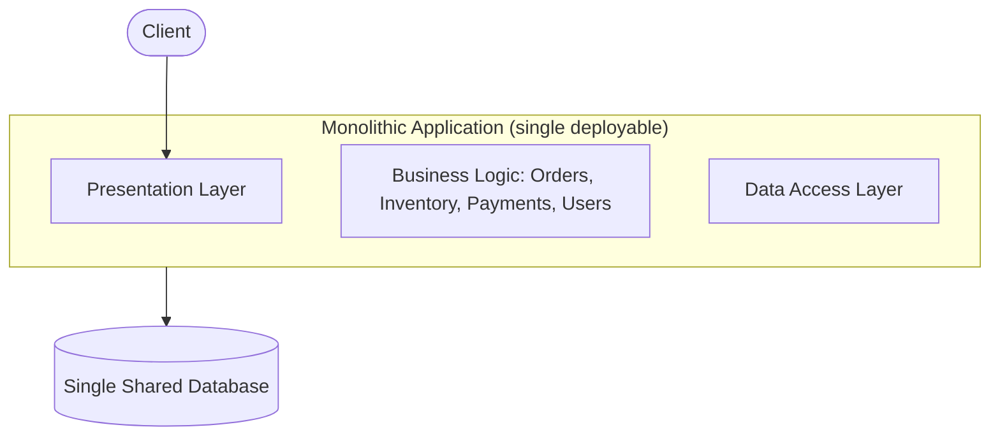

#### Disadvantages of Monolithic Architecture

- **Tight Coupling**
    - Modules share memory space and call each other directly (in-process method calls), so changing one line can ripple into unrelated components.
    - Requires testing and deploying the **entire** application for even a one-line change.
- **Difficult to Scale**
    - You cannot scale just the "checkout" module during a flash sale — you must scale (i.e. run more copies of) the whole application, wasting resources on parts that don't need it.
- **Expensive Deployments and Rollbacks**
    - A bug in one module forces a rollback of the whole binary, reverting unrelated features along with it.
    - Deployment windows grow riskier as the blast radius of every release is the entire system.
- **Large Codebase**
    - All code lives in one repository/module; onboarding new engineers and reasoning about impact analysis becomes harder as the codebase grows.
    - Build times increase, and IDEs/CI pipelines slow down.
- **Single Technology Stack**
    - The whole application is usually locked into one language/runtime, so you can't pick the best tool (e.g. Python for ML, Go for high-throughput services) per module.

> **Real-life example:** Amazon, Netflix, and Uber all started as monoliths ("Obidos" for Amazon, a Rails monolith for Netflix). As traffic and team size grew into the hundreds/thousands of engineers, a single codebase became the bottleneck — every deploy required coordinating across dozens of teams, so each company incrementally migrated to microservices using patterns like the ones below.

### Why Microservices?

Microservices decompose a monolith into a set of small, independently deployable services, each owning a narrow piece of business capability and (usually) its own datastore.

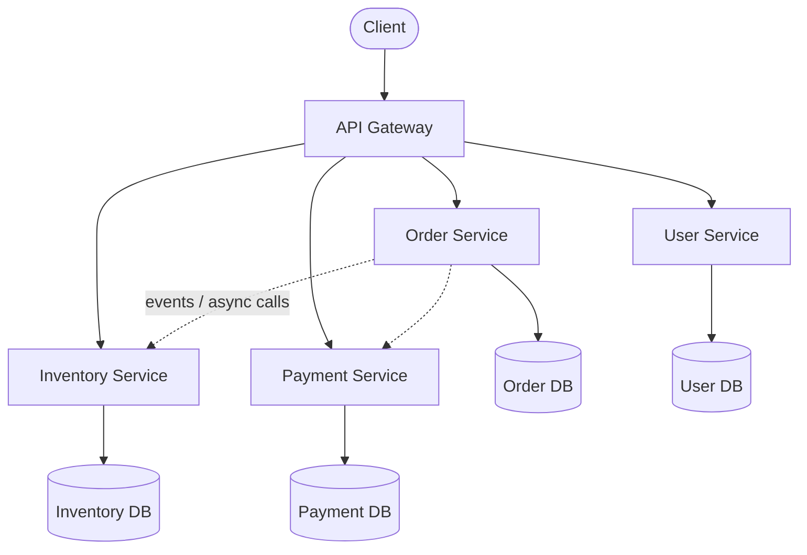

#### Advantages of Microservices

- **Separation of concerns** — each service owns one bounded business capability.
- **Loose coupling** — services communicate over the network (REST/gRPC/events), not in-process, so internal changes in one service don't force redeploys of others.
- **Independent deployability** — a team can ship the payment service ten times a day without touching order or inventory.
- **Independent, targeted scaling** — scale only the hot services (e.g. run 50 pods of the recommendation service, 2 pods of the admin service).
- **Faster release cycles** — smaller codebases mean smaller blast radius, faster CI, and more autonomous teams.
- **Technology flexibility (polyglot)** — each service can use the language/database best suited for its workload.

#### Disadvantages of Microservices

- **Decomposition is hard** — drawing the right service boundaries requires deep domain knowledge (get it wrong and you end up with a "distributed monolith").
- **Complex inter-service communication** — every internal call becomes a network call, needing retries, timeouts, circuit breakers (see [resilience-patterns.md](resilience-patterns.md)), and distributed tracing to debug.
- **Distributed transactions** — a single business operation (e.g. "place order") now spans multiple databases with no native ACID guarantee across them (solved with the Saga pattern, below).
- **Operational overhead** — you now manage N deployments, N sets of logs/metrics, service discovery, and versioning across services.
- **Data consistency & duplication** — denormalized/duplicated data across services needs synchronization (via events/CDC — see [cdc.md](cdc.md)).

### Microservices Design Phases

When designing a microservices system, work through these phases in order:

1. **Decomposition patterns** — how do you split the domain into services?
2. **Database patterns** — does each service own its data, or is it shared?
3. **Communication patterns** — synchronous (REST/gRPC) vs. asynchronous (message queue/event bus)?
4. **Integration patterns** — API Gateway, service mesh, BFF (Backend-for-Frontend)?
5. **Deployment patterns** — one service per container/VM, sidecar, serverless?
6. **Cross-cutting concerns** — centralized logging, distributed tracing, monitoring, config management, secrets.

### Decomposition Patterns

Decomposition is the process of deciding **where to draw service boundaries**. Get this wrong and services end up tightly coupled anyway (a "distributed monolith" — all the network overhead of microservices with none of the independence).

#### 1. Decompose by Business Capability

- Split services around **what the business does**, not around technical layers (e.g. `OrderService`, `InventoryService`, `PaymentService`, `NotificationService`) instead of `ControllerLayer`, `ServiceLayer`, `DAOLayer`.
- Each capability maps to a team that owns it end-to-end (aligns with **Conway's Law**: system structure mirrors org structure).

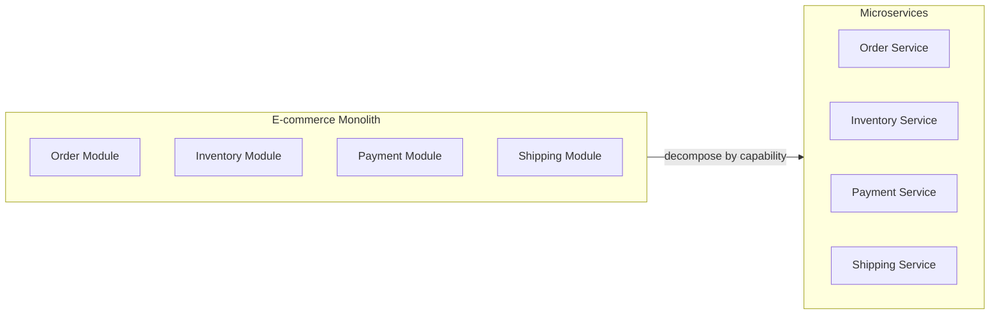

**Java: a business-capability-oriented service boundary**

```java
// OrderService owns the "Order" business capability end-to-end —
// it does NOT reach into Inventory's or Payment's database directly.
@RestController
@RequestMapping("/orders")
public class OrderController {

    private final OrderService orderService;
    private final InventoryClient inventoryClient; // HTTP/gRPC client to another service
    private final PaymentClient paymentClient;

    public OrderController(OrderService orderService,
                            InventoryClient inventoryClient,
                            PaymentClient paymentClient) {
        this.orderService = orderService;
        this.inventoryClient = inventoryClient;
        this.paymentClient = paymentClient;
    }

    @PostMapping
    public ResponseEntity<OrderResponse> placeOrder(@RequestBody OrderRequest request) {
        // 1. Reserve stock via the Inventory service's public API — no shared DB access.
        boolean reserved = inventoryClient.reserve(request.getSku(), request.getQuantity());
        if (!reserved) {
            return ResponseEntity.status(HttpStatus.CONFLICT).build();
        }

        // 2. Charge the customer via the Payment service.
        PaymentResult payment = paymentClient.charge(request.getCustomerId(), request.getAmount());

        // 3. Persist the order in this service's own database.
        Order order = orderService.createOrder(request, payment.getTransactionId());
        return ResponseEntity.ok(OrderResponse.from(order));
    }
}
```

#### 2. Decompose by Subdomain (Domain-Driven Design)

- Uses DDD's concept of **bounded contexts**: a large domain (e.g. "Payments") is broken down further into subdomains — **Core** (the differentiator, e.g. fraud detection), **Supporting** (e.g. refunds), and **Generic** (e.g. currency conversion, often bought off-the-shelf).
- Each bounded context gets its own service, its own ubiquitous language, and its own data model — even if two contexts both have a concept called "Customer", they can model it differently.

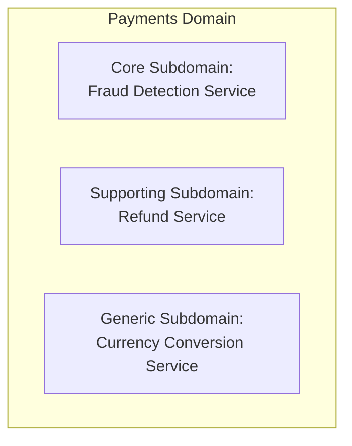

**Real-life use case:** At Uber, the "Trips" domain is decomposed by subdomain into separate services for **matching** (driver-rider pairing), **pricing** (surge calculation), and **ETA** (routing) — each owned by a different team, evolving and scaling independently, even though they all participate in a single "request a ride" flow.

**Interview Q&A**

- **Q: How do you decide service boundaries — by business capability or by subdomain?**
    A: Start with business capabilities for a coarse-grained split (aligns with team ownership); use DDD subdomain analysis to further refine within a capability when it grows too large or has multiple distinct concerns (core vs. supporting vs. generic).
- **Q: What's the risk of decomposing services incorrectly?**
    A: You get a "distributed monolith" — services still need to change together and deploy in lockstep, but now you also pay the network latency/complexity tax of microservices, with none of the independence benefit.
- **Q: How small should a microservice be?**
    A: There is no fixed size rule ("2-pizza team" is a rough heuristic). The right size is one where a single team can own, understand, and deploy the service independently, and where the service maps to one cohesive business capability — not "one microservice per database table" or "one per class".

### Strangler Fig Pattern

Named after the strangler fig vine that grows around a host tree and gradually replaces it — the pattern lets you **incrementally replace a monolith with microservices** without a risky "big bang" rewrite.

- **Purpose:** Gradually refactor/replace a monolithic application with microservices while it stays fully operational.
- **How it Works:**
    1. Introduce a **facade/router** (often the API Gateway or a reverse proxy) in front of the monolith.
    2. Initially, the router forwards **100%** of traffic to the monolith — nothing changes for users.
    3. Pick one capability (e.g. "search"), extract it into a new microservice, and update the router to send only `search`-related requests to the new service; everything else still goes to the monolith.
    4. Repeat capability-by-capability. Each extraction is small, low-risk, and independently reversible (just flip the route back).
    5. Once all capabilities are extracted, the monolith is "strangled" to nothing and can be decommissioned.

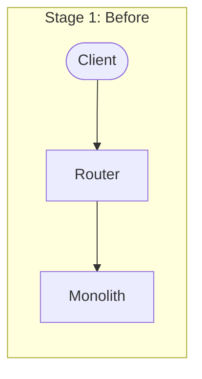

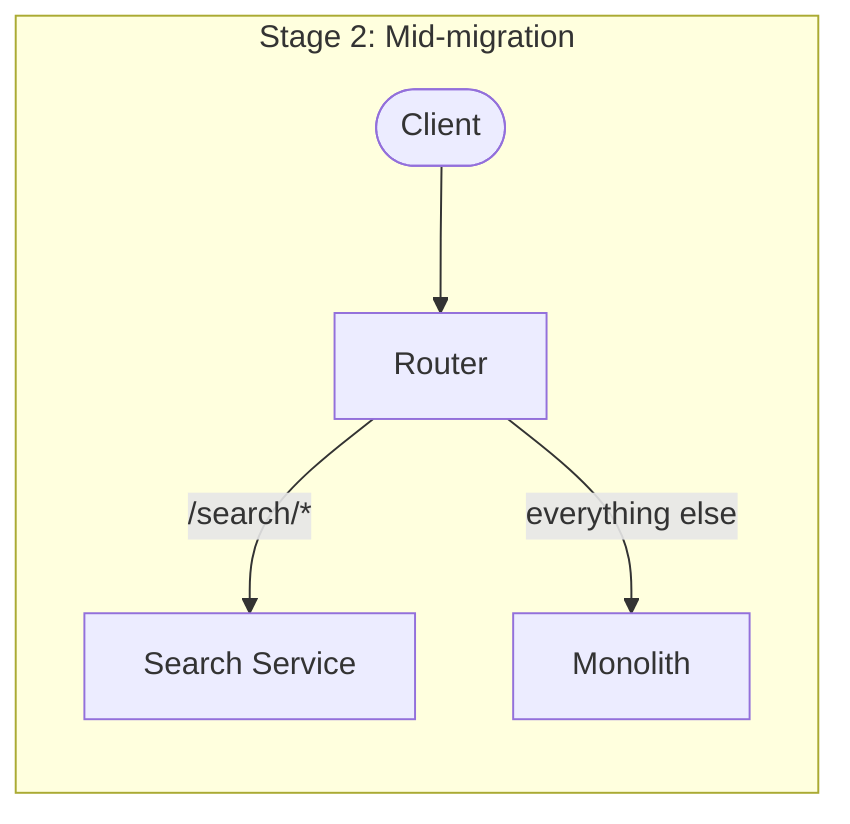

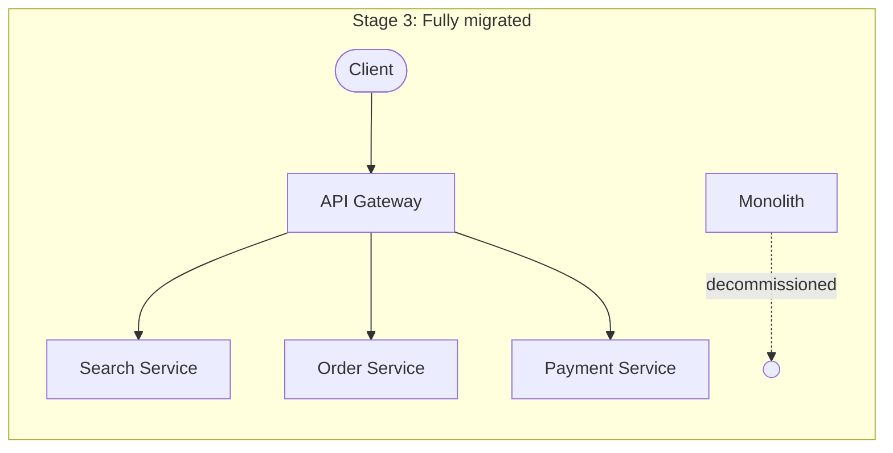

**Java: a simple strangler router (Spring Cloud Gateway style routing rules)**

```java
@Configuration
public class StranglerRouterConfig {

    @Bean
    public RouteLocator routes(RouteLocatorBuilder builder) {
        return builder.routes()
            // Newly extracted microservice handles /search/** — carve-out from the monolith.
            .route("search-service", r -> r.path("/search/**")
                .uri("lb://search-service"))
            // Newly extracted microservice handles /payments/** as of this migration wave.
            .route("payment-service", r -> r.path("/payments/**")
                .uri("lb://payment-service"))
            // Everything not yet migrated still falls through to the monolith.
            .route("legacy-monolith", r -> r.path("/**")
                .uri("lb://legacy-monolith"))
            .build();
    }
}
```

- **Advantages:**
    - Minimizes disruption — users never see downtime, and each extraction is a small, testable, reversible change.
    - Enables incremental investment — you can stop/pause the migration at any point with a fully working system.
    - De-risks large rewrites — avoids the classic "big bang rewrite that never ships" failure mode.
- **Disadvantages:**
    - The router/facade itself becomes a critical piece of infrastructure that must be highly available.
    - Running the monolith and microservices side-by-side (often with data sync between them) adds temporary operational complexity.
    - Migration can take months to years for large systems.

> **Real-life use case:** GOV.UK and Shopify both used the strangler pattern to migrate large legacy monoliths — routing traffic feature-by-feature into new services while the old system kept serving unmigrated traffic, avoiding a risky full rewrite.

**Interview Q&A**

- **Q: Why not just rewrite the monolith from scratch?**
    A: Big-bang rewrites are high risk — they take a long time, freeze feature development, and often fail to replicate every subtle behaviour of the legacy system. The strangler pattern ships value continuously and de-risks each step.
- **Q: What happens to data during a strangler migration if the old and new systems need the same data?**
    A: Typically handled with dual-writes, CDC (change data capture) replicating from the monolith's DB to the new service's DB, or the new service temporarily calling back into the monolith's DB/API until it fully owns that data.
- **Q: How do you decide the order in which to extract capabilities?**
    A: Start with capabilities that are high-value, low-risk, and loosely coupled to the rest of the monolith (e.g. a read-heavy "search" or "catalog" feature) before tackling core, highly coupled transactional flows like checkout/payments.

### Data Management in Microservices

#### Database per Service (recommended default)

Each microservice owns its own database schema/instance, and **no other service is allowed to touch it directly** — all access goes through that service's API.

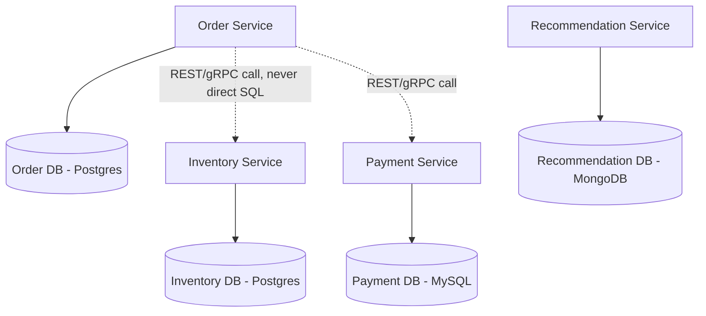

- **Advantages:**
    - **Scalability:** scale each database independently (e.g. read replicas only for the read-heavy catalog DB).
    - **Isolation/Autonomy:** a schema migration in `Payment DB` can't break `Order Service`.
    - **Technology flexibility (polyglot persistence):** use Postgres for transactional order data, Elasticsearch for search, Redis for session/cache data, all in the same system.
- **Challenges:**
    - No cross-service joins — aggregating data across services requires API composition or a separate read-optimized store (see CQRS, below).
    - No cross-service ACID transactions — requires the Saga pattern (below) for consistency.
    - Data duplication is common (e.g. `Order Service` may keep a cached copy of `product name/price` to avoid calling `Inventory Service` on every read) — kept in sync via events or [CDC](cdc.md).

#### Shared Database (anti-pattern for true microservices, sometimes pragmatic)

All services read/write the same database/schema.

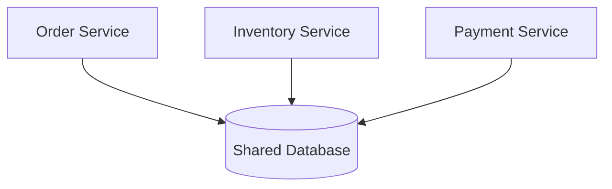

- **Advantages:**
    - Simple cross-entity **joins** and reporting queries.
    - Native **ACID** transactions across "services" (because it's really still one logical database).
    - Easier to get started — useful as a **stepping stone** early in a strangler migration.
- **Drawbacks:**
    - **Tight coupling via the schema** — changing a column used by two services requires coordinating both teams' deploys, defeating the purpose of microservices.
    - **Contention/performance bottlenecks** — a single database instance becomes a shared point of contention as traffic grows.
    - **Limited independent scalability** — you must scale the whole database even if only one "service" needs more capacity.

**Java: enforcing database-per-service ownership (no shared entities across services)**

```java
// Inventory Service — the ONLY code allowed to touch the inventory schema directly.
@Entity
@Table(name = "inventory")
public class InventoryItem {
    @Id
    private String sku;
    private int availableQuantity;
    // getters/setters omitted
}

public interface InventoryRepository extends JpaRepository<InventoryItem, String> {}

// Order Service never imports InventoryRepository or InventoryItem.
// It only knows about a thin DTO returned by Inventory's public API.
public record InventoryAvailability(String sku, int availableQuantity) {}

@FeignClient(name = "inventory-service")
public interface InventoryClient {
    @GetMapping("/inventory/{sku}")
    InventoryAvailability getAvailability(@PathVariable String sku);
}
```

> **Real-life use case:** Netflix runs hundreds of microservices, each with its own datastore (Cassandra, MySQL, EVCache, etc.) chosen per workload — the recommendation service uses different storage than the billing service, and no service reaches into another's database.

**Interview Q&A**

- **Q: How do you run a report that needs data from 3 different microservices' databases if each owns its own DB?**
    A: Use **API composition** (a service/BFF calls all 3 services and joins in memory, fine for low-volume/low-latency needs) or build a dedicated **read-optimized store** (CQRS-style materialized view) populated via events/CDC for high-volume reporting.
- **Q: Isn't a shared database simpler — why avoid it?**
    A: It reintroduces tight coupling at the schema level — any team changing a shared table can break other "independent" services, and the whole database becomes a single scaling and availability bottleneck, defeating microservices' core benefits.
- **Q: How do two services stay in sync when they each cache a copy of the same data?**
    A: The owning service publishes domain events (e.g. `ProductPriceChanged`) on change; interested services subscribe and update their local copy asynchronously (eventual consistency), often implemented via CDC on the owning service's DB.

### Saga Pattern

> See also the dedicated [saga-pattern.md](saga-pattern.md) page for a deeper dive.

- **Purpose:** Manage a business transaction that spans multiple services/databases, ensuring eventual data consistency even though there's no single ACID transaction across all of them.
- **How it Works:**
    - The overall business operation is broken into a sequence of **local transactions**, one per participating service.
    - Each local transaction commits to its own database and then publishes an event (or is invoked directly by an orchestrator).
    - The next step is triggered by that event/call.
    - If any step fails, previously completed steps are undone via **compensating transactions** (e.g. "cancel reservation" undoes "reserve stock") — there's no automatic rollback like in a local ACID transaction, so every step needs an explicit compensating action.

#### Choreography-based Saga

Each service listens for events and decides what to do next — there is no central coordinator.

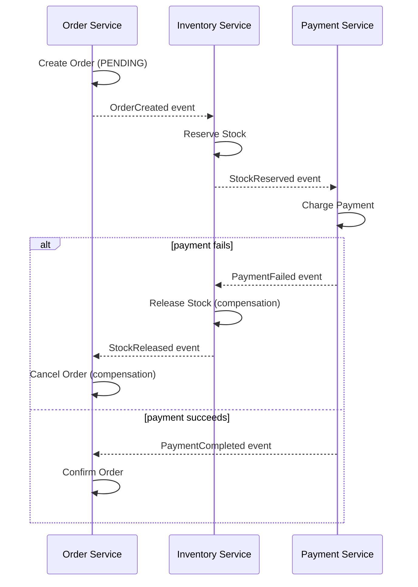

**Java: choreography via Spring events / message broker listeners**

```java
// Order Service publishes an event after its local transaction commits.
@Service
public class OrderService {
    private final OrderRepository orderRepository;
    private final ApplicationEventPublisher events; // or a Kafka/RabbitMQ template in production

    @Transactional
    public Order createOrder(OrderRequest request) {
        Order order = orderRepository.save(Order.pending(request));
        events.publishEvent(new OrderCreatedEvent(order.getId(), request.getSku(), request.getQuantity()));
        return order;
    }

    @EventListener
    public void onPaymentFailed(PaymentFailedEvent event) {
        // Compensating transaction: undo the order this service owns.
        orderRepository.markCancelled(event.orderId());
    }
}

// Inventory Service reacts to OrderCreated, and compensates on PaymentFailed.
@Service
public class InventoryService {
    private final InventoryRepository inventoryRepository;
    private final ApplicationEventPublisher events;

    @EventListener
    @Transactional
    public void onOrderCreated(OrderCreatedEvent event) {
        boolean reserved = inventoryRepository.reserve(event.sku(), event.quantity());
        events.publishEvent(reserved
            ? new StockReservedEvent(event.orderId(), event.sku(), event.quantity())
            : new StockReservationFailedEvent(event.orderId()));
    }

    @EventListener
    @Transactional
    public void onPaymentFailed(PaymentFailedEvent event) {
        // Compensating transaction: release the stock reserved earlier.
        inventoryRepository.release(event.sku(), event.quantity());
    }
}
```

#### Orchestration-based Saga

A central **orchestrator** tells each service what local transaction to execute next and issues compensating commands on failure.

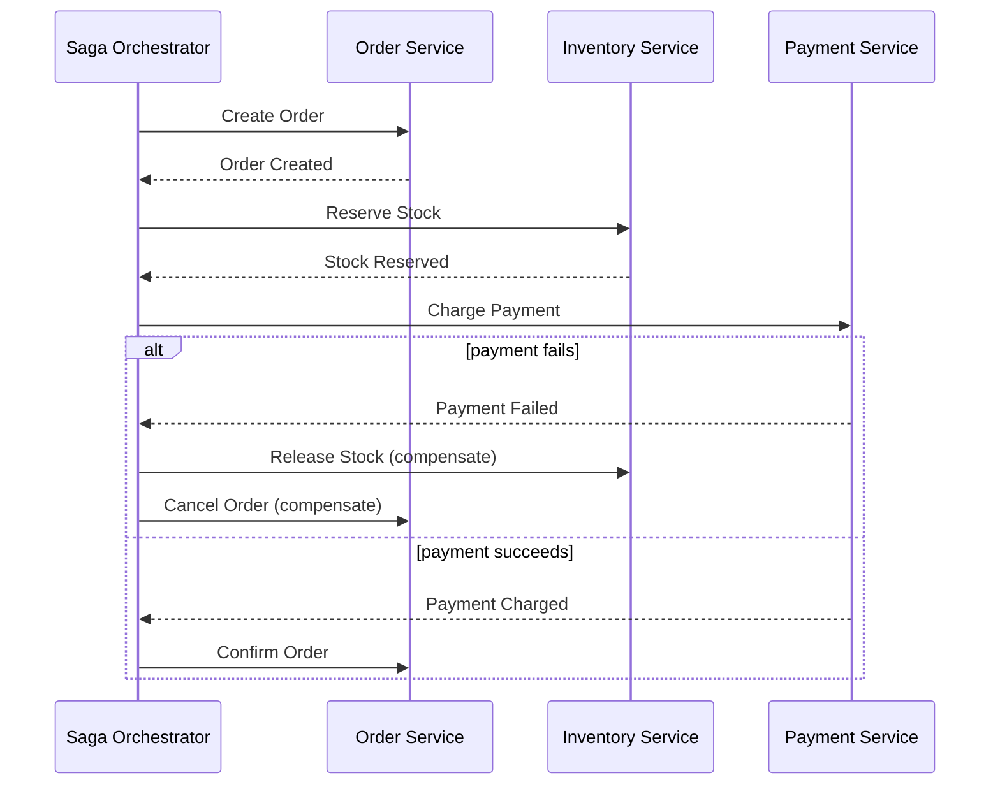

**Java: a simple orchestrator (state-machine style)**

```java
@Service
public class OrderSagaOrchestrator {

    private final OrderClient orderClient;
    private final InventoryClient inventoryClient;
    private final PaymentClient paymentClient;

    public void execute(OrderRequest request) {
        String orderId = orderClient.createOrder(request); // step 1
        try {
            inventoryClient.reserveStock(request.getSku(), request.getQuantity()); // step 2
            try {
                paymentClient.charge(request.getCustomerId(), request.getAmount()); // step 3
                orderClient.confirmOrder(orderId);
            } catch (PaymentException ex) {
                inventoryClient.releaseStock(request.getSku(), request.getQuantity()); // compensate step 2
                orderClient.cancelOrder(orderId); // compensate step 1
                throw ex;
            }
        } catch (InventoryException ex) {
            orderClient.cancelOrder(orderId); // compensate step 1
            throw ex;
        }
    }
}
```

| | Choreography | Orchestration |
|---|---|---|
| Coordination | Decentralized, via events | Centralized, via an orchestrator |
| Coupling | Loose (services only know about events) | Orchestrator knows about all services |
| Best for | Few steps, simple flows | Many steps, complex conditional flows |
| Debugging | Harder — logic is spread across services | Easier — flow is defined in one place |
| Single point of failure | None | Orchestrator (must be made highly available) |

- **Advantages:** ensures eventual data consistency across services; provides explicit failure-handling/rollback semantics; keeps each service owning its own data.
- **Disadvantages:** significantly more complex than a local ACID transaction; compensating transactions must be idempotent and carefully designed (e.g. "refund payment" must be safe to run twice); no true isolation — other requests can observe intermediate states (mitigated with patterns like semantic locks or a "pending" status).

> **Real-life use case:** Food-delivery apps (e.g. Uber Eats-style order flow) use a saga across **Order → Restaurant Accept → Payment → Rider Assignment** services; if the restaurant rejects the order or no rider is found, compensating actions refund the payment and cancel the order.

**Interview Q&A**

- **Q: How would you handle transferring money between two users' accounts (potentially in different services)?**
    A: Model it as a saga: (1) debit sender's account (local transaction), (2) credit receiver's account (local transaction). If step 2 fails, run a compensating transaction to re-credit the sender. Use idempotency keys so retries of any step don't double-debit/credit.
- **Q: How do you make compensating transactions safe under retries/duplicate messages?**
    A: Make every step and its compensation **idempotent** (e.g. keyed by a unique request/transaction ID so re-applying has no extra effect), and use an outbox/inbox pattern to avoid dual-write issues when publishing events.
- **Q: Choreography or orchestration — which would you pick for a checkout flow with 6 steps and several conditional branches?**
    A: Orchestration — with many steps and branching compensation logic, a central orchestrator keeps the flow understandable and testable; choreography would scatter this logic across 6 services' event handlers, making it hard to reason about the overall flow.

### CQRS Pattern

> See also the dedicated [cqrs.md](cqrs.md) page for more depth.

- **Purpose:** Separate the **write model** (Commands: create/update/delete) from the **read model** (Queries: fetch data), so each can be modeled, optimized, and scaled independently.
- **How it Works:**
    - Writes go through a **Command** model backed by a normalized, transactional store (e.g. Postgres) that enforces business invariants.
    - The write side publishes events on every change.
    - A separate **Query** model (often a denormalized, read-optimized store — e.g. Elasticsearch, a materialized view, or Redis) is updated asynchronously from those events.
    - Reads never go through the write model; they hit the pre-computed, fast read model directly.

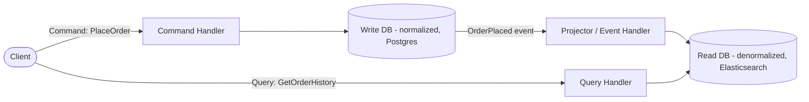

**Java: separate command and query paths (Spring)**

```java
// --- Write side: Command ---
public record PlaceOrderCommand(String customerId, String sku, int quantity) {}

@Service
public class OrderCommandService {
    private final OrderRepository writeRepository; // normalized, transactional store
    private final ApplicationEventPublisher events;

    @Transactional
    public String handle(PlaceOrderCommand cmd) {
        Order order = writeRepository.save(Order.create(cmd));
        // Publish an event so the read model can be projected asynchronously.
        events.publishEvent(new OrderPlacedEvent(order.getId(), cmd.customerId(), cmd.sku(), cmd.quantity()));
        return order.getId();
    }
}

// --- Read side: Query ---
public record OrderSummaryView(String orderId, String customerName, String skuName, int quantity, String status) {}

@Service
public class OrderQueryService {
    private final OrderReadRepository readRepository; // denormalized view, e.g. Elasticsearch-backed

    public List<OrderSummaryView> getOrderHistory(String customerId) {
        return readRepository.findByCustomerId(customerId); // fast, pre-joined, no runtime joins
    }
}

// --- Projector: keeps the read model in sync with write-side events ---
@Component
public class OrderReadModelProjector {
    private final OrderReadRepository readRepository;

    @EventListener
    public void on(OrderPlacedEvent event) {
        readRepository.save(new OrderSummaryView(
            event.orderId(), event.customerName(), event.skuName(), event.quantity(), "PLACED"));
    }
}
```

- **Advantages:**
    - **Performance:** the read model is pre-joined/denormalized, so queries avoid expensive runtime joins.
    - **Independent scalability:** add more read replicas/read-model instances without touching the write path (reads usually outnumber writes 10:1 or more).
    - **Flexibility:** the read model can use a completely different storage technology (search index, cache, graph DB) best suited to how it's queried.
- **Challenges:**
    - **Eventual consistency:** the read model lags behind the write model by the propagation delay of the event — clients may briefly see stale data right after a write.
    - **Increased complexity:** two models, two schemas, and a synchronization/projection pipeline to build and monitor.
    - **Read-after-write UX:** the client that just wrote data may not immediately see it if they read from the lagging read model (mitigated by routing that user's immediate follow-up read to the write model, or returning the write result directly).

> **Real-life use case:** An e-commerce catalog uses CQRS — product **writes** (admin updating price/stock) go into a normalized Postgres schema, while product **searches/browsing** are served from an Elasticsearch index kept in sync via CDC/events, letting search scale to millions of read QPS independent of the low-volume admin writes.

**Interview Q&A**

- **Q: When would you NOT use CQRS?**
    A: When the domain is simple CRUD with roughly equal read/write volume and no complex reporting/query needs — the added complexity of two models and a sync pipeline isn't justified.
- **Q: How do you keep the read model from becoming stale for too long?**
    A: Keep the write→event→read-model propagation path short (low-latency message broker, small payloads), monitor projection lag as a first-class metric, and for the "read your own write" case, either read from the write model for that specific request or return the freshly-written data directly in the command's response.
- **Q: Is CQRS the same as having a read replica of your database?**
    A: No — a read replica has the *same schema* as the primary, just physically separate for scaling reads. CQRS uses a *deliberately different, denormalized model/schema* (and often a different storage technology) optimized for how data is queried, not just physically replicated.

---

## Summary: Pattern Cheat Sheet

| Pattern | Problem it Solves | Key Trade-off |
|---|---|---|
| Decompose by Business Capability / Subdomain | Where to draw service boundaries | Wrong boundaries → distributed monolith |
| Strangler Fig | Incrementally migrating a monolith | Slower than a rewrite, but far lower risk |
| Database per Service | Service autonomy & independent scaling | No cross-service joins/transactions |
| Saga (Choreography/Orchestration) | Distributed transactions across services | Eventual consistency + compensating logic complexity |
| CQRS | Read/write models with very different access patterns | Read model can be stale (eventual consistency) |

## Interview Questions Recap

**1. What are the disadvantages of a monolithic architecture that push teams toward microservices?**

A monolith bundles every module (UI, business logic, data access) into one deployable process sharing one codebase and one database. This creates: (a) **tight coupling** — an in-process call between modules means a change in one can silently break another, so every release requires testing/deploying the whole app; (b) **coarse-grained scaling** — you can't scale just the hot module (e.g. checkout during a sale), you must run more copies of the entire app, wasting resources on cold modules; (c) **large blast radius deployments** — a bug anywhere forces a rollback of everything, including unrelated features shipped in the same release; (d) **codebase/team scaling limits** — as headcount grows, more teams commit to the same repo/build, causing merge conflicts, slow CI, and release-train bottlenecks; (e) **single technology lock-in** — the whole app is pinned to one language/runtime/DB even where a different tool would fit a specific workload better. Microservices address all five by splitting the system into independently deployable, independently scalable units, at the cost of distributed-systems complexity.

**2. What's the difference between decomposing by business capability vs. by subdomain (DDD)?**

**By business capability** is a coarse, org-aligned split: you look at what the business *does* (take orders, manage inventory, process payments, ship goods) and create one service per capability, mirroring Conway's Law so a single team can own a service end-to-end. **By subdomain (DDD)** is a finer-grained, domain-modeling technique used *within* a capability that has grown complex: you split a domain like "Payments" into a **core** subdomain (the actual differentiator, e.g. fraud detection — where you invest the most engineering effort), a **supporting** subdomain (e.g. refunds — necessary but not differentiating), and a **generic** subdomain (e.g. currency conversion — often best bought/outsourced rather than built). In practice: start with business-capability boundaries for the first cut of services; apply DDD subdomain/bounded-context analysis when a capability is too large for one team or mixes concerns with very different rates of change and business value.

**3. What is a "distributed monolith" and how do you avoid creating one?**

A distributed monolith is a system that *looks* like microservices (multiple deployables, separate repos/databases) but *behaves* like a monolith: services must be deployed together because they share a database, call each other synchronously in a tightly-coupled chain, or leak internal data models across service boundaries. You get all of microservices' costs — network latency, serialization overhead, operational complexity — with none of the benefits (no independent deploys, no independent scaling, no fault isolation). To avoid it: draw boundaries around genuine business capabilities/bounded contexts (not database tables or technical layers), give each service its own database with access only through its API, version APIs so consumers aren't forced to upgrade in lockstep, and prefer asynchronous/event-based communication over long synchronous call chains where possible.

**4. Why is database-per-service preferred over a shared database in microservices?**

Database-per-service means each service is the sole owner of its schema and no other service touches it directly — all cross-service access goes through the owning service's API. This gives you: **independent scaling** (scale only the databases under load, e.g. read replicas for a hot catalog DB); **isolation** (a schema migration or index change in one service can't break another's queries); and **polyglot persistence** (Postgres for transactional order data, Elasticsearch for search, Redis for sessions — each service picks the best-fit storage). A shared database looks simpler at first (easy joins, real ACID transactions) but it re-couples services at the schema level: any team changing a shared table must coordinate with every other consuming team's release, the database becomes a single point of contention as traffic grows, and you can't scale one "service's" data independently since it's all one instance. The trade-off you accept with database-per-service is losing native cross-service joins and multi-service ACID transactions — solved with API composition/CQRS for reads and the Saga pattern for writes.

**5. How do you run a cross-service report/join when each service owns its own database?**

Two main approaches depending on scale and latency needs: **(a) API composition** — a caller (an API Gateway, a BFF, or a dedicated aggregator service) calls each relevant service's API in parallel and joins the results in memory before returning the combined response. This is simple and always consistent with each service's live data, but doesn't scale well for high-volume, complex, or deeply nested joins, and its latency is bounded by the slowest downstream call. **(b) CQRS-style materialized read model** — a dedicated read service subscribes to domain events (or uses CDC) published by each owning service and continuously builds/updates a denormalized, pre-joined view (often in Elasticsearch, a data warehouse, or a reporting DB). Queries then hit this pre-computed view directly with no runtime joins or fan-out calls, at the cost of eventual consistency (the view lags behind the source services by the event-propagation delay). Use API composition for low-volume, simple, near-real-time joins; use a materialized read model for high-volume reporting/search/analytics.

**6. Explain the Strangler Fig pattern and why it's preferred over a full rewrite.**

Named after the vine that grows around a host tree and gradually replaces it, the Strangler Fig pattern migrates a monolith to microservices incrementally instead of all at once. You put a router/facade (API Gateway or reverse proxy) in front of the monolith that initially forwards 100% of traffic to it. You then extract one capability at a time into a new microservice and update the router to send just that capability's traffic to the new service, leaving everything else on the monolith. You repeat this capability-by-capability until the monolith has nothing left to serve and can be decommissioned. It's preferred over a full rewrite because: a big-bang rewrite is high-risk (it can take years, freezes new feature work, and often fails to reproduce every subtle behavior/edge case of the legacy system, sometimes reintroducing bugs long since fixed), whereas the strangler approach ships value continuously, keeps the system fully operational and testable at every step, and lets you stop, pause, or roll back any single extraction independently without risking the whole migration.

**7. How do you decide which capability to extract first during a strangler migration?**

Prioritize by **value vs. risk**: start with capabilities that are high business value, low coupling to the rest of the monolith, and ideally read-heavy/stateless (e.g. search, product catalog browsing, a reporting dashboard) — these are easier to extract cleanly, quickly prove out your new infrastructure (deployment pipeline, service mesh, observability), and de-risk the pattern before you touch anything critical. Save highly coupled, stateful, transactional flows (checkout, payments, core order processing) for later, once the team has validated the migration tooling and has more confidence handling distributed transactions (Saga) and data synchronization. Also factor in which capabilities are actively bottlenecking a specific team's velocity or scaling needs — extracting those early delivers the most immediate organizational benefit.

**8. What is the Saga pattern, and what problem does it solve?**

The Saga pattern solves the problem of maintaining data consistency for a business transaction that spans multiple services/databases, where there is no single ACID transaction across all of them (each service's database is only transactional locally). A saga breaks the overall operation into a sequence of local transactions, one per participating service; each local transaction commits to its own database and then triggers the next step (via an event or an orchestrator's command). If any step fails partway through, previously completed steps are undone using explicit **compensating transactions** (e.g. "release reserved stock" compensates "reserve stock") rather than an automatic database rollback. The result is **eventual consistency** across services instead of strict ACID atomicity — the trade-off you accept in exchange for each service retaining full ownership of its own data.

**9. Compare choreography-based vs. orchestration-based sagas — when would you use each?**

In **choreography**, there's no central coordinator: each service publishes an event when its local transaction completes, and other services subscribe to the events relevant to them and react (including running their own compensating transactions on failure events). This keeps services fully decoupled and is simple for sagas with few steps and little branching, but the overall business flow isn't defined anywhere as a single artifact — it's implicit in the sum of every service's event handlers, which makes it hard to see the "big picture," debug failures, or reason about ordering as the number of steps grows. In **orchestration**, a central orchestrator explicitly calls each service in sequence and issues compensating commands on failure. This makes the flow (including all conditional branches) explicit, testable, and easy to trace/debug in one place, at the cost of the orchestrator needing to know about every participating service (tighter coupling to the orchestrator, plus the orchestrator itself becomes a critical component that must be made highly available). Rule of thumb: choose choreography for a small number of steps with simple, linear reactions; choose orchestration once you have many steps, complex conditional logic, or a need for clear auditability/debuggability of the overall flow.

**10. How do you design compensating transactions so they're safe under retries?**

Make every forward step and every compensating step **idempotent** — applying the same operation twice (due to a retry, a duplicate message, or an at-least-once delivery guarantee from a message broker) must have the same effect as applying it once. Concretely: attach a unique idempotency/transaction key to every command/event and have each service check-and-record that key before applying an operation (e.g. "has this order ID already been cancelled? if so, no-op"). Use the **transactional outbox pattern** so a service's local DB write and its published event are atomic (avoiding the dual-write problem where the DB commits but the event publish fails, or vice versa), and use an **inbox pattern** on the consuming side to deduplicate messages that arrive more than once. Also design compensations to be safe even if the original action never actually completed (e.g. "release stock" should be a no-op if stock was never actually reserved), since failures can happen before confirmation is received.

**11. How would you implement a "transfer money between two users" flow across services?**

Model it as a saga with two local transactions: (1) debit the sender's account in the Account/Ledger service that owns the sender, recording the transaction as pending with a unique transaction ID; (2) credit the receiver's account in the (possibly different) service/shard that owns the receiver. If step 2 succeeds, mark the transaction complete. If step 2 fails (receiver account not found, service unavailable after retries, etc.), run a compensating transaction that re-credits the sender for the debited amount, referencing the same transaction ID so the compensation is idempotent and safe to retry. Every step should be keyed by the transaction ID so that network retries or duplicate messages cannot double-debit or double-credit. For strict consistency requirements, many real systems (e.g. banking ledgers) additionally use a two-phase "hold funds, then confirm/release" flow, and always expose the transaction as being in an explicit PENDING/COMPLETED/FAILED/REVERSED state rather than assuming instantaneous consistency.

**12. What is CQRS, and how is it different from just having a database read replica?**

CQRS (Command Query Responsibility Segregation) separates the **write model** (handles commands: create/update/delete, backed by a normalized transactional store enforcing business invariants) from the **read model** (handles queries, backed by a store — often denormalized, sometimes a completely different technology like Elasticsearch or a cache — optimized purely for how data is read). The write side publishes events on every change, and those events asynchronously update/project the read model. A **read replica** is different in kind: it has the *exact same schema* as the primary database, exists purely to physically distribute read load, and is kept in sync via the database engine's own native replication. CQRS's read model, in contrast, is *deliberately reshaped* — different schema, different indexes, sometimes a different storage engine entirely — to match query access patterns, and it's synchronized at the application/event level rather than at the storage-engine replication level. In short: a read replica scales the *same* model; CQRS gives you a *different* model altogether.

**13. What consistency trade-off does CQRS introduce, and how do you mitigate a stale read model?**

CQRS trades strict consistency for performance/scalability: because the read model is updated asynchronously (via events or CDC) after the write model commits, there's a window — the "projection lag" — during which the read model is stale relative to the latest write. A client that writes data and then immediately queries it might not see their own change if that query goes to the lagging read model. Mitigations: keep the write→event→projection path as short and low-latency as possible (fast message broker, small payloads, dedicated projector capacity) and monitor projection lag as a first-class SLA metric; for the specific "read-your-own-write" UX problem, either have the command handler return the freshly-written data directly in its response (so the client doesn't need to re-query), or route that one follow-up read to the write-side store instead of the read model; more broadly, communicate to users/design UIs around eventual consistency (e.g. optimistic UI updates) rather than assuming the read model reflects every write instantly.

**14. How do services stay in sync when each caches a copy of another service's data?**

It's common and expected in microservices for one service to keep a local copy of data owned by another (e.g. `Order Service` caching a product's name/price instead of calling `Inventory Service` on every read, for latency and availability reasons). The owning service publishes a domain event whenever the source data changes (e.g. `ProductPriceChanged`), often implemented via the transactional outbox pattern or CDC (Change Data Capture) tailing the owning service's database WAL/binlog so the event is guaranteed to be emitted exactly when the change is committed. Consuming services subscribe to these events and asynchronously update their local cached copy. This is eventual consistency by design — there is a brief window where consumers hold stale data — so consumers should treat cached copies as "good enough for display/business logic that tolerates a short staleness window" and go back to the owning service's API directly for anything requiring the absolute latest value (e.g. final price confirmation at checkout).

**15. What cross-cutting concerns (beyond decomposition) do you need to solve for in a microservices system?**

Splitting services is only step one; a production-grade microservices system also needs: **communication** — choosing sync (REST/gRPC) vs. async (message queue/event bus) per interaction, plus resilience patterns (timeouts, retries, circuit breakers, bulkheads — see [resilience-patterns.md](resilience-patterns.md)) since every internal call is now a network call that can fail independently; **service discovery** — so callers can find healthy instances of a service as they scale up/down (see [service-discovery.md](service-discovery.md)); **API Gateway / ingress** — a single entry point for auth, rate limiting, routing (see [api-gateway.md](api-gateway.md)); **distributed observability** — centralized logging, metrics, and distributed tracing so a single user request that fans out across 10 services can still be debugged end-to-end (see [observability.md](observability.md)); **configuration & secrets management** — centralized, versioned config and secret distribution instead of per-service hardcoding (see [environment-configuration-and-secrets.md](environment-configuration-and-secrets.md)); **deployment/orchestration** — container orchestration, rolling deploys, health checks; and **security** — service-to-service auth (mTLS, tokens), since the network boundary between services is now a trust boundary that didn't exist inside a monolith's process.
