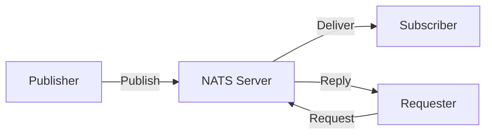
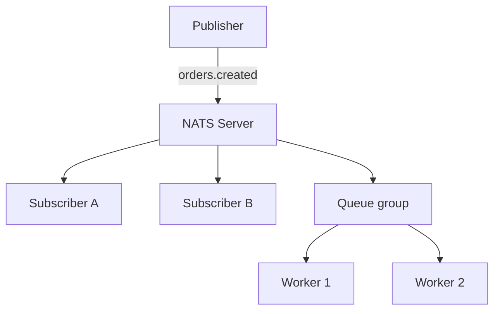
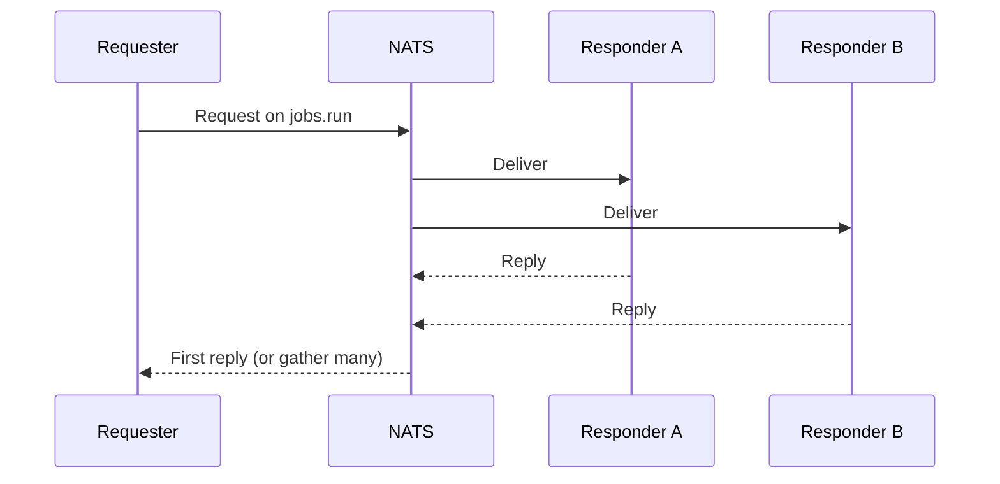
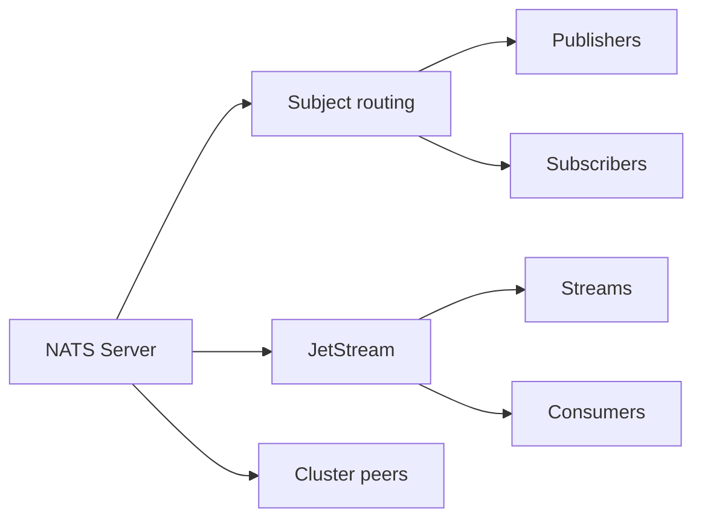

# NATS — A message broker for scale

## Blogs and websites


## Medium

- [NATS — A message broker for scale](https://blog.devgenius.io/nats-bf421cf1b625)
- [NATS Messaging backplane](https://medium.com/@HMahsky/nats-messaging-backplane-a475e328ba1a)
- [Lightweight, Cloud-Native Messaging with NATS](https://medium.com/capital-one-tech/lightweight-cloud-native-messaging-with-nats-ad730ca2becf)
- [NATS: The Real-Time Backbone That Beats Kafka, RabbitMQ & REST APIs](https://medium.com/@lakshayaggarwal9/nats-the-real-time-backbone-that-beats-kafka-rabbitmq-rest-apis-67711868ddf7)
- [NATS Cluster Architectures: Regional Clusters — Building Reliable Messaging Foundations](https://medium.concurrentflows.com/nats-cluster-architectures-regional-clusters-building-reliable-messaging-foundations-47acfa6c807e)

## Youtube


## Theory

### Topics Covered

1. [Introduction](#introduction)
2. [Core Concepts](#core-concepts)
3. [Messaging Patterns](#messaging-patterns)
4. [NATS vs Kafka and RabbitMQ](#nats-vs-kafka-and-rabbitmq)
5. [Characteristics](#characteristics)
6. [Pros](#pros)
7. [Cons](#cons)
8. [Use Cases](#use-cases)
9. [Components](#components)
10. [Patterns](#patterns)
11. [Benefits](#benefits)
12. [Challenges](#challenges)
13. [Best Practices](#best-practices)
14. [When to Use](#when-to-use)
15. [Java and Spring Boot Examples](#java-and-spring-boot-examples)

---

### Introduction

NATS is a lightweight, high-performance messaging system designed for cloud-native applications and edge systems. It supports publish-subscribe, request-reply, and queue groups with extremely low latency and a simple text-based protocol.



**Real-life use cases**

- **Service mesh control planes**: distribute routing and configuration.
- **Event notifications**: push lightweight events.
- **IoT and edge**: connect devices with low overhead.
- **Microservices**: request-reply between services.
- **Real-time messaging**: chat and live updates.

**Interview questions and answers**

- **Q: What is NATS?**
  **A:** A lightweight, high-performance messaging system supporting pub-sub, request-reply, and queue groups.

- **Q: How does NATS differ from a message queue like RabbitMQ?**
  **A:** NATS is an always-connected, at-most-once pub-sub system by default, while RabbitMQ is broker-centric with queues, acknowledgements, and durable messages.

- **Q: What is JetStream?**
  **A:** NATS's persistence layer that adds durable streams, replay, and at-least-once delivery.

---

### Core Concepts

**Subjects:**

- Hierarchical strings used for routing, such as `orders.created`.
- Support wildcards: `*` for one token and `>` for many tokens.

**Pub-Sub:**

- Publishers send messages to a subject.
- Subscribers receive matching messages.
- By default, delivery is at-most-once and non-durable.

**Queue groups:**

- Multiple subscribers share a queue group name.
- Only one member receives each message, enabling load balancing.

**Request-reply:**

- A requester publishes to a subject and includes a reply subject.
- A responder replies to that subject.
- Used to build service-to-service RPC.

**JetStream:**

- Adds durable streams, consumers, and acknowledgements.
- Supports replay, retention policies, and at-least-once delivery.



**Interview questions and answers**

- **Q: What is a subject in NATS?**
  **A:** A hierarchical string that routes messages to interested subscribers.

- **Q: How do queue groups load balance?**
  **A:** Subscribers in the same queue group compete for messages, so each message is delivered to exactly one member.

- **Q: When is JetStream needed?**
  **A:** When durability, replay, ordered consumption, or at-least-once delivery is required.

---

### Messaging Patterns

NATS supports several patterns natively.

- **Publish-subscribe**: fan out messages to all subscribers.
- **Request-reply**: synchronous RPC over messaging.
- **Queue groups**: competing consumers for load balancing.
- **Scatter-gather**: send a request to many responders and collect replies.
- **Streaming with JetStream**: durable, replayable streams.



**Interview questions and answers**

- **Q: How is request-reply different from pub-sub?**
  **A:** Pub-sub broadcasts to all subscribers, while request-reply sends a request and expects a response on a reply subject.

- **Q: What is scatter-gather?**
  **A:** Sending a request to multiple responders and aggregating their replies.

- **Q: Can NATS guarantee delivery?**
  **A:** Core NATS is at-most-once; JetStream provides at-least-once and durable delivery.

---

### NATS vs Kafka and RabbitMQ

| Aspect | NATS | RabbitMQ | Kafka |
|--------|------|----------|-------|
| **Primary model** | Pub-sub and request-reply | Queue-based broker | Distributed log |
| **Latency** | Very low | Low | Higher |
| **Persistence** | Optional via JetStream | Strong | Durable log |
| **Delivery** | At-most-once, at-least-once with JetStream | At-least-once | At-least-once |
| **Scaling** | Clustering, super-clusters | Clustering | Partitions |
| **Best for** | Low-latency messaging, RPC | Task queues, routing | Event streaming, replay |

**Interview questions and answers**

- **Q: When would you choose NATS over Kafka?**
  **A:** For low-latency request-reply and lightweight messaging where long-term log retention and replay are not required.

- **Q: When would you choose Kafka over NATS?**
  **A:** For durable event streaming, replay, large-scale log storage, and ordered processing.

- **Q: Can NATS persist messages?**
  **A:** Yes, using JetStream streams with configurable retention.

---

### Characteristics

- **Lightweight**
  Small server footprint and low resource use.

- **Low latency**
  Optimized for fast message delivery.

- **Always connected**
  NATS focuses on live, connected clients.

- **Subject-based routing**
  Hierarchical subjects and wildcards route messages.

- **At-most-once by default**
  Core NATS does not persist or acknowledge.

- **Queue-group capable**
  Competing consumers enable load balancing.

- **Request-reply native**
  Supports service-to-service RPC.

- **Durable with JetStream**
  Optional persistence and replay.

- **Clustered**
  Servers form clusters and super-clusters.

---

### Pros

- **High performance**
  Very low latency and high throughput.

- **Simple protocol**
  Text-based and easy to use.

- **Small footprint**
  Deployable on edge and constrained devices.

- **Flexible messaging**
  Pub-sub, request-reply, and queue groups.

- **Cloud-native**
  Fits Kubernetes and service-mesh environments.

- **Built-in clustering**
  Scales horizontally and across regions.

- **JetStream durability**
  Adds persistence when needed.

- **Multi-language clients**
  Broad client support.

---

### Cons

- **No persistence by default**
  Core NATS loses messages if no subscriber is connected.

- **At-most-once semantics**
  Delivery is not guaranteed without JetStream.

- **No message reordering**
  Ordering guarantees are limited compared to Kafka partitions.

- **Limited message retention**
  JetStream is not a full replacement for a long-term log.

- **Fewer management features**
  Simpler than RabbitMQ for complex routing.

- **Younger ecosystem**
  Smaller ecosystem than Kafka or RabbitMQ.

- **Wildcard complexity**
  Subject design can become confusing at scale.

- **Operational differences**
  Requires understanding of clustering and JetStream.

---

### Use Cases

- **Microservices RPC**
  Request-reply between services.

- **Control planes**
  Distribute configuration and routing in service meshes.

- **Event notification**
  Lightweight fan-out of events.

- **IoT and edge**
  Connect devices with low overhead.

- **Real-time chat**
  Publish messages to rooms.

- **Job dispatch**
  Queue groups distribute work.

- **Cloud infrastructure**
  Coordinate cloud-native components.

- **Telemetry**
  Stream metrics and status updates.

---

### Components

- **NATS server**
  The messaging broker.

- **Subject**
  The routing name for messages.

- **Publisher**
  Sends messages to a subject.

- **Subscriber**
  Receives messages matching a subject.

- **Queue group**
  A named group of competing subscribers.

- **JetStream**
  Durable stream and consumer engine.

- **Stream**
  Stores messages for replay and retention.

- **Consumer**
  Reads messages from a JetStream stream.

- **Cluster**
  A set of connected NATS servers.



---

### Patterns

- **Publish-subscribe**
  Fan out messages.

- **Request-reply**
  Synchronous RPC.

- **Queue-group load balancing**
  Distribute work among consumers.

- **Scatter-gather**
  Collect replies from multiple responders.

- **Durable stream with JetStream**
  Persist and replay events.

- **Subject hierarchy**
  Organize topics with dotted names and wildcards.

- **Super-cluster federation**
  Connect regional NATS clusters.

- **Heartbeat and discovery**
  Publish service presence and status.

---

### Benefits

- **Performance**
  Low-latency delivery supports real-time workloads.

- **Simplicity**
  Minimal protocol and easy integration.

- **Scalability**
  Clustering and queue groups scale horizontally.

- **Flexibility**
  Multiple messaging patterns in one system.

- **Resource efficiency**
  Runs on small servers and devices.

- **Durability when needed**
  JetStream adds persistence without replacing core NATS.

- **Operational agility**
  Lightweight deployment fits cloud-native environments.

---

### Challenges

- **Message loss by default**
  Core NATS requires careful handling for reliability.

- **Delivery guarantees**
  At-least-once requires JetStream configuration.

- **Ordering**
  Cross-subject ordering is not guaranteed.

- **Retention limits**
  JetStream is not designed for indefinite log retention.

- **Subject governance**
  Hierarchies can become hard to manage.

- **Ecosystem maturity**
  Fewer tools than Kafka or RabbitMQ.

- **Clustering complexity**
  Super-clusters and gateway configuration add overhead.

- **Monitoring**
  Observing JetStream and cluster health requires setup.

---

### Best Practices

- **Use queue groups for load balancing**
  Distribute messages among workers.

- **Use request-reply for RPC**
  Prefer NATS request-reply over custom protocols.

- **Choose JetStream for durability**
  Enable persistence when delivery cannot be lost.

- **Design subjects deliberately**
  Use consistent hierarchical naming.

- **Set appropriate retention**
  Match JetStream retention to business needs.

- **Enable TLS**
  Secure connections in production.

- **Use authentication and authorization**
  Restrict subjects per client.

- **Monitor server and JetStream health**
  Track latency, memory, and consumers.

- **Test failure modes**
  Verify behavior when servers or clients disconnect.

- **Avoid unbounded fan-out**
  Control subscriber count to prevent overload.

---

### When to Use

- **Use NATS when** you need low-latency messaging or RPC.
- **Use NATS when** running cloud-native or edge systems.
- **Use NATS when** queue groups can distribute work.
- **Use NATS when** simplicity and small footprint matter.
- **Use NATS JetStream when** you need durable, replayable streams.

**Prefer Kafka or RabbitMQ when**

- Long-term event retention and replay are core requirements.
- Complex routing and task queues are needed.
- The team already has deep operational experience with those brokers.

---

### Java and Spring Boot Examples

#### 1. Publishing a message

```java
import io.nats.client.Connection;
import io.nats.client.Nats;
import org.springframework.beans.factory.annotation.Value;
import org.springframework.stereotype.Service;

import java.nio.charset.StandardCharsets;

@Service
public class NatsPublisher {

    private final Connection connection;

    public NatsPublisher(@Value("${app.nats.url}") String url) throws Exception {
        this.connection = Nats.connect(url);
    }

    public void publish(String subject, String message) throws Exception {
        connection.publish(subject, message.getBytes(StandardCharsets.UTF_8));
    }
}
```

#### 2. Subscribing to a subject

```java
import io.nats.client.Connection;
import io.nats.client.Nats;
import io.nats.client.Subscription;
import org.springframework.beans.factory.annotation.Value;
import org.springframework.stereotype.Service;

import java.nio.charset.StandardCharsets;

@Service
public class NatsSubscriber {

    private final Connection connection;

    public NatsSubscriber(@Value("${app.nats.url}") String url) throws Exception {
        this.connection = Nats.connect(url);
    }

    public Subscription subscribe(String subject, java.util.function.Consumer<String> handler) throws Exception {
        return connection.subscribe(subject, message ->
                handler.accept(new String(message.getData(), StandardCharsets.UTF_8)));
    }
}
```

#### 3. Request-reply service

```java
import io.nats.client.Connection;
import io.nats.client.Nats;
import org.springframework.beans.factory.annotation.Value;
import org.springframework.stereotype.Service;

import java.nio.charset.StandardCharsets;
import java.time.Duration;

@Service
public class NatsRequestor {

    private final Connection connection;

    public NatsRequestor(@Value("${app.nats.url}") String url) throws Exception {
        this.connection = Nats.connect(url);
    }

    public String request(String subject, String requestBody) throws Exception {
        var reply = connection.request(subject,
                requestBody.getBytes(StandardCharsets.UTF_8),
                Duration.ofSeconds(5));
        return new String(reply.getData(), StandardCharsets.UTF_8);
    }
}
```

#### 4. Queue group subscriber

```java
import io.nats.client.Connection;
import io.nats.client.Nats;
import io.nats.client.Subscription;
import org.springframework.beans.factory.annotation.Value;
import org.springframework.stereotype.Service;

@Service
public class NatsQueueWorker {

    private final Connection connection;

    public NatsQueueWorker(@Value("${app.nats.url}") String url) throws Exception {
        this.connection = Nats.connect(url);
    }

    public Subscription join(String subject, String queueGroup) throws Exception {
        return connection.subscribe(subject, queueGroup, message -> {
            System.out.println("Handled by queue group member: " + message);
        });
    }
}
```

**Interview questions and answers**

- **Q: What is the difference between core NATS and JetStream?**
  **A:** Core NATS is non-durable pub-sub and request-reply; JetStream adds durable streams, acknowledgements, and replay.

- **Q: How do wildcards work in NATS?**
  **A:** `*` matches a single subject token, while `>` matches one or more trailing tokens.

- **Q: What is a queue group?**
  **A:** A named group of subscribers where each message is delivered to exactly one member for load balancing.

- **Q: When is NATS request-reply useful?**
  **A:** For service-to-service RPC that needs low latency and routing without a separate HTTP layer.
