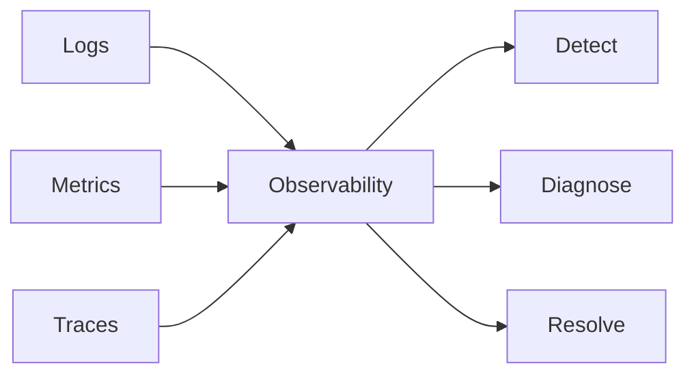
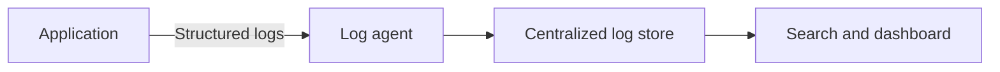
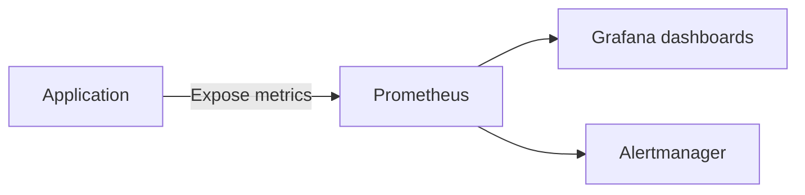
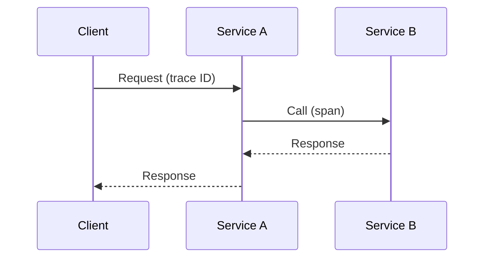
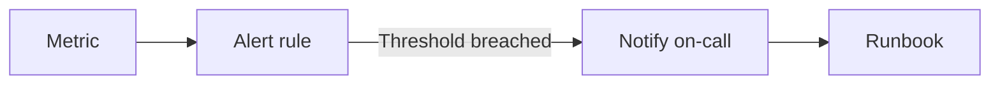
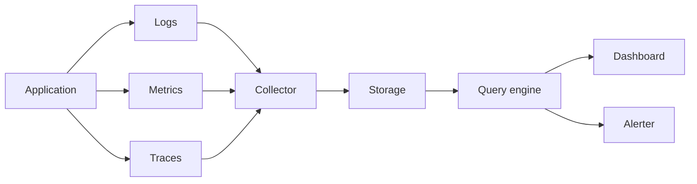

# Observability

## Blogs and websites


## Medium


## Youtube


## Theory

### Topics Covered

1. [Introduction](#introduction)
2. [Logging](#logging)
3. [Monitoring and Metrics](#monitoring-and-metrics)
4. [Tracing](#tracing)
5. [Alerting](#alerting)
6. [Characteristics](#characteristics)
7. [Pros](#pros)
8. [Cons](#cons)
9. [Use Cases](#use-cases)
10. [Components](#components)
11. [Patterns](#patterns)
12. [Benefits](#benefits)
13. [Challenges](#challenges)
14. [Best Practices](#best-practices)
15. [When to Use](#when-to-use)
16. [Java and Spring Boot Examples](#java-and-spring-boot-examples)

---

### Introduction

Observability is the ability to understand a system's internal state from its external outputs. It is built on three pillars: logs, metrics, and traces. Together they let engineers detect, diagnose, and resolve issues in complex distributed systems.



**Real-life use cases**

- **Incident response**: find the cause of an outage.
- **Performance tuning**: locate slow services.
- **Capacity planning**: predict resource needs.
- **Release validation**: compare behavior before and after deploy.
- **SLA monitoring**: track availability and latency.

**Interview questions and answers**

- **Q: What are the three pillars of observability?**
  **A:** Logs, metrics, and traces.

- **Q: How is observability different from monitoring?**
  **A:** Monitoring tells you when something is wrong; observability helps you understand why.

- **Q: Why is observability critical in microservices?**
  **A:** A request spans many services, so correlated logs and traces are essential to understand failures.

---

### Logging

Recording application events.

**Log Levels:**

- **TRACE**: Very detailed.
- **DEBUG**: Diagnostic information.
- **INFO**: General information.
- **WARN**: Warning messages.
- **ERROR**: Error events.
- **FATAL**: Critical failures.

**Best Practices:**

- Structured logging (JSON).
- Include correlation IDs.
- Log at appropriate levels.
- Don't log sensitive data.
- Centralize logs.

**Tools:**

- ELK Stack (Elasticsearch, Logstash, Kibana).
- Splunk.
- Datadog.
- CloudWatch.



**Interview questions and answers**

- **Q: Why use structured logging?**
  **A:** Structured logs are machine-queryable, enabling filtering and aggregation.

- **Q: What is a correlation ID?**
  **A:** An identifier propagated across services to correlate log entries from one request.

- **Q: Why centralize logs?**
  **A:** Distributed services generate logs on many hosts; centralized storage enables unified search and analysis.

---

### Monitoring and Metrics

Collecting and analyzing metrics.

**Types:**

- **Infrastructure**: CPU, memory, disk, network.
- **Application**: Request rate, latency, errors.
- **Business**: User signups, transactions, revenue.

**Key Metrics (RED Method):**

- **Rate**: Requests per second.
- **Errors**: Error rate.
- **Duration**: Response time.

**Key Metrics (USE Method):**

- **Utilization**: % time busy.
- **Saturation**: Queue depth.
- **Errors**: Error count.

**Tools:**

- Prometheus + Grafana.
- Datadog.
- New Relic.
- CloudWatch.



**Interview questions and answers**

- **Q: What is the RED method?**
  **A:** Monitoring Rate, Errors, and Duration for request-driven services.

- **Q: What is the USE method?**
  **A:** Monitoring Utilization, Saturation, and Errors for resources.

- **Q: Why track percentiles instead of averages?**
  **A:** Averages hide tail latency; p95/p99 expose slow user experiences.

---

### Tracing

Track requests across distributed systems.

**Distributed Tracing:**

- Trace ID across all services.
- Span ID for each operation.
- Parent-child relationships.
- Timing information.

**Tools:**

- Jaeger.
- Zipkin.
- AWS X-Ray.
- OpenTelemetry.



**Interview questions and answers**

- **Q: What is a trace?**
  **A:** A record of a request's path and timing across services.

- **Q: What is a span?**
  **A:** A single unit of work within a trace, such as one service operation.

- **Q: How do services propagate trace context?**
  **A:** By passing trace and span IDs in headers, such as W3C Trace Context.

---

### Alerting

Notify team of issues.

**Best Practices:**

- Alert on symptoms, not causes.
- Reduce noise.
- Clear escalation policy.
- Runbooks for common issues.
- SLO-based alerting.



**Interview questions and answers**

- **Q: Why alert on symptoms rather than causes?**
  **A:** Symptoms reflect user impact; causes are often transient or implementation-specific.

- **Q: What is SLO-based alerting?**
  **A:** Alerting when the error budget for a service-level objective is being consumed too fast.

- **Q: Why reduce alert noise?**
  **A:** Too many alerts cause fatigue and lead teams to ignore critical issues.

---

### Characteristics

- **Multi-signal**
  Combines logs, metrics, and traces.

- **Distributed**
  Correlates data across services.

- **Real-time**
  Metrics and alerts reflect current state.

- **Contextual**
  Traces and correlation IDs connect events.

- **Scalable**
  Handles high-volume telemetry.

- **Standardized**
  OpenTelemetry and structured logs enable consistency.

- **Actionable**
  Turns raw signals into diagnosis and alerts.

- **Continuous**
  Observability is always running, not just during incidents.

---

### Pros

- **Faster diagnosis**
  Correlated signals reduce time to root cause.

- **Proactive detection**
  Alerts catch issues before users notice.

- **Performance insight**
  Traces and metrics reveal bottlenecks.

- **Reliability**
  Monitoring SLOs prevents outages.

- **Capacity planning**
  Trends inform scaling decisions.

- **Release confidence**
  Before/after comparisons validate deploys.

- **Accountability**
  Logs and traces provide audit trails.

- **Operational maturity**
  Teams make data-driven decisions.

---

### Cons

- **Cost**
  Storage and tooling can be expensive.

- **Noise**
  Too many alerts cause fatigue.

- **Complexity**
  Instrumentation and pipelines require effort.

- **Data volume**
  High-cardinality telemetry is hard to manage.

- **Privacy**
  Logs and traces may expose sensitive data.

- **Tool sprawl**
  Many overlapping tools complicate setup.

- **Overhead**
  Instrumentation can add latency.

- **Learning curve**
  Teams must learn telemetry concepts.

---

### Use Cases

- **Incident response**
  Diagnose outages quickly.

- **Performance optimization**
  Find slow services and queries.

- **Capacity planning**
  Predict resource growth.

- **SLA and SLO tracking**
  Measure reliability.

- **Release monitoring**
  Detect regressions after deploy.

- **Security auditing**
  Trace access and changes.

- **Distributed debugging**
  Follow a request across services.

- **Cost attribution**
  Understand resource usage.

---

### Components

- **Log emitter**
  Produces structured log entries.

- **Metric emitter**
  Exposes counters, gauges, and histograms.

- **Trace instrumentation**
  Creates and propagates spans.

- **Collector**
  Receives and forwards telemetry.

- **Storage**
  Persists logs, metrics, and traces.

- **Query engine**
  Searches and aggregates data.

- **Dashboard**
  Visualizes metrics and health.

- **Alerter**
  Notifies when rules fire.

- **Correlation ID**
  Links telemetry from one request.



---

### Patterns

- **Structured logging**
  Emit JSON logs with consistent fields.

- **RED metrics**
  Track rate, errors, and duration.

- **USE metrics**
  Track resource utilization, saturation, and errors.

- **Distributed tracing**
  Propagate trace context across services.

- **SLO-based alerting**
  Alert on error budget burn.

- **Correlation IDs**
  Link logs and traces per request.

- **Golden signals**
  Monitor latency, traffic, errors, and saturation.

- **Centralized telemetry**
  Aggregate logs and metrics in one platform.

---

### Benefits

- **Reduced MTTR**
  Faster root-cause analysis.

- **Improved reliability**
  Proactive monitoring and alerting.

- **Better performance**
  Bottlenecks become visible.

- **Informed decisions**
  Data drives capacity and architecture.

- **Team confidence**
  Deploys are safer with observability.

- **Compliance**
  Audit logs satisfy requirements.

- **User satisfaction**
  Issues are fixed before they spread.

- **Continuous improvement**
  Trends reveal recurring problems.

---

### Challenges

- **Alert fatigue**
  Too many noisy alerts.

- **High-cardinality data**
  Storing many unique labels is costly.

- **Sensitive data**
  Logs can leak PII or secrets.

- **Instrumentation coverage**
  Missing traces limit visibility.

- **Tooling cost**
  Licensing and storage grow.

- **Correlation across systems**
  Consistent IDs are hard to enforce.

- **Data retention**
  Balancing cost and history.

- **Team adoption**
  Observability requires culture and process.

---

### Best Practices

- **Use structured logs**
  Emit JSON with consistent keys.

- **Propagate correlation IDs**
  Link logs and traces per request.

- **Track golden signals**
  Latency, traffic, errors, and saturation.

- **Alert on symptoms**
  Focus on user impact.

- **Set SLOs**
  Define and monitor reliability targets.

- **Reduce alert noise**
  Consolidate and tune alert rules.

- **Redact sensitive data**
  Never log passwords or PII.

- **Use OpenTelemetry**
  Standardize instrumentation.

- **Centralize telemetry**
  Aggregate in one queryable platform.

- **Review dashboards regularly**
  Keep them relevant and actionable.

---

### When to Use

- **Use observability when** running distributed systems.
- **Use structured logging when** logs must be queryable.
- **Use metrics when** tracking performance and capacity.
- **Use tracing when** diagnosing cross-service requests.
- **Use SLO-based alerting when** measuring reliability.

**Avoid over-instrumenting when**

- The system is simple and monolithic.
- The cost of telemetry exceeds its benefit.
- The team cannot act on the data collected.

---

### Java and Spring Boot Examples

#### 1. Structured logging with SLF4J

```java
import org.slf4j.Logger;
import org.slf4j.LoggerFactory;
import org.springframework.stereotype.Service;

import java.util.Map;

@Service
public class OrderService {

    private static final Logger log = LoggerFactory.getLogger(OrderService.class);

    public void create(String orderId) {
        log.info("Order created", Map.of("orderId", orderId));
    }
}
```

#### 2. Micrometer metrics

```java
import io.micrometer.core.instrument.MeterRegistry;
import org.springframework.stereotype.Service;

import java.util.concurrent.atomic.AtomicLong;

@Service
public class CheckoutService {

    private final AtomicLong checkouts = new AtomicLong();
    private final AtomicLong failures = new AtomicLong();

    public CheckoutService(MeterRegistry meterRegistry) {
        meterRegistry.gauge("checkout.count", checkouts);
        meterRegistry.gauge("checkout.failures", failures);
    }

    public void checkout(String cartId) {
        try {
            checkouts.incrementAndGet();
        } catch (RuntimeException e) {
            failures.incrementAndGet();
            throw e;
        }
    }
}
```

#### 3. Correlation ID filter

```java
import org.springframework.stereotype.Component;
import org.springframework.web.filter.OncePerRequestFilter;

import jakarta.servlet.FilterChain;
import jakarta.servlet.ServletException;
import jakarta.servlet.http.HttpServletRequest;
import jakarta.servlet.http.HttpServletResponse;
import java.io.IOException;
import java.util.UUID;

@Component
public class CorrelationIdFilter extends OncePerRequestFilter {

    public static final String HEADER = "X-Correlation-Id";

    @Override
    protected void doFilterInternal(HttpServletRequest request,
                                    HttpServletResponse response,
                                    FilterChain filterChain) throws ServletException, IOException {
        String correlationId = request.getHeader(HEADER);
        if (correlationId == null || correlationId.isBlank()) {
            correlationId = UUID.randomUUID().toString();
        }
        response.setHeader(HEADER, correlationId);
        filterChain.doFilter(request, response);
    }
}
```

#### 4. Actuator health indicator

```java
import org.springframework.boot.actuate.health.Health;
import org.springframework.boot.actuate.health.HealthIndicator;
import org.springframework.stereotype.Component;

@Component
public class DatabaseHealthIndicator implements HealthIndicator {

    @Override
    public Health health() {
        return Health.up().withDetail("status", "connected").build();
    }
}
```

**Interview questions and answers**

- **Q: What is the difference between logs, metrics, and traces?**
  **A:** Logs record events, metrics aggregate numbers over time, and traces follow a request across services.

- **Q: Why are correlation IDs important?**
  **A:** They connect log entries and spans from the same request across distributed services.

- **Q: What are golden signals?**
  **A:** Latency, traffic, errors, and saturation — the core signals for system health.

- **Q: How do you reduce alert fatigue?**
  **A:** Alert on symptoms, consolidate rules, set SLO-based thresholds, and provide runbooks.
