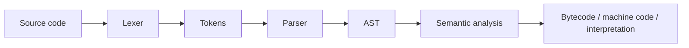
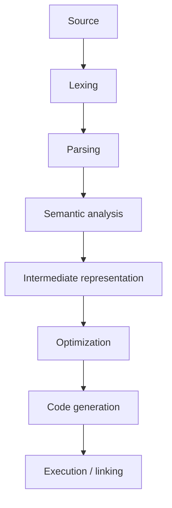
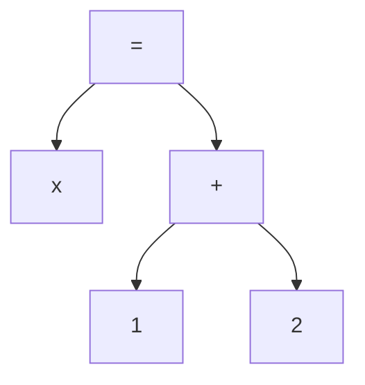
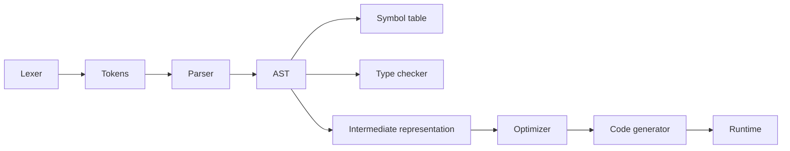

# Build Programming Language

## Blogs and websites

- [Building Your Own Programming Language From Scratch](https://hackernoon.com/building-your-own-programming-language-from-scratch)
- [I wrote a programming language. Here's how you can, too.](https://www.freecodecamp.org/news/the-programming-language-pipeline-91d3f449c919/)
-

## Medium


## Youtube

- [I Built My Own Programming Language 🤯](https://www.youtube.com/watch?v=rTuTLc_u6qw)

## Theory

### Topics Covered

1. [Introduction](#introduction)
2. [Language Implementation Pipeline](#language-implementation-pipeline)
3. [Interpreters vs Compilers](#interpreters-vs-compilers)
4. [Lexing and Parsing](#lexing-and-parsing)
5. [Characteristics](#characteristics)
6. [Pros](#pros)
7. [Cons](#cons)
8. [Use Cases](#use-cases)
9. [Components](#components)
10. [Patterns](#patterns)
11. [Benefits](#benefits)
12. [Challenges](#challenges)
13. [Best Practices](#best-practices)
14. [When to Use](#when-to-use)
15. [Java and Spring Boot Examples](#java-and-spring-boot-examples)

---

### Introduction

Building a programming language means translating source text into a form a machine can execute. The process involves lexing, parsing, semantic analysis, optimization, and code generation or interpretation. It is a foundational skill that deepens understanding of how languages and runtimes work.



**Real-life use cases**

- **Domain-specific languages**: model business rules or configuration.
- **Template engines**: compile templates to code.
- **Query languages**: parse and evaluate queries.
- **Scripting engines**: embed custom logic in applications.
- **Educational projects**: understand compilers and interpreters.

**Interview questions and answers**

- **Q: What is the difference between a compiler and an interpreter?**
  **A:** A compiler translates the whole program to another form before execution; an interpreter executes the program directly from source or an intermediate representation.

- **Q: What is an abstract syntax tree?**
  **A:** A tree representation of source structure that abstracts away syntactic details such as punctuation.

- **Q: Why do languages need a lexer and a parser separately?**
  **A:** Separating tokenization from structure simplifies both stages and makes the pipeline easier to understand and maintain.

---

### Language Implementation Pipeline

A typical language implementation has several stages.

1. **Lexing**: group characters into tokens.
2. **Parsing**: build an AST from tokens.
3. **Semantic analysis**: check types and resolve names.
4. **Intermediate representation**: produce a simpler form.
5. **Optimization**: transform for speed or size.
6. **Code generation**: emit bytecode or machine code.
7. **Execution or linking**: run or link the output.



**Interview questions and answers**

- **Q: What is an intermediate representation?**
  **A:** A machine-independent form between source and final code that supports analysis and optimization.

- **Q: What happens during semantic analysis?**
  **A:** The compiler checks types, scopes, and symbol resolution, catching errors not visible to the parser.

- **Q: Why are optimizations performed on an IR?**
  **A:** An IR is simpler than source and reusable across source and target languages, making transformations easier.

---

### Interpreters vs Compilers

| Aspect | Interpreter | Compiler |
|--------|-------------|----------|
| **Execution** | Directly from source or IR | After translation to target code |
| **Startup** | Fast | Slower (compilation step) |
| **Runtime speed** | Often slower | Often faster |
| **Portability** | Source portable | Target-code portable |
| **Feedback** | Immediate errors | Compile-time errors |

**Hybrid approaches:**

- **Bytecode interpreters**: compile to bytecode, interpret that.
- **JIT compilers**: compile hot paths at runtime.
- **Transpilers**: translate one source language to another.

**Interview questions and answers**

- **Q: What is a JIT compiler?**
  **A:** A just-in-time compiler translates code to machine instructions at runtime, often optimizing frequently executed paths.

- **Q: Why do many languages compile to bytecode?**
  **A:** Bytecode is portable and can be interpreted or JIT-compiled, balancing startup and performance.

- **Q: What is a transpiler?**
  **A:** A tool that translates source code from one language to another, such as TypeScript to JavaScript.

---

### Lexing and Parsing

**Lexing** converts characters into tokens.

```
"x = 1 + 2" → IDENT(x) EQUALS NUMBER(1) PLUS NUMBER(2)
```

**Parsing** converts tokens into an AST.



**Grammar approaches:**

- **Recursive descent**: hand-written parser using functions per rule.
- **Parser combinators**: build parsers from small reusable functions.
- **Parser generators**: generate parsers from a grammar specification.

**Interview questions and answers**

- **Q: What is a token?**
  **A:** A categorized lexical unit such as an identifier, keyword, operator, or literal.

- **Q: Why is recursive descent common?**
  **A:** It is straightforward to write and debug, and it maps closely to grammar rules.

- **Q: What is operator precedence?**
  **A:** The rules that determine which operators bind more tightly, affecting how expressions are grouped.

---

### Characteristics

- **Grammar-defined**
  The language syntax is formally specified.

- **Multi-stage**
  Lexing, parsing, analysis, and generation are distinct phases.

- **Tree-based**
  An AST represents program structure.

- **Type-aware**
  Static or dynamic typing shapes semantic analysis.

- **Optimizable**
  Intermediate representations enable transformations.

- **Runtime-dependent**
  Execution needs an interpreter, VM, or generated code.

- **Error-sensitive**
  Lexical, syntax, and semantic errors must be reported clearly.

- **Extensible**
  Languages can be embedded and extended with libraries.

- **Complex**
  Full implementations involve many interacting components.

---

### Pros

- **Deep understanding**
  Building a language teaches compilers and runtimes.

- **Domain fit**
  DSLs model specific problems precisely.

- **Control**
  Custom syntax and semantics match exact needs.

- **Learning value**
  Reveals how existing languages work.

- **Embeddability**
  Scripting languages integrate with host applications.

- **Performance tuning**
  Custom compilers can optimize for specific workloads.

- **Innovation**
  New language features can be explored.

- **Portability**
  A well-designed IR targets multiple platforms.

---

### Cons

- **High effort**
  A complete language is a large project.

- **Complexity**
  Parsing, typing, and code generation are hard.

- **Tooling burden**
  Editors, debuggers, and package managers need support.

- **Ecosystem cost**
  A new language lacks libraries and community.

- **Error reporting difficulty**
  Good diagnostics are surprisingly hard.

- **Maintenance**
  Languages and their runtimes evolve over time.

- **Adoption risk**
  Users must learn and trust a new language.

- **Performance pitfalls**
  Naive implementations can be slow.

---

### Use Cases

- **Domain-specific languages**
  Define business rules, configurations, or queries.

- **Embedded scripting**
  Allow users to customize applications.

- **Query and expression engines**
  Parse and evaluate user expressions safely.

- **Template and markup processors**
  Compile templates into executable code.

- **Educational tools**
  Teach parsing and evaluation.

- **Research prototypes**
  Experiment with type systems and semantics.

- **Configuration languages**
  Provide structured, validated settings.

- **Language transpilers**
  Translate between existing languages.

---

### Components

- **Lexer**
  Converts characters into tokens.

- **Parser**
  Converts tokens into an AST.

- **AST**
  A tree representation of program structure.

- **Symbol table**
  Maps names to types and declarations.

- **Type checker**
  Validates type compatibility.

- **Intermediate representation**
  A lower-level, machine-independent form.

- **Optimizer**
  Transforms the IR for efficiency.

- **Code generator**
  Emits bytecode or machine code.

- **Runtime**
  Executes or supports the generated program.



---

### Patterns

- **Recursive descent parsing**
  Implement one function per grammar rule.

- **Visitor pattern**
  Separate operations from AST structure.

- **Bytecode compilation**
  Compile source to portable bytecode.

- **Tree-walking interpretation**
  Evaluate the AST directly.

- **Symbol-table scoping**
  Manage names across nested scopes.

- **Garbage collection**
  Automatically reclaim unused memory.

- **Type inference**
  Deduce types from usage.

- **Foreign function interface**
  Call functions written in other languages.

---

### Benefits

- **Tailored abstractions**
  Languages can express domain concepts naturally.

- **Performance control**
  Compilation and optimization target specific needs.

- **Educational insight**
  Builders understand the full execution stack.

- **Tooling integration**
  Embedding enables rich customization.

- **Innovation potential**
  New syntax and semantics can improve productivity.

- **Portability**
  A shared IR targets many environments.

- **Security**
  Sandboxed interpreters can safely run untrusted code.

---

### Challenges

- **Grammar ambiguity**
  Unambiguous grammars are hard to design.

- **Error recovery**
  Parsers must continue after errors to report many issues.

- **Type system design**
  Soundness and usability must be balanced.

- **Performance**
  Matching mature language performance is difficult.

- **Standard library**
  A useful language needs a substantial library.

- **Tooling**
  Debuggers, formatters, and editors are essential.

- **Backward compatibility**
  Evolving a language without breaking users is hard.

- **Documentation**
  Syntax and semantics must be clearly documented.

---

### Best Practices

- **Start with a small grammar**
  Build incrementally rather than designing everything upfront.

- **Separate lexing, parsing, and evaluation**
  Keep stages modular and testable.

- **Use an AST**
  Represent structure explicitly before analysis.

- **Write many parser tests**
  Cover valid and invalid inputs.

- **Produce clear errors**
  Include location and helpful messages.

- **Implement a visitor**
  Keep AST operations decoupled from node classes.

- **Prefer an intermediate representation**
  Simplify optimization and code generation.

- **Document the semantics**
  Define what each construct means.

- **Use existing parser libraries**
  Do not hand-write everything when a generator fits.

- **Profile the interpreter or compiler**
  Optimize only after measuring.

---

### When to Use

- **Use a custom language when** a DSL would reduce complexity.
- **Use a custom language when** embedding scriptable behavior in an app.
- **Use a custom language when** teaching compilers and interpreters.
- **Use a custom language when** existing languages cannot express the domain.
- **Use a custom language when** a specialized runtime offers unique benefits.

**Prefer an existing language when**

- Ecosystem and tooling matter more than syntax.
- The domain is general-purpose.
- Maintenance cost outweighs the benefit.
- A library or embedded DSL already solves the problem.

---

### Java and Spring Boot Examples

#### 1. Token model and lexer

```java
import java.util.ArrayList;
import java.util.List;
import java.util.regex.Matcher;
import java.util.regex.Pattern;

public final class SimpleLexer {

    public record Token(TokenType type, String value) {}

    public enum TokenType {
        NUMBER, IDENTIFIER, PLUS, MINUS, EQUALS, WHITESPACE, UNKNOWN
    }

    private static final Pattern PATTERN = Pattern.compile(
            "(?<NUMBER>\\d+)|(?<IDENTIFIER>[a-zA-Z]+)|(?<PLUS>\\+)|(?<MINUS>-)|(?<EQUALS>=)|(?<WHITESPACE>\\s+)");

    public List<Token> tokenize(String source) {
        List<Token> tokens = new ArrayList<>();
        Matcher matcher = PATTERN.matcher(source);
        while (matcher.find()) {
            TokenType type = typeOf(matcher.group());
            if (type != TokenType.WHITESPACE) {
                tokens.add(new Token(type, matcher.group()));
            }
        }
        return tokens;
    }

    private TokenType typeOf(String group) {
        if (group.matches("\\d+")) {
            return TokenType.NUMBER;
        }
        if (group.matches("[a-zA-Z]+")) {
            return TokenType.IDENTIFIER;
        }
        return switch (group) {
            case "+" -> TokenType.PLUS;
            case "-" -> TokenType.MINUS;
            case "=" -> TokenType.EQUALS;
            default -> TokenType.UNKNOWN;
        };
    }
}
```

#### 2. Expression AST and evaluator

```java
public sealed interface Expr permits NumberExpr, BinaryExpr {

    int evaluate();

    record NumberExpr(int value) implements Expr {
        @Override
        public int evaluate() {
            return value;
        }
    }

    record BinaryExpr(Operator operator, Expr left, Expr right) implements Expr {
        @Override
        public int evaluate() {
            return operator.apply(left.evaluate(), right.evaluate());
        }
    }

    enum Operator {
        ADD {
            @Override
            int apply(int left, int right) {
                return left + right;
            }
        },
        SUBTRACT {
            @Override
            int apply(int left, int right) {
                return left - right;
            }
        };

        abstract int apply(int left, int right);
    }
}
```

#### 3. Expression language service

```java
import org.springframework.stereotype.Service;

import java.util.List;

@Service
public class ExpressionService {

    private final SimpleLexer lexer = new SimpleLexer();

    public List<SimpleLexer.Token> tokenize(String expression) {
        return lexer.tokenize(expression);
    }

    public int evaluate(Expr expr) {
        return expr.evaluate();
    }
}
```

#### 4. Visitor-style evaluator

```java
public interface ExpressionVisitor<T> {

    T visitNumber(Expr.NumberExpr expr);

    T visitBinary(Expr.BinaryExpr expr);

    static int evaluate(Expr expr) {
        return switch (expr) {
            case Expr.NumberExpr n -> n.value();
            case Expr.BinaryExpr b -> b.operator().apply(
                    evaluate(b.left()),
                    evaluate(b.right()));
        };
    }
}
```

**Interview questions and answers**

- **Q: What is the difference between syntax and semantics?**
  **A:** Syntax is the structure of valid programs; semantics is what those programs mean and do.

- **Q: Why is an AST useful?**
  **A:** It separates program structure from textual details, making analysis, transformation, and code generation easier.

- **Q: How would you evaluate an expression tree?**
  **A:** Recursively evaluate the operands of each node and apply the node's operator.

- **Q: What is a symbol table?**
  **A:** A data structure that maps names to their declarations, types, and scope during semantic analysis.
