# Raft consensus algorithm

## Blogs and websites


## Medium


## Youtube

- [Understand RAFT without breaking your brain](https://www.youtube.com/watch?v=IujMVjKvWP4)
- [Distributed Systems 6.2: Raft](https://www.youtube.com/watch?v=uXEYuDwm7e4)

## Theory

### Topics Covered

This page is organized into the following topics. Each topic includes a detailed explanation, its characteristics, components, patterns, pros/benefits, cons/challenges, best practices, when to use it, a real-life use case, a diagram, a Java/Spring Boot code example, and interview questions with answers.

1. [Understanding Distributed Consensus](#understanding-distributed-consensus)
2. [Raft Node States: Follower, Candidate, and Leader](#raft-node-states-follower-candidate-and-leader)
3. [Terms: Raft's Logical Clock](#terms-rafts-logical-clock)
4. [Leader Election](#leader-election)
5. [Log Replication](#log-replication)
6. [Safety: Election Restriction and the Log Matching Property](#safety-election-restriction-and-the-log-matching-property)
7. [Commit Rules and the Leader Completeness Property](#commit-rules-and-the-leader-completeness-property)
8. [Cluster Membership Changes (Joint Consensus)](#cluster-membership-changes-joint-consensus)
9. [Log Compaction and Snapshotting](#log-compaction-and-snapshotting)
10. [Client Interaction and Linearizable Semantics](#client-interaction-and-linearizable-semantics)
11. [Raft vs Paxos vs ZAB](#raft-vs-paxos-vs-zab)
12. [Network Partitions, Split Brain and Failure Scenarios in Raft](#network-partitions-split-brain-and-failure-scenarios-in-raft)
13. [Real-World Raft Implementations (etcd, Consul, CockroachDB, Kafka KRaft)](#real-world-raft-implementations-etcd-consul-cockroachdb-kafka-kraft)
14. [Designing a Raft-Based Distributed Key-Value Store](#designing-a-raft-based-distributed-key-value-store)
15. [Raft Consensus Algorithm: Characteristics, Pros, Cons, Use Cases, Components, Patterns, Benefits, Challenges, Best Practices and When to Use](#raft-consensus-algorithm-characteristics-pros-cons-use-cases-components-patterns-benefits-challenges-best-practices-and-when-to-use)

### Understanding Distributed Consensus

**Distributed consensus** is the problem of getting a group of independent machines (nodes) that communicate over an unreliable network to agree on a single value or a single sequence of values, even when some of those machines crash, restart, or become temporarily unreachable. Consensus is the foundation on which replicated state machines, distributed databases, distributed locks, and leader-election services are built: if every node in a cluster applies the same sequence of commands in the same order, every node ends up in the same state, and the cluster behaves like one highly available machine instead of many fragile ones.

**Why consensus is hard:** a naive approach ("just let any node update a shared value") breaks the moment two nodes try to write at the same time, or a node fails mid-update, or the network partitions the cluster into two halves that can no longer talk to each other. A correct consensus protocol must guarantee **safety** (nodes never disagree on a committed value, even during failures or partitions) and, as much as possible, **liveness** (the cluster keeps making progress as long as a majority of nodes are healthy and can communicate).

**Algorithms that solve distributed consensus:**

| Algorithm | Author / Origin | Key Idea | Reputation |
|---|---|---|---|
| **Paxos** | Leslie Lamport, 1989 | A two-phase (prepare/accept) quorum-based protocol proven correct under asynchronous network models | Mathematically elegant but notoriously difficult to understand and implement correctly; most real systems build heavily modified variants (Multi-Paxos, Fast Paxos) |
| **Raft** | Diego Ongaro & John Ousterhout, 2014 | Decomposes consensus into leader election, log replication, and safety, explicitly designed for understandability | The most widely adopted consensus algorithm in new systems built since 2014 (etcd, Consul, CockroachDB, TiKV, Kafka's KRaft mode) |
| **ZAB** (ZooKeeper Atomic Broadcast) | Yahoo! Research (Apache ZooKeeper) | A primary-backup atomic broadcast protocol, similar in spirit to Raft but designed specifically for ZooKeeper's needs | Powers Apache ZooKeeper, one of the oldest and most battle-tested coordination services in production use |
| **Viewstamped Replication (VR)** | Barbara Liskov & Brian Oki, 1988 | One of the earliest primary-backup consensus protocols, predates both Paxos's popularization and Raft | Less widely known publicly, but historically important and conceptually close to Raft |

Raft's central design goal was **understandability without sacrificing correctness**. Ongaro and Ousterhout observed that Paxos, while formally proven, was so hard to reason about that most engineering teams either avoided implementing consensus from scratch or built subtly incorrect variants. Raft achieves the same fault-tolerance guarantees as Paxos (tolerating up to `(N-1)/2` node failures in a cluster of `N` nodes) by splitting the problem into three largely independent sub-problems that can be studied, implemented, and tested in isolation:

1. **Leader election**: how the cluster picks exactly one leader to coordinate writes.
2. **Log replication**: how the leader replicates a sequence of commands (the "replicated log") to followers, and decides when an entry is safely committed.
3. **Safety**: the invariants (election restriction, log matching, leader completeness) that guarantee the cluster never disagrees on committed entries, even across leader crashes and network partitions.

#### Understanding Distributed Consensus: Characteristics

- **Formal safety guarantee under partial failure**: Consensus protocols guarantee that once a value/log entry is committed, it will never be lost or overwritten, even if a minority of nodes crash or the network partitions, as long as a majority of nodes remain available and can communicate.
- **Quorum-based decision making**: Every consensus algorithm in this family (Paxos, Raft, ZAB, VR) relies on majority quorums (`floor(N/2) + 1` nodes) rather than requiring all nodes to agree, which is what allows the cluster to keep operating despite some nodes being down.
- **Total order of committed operations**: Consensus does not just agree on isolated values; in practice it agrees on an ordered log of operations, so every replica that applies the log in order ends up in an identical state (this is what "replicated state machine" means).
- **Designed for the asynchronous network model**: These algorithms assume messages can be arbitrarily delayed, reordered, or lost (but not corrupted/forged), and they still guarantee safety under that assumption, only liveness (progress) requires periods of synchrony.
- **CP by construction**: In CAP terms, consensus protocols choose Consistency and Partition tolerance over Availability, a minority partition will refuse to make progress rather than risk a split-brain disagreement.

#### Understanding Distributed Consensus: Components

- **A cluster of N nodes (typically 3, 5, or 7)**: An odd number is used so that majority quorums are unambiguous and every possible network partition has at most one side with a majority.
- **A replicated log**: An append-only, ordered sequence of entries (commands) that every node maintains a copy of; the log is the artifact that consensus protocols actually agree on, entry by entry.
- **A leader/coordinator role (in leader-based protocols)**: Raft, ZAB, and VR all funnel writes through a single elected leader per term/epoch, simplifying reasoning about ordering compared to Paxos's leaderless (or weakly-leader) model.
- **A quorum/voting mechanism**: The logic that counts acknowledgements from a majority of nodes before considering an entry (or an election) successful.
- **A failure detector (heartbeats/timeouts)**: The mechanism nodes use to notice that a leader has failed or is unreachable, triggering a new round of leader election.

#### Understanding Distributed Consensus: Patterns

- **Leader-based replication over leaderless quorum writes**: Raft, ZAB, and VR route all writes through one leader per term, trading a small amount of write availability (writes pause during leader failover) for dramatically simpler reasoning about ordering, compared to Paxos's leaderless approach.
- **Decompose-and-conquer protocol design**: Raft's defining pattern, split an inherently hard distributed problem into independent sub-problems (election, replication, safety, membership changes) that can be designed, implemented, and verified largely in isolation.
- **State machine replication (SMR)**: Consensus is rarely the end goal by itself; it is almost always used to replicate a deterministic state machine (a key-value store, a metadata service, a lock manager) by agreeing on the order of the commands applied to it.
- **Consensus as a library/sidecar**: Modern systems (etcd, Hashicorp Raft, TiKV's raft-rs) package the consensus algorithm as an embeddable library, so that many different applications (Kubernetes' API server, Consul, CockroachDB, Kafka) can reuse the same well-tested core.

#### Understanding Distributed Consensus: Pros / Benefits

- **Strong consistency without a single point of failure**: Unlike a single primary database with manual failover, a consensus-backed cluster automatically elects a new leader and keeps serving strongly consistent reads/writes as long as a majority of nodes survive.
- **Well-understood fault tolerance math**: A 5-node Raft cluster tolerating 2 failures, or a 3-node cluster tolerating 1, is a precise, provable guarantee that capacity planning and SRE runbooks can rely on.
- **Battle-tested foundation for higher-level systems**: Because the hard consensus problem is solved once, correctly, systems built on top of it (distributed locks, leader election services, configuration stores, metadata services) inherit strong correctness guarantees essentially for free.
- **No external coordinator required**: The cluster is self-managing; it elects its own leader, detects its own failures, and re-establishes quorum without an operator manually intervening (outside of true disaster scenarios).

#### Understanding Distributed Consensus: Cons / Challenges

- **Inherent write latency cost**: Every write must be acknowledged by a majority of nodes before it is considered committed, which means write latency is bounded by the slower half of the cluster (typically the median round-trip time to a quorum), not the fastest node.
- **Reduced availability during partitions by design**: A minority partition (or a cluster that has lost quorum entirely, e.g., 2 out of 5 nodes alive) will correctly refuse to accept writes, which is a deliberate trade-off (CP over AP) but can surprise teams expecting "always available."
- **Operational complexity of cluster membership**: Adding, removing, or replacing nodes safely (without violating quorum invariants mid-change) requires careful protocols (see Cluster Membership Changes below); done naively, it can cause a split-brain.
- **Not a silver bullet for all consistency needs**: Consensus solves ordering and agreement on a single log; it does not automatically solve cross-shard transactions, and using it for every piece of state in a large system (rather than a small amount of critical metadata) does not scale well.

#### Understanding Distributed Consensus: Best Practices

- Use an odd number of nodes (3, 5, or 7) so majority quorums are unambiguous; even-numbered clusters add cost without adding fault tolerance (a 4-node cluster tolerates the same 1 failure as a 3-node cluster).
- Reserve consensus for small, critical pieces of state (leader election, cluster metadata, configuration, locks) rather than routing all application data through a single Raft/Paxos group, since throughput is limited by quorum round-trips.
- Prefer a well-tested, widely deployed consensus library (Hashicorp Raft, etcd's raft, TiKV's raft-rs) over hand-rolling a new implementation; even "simple" consensus protocols have subtle correctness edge cases.
- Monitor quorum health explicitly (how many nodes are reachable, current leader, replication lag) as a first-class operational metric, since silent loss of quorum is one of the most common causes of a full outage.
- Plan node placement across failure domains (availability zones, racks, data centers) so that a single physical failure cannot take out a majority of the cluster at once.

#### Understanding Distributed Consensus: When to Use

- Use a consensus protocol whenever multiple nodes must agree on a single source of truth (who is the leader, what is the current configuration, who holds a distributed lock) and that agreement must survive node crashes and network partitions.
- Use it to build the metadata/coordination layer of a larger system (like ZooKeeper/etcd underpinning Kubernetes, Kafka, and countless other systems), rather than as the primary data path for high-throughput application data.
- Avoid using consensus for high-throughput, latency-sensitive bulk data paths; instead, use consensus to agree on *sharding/placement metadata* and let the actual data path use simpler, faster replication (e.g., primary-backup with async replication, or CRDTs for AP workloads).
- Choose Raft specifically (over hand-rolled Paxos) when engineering understandability, debuggability, and onboarding speed for new engineers matter as much as formal provability, which is true for the overwhelming majority of production teams.

#### Understanding Distributed Consensus: Diagram

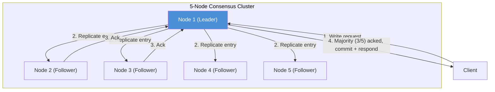

The diagram shows the essential shape of every leader-based consensus protocol: a client talks only to the leader, the leader fans the entry out to followers, and as soon as a **majority** (here 3 of 5, including the leader itself) has acknowledged the entry, it is safely committed and the client gets a response, without waiting for the two slowest/unreachable followers.

#### Understanding Distributed Consensus: Real-Life Use Case

**Kubernetes** stores every piece of cluster state (deployments, pods, services, secrets) in **etcd**, a distributed key-value store built directly on top of the Raft consensus algorithm. When you run `kubectl apply`, the API server writes the desired state to etcd; etcd's Raft layer replicates that write to a majority of its (typically 3 or 5) nodes before acknowledging it, guaranteeing that even if the etcd leader crashes immediately afterward, the write survives on the new leader. Without Raft underneath etcd, a leader crash immediately after acknowledging a write could silently lose that write, corrupting the cluster's understanding of its own desired state, exactly the kind of correctness bug that would make Kubernetes unsafe to run in production.

#### Understanding Distributed Consensus: Java/Spring Boot Code Example

A minimal illustration of the quorum-counting primitive that every consensus algorithm relies on, exposed as a Spring Boot service so it can be exercised over HTTP.

```java
import org.springframework.web.bind.annotation.*;
import org.springframework.stereotype.Service;
import java.util.List;
import java.util.concurrent.atomic.AtomicInteger;

@Service
class QuorumService {

    // Returns true once acks from a strict majority of clusterSize nodes have been counted.
    boolean hasQuorum(int acks, int clusterSize) {
        int majority = (clusterSize / 2) + 1;
        return acks >= majority;
    }

    // Simulates broadcasting a write to all peers and waiting for majority acknowledgement.
    boolean replicateWithQuorum(List<String> peerNodes, String entry) {
        AtomicInteger acks = new AtomicInteger(1); // leader counts itself
        for (String peer : peerNodes) {
            boolean ackedByPeer = simulateSendToPeer(peer, entry);
            if (ackedByPeer) {
                acks.incrementAndGet();
            }
        }
        int clusterSize = peerNodes.size() + 1; // peers + leader
        return hasQuorum(acks.get(), clusterSize);
    }

    private boolean simulateSendToPeer(String peer, String entry) {
        // In a real system this is an RPC (e.g., AppendEntries). Simulated here as always succeeding.
        return true;
    }
}

@RestController
@RequestMapping("/consensus")
class ConsensusDemoController {

    private final QuorumService quorumService;

    ConsensusDemoController(QuorumService quorumService) {
        this.quorumService = quorumService;
    }

    @PostMapping("/replicate")
    public String replicate(@RequestBody ReplicateRequest request) {
        boolean committed = quorumService.replicateWithQuorum(request.peers(), request.entry());
        return committed ? "COMMITTED (majority acked)" : "NOT COMMITTED (no majority)";
    }
}

record ReplicateRequest(List<String> peers, String entry) {}
```

#### Understanding Distributed Consensus: Interview Questions and Answers

**Q1. What problem does distributed consensus actually solve?**
A: It solves the problem of getting a set of independent, potentially failing machines communicating over an unreliable network to agree on a single value, or more commonly, a single ordered sequence of values (a log), such that every non-faulty node ends up applying the same operations in the same order and therefore reaches the same state.

**Q2. Why do consensus protocols use majority quorums instead of requiring all nodes to agree?**
A: Requiring unanimous agreement would mean a single node failure halts the entire system, which defeats the purpose of building a fault-tolerant cluster. Majority quorums (`floor(N/2)+1`) guarantee that any two quorums in a cluster must overlap by at least one node, which is exactly the property that prevents two different values from being committed independently by two different partitions.

**Q3. Why did Diego Ongaro and John Ousterhout create Raft when Paxos already existed and was formally proven?**
A: Paxos, while correct, was widely reported by practitioners (including Google engineers implementing Chubby) as extremely difficult to understand, teach, and implement correctly, especially its multi-decree (Multi-Paxos) production variants, which are not fully specified in Lamport's original papers. Raft was explicitly designed with "understandability" as a primary engineering goal, decomposing the problem into independently comprehensible pieces (leader election, log replication, safety) while preserving the same formal fault-tolerance guarantees.

**Q4. How many node failures can a Raft/Paxos cluster of size N tolerate, and why?**
A: `floor((N-1)/2)` failures. A cluster of N nodes needs a majority, `floor(N/2)+1`, to be alive and reachable to make progress. The maximum number of nodes that can fail while a majority still remains is `N - (floor(N/2)+1) = floor((N-1)/2)`. For N=3 this is 1 failure; for N=5 this is 2 failures.

**Q5. Is a distributed consensus protocol CP or AP in CAP theorem terms, and what does that mean in practice?**
A: CP. Consensus protocols deliberately sacrifice availability during a network partition: the minority side (or a cluster that has lost a majority entirely) will refuse to elect a leader or accept writes rather than risk two leaders committing conflicting entries. In practice this means a 5-node cluster split into a 2-node group and a 3-node group will have the 3-node group keep serving writes while the 2-node group returns errors/timeouts until connectivity is restored.

---

### Raft Node States: Follower, Candidate, and Leader

Every node in a Raft cluster is, at any given moment, in exactly one of **three states**: **Follower**, **Candidate**, or **Leader**. This tiny state machine is the backbone of Raft's understandability: instead of every node running identical, symmetric logic (as in leaderless protocols), Raft nodes take on clearly different roles with clearly different responsibilities, and the rules for moving between roles are simple and few.

**The three states:**

| State | Responsibilities | How it got here | How it leaves |
|---|---|---|---|
| **Follower** | Passively responds to RPCs from the leader and candidates; applies committed log entries; never initiates anything on its own | Default starting state for every node | Times out without hearing from a leader -> becomes Candidate |
| **Candidate** | Requests votes from all other nodes to try to become leader | A Follower's election timeout expired | Wins majority of votes -> becomes Leader; discovers a legitimate leader -> becomes Follower; election times out again -> stays Candidate, starts a new election |
| **Leader** | Handles all client requests; appends new entries to its own log; replicates entries to followers via `AppendEntries` RPCs; sends periodic heartbeats | Won a majority of votes as a Candidate | Discovers a node with a higher term -> steps down to Follower |

**The state transition rules, precisely:**

- A node starts as a **Follower**.
- If a Follower receives no communication (heartbeat or `AppendEntries`) from a leader before its randomized **election timeout** elapses, it assumes there is no functioning leader, increments its term, and transitions to **Candidate**, immediately starting an election.
- A **Candidate** votes for itself and sends `RequestVote` RPCs to every other node in parallel. If it receives votes from a majority, it becomes **Leader** for that term. If it discovers, via an incoming RPC, that another node has already won the election for the current term (or a newer term), it reverts to **Follower**. If neither happens before its own election timeout elapses, it starts a fresh election with an incremented term.
- A **Leader** stays leader until it discovers (via any RPC exchange) that some other node has a strictly higher term, at which point it immediately steps down to **Follower**. There is no direct transition from Leader back to Candidate; a demoted leader always becomes a Follower first.

This produces a strict, cyclical state machine with an important safety property baked directly into the design: **at most one leader can exist for any given term**, because winning an election requires a majority vote, and a node only ever casts one vote per term.

#### Raft Node States: Characteristics

- **Exactly one active role at a time**: A node is never simultaneously a Follower and a Candidate; the state machine is strictly single-state, which is part of what keeps the protocol easy to reason about compared to more free-form leaderless designs.
- **Passive by default**: The Follower state (where most nodes spend most of their time in a healthy cluster) is purely reactive, it never initiates RPCs, which minimizes unnecessary network chatter in the steady state.
- **Randomized timeouts prevent perpetual split votes**: Each node picks its election timeout randomly from a range (Raft's paper suggests 150-300ms), so that in the common case exactly one node times out first and wins the election before others even start theirs.
- **Term numbers act as a logical clock across state transitions**: Every state transition is tagged with a term number, and nodes always defer to whichever peer has the higher term, guaranteeing eventual convergence on a single recognized leader even after multiple competing elections.

#### Raft Node States: Components

- **State variable**: The in-memory (and sometimes persisted, for debugging) flag tracking whether the node is currently Follower, Candidate, or Leader.
- **Election timer**: A randomized, resettable timer; resets on any valid RPC from a current leader or a granted vote, and firing transitions a Follower or Candidate into (a new) Candidate state.
- **Heartbeat/AppendEntries sender (Leader only)**: A periodic timer, firing far more frequently than the election timeout, that sends empty (or entry-carrying) `AppendEntries` RPCs to all followers to assert continued leadership.
- **Vote tracker (Candidate only)**: A counter of granted votes for the current election, compared against the cluster's majority threshold.
- **Persistent term and vote record**: `currentTerm` and `votedFor`, persisted to stable storage so that a crashed-and-restarted node does not accidentally vote twice in the same term or forget it already voted.

#### Raft Node States: Patterns

- **Randomized timeout to break symmetry**: A recurring distributed-systems pattern (also seen in Ethernet's exponential backoff, and TCP's connection retransmission jitter), using randomness specifically to avoid multiple nodes acting in lockstep and perpetually colliding.
- **Single active coordinator per epoch**: The Leader-per-term pattern reused across Raft, ZAB (primary per epoch), and Viewstamped Replication (primary per view), simplifying reasoning about the order of operations compared to leaderless designs.
- **Fail-fast step-down on higher term discovery**: Any node, in any state, immediately reverts to Follower upon observing a strictly higher term, a simple, universal rule that avoids needing special-case logic for "am I stale" checks scattered throughout the codebase.

#### Raft Node States: Pros / Benefits

- **Small, easy-to-implement state machine**: Three states and a handful of transition rules is small enough to implement, test, and formally model-check exhaustively, which is a major reason Raft implementations tend to have fewer subtle bugs than hand-rolled Paxos variants.
- **Clear separation of responsibility**: Because only the Leader accepts writes, application code and RPC handlers can be written with a simple mental model ("am I the leader? if not, redirect/reject"), rather than needing to reason about concurrent writers.
- **Self-healing without an external orchestrator**: The Follower -> Candidate -> Leader cycle runs entirely within the cluster; no external process manager or orchestrator needs to detect a leader failure and manually promote a replacement.

#### Raft Node States: Cons / Challenges

- **Momentary unavailability during election**: While an election is in progress (typically a few hundred milliseconds), there is no leader, so the cluster cannot accept new writes, a brief availability dip that must be accounted for in SLAs.
- **Poorly tuned timeouts cause instability**: If the election timeout range is too close to the heartbeat interval, or too small relative to real network latency, followers can time out and trigger unnecessary elections even when the leader is healthy, causing "leader churn."
- **Split votes are possible (though rare)**: If randomized timeouts happen to align closely, multiple Candidates can start elections in the same term and split the vote, requiring another round; Raft handles this correctly but it does cost extra time.

#### Raft Node States: Best Practices

- Set the heartbeat interval to roughly one-tenth (or less) of the minimum election timeout, so followers reliably hear from a healthy leader several times before ever considering it dead.
- Randomize election timeouts across a meaningfully wide range (e.g., 150-300ms, or wider on higher-latency networks) to make split votes rare in practice.
- Persist `currentTerm` and `votedFor` to disk before responding to any RPC that changes them, so a node restarting after a crash cannot violate the "one vote per term" invariant.
- Expose current node state (Follower/Candidate/Leader) and current term as first-class observability metrics; frequent, unexpected state changes are one of the earliest signals of network or resource issues.

#### Raft Node States: When to Use

- This state machine is intrinsic to Raft itself; you "use" it any time you adopt Raft, whether via a library (Hashicorp Raft, etcd's raft package) or a Raft-backed system (etcd, Consul, CockroachDB).
- Understanding the three-state model is essential when operating any Raft-backed system, since dashboards, logs, and alerts for tools like etcd and Consul are expressed directly in terms of these states (e.g., "node X became candidate", "leader changed").

#### Raft Node States: Diagram

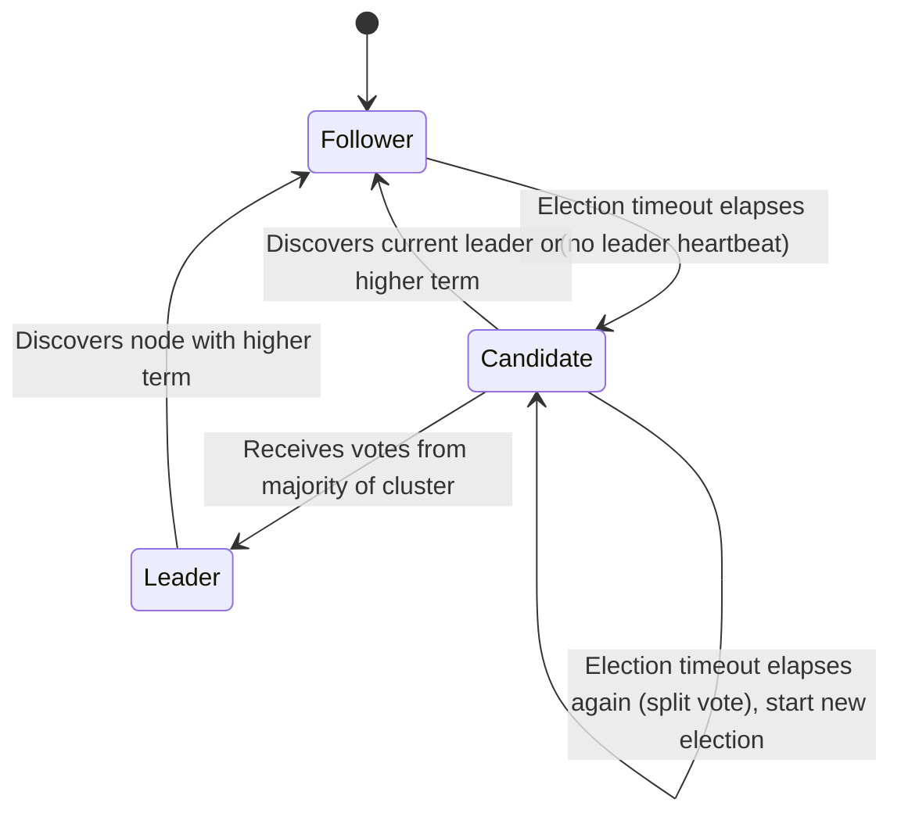

The diagram captures the entire lifecycle of a Raft node in five transitions: it starts as a Follower, becomes a Candidate only after silence from a leader, becomes Leader only with majority support, and always falls back to Follower the instant it learns of a more up-to-date term, guaranteeing the cluster converges on a single leader.

#### Raft Node States: Real-Life Use Case

In a 5-node **HashiCorp Consul** cluster running in a data center, four nodes are healthy Followers quietly applying entries from the current Leader. When the rack hosting the Leader loses power, the four remaining Followers each start an election timer; because timeouts are randomized, one node (say, the one with the shortest randomized timeout) becomes a Candidate first, requests votes, and, receiving three votes (a majority of the remaining four, and a majority of the original five), becomes the new Leader within a few hundred milliseconds, all without any human intervention or external orchestration tool noticing the failure and manually promoting a replacement.

#### Raft Node States: Java/Spring Boot Code Example

```java
import org.springframework.stereotype.Component;
import org.springframework.scheduling.annotation.Scheduled;
import java.util.concurrent.atomic.AtomicReference;
import java.util.concurrent.atomic.AtomicLong;
import java.util.concurrent.ThreadLocalRandom;

enum RaftState { FOLLOWER, CANDIDATE, LEADER }

@Component
class RaftNodeStateMachine {

    private final AtomicReference<RaftState> state = new AtomicReference<>(RaftState.FOLLOWER);
    private final AtomicLong currentTerm = new AtomicLong(0);
    private volatile long lastHeartbeatMillis = System.currentTimeMillis();
    private final long electionTimeoutMillis = 150 + ThreadLocalRandom.current().nextLong(150); // 150-300ms

    // Called whenever a valid AppendEntries or RequestVote grant arrives from a legitimate leader.
    void onLeaderHeartbeatReceived(long leaderTerm) {
        if (leaderTerm >= currentTerm.get()) {
            currentTerm.set(leaderTerm);
            state.set(RaftState.FOLLOWER);
            lastHeartbeatMillis = System.currentTimeMillis();
        }
    }

    // A background scheduler checks for election timeout, mirroring Raft's timer-driven design.
    @Scheduled(fixedDelay = 20)
    void checkElectionTimeout() {
        boolean timedOut = System.currentTimeMillis() - lastHeartbeatMillis > electionTimeoutMillis;
        if (timedOut && state.get() != RaftState.LEADER) {
            becomeCandidate();
        }
    }

    private void becomeCandidate() {
        state.set(RaftState.CANDIDATE);
        currentTerm.incrementAndGet();
        lastHeartbeatMillis = System.currentTimeMillis(); // reset while this election is pending
        // In a full implementation: send RequestVote RPCs to all peers here.
    }

    void onWonElection() {
        if (state.get() == RaftState.CANDIDATE) {
            state.set(RaftState.LEADER);
        }
    }

    void onDiscoveredHigherTerm(long observedTerm) {
        if (observedTerm > currentTerm.get()) {
            currentTerm.set(observedTerm);
            state.set(RaftState.FOLLOWER);
        }
    }

    RaftState getState() {
        return state.get();
    }
}
```

#### Raft Node States: Interview Questions and Answers

**Q1. What are the three states a Raft node can be in, and can a node be in more than one at a time?**
A: Follower, Candidate, and Leader. A node is always in exactly one of these states; the transitions are mutually exclusive and there is no combined or intermediate state.

**Q2. Why does Raft use randomized election timeouts instead of a fixed timeout for every node?**
A: A fixed, identical timeout would cause every Follower to notice the leader's absence at the same instant and start an election simultaneously, very likely splitting the vote among several Candidates in the same term and requiring repeated retries. Randomizing the timeout (e.g., uniformly between 150-300ms) makes it statistically likely that one node's timer fires meaningfully before the others', letting it win the election cleanly before competitors even become Candidates.

**Q3. Can a Leader ever transition directly back into a Candidate?**
A: No. A Leader only ever steps down to Follower (upon discovering a higher term from another node's RPC). If that Follower's own election timeout later expires because it hears nothing from a new leader, it will then become a Candidate, but that is always via the Follower state, never a direct Leader-to-Candidate transition.

**Q4. What stops two nodes from both becoming Leader in the same term?**
A: The majority-vote requirement. Each node casts at most one vote per term (persisted as `votedFor`), so a Candidate needs votes from a strict majority of the cluster to win. Since any two majorities in a cluster must overlap by at least one node, two different Candidates cannot both independently gather a majority of votes in the same term, at most one can win.

**Q5. What happens if a Candidate's election times out before it wins or loses?**
A: It starts a brand-new election: it increments its term again, resets its vote count, votes for itself, and re-sends `RequestVote` RPCs. Because the new attempt uses a freshly randomized timeout and an incremented term, repeated split votes become progressively less likely with each retry.

---

### Terms: Raft's Logical Clock

Raft divides time into an arbitrary sequence of **terms**, numbered with consecutive integers. A term is Raft's substitute for a global wall clock, which cannot be relied on in a distributed system because clocks on different machines drift and cannot be perfectly synchronized. Instead, every node tracks a monotonically increasing integer, `currentTerm`, and terms serve as a **logical clock**: they let nodes detect stale information (an old leader, an old vote) without ever needing to compare real timestamps.

**How a term works:**

- Each term begins with an **election**, during which one or more Candidates try to become Leader.
- If a Candidate wins the election, it remains Leader for the **rest of that term**, sending heartbeats and replicating entries.
- A term can also end with **no leader elected** at all (a split vote), in which case a new term begins almost immediately with a fresh election.
- Terms act as a **logical clock**: every RPC (`RequestVote`, `AppendEntries`) carries the sender's current term. Whenever a node (in any state) receives an RPC with a term **higher** than its own, it immediately updates its `currentTerm` to that value and reverts to Follower. Whenever a node receives an RPC with a term **lower** than its own, it rejects the RPC outright, since the sender is clearly out of date.

**Why terms matter for correctness:** because every message is tagged with a term, and nodes always defer to higher terms while rejecting stale ones, Raft can definitively answer "which of these two conflicting pieces of information is more recent?" without any real-time clock at all. This is precisely how Raft detects and discards a stale, partitioned-away leader that thinks it is still in charge: the moment it reconnects and observes a higher term from the rest of the cluster, its own term is out of date and it steps down.

#### Terms: Characteristics

- **Monotonically increasing, never decreasing**: `currentTerm` only ever goes up, on any given node, for the lifetime of the cluster (barring a full data-loss disaster recovery), which is what makes "higher term wins" an unambiguous, total-order comparison.
- **At most one Leader per term**: Because winning an election requires a majority vote and each node votes at most once per term, a given term number can have at most one Leader ever associated with it, though it can have zero (if the term's election results in a split vote or timeout).
- **Piggybacked on every RPC**: Every `RequestVote` and `AppendEntries` RPC (and their responses) carries a term number, making term comparison a first-class part of every single network exchange rather than a separate side-channel.
- **Persisted across restarts**: `currentTerm` (along with `votedFor`) is written to stable storage before a node responds to any RPC that changes it, so a node that crashes and restarts does not "forget" how far the cluster has progressed and accidentally violate the one-vote-per-term rule.

#### Terms: Components

- **`currentTerm` (persistent state)**: The node's own view of the latest term it knows about; initialized to 0 and only ever incremented.
- **`votedFor` (persistent state)**: Which candidate (if any) this node voted for during `currentTerm`; reset to null (unvoted) whenever `currentTerm` advances.
- **Term field on RPC requests/responses**: Every `RequestVote`/`AppendEntries` request and reply includes a term, used by both sides to detect staleness.
- **Term comparison logic**: The universal rule, embedded in every RPC handler, "if incoming term > my term, update and become Follower; if incoming term < my term, reject the RPC."

#### Terms: Patterns

- **Logical clock instead of wall clock**: A direct, practical instance of Lamport's logical clock concept, using a simple monotonic counter (rather than fragile, hard-to-synchronize real-time clocks) to establish a partial/total order of events across machines.
- **Piggyback metadata on existing messages**: Rather than a separate "term synchronization protocol," Raft attaches the term to messages the system needs to send anyway (votes, heartbeats), a lightweight pattern that avoids extra round-trips.
- **Fence stale actors automatically**: The higher-term-wins rule acts as a natural "fencing token" mechanism (similar in spirit to fencing tokens in distributed locking), automatically neutralizing a stale leader the instant it re-contacts the cluster.

#### Terms: Pros / Benefits

- **No clock synchronization required**: Raft never needs NTP-level clock synchronization or bounded clock skew guarantees (unlike some systems that rely on synchronized clocks for correctness, e.g., Google Spanner's TrueTime), simplifying deployment on commodity infrastructure.
- **Trivial staleness detection**: A single integer comparison is enough to know whether a piece of information (a claimed leadership, a vote, a log entry's origin) is current or stale, no vector clocks or complex causal history tracking needed.
- **Automatic recovery from network partitions**: A leader isolated in a minority partition will, upon healing, immediately learn of a higher term and step down, with zero special-case "partition recovery" logic required beyond the standard term comparison rule.

#### Terms: Cons / Challenges

- **Term numbers can grow quickly under network instability**: A flapping network or poorly tuned timeouts can cause frequent elections, rapidly incrementing the term counter and causing "leader churn," which, while safe, does hurt throughput.
- **Extra field on every RPC**: Every message needs to carry and validate the term, a small but nonzero overhead (both in message size and in the mandatory comparison logic on every handler).
- **Not sufficient alone to guarantee log safety**: Term comparison protects against a stale leader believing it is still in charge, but the election restriction (see the Safety topic below) is additionally required to guarantee a new leader actually has all previously committed entries; a term counter alone does not guarantee that.

#### Terms: Best Practices

- Always persist `currentTerm` and `votedFor` to durable storage synchronously before replying to any RPC that changes them; a crash between updating in-memory state and persisting it can violate Raft's core safety guarantees.
- Reject (do not just ignore) RPCs carrying a stale term, and always reply with your own current term, so the stale sender can immediately correct itself.
- Treat a rapidly increasing term counter (frequent elections) as an operational alarm signal, it usually indicates network instability, an overloaded leader, or badly tuned election timeouts, not normal healthy operation.
- Never attempt to derive term ordering from wall-clock timestamps as a "shortcut"; the entire point of terms is to avoid depending on synchronized real-time clocks.

#### Terms: When to Use

- Terms are intrinsic to Raft; any Raft deployment automatically uses this mechanism, there is no independent decision to "use terms or not."
- When debugging or operating a Raft-backed system (etcd, Consul), always check the current term first when investigating "split brain" concerns or unexpected leader changes; a jump in term number is the clearest signal that an election occurred.
- When implementing a new Raft-like protocol from scratch, adopt the logical-clock-via-monotonic-integer pattern rather than reaching for wall-clock timestamps or more complex vector clocks, term numbers are sufficient for Raft's specific ordering needs.

#### Terms: Diagram

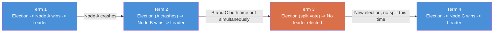

The diagram shows terms behaving purely as a counter of "election epochs": Term 3 illustrates that a term does not guarantee a leader was actually elected (a split vote can waste a whole term with no leader), while Terms 1, 2, and 4 each show a distinct node winning leadership for that period, with the term number alone being enough to tell any observer which leadership episode is more recent.

#### Terms: Real-Life Use Case

In **etcd**, every key-value write is internally tagged, in the Raft log, with the term (and log index) it was committed under. When operators use `etcdctl endpoint status` or inspect etcd's metrics, the `raft_term` value is one of the very first numbers site reliability engineers check during an incident: a term that has recently jumped by several numbers in a short window is a strong, immediate signal that the cluster experienced repeated leader elections (often due to network flakiness or an overloaded node), long before any application-level symptoms would otherwise reveal the problem.

#### Terms: Java/Spring Boot Code Example

```java
import org.springframework.stereotype.Component;
import java.util.concurrent.atomic.AtomicLong;
import java.util.concurrent.atomic.AtomicReference;

@Component
class RaftTermManager {

    private final AtomicLong currentTerm = new AtomicLong(0);
    private final AtomicReference<String> votedFor = new AtomicReference<>(null);

    long getCurrentTerm() {
        return currentTerm.get();
    }

    // Applies the universal Raft rule: any RPC carrying a higher term forces this node
    // to adopt that term and clear its vote, regardless of its current state.
    boolean maybeUpdateTerm(long incomingTerm) {
        long existing = currentTerm.get();
        if (incomingTerm > existing) {
            currentTerm.set(incomingTerm);
            votedFor.set(null); // fresh term means we have not voted yet
            persistTermAndVote(incomingTerm, null); // durable write required before replying
            return true; // caller should revert to FOLLOWER
        }
        return false;
    }

    // Called when this node grants a vote in RequestVote handling.
    boolean tryVote(long candidateTerm, String candidateId) {
        if (candidateTerm < currentTerm.get()) {
            return false; // stale candidate, reject
        }
        if (candidateTerm > currentTerm.get()) {
            maybeUpdateTerm(candidateTerm);
        }
        String existingVote = votedFor.get();
        if (existingVote == null || existingVote.equals(candidateId)) {
            votedFor.set(candidateId);
            persistTermAndVote(candidateTerm, candidateId);
            return true;
        }
        return false; // already voted for someone else this term
    }

    private void persistTermAndVote(long term, String vote) {
        // In production this writes synchronously to disk (or a WAL) before returning.
    }
}
```

#### Terms: Interview Questions and Answers

**Q1. Why does Raft use an incrementing integer "term" instead of real timestamps to order events?**
A: Real timestamps require synchronized clocks across machines, which is difficult to guarantee precisely in a distributed system (clock drift, NTP issues, leap seconds). A simple monotonically increasing integer, incremented only at well-defined points (starting a new election), gives Raft an unambiguous logical ordering of events without any dependency on real-time clock synchronization.

**Q2. Can a single term have more than one Leader?**
A: No, never. Winning an election for a term requires a majority vote, and every node votes at most once per term. Since any two majorities of the cluster must overlap by at least one node, it is mathematically impossible for two different candidates to both win a majority in the same term.

**Q3. What does a node do when it receives an RPC containing a term lower than its own?**
A: It rejects the RPC and responds with its own (higher) current term, without changing any of its own state. This tells the sender, which is clearly operating on stale information (e.g., a partitioned-away former leader), that it needs to update its own term and step down.

**Q4. What does a node do when it receives an RPC containing a term higher than its own?**
A: Regardless of its current state (even if it is currently the Leader), it immediately updates its `currentTerm` to the higher value, clears its `votedFor` for the new term, and transitions to Follower state before processing the rest of the RPC.

**Q5. Why must `currentTerm` and `votedFor` be persisted to disk rather than kept only in memory?**
A: If a node crashes and restarts, an in-memory-only `votedFor` would be lost, and the restarted node could vote again in a term it already voted in, potentially allowing two leaders to be elected for the same term, a direct safety violation. Persisting these fields durably before responding to any RPC that changes them ensures a restarted node can never violate the one-vote-per-term guarantee.

---

### Leader Election

**Leader election** is the process by which a Raft cluster picks exactly one node to act as Leader for a given term. It is triggered whenever a Follower stops hearing from a current Leader (its election timeout expires) and is carried out entirely through the **`RequestVote` RPC**.

**Step-by-step election process:**

1. A Follower's election timer expires (no `AppendEntries` heartbeat received in time). It transitions to **Candidate**.
2. The Candidate increments its `currentTerm`, votes for itself, and persists `(currentTerm, votedFor=self)` to stable storage.
3. It resets its own election timer (to a fresh random value) and sends a **`RequestVote` RPC in parallel** to every other node in the cluster. Each request includes: the candidate's term, its ID, and information about how up-to-date its log is (`lastLogIndex`, `lastLogTerm`).
4. Each receiving node grants its vote **only if all of these hold**:
   - The candidate's term is at least as large as the voter's own current term.
   - The voter has not already voted for a different candidate in this term (`votedFor` is null or already equals the candidate).
   - The candidate's log is **at least as up-to-date** as the voter's own log (the "election restriction," covered in depth in the Safety topic below); a voter refuses to vote for a candidate whose log is behind its own.
5. The Candidate counts votes as they arrive. Three outcomes are possible:
   - **It receives votes from a majority**: it immediately becomes Leader, and starts sending heartbeats to establish authority and prevent new elections.
   - **It receives an `AppendEntries` RPC from another node claiming to be Leader, with a term at least as large as its own**: it recognizes the legitimate leader and reverts to Follower.
   - **Its own election timeout elapses again with no majority reached** (a split vote, or lost/slow responses): it starts an entirely new election with an incremented term and a fresh random timeout.

**Why randomized timeouts are essential:** if every node used the exact same fixed timeout, all Followers of a failed leader would notice at (nearly) the same instant and become Candidates simultaneously, splitting the vote among themselves repeatedly. By drawing each timeout independently from a range (e.g., 150-300ms), Raft makes it statistically likely that one node's timer fires meaningfully earlier than the rest, letting it win cleanly before others even enter the Candidate state.

#### Leader Election: Characteristics

- **Fully decentralized, no external election authority**: There is no separate coordinator deciding who becomes leader; the cluster nodes vote among themselves purely via `RequestVote` RPCs.
- **Safety-first vote granting**: A vote is never granted purely on "who asked first"; it always additionally checks the candidate's log recency, which is what prevents a node with a stale/incomplete log from ever becoming leader.
- **Self-limiting to one election attempt per term per candidate**: A Candidate that starts an election for term T cannot restart within the same term; a new attempt always increments the term first.
- **Probabilistically fast convergence**: With well-tuned timeout ranges, elections typically resolve in a single round in well under a second, even though the algorithm technically allows for multiple retries.

#### Leader Election: Components

- **Election timer**: The randomized, resettable timer whose expiry triggers the transition to Candidate.
- **`RequestVote` RPC handler**: The logic (on every node) implementing the vote-granting rules: term check, one-vote-per-term check, and log-recency check.
- **Vote counter**: State a Candidate maintains during its own election, tracking how many (and which) nodes have granted votes so far.
- **Self-vote**: Every Candidate always votes for itself first, which is why a majority requires votes from `floor(N/2)` *additional* nodes beyond the candidate itself.
- **`lastLogIndex` / `lastLogTerm`**: The pieces of information a candidate includes in its `RequestVote` request, and a voter uses to judge whether the candidate's log is at least as up-to-date as its own.

#### Leader Election: Patterns

- **Randomized backoff to avoid contention**: The same fundamental pattern used in Ethernet's collision backoff and countless retry/jitter strategies in distributed systems, applied here to avoid repeated split votes.
- **Quorum voting with a safety precondition**: Vote-granting is not unconditional; it is gated by an additional correctness check (log recency), a pattern of "quorum, plus an eligibility filter" that shows up again in the Safety topic below.
- **First-mover advantage via timing, not priority**: Unlike some leader-election schemes that use explicit priority/rank, Raft's leader election relies purely on whoever's randomized timer fires first (and whose log qualifies), keeping the mechanism simple and free of separate configuration.

#### Leader Election: Pros / Benefits

- **Automatic, fast failover**: A leader failure is detected and a replacement is elected typically within a few hundred milliseconds to low seconds, without any manual intervention or external orchestrator.
- **Guaranteed correctness even with concurrent candidates**: Even if a network hiccup causes two or more Followers to become Candidates around the same time, the majority-vote-plus-log-recency rules guarantee that at most one can win, and if none win, the retry mechanism resolves it.
- **No dependency on external failure detection infrastructure**: The cluster's own heartbeat/timeout mechanism is sufficient; no separate health-check service, load balancer, or orchestration tool is required to detect a leader failure.

#### Leader Election: Cons / Challenges

- **Momentary write unavailability during the election window**: Between a leader failing and a new one being elected, the cluster cannot accept new writes, an availability cost that must be accounted for in latency-sensitive SLAs.
- **Poor network conditions can cause repeated elections ("leader churn")**: If message delays regularly exceed the election timeout even when the leader is healthy, followers will keep timing out and starting unnecessary elections, hurting throughput and stability.
- **A slightly-behind but otherwise healthy node cannot become leader**: A node whose log has fallen behind (perhaps just from a brief network hiccup) is correctly denied votes by the log-recency check, protecting safety, but it means "closest/fastest" and "eligible to lead" are not always the same node.

#### Leader Election: Best Practices

- Choose an election timeout range comfortably larger than the expected worst-case network round-trip time (Raft's original paper suggests roughly 10x the heartbeat interval as a rule of thumb).
- Keep the heartbeat interval well below the minimum election timeout (often one-tenth or less), so a healthy leader reliably resets every follower's timer several times before any of them could time out.
- Avoid deploying Raft nodes across extremely high-latency links (e.g., different continents) without adjusting timeouts accordingly; unusually high WAN latency is a common cause of avoidable, repeated elections.
- Monitor election frequency as an operational health signal; a healthy cluster should have long, stable leader tenures, with elections only during real leader failures or deliberate maintenance.

#### Leader Election: When to Use

- Leader election runs automatically as an intrinsic part of any Raft deployment; there is no separate decision to enable or disable it.
- When operating a Raft-backed system, watch for excessive election frequency as a signal to investigate network stability, node resource exhaustion (CPU/GC pauses delaying heartbeat processing), or timeout misconfiguration.
- When designing a new leader-based distributed system, adopt Raft's randomized-timeout, quorum-vote, log-recency-gated approach rather than inventing a bespoke leader election scheme, it is well-tested and its failure modes are well understood.

#### Leader Election: Diagram

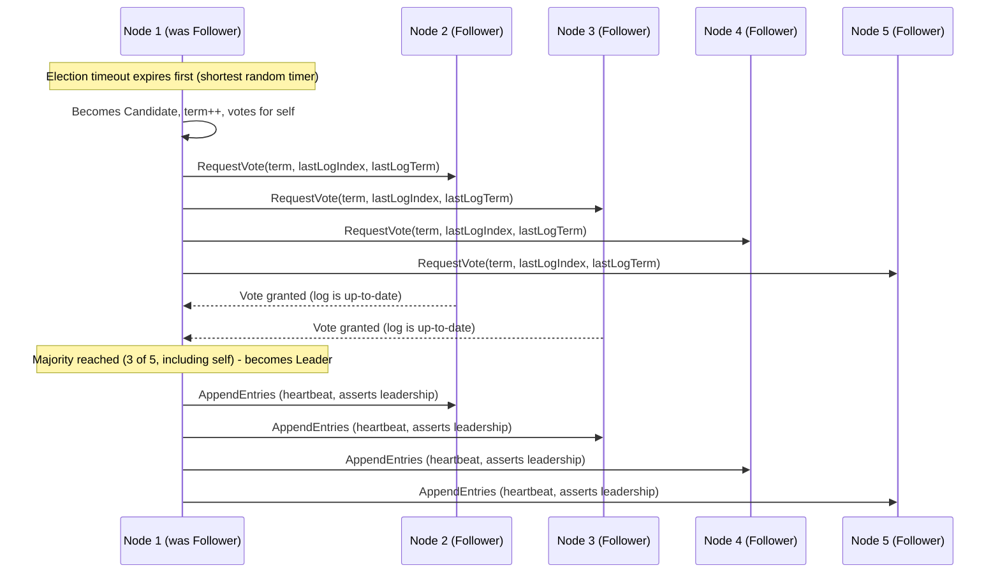

The sequence diagram shows the two-phase nature of a leader election: a burst of `RequestVote` RPCs to gather a majority, followed immediately by the new Leader asserting its authority with heartbeats before any other node's timer can expire and trigger a competing election.

#### Leader Election: Real-Life Use Case

**CockroachDB** shards its data into many small Raft groups (called "ranges"), each independently electing its own leader (called the range's "leaseholder" in CockroachDB's terminology, closely tied to the underlying Raft leader). When a node hosting several range leaders crashes, each affected range independently runs its own Raft leader election among its surviving replicas, in parallel, across potentially thousands of ranges simultaneously. This fine-grained, per-shard leader election is what allows CockroachDB to survive a whole node failure with only a brief, localized blip in availability for the specific ranges that lost their leader, rather than a cluster-wide outage.

#### Leader Election: Java/Spring Boot Code Example

```java
import org.springframework.stereotype.Service;
import org.springframework.web.bind.annotation.*;
import java.util.List;
import java.util.concurrent.atomic.AtomicInteger;
import java.util.concurrent.atomic.AtomicLong;

record RequestVoteRequest(long term, String candidateId, long lastLogIndex, long lastLogTerm) {}
record RequestVoteResponse(long term, boolean voteGranted) {}

@Service
class LeaderElectionService {

    private final AtomicLong currentTerm = new AtomicLong(0);
    private volatile String votedFor = null;
    private final AtomicLong lastLogIndex = new AtomicLong(0);
    private final AtomicLong lastLogTerm = new AtomicLong(0);

    // Vote-granting logic mirroring Raft's RequestVote RPC handler rules.
    synchronized RequestVoteResponse handleRequestVote(RequestVoteRequest req) {
        if (req.term() < currentTerm.get()) {
            return new RequestVoteResponse(currentTerm.get(), false); // stale candidate
        }
        if (req.term() > currentTerm.get()) {
            currentTerm.set(req.term());
            votedFor = null; // new term, clear previous vote
        }

        boolean logIsUpToDate = req.lastLogTerm() > lastLogTerm.get()
                || (req.lastLogTerm() == lastLogTerm.get() && req.lastLogIndex() >= lastLogIndex.get());

        boolean canVote = (votedFor == null || votedFor.equals(req.candidateId())) && logIsUpToDate;

        if (canVote) {
            votedFor = req.candidateId();
            return new RequestVoteResponse(currentTerm.get(), true);
        }
        return new RequestVoteResponse(currentTerm.get(), false);
    }

    // Candidate-side: tallies votes and decides if a majority has been reached.
    boolean hasWonElection(int votesGranted, int clusterSize) {
        int majority = (clusterSize / 2) + 1;
        return votesGranted >= majority;
    }
}

@RestController
@RequestMapping("/raft")
class RaftElectionController {

    private final LeaderElectionService electionService;

    RaftElectionController(LeaderElectionService electionService) {
        this.electionService = electionService;
    }

    @PostMapping("/request-vote")
    public RequestVoteResponse requestVote(@RequestBody RequestVoteRequest request) {
        return electionService.handleRequestVote(request);
    }
}
```

#### Leader Election: Interview Questions and Answers

**Q1. Walk through exactly what happens, step by step, when a Follower's election timeout expires.**
A: It transitions to Candidate, increments `currentTerm`, votes for itself, persists `(currentTerm, votedFor=self)`, resets its own election timer to a fresh random value, and sends `RequestVote` RPCs in parallel to every other node in the cluster, including its own last log index and term so recipients can judge log recency.

**Q2. What three conditions must all be true for a node to grant its vote to a candidate?**
A: (1) The candidate's term must be at least as large as the voter's own current term. (2) The voter must not have already voted for a different candidate in that term. (3) The candidate's log must be at least as up-to-date as the voter's own log (the election restriction).

**Q3. What are the three possible outcomes after a Candidate sends out RequestVote RPCs?**
A: It wins (receives votes from a majority and becomes Leader), it loses (learns of a legitimate leader via an AppendEntries RPC with an equal or higher term, and reverts to Follower), or the election is indecisive (its own timeout expires again with no majority, e.g. a split vote, and it starts a new election with an incremented term).

**Q4. Why does a Candidate always vote for itself?**
A: Voting for itself is what allows a Candidate to be counted toward its own majority; without it, a Candidate would need votes from a full majority of *other* nodes rather than `floor(N/2)` others plus itself, which would needlessly require more external agreement than necessary.

**Q5. What specifically prevents "leader churn" (repeated, frequent elections) in a healthy Raft cluster?**
A: A heartbeat interval kept well below the election timeout, so the Leader resets every Follower's timer well before it could expire, combined with a sufficiently wide randomized timeout range so that transient delays rarely cause a false-positive timeout. If churn happens despite this, it usually points to network instability, an overloaded leader (e.g., GC pauses delaying heartbeat sends), or timeouts tuned too aggressively for the actual network latency.

---

### Log Replication

Once a Leader is elected, its main job is **log replication**: taking client commands, appending them to its own log, and replicating them to a majority of followers before considering them committed. The **replicated log** is the actual mechanism by which every node's state machine ends up identical, since every node applies the same commands, in the same order, from this log.

**How log replication works, step by step:**

1. A client sends a command (e.g., `SET x=5`) to the Leader.
2. The Leader appends the command to its own log as a new entry, tagged with its current term and the next log index.
3. The Leader sends `AppendEntries` RPCs, in parallel, to all followers. Each RPC includes: the new entry (or entries), the index and term of the entry immediately preceding it (`prevLogIndex`, `prevLogTerm`), and the Leader's current `commitIndex`.
4. Each Follower appends the entry to its own log, **but only if** its log already contains an entry at `prevLogIndex` with a matching term (the **log matching check**, detailed in the Safety topic below). If the check fails, the Follower rejects the RPC, and the Leader retries with an earlier `prevLogIndex`, walking backward until it finds a point where the logs agree, then overwrites the Follower's log with correct entries from that point forward.
5. Once the Leader has confirmed the entry replicated to a **majority** of the cluster (including itself), the entry is **committed**. The Leader applies it to its own state machine and responds to the client.
6. The Leader includes its up-to-date `commitIndex` in subsequent `AppendEntries` RPCs (even empty heartbeats), so followers learn which entries are safe to apply to their own local state machines.

**The key insight:** followers never decide anything on their own; they are purely reactive, appending whatever the Leader tells them to, and only ever apply entries the Leader has explicitly marked as committed. This strict "Leader proposes, majority acknowledges, Leader commits" flow is what keeps log replication simple to reason about compared to leaderless quorum-write protocols.

#### Log Replication: Characteristics

- **Strictly Leader-driven**: All writes originate at the Leader; followers never accept client writes directly (they redirect clients to the current leader instead).
- **Ordered, gapless log per node**: Each node's log is an append-only sequence indexed by strictly increasing integers, with no gaps, entries are never inserted out of order.
- **Majority-based commitment**: An entry is committed the instant a majority (not all) of the cluster has durably stored it, bounding write latency by the quorum's response time rather than the slowest node's.
- **Eventually consistent followers, always consistent commit index**: A lagging follower may temporarily be missing recent entries, but the set of entries the Leader has marked as *committed* is guaranteed, by Raft's safety properties, never to be lost or reordered on any future leader.

#### Log Replication: Components

- **Log entry**: A tuple of `(term, index, command)`, the fundamental unit replicated across the cluster.
- **`nextIndex[]` (Leader-only, per-follower)**: The index of the next log entry the Leader believes it needs to send to each specific follower; used to track replication progress per-peer.
- **`matchIndex[]` (Leader-only, per-follower)**: The highest log index the Leader knows to be replicated on each follower, used to compute the commit index.
- **`commitIndex`**: The highest log index known to be committed (replicated to a majority); every node tracks its own view of this, updated by the leader's `AppendEntries` RPCs.
- **`AppendEntries` RPC**: The single RPC type used both to replicate new entries and, in its empty form, as a heartbeat asserting the Leader's continued authority.

#### Log Replication: Patterns

- **Single-writer, fan-out replication**: All writes flow through one node (the Leader) which then fans them out, a pattern that trades some write-path parallelism for dramatically simpler consistency reasoning versus a multi-writer scheme.
- **Optimistic append with backward-walking repair**: The Leader optimistically sends entries assuming the follower's log matches, and only falls back to a backward "find the divergence point" search when a consistency check fails, an efficient default-path/slow-path split.
- **Piggybacked heartbeats**: Reusing the exact same `AppendEntries` RPC (just with an empty entry list) for both replication and liveness heartbeats avoids maintaining two separate RPC types and keeps followers' knowledge of `commitIndex` continuously up to date.
- **Log as the single source of truth for state machine input**: The pattern of "agree on an ordered log, then deterministically apply it," reused far beyond Raft (this is exactly how Kafka-based event sourcing and write-ahead-log-based databases work).

#### Log Replication: Pros / Benefits

- **Strong consistency across all state machine replicas**: Because every node applies the exact same sequence of committed entries, all healthy nodes' state machines are guaranteed to converge to identical states.
- **Efficient common-case replication**: In the steady state (no failures), replication is a single round-trip per entry (or batched, for multiple entries), with no extra negotiation phase needed, unlike protocols requiring a prepare phase for every write.
- **Automatic follower repair**: A follower that fell behind (network blip, restart) is automatically brought back in sync by the Leader's backward-search-and-overwrite mechanism, no manual reconciliation step is needed.
- **Naturally batches for throughput**: A busy Leader can batch multiple client commands into a single `AppendEntries` RPC, amortizing network round-trip cost across many entries.

#### Log Replication: Cons / Challenges

- **Leader is a throughput bottleneck**: Because every write must pass through the single Leader, overall cluster write throughput is bounded by that one node's CPU, disk I/O, and network bandwidth, adding more followers does not increase write throughput.
- **Backward-search repair can be slow after a long partition**: If a follower has been disconnected for a long time and diverged significantly, the naive one-entry-at-a-time backward search to find the matching point can take many round-trips (production implementations typically optimize this with a "conflict term/index" hint in the response).
- **Followers can serve stale reads if queried directly**: A follower's local log may lag the Leader's; reading directly from a follower without additional protocol support (like Raft's read-index or lease-based reads) can return stale data.

#### Log Replication: Best Practices

- Batch multiple pending client commands into a single `AppendEntries` RPC whenever the Leader has more than one queued, rather than sending one RPC per command, to substantially improve throughput.
- Implement the optimized conflict-index/conflict-term backward-search hinting described in the Raft paper's extended version, rather than the naive one-index-at-a-time search, to make follower catch-up after a long disconnect fast.
- Route all client reads (not just writes) through the Leader by default, or implement a proper read-index/lease-based read protocol, rather than reading directly from arbitrary followers, to avoid serving stale data.
- Persist each log entry to durable storage (fsync or equivalent) before acknowledging it, on both Leader and Followers, since an entry acknowledged but not actually durable can be silently lost on a crash.

#### Log Replication: When to Use

- Log replication is the core data path of any Raft deployment; understanding it deeply matters whenever you are debugging replication lag, tuning batching/throughput, or deciding how to serve reads (leader-only vs. follower reads with linearizability guarantees).
- When designing a new system on top of an existing Raft library, use the log purely as an ordered command stream for a deterministic state machine, avoid putting large blobs of unstructured data directly into Raft log entries, since every entry must be replicated to a majority and persisted durably.

#### Log Replication: Diagram

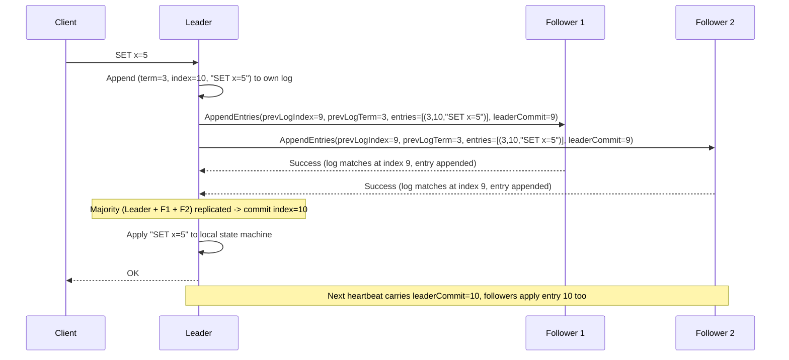

The diagram shows the full happy-path replication cycle: append locally, fan out to followers with a consistency check (`prevLogIndex`/`prevLogTerm`), wait for a majority, commit and apply on the Leader, respond to the client, and only then let the followers learn (via the next heartbeat's `leaderCommit`) that they too can apply the entry to their own state machines.

#### Log Replication: Real-Life Use Case

**TiKV** (the distributed storage layer beneath TiDB) partitions data into many Raft groups. When an application writes a row, the write goes to that row's Raft group Leader, which appends it to its Raft log and replicates it to the group's followers (typically 2 others for a 3-replica group). Only once a majority of the group acknowledges the write does TiKV consider it durable and return success to the client, guaranteeing that even if the node holding the Leader crashes the instant after acknowledging the write, the committed data survives on the remaining majority and is available to the newly elected leader.

#### Log Replication: Java/Spring Boot Code Example

```java
import org.springframework.stereotype.Service;
import org.springframework.web.bind.annotation.*;
import java.util.*;
import java.util.concurrent.ConcurrentHashMap;

record LogEntry(long term, long index, String command) {}
record AppendEntriesRequest(long term, long prevLogIndex, long prevLogTerm,
                             List<LogEntry> entries, long leaderCommit) {}
record AppendEntriesResponse(long term, boolean success) {}

@Service
class RaftLogReplicationService {

    private final List<LogEntry> log = Collections.synchronizedList(new ArrayList<>());
    private final Map<String, Long> nextIndex = new ConcurrentHashMap<>(); // Leader-side, per follower
    private volatile long commitIndex = 0;
    private volatile long currentTerm = 0;

    // Follower-side handler implementing the log matching consistency check.
    synchronized AppendEntriesResponse handleAppendEntries(AppendEntriesRequest req) {
        if (req.term() < currentTerm) {
            return new AppendEntriesResponse(currentTerm, false); // stale leader
        }
        currentTerm = req.term();

        boolean prevMatches = req.prevLogIndex() == 0
                || (log.size() >= req.prevLogIndex()
                    && log.get((int) req.prevLogIndex() - 1).term() == req.prevLogTerm());

        if (!prevMatches) {
            return new AppendEntriesResponse(currentTerm, false); // triggers Leader's backward search
        }

        // Truncate any conflicting suffix, then append the new entries.
        int insertAt = (int) req.prevLogIndex();
        while (log.size() > insertAt) {
            log.remove(log.size() - 1);
        }
        log.addAll(req.entries());

        if (req.leaderCommit() > commitIndex) {
            commitIndex = Math.min(req.leaderCommit(), log.size());
            applyCommittedEntries();
        }
        return new AppendEntriesResponse(currentTerm, true);
    }

    // Leader-side: appends a client command locally before fanning it out to followers.
    synchronized LogEntry appendClientCommand(String command) {
        long index = log.size() + 1;
        LogEntry entry = new LogEntry(currentTerm, index, command);
        log.add(entry);
        return entry;
    }

    private void applyCommittedEntries() {
        // Apply log[appliedIndex..commitIndex] to the local state machine (idempotently).
    }
}

@RestController
@RequestMapping("/raft")
class RaftReplicationController {

    private final RaftLogReplicationService replicationService;

    RaftReplicationController(RaftLogReplicationService replicationService) {
        this.replicationService = replicationService;
    }

    @PostMapping("/append-entries")
    public AppendEntriesResponse appendEntries(@RequestBody AppendEntriesRequest request) {
        return replicationService.handleAppendEntries(request);
    }
}
```

#### Log Replication: Interview Questions and Answers

**Q1. What has to be true before a Leader considers a log entry "committed"?**
A: The entry must be durably stored on a majority of the cluster's nodes, including the Leader itself. Only once a majority has acknowledged storing the entry does the Leader mark it committed, apply it to its own state machine, and respond to the client.

**Q2. How does a Follower decide whether to accept a new entry from `AppendEntries`?**
A: It checks whether its own log already contains an entry at `prevLogIndex` whose term matches `prevLogTerm` (the log matching check). If it does, the follower appends the new entries (truncating any conflicting suffix first). If it does not, the follower rejects the RPC, prompting the Leader to retry with an earlier index until it finds a point of agreement.

**Q3. Why is the same `AppendEntries` RPC used both for replicating new entries and for heartbeats?**
A: Reusing one RPC type for both purposes keeps the protocol simpler (one handler, one set of rules) and ensures that even when there is no new data to replicate, followers still regularly receive the Leader's current term and commit index, which resets their election timers and keeps their `commitIndex` up to date.

**Q4. Why can't followers apply a log entry to their local state machine as soon as they receive it via AppendEntries?**
A: Because receiving an entry only means the follower has durably stored it locally, not that a majority of the cluster has. Applying it prematurely (before it is actually committed) risks applying an entry that later gets overwritten if the Leader crashes and a different, non-overlapping majority elects a new leader whose log diverged before that entry. Followers only apply entries up to the `leaderCommit` index the Leader has explicitly certified as committed.

**Q5. Why is write throughput in a Raft cluster fundamentally bounded by the Leader, and how do real systems work around this?**
A: Every write must be proposed and coordinated by a single Leader, so its CPU, disk, and network capacity set a hard ceiling on write throughput for that Raft group. Real systems (CockroachDB, TiKV) work around this at the architecture level, not by making one Raft group faster, but by partitioning data into many independent Raft groups (shards), each with its own Leader, so total cluster write throughput scales with the number of shards rather than being capped by a single node.

---

### Safety: Election Restriction and the Log Matching Property

Leader election and log replication alone are not enough to guarantee correctness; a naive implementation of both could still lose committed data. Raft adds two crucial **safety properties** that close this gap: the **Election Restriction** and the **Log Matching Property**.

**The Log Matching Property** states: *if two logs contain an entry with the same index and term, then the logs are identical in all entries up through that index.* This property holds because of two simple implementation rules: (1) a Leader creates at most one entry per log index per term (never rewrites an existing index within the same term), and (2) `AppendEntries` includes a consistency check (`prevLogIndex`/`prevLogTerm`) that a Follower must satisfy before accepting new entries, guaranteeing that if a Follower accepts an entry, its entire log prefix up to that point already matches the Leader's.

**The Election Restriction** states: *a candidate cannot win an election unless its log is at least as up-to-date as a majority of the cluster.* This is enforced during voting: a voter compares the candidate's `(lastLogTerm, lastLogIndex)` against its own, and refuses to grant a vote if the candidate's log is less up-to-date (lower last term, or same last term but shorter log). Combined with the requirement that winning needs a **majority** of votes, this guarantees that any elected Leader's log must overlap with, and be at least as current as, at least one member of any prior committing majority, which means **a new Leader is mathematically guaranteed to already contain every entry any previous Leader has committed**.

**Why this matters concretely:** without the election restriction, it would be possible for a node that missed a recently committed entry to win an election anyway (e.g., simply by having a lower randomized timeout) and then, as the new Leader, silently overwrite/lose that already-committed entry when it starts replicating its own (incomplete) log to the rest of the cluster. The election restriction makes this scenario provably impossible.

**A subtle but critical corollary - the "cannot commit entries from previous terms by counting replicas alone" rule:** a Leader can only directly determine an entry is committed by counting replicas for an entry **from its own current term**. It is not safe for a new Leader to declare an older-term entry committed purely because a majority now happens to store it; instead, the Leader commits older entries only *indirectly*, by replicating a new entry from its own current term (which, once counted as committed via the normal majority rule, transitively confirms every entry before it in the log is also committed).

#### Safety: Characteristics

- **Provable, not just empirically tested**: Both the Log Matching Property and the Election Restriction are proven correct in Ongaro and Ousterhout's original paper via formal invariants, not just validated through testing, which is part of why Raft is trusted for production consensus.
- **Enforced at write-time, not fixed up after the fact**: The `prevLogIndex`/`prevLogTerm` check in `AppendEntries` prevents an inconsistent log from ever being accepted in the first place, rather than detecting and repairing inconsistency after it has already happened.
- **Majority overlap guarantees information carries forward**: Because any two majorities of a cluster must share at least one node, and votes require log-recency, information about every committed entry is guaranteed to survive into whichever node the next majority elects as Leader.
- **No cross-term inference from raw replica counts**: Raft deliberately refuses to treat "a majority now has this old-term entry" as proof of commitment on its own, closing a known subtle unsafety case that affects naive consensus implementations.

#### Safety: Components

- **`prevLogIndex` / `prevLogTerm` consistency check**: The mechanism embedded in every `AppendEntries` RPC handler that enforces the Log Matching Property at write time.
- **`lastLogIndex` / `lastLogTerm` comparison**: The mechanism embedded in every `RequestVote` RPC handler that enforces the Election Restriction at election time.
- **Majority quorum overlap guarantee**: The mathematical property (any two majorities of N nodes share at least one common node) that underlies why the election restriction is sufficient to guarantee no committed entry is ever lost.
- **Current-term-only direct commit rule**: The specific rule restricting direct commit-by-counting-replicas to entries from the Leader's own current term.

#### Safety: Patterns

- **Prevention over detection**: Raft's safety mechanisms are built to make inconsistent states impossible to reach in the first place (via RPC-time checks), rather than allowing inconsistency and reconciling it later, a generally preferable pattern whenever the cost of detecting-and-fixing a bad state is high.
- **Quorum intersection as a correctness primitive**: The "any two majorities overlap" fact is a reusable building block seen across many quorum-based systems (not just Raft), anywhere agreement needs to be guaranteed to carry forward across changing sets of participants.
- **Defer commitment inference to the current leader's own writes**: Rather than trying to reason globally about historical replica counts, Raft narrows "am I allowed to declare this committed" down to a simple, local rule tied to the current term, reducing the surface area for subtle bugs.

#### Safety: Pros / Benefits

- **Guarantees zero committed-data loss across leader changes**: As long as a majority of nodes remain available, no acknowledged write is ever silently lost, even across an arbitrary number of subsequent leader elections.
- **Removes an entire class of subtle bugs by construction**: Because the consistency checks are structural (built into the RPCs themselves), engineers implementing Raft do not need to separately reason about every possible interleaving of failures to preserve safety.
- **Formally provable, aiding independent verification**: Because the properties are stated precisely enough to prove, they have been independently model-checked and formally verified by multiple research groups, increasing confidence beyond what testing alone could provide.

#### Safety: Cons / Challenges

- **The election restriction can delay leader election**: A node whose log happens to be behind (through no fault of its own, e.g., it was momentarily partitioned) cannot win an election even if its randomized timer fires first, adding a small amount of extra election time in some failure scenarios.
- **The "commit via current term only" rule is easy to get subtly wrong when reimplementing Raft**: Several published third-party Raft implementations have historically had bugs here (declaring old-term entries committed by replica-counting alone), underscoring why using a well-tested library is preferable to writing your own.
- **Safety properties add real implementation complexity**: The `prevLogIndex`/`prevLogTerm` check and the backward-search repair process are non-trivial to implement exactly right, compared to a naive "just append whatever arrives" approach (which would be unsafe).

#### Safety: Best Practices

- Implement the election restriction's log-comparison exactly as specified (compare `lastLogTerm` first, then `lastLogIndex` as a tiebreaker), rather than approximating it, since an off-by-one or reversed comparison silently reintroduces the possibility of losing committed data.
- Never mark an entry from a previous term as committed purely by counting current replicas of it; only commit indirectly, by successfully replicating and committing a new entry from the current term.
- Use an existing, well-audited Raft implementation (Hashicorp Raft, etcd's raft package) rather than reimplementing these safety checks from scratch, given how many subtle historical bugs have stemmed from getting this exact logic wrong.
- Include these safety invariants explicitly in your test suite (e.g., via deterministic simulation testing / Jepsen-style fault injection) rather than relying only on manual code review to catch violations.

#### Safety: When to Use

- These safety mechanisms are intrinsic and mandatory to correct Raft; there is no scenario where they should be selectively disabled or skipped for performance, doing so reintroduces the possibility of silently losing committed data.
- When implementing (or evaluating) a Raft library from scratch, use these two properties as the primary checklist for correctness review, since the overwhelming majority of Raft implementation bugs trace back to one of these two mechanisms being subtly wrong.

#### Safety: Diagram

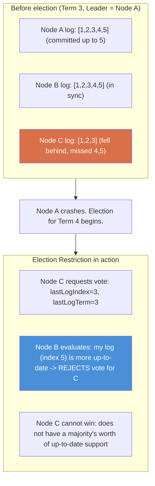

The diagram shows exactly why Node C, despite being alive and willing to lead, is structurally prevented from winning the election: its log is missing already-committed entries (4 and 5), so Node B's vote-granting check correctly refuses it, protecting those committed entries from ever being lost by a new Leader that doesn't have them.

#### Safety: Real-Life Use Case

In **etcd**, this safety guarantee is what allows Kubernetes to trust that once the API server receives a successful write acknowledgement for a resource (say, a Deployment update), that update is permanently durable, even if the etcd node that happened to be Leader at that moment crashes one millisecond later. Because any future Leader is guaranteed (via the election restriction) to already contain that committed entry, Kubernetes never needs defensive re-read-and-verify logic after a write succeeds; the safety guarantee is absolute, not probabilistic, which is a large part of why etcd, rather than a simpler ad hoc replication scheme, was chosen as Kubernetes' source of truth.

#### Safety: Java/Spring Boot Code Example

```java
import org.springframework.stereotype.Service;
import java.util.List;

record LastLogInfo(long lastLogIndex, long lastLogTerm) {}

@Service
class RaftSafetyChecks {

    // Election Restriction: is the candidate's log at least as up-to-date as ours?
    boolean isCandidateLogUpToDate(LastLogInfo candidate, LastLogInfo ownLog) {
        if (candidate.lastLogTerm() != ownLog.lastLogTerm()) {
            return candidate.lastLogTerm() > ownLog.lastLogTerm();
        }
        return candidate.lastLogIndex() >= ownLog.lastLogIndex();
    }

    // Log Matching check performed inside AppendEntries handling (see Log Replication topic).
    boolean logMatchesAt(List<Long> localEntryTerms, long prevLogIndex, long prevLogTerm) {
        if (prevLogIndex == 0) {
            return true; // no prior entry required
        }
        if (localEntryTerms.size() < prevLogIndex) {
            return false; // we do not even have an entry there yet
        }
        long localTermAtIndex = localEntryTerms.get((int) prevLogIndex - 1);
        return localTermAtIndex == prevLogTerm;
    }

    // Enforces "only commit current-term entries directly by counting replicas."
    boolean canDirectlyCommit(long entryTerm, long currentLeaderTerm, int replicaCount, int clusterSize) {
        boolean isCurrentTermEntry = entryTerm == currentLeaderTerm;
        boolean hasMajority = replicaCount >= (clusterSize / 2) + 1;
        return isCurrentTermEntry && hasMajority;
    }
}
```

#### Safety: Interview Questions and Answers

**Q1. What is the Log Matching Property, and what two implementation rules guarantee it holds?**
A: It states that if two logs share an entry with the same index and term, every entry before that index is also identical in both logs. It holds because (1) a Leader never creates more than one entry at a given index within a given term, and (2) `AppendEntries` always verifies the immediately preceding entry (`prevLogIndex`/`prevLogTerm`) matches before accepting new entries, so acceptance implies the entire prior prefix already matched.

**Q2. What is the Election Restriction, and what specific problem does it prevent?**
A: It requires voters to refuse a vote to any candidate whose log is less up-to-date than their own (comparing `lastLogTerm` first, then `lastLogIndex`). It prevents a node that is missing already-committed entries from ever becoming Leader and subsequently overwriting or losing that committed data when it starts replicating its own incomplete log.

**Q3. Why is "a majority of nodes now store this old-term entry" not sufficient, on its own, to declare it committed?**
A: Because a subtle failure sequence (detailed in the Raft paper, figure 8) can arise where an entry from an older term ends up replicated to a majority via a leader that later gets superseded before fully committing it, and a still-later leader from an even newer term could, under specific interleavings, overwrite it despite the apparent majority. Raft closes this gap by only allowing direct commitment via replica-counting for entries from the Leader's *current* term; older entries are committed only indirectly, as a side effect of committing a new current-term entry.

**Q4. How do the Election Restriction and majority quorums together guarantee no committed entry is ever lost?**
A: Any majority that committed an entry, and any majority that elects a future leader, must overlap in at least one node (a basic property of majorities). The Election Restriction guarantees that a candidate cannot win unless its log is at least as up-to-date as that overlapping node, which means the winning candidate's log must already contain every entry that node has, including the previously committed one.

**Q5. Give a concrete (informal) example of what could go wrong if Raft did not enforce the election restriction.**
A: Suppose a 5-node cluster commits entry 10 to nodes A, B, and C (a majority), while D and E are lagging behind at entry 8. If A, B, and C all crash simultaneously and D wins a new election (its randomized timer just happened to fire first, and there is no log-recency check), D would become Leader with a log that stops at entry 8. It would then replicate its shorter log to E, and the already-acknowledged entry 10 would be permanently lost, a direct safety violation that the election restriction is specifically designed to prevent.

---

### Commit Rules and the Leader Completeness Property

Building on the Safety topic above, this section focuses specifically on the precise **commit rule** and the **Leader Completeness Property** it guarantees, arguably the single most important correctness result in the entire Raft paper.

**The commit rule, precisely stated:** a log entry is committed once the Leader that created it has replicated it to a **majority** of the servers in the cluster. Critically, as covered previously, a Leader is only allowed to conclude "this entry is committed" by directly counting replicas **for entries from its own current term**. Once such a current-term entry is committed, every entry **before** it in the log is transitively considered committed too, this is what lets a Leader commit a whole backlog of older, uncommitted entries (e.g., ones left behind by a previous Leader that crashed mid-replication) simply by successfully committing one new entry.

**The Leader Completeness Property** is the theorem this rule (combined with the Election Restriction) guarantees: *if a log entry is committed in a given term, then that entry will be present in the logs of every Leader for all higher-numbered terms.* In plain terms: **once something is committed, it stays committed, forever, no matter how many leader elections happen afterward.** This is the ultimate safety guarantee Raft provides to any application built on top of it, and it is why a client, once it receives a successful acknowledgement, never needs to worry that a subsequent leader change could silently roll back its write.

**The commitIndex propagation mechanism:** the Leader tracks `commitIndex` as the highest log index it knows is committed, and includes it in every subsequent `AppendEntries` RPC (including heartbeats). Followers update their own local view of `commitIndex` to `min(leaderCommit, index of last new entry)` and apply any newly committed entries (indices between their previous `commitIndex` and the new one) to their local state machines. This is a purely informational, one-directional flow, from Leader down to Followers, there is no separate "commit vote" round-trip required; commitment is entirely determined by the Leader's own bookkeeping of `matchIndex[]` values from prior `AppendEntries` responses.

#### Commit Rules: Characteristics

- **Majority-driven, Leader-determined**: Only the Leader ever decides an entry is committed (by inspecting its own `matchIndex[]` array against the cluster's majority threshold); Followers never independently determine commitment, they simply trust and apply whatever `commitIndex` the Leader reports.
- **Monotonically increasing per node**: `commitIndex` never decreases on any node, mirroring the "once committed, always committed" guarantee at the implementation level.
- **Retroactive commitment of older entries**: Directly committing one current-term entry retroactively commits every entry before it that was still pending, an efficient way to flush a backlog left by a crashed previous Leader without needing separate confirmation for each old entry.
- **Permanent once achieved**: The Leader Completeness Property guarantees committed status is never revoked by any future election, a rare and valuable "monotonic forever" guarantee in distributed systems.

#### Commit Rules: Components

- **`matchIndex[]` (Leader-only)**: An array tracking, per follower, the highest log index known to be replicated there, derived from successful `AppendEntries` responses.
- **`commitIndex` computation logic**: The Leader-side algorithm that finds the highest index N such that a majority of `matchIndex[]` values are `>= N` and `log[N].term == currentTerm`, setting `commitIndex = N`.
- **`leaderCommit` field**: The piece of `AppendEntries` that carries the Leader's current `commitIndex` down to Followers.
- **State machine apply loop**: The per-node loop (Leader and Followers alike) that applies newly committed log entries, in order, to the local deterministic state machine.

#### Commit Rules: Patterns

- **Piggybacked, asynchronous commit notification**: Rather than a synchronous two-phase "propose, then separately confirm commit" round-trip (as classic Paxos-style protocols often require), Raft piggybacks commit notifications onto the next regular `AppendEntries`/heartbeat, reducing message overhead.
- **Retroactive/transitive confirmation**: A pattern also seen in write-ahead-log-based systems generally, confirming a later checkpoint transitively confirms everything before it, avoiding the need to track and confirm every individual prior item.
- **Single source of truth for commitment**: Only the Leader computes and asserts `commitIndex`; Followers are pure consumers of this value, a "single writer of truth, many readers" pattern that avoids any possibility of Followers disagreeing about what is committed.

#### Commit Rules: Pros / Benefits

- **Low overhead commitment signaling**: Reusing the heartbeat/AppendEntries channel to propagate `commitIndex` avoids any extra RPC round-trip dedicated purely to commit confirmation.
- **Efficient recovery from a crashed previous Leader**: A new Leader can commit an entire backlog of entries left uncommitted by a crashed predecessor with just one successful current-term replication round, rather than needing to individually re-confirm each old entry.
- **Absolute, permanent durability guarantee**: Applications built on Raft can treat a successful write acknowledgement as a permanent guarantee, simplifying client-side error handling enormously (no need for "well, actually it might get rolled back" defensive logic).

#### Commit Rules: Cons / Challenges

- **The current-term-only direct-commit rule is a frequent source of implementation bugs**: It is easy, when first implementing Raft, to skip this restriction and commit any log entry purely by majority replica count, which reintroduces a subtle, hard-to-trigger-in-testing safety bug (Figure 8 in the Raft paper documents this exact scenario).
- **Followers apply entries slightly after the Leader**: There is a small window where the Leader has already applied and responded to the client for an entry, but a given Follower has not yet received the next heartbeat carrying the updated `commitIndex`; this does not violate safety, but it does mean followers are not instantaneously in sync with the Leader's applied state.
- **Requires careful `matchIndex[]` bookkeeping**: An incorrect or stale `matchIndex[]` update (e.g., from processing an out-of-order or duplicate RPC response) can cause the Leader to compute an incorrect `commitIndex`, so response handling must be implemented carefully (ignoring stale/duplicate responses appropriately).

#### Commit Rules: Best Practices

- Implement the commit index calculation exactly as specified: find the highest N replicated to a majority **where `log[N].term == currentTerm`**, never commit an older-term entry directly by replica count alone.
- Always propagate `commitIndex` promptly via the very next `AppendEntries` (even an otherwise-empty heartbeat), rather than batching or delaying commit notifications, to minimize the replication lag followers experience before applying entries.
- Ensure the state-machine-apply loop is idempotent and can safely process the same entry twice (in case of retried RPCs or restarts), rather than assuming exactly-once delivery internally.
- Add explicit tests (or use deterministic simulation testing frameworks) specifically targeting the "commit backlog after leader crash" scenario, since it is one of the most commonly mishandled edge cases in from-scratch Raft implementations.

#### Commit Rules: When to Use

- These commit rules are intrinsic to any correct Raft implementation; there is no independent decision to adopt or skip them.
- When building a system on top of Raft, treat "write acknowledged" as an absolute durability guarantee (per the Leader Completeness Property) for designing client retry/idempotency logic, rather than adding unnecessary defensive re-verification after a successful write.
- When evaluating or auditing a third-party Raft implementation, specifically verify it enforces the current-term-only direct commit rule, since this single rule is the most common place subtle safety bugs hide in home-grown implementations.

#### Commit Rules: Diagram

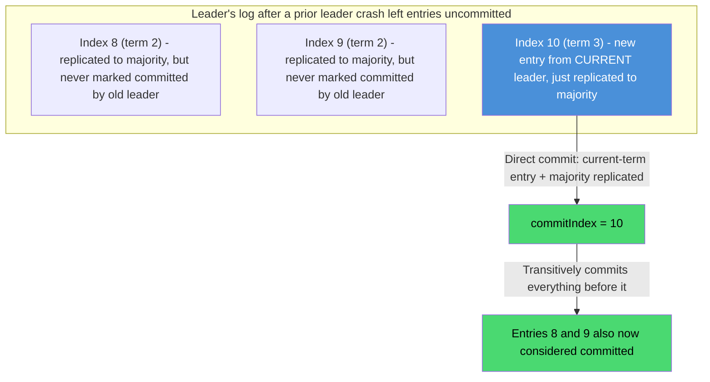

The diagram illustrates the retroactive commitment mechanism: entries 8 and 9 were replicated to a majority under the old (crashed) leader but never explicitly confirmed committed; the new leader cannot commit them directly (they are from term 2, not its own current term 3), but the moment it replicates and commits its own entry 10 (term 3) to a majority, entries 8 and 9 become committed transitively, as a side effect.

#### Commit Rules: Real-Life Use Case

**Consul**'s service catalog and key-value store rely on this exact commit-and-apply mechanism: when a service registers itself, that registration is a log entry that must be committed (majority-replicated under the current leader's term) before Consul's catalog considers it durable and visible to health checks and DNS queries. If the Consul leader crashes moments after a registration was replicated but not yet confirmed committed, the Leader Completeness Property guarantees that the next elected leader's log still contains that entry, and it becomes committed (directly or transitively) as soon as that new leader commits any entry of its own, so the service registration is never silently lost, even across a leadership change happening at the worst possible moment.

#### Commit Rules: Java/Spring Boot Code Example

```java
import org.springframework.stereotype.Service;
import java.util.*;
import java.util.concurrent.ConcurrentHashMap;

@Service
class RaftCommitIndexCalculator {

    private final Map<String, Long> matchIndex = new ConcurrentHashMap<>(); // Leader-side, per follower
    private volatile long commitIndex = 0;
    private final long currentTerm;
    private final List<Long> logEntryTerms; // logEntryTerms.get(i) = term of entry at index i+1

    RaftCommitIndexCalculator(long currentTerm, List<Long> logEntryTerms) {
        this.currentTerm = currentTerm;
        this.logEntryTerms = logEntryTerms;
    }

    // Called whenever a follower's AppendEntries response updates our knowledge of its progress.
    void onFollowerAcked(String followerId, long ackedIndex) {
        matchIndex.merge(followerId, ackedIndex, Math::max);
        recomputeCommitIndex();
    }

    private void recomputeCommitIndex() {
        int clusterSize = matchIndex.size() + 1; // followers + leader itself
        int majority = (clusterSize / 2) + 1;

        long highestLogIndex = logEntryTerms.size();
        for (long candidateIndex = highestLogIndex; candidateIndex > commitIndex; candidateIndex--) {
            long entryTerm = logEntryTerms.get((int) candidateIndex - 1);
            if (entryTerm != currentTerm) {
                continue; // safety rule: never directly commit an older-term entry by count alone
            }
            long replicaCount = 1; // leader itself already has it
            for (long matched : matchIndex.values()) {
                if (matched >= candidateIndex) {
                    replicaCount++;
                }
            }
            if (replicaCount >= majority) {
                commitIndex = candidateIndex; // commits candidateIndex AND everything before it
                break;
            }
        }
    }

    long getCommitIndex() {
        return commitIndex;
    }
}
```

#### Commit Rules: Interview Questions and Answers

**Q1. State the Leader Completeness Property in your own words. Why does it matter to application developers?**
A: If a log entry is committed during some term, it is guaranteed to be present in the log of every Leader elected in any subsequent term. It matters because it means a successful write acknowledgement is a permanent guarantee, an application never needs to worry that a later leader election could silently roll back or lose data it was already told was committed.

**Q2. How exactly does a Leader compute its `commitIndex`?**
A: It finds the highest log index N such that (a) a majority of the cluster's `matchIndex[]` values (including its own log length) are at least N, and (b) the entry at index N belongs to the Leader's own current term. It then sets `commitIndex = N`, which also transitively commits every entry before N.

**Q3. Why can a Leader commit an old entry from a previous term "for free" when it commits a new entry from its current term, but not by counting replicas of the old entry directly?**
A: Counting replicas of the old entry directly can be unsafe in a rare interleaving (documented as Figure 8 in the Raft paper) where a different future leader could still end up overwriting it despite an apparent majority. But once a majority replicates a *new* entry from the current leader's own current term, that fact alone is safe to trust directly (per the current-term commit rule), and because commitment implies the entire prefix of the log up to that point is also durable on that same majority, every earlier entry becomes committed as an automatic consequence, without needing its own separate unsafe direct-count.

**Q4. How do Followers learn that an entry has become committed, and what do they do with that information?**
A: The Leader includes its current `commitIndex` (`leaderCommit`) in every `AppendEntries` RPC, including heartbeats. Each Follower updates its own local `commitIndex` to `min(leaderCommit, index of the last entry it has actually stored)`, and then applies any entries between its previous commit index and the new one to its local state machine, in order.

**Q5. What could go wrong if a Leader directly committed an entry from an older term purely because a current majority happens to store it?**
A: In a specific multi-leader-crash interleaving described in the Raft paper, an entry from an older term can be present on a majority at one point in time without truly being safe from being overwritten by a subsequent leader whose own log is still, by the rules, considered more authoritative for that index. Restricting direct commitment strictly to current-term entries closes this loophole entirely; older entries are only ever committed transitively, alongside a current-term entry that is safely, directly committed.

---

### Cluster Membership Changes (Joint Consensus)

Real clusters are not static forever: nodes get replaced, capacity is added, or a data center migration requires moving to entirely new machines. **Cluster membership change** is the mechanism Raft uses to safely transition from one set of cluster members (`C_old`) to a different set (`C_new`) without ever risking two disjoint majorities existing simultaneously and electing two different leaders (a split-brain).

**Why naively switching configurations is unsafe:** if every node simply switched from the old configuration to the new one at its own pace (whenever it happened to receive the configuration-change entry), there could be a window where some nodes are still using `C_old`'s membership list (and majority threshold) while others have already switched to `C_new`'s. During that window, it is possible for a majority under `C_old`'s rules and a majority under `C_new`'s rules to exist **simultaneously and disjointly**, allowing two different leaders to be elected at once, a catastrophic safety violation.

**Raft's solution: Joint Consensus.** Instead of switching directly from `C_old` to `C_new`, the cluster transitions through an intermediate **joint configuration**, `C_old,new`, during which:

1. The Leader replicates a special log entry describing the joint configuration `C_old,new`. Once any server receives this entry, it immediately starts using it for all future decisions (majority calculations for both elections and commitment).
2. **While in the joint configuration, any decision (election or commit) requires a majority from *both* `C_old` and `C_new` independently.** This is the critical safety property: it is impossible for a majority in `C_old` alone or `C_new` alone to make a unilateral decision during the transition, because both are always required simultaneously.
3. Once the joint configuration entry `C_old,new` is itself committed (majority in both configurations agreed), the Leader replicates a **second** log entry describing the final configuration `C_new` alone.
4. Once `C_new` is committed, the transition is complete; `C_old` members that are no longer part of `C_new` can be safely shut down, since decisions from that point on require only a `C_new` majority.

This two-step process (old+new jointly, then new alone) guarantees that at every single point in time, at most one of `C_old` or `C_new` (or their joint combination) can independently reach a decision, which is precisely what prevents a simultaneous, disjoint dual-leader scenario. Modern implementations (including etcd's raft library) often use a simplified variant that changes **one server at a time** (add or remove a single node per configuration change), which provably cannot create two disjoint majorities either, without needing the full two-phase joint consensus mechanism, at the cost of requiring multiple sequential single-node changes for a larger membership change.

#### Cluster Membership Changes: Characteristics

- **Configuration changes are themselves log entries**: There is no separate out-of-band membership protocol; a configuration change is just a special log entry, replicated and committed exactly like any client command, inheriting all of Raft's usual safety guarantees.
- **Immediate effect upon receipt, not upon commit**: A server starts using a new configuration (for its own majority calculations) as soon as it appends the configuration entry to its log, not only once that entry is committed, this is essential to the safety argument.
- **Joint configuration requires overlapping double-majority agreement**: During the transition window, every decision needs simultaneous majority support from both the old and new member sets, guaranteeing no unilateral decision is possible from either set alone.
- **Two-phase for arbitrary changes, single-phase for one-at-a-time changes**: Full joint consensus (two log entries) supports changing any number of members at once safely; the simpler single-server-at-a-time approach achieves the same safety with one log entry per change, at the cost of needing more sequential steps for larger changes.

#### Cluster Membership Changes: Components

- **`C_old` / `C_new` configuration entries**: The log entries describing cluster membership, replicated and committed through the normal Raft log mechanism.
- **Joint configuration entry (`C_old,new`)**: The intermediate configuration requiring double-majority agreement, used in the full (arbitrary-change) joint consensus protocol.
- **Per-server "current configuration in effect" state**: Each server tracks which configuration(s) currently govern its own majority calculations, updated immediately on receiving (not just committing) a configuration log entry.
- **Configuration change coordinator (typically the Leader/an operator tool)**: The process (often driven by an admin CLI like `etcdctl member add`) that proposes the sequence of configuration-change log entries.

#### Cluster Membership Changes: Patterns

- **Treat configuration as data, not as special-cased control logic**: Representing membership changes as ordinary log entries reuses all of Raft's existing safety machinery (replication, commit rules, election restriction) rather than requiring a bespoke, separately-verified membership protocol.
- **Double-majority gating during transition**: A recurring pattern for safe migrations in distributed systems generally, require agreement from both the old and new "truth" simultaneously during a cutover window, rather than allowing either alone to make unilateral decisions.
- **Incremental (one-at-a-time) change as a simpler alternative**: A widely adopted simplification (used by etcd, Hashicorp Raft) that trades a more restrictive change granularity (one node per step) for a substantially simpler single-phase implementation.

#### Cluster Membership Changes: Pros / Benefits

- **No downtime required for cluster resizing or node replacement**: Membership changes happen through the normal, live replication protocol, without needing to stop the cluster, take a full outage, or coordinate a manual "stop the world" cutover.
- **Provably safe against split-brain during the transition**: The joint consensus's double-majority requirement is specifically designed and proven to prevent the exact disjoint-majority scenario that a naive configuration switch would risk.
- **Reuses existing, well-tested replication machinery**: Because configuration changes are just log entries, they benefit from all the correctness guarantees (log matching, election restriction, commit rules) already established for regular data, rather than needing an entirely separate protocol to verify.

#### Cluster Membership Changes: Cons / Challenges

- **Full joint consensus is one of the more complex parts of Raft to implement correctly**: Tracking "which configuration(s) currently apply to me" and correctly computing double majorities during the transition window adds meaningful implementation complexity compared to the core algorithm.
- **One-at-a-time changes require more operational steps for large membership changes**: Replacing an entire 5-node cluster with 5 new nodes safely requires 5 (or more) sequential single-node change operations rather than one bulk operation, which is slower operationally, though safer and simpler to implement.
- **A leader that is being removed complicates the final step**: If the current Leader is itself the node being removed from `C_new`, it must step down (since it will no longer be part of the cluster) once the new configuration is committed, requiring careful handling to avoid a gap in leadership.

#### Cluster Membership Changes: Best Practices

- Prefer the simpler single-server-at-a-time membership change approach (as used by etcd and Hashicorp Raft) over implementing full arbitrary joint consensus from scratch, unless you have a specific, well-justified need to change multiple members atomically.
- Always add a new server as a **non-voting learner** first (replicating the log without counting toward majority/vote calculations) and only promote it to a full voting member once it has caught up, to avoid a newly added, still-catching-up node temporarily harming quorum availability.
- Never manually edit a node's configuration file to add/remove peers outside of the proper log-entry-based membership change mechanism; doing so bypasses Raft's safety guarantees entirely and can cause a split-brain.
- Automate membership changes via the tooling the Raft library or system provides (e.g., `etcdctl member add/remove`) rather than ad hoc scripts, since these tools correctly sequence the underlying log entries.

#### Cluster Membership Changes: When to Use

- Use cluster membership changes whenever adding capacity, replacing failed/aging hardware, or migrating a cluster to new nodes or a new data center, while keeping the system continuously available.
- Prefer the one-at-a-time approach for routine operational changes (the common case); reserve full joint consensus only for scenarios genuinely requiring an atomic multi-node membership change.
- Always add new nodes as non-voting learners first when the new node needs time to replicate a large existing log/snapshot before it should participate in voting and majority calculations.

#### Cluster Membership Changes: Diagram

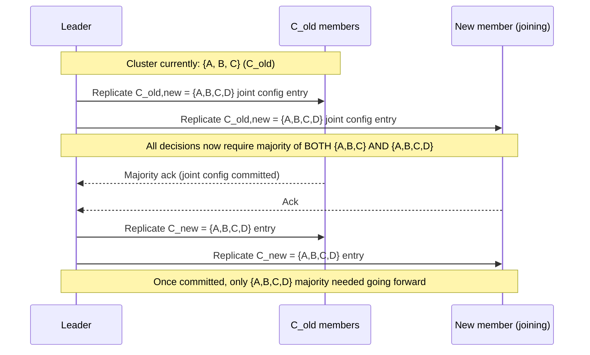

The diagram shows the two-log-entry joint consensus flow: the intermediate joint configuration (requiring a double majority) is committed first, ensuring no unsafe unilateral decision could have been made mid-transition, and only afterward does the cluster fully cut over to relying on the new configuration's majority alone.

#### Cluster Membership Changes: Real-Life Use Case

Operating a production **etcd** cluster, an SRE team replacing aging hardware runs `etcdctl member add` to introduce a new node as a learner, waits for it to fully replicate the existing log/snapshot (which can take time for a large keyspace), then promotes it to a full voting member, and finally runs `etcdctl member remove` for the old node being retired. This one-at-a-time sequence, rather than swapping all nodes simultaneously, is precisely what lets a live Kubernetes cluster's control plane undergo a full etcd hardware refresh with zero API server downtime and zero risk of a split-brain etcd cluster during the migration.

#### Cluster Membership Changes: Java/Spring Boot Code Example

```java
import org.springframework.stereotype.Service;
import org.springframework.web.bind.annotation.*;
import java.util.*;

@Service
class ClusterMembershipService {

    private volatile Set<String> currentVotingMembers = new HashSet<>(Set.of("nodeA", "nodeB", "nodeC"));
    private final Set<String> learners = Collections.synchronizedSet(new HashSet<>());

    // Step 1 of one-at-a-time membership change: add as a non-voting learner first.
    void addLearner(String nodeId) {
        learners.add(nodeId);
        // Replicate log to the learner, but it does not count toward votes or commit majorities yet.
    }

    // Step 2: promote once the learner has caught up (matchIndex close to leader's log length).
    synchronized void promoteToVotingMember(String nodeId) {
        if (!learners.contains(nodeId)) {
            throw new IllegalStateException("Node must be a caught-up learner before promotion: " + nodeId);
        }
        Set<String> updated = new HashSet<>(currentVotingMembers);
        updated.add(nodeId);
        currentVotingMembers = updated; // replicated as a new configuration log entry in a real implementation
        learners.remove(nodeId);
    }

    synchronized void removeVotingMember(String nodeId) {
        Set<String> updated = new HashSet<>(currentVotingMembers);
        updated.remove(nodeId);
        currentVotingMembers = updated; // replicated as a new configuration log entry in a real implementation
    }

    int majorityThreshold() {
        return (currentVotingMembers.size() / 2) + 1;
    }

    Set<String> getCurrentVotingMembers() {
        return Set.copyOf(currentVotingMembers);
    }
}

@RestController
@RequestMapping("/raft/membership")
class ClusterMembershipController {

    private final ClusterMembershipService membershipService;

    ClusterMembershipController(ClusterMembershipService membershipService) {
        this.membershipService = membershipService;
    }

    @PostMapping("/learners/{nodeId}")
    public void addLearner(@PathVariable String nodeId) {
        membershipService.addLearner(nodeId);
    }

    @PostMapping("/members/{nodeId}/promote")
    public void promote(@PathVariable String nodeId) {
        membershipService.promoteToVotingMember(nodeId);
    }

    @DeleteMapping("/members/{nodeId}")
    public void remove(@PathVariable String nodeId) {
        membershipService.removeVotingMember(nodeId);
    }
}
```

#### Cluster Membership Changes: Interview Questions and Answers

**Q1. Why can't a Raft cluster just switch every node from the old configuration to the new one directly, all at once?**
A: Because nodes cannot instantaneously and atomically switch in real distributed systems; each node learns of the configuration change entry at a slightly different time. During the window where some nodes still use the old membership list/majority threshold and others already use the new one, it is possible for a majority under the old configuration and a separate, disjoint majority under the new configuration to exist at the same time, allowing two different leaders to be elected simultaneously, a split-brain.

**Q2. What is "joint consensus," and what specific safety guarantee does it provide during the transition?**
A: Joint consensus is an intermediate configuration, `C_old,new`, that the cluster transitions through before adopting the final new configuration. While in this joint configuration, every decision (election, commit) requires a majority from *both* the old and the new configuration simultaneously, which makes it impossible for either the old or the new configuration's majority alone to make a unilateral decision during the transition.

**Q3. Why do most modern Raft implementations (etcd, Hashicorp Raft) use a simpler "one server at a time" approach instead of full joint consensus?**
A: Changing exactly one server at a time (add one, or remove one) can be proven safe without needing the full two-phase joint configuration mechanism, because the old and new majorities for a single-node change always overlap by at least one node regardless of exactly when each node switches. This significantly simplifies the implementation at the cost of requiring multiple sequential steps to make a larger membership change (e.g., replacing 3 nodes requires 3 separate one-at-a-time operations).

**Q4. Why should a newly added node join as a non-voting "learner" first, rather than immediately as a full voting member?**
A: A brand-new node typically starts with an empty (or far-behind) log and needs time to replicate the existing log/snapshot. If it were immediately counted as a full voting member, it could reduce the *effective* availability of the cluster (since its vote/ack would rarely count toward a timely majority while it is still catching up), or in the worst case, briefly change the majority threshold in a way that risks availability. Adding it as a learner lets it catch up safely before it starts affecting quorum calculations.

**Q5. What must happen if the current Leader is itself the node being removed in a membership change?**
A: Once the configuration removing that node is committed, the Leader must step down from leadership, since it is no longer a member of the cluster and other nodes will no longer count it (or accept it) as a valid leader. Implementations typically have the Leader trigger a new election (or explicitly transfer leadership to another node) as part of finalizing its own removal, so the cluster does not experience an extended leaderless gap.

---

### Log Compaction and Snapshotting

Because Raft's log grows with every single client command, a long-running cluster would eventually accumulate an unbounded log, consuming ever more disk space and taking longer and longer to replay from scratch (e.g., when bringing up a brand-new node). **Log compaction via snapshotting** solves this by periodically capturing the entire current state machine state into a **snapshot**, after which everything before that point in the log can be safely discarded.

**How snapshotting works:**

1. Each server (independently, based on its own log size or a time interval) decides to take a snapshot. It serializes its **entire current state machine state** (e.g., the full contents of a key-value store) into a snapshot, along with the `lastIncludedIndex` and `lastIncludedTerm` (the index/term of the last log entry the snapshot reflects).
2. The server then **discards all log entries up to and including `lastIncludedIndex`**, since that state is now fully captured in the snapshot.
3. **For a slow/lagging follower** whose next needed log entry has already been discarded by the Leader (compacted into a snapshot), the Leader cannot simply send `AppendEntries` for that index anymore. Instead, the Leader sends an **`InstallSnapshot` RPC**, transferring the entire snapshot (often in chunks, for a large state) to bring that follower fully up to date in one shot, after which normal `AppendEntries`-based replication resumes from `lastIncludedIndex + 1`.
4. Snapshotting is done **independently by each server** based on its own log size, there is no need for cluster-wide coordination or agreement on exactly when to snapshot; each node's snapshot merely needs to accurately reflect its own applied state up to a given index/term.

**Why this doesn't compromise safety:** a snapshot only ever includes entries that have already been **applied to the state machine**, and Raft only applies entries once they are committed. Since committed entries are guaranteed (by the Leader Completeness Property) to never be lost or rolled back, discarding the raw log entries once they are safely captured in a snapshot does not risk losing any information; the snapshot simply becomes the new, more compact starting point for the log.

#### Log Compaction: Characteristics

- **Independent, per-node decision**: Unlike almost everything else in Raft, taking a snapshot requires no coordination, consensus, or agreement with other nodes; each server decides on its own when to compact its log.
- **Strictly bounded to already-applied, committed state**: A snapshot can never include entries that have not yet been applied to the state machine, which in turn means it never includes entries that are not yet committed, preserving Raft's safety guarantees.
- **Trades log replay time for periodic snapshot cost**: Compaction is a classic space/time trade-off, paying the cost of periodically serializing full state, in exchange for bounded log size and much faster recovery/catch-up for new or badly lagging nodes.
- **Introduces a distinct RPC (`InstallSnapshot`) for catch-up**: Regular `AppendEntries`-based replication and snapshot-based catch-up are two clearly separated mechanisms, used respectively for followers that are close to current versus followers that have fallen far enough behind that the entries they need have already been compacted away.

#### Log Compaction: Components

- **Snapshot**: A serialized copy of the entire state machine's state as of a specific `(lastIncludedIndex, lastIncludedTerm)`.
- **`lastIncludedIndex` / `lastIncludedTerm`**: The metadata anchoring a snapshot to a specific point in the log, used both to know what can be discarded and to satisfy the log matching check for entries immediately after the snapshot.
- **`InstallSnapshot` RPC**: The mechanism for transferring a full snapshot to a follower whose log has fallen too far behind for incremental `AppendEntries` catch-up, typically chunked for large state machines.
- **Snapshot trigger policy**: The per-node heuristic (e.g., "snapshot every N log entries" or "snapshot every T minutes") deciding when to take a new snapshot.
- **Log truncation logic**: The code that safely discards log entries up to `lastIncludedIndex` once a snapshot covering them has been durably written.

#### Log Compaction: Patterns

- **Checkpoint-and-truncate**: A generally reusable pattern across write-ahead-log-based systems (databases, Kafka, event-sourced systems), periodically checkpoint the derived state, then safely truncate the underlying append-only log up to that checkpoint.
- **Bulk transfer for far-behind replicas, incremental transfer for close ones**: A pattern seen broadly in replication systems (also used by database physical replication and Kafka's log-segment-based replica catch-up), full snapshot/bulk-copy for large gaps, incremental diffs/log-shipping for small gaps.
- **Decentralized, uncoordinated maintenance operations**: Log compaction demonstrates that not every Raft-related operation requires consensus; purely local maintenance operations (like this one) can be performed independently, as long as they only touch already-safely-committed data.

#### Log Compaction: Pros / Benefits

- **Bounds disk usage indefinitely**: Without compaction, a long-lived cluster's log would grow forever; with it, disk usage stays roughly proportional to the current state machine size plus a small recent log tail, not the cluster's entire lifetime history of commands.
- **Dramatically speeds up new-node bootstrapping and recovery**: A new or long-disconnected node can be brought up to date by transferring one compact snapshot plus a small tail of recent log entries, rather than replaying potentially millions of individual historical commands.
- **No cross-cluster coordination overhead**: Because snapshotting is a purely local decision, there is no additional consensus round-trip or coordination cost imposed on the cluster's normal operation.

#### Log Compaction: Cons / Challenges

- **Snapshotting a large state machine can be resource-intensive**: Serializing gigabytes of state can consume significant CPU, memory, and I/O momentarily, potentially causing a latency blip if not implemented carefully (e.g., via a background/copy-on-write snapshot mechanism).
- **`InstallSnapshot` for a very large state can take a long time and consume significant bandwidth**: Bringing a badly lagging or brand-new node fully up to date via a multi-gigabyte snapshot transfer can itself take meaningful time, during which that node still cannot fully participate.
- **Snapshot format versioning is an operational concern**: Rolling out a new state machine version with a different snapshot serialization format requires careful compatibility handling, so nodes running slightly different software versions can still exchange and apply snapshots correctly during a rolling upgrade.

#### Log Compaction: Best Practices

- Take snapshots in a way that does not block the node from continuing to process new log entries (e.g., using a copy-on-write data structure or forking a background process), rather than pausing the entire node during serialization.
- Tune the snapshot trigger threshold (log size or entry count) to balance snapshot frequency against snapshot cost, snapshotting too often wastes resources, too rarely lets the log (and recovery time) grow excessively.
- Chunk `InstallSnapshot` transfers for large state machines, rather than sending the entire snapshot in one enormous message, to avoid overwhelming network buffers and to allow better progress tracking/retry on partial failure.
- Version your snapshot serialization format explicitly, and maintain backward compatibility during rolling upgrades, so nodes on adjacent software versions can still exchange snapshots correctly.

#### Log Compaction: When to Use

- Use log compaction in any long-lived Raft deployment; without it, a production cluster's log (and corresponding disk usage and recovery time) grows without bound over the system's lifetime.
- Prioritize implementing efficient, non-blocking snapshotting specifically for systems with large state machines (e.g., a key-value store with millions of keys), where a naive blocking snapshot would cause noticeable latency spikes.
- Rely on `InstallSnapshot` specifically as the recovery mechanism for brand-new nodes joining an existing, long-running cluster, or nodes that have been disconnected long enough that their needed log entries have already been compacted away.

#### Log Compaction: Diagram

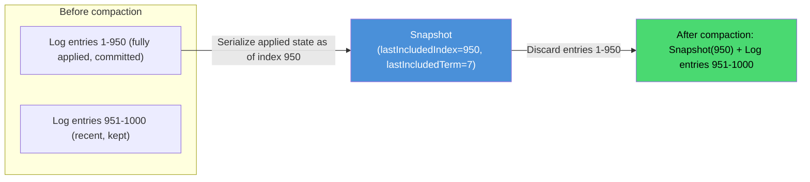

The diagram shows the core trade being made: 950 individual log entries, each of which would need to be replayed one-by-one to reconstruct state, collapse into a single compact snapshot artifact, after which only the small tail of genuinely recent entries (951-1000) still needs to be stored and potentially replayed.

#### Log Compaction: Real-Life Use Case

**etcd** performs periodic automatic snapshotting (configurable, commonly every several thousand log entries) specifically because Kubernetes clusters can generate a very large number of small writes (pod status updates, lease renewals, event objects) over their lifetime. Without compaction, an etcd cluster running for months would accumulate a log large enough that bootstrapping a brand-new etcd member (say, during a hardware replacement) could take an impractically long time to replay from entry one; with snapshotting, the new member instead receives one compact snapshot of the entire current keyspace via `InstallSnapshot`, plus only the small number of log entries generated since that snapshot, cutting bootstrap time from potentially hours down to minutes.

#### Log Compaction: Java/Spring Boot Code Example

```java
import org.springframework.stereotype.Service;
import org.springframework.scheduling.annotation.Scheduled;
import java.util.*;
import java.util.concurrent.ConcurrentHashMap;

record Snapshot(long lastIncludedIndex, long lastIncludedTerm, Map<String, String> stateMachineData) {}

@Service
class RaftSnapshotService {

    private final Map<String, String> stateMachine = new ConcurrentHashMap<>(); // the applied key-value state
    private final List<Long> logEntryTerms = new ArrayList<>();
    private volatile long lastAppliedIndex = 0;
    private volatile Snapshot latestSnapshot = null;
    private static final long SNAPSHOT_THRESHOLD_ENTRIES = 10_000;

    // Periodically check whether the log has grown large enough to justify a new snapshot.
    @Scheduled(fixedDelay = 60_000)
    void maybeTakeSnapshot() {
        long entriesSinceLastSnapshot = lastAppliedIndex
                - (latestSnapshot == null ? 0 : latestSnapshot.lastIncludedIndex());
        if (entriesSinceLastSnapshot >= SNAPSHOT_THRESHOLD_ENTRIES) {
            takeSnapshot();
        }
    }

    private synchronized void takeSnapshot() {
        Map<String, String> stateCopy = Map.copyOf(stateMachine); // copy-on-write style, non-blocking
        long snapshotTerm = logEntryTerms.isEmpty() ? 0 : logEntryTerms.get((int) lastAppliedIndex - 1);
        latestSnapshot = new Snapshot(lastAppliedIndex, snapshotTerm, stateCopy);
        // Safe to truncate log entries [1..lastAppliedIndex] from durable storage now.
    }

    // Leader-side: used when a follower's nextIndex points at an already-compacted log entry.
    Snapshot getSnapshotForInstallSnapshotRpc() {
        if (latestSnapshot == null) {
            throw new IllegalStateException("No snapshot available yet");
        }
        return latestSnapshot;
    }

    // Follower-side: replaces local state entirely with the received snapshot.
    synchronized void applySnapshot(Snapshot snapshot) {
        stateMachine.clear();
        stateMachine.putAll(snapshot.stateMachineData());
        lastAppliedIndex = snapshot.lastIncludedIndex();
    }
}
```

#### Log Compaction: Interview Questions and Answers

**Q1. Why does Raft need log compaction at all? What would happen without it?**
A: Every client command becomes a permanent log entry, so without compaction, the log would grow without bound over the cluster's entire operational lifetime. This would consume ever-increasing disk space and make bootstrapping a brand-new node (which needs to replay the whole log) progressively slower, eventually impractically so.

**Q2. Does taking a snapshot require agreement or coordination among the cluster's nodes?**
A: No. Snapshotting is a purely local decision each server makes independently, based on its own log size or a time interval. There is no consensus round needed, because a snapshot only ever captures already-applied, already-committed state, which every node already independently possesses.

**Q3. When does the Leader send an `InstallSnapshot` RPC instead of a normal `AppendEntries` RPC?**
A: When a follower's `nextIndex` (the next log entry the Leader believes it needs) points to an index that the Leader has already compacted away into a snapshot. Since the raw entry no longer exists to send incrementally, the Leader instead transfers the entire snapshot via `InstallSnapshot`, after which normal `AppendEntries` replication resumes from `lastIncludedIndex + 1`.

**Q4. Why is it safe to discard log entries once they are captured in a snapshot?**
A: Because a snapshot only ever includes entries that have already been applied to the state machine, and Raft only applies entries after they are committed. Committed entries are permanently guaranteed (by the Leader Completeness Property) to never be lost or overwritten by future leaders, so once that state is safely captured in the snapshot, the original individual log entries are redundant and can be safely discarded.

**Q5. What is a practical concern when implementing snapshotting for a large state machine, and how is it typically addressed?**
A: Serializing a very large state machine synchronously can block normal request processing and cause noticeable latency spikes. Production implementations typically address this using a copy-on-write data structure or a forked background process to take the snapshot asynchronously, allowing the node to keep processing new log entries and client requests while the (potentially large) snapshot is being written.

---

### Client Interaction and Linearizable Semantics

Everything discussed so far describes how Raft nodes agree among themselves. This topic covers the equally important other half: how **clients** interact correctly with a Raft cluster, including finding the current Leader, handling retries safely, and reading data with strong (linearizable) consistency guarantees.

**Finding the Leader:** a client does not know in advance which node is the current Leader. If a client sends a request to a Follower, that Follower rejects it (or, more commonly, redirects the client) with a hint pointing to the node it believes is the current Leader. Clients typically cache the last known Leader and retry against it directly on subsequent requests, falling back to trying other nodes (or a fixed retry-with-redirect loop) if that cached Leader turns out to be stale (e.g., after a new election).

**Handling duplicate requests (exactly-once semantics):** if a client sends a command and the connection drops before it receives a response, it cannot tell whether the command was actually committed or not, and a naive retry could cause the command to be applied twice (e.g., double-incrementing a counter). Raft's paper recommends that clients assign each command a **unique, monotonically increasing serial number per client**; the state machine tracks the latest serial number it has processed for each client, and if it sees a duplicate (a command with a serial number it has already applied), it responds with the previous result immediately without re-applying the command, achieving effectively-once execution semantics on top of an at-least-once retry mechanism.

**Linearizable reads:** simply reading from the Leader's in-memory state machine is *not* automatically safe, because a node that has been deposed as Leader (but does not yet know it, e.g., due to a network partition) could still incorrectly respond to a stale read. Raft's paper describes two mechanisms to guarantee **linearizable reads** (reads that reflect the most recently committed write, as if the whole system were a single machine):

1. **Read-index**: before serving a read, the Leader records its current `commitIndex`, then confirms it is still the actual Leader by exchanging heartbeats with a majority of the cluster (proving no newer election has happened without its knowledge). Only once that majority confirmation succeeds does it serve the read from its local state machine, guaranteed to reflect at least that recorded commit index.
2. **Leader lease**: the Leader assumes it remains the leader for a bounded time after its last successful majority heartbeat (relying on bounded clock drift across nodes), allowing it to serve reads locally without a fresh round-trip for every single read, at the cost of a small dependency on approximately synchronized clocks.

Systems that do not need the strongest guarantee often instead offer **follower reads** with relaxed (eventually consistent, or "read-your-writes" via session tracking) semantics, trading a small amount of consistency for significantly better read scalability, since reads can then be served by any follower rather than funneled through the single Leader.

#### Client Interaction: Characteristics

- **Clients are not part of the consensus protocol**: They are external consumers of the replicated log's guarantees, interacting through a defined RPC/API surface, without themselves participating in voting or replication.
- **Leader discovery is a first-class client concern**: Because only the Leader accepts writes (and, absent read-index/lease, reliably fresh reads), every client library needs explicit Leader-discovery and retry-with-redirect logic.
- **At-least-once delivery, effectively-once execution**: The underlying transport (client-to-leader RPC) only ever guarantees at-least-once delivery upon retry; Raft-based systems achieve the appearance of exactly-once execution through application-level deduplication (serial numbers), not through the transport itself.
- **Linearizability is an explicit, opt-in guarantee, not automatic**: Simply reading local Leader state without read-index or lease checks does not automatically guarantee linearizability; it must be deliberately implemented.

#### Client Interaction: Components

- **Leader-redirect response**: The mechanism (RPC response field or explicit error) a Follower uses to inform a misdirected client which node it believes is the current Leader.
- **Client serial number / request ID**: A unique, client-generated, monotonically increasing identifier attached to every command, used by the state machine to detect and deduplicate retried commands.
- **Deduplication table (per-client last-applied result cache)**: State the replicated state machine maintains, mapping each client's last-seen serial number to the result it previously computed, so a retried duplicate command returns the cached result instead of re-executing.
- **Read-index mechanism**: The Leader-side logic of recording `commitIndex`, confirming leadership via a majority heartbeat round, and only then serving a local read.
- **Leader lease clock**: The timer-based mechanism allowing a Leader to serve reads without a fresh heartbeat round-trip, bounded by an assumption about maximum clock drift between nodes.

#### Client Interaction: Patterns

- **Cache-then-redirect Leader discovery**: A widely reused client pattern (also seen in database driver "read replica / primary" routing), cache the last known Leader/primary, retry directly against it, and only fall back to a broader discovery process on failure.
- **Idempotency keys for safe retries**: The client-serial-number deduplication pattern here is the same fundamental idea as idempotency keys in payment APIs and other at-least-once-delivery systems, attach a unique ID to a request so retries are safe to de-duplicate server-side.
- **Read-your-writes via session tracking**: A common relaxed-consistency compromise pattern, used when full linearizable reads are too costly, tracking the highest index each client's session has observed/written and ensuring that client's own subsequent reads reflect at least that index.
- **Lease-based reads to avoid per-read round-trips**: A recurring optimization pattern in leader-based systems (also used by Chubby and Google Spanner's leaseholders) trading strict per-request coordination for a bounded time-based assumption to substantially improve read latency/throughput.

#### Client Interaction: Pros / Benefits

- **Strong consistency guarantees are achievable without sacrificing usability**: With read-index or lease-based reads plus serial-number deduplication, clients get linearizable reads and effectively-once writes without needing to reason about the underlying consensus mechanics themselves.
- **Retry logic is simple and safe for client authors**: Because the server-side deduplication handles duplicate detection, client libraries can use a straightforward "retry on timeout" strategy without needing complex application-level idempotency logic of their own.
- **Read scalability options exist for workloads that can tolerate relaxed consistency**: Systems are not forced to route every single read through the Leader; follower reads (with appropriate relaxed guarantees) are available as an explicit trade-off when the workload allows it.

#### Client Interaction: Cons / Challenges

- **Read-index adds a network round-trip cost to every strongly consistent read**: Confirming leadership via a majority heartbeat exchange before serving a read adds latency compared to simply reading local state, a real cost for read-heavy, latency-sensitive workloads.
- **Leader lease depends on bounded clock drift assumptions**: If clock drift between nodes exceeds the lease's assumed bound (e.g., due to a misconfigured NTP setup or a VM pause), a stale ex-Leader could theoretically serve a read believing its lease is still valid, a subtle correctness risk that is a real operational concern.
- **Client-side deduplication requires the state machine to retain per-client history**: The deduplication table itself must be bounded (old entries eventually need to be pruned, typically alongside snapshotting) to avoid unbounded memory growth from tracking every client that has ever connected.
- **Follower reads with relaxed consistency can surprise application developers**: A team defaulting to follower reads for scalability, without fully understanding the relaxed guarantee, can be surprised by stale reads in edge cases (e.g., a client rapidly writing then reading its own write from a lagging follower).

#### Client Interaction: Best Practices

- Always implement client-side Leader caching with redirect-following, rather than retrying blindly against a random or fixed node, to minimize unnecessary failed round-trips.
- Use per-client monotonically increasing serial numbers for all write commands, and implement server-side deduplication, rather than assuming the transport layer alone provides exactly-once delivery (it never does, over an unreliable network).
- Default to read-index (or an equivalent quorum-confirmed read) for any read that must be strongly consistent, and only adopt lease-based reads after carefully verifying your infrastructure's actual bounded clock drift characteristics.
- Prune the client deduplication table using a sensible expiration policy (e.g., clients are expected to use a session with a bounded lifetime) so it does not grow unboundedly over the life of a long-running cluster.
- Clearly document (and default appropriately) whether reads in your system are linearizable, read-your-writes, or eventually consistent, so application developers can make informed choices rather than assuming the strongest guarantee by default.

#### Client Interaction: When to Use

- Use read-index (or equivalent quorum-confirmed reads) whenever an application's correctness genuinely depends on reading the most recent committed write (e.g., financial balances, inventory counts, distributed locks).
- Use lease-based reads instead, for latency-sensitive read-heavy workloads, only after validating that your deployment's clock synchronization is reliably tighter than the lease's assumed bound.
- Use relaxed follower reads for workloads that can tolerate slightly stale data in exchange for significantly better read scalability (e.g., dashboards, non-critical caches, analytics queries).
- Always use client-serial-number deduplication for any write path where a client might legitimately retry (which is essentially all of them, given normal network unreliability).

#### Client Interaction: Diagram

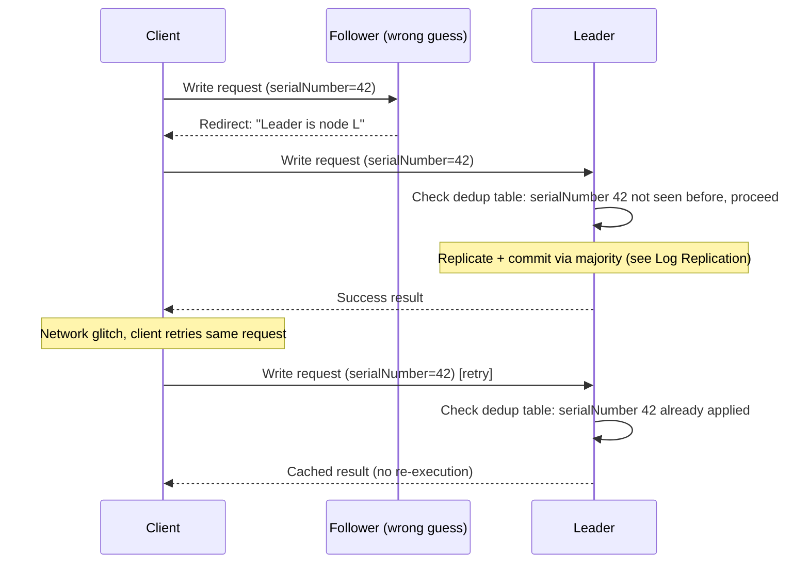

The diagram shows both key client-interaction mechanisms working together: the client transparently follows a redirect to find the real Leader, and when the same logical request is retried (due to a dropped connection, not a logical resend), the server's deduplication table recognizes the already-processed serial number and returns the cached result instead of executing the write a second time.

#### Client Interaction: Real-Life Use Case

**HashiCorp Consul**'s client libraries implement exactly this Leader-caching-with-redirect pattern: a Consul agent caches the address of the last known Raft Leader for its datacenter and sends KV writes and service registrations directly to it, only falling back to a broader server list lookup when that cached Leader stops responding correctly (typically after a leadership change). For reads that require strong consistency (Consul's `consistent` query mode), Consul's servers perform the read-index-style leadership confirmation round-trip before responding, while Consul's default `stale`-tolerant read mode allows any server (not just the leader) to answer directly from local state for much lower latency, a deliberate, explicitly documented trade-off exposed to application developers.

#### Client Interaction: Java/Spring Boot Code Example

```java
import org.springframework.stereotype.Service;
import org.springframework.web.bind.annotation.*;
import java.util.*;
import java.util.concurrent.ConcurrentHashMap;

record ClientCommand(String clientId, long serialNumber, String operation) {}
record CommandResult(String value, boolean fromCache) {}

@Service
class RaftClientInteractionService {

    // Deduplication table: clientId -> (lastSerialNumber, lastResult)
    private final Map<String, Map.Entry<Long, CommandResult>> dedupTable = new ConcurrentHashMap<>();
    private volatile boolean isLeader = true;
    private volatile String currentLeaderHint = "node-1";

    synchronized CommandResult applyCommand(ClientCommand cmd) {
        if (!isLeader) {
            throw new NotLeaderException(currentLeaderHint);
        }

        var previous = dedupTable.get(cmd.clientId());
        if (previous != null && previous.getKey() >= cmd.serialNumber()) {
            return new CommandResult(previous.getValue().value(), true); // duplicate, return cached result
        }

        // Replicate via the normal Raft log path (see Log Replication topic) before applying.
        String result = executeOnStateMachine(cmd.operation());
        dedupTable.put(cmd.clientId(), Map.entry(cmd.serialNumber(), new CommandResult(result, false)));
        return new CommandResult(result, false);
    }

    private String executeOnStateMachine(String operation) {
        return "applied:" + operation;
    }

    static class NotLeaderException extends RuntimeException {
        final String leaderHint;
        NotLeaderException(String leaderHint) {
            super("Not leader, redirect to: " + leaderHint);
            this.leaderHint = leaderHint;
        }
    }
}

@RestController
@RequestMapping("/raft/client")
class RaftClientController {

    private final RaftClientInteractionService clientService;

    RaftClientController(RaftClientInteractionService clientService) {
        this.clientService = clientService;
    }

    @PostMapping("/command")
    public CommandResult submitCommand(@RequestBody ClientCommand command) {
        try {
            return clientService.applyCommand(command);
        } catch (RaftClientInteractionService.NotLeaderException e) {
            throw new ResponseStatusExceptionWithLeaderHint(e.leaderHint);
        }
    }

    static class ResponseStatusExceptionWithLeaderHint extends RuntimeException {
        ResponseStatusExceptionWithLeaderHint(String leaderHint) {
            super("307 redirect to leader: " + leaderHint);
        }
    }
}
```

#### Client Interaction: Interview Questions and Answers

**Q1. What happens when a client mistakenly sends a write request to a Follower instead of the Leader?**
A: The Follower rejects the request and responds with a hint indicating which node it currently believes is the Leader (often the last node it received a valid heartbeat from). The client library then retries the request against that hinted node, and caches it as the presumed current Leader for future requests.

**Q2. Why can't a client simply retry a write request after a timeout without any special handling, and how does Raft address this?**
A: Because the client cannot know whether the original request actually committed before the connection was lost, a blind retry risks applying the same command twice (e.g., double-charging an account). Raft's recommended solution is for clients to attach a unique, monotonically increasing serial number to every command; the state machine tracks the last serial number processed per client and, upon seeing a duplicate, returns the previously computed result instead of re-executing the command.

**Q3. Why isn't reading directly from the Leader's local in-memory state automatically linearizable?**
A: A node might still believe it is the Leader (it has not yet learned otherwise) even though a network partition has caused the rest of the cluster to elect a new Leader elsewhere. If it served a read purely from local state without checking, it could return stale data as if it were current, violating linearizability. The read-index mechanism specifically addresses this by requiring the Leader to reconfirm its leadership via a majority heartbeat round before serving the read.

**Q4. Explain the trade-off between read-index and lease-based reads.**
A: Read-index guarantees linearizability strictly, by requiring a network round-trip (heartbeat exchange with a majority) before every read, adding latency but requiring no clock synchronization assumptions. Lease-based reads instead let the Leader serve reads locally, without a fresh round-trip, for a bounded time window after its last confirmed majority heartbeat, trading a small dependency on approximately synchronized clocks (bounded clock drift) for substantially lower read latency.

**Q5. What is a "follower read," and what consistency trade-off does it involve?**
A: A follower read is a read served directly by a Follower node from its own local (possibly slightly lagging) state, rather than being funneled through the Leader. It trades strict linearizability (the read might not reflect the very latest committed write) for significantly better read scalability, since reads no longer all bottleneck through a single Leader node, an appropriate trade-off for workloads that can tolerate slightly stale data (e.g., dashboards, analytics) but not for workloads that require reading the absolute latest value (e.g., checking a lock's current holder).

---

### Raft vs Paxos vs ZAB

Raft is one of several algorithms that solve the same underlying distributed consensus problem. Understanding how it compares to **Paxos** and **ZAB** (ZooKeeper Atomic Broadcast) clarifies both why Raft became so widely adopted, and the specific scenarios where an alternative might still be preferred.

| Aspect | Paxos (Multi-Paxos) | Raft | ZAB |
|---|---|---|---|
| **Primary design goal** | Formal minimality and provable correctness | Understandability, without sacrificing correctness | Reliable, ordered atomic broadcast specifically for ZooKeeper's needs |
| **Leader role** | Leaderless in the base protocol; Multi-Paxos variants add a "distinguished proposer" as an optimization, but it is not part of the original specification | Explicit, first-class leader; all writes always flow through it | Explicit leader ("primary"), conceptually similar to Raft's |
| **Understandability** | Widely reported as difficult; the original papers describe the base algorithm but leave many practical details (like log replication and membership changes) unspecified | Explicitly designed and user-tested for understandability; the full algorithm (including log replication and membership changes) is completely specified in one paper | Reasonably well documented in the context of ZooKeeper specifically, but less generally studied/taught than Raft |
| **Log replication / membership changes** | Not part of the original Paxos papers; each production system (e.g., Google's Chubby, Spanner) implements its own extensions | Fully specified as part of the core algorithm (log replication mechanism, joint consensus for membership changes) | Specified, but tightly coupled to ZooKeeper's specific architecture and use case |
| **Adoption in new systems (post-2014)** | Rare as a from-scratch implementation choice; mostly seen in older or highly specialized systems (Chubby, early Spanner) | Extremely common (etcd, Consul, CockroachDB, TiKV, Kafka's KRaft, Neo4j, YugabyteDB) | Effectively unique to Apache ZooKeeper; not typically adopted as a standalone library elsewhere |
| **Formal verification history** | Extensively studied academically over multiple decades | Formally specified with a TLA+ model provided by the original authors, and independently model-checked by several groups | Formally specified in academic papers describing ZooKeeper's design |

**Where they are genuinely similar:** all three are leader-based (in their practical, production forms) quorum-replication protocols achieving the same core guarantee, a majority of non-faulty nodes can make safe progress, and a minority (or a fully partitioned cluster) cannot. All three tolerate `floor((N-1)/2)` failures out of N nodes. None of them are meaningfully "faster" or "more available" than the others in a fundamental, theoretical sense; their practical differences are almost entirely about implementation complexity, understandability, and the maturity/availability of production-grade libraries.

**Why Raft displaced Paxos for most new systems:** the deciding factor was rarely a performance or theoretical difference; it was that Raft's paper fully specifies a practical, production-ready algorithm (including log replication and safe membership changes) in a single, carefully user-tested document, while classic Paxos leaves practitioners to invent (and independently get right) all of the practical machinery themselves. This dramatically lowered the bar for teams to correctly implement consensus from scratch, which is precisely why so many systems built since 2014 chose Raft.

**Why ZAB remains uniquely tied to ZooKeeper:** ZAB was designed hand-in-hand with ZooKeeper's specific API and guarantees (notably, ZooKeeper's specific ordering guarantees for watches and sequential znodes), so while conceptually close to Raft, it has not been widely extracted as a general-purpose, reusable consensus library the way Raft has (via etcd's raft package or Hashicorp Raft).

#### Raft vs Paxos vs ZAB: Characteristics

- **All are majority-quorum, leader-based (in practice) consensus protocols**: Despite differing terminology (proposer/acceptor/learner in Paxos, leader/follower/candidate in Raft, leader/follower in ZAB), the underlying mechanism, replicate to a majority, commit, is fundamentally the same across all three.
- **Raft is uniquely "complete" as a single specification**: It is the only one of the three whose original paper fully specifies leader election, log replication, safety, AND membership changes together, in one place, designed explicitly for implementability.
- **Paxos is a family, not one fixed algorithm**: "Paxos" in production almost always means a heavily extended Multi-Paxos variant, with practical details invented independently by each implementing team, unlike Raft's single, complete reference specification.
- **ZAB is purpose-built, not general-purpose**: It was designed specifically to serve ZooKeeper's exact semantics and has not been broadly repackaged as a reusable library for arbitrary applications the way Raft has.

#### Raft vs Paxos vs ZAB: Components

- **Common component: quorum-based majority acknowledgement**: All three require majority agreement before committing an operation.
- **Common component: a persistent, ordered replicated log/history**: Each maintains an ordered sequence of operations that replicas apply in order to reach identical state.
- **Raft-specific: an explicit, fully specified three-state node lifecycle** (Follower/Candidate/Leader) governing all role transitions.
- **Paxos-specific: proposer/acceptor/learner roles**, and (in Multi-Paxos) a distinguished proposer optimization layered on top of the base protocol.
- **ZAB-specific: tightly integrated with ZooKeeper's session and watch mechanisms**, rather than being a standalone, decoupled consensus component.

#### Raft vs Paxos vs ZAB: Patterns

- **Convergent evolution toward "leader-based quorum replication"**: All three protocols, despite being designed somewhat independently, converge on essentially the same practical pattern in production, showing this is close to the natural, efficient solution shape for the underlying problem.
- **"Understandability as a first-class design goal" (Raft's distinguishing pattern)**: A deliberate departure from optimizing purely for theoretical minimality/elegance (Paxos's guiding principle), prioritizing instead how easily engineers can correctly implement and reason about the algorithm.
- **Purpose-built vs. general-purpose library extraction**: Raft was explicitly designed to become a reusable library (and has, extensively); ZAB, despite similar mechanics, was designed and has remained coupled to one specific system (ZooKeeper).

#### Raft vs Paxos vs ZAB: Pros / Benefits

- **Raft's pros**: Complete, implementable-from-one-paper specification; explicitly optimized for understandability; a rich ecosystem of mature, widely used open-source libraries (Hashicorp Raft, etcd's raft, TiKV's raft-rs).
- **Paxos's pros**: The most extensively, academically studied and formally analyzed of the three, with decades of theoretical refinement; extremely flexible base model that has inspired many derivative protocols (Fast Paxos, Cheap Paxos, EPaxos).
- **ZAB's pros**: Deeply proven in production for a very long time via Apache ZooKeeper, one of the most battle-tested coordination services in existence, with guarantees precisely tailored to ZooKeeper's specific API semantics.

#### Raft vs Paxos vs ZAB: Cons / Challenges

- **Raft's cons**: A relatively young protocol (2014) compared to Paxos's multi-decade track record, though this gap has narrowed substantially given its extremely wide adoption since; leader-based design means write throughput is bounded by a single node per Raft group (mitigated via sharding into multiple groups).
- **Paxos's cons**: Notoriously difficult to implement correctly from just the original papers; lacks a single, complete, practitioner-friendly specification for the practical machinery (log replication, membership changes) that real systems need.
- **ZAB's cons**: Not available as a general-purpose, standalone library; adopting ZAB's exact guarantees for a new system essentially means adopting ZooKeeper itself, rather than embedding a consensus library directly into your own application.

#### Raft vs Paxos vs ZAB: Best Practices

- Default to Raft (via a mature library) for new systems requiring a consensus building block, given its combination of complete specification, understandability, and mature tooling.
- Do not attempt to implement classic Paxos from its original papers for a production system; if Paxos-family behavior is specifically required (e.g., for compatibility with an existing Paxos-based system), use an established, well-tested implementation rather than a from-scratch one.
- Use Apache ZooKeeper directly (rather than trying to reimplement ZAB) if you specifically need ZooKeeper's exact feature set (ephemeral znodes, watches, sequential nodes) and are comfortable operating it as an external dependency.
- When evaluating consensus options for a new system, weigh library maturity and operational tooling as heavily as the underlying protocol's theoretical properties, since all three provide essentially equivalent fault-tolerance guarantees in practice.

#### Raft vs Paxos vs ZAB: When to Use

- Choose Raft (the default recommendation for most new systems) when you need an embeddable consensus library with strong understandability, active maintenance, and broad production adoption.
- Choose (or continue using) Paxos-family protocols mainly when working within an existing system already built on them (e.g., extending Google's internal infrastructure, Chubby-like systems) rather than starting fresh.
- Choose Apache ZooKeeper (and therefore ZAB, indirectly) when you specifically need ZooKeeper's mature ecosystem, existing operational tooling, and specific API semantics (watches, ephemeral nodes), rather than building a new custom coordination service.

#### Raft vs Paxos vs ZAB: Diagram

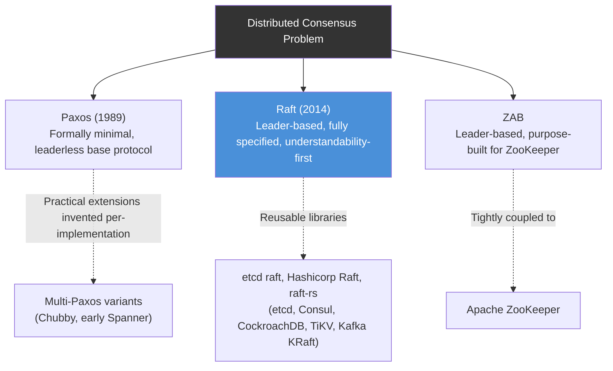

The diagram highlights the key practical distinction: Paxos requires each adopting team to invent its own production-ready extensions, ZAB is inseparable from ZooKeeper itself, while Raft was explicitly designed to become, and has become, a widely reused, standalone library adopted across many independent systems.

#### Raft vs Paxos vs ZAB: Real-Life Use Case

A platform team choosing infrastructure for a new distributed configuration service in 2024 evaluates all three options: implementing Paxos from scratch is quickly ruled out due to the well-documented difficulty of getting its practical details right; adopting Apache ZooKeeper (and therefore ZAB) is considered but ultimately passed over because it requires operating a separate JVM-based service with its own operational overhead; the team instead embeds the Hashicorp Raft library directly into their Go service, gaining a fully specified, well-tested consensus mechanism without an extra standalone dependency, exactly mirroring the reasoning that led etcd, Consul, and CockroachDB to the same choice.

#### Raft vs Paxos vs ZAB: Java/Spring Boot Code Example

```java
import org.springframework.stereotype.Service;
import org.springframework.web.bind.annotation.*;

enum ConsensusProtocol { PAXOS, RAFT, ZAB }

record ProtocolComparison(ConsensusProtocol protocol, boolean explicitLeader,
                           boolean fullySpecifiedInOnePaper, boolean generalPurposeLibraryAvailable) {}

@Service
class ConsensusProtocolComparisonService {

    // A simple illustrative lookup, not a functional consensus implementation,
    // useful for exposing the comparison programmatically (e.g., to a documentation UI).
    ProtocolComparison compare(ConsensusProtocol protocol) {
        return switch (protocol) {
            case PAXOS -> new ProtocolComparison(PAXOS, false, false, false);
            case RAFT -> new ProtocolComparison(RAFT, true, true, true);
            case ZAB -> new ProtocolComparison(ZAB, true, true, false);
        };
    }
}

@RestController
@RequestMapping("/consensus/compare")
class ConsensusComparisonController {

    private final ConsensusProtocolComparisonService comparisonService;

    ConsensusComparisonController(ConsensusProtocolComparisonService comparisonService) {
        this.comparisonService = comparisonService;
    }

    @GetMapping("/{protocol}")
    public ProtocolComparison compare(@PathVariable ConsensusProtocol protocol) {
        return comparisonService.compare(protocol);
    }
}
```

#### Raft vs Paxos vs ZAB: Interview Questions and Answers

**Q1. What is the single biggest practical reason Raft displaced Paxos for most new consensus-based systems built after 2014?**
A: Raft's original paper fully specifies a complete, practical, production-ready algorithm, leader election, log replication, safety, and membership changes, in one carefully user-tested document. Classic Paxos's original papers describe only the core, base protocol and leave practitioners to independently invent (and get right) the practical machinery needed for a real system, which historically led to widespread difficulty and inconsistent, often subtly buggy, implementations.

**Q2. Are Paxos, Raft, and ZAB fundamentally different in the fault-tolerance guarantees they provide?**
A: No. All three are majority-quorum-based protocols tolerating `floor((N-1)/2)` failures out of N nodes, and all three provide the same fundamental safety (no disagreement on committed values) and liveness (progress as long as a majority is healthy) guarantees. Their differences are almost entirely about implementation complexity, understandability, and available tooling, not about theoretical fault tolerance.

**Q3. Is ZAB essentially "the same algorithm" as Raft?**
A: They are conceptually very similar, both are leader-based, majority-quorum log/broadcast replication protocols, developed independently around similar core ideas. The key practical difference is that ZAB was designed specifically for, and remains tightly coupled to, Apache ZooKeeper's exact API and guarantees, while Raft was explicitly designed to be extracted as a general-purpose, reusable library, which is exactly what has happened across many independent systems.

**Q4. If Paxos and Raft provide equivalent guarantees, why would a team ever still choose a Paxos-based approach today?**
A: Mainly when working within (or needing to interoperate with) an existing system already built on Paxos internally (e.g., extending Google's internal Chubby-based infrastructure), where switching the underlying consensus protocol would be a significant, likely unjustified, migration cost, rather than a case of Paxos being technically preferable for a brand-new system.

**Q5. What does it mean that "Paxos is a family, not a single fixed algorithm," and why does that matter?**
A: In production, "using Paxos" almost always actually means using a heavily extended variant (commonly called Multi-Paxos), where each adopting team has independently added the practical pieces (a stable leader optimization, log replication, membership changes) that the base Paxos papers do not specify. This matters because it means two systems both described as "Paxos-based" may have meaningfully different implementations and edge-case behaviors, unlike Raft implementations, which can be compared against one single, complete reference specification.

---

### Network Partitions, Split Brain and Failure Scenarios in Raft

This topic focuses specifically on how Raft behaves under the failure scenarios that matter most in production: network partitions, minority isolation, and simultaneous multi-node crashes, and why Raft, by construction, cannot produce a genuine split-brain (two active leaders both accepting conflicting writes at once).

**Scenario 1: Leader isolated in a minority partition.** Suppose a 5-node cluster splits into a 2-node partition (containing the current Leader) and a 3-node partition. The isolated Leader keeps believing it is Leader (it has not crashed, just lost contact), and can still accept client write requests locally. However, it can **never actually commit** those writes, because committing requires majority (3 of 5) acknowledgement, and it can only reach 1 other node (itself plus 1 = 2, short of the 3 needed). Meanwhile, the 3-node majority partition, unable to reach the old Leader, times out and elects a **new** Leader among themselves (3 out of 5 is a valid majority), which continues accepting and committing writes normally. When the network heals, the old, isolated Leader will observe a higher term from the new Leader's next heartbeat and immediately step down to Follower, discarding any of its own uncommitted (and therefore never-acknowledged-to-the-client) log entries.

**Scenario 2: Cluster loses quorum entirely (no majority partition exists).** If a 5-node cluster splits into a 3-node partition and a 2-node partition, but then two more nodes in the "majority" partition also crash (leaving effectively only 1 reachable node from what was the majority side), no partition anywhere in the cluster has a majority. In this case, correctly, **the entire cluster becomes unavailable for writes** until enough nodes recover to reform a majority somewhere. This is Raft (correctly) choosing consistency over availability, exactly as CAP theorem predicts for a CP system.

**Scenario 3: Simultaneous crash of a majority of nodes.** If 3 out of 5 nodes crash simultaneously (leaving only 2 alive), the cluster loses quorum and becomes unavailable for both reads (via read-index/lease) and writes until at least one of the crashed nodes recovers. Data already committed before the crash is not lost (it exists durably on disk on the crashed nodes too, and will be available again once they restart), but the cluster cannot make new progress in the meantime.

**Why true split-brain is structurally impossible in Raft:** committing a write always requires a majority, and any two majorities of the same cluster must overlap by at least one node. This means it is mathematically impossible for two disjoint groups to each independently believe they have committed conflicting entries for the same log index, at most one side can ever actually reach the majority threshold required to commit at any given moment.

#### Network Partitions: Characteristics

- **A partitioned-away Leader is functionally harmless, not dangerous**: It may keep believing it is Leader and accept local writes, but since it cannot reach a majority, none of those writes ever get committed or acknowledged to the client as successful, they are simply discarded once the partition heals.
- **The majority-side partition (if one exists) continues operating normally**: Raft deliberately favors keeping the majority side available and consistent over trying to somehow keep both sides available.
- **No majority anywhere means total write unavailability, not corruption**: When quorum is lost entirely, the correct, safe behavior is to halt progress, not to guess or degrade to a weaker consistency mode.
- **Recovery is entirely automatic once connectivity is restored**: No manual "resolve the split brain" step is ever needed; the higher-term-wins rule and re-established heartbeats automatically converge the cluster back to a single recognized leader.

#### Network Partitions: Components

- **Partition detector (implicit, via timeouts)**: Raft has no explicit "partition detection" component; partitions are detected purely as a side effect of missed heartbeats/RPC timeouts, exactly the same mechanism used for detecting an ordinary node crash.
- **Term comparison logic**: The same mechanism covered in the Terms topic is what automatically neutralizes a stale, partitioned-away Leader upon reconnection.
- **Quorum/majority calculation**: The core mechanism (`floor(N/2)+1`) that determines, at any instant, whether a given group of reachable nodes is entitled to make progress.
- **Uncommitted entry discard on step-down**: The logic by which a demoted former Leader's own unacknowledged, never-committed local writes are simply overwritten/discarded once it resynchronizes its log with the legitimate, current Leader.

#### Network Partitions: Patterns

- **Fail-safe (not fail-open) under ambiguity**: When a node cannot determine whether it is safe to proceed (no confirmed majority), Raft's design always errs on the side of refusing progress rather than risking an unsafe action, a broadly reusable distributed-systems safety pattern.
- **Reuse failure detection for partition detection**: Rather than building a separate mechanism to detect network partitions specifically, Raft treats "I cannot reach node X" identically whether X has crashed or is merely unreachable due to a partition, simplifying the design considerably.
- **Automatic reconciliation via existing safety rules**: Recovery from a partition requires no special-cased "merge" or "resolve conflict" logic; the same term-comparison and log-matching rules used in normal operation also happen to correctly resolve a rejoin after a partition.

#### Network Partitions: Pros / Benefits

- **Guaranteed absence of data-divergence split-brain**: Unlike systems that can produce two independently-progressing, conflicting copies of data during a partition (a real risk in some AP/multi-master systems), Raft's majority requirement makes that scenario provably impossible.
- **Predictable, well-understood behavior under every partition topology**: Because behavior reduces entirely to "does some group have a majority right now," operators can reason precisely about exactly which failure scenarios keep the cluster available versus which correctly halt it.
- **No operator intervention needed for the common partition-heals-itself case**: The overwhelming majority of transient network partitions self-resolve automatically the moment connectivity is restored, without any manual split-brain resolution procedure.

#### Network Partitions: Cons / Challenges

- **A prolonged minority partition means genuine, real unavailability for that side**: Clients connected only to the minority side of a partition (e.g., due to a regional network outage) will experience write failures (and, for strongly consistent reads, read failures too) for the entire duration of the partition, correctly, but this is still a real operational impact that must be planned for.
- **Total quorum loss requires manual recovery in the worst case**: If enough nodes are permanently lost (not just partitioned, but truly destroyed, e.g., a data center disaster) that a majority can never naturally reform, an operator must intervene (e.g., via a manual, carefully executed "force new cluster from surviving data" recovery procedure) since Raft alone cannot invent a majority that no longer exists.
- **Client-observed unavailability during partitions can be mistaken for a bug**: Teams unfamiliar with Raft's CP behavior sometimes initially perceive correct, safety-preserving refusal to serve writes/strongly-consistent reads during a partition as a system malfunction, when it is in fact the system behaving exactly as designed.

#### Network Partitions: Best Practices

- Distribute cluster nodes across independent failure domains (availability zones, racks, or data centers) specifically so that a single physical network partition is unlikely to isolate a majority of the cluster simultaneously.
- Use an odd cluster size (3, 5, 7) so that every possible way of splitting the cluster in two results in one side having a clear majority (never an exact tie), avoiding the case where a partition leaves no side able to make progress unnecessarily.
- Document and alert on "quorum lost" conditions explicitly and prominently, since this is precisely the state where the cluster is, by design, refusing to accept writes, an important distinction from an actual bug.
- Prepare (and periodically test) a documented manual disaster-recovery procedure for the rare case of permanent, majority-destroying node loss, since Raft's automatic mechanisms cannot recover a majority from nodes that no longer exist.

#### Network Partitions: When to Use

- Understanding these failure scenarios is essential for capacity planning (how many simultaneous node/AZ failures the cluster must tolerate) and for setting accurate availability expectations (a CP system will, correctly, sometimes refuse writes during a severe enough partition).
- Use this failure-mode understanding when deciding cluster size and node placement, e.g., a 5-node cluster spread across 3 availability zones tolerates the loss of one entire AZ while still keeping a majority, a 3-node cluster in only 2 AZs does not have this property.
- Reference these scenarios directly when writing incident runbooks for a Raft-backed system, so on-call engineers can quickly distinguish "expected CP unavailability during a partition" from a genuine, unrelated bug.

#### Network Partitions: Diagram

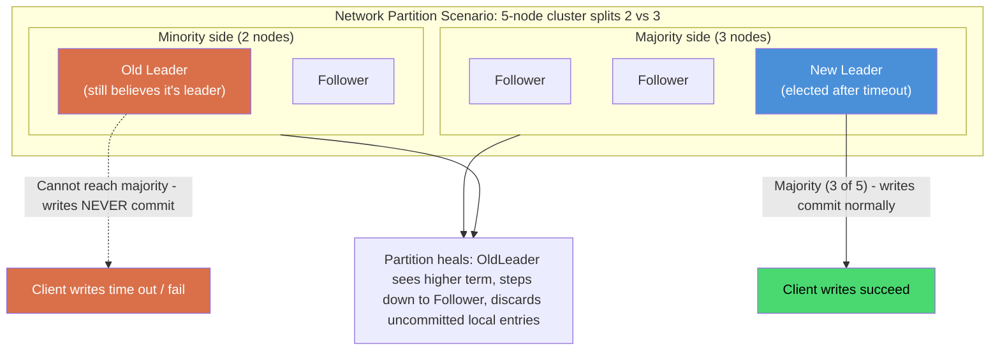

The diagram shows the definitive answer to "what happens during a network partition": exactly one side (if either) has a majority and continues serving writes correctly, the other side is entirely blocked from making committed progress, and reconciliation upon reconnection is fully automatic via the existing term-comparison rule, with zero risk of the two sides having each committed conflicting data.

#### Network Partitions: Real-Life Use Case

A company running a **CockroachDB** cluster across three AWS availability zones (2 nodes per zone, 6 nodes total for a given range's broader deployment, though each individual range typically uses 3 or 5 replicas) experiences an AZ-level network event that isolates one AZ from the other two. For any given data range, if that range's Raft leader happened to be in the isolated AZ, the two remaining AZs (holding a majority of that range's replicas) elect a new leader and continue serving reads and writes for that range without interruption; the isolated AZ's replica of that leader simply stops making progress until the network event resolves, at which point it automatically rejoins and catches up, exactly the documented, expected CP behavior CockroachDB inherits directly from its underlying Raft implementation.

#### Network Partitions: Java/Spring Boot Code Example

```java
import org.springframework.stereotype.Service;
import org.springframework.web.bind.annotation.*;
import java.util.*;

@Service
class RaftQuorumAvailabilityService {

    private final int clusterSize;

    RaftQuorumAvailabilityService(int clusterSize) {
        this.clusterSize = clusterSize;
    }

    // Determines whether a given set of currently-reachable node IDs constitutes a majority,
    // i.e., whether this partition (if the cluster is split) is allowed to make progress.
    boolean canMakeProgress(Set<String> reachableNodeIds) {
        int majority = (clusterSize / 2) + 1;
        return reachableNodeIds.size() >= majority;
    }

    // Simulates the decision a would-be leader makes before accepting a write.
    WriteOutcome attemptWrite(Set<String> reachableNodeIds, String command) {
        if (!canMakeProgress(reachableNodeIds)) {
            return new WriteOutcome(false, "Rejected: no majority reachable (" +
                    reachableNodeIds.size() + "/" + clusterSize + "), refusing to risk split-brain");
        }
        return new WriteOutcome(true, "Committed: majority (" + reachableNodeIds.size() +
                "/" + clusterSize + ") acknowledged");
    }

    record WriteOutcome(boolean committed, String reason) {}
}

@RestController
@RequestMapping("/raft/partition")
class PartitionSimulationController {

    private final RaftQuorumAvailabilityService quorumService = new RaftQuorumAvailabilityService(5);

    @PostMapping("/simulate-write")
    public RaftQuorumAvailabilityService.WriteOutcome simulateWrite(@RequestBody List<String> reachableNodes) {
        return quorumService.attemptWrite(new HashSet<>(reachableNodes), "SET x=1");
    }
}
```

#### Network Partitions: Interview Questions and Answers

**Q1. Can Raft ever end up with two active leaders both successfully committing conflicting writes at the same time (a true split-brain)?**
A: No. Committing any entry requires acknowledgement from a majority of the cluster, and any two majorities of the same cluster must overlap by at least one node. Since a single node can only vote/acknowledge one leader's writes at a time within a given term, it is mathematically impossible for two disjoint groups to each independently reach the majority threshold required to commit conflicting entries simultaneously.

**Q2. What happens to a Leader that gets isolated in a minority partition, in detail?**
A: It continues to believe it is the Leader (nothing tells it otherwise locally) and can still accept client write requests, appending them to its own log. However, it can never actually commit those entries, since doing so requires majority acknowledgement, which it cannot obtain with only a minority of the cluster reachable. Those writes are never acknowledged as successful to the client, and once the partition heals and it observes the new, legitimate Leader's higher term, it steps down and its unacknowledged local entries are simply overwritten to match the current Leader's log.

**Q3. What happens if a network partition splits a 5-node cluster into two groups of 2 and 3, but then one more node in the 3-node group also crashes?**
A: The cluster no longer has any group with a true majority (3 of 5); the 3-node group is now effectively down to 2 reachable nodes, same as the other side. In this scenario, the entire cluster correctly becomes unavailable for new writes (and for strongly consistent reads) until at least one more node recovers and a majority can be reestablished somewhere.

**Q4. Is this partition behavior a bug, or is it working as intended? How would you explain it to a stakeholder worried about "the system going down"?**
A: It is working exactly as intended, this is a direct, deliberate consequence of choosing a CP (Consistency and Partition tolerance) design in CAP theorem terms. The alternative, allowing the minority side to keep accepting writes too, would risk two disjoint sets of data silently diverging, a far worse outcome for most use cases (financial transactions, configuration state, distributed locks) than a temporary, clearly-bounded refusal to accept new writes during a rare partition.

**Q5. How does a cluster recover after a partition heals, and does it require any manual intervention?**
A: Recovery is entirely automatic in the common case. Once network connectivity is restored, the previously-isolated node(s) will receive an `AppendEntries` (or `RequestVote`) RPC carrying a higher term from the currently legitimate Leader, immediately update their own term, and step down to Follower, then resynchronize their log to match (discarding any of their own uncommitted entries in the process). Manual intervention is only needed in the much rarer case of a genuinely, permanently destroyed majority (e.g., a real disaster wiping out enough nodes that a majority can never naturally reform).

---

### Real-World Raft Implementations (etcd, Consul, CockroachDB, Kafka KRaft)

Raft's understandability translated directly into broad, real production adoption. This topic surveys how several major systems actually use Raft internally, and what each one specifically layers on top of the base algorithm.

| System | What Raft Manages | Notable Adaptations |
|---|---|---|
| **etcd** | The entire distributed key-value store backing Kubernetes' cluster state | Uses a single Raft group for the whole keyspace; heavy focus on fast, frequent snapshotting given Kubernetes' write-heavy workload (pod status updates, leases); exposes both linearizable and (much cheaper) serializable read modes explicitly to API consumers |
| **HashiCorp Consul** | Cluster membership, the service catalog, and the distributed KV store | Uses the HashiCorp Raft library (also reused by Nomad and Vault); layers a separate gossip-based protocol (Serf/memberlist) on top for large-scale failure detection across potentially thousands of agents, reserving Raft itself for the smaller set of "server" nodes |
| **CockroachDB** | Per-range (shard) data replication and consistency | Runs potentially thousands of independent Raft groups (one per data range) simultaneously in a single cluster; adds a "leaseholder" concept tightly coupled to (but with subtly different failure semantics than) the underlying Raft leader, to serve reads without a full read-index round-trip in the common case |
| **TiKV** (TiDB's storage layer) | Per-region (shard) data replication, similar in spirit to CockroachDB | Uses the `raft-rs` Rust library; implements "Multi-Raft" (many Raft groups per node) with careful batching and pipelining optimizations to keep per-group overhead low at very large shard counts |
| **Apache Kafka (KRaft mode)** | Cluster metadata (topics, partitions, ACLs, broker membership) previously managed by a separate ZooKeeper ensemble | Replaced ZooKeeper/ZAB entirely with a Raft-based metadata quorum (KRaft), eliminating an entire separate dependency (ZooKeeper) that Kafka clusters previously had to operate and scale independently |

**A recurring architectural pattern: "Multi-Raft" / sharded Raft groups.** Because a single Raft group's write throughput is bounded by its Leader, systems needing high aggregate throughput (CockroachDB, TiKV) do not try to make one giant Raft group faster; instead, they partition their data into many independent, smaller Raft groups (often called ranges, regions, or shards), each with its own Leader, spreading write load across many leaders simultaneously. This is the single most important scaling technique layered on top of vanilla Raft in real, large-scale production systems.

**A recurring optimization: separating metadata consensus from bulk data replication.** Kafka's KRaft mode is a clear example: Raft is used specifically for the comparatively small, latency-tolerant metadata (which topics/partitions exist, which broker is leader for each), while the actual high-throughput message data itself continues to use Kafka's own purpose-built, simpler leader-follower replication protocol (ISR - in-sync replicas), not full Raft, because the message data path has different throughput/latency trade-offs than metadata consensus does.

#### Real-World Implementations: Characteristics

- **Nearly universal adoption of the "many small Raft groups" pattern for scale**: Every large-scale storage system surveyed here (CockroachDB, TiKV) uses sharded Raft groups rather than one large group, showing this is close to a necessary pattern for high-throughput Raft-based storage.
- **Raft is almost always paired with a separate, complementary mechanism**: etcd pairs it with snapshotting tuned for write-heavy metadata; Consul pairs it with a gossip protocol for large-scale failure detection; Kafka pairs it (in KRaft mode) with its own separate high-throughput data replication path.
- **Library reuse across otherwise-unrelated systems**: The same underlying Raft libraries (etcd's raft package, Hashicorp Raft) power multiple, independently developed production systems, evidence of Raft succeeding specifically as a reusable building block, not just an academic algorithm.
- **Adoption specifically displaced older, harder-to-implement alternatives**: Kafka's KRaft mode is a direct, explicit replacement for an external ZooKeeper/ZAB dependency, showing Raft's practical advantage (simpler to embed directly) winning out even against a mature, long-proven alternative.

#### Real-World Implementations: Components

- **Raft library/engine**: The reusable core (etcd's raft package, Hashicorp Raft, raft-rs) implementing the base algorithm, embedded into each larger system.
- **Sharding/partitioning layer**: The system-specific logic (CockroachDB's ranges, TiKV's regions) that splits data across many independent Raft groups.
- **Complementary failure-detection or bulk-replication mechanism**: Consul's gossip protocol, Kafka's ISR-based data replication, each solving a problem outside Raft's core scope.
- **Snapshot/log-compaction tuning specific to the workload**: etcd's aggressive snapshot tuning for Kubernetes' write-heavy metadata pattern is a workload-specific adaptation of the general mechanism covered in the Log Compaction topic.

#### Real-World Implementations: Patterns

- **Sharded consensus ("Multi-Raft") for horizontal write scaling**: The dominant pattern for any Raft-based system needing more write throughput than a single Raft group can provide.
- **Consensus for metadata, simpler replication for bulk data**: A pattern (exemplified by Kafka's KRaft mode) of applying the heavier, strongly-consistent consensus machinery only where its guarantees are truly needed, and a lighter, higher-throughput replication mechanism for the bulk data path.
- **Layering a separate failure-detection mechanism for very large clusters**: Consul's approach of using gossip for broad, scalable failure detection across many agents, while reserving Raft itself for a smaller, dedicated "server" tier, is a reusable pattern whenever a system needs both massive scale and strong consistency for a smaller critical subset.

#### Real-World Implementations: Pros / Benefits

- **Proven, battle-tested foundation across a wide variety of workloads**: Raft has now been running in production, across wildly different systems and workload shapes (Kubernetes' metadata, Kafka's cluster metadata, CockroachDB's transactional data), for many years, providing strong real-world confidence beyond theoretical guarantees alone.
- **Mature open-source libraries reduce implementation risk for new adopters**: Teams building a new system today can reuse a library (etcd's raft, Hashicorp Raft) that has already been hardened by years of production use in other systems, rather than starting from the academic paper.
- **Architectural patterns (sharded Raft, metadata-vs-data separation) are now well understood**: New systems do not need to rediscover these scaling techniques independently; they are documented, proven approaches directly transferable from existing production systems.

#### Real-World Implementations: Cons / Challenges

- **Operating "Multi-Raft" at scale is itself a significant engineering undertaking**: Efficiently running thousands of Raft groups per node (as CockroachDB and TiKV do) requires careful batching, pipelining, and resource-sharing optimizations well beyond a naive one-Raft-group-per-shard implementation.
- **Migrating an existing system to Raft-based metadata (like Kafka's KRaft) is a substantial, multi-year undertaking**: Kafka's migration away from ZooKeeper took years of design, implementation, and careful rollout (KIP-500), illustrating that adopting Raft in an already-mature system is nontrivial even when the long-term benefits are clear.
- **Different systems make subtly different trade-offs on top of the base algorithm**: CockroachDB's leaseholder mechanism, for example, has known edge cases distinct from vanilla Raft leadership, so understanding "Raft" alone is not sufficient to fully understand any specific system's exact guarantees; the system-specific adaptations matter too.

#### Real-World Implementations: Best Practices

- Study how an existing, mature Raft-based system similar to your use case solved scaling (sharded Raft groups) and read-latency (leaseholders, read-index) problems, rather than solving them from first principles.
- Separate strongly-consistent metadata/coordination state from high-throughput bulk data paths architecturally, using Raft only where its guarantees are genuinely required (as Kafka's KRaft mode does), rather than routing all data through a single consensus group.
- When embedding a Raft library, budget significant engineering time for the surrounding system-specific concerns (sharding, snapshot tuning for your workload, client redirect/retry logic) beyond just wiring up the core library.
- Track and learn from public post-mortems and design documents of major Raft-based systems (e.g., Kafka's KIP-500, CockroachDB's range documentation) as a low-cost way to avoid known pitfalls.

#### Real-World Implementations: When to Use

- Use a single Raft group (no sharding) for smaller-scale coordination/metadata needs, where its throughput ceiling is not a practical concern (e.g., cluster configuration, leader election for a modestly sized service).
- Use sharded "Multi-Raft" specifically when the workload's aggregate write throughput requirement exceeds what a single Raft group (and its single Leader) can sustain.
- Use Raft specifically for metadata/coordination state, and a separate, simpler replication mechanism for high-throughput bulk data, when building a large-scale data system, mirroring Kafka's KRaft architecture.

#### Real-World Implementations: Diagram

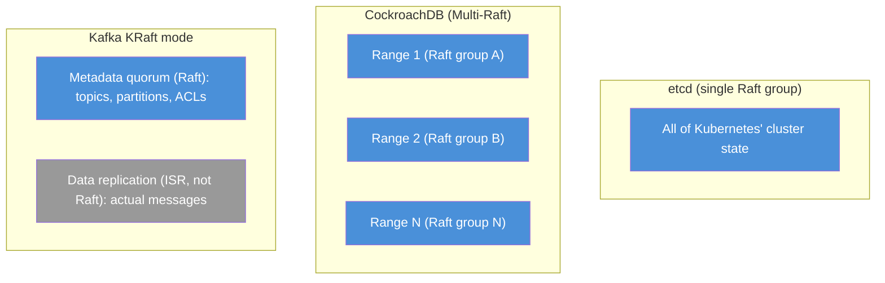

The diagram contrasts three real architectural choices: etcd uses one Raft group for everything (appropriate for its relatively modest metadata scale), CockroachDB shards into many independent Raft groups for horizontal write scaling, and Kafka's KRaft mode uses Raft only for metadata while keeping its separate, purpose-built ISR mechanism for the actual high-throughput message data.

#### Real-World Implementations: Real-Life Use Case

Apache Kafka's **KIP-500** initiative (culminating in KRaft mode becoming production-ready and the default in Kafka 3.x/4.x) removed Kafka's decades-long dependency on a separate Apache ZooKeeper ensemble for cluster metadata. Before KRaft, operating Kafka meant running and scaling two separate distributed systems (Kafka brokers and a ZooKeeper ensemble); after KRaft, cluster metadata is managed directly by a small Raft-based quorum of controller nodes within Kafka itself, eliminating an entire class of operational complexity (a second consensus system to monitor, upgrade, and secure) purely by replacing ZAB-based coordination with an embedded Raft implementation.

#### Real-World Implementations: Java/Spring Boot Code Example

```java
import org.springframework.stereotype.Service;
import org.springframework.web.bind.annotation.*;
import java.util.*;
import java.util.concurrent.ConcurrentHashMap;

// A simplified illustration of the "Multi-Raft" sharding pattern used by CockroachDB/TiKV:
// each shard is routed to its own independent Raft group by key range.
@Service
class MultiRaftShardRouter {

    record ShardRange(String shardId, String startKeyInclusive, String endKeyExclusive) {}

    private final List<ShardRange> shards = List.of(
            new ShardRange("shard-A", "", "m"),
            new ShardRange("shard-B", "m", "")
    );

    private final Map<String, RaftGroupHandle> raftGroups = new ConcurrentHashMap<>();

    MultiRaftShardRouter() {
        for (ShardRange shard : shards) {
            raftGroups.put(shard.shardId(), new RaftGroupHandle(shard.shardId()));
        }
    }

    String routeKeyToShard(String key) {
        for (ShardRange shard : shards) {
            boolean afterStart = shard.startKeyInclusive().isEmpty() || key.compareTo(shard.startKeyInclusive()) >= 0;
            boolean beforeEnd = shard.endKeyExclusive().isEmpty() || key.compareTo(shard.endKeyExclusive()) < 0;
            if (afterStart && beforeEnd) {
                return shard.shardId();
            }
        }
        throw new IllegalStateException("No shard found for key: " + key);
    }

    String write(String key, String value) {
        String shardId = routeKeyToShard(key);
        RaftGroupHandle group = raftGroups.get(shardId);
        return group.propose(key + "=" + value); // each shard replicates independently via its own Raft group
    }

    static class RaftGroupHandle {
        private final String shardId;
        RaftGroupHandle(String shardId) { this.shardId = shardId; }
        String propose(String command) {
            return "Committed on " + shardId + ": " + command; // real implementation delegates to a Raft library
        }
    }
}

@RestController
@RequestMapping("/multiraft")
class MultiRaftController {

    private final MultiRaftShardRouter router;

    MultiRaftController(MultiRaftShardRouter router) {
        this.router = router;
    }

    @PutMapping("/kv/{key}")
    public String write(@PathVariable String key, @RequestParam String value) {
        return router.write(key, value);
    }
}
```

#### Real-World Implementations: Interview Questions and Answers

**Q1. Why do systems like CockroachDB and TiKV run thousands of separate Raft groups instead of one large one?**
A: A single Raft group's write throughput is fundamentally bounded by its one Leader's capacity. To scale write throughput horizontally across a large cluster, these systems partition their data into many independent shards (ranges/regions), each with its own Raft group and its own Leader, so total cluster throughput scales with the number of shards (and therefore leaders) rather than being capped by any single node.

**Q2. What problem did Kafka's KRaft mode solve, and what did it replace?**
A: KRaft mode replaced Kafka's long-standing dependency on a separate Apache ZooKeeper ensemble (using ZAB) for storing cluster metadata (topics, partitions, ACLs, broker/controller leadership). It replaced that external dependency with an embedded Raft-based metadata quorum directly within Kafka's own controller nodes, removing the operational burden of running and scaling an entirely separate distributed coordination system.

**Q3. Does Kafka's KRaft mode use Raft to replicate the actual message data too?**
A: No. Raft in KRaft mode is used specifically for cluster metadata (topic/partition configuration, ACLs, leadership assignments). The actual high-throughput message data continues to use Kafka's own separate, purpose-built ISR (in-sync replicas) replication mechanism, since the throughput and latency requirements for bulk message data differ significantly from the requirements for metadata consensus.

**Q4. What is HashiCorp Consul's gossip protocol, and why does Consul use it alongside Raft rather than relying on Raft alone?**
A: Consul uses a gossip-based protocol (Serf, built on the SWIM family of algorithms) for scalable failure detection and membership awareness across potentially thousands of client agents. Raft itself is reserved only for the smaller set of dedicated "server" nodes that need strong consensus. This split exists because Raft's majority-quorum mechanism does not scale efficiently to thousands of participants, while gossip protocols are specifically designed for exactly that kind of large-scale, eventually-consistent membership/failure-detection problem.

**Q5. What is a "leaseholder" in CockroachDB, and how does it relate to (but differ from) the underlying Raft leader?**
A: A leaseholder is the specific replica within a range's Raft group that is authorized to serve reads locally (without a full read-index round-trip) and coordinate writes for that range, for a bounded time lease. It is very closely tied to, but not perfectly identical to, the Raft leader concept, CockroachDB layers this lease mechanism on top of Raft leadership specifically to allow fast, strongly consistent local reads, at the cost of additional implementation complexity to keep the lease and the underlying Raft leadership properly synchronized.

---

### Designing a Raft-Based Distributed Key-Value Store

This topic ties every previous concept together into a single, concrete system design exercise: building a small but production-shaped distributed key-value store on top of Raft, the same fundamental architecture underlying etcd.

**High-level requirements:**

- Support `GET(key)`, `PUT(key, value)`, and `DELETE(key)` operations.
- Survive the failure of a minority of nodes (e.g., tolerate 1 failure in a 3-node cluster, or 2 in a 5-node cluster) without losing any acknowledged write.
- Provide linearizable reads and writes (the strongest consistency level).
- Scale to a reasonably large keyspace without unbounded log growth (via the log compaction mechanism covered earlier).

**Architecture:**

- A cluster of **3 or 5 nodes**, each running: (1) a Raft consensus module (leader election + log replication + safety, as described in the earlier topics), (2) a simple deterministic key-value state machine (an in-memory map, or an embedded on-disk store like RocksDB), and (3) an HTTP/gRPC API layer for client requests.
- **Writes (`PUT`/`DELETE`)**: the API layer forwards the request to the Raft module, which proposes it as a new log entry; once the entry is committed (majority-replicated), the state machine applies it, and the API layer returns success to the client.
- **Reads (`GET`)**: for linearizable reads, the API layer uses the read-index mechanism (confirm current leadership via a majority heartbeat round, then read local state); for a lower-latency, relaxed-consistency mode, the API layer can instead serve directly from any node's local state machine.
- **Client library**: caches the last known Leader, follows redirects, and attaches a unique serial number to every write for deduplication (as covered in the Client Interaction topic).

**Data flow for a write (`PUT key=value`):**

1. Client sends `PUT` to any node; if that node is not the Leader, it responds with a redirect to the current Leader.
2. Client resends to the Leader.
3. Leader's API layer calls into the Raft module, proposing a log entry representing the write.
4. Raft module replicates the entry to followers via `AppendEntries`, waits for majority acknowledgement, marks it committed.
5. The key-value state machine applies the committed entry (`map.put(key, value)`).
6. The API layer returns success to the client.

**Data flow for a linearizable `GET key`:**

1. Client sends `GET` to the Leader (found via the same redirect mechanism as writes).
2. The Leader's Raft module performs a read-index check: record current `commitIndex`, confirm continued leadership via a majority heartbeat exchange.
3. Once confirmed, the API layer reads `key` from the local state machine (guaranteed, by the read-index check, to reflect at least that recorded commit index) and returns the value.

**Handling scale (beyond a single Raft group):** for a keyspace far too large or too write-heavy for a single Raft group's leader to handle, the design extends to the "Multi-Raft" sharding pattern covered previously: partition the keyspace (e.g., by key hash range or by explicit key ranges), run one independent Raft group per shard, and add a routing layer that maps a given key to its owning shard's current Leader.

#### Designing a Raft-Based KV Store: Characteristics

- **A textbook application of state machine replication**: The design directly instantiates the general "replicate a log, apply it deterministically" pattern discussed in the very first topic, with the state machine specifically being a key-value map.
- **CP by design, consistent with Raft's nature**: The system deliberately refuses writes (and strongly consistent reads) during a lost-quorum scenario, exactly mirroring the behavior discussed in the Network Partitions topic.
- **Layered architecture separating concerns cleanly**: The API layer, the Raft consensus module, and the state machine are distinct, independently testable layers, a design that maps directly onto how etcd itself is structured internally.
- **Extensible to sharding without redesigning the core**: The single-Raft-group design extends naturally to Multi-Raft by adding a routing layer, without needing to change the fundamental consensus logic itself.

#### Designing a Raft-Based KV Store: Components

- **API layer (REST/gRPC controller)**: Accepts client requests, performs Leader redirection, and translates requests into Raft proposals or reads.
- **Raft consensus module**: The embedded library (or custom implementation) handling leader election, log replication, and safety.
- **Deterministic key-value state machine**: The component that actually applies committed log entries to an in-memory map (or an embedded store for larger datasets), and serves reads.
- **Client library**: Handles Leader caching/redirect-following and per-command serial numbers for safe retries.
- **Snapshot manager**: Periodically compacts the log per the Log Compaction topic, essential for a long-running key-value store accumulating many writes over time.

#### Designing a Raft-Based KV Store: Patterns

- **Consensus-as-a-library embedded in an application service**: The overwhelmingly common real-world pattern (etcd, Consul, Nomad, Vault all follow it), rather than treating consensus as an entirely separate, externally-orchestrated system.
- **Read-index for strong reads, optional relaxed mode for scalability**: Directly reusing the pattern discussed in the Client Interaction topic, exposed here as an explicit consistency-level choice for API consumers.
- **Sharded Multi-Raft for horizontal scaling beyond a single group's limits**: The same pattern used by CockroachDB/TiKV, applicable the moment a single Raft group's throughput ceiling becomes a real constraint.

#### Designing a Raft-Based KV Store: Pros / Benefits

- **Strong, well-understood consistency guarantees out of the box**: By building directly on Raft rather than inventing a custom replication scheme, the design inherits all of Raft's proven safety properties (Log Matching, Election Restriction, Leader Completeness) essentially for free.
- **Predictable, well-documented failure behavior**: Operators know exactly what to expect during a node failure or network partition (automatic failover, or correct unavailability if quorum is lost), rather than facing an unfamiliar, bespoke failure mode.
- **A natural, incremental scaling path**: Starting with a single Raft group is simple to build and reason about, and the design can grow into Multi-Raft sharding later without a full architectural rewrite.

#### Designing a Raft-Based KV Store: Cons / Challenges

- **Single Raft group throughput ceiling for a naive first version**: Without sharding, the design's write throughput is capped by a single Leader's capacity, a real limitation that must be planned for if the keyspace or write volume is expected to grow significantly.
- **Read-index reads add real latency for every strongly consistent read**: An application defaulting to linearizable reads for every `GET` pays a majority-heartbeat round-trip cost on every read, which may be unacceptable for extremely read-heavy, latency-sensitive workloads without also offering a relaxed-consistency read mode.
- **Operational complexity of running a multi-node stateful cluster**: Unlike a single stateless service, this system requires careful attention to node placement (failure domains), snapshot/log storage capacity, and safe membership change procedures, meaningfully more operational overhead than a simple stateless API service.

#### Designing a Raft-Based KV Store: Best Practices

- Start with a single Raft group and a simple in-memory (or lightly persisted) state machine; only introduce Multi-Raft sharding once an actual, measured throughput ceiling is reached, avoiding premature complexity.
- Offer both a strongly consistent (read-index) and a relaxed-consistency (direct local) read mode explicitly, letting API consumers choose the trade-off appropriate for their specific query rather than forcing one option on everyone.
- Implement log compaction/snapshotting from the very beginning, even for a modestly sized keyspace, rather than retrofitting it later once the log has already grown large and unwieldy.
- Reuse a mature, well-tested Raft library (rather than implementing the algorithm from scratch) for the consensus module specifically, focusing custom engineering effort on the API layer and state machine instead.
- Deploy nodes across independent failure domains (availability zones) and choose an odd cluster size (3 or 5) to maximize the system's actual real-world fault tolerance.

#### Designing a Raft-Based KV Store: When to Use

- Use this architecture when you need a small, strongly consistent piece of shared state (configuration, service discovery data, distributed locks, feature flags) that must survive node failures without losing data, precisely etcd's own use case.
- Extend to Multi-Raft sharding only when the keyspace or write throughput genuinely exceeds what a single Raft group's Leader can sustain, not as a default starting architecture.
- Avoid this architecture for high-throughput, latency-sensitive bulk data storage (e.g., storing large binary blobs, high-frequency time-series data) where a purpose-built storage system with a different (often eventually-consistent, or sharded-without-full-consensus) architecture would be a better fit.

#### Designing a Raft-Based KV Store: Diagram

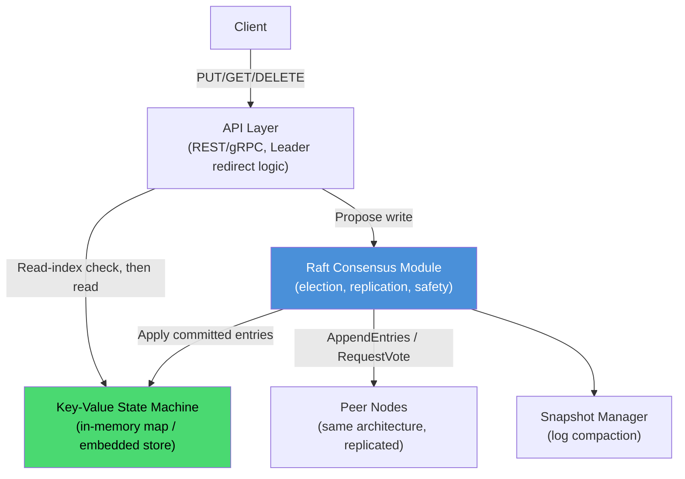

The diagram shows the layered architecture end to end: client requests enter through an API layer that knows how to find the Leader, writes are proposed to the Raft module and only reach the state machine once committed, reads either go through a read-index check (for linearizability) or directly to the state machine (for relaxed consistency), and the snapshot manager keeps the underlying log bounded over time, directly mirroring etcd's actual internal architecture.

#### Designing a Raft-Based KV Store: Real-Life Use Case

This exact architecture, minus etcd's additional features like watches, leases, and multi-version concurrency control, is precisely what a systems engineering interview candidate is expected to sketch out when asked to "design a distributed configuration store" or "design etcd," a extremely common systems design interview question at companies building or heavily operating Kubernetes-adjacent infrastructure. Explaining this exact layered design (API layer, Raft module, deterministic state machine, snapshot manager, client redirect/dedup logic) demonstrates a working understanding of how theoretical consensus algorithms actually become production distributed systems.

#### Designing a Raft-Based KV Store: Java/Spring Boot Code Example

```java
import org.springframework.web.bind.annotation.*;
import org.springframework.stereotype.Service;
import java.util.*;
import java.util.concurrent.ConcurrentHashMap;

@Service
class RaftBackedKeyValueStore {

    private final Map<String, String> stateMachine = new ConcurrentHashMap<>();
    private volatile boolean isLeader = true; // simplified: real impl delegates to the Raft module
    private volatile String leaderHint = "node-1";

    // Write path: propose to Raft, apply only once committed (simplified, synchronous illustration).
    String put(String key, String value, String clientId, long serialNumber) {
        if (!isLeader) {
            throw new NotLeaderException(leaderHint);
        }
        // In a full implementation: replicationService.appendClientCommand(...) then wait for commit.
        stateMachine.put(key, value);
        return "OK";
    }

    String delete(String key) {
        if (!isLeader) {
            throw new NotLeaderException(leaderHint);
        }
        stateMachine.remove(key);
        return "OK";
    }

    // Linearizable read: in a full implementation, this performs a read-index check first.
    Optional<String> getLinearizable(String key) {
        if (!isLeader) {
            throw new NotLeaderException(leaderHint);
        }
        confirmLeadershipViaMajorityHeartbeat(); // read-index step
        return Optional.ofNullable(stateMachine.get(key));
    }

    // Relaxed-consistency read: served locally, no leadership confirmation round-trip.
    Optional<String> getEventuallyConsistent(String key) {
        return Optional.ofNullable(stateMachine.get(key));
    }

    private void confirmLeadershipViaMajorityHeartbeat() {
        // Real implementation: exchange heartbeats with a majority of peers before proceeding.
    }

    static class NotLeaderException extends RuntimeException {
        final String leaderHint;
        NotLeaderException(String leaderHint) {
            super("Not leader, redirect to: " + leaderHint);
            this.leaderHint = leaderHint;
        }
    }
}

@RestController
@RequestMapping("/kv")
class KeyValueController {

    private final RaftBackedKeyValueStore store;

    KeyValueController(RaftBackedKeyValueStore store) {
        this.store = store;
    }

    @PutMapping("/{key}")
    public String put(@PathVariable String key, @RequestParam String value,
                       @RequestHeader("X-Client-Id") String clientId,
                       @RequestHeader("X-Serial-Number") long serialNumber) {
        return store.put(key, value, clientId, serialNumber);
    }

    @DeleteMapping("/{key}")
    public String delete(@PathVariable String key) {
        return store.delete(key);
    }

    @GetMapping("/{key}")
    public String get(@PathVariable String key, @RequestParam(defaultValue = "linearizable") String consistency) {
        Optional<String> value = "linearizable".equals(consistency)
                ? store.getLinearizable(key)
                : store.getEventuallyConsistent(key);
        return value.orElseThrow(() -> new NoSuchElementException("Key not found: " + key));
    }
}
```

#### Designing a Raft-Based KV Store: Interview Questions and Answers

**Q1. Walk through the full request flow when a client issues a `PUT key=value` request to this system.**
A: The client sends the request to a node; if that node is not the current Leader, it responds with a redirect and the client resends to the actual Leader. The Leader's API layer proposes the write as a new log entry to its Raft module, which replicates it to followers via `AppendEntries` and waits for majority acknowledgement. Once committed, the key-value state machine applies the entry (`map.put`), and the API layer returns success to the client.

**Q2. How would you support both a "fast" read and a "strongly consistent" read in this design, and what is the trade-off?**
A: Offer two read modes: a linearizable read that performs a read-index check (confirming continued leadership via a majority heartbeat exchange before reading local state) guaranteeing the freshest committed data at the cost of a network round-trip, and a relaxed-consistency read that serves directly from local state machine data (Leader's or even a Follower's) with lower latency but a risk of returning slightly stale data. Exposing both explicitly lets each caller choose the appropriate trade-off for their specific use case.

**Q3. What would you change in this design if a single Raft group's write throughput became a bottleneck?**
A: Introduce sharding ("Multi-Raft"): partition the keyspace (e.g., by key hash range or explicit ranges) into multiple independent Raft groups, each with its own Leader, and add a routing layer mapping a given key to the shard (and current Leader) responsible for it. This spreads write load across many leaders rather than trying to make a single Raft group's single Leader handle all writes.

**Q4. How does this design ensure a client's retried write (after a timeout) is not applied twice?**
A: Each write includes a client-generated, monotonically increasing serial number (as covered in the Client Interaction topic). The state machine tracks the last-processed serial number per client, and if a retried request arrives with a serial number it has already processed, it returns the previously computed result instead of applying the write again.

**Q5. Why is it important to implement log compaction/snapshotting from the start, rather than adding it later, for this key-value store?**
A: Every write becomes a permanent log entry; without periodic snapshotting, the log would grow without bound over the system's operational lifetime, consuming ever-increasing disk space and making new-node bootstrapping progressively slower. Building snapshotting in from the start avoids a much more disruptive retrofit later, once the log has already grown large in a live production system.

---

### Raft Consensus Algorithm: Characteristics, Pros, Cons, Use Cases, Components, Patterns, Benefits, Challenges, Best Practices and When to Use

This section summarizes Raft as a whole consensus algorithm (as opposed to the individual mechanisms detailed above, node states, terms, leader election, log replication, safety, membership changes, log compaction, client interaction), with a detailed explanation for every point.

#### Characteristics

- **A decomposed, understandability-first consensus protocol**: Raft's defining characteristic is splitting the hard consensus problem into three largely independent, individually comprehensible sub-problems (leader election, log replication, safety), a deliberate departure from optimizing purely for theoretical minimality.
- **Strictly leader-based**: Exactly one node acts as Leader at any given term, and all client writes flow through it, simplifying reasoning about ordering compared to leaderless quorum-write protocols.
- **Majority-quorum driven, tolerating `floor((N-1)/2)` failures**: Every safety and liveness guarantee ultimately reduces to majority agreement among N nodes, with any two majorities of the cluster guaranteed to overlap by at least one node.
- **Provably safe under partial failure and network partitions**: The combination of the Log Matching Property, the Election Restriction, and the current-term-only commit rule together guarantee the Leader Completeness Property, once committed, an entry is never lost, no matter how many subsequent leader elections occur.
- **CP by construction in CAP theorem terms**: Raft deliberately sacrifices availability during a lost-quorum partition rather than risk two leaders committing conflicting writes.

#### Pros / Benefits

- **Dramatically easier to implement correctly than classical Paxos**: Raft's single, complete specification (covering election, replication, safety, and membership changes together) has led to a proliferation of mature, widely trusted open-source libraries, lowering the barrier to building new consensus-backed systems.
- **Automatic, fast failover with no external orchestrator needed**: Leader election is entirely self-managed by the cluster itself, typically completing in well under a second under reasonable network conditions.
- **Absolute, permanent durability guarantee for committed data**: Once acknowledged as committed, an entry survives any sequence of subsequent leader failures and elections, a guarantee applications can build on without defensive re-verification logic.
- **A well-proven foundation across a wide range of production systems**: etcd, Consul, CockroachDB, TiKV, and Kafka's KRaft mode all rely on Raft (or a library implementing it), providing strong, diverse real-world validation beyond theoretical guarantees alone.
- **Extends cleanly to real operational needs**: Safe live membership changes, log compaction for bounded disk usage, and linearizable or relaxed client reads are all part of the well-specified, complete algorithm, not afterthoughts bolted on separately.

#### Cons / Challenges

- **Write throughput is fundamentally bounded by a single Leader per Raft group**: Scaling beyond this requires architectural sharding (Multi-Raft), adding meaningful engineering complexity for very high-throughput systems.
- **Real, deliberate availability cost during elections and lost-quorum partitions**: The cluster cannot accept writes during a leader election, and correctly refuses writes entirely if no partition retains a majority, a trade-off that must be explicitly accounted for in SLAs and capacity planning.
- **Several of Raft's safety rules are easy to get subtly wrong when reimplementing from scratch**: The current-term-only direct commit rule and the election restriction's exact log comparison logic are the most common sources of bugs in home-grown Raft implementations.
- **Not a general-purpose replacement for all replication needs**: Raft is best reserved for small, critical pieces of coordination/metadata state, not as the default mechanism for all of a large system's high-throughput data replication.
- **Joint consensus / membership changes and read-index linearizability add real implementation complexity**: Beyond the "core" algorithm, correctly implementing safe cluster resizing and strongly consistent reads requires careful additional engineering.

#### Use Cases

- **Distributed metadata and coordination stores**: etcd (backing Kubernetes), Consul's service catalog and KV store, ZooKeeper-alternative use cases generally.
- **Distributed SQL and NewSQL databases**: CockroachDB and TiDB (via TiKV) use sharded Raft groups to replicate transactional data across nodes while surviving individual node and even availability-zone failures.
- **Cluster metadata for large-scale messaging systems**: Apache Kafka's KRaft mode uses Raft specifically for topic/partition/ACL metadata, replacing an external ZooKeeper dependency.
- **Distributed locks and leader election services**: Any scenario needing a single, cluster-wide agreed-upon "who is currently the leader/lock holder" value.
- **Configuration management systems**: Feature flag services, service discovery registries, and dynamic configuration stores that must remain consistent and available despite individual node failures.

#### Components

- **Raft node state machine**: The Follower/Candidate/Leader roles and their transition rules.
- **Term counter**: The monotonically increasing logical clock underlying all staleness detection.
- **Replicated log**: The ordered, append-only sequence of commands every node maintains and applies deterministically.
- **`RequestVote` and `AppendEntries` RPCs**: The two RPC types that implement, respectively, leader election and log replication (plus heartbeats).
- **Safety mechanisms**: The Log Matching Property, Election Restriction, and current-term-only commit rule, together guaranteeing the Leader Completeness Property.
- **Membership change protocol**: Joint consensus (or the simpler one-at-a-time variant) for safely resizing the cluster.
- **Snapshotting/log compaction subsystem**: The mechanism bounding log growth over a cluster's operational lifetime.
- **Client interaction layer**: Leader discovery/redirect, serial-number-based deduplication, and read-index/lease mechanisms for linearizable reads.

#### Patterns

- **Decompose-and-conquer protocol design**: Splitting an inherently hard distributed problem into independently understandable, testable sub-problems.
- **Single-writer, fan-out replication**: Routing all writes through one Leader per term for simpler ordering guarantees, at the cost of a per-group throughput ceiling.
- **Quorum intersection as the core safety primitive**: Relying on the mathematical guarantee that any two majorities of a cluster overlap, to prevent conflicting simultaneous decisions.
- **Sharded "Multi-Raft" for horizontal write scaling**: The dominant pattern (CockroachDB, TiKV) for scaling beyond a single Raft group's throughput ceiling.
- **Consensus for metadata, simpler replication for bulk data**: Reserving Raft's heavier guarantees for small, critical coordination state, and using purpose-built mechanisms for high-throughput bulk data (Kafka's KRaft + ISR split).
- **Logical clock via monotonic term counters**: Avoiding any dependency on synchronized wall clocks for detecting stale information.

#### Best Practices

- Use an odd cluster size (3, 5, or 7 nodes), spread across independent failure domains (availability zones/racks), to maximize real-world fault tolerance and avoid ambiguous majority calculations.
- Reserve Raft for small, critical coordination/metadata state, and use sharded Multi-Raft or a separate, simpler replication mechanism for high-throughput bulk data paths.
- Use a mature, well-tested Raft library (Hashicorp Raft, etcd's raft package, raft-rs) rather than implementing the algorithm from scratch, given the subtlety of its safety rules.
- Tune heartbeat intervals and election timeouts appropriately for your network's real latency characteristics, and monitor election frequency as a key operational health signal.
- Implement client-side Leader caching with redirect-following, and per-command serial numbers for safe retries, on top of whatever Raft library you use.
- Build in log compaction/snapshotting, and a safe one-at-a-time (or joint consensus) membership change procedure, from the beginning rather than retrofitting them later.
- Explicitly expose and document your system's consistency guarantees for reads (linearizable via read-index, lease-based, or relaxed/eventually consistent), rather than leaving this implicit.

#### When to Use

- Use Raft whenever multiple nodes need to agree on a single, strongly consistent source of truth (leader identity, cluster configuration, a small amount of critical metadata) that must survive individual node failures and network partitions.
- Use Raft as the foundation for a distributed coordination service, configuration store, or the metadata layer of a larger distributed system, rather than for high-throughput, latency-sensitive bulk data replication directly.
- Use sharded Multi-Raft specifically when a single Raft group's write throughput ceiling becomes a genuine, measured bottleneck, not as a default starting architecture.
- Choose Raft over hand-rolled Paxos for any new system, given its complete specification, understandability, and mature library ecosystem; consider ZooKeeper (and its ZAB protocol) directly only when its specific, mature feature set and existing ecosystem are a better operational fit than embedding a Raft library.
- Avoid relying on Raft's strong consistency guarantees for workloads that are fundamentally fine with eventual consistency and need much higher availability during partitions (AP workloads), where a leaderless, quorum-based AP system (e.g., Cassandra-style) is a more appropriate architectural choice.
