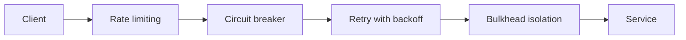
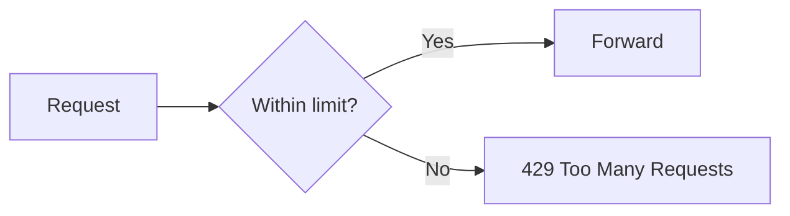
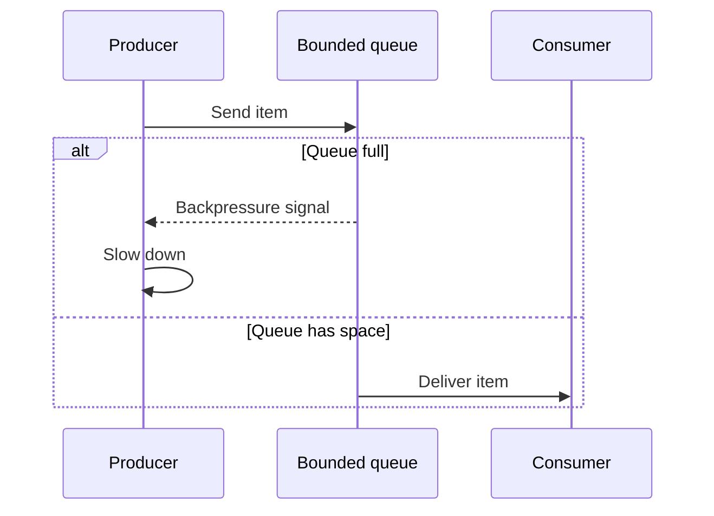
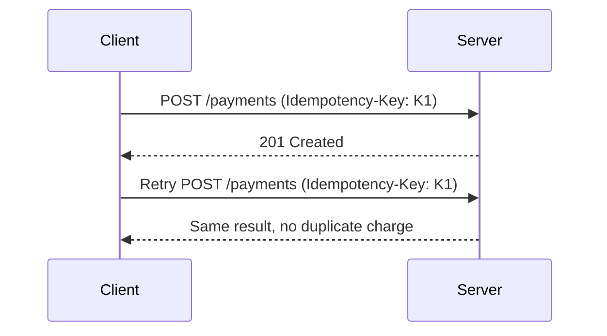
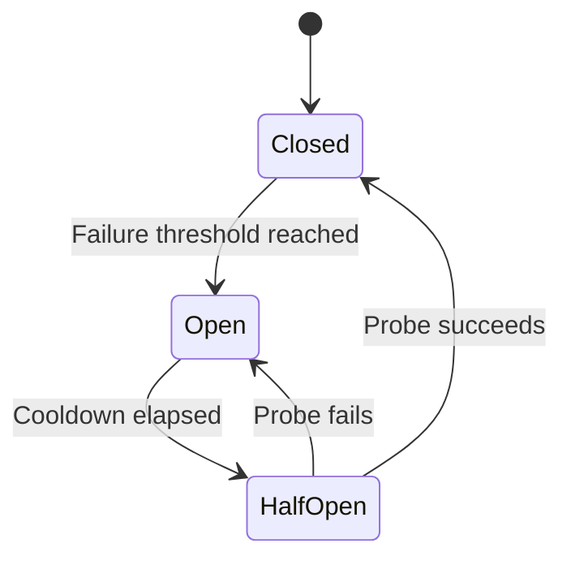
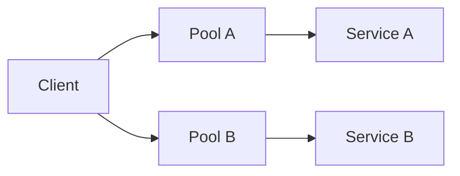
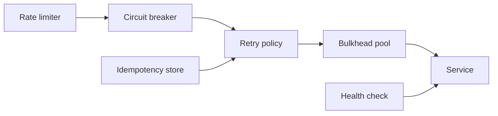

# Performance & Resilience Patterns

## Blogs and websites


## Medium

- [Introduction to API Rate Limiting: Understanding the Basics and Its Importance](https://medium.com/the-developers-diary/introduction-to-api-rate-limiting-understanding-the-basics-and-its-importance-fde0b5af995b)

## Youtube


## Theory

### Topics Covered

1. [Introduction](#introduction)
2. [Rate Limiting](#rate-limiting)
3. [Throttling and Backpressure](#throttling-and-backpressure)
4. [Idempotency](#idempotency)
5. [Circuit Breaker and Retry](#circuit-breaker-and-retry)
6. [Bulkhead and Health Checks](#bulkhead-and-health-checks)
7. [Characteristics](#characteristics)
8. [Pros](#pros)
9. [Cons](#cons)
10. [Use Cases](#use-cases)
11. [Components](#components)
12. [Patterns](#patterns)
13. [Benefits](#benefits)
14. [Challenges](#challenges)
15. [Best Practices](#best-practices)
16. [When to Use](#when-to-use)
17. [Java and Spring Boot Examples](#java-and-spring-boot-examples)

---

### Introduction

Resilience patterns help systems survive failures and overload. They protect resources, contain failures, and recover gracefully instead of collapsing under pressure.



**Real-life use cases**

- **API gateways**: rate limit abusive clients.
- **Payment systems**: idempotent retries prevent double charges.
- **Microservices**: circuit breakers stop cascading failures.
- **Streaming systems**: backpressure protects consumers.
- **Cloud platforms**: health checks route around failures.

**Interview questions and answers**

- **Q: Why are resilience patterns important?**
  **A:** They keep systems available and responsive despite failures and overload.

- **Q: What is a cascading failure?**
  **A:** A failure in one component overloads its callers, spreading failure through the system.

- **Q: How do resilience patterns prevent cascading failures?**
  **A:** By isolating failures, failing fast, limiting load, and degrading gracefully.

---

### Rate Limiting

Rate limiting is a technique used to control the number of requests a client can make to a server within a given time window. It acts as a gatekeeper that prevents any single user or service from overwhelming your system.

**Why Rate Limiting Matters:**

- **Prevents abuse**: Stops malicious actors from DDoS attacks or brute-force attempts.
- **Ensures fairness**: No single user can monopolize resources.
- **Protects infrastructure**: Prevents cascading failures under load spikes.
- **Controls cost**: Limits compute/bandwidth usage on pay-per-use infrastructure.

**How It Works (Conceptually):**

```
Client sends request
  → Rate limiter checks: "Has this client exceeded N requests in T seconds?"
    → NO  → Forward request to server → Return response
    → YES → Return 429 Too Many Requests
```

**Common Algorithms Explained:**

1. **Fixed Window**: Divide time into fixed intervals (e.g., 1-minute windows). Count requests per window. Simple but has burst issues at window boundaries.

2. **Sliding Window Log**: Track timestamps of each request. Count requests within a rolling window. Precise but memory-intensive.

3. **Sliding Window Counter**: Hybrid of fixed window and sliding log. Weights the previous window count by overlap percentage. Good balance of accuracy and efficiency.

4. **Token Bucket**: A bucket holds tokens (max capacity = burst size). Tokens are added at a fixed rate. Each request consumes one token. If empty, request is rejected. Allows controlled bursts.

5. **Leaky Bucket**: Requests enter a queue (bucket). Processed at a constant rate. If bucket is full, excess requests are dropped. Smooths out traffic.

**Where to Implement:**

- **API Gateway**: Most common — centralized, handles rate limiting before requests reach services.
- **Load Balancer**: Can do basic IP-based limiting.
- **Application Layer**: Fine-grained per-user or per-endpoint limits.
- **Redis/Memcached**: Distributed counters for rate limiting across multiple servers.

**Rate Limiting vs Throttling:**

- Rate limiting: Hard cutoff — reject excess requests (429 response).
- Throttling: Soft control — slow down or queue excess requests.



**Interview questions and answers**

- **Q: What is the difference between token bucket and leaky bucket?**
  **A:** Token bucket allows bursts up to capacity; leaky bucket enforces a constant output rate and smooths traffic.

- **Q: Why is a distributed rate limiter harder?**
  **A:** Counters must be consistent across instances, requiring shared storage and race handling.

- **Q: What status code is commonly returned when rate limited?**
  **A:** HTTP 429 Too Many Requests.

---

### Throttling and Backpressure

**Throttling**

Deliberately slow down processing to protect system.

**Types:**

- **Request throttling**: Limit incoming requests.
- **Resource throttling**: Limit resource consumption.
- **User throttling**: Limit per user.

**Difference from Rate Limiting:**

- Rate limiting: Hard limits, reject excess.
- Throttling: Slow down, queue excess.

**Backpressure**

Downstream component signals upstream to slow down.

**Mechanisms:**

- Bounded queues.
- Reactive Streams.
- TCP flow control.
- HTTP/2 flow control.

**Benefits:**

- Prevent system overload.
- Graceful degradation.
- Resource protection.



**Interview questions and answers**

- **Q: What is backpressure?**
  **A:** A signal from a consumer to a producer to slow down when it cannot keep up.

- **Q: Why are bounded queues important?**
  **A:** They prevent unbounded memory growth when consumers are slower than producers.

- **Q: How does throttling differ from rate limiting?**
  **A:** Throttling slows or queues excess work; rate limiting rejects it outright.

---

### Idempotency

Multiple identical requests have same effect as single request.

**HTTP Idempotent Methods:**

- GET, PUT, DELETE, HEAD, OPTIONS.
- NOT POST (creates new resource each time).

**Implementation:**

- Idempotency keys.
- Database constraints.
- Check before insert.
- State machines.

**Use Cases:**

- Payment processing.
- Order submission.
- Retry logic.



**Interview questions and answers**

- **Q: Why is idempotency essential for retries?**
  **A:** Retries may deliver the same request more than once, and idempotency ensures no duplicate side effects.

- **Q: Which HTTP method is not idempotent?**
  **A:** POST is not idempotent because it typically creates a new resource each time.

- **Q: What is an idempotency key?**
  **A:** A client-generated identifier used to deduplicate repeated operations.

---

### Circuit Breaker and Retry

**Circuit Breaker**

Prevent cascading failures by failing fast.

**States:**

- **Closed**: Normal operation.
- **Open**: Requests fail immediately.
- **Half-Open**: Test if service recovered.

**Benefits:**

- Fail fast.
- Prevent resource exhaustion.
- Allow service recovery.
- Graceful degradation.

**Tools:**

- Hystrix (Netflix, deprecated).
- Resilience4j.
- Polly (.NET).



**Retry Mechanisms**

Automatically retry failed operations.

**Strategies:**

- **Fixed delay**: Wait same time between retries.
- **Exponential backoff**: Increase delay exponentially.
- **Jitter**: Add randomness to avoid thundering herd.

**Best Practices:**

- Set max retries.
- Only retry transient failures.
- Use exponential backoff.
- Implement idempotency.

**Interview questions and answers**

- **Q: What is the half-open state?**
  **A:** A state that allows a few test requests to check whether a failed service has recovered.

- **Q: Why add jitter to retries?**
  **A:** To spread out retries and avoid synchronized spikes that create a thundering herd.

- **Q: When should you not retry?**
  **A:** For non-transient errors or when the operation is not idempotent.

---

### Bulkhead and Health Checks

**Bulkhead Pattern**

Isolate resources to prevent cascading failures.

**Example:**

- Separate connection pools per service.
- Separate thread pools.
- Resource quotas.

**Benefits:**

- Fault isolation.
- Resource protection.
- Prevent total system failure.



**Health Checks**

Monitor service health and availability.

**Types:**

- **Liveness**: Is service running?
- **Readiness**: Can service handle requests?
- **Startup**: Has service finished initialization?

**Implementation:**

- HTTP endpoints (`/health`, `/ready`).
- Periodic polling.
- Metrics collection.

**Use Cases:**

- Load balancer routing.
- Auto-scaling decisions.
- Container orchestration.
- Service discovery.

**Interview questions and answers**

- **Q: Why separate connection pools per downstream service?**
  **A:** So a slow or failing service cannot exhaust the pool used by healthy services.

- **Q: What is the difference between liveness and readiness?**
  **A:** Liveness means the process is running; readiness means it can handle traffic.

- **Q: How do health checks prevent routing to bad instances?**
  **A:** Load balancers and registries remove unhealthy instances from rotation.

---

### Characteristics

- **Protective**
  Patterns guard against overload and failure.

- **Fault-isolating**
  Bulkheads and breakers contain failures.

- **Rate-aware**
  Limiters and throttling control flow.

- **Idempotent**
  Retries are made safe through deduplication.

- **Recoverable**
  Circuit breakers allow services to heal.

- **Configurable**
  Thresholds, timeouts, and backoff are tunable.

- **Distributed**
  Patterns apply across services and instances.

- **Observable**
  Health checks and metrics expose state.

---

### Pros

- **Availability**
  Systems remain available under stress.

- **Resilience**
  Failures degrade gracefully.

- **Resource protection**
  Limits prevent exhaustion.

- **Fairness**
  Rate limiting shares capacity.

- **Safety**
  Idempotency prevents duplicate side effects.

- **Recovery**
  Breakers and retries enable healing.

- **Isolation**
  Bulkheads contain failures.

- **Operational confidence**
  Health checks inform routing and scaling.

---

### Cons

- **Complexity**
  Multiple patterns add implementation overhead.

- **Latency**
  Checks, queues, and throttling add delay.

- **Configuration burden**
  Thresholds and backoff require tuning.

- **Potential false positives**
  Breakers may open too early.

- **State management**
  Distributed rate limiters need shared state.

- **Debugging difficulty**
  Interaction between patterns is subtle.

- **User impact**
  Rejections and throttling affect legitimate users.

- **Tool dependency**
  Libraries such as Resilience4j require integration.

---

### Use Cases

- **API gateways**
  Rate limit and protect backends.

- **Payment systems**
  Idempotent retries prevent double charges.

- **Microservices**
  Circuit breakers stop cascading failures.

- **Streaming systems**
  Backpressure protects consumers.

- **Cloud load balancers**
  Health checks route traffic.

- **E-commerce**
  Survive flash-sale spikes.

- **Messaging**
  Retry with backoff for transient failures.

- **IoT**
  Limit and throttle device traffic.

---

### Components

- **Rate limiter**
  Enforces request quotas.

- **Token bucket / leaky bucket**
  Algorithms for limiting.

- **Circuit breaker**
  Fails fast and allows recovery.

- **Retry policy**
  Defines backoff and max attempts.

- **Bounded queue**
  Enforces backpressure.

- **Bulkhead pool**
  Isolates resources.

- **Health check**
  Reports liveness and readiness.

- **Idempotency store**
  Deduplicates operations.

- **Fallback handler**
  Provides degraded responses.



---

### Patterns

- **Rate limiting**
  Cap requests per client or endpoint.

- **Token bucket**
  Allow bursts up to a limit.

- **Leaky bucket**
  Smooth traffic at a constant rate.

- **Circuit breaker**
  Fail fast and recover.

- **Retry with backoff**
  Retry transient failures safely.

- **Bulkhead**
  Isolate resources per dependency.

- **Backpressure**
  Signal upstream to slow down.

- **Idempotent operations**
  Deduplicate repeated requests.

- **Health checks**
  Expose and verify readiness.

---

### Benefits

- **System stability**
  Overload and failures are contained.

- **Better user experience**
  Graceful degradation beats total failure.

- **Cost control**
  Limits prevent runaway resource use.

- **Correctness**
  Idempotency avoids duplicate side effects.

- **Recovery**
  Breakers allow dependencies to heal.

- **Fairness**
  Rate limiting shares capacity.

- **Observability**
  Health and metrics enable proactive response.

- **Confidence**
  Teams trust systems under load.

---

### Challenges

- **Tuning thresholds**
  Wrong settings cause false trips or missed failures.

- **Distributed state**
  Rate limiters need consistent counters.

- **Idempotency key management**
  Keys must be unique and retained.

- **Retry storms**
  Aggressive retries amplify load.

- **Backpressure propagation**
  Applying backpressure end to end is hard.

- **Fallback correctness**
  Degraded responses must be safe.

- **Latency budgets**
  Added checks consume time.

- **Testing**
  Simulating failures and overload is complex.

---

### Best Practices

- **Use exponential backoff with jitter**
  Avoid retry storms.

- **Set max retries**
  Prevent infinite loops.

- **Only retry transient failures**
  Respect error semantics.

- **Make retried operations idempotent**
  Use idempotency keys.

- **Isolate with bulkheads**
  Separate pools per dependency.

- **Use circuit breakers for remote calls**
  Fail fast and allow recovery.

- **Enforce bounded queues**
  Prevent unbounded memory growth.

- **Alert on breaker state changes**
  Detect dependency degradation.

- **Expose health endpoints**
  Support routing and scaling decisions.

- **Test under load and failure**
  Validate resilience behavior.

---

### When to Use

- **Use rate limiting when** protecting APIs from abuse.
- **Use circuit breakers when** calling remote services.
- **Use retries when** failures are transient and operations are idempotent.
- **Use backpressure when** consumers cannot keep up.
- **Use bulkheads when** isolating failures is critical.
- **Use idempotency when** retries can cause duplicate effects.

**Avoid these patterns when**

- The system is simple and low-traffic.
- The overhead outweighs the risk.
- Operations are already safe and failure-tolerant.
- The added complexity would slow delivery.

---

### Java and Spring Boot Examples

#### 1. Token bucket rate limiter

```java
import org.springframework.stereotype.Service;

import java.time.Duration;
import java.time.Instant;
import java.util.concurrent.atomic.AtomicLong;

@Service
public class TokenBucketRateLimiter {

    private final long capacity;
    private final long tokensPerSecond;
    private final AtomicLong tokens;
    private volatile Instant lastRefill;

    public TokenBucketRateLimiter(long capacity, long tokensPerSecond) {
        this.capacity = capacity;
        this.tokensPerSecond = tokensPerSecond;
        this.tokens = new AtomicLong(capacity);
        this.lastRefill = Instant.now();
    }

    public boolean tryAcquire() {
        refill();
        while (true) {
            long current = tokens.get();
            if (current <= 0) {
                return false;
            }
            if (tokens.compareAndSet(current, current - 1)) {
                return true;
            }
        }
    }

    private void refill() {
        Instant now = Instant.now();
        long elapsed = Duration.between(lastRefill, now).toSeconds();
        if (elapsed > 0) {
            long added = elapsed * tokensPerSecond;
            tokens.accumulateAndGet(capacity, (current, cap) -> Math.min(cap, current + added));
            lastRefill = now;
        }
    }
}
```

#### 2. Circuit breaker with Resilience4j

```java
import io.github.resilience4j.circuitbreaker.CircuitBreaker;
import org.springframework.stereotype.Service;

import java.util.function.Supplier;

@Service
public class ResilientPaymentService {

    private final CircuitBreaker circuitBreaker = CircuitBreaker.ofDefaults("payment");

    public String charge(Supplier<String> remoteCall) {
        return circuitBreaker.executeSupplier(remoteCall);
    }
}
```

#### 3. Idempotent service

```java
import org.springframework.stereotype.Service;

import java.util.Set;
import java.util.concurrent.ConcurrentHashMap;

@Service
public class IdempotentOrderService {

    private final Set<String> processed = ConcurrentHashMap.newKeySet();

    public boolean create(String idempotencyKey) {
        if (!processed.add(idempotencyKey)) {
            return false; // duplicate request
        }
        // Create order.
        return true;
    }
}
```

#### 4. Retry with exponential backoff

```java
import java.time.Duration;
import java.util.function.Supplier;

public final class RetryExecutor {

    private RetryExecutor() {
    }

    public static <T> T withBackoff(Supplier<T> operation, int maxAttempts, Duration baseDelay) {
        RuntimeException last = null;
        for (int attempt = 1; attempt <= maxAttempts; attempt++) {
            try {
                return operation.get();
            } catch (RuntimeException e) {
                last = e;
                if (attempt == maxAttempts) {
                    break;
                }
                long delayMs = baseDelay.toMillis() * (1L << (attempt - 1));
                try {
                    Thread.sleep(delayMs);
                } catch (InterruptedException ie) {
                    Thread.currentThread().interrupt();
                    throw new IllegalStateException("Retry interrupted", ie);
                }
            }
        }
        throw last;
    }
}
```

**Interview questions and answers**

- **Q: How does a circuit breaker help a failing service recover?**
  **A:** It stops sending requests for a cooldown period, giving the service time to recover, then probes with half-open requests.

- **Q: Why combine retry with backoff and jitter?**
  **A:** Backoff spaces attempts over time and jitter spreads them across clients, avoiding thundering-herd spikes.

- **Q: What is the purpose of idempotency in a payment API?**
  **A:** It ensures retries do not result in duplicate charges.

- **Q: How does backpressure protect a system?**
  **A:** It prevents a slow consumer from causing unbounded memory growth by signaling the producer to slow down.
