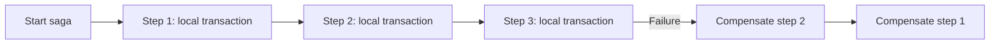
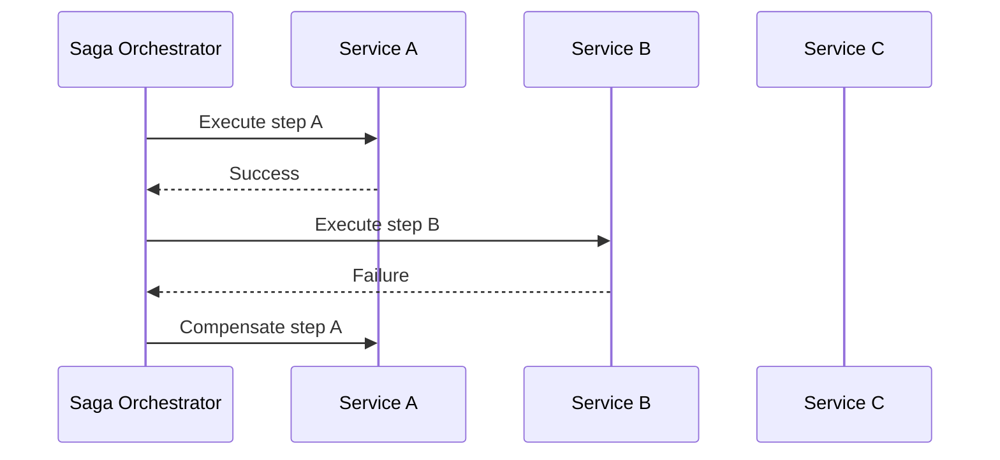
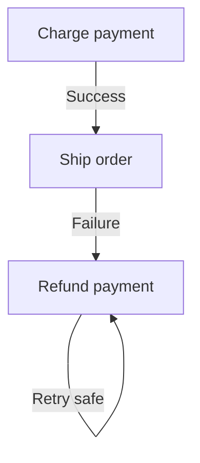
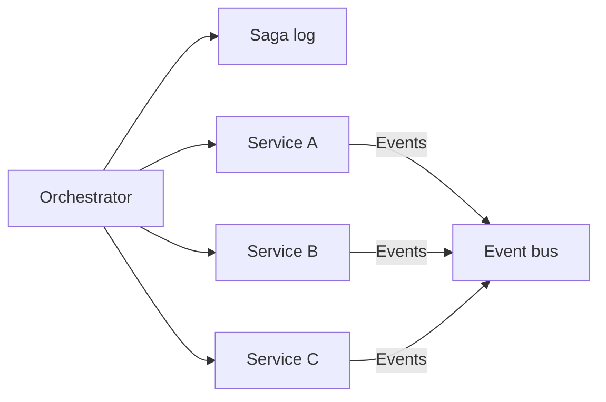

# Saga Pattern

## Blogs and websites


## Medium


## Youtube


## Theory

### Topics Covered

1. [Introduction](#introduction)
2. [Choreography vs Orchestration](#choreography-vs-orchestration)
3. [Compensating Transactions](#compensating-transactions)
4. [Characteristics](#characteristics)
5. [Pros](#pros)
6. [Cons](#cons)
7. [Use Cases](#use-cases)
8. [Components](#components)
9. [Patterns](#patterns)
10. [Benefits](#benefits)
11. [Challenges](#challenges)
12. [Best Practices](#best-practices)
13. [When to Use](#when-to-use)
14. [Java and Spring Boot Examples](#java-and-spring-boot-examples)

---

### Introduction

The Saga pattern manages distributed transactions across services without relying on a shared ACID database. A saga breaks a long-running business transaction into a sequence of local transactions, each with a compensating action to undo it if a later step fails.



**Real-life use cases**

- **Order fulfillment**: reserve inventory, charge payment, ship.
- **Travel booking**: book flight, hotel, and car together.
- **Payment processing**: transfer funds across services.
- **E-commerce checkout**: coordinate cart, payment, and inventory.
- **Account provisioning**: create user, mailbox, and billing.

**Interview questions and answers**

- **Q: What is a saga?**
  **A:** A sequence of local transactions coordinated across services, with compensating actions for rollback.

- **Q: Why not use distributed ACID transactions?**
  **A:** Distributed two-phase commit scales poorly and blocks resources, while sagas favor availability and loose coupling.

- **Q: What is a compensating transaction?**
  **A:** An action that reverses the effect of a previously completed local transaction when the overall saga fails.

---

### Choreography vs Orchestration

Manage distributed transactions across services.

**Types:**

- **Choreography**: services coordinate via events.
- **Orchestration**: a central coordinator directs each step.

**Choreography:**

Each service listens for events and performs its local work, then publishes the next event. There is no central coordinator.

```
Order Service → publishes "OrderCreated"
  → Payment Service listens → publishes "PaymentCompleted"
    → Inventory Service listens → publishes "InventoryReserved"
```

**Orchestration:**

A central saga orchestrator calls each service and decides what to do next, including compensations.



**Comparison:**

| Aspect | Choreography | Orchestration |
|--------|--------------|---------------|
| **Coordination** | Decentralized events | Central coordinator |
| **Coupling** | Lower runtime coupling | Clearer central flow |
| **Visibility** | Harder to track | Easier to observe |
| **Complexity** | Distributed across services | Centralized but a SPOF risk |

**Interview questions and answers**

- **Q: Which saga type is easier to debug?**
  **A:** Orchestration, because the central coordinator holds the flow and can report current state.

- **Q: What is a risk of choreography?**
  **A:** The flow is implicit in events, making it hard to understand and track end-to-end.

- **Q: What is a risk of orchestration?**
  **A:** The orchestrator can become a single point of failure and a bottleneck if not designed carefully.

---

### Compensating Transactions

Rollback via compensating transactions, not true ACID.

**Why compensation instead of rollback:**

- Once a local transaction commits, its effect is visible.
- Distributed systems cannot simply undo committed work.
- Compensation applies a business-level inverse operation.

**Examples:**

| Local transaction | Compensating transaction |
|-------------------|--------------------------|
| Charge payment | Refund payment |
| Reserve inventory | Release inventory |
| Create order | Cancel order |
| Send email | Send correction (best effort) |

**Idempotency is critical:**

- Compensation may be retried.
- Every step and compensation must be idempotent.
- Idempotency keys prevent duplicate side effects.



**Interview questions and answers**

- **Q: Can a saga guarantee ACID?**
  **A:** No, a saga provides eventual consistency and compensation, not the atomicity and isolation of ACID transactions.

- **Q: Why must compensations be idempotent?**
  **A:** Retries can execute the same compensation more than once, so it must produce the same result without duplicate side effects.

- **Q: What if a compensation fails?**
  **A:** It must be retried with backoff and eventually resolved, often through a dead-letter queue or manual intervention.

---

### Characteristics

- **Distributed**
  Each step is a local transaction in a different service.

- **Eventual**
  The overall outcome converges asynchronously.

- **Compensating**
  Failures are undone with inverse actions.

- **Non-ACID**
  It does not provide atomicity or isolation across services.

- **Coordinated**
  Either by events or a central orchestrator.

- **Resilient**
  Steps can be retried independently.

- **Idempotent**
  Steps and compensations must be safe to repeat.

- **Observable**
  The saga state should be tracked for recovery.

- **Long-running**
  Sagas can span minutes, hours, or days.

---

### Pros

- **Availability**
  Avoids blocking distributed locks and two-phase commit.

- **Scalability**
  Services process their own local transactions.

- **Loose coupling**
  Choreography minimizes direct dependencies.

- **Resilience**
  Failures are handled with retries and compensation.

- **Clear business flow**
  Orchestration makes the process explicit.

- **Independent deployment**
  Services evolve and deploy independently.

- **Flexibility**
  Steps can be added or replaced with new services.

- **Eventual consistency**
  Acceptable for many business workflows.

---

### Cons

- **No ACID guarantees**
  Atomicity and isolation are lost.

- **Complexity**
  Failure handling and compensation are hard.

- **Compensation gaps**
  Some actions cannot be perfectly undone.

- **Idempotency burden**
  Every step must tolerate duplicates.

- **Consistency windows**
  Intermediate states may be visible to users.

- **Orchestrator SPOF**
  Central coordination can become a failure point.

- **Debugging difficulty**
  Distributed sagas are hard to trace.

- **Event ordering challenges**
  Choreography can be sensitive to event order.

---

### Use Cases

- **E-commerce orders**
  Coordinate payment, inventory, and shipping.

- **Travel bookings**
  Book flight, hotel, and car across providers.

- **Payment processing**
  Move money across accounts and services.

- **User provisioning**
  Create accounts across multiple systems.

- **Subscription management**
  Provision access and billing.

- **Supply chain workflows**
  Coordinate orders, fulfillment, and returns.

- **Insurance claims**
  Process multi-step approval workflows.

- **Banking operations**
  Handle long-running, cross-service processes.

---

### Components

- **Saga step**
  A local transaction in a service.

- **Compensating action**
  The inverse operation for a step.

- **Orchestrator**
  A central coordinator for orchestration sagas.

- **Event bus**
  Carries events between services.

- **Saga log**
  Records the current state and completed steps.

- **Idempotency store**
  Deduplicates repeated operations.

- **Dead-letter queue**
  Holds messages that repeatedly fail.

- **Service boundary**
  Each participating service owns its local data.



---

### Patterns

- **Choreography saga**
  Services coordinate through events.

- **Orchestration saga**
  A coordinator directs the flow.

- **Command/event duality**
  Send commands to act and publish events after acting.

- **Compensation chain**
  Undo completed steps in reverse order.

- **Idempotent consumer**
  Deduplicate duplicate events.

- **Transactional outbox**
  Publish events reliably with local data changes.

- **Saga state machine**
  Model the flow as explicit states and transitions.

- **Dead-letter handling**
  Route unrecoverable failures for manual review.

---

### Benefits

- **Business continuity**
  Long-running workflows complete without blocking.

- **Resilience**
  Local failures are contained and retried.

- **Scalability**
  Each service scales independently.

- **Autonomy**
  Services own their data and transactions.

- **Flexibility**
  New steps integrate through events or coordinator changes.

- **Observability**
  Orchestrated sagas provide clear process state.

- **Cost efficiency**
  No distributed transaction manager is required.

- **Alignment with microservices**
  Matches bounded contexts and independent deployment.

---

### Challenges

- **Guaranteeing compensation**
  Not every effect can be cleanly undone.

- **Managing intermediate states**
  Users may observe partially complete workflows.

- **Idempotency**
  All steps must handle duplicate execution.

- **Event reliability**
  Lost or duplicated events cause incorrect outcomes.

- **Coordinator failure**
  Orchestrator outages must be recovered.

- **Testing**
  Distributed failure paths are hard to test.

- **Monitoring**
  End-to-end saga visibility requires instrumentation.

- **Concurrent sagas**
  Conflicts can arise when multiple sagas touch shared data.

---

### Best Practices

- **Prefer orchestration for complex flows**
  Centralize control for clarity and recovery.

- **Make every step idempotent**
  Use idempotency keys and deduplication.

- **Design compensations upfront**
  Ensure each step has an inverse action.

- **Persist saga state**
  Store the current step and completed actions.

- **Use the transactional outbox pattern**
  Publish events reliably with local writes.

- **Retry transient failures**
  Use exponential backoff with jitter.

- **Route poison messages to a DLQ**
  Avoid infinite retries.

- **Track and trace the saga**
  Attach a correlation ID to every message.

- **Limit saga duration**
  Timeout long-running steps and surface them.

- **Test failure and compensation paths**
  Simulate partial failures.

---

### When to Use

- **Use a saga when** a business transaction spans multiple services.
- **Use a saga when** distributed ACID is not feasible or desirable.
- **Use a saga when** eventual consistency is acceptable.
- **Use orchestration when** the flow is complex and needs central visibility.
- **Use choreography when** services are highly autonomous.

**Avoid sagas when**

- A single database can provide ACID transactions.
- The workflow is short and simple.
- Strong isolation is required throughout.
- The cost of compensation outweighs the benefit.

---

### Java and Spring Boot Examples

#### 1. Saga orchestrator with a state machine

```java
import org.springframework.stereotype.Service;

@Service
public class OrderSagaOrchestrator {

    public SagaState start(Order order) {
        return new SagaState(order.id(), SagaStep.CREATE_ORDER);
    }

    public SagaState onSuccess(SagaState state) {
        return switch (state.step()) {
            case CREATE_ORDER -> new SagaState(state.orderId(), SagaStep.RESERVE_INVENTORY);
            case RESERVE_INVENTORY -> new SagaState(state.orderId(), SagaStep.CHARGE_PAYMENT);
            case CHARGE_PAYMENT -> new SagaState(state.orderId(), SagaStep.COMPLETED);
            case COMPLETED, CANCEL_ORDER, REFUND_PAYMENT, RELEASE_INVENTORY ->
                    new SagaState(state.orderId(), SagaStep.COMPLETED);
        };
    }

    public SagaState onFailure(SagaState state) {
        return switch (state.step()) {
            case CREATE_ORDER -> new SagaState(state.orderId(), SagaStep.CANCEL_ORDER);
            case RESERVE_INVENTORY -> new SagaState(state.orderId(), SagaStep.CANCEL_ORDER);
            case CHARGE_PAYMENT -> new SagaState(state.orderId(), SagaStep.REFUND_PAYMENT);
            default -> new SagaState(state.orderId(), SagaStep.FAILED);
        };
    }

    public record SagaState(String orderId, SagaStep step) {}

    public enum SagaStep {
        CREATE_ORDER, RESERVE_INVENTORY, CHARGE_PAYMENT, COMPLETED,
        CANCEL_ORDER, REFUND_PAYMENT, RELEASE_INVENTORY, FAILED
    }

    public record Order(String id) {}
}
```

#### 2. Choreography event handler

```java
import org.springframework.context.event.EventListener;
import org.springframework.stereotype.Service;

@Service
public class PaymentSagaListener {

    @EventListener
    public void onOrderCreated(OrderCreatedEvent event) {
        // Perform local payment, then publish PaymentCompletedEvent.
    }

    public record OrderCreatedEvent(String orderId) {}
}
```

#### 3. Compensation service

```java
import org.springframework.stereotype.Service;

@Service
public class PaymentCompensationService {

    public void refund(String paymentId) {
        // Idempotent refund operation.
    }

    public void releaseInventory(String reservationId) {
        // Idempotent release operation.
    }
}
```

#### 4. Idempotent operation with a key

```java
import org.springframework.stereotype.Service;

import java.util.Set;
import java.util.concurrent.ConcurrentHashMap;

@Service
public class IdempotentPaymentService {

    private final Set<String> processed = ConcurrentHashMap.newKeySet();

    public boolean charge(String idempotencyKey, String orderId) {
        if (!processed.add(idempotencyKey)) {
            return false; // already processed
        }
        // Perform payment.
        return true;
    }
}
```

**Interview questions and answers**

- **Q: Why is a saga not the same as a distributed transaction?**
  **A:** A saga uses independent local transactions and compensations, trading ACID guarantees for availability and scalability.

- **Q: What is the role of a compensation transaction?**
  **A:** It reverses a previously successful step when a later step fails.

- **Q: How do you ensure sagas survive message loss?**
  **A:** Persist saga state, use reliable messaging, apply the transactional outbox pattern, and retry with idempotency.

- **Q: What is the main benefit of orchestration over choreography?**
  **A:** The flow is explicit and centralized, making it easier to observe, debug, and recover.
