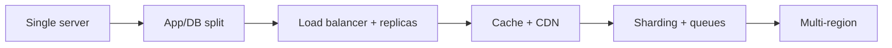
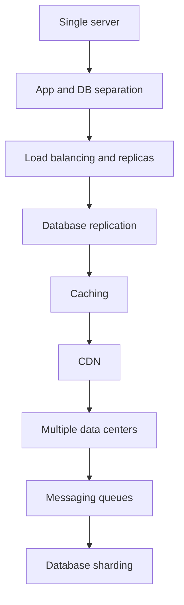
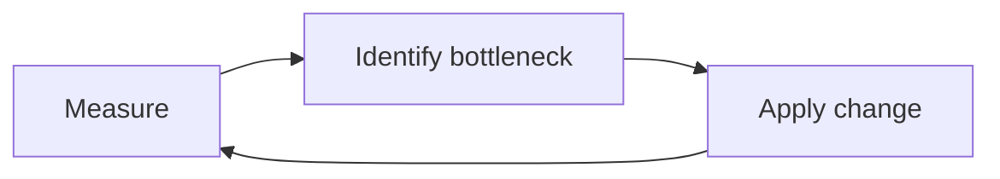
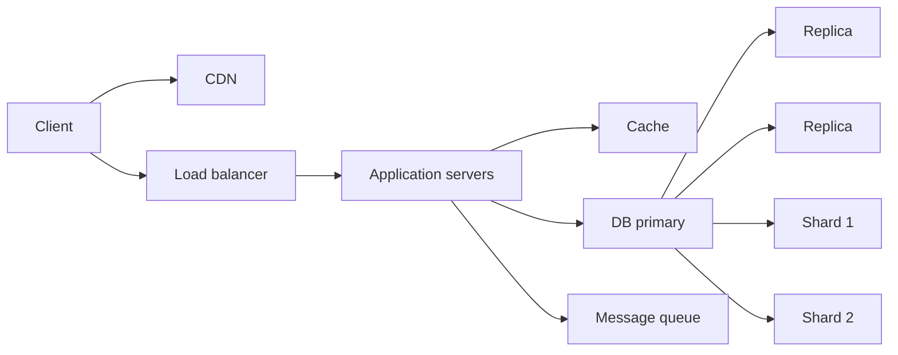

# Scaling to One Million

## Blogs and websites


## Medium


## Youtube

- [1 vs 1,000,000 Requests Per Second Backend!](https://www.youtube.com/watch?v=JB1_wpZvFac)

- [Let’s Handle 1 Million Requests per Second, It’s Scarier Than You Think!](https://www.youtube.com/watch?v=W4EwfEU8CGA)


- [Scaling from 1 User to 1M Users: Real Architecture Journey | System Design in Hindi](https://www.youtube.com/watch?v=sXohJ3pYAfI)

- [5. Scale from ZERO to MILLION Users (Hindi) | System design interview: Scale to 1million users](https://www.youtube.com/watch?v=rExh5cPMZcI)
- [15. Design High Availability & Resilience System, HLD | Active Passive & Active Active Architecture](https://www.youtube.com/watch?v=iL7_8TmrePM)

## Theory

### Topics Covered

1. [Introduction](#introduction)
2. [Steps for Scaling](#steps-for-scaling)
3. [Bottleneck Analysis](#bottleneck-analysis)
4. [Characteristics](#characteristics)
5. [Pros](#pros)
6. [Cons](#cons)
7. [Use Cases](#use-cases)
8. [Components](#components)
9. [Patterns](#patterns)
10. [Benefits](#benefits)
11. [Challenges](#challenges)
12. [Best Practices](#best-practices)
13. [When to Use](#when-to-use)
14. [Java and Spring Boot Examples](#java-and-spring-boot-examples)

---

### Introduction

Scaling to one million users or requests per second is an incremental journey. Each stage adds a new architectural layer to remove the current bottleneck, from a single server to a globally distributed, sharded, and cached system.



**Real-life use cases**

- **Social networks**: grow from a prototype to millions of users.
- **E-commerce**: survive Black Friday traffic.
- **Streaming platforms**: serve millions of concurrent viewers.
- **Messaging apps**: handle high message fan-out.
- **APIs**: process millions of requests per second.

**Interview questions and answers**

- **Q: How do you scale a system from one user to one million?**
  **A:** Incrementally: separate app and database, add load balancing, replication, caching, CDN, queues, and sharding as each layer becomes a bottleneck.

- **Q: Why is scaling incremental?**
  **A:** Each stage solves the next actual bottleneck, avoiding premature complexity.

- **Q: What is usually the first bottleneck?**
  **A:** A single server becomes overloaded by CPU, memory, or database contention.

---

### Steps for Scaling

1. **Single Server**
    - Basic setup with a single server handling the application, database, and client.
    - Suitable for the initial stage with zero users.

2. **Application and Database Separation**
    - Introduces a separate application server layer for business logic.
    - Database server manages data storage and retrieval.
    - Allows independent scaling of application and database.

3. **Load Balancing and Multiple Application Servers**
    - Adds a load balancer to distribute incoming requests across multiple application servers.
    - Load balancer enhances security and privacy.
    - Efficiently handles increased traffic by distributing workload.

4. **Database Replication**
    - Implements master-slave configuration for the database.
    - Master database handles write operations; slave databases handle read operations.
    - Improves performance and provides redundancy in case of failure.

5. **Caching**
    - Adds a caching layer to store frequently accessed data in memory.
    - Application server checks cache before accessing the database.
    - Reduces database load and improves response time.
    - Uses time-to-live (TTL) to manage cache expiry.

6. **Content Delivery Network (CDN)**
    - Uses a distributed network of servers to cache static content closer to users.
    - Reduces latency and improves performance for global users.
    - Handles requests for static content (images, videos, JavaScript).
    - On cache miss, CDN checks neighboring CDN nodes before querying the origin database.

7. **Multiple Data Centers**
    - Distributes application and database across multiple data centers.
    - Reduces load on individual centers and improves reliability.
    - Enables geographically distributed access with minimal latency.
    - Load balancer routes requests based on user location.

8. **Messaging Queues**
    - Uses messaging queues for asynchronous tasks (e.g., notifications, emails).
    - Decouples tasks from the main application flow.
    - Improves performance and reliability for high-volume tasks.
    - Examples: RabbitMQ, Kafka.

9. **Database Scaling**
    - **Vertical Scaling:** Increase the capacity of existing database servers by adding more CPU, RAM, or storage. This approach is straightforward but eventually limited by hardware constraints and cost.
    - **Horizontal Scaling / Data Sharding:** Distribute the database across multiple servers or shards to handle larger datasets and higher traffic.
        - **Horizontal Sharding:** Split data by rows, such as dividing users by user ID ranges. Each shard contains a subset of the data, allowing parallel processing and improved scalability.
        - **Vertical Sharding:** Split data by columns, separating different types of data (e.g., user profiles vs. transactions) into different databases or tables. This can optimize performance for specific queries.
    - Sharding strategies help reduce bottlenecks, improve fault tolerance, and enable scaling beyond the limits of a single server.
    - Proper shard key selection and balancing are critical to avoid hotspots and ensure even distribution of data and workload.



**Interview questions and answers**

- **Q: Why separate the application and database early?**
  **A:** They scale differently and compete for the same resources on one machine.

- **Q: How does database replication help?**
  **A:** It routes reads to replicas and provides failover if the primary fails.

- **Q: What is the purpose of a CDN in scaling?**
  **A:** It serves static content from edge locations, reducing origin load and latency.

- **Q: When is sharding necessary?**
  **A:** When a single database cannot handle the write throughput or dataset size.

---

### Bottleneck Analysis

Scaling is bottleneck-driven. At each stage, identify what limits throughput or latency and address it.

**Common bottlenecks:**

- CPU saturation on the application server.
- Memory pressure and garbage collection.
- Database connection and lock contention.
- Network bandwidth.
- Slow queries and missing indexes.
- Hot keys in caches or shards.
- Long-running synchronous work.

**Approach:**

1. Measure load, latency, and resource saturation.
2. Identify the limiting component.
3. Apply the smallest architectural change that removes the limit.
4. Re-measure and repeat.



**Interview questions and answers**

- **Q: Why should you measure before scaling?**
  **A:** Guessing leads to wasted resources; measurement reveals the actual bottleneck.

- **Q: What is a hot shard?**
  **A:** A shard that receives disproportionate traffic or data, causing uneven load.

- **Q: How do you detect a database bottleneck?**
  **A:** Monitor query latency, locks, connection pools, and resource saturation.

---

### Characteristics

- **Incremental**
  Capacity is added as bottlenecks emerge.

- **Layer-driven**
  Each stage introduces a scaling layer.

- **Trade-off-heavy**
  Consistency, complexity, and cost grow.

- **Stateless-friendly**
  Stateless app servers scale horizontally.

- **Data-constrained**
  The database often becomes the hardest bottleneck.

- **Latency-sensitive**
  Cache and CDN placement reduces latency.

- **Globally distributed**
  Multi-region deployment improves reach.

- **Resilient**
  Replication and redundancy tolerate failures.

- **Cost-aware**
  Each layer has operational and financial cost.

---

### Pros

- **High availability**
  Redundant layers tolerate failures.

- **Elastic capacity**
  Add resources as demand grows.

- **Improved performance**
  Caching, CDN, and sharding reduce latency.

- **Cost efficiency**
  Horizontal scaling uses commodity hardware.

- **Fault tolerance**
  Replication and multi-region survive outages.

- **Global reach**
  Multi-datacenter deployment serves users locally.

- **Decoupled work**
  Queues smooth spikes.

- **Sustainable growth**
  The architecture evolves with demand.

---

### Cons

- **Complexity**
  Many moving parts require expertise.

- **Cost**
  Infrastructure, bandwidth, and tooling grow.

- **Consistency challenges**
  Replication and sharding complicate data.

- **Operational burden**
  Monitoring and tuning are non-trivial.

- **Latency trade-offs**
  Cross-region consistency adds latency.

- **Risk of premature scaling**
  Early complexity slows development.

- **Failure modes multiply**
  Distributed systems have partial failures.

- **Hard to reason about**
  Emergent behavior is harder to predict.

---

### Use Cases

- **High-traffic web apps**
  Serve millions of users.

- **Social networks**
  Handle large read and write fan-out.

- **E-commerce**
  Survive flash sales.

- **Streaming**
  Scale bandwidth and viewers.

- **Messaging**
  Distribute high message volume.

- **APIs**
  Process high request rates.

- **Gaming**
  Support many concurrent players.

- **Analytics**
  Ingest and query large datasets.

---

### Components

- **Load balancer**
  Distributes traffic.

- **Application servers**
  Stateless workers.

- **Database primary and replicas**
  Writes and reads.

- **Cache**
  Stores hot data.

- **CDN**
  Serves static content at the edge.

- **Message queue**
  Decouples asynchronous work.

- **Shards**
  Partitions data horizontally.

- **Multi-region deployment**
  Distributes globally.

- **Monitoring and autoscaling**
  Measures and adjusts capacity.



---

### Patterns

- **Stateless services**
  Store session state externally.

- **Read replicas**
  Scale reads and provide failover.

- **Cache-aside**
  Check cache before database.

- **CDN offload**
  Serve static assets at the edge.

- **Sharding**
  Partition data by key.

- **Queue-based decoupling**
  Asynchronously process slow tasks.

- **Autoscaling**
  Adjust capacity by load.

- **Multi-region**
  Replicate and route globally.

---

### Benefits

- **Capacity**
  Handles millions of users or requests.

- **Resilience**
  Survives failures and spikes.

- **Performance**
  Low latency through caching and CDN.

- **Cost control**
  Scale only when needed.

- **Reliability**
  Redundancy prevents data loss.

- **User experience**
  Fast, available, and responsive.

- **Business continuity**
  Continues through outages.

- **Growth readiness**
  Architecture supports future demand.

---

### Challenges

- **Database scaling**
  Sharding is operationally complex.

- **Cache invalidation**
  Stale data risks correctness.

- **Hot spots**
  Uneven shard or cache distribution.

- **Consistency**
  Replicas and shards introduce trade-offs.

- **Cost management**
  Infrastructure spend grows with scale.

- **Observability**
  Distributed tracing and metrics are hard.

- **Security**
  More components expand attack surface.

- **Operational expertise**
  Scaling requires specialized knowledge.

---

### Best Practices

- **Scale incrementally**
  Add layers as bottlenecks appear.

- **Keep services stateless**
  Enable horizontal scaling.

- **Cache aggressively**
  Reduce database load with TTLs and invalidation.

- **Replicate reads**
  Route reads to replicas.

- **Shard by a stable key**
  Distribute data evenly.

- **Use queues for spikes**
  Decouple slow and bursty work.

- **Serve static content via CDN**
  Offload the origin.

- **Autoscale with saturation signals**
  Respond to both load and resource pressure.

- **Monitor percentiles**
  Track p95/p99 latency.

- **Test at production scale**
  Load test before launches.

---

### When to Use

- **Use incremental scaling when** the user base is growing steadily.
- **Use sharding when** the database is the bottleneck.
- **Use caching and CDN when** reads dominate.
- **Use queues when** work is bursty or asynchronous.
- **Use multi-region when** users are globally distributed.

**Avoid premature scaling when**

- The product is early and user growth is uncertain.
- A single well-tuned server still has headroom.
- Complexity would slow iteration more than it helps.

---

### Java and Spring Boot Examples

#### 1. Cache-aside service

```java
import org.springframework.cache.annotation.Cacheable;
import org.springframework.stereotype.Service;

@Service
public class UserProfileService {

    @Cacheable(value = "profiles", key = "#userId")
    public Profile getProfile(String userId) {
        return loadFromDatabase(userId);
    }

    private Profile loadFromDatabase(String userId) {
        return new Profile(userId, "User " + userId);
    }

    public record Profile(String userId, String name) {}
}
```

#### 2. Queue producer for asynchronous work

```java
import org.springframework.amqp.rabbit.core.RabbitTemplate;
import org.springframework.stereotype.Service;

@Service
public class NotificationProducer {

    private final RabbitTemplate rabbitTemplate;

    public NotificationProducer(RabbitTemplate rabbitTemplate) {
        this.rabbitTemplate = rabbitTemplate;
    }

    public void enqueue(String routingKey, Object event) {
        rabbitTemplate.convertAndSend("notifications.exchange", routingKey, event);
    }
}
```

#### 3. Shard router

```java
import org.springframework.stereotype.Service;

import java.util.List;

@Service
public class ShardRouter {

    private final List<String> shards;

    public ShardRouter(List<String> shards) {
        this.shards = shards;
    }

    public String shardFor(String key) {
        int index = Math.floorMod(key.hashCode(), shards.size());
        return shards.get(index);
    }
}
```

#### 4. Database connection pool properties

```java
import org.springframework.boot.context.properties.ConfigurationProperties;
import org.springframework.stereotype.Component;

@Component
@ConfigurationProperties(prefix = "app.datasource")
public class DataSourceScalingProperties {

    private int maxPoolSize = 20;
    private int minIdle = 5;
    private int connectionTimeoutMs = 30000;

    public int getMaxPoolSize() {
        return maxPoolSize;
    }

    public void setMaxPoolSize(int maxPoolSize) {
        this.maxPoolSize = maxPoolSize;
    }

    public int getMinIdle() {
        return minIdle;
    }

    public void setMinIdle(int minIdle) {
        this.minIdle = minIdle;
    }

    public int getConnectionTimeoutMs() {
        return connectionTimeoutMs;
    }

    public void setConnectionTimeoutMs(int connectionTimeoutMs) {
        this.connectionTimeoutMs = connectionTimeoutMs;
    }
}
```

**Interview questions and answers**

- **Q: What is the first step when scaling from one server?**
  **A:** Separate the application and database so they can be scaled and tuned independently.

- **Q: How do read replicas help?**
  **A:** They offload reads from the primary and provide failover.

- **Q: When do you introduce a message queue?**
  **A:** When slow or bursty work can be processed asynchronously without blocking the main request path.

- **Q: What is the risk of sharding too early?**
  **A:** It adds significant operational complexity before the data or write volume actually requires it.
