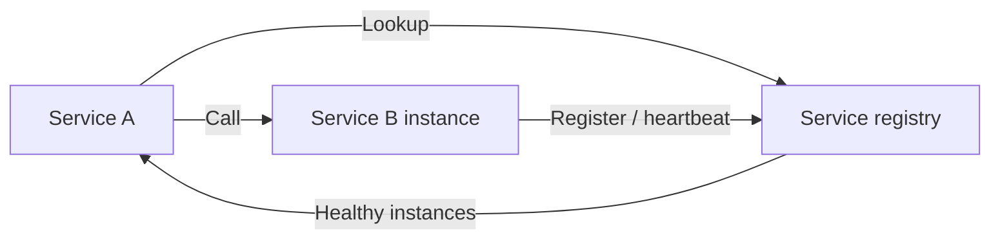
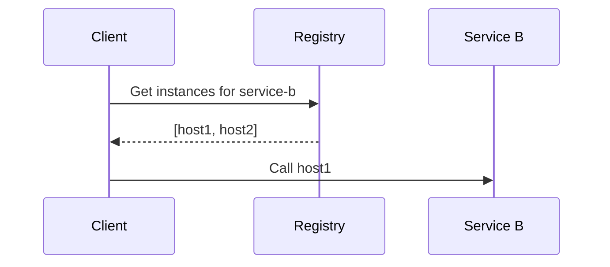
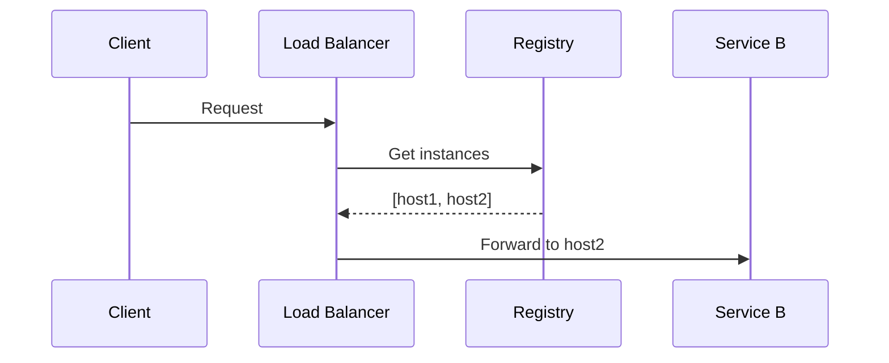
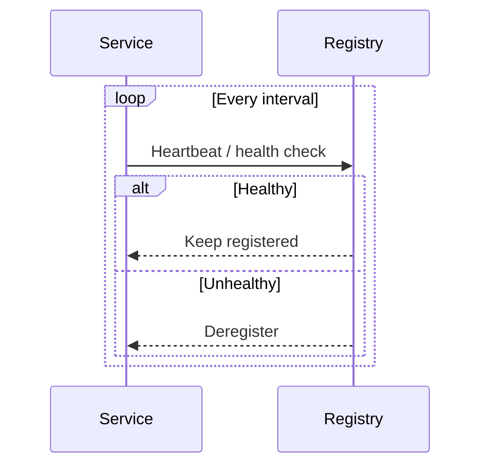
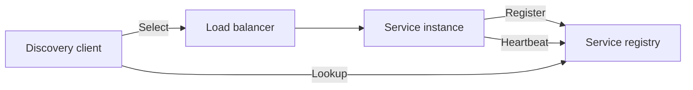

# Service Discovery

## Blogs and websites


## Medium


## Youtube

- [Service Discovery in Microservices | Eureka & its SpringBoot Implementation](https://www.youtube.com/watch?v=h1mrflwF6Lc)

## Theory

### Topics Covered

1. [Introduction](#introduction)
2. [Client-Side vs Server-Side Discovery](#client-side-vs-server-side-discovery)
3. [Health Checking](#health-checking)
4. [Service Registry Tools](#service-registry-tools)
5. [Characteristics](#characteristics)
6. [Pros](#pros)
7. [Cons](#cons)
8. [Use Cases](#use-cases)
9. [Components](#components)
10. [Patterns](#patterns)
11. [Benefits](#benefits)
12. [Challenges](#challenges)
13. [Best Practices](#best-practices)
14. [When to Use](#when-to-use)
15. [Java and Spring Boot Examples](#java-and-spring-boot-examples)

---

### Introduction

Service discovery is the mechanism by which services find and communicate with each other in a dynamic environment. Because instances can scale, fail, and move, callers cannot rely on hardcoded addresses; they query a registry for healthy endpoints.



**Real-life use cases**

- **Microservices**: discover downstream services at runtime.
- **Kubernetes**: DNS and endpoints resolve pods.
- **Cloud load balancing**: register instances with a balancer.
- **Service meshes**: sidecars use discovery for routing.
- **Distributed systems**: find databases, caches, and brokers.

**Interview questions and answers**

- **Q: What is service discovery?**
  **A:** The process of locating healthy service instances so callers can communicate without hardcoded addresses.

- **Q: Why is service discovery needed in microservices?**
  **A:** Instances are dynamic — they scale, restart, and fail — so addresses change frequently.

- **Q: What is a service registry?**
  **A:** A database of available service instances and their network locations.

---

### Client-Side vs Server-Side Discovery

**Patterns:**

- **Client-side**: the client queries the registry (Eureka, Consul) and selects an instance.
- **Server-side**: a load balancer queries the registry and routes requests (Kubernetes).

**Client-side discovery:**



**Server-side discovery:**



**Comparison:**

| Aspect | Client-side | Server-side |
|--------|-------------|-------------|
| **Who queries registry** | Client | Load balancer |
| **Client complexity** | Higher | Lower |
| **Coupling** | Client needs registry library | Client only needs LB address |
| **Examples** | Eureka + Ribbon | Kubernetes Service, ALB |

**Interview questions and answers**

- **Q: What is the advantage of client-side discovery?**
  **A:** The client can make smarter, latency-aware load-balancing decisions without an extra hop.

- **Q: What is the advantage of server-side discovery?**
  **A:** Clients stay simple and the load balancer centralizes routing logic.

- **Q: How does Kubernetes implement server-side discovery?**
  **A:** Services expose a stable DNS name and the kube-proxy/load balancer routes to healthy pods.

---

### Health Checking

Health checks ensure the registry only contains usable instances.

**Health check types:**

- **Liveness**: is the process running?
- **Readiness**: can it handle requests?
- **Startup**: has initialization completed?

**Mechanisms:**

- Heartbeat from the service.
- Polling an HTTP `/health` endpoint.
- TCP connection checks.
- gRPC health protocol.



**Interview questions and answers**

- **Q: Why distinguish liveness from readiness?**
  **A:** A live process may not be ready to serve traffic, such as during startup or dependency failure.

- **Q: What happens if a service stops sending heartbeats?**
  **A:** The registry marks it unhealthy and removes it after a grace period.

- **Q: Why are passive and active checks often combined?**
  **A:** Active checks catch failures quickly; passive checks catch failures during real traffic.

---

### Service Registry Tools

**Tools:**

- Consul.
- Eureka (Netflix).
- Zookeeper.
- etcd.
- Kubernetes DNS.

| Tool | Model | Consistency | Typical use |
|------|-------|-------------|-------------|
| **Eureka** | AP, self-registration | Eventually consistent | Spring Cloud |
| **Consul** | CP with health checks | Strong for KV | Multi-cloud |
| **Zookeeper** | CP | Strong | Coordination |
| **etcd** | CP, Raft | Strong | Kubernetes |
| **Kubernetes DNS** | DNS + endpoints | Eventually consistent | Containerized apps |

**Interview questions and answers**

- **Q: Why is Eureka considered AP?**
  **A:** It favors availability and tolerates stale registry entries during partitions.

- **Q: Why is etcd a good registry for Kubernetes?**
  **A:** It is strongly consistent, reliable, and stores both service definitions and cluster state.

- **Q: When would you choose Consul?**
  **A:** When you need multi-datacenter service discovery with integrated health checks and a KV store.

---

### Characteristics

- **Dynamic**
  Instances register and deregister as they change.

- **Registry-backed**
  A central or distributed store tracks endpoints.

- **Health-aware**
  Unhealthy instances are removed.

- **Decoupled**
  Callers discover addresses instead of configuring them.

- **Eventually consistent**
  Registry updates propagate asynchronously.

- **Load-balancing**
  Discovery often pairs with instance selection.

- **Self-registering**
  Services announce themselves.

- **Protocol-varied**
  DNS, HTTP, and gRPC are common mechanisms.

- **Cloud-native**
  Orchestrators provide built-in discovery.

---

### Pros

- **Dynamic scaling**
  Services find new instances automatically.

- **Resilience**
  Unhealthy instances are removed from rotation.

- **Decoupling**
  Callers depend on logical names, not IPs.

- **Operational simplicity**
  No manual address updates.

- **Load balancing**
  Requests spread across instances.

- **Failover**
  Traffic shifts when instances fail.

- **Multi-environment support**
  Same mechanism across clouds and data centers.

- **Automation**
  Deployments register and deregister automatically.

---

### Cons

- **Registry SPOF**
  The registry can become a critical dependency.

- **Eventual consistency**
  Stale entries can route to dead instances.

- **Added complexity**
  Health checks, registration, and client libraries.

- **Latency**
  Lookups add a step.

- **Cache staleness**
  Clients may hold outdated instance lists.

- **Security surface**
  Registry access must be protected.

- **Network dependency**
  Discovery fails if the registry is unreachable.

- **Tool lock-in**
  Moving registries can be costly.

---

### Use Cases

- **Microservices**
  Find downstream services.

- **Kubernetes workloads**
  Resolve pods via Service DNS.

- **Cloud autoscaling**
  Track instances that come and go.

- **Service mesh**
  Sidecars route using discovery data.

- **Multi-region deployments**
  Find healthy regional endpoints.

- **Database and cache discovery**
  Locate replicas and clusters.

- **API gateways**
  Route to backend instances.

- **Blue-green and canary deployments**
  Select instances by version.

---

### Components

- **Service registry**
  Stores instance locations.

- **Service instance**
  A running copy of a service.

- **Registration client**
  Announces an instance to the registry.

- **Discovery client**
  Queries the registry for instances.

- **Health check**
  Determines instance health.

- **Load balancer**
  Selects an instance for a request.

- **Lease / TTL**
  Expires stale registrations.

- **Registry API**
  Enables register, deregister, and lookup.



---

### Patterns

- **Self-registration**
  Services register themselves on startup.

- **Third-party registration**
  A registrar registers services on their behalf.

- **Client-side discovery**
  Clients query the registry and select instances.

- **Server-side discovery**
  A load balancer queries and routes.

- **Heartbeat**
  Services periodically signal health.

- **Lease-based expiration**
  Registrations expire without renewal.

- **Service mesh discovery**
  Sidecars handle discovery and routing.

- **DNS-based discovery**
  Resolve service names to endpoints.

---

### Benefits

- **Elasticity**
  Discovery supports autoscaling.

- **Availability**
  Failures are detected and routed around.

- **Automation**
  No manual endpoint management.

- **Portability**
  Services move without client changes.

- **Observability**
  Registry reflects the live topology.

- **Load distribution**
  Requests spread across healthy instances.

- **Faster deployments**
  New instances are immediately discoverable.

- **Standardization**
  A consistent mechanism across services.

---

### Challenges

- **Registry reliability**
  Discovery breaks if the registry fails.

- **Stale data**
  Removed instances may linger briefly.

- **Health check accuracy**
  False positives and negatives disrupt routing.

- **Client cache staleness**
  Clients may use outdated instance lists.

- **Security**
  Registry and lookups need protection.

- **Cross-datacenter discovery**
  Global discovery adds latency and complexity.

- **Version skew**
  Old and new service versions need careful routing.

- **Operational tuning**
  TTLs and health intervals require tuning.

---

### Best Practices

- **Use health checks**
  Register only ready, healthy instances.

- **Set reasonable TTLs**
  Balance freshness against churn.

- **Cache lookups client-side**
  Reduce registry load and latency.

- **Degrade gracefully**
  Retry or use fallback when discovery fails.

- **Secure the registry**
  Authenticate and authorize access.

- **Monitor the registry**
  Track membership and health status.

- **Prefer logical names**
  Avoid exposing raw IPs in configuration.

- **Use retries and backoff**
  Handle transient lookup failures.

- **Distribute the registry**
  Avoid a single point of failure.

- **Test failover**
  Simulate instance and registry outages.

---

### When to Use

- **Use service discovery when** instances scale and move dynamically.
- **Use service discovery when** building microservices.
- **Use service discovery when** running in Kubernetes or cloud autoscaling.
- **Use service discovery when** a service mesh manages routing.
- **Use service discovery when** blue-green or canary deployments are needed.

**Skip service discovery when**

- There is only one fixed service instance.
- Addresses are stable and rarely change.
- A simple load balancer with static targets suffices.
- The added operational complexity is not justified.

---

### Java and Spring Boot Examples

#### 1. Eureka client discovery

```java
import org.springframework.cloud.client.ServiceInstance;
import org.springframework.cloud.client.discovery.DiscoveryClient;
import org.springframework.stereotype.Service;

import java.util.List;

@Service
public class EurekaDiscoveryService {

    private final DiscoveryClient discoveryClient;

    public EurekaDiscoveryService(DiscoveryClient discoveryClient) {
        this.discoveryClient = discoveryClient;
    }

    public List<ServiceInstance> instances(String serviceName) {
        return discoveryClient.getInstances(serviceName);
    }
}
```

#### 2. Manual registration to a registry

```java
import org.springframework.stereotype.Service;

import java.util.Map;
import java.util.concurrent.ConcurrentHashMap;

@Service
public class SimpleRegistry {

    private final Map<String, Map<String, Instance>> services = new ConcurrentHashMap<>();

    public void register(String service, String instanceId, String host, int port) {
        services.computeIfAbsent(service, s -> new ConcurrentHashMap<>())
                .put(instanceId, new Instance(instanceId, host, port));
    }

    public void deregister(String service, String instanceId) {
        services.getOrDefault(service, Map.of()).remove(instanceId);
    }

    public record Instance(String id, String host, int port) {}
}
```

#### 3. Health check endpoint

```java
import org.springframework.boot.actuate.health.Health;
import org.springframework.boot.actuate.health.HealthIndicator;
import org.springframework.stereotype.Component;

@Component
public class ServiceHealthIndicator implements HealthIndicator {

    @Override
    public Health health() {
        return Health.up().withDetail("status", "ready").build();
    }
}
```

#### 4. Discovery-aware REST client

```java
import org.springframework.cloud.client.ServiceInstance;
import org.springframework.cloud.client.loadbalancer.LoadBalancerClient;
import org.springframework.stereotype.Service;
import org.springframework.web.client.RestClient;

import java.net.URI;

@Service
public class DiscoveryAwareClient {

    private final LoadBalancerClient loadBalancerClient;
    private final RestClient restClient = RestClient.create();

    public DiscoveryAwareClient(LoadBalancerClient loadBalancerClient) {
        this.loadBalancerClient = loadBalancerClient;
    }

    public String call(String serviceName, String path) {
        ServiceInstance instance = loadBalancerClient.choose(serviceName);
        URI uri = instance.getUri().resolve(path);
        return restClient.get().uri(uri).retrieve().body(String.class);
    }
}
```

**Interview questions and answers**

- **Q: What is the difference between client-side and server-side discovery?**
  **A:** In client-side discovery the client queries the registry; in server-side discovery a load balancer queries it and routes for the client.

- **Q: Why do service registrations expire?**
  **A:** To remove instances that stop sending heartbeats or fail without clean deregistration.

- **Q: What happens if a client uses a stale instance list?**
  **A:** It may route to a dead instance, so clients should retry, use fallbacks, and refresh regularly.

- **Q: How does Kubernetes provide service discovery?**
  **A:** Services expose stable DNS names and route traffic to healthy pods through kube-proxy or a load balancer.
