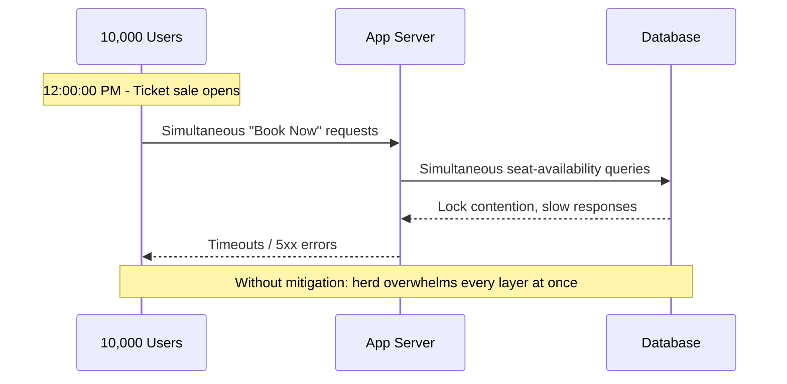
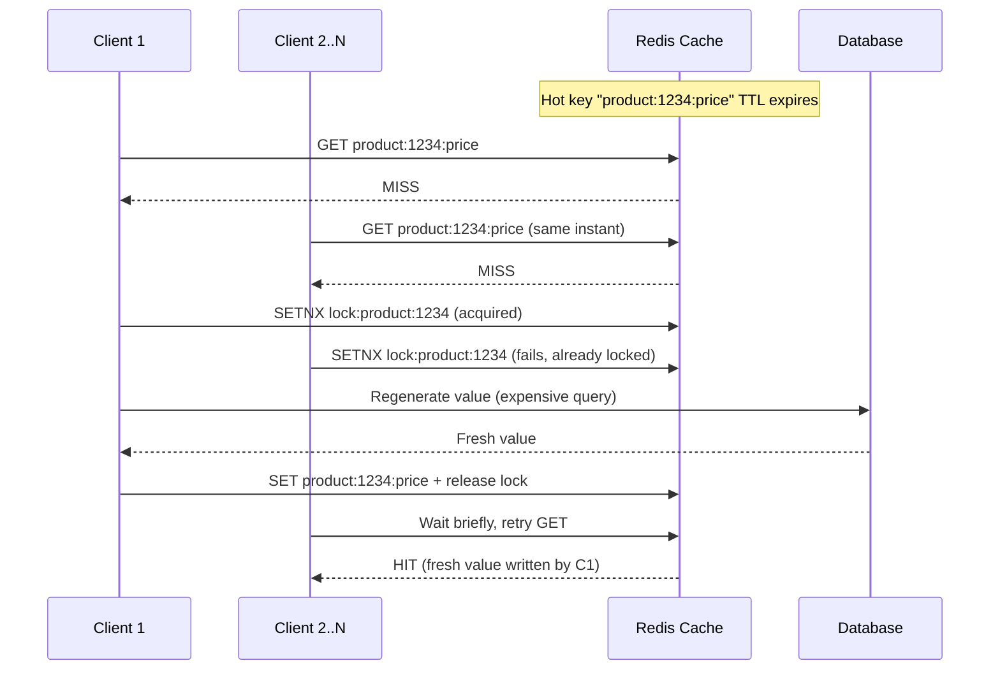
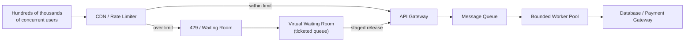
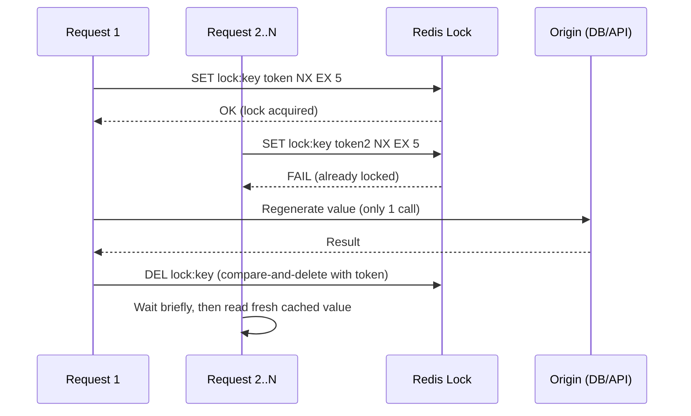

# Thundering Herd Effect 


## Blogs and websites


## Medium


## Youtube

- [27. Thundering Herd Effect on Ticket Booking App | System Design](https://www.youtube.com/watch?v=1aamH7sA8FY)
- [Thundering Herd Problem Explained! - System Design](https://www.youtube.com/watch?v=EIAbTpz-vnw)

## Theory

### Topics Covered

This page is organized into the following topics. Each topic includes a detailed explanation, its characteristics, components, patterns, pros/benefits, cons/challenges, best practices, when to use it, a diagram, a real-life use case, a Java code example, and interview questions with answers.

1. [Understanding the Thundering Herd Effect](#understanding-the-thundering-herd-effect)
2. [Cache Stampede: TTL-Based Cache Eviction](#cache-stampede-ttl-based-cache-eviction)
3. [Retry Storms: Exponential Backoff and Jitter](#retry-storms-exponential-backoff-and-jitter)
4. [Handling Massive Traffic Spikes: Queueing, Virtual Waiting Rooms and Rate Limiting](#handling-massive-traffic-spikes-queueing-virtual-waiting-rooms-and-rate-limiting)
5. [Distributed Locks and Request Coalescing (Single-Flight Pattern)](#distributed-locks-and-request-coalescing-single-flight-pattern)
6. [Thundering Herd Effect: Characteristics, Pros, Cons, Use Cases, Components, Patterns, Benefits, Challenges, Best Practices and When to Use](#thundering-herd-effect-characteristics-pros-cons-use-cases-components-patterns-benefits-challenges-best-practices-and-when-to-use)

### Understanding the Thundering Herd Effect

#### Description

The **Thundering Herd Effect** is a problem that occurs when a large number of processes or threads waiting for an event are awakened simultaneously when that event occurs, but only one or a few can proceed. The name comes from the image of a herd of animals all stampeding toward the same narrow gate at once: the gate (a server, a database row, a lock, a cache key) can only let a handful through at a time, so most of the herd collides, waits, and wastes energy. In the context of ticket booking systems like BookMyShow, this happens when:

1. **High-demand events**: When tickets for a popular movie/concert go on sale, thousands of users try to book simultaneously
2. **Cache expiration**: When cached data expires, multiple requests simultaneously try to regenerate it
3. **Resource locking**: Multiple requests compete for the same limited resources (seats, payment processing)

**Problems caused by Thundering Herd:**
- **Server overload**: Sudden spike in requests can crash the server
- **Database strain**: Concurrent writes/reads overwhelm the database
- **Poor user experience**: Legitimate users face timeouts and errors
- **Resource waste**: System spends resources processing requests that will ultimately fail
- **Cascade failures**: Overload in one component can trigger failures in others

#### Characteristics

- **Sudden, correlated demand spike**: The defining trait is not just high traffic but highly correlated traffic - thousands of clients acting on the same trigger (a clock tick, a cache expiry, a notification) within the same few milliseconds, instead of arriving with natural random jitter.
- **Single bottleneck resource**: There is always one narrow resource at the center - a database row, a lock, a cache key, a payment gateway - that can only serve a small number of requests at a time while everyone else queues or fails.
- **Self-amplifying**: Once the bottleneck slows down, client-side timeouts and naive retries add even more load on top of the original spike, so the herd effect tends to get worse before it gets better unless something absorbs the shock.
- **Deterministic trigger, non-deterministic outcome**: The trigger (sale opening at 12:00 PM, a TTL expiring, a service restarting) is predictable and often known in advance, but which specific requests succeed and which fail becomes effectively random once the herd hits the bottleneck.

#### Components

- **Trigger event**: The synchronizing signal that wakes up or activates all the waiting clients at once - a scheduled sale time, a cache TTL expiry, a DNS change, a service coming back online after an outage.
- **Client population**: The (often very large) set of independent processes, browser tabs, mobile apps, or backend services that all react to the trigger.
- **Contended resource**: The database connection pool, in-memory lock, cache key, or downstream API that has far less capacity than the instantaneous demand.
- **Admission/control layer**: Whatever sits between the client population and the contended resource - a load balancer, API gateway, queue, or waiting room - that determines whether the herd effect is absorbed gracefully or passed straight through.

#### Patterns

- **Backoff and jitter** (see [Retry Storms](#retry-storms-exponential-backoff-and-jitter)): Spread retries over time instead of retrying in lockstep.
- **Cache locking / request coalescing** (see [Cache Stampede](#cache-stampede-ttl-based-cache-eviction) and [Distributed Locks](#distributed-locks-and-request-coalescing-single-flight-pattern)): Let only one request regenerate expensive data while others wait for or reuse that result.
- **Queueing and admission control** (see [Handling Massive Traffic Spikes](#handling-massive-traffic-spikes-queueing-virtual-waiting-rooms-and-rate-limiting)): Buffer the herd behind a queue or virtual waiting room and release requests at a rate the backend can absorb.
- **Rate limiting and circuit breaking**: Reject or shed excess load early and cheaply, rather than letting every request walk all the way to the database before failing.

#### Pros / Benefits (of recognizing and designing for it)

- **Prevents full outages during predictable spikes**: Systems designed with thundering herd in mind survive foreseeable events (ticket sales, product drops, sports finals) that would otherwise crash an unprepared system.
- **Protects shared downstream dependencies**: Databases, payment gateways, and third-party APIs are shielded from correlated overload, which protects other services that share the same dependency.
- **Improves perceived fairness**: Techniques like queueing and virtual waiting rooms give every user a predictable, visible position, instead of an opaque race where only the luckiest few succeed.
- **Reduces wasted compute**: Requests that are going to fail anyway (because the seat/ticket is already gone) can be rejected cheaply and early instead of burning CPU, locks, and database I/O.

#### Cons / Challenges

- **Adds latency and complexity for the common case**: Backoff, jitter, queues, and locks all add code paths and, often, a small amount of latency even during normal (non-spike) traffic.
- **Hard to load-test realistically**: Reproducing a genuine thundering herd (tens of thousands of perfectly correlated clients) in a staging environment is difficult, so many mitigations are only proven correct in production, under real load.
- **Requires cross-team coordination**: The fix is rarely in one place - client retry logic, CDN/cache configuration, API gateway rate limits, and backend locking all need to cooperate, which is organizationally harder than a single-service change.
- **Risk of over-throttling**: An overly aggressive rate limiter or circuit breaker can reject legitimate users even when the backend still has spare capacity, trading one failure mode for another.

#### Best Practices

- Identify predictable herd triggers in advance (scheduled sales, cache TTL boundaries, scheduled jobs) and load-test specifically against them rather than relying on average traffic patterns.
- Push mitigation as close to the client as possible: it is cheaper to delay a request on the client or at the edge (CDN/API gateway) than after it has already consumed a database connection.
- Never let all clients use the same fixed retry delay; always add jitter (see [Retry Storms](#retry-storms-exponential-backoff-and-jitter)).
- Use request coalescing or short-lived locks for expensive, shared, regenerate-on-miss data instead of letting every client recompute it independently.
- Monitor for herd symptoms explicitly (sudden spike in duplicate queries for the same key, spike in lock-wait time, spike in 5xx/timeouts at a specific second) so the problem is visible before it becomes an outage.

#### When to Use (When to Actively Design Against It)

- Any system with a scheduled or promotional "go live" moment: ticket sales, flash sales, exam result announcements, product launches.
- Any system that serves cached data with a TTL where regeneration is expensive (a database aggregation query, a call to a third-party API, a machine-learning inference).
- Any system that depends on external services with strict rate limits (payment gateways, SMS/OTP providers, third-party APIs) where a herd of retries could get the whole application throttled or banned.
- Any system that must recover gracefully after an outage, where all clients reconnecting at once could turn a brief outage into a prolonged one.

#### Diagram

```
Without Mitigation:
==================

Time: 12:00:00 PM (Ticket Sales Open)
                                    
  User₁ ──┐                         
  User₂ ──┤                         
  User₃ ──┤                         
  User₄ ──┤                         
  User₅ ──┼──► Server ──► Database
  User₆ ──┤       ↓           ↓
  User₇ ──┤    OVERLOAD    DEADLOCK
  User₈ ──┤       ↓           ↓
  User₉ ──┤    CRASH      TIMEOUTS
  User₁₀ ─┘                         

Result: 💥 System Failure


With Exponential Backoff + Jitter:
==================================

Time: 12:00:00 - 12:00:05 PM

  User₁ ──────────────────────►│
  User₂ ────────►               │
  User₃ ──────────────►         │  Requests spread
  User₄ ────►                   │  over time window
  User₅ ──────────────────────► │  (0-5 seconds)
  User₆ ──────────►             │
  User₇ ────────────────►       │  Server handles
  User₈ ──────►                 │  manageable load
  User₉ ────────────►           │
  User₁₀ ──────────────────►    │

Result: ✅ Controlled Load Distribution
```



#### Real-Life Use Case: Design BookMyShow Ticket Booking

BookMyShow style ticket-booking platforms are the textbook example of the thundering herd effect, because the trigger time is public and known in advance:

- A blockbuster movie or a cricket World Cup final ticket window is announced to open at exactly 10:00:00 AM.
- Hundreds of thousands of users open the app and tap "Book Now" within the same one-second window, all targeting the same limited pool of seats/tickets for a small number of shows.
- Without protection, the seat-availability API and the seat-locking logic in the database receive a near-simultaneous burst of reads and writes for the same rows, causing lock contention, connection-pool exhaustion, and cascading timeouts.
- The practical fix that BookMyShow-style systems use is a combination of: a **virtual waiting room** that admits users in controlled batches (see [Handling Massive Traffic Spikes](#handling-massive-traffic-spikes-queueing-virtual-waiting-rooms-and-rate-limiting)), **short-lived per-seat locks** so only one request can hold a given seat at a time (see [Distributed Locks](#distributed-locks-and-request-coalescing-single-flight-pattern)), and **client-side jittered retries** so a failed attempt does not immediately synchronize into another wave (see [Retry Storms](#retry-storms-exponential-backoff-and-jitter)).

#### Java Code: Simulating Thundering Herd With and Without Mitigation

This example uses a fixed-size thread pool to represent a limited backend and a semaphore-guarded resource to represent a single database row/lock, showing the difference between an unmitigated herd and one that is spread out with jitter.

```java
import java.util.concurrent.*;
import java.util.concurrent.atomic.AtomicInteger;

public class ThunderingHerdDemo {

    // Represents a scarce backend resource (e.g., one seat row in the database).
    static final Semaphore seatLock = new Semaphore(1);
    static final AtomicInteger failures = new AtomicInteger(0);
    static final AtomicInteger successes = new AtomicInteger(0);

    static void bookSeat(int userId, long preDelayMillis) throws InterruptedException {
        if (preDelayMillis > 0) {
            Thread.sleep(preDelayMillis);
        }
        // Only one user can hold the lock at a time; others fail fast instead of blocking forever.
        if (seatLock.tryAcquire(50, TimeUnit.MILLISECONDS)) {
            try {
                successes.incrementAndGet();
            } finally {
                seatLock.release();
            }
        } else {
            failures.incrementAndGet();
        }
    }

    public static void main(String[] args) throws InterruptedException {
        int userCount = 500;
        ExecutorService pool = Executors.newFixedThreadPool(50);

        // Without mitigation: every user fires at time zero.
        for (int i = 0; i < userCount; i++) {
            final int userId = i;
            pool.submit(() -> {
                try {
                    bookSeat(userId, 0);
                } catch (InterruptedException ignored) {
                }
            });
        }
        pool.shutdown();
        pool.awaitTermination(5, TimeUnit.SECONDS);
        System.out.println("Without jitter -> successes=" + successes + ", failures=" + failures);

        // With mitigation: spread requests over a 2-second jitter window.
        successes.set(0);
        failures.set(0);
        ExecutorService pool2 = Executors.newFixedThreadPool(50);
        java.util.Random random = new java.util.Random();
        for (int i = 0; i < userCount; i++) {
            final int userId = i;
            long jitterMillis = (long) (random.nextDouble() * 2000);
            pool2.submit(() -> {
                try {
                    bookSeat(userId, jitterMillis);
                } catch (InterruptedException ignored) {
                }
            });
        }
        pool2.shutdown();
        pool2.awaitTermination(5, TimeUnit.SECONDS);
        System.out.println("With jitter -> successes=" + successes + ", failures=" + failures);
    }
}
```

#### Interview Questions and Answers

**Q1. What is the thundering herd effect, and why is a high request rate alone not the same problem?**
A: Thundering herd is specifically about correlated, near-simultaneous demand on a single narrow resource, triggered by a shared event (a timer, a cache expiry, a wake-up signal). A steady high request rate that is spread evenly over time can often be handled by normal auto-scaling; the herd effect is about the *synchronization* of demand, not just its volume.

**Q2. Why does simply adding more servers not fix a thundering herd problem?**
A: The bottleneck in most herd scenarios is a single logical resource (a specific database row, a specific cache key, a specific lock, a third-party API's rate limit) that does not get faster by adding more application servers. More servers can even make it worse by sending more concurrent requests at the shared bottleneck.

**Q3. In a ticket-booking system, what causes most of the timeouts during a sale launch, if the seats are technically still available?**
A: Lock contention and queuing delay, not lack of seats. Every request needs to acquire a lock (or transaction) on the same small set of database rows to check and reserve a seat; when thousands of requests queue for the same lock, most of them exceed their timeout budget waiting, even though the seat itself is never oversold.

**Q4. What is the single most effective first line of defense against a thundering herd, and why?**
A: Admission control at the edge (a queue, a virtual waiting room, or a rate limiter at the API gateway/CDN), because it is far cheaper to delay or reject a request before it consumes a database connection, a lock, or application-server memory than to let it walk all the way to the bottleneck and fail there.

**Q5. How would you test that your thundering herd mitigations actually work before a real launch?**
A: Run a load test that deliberately synchronizes virtual users to fire at the same instant (rather than a ramped load test), matching the real trigger (e.g., all simulated users hit "Book Now" at t=0), and verify success rate, p99 latency, and backend resource usage (connection pool, lock wait time) stay within budget under that synchronized burst.

### Cache Stampede: TTL-Based Cache Eviction

#### Description

A **cache stampede** (also called the **dogpile effect**) is a specialized, very common form of the thundering herd effect that happens when a single, popular cache key expires. The instant that key's TTL (time-to-live) runs out, every concurrent request for that key misses the cache at the same moment and falls through to the origin (a database query, an aggregation job, a third-party API call) to regenerate the value. Instead of one request paying the regeneration cost, hundreds or thousands do, multiplying the load on the origin by the request concurrency rather than by real demand.

#### Characteristics

- **Concentrated on a small number of hot keys**: A stampede rarely affects the whole cache at once; it is almost always one or a handful of extremely popular keys (a trending product, a celebrity's profile, a live score) that carry a disproportionate share of traffic.
- **Self-inflicted synchronization**: Because many cache entries are written with the same fixed TTL at roughly the same time (e.g., all populated during a cache warm-up), they also tend to expire at roughly the same time, creating a wave the system caused itself.
- **Regeneration is far more expensive than a hit**: The ratio between a cache hit (sub-millisecond) and a cache miss (a slow join, an aggregation, an external API call) can be 100x-1000x, so even a small number of simultaneous misses can dwarf normal load.
- **Invisible in aggregate metrics**: Overall cache hit ratio can look healthy (e.g., 99.9%) while a single hot key stampedes hundreds of times a day, so the problem is often missed until the origin database has an unexplained latency spike.

#### Components

- **Cache store** (Redis, Memcached, or an in-process cache) holding the TTL-based entries.
- **Origin/source of truth** (database, search index, ML model, third-party API) that must be called to regenerate a value on a miss.
- **Coordination mechanism** (a short-lived distributed lock, a mutex, or a "recompute in progress" flag) that decides which single request is allowed to regenerate the value.
- **Client-side cache wrapper** that implements the stampede protection logic (lock-and-wait, stale-while-revalidate, or probabilistic early expiration) so application code does not need to reimplement it per call site.

#### Patterns

- **Lock-based regeneration (mutex/dogpile lock)**: On a miss, one request acquires a short-lived lock and regenerates the value; every other request either waits briefly for the lock holder to finish or serves the previous (possibly slightly stale) value.
- **Stale-while-revalidate**: Serve the expired value immediately to all callers while exactly one background refresh updates the cache, so nobody waits on the slow path at all.
- **Probabilistic early expiration (XFetch)**: Each reader recomputes a probability of refreshing early based on how close the entry is to its TTL; this spreads regeneration across many small windows before the deadline instead of all at the exact expiry instant.
- **Jittered TTLs**: Add a small random offset to every TTL (`ttl = base_ttl + random(0, jitter)`) so that keys written around the same time do not all expire at exactly the same second.

#### Pros / Benefits

- **Keeps origin load proportional to real cache-miss rate**, not to concurrent request volume, so a popular key expiring does not translate into a origin traffic spike.
- **Stabilizes tail latency (p99/p999)** across the TTL boundary, since callers are not all blocked waiting on the same slow regeneration.
- **Reduces redundant work**: only one computation of an expensive value happens per expiry instead of N identical computations running in parallel.
- **Transparent to calling code** when implemented inside a shared cache client or middleware, so individual features do not need custom handling.

#### Cons / Challenges

- **Added implementation complexity**: lock acquisition, timeout handling, and fallback-to-stale logic must all be correct, including the failure case where the lock holder crashes mid-regeneration.
- **Risk of serving stale data**: stale-while-revalidate and probabilistic early expiration intentionally trade a small amount of staleness for protection against a stampede; this is unacceptable for data that must always be strictly current (e.g., an account balance).
- **Requires per-key tuning**: the right TTL, jitter range, and staleness tolerance differ by data type; a single global policy is rarely optimal for every key.
- **Distributed lock pitfalls**: a naive lock without an expiry can deadlock the cache key forever if the holder crashes; the lock itself must be designed defensively (see [Distributed Locks](#distributed-locks-and-request-coalescing-single-flight-pattern)).

#### Best Practices

- Add jitter to every TTL for high-traffic keys instead of a single fixed expiry duration.
- Protect expensive-to-regenerate keys with a short-lived lock or single-flight mechanism so only one process recomputes the value per expiry.
- Prefer stale-while-revalidate for data where a few seconds of staleness is harmless (recommendations, trending lists, view counts).
- Pre-warm caches ahead of a known, scheduled spike (e.g., populate the cache a few minutes before a live match starts) rather than relying purely on reactive regeneration at the exact trigger moment.
- Track hit ratio and regeneration latency per key or key-pattern, not just as a global average, so a stampede on one hot key is visible before it degrades the whole system.

#### When to Use

- Any read-heavy endpoint backed by an expensive, cacheable computation: aggregation queries, personalized recommendations, leaderboards, or live sports scores.
- Systems with a small number of extremely hot keys where a miss is disproportionately expensive compared to the rest of the traffic.
- Any cache whose backing origin cannot handle a burst of simultaneous requests equal to the key's peak concurrent readers.

#### Diagram



#### Real-Life Use Case: A Popular Cache Eviction for TTL

Consider an e-commerce "flash sale" page that caches each product's live price and stock count in Redis with a 30-second TTL, refreshed from a database aggregation query that joins inventory, promotions, and pricing rules. During a flash sale, one specific product page receives 5,000 requests per second.

- Every 30 seconds, the cached price/stock entry for that product expires at the same instant for every reader.
- Without protection, all 5,000 requests in that second miss the cache simultaneously and each opens a database connection to recompute the same aggregation query, spiking database CPU and connection-pool usage to the point where unrelated pages also start timing out.
- With a lock-based fix, exactly one of those 5,000 requests acquires a short-lived Redis lock (`SETNX lock:product:1234 EX 2`), recomputes the value, and writes it back to the cache; the other 4,999 requests either wait a few milliseconds and re-read the now-fresh cache entry, or briefly receive the last known (slightly stale) price while the refresh completes.
- The same pattern applies directly to a celebrity's profile page cache, a trending hashtag's post count, or any other single hot key that a large fraction of traffic depends on.

#### Java Code: Cache Stampede Protection (Lock + Stale-While-Revalidate)

This example wraps a simple cache with per-key locking so only one thread regenerates an expired value, while other threads either wait briefly or fall back to serving the last known value.

```java
import java.util.concurrent.*;
import java.util.function.Supplier;

public class StampedeProtectedCache<K, V> {

    private static class Entry<V> {
        volatile V value;
        volatile long expiresAtMillis;
    }

    private final ConcurrentHashMap<K, Entry<V>> store = new ConcurrentHashMap<>();
    private final ConcurrentHashMap<K, ReentrantLockHolder> locks = new ConcurrentHashMap<>();
    private final long ttlMillis;

    public StampedeProtectedCache(long ttlMillis) {
        this.ttlMillis = ttlMillis;
    }

    private static class ReentrantLockHolder {
        final java.util.concurrent.locks.ReentrantLock lock = new java.util.concurrent.locks.ReentrantLock();
    }

    // Returns a fresh value, regenerating it via `loader` only once per expiry across all callers.
    public V get(K key, Supplier<V> loader) {
        Entry<V> entry = store.get(key);
        long now = System.currentTimeMillis();

        if (entry != null && entry.expiresAtMillis > now) {
            return entry.value; // fresh hit
        }

        ReentrantLockHolder holder = locks.computeIfAbsent(key, k -> new ReentrantLockHolder());
        boolean acquired = holder.lock.tryLock();
        try {
            if (acquired) {
                // Re-check: another thread may have refreshed while we waited for the lock.
                Entry<V> latest = store.get(key);
                if (latest != null && latest.expiresAtMillis > System.currentTimeMillis()) {
                    return latest.value;
                }
                V freshValue = loader.get(); // expensive regeneration, runs exactly once
                Entry<V> newEntry = new Entry<>();
                newEntry.value = freshValue;
                newEntry.expiresAtMillis = System.currentTimeMillis() + ttlMillis;
                store.put(key, newEntry);
                return freshValue;
            } else {
                // Stale-while-revalidate: serve the last known value instead of blocking on the DB.
                return entry != null ? entry.value : loader.get();
            }
        } finally {
            if (acquired) {
                holder.lock.unlock();
            }
        }
    }
}
```

#### Interview Questions and Answers

**Q1. What is a cache stampede, and how is it different from a general thundering herd?**
A: A cache stampede is a thundering herd specifically triggered by a cache key's TTL expiring: many concurrent readers miss the same key at once and all try to regenerate it from the origin simultaneously. It is a special case of thundering herd where the "trigger event" is a cache expiry rather than, say, a scheduled sale or a service restart.

**Q2. Why can a stampede happen even when the overall cache hit ratio looks healthy, like 99.9%?**
A: Aggregate hit ratio hides per-key behavior. A single very hot key can miss for a burst of a few seconds every time its TTL expires, generating thousands of origin calls in that window, while the other 99.9% of (low-traffic) keys never have this problem. Monitoring must be done per key or key-pattern to catch this.

**Q3. What is the risk of a naive distributed lock used to prevent a stampede?**
A: If the lock is acquired without a TTL/expiry and the process holding it crashes before releasing it, the key can become permanently locked, meaning nobody can ever regenerate it again. The lock itself must always have a safety expiry so it self-releases even if the holder fails.

**Q4. When would you choose stale-while-revalidate over a blocking lock-and-wait approach?**
A: When brief staleness is acceptable to the business (recommendations, trending lists, non-critical counters) and low latency matters more than perfect freshness. Blocking lock-and-wait is better when correctness requires every caller to see freshly computed data and a few hundred milliseconds of added latency for the waiting callers is acceptable.

**Q5. How would you prevent thousands of cache entries populated at the same startup time from all expiring together later?**
A: Add jitter to the TTL of each entry at write time (e.g., `ttl = base_ttl + random(0, base_ttl * 0.1)`), so entries that were written together spread their expirations across a window instead of all firing in the same second.

### Retry Storms: Exponential Backoff and Jitter

#### Description

A **retry storm** happens when many clients that experience a failure (a timeout, a 5xx error, a dropped connection) all retry at the same time, or on the same fixed schedule, turning a brief blip into a sustained overload. It is the client-side mirror image of a cache stampede: instead of a shared cache key triggering synchronized load, a shared failure (or a shared, naive retry policy) does. **Exponential backoff** and **jitter** are the standard technique for breaking this synchronization.

#### Characteristics

- **Failure-triggered, not schedule-triggered**: unlike a scheduled ticket sale, a retry storm's trigger is an error condition, which means it can appear unexpectedly whenever a downstream dependency has a brief hiccup.
- **Naive retries make things worse, not better**: if every client retries immediately (or after the exact same fixed delay), the retries themselves become a second, often larger, wave of load on an already struggling system.
- **Compounding across layers**: in a microservice chain, each layer's own retry policy multiplies with the layers below it (service A retries service B, which retries service C), so an un-jittered retry policy can amplify load exponentially down the call stack.
- **Self-correcting once desynchronized**: because jitter is randomized per client, a jittered retry population naturally spreads itself into a smooth trickle of requests rather than discrete waves.

#### Components

- **Retry policy**: the max attempts, base delay, and backoff multiplier a client uses after a failure.
- **Jitter source**: a random number generator used to desynchronize the exact retry moment between clients.
- **Failure classifier**: logic that decides which errors are retryable (timeouts, 503s) versus which are not (a definitive "seat already taken" business error, which should never be retried).
- **Retry budget / circuit breaker**: an upper bound on total retries system-wide so that retries stop entirely once a dependency is clearly down, instead of continuing to add load to a dead service.

#### Patterns

- **Exponential backoff**: each successive retry waits longer than the last, following `wait = base_delay * 2^attempt`, so retry pressure decays over time instead of staying constant.
- **Full jitter**: pick the actual wait time uniformly at random between 0 and the exponential value, which studies (including AWS's well-known backoff article) show produces the least total client-side work and backend load compared to no-jitter or partial-jitter strategies.
- **Decorrelated jitter**: base the next wait on the previous wait (`wait = random(base_delay, previous_wait * 3)`), which keeps a loose upward trend while still desynchronizing clients.
- **Retry budgets**: cap the fraction of requests that are allowed to be retries (e.g., no more than 10% of total outbound requests may be retries) so retries cannot themselves overwhelm the system.

#### Pros / Benefits

- **Prevents a brief backend hiccup from becoming a full outage** caused by synchronized retries piling onto a system that was already recovering.
- **Improves overall success rate** because requests are naturally spread across the time it takes the backend to recover, rather than all failing together repeatedly.
- **Reduces wasted network and compute resources** spent on doomed, immediately-repeated requests.
- **Composable across service boundaries**: every service in a call chain can apply the same simple policy independently and the system as a whole still avoids synchronized retries.

#### Cons / Challenges

- **Adds latency for the failing request's caller**, since backoff intentionally delays the next attempt; this must be balanced against the caller's own timeout budget.
- **Easy to get wrong without jitter**: pure exponential backoff with no randomization still produces synchronized waves at each retry interval if many clients failed at the same moment.
- **Requires careful max-retry and max-delay caps**, otherwise a client can retry indefinitely against a permanently failed dependency, wasting resources and delaying error reporting to the user.
- **Needs a correct failure classifier**: retrying a non-idempotent operation (e.g., "charge card") without safeguards can cause duplicate side effects; only idempotent or safely-retryable operations should be retried automatically.

#### Best Practices

- Always combine exponential backoff with jitter; never use a fixed or purely exponential delay with no randomization for a system with more than a handful of clients.
- Cap both the maximum number of retries and the maximum delay per retry, so failures surface to the user or caller within a bounded time.
- Only retry idempotent operations, or make operations idempotent (e.g., via an idempotency key) before enabling automatic retries.
- Combine retries with a circuit breaker so that once a dependency is confirmed down, clients stop retrying entirely instead of continuing to add load.
- Track retry rate as its own metric (not just error rate), since a spike in retries is often the earliest signal of a brewing overload.

#### When to Use

- Any client calling a network dependency that can fail transiently: HTTP APIs, database connections, message queue publishes, third-party integrations.
- Mobile and web clients that must handle intermittent connectivity or brief server-side blips gracefully without hammering the backend the moment it recovers.
- Service-to-service calls in a microservice architecture, especially in the outer layers of a call graph where a small backend hiccup could otherwise be amplified by multiple retrying layers above it.

#### Diagram

```
Without Jitter (synchronized waves):        With Full Jitter (smoothed load):
=====================================        =================================
t=0   ████████████████ (initial burst)       t=0   ████████████████ (initial burst)
t=1s  ▁▁▁▁▁▁▁▁▁▁▁▁▁▁▁▁ (all clients quiet)    t=0-1s ▓▓▓▓▓▓▓▓▓▓▓▓▓▓▓▓ (spread retries)
t=2s  ████████████████ (retry wave 1)         t=1-3s ▓▓▓▓▓▓▓▓▓▓▓▓▓▓▓▓ (spread retries)
t=4s  ████████████████ (retry wave 2)         t=3-7s ▓▓▓▓▓▓▓▓▓▓▓▓▓▓▓▓ (spread retries)
Result: repeated spikes hit backend           Result: smooth, absorbable load
```

#### Exponential Backoff

**Concept**: When a request fails or needs to retry, wait for an exponentially increasing amount of time before the next attempt.

**Formula**: `wait_time = base_delay × 2^(attempt_number)`

**Example**:
- 1st retry: wait 1 second (1 × 2⁰)
- 2nd retry: wait 2 seconds (1 × 2¹)
- 3rd retry: wait 4 seconds (1 × 2²)
- 4th retry: wait 8 seconds (1 × 2³)
- 5th retry: wait 16 seconds (1 × 2⁴)

**Pseudocode**:
```python
def exponential_backoff(max_retries, base_delay=1):
    for attempt in range(max_retries):
        try:
            response = book_ticket()
            return response  # Success
        except Exception as e:
            if attempt == max_retries - 1:
                raise  # Max retries exceeded
            
            wait_time = base_delay * (2 ** attempt)
            sleep(wait_time)
```

**Problem with pure exponential backoff**: If multiple clients start retrying at the same time, they'll all retry at the same exponentially increasing intervals, causing synchronized "waves" of requests.

#### Jitter (Randomization)

**Concept**: Add randomness to the retry delay to desynchronize retry attempts from different clients.

**Types of Jitter**:

**a) Full Jitter** (Recommended):
```python
wait_time = random(0, base_delay * 2^attempt)
```

**b) Equal Jitter**:
```python
temp = base_delay * 2^attempt
wait_time = temp/2 + random(0, temp/2)
```

**c) Decorrelated Jitter**:
```python
wait_time = random(base_delay, previous_wait_time * 3)
```

#### Reference Implementation (Python)

```python
import random
import time

def book_ticket_with_backoff(
    seat_id,
    max_retries=5,
    base_delay=0.1,
    max_delay=32
):
    """
    Book ticket with exponential backoff and full jitter
    """
    for attempt in range(max_retries):
        try:
            # Attempt to book the ticket
            result = api.book_seat(seat_id)
            
            if result.success:
                return result
            
            # If booking failed (seat taken, etc.)
            if result.error_code == "SEAT_TAKEN":
                return None  # Don't retry
            
        except (ConnectionError, TimeoutError) as e:
            if attempt == max_retries - 1:
                raise  # Final attempt failed
            
            # Calculate backoff with full jitter
            exponential_delay = min(
                base_delay * (2 ** attempt),
                max_delay
            )
            
            # Full jitter: random between 0 and exponential_delay
            jittered_delay = random.uniform(0, exponential_delay)
            
            print(f"Retry {attempt + 1}/{max_retries} "
                  f"after {jittered_delay:.2f}s")
            
            time.sleep(jittered_delay)
    
    return None  # All retries exhausted
```

#### Real-Life Use Case: BookMyShow Mobile App Retry Behavior

During the first thirty seconds of a blockbuster's ticket sale, BookMyShow's booking API is briefly overloaded and starts returning 503 errors and timeouts to some clients.

- If every mobile app instance is coded to retry immediately (or after a fixed 2-second delay) on failure, all of those failed requests come back as a second wave at almost exactly the same instant, which can be just as damaging as the original spike.
- With exponential backoff and full jitter built into the app's networking layer, each failed client waits a random amount of time (growing with each subsequent failure) before retrying, so the retries arrive as a smooth trickle instead of a second stampede.
- The same principle applies to a live cricket score app like Hotstar: when a live-score polling call fails during a spike in traffic (say, right after a wicket falls), thousands of app instances retrying with backoff and jitter prevent a second self-inflicted spike on top of the real traffic spike.

#### Java Code: Exponential Backoff with Full Jitter

```java
import java.util.concurrent.Callable;
import java.util.concurrent.ThreadLocalRandom;

public class RetryWithBackoffAndJitter {

    public static <T> T callWithBackoff(
            Callable<T> action,
            int maxRetries,
            long baseDelayMillis,
            long maxDelayMillis) throws Exception {

        for (int attempt = 0; attempt < maxRetries; attempt++) {
            try {
                return action.call();
            } catch (RetryableException e) {
                if (attempt == maxRetries - 1) {
                    throw e; // final attempt failed, propagate
                }

                long exponentialDelay = Math.min(
                        baseDelayMillis * (1L << attempt),
                        maxDelayMillis
                );
                // Full jitter: random value between 0 and the exponential delay.
                long jitteredDelay = ThreadLocalRandom.current().nextLong(exponentialDelay + 1);

                System.out.printf("Retry %d/%d after %dms%n", attempt + 1, maxRetries, jitteredDelay);
                Thread.sleep(jitteredDelay);
            }
        }
        throw new IllegalStateException("Unreachable: retries exhausted without throwing");
    }

    // Marker exception for failures that are safe to retry (timeouts, 503s).
    static class RetryableException extends Exception {
        RetryableException(String message) {
            super(message);
        }
    }
}
```

#### Interview Questions and Answers

**Q1. Why is jitter necessary in addition to exponential backoff?**
A: Exponential backoff alone only changes *how long* clients wait, not *whether they wait together*. If a thousand clients fail at the same instant and all use the same deterministic backoff formula, they will all retry at the same moment on every attempt, recreating the herd at each retry interval. Jitter randomizes the exact wait time so retries spread out smoothly instead of arriving in discrete waves.

**Q2. What is "full jitter" and why is it generally preferred over "equal jitter"?**
A: Full jitter picks the wait time uniformly at random between 0 and the full exponential delay (`random(0, base * 2^attempt)`), while equal jitter only randomizes half of the delay (`temp/2 + random(0, temp/2)`). AWS's published backoff research found full jitter produces the lowest total number of retries and the least backend load in practice, because it allows some clients to retry sooner (helping overall latency) while still avoiding synchronized spikes.

**Q3. Should every failed request be retried automatically?**
A: No. Only retry failures that are both transient (timeouts, connection resets, 503/429 responses) and safe to repeat (idempotent operations, or operations protected by an idempotency key). A definitive business failure like "seat already taken" or a non-idempotent payment charge without an idempotency key should not be retried automatically.

**Q4. How do retries interact badly with a circuit breaker if not designed together?**
A: If a downstream dependency is completely down, naive retries keep sending traffic at it indefinitely, delaying detection and possibly preventing it from recovering. Retries should be paired with a circuit breaker: once failures cross a threshold, the breaker opens and requests fail fast without even attempting the network call, until a health check confirms recovery.

**Q5. In a microservice call chain (A calls B calls C), what problem can uncoordinated retries at every layer cause?**
A: Retry amplification. If A retries 3 times, and each of those calls B which retries 3 times, and each of those calls C which retries 3 times, a single failure at C can result in up to 27 actual calls reaching C. This is mitigated by only retrying at the outermost layer, propagating a "do not retry" hint downstream, or using a shared retry budget across the whole chain.

### Handling Massive Traffic Spikes: Queueing, Virtual Waiting Rooms and Rate Limiting

#### Description

When a spike is large enough or predictable enough (a scheduled sale, a live sporting event), backoff and jitter on the client side are not sufficient on their own; the system also needs **admission control**: a layer that decides how many requests are allowed to reach the backend at all, and in what order, rather than letting every request race directly to the database. The three complementary techniques covered here are **rate limiting** (cap the rate per client or globally), **queueing** (buffer excess requests and process them in order), and **virtual waiting rooms** (a user-facing queue with visible position and wait time, common on ticketing and live-event sites).

#### Characteristics

- **Proactive rather than reactive**: unlike backoff/jitter, which react after a failure, admission control acts *before* a request is allowed to consume backend resources, based on capacity that is known in advance.
- **Fairness-oriented**: a well-designed waiting room or rate limiter gives users a predictable, visible outcome (a queue position, a "try again in N seconds" message) instead of an opaque race where only the fastest network round-trip wins.
- **Capacity-aware by design**: the queue's release rate or the rate limiter's threshold is explicitly tied to what the backend has been load-tested to handle, rather than left to whatever the client population happens to send.
- **Works at multiple layers simultaneously**: rate limiting commonly exists at the CDN/edge, the API gateway, and per-service, each protecting a different tier from overload.

#### Components

- **Rate limiter**: token bucket, leaky bucket, or fixed/sliding window counters, typically implemented at the API gateway or edge, that reject or delay requests beyond a configured threshold.
- **Message queue**: a durable buffer (Kafka, RabbitMQ, SQS) that decouples request arrival from request processing, letting workers pull requests at a sustainable pace.
- **Virtual waiting room service**: a lightweight front-door service that issues each user a queue ticket/token and only forwards them to the real application once it is their turn.
- **Worker pool**: a bounded set of consumers that process queued requests at a rate matched to backend capacity (database connections, third-party API limits).

#### Patterns

- **Token bucket / leaky bucket rate limiting**: allow bursts up to a bucket size while enforcing a steady long-term rate, smoothing out short spikes without completely blocking legitimate burst traffic.
- **Queue-based load leveling**: `Client -> Load Balancer -> API Gateway -> Message Queue -> Workers -> Database`, so the database only ever sees the rate the workers are configured to sustain, regardless of how many requests arrived upstream.
- **Virtual waiting room with staged release**: admit users from the queue in small batches (e.g., 500 users every 5 seconds) so the booking/checkout system only ever faces a load it has been tested against.
- **Circuit breaker as a backstop**: fail fast and return a clear "system busy, please retry" response once error rates or latency cross a threshold, instead of letting requests queue indefinitely inside an already-struggling backend.

#### Pros / Benefits

- **Keeps backend load within tested capacity** regardless of how large or sudden the incoming spike is, since admission is capped at the front door.
- **Improves fairness and perceived user experience**: users see a queue position and estimated wait time rather than a silent failure or an infinite spinner.
- **Protects shared downstream dependencies** (payment gateways, third-party APIs, databases) from correlated bursts that originate from a single popular event.
- **Enables graceful degradation**: a circuit breaker or rate limiter can shed load predictably (clear "try again" messaging) rather than crashing unpredictably.

#### Cons / Challenges

- **Adds infrastructure and operational complexity**: a queueing system or waiting room is another distributed component that must itself be highly available, especially during the exact spike it is meant to protect against.
- **User experience trade-off**: a visible queue or a rejected request is still a worse immediate experience than instant success, even if it is far better than a crashed site.
- **Requires accurate capacity planning**: setting the rate limiter or queue drain rate too low wastes available capacity and frustrates users; setting it too high defeats the purpose and lets the spike through anyway.
- **Global coordination is harder in multi-region deployments**: a rate limiter or waiting room that only tracks state in one region can be bypassed or double-counted if traffic is split across regions without shared state.

#### Best Practices

- Load-test the system against the exact expected spike shape (a step-function burst at a known time), and set rate limits/queue drain rates based on that test, not on average daily traffic.
- Put rate limiting as close to the edge (CDN, API gateway) as possible so rejected or queued requests never reach the database or business logic layer.
- Give users clear, honest feedback in a waiting room (position in queue, estimated wait) rather than a spinner with no information, which reduces retry-driven extra load from impatient users.
- Make the waiting room/queueing service itself horizontally scalable and independent of the backend it protects, since it must survive the same spike that would overwhelm the main system.
- Combine rate limiting with a circuit breaker so that once the backend is genuinely degraded, requests fail fast instead of piling up in a queue that keeps growing without being drained.

#### When to Use

- Any system with a scheduled, publicly known "go live" moment: ticket sales, exam results, product launches, flash sales.
- Live event platforms where a single real-world moment (a goal, a wicket, a plot twist) can cause a synchronized surge in concurrent users within seconds.
- Any system whose downstream dependency (a payment gateway, an SMS/OTP provider) has a hard rate limit that must never be exceeded regardless of front-end traffic.

#### Diagram



#### Real-Life Use Case: Sudden Surge During a World Cup Final on Hotstar

Consider a Cricket World Cup final broadcast live on Hotstar (Disney+ Hotstar), which set real-world records for concurrent streams during major India matches.

- In the final overs of a close match, a huge fraction of the concurrent audience simultaneously triggers the same actions: refreshing the live score, opening the match stats panel, and hitting the live chat/quick-poll feature at the moment a wicket falls or a six is hit, all within the same few seconds.
- Without admission control, the score/stats API and the underlying data pipeline would receive a correlated burst of read requests far larger than steady-state traffic, risking a cascading slowdown across the whole platform right at the most important, highest-visibility moment of the broadcast.
- In practice, platforms at this scale rely on **CDN-level caching and rate limiting** for near-real-time score data (serving a cached score snapshot refreshed every second or two, rather than hitting the origin per request), **request coalescing** so that a burst of identical "get current score" calls within the same window results in a single origin fetch, and **autoscaled worker pools** behind a queue for less time-critical features (stats panels, quick polls) so the live video stream itself is never starved of capacity by secondary features.
- The core lesson is that the video stream (the primary experience) and the secondary interactive features (score ticker, polls, chat) are protected with different admission-control budgets, so a spike in one does not take down the other.

#### Java Code: Token Bucket Rate Limiter

```java
import java.util.concurrent.atomic.AtomicLong;

public class TokenBucketRateLimiter {

    private final long capacity;
    private final long refillTokensPerSecond;
    private final AtomicLong availableTokens;
    private volatile long lastRefillTimestampMillis;

    public TokenBucketRateLimiter(long capacity, long refillTokensPerSecond) {
        this.capacity = capacity;
        this.refillTokensPerSecond = refillTokensPerSecond;
        this.availableTokens = new AtomicLong(capacity);
        this.lastRefillTimestampMillis = System.currentTimeMillis();
    }

    // Returns true if the request is allowed to proceed, false if it should be rejected or queued.
    public synchronized boolean tryAcquire() {
        refill();
        if (availableTokens.get() > 0) {
            availableTokens.decrementAndGet();
            return true;
        }
        return false;
    }

    private void refill() {
        long now = System.currentTimeMillis();
        long elapsedMillis = now - lastRefillTimestampMillis;
        long tokensToAdd = (elapsedMillis * refillTokensPerSecond) / 1000;
        if (tokensToAdd > 0) {
            availableTokens.set(Math.min(capacity, availableTokens.get() + tokensToAdd));
            lastRefillTimestampMillis = now;
        }
    }

    public static void main(String[] args) throws InterruptedException {
        // Allow bursts up to 100 requests, sustained at 20 requests/second thereafter.
        TokenBucketRateLimiter limiter = new TokenBucketRateLimiter(100, 20);

        int accepted = 0, rejected = 0;
        for (int i = 0; i < 500; i++) {
            if (limiter.tryAcquire()) {
                accepted++;
            } else {
                rejected++;
            }
        }
        System.out.println("Accepted=" + accepted + ", Rejected=" + rejected);
    }
}
```

#### Interview Questions and Answers

**Q1. Why is a virtual waiting room better than simply returning an error to excess requests?**
A: A waiting room preserves the request (gives the user a queue position and estimated wait time) instead of discarding it, which improves fairness and perceived experience; a hard rejection forces the user to manually retry, which itself can generate more uncoordinated retry traffic (a retry storm) on top of the original spike.

**Q2. What is the difference between rate limiting and queueing, and when would you use each?**
A: Rate limiting caps how many requests are *allowed through* in a given time window and typically rejects or delays the rest immediately; queueing accepts every request but *defers processing* until a worker is free. Rate limiting is best for protecting a hard external limit (a third-party API quota); queueing is best when every request should eventually be processed, just not all at once (checkout processing during a flash sale).
 
**Q3. How would you design admission control differently for a live-video stream versus a secondary feature like a live poll, on the same platform?**
A: The video stream is the primary experience and should get the most generous, highest-priority capacity allocation, often served almost entirely from CDN edge caches so it barely touches the origin. Secondary features like polls or chat can be placed behind a stricter rate limiter or queue, so that if they spike, they degrade or queue independently without stealing capacity or bandwidth from the core video experience.

**Q4. What is "request coalescing" and how does it help with a shared, rapidly-changing resource like a live score?**
A: Request coalescing merges many near-simultaneous requests for the same piece of data into a single origin fetch, then fans the one result out to all waiting callers. For a live score that changes every few seconds but is requested by millions of clients per second, this turns millions of potential origin calls into one origin call per refresh interval.

**Q5. What metric would tell you that your rate limiter is set too aggressively (blocking legitimate traffic) versus too permissively (letting a spike through)?**
A: Too aggressive: a high rejection/429 rate while backend CPU, database connections, and latency are still comfortably within normal bounds, meaning capacity is being wasted. Too permissive: backend latency, error rate, or database connection-pool saturation climbing toward unhealthy levels even though the rate limiter is technically letting requests through, meaning the configured threshold is above real capacity.

### Distributed Locks and Request Coalescing (Single-Flight Pattern)

#### Description

**Distributed locks** and the closely related **single-flight (request coalescing) pattern** are the mechanism that actually enforces "only one request regenerates this value" inside the cache stampede and thundering herd fixes described above. A distributed lock (e.g., Redis `SET key value NX EX ttl`) ensures only one process across the whole fleet can hold the right to regenerate a given piece of data at a time; single-flight is the in-process (or cross-process) technique of recognizing that multiple concurrent callers are asking for the exact same result and collapsing them into one underlying call, then fanning the single result out to every caller.

#### Characteristics

- **Mutual exclusion with a safety valve**: unlike a plain mutex, a well-designed distributed lock always has an expiry (TTL), so a crashed lock holder cannot permanently block everyone else from ever regenerating the value.
- **Scoped to a specific key or resource**, not the whole system: the lock for `seat:A12` is independent of the lock for `seat:A13`, so contention is limited to genuinely conflicting requests, not the entire application.
- **Collapses N identical requests into 1**: single-flight specifically targets the case where many callers want the exact same computation result at the exact same time, which is precisely the shape of a cache stampede.
- **Trades a small amount of added latency for a large reduction in backend load**: callers that lose the race to acquire the lock wait briefly instead of executing independently, which is a deliberate and usually favorable trade-off under load.

#### Components

- **Lock key/token**: a uniquely named entry (often in Redis) representing ownership of a specific resource, with a value that can be verified on release (e.g., a random token) to avoid one process accidentally releasing another's lock.
- **Lock TTL/expiry**: a safety timeout that guarantees the lock is eventually released even if the holder crashes, dies, or is killed mid-operation.
- **Waiters**: the other concurrent requests for the same key, which either poll/retry after a short delay, or subscribe to be notified when the lock holder finishes.
- **In-memory coalescing map** (for single-flight): a structure (e.g., a `ConcurrentHashMap<Key, CompletableFuture<Result>>`) that lets concurrent callers within the same process attach to an already-in-flight computation instead of starting a new one.

#### Patterns

- **Redis SETNX-based distributed lock**: `SET lock_key unique_token NX EX ttl` acquires the lock only if it does not already exist, with an automatic expiry; release is a compare-and-delete using the token to ensure a process only releases its own lock.
- **Single-flight / request coalescing**: the first caller for a given key starts the real work and stores a shared future/promise; every other caller for the same key within that window simply awaits the same future instead of duplicating the work.
- **Lease renewal for long operations**: for regenerations that might take longer than the lock TTL, the holder periodically renews (extends) the lease while still working, rather than picking one fixed TTL that might expire too early.
- **Optimistic double-check after acquiring the lock**: once a lock is acquired, re-check whether another process already refreshed the value moments earlier (e.g., while waiting for the lock), to avoid redundant work even in edge-case timing.

#### Pros / Benefits

- **Directly eliminates duplicate expensive work**, converting what would be N simultaneous origin calls into exactly 1 for a given key and time window.
- **Composable with any origin**: the same lock/coalescing wrapper works whether the underlying operation is a database query, a third-party API call, or an ML model inference.
- **Bounded worst case with a TTL-based lock**: even if the lock holder crashes, the system self-heals within one TTL period instead of deadlocking permanently.
- **Reduces tail latency for the "losing" callers**: waiting a few milliseconds for an in-flight result is almost always faster than each caller independently executing the same expensive operation from scratch.

#### Cons / Challenges

- **Correctness is subtle**: naive implementations are vulnerable to releasing another process's lock (fixed by using a unique token per acquisition), or to a lock TTL that is too short for the actual work (fixed by lease renewal).
- **Adds a dependency on the lock store's availability**: if Redis (or whatever backs the lock) itself is unavailable, the regeneration path can be blocked entirely unless a fallback behavior (serve stale, fail open) is defined.
- **Single-flight is process-local unless explicitly distributed**: an in-memory `ConcurrentHashMap`-based single-flight only coalesces requests within one JVM/process; a fleet of many application servers still needs a distributed lock to coalesce across processes.
- **Waiters need a clear fallback policy**: what a waiting caller does if the lock holder takes too long (retry, serve stale, or fail) must be an explicit design decision, not an accident of whatever the retry loop happens to do.

#### Best Practices

- Always set an expiry (TTL) on distributed locks; never rely on an explicit release call as the only way the lock is freed.
- Use a unique token per lock acquisition and only release with a check-and-delete (e.g., a Lua script in Redis) so a process can never accidentally release a lock it does not own.
- Combine a distributed lock (across processes) with in-process single-flight (within a process) for maximum efficiency: this collapses both cross-process and same-process duplicate work.
- Define an explicit fallback for waiters: serve the last known (stale) value, wait with a short bounded retry, or fail fast, rather than leaving it as undefined behavior.
- Use lease renewal (extending the TTL periodically) for any regeneration whose duration is variable or hard to bound in advance.

#### When to Use

- Protecting any expensive, shared, regenerate-on-miss resource: a cache key backing an aggregation query, a computed report, or a third-party API response.
- Enforcing exclusive access to a genuinely limited resource with correctness requirements, such as a specific seat or inventory unit that must never be double-booked.
- Any fan-in scenario where many identical concurrent requests for the same data would otherwise each independently hit an expensive or rate-limited origin.

#### Diagram



#### Real-Life Use Case: Seat Locking in BookMyShow and TTL Cache Regeneration

Two concrete situations from earlier in this page both come down to the same distributed-lock mechanism:

- **Seat locking (BookMyShow)**: when two users try to book seat `A12` for the same show at nearly the same instant, the booking service acquires a short-lived distributed lock scoped to that seat before checking availability and confirming the booking. The first request to acquire the lock proceeds; the second is told the seat is unavailable (or is queued briefly) instead of both writes racing directly against the database and risking a double-booked seat.
- **TTL cache regeneration (the popular cache eviction example)**: as described in the cache stampede topic above, the same lock mechanism (`SETNX` with an expiry) ensures only one of the thousands of concurrent requests for an expired hot key actually queries the database, while the rest either wait briefly or receive the previous cached value.

In both cases, the underlying pattern is identical: a scarce or expensive resource is protected by a short-lived, TTL-bound lock, and every caller that does not win the lock has an explicit, well-defined fallback instead of independently hammering the origin.

#### Java Code: Request Coalescing (Single-Flight) with CompletableFuture

```java
import java.util.concurrent.CompletableFuture;
import java.util.concurrent.ConcurrentHashMap;
import java.util.function.Supplier;

public class SingleFlightCoalescer<K, V> {

    private final ConcurrentHashMap<K, CompletableFuture<V>> inFlight = new ConcurrentHashMap<>();

    // If a call for `key` is already running, every caller shares its result;
    // otherwise this caller becomes the one that actually executes `loader`.
    public CompletableFuture<V> execute(K key, Supplier<V> loader) {
        CompletableFuture<V> newFuture = new CompletableFuture<>();
        CompletableFuture<V> existing = inFlight.putIfAbsent(key, newFuture);

        if (existing != null) {
            return existing; // another caller is already in flight for this key
        }

        // This caller won the race; run the expensive work and complete the shared future.
        CompletableFuture.runAsync(() -> {
            try {
                V result = loader.get();
                newFuture.complete(result);
            } catch (Exception e) {
                newFuture.completeExceptionally(e);
            } finally {
                inFlight.remove(key, newFuture); // allow future calls to trigger a fresh load
            }
        });

        return newFuture;
    }
}
```

#### Interview Questions and Answers

**Q1. Why must a distributed lock always have a TTL/expiry?**
A: Without an expiry, if the process holding the lock crashes, is killed, or loses network connectivity before releasing it, the lock is held forever and no other process can ever regenerate that resource again, a permanent deadlock. A TTL guarantees the system self-heals within a bounded time even in the worst case.

**Q2. What bug does using a unique token per lock acquisition prevent?**
A: It prevents a process from accidentally releasing a lock it no longer owns. Without a token, if Process A's lock expires and Process B acquires it, then Process A's delayed "release" call would incorrectly delete Process B's active lock. Using a unique token and a compare-and-delete on release ensures a process only ever releases the lock it actually holds.

**Q3. How is single-flight/request coalescing different from a distributed lock?**
A: A distributed lock enforces exclusive access across processes/machines via an external store (like Redis) and typically has waiters retry or poll. Single-flight is usually an in-process optimization: it recognizes that multiple concurrent callers within the same process want the identical result and has them share one in-flight computation and its result, with no retrying required. The two are complementary: single-flight reduces work within a process, a distributed lock reduces duplicate work across processes.

**Q4. In the seat-booking example, why use a lock instead of just letting the database's transaction isolation handle the conflict?**
A: Database transactions can handle correctness (preventing a double-booked row), but under a thundering herd, thousands of transactions all contending for the same row can still cause severe lock contention, long queueing, and timeouts inside the database itself. A lightweight application-level or distributed lock can fail fast or queue at a cheaper layer (e.g., Redis) before ever opening a database transaction, protecting the database from that contention.

**Q5. What should a "waiter" (a request that did not acquire the lock) do while it waits?**
A: This is a deliberate design decision: it can poll the lock/cache after a short random delay (to avoid its own mini thundering herd of waiters), subscribe to a notification when the lock is released (e.g., via Redis pub/sub), or immediately serve the last known (stale) value if brief staleness is acceptable. The wrong answer is to retry immediately or in a tight loop, which just becomes its own small-scale thundering herd.

### Thundering Herd Effect: Characteristics, Pros, Cons, Use Cases, Components, Patterns, Benefits, Challenges, Best Practices and When to Use

This section summarizes the thundering herd effect as a single design concern spanning all the topics above (cache stampedes, retry storms, traffic-spike admission control, and distributed locking), with a detailed explanation for every point.

#### Characteristics

- **A family of related problems, not one single bug**: thundering herd manifests differently depending on the trigger, whether a scheduled event (BookMyShow ticket sale), a cache TTL expiry (a popular product's price cache), or a live real-world moment (a wicket falling during a Hotstar World Cup broadcast), but every variant shares the same root cause: correlated, near-simultaneous demand on a narrow shared resource.
- **Predictable in advance far more often than it seems**: unlike many production incidents, most thundering herd triggers (sale start times, known live-event schedules, TTL configurations) are known ahead of time, which means they can and should be specifically load-tested and designed for, rather than discovered in an incident review.
- **Requires layered defenses, not a single fix**: a robust system typically combines client-side jitter, edge rate limiting, queueing/waiting rooms, and origin-side locking, because each layer catches what the previous layer lets through.
- **Failure mode compounds across the stack**: an unmitigated herd at the edge becomes a herd at the API gateway, then a herd at the database, and each layer's overload can trigger cascading failures in unrelated services that share the same infrastructure.

#### Pros / Benefits

- **Designing against thundering herd forces genuine capacity planning**: teams must concretely answer "what is our real per-key, per-second capacity," which improves operational maturity well beyond just this one problem.
- **Improves fairness and trust with users**: virtual waiting rooms and clear rate-limit messaging turn an opaque, frustrating race into a transparent, predictable experience.
- **Reduces total infrastructure cost**: preventing redundant work (duplicate cache regenerations, duplicate retries) means less compute and fewer database resources are needed to serve the same real user demand.
- **Protects the whole platform, not just one feature**: because shared infrastructure (databases, payment gateways, message queues) is often used by many features, protecting it from one feature's herd protects every other feature that depends on it too.

#### Cons / Challenges

- **Genuine added engineering effort**: implementing jitter, distributed locks, queueing, and waiting rooms correctly (including their failure modes) is real, ongoing engineering work, not a one-line configuration change.
- **Difficult to validate without production-scale load testing**: true thundering herd behavior (tens or hundreds of thousands of perfectly correlated clients) is hard to reproduce faithfully in a staging environment, so confidence often only comes from careful synchronized load tests or from surviving a real event.
- **Trade-offs between latency, staleness, and fairness must be made explicitly per feature**: there is no universal "correct" answer; a live-score endpoint can tolerate more staleness than a seat-booking endpoint, and each needs its own tuned policy.
- **Multi-region and multi-layer coordination adds complexity**: rate limits, locks, and queues that only track state in one region or one layer can be silently bypassed by traffic that enters through another, undermining the protection.

#### Use Cases

1. **Design BookMyShow (ticket booking)**: a scheduled, publicly known ticket-sale opening time causes a synchronized rush for a small number of shows and seats; mitigated with virtual waiting rooms, per-seat distributed locks, and jittered client retries.
2. **Sudden surge during a World Cup cricket final on Hotstar**: a real-world event (a wicket, a six, the match result) causes a synchronized spike in score/stat polling and interactive features across millions of concurrent viewers; mitigated with CDN caching, request coalescing, and layered rate limiting that protects the primary video stream separately from secondary features.
3. **A popular cache eviction for TTL**: a single hot cache key (a trending product's price, a celebrity profile) expires and every concurrent reader misses at once; mitigated with lock-based regeneration, stale-while-revalidate, and jittered TTLs.
4. **Service recovery after an outage**: when a downstream dependency comes back online after downtime, every client that was waiting/retrying reconnects at once; mitigated with staggered reconnect jitter and gradual traffic ramp-up (e.g., feature flags or canary routing).
5. **Third-party API rate-limit protection**: an SMS/OTP provider or payment gateway with a strict per-second quota needs the calling system to smooth out its own internal bursts (via a queue or token bucket) so it never breaches the third party's limit.

#### Components

- **Trigger source**: the scheduled event, cache TTL, or external signal that synchronizes client behavior.
- **Admission control layer**: rate limiters, queues, and virtual waiting rooms sitting between clients and the backend.
- **Coordination primitives**: distributed locks and single-flight/request-coalescing mechanisms that prevent duplicate work for the same key.
- **Client resilience logic**: exponential backoff with jitter, retry budgets, and circuit breakers implemented in SDKs or app networking layers.
- **Observability**: per-key metrics (hit ratio, lock wait time, retry rate, queue depth) that make an emerging herd visible before it becomes an outage.

#### Patterns

- **Backoff and jitter** for client-side retry desynchronization.
- **Cache locking, stale-while-revalidate, and jittered TTLs** for cache stampede protection.
- **Queueing and virtual waiting rooms** for admission control ahead of scheduled or event-driven spikes.
- **Token bucket / leaky bucket rate limiting** for smoothing bursts at the edge.
- **Distributed locks and single-flight coalescing** for collapsing duplicate concurrent work into one.
- **Circuit breakers** as a backstop that fails fast once a dependency is confirmed unhealthy.

#### Best Practices

- Identify every predictable herd trigger in the system (sale launches, cache TTL boundaries, scheduled jobs, known live events) and design and load-test specifically against each one.
- Apply defenses in layers, from the client (jitter) to the edge (rate limiting/CDN) to the origin (locks/coalescing), since no single layer catches everything.
- Make every distributed lock TTL-bound and every retry policy bounded (max attempts, max delay), so failures degrade gracefully instead of deadlocking or retrying forever.
- Give users visible, honest feedback (queue position, "try again in N seconds") instead of silent failures, which reduces user-driven retry storms on top of the original spike.
- Continuously monitor per-key and per-dependency metrics (not just system-wide averages) so an emerging stampede on one hot key or one dependency is caught early.

#### When to Use

- Any system with a scheduled, publicly known "go live" moment where demand will spike in a narrow window (ticket sales, product launches, exam results).
- Any system serving cached data with a TTL where regeneration is meaningfully expensive compared to serving a cache hit.
- Any system that depends on rate-limited third-party services (payment gateways, SMS/OTP providers) where an internal burst could exceed the external limit.
- Any system that must recover gracefully after downtime, where all previously-waiting clients reconnecting at once could otherwise convert a brief outage into a prolonged one.
- Live event and streaming platforms where a single real-world moment can synchronize a huge concurrent audience's behavior within seconds.
