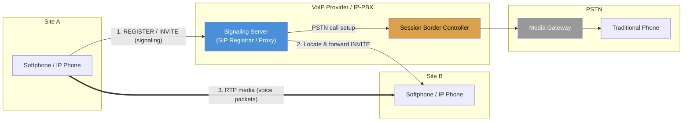
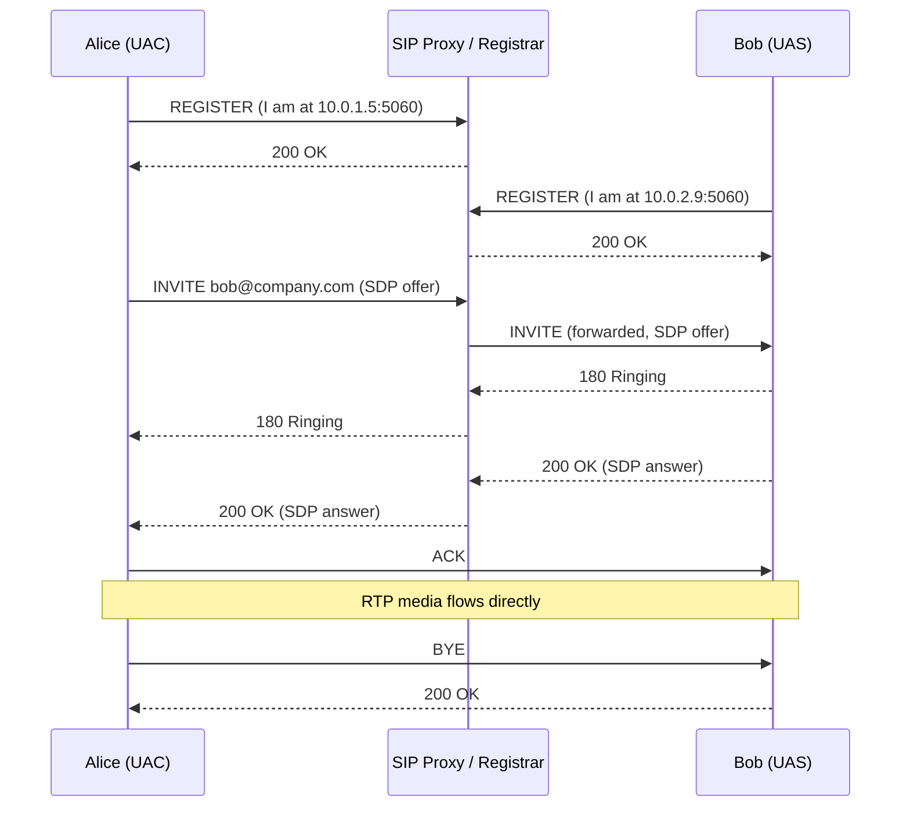
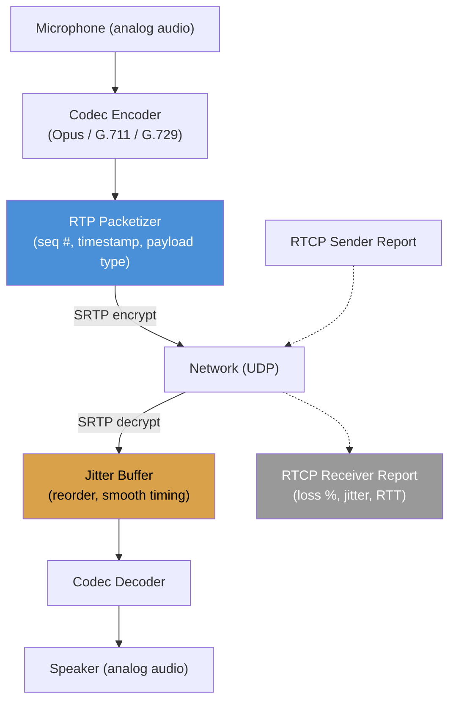
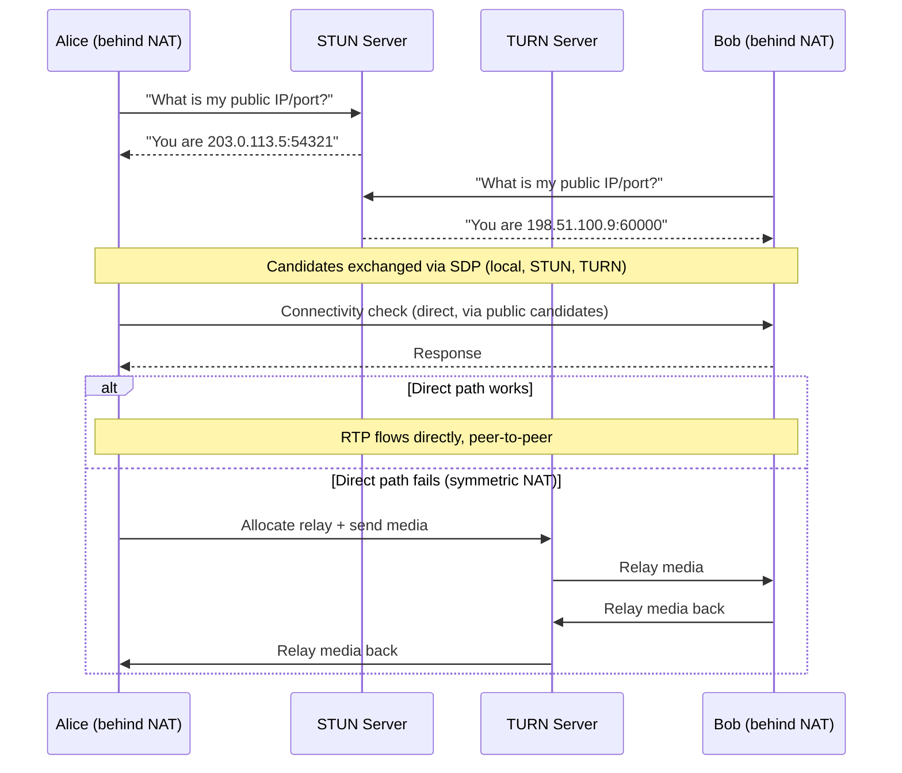
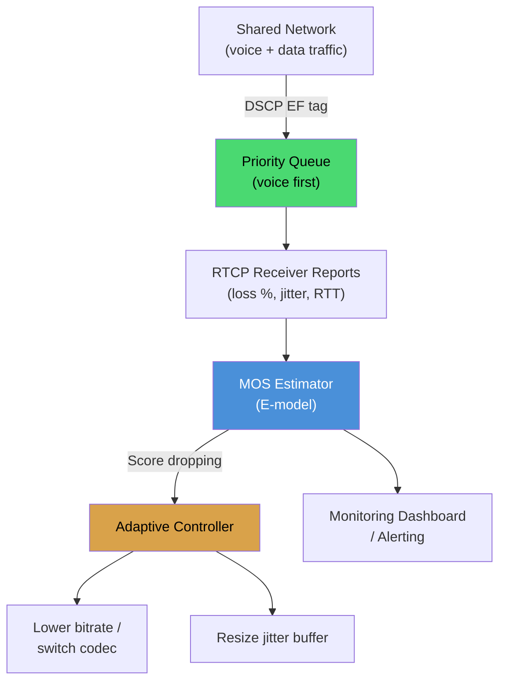
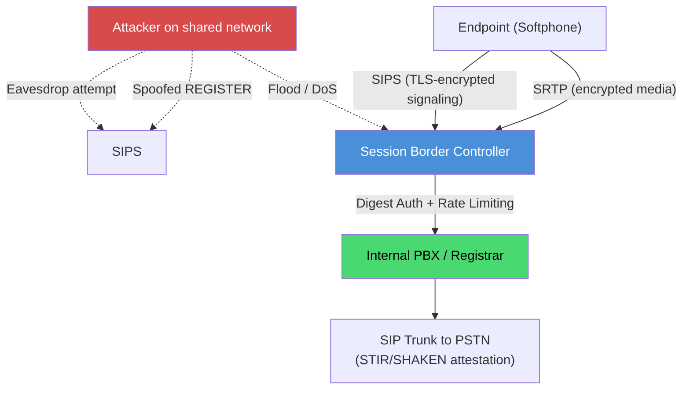
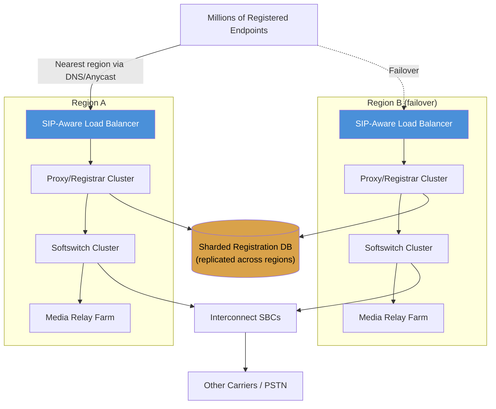

# VoIP (Voice Over Internet Protocol)


## Blogs and websites

- [What is voice over Internet Protocol (VoIP)?](https://www.cloudflare.com/learning/video/what-is-voip/)

- [VOIP Project: System Design](https://www.cs.columbia.edu/~sedwards/classes/2009/4840/designs/VOIP.pdf)
- [VOIP Project: Final Report](https://www.cs.columbia.edu/~sedwards/classes/2009/4840/reports/VOIP.pdf)


## Medium


## Youtube

- [What is VoIP (Voice Over Internet Protocol)](https://www.youtube.com/watch?v=rTO4rM3hXLY)


## Theory

### Topics Covered

This page is organized into the following topics. Each topic includes a detailed explanation, its characteristics, components, patterns, pros/benefits, cons/challenges, best practices, when to use it, a real-life use case, a diagram, a Java code example, and interview questions with answers.

1. [VoIP Fundamentals and Architecture](#voip-fundamentals-and-architecture)
2. [Signaling Protocols: SIP and H.323](#signaling-protocols-sip-and-h323)
3. [Media Transport and Codecs: RTP, RTCP, SRTP](#media-transport-and-codecs-rtp-rtcp-srtp)
4. [NAT Traversal: STUN, TURN, and ICE](#nat-traversal-stun-turn-and-ice)
5. [Quality of Service and Reliability](#quality-of-service-and-reliability)
6. [VoIP Security](#voip-security)
7. [Scalability and Carrier-Grade Architecture](#scalability-and-carrier-grade-architecture)
8. [VoIP: Characteristics, Pros, Cons, Use Cases, Components, Patterns, Benefits, Challenges, Best Practices and When to Use](#voip-characteristics-pros-cons-use-cases-components-patterns-benefits-challenges-best-practices-and-when-to-use)

### VoIP Fundamentals and Architecture

**VoIP (Voice over Internet Protocol)** is a family of technologies that convert analog voice signals into digital data packets and transmit them over IP networks (the same networks that carry web traffic, email, and video), instead of over the dedicated circuit-switched lines of the traditional telephone network (PSTN, Public Switched Telephone Network). Instead of reserving a fixed circuit for the entire duration of a call (as a traditional phone exchange does), VoIP chops audio into small packets, compresses them with a codec, and routes them across a shared, packet-switched network, reassembling and decompressing them at the receiving end.

At a high level, a VoIP call involves two distinct planes of communication that are handled separately:

1. **The signaling plane**: Responsible for finding the other party, negotiating call parameters (which codec to use, which ports to send media to), and managing the call's lifecycle (ringing, answered, put on hold, transferred, ended). This is handled by protocols such as SIP or H.323 (covered in the next topic).
2. **The media plane**: Responsible for actually carrying the compressed voice (and optionally video) data between the two endpoints once the call is set up. This is handled by RTP/SRTP (covered later in this page).

This separation of concerns is deliberate and mirrors the classic telephone network's split between the signaling network (SS7) and the voice trunks, but implemented entirely over IP.

**Why VoIP Replaced Circuit-Switched Telephony:**

- **Cost**: A circuit-switched call reserves a dedicated 64 kbps channel for the entire call, even during silence. VoIP only sends packets when there is audio to send (with silence suppression) and shares network capacity with all other traffic, dramatically lowering the marginal cost of a call, especially for long-distance and international calls.
- **Convergence**: A single IP network can carry voice, video, chat, and data, eliminating the need for a separate telephone wiring plant (PBX cabling) alongside the data network.
- **Flexibility and features**: Because voice is just data, VoIP systems can trivially add features that were hard on PSTN, such as call recording, transcription, screen sharing, video, presence status, and integration with software (click-to-call from a CRM, IVR scripting, chatbots).
- **Portability**: A VoIP "phone number" is a software identity, not a wire into a building. Employees can take their extension anywhere with a laptop or softphone and an internet connection.

#### VoIP Fundamentals and Architecture: Characteristics

- **Packet-switched, not circuit-switched**: Voice is digitized, compressed by a codec, and split into many small IP packets that travel independently across the network and may arrive out of order; this is fundamentally different from the dedicated, fixed-bandwidth circuit a traditional phone call reserves for its whole duration.
- **Two decoupled planes (signaling and media)**: Call setup/teardown (signaling) and the actual voice stream (media) use different protocols, often different ports, and sometimes even different network paths (media may flow peer-to-peer while signaling stays server-routed).
- **Real-time and delay-sensitive**: Unlike a file download, a late voice packet is useless once its playback slot has passed. VoIP therefore favors UDP (which does not retransmit) over TCP (which does), trading perfect delivery for low, predictable latency.
- **Digitization and compression at the edge**: The conversion from analog voice to a digital bitstream (via an ADC and a codec) happens as close to the source as possible (in the handset, softphone, or gateway), so only compressed digital data crosses the network.
- **Endpoint diversity**: A VoIP endpoint can be a hardware desk phone, a softphone application, a browser (via WebRTC), a mobile app, or an analog telephone connected through an ATA (Analog Telephone Adapter) that bridges old hardware into the IP world.

#### VoIP Fundamentals and Architecture: Components

- **User Agent (UA) / Endpoint**: The device or software that originates or receives calls, e.g., an IP phone, a softphone (Zoiper, Linphone), or a mobile VoIP app. It handles microphone/speaker I/O, encoding/decoding, and speaks the signaling protocol to register and place calls.
- **Analog Telephone Adapter (ATA)**: A small gateway device that converts an ordinary analog phone's signal into VoIP packets, allowing legacy hardware to join a VoIP network.
- **PBX / IP-PBX (Private Branch Exchange)**: The internal call-routing brain for an organization; it registers internal extensions, routes calls between them, and connects out to the PSTN or a VoIP trunk provider for external calls. Modern examples include Asterisk, FreeSWITCH, and 3CX.
- **VoIP Gateway / Media Gateway**: A device or service that converts between VoIP (IP packets) and the traditional PSTN (TDM circuits), used whenever a call needs to cross between an IP network and the classic phone network.
- **Session Border Controller (SBC)**: A specialized device sitting at the edge of a VoIP network that provides security (topology hiding, encryption termination), NAT traversal help, and protocol normalization between different SIP implementations (covered further in the Scalability topic).
- **Registrar / Location Server**: Keeps track of which IP address/port each user's device is currently reachable at, so that incoming calls can be routed to wherever the user is currently logged in.

#### VoIP Fundamentals and Architecture: Patterns

- **Peer-to-peer media with server-assisted signaling**: A central server helps two endpoints discover each other and set up a call, but once established, the media (actual voice) flows directly between them, minimizing latency and server load.
- **Media relay through a central server**: All media is proxied through a server (common in enterprise deployments or when NAT traversal fails), simplifying firewall rules and enabling recording/monitoring at the cost of extra server bandwidth and a small latency increase.
- **PSTN breakout / trunking**: A VoIP system connects to the traditional phone network through a SIP trunk provider or gateway, so VoIP users can call, and be called by, ordinary phone numbers.
- **Hosted / Cloud PBX**: Instead of running a physical PBX on-site, the call-routing logic runs as a multi-tenant cloud service (e.g., RingCentral, Twilio, 8x8), and the business only needs internet-connected endpoints.

#### VoIP Fundamentals and Architecture: Pros / Benefits

- **Lower cost per call**: Especially for long-distance and international calls, since voice shares existing internet bandwidth instead of requiring dedicated, distance-priced circuits.
- **Feature velocity**: New features (voicemail-to-email, call analytics, CRM integration, video, chat) can be added in software, without rewiring buildings or replacing switches.
- **Global reachability with local presence**: A business can have local phone numbers in many countries that all route to the same physical office, improving customer trust without opening new locations.
- **Unified communications**: Voice, video, messaging, and presence can be combined into one client application, reducing the number of tools employees juggle.

#### VoIP Fundamentals and Architecture: Cons / Challenges

- **Dependent on network quality**: Voice quality directly reflects the underlying IP network's health; congestion, jitter, or packet loss on the LAN, Wi-Fi, or ISP link degrades call quality in ways a dedicated phone line never would.
- **Power and emergency-service gaps**: Unlike a traditional analog phone line (which is powered by the phone company itself), VoIP phones need local power and internet, and location-based emergency calling (E911) requires extra configuration since the network no longer implies a fixed physical address.
- **NAT and firewall complexity**: Because SIP embeds IP addresses and ports inside its messages, and media often needs a separate path, VoIP interacts poorly with NAT/firewalls unless specifically engineered around (see the NAT Traversal topic).
- **Interoperability friction**: Different vendors' SIP implementations often have subtle incompatibilities ("SIP is a suggestion, not a standard," as the joke goes), requiring normalization layers like an SBC.

#### VoIP Fundamentals and Architecture: Best Practices

- Always separate the signaling and media paths logically in your architecture diagrams and monitoring, since they fail independently and are debugged with different tools (SIP traces vs. RTP/jitter statistics).
- Provision Quality of Service (QoS) on the network (DSCP tagging, prioritized queues) wherever voice shares a link with bulk data traffic, especially on office Wi-Fi and VPNs.
- Plan for PSTN interoperability from day one (via SIP trunking or a gateway) even for a pure VoIP-to-VoIP product, since users will always need to reach traditional phone numbers.
- Design for endpoint diversity: support hardware phones, softphones, and mobile apps behind a common signaling and provisioning layer rather than one-off integrations.

#### VoIP Fundamentals and Architecture: When to Use

- Any organization replacing or building out telephony infrastructure, where cost, feature agility, and remote-work flexibility matter more than the marginal reliability edge of legacy analog lines.
- Call centers and customer support systems that need call recording, IVR, analytics, and CRM integration out of the box.
- Products that need embedded voice/video calling (telehealth, marketplaces, ride-hailing apps) where a dedicated phone line per user is impractical.
- Distributed and remote teams who need a single phone extension that follows the person rather than a desk.

#### VoIP Fundamentals and Architecture: Diagram



The diagram highlights the two-plane design: thin signaling messages (thin arrow) travel through the server infrastructure to set up the call, while the much heavier, continuous media stream (thick arrow) can flow directly between endpoints once the call is established, and the SBC/gateway path exists only when the call needs to cross into the legacy PSTN.

#### VoIP Fundamentals and Architecture: Real-Life Use Case

A retail company with 40 branch stores replaces its aging analog phone system with a cloud-hosted VoIP PBX. Each store gets IP phones and a small internet-connected router; head office staff use softphones on their laptops. All internal calls between stores and head office are free (they never leave the company's VoIP network), while calls to customers' mobile or landline numbers are routed out through a SIP trunk to a PSTN gateway. When a store's internet briefly drops, the phones automatically re-register once connectivity returns, and a failover SIP trunk on a 4G backup router keeps emergency and customer calls working. The company also gains call recording and dashboards for support quality, which were not economically feasible on the old analog system.

#### VoIP Fundamentals and Architecture: Java Code Example

The example below models the two-plane architecture in miniature: a `SignalingServer` that registers endpoints and locates the callee, and a simulated `MediaSession` that "streams" voice packets directly between the two endpoints once signaling completes.

```java
import java.util.HashMap;
import java.util.Map;

public class VoipArchitectureDemo {

    // Represents a phone/softphone endpoint identified by a SIP-like address.
    static class Endpoint {
        final String address; // e.g. "alice@company.com"
        final String ipAndPort; // where media should be sent, e.g. "10.0.1.5:5000"

        Endpoint(String address, String ipAndPort) {
            this.address = address;
            this.ipAndPort = ipAndPort;
        }

        void receiveMedia(byte[] packet) {
            System.out.println(address + " received voice packet of " + packet.length + " bytes from " + ipAndPort);
        }
    }

    // The signaling plane: tracks where each endpoint currently is (registration)
    // and locates the callee when a call is placed.
    static class SignalingServer {
        private final Map<String, Endpoint> registrations = new HashMap<>();

        void register(Endpoint endpoint) {
            registrations.put(endpoint.address, endpoint);
            System.out.println("REGISTER: " + endpoint.address + " is now reachable at " + endpoint.ipAndPort);
        }

        Endpoint locate(String address) {
            Endpoint endpoint = registrations.get(address);
            if (endpoint == null) {
                throw new IllegalStateException("INVITE failed: " + address + " is not registered");
            }
            System.out.println("INVITE routed to " + address + " at " + endpoint.ipAndPort);
            return endpoint;
        }
    }

    // The media plane: once signaling has located the callee, voice packets
    // flow directly, simulating the peer-to-peer RTP stream.
    static class MediaSession {
        void streamVoice(Endpoint caller, Endpoint callee, int packetCount) {
            for (int i = 0; i < packetCount; i++) {
                byte[] packet = new byte[160]; // 20ms of G.711 audio at 8kHz = 160 bytes
                callee.receiveMedia(packet);
            }
        }
    }

    public static void main(String[] args) {
        SignalingServer server = new SignalingServer();

        Endpoint alice = new Endpoint("alice@company.com", "10.0.1.5:5000");
        Endpoint bob = new Endpoint("bob@company.com", "10.0.2.9:5000");

        server.register(alice);
        server.register(bob);

        // Signaling: Alice calls Bob, the server locates Bob's current endpoint.
        Endpoint callee = server.locate("bob@company.com");

        // Media: once signaling completes, RTP-like packets flow directly.
        new MediaSession().streamVoice(alice, callee, 5);
    }
}
```

#### VoIP Fundamentals and Architecture: Interview Questions and Answers

**Q1. What is the fundamental difference between circuit-switched and packet-switched voice?**
A: Circuit-switched telephony (traditional PSTN) reserves a dedicated, fixed-bandwidth channel between two parties for the entire duration of a call, whether or not anyone is speaking. Packet-switched voice (VoIP) digitizes and compresses audio into small packets that share the network with all other traffic, only consuming bandwidth when there is audio to send, and are routed independently, potentially over different paths.

**Q2. Why does VoIP separate signaling from media?**
A: Signaling (call setup, teardown, feature control) and media (the actual voice stream) have very different requirements: signaling needs reliability and can tolerate some latency, while media needs low, consistent latency far more than perfect reliability. Separating them lets each use the transport and protocol suited to its needs (e.g., SIP over TCP/UDP for signaling, RTP over UDP for media) and allows the media to take a more direct/efficient path than the signaling.

**Q3. What role does a Session Border Controller (SBC) play in a VoIP architecture?**
A: An SBC sits at the network edge and acts as a security and interoperability checkpoint for all signaling and media entering or leaving the network. It hides internal network topology, normalizes differences between SIP implementations, helps with NAT traversal, and can terminate/re-originate encryption, acting like a specialized firewall/proxy for voice traffic.

**Q4. Why is UDP typically preferred over TCP for VoIP media?**
A: Because a "late" voice packet is worse than a "lost" one; by the time TCP retransmits a dropped packet, its playback window has already passed, so the resend is useless and only adds jitter. UDP's lack of retransmission and ordering guarantees actually suits real-time audio better; any minor loss is masked by jitter buffers, packet-loss concealment in the codec, or simply a tiny audio glitch.

**Q5. What is an Analog Telephone Adapter (ATA) and why is it needed?**
A: An ATA is a small gateway device that converts the analog signal from a traditional telephone into VoIP packets (and back), letting legacy phone hardware participate in a VoIP network without being replaced, which is useful for gradual migrations or keeping specialized hardware (like fax machines or alarm lines) working.

### Signaling Protocols: SIP and H.323

The **signaling protocol** is what a VoIP system uses to establish, modify, and terminate calls, the equivalent of dialing a number, hearing it ring, and hanging up on a traditional phone. Two protocols dominate this space historically: **H.323**, an early, complex, binary protocol standardized by the ITU-T in 1996 for multimedia conferencing over packet networks, and **SIP (Session Initiation Protocol)**, a simpler, text-based, HTTP-inspired protocol standardized by the IETF (RFC 3261) that has become the de facto industry standard.

**SIP (Session Initiation Protocol):**

SIP borrows its request/response style directly from HTTP: requests look like `INVITE`, `BYE`, `REGISTER`, `ACK`, `CANCEL`, and `OPTIONS`, and responses use familiar-looking status codes (`180 Ringing`, `200 OK`, `486 Busy Here`, `404 Not Found`). SIP itself only handles signaling; it does not carry media. To describe what kind of media a call will use (codecs, IP addresses, ports), SIP messages carry an **SDP (Session Description Protocol)** body, negotiated between the two sides in an offer/answer exchange.

A typical SIP call flow:

1. Caller's device sends `INVITE` (containing an SDP offer) to the callee, via a SIP proxy/server.
2. Callee's device responds `100 Trying`, then `180 Ringing` as the phone rings.
3. When answered, callee sends `200 OK` (containing an SDP answer, confirming codec/port choices).
4. Caller sends `ACK` to confirm; media (RTP) now flows directly (or via a media server) between the two endpoints.
5. Either side sends `BYE` to end the call, acknowledged with `200 OK`.

**H.323:**

H.323 is an umbrella standard (encompassing H.225 for call signaling, H.245 for capability negotiation, and RAS for registration) using ASN.1 binary encoding, which made it efficient on the wire but hard to debug, extend, and pass through firewalls compared to SIP's plain text. H.323 was widely used in early enterprise video conferencing (e.g., first-generation Polycom/Cisco systems) but has largely been superseded by SIP in new deployments, though it remains present in some legacy telecom cores.

#### Signaling Protocols: SIP and H.323: Characteristics

- **Text-based and human-readable (SIP)**: SIP messages look like HTTP requests, plain ASCII headers and a body, which makes them easy to log, debug with tools like Wireshark, and hand-craft for testing, unlike H.323's binary ASN.1 encoding.
- **Request/response transaction model**: Every SIP action (placing a call, registering, ending a call) is a request that expects one or more provisional and a final response, mirroring HTTP's request/response semantics closely enough that many engineers familiar with HTTP can read SIP traces quickly.
- **Offer/answer media negotiation via SDP**: SIP itself says nothing about codecs or ports; that negotiation is delegated entirely to SDP bodies exchanged inside SIP messages, which cleanly separates "how do we find each other and manage the call" (SIP) from "what media will we exchange" (SDP).
- **Umbrella standard complexity (H.323)**: H.323 is not one protocol but a suite (H.225, H.245, RAS, and more), each governing a different aspect of the call, which gives it a very complete feature set but a much steeper implementation and interoperability curve than SIP.
- **Stateful dialogs**: Both protocols track a call as a stateful "dialog" or "call leg" across multiple messages, requiring servers (proxies, gatekeepers) to maintain state for the life of the call, unlike stateless HTTP request handling.

#### Signaling Protocols: SIP and H.323: Components

- **SIP User Agent (UAC/UAS)**: Every SIP endpoint acts as a User Agent Client (UAC) when initiating a request and a User Agent Server (UAS) when responding, e.g., a softphone is a UAC when it sends `INVITE` and a UAS when it receives one.
- **SIP Proxy Server**: Forwards SIP requests toward their destination (possibly through several hops), without itself participating in the media path; most enterprise and carrier SIP deployments route all signaling through one or more proxies.
- **SIP Registrar**: Accepts `REGISTER` requests and records the current IP/port where a given SIP address (Address of Record) can be reached, the SIP equivalent of the Registrar / Location Server described in the previous topic.
- **SIP Redirect Server**: Instead of forwarding a request itself, tells the caller's client "try this other address instead," offloading routing work from the server to the client.
- **H.323 Gatekeeper**: The H.323 equivalent of a SIP registrar/proxy combined, it handles address resolution, admission control, and bandwidth management for endpoints in its zone.
- **SDP (Session Description Protocol) body**: A plain-text description (media types, codecs, IP/port, encryption keys) carried inside SIP `INVITE`/`200 OK` messages that both sides use to agree on how media will be exchanged.

#### Signaling Protocols: SIP and H.323: Patterns

- **Proxy-routed signaling with direct media**: SIP proxies route only the signaling messages; once negotiated, media (RTP) flows directly between endpoints (or through a media relay if NAT/firewall rules require it).
- **Back-to-Back User Agent (B2BUA)**: A server (often an SBC) that terminates one call leg and originates a second one, effectively splitting a single logical call into two independent SIP dialogs, useful for recording, transcoding, or hiding internal topology.
- **REGISTER-based presence and mobility**: Endpoints periodically re-`REGISTER` (e.g., every 30-60 seconds) so the network always has a fresh, working location for the user, enabling "follow me" behavior across devices/networks.
- **Forking**: A proxy can send a single incoming `INVITE` to multiple registered devices simultaneously (e.g., both a desk phone and a mobile app), and whichever answers first "wins," with the others cancelled.

#### Signaling Protocols: SIP and H.323: Pros / Benefits

- **Ease of debugging and extension (SIP)**: Text-based messages and a request/response model familiar from HTTP make SIP far easier to troubleshoot, log, and extend with new headers/methods than binary H.323.
- **Wide ecosystem and interoperability (SIP)**: Because SIP became the industry standard, there is a huge ecosystem of compatible hardware, softphones, PBX software, and carrier trunking services, reducing vendor lock-in.
- **Rich feature negotiation**: SDP's flexible offer/answer model allows endpoints to negotiate multiple simultaneous media streams (audio, video, screen share, data), multiple codec choices in priority order, and encryption parameters, in a single exchange.
- **Mature admission control (H.323)**: The H.323 gatekeeper's centralized bandwidth/admission control model is well suited to tightly managed private networks (e.g., traditional enterprise video conferencing) where central capacity planning matters.

#### Signaling Protocols: SIP and H.323: Cons / Challenges

- **NAT/firewall unfriendliness**: Both protocols embed IP addresses and ports directly inside message bodies (SDP for SIP, similarly for H.323), which breaks when a NAT device rewrites the outer IP packet headers but leaves the embedded application-layer addresses stale, a core reason NAT traversal (STUN/TURN/ICE, or an SBC) is required.
- **Vendor interoperability gaps (SIP)**: Despite being a standard, different vendors implement optional SIP headers, timers, and edge cases differently, leading to the common industry joke that "SIP" stands for "Session Initiation Protocol" but should stand for "Sometimes It Prevaricates."
- **Complexity and low adoption for new systems (H.323)**: H.323's binary encoding, layered sub-protocols, and heavier implementation burden mean almost no new consumer or startup VoIP systems choose it today; it survives mainly in legacy telecom and video conferencing cores.
- **Security needs bolting on**: Neither protocol mandates encryption by default; SIP over plain UDP/TCP is trivially eavesdropped or spoofed unless deployed with TLS (SIPS) and SRTP for media, which many legacy deployments never enabled.

#### Signaling Protocols: SIP and H.323: Best Practices

- Prefer SIP over H.323 for any new deployment; H.323 should only be used when integrating with existing legacy conferencing infrastructure that has not yet migrated.
- Always run SIP over TLS (SIPS) for signaling and SRTP for media in production, never plain UDP/TCP SIP over the public internet, to prevent call hijacking, eavesdropping, and toll fraud.
- Use an SBC at the network edge to normalize SIP dialects between vendors and to hide internal registrar/proxy topology from the public internet.
- Keep `REGISTER` refresh intervals short enough to detect a dead endpoint quickly (for presence/mobility) but not so short that it floods the registrar; 30-60 seconds is a common balance.

#### Signaling Protocols: SIP and H.323: When to Use

- Use SIP for essentially all new VoIP deployments: SIP trunking to the PSTN, softphone/desk phone registration, WebRTC gateways, and call center platforms.
- Use H.323 only when interoperating with legacy hardware/infrastructure (older enterprise video conferencing units, some carrier cores) that has not been upgraded to SIP.
- Use SIP forking when a single user should be reachable simultaneously on multiple devices (desk phone + mobile app) and the first to answer should take the call.
- Use a B2BUA/SBC pattern whenever you need call recording, transcoding, topology hiding, or normalization between mismatched SIP implementations.

#### Signaling Protocols: SIP and H.323: Diagram



#### Signaling Protocols: SIP and H.323: Real-Life Use Case

A SaaS company builds a click-to-call feature into its customer support dashboard. When an agent clicks "Call Customer," the browser (via a SIP.js or JsSIP client library) sends a SIP `INVITE` through the company's SIP proxy toward a SIP trunk provider, which bridges the call out to the customer's real phone number on the PSTN. The proxy also handles agent `REGISTER` requests as agents log in each morning, and forks incoming customer support-line calls to whichever agent's softphone registers as available first. Because everything is standard SIP, the company can swap its SIP trunk provider for a cheaper one later without changing any client-side calling code.

#### Signaling Protocols: SIP and H.323: Java Code Example

The example below builds a minimal, simplified SIP-like message model and simulates the `INVITE` / `180 Ringing` / `200 OK` / `ACK` / `BYE` transaction flow between two user agents through a proxy.

```java
import java.util.HashMap;
import java.util.Map;

public class SipSignalingDemo {

    // A minimal SIP-like message: method (or status), from/to, and an SDP-ish body.
    static class SipMessage {
        final String startLine; // e.g. "INVITE", "180 Ringing", "200 OK", "BYE"
        final String from;
        final String to;
        final String sdpBody;

        SipMessage(String startLine, String from, String to, String sdpBody) {
            this.startLine = startLine;
            this.from = from;
            this.to = to;
            this.sdpBody = sdpBody;
        }

        @Override
        public String toString() {
            return startLine + " | From: " + from + " | To: " + to +
                    (sdpBody != null ? " | SDP: " + sdpBody : "");
        }
    }

    // A simplified SIP proxy: tracks registrations and forwards requests.
    static class SipProxy {
        private final Map<String, String> registrations = new HashMap<>();

        void register(String address, String contact) {
            registrations.put(address, contact);
            System.out.println("REGISTER " + address + " -> " + contact);
        }

        void forward(SipMessage message) {
            String contact = registrations.get(message.to);
            if (contact == null) {
                System.out.println("404 Not Found: " + message.to + " is not registered");
                return;
            }
            System.out.println("Proxy forwarding to " + message.to + " at " + contact + " : " + message);
        }
    }

    public static void main(String[] args) {
        SipProxy proxy = new SipProxy();
        proxy.register("alice@company.com", "10.0.1.5:5060");
        proxy.register("bob@company.com", "10.0.2.9:5060");

        // Alice calls Bob with an SDP offer (codec + port choice).
        SipMessage invite = new SipMessage("INVITE", "alice@company.com", "bob@company.com",
                "m=audio 49170 RTP/AVP 0 (PCMU)");
        proxy.forward(invite);

        // Simulated responses.
        System.out.println(new SipMessage("180 Ringing", "bob@company.com", "alice@company.com", null));
        SipMessage okResponse = new SipMessage("200 OK", "bob@company.com", "alice@company.com",
                "m=audio 52000 RTP/AVP 0 (PCMU)");
        System.out.println(okResponse);
        System.out.println(new SipMessage("ACK", "alice@company.com", "bob@company.com", null));

        System.out.println("-- RTP media would now flow directly between 10.0.1.5:49170 and 10.0.2.9:52000 --");

        // End the call.
        System.out.println(new SipMessage("BYE", "alice@company.com", "bob@company.com", null));
        System.out.println(new SipMessage("200 OK", "bob@company.com", "alice@company.com", null));
    }
}
```

#### Signaling Protocols: SIP and H.323: Interview Questions and Answers

**Q1. What is the difference between SIP and SDP?**
A: SIP is the signaling protocol, it handles finding the other party, ringing, answering, and ending the call. SDP (Session Description Protocol) is a plain-text format carried inside SIP message bodies that describes what media will be exchanged (codecs, IP addresses, ports, encryption keys). SIP is the "envelope and postal process"; SDP is the "letter" describing the media details inside it.

**Q2. Why is SIP generally preferred over H.323 today?**
A: SIP is text-based (easier to debug and extend), follows a request/response model similar to HTTP that many engineers already understand, and has broader industry adoption and tooling support. H.323's binary ASN.1 encoding and layered sub-protocol suite (H.225, H.245, RAS) make it more complete for certain legacy use cases but far more complex to implement, extend, and troubleshoot.

**Q3. What is a Back-to-Back User Agent (B2BUA) and why would you use one?**
A: A B2BUA terminates an incoming SIP call leg and originates a completely new outgoing call leg, acting as both a UAS and a UAC simultaneously, effectively splitting one logical call into two independently controlled dialogs. This is used for call recording, media transcoding, hiding internal network topology, and enforcing policy, which a simple stateless proxy cannot do since it does not terminate the dialog.

**Q4. Why does SIP have trouble with NAT, and what are common mitigations?**
A: SIP and SDP embed IP addresses and ports as plain text inside the message payload. A NAT device only rewrites the outer IP/TCP/UDP headers, not the embedded application-layer addresses, so the callee ends up with a private IP address it cannot reach. Common mitigations are STUN (letting the endpoint learn its public address), TURN (relaying media through a public server), ICE (trying multiple candidate paths and picking the best one), or simply routing everything through an SBC that rewrites SDP and relays media.

**Q5. What does a SIP `REGISTER` request do, and why is it re-sent periodically?**
A: `REGISTER` tells a SIP registrar the current IP address/port (contact) where a given SIP address (Address of Record) can be reached, similar to updating your forwarding address. It is re-sent periodically (typically every 30-60 seconds) so the registrar's record does not go stale if the endpoint's IP changes or the device goes offline, and so the registrar can detect a dead endpoint by its registration expiring.

### Media Transport and Codecs: RTP, RTCP, SRTP

Once SIP has negotiated a call, the actual voice data is carried by **RTP (Real-time Transport Protocol, RFC 3550)**, a lightweight protocol built on top of UDP designed specifically for delivering time-sensitive media. RTP itself does not guarantee delivery or ordering (that is left to the application), but it adds exactly what real-time audio needs: a **sequence number** (to detect lost or reordered packets and let the receiver reconstruct correct playback order), a **timestamp** (to know precisely when each chunk of audio should be played out, enabling jitter compensation), and a **payload type** identifier (which codec was used to encode this packet).

Alongside RTP runs **RTCP (RTP Control Protocol)**, a separate, lower-bandwidth channel that periodically exchanges quality statistics, packets sent/received counts, jitter estimates, and round-trip time, between the endpoints. RTCP doesn't carry media itself; it is the "health telemetry" channel for an ongoing RTP session, and applications use it to detect and react to degrading call quality (e.g., asking the codec to switch to a lower bitrate).

Because plain RTP has no encryption, production VoIP systems use **SRTP (Secure RTP, RFC 3711)**, which adds authentication and encryption (typically AES) to each RTP packet's payload, protecting voice content from eavesdropping and tampering while preserving RTP's real-time header structure. The encryption keys for SRTP are usually negotiated as part of the SIP/SDP exchange (via SDES) or, in WebRTC-style systems, via DTLS-SRTP.

**Codecs**, the algorithms that compress raw digital audio into a much smaller bitstream, sit underneath RTP and determine both call quality and bandwidth usage:

- **G.711 (PCMU/PCMA)**: Uncompressed-quality, simple mu-law/a-law companding at 64 kbps. Extremely low CPU cost and no compression artifacts, but uses the most bandwidth; the long-standing baseline codec for PSTN interoperability.
- **G.729**: A highly compressed codec at just 8 kbps, popular where bandwidth is scarce or expensive (e.g., satellite links, cheap international trunks), at the cost of higher CPU usage and (historically) licensing fees.
- **Opus**: A modern, royalty-free, highly adaptive codec (used heavily by WebRTC) that can operate anywhere from 6 kbps to 510 kbps, dynamically adjusting bitrate and even switching between speech-optimized and music-optimized modes, generally considered today's best general-purpose voice/audio codec.
- **AMR / AMR-WB**: Codecs designed for mobile networks (used in 3G/VoLTE), balancing bandwidth efficiency with resilience to the packet loss patterns typical of cellular radio links.

#### Media Transport and Codecs: RTP, RTCP, SRTP: Characteristics

- **Built on UDP, not TCP**: RTP rides on top of UDP specifically to avoid TCP's retransmission and strict in-order delivery, which would otherwise force the receiver to wait for a resend of an already-useless, late voice packet.
- **Self-describing packet headers**: Every RTP packet carries a sequence number, timestamp, payload type, and synchronization source identifier (SSRC), giving the receiver everything it needs to detect loss, reorder packets, and play them out at the correct time, all without needing an out-of-band index.
- **Parallel control channel (RTCP)**: RTCP runs alongside RTP (conventionally on the next UDP port up) purely for statistics and control, sender reports, receiver reports, and quality metrics, decoupled from the media data path itself.
- **Encryption is a separate, optional layer (SRTP)**: Plain RTP has zero security built in; SRTP wraps the same packet structure with authentication tags and payload encryption, meaning a system can technically run unencrypted RTP (insecure) or authenticated/encrypted SRTP (secure) using nearly the same wire format.
- **Codec-agility mid-call**: The RTP payload type field allows a session to reference multiple negotiated codecs and, with renegotiation, even switch codecs mid-call in response to changing network conditions.

#### Media Transport and Codecs: RTP, RTCP, SRTP: Components

- **RTP packetizer/depacketizer**: The component in the media engine that takes encoded audio frames from the codec and wraps them in RTP headers (or, on receive, strips the headers and hands frames to the decoder).
- **Jitter buffer**: A small buffer on the receiving side that intentionally delays playback slightly, reordering and smoothing out RTP packets that arrive with variable timing, so the far end hears smooth audio instead of choppy, network-timed chunks.
- **Codec (encoder/decoder)**: The algorithm (G.711, G.729, Opus, AMR, etc.) that compresses raw PCM audio samples into a compact bitstream and reverses that process on playback.
- **RTCP sender/receiver report generator**: Periodically builds and sends statistics packets (packets sent, packets lost, jitter, round-trip time) used for monitoring and adaptive behavior.
- **SRTP crypto context**: Holds the negotiated encryption key, salt, and rolling counters needed to encrypt/decrypt and authenticate each RTP packet without needing a handshake per packet.
- **Packet Loss Concealment (PLC)**: A codec-level or media-engine feature that synthesizes a plausible-sounding fill-in for a missing packet (e.g., by repeating/fading the previous frame) rather than inserting silence or a click.

#### Media Transport and Codecs: RTP, RTCP, SRTP: Patterns

- **Adaptive bitrate audio**: The media engine monitors RTCP receiver reports for rising packet loss or jitter and instructs the encoder to drop to a lower bitrate or a more loss-resilient codec, trading some quality for continuity.
- **Jitter buffer sizing tradeoff**: A larger jitter buffer smooths out more network variability at the cost of added end-to-end delay; a smaller buffer minimizes delay but risks audible gaps when packets are late. Adaptive jitter buffers resize themselves dynamically based on observed network jitter.
- **Comfort noise generation (CNG) with silence suppression**: To save bandwidth, some systems stop sending RTP packets during silence (VAD, voice activity detection) and instead have the receiver synthesize a low-level background "comfort noise" so the call doesn't sound unnaturally dead.
- **Forward Error Correction (FEC)**: Redundant, lower-fidelity copies of recent audio frames are embedded in later packets, so if one packet is lost, the receiver can still reconstruct an approximation of it from a subsequent packet, at the cost of extra bandwidth.

#### Media Transport and Codecs: RTP, RTCP, SRTP: Pros / Benefits

- **Low, predictable end-to-end delay**: By avoiding TCP retransmission and using timestamps for precise playout scheduling, RTP keeps latency close to the network's actual one-way delay, essential for natural-feeling conversation.
- **Graceful degradation under loss**: RTP's sequence numbers plus codec-level packet loss concealment mean a call can lose a noticeable percentage of packets and still sound acceptable, rather than freezing or disconnecting as a strict, ordered stream would.
- **Bandwidth efficiency via codec choice**: Codecs like Opus and G.729 let operators trade a small amount of audio fidelity for a large reduction in required bandwidth, which matters enormously at scale (thousands of concurrent calls).
- **Strong confidentiality with SRTP**: SRTP's authenticated encryption protects call content from network eavesdroppers and tampering while adding only a small, constant per-packet overhead, making "secure by default" practical even for real-time media.

#### Media Transport and Codecs: RTP, RTCP, SRTP: Cons / Challenges

- **No built-in reliability**: Because RTP intentionally forgoes retransmission, any packet loss is permanent from RTP's point of view; recovering perceived quality is entirely the job of jitter buffers, PLC, and FEC layered on top, which adds implementation complexity.
- **Firewall/NAT sensitivity**: RTP typically uses a wide, dynamically negotiated range of UDP ports (as specified in the SDP), which is harder to allow safely through corporate firewalls than a single well-known TCP port, often requiring an ALG (Application Layer Gateway) or a media relay.
- **Codec licensing and compatibility**: Some codecs (historically G.729) carried per-channel licensing fees, and not all endpoints support every codec, so calls sometimes fall back to the lowest common denominator (usually G.711), increasing bandwidth needs unexpectedly.
- **Key management overhead (SRTP)**: SRTP itself does not define how keys are exchanged; that has to be layered on via SDES (keys sent in cleartext SDP unless SIP itself is encrypted with TLS) or DTLS-SRTP, and choosing/operating the wrong one can silently leave media unencrypted.

#### Media Transport and Codecs: RTP, RTCP, SRTP: Best Practices

- Always negotiate SRTP (not plain RTP) for any call that traverses an untrusted network, and pair it with SIP over TLS so the SRTP key exchange itself is not exposed in cleartext.
- Size jitter buffers adaptively rather than with a large fixed value; monitor RTCP-reported jitter and adjust the buffer only as much as the network actually requires to minimize added latency.
- Prefer a modern, adaptive codec like Opus for anything running over variable-quality networks (Wi-Fi, cellular, public internet), and reserve G.711 mainly for LAN/PSTN interoperability where bandwidth is not a constraint.
- Monitor RTCP metrics (packet loss percentage, jitter, round-trip time) continuously and alert on thresholds, since these numbers are much better early indicators of call quality problems than end-user complaints.

#### Media Transport and Codecs: RTP, RTCP, SRTP: When to Use

- Use plain, high-fidelity G.711 for internal calls on a well-controlled LAN or for PSTN gateway legs where bandwidth is not a bottleneck and maximum compatibility is desired.
- Use Opus for browser-based (WebRTC), mobile, and general internet calling scenarios where network conditions vary and adaptive bitrate matters.
- Use G.729 or AMR when bandwidth is genuinely scarce or expensive (satellite backhaul, constrained mobile data plans) and the higher CPU cost of decoding is acceptable.
- Always use SRTP (never plain RTP) for any media that leaves a private, trusted network segment.

#### Media Transport and Codecs: RTP, RTCP, SRTP: Diagram



The diagram shows audio flowing down the encode-packetize-encrypt-network-decrypt-buffer-decode-playback pipeline, while RTCP runs as a lightweight, parallel feedback loop reporting on the health of that pipeline without carrying any audio itself.

#### Media Transport and Codecs: RTP, RTCP, SRTP: Real-Life Use Case

A video conferencing provider notices customer complaints of choppy audio on mobile networks. By analyzing RTCP receiver reports, the engineering team finds jitter spikes and 3-5% packet loss correlate strongly with cellular handoffs (switching cell towers). They respond by: (1) switching the default codec from G.711 to Opus, whose forward error correction and adaptive bitrate handle bursty loss far better, (2) making the jitter buffer adaptive instead of fixed at 40ms, and (3) enabling SRTP with DTLS key exchange to also close a security gap flagged in an audit. Post-rollout, RTCP-reported mean opinion scores (MOS, a standard voice-quality metric) on mobile calls improve measurably without needing any change to the underlying cellular network.

#### Media Transport and Codecs: RTP, RTCP, SRTP: Java Code Example

The example below builds a minimal RTP-like packet structure with sequence numbers and timestamps, simulates network jitter and packet loss, and uses a simple jitter buffer to reorder packets before "playback."

```java
import java.util.*;

public class RtpJitterBufferDemo {

    // A minimal RTP-like packet: sequence number, timestamp, and payload.
    static class RtpPacket {
        final int sequenceNumber;
        final long timestampMs; // when this audio chunk should be played
        final byte[] payload;

        RtpPacket(int sequenceNumber, long timestampMs, byte[] payload) {
            this.sequenceNumber = sequenceNumber;
            this.timestampMs = timestampMs;
            this.payload = payload;
        }
    }

    // A simplified jitter buffer: holds packets briefly and releases them in
    // sequence-number order, dropping duplicates and tolerating reordering.
    static class JitterBuffer {
        private final TreeMap<Integer, RtpPacket> buffer = new TreeMap<>();
        private int nextExpectedSeq = 0;

        void receive(RtpPacket packet) {
            buffer.put(packet.sequenceNumber, packet); // TreeMap keeps packets ordered by seq #
        }

        List<RtpPacket> drainInOrder() {
            List<RtpPacket> playable = new ArrayList<>();
            while (buffer.containsKey(nextExpectedSeq)) {
                playable.add(buffer.remove(nextExpectedSeq));
                nextExpectedSeq++;
            }
            return playable;
        }

        List<Integer> reportMissing(int upToSeq) {
            List<Integer> missing = new ArrayList<>();
            for (int s = nextExpectedSeq; s < upToSeq; s++) {
                if (!buffer.containsKey(s)) {
                    missing.add(s); // these packets never arrived (packet loss)
                }
            }
            return missing;
        }
    }

    public static void main(String[] args) {
        JitterBuffer jitterBuffer = new JitterBuffer();

        // Simulate 5 packets (20ms of audio each) arriving out of order, with #2 lost.
        int[] arrivalOrder = {0, 1, 3, 4}; // packet 2 never arrives (simulated loss)
        for (int seq : arrivalOrder) {
            jitterBuffer.receive(new RtpPacket(seq, seq * 20L, new byte[160]));
        }

        List<RtpPacket> playable = jitterBuffer.drainInOrder();
        System.out.println("Playable in order so far: " + playable.size() + " packet(s) (blocked waiting for seq 2)");

        List<Integer> missing = jitterBuffer.reportMissing(5);
        System.out.println("Missing sequence numbers (packet loss concealment needed): " + missing);

        // Late arrival: packet 2 finally shows up (simulating network jitter).
        jitterBuffer.receive(new RtpPacket(2, 40L, new byte[160]));
        playable = jitterBuffer.drainInOrder();
        System.out.println("Playable after late packet 2 arrived: " + playable.size() + " packet(s), now fully in order");
    }
}
```

#### Media Transport and Codecs: RTP, RTCP, SRTP: Interview Questions and Answers

**Q1. Why does RTP run over UDP instead of TCP?**
A: TCP's retransmission and strict ordering guarantees are actively harmful for real-time voice, a retransmitted packet arrives too late to be played at its correct position, and TCP would still block delivery of newer packets until the missing one arrives. UDP has no such guarantees, so RTP layers exactly what it needs (sequence numbers for ordering detection, timestamps for playout timing) on top, without paying for retransmission it doesn't want.

**Q2. What is the difference between RTP and RTCP?**
A: RTP carries the actual media payload (encoded audio/video), while RTCP is a separate, much lower-bandwidth control channel that periodically exchanges statistics, packets sent, packets lost, jitter, round-trip time, about the ongoing RTP session. RTCP carries no media; it exists purely for monitoring and adaptive control.

**Q3. What problem does SRTP solve that plain RTP does not?**
A: Plain RTP has no encryption or authentication; anyone who can capture the packets can listen to the conversation or inject/alter media. SRTP adds authenticated encryption (commonly AES) to the RTP payload while preserving the same header structure, so encrypted calls remain compatible with RTP's timing and sequencing mechanics.

**Q4. What is a jitter buffer, and what is the tradeoff in sizing it?**
A: A jitter buffer holds incoming RTP packets briefly on the receiving side so they can be reordered and played back at a smooth, consistent rate despite arriving with variable network delay. A larger buffer absorbs more network jitter but adds more end-to-end latency (which can make conversation feel unnatural); a smaller buffer minimizes delay but risks audible gaps or glitches when packets are delayed beyond the buffer's capacity.

**Q5. Why might a call between two Opus-capable endpoints still end up using G.711?**
A: Codec choice is negotiated during SDP offer/answer, and it depends on what both endpoints (and any intermediate gateway/B2BUA) actually support and prioritize. If a call passes through an older gateway or PSTN interconnect that only supports G.711, the whole call, or at least that leg, will be transcoded to or forced onto G.711, even if the original endpoints preferred Opus.

### NAT Traversal: STUN, TURN, and ICE

Most VoIP endpoints (home routers, office networks, mobile carriers) sit behind **NAT (Network Address Translation)**, meaning their real IP address is a private one (e.g., `192.168.1.10`) that is not directly reachable from the public internet; the router translates it to a shared public IP on the way out. This breaks VoIP in a very specific way: when a phone builds its SDP offer, it fills in its *own* address, which is a private address that means nothing to the other side of the internet. Without help, the far end would try to send RTP media to an unreachable private IP, and the call would have signaling but no audio.

Three complementary protocols solve this:

- **STUN (Session Traversal Utilities for NAT, RFC 8489)**: A very simple protocol where an endpoint asks a public STUN server "what is my public IP and port, as you see them?" The endpoint then uses that public address/port in its SDP, so the far end has a real, reachable destination. STUN works for most home/consumer NATs but fails for symmetric NATs (common in some corporate/carrier networks) where the mapping changes per destination.
- **TURN (Traversal Using Relays around NAT, RFC 8656)**: When a direct path truly cannot be established (both sides behind restrictive/symmetric NAT), a TURN server acts as a relay, both endpoints send their media to the TURN server, which forwards it to the other side. This always works but costs the TURN operator real bandwidth and adds latency, so it is used as a fallback, not a first choice.
- **ICE (Interactive Connectivity Establishment, RFC 8445)**: The overall algorithm that ties STUN and TURN together. Each endpoint gathers a list of "candidate" addresses (its local LAN IP, its STUN-discovered public IP, and a TURN relay address), exchanges that list with the other side (via SDP), and then both sides test every candidate pairing to find the best one that actually works, direct LAN, direct public IP, or relayed through TURN, in that order of preference.

This is exactly the same NAT traversal machinery WebRTC uses (see [webrtc.md](webrtc.md)); VoIP over SIP simply predates and reuses the same STUN/TURN/ICE toolkit, since the underlying networking problem (private IPs behind NAT) is identical.

#### NAT Traversal: STUN, TURN, and ICE: Characteristics

- **Layered fallback design**: ICE is not one technique but an ordered strategy, try the cheapest, lowest-latency option first (direct LAN or direct public IP via STUN), and only fall back to the most expensive option (TURN relay) when nothing else works.
- **Candidate-based negotiation**: Each side gathers multiple possible network paths (candidates) before the call starts and exchanges them, rather than assuming any single address will work, this is what makes ICE robust across the huge variety of real-world NAT/firewall configurations.
- **Symmetric NAT is the hard case**: Full-cone and restricted-cone NATs let STUN work reliably because the port mapping is consistent regardless of destination; symmetric NATs assign a new external port for every distinct destination, which defeats STUN's simple "ask once" model and forces a TURN relay.
- **Connectivity checks happen bidirectionally**: ICE does not just try candidates in one direction; both endpoints send STUN-like connectivity check packets across every candidate pair to confirm two-way reachability before selecting it, since NAT/firewall behavior can be asymmetric.
- **Signaling still needed to exchange candidates**: STUN/TURN/ICE solve the media path problem, but the candidate lists themselves must still be exchanged through the existing signaling channel (SDP inside SIP), so NAT traversal is a media-plane concern layered on top of, not a replacement for, the signaling plane.

#### NAT Traversal: STUN, TURN, and ICE: Components

- **STUN server**: A lightweight, typically stateless public server whose only job is to tell a requesting client its observed public IP/port; many are free and shared (e.g., Google's public STUN servers) since the server does minimal work per request.
- **TURN server**: A stateful relay server that allocates a temporary public IP/port per session and forwards all media between the two call participants, requiring real bandwidth and therefore usually operated by the service provider rather than used from free public servers.
- **ICE agent**: The logic (built into the SIP/WebRTC stack) running on each endpoint that gathers local, STUN, and TURN candidates, exchanges them, performs connectivity checks, and picks the winning candidate pair.
- **NAT / firewall device**: The router or corporate firewall doing the actual address translation; its specific behavior (full-cone, restricted-cone, port-restricted, or symmetric) determines how well plain STUN will work without TURN.
- **SDP candidate attributes**: The specific SDP lines (`a=candidate:...`) used to carry each gathered ICE candidate (type, priority, IP, port, protocol) between the two SIP endpoints during offer/answer.

#### NAT Traversal: STUN, TURN, and ICE: Patterns

- **Happy-path direct connection**: Both endpoints have compatible, non-symmetric NATs (or one is fully public); STUN-discovered candidates connect directly, giving the lowest possible latency with no relay costs.
- **TURN-as-fallback**: ICE always gathers a TURN candidate as an insurance policy; it's only actually used for the small percentage of calls where the direct candidates fail connectivity checks, keeping average relay costs low while guaranteeing every call can still connect.
- **SBC-mediated media relay**: Instead of (or in addition to) STUN/TURN, some enterprise deployments route all media through an SBC, which effectively acts as a purpose-built, always-on relay that also provides security and topology hiding, at the cost of the SBC's own bandwidth and scaling limits.
- **ICE restart on network change**: When an endpoint's network changes mid-call (e.g., Wi-Fi to cellular handoff on a mobile device), the ICE agent re-gathers candidates and re-runs connectivity checks without tearing down the whole call, allowing the media path to seamlessly migrate to the new network.

#### NAT Traversal: STUN, TURN, and ICE: Pros / Benefits

- **Works across the full spectrum of real-world networks**: The layered STUN-then-TURN fallback of ICE means calls can connect whether both sides are on a simple home NAT or one side is behind a highly restrictive corporate firewall, without requiring any manual network configuration from end users.
- **Optimizes for the cheapest working path**: Because ICE prefers direct candidates over relayed ones, most calls end up peer-to-peer (lowest latency, no relay bandwidth cost), and TURN is reserved only for the minority of genuinely difficult cases.
- **No manual port forwarding required**: Before STUN/ICE, getting VoIP to work behind a home router often required manually configuring port forwarding; ICE automates discovery so calls "just work" for typical consumer users.
- **Resilient to network changes**: ICE restart support lets ongoing calls survive a Wi-Fi-to-cellular handoff or a change in public IP, rather than dropping the call entirely.

#### NAT Traversal: STUN, TURN, and ICE: Cons / Challenges

- **TURN relay cost and latency**: Every byte of relayed media consumes the TURN operator's bandwidth and adds an extra network hop of latency, so at scale (large call centers, or apps with many symmetric-NAT users), TURN infrastructure can become a significant cost and capacity planning concern.
- **Connectivity check overhead adds setup delay**: Gathering candidates and running pairwise connectivity checks takes real time (typically a few hundred milliseconds to a couple of seconds), which is why perceived "call connect" delay is often dominated by ICE negotiation rather than the SIP signaling itself.
- **Symmetric NAT and carrier-grade NAT (CGNAT) are still hard**: Some mobile carriers and enterprise networks use symmetric or carrier-grade NAT specifically because it's more secure/scalable for them, which forces a much higher percentage of calls onto costly TURN relays, sometimes unavoidably.
- **Operational burden of running TURN**: Unlike STUN servers (nearly stateless, cheap, sometimes free/public), TURN servers must be provisioned with real bandwidth, monitored for capacity, and usually require authentication/credentials to prevent abuse as an open relay.

#### NAT Traversal: STUN, TURN, and ICE: Best Practices

- Always configure both STUN and TURN servers, never rely on STUN alone, since some meaningful fraction of real users will be behind symmetric or carrier-grade NAT where only TURN will work.
- Use short-lived, per-session TURN credentials (time-limited HMAC-based credentials) rather than a shared static username/password, to prevent the TURN server from being abused as an open relay by unauthorized traffic.
- Monitor the percentage of calls that fall back to TURN as a key operational metric; a rising TURN-usage rate often signals a shift in your user base's network environment (e.g., growth in enterprise/CGNAT users) that affects both cost and quality.
- Deploy TURN servers in multiple geographic regions close to your users, since a relay adds real distance-based latency; a TURN server on another continent can make an otherwise-acceptable relay path sound noticeably delayed.

#### NAT Traversal: STUN, TURN, and ICE: When to Use

- Use STUN alone for consumer applications where most users are behind simple home routers and a low percentage of symmetric-NAT failures is acceptable, ideal for keeping infrastructure costs minimal.
- Use full ICE with both STUN and TURN for any production VoIP/video product that needs to reliably connect calls across arbitrary, unknown user networks (mobile carriers, corporate firewalls, public Wi-Fi).
- Use an SBC-based media relay pattern in enterprise/carrier deployments where you additionally need topology hiding, centralized recording, or regulatory compliance logging, not just NAT traversal.
- Trigger an ICE restart whenever the client detects a network interface change (Wi-Fi to cellular, IP address change) to keep an in-progress call alive rather than dropping it.

#### NAT Traversal: STUN, TURN, and ICE: Diagram



#### NAT Traversal: STUN, TURN, and ICE: Real-Life Use Case

A telehealth startup finds that roughly 12% of patient video calls fail to connect audio/video even though signaling completes successfully. Investigation shows these failures cluster among patients on certain mobile carriers known to use carrier-grade NAT, where STUN alone cannot discover a usable public mapping. The team deploys a fleet of TURN servers across three regions with time-limited credentials issued at call start, and configures ICE to always gather TURN candidates as a fallback. After the change, essentially all calls connect (the small percentage needing TURN now succeed via relay instead of failing outright), at a modest, monitored increase in relay bandwidth cost that the team tracks as a per-call cost metric.

#### NAT Traversal: STUN, TURN, and ICE: Java Code Example

The example below simulates a simplified ICE candidate-gathering and connectivity-check process: each side gathers local, "STUN-discovered," and "TURN relay" candidates, and the algorithm picks the highest-priority pair that a simulated connectivity check confirms as reachable.

```java
import java.util.*;

public class IceCandidateSelectionDemo {

    enum CandidateType { HOST, SERVER_REFLEXIVE /* via STUN */, RELAY /* via TURN */ }

    static class Candidate {
        final CandidateType type;
        final String address;
        final int priority; // higher = preferred

        Candidate(CandidateType type, String address, int priority) {
            this.type = type;
            this.address = address;
            this.priority = priority;
        }

        @Override
        public String toString() {
            return type + "@" + address + " (priority " + priority + ")";
        }
    }

    // Simulates whether a direct connectivity check between two candidates succeeds,
    // modeling a symmetric NAT that blocks host/server-reflexive direct connections.
    static boolean connectivityCheckSucceeds(Candidate local, Candidate remote, boolean symmetricNatPresent) {
        if (local.type == CandidateType.RELAY || remote.type == CandidateType.RELAY) {
            return true; // TURN relay always works, that is its purpose
        }
        return !symmetricNatPresent; // direct paths fail if a symmetric NAT is in the path
    }

    static Candidate selectBestPair(List<Candidate> localCandidates, List<Candidate> remoteCandidates,
                                     boolean symmetricNatPresent) {
        // Sort by priority descending, try highest-priority pairs first (ICE's own strategy).
        localCandidates.sort((a, b) -> b.priority - a.priority);
        for (Candidate local : localCandidates) {
            for (Candidate remote : remoteCandidates) {
                if (connectivityCheckSucceeds(local, remote, symmetricNatPresent)) {
                    System.out.println("Connectivity check PASSED for pair: " + local + " <-> " + remote);
                    return local;
                }
                System.out.println("Connectivity check FAILED for pair: " + local + " <-> " + remote);
            }
        }
        throw new IllegalStateException("No working candidate pair found");
    }

    public static void main(String[] args) {
        List<Candidate> aliceCandidates = Arrays.asList(
                new Candidate(CandidateType.HOST, "192.168.1.10:5000", 126),
                new Candidate(CandidateType.SERVER_REFLEXIVE, "203.0.113.5:54321", 100),
                new Candidate(CandidateType.RELAY, "turn.example.com:3478", 50)
        );
        List<Candidate> bobCandidates = Arrays.asList(
                new Candidate(CandidateType.HOST, "10.0.2.9:5000", 126),
                new Candidate(CandidateType.SERVER_REFLEXIVE, "198.51.100.9:60000", 100),
                new Candidate(CandidateType.RELAY, "turn.example.com:3478", 50)
        );

        System.out.println("-- Scenario 1: No symmetric NAT, direct connection possible --");
        Candidate winner1 = selectBestPair(new ArrayList<>(aliceCandidates), bobCandidates, false);
        System.out.println("Selected: " + winner1);

        System.out.println("\n-- Scenario 2: Symmetric NAT present, must fall back to TURN relay --");
        Candidate winner2 = selectBestPair(new ArrayList<>(aliceCandidates), bobCandidates, true);
        System.out.println("Selected: " + winner2);
    }
}
```

#### NAT Traversal: STUN, TURN, and ICE: Interview Questions and Answers

**Q1. Why can't two VoIP endpoints behind NAT simply connect using the IP address in their SDP offer?**
A: Devices behind NAT only know their own private IP address (e.g., `192.168.1.10`), which is meaningless outside the local network. If that private address is placed directly in the SDP, the far end has no way to route packets back to it; the call would signal correctly but have no working media path.

**Q2. What is the difference between STUN and TURN?**
A: STUN simply tells a client what its public IP/port looks like from the outside, letting endpoints try to connect directly using that discovered address. TURN is a relay: when direct connectivity genuinely cannot be established (e.g., due to symmetric NAT on both sides), both endpoints send their media to a TURN server, which forwards it between them, guaranteeing connectivity at the cost of relay bandwidth and added latency.

**Q3. What does ICE actually do, given that STUN and TURN already exist?**
A: ICE is the orchestration layer: it defines how to gather all possible candidates (host, STUN-derived, TURN relay) on both sides, exchange them, and systematically test every candidate pair to find the best one that actually works, preferring direct, low-latency paths and only falling back to TURN when necessary. Without ICE, an application would have to hand-roll this trial-and-error process itself.

**Q4. Why does symmetric NAT break plain STUN?**
A: A symmetric NAT assigns a different public port mapping for every distinct destination IP/port a client talks to. STUN discovers the mapping the client gets when talking to the STUN server, but that mapping won't be reused when the client later talks to the actual call peer, so the "discovered" address is not actually valid for the real media destination, forcing a TURN relay instead.

**Q5. What happens during an ICE restart, and why is it useful?**
A: An ICE restart re-runs the entire candidate gathering and connectivity-check process without tearing down the higher-level call/session, typically triggered when a client detects its network has changed (e.g., Wi-Fi to cellular). This lets an in-progress call seamlessly migrate to a new working media path instead of disconnecting and requiring the user to redial.

### Quality of Service and Reliability

Voice is unusually sensitive to network imperfections because human speech perception is tuned to detect even small timing irregularities. Three metrics dominate VoIP quality engineering:

- **Latency (one-way delay)**: The time from when sound enters the sender's microphone to when it reaches the receiver's speaker. The ITU-T recommends keeping one-way latency under 150ms for "good" conversational quality; beyond about 250-300ms, people start talking over each other because the natural turn-taking rhythm of conversation breaks down.
- **Jitter**: The variation in arrival time between consecutive packets. Even if average latency is fine, if packets arrive at wildly inconsistent intervals, the jitter buffer either has to grow (adding delay) or drop late-arriving packets (adding audible gaps).
- **Packet loss**: The percentage of RTP packets that never arrive at all. Voice codecs and packet loss concealment can mask small amounts of loss (under about 1-2%) almost imperceptibly, but loss above 5% typically produces audible artifacts, and sustained bursts of loss (many consecutive packets) are far more disruptive than the same percentage spread evenly.

These three metrics feed into a standardized subjective quality score called **MOS (Mean Opinion Score)**, rated 1 (bad) to 5 (excellent), which can be estimated algorithmically (e.g., via the **E-model**, ITU-T G.107) from measured latency, jitter, and loss, without needing a human listener for every call.

**QoS mechanisms** are the network-level tools used to actually protect voice traffic from these problems when it shares a network with bulk data traffic (file downloads, video streaming, backups) that doesn't care about millisecond-level timing:

- **DSCP marking (Differentiated Services Code Point)**: Voice packets are tagged (commonly `EF`, Expedited Forwarding) so that routers and switches along the path can recognize and prioritize them over lower-priority traffic during congestion.
- **Traffic shaping and prioritized queuing**: Network devices maintain separate queues per traffic class, always draining the high-priority voice queue before the best-effort data queue, so a large file transfer cannot starve an active call of bandwidth.
- **Bandwidth reservation / traffic policing**: Enterprise networks (especially over WAN links) often reserve a guaranteed minimum bandwidth for voice traffic and cap how much bulk data traffic can burst into the remaining capacity.

#### Quality of Service and Reliability: Characteristics

- **Latency, jitter, and loss are interdependent, not independent**: A network with low average latency can still produce a bad call if jitter is high (forcing bigger buffers, which itself adds latency) or if loss is bursty rather than evenly distributed; quality engineering has to look at all three together, not any single metric alone.
- **Perceptual thresholds, not linear degradation**: Human perception of voice quality doesn't degrade smoothly with each added millisecond of delay; there are well-known thresholds (roughly 150ms, 250ms, 400ms) beyond which conversational quality drops noticeably, which is why targets are usually expressed as "stay under X ms" rather than "minimize delay."
- **MOS is a modeled approximation, not a physical measurement**: Algorithmic MOS estimation (E-model) converts measured network conditions into a predicted human quality rating using a standardized formula, useful for automated monitoring at scale, but it is still an approximation of subjective experience, not a direct measurement of it.
- **QoS requires cooperation across the whole path**: DSCP marking and prioritized queuing only help if every hop along the path (LAN switch, router, ISP, WAN link) honors the same markings; a single unmanaged hop that ignores DSCP can undo QoS benefits established everywhere else.
- **Adaptive systems trade quality dimensions against each other in real time**: Rather than treating quality as fixed, mature VoIP systems continuously adjust bitrate, jitter buffer size, and even codec choice based on live network feedback (RTCP), effectively re-balancing the latency/jitter/loss tradeoff moment to moment.

#### Quality of Service and Reliability: Components

- **RTCP feedback loop**: The primary source of live quality telemetry (loss %, jitter, round-trip time) that other QoS components react to; without it, adaptive mechanisms would be flying blind.
- **DSCP marker / classifier**: The network component (often implemented in the router, switch, or even the sending application's socket options) that tags outgoing voice packets with the appropriate priority code point.
- **Adaptive jitter buffer**: Dynamically resizes itself based on recently observed jitter, growing during unstable periods and shrinking during stable ones to minimize added delay while still preventing audible gaps.
- **MOS estimator (E-model engine)**: A calculation module, often part of a monitoring dashboard, that converts raw latency/jitter/loss metrics into a predicted MOS score for alerting and trend analysis.
- **Admission control / bandwidth manager**: A component (often in the PBX, gatekeeper, or SBC) that refuses to place a new call if doing so would exceed the network's known voice-quality-safe bandwidth budget, protecting existing calls rather than degrading all of them.

#### Quality of Service and Reliability: Patterns

- **Class-of-service network design**: Separate voice into its own traffic class (via DSCP/VLAN) with guaranteed priority scheduling, so it's structurally protected from bulk data traffic rather than relying on best-effort delivery.
- **Call admission control (CAC)**: Before allowing a new call onto a constrained link (e.g., a branch office WAN connection), the system checks whether enough reserved voice bandwidth remains; if not, the call is rejected or rerouted through the PSTN instead of degrading every existing call.
- **Adaptive bitrate / codec switching**: As described in the media transport topic, the encoder dynamically responds to RTCP-reported degradation by lowering bitrate or switching to a more loss-resilient codec, trading fidelity for continuity.
- **Redundant/dual-path media (rare, high-value calls)**: For especially critical calls, some systems send media over two independent network paths simultaneously and let the receiver pick whichever arrives first/cleanest, at the cost of doubled bandwidth.

#### Quality of Service and Reliability: Pros / Benefits

- **Predictable, professional-grade call quality**: Proper QoS engineering makes VoIP calls indistinguishable from traditional phone calls to the end user, removing the "internet phone call" quality stigma from the early 2000s.
- **Efficient shared-network usage**: Rather than requiring a separate physical network for voice, QoS mechanisms let voice and data traffic safely share the same links, capturing the cost benefits of convergence described in the fundamentals topic without sacrificing call quality.
- **Early, automated problem detection**: MOS estimation and RTCP monitoring let operations teams detect and often even predict quality degradation (e.g., a link approaching saturation) before customers complain, shifting quality management from reactive to proactive.
- **Graceful degradation instead of hard failure**: Adaptive bitrate and jitter buffer tuning mean that as network conditions worsen, calls typically degrade gradually (slightly lower fidelity) rather than dropping abruptly.

#### Quality of Service and Reliability: Cons / Challenges

- **QoS requires end-to-end control you may not have**: DSCP marking is easy to apply on a private LAN/WAN, but once traffic crosses onto the public internet (as most consumer and many business VoIP calls do), there is no way to enforce prioritization on ISP or backbone routers you don't control.
- **Bursty loss is much worse than average loss suggests**: A 2% average packet loss rate sounds tolerable, but if that loss occurs in a burst of 20 consecutive packets (e.g., during a brief Wi-Fi interference event), the audible gap is far more disruptive than the same total loss spread evenly, and simple average-based monitoring can miss this.
- **Adaptive mechanisms add complexity and can oscillate**: Poorly tuned adaptive bitrate or jitter buffer logic can "hunt" (repeatedly raising and lowering quality) in response to noisy short-term measurements, sometimes making perceived quality worse than a well-chosen fixed configuration.
- **Admission control can reject legitimate calls**: Call Admission Control protects existing call quality but means that during peak usage, some new call attempts are actively refused rather than merely degraded, which needs to be clearly communicated to users (e.g., "all circuits busy" behavior) or it looks like a system failure.

#### Quality of Service and Reliability: Best Practices

- Continuously monitor MOS (or a similar composite score), not just raw latency/jitter/loss individually, since the perceptual impact of these metrics interacts nonlinearly.
- Apply DSCP marking and prioritized queuing on every network segment you control (office LAN, WAN links, data center), and treat the public internet portion as inherently best-effort, mitigated instead through adaptive codecs and jitter buffers.
- Set jitter buffer adaptation to react to sustained trends rather than single outlier packets, to avoid oscillation, and cap the maximum buffer size to bound worst-case added latency.
- Implement call admission control on constrained links (branch offices, satellite backhaul) so a handful of overlapping calls cannot silently degrade every concurrent call on that link.

#### Quality of Service and Reliability: When to Use

- Apply strict QoS (DSCP, prioritized queues, CAC) wherever voice traffic shares a bandwidth-constrained, operator-controlled network with other traffic, such as branch office WAN links or shared office Wi-Fi.
- Rely primarily on adaptive codecs and jitter buffers (rather than network-level QoS) for calls that traverse the uncontrolled public internet or consumer ISPs, since DSCP marking there is unenforceable end to end.
- Use MOS-based automated alerting for any VoIP platform operating at a scale where manually reviewing every call's quality is impractical.
- Use call admission control specifically on links with a known, hard bandwidth ceiling (satellite, cellular backhaul, small branch offices), where allowing unlimited concurrent calls would degrade all of them simultaneously.

#### Quality of Service and Reliability: Diagram



#### Quality of Service and Reliability: Real-Life Use Case

A logistics company runs its dispatch call center over a branch office's shared internet connection, alongside routine cloud backups scheduled overnight and occasional large software updates during the day. Before QoS was configured, dispatchers reported calls becoming garbled whenever a backup job or update happened to run. The IT team configures DSCP EF marking on all SIP/RTP traffic from the office router, sets up strict priority queuing so voice always drains first, and adds call admission control capping concurrent calls to a level the link can guarantee bandwidth for. They also deploy an MOS-based dashboard fed by RTCP data from the PBX. After the change, backups still run during business hours, but the priority queue ensures voice packets are never delayed behind them, and the dashboard confirms MOS scores stay consistently above 4.0.

#### Quality of Service and Reliability: Java Code Example

The example below implements a simplified E-model-style MOS estimator from latency, jitter, and packet loss, and an adaptive controller that reacts to a degrading score.

```java
public class VoipQualityMonitor {

    // A deliberately simplified approximation of E-model style MOS estimation,
    // not the full ITU-T G.107 formula, but capturing the same directional effects.
    static double estimateMos(double oneWayLatencyMs, double jitterMs, double packetLossPercent) {
        double mos = 4.5; // best-case ceiling for a well-encoded voice call

        // Latency penalty: quality drops sharply past ~150ms, more sharply past ~300ms.
        if (oneWayLatencyMs > 300) {
            mos -= 1.5;
        } else if (oneWayLatencyMs > 150) {
            mos -= 0.7;
        }

        // Jitter penalty: high jitter forces bigger buffers or causes gaps.
        if (jitterMs > 60) {
            mos -= 1.0;
        } else if (jitterMs > 30) {
            mos -= 0.4;
        }

        // Packet loss penalty: small loss is masked by concealment, larger loss is audible.
        if (packetLossPercent > 5) {
            mos -= 1.5;
        } else if (packetLossPercent > 1) {
            mos -= 0.5;
        }

        return Math.max(1.0, Math.min(5.0, mos));
    }

    // Reacts to a degrading MOS score by recommending adaptive changes.
    static void reactToQuality(double mos) {
        if (mos < 3.0) {
            System.out.println("MOS " + mos + ": POOR - switching to lower bitrate codec, growing jitter buffer");
        } else if (mos < 4.0) {
            System.out.println("MOS " + mos + ": FAIR - slightly increasing jitter buffer size");
        } else {
            System.out.println("MOS " + mos + ": GOOD - no adaptive action needed");
        }
    }

    public static void main(String[] args) {
        // Scenario 1: healthy office LAN call.
        double mos1 = estimateMos(40, 10, 0.2);
        reactToQuality(mos1);

        // Scenario 2: congested public internet path.
        double mos2 = estimateMos(180, 45, 2.5);
        reactToQuality(mos2);

        // Scenario 3: severely degraded mobile network during handoff.
        double mos3 = estimateMos(350, 90, 7.0);
        reactToQuality(mos3);
    }
}
```

#### Quality of Service and Reliability: Interview Questions and Answers

**Q1. Why is jitter a separate concern from average latency in VoIP?**
A: Average latency tells you the typical delay, but jitter (the variation in that delay) determines how large a jitter buffer is needed to smooth playback. A call could have low average latency but high jitter (some packets fast, some slow), forcing a larger buffer to avoid gaps, which paradoxically increases the effective end-to-end delay experienced by the user.

**Q2. What is MOS, and why is it estimated algorithmically rather than always measured by human listeners?**
A: MOS (Mean Opinion Score) is a 1-5 subjective quality rating traditionally gathered by asking human listeners to rate call quality. At the scale of thousands or millions of calls, it's impractical to survey humans for every call, so systems use models like the ITU-T E-model to estimate MOS algorithmically from measurable network conditions (latency, jitter, loss), enabling automated, real-time quality monitoring.

**Q3. Why doesn't DSCP marking help much for calls that cross the public internet?**
A: DSCP marking only has an effect if every router along the path chooses to honor it and prioritize accordingly. Enterprises and ISPs control and configure their own networks, so DSCP works well within a private WAN/LAN, but the public internet is a patchwork of independently operated networks that generally strip or ignore DSCP markings from traffic they don't have a business relationship to prioritize, so it provides no reliable guarantee end to end.

**Q4. Why can a 2% packet loss rate sometimes sound fine and other times sound terrible?**
A: It depends on the distribution of the loss. If 2% loss is spread evenly (one packet dropped every 50 or so), packet loss concealment can mask each isolated gap almost imperceptibly. If that same 2% occurs as one burst of many consecutive packets (e.g., a brief Wi-Fi interference event), the receiver faces a much longer continuous gap that concealment cannot convincingly fill, producing an audible dropout.

**Q5. What is call admission control (CAC), and what problem does it solve?**
A: CAC is a mechanism that checks, before allowing a new call onto a bandwidth-constrained link, whether enough reserved capacity remains to support it without degrading existing calls. Without CAC, adding "just one more call" to a nearly saturated link can push every concurrent call's jitter and loss high enough to become audibly bad; CAC instead rejects or reroutes the new call, protecting the calls already in progress.

### VoIP Security

Because VoIP repurposes general IP networks for voice, it inherits the entire threat landscape of IP networking, plus telephony-specific fraud risks that traditional circuit-switched networks were largely immune to. The major threat categories are:

- **Eavesdropping**: Unencrypted SIP signaling and RTP media can be captured by anyone with access to the network path (a compromised Wi-Fi hotspot, a malicious router, an ISP), exposing call content and metadata (who called whom, when, for how long).
- **Toll fraud**: Attackers who compromise a PBX or steal SIP credentials can place expensive international or premium-rate calls billed to the victim's account, sometimes racking up massive bills within hours before detection, historically one of the most financially damaging VoIP attack categories.
- **Registration hijacking and spoofing**: If SIP `REGISTER` requests aren't authenticated, an attacker can register as a legitimate user, hijacking incoming calls intended for that user or impersonating them when placing calls.
- **Denial of Service (DoS)**: SIP servers (proxies, registrars) can be flooded with malformed or excessive `INVITE`/`REGISTER` requests, exhausting server resources and disrupting legitimate call setup for everyone.
- **Vishing (voice phishing) and Caller ID spoofing**: Because the `From` header and Caller ID display name in SIP are simply application-layer text fields, they can be trivially forged unless the network enforces identity verification, enabling scam calls that appear to come from a trusted number (a bank, a government agency).

**Core defenses:**

- **TLS for signaling (SIPS)**: Encrypts SIP messages in transit, preventing eavesdropping on call metadata and preventing tampering with signaling content (like rewriting the destination of a call).
- **SRTP for media**: As covered earlier, encrypts and authenticates the actual voice content, so even if network traffic is captured, the conversation itself cannot be understood.
- **Digest authentication for REGISTER/INVITE**: Requires a username/password (or, better, a per-device certificate) challenge-response before a SIP server accepts registration or call requests, preventing casual spoofing or unauthorized registration.
- **STIR/SHAKEN (for PSTN interconnection)**: A framework where telephone carriers cryptographically sign outgoing calls to attest that the caller ID is legitimate, allowing receiving carriers to flag or block calls with forged, unattested caller ID, specifically targeting Caller ID spoofing and robocalls at the carrier level.
- **Session Border Controllers**: As described earlier, SBCs provide topology hiding (attackers can't see internal registrar/proxy addresses), rate limiting, and malformed-message filtering at the network edge, acting as the primary security perimeter for VoIP infrastructure.

#### VoIP Security: Characteristics

- **Dual attack surface**: VoIP security must cover both the signaling plane (SIP messages, authentication, registration) and the media plane (RTP encryption, media integrity) since each can be attacked independently, encrypting one without the other leaves a real gap.
- **Financial fraud is a first-class threat, not just data exposure**: Unlike most web application security, where the primary concern is data confidentiality/integrity, VoIP systems face immediate, direct financial risk (toll fraud) if compromised, which changes incident response urgency dramatically.
- **Identity is asserted, not inherently verified**: SIP's `From` header and Caller ID are plain fields the originating device fills in, they carry no inherent cryptographic guarantee of authenticity unless a framework like STIR/SHAKEN or strong SIP authentication is layered on top.
- **Legacy interoperability creates weak links**: Because VoIP systems often interconnect with older equipment, gateways, and carrier trunks that may not support modern encryption, the overall security of a call is often limited by its weakest hop, not its strongest.
- **Real-time constraints limit some defenses**: Techniques like deep packet inspection or heavy cryptographic operations must not add meaningful latency to call setup or media, constraining which security mechanisms are practical for the media plane in particular.

#### VoIP Security: Components

- **TLS certificate infrastructure**: Certificates and a trust chain (often via a private or public CA) used to authenticate SIP servers and encrypt SIP-over-TLS (SIPS) connections between endpoints, proxies, and trunks.
- **SRTP key management (SDES or DTLS-SRTP)**: The mechanism by which encryption keys for media are securely established, either embedded in TLS-protected SDP (SDES) or negotiated via a DTLS handshake performed directly between media endpoints.
- **SIP digest authentication module**: Validates a hashed username/password/nonce challenge-response on `REGISTER` and `INVITE` requests before granting registration or call routing.
- **Session Border Controller (SBC)**: Functions as the network's security perimeter, enforcing rate limits, filtering malformed messages, hiding internal topology, and often terminating/re-originating TLS and SRTP at the edge.
- **STIR/SHAKEN attestation service**: Carrier-operated infrastructure that cryptographically signs and verifies caller identity claims as calls cross between telephone networks.
- **Fraud detection / anomaly monitoring system**: Analyzes call patterns (unusual destinations, sudden volume spikes, off-hours international calling) to detect toll fraud in progress, often the last line of defense when authentication has already been bypassed.

#### VoIP Security: Patterns

- **Defense in depth across both planes**: Layer SIPS (signaling encryption) with SRTP (media encryption) with SBC-based perimeter filtering with digest authentication, so that no single control failure exposes the whole system.
- **Zero-trust device provisioning**: Each phone/softphone is provisioned with a unique certificate or credential (not a shared PBX-wide password), so a single leaked credential compromises only one device rather than the entire deployment.
- **Rate limiting and anomaly-based fraud blocking**: Automated systems cap the number of concurrent international/premium-rate calls, or the calling rate from a single account, and trigger alerts/temporary suspension when thresholds are exceeded, limiting the financial blast radius of a compromised credential.
- **Carrier-level caller ID attestation (STIR/SHAKEN)**: Rather than relying solely on the receiving system to detect spoofing, the originating carrier cryptographically vouches for caller ID legitimacy at the network level, shifting some of the defense upstream to where the call actually originates.

#### VoIP Security: Pros / Benefits

- **Encrypting signaling and media closes the most common eavesdropping vector**: A properly configured SIPS + SRTP deployment makes casual network eavesdropping (the most common real-world attack, especially on public Wi-Fi) essentially useless to an attacker.
- **Strong authentication dramatically reduces toll fraud exposure**: Digest authentication with per-device credentials (versus a single shared password) means a single compromised device doesn't automatically expose the whole organization's calling capability.
- **SBCs centralize security enforcement**: Rather than hardening every internal phone, PBX, and gateway individually, an SBC provides a single, well-monitored chokepoint where most attacks can be detected and blocked before reaching internal infrastructure.
- **STIR/SHAKEN reduces trust abuse at the ecosystem level**: By cryptographically attesting caller ID at the carrier level, the industry as a whole becomes more resistant to Caller ID spoofing, benefiting all participants, not just a single deployment.

#### VoIP Security: Cons / Challenges

- **Encryption adds setup and processing overhead**: TLS handshakes for SIPS and DTLS handshakes for SRTP key exchange add real (if usually small) latency to call setup, and encryption/decryption itself adds a modest CPU cost per call, which matters at very large scale.
- **Legacy equipment often can't support modern security**: Older PBX hardware, analog gateways, or carrier trunks may only support plain SIP/RTP, forcing a difficult choice between security and interoperability, or requiring an SBC to bridge the gap.
- **Toll fraud detection is inherently reactive**: Even good anomaly detection typically identifies fraud only after some fraudulent calls have already been placed, meaning some financial loss before detection and response is often unavoidable without extremely tight, sometimes overly restrictive, preventive limits.
- **STIR/SHAKEN adoption is uneven globally**: Because it requires cooperating carrier infrastructure, its protection is strongest for calls between carriers who have both implemented it, and offers little benefit for calls involving carriers (especially in some regions) that haven't adopted it yet.

#### VoIP Security: Best Practices

- Never deploy plain SIP/RTP across any network segment you do not fully control and trust; use SIPS and SRTP as the default, not an opt-in add-on, for any call that could traverse the public internet.
- Issue unique, per-device SIP credentials (or better, client certificates) rather than a single shared PBX password, so credential compromise is contained to one device.
- Implement rate limiting and anomaly detection on international/premium-rate call volume specifically, since toll fraud is one of the highest-impact, most financially damaging VoIP-specific attacks.
- Keep PBX, gateway, and SBC software patched and place the SBC (not the internal PBX) as the internet-facing component, so internal infrastructure is never directly reachable from untrusted networks.

#### VoIP Security: When to Use

- Apply full SIPS + SRTP encryption for any VoIP deployment handling sensitive conversations, healthcare (telehealth), financial services, legal, or any regulated industry with confidentiality requirements.
- Deploy an SBC at the network edge for any organization exposing SIP trunking or remote softphone registration to the public internet, essentially universal practice for production deployments.
- Prioritize STIR/SHAKEN and carrier-level attestation adoption for any organization operating as a carrier or reseller placing calls onto the public telephone network, to combat Caller ID spoofing at the source.
- Invest in automated toll fraud detection specifically for any multi-tenant hosted PBX or reseller platform, where a single compromised customer account can be used to attack or defraud through the platform's own trunk capacity.

#### VoIP Security: Diagram



#### VoIP Security: Real-Life Use Case

A small business's hosted PBX credentials are guessed via a brute-force attack against a weak, shared extension password over a weekend. The attacker begins placing hundreds of calls to premium-rate international numbers, generating thousands of dollars in charges within a few hours before anyone notices. In response, the hosting provider implements per-extension strong, unique credentials with account lockout after failed attempts, adds real-time anomaly detection that flags sudden spikes in international call volume and automatically suspends outbound trunking pending verification, and migrates all customer signaling to mandatory SIPS. Following the incident, similar future attempts are caught and blocked within minutes rather than running unnoticed over an entire weekend.

#### VoIP Security: Java Code Example

The example below implements a simplified toll-fraud anomaly detector that tracks call volume per account and blocks calling privileges once a suspicious pattern (rapid international call volume) is detected.

```java
import java.util.*;

public class TollFraudDetector {

    static class CallAttempt {
        final String accountId;
        final String destinationNumber;
        final boolean isInternational;

        CallAttempt(String accountId, String destinationNumber, boolean isInternational) {
            this.accountId = accountId;
            this.destinationNumber = destinationNumber;
            this.isInternational = isInternational;
        }
    }

    static class FraudDetector {
        private final Map<String, Integer> internationalCallCount = new HashMap<>();
        private final Set<String> suspendedAccounts = new HashSet<>();
        private static final int INTERNATIONAL_CALL_THRESHOLD = 5; // per monitoring window

        boolean allowCall(CallAttempt attempt) {
            if (suspendedAccounts.contains(attempt.accountId)) {
                System.out.println("BLOCKED: account " + attempt.accountId + " is suspended pending fraud review");
                return false;
            }

            if (attempt.isInternational) {
                int count = internationalCallCount.merge(attempt.accountId, 1, Integer::sum);
                if (count > INTERNATIONAL_CALL_THRESHOLD) {
                    suspendedAccounts.add(attempt.accountId);
                    System.out.println("FRAUD ALERT: account " + attempt.accountId +
                            " exceeded " + INTERNATIONAL_CALL_THRESHOLD +
                            " international calls, suspending outbound trunking");
                    return false;
                }
            }

            System.out.println("ALLOWED: " + attempt.accountId + " -> " + attempt.destinationNumber);
            return true;
        }
    }

    public static void main(String[] args) {
        FraudDetector detector = new FraudDetector();

        // Normal usage: a few legitimate international calls.
        for (int i = 0; i < 3; i++) {
            detector.allowCall(new CallAttempt("acct-42", "+44-20-7946-000" + i, true));
        }

        // Suspicious burst: an attacker rapidly placing many international calls.
        for (int i = 0; i < 6; i++) {
            detector.allowCall(new CallAttempt("acct-99", "+995-32-200-100" + i, true));
        }

        // Further attempts on the now-suspended account are blocked immediately.
        detector.allowCall(new CallAttempt("acct-99", "+995-32-200-9999", true));
    }
}
```

#### VoIP Security: Interview Questions and Answers

**Q1. What is toll fraud, and why is it considered one of the most severe VoIP-specific security risks?**
A: Toll fraud is when an attacker gains unauthorized access to a VoIP account or PBX (often via weak or stolen SIP credentials) and uses it to place expensive calls, typically to international or premium-rate numbers, billed to the victim. It's especially severe because, unlike a typical data breach where damage accrues slowly, fraudulent calling can rack up very large financial losses within hours, and the victim organization is usually still liable for the carrier charges even though they didn't authorize the calls.

**Q2. Why isn't encrypting media (SRTP) alone sufficient for VoIP security?**
A: SRTP protects the confidentiality and integrity of the actual voice content, but it does nothing to protect the SIP signaling plane, an attacker could still eavesdrop on or tamper with call setup metadata (who is calling whom), hijack registrations, or spoof caller identity if signaling isn't also encrypted (SIPS) and authenticated. Media and signaling are separate attack surfaces that both need protection.

**Q3. What does STIR/SHAKEN actually solve, and what does it not solve?**
A: STIR/SHAKEN lets originating carriers cryptographically attest that a caller ID is legitimate as calls cross the telephone network, allowing terminating carriers to detect and flag calls with forged or unverifiable caller ID, directly targeting Caller ID spoofing and associated robocall/vishing fraud. It does not encrypt call content, does not prevent toll fraud, and its protection is limited to interactions between carriers that have both implemented it.

**Q4. Why is per-device or per-extension credential uniqueness a security best practice over a single shared PBX password?**
A: If every extension/device shares one password and it leaks (via phishing, weak password, or a compromised device), an attacker gains access to the entire PBX's calling capability at once. Unique, per-device credentials (or better, per-device certificates) mean a single compromised credential only exposes one device/extension, containing the blast radius and making anomalous activity easier to trace to its source.

**Q5. Why does an SBC sit at the network edge rather than exposing the internal PBX/registrar directly to the internet?**
A: The SBC acts as a hardened, purpose-built security perimeter, handling encryption termination, malformed message filtering, rate limiting, and topology hiding, so that the internal PBX and registrar are never directly reachable from untrusted networks. This concentrates the attack surface into one well-monitored, specifically hardened component instead of requiring every internal system to independently defend against internet-facing attacks.

### Scalability and Carrier-Grade Architecture

A single small business PBX might handle dozens of concurrent calls; a carrier or large hosted-VoIP provider must handle millions of registrations and hundreds of thousands of simultaneous calls, with strict uptime requirements (often 99.999%, "five nines," since voice outages are highly visible and, for emergency calling, safety-critical). Scaling VoIP to this level requires architectural patterns beyond a single PBX server:

- **Horizontal scaling of SIP proxies/registrars**: Rather than one large server, many stateless (or minimally stateful) SIP proxy instances sit behind a load balancer, each capable of handling a share of registrations and call setups, so capacity grows by adding instances rather than upgrading one machine.
- **Session Border Controllers (SBCs) at scale**: Beyond security, SBCs at carrier scale also perform load balancing across backend PBX/softswitch clusters, protocol normalization between interconnecting carriers, and topology hiding across the entire carrier network, not just a single enterprise's edge.
- **Softswitch architecture**: A softswitch is the software equivalent of a traditional telephone switch, the call-routing, billing, and feature-logic brain of a carrier-grade VoIP network, decoupled from the media path so it can be scaled and made redundant independently of the (much higher-bandwidth) media relays.
- **Geographic redundancy and media relay clusters**: Media servers (for recording, conferencing, TURN relay, transcoding) are deployed across multiple regions, and calls are routed to the nearest healthy cluster to minimize latency and provide failover if a region goes down.
- **Database sharding for registration state**: With millions of registered devices, the registrar's location database is sharded (often by user ID hash) across many database nodes, so no single database instance becomes a bottleneck or single point of failure.

**Key scaling challenge specific to VoIP**: unlike stateless HTTP APIs, an in-progress call is inherently stateful for its entire duration (often minutes), so load balancing and failover must account for "session affinity", if a proxy or media server handling an active call fails, that call is disrupted unless the architecture specifically supports mid-call failover (e.g., via redundant, synchronized call state, or accepting that a failure mid-call requires the user to redial).

#### Scalability and Carrier-Grade Architecture: Characteristics

- **Stateful sessions complicate horizontal scaling**: Unlike a stateless web request that any server instance can handle independently, an in-progress call is bound to specific instances for its duration (which proxy is tracking the dialog, which media relay is forwarding RTP), requiring careful session affinity or state replication strategies that pure stateless HTTP scaling doesn't need to solve.
- **Signaling and media scale independently, with very different resource profiles**: Signaling servers are CPU/message-rate bound (many small SIP messages), while media relays are bandwidth-bound (continuous RTP streams), so carrier architectures scale each tier separately using different capacity metrics.
- **Five-nines uptime expectations**: Because VoIP often carries emergency calling and critical business communication, carrier-grade deployments target far higher availability (99.999%, about 5 minutes of downtime per year) than typical consumer web services, driving heavy investment in redundancy at every tier.
- **Geographic distribution reduces latency and provides failure isolation**: Placing media relays and SBCs close to users (multiple regions/points of presence) both improves call quality (shorter network paths) and ensures a regional outage doesn't take down the entire service.
- **Interconnection complexity grows with carrier count**: A large VoIP provider doesn't just serve its own users, it interconnects with many other carriers and the PSTN, each with its own protocol quirks, requiring extensive SBC-based normalization at scale, far beyond what a single-enterprise SBC handles.

#### Scalability and Carrier-Grade Architecture: Components

- **Load balancer (SIP-aware)**: Distributes incoming SIP traffic (registrations, invites) across a pool of proxy/registrar instances, often needing to be SIP-aware (rather than a generic TCP/HTTP load balancer) to correctly handle UDP-based SIP and maintain dialog affinity where required.
- **Softswitch cluster**: The redundant, horizontally scaled call-control and routing logic layer, deciding how each call should be routed (internal extension, PSTN gateway, another carrier) and applying billing/feature rules.
- **Media relay farm**: A pool of servers (handling TURN relay, conferencing mixing, recording, transcoding) distributed geographically, load-balanced so each active call's media is handled by a relay near the caller.
- **Sharded registration database**: A distributed data store (often a NoSQL or sharded relational database) holding the current location (contact address) of every registered device, partitioned to avoid any single node becoming a bottleneck.
- **Carrier interconnect SBCs**: Specialized SBCs whose primary job is normalizing and securing traffic exchanged with other telephone carriers/networks, distinct from the customer-facing SBCs described in the security topic.
- **Health monitoring and automated failover system**: Continuously checks the health of every tier (proxies, softswitches, media relays, databases) and automatically redirects new traffic away from failing instances, often integrated with the load balancer and DNS layers.

#### Scalability and Carrier-Grade Architecture: Patterns

- **Stateless signaling tier with externalized state**: Design SIP proxies to be as stateless as possible, storing dialog/session state in an external, replicated store (rather than in-process memory), so any proxy instance can be added/removed/restarted without losing in-progress call state.
- **Active-active multi-region deployment**: Run full stacks (proxies, softswitches, media relays) in multiple regions simultaneously, with DNS or anycast routing directing users to their nearest healthy region, rather than a single primary region with a cold standby.
- **Separation of control plane and media plane scaling**: Scale the softswitch/signaling tier based on call setup rate (calls per second) and the media relay tier based on concurrent bandwidth (Mbps), since these grow at different rates and have very different cost structures.
- **N+1 or N+2 redundancy for critical tiers**: Provision slightly more capacity than the theoretical peak requires at every critical tier, so the failure of one or two instances/nodes doesn't cause a capacity shortfall during the recovery window.

#### Scalability and Carrier-Grade Architecture: Pros / Benefits

- **Elastic capacity growth**: Horizontal scaling of stateless/externalized-state proxies and media relays means capacity can grow by adding commodity instances rather than requiring expensive, hard-to-source specialized hardware upgrades.
- **Fault isolation via geographic and tier separation**: A failure in one region's media relay farm, or even an entire region, doesn't have to take down calls being set up through a different region's signaling tier, containing the blast radius of infrastructure failures.
- **Cost-efficient resource allocation**: Because signaling and media scale on different metrics, carrier operators can right-size each tier independently rather than over-provisioning one to compensate for the other's bottleneck.
- **Supports massive interconnection complexity gracefully**: Dedicated interconnect SBCs let a carrier onboard new peering partners and normalize their protocol quirks without touching the core softswitch or customer-facing infrastructure.

#### Scalability and Carrier-Grade Architecture: Cons / Challenges

- **Stateful call sessions resist naive load balancing**: A generic round-robin load balancer that doesn't understand SIP dialogs can route mid-call messages (like `BYE`) to the wrong proxy instance that has no knowledge of that call, breaking the session; this forces investment in SIP-aware infrastructure that a stateless web architecture wouldn't need.
- **Operational complexity scales with every added tier**: Each additional independently scaled component (proxy cluster, softswitch cluster, media relay farm, sharded database, interconnect SBCs) is another moving part that must be monitored, upgraded, and debugged, multiplying operational overhead compared to a simple single-server PBX.
- **Cross-region call setup can add latency**: If a user's nearest region is degraded and they fail over to a farther region, both signaling round-trips and media path length increase, potentially degrading call quality precisely during an already-stressed failover event.
- **Five-nines uptime is expensive to achieve and maintain**: Reaching 99.999% availability requires redundancy, extensive testing (including regular failover drills), and 24/7 operational monitoring, a substantial ongoing cost that is only justified for services where voice outages have serious business or safety consequences.

#### Scalability and Carrier-Grade Architecture: Best Practices

- Design the signaling tier to be stateless (or externalize dialog state to a fast, replicated store) from the start, retrofitting statelessness onto a system built with in-process session state is far harder than designing for it up front.
- Use SIP-aware load balancers/proxies that understand dialog affinity, not generic Layer 4 load balancers, to avoid mid-call message misrouting.
- Instrument and separately capacity-plan the signaling tier (calls-per-second) and the media tier (concurrent bandwidth), since a signaling-tier bottleneck and a media-tier bottleneck have completely different root causes and remediation.
- Regularly rehearse regional failover (not just design for it on paper), since untested failover automation is one of the most common causes of extended outages when a real regional failure eventually occurs.

#### Scalability and Carrier-Grade Architecture: When to Use

- Apply full carrier-grade patterns (softswitch clusters, sharded registration databases, multi-region media relays) for platforms serving large numbers of businesses/carriers or handling PSTN interconnection at scale.
- A single, well-configured PBX (with basic redundancy) remains entirely appropriate for a single organization's internal telephony needs; the carrier-grade patterns in this topic become necessary specifically as concurrent call volume, interconnection partner count, and uptime requirements grow beyond what one system (even a clustered pair) can reliably serve.
- Prioritize geographic redundancy specifically for any deployment where regulatory or safety requirements (e.g., emergency calling) mandate very high availability.
- Invest in SIP-aware load balancing and externalized session state as soon as a deployment grows beyond a single active signaling server, retrofitting this after an outage is far more disruptive than designing for it from the first multi-server deployment.

#### Scalability and Carrier-Grade Architecture: Diagram



#### Scalability and Carrier-Grade Architecture: Real-Life Use Case

A cloud communications provider serving thousands of business customers starts with a single-region deployment, which works well until a regional data center outage takes down calling for every customer simultaneously for several hours, a highly visible, business-critical incident. In response, the provider re-architects to active-active multi-region deployment: SIP-aware load balancers direct each customer's registrations to their nearest healthy region, the registration database is sharded and replicated across regions, and softswitch/media relay clusters run independently in each region. They also invest in a SIP-aware load balancer that correctly tracks dialog state so that mid-call messages aren't misrouted during a failover. During a subsequent regional network issue, affected users' devices automatically re-register to the backup region within seconds, and only calls actively in progress at the exact moment of failure are dropped, a dramatic improvement over the previous total-outage failure mode.

#### Scalability and Carrier-Grade Architecture: Java Code Example

The example below models a simplified SIP-aware load balancer that tracks which backend proxy instance owns each active call dialog, ensuring mid-call messages route to the correct instance rather than a naive round-robin choice.

```java
import java.util.*;
import java.util.concurrent.atomic.AtomicInteger;

public class SipAwareLoadBalancerDemo {

    static class ProxyInstance {
        final String id;
        int activeCalls = 0;

        ProxyInstance(String id) {
            this.id = id;
        }
    }

    // Routes new calls to the least-loaded instance, but remembers which instance
    // owns each existing dialog so follow-up messages (BYE, re-INVITE) go to the
    // same instance, unlike a naive round-robin balancer that would break sessions.
    static class SipAwareLoadBalancer {
        private final List<ProxyInstance> instances;
        private final Map<String, ProxyInstance> dialogOwner = new HashMap<>();

        SipAwareLoadBalancer(List<ProxyInstance> instances) {
            this.instances = instances;
        }

        ProxyInstance routeInvite(String callId) {
            ProxyInstance leastLoaded = instances.stream()
                    .min(Comparator.comparingInt(i -> i.activeCalls))
                    .orElseThrow();
            leastLoaded.activeCalls++;
            dialogOwner.put(callId, leastLoaded);
            System.out.println("INVITE " + callId + " routed to " + leastLoaded.id +
                    " (now " + leastLoaded.activeCalls + " active calls)");
            return leastLoaded;
        }

        ProxyInstance routeMidCallMessage(String callId, String method) {
            ProxyInstance owner = dialogOwner.get(callId);
            if (owner == null) {
                throw new IllegalStateException("Unknown dialog for call " + callId);
            }
            System.out.println(method + " " + callId + " routed to dialog owner " + owner.id);
            return owner;
        }

        void routeBye(String callId) {
            ProxyInstance owner = routeMidCallMessage(callId, "BYE");
            owner.activeCalls--;
            dialogOwner.remove(callId);
        }
    }

    public static void main(String[] args) {
        List<ProxyInstance> pool = Arrays.asList(
                new ProxyInstance("proxy-1"), new ProxyInstance("proxy-2"), new ProxyInstance("proxy-3"));
        SipAwareLoadBalancer lb = new SipAwareLoadBalancer(pool);

        lb.routeInvite("call-100");
        lb.routeInvite("call-101");
        lb.routeInvite("call-102");

        // A mid-call re-INVITE (e.g., hold/resume) must reach the same proxy that owns the dialog.
        lb.routeMidCallMessage("call-101", "re-INVITE");

        // Ending calls releases capacity back to the pool for future routing decisions.
        lb.routeBye("call-100");
        lb.routeInvite("call-103"); // will prefer proxy-1 again, now least loaded
    }
}
```

#### Scalability and Carrier-Grade Architecture: Interview Questions and Answers

**Q1. Why can't a generic round-robin load balancer be used safely for SIP traffic?**
A: A call is a stateful dialog spanning many messages (INVITE, ACK, re-INVITE, BYE) over its lifetime, sometimes minutes long. A generic round-robin balancer would send each message to a different backend instance with no memory of the call, so mid-call messages could arrive at an instance that has no idea the call exists, breaking the session. A SIP-aware load balancer tracks which instance owns each dialog and consistently routes all of that dialog's messages there.

**Q2. Why do signaling and media scale independently in a carrier-grade VoIP architecture?**
A: Signaling load is driven by the rate of call setups/teardowns (a CPU and message-processing concern, measured in calls per second), while media load is driven by the number of concurrent, continuous RTP streams (a bandwidth concern, measured in Mbps). These grow independently, a burst of very short calls stresses signaling far more than media, while a smaller number of very long calls stresses media more, so capacity planning and scaling decisions are made separately for each tier.

**Q3. What is a softswitch, and how does it differ from an SBC?**
A: A softswitch is the software equivalent of a traditional telephone switch, it makes call routing decisions, applies billing and feature logic, and manages call state, essentially the "brain" of a carrier's call control. An SBC, by contrast, sits at the network edge and focuses on security, protocol normalization, and topology hiding for signaling and media crossing trust boundaries; a softswitch decides how to route a call, while an SBC controls and secures how signaling/media crosses into and out of the network.

**Q4. Why is active-active multi-region deployment preferred over a single primary region with a cold standby for carrier-grade VoIP?**
A: A cold standby requires manual or scripted activation during an outage, which takes time and is a common source of extended downtime if the failover process is untested or has drifted from the current production configuration. Active-active deployment keeps a second region continuously running and serving live traffic, so failover is simply redirecting users to infrastructure that is already warm and proven to work, dramatically reducing recovery time during a regional failure.

**Q5. Why is achieving 99.999% ("five nines") uptime so much more expensive than 99.9% ("three nines")?**
A: The difference between three nines (about 8.7 hours of downtime per year) and five nines (about 5 minutes per year) requires eliminating nearly all single points of failure across every tier, network links, power, hardware, software deployments, and human process errors, plus extensive automated failover, redundant infrastructure in multiple regions, and rigorous testing/rehearsal of failure scenarios. Each additional "nine" of reliability typically requires disproportionately more engineering investment than the last, since the easy, cheap failure modes are already eliminated by that point.

### VoIP: Characteristics, Pros, Cons, Use Cases, Components, Patterns, Benefits, Challenges, Best Practices and When to Use

This section consolidates the full picture of VoIP as a system design topic, pulling together the deep dives above into a single summary view.

**Characteristics:**
VoIP is a packet-switched, real-time communication technology built on a clean separation between the signaling plane (SIP/H.323, finding the other party and managing call state) and the media plane (RTP/SRTP, carrying the actual voice). It favors UDP over TCP for media because a late voice packet is worse than a lost one, relies on codecs to trade bandwidth for audio fidelity, and must contend with NAT, jitter, and packet loss as first-class engineering concerns rather than edge cases. Security is not automatic (both signaling and media must be deliberately encrypted and authenticated), and at scale, its inherently stateful call sessions require specialized, SIP-aware infrastructure rather than generic stateless-web scaling patterns.

**Components:**
The end-to-end system spans user agents/endpoints (phones, softphones, ATAs), registrars and proxies (SIP), gateways and Session Border Controllers (bridging to the PSTN and securing the network edge), the RTP/SRTP media path with its jitter buffers and codecs, STUN/TURN/ICE infrastructure for NAT traversal, and, at carrier scale, softswitch clusters, sharded registration databases, and geographically distributed media relay farms.

**Patterns:**
Common architectural patterns include server-assisted signaling with direct peer-to-peer media, PSTN breakout via SIP trunking, B2BUA/SBC-based call legs for recording and normalization, adaptive bitrate/codec switching in response to network feedback, layered STUN-then-TURN NAT traversal fallback, call admission control on constrained links, and active-active multi-region deployment with SIP-aware, dialog-affinity-preserving load balancing for carrier-grade scale.

**Pros / Benefits:**
VoIP delivers substantially lower cost per call (especially long-distance/international), rapid feature development (recording, transcription, video, CRM integration) impossible on legacy circuit-switched hardware, location-independent extensions that follow remote and distributed employees, and a converged network that carries voice, video, and data over the same infrastructure.

**Cons / Challenges:**
Call quality is entirely dependent on the underlying IP network's health (latency, jitter, packet loss), NAT and firewalls actively fight against VoIP's embedded-address signaling model, security must be deliberately engineered in (both signaling and media encryption are opt-in, not automatic), vendor SIP implementations have real-world interoperability gaps, and scaling to carrier-grade volumes requires substantial architectural investment beyond a simple PBX.

**Use Cases:**
Enterprise and cloud/hosted PBX telephony, contact center and customer support platforms with recording/analytics, embedded voice/video calling in apps (telehealth, marketplaces, ride-hailing), SIP trunking for PSTN interconnection, and carrier/wholesale VoIP interconnection between telephone networks.

**Benefits (operational):**
Centralized management of calling infrastructure, easy addition/removal of users without physical rewiring, built-in analytics and monitoring (MOS, RTCP-based quality metrics), and the ability to geographically distribute infrastructure for both latency and redundancy.

**Challenges (operational):**
Requiring dedicated QoS engineering wherever voice shares a network with bulk data traffic, needing dedicated NAT traversal infrastructure (STUN/TURN) that adds real operating cost, defending against telephony-specific fraud (toll fraud, Caller ID spoofing) that traditional web security practices don't directly address, and maintaining five-nines-level availability expectations inherited from the legacy telephone network it replaces.

**Best Practices:**
Always separate and independently monitor the signaling and media planes; enforce SIPS and SRTP as the default rather than optional; deploy an SBC at every network edge facing untrusted networks; provision both STUN and TURN (never STUN alone) for NAT traversal; monitor MOS/RTCP metrics continuously rather than waiting for user complaints; design the signaling tier to be stateless or externally state-backed from the start; and rehearse regional failover regularly rather than trusting untested automation.

**When to Use:**
Choose VoIP-based architecture for essentially any new voice/video communication requirement today, replacing legacy PBX telephony, embedding calling into a product, building a contact center, or operating carrier/wholesale voice services, since the cost, flexibility, and feature velocity advantages over circuit-switched telephony are overwhelming for the vast majority of use cases; the main remaining considerations are how much you invest in QoS, NAT traversal, security, and scaling infrastructure, which should scale proportionally with your traffic volume, quality requirements, and threat exposure.
