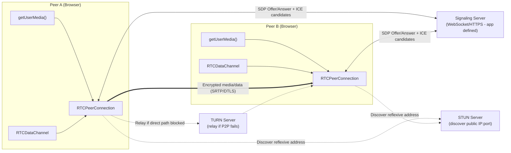
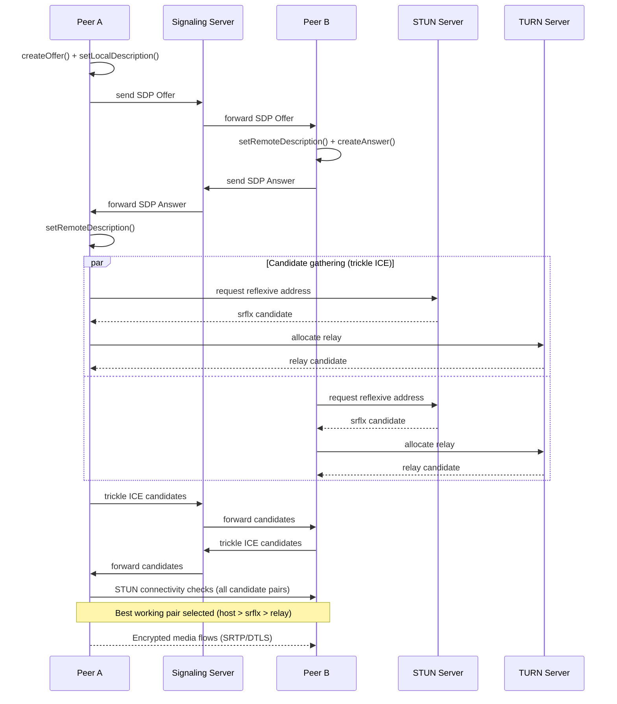
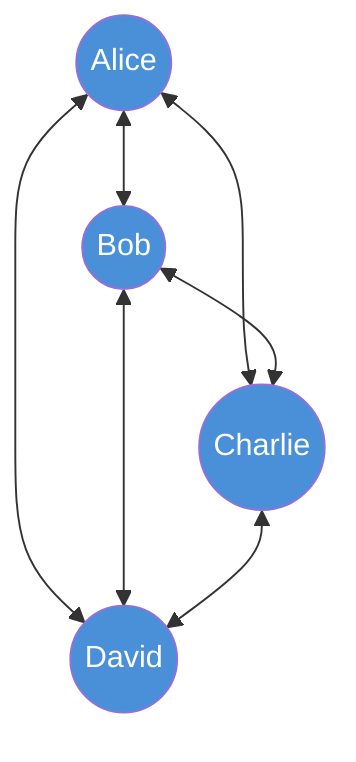
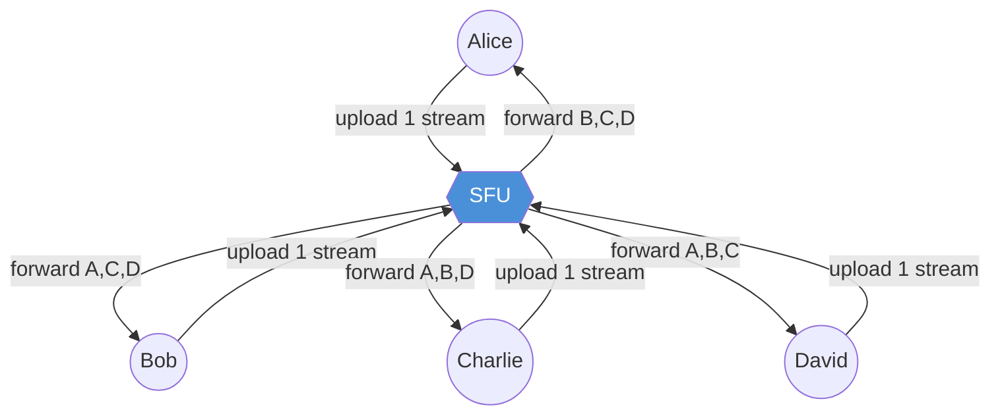
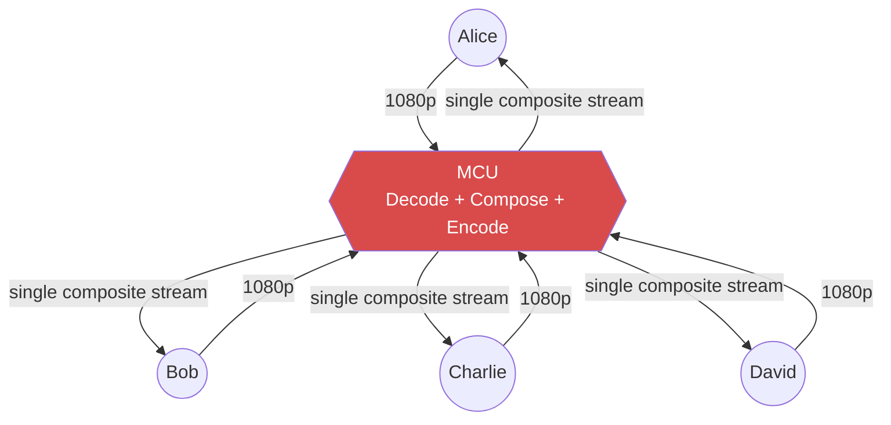

# WebRTC

## Blogs and websites


## Medium

- [WEBRTC: Free and Direct Data Transfer](https://blog.stackademic.com/webrtc-direct-data-transfer-c954c7335754)

## Youtube

- [WebRTC | Video Calling](https://www.youtube.com/playlist?list=PLinedj3B30sDxXVu4VXdFx678W2pJmORa)
- [System Design Behind Multi-Conference Video Calls - WebRTC vs SFU vs MCU](https://www.youtube.com/watch?v=Zaz6hYVm-WE)

## Theory

### Topics Covered

This page is organized into the following topics. Each topic includes a detailed explanation, its characteristics, components, patterns, pros/benefits, cons/challenges, best practices, when to use it, a real-life use case, a diagram, a Java code example, and interview questions with answers.

1. [What is WebRTC? (Core Concepts and Protocols)](#what-is-webrtc)
2. [Video Conferencing Architectures (Overview)](#video-conferencing-architectures)
3. [Signaling, SDP, and NAT Traversal (ICE, STUN, TURN)](#signaling-sdp-and-nat-traversal-ice-stun-turn)
4. [WebRTC (Peer-to-Peer Mesh)](#1-webrtc-peer-to-peer-mesh)
5. [SFU (Selective Forwarding Unit)](#2-sfu-selective-forwarding-unit)
6. [MCU (Multipoint Control Unit)](#3-mcu-multipoint-control-unit)
7. [Comparison: WebRTC vs SFU vs MCU](#comparison-webrtc-vs-sfu-vs-mcu)
8. [WebRTC: Characteristics, Pros, Cons, Use Cases, Components, Patterns, Benefits, Challenges, Best Practices and When to Use](#webrtc-characteristics-pros-cons-use-cases-components-patterns-benefits-challenges-best-practices-and-when-to-use)

### What is WebRTC?

**WebRTC (Web Real-Time Communication)** is an open-source technology that enables peer-to-peer audio, video, and data sharing between browsers and mobile applications without requiring plugins or intermediate servers. It was originally developed by Google (based on technology acquired from GIPS), open-sourced in 2011, and is now standardized jointly by the [W3C](https://www.w3.org/TR/webrtc/) (the JavaScript APIs) and the [IETF](https://www.rfc-editor.org/rfc/rfc8825) (the underlying network protocols). Because the standard is implemented natively in Chrome, Firefox, Safari, and Edge, two browsers can exchange audio, video, and arbitrary data with no plugin install and no proprietary client software.

At its core, WebRTC solves three hard problems that used to require expensive proprietary plugins (like Flash or Silverlight):

1. **Media capture**: Getting access to the camera/microphone via `getUserMedia()`/`getDisplayMedia()`.
2. **Real-time transport**: Sending audio/video/data with the lowest possible latency, using UDP-based transport (RTP/SRTP) instead of TCP, since retransmission of a "late" video frame is worse than dropping it.
3. **NAT/firewall traversal**: Establishing a direct connection between two devices that are both behind home routers/corporate firewalls, neither of which has a public, routable IP address.

**Key Features:**
- 🎥 **Real-time Audio/Video**: Live streaming between peers
- 📡 **Peer-to-Peer**: Direct communication without server relay
- 🔒 **Secure**: Encrypted by default (DTLS/SRTP)
- 🌐 **Browser Native**: Built into modern browsers
- 📱 **Cross-Platform**: Works on web, iOS, Android

**Common Use Cases:**
- Video conferencing (Zoom, Google Meet, Microsoft Teams)
- Live streaming
- Screen sharing
- File sharing
- Online gaming
- Telemedicine

#### What is WebRTC?: Characteristics

- **Real-time by design**: WebRTC targets sub-500ms (ideally sub-150ms) round-trip latency by using UDP-based media transport, adaptive jitter buffers, and codecs (Opus, VP8/VP9, H.264, AV1) tuned for live streaming rather than for maximum compression.
- **Peer-to-peer capable, not peer-to-peer only**: The name suggests pure P2P, but WebRTC is really a toolbox of APIs (media capture, transport, encryption, data channels) that can be wired into P2P mesh, SFU, or MCU topologies depending on the app's scale needs.
- **Encrypted by mandate, not by option**: Unlike older VoIP/RTSP stacks where encryption was optional, the WebRTC standard mandates DTLS for the key exchange and SRTP/SRTCP for media, so there is no "insecure mode" to accidentally ship.
- **Browser-native and plugin-free**: The `RTCPeerConnection`, `RTCDataChannel`, and `getUserMedia` APIs ship inside the browser engine itself, so there is no separate binary to install, update, or trust.
- **Adaptive under network stress**: Built-in congestion control (e.g., Google Congestion Control, or transport-cc) constantly measures available bandwidth and packet loss, and instructs the encoder to raise or lower bitrate/resolution/frame-rate in near real time.
- **Codec- and transport-agnostic data channels**: In addition to audio/video, WebRTC exposes `RTCDataChannel`, an SCTP-over-DTLS channel that can carry arbitrary binary/text data (game state, file chunks, chat) with configurable ordering and reliability, independent of the media pipeline.

#### What is WebRTC?: Components

- **`getUserMedia()` / `getDisplayMedia()`**: Browser APIs that prompt the user for camera/microphone/screen-share permission and return a `MediaStream` of live audio/video tracks.
- **`RTCPeerConnection`**: The central object that negotiates codecs, encrypts media, performs NAT traversal, and sends/receives the actual audio/video/data with the remote peer.
- **`RTCDataChannel`**: A generic, low-latency channel (built on SCTP over DTLS) for exchanging arbitrary application data alongside or instead of media.
- **Signaling channel (not standardized by WebRTC)**: An out-of-band mechanism (typically WebSocket, HTTPS, or another app-defined transport) used to exchange the SDP offers/answers and ICE candidates needed to set up the `RTCPeerConnection`. WebRTC deliberately leaves this to the application.
- **STUN/TURN servers**: Helper infrastructure used during connection setup to discover public IP/port mappings (STUN) or relay media when a direct path is impossible (TURN). Covered in detail in the Signaling/NAT Traversal topic below.
- **Media engine (encoder/decoder + jitter buffer)**: The internal browser subsystem that encodes captured frames (VP8/VP9/H.264/AV1, Opus), buffers incoming packets to smooth out network jitter, and decodes/renders them.

#### What is WebRTC?: Patterns

- **Direct P2P connection**: Two peers connect `RTCPeerConnection` objects directly to each other; suitable only for very small calls (see Peer-to-Peer Mesh topic below).
- **Media server relay (SFU/MCU)**: Peers connect to a media server instead of to each other, trading a small amount of latency for massive scalability (see SFU and MCU topics below).
- **Hybrid signaling + media split**: The signaling server (WebSocket/HTTP) is a completely separate service from the media path (P2P, SFU, or MCU); this separation lets teams scale/replace either independently.
- **Perfect negotiation pattern**: A standardized JavaScript pattern (recommended by the WebRTC working group) for handling renegotiation (e.g., adding/removing tracks mid-call) without race conditions between simultaneous offers from both sides.

#### What is WebRTC?: Pros / Benefits

- **No plugin, no install, instant reach**: Any modern browser can join a call by opening a URL, dramatically lowering user friction compared to native VoIP clients that require installation.
- **End-to-end encryption by default**: DTLS-SRTP is mandatory in the spec, so every WebRTC media stream is encrypted without extra developer effort.
- **Low latency, purpose-built for real-time**: The UDP-first transport and adaptive jitter buffering are tuned for "good enough now" rather than "perfect but late," which matches human perception of live conversation.
- **Free core infrastructure**: For small-scale/P2P use, there is no mandatory media server cost; only lightweight signaling and STUN/TURN infrastructure are needed.
- **Rich, actively maintained standard**: Backed by Google, Mozilla, Apple, Microsoft and the IETF/W3C, with continuous improvements (e.g., AV1 support, Insertable Streams for E2E encryption on top of SFUs).

#### What is WebRTC?: Cons / Challenges

- **No built-in scalability**: WebRTC by itself only defines a single peer connection; scaling to many participants requires bolting on an SFU/MCU architecture, which is non-trivial engineering.
- **NAT traversal complexity**: Real-world networks (corporate firewalls, symmetric NATs, mobile carrier-grade NAT) frequently block direct P2P connections, forcing a fallback to TURN relays that cost bandwidth and add latency.
- **Signaling is left to the developer**: The lack of a standardized signaling protocol means every application must design, secure, and scale its own signaling layer.
- **Browser/version fragmentation**: Even though WebRTC is standardized, subtle differences between browser implementations (especially around simulcast, codec preferences, and stats APIs) can cause interoperability bugs.
- **Debugging is hard**: Real-time UDP traffic, NAT traversal, and adaptive bitrate mean that issues are often intermittent, network-dependent, and hard to reproduce locally.

#### What is WebRTC?: Best Practices

- Always run your own or a managed STUN/TURN service (e.g., coturn) with authentication, and monitor the percentage of calls that fall back to TURN relay, since that indicates NAT traversal health.
- Use the "perfect negotiation" pattern in application code to avoid glare (both sides sending an offer at the same time) once you add mid-call renegotiation (e.g., screen-share toggle).
- Instrument `RTCPeerConnection.getStats()` (packet loss, jitter, round-trip time) from day one; real-time media issues are invisible without client-side telemetry.
- Pick your topology (P2P/SFU/MCU) based on maximum expected participant count and required features (recording, layouts), not on what is easiest to prototype first.
- Terminate TLS/DTLS certificates and rotate TURN credentials on a schedule; treat TURN servers as security-sensitive infrastructure since they relay user media.

#### What is WebRTC?: When to Use

- Building any browser-based or mobile real-time audio/video/data feature without requiring users to install a native app or plugin.
- Cases where end-to-end (or at least server-to-endpoint) encryption of live media is a hard requirement.
- Direct, low-latency data exchange between two clients (e.g., multiplayer game state) where a full backend round-trip would be too slow.
- Any product that needs to support both P2P (cheap, private, 1:1) and scaled group communication (SFU/MCU) by reusing the same underlying media APIs.

#### What is WebRTC?: Diagram



#### What is WebRTC?: Real-Life Use Case

A telemedicine startup builds a 1:1 doctor-patient video consultation feature. Using WebRTC, the patient clicks a link (no app install), the browser requests camera/microphone permission via `getUserMedia()`, a lightweight signaling server (a small WebSocket service) exchanges SDP/ICE between the doctor's and patient's browsers, and in most cases (roughly 80-90%) a direct encrypted P2P connection is established through STUN alone. For the remaining calls where both parties are behind restrictive corporate/hotel Wi-Fi NATs, the connection automatically falls back to a TURN relay, at the cost of a little extra latency and bandwidth, but the call still connects. Because DTLS-SRTP encryption is mandatory, the platform can tell patients their consultation is end-to-end encrypted without writing any custom crypto code.

#### What is WebRTC?: Java Code Example

WebRTC's browser APIs are JavaScript-only, but production systems typically pair the browser client with a Java-based signaling server. The example below shows a minimal Java (Spring-agnostic, plain WebSocket) signaling relay that forwards SDP/ICE messages between exactly two connected peers, which is the server-side counterpart every WebRTC app needs regardless of language.

```java
import javax.websocket.*;
import javax.websocket.server.ServerEndpoint;
import java.util.concurrent.ConcurrentHashMap;
import java.util.Map;
import java.io.IOException;

// Minimal signaling relay: forwards SDP offers/answers and ICE candidates
// between exactly two peers in the same "room". WebRTC itself does not
// standardize this part, so the server is free to be this simple.
@ServerEndpoint("/signaling/{roomId}")
public class SignalingServer {

    // roomId -> the two sessions currently paired in that room
    private static final Map<String, Session[]> rooms = new ConcurrentHashMap<>();

    @OnOpen
    public void onOpen(Session session, @javax.websocket.server.PathParam("roomId") String roomId) {
        rooms.compute(roomId, (id, pair) -> {
            if (pair == null) {
                return new Session[]{session, null};
            }
            pair[1] = session; // second peer joins the room
            return pair;
        });
    }

    @OnMessage
    public void onMessage(String message, Session session, @javax.websocket.server.PathParam("roomId") String roomId) throws IOException {
        Session[] pair = rooms.get(roomId);
        if (pair == null) return;

        // Relay the raw SDP/ICE JSON payload to whichever peer did not send it.
        Session other = (pair[0] == session) ? pair[1] : pair[0];
        if (other != null && other.isOpen()) {
            other.getBasicRemote().sendText(message);
        }
    }

    @OnClose
    public void onClose(Session session, @javax.websocket.server.PathParam("roomId") String roomId) {
        rooms.computeIfPresent(roomId, (id, pair) -> {
            if (pair[0] == session) pair[0] = null;
            if (pair[1] == session) pair[1] = null;
            return (pair[0] == null && pair[1] == null) ? null : pair;
        });
    }
}
```

#### What is WebRTC?: Interview Questions and Answers

**Q1. Is WebRTC a protocol or an API?**
A: It is both: a set of JavaScript APIs (`RTCPeerConnection`, `RTCDataChannel`, `getUserMedia`) standardized by the W3C, backed by a collection of network protocols (ICE, STUN, TURN, DTLS, SRTP, SCTP) standardized by the IETF. WebRTC does not standardize signaling; that is left to the application.

**Q2. Why does WebRTC use UDP instead of TCP for media?**
A: Real-time audio/video tolerates occasional packet loss far better than added latency. TCP's retransmission and head-of-line blocking would delay an entire stream waiting for one lost packet, which is worse for a live call than simply dropping and concealing that one frame. UDP (via RTP/SRTP) lets WebRTC skip lost packets and keep playing back in real time.

**Q3. Why is signaling not part of the WebRTC standard?**
A: Signaling requirements (authentication, room management, presence, chat) vary hugely between applications, so the WebRTC working group deliberately left the signaling transport and protocol undefined, letting each application reuse its existing backend (WebSocket, HTTP long-polling, even SMS) to exchange SDP/ICE payloads.

**Q4. What happens if a WebRTC connection cannot be established directly?**
A: The ICE agent tries, in order of preference, a direct host-to-host path, a STUN-discovered public "server reflexive" path, and finally a TURN relayed path. If even TURN fails (rare, e.g., TURN server down or blocked), the connection attempt fails and the application should show an error/retry state.

**Q5. How does WebRTC secure media by default?**
A: Every session performs a DTLS handshake to derive per-session encryption keys, which are then used to run SRTP (Secure RTP) and SRTCP for the actual audio/video/data payloads. Because this is baked into the standard, there is no way to negotiate down to unencrypted media between compliant implementations.

### Video Conferencing Architectures

When building multi-user video conferencing applications, there are three main architectural approaches:

1. **WebRTC (Peer-to-Peer Mesh)**
2. **SFU (Selective Forwarding Unit)**
3. **MCU (Multipoint Control Unit)**

Each has different trade-offs in terms of scalability, bandwidth, CPU usage, and quality.

---

### Signaling, SDP, and NAT Traversal (ICE, STUN, TURN)

Before any media flows in WebRTC (whether P2P, SFU, or MCU), two things must happen: the two sides must **agree on capabilities** (codecs, resolutions, encryption keys) via **signaling**, and they must **find a network path** to each other via **ICE**. This topic explains both mechanisms in depth since they underpin every architecture discussed later on this page.

**Signaling** is the out-of-band exchange of connection metadata, described using **SDP (Session Description Protocol)**, a plain-text format listing supported codecs, media types, and network candidates. WebRTC intentionally does not define how SDP is transported. Most apps use a WebSocket-based signaling server, but HTTP polling, MQTT, or even manually pasted text (for a quick demo) all work.

**NAT traversal** is required because almost every device sits behind a NAT/firewall with a private IP address and no way for the outside world to open a connection to it directly. WebRTC solves this using the **ICE (Interactive Connectivity Establishment)** framework, which gathers a list of possible network paths ("candidates") of three kinds:

1. **Host candidate**: The device's own local IP address (works only on the same LAN).
2. **Server-reflexive candidate**: The device's public IP:port as seen from outside its NAT, discovered by asking a **STUN** server "what does my traffic look like to you?"
3. **Relayed candidate**: A public IP:port on a **TURN** server that will relay all media if no direct path is possible (e.g., symmetric NAT on both sides, or a firewall that blocks all direct UDP).

```
┌──────────────────────────────────────────────────────────────┐
│                 SDP Offer/Answer + ICE Flow                   │
└──────────────────────────────────────────────────────────────┘

PEER A                    SIGNALING SERVER                  PEER B
──────                    ─────────────────                 ──────

createOffer()
  │
  ▼
setLocalDescription(offer)
  │
  │──── SDP Offer ─────────▶│
  │                          │──── SDP Offer ─────────▶│
  │                          │                          ▼
  │                          │              setRemoteDescription(offer)
  │                          │              createAnswer()
  │                          │              setLocalDescription(answer)
  │                          │◀──── SDP Answer ─────────│
  │◀──── SDP Answer ─────────│
  ▼
setRemoteDescription(answer)

Meanwhile, both sides gather ICE candidates in parallel:

  Peer A                                          Peer B
  ├─ Host candidate (192.168.1.5:54321)            ├─ Host candidate (192.168.1.9:54322)
  ├─ Ask STUN: "what's my public address?"         ├─ Ask STUN: "what's my public address?"
  │    ◀── srflx 203.0.113.10:60001 ──             │    ◀── srflx 203.0.113.20:60002 ──
  └─ Ask TURN: "reserve a relay for me"            └─ Ask TURN: "reserve a relay for me"
       ◀── relay 198.51.100.5:50000 ──                  ◀── relay 198.51.100.5:50001 ──

  Each candidate is sent to the other side via the signaling server
  as soon as it is discovered (trickle ICE).

ICE CONNECTIVITY CHECKS:
────────────────────────
  Peer A tries every local candidate against every remote candidate,
  in priority order (host > srflx > relay), and picks the first pair
  that successfully exchanges a STUN binding request/response:

  1. host ↔ host      → works only if on same LAN/VPN
  2. host ↔ srflx     → works if only one side is behind NAT
  3. srflx ↔ srflx    → works for most home/office NATs (~70-90% of calls)
  4. relay ↔ relay    → last resort, all media routed through TURN (~10-20% of calls)
```

#### Signaling & NAT Traversal: Characteristics

- **Two independent problems solved together**: Signaling answers "what do we want to talk about" (codecs, media types), while ICE answers "how do we physically reach each other." Both must complete before media flows.
- **Trickle ICE for speed**: Rather than waiting to gather all candidates before sending any, modern implementations send each ICE candidate to the remote peer as soon as it is discovered, cutting connection setup time roughly in half.
- **Priority-ordered candidate pairing**: ICE always prefers the cheapest, lowest-latency path (direct host connection) and only falls back to STUN-assisted or TURN-relayed paths when necessary.
- **Renegotiable mid-call**: SDP offer/answer can be re-run mid-call (e.g., adding a screen-share track), which is why the "perfect negotiation" pattern exists to avoid both sides offering simultaneously.
- **STUN is lightweight, TURN is expensive**: A STUN server just answers "what's your public address," a stateless, near-free operation. A TURN server must relay every byte of every stream, which costs real bandwidth and compute, similar to running a mini SFU.

#### Signaling & NAT Traversal: Components

- **SDP (Session Description Protocol)**: The text-based format describing media lines (`m=audio`, `m=video`), codecs, and ICE credentials/candidates exchanged in the offer/answer.
- **Signaling server**: An application-defined service (commonly WebSocket-based) that relays SDP and ICE candidate messages between peers; also typically handles room/user presence and authentication.
- **STUN server (RFC 5389/8489)**: A simple, stateless server that tells a client its public IP:port as observed from the internet, letting the client discover its "server-reflexive" address behind a NAT.
- **TURN server (RFC 5766/8656)**: A STUN superset that also relays actual media traffic when a direct or STUN-assisted path is impossible; requires authentication (typically time-limited username/password) because it consumes real bandwidth.
- **ICE agent**: The browser-internal component that gathers candidates, exchanges connectivity checks (STUN binding requests) with the remote ICE agent, and selects the best working candidate pair.

#### Signaling & NAT Traversal: Patterns

- **Trickle ICE**: Send candidates incrementally as they're discovered instead of batching them, reducing perceived connection time.
- **ICE restart**: If a network change occurs mid-call (e.g., Wi-Fi to cellular handoff), the application triggers a fresh ICE negotiation without tearing down the whole `RTCPeerConnection` or losing the ongoing call state.
- **TURN over TCP/TLS (port 443) fallback**: When UDP is entirely blocked by a restrictive firewall, TURN can tunnel over TCP or TLS on port 443 to masquerade as regular HTTPS traffic, maximizing connectivity at the cost of higher latency.
- **Time-limited TURN credentials (REST API, RFC draft)**: Instead of static TURN passwords, servers issue short-lived HMAC-based credentials per session, preventing credential leakage/abuse.

#### Signaling & NAT Traversal: Pros / Benefits

- **Works across almost any network topology**: The three-tier candidate strategy (host, srflx, relay) means a connection can usually be established even through restrictive corporate NATs, as long as a TURN relay is available.
- **Signaling flexibility**: Because the transport isn't mandated, teams can reuse existing authenticated backend infrastructure (e.g., an existing WebSocket gateway) instead of adopting a new protocol.
- **Fast reconnection**: ICE restart lets an ongoing call survive a network change (e.g., switching from Wi-Fi to mobile data) without the user perceiving a dropped call.
- **Security built in**: STUN/TURN exchanges are authenticated and ICE itself validates connectivity via STUN binding requests, preventing arbitrary third parties from injecting traffic into an active session.

#### Signaling & NAT Traversal: Cons / Challenges

- **Operational burden of running TURN**: Unlike STUN (cheap, stateless), TURN servers must be provisioned for peak relay bandwidth, since every relayed call consumes real server bandwidth for its full duration.
- **Connection setup latency**: Gathering candidates, running STUN checks, and possibly negotiating TURN allocation adds a few hundred milliseconds to a few seconds of "connecting..." time before media starts flowing.
- **Symmetric NAT and carrier-grade NAT (CGNAT)**: Some networks (notably many mobile carriers) use symmetric NAT, which defeats STUN's ability to predict a usable port, forcing a TURN relay even for otherwise simple calls.
- **No visibility for the app developer by default**: Diagnosing "why didn't this call connect" often requires digging into low-level `RTCPeerConnection.getStats()` ICE candidate pair data, which is verbose and easy to misread.

#### Signaling & NAT Traversal: Best Practices

- Always deploy at least one TURN server (managed, e.g., Twilio/Xirsys, or self-hosted with coturn) in addition to STUN; assuming STUN alone is enough will strand 10-20% of real-world users behind symmetric/CGNAT networks.
- Enable trickle ICE and implement ICE restart to gracefully handle Wi-Fi/cellular handoffs instead of dropping the call.
- Serve TURN over both UDP and TCP/TLS(443) so that calls can still connect from networks that block arbitrary UDP ports.
- Use short-lived, per-session TURN credentials (time-limited HMAC) rather than static shared secrets baked into client code.
- Log ICE candidate-pair selection and TURN relay usage percentage as a core reliability metric; a spike in relay usage often signals a network or infrastructure regression.

#### Signaling & NAT Traversal: When to Use

- Every WebRTC deployment needs this layer; it is not optional; there is no way to establish an `RTCPeerConnection` without signaling and ICE.
- Prioritize investing in robust TURN infrastructure specifically for enterprise/B2B products, since corporate firewalls disproportionately block direct/STUN paths.
- Invest in ICE restart handling specifically for mobile apps, where network handoffs (Wi-Fi ↔ cellular) are common mid-call.

#### Signaling & NAT Traversal: Diagram



#### Signaling & NAT Traversal: Real-Life Use Case

A remote-work collaboration tool serves both home users and large enterprise customers. Home users, typically behind simple consumer NATs, connect directly after a STUN-discovered server-reflexive candidate succeeds, so media never touches company infrastructure. Enterprise customers behind strict corporate firewalls that block all unsolicited inbound UDP fail every direct/STUN candidate pair; the ICE agent falls back to a TURN relay running on port 443 (disguised as HTTPS), letting the call connect anyway. The product team tracks "percent of sessions using TURN relay" as a KPI: a sudden jump indicates a new customer's firewall policy or a TURN outage, prompting immediate investigation.

#### Signaling & NAT Traversal: Java Code Example

Real STUN/TURN servers are typically off-the-shelf software (e.g., coturn), but the snippet below shows a minimal Java client-side helper that builds the `iceServers` configuration list an app would hand to its `RTCConfiguration` equivalent, plus a simple TURN time-limited credential generator (per RFC draft `REST API For Access To TURN Services`) that a Java backend can expose to clients.

```java
import javax.crypto.Mac;
import javax.crypto.spec.SecretKeySpec;
import java.util.Base64;
import java.util.List;

// Generates short-lived TURN credentials (username = expiry timestamp + user id,
// password = HMAC-SHA1 of username using the shared TURN secret), following the
// widely-adopted "REST API for TURN" convention so passwords are never stored client-side.
public class TurnCredentialGenerator {

    private final String sharedSecret;

    public TurnCredentialGenerator(String sharedSecret) {
        this.sharedSecret = sharedSecret;
    }

    public record TurnCredential(String username, String password, List<String> urls) {}

    public TurnCredential generate(String userId, long ttlSeconds) throws Exception {
        long expiry = (System.currentTimeMillis() / 1000L) + ttlSeconds;
        String username = expiry + ":" + userId;

        Mac mac = Mac.getInstance("HmacSHA1");
        mac.init(new SecretKeySpec(sharedSecret.getBytes(), "HmacSHA1"));
        String password = Base64.getEncoder().encodeToString(mac.doFinal(username.getBytes()));

        return new TurnCredential(username, password, List.of(
                "stun:turn.example.com:3478",
                "turn:turn.example.com:3478?transport=udp",
                "turns:turn.example.com:5349?transport=tcp" // TURN over TLS, for restrictive firewalls
        ));
    }

    public static void main(String[] args) throws Exception {
        TurnCredentialGenerator generator = new TurnCredentialGenerator("shared-secret-from-turn-server-config");
        TurnCredential credential = generator.generate("user-42", 600); // valid for 10 minutes
        System.out.println("username=" + credential.username());
        System.out.println("password=" + credential.password());
        System.out.println("urls=" + credential.urls());
    }
}
```

#### Signaling & NAT Traversal: Interview Questions and Answers

**Q1. What is the difference between STUN and TURN?**
A: STUN only tells a client its public-facing IP:port so it can attempt a direct connection; it never carries media. TURN, when a direct or STUN-assisted path is impossible, actively relays every packet of media between the two peers, consuming real server bandwidth for the whole call.

**Q2. What is SDP and what does it contain?**
A: Session Description Protocol is a plain-text format describing a proposed media session: which media types are offered (audio/video/data), which codecs are supported and in what preference order, and the ICE username fragment/password and candidates needed to attempt connectivity. It does not itself carry media, only the metadata needed to set it up.

**Q3. Why can't two devices behind NAT just connect to each other directly without any of this?**
A: A NAT device only allows inbound packets that correspond to a connection the internal host itself initiated outbound; it has no public listener for arbitrary inbound connections. Without STUN (to learn the externally visible address/port the NAT assigned) the two peers do not even know what address to try, and even with that address, some NAT types (symmetric NAT) still block the connection, requiring a TURN relay.

**Q4. What is trickle ICE and why does it matter?**
A: Instead of waiting for all ICE candidates to be gathered (which can take seconds, especially with a slow TURN allocation) before sending any to the remote peer, trickle ICE sends each candidate as soon as it's discovered. This lets connectivity checks start earlier, often cutting call setup time in half.

**Q5. Why is TURN considered expensive compared to STUN?**
A: STUN performs one lightweight request/response and is done; it does not touch ongoing media. TURN, once selected as the relay path, forwards every single audio/video/data packet for the entire call duration, which is functionally similar to running a mini SFU, so it requires provisioning real bandwidth and compute proportional to call volume.

---

### 1. WebRTC (Peer-to-Peer Mesh)

#### Description

In a **peer-to-peer (P2P) mesh** architecture, each participant establishes direct connections with every other participant in the call. Every user sends their media streams to all other users and receives streams from all other users.

```
┌─────────────────────────────────────────────────────────────┐
│           WebRTC Peer-to-Peer Mesh Architecture             │
└─────────────────────────────────────────────────────────────┘

2 PARTICIPANTS (Simple - Works Well):
─────────────────────────────────────

     ┌────────────┐
     │   Alice    │
     │  (Browser) │
     └─────┬──────┘
           │
           │ Direct P2P Connection
           │ • Video stream
           │ • Audio stream
           │
     ┌─────▼──────┐
     │    Bob     │
     │  (Browser) │
     └────────────┘

Connections: 1
Bandwidth per user: 1 upload + 1 download


4 PARTICIPANTS (Still Manageable):
───────────────────────────────────

            ┌────────────┐
            │   Alice    │
            └──┬───┬───┬─┘
               │   │   │
       ┌───────┘   │   └────────┐
       │           │            │
   ┌───▼────┐  ┌──▼─────┐  ┌───▼────┐
   │  Bob   │  │ Charlie│  │  David │
   └───┬────┘  └──┬─────┘  └───┬────┘
       │          │            │
       └──────────┼────────────┘
                  │
          All connected to all

Total Connections: 6 (n × (n-1) / 2)
Each user maintains: 3 connections

Alice uploads to: Bob, Charlie, David (3 streams)
Alice downloads from: Bob, Charlie, David (3 streams)


10 PARTICIPANTS (Problem - Doesn't Scale!):
────────────────────────────────────────────

         ┌──────┐
         │  U1  │
         └─┬─┬─┬┘
       ┌───┘ │ └────┐
    ┌──▼──┐┌─▼──┐┌──▼──┐
    │ U2  ││ U3 ││ U4  │
    └──┬──┘└─┬──┘└──┬──┘
    ┌──▼──┐┌─▼──┐┌──▼──┐
    │ U5  ││ U6 ││ U7  │
    └──┬──┘└─┬──┘└──┬──┘
    ┌──▼──┐┌─▼──┐┌──▼──┐
    │ U8  ││ U9 ││ U10 │
    └─────┘└────┘└─────┘

Total Connections: 45 (10 × 9 / 2)
Each user maintains: 9 connections
Each user uploads: 9 streams
Each user downloads: 9 streams

❌ Network Overload!
❌ CPU Overload (encoding 9 times)!
❌ Bandwidth Explosion!

BANDWIDTH CALCULATION (10 users):
─────────────────────────────────
Assume each video stream: 2 Mbps

Per User Upload: 9 streams × 2 Mbps = 18 Mbps
Per User Download: 9 streams × 2 Mbps = 18 Mbps
Total per user: 36 Mbps

Most home internet:
• Upload: 5-10 Mbps ❌ NOT ENOUGH!
• Download: 50-100 Mbps ✓ OK

Result: Call fails due to insufficient upload bandwidth
```

#### How It Works

```
┌─────────────────────────────────────────────────────────────┐
│              WebRTC P2P Connection Flow                      │
└─────────────────────────────────────────────────────────────┘

PEER A                                              PEER B
──────                                              ──────

1. Signaling (Exchange connection info)
───────────────────────────────────────
│                                                     │
│  Create Offer (SDP)                                 │
│  - Media capabilities                               │
│  - ICE candidates (network paths)                   │
│                                                     │
│         ──────▶ Signaling Server ──────▶            │
│                                                     │
│                                         Create Answer (SDP)
│                                         - Media capabilities
│                                         - ICE candidates
│                                                     │
│         ◀────── Signaling Server ◀──────            │
│                                                     │

2. ICE (Interactive Connectivity Establishment)
───────────────────────────────────────────────
│  Find best network path:                            │
│  1. Direct connection (if possible)                 │
│  2. STUN server (NAT traversal)                     │
│  3. TURN server (relay if needed)                   │
│                                                     │
│ ◀────────── Try Connection Paths ──────────────▶    │
│                                                     │

3. Direct P2P Connection Established
────────────────────────────────────
│                                                     │
│ ◀══════════ Audio/Video Stream ═══════════════▶     │
│                 (Encrypted)                         │
│                                                     │

Media Encoding/Decoding:
──────────────────────
│  Camera → Encode → Send                             │
│           (VP8/H.264)                               │
│                                         Receive → Decode → Display
│                                         (VP8/H.264)
```

#### Advantages

```
✅ BENEFITS:
───────────

1. NO SERVER COSTS
   • Direct peer-to-peer
   • No media server infrastructure
   • Minimal hosting expenses

2. LOW LATENCY
   • Direct connection
   • No intermediate hops
   • Best for 1-on-1 calls
   • Typical latency: 20-50ms

3. PRIVACY
   • Data doesn't pass through servers
   • End-to-end encryption
   • Private conversations

4. SIMPLE ARCHITECTURE
   • Easy to implement for small scale
   • No complex server infrastructure
   • Built-in browser support

5. HIGH QUALITY
   • Direct stream, no transcoding
   • Original quality maintained
   • No quality degradation from server processing
```

#### Disadvantages

```
❌ LIMITATIONS:
──────────────

1. DOESN'T SCALE
   • Exponential connection growth: O(n²)
   • 2 users: 1 connection ✓
   • 4 users: 6 connections ⚠️
   • 10 users: 45 connections ❌
   • 50 users: 1,225 connections ❌❌❌

2. BANDWIDTH EXPLOSION
   • Each user uploads N-1 streams
   • 10-person call: Upload 18 Mbps
   • Exceeds typical home upload (5-10 Mbps)
   • Mobile devices: Even worse

3. CPU OVERLOAD
   • Must encode video N-1 times
   • Browser struggles with >4 encoders
   • Drains battery on mobile
   • Fan noise on laptops

4. INCONSISTENT QUALITY
   • Limited by weakest peer's connection
   • One poor connection affects everyone
   • Can't adapt streams per recipient

5. NAT/FIREWALL ISSUES
   • Requires STUN/TURN servers
   • Corporate firewalls may block
   • 10-20% of connections need TURN relay
   • TURN relay = not truly P2P anymore

MAXIMUM PRACTICAL PARTICIPANTS:
───────────────────────────────
Desktop: 4-6 participants
Mobile: 2-3 participants
Recommended: 1-on-1 calls only
```

#### Use Cases

```
✅ IDEAL FOR:
────────────
• 1-on-1 video calls
• Voice calls (1-on-1)
• File sharing between two users
• Gaming (2 players)
• Simple video chat apps

❌ NOT SUITABLE FOR:
───────────────────
• Group video conferences (>4 people)
• Webinars
• Live streaming to many viewers
• Enterprise video meetings
```

#### Peer-to-Peer Mesh: Detailed Explanation of Advantages, Disadvantages and Use Cases

- **No server costs, explained**: Because media never touches a third-party server (only signaling does, and signaling traffic is tiny text), there is no per-minute or per-GB media-relay bill; the only recurring cost is the lightweight signaling service and occasional STUN/TURN usage.
- **Low latency, explained**: With no intermediate hop decoding/re-encoding or forwarding the stream, the only delay is the physical network path between the two devices, typically 20-50ms on a good connection, which is imperceptible in conversation.
- **Privacy, explained**: Since the media payload is encrypted (DTLS-SRTP) and travels directly between the two endpoints, the operator of the signaling server can see *that* a call happened but never *what* was said or shown, an important property for privacy-sensitive apps.
- **Simple architecture, explained**: A single `RTCPeerConnection` per pair of users, no media server to provision, deploy, or scale, means a small team can ship a working 1:1 video feature in days rather than the weeks needed to stand up an SFU cluster.
- **High quality, explained**: Because the stream is forwarded (in the loose sense of "sent directly") rather than decoded and re-encoded by a server, there is zero transcoding quality loss; what the camera captures (after network-adaptive bitrate) is what the peer sees.
- **Doesn't scale, explained**: The number of connections grows as $\binom{n}{2} = \frac{n(n-1)}{2}$, so participant count and required connections/bandwidth grow non-linearly; this is a mathematical property of the mesh topology, not an implementation detail that can be optimized away.
- **Bandwidth explosion, explained**: Consumer upload bandwidth (5-10 Mbps typical) is shared across every peer connection; because each additional participant adds another full-quality upload stream, the mesh runs out of usable upload bandwidth well before it runs out of CPU.
- **CPU overload, explained**: Modern video encoders (VP8/H.264) are optimized for encoding once; asking the browser to run N-1 simultaneous encoder instances (one per peer, since each peer may need a different bitrate) multiplies CPU and battery cost roughly linearly with participant count.
- **Inconsistent quality, explained**: Because every peer sends directly to every other peer, a participant with a poor 1 Mbps uplink caps what everyone downloading from them can receive; there is no server in the middle to compensate by re-encoding at a lower rate for just that one recipient.
- **NAT/firewall issues, explained**: Roughly 10-20% of real-world connections cannot find a direct or STUN-assisted path and must fall back to a TURN relay; at that point the "peer-to-peer" call is actually being relayed through a server, eliminating the zero-server-cost and lowest-latency advantages for those specific calls.

#### Peer-to-Peer Mesh: Diagram



The 4-participant mesh above requires $\binom{4}{2} = 6$ direct connections; each additional participant adds $n-1$ new connections, which is why mesh topologies are only practical for very small groups.

#### Peer-to-Peer Mesh: Real-Life Use Case

A dating app implements 1:1 video "meet before you match" calls. Since calls are always exactly two participants and privacy is a major selling point, the team chooses pure P2P mesh: no media ever touches company servers, keeping infrastructure cost near zero and letting the company advertise that conversations are never seen by anyone but the two participants. When one user is on a restrictive corporate guest Wi-Fi network, the call automatically falls back to a TURN relay for that session only, and the product simply accepts the small added cost for that minority of calls rather than building a media server for every call.

#### Peer-to-Peer Mesh: Java Code Example

```java
import java.util.HashMap;
import java.util.Map;

// Models the O(n^2) connection growth of a P2P mesh so capacity planners
// can see exactly when bandwidth/CPU limits will be exceeded for a given call size.
public class MeshCapacityCalculator {

    private static final double STREAM_BITRATE_MBPS = 2.0;
    private static final double TYPICAL_HOME_UPLOAD_MBPS = 8.0;

    public record MeshLoad(int participants, int totalConnections, double perUserUploadMbps, boolean feasible) {}

    public MeshLoad calculate(int participants) {
        int totalConnections = participants * (participants - 1) / 2;
        double perUserUploadMbps = (participants - 1) * STREAM_BITRATE_MBPS;
        boolean feasible = perUserUploadMbps <= TYPICAL_HOME_UPLOAD_MBPS;
        return new MeshLoad(participants, totalConnections, perUserUploadMbps, feasible);
    }

    public static void main(String[] args) {
        MeshCapacityCalculator calculator = new MeshCapacityCalculator();
        Map<Integer, MeshLoad> results = new HashMap<>();
        for (int n : new int[]{2, 4, 6, 10}) {
            results.put(n, calculator.calculate(n));
        }
        results.forEach((n, load) -> System.out.printf(
                "participants=%d connections=%d perUserUpload=%.1fMbps feasible=%b%n",
                load.participants(), load.totalConnections(), load.perUserUploadMbps(), load.feasible()));
        // Output shows feasible=true for n=2,4 and feasible=false for n=6,10,
        // proving mesh becomes impractical once per-user upload exceeds home bandwidth.
    }
}
```

#### Peer-to-Peer Mesh: Interview Questions and Answers

**Q1. Why does a P2P mesh call quality degrade so quickly as participants are added?**
A: Connections grow as $n(n-1)/2$ and, more importantly, each participant must simultaneously encode and upload N-1 separate streams. Consumer upload bandwidth (typically 5-10 Mbps) and browser encoder capacity are both consumed linearly per additional participant, so a 4-5 person call is often already the practical ceiling on typical home connections.

**Q2. If P2P mesh doesn't scale, why do WhatsApp and FaceTime use it for small groups?**
A: For very small groups (WhatsApp caps at 8, FaceTime uses pure P2P only for 1:1 and switches to its own SFU-like service for 3+), the connection count and bandwidth cost are still small enough to be practical, and the privacy/cost benefits of avoiding a media server outweigh the modest scaling limitation at that size.

**Q3. What is the actual failure mode when a P2P mesh call exceeds practical capacity?**
A: It is usually not a hard connection failure; it manifests as degraded quality, video freezing, dropped frames, and audio glitches because upload bandwidth or CPU cannot keep up with encoding/sending N-1 simultaneous streams, rather than the call rejecting the additional participant outright.

**Q4. How would you decide the maximum group size to allow in a P2P mesh product?**
A: Test on typical target-user upload bandwidth (e.g., 5 Mbps) and typical target-device CPU (e.g., a mid-range phone), measure the point where per-user upload exceeds available bandwidth or CPU cannot encode fast enough, and set the maximum participant count with margin below that measured threshold, commonly landing on 4-6 as this section shows.

**Q5. Does a P2P mesh eliminate the need for any server infrastructure?**
A: No; a signaling server is still required to exchange SDP/ICE, and STUN/TURN infrastructure is still required for NAT traversal. "Serverless" in this context refers only to the media path, not the full system.

---

### 2. SFU (Selective Forwarding Unit)

#### Description

An **SFU** is a media server that receives video/audio streams from each participant and selectively forwards them to other participants. Unlike P2P, each client only sends one stream to the SFU, which then distributes it to others.

**Key Concept:** The SFU forwards media streams without decoding or re-encoding them.

```
┌─────────────────────────────────────────────────────────────┐
│           SFU (Selective Forwarding Unit) Architecture       │
└─────────────────────────────────────────────────────────────┘

4 PARTICIPANTS WITH SFU:
────────────────────────

     ┌────────────┐
     │   Alice    │
     └─────┬──────┘
           │ Upload: 1 stream (2 Mbps)
           │ Download: 3 streams (6 Mbps)
           ▼
     ╔═════════════════╗
     ║      SFU        ║
     ║  Media Router   ║
     ║                 ║
     ║  Forwards:      ║
     ║  • Alice → B,C,D║
     ║  • Bob → A,C,D  ║
     ║  • Charlie→A,B,D║
     ║  • David → A,B,C║
     ╚═══╦═══╦═══╦═════╝
         ║   ║   ║
    ┌────╨┐ ┌╨───┐ ┌╨────┐
    │ Bob │ │Char││David│
    └─────┘ └────┘ └─────┘

Each User:
• Uploads: 1 stream
• Downloads: N-1 streams
• Total connections: 1 (to SFU)


10 PARTICIPANTS WITH SFU (Scales Well!):
─────────────────────────────────────────

U1  U2  U3  U4  U5  U6  U7  U8  U9  U10
 │   │   │   │   │   │   │   │   │   │
 └───┴───┴───┴───┼───┴───┴───┴───┴───┘
                 │
                 ▼
         ╔═══════════════╗
         ║      SFU      ║
         ║               ║
         ║   Forwards    ║
         ║   streams     ║
         ║   to all      ║
         ╚═══════════════╝
                 │
     ┌───────────┼───────────┐
     │           │           │
     ▼           ▼           ▼
   Each user receives 9 streams

Per User Bandwidth:
• Upload: 1 stream = 2 Mbps ✓
• Download: 9 streams = 18 Mbps ✓

Server Bandwidth:
• Receives: 10 streams = 20 Mbps
• Sends: 90 streams = 180 Mbps
(Each of 10 streams sent to 9 participants)


100 PARTICIPANTS WITH SFU (With Optimizations):
────────────────────────────────────────────────

                ╔═══════════════╗
                ║      SFU      ║
                ║               ║
                ║  Simulcast:   ║
                ║  • HD: 2 Mbps ║
                ║  • SD: 500Kbps║
                ║  • Low:200Kbps║
                ║               ║
                ║  Smart Logic: ║
                ║  • Active speaker: HD
                ║  • Others: Low quality
                ╚═══════════════╝

Per User Bandwidth (optimized):
• Upload: 1 stream (multi-quality)
• Download: Active + thumbnails
  = 2 Mbps (active) + 10×200Kbps (thumbnails)
  = 4 Mbps total ✓

✅ Scales to 100+ participants!
```

#### How It Works

```
┌─────────────────────────────────────────────────────────────┐
│                SFU Processing Flow                           │
└─────────────────────────────────────────────────────────────┘

PARTICIPANT                 SFU                    PARTICIPANTS
───────────                ─────                   ────────────

Alice sends stream:
┌────────────┐
│  Camera    │
│    ↓       │
│  Encode    │ 1080p
│  (H.264)   │ 2 Mbps
└─────┬──────┘
      │
      │ Upload 1 stream
      ▼
    ╔═══════════════════════════════╗
    ║           SFU                 ║
    ║                               ║
    ║  1. RECEIVE stream from Alice ║
    ║     (encrypted)               ║
    ║         ↓                     ║
    ║  2. FORWARD without changes   ║
    ║     (no decoding/encoding)    ║
    ║         ↓                     ║
    ║  3. ROUTE to recipients       ║
    ║     • Bob                     ║
    ║     • Charlie                 ║
    ║     • David                   ║
    ║                               ║
    ║  ⚡ Low CPU (no transcoding)  ║
    ║  ⚡ Low latency (<50ms)       ║
    ╚═══════════════════════════════╝
            │       │       │
            │       │       │
    ┌───────▼┐  ┌──▼────┐  ┌▼──────┐
    │  Bob   │  │Charlie│  │ David │
    │        │  │       │  │       │
    │ Decode │  │Decode │  │Decode │
    │Display │  │Display│  │Display│
    └────────┘  └───────┘  └───────┘

SIMULCAST (Multi-quality streaming):
────────────────────────────────────

Alice's browser encodes SAME video at 3 qualities:

Camera Feed
    ↓
┌──────────────────────┐
│  Encoder 1: 1080p    │ 2 Mbps (high)
│  Encoder 2: 720p     │ 1 Mbps (medium)
│  Encoder 3: 360p     │ 300 Kbps (low)
└──────────┬───────────┘
           │ All 3 sent to SFU
           ▼
    ╔═══════════════════════════════╗
    ║           SFU                 ║
    ║                               ║
    ║  Smart Routing:               ║
    ║                               ║
    ║  Bob (good connection):       ║
    ║    → Send 1080p               ║
    ║                               ║
    ║  Charlie (medium):            ║
    ║    → Send 720p                ║
    ║                               ║
    ║  David (poor/mobile):         ║
    ║    → Send 360p                ║
    ╚═══════════════════════════════╝

BANDWIDTH ADAPTATION:
─────────────────────

SFU monitors each recipient's connection:

┌────────────────────────────────────┐
│ Bob's Connection                   │
│ ├─ Bandwidth: 10 Mbps ✓           │
│ ├─ Packet loss: 0.1% ✓            │
│ └─ Latency: 30ms ✓                │
│                                    │
│ Decision: Send HD quality          │
└────────────────────────────────────┘

┌────────────────────────────────────┐
│ David's Connection                 │
│ ├─ Bandwidth: 1 Mbps ⚠️            │
│ ├─ Packet loss: 5% ⚠️              │
│ └─ Latency: 150ms ⚠️               │
│                                    │
│ Decision: Send Low quality         │
│ (Better to have choppy low-res     │
│  than frozen high-res)             │
└────────────────────────────────────┘
```

#### Advantages

```
✅ BENEFITS:
───────────

1. EXCELLENT SCALABILITY
   • Handles 100+ participants
   • Linear bandwidth growth for clients
   • Each user: 1 upload, N downloads
   • No exponential connection growth

2. EFFICIENT BANDWIDTH
   • Clients upload only 1 stream
   • 10-person call: 2 Mbps upload (vs 18 Mbps in P2P)
   • Works on typical home internet
   • Mobile-friendly

3. LOW CLIENT CPU
   • Encode once, SFU distributes
   • No need to encode multiple times
   • Better battery life
   • Works on low-end devices

4. ADAPTIVE QUALITY (Simulcast)
   • Send different quality to each user
   • High quality for good connections
   • Low quality for poor connections
   • Each user gets best possible experience

5. FAST & LOW LATENCY
   • No transcoding (forwarding only)
   • Typical latency: 50-150ms
   • Near real-time communication
   • Much faster than MCU

6. EASY TO SCALE HORIZONTALLY
   • Add more SFU servers
   • Load balance across servers
   • Geographic distribution (CDN-like)

7. COST EFFECTIVE
   • Lower server costs than MCU
   • No heavy CPU for transcoding
   • Can use cheaper servers
```

#### Disadvantages

```
❌ LIMITATIONS:
──────────────

1. SERVER INFRASTRUCTURE REQUIRED
   • Need to host SFU servers
   • Operational costs
   • Maintenance overhead
   • Not free like P2P

2. HIGH CLIENT DOWNLOAD BANDWIDTH
   • Still receives N-1 streams
   • 100-person call: Download 100+ streams
   • Can overwhelm client connection
   • Mitigated with simulcast + active speaker

3. HIGH SERVER BANDWIDTH
   • Must receive all streams
   • Must send all streams to all participants
   • 100 users = receive 100, send 9,900 streams
   • Expensive bandwidth costs at scale

4. CLIENT MUST DECODE MULTIPLE STREAMS
   • CPU to decode 9-100 video streams
   • Memory usage
   • Can struggle on low-end devices
   • Mitigated with active speaker layouts

5. NO BUILT-IN RECORDING
   • SFU doesn't decode streams
   • Recording requires separate component
   • Must record all individual streams
   • Post-processing needed for single output

6. NETWORK QUALITY VARIES PER USER
   • Each user sees different quality
   • Depends on their connection
   • Inconsistent experience
   • Some see HD, others see potato quality

7. REQUIRES SIMULCAST SUPPORT
   • Not all browsers support it well
   • Adds complexity to client
   • Triples encoding bandwidth (3 qualities)
```

#### Use Cases

```
✅ IDEAL FOR:
────────────
• Group video calls (4-100 people)
• Virtual meetings (Zoom, Google Meet, Microsoft Teams)
• Online education (moderate class sizes)
• Telemedicine
• Remote interviews
• Gaming streams with viewers
• Social video apps

✅ BEST FOR:
───────────
• Interactive video conferences
• When low latency is critical (<200ms)
• When participants need to see each other
• When quality can vary per user
```

#### SFU: Detailed Explanation of Advantages, Disadvantages and Use Cases

- **Excellent scalability, explained**: Because each client only ever uploads one stream regardless of participant count, and connection count is O(n) (each client to the SFU, not to every other client), adding the 101st participant costs the same client-side resources as adding the 2nd.
- **Efficient bandwidth, explained**: A 10-person mesh call needs 18 Mbps of upload per user; the same call through an SFU needs only 2 Mbps, because the SFU (not each client) fans out the single uploaded stream to all recipients.
- **Low client CPU, explained**: The browser's video encoder runs once per outgoing stream (optionally 2-3x for simulcast layers), not once per recipient, so CPU/battery cost stays roughly flat as the call grows, unlike mesh where it grows with N.
- **Adaptive quality via simulcast, explained**: Because the SFU has access to multiple pre-encoded quality layers from each sender, it can independently choose which layer to forward to each individual recipient based on that recipient's measured bandwidth, something a P2P sender cannot do without encoding separately per recipient.
- **Fast, low latency, explained**: The SFU performs no decode/encode step, it inspects RTP headers and forwards packets, so the added latency versus direct P2P is typically only 10-50ms of extra network/processing hop, not the hundreds of milliseconds a decode-compose-encode pipeline would add.
- **Easy horizontal scaling, explained**: Because each SFU instance independently handles a subset of rooms/calls, adding capacity is as simple as adding more SFU instances behind a load balancer or router, unlike a mesh (no server to scale) or MCU (each instance is CPU-bound and harder to shard).
- **Server infrastructure required, explained**: Unlike pure P2P, an SFU is a live piece of infrastructure that must be provisioned, monitored, patched, and scaled, representing a genuine new operational responsibility and cost center for the team.
- **High client download bandwidth, explained**: Even though upload is cheap, a participant in a 20-person call still receives up to 19 separate video streams; without active-speaker/thumbnail optimizations, that download requirement can still exceed typical home bandwidth or device decode capacity.
- **High server bandwidth, explained**: The SFU's own bandwidth bill grows as $O(n^2)$ in the worst case (n incoming streams, each forwarded to n-1 recipients), so at large scale (100+ participants) server egress cost becomes the dominant infrastructure expense.
- **Client must decode multiple streams, explained**: Decoding is generally cheaper than encoding, but decoding 10+ simultaneous 720p/1080p streams still taxes a phone's hardware decoder and can drain battery or cause frame drops on lower-end devices.
- **No built-in recording, explained**: Because the SFU never decodes the media (that is precisely why it is efficient), producing a single recorded file requires a separate component that joins the call as another decode-capable participant (or uses an MCU-like pipeline just for recording), adding architectural complexity.
- **Network quality varies per user, explained**: Since simulcast lets the SFU send different quality to different recipients based on their individual bandwidth, two people in the same call can have visibly different video quality for the same speaker, which can look inconsistent (though it maximizes overall usability).

#### SFU: Diagram



Each participant uploads exactly one stream to the SFU and downloads N-1 streams from it; the SFU's own bandwidth (receive + fan-out send) is what grows with participant count, not the client's upload.

#### SFU: Real-Life Use Case

A remote-first company runs daily 15-person standups over its internal video tool. The team deploys an open-source SFU (e.g., mediasoup or Janus) so each laptop uploads a single simulcast-enabled stream (three quality layers) regardless of meeting size. The SFU forwards the highest layer to whichever participant is currently speaking (detected via audio level) and a low-resolution thumbnail layer to everyone else's tiles, so a participant on a congested home network still receives a smooth, if lower-resolution, view of all 14 colleagues instead of a frozen mesh call.

#### SFU: Java Code Example

```java
import java.util.HashMap;
import java.util.Map;

// Models SFU per-user bandwidth and server bandwidth to contrast with the mesh
// calculator above: notice per-user upload stays flat while server load grows with n.
public class SfuCapacityCalculator {

    private static final double STREAM_BITRATE_MBPS = 2.0;

    public record SfuLoad(int participants, double perUserUploadMbps, double perUserDownloadMbps,
                           double serverReceiveMbps, double serverSendMbps) {}

    public SfuLoad calculate(int participants) {
        double perUserUpload = STREAM_BITRATE_MBPS; // always exactly 1 stream, regardless of n
        double perUserDownload = (participants - 1) * STREAM_BITRATE_MBPS;
        double serverReceive = participants * STREAM_BITRATE_MBPS;
        double serverSend = participants * (participants - 1) * STREAM_BITRATE_MBPS; // fan-out to everyone else
        return new SfuLoad(participants, perUserUpload, perUserDownload, serverReceive, serverSend);
    }

    public static void main(String[] args) {
        SfuCapacityCalculator calculator = new SfuCapacityCalculator();
        Map<Integer, SfuLoad> results = new HashMap<>();
        for (int n : new int[]{4, 10, 50, 100}) {
            results.put(n, calculator.calculate(n));
        }
        results.forEach((n, load) -> System.out.printf(
                "participants=%d perUserUpload=%.1fMbps perUserDownload=%.1fMbps serverReceive=%.1fMbps serverSend=%.1fMbps%n",
                load.participants(), load.perUserUploadMbps(), load.perUserDownloadMbps(),
                load.serverReceiveMbps(), load.serverSendMbps()));
        // Per-user upload stays constant at 2 Mbps for every n; server send grows quadratically,
        // which is exactly why SFU operators must invest in simulcast + active-speaker optimizations at scale.
    }
}
```

#### SFU: Interview Questions and Answers

**Q1. How does an SFU achieve better scalability than a P2P mesh without doing any transcoding?**
A: It moves the fan-out cost from the client (which would need to encode and upload N-1 streams) to the server (which just forwards packets it already received). The client's upload cost becomes constant (1 stream) regardless of participant count, while the server absorbs the growing forwarding cost, which servers are far better provisioned to handle than home internet connections.

**Q2. What is simulcast and why does an SFU need it?**
A: Simulcast is when a sending client encodes and uploads the same video at multiple quality levels (e.g., 1080p, 720p, 360p) simultaneously. The SFU needs this because it cannot re-encode (that would make it an MCU); the only way to serve a recipient with a slow connection a lower-quality stream is if a lower-quality version already exists to forward.

**Q3. Why can't an SFU offer built-in recording as easily as an MCU?**
A: Recording requires decoding video into a viewable format, but the whole point of an SFU is that it never decodes streams (which is what keeps its CPU cost near zero). To record, the SFU either needs a separate decode-capable recording participant that joins like a regular client, or the system needs an MCU-like component dedicated just to recording.

**Q4. In an SFU architecture, why might two participants see different video quality for the same speaker?**
A: Because the SFU independently selects which simulcast layer to forward to each recipient based on that specific recipient's measured bandwidth and CPU. A recipient on fast Wi-Fi might get the 1080p layer while a recipient on weak mobile data gets the 360p layer of the exact same speaker at the exact same moment.

**Q5. What is "active speaker detection" and why is it commonly paired with an SFU?**
A: It is server-side (or client-side) logic that identifies which participant is currently talking (via audio energy levels) so the SFU can prioritize forwarding that person's highest-quality layer while sending only low-resolution thumbnails for everyone else, reducing the download bandwidth and decode cost for all recipients without needing to see everyone in full quality simultaneously.

---

### 3. MCU (Multipoint Control Unit)

#### Description

An **MCU** is a media server that receives all participant streams, **decodes them**, **mixes/composes them** into a single unified stream, and **re-encodes** it before sending to each participant. Each participant receives one combined video layout.

**Key Concept:** The MCU does heavy processing - decode, mix, encode.

```
┌─────────────────────────────────────────────────────────────┐
│         MCU (Multipoint Control Unit) Architecture           │
└─────────────────────────────────────────────────────────────┘

4 PARTICIPANTS WITH MCU:
────────────────────────

┌──────┐  ┌──────┐  ┌──────┐  ┌──────┐
│Alice │  │ Bob  │  │Charli│  │David │
└───┬──┘  └──┬───┘  └──┬───┘  └──┬───┘
    │        │         │         │
    │ 1080p  │ 1080p   │ 1080p   │ 1080p
    │ 2 Mbps │ 2 Mbps  │ 2 Mbps  │ 2 Mbps
    │        │         │         │
    └────────┴────┬────┴─────────┘
                  ▼
         ╔════════════════════╗
         ║        MCU         ║
         ║                    ║
         ║  1. RECEIVE all    ║
         ║  2. DECODE all     ║
         ║  3. COMPOSE layout ║
         ║     ┌─────┬─────┐  ║
         ║     │ A   │ B   │  ║
         ║     ├─────┼─────┤  ║
         ║     │ C   │ D   │  ║
         ║     └─────┴─────┘  ║
         ║  4. ENCODE once    ║
         ║  5. SEND to all    ║
         ╚══════════╦═════════╝
                    │
                    │ Same stream to everyone
         ┌──────────┼──────────┐
         │          │          │
    ┌────▼──┐  ┌────▼──┐  ┌───▼───┐  ┌────▼──┐
    │Alice  │  │ Bob   │  │Charlie│  │ David │
    │       │  │       │  │       │  │       │
    │ Grid  │  │ Grid  │  │ Grid  │  │ Grid  │
    │Layout │  │Layout │  │Layout │  │Layout │
    └───────┘  └───────┘  └───────┘  └───────┘

Each User:
• Upload: 1 stream (2 Mbps)
• Download: 1 stream (2 Mbps) ✓✓✓ Very efficient!
• Total: 4 Mbps (vs 8 Mbps in SFU, 36 Mbps in P2P)


10 PARTICIPANTS WITH MCU:
─────────────────────────

10 users send individual streams
           ↓
    ╔═══════════════════════════╗
    ║           MCU             ║
    ║                           ║
    ║  DECODE: 10 streams       ║
    ║      ↓                    ║
    ║  COMPOSE: Grid layout     ║
    ║  ┌──┬──┬──┬──┬──┐         ║
    ║  │U1│U2│U3│U4│U5│         ║
    ║  ├──┼──┼──┼──┼──┤         ║
    ║  │U6│U7│U8│U9│10│         ║
    ║  └──┴──┴──┴──┴──┘         ║
    ║      ↓                    ║
    ║  ENCODE: 1 composed video ║
    ║                           ║
    ╚═══════════════════════════╝
                │
      Same composite to all 10 users

Per User Bandwidth:
• Upload: 2 Mbps
• Download: 2 Mbps
• Total: 4 Mbps ✓

MCU Server:
• CPU: VERY HIGH (decode 10, encode 1)
• Bandwidth: Moderate (receive 10, send 10)


100 PARTICIPANTS WITH MCU:
──────────────────────────

MCU creates different layouts for different roles:

    ╔═══════════════════════════╗
    ║           MCU             ║
    ║                           ║
    ║  Presenter View:          ║
    ║  ┌─────────────────────┐  ║
    ║  │   Active Speaker    │  ║
    ║  │      (Large)        │  ║
    ║  └─────────────────────┘  ║
    ║                           ║
    ║  Attendee View:           ║
    ║  ┌────────┐               ║
    ║  │Speaker │               ║
    ║  └────────┘               ║
    ║  (Small, presenter only)  ║
    ║                           ║
    ╚═══════════════════════════╝

Per User Bandwidth:
• Upload: 2 Mbps (or muted for attendees)
• Download: 2 Mbps (single composite)
• Total: 2-4 Mbps ✓✓✓

✅ Extremely efficient for client!
❌ Extremely expensive for server!
```

#### How It Works

```
┌─────────────────────────────────────────────────────────────┐
│              MCU Processing Pipeline                         │
└─────────────────────────────────────────────────────────────┘

STEP 1: RECEIVE
───────────────

Alice    Bob    Charlie   David
  │       │        │        │
  │ H.264 │ H.264  │ H.264  │ VP8
  │ 1080p │ 720p   │ 1080p  │ 720p
  │       │        │        │
  └───────┴────────┴────────┘
            ↓
    ╔═══════════════════╗
    ║  MCU - Receive    ║
    ║  4 different      ║
    ║  streams          ║
    ╚═══════════════════╝

STEP 2: DECODE
──────────────

    ╔═══════════════════╗
    ║  MCU - Decode     ║
    ║                   ║
    ║  Decoder 1: H.264 → Raw video frames
    ║  Decoder 2: H.264 → Raw video frames
    ║  Decoder 3: H.264 → Raw video frames
    ║  Decoder 4: VP8   → Raw video frames
    ║                   ║
    ║  Output: Raw RGB/YUV frames
    ║                   ║
    ║  🔥 CPU INTENSIVE!
    ╚═══════════════════╝

STEP 3: COMPOSE/MIX
───────────────────

    ╔═══════════════════════════════════╗
    ║  MCU - Video Compositor           ║
    ║                                   ║
    ║  Create layout:                   ║
    ║                                   ║
    ║  ┌─────────────────────────────┐  ║
    ║  │  Canvas: 1920 × 1080        │  ║
    ║  │                             │  ║
    ║  │  ┌──────┬──────┐            │  ║
    ║  │  │Alice │ Bob  │            │  ║
    ║  │  │960×540│960×540           │  ║
    ║  │  ├──────┼──────┤            │  ║
    ║  │  │Charl.│David │            │  ║
    ║  │  │960×540│960×540           │  ║
    ║  │  └──────┴──────┘            │  ║
    ║  │                             │  ║
    ║  │  + Overlay graphics         │  ║
    ║  │  + Names, logos             │  ║
    ║  │  + Highlight active speaker │  ║
    ║  └─────────────────────────────┘  ║
    ║                                   ║
    ║  🔥 CPU & MEMORY INTENSIVE!       ║
    ╚═══════════════════════════════════╝

    Audio Mixing:
    ┌─────────────────────────────────┐
    │  Mix all audio streams:         │
    │  Alice audio + Bob audio +      │
    │  Charlie audio + David audio    │
    │  = Single mixed audio track     │
    │                                 │
    │  • Remove echo                  │
    │  • Normalize volume             │
    │  • Suppress background noise    │
    └─────────────────────────────────┘

STEP 4: ENCODE
──────────────

    ╔═══════════════════════════════════╗
    ║  MCU - Encoder                    ║
    ║                                   ║
    ║  Composite video + Mixed audio    ║
    ║         ↓                         ║
    ║  Encode to H.264/VP8              ║
    ║  1080p @ 2 Mbps                   ║
    ║         ↓                         ║
    ║  Single output stream             ║
    ║                                   ║
    ║  🔥 CPU INTENSIVE!                ║
    ╚═══════════════════════════════════╝

STEP 5: DISTRIBUTE
──────────────────

    ╔═══════════════════════════════════╗
    ║  MCU - Send                       ║
    ║                                   ║
    ║  Same stream to all participants  ║
    ║         ↓         ↓         ↓     ║
    ╚═════════╦═════════╦═════════╦═════╝
              │         │         │
         ┌────▼──┐ ┌────▼──┐ ┌───▼────┐
         │Alice  │ │ Bob   │ │ Charlie│
         │       │ │       │ │        │
         │Decode │ │Decode │ │ Decode │
         │   +   │ │   +   │ │   +    │
         │Display│ │Display│ │Display │
         └───────┘ └───────┘ └────────┘

CPU USAGE COMPARISON:
─────────────────────

P2P (4 users):
├─ Each user encodes: 3 times
├─ Each user decodes: 3 times
└─ Total: 12 encode + 12 decode operations

SFU (4 users):
├─ Each user encodes: 1 time
├─ Each user decodes: 3 times
├─ SFU: 0 encode, 0 decode (just forwards)
└─ Total: 4 encode + 12 decode operations

MCU (4 users):
├─ Each user encodes: 1 time
├─ Each user decodes: 1 time
├─ MCU: 4 decode + 1 encode
└─ Total: 5 encode + 8 decode operations
    But MCU handles heavy lifting on server!
```

#### Advantages

```
✅ BENEFITS:
───────────

1. ULTRA-EFFICIENT CLIENT BANDWIDTH
   • Upload: 1 stream (2 Mbps)
   • Download: 1 stream (2 Mbps)
   • Total: 4 Mbps (same for 10 or 100 people!)
   • Perfect for poor connections
   • Great for mobile devices

2. MINIMAL CLIENT CPU
   • Encode once
   • Decode once
   • No matter how many participants
   • Excellent battery life
   • Works on very low-end devices

3. CONSISTENT QUALITY
   • Everyone sees same quality
   • No variation between users
   • Predictable experience
   • Professional appearance

4. ADVANCED FEATURES
   • Custom layouts (grid, spotlight, picture-in-picture)
   • Active speaker detection
   • Screen share layouts
   • Branding/overlays
   • Real-time effects
   • Background replacement (server-side)

5. BUILT-IN RECORDING
   • Easy to record
   • One stream to capture
   • No post-processing needed
   • Single video file output

6. WORKS ON TERRIBLE NETWORKS
   • Low bandwidth requirements
   • 2-4 Mbps sufficient
   • 2G/3G compatible
   • Dial-in phone integration possible

7. CONTROL & MODERATION
   • Server controls who sees what
   • Easy to mute/remove participants
   • Layout control
   • Recording/compliance
```

#### Disadvantages

```
❌ LIMITATIONS:
──────────────

1. EXTREMELY CPU INTENSIVE
   • Must decode ALL incoming streams
   • Must encode output stream
   • 100 participants = decode 100 + encode 1
   • Requires powerful servers
   • High cooling/power costs

2. HIGH INFRASTRUCTURE COSTS
   • Expensive hardware (GPUs often needed)
   • High operational costs
   • Complex to maintain
   • Doesn't scale horizontally easily

3. HIGHER LATENCY
   • Decode → Compose → Encode pipeline
   • Typical latency: 200-500ms
   • Not suitable for real-time interaction
   • Noticeable delay in conversations

4. SINGLE POINT OF FAILURE
   • If MCU fails, entire call fails
   • Difficult to load balance
   • Complex failover

5. FIXED LAYOUT
   • Everyone sees same view
   • Can't personalize
   • Can't see all participants in large calls
   • Limited flexibility

6. QUALITY BOTTLENECK
   • Limited by MCU's encoding quality
   • Can't deliver higher than MCU output
   • 1080p limit common
   • Original quality lost (transcoding)

7. SCALING IS EXPENSIVE
   • Linear cost per participant
   • Can't easily add servers
   • Each MCU handles full processing
   • Very expensive for large calls

CPU COST EXAMPLE (10 participants):
───────────────────────────────────
Decode 10 streams:  10 CPU cores
Compose:            2 CPU cores
Encode 1 stream:    2 CPU cores
Total:              14 CPU cores

vs SFU:             0 CPU cores (forwarding only)
vs P2P:             0 server cost
```

#### Use Cases

```
✅ IDEAL FOR:
────────────
• Webinars (presenter + many viewers)
• Online classes (teacher + students)
• Broadcasting to large audiences
• Corporate town halls
• Dial-in phone participants
• Very poor network environments (2G/3G)
• Regulated industries (recording/compliance)
• Professional broadcasts

✅ WHEN TO USE:
──────────────
• Need consistent quality for all
• Recording is essential
• Many participants with poor connections
• Custom branded layouts required
• Budget for server infrastructure
• Latency <500ms is acceptable
```

#### MCU: Detailed Explanation of Advantages, Disadvantages and Use Cases

- **Ultra-efficient client bandwidth, explained**: Because the MCU delivers one pre-mixed composite stream regardless of how many participants are in the call, a client's total bandwidth requirement is flat (roughly 4 Mbps) whether the call has 10 or 1,000 attendees, unlike SFU where download scales with participant count.
- **Minimal client CPU, explained**: The client only ever encodes once (its own camera) and decodes once (the composite), so CPU and battery usage stay constant regardless of call size, making MCU viable even on very low-end hardware or embedded devices.
- **Consistent quality, explained**: Every participant receives the exact same pre-rendered composite frame, so there is no possibility of "some people see HD, others see potato quality" the way there can be with SFU simulcast; this predictability matters for professional broadcasts.
- **Advanced features, explained**: Because the MCU already has access to fully decoded, raw video frames (necessary to mix them), it can cheaply apply effects, overlays, branding, and custom layouts that would otherwise require every client to implement its own compositing logic.
- **Built-in recording, explained**: A single composite output stream is trivially recordable by capturing exactly what the MCU already produces; there is no need for a separate recording pipeline that has to independently decode and mix N streams the way an SFU-based system would.
- **Works on terrible networks, explained**: Because bandwidth need is flat and low (2-4 Mbps) regardless of call size, an MCU-based call can function acceptably even over constrained 2G/3G or satellite links where an SFU's linearly-growing download requirement would fail.
- **Control and moderation, explained**: Since the MCU is the single point that decides what appears in the composite, it can trivially mute, remove, or resize any participant's tile centrally, without needing per-client cooperation the way a P2P or SFU system might.
- **Extremely CPU intensive, explained**: Decoding N incoming streams, compositing them into a single canvas, and re-encoding the result is a genuinely heavy video-processing pipeline; unlike an SFU (which just forwards packets), the MCU is doing the computational equivalent of running a live video editing suite for every single call, all the time.
- **High infrastructure costs, explained**: Because decode+compose+encode is CPU/GPU-bound work, MCU servers need powerful (often GPU-accelerated) hardware, and that cost scales roughly linearly with concurrent call count, unlike an SFU where the cost is dominated by bandwidth rather than compute.
- **Higher latency, explained**: The decode → compose → encode pipeline inherently adds processing time (typically 200-500ms) on top of network transit time, which is noticeable enough to disrupt natural back-and-forth conversation, though it is fine for a one-way "watch the presenter" webinar experience.
- **Single point of failure, explained**: Because all media converges through one MCU instance to produce the shared composite, that instance's failure ends the call for everyone at once; achieving redundancy typically requires expensive active-active mirroring rather than the simpler stateless scaling an SFU allows.
- **Fixed layout, explained**: Every participant gets the same view (e.g., the same 3x3 grid), so a user cannot choose to pin a specific speaker or hide someone locally the way client-side layout logic on top of an SFU's separate streams would allow.
- **Quality bottleneck, explained**: The final composite is limited by whatever resolution/bitrate the MCU chooses to encode at (often capped around 1080p for the whole grid); an individual participant's high-quality camera feed effectively gets downsampled once mixed into the shared canvas, and that quality loss cannot be recovered downstream.
- **Expensive scaling, explained**: Because each MCU instance's CPU/GPU cost grows with the number of concurrent calls it composites, adding capacity means adding more powerful (and expensive) machines roughly linearly with call volume, unlike an SFU where cheaper commodity servers can be added more cost-effectively.

#### MCU: Diagram



Every participant uploads their own stream but downloads exactly one pre-mixed composite stream, which is why client bandwidth stays flat regardless of call size, at the cost of heavy server-side decode/compose/encode work.

#### MCU: Real-Life Use Case

A university runs a 300-student lecture where the professor needs to see a grid of the 6 students who have their hands raised, while all 300 students need a consistent, low-bandwidth view of the professor plus those 6 tiles, some of them dialing in from rural areas on 3G connections. An MCU-based platform composites the professor's feed and the 6 raised-hand tiles into one branded layout with the university's logo, and streams that single composite to all 300 students at a flat 2 Mbps, ensuring even the weakest connections can follow the lecture, while the platform's built-in recorder captures the exact same composite stream for later on-demand viewing, with no separate recording pipeline needed.

#### MCU: Java Code Example

```java
import java.util.HashMap;
import java.util.Map;

// Models MCU client and server load to contrast with mesh/SFU calculators:
// client bandwidth stays flat, but server CPU (decode+compose+encode operations) grows with n.
public class McuCapacityCalculator {

    private static final double STREAM_BITRATE_MBPS = 2.0;
    private static final int CPU_CORES_PER_DECODE = 1;
    private static final int CPU_CORES_FOR_COMPOSE = 2;
    private static final int CPU_CORES_FOR_ENCODE = 2;

    public record McuLoad(int participants, double perUserUploadMbps, double perUserDownloadMbps, int serverCpuCores) {}

    public McuLoad calculate(int participants) {
        double perUserUpload = STREAM_BITRATE_MBPS;
        double perUserDownload = STREAM_BITRATE_MBPS; // always exactly 1 composite stream
        int serverCpuCores = (participants * CPU_CORES_PER_DECODE) + CPU_CORES_FOR_COMPOSE + CPU_CORES_FOR_ENCODE;
        return new McuLoad(participants, perUserUpload, perUserDownload, serverCpuCores);
    }

    public static void main(String[] args) {
        McuCapacityCalculator calculator = new McuCapacityCalculator();
        Map<Integer, McuLoad> results = new HashMap<>();
        for (int n : new int[]{4, 10, 50}) {
            results.put(n, calculator.calculate(n));
        }
        results.forEach((n, load) -> System.out.printf(
                "participants=%d perUserUpload=%.1fMbps perUserDownload=%.1fMbps serverCpuCores=%d%n",
                load.participants(), load.perUserUploadMbps(), load.perUserDownloadMbps(), load.serverCpuCores()));
        // Client bandwidth stays flat at 2 Mbps regardless of n, while server CPU cores
        // grow roughly linearly with n, the core cost trade-off that defines MCU economics.
    }
}
```

#### MCU: Interview Questions and Answers

**Q1. Why is an MCU's latency inherently higher than an SFU's?**
A: An SFU just forwards already-encoded packets, adding only network/processing hop time. An MCU must fully decode every incoming stream into raw frames, composite them into a new canvas, and re-encode the result before sending it out; that decode-compose-encode pipeline is genuine processing work that takes measurable time (typically 200-500ms), on top of network transit.

**Q2. Why would a platform choose an MCU despite its high infrastructure cost?**
A: When client-side bandwidth/CPU is the binding constraint (poor networks, low-end devices, huge participant counts), an MCU's flat, low client resource requirement outweighs its server cost. It is also the natural choice when built-in recording or custom composited layouts (e.g., branded webinar overlays) are core product requirements.

**Q3. How does MCU recording differ architecturally from SFU recording?**
A: An MCU already produces a single decoded, composited, re-encoded stream as part of normal operation, so recording is just capturing that existing output. An SFU never decodes anything, so recording requires a dedicated component that joins the call like a real participant, decodes every individual stream, and composites them, essentially running MCU-like logic just for the recording path.

**Q4. What is the "single point of failure" concern with MCUs, and how is it typically mitigated?**
A: Because one MCU instance produces the one composite stream for an entire call, if that instance crashes, every participant in that call loses video simultaneously. Mitigation options include hot-standby MCU instances with fast failover, splitting very large calls across multiple MCU instances with hierarchical composition (cascading), or falling back to a lower-fidelity SFU-relay mode temporarily during recovery.

**Q5. Can an MCU offer per-user custom layouts (e.g., letting Alice pin Bob while Charlie pins David)?**
A: Not without significant added complexity or cost. A pure MCU produces one shared composite for everyone since compositing happens once, centrally. To offer per-user layouts, the MCU would need to render a separate composite per unique layout requested (multiplying its CPU cost by the number of distinct layouts), which defeats much of the cost advantage; this is why platforms needing per-user pinning usually lean on SFU + client-side layout instead.

---

### Comparison: WebRTC vs SFU vs MCU

#### Architecture Comparison

```
┌─────────────────────────────────────────────────────────────┐
│               Architecture Comparison                        │
└─────────────────────────────────────────────────────────────┘

PEER-TO-PEER (WebRTC Mesh):
───────────────────────────
U1 ◀──▶ U2
 ◀───X───▶
 │       │
U3 ◀──▶ U4

Characteristics:
• Direct connections
• No server
• Fully distributed


SFU (Selective Forwarding Unit):
─────────────────────────────────
U1 ──▶ ┌───────┐ ──▶ U2, U3, U4
U2 ──▶ │  SFU  │ ──▶ U1, U3, U4
U3 ──▶ │Forward│ ──▶ U1, U2, U4
U4 ──▶ └───────┘ ──▶ U1, U2, U3

Characteristics:
• Centralized routing
• No transcoding
• Fast forwarding


MCU (Multipoint Control Unit):
───────────────────────────────
U1 ──▶ ┌───────────┐
U2 ──▶ │    MCU    │
U3 ──▶ │  Decode   │
U4 ──▶ │  Compose  │ ──▶ Composite ──▶ All users
       │  Encode   │
       └───────────┘

Characteristics:
• Centralized processing
• Full transcoding
• Single output
```

#### Feature Comparison Table

| Feature | P2P (Mesh) | SFU | MCU |
|---------|-----------|-----|-----|
| **Max Participants** | 2-4 | 50-100+ | 100-1000+ |
| **Client Upload BW** | High (N-1 streams) | Low (1 stream) | Low (1 stream) |
| **Client Download BW** | High (N-1 streams) | High (N-1 streams) | Very Low (1 stream) |
| **Client CPU** | Very High | Medium | Very Low |
| **Server CPU** | None | Very Low | Very High |
| **Server Cost** | $0 | $$ | $$$$ |
| **Latency** | 20-50ms | 50-150ms | 200-500ms |
| **Quality** | Best | Good | Medium |
| **Scalability** | ❌ Poor | ✅ Good | ⚠️ Expensive |
| **Bandwidth Efficiency** | ❌ Poor | ⚠️ Medium | ✅ Excellent |
| **Recording** | Hard | Medium | Easy |
| **Custom Layouts** | No | No | Yes |
| **Works on Mobile** | 2-3 users | Yes | Yes (best) |
| **Works on Poor Network** | No | Medium | ✅ Best |

#### Bandwidth Comparison (10 Participants, 2 Mbps per stream)

```
┌─────────────────────────────────────────────────────────────┐
│          Bandwidth Usage Comparison (10 Users)               │
└─────────────────────────────────────────────────────────────┘

PER USER:
─────────

P2P Mesh:
├─ Upload: 9 streams × 2 Mbps = 18 Mbps ❌ Too high!
├─ Download: 9 streams × 2 Mbps = 18 Mbps
└─ Total: 36 Mbps per user

SFU:
├─ Upload: 1 stream × 2 Mbps = 2 Mbps ✓
├─ Download: 9 streams × 2 Mbps = 18 Mbps ⚠️
└─ Total: 20 Mbps per user

MCU:
├─ Upload: 1 stream × 2 Mbps = 2 Mbps ✓
├─ Download: 1 composite × 2 Mbps = 2 Mbps ✓✓
└─ Total: 4 Mbps per user ✅ Best!


SERVER:
───────

P2P Mesh:
└─ Server bandwidth: 0 (no server)

SFU:
├─ Receive: 10 streams × 2 Mbps = 20 Mbps
├─ Send: 10 streams × 9 recipients = 180 Mbps
└─ Total: 200 Mbps

MCU:
├─ Receive: 10 streams × 2 Mbps = 20 Mbps
├─ Send: 1 composite × 10 recipients = 20 Mbps
└─ Total: 40 Mbps ✅ Efficient


TOTAL NETWORK TRAFFIC:
──────────────────────

P2P: 10 users × 36 Mbps = 360 Mbps total
SFU: 200 Mbps server + (10 × 2 uploads) = 220 Mbps
MCU: 40 Mbps server + (10 × 2 uploads) = 60 Mbps ✅ Lowest
```

#### Cost Comparison (100 Participants)

```
┌─────────────────────────────────────────────────────────────┐
│              Monthly Cost Estimation (100 users)             │
└─────────────────────────────────────────────────────────────┘

P2P (Peer-to-Peer):
───────────────────
Server Costs: $0
STUN/TURN: $50-100/month
Total: ~$100/month

❌ But doesn't work! (Can't handle 100 users)


SFU (Selective Forwarding Unit):
─────────────────────────────────
Server Instances: 5 × $200 = $1,000
Bandwidth: 50 TB × $10/TB = $500
Total: ~$1,500/month

✅ Scales well, reasonable cost


MCU (Multipoint Control Unit):
───────────────────────────────
GPU Servers: 10 × $500 = $5,000
Bandwidth: 10 TB × $10/TB = $100
Total: ~$5,100/month

⚠️ Expensive but best quality
```

#### When to Use Each Architecture

```
┌─────────────────────────────────────────────────────────────┐
│                  Decision Matrix                             │
└─────────────────────────────────────────────────────────────┘

USE P2P (WebRTC Mesh) WHEN:
──────────────────────────
✓ Only 1-on-1 or max 4 people
✓ Want zero server costs
✓ Need lowest possible latency
✓ Privacy is critical (no server)
✓ Simple use case

Examples: FaceTime, WhatsApp video (1-on-1), peer file sharing


USE SFU WHEN:
────────────
✓ Group calls (4-100 people) ← Most common!
✓ Need low latency (<200ms)
✓ Interactive communication
✓ Users need to see each other
✓ Quality can vary per user
✓ Reasonable budget

Examples: Zoom, Google Meet, Microsoft Teams, Discord


USE MCU WHEN:
────────────
✓ Large webinars (100+ viewers)
✓ Broadcasting/streaming
✓ Very poor client connections
✓ Need professional layouts
✓ Recording is essential
✓ Compliance requirements
✓ Budget for infrastructure
✓ Latency <500ms acceptable

Examples: Cisco Webex, professional broadcasts, online classes


HYBRID APPROACHES:
─────────────────

Many modern platforms use combinations:

1. SFU + Active Speaker Layout:
   └─ SFU forwards streams
   └─ Client shows only active speaker + thumbnails
   └─ Reduces decode load

2. SFU + MCU fallback:
   └─ SFU for most users
   └─ MCU for dial-in phone participants
   └─ Best of both worlds

3. Cascading SFUs:
   └─ Multiple SFUs in different regions
   └─ Reduce latency globally
   └─ Better scalability
```

#### Real-World Examples

```
┌─────────────────────────────────────────────────────────────┐
│            Real-World Platform Architectures                 │
└─────────────────────────────────────────────────────────────┘

ZOOM:
─────
Primary: SFU
Features:
• Up to 1,000 participants (SFU)
• Gallery view: SFU sends all streams
• Active speaker view: Optimized SFU
• Recording: MCU component
• Phone dial-in: MCU gateway

Architecture: Hybrid SFU + MCU


GOOGLE MEET:
───────────
Primary: SFU
Features:
• Up to 250 participants
• Simulcast for quality adaptation
• AI-powered active speaker detection
• Low latency mode

Architecture: Pure SFU with smart routing


MICROSOFT TEAMS:
───────────────
Primary: SFU with MCU fallback
Features:
• SFU for modern clients
• MCU for legacy/phone participants
• Together mode (MCU-composed view)
• Recording uses MCU

Architecture: Hybrid


DISCORD:
────────
Primary: SFU
Features:
• Voice channels: P2P (small groups)
• Video: SFU (larger groups)
• Go Live streaming: SFU
• Very low latency focus

Architecture: P2P → SFU based on size


WHATSAPP:
─────────
Primary: P2P
Features:
• 1-on-1: Direct P2P
• Group calls (2-8): P2P Mesh
• Max 8 participants
• End-to-end encrypted

Architecture: Pure P2P (limited scale)


FACETIME:
─────────
Primary: P2P → SFU
Features:
• 1-on-1: P2P
• Group (3+): Apple's SFU servers
• Up to 32 participants
• Low latency

Architecture: Hybrid P2P/SFU
```

#### Summary & Best Practices

```
KEY TAKEAWAYS:
─────────────

1. P2P (WebRTC Mesh):
   ✅ Best for: 1-on-1 calls
   ❌ Don't use for: >4 participants

2. SFU (Selective Forwarding Unit):
   ✅ Best for: Group video calls (4-100)
   ✅ Sweet spot: Interactive communication
   ❌ High client download bandwidth

3. MCU (Multipoint Control Unit):
   ✅ Best for: Webinars, broadcasts, poor networks
   ✅ Ultra-efficient for clients
   ❌ Expensive servers, higher latency


MODERN BEST PRACTICE:
────────────────────

Start with SFU, add optimizations:

1. Simulcast: Multiple quality layers
2. Active Speaker: Highlight main speaker
3. Thumbnail view: Low quality for non-speakers
4. Adaptive bitrate: Adjust to network
5. Screen share priority: Boost presentation quality
6. Spatial audio: Better audio experience

This gives 95% of users great experience
at reasonable cost!


SCALING STRATEGY:
────────────────

Small (2-4):     P2P
Medium (5-50):   SFU
Large (50-100):  SFU + optimizations
Huge (100+):     SFU + MCU hybrid
Broadcast:       MCU or CDN streaming
```

#### Comparison: Java Code Example

The snippet below ties together the three capacity calculators used in the P2P, SFU, and MCU topics above into a single decision helper that recommends an architecture given an expected participant count, matching the "Scaling Strategy" table above.

```java
// Combines the mesh/SFU/MCU trade-offs discussed above into one recommendation
// function, useful as a starting point for an architecture decision record (ADR).
public class ArchitectureSelector {

    public enum Architecture { P2P_MESH, SFU, SFU_WITH_OPTIMIZATIONS, SFU_MCU_HYBRID, MCU_OR_CDN }

    public Architecture recommend(int expectedParticipants, boolean recordingRequired, boolean broadcastOnly) {
        if (broadcastOnly && expectedParticipants > 100) {
            return Architecture.MCU_OR_CDN;
        }
        if (recordingRequired && expectedParticipants > 50) {
            return Architecture.SFU_MCU_HYBRID; // SFU for interactivity, MCU for the recorded/composited output
        }
        if (expectedParticipants <= 4) {
            return Architecture.P2P_MESH;
        }
        if (expectedParticipants <= 50) {
            return Architecture.SFU;
        }
        if (expectedParticipants <= 100) {
            return Architecture.SFU_WITH_OPTIMIZATIONS; // simulcast + active-speaker + thumbnails
        }
        return Architecture.SFU_MCU_HYBRID;
    }

    public static void main(String[] args) {
        ArchitectureSelector selector = new ArchitectureSelector();
        System.out.println(selector.recommend(2, false, false));    // P2P_MESH
        System.out.println(selector.recommend(15, false, false));   // SFU
        System.out.println(selector.recommend(80, false, false));   // SFU_WITH_OPTIMIZATIONS
        System.out.println(selector.recommend(300, true, false));   // SFU_MCU_HYBRID
        System.out.println(selector.recommend(5000, false, true));  // MCU_OR_CDN
    }
}
```

#### Comparison: Interview Questions and Answers

**Q1. A startup asks you to design video calling for a product that might range from 1:1 calls to 200-person town halls. How do you approach it?**
A: Do not pick one architecture for everything. Use P2P mesh (or simply route 1:1 through an SFU for consistency) for 1:1/very small calls, an SFU for the common case of interactive group calls up to 50-100 participants with simulcast and active-speaker optimizations, and add an MCU-based path specifically for the largest town-hall broadcasts or when recording/dial-in phone support is required, following the hybrid pattern real platforms like Zoom and Microsoft Teams actually use.

**Q2. Why do most production video platforms end up as SFU + MCU hybrids rather than choosing just one?**
A: Because the two architectures optimize for different things: SFU minimizes latency and server compute for interactive calls, while MCU minimizes client resource requirements and enables recording/custom layouts. Real products need both properties in different parts of their feature set (e.g., live interactive discussion via SFU, but a single recorded/composited artifact via MCU), so combining them captures the benefits of each.

**Q3. If bandwidth were free and unlimited for both clients and servers, would MCU or SFU still have an advantage?**
A: SFU would still have a latency advantage (no decode/compose/encode pipeline) and a server-cost advantage (forwarding is cheaper than transcoding), so it would still be preferred for pure real-time interactivity. MCU would still retain its advantages around consistent forced quality, custom composited layouts, and built-in recording, which are architectural properties, not just bandwidth trade-offs, so both architectures would still have distinct roles even without bandwidth constraints.

**Q4. How should recording requirements influence the architecture decision independent of participant count?**
A: If native, low-effort recording of a single composited artifact is a hard requirement (e.g., regulatory compliance, on-demand playback), lean toward including an MCU-based recording path, even in an otherwise SFU-first design, because recording via a pure SFU requires building and maintaining a separate decode-and-composite pipeline that essentially reimplements MCU functionality anyway.

**Q5. What single metric would you monitor in production to know if you picked the wrong architecture as usage grows?**
A: Track per-call/per-user upload and download bandwidth alongside client CPU/battery drain and server cost per active minute. A P2P mesh showing rising upload saturation as group sizes creep up, or an SFU showing server egress cost growing faster than revenue per user, are both signals it may be time to move to the next tier in the scaling strategy.

---

### WebRTC: Characteristics, Pros, Cons, Use Cases, Components, Patterns, Benefits, Challenges, Best Practices and When to Use

This final section consolidates everything covered above (WebRTC core APIs, signaling/ICE, and the three media architectures) into one summary reference.

#### Characteristics

- **Real-time, UDP-first transport**: All architectures on this page (P2P, SFU, MCU) ultimately run on top of the same WebRTC media transport (SRTP over UDP/DTLS), which trades perfect delivery for low latency.
- **Mandatory encryption**: DTLS-SRTP encrypts media between the client and whatever it is directly connected to (another peer, an SFU, or an MCU); note that in SFU/MCU deployments the server itself is a trusted party that can, in principle, access decrypted media (MCU always decodes; SFU can too if configured), so end-to-end encryption claims must be scoped precisely.
- **Signaling and NAT traversal are architecture-independent**: Regardless of whether media flows P2P, through an SFU, or through an MCU, every deployment still needs a signaling channel and ICE/STUN/TURN for connection setup.
- **Topology dictates scaling behavior**: P2P mesh scales as O(n²) connections/client bandwidth, SFU scales client bandwidth linearly (O(n) download, O(1) upload) with server bandwidth growing quadratically, and MCU scales client bandwidth as O(1) with server compute growing linearly.

#### Components

- **Client-side**: `getUserMedia`/`getDisplayMedia`, `RTCPeerConnection`, `RTCDataChannel`, and the browser's built-in encoder/decoder and jitter buffer.
- **Signaling layer**: An application-defined WebSocket/HTTP service that exchanges SDP offers/answers and ICE candidates and typically also manages rooms, presence, and auth.
- **NAT traversal layer**: STUN servers (address discovery) and TURN servers (media relay fallback).
- **Media server layer (optional, depending on scale)**: An SFU (forwarding) and/or MCU (decode/compose/encode) sitting between clients once group size exceeds what P2P mesh can handle.

#### Patterns

- **Direct P2P mesh** for the smallest calls, avoiding all media-server cost and complexity.
- **SFU with simulcast + active-speaker routing** as the default pattern for interactive group calls at moderate-to-large scale.
- **MCU for composited/recorded/broadcast output**, often layered on top of an SFU rather than replacing it.
- **Trickle ICE + ICE restart** for fast, resilient connection setup and recovery across network changes, used identically regardless of media topology.

#### Benefits

- Enables real-time audio/video/data directly in the browser with no plugin, at a latency (tens to low hundreds of milliseconds) that supports natural conversation.
- Offers a spectrum of architectures (P2P/SFU/MCU) that can be matched precisely to a product's scale, cost, and feature requirements rather than forcing a one-size-fits-all media pipeline.
- Encryption, codec negotiation, and adaptive bitrate are handled by the browser/standard, reducing the amount of custom real-time networking code an application team must write and maintain.

#### Challenges

- Choosing and later migrating between architectures (e.g., P2P to SFU as a product grows) requires re-architecting the media pipeline, which is nontrivial once a product has scaled.
- NAT traversal reliability (STUN/TURN provisioning) is an ongoing operational responsibility, not a one-time setup task, since network conditions and firewall policies evolve.
- Balancing client resource usage (bandwidth, CPU, battery) against server cost (bandwidth for SFU, compute for MCU) requires continuous measurement and tuning (simulcast layers, active-speaker thresholds, recording strategy) rather than a single static configuration.

#### Best Practices

- Start with the smallest architecture that satisfies current requirements (often SFU for anything beyond 1:1), and design the signaling layer to be architecture-agnostic so the media path can evolve without a full rewrite.
- Always provision both STUN and TURN, monitor TURN relay usage as a leading indicator of network health, and support TURN over TCP/TLS for maximally restrictive networks.
- Instrument client-side WebRTC stats (`getStats()`) and server-side bandwidth/CPU metrics from day one; real-time media problems are highly environment-dependent and nearly impossible to debug without telemetry.
- Layer in simulcast, active-speaker detection, and adaptive layouts before jumping straight to a costly MCU, reserving MCU specifically for recording, broadcast, or extremely constrained client scenarios.

#### When to Use

- Use pure P2P mesh only for 1:1 or very small (≤4) calls where cost and privacy matter more than scale.
- Use an SFU as the default for interactive group video calls from roughly 4 up to 100+ participants.
- Use an MCU (often alongside an SFU) when built-in recording, custom composited/branded layouts, dial-in phone participants, or very poor client networks are hard requirements.
- Use WebRTC generally whenever a product needs real-time, low-latency audio/video/data communication directly from a browser or mobile app without requiring users to install additional software.
