# API (Application Programming Interface)

## Blogs and websites


## Medium

- [API Design 101: From Basics to Best Practices](https://levelup.gitconnected.com/api-design-101-from-basics-to-best-practices-a0261cdf8886)

## Youtube

### Single Videos

- [API Gateway vs Load Balancer | System Design](https://www.youtube.com/watch?v=KGM9eSPeZ04)
- [REST vs GraphQL | System Design](https://www.youtube.com/watch?v=htQlfMV0Dys)
- [Server-Sent Events vs WebSockets | System Design](https://www.youtube.com/watch?v=X_DdIXrmWOo)
- [Event Sourcing VS CRUD | System Design](https://www.youtube.com/watch?v=jjhdQwQBBuA)
- [HTTP/1.1 vs HTTP/2 vs HTTP/3 | System Design](https://www.youtube.com/watch?v=ocGtt0IX0Js)


- [CORS Explained - Cross-Origin Resource Sharing](https://www.youtube.com/watch?v=WWnR4xptSRk)

- [Understand Attacks: CSRF, XSS, CORS, SQL Injection with DEMO | Spring Security](https://www.youtube.com/watch?v=3pYioNIPj84)

## Theory

An API (Application Programming Interface) is a contract that lets different software systems communicate without knowing each other's internal implementation. It defines *what* operations are available, *how* to invoke them (request shape, protocol, auth) and *what* to expect back (response shape, status/errors). Good API design is one of the highest-leverage skills in system design because an API is a permanent, hard-to-change public surface - once clients depend on it, breaking it breaks production for everyone downstream.

### List of Topics

- [API (Application Programming Interface)](#api-application-programming-interface)
  - [Blogs and websites](#blogs-and-websites)
  - [Medium](#medium)
  - [Youtube](#youtube)
    - [Single Videos](#single-videos)
  - [Theory](#theory)
    - [List of Topics](#list-of-topics)
    - [REST](#rest)
    - [GraphQL](#graphql)
    - [gRPC](#grpc)
    - [SOAP](#soap)
    - [Content Negotiation](#content-negotiation)
    - [API Versioning](#api-versioning)
    - [Idempotency in APIs](#idempotency-in-apis)
    - [Pagination](#pagination)
    - [Rate Limiting](#rate-limiting)
    - [HATEOAS](#hateoas)
    - [API Authentication and Authorization](#api-authentication-and-authorization)
    - [Error Handling and Status Codes](#error-handling-and-status-codes)
    - [API related things](#api-related-things)

> For deeper, dedicated write-ups see [RESTful Architecture](restfull-architecture.md), [GraphQL](graphql.md), [gRPC](grpc.md), [API Gateway](api-gateway.md) and [Webhooks](webhooks.md). This page focuses on comparing API *styles* and the cross-cutting concerns (versioning, pagination, idempotency, security, errors) that apply to almost every API regardless of style.

### REST

**Explanation**

REST (Representational State Transfer) is an architectural style, not a protocol. It models a system as a collection of **resources** (nouns, e.g. `/users/42`) manipulated through a small, fixed set of HTTP verbs:

- `GET` - read a resource (safe, idempotent)
- `POST` - create a resource / trigger an action (not idempotent)
- `PUT` - replace a resource entirely (idempotent)
- `PATCH` - partially update a resource (not guaranteed idempotent)
- `DELETE` - remove a resource (idempotent)

A REST API is judged "RESTful" by how closely it follows constraints such as statelessness (no client session stored on the server between requests), a uniform interface, cacheability, and a layered system. In practice, most "REST APIs" are really "HTTP+JSON APIs" that borrow the verbs/status codes without implementing every constraint (e.g. HATEOAS is usually skipped).

**Real-life use case**

Almost every public web API (Stripe, GitHub, Twitter/X, Shopify) exposes REST because it maps naturally to CRUD operations, is cacheable by browsers/CDNs/proxies out of the box, and is easy to consume from any language with just an HTTP client - no special tooling or schema compiler required.

**Diagram**

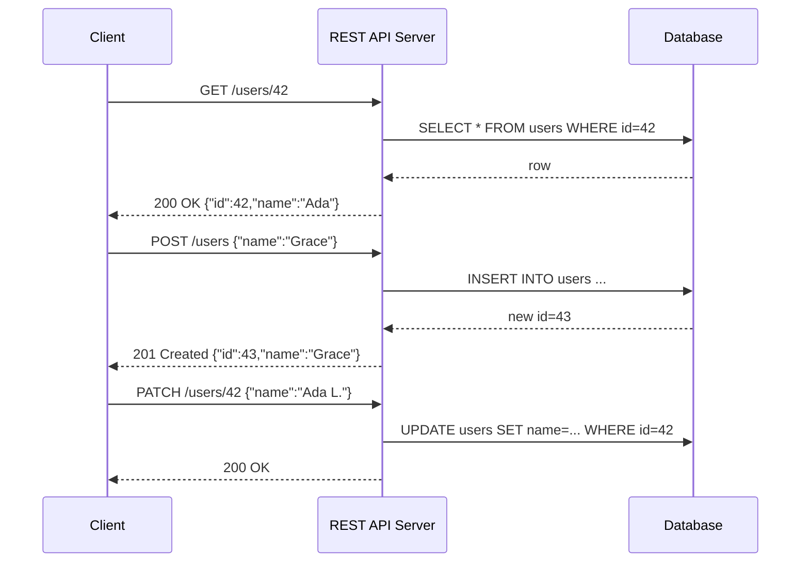

**Java code (Spring Boot REST controller)**

```java
@RestController
@RequestMapping("/users")
public class UserController {

    private final UserRepository repo;

    public UserController(UserRepository repo) {
        this.repo = repo;
    }

    @GetMapping("/{id}")
    public ResponseEntity<User> getUser(@PathVariable long id) {
        return repo.findById(id)
                .map(ResponseEntity::ok)
                .orElse(ResponseEntity.notFound().build());
    }

    @PostMapping
    public ResponseEntity<User> createUser(@RequestBody User user) {
        User saved = repo.save(user);
        return ResponseEntity.status(HttpStatus.CREATED).body(saved);
    }

    @PatchMapping("/{id}")
    public ResponseEntity<User> patchUser(@PathVariable long id, @RequestBody Map<String, Object> updates) {
        return repo.findById(id).map(user -> {
            updates.forEach((key, value) -> {
                if ("name".equals(key)) user.setName((String) value);
            });
            return ResponseEntity.ok(repo.save(user));
        }).orElse(ResponseEntity.notFound().build());
    }
}
```

**Interview questions**

1. **What makes an API "RESTful" rather than just "HTTP API"?**
   **A:** Adherence to REST's architectural constraints: client-server separation, statelessness, cacheability, a uniform interface (resources identified by URIs, manipulated via standard verbs, self-descriptive messages), a layered system, and optionally HATEOAS. Most APIs satisfy the first few but skip HATEOAS.

2. **Why is statelessness important in REST, and what's the trade-off?**
   **A:** Statelessness means the server stores no client session between requests - each request carries all the context needed (e.g. an auth token). This makes horizontal scaling trivial (any server can handle any request) and improves reliability (no session affinity needed). The trade-off is that the client must resend context (e.g. tokens) on every call, slightly increasing request size.

3. **Is `PUT` idempotent? Is `POST`? Why does it matter?**
   **A:** `PUT` is idempotent - calling it N times with the same payload leaves the resource in the same state as calling it once, so clients can safely retry on timeout. `POST` typically creates a new resource each time, so retrying a timed-out `POST` can create duplicates. This matters for retry logic, load balancers, and at-least-once delivery systems.

4. **How would you design pagination, filtering, and sorting for a REST collection endpoint?**
   **A:** Use query parameters: `GET /orders?status=shipped&sort=-createdAt&page=2&limit=50` (or cursor-based `?cursor=abc123&limit=50` for large/real-time datasets). Return metadata (`total`, `next_cursor`) either in the body or in `Link`/custom headers, and document defaults and max limits.

### GraphQL

**Explanation**

GraphQL is a query language and runtime for APIs where the **client** describes the exact shape of the data it needs in a single request, and the server resolves it against a strongly typed schema. Unlike REST, which exposes many fixed-shape endpoints, GraphQL exposes a single endpoint (typically `POST /graphql`) with three operation types: `query` (read), `mutation` (write), `subscription` (real-time stream). This solves REST's classic problems of **over-fetching** (getting fields you don't need) and **under-fetching** (needing multiple round trips to assemble a view), at the cost of losing free HTTP caching and adding server-side complexity (resolver N+1 queries, query cost limiting).

**Real-life use case**

Facebook (creator of GraphQL) uses it to power the News Feed, where a single mobile screen needs deeply nested, differently-shaped data (post, author, comments, reactions) that would otherwise require many REST calls. GitHub's public API v4 is also GraphQL, letting tools fetch exactly the repo/issue/PR fields they need in one request instead of chaining several REST calls.

**Diagram**

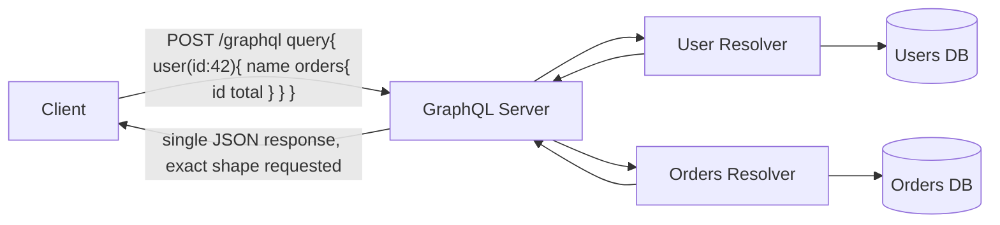

**Java code (GraphQL Java / Spring Boot resolver)**

```java
@Controller
public class UserGraphQLController {

    private final UserService userService;
    private final OrderService orderService;

    public UserGraphQLController(UserService userService, OrderService orderService) {
        this.userService = userService;
        this.orderService = orderService;
    }

    @QueryMapping
    public User user(@Argument long id) {
        return userService.findById(id);
    }

    // Field resolver: only called if the client actually requested "orders"
    @SchemaMapping(typeName = "User", field = "orders")
    public List<Order> orders(User user) {
        return orderService.findByUserId(user.getId());
    }
}
```

```graphql
# schema.graphqls
type User {
  id: ID!
  name: String!
  orders: [Order!]!
}

type Order {
  id: ID!
  total: Float!
}

type Query {
  user(id: ID!): User
}
```

**Interview questions**

1. **What problem does GraphQL solve that REST doesn't handle well?**
   **A:** Over-fetching (REST returns the whole resource even if you need one field) and under-fetching (needing several REST calls to assemble one screen). GraphQL lets the client request exactly the fields/relations it needs in one round trip.

2. **What is the N+1 query problem in GraphQL and how do you fix it?**
   **A:** If a query returns 100 users and each user's resolver independently queries orders, you get 1 + 100 database calls. Fix with a **DataLoader** (batching + per-request caching) that collects all pending user IDs and issues one batched `WHERE id IN (...)` query.

3. **Why is HTTP caching harder with GraphQL than REST?**
   **A:** REST uses distinct URLs per resource, so CDNs/browsers can cache `GET /users/42` by URL. GraphQL typically uses a single `POST /graphql` endpoint with a body that varies per query, so there's no URL to key a cache on; caching must be done at the application layer (e.g. persisted queries, Apollo cache, response-level caching by query hash).

4. **How do you prevent a malicious or overly expensive GraphQL query from overloading the server?**
   **A:** Enforce query depth limits, query complexity/cost analysis (assign a cost per field and reject queries above a threshold), and timeouts/pagination on list fields, since GraphQL's flexibility lets a client construct deeply nested queries that fan out into huge numbers of resolver calls.

### gRPC

**Explanation**

gRPC is a high-performance RPC (Remote Procedure Call) framework built on **HTTP/2** and **Protocol Buffers (protobuf)**. Instead of resources and verbs, gRPC exposes strongly typed **services** with **methods** you call almost like local functions (`userService.getUser(request)`). Protobuf serializes messages into a compact binary format (much smaller/faster to parse than JSON), and HTTP/2 gives it multiplexed streams over one connection, header compression, and native support for streaming. gRPC supports four call shapes: unary (request/response), server streaming, client streaming, and bidirectional streaming.

**Real-life use case**

gRPC is the dominant choice for **internal service-to-service communication** in microservice architectures (Google, Netflix, Square, Kubernetes internals) where low latency and high throughput matter, and both ends of the connection are services you control (so you can generate/share the same `.proto` client and server stubs). It's less suited to public browser-facing APIs because browsers can't easily speak raw HTTP/2 gRPC without a proxy (`grpc-web`).

**Diagram**

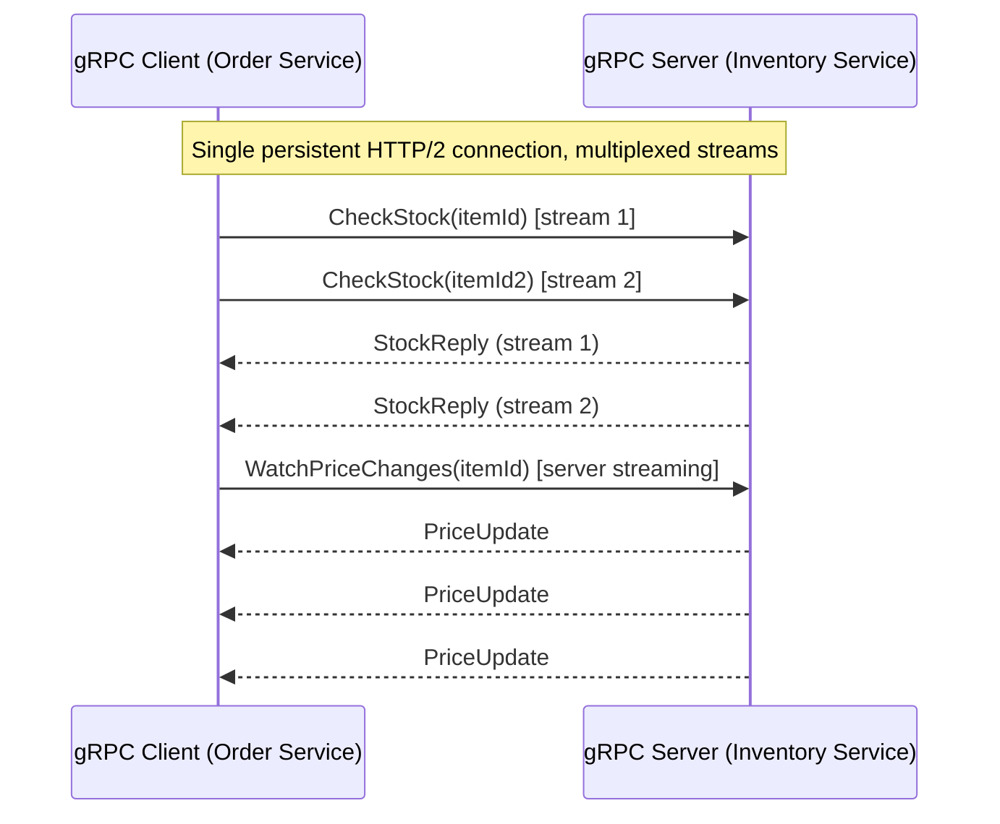

**Java code (gRPC service definition + server implementation)**

```protobuf
// inventory.proto
syntax = "proto3";

service InventoryService {
  rpc CheckStock (StockRequest) returns (StockReply);
}

message StockRequest {
  string item_id = 1;
}

message StockReply {
  int32 quantity = 1;
}
```

```java
public class InventoryServiceImpl extends InventoryServiceGrpc.InventoryServiceImplBase {

    private final StockRepository stockRepository;

    public InventoryServiceImpl(StockRepository stockRepository) {
        this.stockRepository = stockRepository;
    }

    @Override
    public void checkStock(StockRequest request, StreamObserver<StockReply> responseObserver) {
        int quantity = stockRepository.getQuantity(request.getItemId());
        StockReply reply = StockReply.newBuilder()
                .setQuantity(quantity)
                .build();
        responseObserver.onNext(reply);
        responseObserver.onCompleted();
    }
}

// Server bootstrap
Server server = ServerBuilder.forPort(9090)
        .addService(new InventoryServiceImpl(stockRepository))
        .build()
        .start();
```

**Interview questions**

1. **Why is gRPC generally faster than a JSON-over-HTTP REST API?**
   **A:** Protobuf is a compact binary format that's cheaper to serialize/deserialize than JSON text, and HTTP/2 multiplexes many requests over a single TCP connection with header compression, avoiding the connection-per-request overhead and larger payloads of typical HTTP/1.1 REST calls.

2. **When would you NOT use gRPC?**
   **A:** For public-facing browser APIs (browsers can't natively call gRPC without a `grpc-web` proxy), when you need easy human-readable debugging/caching via URLs, or when third-party consumers need a low-friction, tool-agnostic API (curl/Postman-friendly REST/JSON is easier for external partners).

3. **What are the four types of gRPC calls?**
   **A:** Unary (single request, single response - like a normal function call), server streaming (one request, stream of responses), client streaming (stream of requests, one response), and bidirectional streaming (both sides stream independently over the same connection).

4. **How does gRPC handle backward compatibility when a service evolves its message schema?**
   **A:** Protobuf fields are numbered and optional by default; you can add new fields with new numbers without breaking old clients (they just ignore unknown fields), and you must never reuse or renumber existing field numbers. Removing a field should mark its number `reserved` so it's never accidentally reused.

### SOAP

**Explanation**

SOAP (Simple Object Access Protocol) is an XML-based messaging protocol with a rigid, formal contract described by **WSDL** (Web Services Description Language). Every request and response is an XML "envelope" containing a header (metadata like auth, transaction IDs) and a body (the actual payload), and it can run over HTTP, SMTP, or other transports. SOAP bakes in standards for security (WS-Security), reliable messaging (WS-ReliableMessaging), and distributed transactions (WS-AtomicTransaction) - which is exactly why it's heavyweight compared to REST/JSON, but valuable in domains that require those guarantees contractually.

**Real-life use case**

SOAP remains common in **banking, payments, healthcare (HL7/FHIR-adjacent legacy systems), and enterprise B2B integrations** (e.g. SWIFT payment messaging, insurance claim processing) where strict formal contracts, built-in transactional integrity, and compliance/audit requirements matter more than developer ergonomics, and where systems were built decades ago and are too risky/costly to replace.

**Diagram**

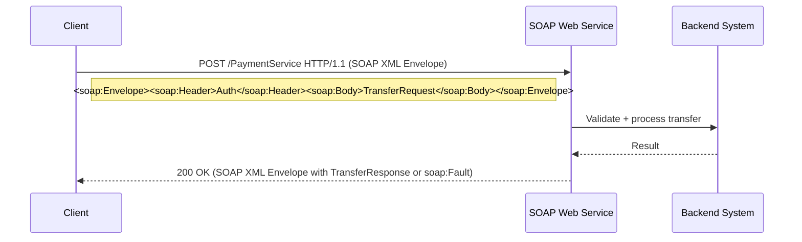

**Java code (JAX-WS SOAP web service)**

```java
@WebService(serviceName = "PaymentService")
public class PaymentServiceImpl {

    @WebMethod(operationName = "transfer")
    public TransferResponse transfer(
            @WebParam(name = "fromAccount") String fromAccount,
            @WebParam(name = "toAccount") String toAccount,
            @WebParam(name = "amount") BigDecimal amount) {

        if (amount.compareTo(BigDecimal.ZERO) <= 0) {
            throw new SoapFaultException("Amount must be positive");
        }
        // ... perform transfer ...
        return new TransferResponse("SUCCESS", "TXN12345");
    }
}

// Client stub call (generated from WSDL)
PaymentService service = new PaymentServiceService().getPaymentServicePort();
TransferResponse response = service.transfer("ACC1", "ACC2", new BigDecimal("100.00"));
```

**Interview questions**

1. **Why do enterprises still use SOAP instead of migrating everything to REST?**
   **A:** SOAP has built-in, standardized support for security (WS-Security), guaranteed/reliable delivery (WS-ReliableMessaging), and distributed ACID transactions (WS-AtomicTransaction) - features that are hard/costly to replicate reliably in a plain REST/JSON API, and formal WSDL contracts give strict type safety that regulated industries rely on for compliance.

2. **What is WSDL and why does it matter?**
   **A:** WSDL is an XML document that formally describes a SOAP service's operations, message formats, data types, and endpoint location. Client code/stubs can be auto-generated from it, giving strong compile-time contracts between client and server - unlike REST, where the contract (OpenAPI/Swagger) is usually optional and added afterward.

3. **How does SOAP report errors, and how does that differ from REST?**
   **A:** SOAP uses a `<soap:Fault>` element inside the response envelope, carrying a fault code, string, and detail - always returned with an HTTP 500 regardless of the actual error type. REST instead uses HTTP status codes (400, 404, 409, 500...) directly, which is more granular and cache/proxy-friendly.

4. **What are the main downsides of SOAP compared to REST/JSON APIs?**
   **A:** Verbose XML payloads (larger, slower to parse), steeper learning curve, poor browser/JavaScript ergonomics, heavier tooling requirements, and less natural caching since almost everything goes through `POST`.

### Content Negotiation

**Explanation**

Content negotiation is the mechanism by which a client and server agree on the **representation** of a resource - its media type (JSON vs XML vs protobuf), language, or encoding - without needing separate URLs for each variant. The client states its preferences via request headers, and the server picks the best match (or returns `406 Not Acceptable` if it cannot satisfy any of them).

**Key HTTP headers:**
- `Accept`: preferred response media type, e.g. `application/json`, with optional quality weights: `Accept: application/json;q=0.9, application/xml;q=0.5`
- `Accept-Language`: preferred human language, e.g. `Accept-Language: en-US,en;q=0.8,fr;q=0.5`
- `Accept-Encoding`: preferred compression, e.g. `Accept-Encoding: gzip, br`
- `Content-Type` (on the response): tells the client what representation was actually sent back
- `Vary` (on the response): tells caches which request headers affected the chosen representation, so a cache doesn't serve a French response to an English-requesting client

**Real-life use case**

A public API like GitHub's lets clients request either the default JSON representation or a custom media type via `Accept: application/vnd.github.v3.diff` to get a raw diff instead of JSON metadata for the same pull-request resource - one URL, multiple representations, chosen purely through the `Accept` header.

**Diagram**

```mermaid
sequenceDiagram
    participant C as Client
    participant S as Server

    C->>S: GET /report/42\nAccept: application/json;q=0.9, application/xml;q=0.5\nAccept-Language: fr
    S->>S: Match best supported type (JSON) + language (fr)
    S-->>C: 200 OK\nContent-Type: application/json\nContent-Language: fr\nVary: Accept, Accept-Language
```

**Java code (Spring content negotiation)**

```java
@RestController
@RequestMapping("/report")
public class ReportController {

    // Spring picks the method/representation based on the Accept header automatically
    @GetMapping(value = "/{id}", produces = MediaType.APPLICATION_JSON_VALUE)
    public ReportJson getReportJson(@PathVariable long id) {
        return reportService.findAsJson(id);
    }

    @GetMapping(value = "/{id}", produces = MediaType.APPLICATION_XML_VALUE)
    public ReportXml getReportXml(@PathVariable long id) {
        return reportService.findAsXml(id);
    }

    @GetMapping("/{id}/message")
    public ResponseEntity<String> getLocalizedMessage(
            @PathVariable long id,
            @RequestHeader(value = "Accept-Language", defaultValue = "en") String locale) {
        String message = messageService.getMessage(id, Locale.forLanguageTag(locale));
        return ResponseEntity.ok()
                .header(HttpHeaders.VARY, "Accept-Language")
                .body(message);
    }
}
```

**Interview questions**

1. **What HTTP status code should a server return if it can't satisfy any requested `Accept` type?**
   **A:** `406 Not Acceptable`, along with (ideally) a body or `Content-Type` indicating what representations are actually available.

2. **Why does the `Vary` response header matter for caching proxies/CDNs?**
   **A:** Without `Vary`, a shared cache might store one response for a URL and serve it to every client regardless of their `Accept`/`Accept-Language`, e.g. serving a French response to an English-only client. `Vary: Accept, Accept-Language` tells the cache to store a separate entry per combination of those headers.

3. **What's the difference between server-driven and agent-driven (client-driven) content negotiation?**
   **A:** Server-driven negotiation (the common case) has the server inspect `Accept*` headers and choose the best representation automatically. Agent-driven negotiation returns a list of available representations (often via `300 Multiple Choices`) and lets the client explicitly pick one with a follow-up request - rarely used in practice because it costs an extra round trip.

4. **How would you version an API using content negotiation instead of a URI or header field?**
   **A:** Use a custom vendor media type that encodes the version, e.g. `Accept: application/vnd.myapi.v2+json`. The server inspects the media type to decide which serializer/version of the resource representation to return, keeping the URL stable across versions.

### API Versioning

**Explanation**

API versioning is how you evolve an API's contract (add/remove/rename fields, change behaviour) while existing clients keep working. Because you rarely control every consumer of a public API, you cannot simply change a response shape in place - you need a strategy to run old and new contracts side by side until old clients migrate.

**Strategies:**
- **URI versioning**: `/v1/users`, `/v2/users` - simple, visible, cache-friendly, but "pollutes" the URI and implies the whole API moves in lockstep even if only one resource changed
- **Header versioning**: custom header `API-Version: 2` - keeps URIs clean, but harder to discover/test by just clicking a link, and breaks default HTTP caching
- **Query parameter**: `/users?version=2` - easy to add but easy for clients to forget, and can fragment caching keys
- **Content negotiation**: `Accept: application/vnd.api.v2+json` - most "RESTful" since the resource identity (URL) doesn't change, only its representation, but least discoverable/most complex to implement

A complementary practice regardless of strategy: prefer **additive, backward-compatible changes** (new optional fields, new endpoints) over breaking changes, and only bump a major version for true breaking changes, with a documented deprecation window (e.g. `Sunset` / `Deprecation` headers) before removing the old version.

**Real-life use case**

Stripe versions its API by date (`Stripe-Version: 2023-10-16` header) rather than by number: every account is pinned to the API version active when it was created, and Stripe internally maps old requests through compatibility transformations so that thousands of integrations never break even as the API evolves continuously.

**Diagram**

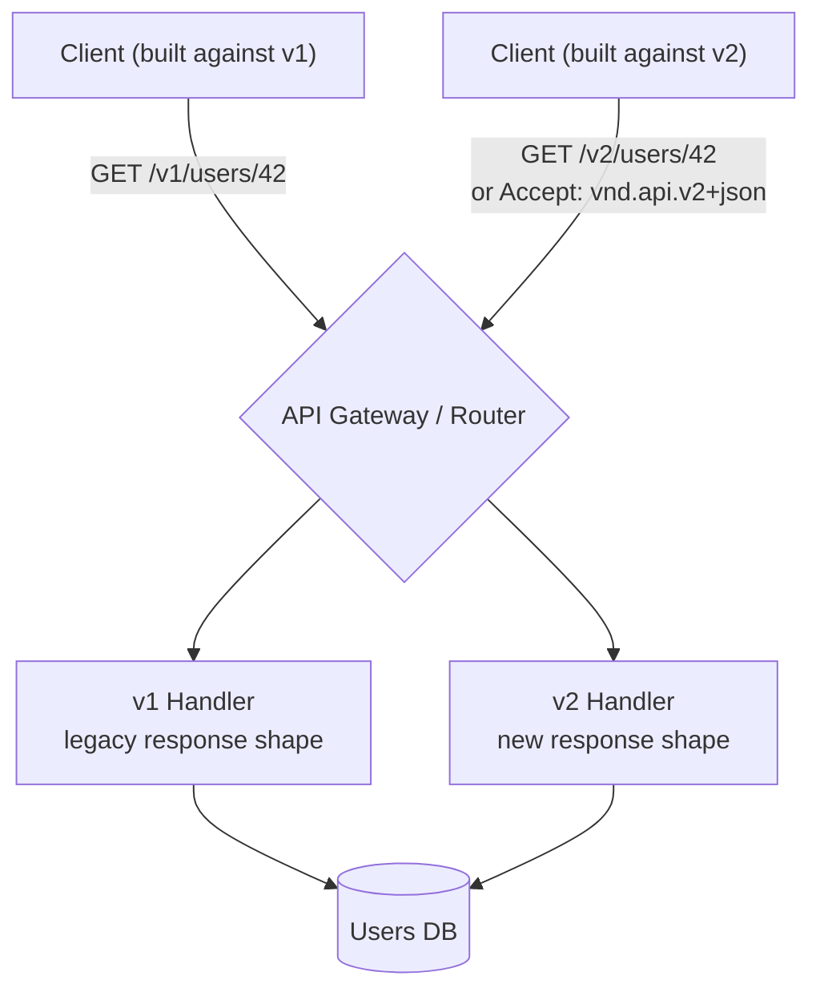

**Java code (Spring Boot header-based versioning)**

```java
@RestController
@RequestMapping("/users")
public class UserVersionedController {

    @GetMapping(value = "/{id}", headers = "API-Version=1")
    public UserV1Response getUserV1(@PathVariable long id) {
        return userService.findAsV1(id); // legacy shape, e.g. flat "fullName"
    }

    @GetMapping(value = "/{id}", headers = "API-Version=2")
    public UserV2Response getUserV2(@PathVariable long id) {
        return userService.findAsV2(id); // new shape, e.g. split "firstName"/"lastName"
    }

    // Default to latest if no header supplied
    @GetMapping("/{id}")
    public UserV2Response getUserDefault(@PathVariable long id) {
        return userService.findAsV2(id);
    }
}
```

**Interview questions**

1. **What's the trade-off between URI versioning and header/content-negotiation versioning?**
   **A:** URI versioning is simple, visible in logs, and trivially cacheable per version, but changes the resource's identity (a "v1" and "v2" user look like two different resources) and forces every endpoint to bump together. Header/content-negotiation versioning keeps a stable resource URL (better REST purity) but is less discoverable, harder to test via a browser, and can complicate caching since the cache key must now include the header (`Vary`).

2. **How do you version an API without breaking existing clients?**
   **A:** Prefer additive/backward-compatible changes (new optional fields, new endpoints, new enum values that old clients ignore); only introduce a new version for breaking changes (renaming/removing fields, changing types, changing required parameters), and support the old version in parallel for a defined deprecation window.

3. **What headers can you use to communicate API deprecation to clients?**
   **A:** `Deprecation` (marks the endpoint/version as deprecated, optionally with a date), and `Sunset` (the date after which the endpoint stops working), often paired with a `Link` header pointing to migration docs.

4. **Why might date-based versioning (like Stripe's) be preferable to sequential numbers for a large public API?**
   **A:** It lets each customer/account pin to a specific point-in-time contract while the API evolves continuously behind the scenes, avoiding the "big bang v1 -> v2" migration problem; the provider maintains compatibility shims per version internally rather than maintaining fully separate codepaths for a handful of major versions.

### Idempotency in APIs

**Explanation**

An operation is **idempotent** if performing it multiple times produces the same end result as performing it once. This matters enormously for APIs because networks are unreliable: a client can time out waiting for a response even though the server actually processed the request, and the client's only safe move is to **retry**. If the underlying operation isn't idempotent (e.g. "charge $50"), a retry can cause duplicate side effects (double billing). `GET`, `PUT`, and `DELETE` are idempotent by HTTP specification; `POST` and `PATCH` are not guaranteed to be, so APIs that create resources or trigger payments over `POST` typically add an **idempotency key**: the client generates a unique key per logical operation and sends it in a header (e.g. `Idempotency-Key: 6f9c...`); the server stores the key with the result of the first successful execution and, on retries with the same key, returns the cached result instead of re-executing the operation.

**Real-life use case**

Stripe's Payment Intents API requires an `Idempotency-Key` header on `POST /v1/payment_intents`. If a client's request to charge a card times out and the client retries with the *same* key, Stripe recognizes the key and returns the original charge result instead of charging the customer twice - critical for financial correctness under unreliable networks.

**Diagram**

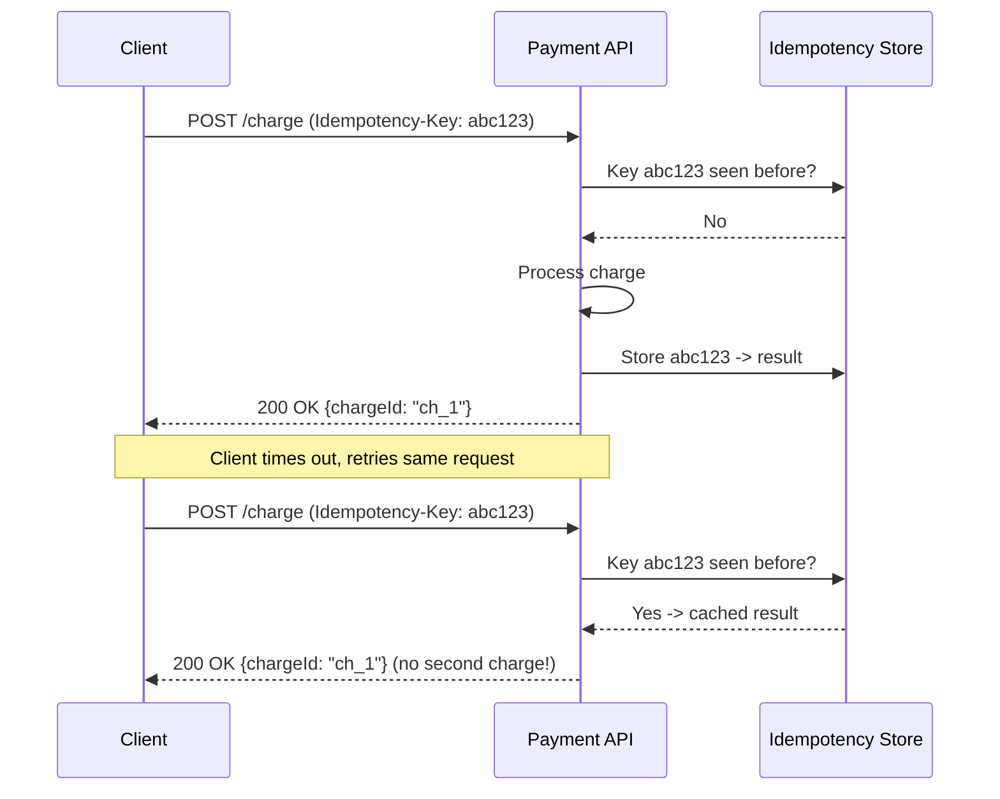

**Java code (idempotency key handling with a filter)**

```java
@Component
public class IdempotencyFilter extends OncePerRequestFilter {

    private final IdempotencyStore store; // e.g. backed by Redis with a TTL

    public IdempotencyFilter(IdempotencyStore store) {
        this.store = store;
    }

    @Override
    protected void doFilterInternal(HttpServletRequest request, HttpServletResponse response,
                                     FilterChain chain) throws IOException, ServletException {
        String key = request.getHeader("Idempotency-Key");
        if (key == null || !"POST".equalsIgnoreCase(request.getMethod())) {
            chain.doFilter(request, response);
            return;
        }

        Optional<CachedResponse> cached = store.get(key);
        if (cached.isPresent()) {
            response.setStatus(cached.get().status());
            response.getWriter().write(cached.get().body());
            return; // short-circuit, do not re-execute the handler
        }

        ContentCachingResponseWrapper wrapped = new ContentCachingResponseWrapper(response);
        chain.doFilter(request, wrapped);
        store.put(key, new CachedResponse(wrapped.getStatus(), new String(wrapped.getContentAsByteArray())));
        wrapped.copyBodyToResponse();
    }
}
```

**Interview questions**

1. **Why isn't `POST` idempotent by default, and how do you make a `POST` endpoint safe to retry?**
   **A:** `POST` semantically means "create/process something new", so calling it twice naturally creates two things (e.g. two orders). You make it safe by requiring an `Idempotency-Key` from the client; the server persists the key with the outcome of the first call and returns that cached outcome for any repeat with the same key, instead of re-running the side effect.

2. **Where should the idempotency key be generated - client or server - and why?**
   **A:** The client must generate it, because only the client knows whether a given request is a "new" logical operation or a "retry" of one it already attempted. If the server generated the key, every retry would look like a distinct key and duplicates couldn't be detected.

3. **What's a race condition risk with idempotency keys, and how do you prevent it?**
   **A:** Two near-simultaneous requests with the same key could both miss the "already processed" check and both execute the operation. Prevent this with an atomic "check-and-set" (e.g. a Redis `SETNX`/conditional write, or a unique DB constraint on the key) so only one request wins the race and others wait for/return its result.

4. **How long should you retain idempotency keys, and why not forever?**
   **A:** Long enough to cover realistic client retry windows (commonly 24 hours), then expire (TTL) them to bound storage growth - keeping keys indefinitely is unnecessary since clients don't retry a request from days ago.

### Pagination

**Explanation**

Pagination breaks a large collection response into smaller chunks so the server doesn't have to load/serialize millions of rows and the client doesn't have to download them all at once. There are two dominant approaches:

- **Offset/limit pagination** (`?page=3&limit=20` or `?offset=40&limit=20`): simple to implement (`OFFSET`/`LIMIT` in SQL), supports jumping to an arbitrary page, but gets **slower** on large offsets (the database still has to scan and discard all skipped rows) and is **unstable** under concurrent writes (if a row is inserted/deleted while paging, items can shift, causing skipped or duplicated results).
- **Cursor-based (keyset) pagination** (`?cursor=eyJpZCI6NDJ9&limit=20`): the cursor encodes the last seen sort key (e.g. `id > 42 ORDER BY id LIMIT 20`), so every page is a fast indexed lookup regardless of how deep you page, and results stay stable even as new rows are inserted - at the cost of not being able to jump directly to "page 50".

**Real-life use case**

Twitter/X's timeline and Slack's message history both use cursor-based pagination (`since_id`/`max_id` or opaque cursors) because their datasets are enormous and constantly changing in real time - offset pagination would be both too slow (scanning millions of rows) and inconsistent (new tweets/messages constantly shifting what "page 2" means).

**Diagram**

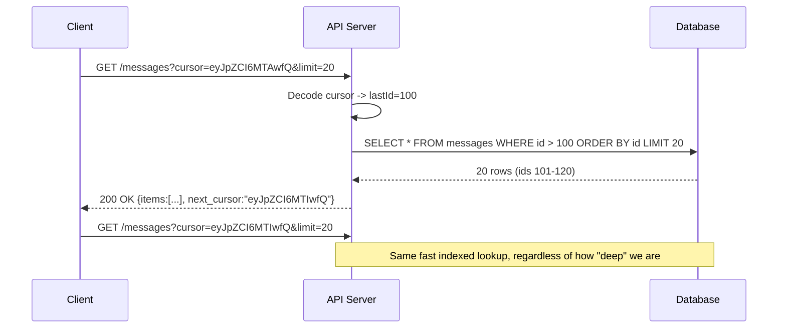

**Java code (cursor-based pagination)**

```java
@GetMapping("/messages")
public PagedResponse<Message> getMessages(
        @RequestParam(required = false) String cursor,
        @RequestParam(defaultValue = "20") int limit) {

    long lastId = cursor != null ? decodeCursor(cursor) : 0L;

    List<Message> messages = messageRepository
            .findByIdGreaterThanOrderByIdAsc(lastId, PageRequest.of(0, limit));

    String nextCursor = messages.isEmpty()
            ? null
            : encodeCursor(messages.get(messages.size() - 1).getId());

    return new PagedResponse<>(messages, nextCursor);
}

private String encodeCursor(long id) {
    return Base64.getEncoder().encodeToString(("{\"id\":" + id + "}").getBytes(StandardCharsets.UTF_8));
}

private long decodeCursor(String cursor) {
    String json = new String(Base64.getDecoder().decode(cursor), StandardCharsets.UTF_8);
    return Long.parseLong(json.replaceAll("\\D+", ""));
}
```

**Interview questions**

1. **Why does offset pagination get slower as the page number increases?**
   **A:** `OFFSET 100000 LIMIT 20` still requires the database to walk through (and discard) the first 100,000 matching rows before it can return the next 20, because most databases don't have a direct way to "skip" rows in an index without reading them. Keyset/cursor pagination avoids this by using an indexed `WHERE id > lastId` predicate, which jumps straight to the right position.

2. **What consistency problem can occur with offset pagination when the underlying data changes between page requests?**
   **A:** If a row is inserted or deleted before the current offset while a client is paging, every subsequent page shifts by one, causing the client to see a duplicate item (from a deletion) or miss an item entirely (from an insertion) - because "page 3" is defined by position, not by a stable key.

3. **What's a trade-off of cursor-based pagination versus offset pagination?**
   **A:** Cursor pagination can't jump directly to an arbitrary page (e.g. "go to page 50") since it only knows how to move forward/backward from a specific cursor value; offset pagination supports arbitrary page jumps but sacrifices performance and consistency at scale.

4. **How would you make a pagination cursor opaque and tamper-resistant to clients?**
   **A:** Base64/URL-encode a small JSON or binary payload containing the sort key(s), and optionally sign it (e.g. HMAC) so the server can verify it wasn't modified; treat the cursor as an opaque token in the API contract so the encoding can change later without breaking clients.

### Rate Limiting

**Explanation**

Rate limiting caps how many requests a client (per API key, user, or IP) can make in a time window, protecting the API from abuse, accidental traffic spikes, and cascading overload of downstream services. Common algorithms:

- **Fixed window**: count requests per fixed time bucket (e.g. per minute); simple but allows a burst of 2x the limit right at the window boundary.
- **Sliding window (log or counter)**: tracks requests over a rolling window, smoothing out the boundary-burst problem at the cost of more memory/computation.
- **Token bucket**: a bucket holds tokens that refill at a steady rate; each request consumes a token, and requests are rejected when the bucket is empty - allows short bursts up to the bucket size while enforcing a long-term average rate.
- **Leaky bucket**: requests are queued and processed at a constant rate, smoothing bursts into a steady outflow rather than allowing them through.

Limits are usually communicated via `X-RateLimit-Limit`, `X-RateLimit-Remaining`, and `X-RateLimit-Reset` headers, with a `429 Too Many Requests` response (often including a `Retry-After` header) when exceeded.

**Real-life use case**

GitHub's REST API enforces 5,000 requests/hour per authenticated user (60/hour unauthenticated) using a token-bucket-like scheme, returning `X-RateLimit-Remaining` and `X-RateLimit-Reset` headers so well-behaved clients can throttle themselves before hitting `403`/`429`, preventing a handful of misbehaving scripts from degrading the API for everyone else.

**Diagram**

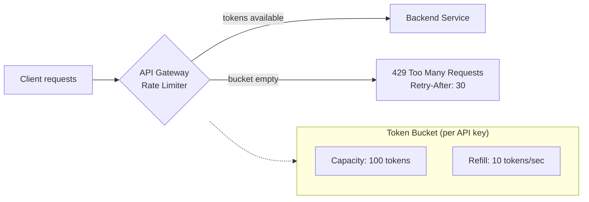

**Java code (simple token bucket rate limiter)**

```java
public class TokenBucketRateLimiter {

    private final long capacity;
    private final long refillTokensPerSecond;
    private double availableTokens;
    private long lastRefillTimestamp;

    public TokenBucketRateLimiter(long capacity, long refillTokensPerSecond) {
        this.capacity = capacity;
        this.refillTokensPerSecond = refillTokensPerSecond;
        this.availableTokens = capacity;
        this.lastRefillTimestamp = System.nanoTime();
    }

    public synchronized boolean tryConsume() {
        refill();
        if (availableTokens >= 1) {
            availableTokens -= 1;
            return true;
        }
        return false;
    }

    private void refill() {
        long now = System.nanoTime();
        double secondsElapsed = (now - lastRefillTimestamp) / 1_000_000_000.0;
        double newTokens = secondsElapsed * refillTokensPerSecond;
        availableTokens = Math.min(capacity, availableTokens + newTokens);
        lastRefillTimestamp = now;
    }
}

// Usage in a filter/interceptor, keyed per API key in a ConcurrentHashMap<String, TokenBucketRateLimiter>
if (!limiter.tryConsume()) {
    response.setStatus(429);
    response.setHeader("Retry-After", "1");
    return;
}
```

**Interview questions**

1. **What's the difference between token bucket and leaky bucket rate limiting?**
   **A:** Token bucket allows bursts up to the bucket's capacity as long as tokens are available, then throttles to the refill rate - good for tolerating brief spikes. Leaky bucket enforces a strictly constant output rate by queuing requests and draining them steadily, smoothing bursts entirely rather than allowing them through.

2. **Why does fixed-window rate limiting allow more traffic than intended near window boundaries?**
   **A:** If the limit is 100/minute and a client sends 100 requests at 0:59 and another 100 at 1:00, both are within their respective fixed windows and allowed, but 200 requests landed within a 2-second span - double the intended rate. Sliding window or token bucket algorithms avoid this edge effect.

3. **In a distributed system with multiple API gateway instances, how do you enforce a global rate limit correctly?**
   **A:** Use a shared, centralized counter (e.g. Redis with `INCR` + `EXPIRE`, or a Redis Lua script implementing token bucket atomically) instead of in-memory per-instance counters, so the limit is enforced across all instances rather than each instance independently allowing the full limit.

4. **What should an API return when a client exceeds its rate limit, and what should the client do in response?**
   **A:** `429 Too Many Requests` with a `Retry-After` header (seconds or a date) telling the client when it's safe to retry; well-behaved clients should back off (ideally with exponential backoff + jitter) rather than retrying immediately.

### HATEOAS

**Explanation**

HATEOAS (Hypermedia As The Engine Of Application State) is the most-skipped REST constraint: instead of the client hard-coding URLs for every possible next action, the server embeds **links** in each response telling the client what it can legally do next from the current state. A client discovers the API by following links from a root/entry point, the same way a human navigates a website by clicking links rather than typing every URL from memory. This decouples clients from URL structure - the server can change endpoint paths without breaking clients, as long as link relations (`rel` names) stay stable.

**Real-life use case**

PayPal's REST API returns HATEOAS links on payment resources: after creating a payment, the response includes an `approval_url` link (for redirecting the buyer) and `execute` link (to finalize payment) rather than requiring the client to hard-code those URLs - and a canceled/refunded payment simply omits the links for actions that are no longer valid, letting the client's UI adapt (e.g. hide the "pay" button) purely from the response.

**Diagram**

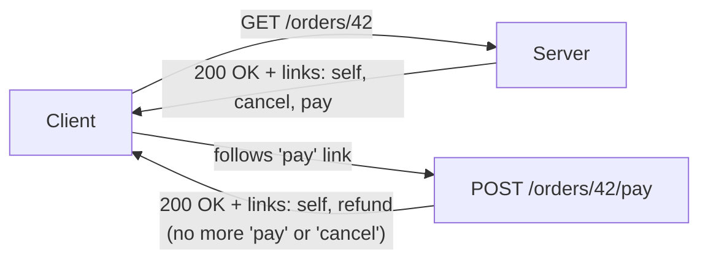

**Java code (Spring HATEOAS)**

```java
@RestController
@RequestMapping("/orders")
public class OrderController {

    @GetMapping("/{id}")
    public EntityModel<Order> getOrder(@PathVariable long id) {
        Order order = orderService.findById(id);

        EntityModel<Order> model = EntityModel.of(order);
        model.add(linkTo(methodOn(OrderController.class).getOrder(id)).withSelfRel());

        if (order.getStatus() == OrderStatus.PENDING) {
            model.add(linkTo(methodOn(OrderController.class).payOrder(id)).withRel("pay"));
            model.add(linkTo(methodOn(OrderController.class).cancelOrder(id)).withRel("cancel"));
        } else if (order.getStatus() == OrderStatus.PAID) {
            model.add(linkTo(methodOn(OrderController.class).refundOrder(id)).withRel("refund"));
        }
        return model;
    }
}
```

```json
{
  "id": 42,
  "status": "PENDING",
  "total": 99.99,
  "_links": {
    "self": { "href": "/orders/42" },
    "pay": { "href": "/orders/42/pay" },
    "cancel": { "href": "/orders/42/cancel" }
  }
}
```

**Interview questions**

1. **What problem does HATEOAS solve, and why do most "REST" APIs skip it?**
   **A:** It decouples clients from hard-coded knowledge of URL structure and valid state transitions - the server tells the client what it can do next, and can change URLs freely as long as `rel` names stay stable. Most teams skip it because it adds real implementation complexity (dynamically computing valid links per resource state) for a benefit that mostly matters for long-lived, loosely-coupled public APIs rather than internal services where client and server are deployed together anyway.

2. **How does HATEOAS help with API evolution?**
   **A:** Clients that follow links instead of constructing URLs themselves keep working even if the server relocates an endpoint, because the client always gets the current URL from the previous response rather than assuming a fixed path.

3. **Give an example of how HATEOAS communicates valid state transitions.**
   **A:** An order in `PENDING` status includes `pay` and `cancel` links; once paid, the response instead includes a `refund` link and omits `pay`/`cancel` entirely - the client can render/hide UI actions purely based on which links are present, without separately tracking business rules about what's allowed in each state.

4. **What's the difference between a "true" RESTful API and a typical "REST-like" JSON API most companies build?**
   **A:** A true RESTful API satisfies all of Fielding's constraints, including HATEOAS - clients navigate purely through discovered links. Most "REST-like" APIs are really resource-oriented HTTP+JSON APIs with fixed, documented URL structures the client hard-codes (via OpenAPI-generated clients, for instance), skipping hypermedia links because the operational complexity outweighs the benefit for typical internal/partner integrations.

### API Authentication and Authorization

**Explanation**

Authentication (**"who are you?"**) and authorization (**"what are you allowed to do?"**) are distinct concerns that APIs must handle on every request since REST/HTTP APIs are stateless (no server-side session to remember a prior login). Common schemes:

- **API keys**: a static secret sent via header (`X-API-Key`) identifying the calling application; simple but offers no per-user identity and is only as safe as key storage/rotation.
- **Basic Auth**: base64-encoded `username:password` in the `Authorization` header; simple but sends credentials on every request, so it must only be used over TLS and is rarely used beyond internal tooling.
- **OAuth 2.0 / Bearer tokens**: the client obtains a short-lived **access token** (often a JWT) after an auth flow, then sends `Authorization: Bearer <token>` on each request; the server verifies the token's signature/expiry (and, for JWTs, decodes embedded claims like user ID and scopes) without needing a database lookup per request.
- **mTLS (mutual TLS)**: both client and server present certificates, commonly used for service-to-service auth in zero-trust internal networks.

Authorization is then enforced via **scopes** (OAuth) or **roles/permissions** (RBAC) checked against the resource being accessed, independent of how the caller authenticated.

**Real-life use case**

Google APIs use OAuth 2.0: a third-party app redirects the user to Google's consent screen, receives a short-lived access token scoped to specific permissions (e.g. `https://www.googleapis.com/auth/calendar.readonly`), and sends that token as a Bearer token on every Calendar API call - so the third-party app never sees the user's Google password, and the user can revoke just that app's access without changing their password.

**Diagram**

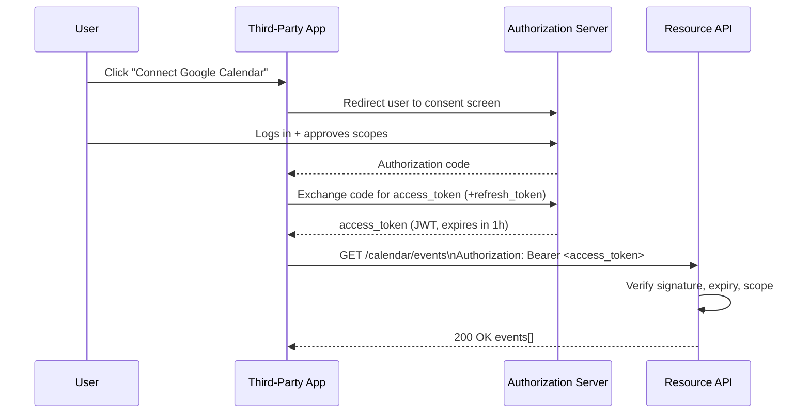

**Java code (JWT validation filter)**

```java
@Component
public class JwtAuthFilter extends OncePerRequestFilter {

    private final JwtVerifier jwtVerifier;

    public JwtAuthFilter(JwtVerifier jwtVerifier) {
        this.jwtVerifier = jwtVerifier;
    }

    @Override
    protected void doFilterInternal(HttpServletRequest request, HttpServletResponse response,
                                     FilterChain chain) throws IOException, ServletException {
        String header = request.getHeader("Authorization");
        if (header == null || !header.startsWith("Bearer ")) {
            response.setStatus(HttpServletResponse.SC_UNAUTHORIZED);
            return;
        }

        try {
            DecodedJWT jwt = jwtVerifier.verify(header.substring(7)); // checks signature + expiry
            String userId = jwt.getSubject();
            List<String> scopes = jwt.getClaim("scope").asList(String.class);

            if (!scopes.contains("calendar.read")) {
                response.setStatus(HttpServletResponse.SC_FORBIDDEN); // authenticated, but not authorized
                return;
            }
            SecurityContextHolder.getContext().setAuthentication(
                    new UsernamePasswordAuthenticationToken(userId, null, List.of()));
            chain.doFilter(request, response);
        } catch (JWTVerificationException e) {
            response.setStatus(HttpServletResponse.SC_UNAUTHORIZED);
        }
    }
}
```

**Interview questions**

1. **What's the difference between authentication and authorization, and what status codes correspond to each failure?**
   **A:** Authentication verifies identity ("who are you") - failure returns `401 Unauthorized`. Authorization checks permissions for an already-authenticated identity ("what are you allowed to do") - failure returns `403 Forbidden`. A common mistake is returning 401 for both, which hides whether the caller even needs to re-authenticate versus needing different permissions.

2. **Why use short-lived access tokens plus a refresh token instead of one long-lived token?**
   **A:** A short-lived access token (minutes to an hour) limits the damage window if it's leaked/stolen, since it expires quickly; the longer-lived refresh token is used far less often (only to mint new access tokens) and can be revoked server-side, letting you invalidate a compromised session without invalidating every token in the system.

3. **Can a stateless JWT be revoked before it expires? How do you handle that?**
   **A:** Not natively - a JWT's whole point is that the server verifies it without a database lookup, so there's nothing to "check" at request time. Workarounds: keep expiry very short and rely on refresh-token revocation, maintain a server-side denylist/blocklist of revoked token IDs (`jti` claim) checked on each request (partially reintroducing statefulness), or use opaque tokens validated against a session store when instant revocation matters more than statelessness.

4. **Why should API keys never be sent as query parameters?**
   **A:** URLs (including query strings) are commonly logged by proxies, web servers, browser history, and analytics tools, and can leak via the `Referer` header to third-party sites - so a key in a query string is far more likely to end up in a log file or get exposed than one sent in a header over TLS.

### Error Handling and Status Codes

**Explanation**

A well-designed API communicates failures in a way clients can parse and act on programmatically, not just a human-readable message. This means: choosing the **correct HTTP status code class** (`4xx` for client mistakes the caller can fix, `5xx` for server-side failures), and returning a **consistent error body** (commonly following [RFC 7807 "Problem Details"](https://www.rfc-editor.org/rfc/rfc7807)) with a machine-readable error `type`/`code`, a human `title`/`detail`, and enough context (e.g. which field failed validation) for the client to react - retry, show a form error, or alert an operator.

**Key status codes:**
- `400 Bad Request`: malformed request (invalid JSON, failed validation)
- `401 Unauthorized`: missing/invalid authentication
- `403 Forbidden`: authenticated but not permitted
- `404 Not Found`: resource doesn't exist
- `409 Conflict`: request conflicts with current state (e.g. version mismatch, duplicate resource)
- `422 Unprocessable Entity`: well-formed request but semantically invalid (business rule violation)
- `429 Too Many Requests`: rate limit exceeded
- `500 Internal Server Error`: unexpected server-side failure
- `503 Service Unavailable`: server temporarily can't handle the request (overloaded/maintenance)

**Real-life use case**

Stripe's API returns a consistent JSON error body on every failure - `{"error": {"type": "card_error", "code": "card_declined", "message": "Your card was declined.", "param": "card"}}` - paired with the right HTTP status (`402` for card errors), letting client SDKs branch on `error.code` to show the exact right message to the end user instead of a generic "something went wrong."

**Diagram**

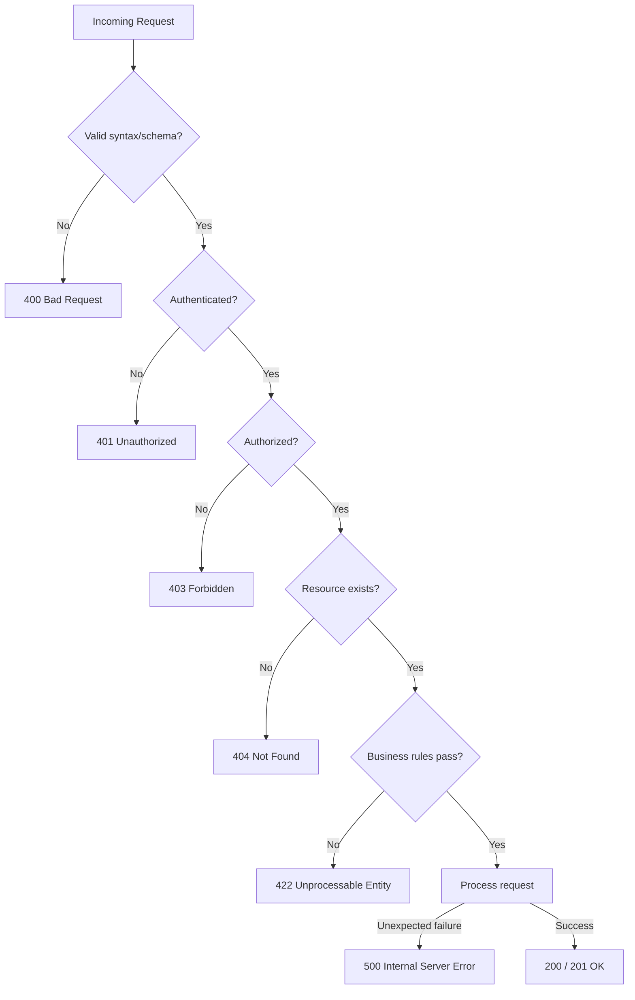

**Java code (RFC 7807 problem details with Spring's `@ControllerAdvice`)**

```java
@ControllerAdvice
public class ApiExceptionHandler {

    @ExceptionHandler(ResourceNotFoundException.class)
    public ResponseEntity<ProblemDetail> handleNotFound(ResourceNotFoundException ex) {
        ProblemDetail problem = ProblemDetail.forStatusAndDetail(HttpStatus.NOT_FOUND, ex.getMessage());
        problem.setType(URI.create("https://api.example.com/errors/not-found"));
        problem.setProperty("resourceId", ex.getResourceId());
        return ResponseEntity.status(HttpStatus.NOT_FOUND).body(problem);
    }

    @ExceptionHandler(MethodArgumentNotValidException.class)
    public ResponseEntity<ProblemDetail> handleValidation(MethodArgumentNotValidException ex) {
        ProblemDetail problem = ProblemDetail.forStatusAndDetail(HttpStatus.BAD_REQUEST, "Validation failed");
        List<String> errors = ex.getBindingResult().getFieldErrors().stream()
                .map(f -> f.getField() + ": " + f.getDefaultMessage())
                .toList();
        problem.setProperty("errors", errors);
        return ResponseEntity.badRequest().body(problem);
    }

    @ExceptionHandler(Exception.class)
    public ResponseEntity<ProblemDetail> handleUnexpected(Exception ex) {
        ProblemDetail problem = ProblemDetail.forStatusAndDetail(
                HttpStatus.INTERNAL_SERVER_ERROR, "An unexpected error occurred");
        return ResponseEntity.internalServerError().body(problem);
    }
}
```

**Interview questions**

1. **What's the difference between `400`, `422`, and `409`, and when should each be used?**
   **A:** `400` means the request itself is malformed (bad JSON, missing required field, wrong type). `422` means the request is syntactically valid but violates a business rule (e.g. "end date must be after start date"). `409` means the request conflicts with the current server state (e.g. optimistic-locking version mismatch, or creating a resource that already exists with a unique constraint).

2. **Why shouldn't an API leak internal exception messages/stack traces in error responses?**
   **A:** It's a security risk (OWASP-flagged information disclosure) - stack traces can reveal internal file paths, library versions, or query structure useful to an attacker, and they're not actionable for API consumers anyway. Return a generic, safe message to the client and log the full detail server-side (correlated by a request/trace ID returned in the response).

3. **What is RFC 7807 and why standardize on it?**
   **A:** It defines a standard JSON (`application/problem+json`) shape for API errors: `type` (a URI identifying the error kind), `title`, `status`, `detail`, and `instance`, extensible with custom fields. Standardizing means every client/tool in an organization can parse errors from any service the same way instead of each team inventing its own error JSON shape.

4. **How should a client differentiate a retryable error from a non-retryable one, and where does that map to status codes?**
   **A:** `5xx` errors (server-side, transient) and `429` (rate limited) are generally safe to retry, ideally with exponential backoff, since the same request might succeed once the server recovers or the rate-limit window resets. `4xx` errors other than `429` (like `400`, `404`, `422`) represent a client-side problem that won't change on immediate retry - the request itself must be fixed first.

---

### API related things
