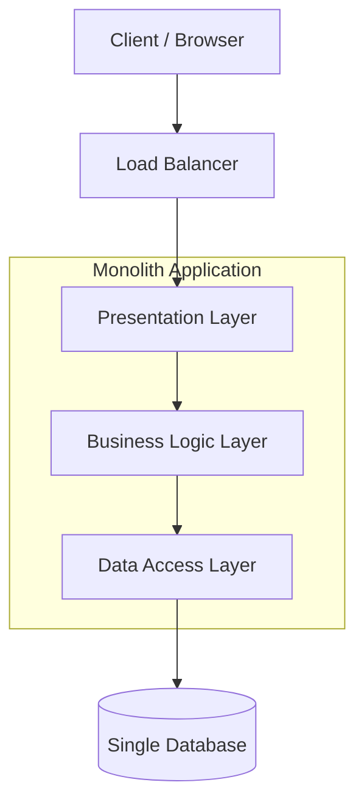
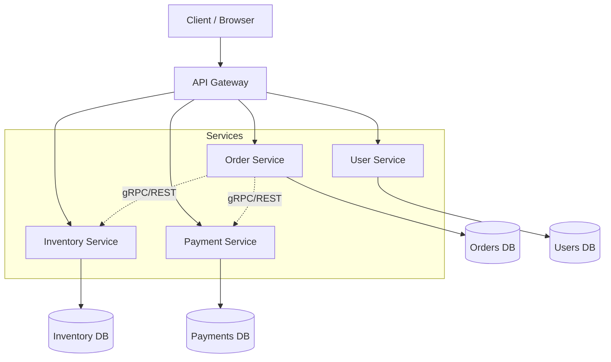
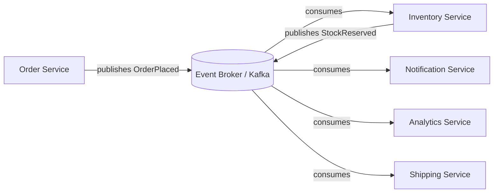
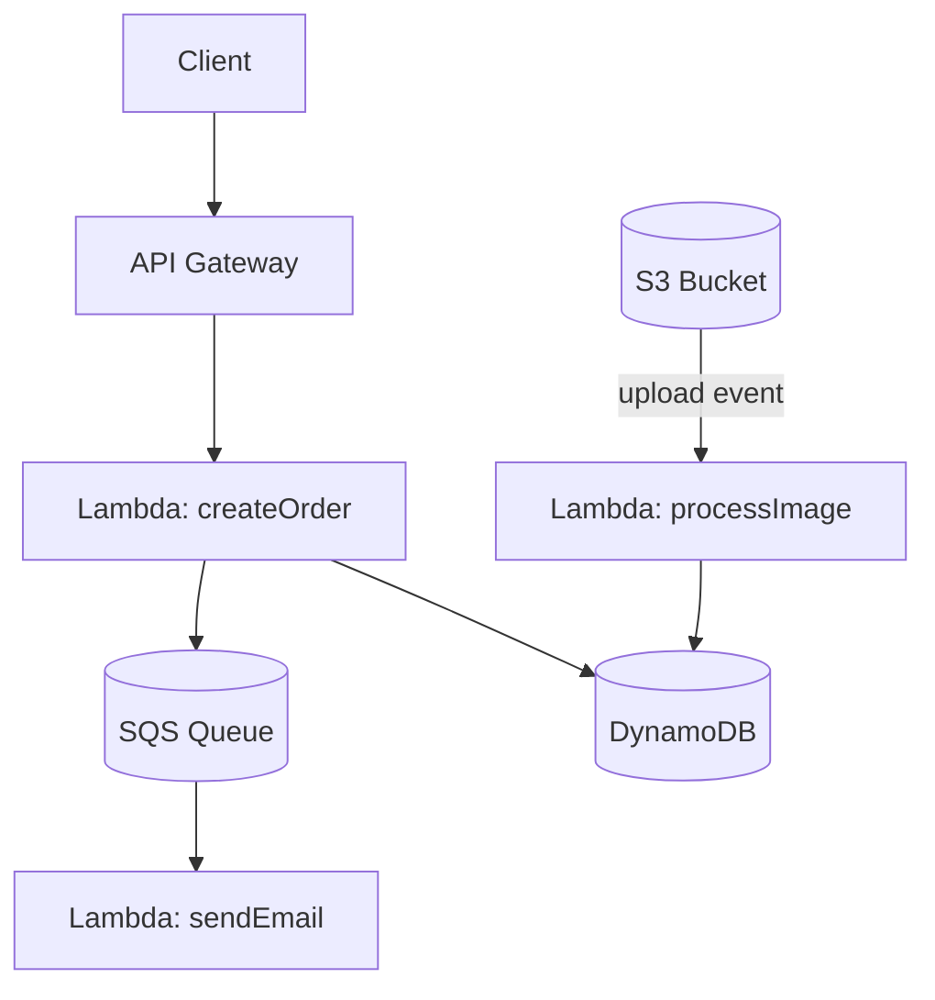

# Architecture Patterns

## Blogs and websites


## Medium

- [Most Common Software Architecture Styles](https://medium.com/@techworldwithmilan/most-common-software-architecture-styles-86881d779683)
- [23 Must-Know Principles in Software Architecture](https://azeynalli1990.medium.com/23-must-know-principles-in-software-architecture-62d1cf73df7c)
- [10 Fundamental Cloud-Native Architecture Patterns](https://azeynalli1990.medium.com/10-fundamental-cloud-native-architecture-patterns-859021b0716d)
- [Mastering Software Architecture Patterns: A Comprehensive Guide](https://heyizzy.me/mastering-software-architecture-patterns-a-comprehensive-guide-0a66e1498da9)
- [Mastering Software Complexity: Object-Oriented vs. Process-Oriented Approaches](https://experiencestack.co/mastering-software-complexity-object-oriented-vs-process-oriented-approaches-in-development-f414335fea6d)
- [Adopting Domain-First Thinking in Modular Monolith with Hexagonal Architecture](https://itnext.io/adopting-domain-first-thinking-in-modular-monolith-with-hexagonal-architecture-f9e4921ac18d)

## Youtube


## Theory

### Topics

- [Monolith Architecture](#monolith-architecture)
- [Microservices Architecture](#microservices-architecture)
- [Event-Driven Architecture](#event-driven-architecture)
- [Serverless Architecture](#serverless-architecture)

### Monolith Architecture

Single unified codebase and deployment.

#### Understanding Monolith Architecture

A monolith is an application built as a single, indivisible unit where the UI, business logic, and data access layers are packaged and deployed together, usually as one artifact (a single WAR/JAR, a single container image, or a single running process). All modules share the same memory space, the same runtime, and typically the same database. Internal communication between modules happens through simple in-process method calls rather than network calls, which removes network latency and simplifies transactional consistency (a single ACID transaction can span multiple modules).

As the codebase grows, monoliths are usually organized into layers (presentation, service, repository) or into a "modular monolith" where packages are separated by domain/module boundaries even though they still compile and deploy as one unit. This modular approach is often a stepping stone toward microservices, because well-defined internal module boundaries make it easier to extract a module into its own service later.

The main trade-off is simplicity versus scalability: a monolith is easy to reason about, test, and deploy for small to medium systems, but as the team and codebase grow, build times increase, the blast radius of a single bug grows (one memory leak can take down the entire application), and independent scaling of hot paths becomes impossible since the whole application must be scaled together.

**Pros:**
- **Simple to develop and deploy**: There is only one codebase and one artifact to build, version, and ship, so there's no need to coordinate versions or deployment order across multiple services.
- **Easy to test**: End-to-end tests can run against a single running process, without needing to stand up or mock a network of dependent services.
- **Better performance (no network calls)**: Calls between modules are in-process method calls, avoiding the serialization and network latency overhead that inter-service calls incur.
- **Simpler debugging**: A single stack trace covers the entire request path, so you can step through the whole flow in one debugger session instead of correlating logs across many services.

**Cons:**
- **Difficult to scale**: Because the whole application is one unit, you must scale the entire app (and all its resource-hungry modules) even if only one part of it is under load.
- **Slower deployment**: Any change, however small, requires rebuilding, retesting, and redeploying the entire application, which lengthens release cycles as the codebase grows.
- **Technology lock-in**: The whole application typically shares one language/runtime/framework, making it costly to adopt a better-suited technology for a specific module.
- **Poor fault isolation**: An unhandled exception, memory leak, or resource exhaustion in one module can crash or degrade the entire process, taking down unrelated functionality with it.

**When to Use:**
- **Small teams**: A small number of engineers can hold the whole system in their heads and coordinate changes without the overhead of managing many independent services.
- **Simple applications**: When the domain is small and unlikely to need independent scaling or team boundaries, the operational simplicity of one deployable outweighs the flexibility of microservices.
- **Startups (MVP stage)**: Speed of iteration matters more than scalability early on, and it's easier to refactor module boundaries within a monolith than to redraw service boundaries across a distributed system.

#### Architecture Diagram



#### Real-Life Use Cases

- **Early-stage startups (MVP)**: Companies like Basecamp famously stayed on a monolith (Ruby on Rails) for years because it let a small team ship features quickly without operational overhead.
- **Internal enterprise tools**: HR portals, admin dashboards, and back-office CRUD applications where scale is predictable and low.
- **E-commerce platforms in their early days**: Shopify and Etsy both began as Rails monoliths before selectively extracting high-traffic modules (checkout, search) into services as they scaled.
- **Small SaaS products**: A single-tenant or low-traffic multi-tenant SaaS product where one deployable unit is easier to operate than a distributed system.

#### Java Code Example

A simple layered monolith exposing an order API, all in one Spring Boot application/JAR:

```java
// Controller layer
@RestController
@RequestMapping("/api/orders")
public class OrderController {

    private final OrderService orderService;

    public OrderController(OrderService orderService) {
        this.orderService = orderService;
    }

    @PostMapping
    public ResponseEntity<Order> createOrder(@RequestBody OrderRequest request) {
        Order order = orderService.placeOrder(request);
        return ResponseEntity.ok(order);
    }
}

// Business logic layer (in-process call, no network hop)
@Service
public class OrderService {

    private final InventoryRepository inventoryRepository;
    private final OrderRepository orderRepository;

    public OrderService(InventoryRepository inventoryRepository, OrderRepository orderRepository) {
        this.inventoryRepository = inventoryRepository;
        this.orderRepository = orderRepository;
    }

    @Transactional
    public Order placeOrder(OrderRequest request) {
        // Single ACID transaction spans inventory and order tables
        inventoryRepository.reserveStock(request.getProductId(), request.getQuantity());
        Order order = new Order(request.getProductId(), request.getQuantity());
        return orderRepository.save(order);
    }
}

// Data access layer
public interface OrderRepository extends JpaRepository<Order, Long> {
}
```

#### Interview Questions and Answers

**Q1: What is a monolithic architecture and when would you choose it over microservices?**
A: A monolith packages the entire application (UI, business logic, data access) as a single deployable unit sharing one runtime and typically one database. Choose it for small teams, early-stage products, or when the domain isn't well understood yet, since it minimizes operational overhead and lets you refactor module boundaries cheaply before committing to network-level service boundaries.

**Q2: How do you scale a monolithic application?**
A: Primarily via vertical scaling (bigger machines) and horizontal scaling by running multiple identical instances behind a load balancer, since the whole application scales as one unit. You can also scale the database separately with read replicas, and cache heavily to reduce database load, but you cannot scale individual business capabilities independently.

**Q3: What is a "modular monolith" and why is it useful?**
A: A modular monolith enforces clear module boundaries (by package or module system) inside a single deployable, so each module owns its own data model and communicates through well-defined interfaces even though everything runs in one process. It gives most of the maintainability benefits of microservices without the distributed systems complexity, and makes future extraction into microservices easier.

**Q4: What are the biggest risks of a monolith at scale?**
A: A single bug or memory leak can bring down the entire application (poor fault isolation), the whole app must be rebuilt and redeployed for any change (slow deployment cycles), the codebase becomes harder to onboard into as it grows, and teams working on unrelated features can block each other on the same deployment pipeline.

**Q5: How would you migrate a monolith to microservices?**
A: Use the Strangler Fig pattern: identify a well-bounded module (e.g., payments), extract it behind an API while routing traffic to it incrementally, keep the monolith and new service in sync (often via the database or events during transition), and repeat module by module rather than doing a big-bang rewrite.

### Microservices Architecture

Application composed of small, independent services.

#### Understanding Microservices Architecture

Microservices architecture decomposes an application into a set of small, independently deployable services, each built around a specific business capability (e.g., a "payments" service, a "catalog" service, an "orders" service). Each service owns its own data store and can be developed, deployed, scaled, and even written in a different technology stack independently of the others. Services communicate with each other over the network, typically via synchronous protocols like REST or gRPC, or asynchronously via message queues and event streams.

Because there is no shared database, teams must apply domain-driven design to identify clean "bounded contexts" so that each service has full ownership of its data and exposes only well-defined APIs to the rest of the system. This independence is what enables teams to deploy multiple times a day without coordinating with other teams, and it is what enables horizontal scaling of only the services that are under load (for example, scaling the checkout service during a flash sale without scaling the entire application).

The cost of this independence is operational and architectural complexity: network calls replace in-process method calls (introducing latency and partial failure modes), distributed transactions become hard (often solved with the Saga pattern instead of two-phase commit), and observability (distributed tracing, centralized logging, correlation IDs) becomes mandatory rather than optional. Patterns like the API Gateway, Service Discovery, Circuit Breaker, and Service Mesh exist specifically to manage this added complexity.

**Characteristics:**
- **Single responsibility**: Each service is scoped to one business capability (e.g., payments, catalog), which keeps its codebase small and focused, making it easier to reason about and evolve.
- **Independent deployment**: A service can be built, tested, and released without requiring a coordinated release of any other service, enabling many small, low-risk deployments per day.
- **Decentralized data**: Each service owns its own database/schema, so no other service is allowed to read or write it directly, which enforces true encapsulation of business logic.
- **Technology diversity**: Teams can pick the language, framework, or datastore best suited to their service's needs (a polyglot approach) instead of being constrained to one shared stack.
- **Communication via APIs**: Services interact only through well-defined contracts (REST, gRPC, events) rather than shared code or shared database tables, which keeps the internal implementation of each service free to change.

**Pros:**
- **Independent scaling**: Only the services experiencing high load need extra instances, so you avoid paying to scale parts of the system that aren't under pressure.
- **Fault isolation**: A crash or slowdown in one service doesn't necessarily bring down others, especially when combined with timeouts, retries, and circuit breakers.
- **Technology flexibility**: New services can adopt newer languages or frameworks incrementally, without having to migrate the entire system at once.
- **Faster deployment**: Small, focused services can be built, tested, and deployed quickly and independently, shortening the feedback loop for each change.
- **Team autonomy**: Teams can own a service end-to-end (design, build, deploy, operate) and make decisions without waiting on other teams, which scales engineering organizations horizontally.

**Cons:**
- **Complex infrastructure**: Running many services requires container orchestration, service discovery, API gateways, and centralized configuration, which adds operational overhead not present in a single-deployable system.
- **Distributed system challenges**: Network partitions, partial failures, and latency between services must be explicitly handled, since calls can no longer be assumed to succeed instantly and reliably like in-process calls.
- **Testing complexity**: Verifying end-to-end behavior requires integration or contract tests across many independently deployed services, which is harder to set up and slower to run than testing a single process.
- **Data consistency issues**: Since each service has its own database, there's no single ACID transaction spanning services, so consistency across services has to be managed with patterns like Sagas and accepted as eventual.
- **Operational overhead**: More services means more things to deploy, monitor, log, secure, and keep available, all of which multiply the day-to-day operational burden compared to a monolith.

**Best Practices:**
- **Domain-driven design**: Use bounded contexts to decide where one service ends and another begins, so each service maps to a coherent business capability instead of an arbitrary technical slice.
- **API versioning**: Evolve service contracts without breaking existing consumers by versioning APIs (e.g., via URL or header) and supporting old versions until clients migrate.
- **Centralized logging**: Aggregate logs from all services into one searchable system (e.g., ELK, Loki) with correlation IDs, since tracing a request across many services from scattered logs is impractical.
- **Service mesh**: Use a sidecar-based mesh (e.g., Istio, Linkerd) to handle cross-cutting concerns like mutual TLS, retries, and traffic shaping uniformly, without embedding that logic in every service.
- **Circuit breakers**: Wrap inter-service calls with circuit breakers so a failing downstream service degrades gracefully instead of causing cascading failures and resource exhaustion upstream.

#### Architecture Diagram



#### Real-Life Use Cases

- **Netflix**: One of the earliest and largest adopters, running hundreds of microservices to independently scale streaming, recommendations, billing, and account management.
- **Amazon**: Each team owns a small service exposed only via API ("API-first" mandate), enabling thousands of independent deployments per day across the retail platform.
- **Uber**: Decomposed its original monolith into services for trip management, pricing, dispatch, and payments so that each domain could scale and evolve independently as the company expanded into new cities and product lines.
- **Spotify**: Uses microservices aligned to "squads" (autonomous teams), allowing each squad to own, deploy, and scale services like playlists, search, and recommendations independently.

#### Java Code Example

A minimal Spring Boot microservice for order management that calls a separate inventory service over REST:

```java
@RestController
@RequestMapping("/api/orders")
public class OrderController {

    private final OrderService orderService;

    public OrderController(OrderService orderService) {
        this.orderService = orderService;
    }

    @PostMapping
    public ResponseEntity<Order> createOrder(@RequestBody OrderRequest request) {
        return ResponseEntity.ok(orderService.placeOrder(request));
    }
}

@Service
public class OrderService {

    private final InventoryClient inventoryClient;
    private final OrderRepository orderRepository;

    public OrderService(InventoryClient inventoryClient, OrderRepository orderRepository) {
        this.inventoryClient = inventoryClient;
        this.orderRepository = orderRepository;
    }

    public Order placeOrder(OrderRequest request) {
        // Network call to a separate, independently deployed service
        boolean reserved = inventoryClient.reserveStock(request.getProductId(), request.getQuantity());
        if (!reserved) {
            throw new IllegalStateException("Insufficient stock");
        }
        Order order = new Order(request.getProductId(), request.getQuantity());
        return orderRepository.save(order);
    }
}

// REST client to the Inventory microservice, wrapped with a circuit breaker
@Component
public class InventoryClient {

    private final RestTemplate restTemplate;

    public InventoryClient(RestTemplate restTemplate) {
        this.restTemplate = restTemplate;
    }

    @CircuitBreaker(name = "inventoryService", fallbackMethod = "fallbackReserve")
    public boolean reserveStock(Long productId, int quantity) {
        String url = "http://inventory-service/api/inventory/reserve";
        ReserveRequest body = new ReserveRequest(productId, quantity);
        ReserveResponse response = restTemplate.postForObject(url, body, ReserveResponse.class);
        return response != null && response.isSuccess();
    }

    public boolean fallbackReserve(Long productId, int quantity, Throwable t) {
        return false; // graceful degradation when inventory-service is unavailable
    }
}
```

#### Interview Questions and Answers

**Q1: What defines a microservice, and how is it different from a modular monolith?**
A: A microservice is an independently deployable service that owns its own data store and is organized around a single business capability. A modular monolith has similar internal module boundaries, but all modules still deploy together as one process and typically share one database, whereas microservices deploy and scale independently over the network.

**Q2: How do microservices handle distributed transactions?**
A: Since each service owns its own database, a traditional two-phase commit across services is avoided. Instead, teams use the Saga pattern: a sequence of local transactions where each step publishes an event or calls the next service, and if a later step fails, compensating transactions undo the effects of the earlier steps.

**Q3: What is an API Gateway and why is it used in a microservices architecture?**
A: An API Gateway is a single entry point that routes client requests to the appropriate backend service, handling cross-cutting concerns like authentication, rate limiting, request routing, and response aggregation, so individual services do not need to duplicate that logic.

**Q4: How do services discover each other in a microservices architecture?**
A: Through a service discovery mechanism (like Eureka, Consul, or Kubernetes DNS/Service objects), where each service registers itself on startup and clients or a load balancer query the registry to find healthy instances, instead of hardcoding IP addresses.

**Q5: What is a circuit breaker and why is it important in this architecture?**
A: A circuit breaker (e.g., Resilience4j, Hystrix) monitors calls to a downstream service and "opens" (stops making calls and returns a fallback) after a failure threshold is crossed, preventing cascading failures and giving the failing service time to recover instead of overwhelming it with retries.

**Q6: How would you handle data consistency between services that each own their own database?**
A: Favor eventual consistency: use domain events published to a message broker so other services update their own local read models asynchronously, and use patterns like CQRS or event sourcing where strict consistency is not required, reserving synchronous calls only for cases where an immediate consistent answer is required.

### Event-Driven Architecture

Components communicate through events.

#### Understanding Event-Driven Architecture

Event-Driven Architecture (EDA) inverts the typical request/response model: instead of a service calling another service directly and waiting for a response, a service publishes a fact about something that happened (an "event", e.g. `OrderPlaced`, `PaymentCompleted`) to a broker, and any number of other services subscribe to that event and react independently. The publisher does not know, and does not need to know, who consumes the event or how many consumers there are, which is what gives EDA its loose coupling.

The broker (Kafka, RabbitMQ, AWS SNS/SQS, Google Pub/Sub) is responsible for durably storing and routing events, allowing consumers to process at their own pace, retry on failure, and even be added later and replay historical events from the log (particularly with Kafka, which retains an ordered, replayable event log per partition). This replay capability is also the foundation of Event Sourcing, where instead of storing only the current state of an entity, the system stores the full sequence of events that led to that state, and the current state is derived by replaying those events.

The main trade-off is that the system becomes eventually consistent: a consumer might process an event seconds or minutes after it was published, so the overall system state is temporarily inconsistent across services. Engineers must also design for out-of-order delivery, duplicate delivery (idempotent consumers), and schema evolution (old and new event versions coexisting), which makes debugging and reasoning about the system harder compared to a simple synchronous call chain.

**Components:**
- **Event Producers**: Services or systems that detect a state change and publish it as an event, without knowing or caring which services will eventually consume it.
- **Event Broker**: The durable messaging layer (Kafka, RabbitMQ) that receives events from producers, persists them, and routes/delivers them to interested consumers, decoupling producers from consumers in time and location.
- **Event Consumers**: Services that subscribe to one or more event types and react to them independently, each processing at its own pace and potentially retrying or replaying on failure.

**Patterns:**
- **Event Notification**: A lightweight event (often just an ID and event type) tells other systems that something happened, and interested consumers call back to fetch full details if needed, keeping event payloads small.
- **Event-Carried State Transfer**: The event itself carries the full data needed by consumers, so they don't need to call back to the producer, trading larger event payloads for fewer synchronous dependencies.
- **Event Sourcing**: Instead of storing only current state, the system stores the complete ordered history of events, and current state is derived by replaying them, enabling full audit trails and time-travel debugging.
- **CQRS**: Write operations (commands) and read operations (queries) use separate models, often backed by different data stores, so each can be optimized and scaled independently of the other.

**Benefits:**
- **Loose coupling**: Producers and consumers only need to agree on an event schema, not on each other's location, availability, or implementation, allowing either side to evolve independently.
- **Scalability**: Consumers can be scaled out independently by adding more instances or partitions, letting the system handle spikes in event volume without touching producers.
- **Asynchronous processing**: Producers don't block waiting for consumers to finish, so slow or temporarily unavailable consumers don't add latency to the producer's request path.
- **Event replay capability**: Because brokers like Kafka retain events, new consumers can be added later and replay historical events to rebuild state, and bugs in a consumer can be fixed by reprocessing past events.

**Challenges:**
- **Eventual consistency**: Since consumers process events asynchronously, different parts of the system may reflect the "truth" at different points in time, which complicates reasoning about correctness for end users.
- **Event ordering**: Guaranteeing that events are processed in the order they were produced (especially across partitions or multiple producers) requires careful partitioning keys and consumer design.
- **Debugging difficulty**: A single business transaction can span many asynchronous consumers, so tracing what happened requires distributed tracing and correlation IDs rather than a single call stack.
- **Schema evolution**: Event formats must change in backward/forward-compatible ways so that old and new producers/consumers can coexist during rolling deployments, which requires discipline and often a schema registry.

#### Architecture Diagram



#### Real-Life Use Cases

- **Ride-sharing apps (Uber, Lyft)**: A "ride requested" event fans out to pricing, driver-matching, and notification services simultaneously without the requester service needing to know about all of them.
- **E-commerce order pipelines**: An `OrderPlaced` event triggers inventory reservation, payment processing, shipping label generation, and customer notification independently and in parallel, each handled by a different consumer.
- **Fraud detection systems**: Banks stream transaction events into a broker where a fraud-detection consumer scores each transaction in near real time, independent of the core banking transaction path.
- **IoT telemetry pipelines**: Sensors publish readings as events that are consumed by dashboards, alerting systems, and long-term storage/analytics pipelines simultaneously.
- **LinkedIn's Kafka origins**: Kafka itself was built at LinkedIn to decouple activity-stream and operational data pipelines from a growing web of point-to-point integrations.

#### Java Code Example

A Spring Boot / Kafka producer and consumer implementing an order-placed event flow:

```java
// Event payload
public record OrderPlacedEvent(Long orderId, Long productId, int quantity) {
}

// Producer: publishes an event instead of calling other services directly
@Service
public class OrderService {

    private final KafkaTemplate<String, OrderPlacedEvent> kafkaTemplate;
    private final OrderRepository orderRepository;

    public OrderService(KafkaTemplate<String, OrderPlacedEvent> kafkaTemplate, OrderRepository orderRepository) {
        this.kafkaTemplate = kafkaTemplate;
        this.orderRepository = orderRepository;
    }

    public Order placeOrder(OrderRequest request) {
        Order order = orderRepository.save(new Order(request.getProductId(), request.getQuantity()));
        OrderPlacedEvent event = new OrderPlacedEvent(order.getId(), order.getProductId(), order.getQuantity());
        kafkaTemplate.send("order-placed-events", event);
        return order;
    }
}

// Consumer in the Inventory service: reacts independently, unaware of other consumers
@Component
public class InventoryEventListener {

    private final InventoryRepository inventoryRepository;

    public InventoryEventListener(InventoryRepository inventoryRepository) {
        this.inventoryRepository = inventoryRepository;
    }

    @KafkaListener(topics = "order-placed-events", groupId = "inventory-service")
    public void onOrderPlaced(OrderPlacedEvent event) {
        // Idempotent: safe to process the same event twice
        inventoryRepository.reserveStockIdempotent(event.orderId(), event.productId(), event.quantity());
    }
}

// Consumer in the Notification service
@Component
public class NotificationEventListener {

    @KafkaListener(topics = "order-placed-events", groupId = "notification-service")
    public void onOrderPlaced(OrderPlacedEvent event) {
        System.out.printf("Sending confirmation email for order %d%n", event.orderId());
    }
}
```

#### Interview Questions and Answers

**Q1: What is the difference between event-driven architecture and request/response (synchronous) architecture?**
A: In request/response, a caller directly invokes another service and blocks waiting for a result, tightly coupling the two at call time. In EDA, a producer publishes an event to a broker and continues immediately; any number of consumers process the event asynchronously and independently, so the producer is decoupled from who consumes the event or when.

**Q2: What is Event Sourcing, and how is it different from just publishing events for notification?**
A: Event Sourcing stores the full ordered sequence of events as the system of record for an entity's state, and the current state is computed by replaying all events. Event notification, by contrast, simply announces that something happened; the source of truth for state remains a traditional database, and events are used purely to trigger side effects elsewhere.

**Q3: How do you handle duplicate or out-of-order event delivery?**
A: Make consumers idempotent, e.g. by tracking processed event IDs and ignoring duplicates, using upserts keyed by a unique identifier, or using version/sequence numbers to detect and discard stale/out-of-order events before applying them.

**Q4: What is CQRS and how does it relate to event-driven architecture?**
A: CQRS (Command Query Responsibility Segregation) separates the write model (commands that change state) from the read model (queries that fetch data), often letting each be optimized and scaled independently. It pairs naturally with EDA because write-side changes can be published as events that asynchronously update denormalized read models optimized for fast querying.

**Q5: How would you evolve an event schema without breaking existing consumers?**
A: Use backward/forward-compatible schema evolution rules (e.g., only add optional fields, never remove or repurpose existing fields, use a schema registry with compatibility checks such as Avro/Protobuf with Confluent Schema Registry), and version event types explicitly when a breaking change is unavoidable so old and new consumers can coexist during rollout.

**Q6: What are the main challenges of debugging an event-driven system compared to a monolith?**
A: Because processing is asynchronous and spans multiple independently deployed consumers, there is no single call stack to inspect; you need distributed tracing with correlation/causation IDs propagated through events, centralized log aggregation, and dashboards on consumer lag and dead-letter queues to reconstruct what happened across services.

### Serverless Architecture

Run code without managing servers (FaaS).

#### Understanding Serverless Architecture

Serverless architecture, most commonly realized as Function-as-a-Service (FaaS) (AWS Lambda, Azure Functions, Google Cloud Functions), lets developers deploy individual functions that the cloud provider runs on demand in response to triggers (an HTTP request, a message on a queue, a file upload, a scheduled timer) without the developer provisioning, patching, or scaling any server. The provider manages the entire execution environment, spins up as many concurrent instances of the function as needed to handle load, and bills only for the actual compute time consumed (often down to the millisecond), rather than for idle capacity.

Because each invocation runs in an isolated, typically short-lived container, functions are expected to be stateless: any state that needs to persist across invocations must be stored externally (a database, an object store, a cache). When a function has not been invoked recently, the provider must spin up a fresh container before running the code, which introduces a "cold start" latency penalty that can be a few hundred milliseconds to a few seconds depending on runtime and package size, an important consideration for latency-sensitive APIs.

Serverless is not a replacement for every architecture; it shines for spiky, event-driven, or infrequent workloads where paying for constantly running servers would be wasteful, but it is a poor fit for long-running processes (most providers cap execution time, e.g. 15 minutes for Lambda), workloads needing consistent low latency, or applications that need fine-grained control over the runtime environment. It also introduces a strong dependency on the specific cloud provider's APIs, event formats, and deployment tooling, which is the source of the commonly cited "vendor lock-in" concern.

**Characteristics:**
- **Event-driven execution**: Functions run only in response to a trigger (HTTP request, queue message, file upload, schedule), rather than running continuously waiting for work.
- **Auto-scaling**: The platform automatically creates as many concurrent function instances as needed to match incoming load, without any manual capacity planning.
- **Pay-per-use**: Billing is based on actual invocations and execution time (often per millisecond), so idle time costs nothing, unlike an always-on server.
- **Stateless functions**: Each invocation should not depend on in-memory state from a previous invocation, since the platform may reuse, recreate, or run many instances of the function concurrently.
- **Managed by cloud provider**: The provider handles patching, OS maintenance, and the underlying infrastructure, freeing developers from server administration entirely.

**Pros:**
- **No server management**: There are no servers or containers to patch, monitor, or provision, letting developers focus purely on business logic.
- **Auto-scaling**: Traffic spikes are absorbed automatically by spinning up more function instances, without pre-provisioning capacity for peak load.
- **Cost-effective (no idle resources)**: You pay only for the compute actually consumed during invocations, avoiding the cost of servers sitting idle between requests.
- **Fast deployment**: Deploying a function is typically a quick upload/update operation, without needing to provision or configure new infrastructure first.

**Cons:**
- **Cold starts**: The first invocation after a period of inactivity incurs extra latency while the platform initializes a new execution environment, which can hurt latency-sensitive workloads.
- **Vendor lock-in**: Functions are tightly coupled to a provider's specific event formats, SDKs, and deployment tooling, making migration to another provider costly.
- **Limited execution time**: Most FaaS platforms cap how long a single invocation can run (e.g., 15 minutes on AWS Lambda), making them unsuitable for long-running batch jobs.
- **Debugging challenges**: There's no server to log into and inspect; you must rely on centralized logging, tracing, and monitoring tools designed for ephemeral, distributed execution environments.
- **State management**: Because functions are stateless, any data that needs to persist across invocations must be pushed to an external store, adding extra network calls and design complexity.

**Use Cases:**
- **API backends**: Lightweight REST/GraphQL endpoints that experience variable or unpredictable traffic benefit from scaling to zero when idle and up automatically under load.
- **Data processing**: Functions triggered by new data (file uploads, stream records) can transform, validate, or route data without needing a permanently running processing cluster.
- **Scheduled tasks**: Periodic jobs like nightly reports or cleanup scripts can run on a cron-like schedule without requiring a dedicated always-on server for infrequent work.
- **Webhooks**: Handlers for third-party callbacks (payment confirmations, CI/CD events) are a natural fit since invocations are sporadic and event-driven by nature.

#### Architecture Diagram



#### Real-Life Use Cases

- **iRobot**: Uses AWS Lambda to process telemetry data from millions of Roomba vacuums, scaling automatically with the highly variable volume of device events without managing any servers.
- **Netflix**: Uses serverless functions for encoding pipeline orchestration and other bursty batch workloads that only need compute intermittently.
- **Image/video processing pipelines**: A function triggered by an S3 upload event automatically generates thumbnails or transcodes video, running only when a file is actually uploaded.
- **Chatbots and webhooks**: Slack/GitHub webhook handlers implemented as a single function that only incurs cost when an event actually fires, ideal for low, unpredictable traffic.
- **Scheduled housekeeping jobs**: Nightly report generation or database cleanup jobs triggered by a cron-like scheduler (e.g., CloudWatch Events/EventBridge) without needing an always-on server.

#### Java Code Example

An AWS Lambda function (Java runtime) handling an API Gateway request to create an order, using the AWS Lambda Java events library:

```java
public class CreateOrderHandler implements RequestHandler<APIGatewayProxyRequestEvent, APIGatewayProxyResponseEvent> {

    private final DynamoDbClient dynamoDbClient = DynamoDbClient.create();
    private static final String TABLE_NAME = System.getenv("ORDERS_TABLE");

    @Override
    public APIGatewayProxyResponseEvent handleRequest(APIGatewayProxyRequestEvent request, Context context) {
        // Each invocation must be stateless; no in-memory state survives across invocations
        OrderRequest orderRequest = parseBody(request.getBody());
        String orderId = UUID.randomUUID().toString();

        Map<String, AttributeValue> item = new HashMap<>();
        item.put("orderId", AttributeValue.builder().s(orderId).build());
        item.put("productId", AttributeValue.builder().s(orderRequest.getProductId()).build());
        item.put("quantity", AttributeValue.builder().n(String.valueOf(orderRequest.getQuantity())).build());

        dynamoDbClient.putItem(PutItemRequest.builder()
                .tableName(TABLE_NAME)
                .item(item)
                .build());

        return new APIGatewayProxyResponseEvent()
                .withStatusCode(201)
                .withBody("{\"orderId\":\"" + orderId + "\"}");
    }

    private OrderRequest parseBody(String body) {
        // JSON parsing omitted for brevity
        return new ObjectMapper().readValue(body, OrderRequest.class);
    }
}

// A second, independently deployed function triggered by S3 uploads
public class ThumbnailGeneratorHandler implements RequestHandler<S3Event, Void> {

    @Override
    public Void handleRequest(S3Event event, Context context) {
        for (S3EventNotification.S3EventNotificationRecord record : event.getRecords()) {
            String bucket = record.getS3().getBucket().getName();
            String key = record.getS3().getObject().getKey();
            generateThumbnail(bucket, key); // resize image and write back to S3
        }
        return null;
    }

    private void generateThumbnail(String bucket, String key) {
        // Image resizing logic omitted for brevity
    }
}
```

#### Interview Questions and Answers

**Q1: What is a "cold start" in serverless computing, and how would you mitigate it?**
A: A cold start is the extra latency incurred when the platform must initialize a new execution environment (download code, start the runtime, run static initialization) before it can process a request, because no warm instance is available. Mitigations include keeping deployment packages small, choosing faster-starting runtimes, using provisioned concurrency (pre-warmed instances), and minimizing heavy work in static initializers/constructors.

**Q2: Why must serverless functions be stateless, and where should state actually live?**
A: The platform can create, reuse, or destroy the execution environment at any time and may run many concurrent instances of the same function, so there is no guarantee that in-memory state persists or is shared between invocations. Any state that must persist (user data, session state, counters) should be stored in an external service such as a database, cache, or object store.

**Q3: When would you choose serverless over containers/Kubernetes for a workload?**
A: Choose serverless for event-driven, bursty, or infrequent workloads where you want zero server management and pay-per-invocation billing (e.g., webhooks, scheduled jobs, image processing). Prefer containers/Kubernetes for long-running processes, workloads needing predictable low latency without cold starts, or when you need fine-grained control over the runtime, networking, or need to avoid the execution time limits FaaS platforms impose.

**Q4: How do you debug and observe a serverless application in production?**
A: Rely on centralized structured logging (e.g., CloudWatch Logs), distributed tracing (AWS X-Ray or OpenTelemetry) to follow a request across multiple functions and services, and metrics/alarms on invocation errors, duration, and throttles, since you cannot SSH into a server to inspect a running process.

**Q5: What is "vendor lock-in" in the context of serverless, and how can it be reduced?**
A: Because FaaS platforms have provider-specific event formats, deployment tooling, and integrations (e.g., a Lambda triggered by an S3 event uses AWS-specific event schemas), migrating to another provider requires significant rework. It can be reduced by isolating business logic from the handler/adapter layer (hexagonal/ports-and-adapters style) so only a thin adapter needs to change per provider, and by using portable frameworks (e.g., the Serverless Framework, Knative) where feasible.

**Q6: How does auto-scaling work in a serverless platform, and what are its limits?**
A: The platform automatically creates additional concurrent execution environments as requests/events arrive, scaling out near-instantly compared to provisioning new servers or containers, and back down to zero when idle so you pay nothing at rest. Limits include per-account/per-function concurrency caps, downstream systems (like a relational database) that cannot handle a sudden burst of thousands of concurrent connections, and cost predictability at very high sustained volume where always-on compute can become cheaper.
