# Availability & Reliability

## Blogs and websites


## Medium


## Youtube


## Theory

### Introduction

**Availability** and **Reliability** are two related but distinct properties of a system, and interviewers frequently probe the difference:

- **Availability** answers: *"Is the system up and responding right now?"* It is a point-in-time measure of uptime versus downtime.
- **Reliability** answers: *"Does the system keep working correctly, without failure, over a period of time?"* It is about consistency of correct behavior across the full duration of use.

A system can be **available but not reliable** (it responds to every request, but sometimes returns wrong or corrupted data), and a system can be **reliable but not available** (when it works, it works correctly, but it is frequently down for maintenance). Designing for both requires complementary techniques: redundancy and failover primarily raise availability, while testing, replication, and correctness guarantees primarily raise reliability.

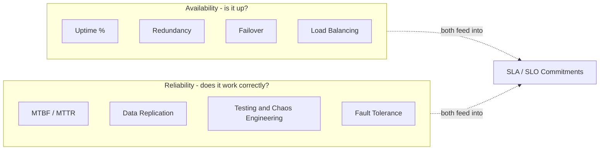

This page is organized into the following topics, each covering the core theory, a Mermaid diagram, a real-life use case, interview questions with answers, and a Java code example:

- [Availability \& Reliability](#availability--reliability)
  - [Blogs and websites](#blogs-and-websites)
  - [Medium](#medium)
  - [Youtube](#youtube)
  - [Theory](#theory)
    - [Introduction](#introduction)
    - [Measuring Availability: The Nines](#measuring-availability-the-nines)
    - [Reliability, MTBF, MTTR and MTTF](#reliability-mtbf-mttr-and-mttf)
    - [Single Point of Failure (SPOF)](#single-point-of-failure-spof)
    - [Redundancy: Active-Active vs Active-Passive](#redundancy-active-active-vs-active-passive)
    - [Load Balancing for Availability](#load-balancing-for-availability)
    - [Health Checks and Failover Mechanisms](#health-checks-and-failover-mechanisms)
    - [Geographic Distribution and Multi-Region Architecture](#geographic-distribution-and-multi-region-architecture)
    - [Data Replication for Reliability](#data-replication-for-reliability)
    - [Resilience Patterns: Circuit Breaker, Retry, Bulkhead, Timeout](#resilience-patterns-circuit-breaker-retry-bulkhead-timeout)
    - [Disaster Recovery: RTO and RPO](#disaster-recovery-rto-and-rpo)
    - [Chaos Engineering](#chaos-engineering)

### Measuring Availability: The Nines

**Availability** is defined as:

$$Availability = \frac{Uptime}{Uptime + Downtime}$$

It is conventionally expressed as a percentage of "nines". Each additional nine is an order of magnitude less downtime, and each additional nine is disproportionately more expensive and operationally difficult to achieve.

| Availability | Nines | Downtime/year | Downtime/month | Downtime/week |
|---|---|---|---|---|
| 99% | 2 nines | 3.65 days | 7.31 hours | 1.68 hours |
| 99.9% | 3 nines | 8.77 hours | 43.83 minutes | 10.08 minutes |
| 99.95% | 3.5 nines | 4.38 hours | 21.92 minutes | 5.04 minutes |
| 99.99% | 4 nines | 52.60 minutes | 4.38 minutes | 1.01 minutes |
| 99.999% | 5 nines | 5.26 minutes | 26.30 seconds | 6.05 seconds |
| 99.9999% | 6 nines | 31.56 seconds | 2.63 seconds | 0.60 seconds |

**Composite availability:** when components are chained in **series** (a request must pass through all of them), availabilities multiply and the overall availability is always lower than the weakest link:

$$A_{series} = A_1 \times A_2 \times ... \times A_n$$

When components are **redundant in parallel** (any one of them can serve the request), availability improves dramatically:

$$A_{parallel} = 1 - (1 - A_1) \times (1 - A_2) \times ... \times (1 - A_n)$$

For example, two independent servers each at 99% availability, in parallel, yield $1 - (0.01 \times 0.01) = 99.99\%$ combined - two individually 'unreliable' nodes together achieve four nines.

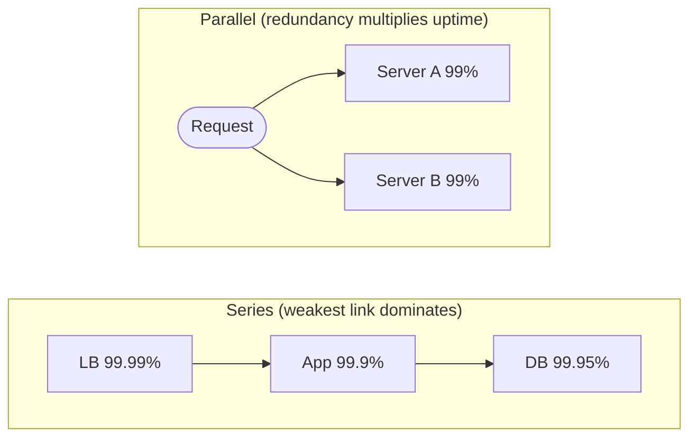

> **Real-life use case:** AWS's EC2 SLA guarantees 99.99% monthly uptime when instances are spread across two or more Availability Zones, but only 99.5% for a single instance in a single AZ - this is a direct, contractual application of the series-vs-parallel availability math, and is why architects are pushed toward multi-AZ deployments for anything with an availability commitment.

**Java: modeling composite availability**

```java
public class AvailabilityCalculator {

    // Series: every component must be up, so availabilities multiply.
    public static double seriesAvailability(double... componentAvailability) {
        double result = 1.0;
        for (double a : componentAvailability) {
            result *= a;
        }
        return result;
    }

    // Parallel: system is down only if every redundant component is down.
    public static double parallelAvailability(double... componentAvailability) {
        double allDown = 1.0;
        for (double a : componentAvailability) {
            allDown *= (1 - a);
        }
        return 1 - allDown;
    }

    public static double downtimeMinutesPerYear(double availability) {
        double minutesInYear = 365.25 * 24 * 60;
        return minutesInYear * (1 - availability);
    }

    public static void main(String[] args) {
        double lb = 0.9999;
        double app = 0.999;
        double db = 0.9995;

        double chained = seriesAvailability(lb, app, db);
        System.out.printf("Series availability: %.5f (%.2f min/year downtime)%n",
                chained, downtimeMinutesPerYear(chained));

        double redundantApp = parallelAvailability(0.99, 0.99);
        System.out.printf("Two 99%% app servers in parallel: %.5f%n", redundantApp);
    }
}
```

**Interview Q&A**

- **Q: Why does chaining more components in series always reduce overall availability?**
    A: Because the request depends on every component succeeding, so the probabilities multiply, and multiplying numbers less than 1 always produces a smaller number. A system with five 99.9% components in series is only about 99.5% available overall, even though each piece individually looks fine.
- **Q: If one server is 99% available, how do you get to 99.99% without buying a 'better' server?**
    A: Add a second independent, redundant server and route around failures (parallel composition). $1 - (0.01)^2 = 99.99\%$. Redundancy converts availability from additive risk into multiplicative reliability, as long as the failures are independent (not a shared power supply, rack, or region).
- **Q: What is the difference between availability and uptime SLA in a contract?**
    A: Uptime SLA is the contractual promise (e.g. 99.9%); actual availability is the measured, real-world value. SLAs usually include penalty clauses (service credits) if measured availability falls below the promise over a billing period.

---

### Reliability, MTBF, MTTR and MTTF

While availability is a snapshot ("is it up now?"), **reliability** is measured over the lifetime of a system using a small set of standard metrics:

- **MTBF (Mean Time Between Failures)** - average time between the end of one failure and the start of the next, for repairable systems. Higher is better.
- **MTTR (Mean Time To Repair / Recover)** - average time it takes to detect, diagnose, and fix a failure and restore service. Lower is better.
- **MTTF (Mean Time To Failure)** - average time a non-repairable component runs before it fails (used for parts that get replaced, not repaired, like a disk).

These tie directly back into availability:

$$Availability = \frac{MTBF}{MTBF + MTTR}$$

This formula is the reason two teams can target the same availability number via completely different strategies: one team lengthens MTBF (better hardware, more testing, fewer bugs shipped), while another shortens MTTR (better monitoring, automated failover, faster rollbacks) - in practice, **investing in MTTR is usually cheaper and faster to improve than MTBF**, which is why so much of reliability engineering focuses on detection and recovery speed rather than trying to prevent every possible failure.

```mermaid
gantt
    dateFormat  X
    axisFormat %s
    section Service Timeline
    Up (MTBF window) :done, up1, 0, 100
    Down (MTTR window) :crit, down1, 100, 110
    Up (MTBF window) :done, up2, 110, 220
    Down (MTTR window) :crit, down2, 220, 225
    Up (MTBF window) :done, up3, 225, 340
```

> **Real-life use case:** Google's Site Reliability Engineering (SRE) practice explicitly tracks MTTR as a first-class metric and invests heavily in automated rollback tooling and canary analysis, on the reasoning that most production incidents are caused by recent changes - so the fastest way to improve availability is to detect a bad deploy and roll it back in minutes, rather than trying to write bug-free code (an impossible target at Google's scale).

**Java: tracking MTBF/MTTR from an incident log**

```java
import java.time.Duration;
import java.time.Instant;
import java.util.List;

public class ReliabilityMetrics {

    public record Incident(Instant failureStart, Instant recoveredAt) {
        Duration downtime() {
            return Duration.between(failureStart, recoveredAt);
        }
    }

    public static Duration meanTimeToRepair(List<Incident> incidents) {
        long totalSeconds = incidents.stream()
                .mapToLong(i -> i.downtime().getSeconds())
                .sum();
        return Duration.ofSeconds(totalSeconds / incidents.size());
    }

    public static Duration meanTimeBetweenFailures(List<Incident> incidents) {
        long totalUpSeconds = 0;
        for (int i = 1; i < incidents.size(); i++) {
            Instant previousRecovery = incidents.get(i - 1).recoveredAt();
            Instant nextFailure = incidents.get(i).failureStart();
            totalUpSeconds += Duration.between(previousRecovery, nextFailure).getSeconds();
        }
        return Duration.ofSeconds(totalUpSeconds / (incidents.size() - 1));
    }

    public static double availabilityFrom(Duration mtbf, Duration mttr) {
        double mtbfSeconds = mtbf.getSeconds();
        double mttrSeconds = mttr.getSeconds();
        return mtbfSeconds / (mtbfSeconds + mttrSeconds);
    }
}
```

**Interview Q&A**

- **Q: A system has MTBF of 720 hours and MTTR of 4 hours. What is its availability?**
    A: $720 / (720 + 4) = 99.45\%$. This shows why both numbers matter: doubling MTBF to 1440 hours only gets you to 99.72%, but halving MTTR to 2 hours gets you to 99.72% as well - improving recovery speed can be just as impactful as improving failure frequency, and is usually far cheaper.
- **Q: What's the difference between MTBF and MTTF, and when would you use each?**
    A: MTBF applies to repairable systems/components (a server that gets fixed and put back into rotation); MTTF applies to non-repairable items that are simply replaced on failure (a hard drive, a light bulb). Cloud infrastructure discussions mostly use MTBF/MTTR since servers are 'repaired' via replacement/restart/redeploy rather than literally fixed.
- **Q: Why do SRE teams often prioritize reducing MTTR over increasing MTBF?**
    A: MTTR improvements (better alerting, automated rollback, runbooks, feature flags to disable bad code paths) are typically faster and cheaper to implement than MTBF improvements (which require deeper investment in code quality, hardware redundancy, and testing), and the availability formula shows that shrinking MTTR has a direct, immediate, multiplicative effect on uptime.

---

### Single Point of Failure (SPOF)

A **Single Point of Failure** is any single component whose failure alone is enough to take down the entire system, regardless of how well every other component performs. Identifying and eliminating SPOFs is usually the first and highest-leverage step in any availability review, because a system's true availability ceiling is set by its weakest, least-redundant link, not by the average health of its components.

**Common SPOFs in real systems:**
- A single application server with no replicas.
- A single database instance with no replica/standby.
- A single load balancer with no secondary/failover pair.
- A single network path, switch, or router.
- A single data center or availability zone.
- A single on-call engineer who is the only person who knows how to operate a critical system (a 'human SPOF').
- A single third-party dependency with no fallback (e.g. one payment processor, one DNS provider).

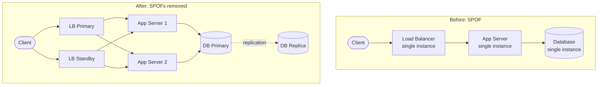

**How to find SPOFs:** draw the full request path end-to-end (client to LB to app to cache to database to any third-party call) and ask, for every box on the diagram, *"if this one box disappears right now, does the system still serve traffic?"* Any box where the answer is 'no' is a SPOF and is a candidate for redundancy.

> **Real-life use case:** In 2017, an engineer at a major cloud provider ran a maintenance command that took more capacity offline than intended in a single region's storage subsystem, and because a large portion of the internet's images, static assets, and even status-check widgets depended on that one region with no cross-region fallback, thousands of unrelated websites broke simultaneously - a textbook illustration of a shared, unrecognized SPOF (a 'single region' dependency) rippling far beyond its own boundary.

**Java: detecting SPOFs by modeling the dependency graph**

```java
import java.util.*;

public class SpofDetector {

    // Directed edge: "from" depends on "to" to serve a request.
    record Dependency(String from, String to) {}

    public static Set<String> findSinglePointsOfFailure(
            Set<String> nodes, List<Dependency> edges, String entryPoint,
            Map<String, Integer> replicaCount) {

        Set<String> spofs = new LinkedHashSet<>();
        for (String node : nodes) {
            int replicas = replicaCount.getOrDefault(node, 1);
            if (replicas <= 1 && isOnDependencyPath(node, edges)) {
                spofs.add(node);
            }
        }
        return spofs;
    }

    private static boolean isOnDependencyPath(String node, List<Dependency> edges) {
        return edges.stream().anyMatch(e -> e.to().equals(node) || e.from().equals(node));
    }

    public static void main(String[] args) {
        Set<String> nodes = Set.of("LoadBalancer", "AppServer", "Database", "CacheCluster");
        List<Dependency> edges = List.of(
                new Dependency("LoadBalancer", "AppServer"),
                new Dependency("AppServer", "Database"),
                new Dependency("AppServer", "CacheCluster"));

        Map<String, Integer> replicaCount = Map.of(
                "LoadBalancer", 1,
                "AppServer", 3,
                "Database", 1,
                "CacheCluster", 3);

        Set<String> spofs = findSinglePointsOfFailure(nodes, edges, "LoadBalancer", replicaCount);
        System.out.println("SPOFs found: " + spofs); // [LoadBalancer, Database]
    }
}
```

**Interview Q&A**

- **Q: How do you systematically find SPOFs in an existing architecture?**
    A: Draw the full request path as a dependency graph, then for every node ask whether removing it alone breaks the request path, and check its actual replica count (not its intended one - a 'cluster' that has silently scaled down to one node is still a SPOF). Also look beyond infrastructure: a single on-call engineer, a single manual deployment step, or a single third-party integration are SPOFs too.
- **Q: Does adding a second server automatically eliminate a SPOF?**
    A: Only if the second server is truly independent - different rack, power supply, network path, and ideally a different availability zone - and if traffic is actually routed to it via health-checked load balancing. Two servers behind a single load balancer just moves the SPOF up one layer, unless the load balancer itself is also made redundant.
- **Q: Can you ever fully eliminate all SPOFs?**
    A: In practice no - there is almost always some shared dependency (a cloud provider's global control plane, a domain registrar, a root DNS, a compliance authority) that could theoretically be a SPOF. The goal is to eliminate SPOFs proportional to their business impact and probability, not to chase a theoretical zero.

---

### Redundancy: Active-Active vs Active-Passive

**Redundancy** means running more than one instance of a component so that if one fails, another can take over. There are two dominant redundancy models:

- **Active-Active**: all redundant instances handle traffic simultaneously, all the time. If one fails, the others simply absorb its share of load. This gives the best resource utilization and the fastest failover (there's no 'cold start'), but requires all instances to be kept in sync (stateless services, or a data layer that handles concurrent writes).
- **Active-Passive (Active-Standby)**: one instance handles all traffic while one or more standby instances stay idle (or 'warm'), ready to take over if the active one fails. Simpler to reason about (no concurrent-write conflicts) but wastes standby capacity and failover takes longer (detect failure, promote standby, redirect traffic).

| | Active-Active | Active-Passive |
|---|---|---|
| Resource utilization | High - all nodes serve traffic | Low - standby sits idle |
| Failover time | Near-zero (already serving) | Seconds to minutes (promotion + routing change) |
| Complexity | Higher (data sync, conflict resolution) | Lower (single writer) |
| Best for | Stateless services, read replicas | Databases, systems needing a single writer |

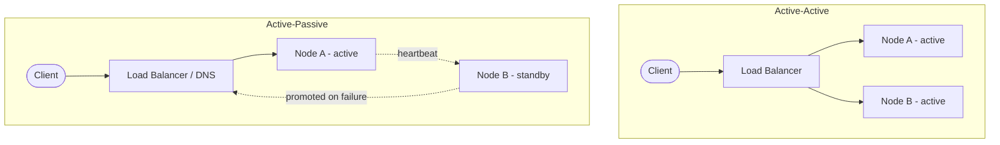

> **Real-life use case:** Most managed relational databases (e.g. AWS RDS Multi-AZ, Azure SQL failover groups) run active-passive: one primary handles all writes, and a synchronously replicated standby in another AZ is promoted to primary automatically within roughly 60-120 seconds if the primary fails - fast enough for most business applications, without the complexity of multi-writer conflict resolution.

**Java: a simple active-passive failover coordinator**

```java
import java.util.concurrent.atomic.AtomicReference;

public class ActivePassiveFailover {

    enum Role { ACTIVE, STANDBY }

    static class Node {
        final String id;
        volatile Role role;
        volatile boolean healthy = true;

        Node(String id, Role role) {
            this.id = id;
            this.role = role;
        }
    }

    private final AtomicReference<Node> currentActive;
    private final Node standby;

    public ActivePassiveFailover(Node active, Node standby) {
        this.currentActive = new AtomicReference<>(active);
        this.standby = standby;
    }

    // Called periodically by a health-check / heartbeat monitor.
    public void onHeartbeatMissed(Node node) {
        node.healthy = false;
        if (node == currentActive.get() && standby.healthy) {
            promoteStandby();
        }
    }

    private void promoteStandby() {
        standby.role = Role.ACTIVE;
        currentActive.set(standby);
        System.out.println("Failover: " + standby.id + " promoted to ACTIVE");
    }

    public Node getActiveNode() {
        return currentActive.get();
    }
}
```

**Interview Q&A**

- **Q: Why would you choose active-passive over active-active for a database, even though it wastes capacity?**
    A: Because a database typically needs a single source of truth for writes to avoid conflicting updates. Active-active writable databases require conflict resolution (last-write-wins, CRDTs, or application-level merge logic), which is far more complex than accepting one idle standby node in exchange for simplicity and strong consistency.
- **Q: What causes failover time in active-passive setups, and how can it be reduced?**
    A: Failover time = detection time (how long until the health check confirms the primary is truly down) + promotion time (standby catching up on any replication lag and becoming writable) + redirection time (DNS TTL, connection pool reconnects, load balancer re-routing). It's reduced with faster/more frequent health checks, synchronous (not asynchronous) replication so there's no catch-up lag, and low-TTL DNS or a virtual IP that can move instantly.
- **Q: What's a 'split-brain' scenario and how does it relate to active-passive redundancy?**
    A: Split-brain happens when a network partition makes the standby believe the primary is dead (so it promotes itself) while the primary is actually still alive and serving traffic - now two nodes both think they're the writable primary. It's mitigated with quorum-based consensus (e.g. requiring a majority of nodes to agree before promoting) or a fencing mechanism that guarantees the old primary is forcibly shut down before the standby takes over.

---

### Load Balancing for Availability

A **load balancer** is not just a performance tool for spreading traffic - it is one of the primary mechanisms for availability, because it can detect an unhealthy backend and stop sending it traffic within seconds, without any client ever noticing.

**Key availability-relevant load balancer behaviors:**
- **Health checks**: periodic probes (HTTP `/health`, TCP connect, or a custom check) that determine whether a backend is eligible to receive traffic.
- **Automatic ejection**: instances failing health checks are removed from the rotation immediately, before real user traffic hits them.
- **Automatic re-admission**: once an ejected instance starts passing health checks again, it's gradually re-added (often with connection draining/slow-start to avoid a cold-cache thundering herd).
- **Layer 4 vs Layer 7**: L4 load balancers (TCP/UDP) are faster but blind to application content; L7 load balancers (HTTP-aware) can route on path/header and return proper error responses when all backends are down.

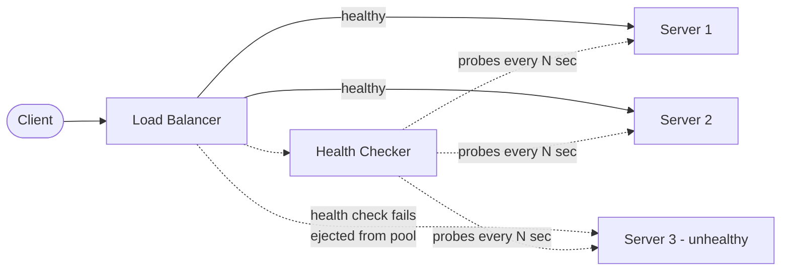

> **Real-life use case:** AWS Elastic Load Balancer (ALB/NLB) runs configurable health checks (default every 30 seconds, configurable down to 5 seconds) against each registered target; after a configurable threshold of consecutive failures (default 2-3), the target is marked 'unhealthy' and traffic stops flowing to it within roughly 10-15 seconds, well before most users would notice a slow or broken backend on their own.

**Java: a minimal health-check-aware load balancer**

```java
import java.net.URI;
import java.net.http.HttpClient;
import java.net.http.HttpRequest;
import java.net.http.HttpResponse;
import java.time.Duration;
import java.util.List;
import java.util.concurrent.CopyOnWriteArrayList;
import java.util.concurrent.Executors;
import java.util.concurrent.ScheduledExecutorService;
import java.util.concurrent.TimeUnit;
import java.util.concurrent.atomic.AtomicInteger;

public class HealthCheckedLoadBalancer {

    private final List<String> backends;
    private final CopyOnWriteArrayList<String> healthyBackends = new CopyOnWriteArrayList<>();
    private final HttpClient client = HttpClient.newHttpClient();
    private final AtomicInteger roundRobinIndex = new AtomicInteger(0);

    public HealthCheckedLoadBalancer(List<String> backends) {
        this.backends = backends;
        this.healthyBackends.addAll(backends);

        ScheduledExecutorService scheduler = Executors.newSingleThreadScheduledExecutor();
        scheduler.scheduleAtFixedRate(this::runHealthChecks, 0, 5, TimeUnit.SECONDS);
    }

    private void runHealthChecks() {
        for (String backend : backends) {
            boolean healthy = isHealthy(backend);
            if (healthy && !healthyBackends.contains(backend)) {
                healthyBackends.add(backend);
                System.out.println(backend + " re-admitted to pool");
            } else if (!healthy && healthyBackends.contains(backend)) {
                healthyBackends.remove(backend);
                System.out.println(backend + " ejected from pool");
            }
        }
    }

    private boolean isHealthy(String backend) {
        try {
            HttpRequest request = HttpRequest.newBuilder()
                    .uri(URI.create(backend + "/health"))
                    .timeout(Duration.ofSeconds(2))
                    .GET()
                    .build();
            HttpResponse<Void> response = client.send(request, HttpResponse.BodyHandlers.discarding());
            return response.statusCode() == 200;
        } catch (Exception e) {
            return false;
        }
    }

    public String pickBackend() {
        if (healthyBackends.isEmpty()) {
            throw new IllegalStateException("No healthy backends available");
        }
        int index = roundRobinIndex.getAndIncrement() % healthyBackends.size();
        return healthyBackends.get(index);
    }
}
```

**Interview Q&A**

- **Q: What's the difference between a liveness check and a readiness check, and why do both matter for availability?**
    A: A liveness check asks whether the process is still running/responsive at all (used to decide whether to restart it); a readiness check asks whether this instance is currently able to serve traffic correctly (used to decide whether to route traffic to it). A service can be alive but not ready (e.g. still warming up a cache or reconnecting to a database) - routing traffic to a live-but-not-ready instance causes errors even though the process itself hasn't crashed.
- **Q: How do you avoid a 'thundering herd' when a large batch of previously unhealthy servers suddenly become healthy at once?**
    A: Use slow-start / gradual traffic ramp-up when re-admitting instances (send them a small percentage of traffic first, increasing over seconds/minutes), and stagger health-check recovery so not every instance is re-admitted at the exact same tick.
- **Q: Why might a Layer 7 load balancer be preferred over Layer 4 for availability, despite the extra overhead?**
    A: L7 load balancers understand HTTP status codes and can distinguish 'connection refused' from '200 OK with an error body', can return a proper fallback/error page when all backends are down instead of just dropping the TCP connection, and can route based on path/header to isolate a failing feature from healthy ones - all of which improve the user-perceived availability beyond what pure TCP-level balancing can do.

---

### Health Checks and Failover Mechanisms

A **health check** is a mechanism (usually a lightweight probe) used to determine whether a component is functioning correctly; a **failover mechanism** is the automated process that reacts to a failed health check by redirecting traffic or promoting a standby.

**Types of health checks:**
- **Shallow health check**: just confirms the process is running and responding (e.g. `GET /health` returns `200 OK`). Fast, but can give false confidence - the process might be up while its database connection is dead.
- **Deep health check**: verifies the component's actual dependencies (database connectivity, downstream service reachability, disk space, queue depth). More accurate, but slower and can cause cascading failures if not designed carefully (e.g. every instance simultaneously reporting unhealthy because a shared database is briefly slow).
- **Synthetic transactions**: periodically executing a realistic end-to-end operation (e.g. 'log in and fetch the home page') from outside the system, closest to what a real user experiences.

**Failover mechanisms** built on top of health checks:
- DNS failover (update a DNS record to point at a healthy region, subject to TTL delay).
- Load balancer target de-registration (covered above).
- Database primary/standby promotion (via a consensus protocol or an orchestrator like Patroni/Zookeeper).
- Client-side failover (client library retries against a secondary endpoint after a request fails).

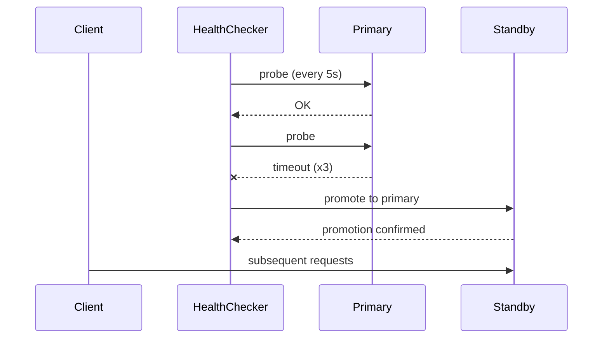

> **Real-life use case:** PostgreSQL clusters managed by Patroni use a distributed consensus store (etcd/Zookeeper/Consul) as the source of truth for who is currently the primary. When Patroni's health check on the current primary fails a configurable number of times, it triggers a leader election among the replicas, promotes the most up-to-date one, and updates the routing layer (HAProxy/PgBouncer) - typically completing failover in under 30 seconds without any manual intervention.

**Java: a simple failover-aware client wrapper**

```java
import java.util.List;
import java.util.function.Function;

public class FailoverClient<T> {

    private final List<String> endpointsInPriorityOrder;
    private final Function<String, T> requestExecutor;

    public FailoverClient(List<String> endpointsInPriorityOrder, Function<String, T> requestExecutor) {
        this.endpointsInPriorityOrder = endpointsInPriorityOrder;
        this.requestExecutor = requestExecutor;
    }

    public T executeWithFailover() {
        RuntimeException lastError = null;
        for (String endpoint : endpointsInPriorityOrder) {
            try {
                return requestExecutor.apply(endpoint);
            } catch (RuntimeException e) {
                System.out.println("Endpoint failed: " + endpoint + " (" + e.getMessage() + "), trying next");
                lastError = e;
            }
        }
        throw new IllegalStateException("All endpoints failed", lastError);
    }
}
```

**Interview Q&A**

- **Q: What's the danger of relying only on deep health checks?**
    A: A deep health check that verifies a shared dependency (like a database) can cause every instance to report unhealthy at the same moment if that shared dependency has a brief hiccup, potentially taking the entire fleet out of rotation simultaneously - which turns a small backend blip into a full outage. A common mitigation is to combine deep checks with circuit breakers or thresholds so momentary dependency slowness doesn't immediately eject every instance.
- **Q: Why does DNS failover tend to be slower and less reliable than load-balancer-based failover?**
    A: DNS records have a TTL, and many clients/resolvers cache beyond the stated TTL, so updating a DNS record doesn't guarantee all clients pick up the change quickly - failover can take minutes rather than seconds. Load-balancer-based failover happens at the connection-routing layer clients already trust, with no caching layer to fight against.
- **Q: What's the tradeoff in setting health check failure thresholds very low (e.g. eject after 1 failed probe) vs higher (e.g. 3-5 failed probes)?**
    A: A low threshold reacts to real failures fast but risks flapping - ejecting healthy instances due to a single transient network blip or GC pause. A higher threshold is more tolerant of noise but means genuinely failed instances keep receiving traffic (and returning errors) for longer before being removed. Most production systems use a moderate threshold (2-3 consecutive failures) with a shorter interval between probes to balance the two.

---

### Geographic Distribution and Multi-Region Architecture

**Geographic distribution** spreads a system's infrastructure across multiple physically separate locations (availability zones within a region, or entirely separate regions/continents) so that the failure of one location, or an event that affects an entire location (power outage, natural disaster, regional network issue), doesn't take down the whole system.

**Levels of geographic redundancy:**
- **Multi-AZ**: replicas in different data centers within the same metro region, connected by low-latency private links. Protects against a single data center failure (power, cooling, hardware). Most cloud 'high availability' defaults operate at this level.
- **Multi-region**: full replicas of the system in geographically distant regions (e.g. `us-east` and `eu-west`). Protects against region-wide events and also reduces latency for geographically distributed users, but introduces much higher replication latency and cost.
- **Multi-cloud**: replicas across entirely different cloud providers. Protects against a systemic failure or outage of an entire cloud provider, at the cost of significant operational complexity (different APIs, tooling, and networking models per provider).

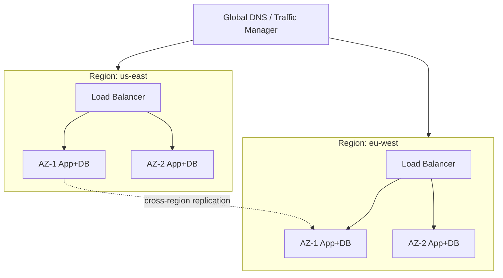

> **Real-life use case:** Netflix runs across multiple AWS regions and uses its own tooling to shift all traffic away from an entire region within minutes if a regional failure is detected, a strategy proven during real AWS regional incidents where Netflix continued operating because it had already engineered for full-region loss as an expected failure mode rather than a rare edge case.

**Java: a simple region-failover traffic router**

```java
import java.util.List;
import java.util.Map;
import java.util.concurrent.atomic.AtomicReference;

public class RegionRouter {

    record Region(String name, String endpoint) {}

    private final List<Region> regionsByPriority;
    private final Map<String, Boolean> regionHealth;
    private final AtomicReference<Region> currentRegion;

    public RegionRouter(List<Region> regionsByPriority, Map<String, Boolean> regionHealth) {
        this.regionsByPriority = regionsByPriority;
        this.regionHealth = regionHealth;
        this.currentRegion = new AtomicReference<>(regionsByPriority.get(0));
    }

    // Called by a monitoring loop when a region's health status changes.
    public void updateRegionHealth(String regionName, boolean healthy) {
        regionHealth.put(regionName, healthy);
        if (currentRegion.get().name().equals(regionName) && !healthy) {
            failoverToNextHealthyRegion();
        }
    }

    private void failoverToNextHealthyRegion() {
        for (Region region : regionsByPriority) {
            if (regionHealth.getOrDefault(region.name(), false)) {
                currentRegion.set(region);
                System.out.println("Failed over to region: " + region.name());
                return;
            }
        }
        throw new IllegalStateException("No healthy region available");
    }

    public Region activeRegion() {
        return currentRegion.get();
    }
}
```

**Interview Q&A**

- **Q: What's the main tradeoff of going from multi-AZ to multi-region?**
    A: Multi-region protects against a much larger blast radius (an entire region going down, not just one data center), but cross-region network latency (tens to hundreds of milliseconds) makes synchronous replication impractical for most workloads, forcing a choice between asynchronous replication (risking some data loss on failover) or accepting the latency cost of synchronous cross-region writes.
- **Q: Why is multi-region alone not sufficient if your DNS/traffic-routing layer is itself single-region?**
    A: If the global traffic manager, DNS, or the control plane that decides which region receives traffic is itself hosted in only one location, it becomes a new SPOF that can defeat the entire purpose of multi-region redundancy - the routing/failover mechanism itself must be globally distributed or provided by a provider whose SLA guarantees global resilience.
- **Q: When would multi-cloud make sense despite its operational cost?**
    A: When the acceptable risk tolerance is so low that even a full cloud-provider outage (control plane, IAM, or a systemic issue affecting many regions of one provider simultaneously) must be survivable, or when regulatory/contractual requirements mandate it. For most companies, multi-region within a single well-chosen cloud provider offers a much better cost-to-resilience ratio than multi-cloud.

---

### Data Replication for Reliability

**Replication** keeps copies of the same data on multiple nodes so that reads/writes can continue, and no data is lost, even if one node fails. It underpins both availability (a replica can take over) and reliability (data survives individual node failures).

**Replication strategies:**
- **Synchronous replication**: the primary waits for acknowledgment from replica(s) before confirming a write to the client. Guarantees zero data loss on failover (RPO = 0), but adds latency proportional to the round trip to the replica, and can block writes entirely if the replica is unreachable.
- **Asynchronous replication**: the primary confirms the write immediately and streams changes to replicas afterward. Fast writes with no added latency, but a primary failure can lose any writes that hadn't yet reached the replica (non-zero RPO).
- **Semi-synchronous replication**: a middle ground - the primary waits for acknowledgment from at least one replica (not all), balancing durability and latency.

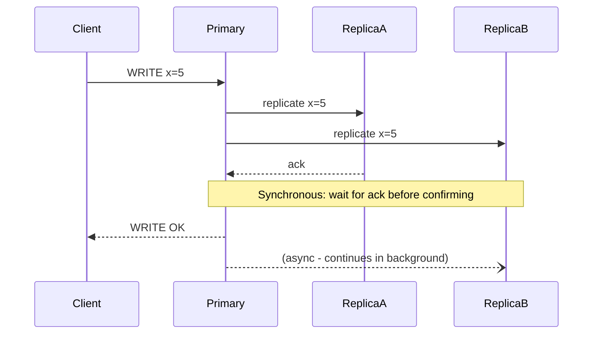

> **Real-life use case:** MongoDB replica sets use asynchronous replication by default (fast writes) but support a configurable write concern (`w: "majority"`) that makes a write wait for acknowledgment from a majority of replicas before confirming success to the client - a practical example of an application choosing, per-operation, exactly where on the synchronous-to-asynchronous spectrum it needs to sit based on how critical that particular write is.

**Java: a minimal replication acknowledgment tracker (quorum write)**

```java
import java.util.List;
import java.util.concurrent.*;

public class QuorumReplicator {

    private final List<String> replicaNodes;
    private final int quorumSize;
    private final ExecutorService executor = Executors.newFixedThreadPool(4);

    public QuorumReplicator(List<String> replicaNodes) {
        this.replicaNodes = replicaNodes;
        // Majority quorum, e.g. 2 out of 3 nodes.
        this.quorumSize = (replicaNodes.size() / 2) + 1;
    }

    public boolean write(String key, String value) throws InterruptedException {
        CompletionService<Boolean> completionService = new ExecutorCompletionService<>(executor);

        for (String node : replicaNodes) {
            completionService.submit(() -> replicateTo(node, key, value));
        }

        int acknowledged = 0;
        for (int i = 0; i < replicaNodes.size(); i++) {
            try {
                Future<Boolean> result = completionService.poll(2, TimeUnit.SECONDS);
                if (result != null && result.get()) {
                    acknowledged++;
                }
                if (acknowledged >= quorumSize) {
                    return true; // quorum reached, safe to confirm write to client
                }
            } catch (ExecutionException e) {
                // node failed to replicate, continue waiting for others
            }
        }
        return acknowledged >= quorumSize;
    }

    private boolean replicateTo(String node, String key, String value) {
        // Simulated network call to replicate the write to a node.
        return true;
    }
}
```

**Interview Q&A**

- **Q: What is RPO and how does it relate to replication strategy?**
    A: RPO (Recovery Point Objective) is the maximum acceptable amount of data loss, measured in time. Synchronous replication gives RPO = 0 (no committed write is ever lost); asynchronous replication has an RPO equal to however much data can be 'in flight' and unreplicated at the moment of failure - directly determined by replication lag.
- **Q: Why not just always use synchronous replication to guarantee zero data loss?**
    A: Synchronous replication ties your write latency to the slowest required replica's round-trip time, and if that replica becomes unreachable, writes can stall or fail entirely - trading availability and latency for durability. Most systems use synchronous replication only within a low-latency zone (same data center/region) and asynchronous replication across higher-latency links (cross-region).
- **Q: What is 'quorum' writing and why is majority (N/2 + 1) the common choice?**
    A: Quorum writing requires acknowledgment from a subset of replicas before confirming success. Using a majority guarantees that any two quorums (one for a write, one for a subsequent read) must overlap by at least one node, which is what guarantees the read will see the latest write - this is the mathematical basis of strong consistency in quorum-based systems like Cassandra or DynamoDB when configured with `W + R > N`.

---

### Resilience Patterns: Circuit Breaker, Retry, Bulkhead, Timeout

Even with redundancy and replication, individual calls between services can still fail or slow down. **Resilience patterns** are defensive coding techniques applied at the call site to prevent a single failing dependency from cascading into a system-wide outage.

- **Timeout**: never wait indefinitely for a dependency; give up after a bounded time so a slow dependency can't hold resources (threads, connections) forever.
- **Retry**: re-attempt a failed call, usually with **exponential backoff and jitter** to avoid synchronized retry storms overwhelming an already-struggling dependency.
- **Circuit breaker**: after a threshold of failures, 'open' the circuit and stop calling the failing dependency entirely for a cooldown period, failing fast instead of piling up slow/failed calls - then periodically test ('half-open') whether the dependency has recovered.
- **Bulkhead**: isolate resources (thread pools, connection pools) per dependency so that one slow/failing dependency can't exhaust resources needed to call other, healthy dependencies - named after ship compartments that prevent one flooded section from sinking the whole vessel.

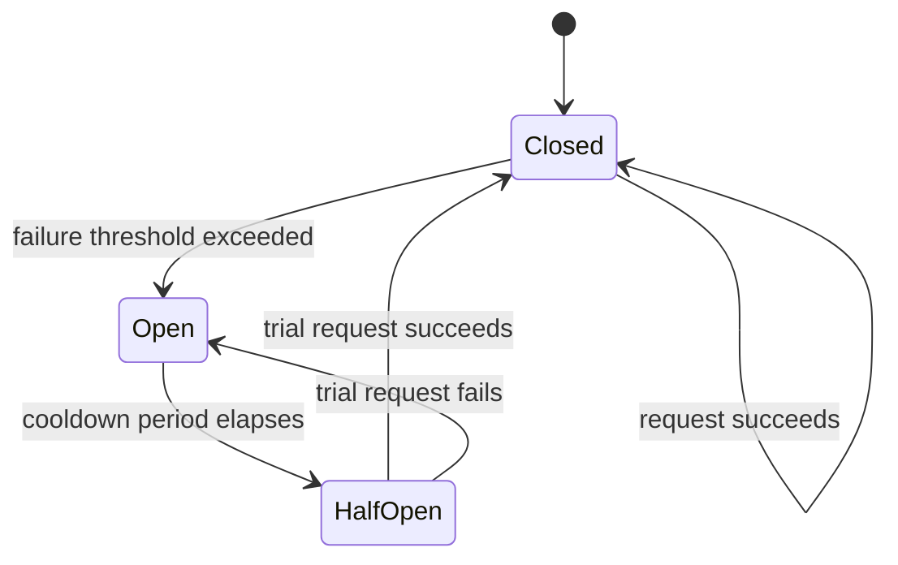

> **Real-life use case:** Netflix's Hystrix library (and its modern successor resilience4j) pioneered the circuit breaker and bulkhead pattern at scale in production, isolating each downstream dependency (recommendations, ratings, similar-titles) behind its own thread pool and circuit breaker so that if the recommendations service becomes slow, only recommendation widgets degrade or disappear from the page - the rest of Netflix's UI (playback, search, browsing) keeps working normally.

**Java: circuit breaker + retry + timeout using resilience4j-style logic**

```java
import java.time.Duration;
import java.time.Instant;
import java.util.concurrent.Callable;

public class SimpleCircuitBreaker {

    enum State { CLOSED, OPEN, HALF_OPEN }

    private State state = State.CLOSED;
    private int consecutiveFailures = 0;
    private final int failureThreshold = 5;
    private final Duration cooldown = Duration.ofSeconds(30);
    private Instant openedAt;

    public synchronized <T> T call(Callable<T> action, T fallback) {
        if (state == State.OPEN) {
            if (Duration.between(openedAt, Instant.now()).compareTo(cooldown) >= 0) {
                state = State.HALF_OPEN;
            } else {
                return fallback; // fail fast, don't even attempt the call
            }
        }

        try {
            T result = withTimeoutAndRetry(action);
            onSuccess();
            return result;
        } catch (Exception e) {
            onFailure();
            return fallback;
        }
    }

    private <T> T withTimeoutAndRetry(Callable<T> action) throws Exception {
        int maxAttempts = 3;
        long backoffMs = 100;
        Exception lastError = null;

        for (int attempt = 1; attempt <= maxAttempts; attempt++) {
            try {
                return action.call();
            } catch (Exception e) {
                lastError = e;
                Thread.sleep(backoffMs * attempt); // exponential backoff
            }
        }
        throw lastError;
    }

    private void onSuccess() {
        consecutiveFailures = 0;
        state = State.CLOSED;
    }

    private void onFailure() {
        consecutiveFailures++;
        if (consecutiveFailures >= failureThreshold) {
            state = State.OPEN;
            openedAt = Instant.now();
        }
    }
}
```

**Interview Q&A**

- **Q: Why is 'retry' alone potentially dangerous without a circuit breaker?**
    A: If a dependency is genuinely down or overloaded, blind retries from every caller multiply the load on it (a 'retry storm'), making recovery harder or even causing a cascading failure across upstream services. A circuit breaker stops calls entirely once failures exceed a threshold, giving the dependency room to recover instead of being retried into the ground.
- **Q: What problem does a bulkhead solve that a circuit breaker alone does not?**
    A: A circuit breaker decides whether to call a dependency at all, but if calls to a slow dependency are still in flight using a shared thread pool, they can exhaust that shared pool and block calls to other, unrelated, healthy dependencies too. Bulkheads give each dependency its own isolated pool of resources so one slow dependency can only ever exhaust its own allocation, not the whole application's capacity.
- **Q: Why use exponential backoff with jitter instead of a fixed retry interval?**
    A: A fixed interval causes many clients that failed at the same moment (e.g. during a brief outage) to retry at exactly the same time again, creating synchronized load spikes ('thundering herd'). Exponential backoff spreads retries out over increasing intervals, and adding random jitter further desynchronizes clients so their retries don't all land in the same instant.

---

### Disaster Recovery: RTO and RPO

**Disaster Recovery (DR)** is the plan and infrastructure for restoring service after a catastrophic failure (data center loss, region-wide outage, major data corruption, or ransomware). Two metrics define every DR strategy:

- **RTO (Recovery Time Objective)**: how long can the system be down before it's back up? (Measures downtime tolerance.)
- **RPO (Recovery Point Objective)**: how much data can be lost, measured as a time window? (Measures data-loss tolerance, driven by replication/backup frequency.)

**Common DR strategies, in increasing order of cost and decreasing order of RTO/RPO:**

| Strategy | RTO | RPO | Cost | Description |
|---|---|---|---|---|
| Backup & Restore | Hours to days | Hours (since last backup) | Lowest | Periodic backups stored offsite; restore from scratch on disaster |
| Pilot Light | Tens of minutes | Minutes | Low | Minimal core infrastructure always running; scale up rest on demand |
| Warm Standby | Minutes | Seconds to minutes | Medium | Scaled-down full replica running continuously; scale up on failover |
| Hot Standby / Multi-Site Active-Active | Near-zero | Near-zero | Highest | Full-scale replica actively serving traffic already |

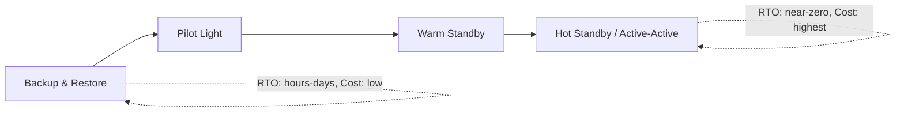

> **Real-life use case:** Financial institutions subject to regulatory business-continuity requirements typically run a hot standby / active-active DR strategy for core transaction systems (near-zero RTO/RPO, mandated by regulators), while less critical internal reporting systems might only need a nightly backup-and-restore strategy - the DR investment is deliberately proportional to the business criticality and regulatory requirement of each system, not applied uniformly.

**Java: a DR strategy selector based on RTO/RPO requirements**

```java
import java.time.Duration;

public class DisasterRecoveryPlanner {

    enum Strategy { BACKUP_RESTORE, PILOT_LIGHT, WARM_STANDBY, HOT_STANDBY }

    public static Strategy recommend(Duration requiredRto, Duration requiredRpo) {
        if (requiredRto.compareTo(Duration.ofMinutes(1)) <= 0
                && requiredRpo.compareTo(Duration.ofSeconds(30)) <= 0) {
            return Strategy.HOT_STANDBY;
        }
        if (requiredRto.compareTo(Duration.ofMinutes(15)) <= 0
                && requiredRpo.compareTo(Duration.ofMinutes(5)) <= 0) {
            return Strategy.WARM_STANDBY;
        }
        if (requiredRto.compareTo(Duration.ofHours(1)) <= 0) {
            return Strategy.PILOT_LIGHT;
        }
        return Strategy.BACKUP_RESTORE;
    }

    public static void main(String[] args) {
        // A payments system with strict continuity requirements:
        Strategy paymentsStrategy = recommend(Duration.ofSeconds(30), Duration.ofSeconds(5));
        System.out.println("Payments DR strategy: " + paymentsStrategy); // HOT_STANDBY

        // An internal reporting dashboard with relaxed requirements:
        Strategy reportingStrategy = recommend(Duration.ofHours(12), Duration.ofHours(6));
        System.out.println("Reporting DR strategy: " + reportingStrategy); // BACKUP_RESTORE
    }
}
```

**Interview Q&A**

- **Q: What's the practical difference between RTO and RPO, using a concrete example?**
    A: If a database fails at 2:00 PM and the last backup was taken at 1:00 PM, and the team restores service by 2:30 PM: the RPO realized is 1 hour (all writes between 1:00 and 2:00 PM are lost), and the RTO realized is 30 minutes (time from failure to restored service). Business requirements set target RTO/RPO values, and infrastructure/backup frequency is chosen to meet them.
- **Q: Why would a company deliberately choose a cheaper DR strategy with a worse RTO/RPO for some systems?**
    A: Because hot-standby/active-active DR is expensive (running a full duplicate environment continuously), and not every system justifies that cost - an internal analytics dashboard that can tolerate a few hours of downtime and losing a day's data doesn't need the same investment as a payments ledger. DR strategy should match the actual business cost of downtime/data loss for that specific system.
- **Q: What's often the hardest part of a DR plan to get right, beyond just replicating data?**
    A: Actually testing the failover regularly - a DR plan that has never been executed in practice frequently fails when it's actually needed, due to stale runbooks, expired credentials, missing DNS updates, or configuration drift between primary and DR environments - which is why regular DR drills / game days are considered as important as the replication technology itself.

---

### Chaos Engineering

**Chaos Engineering** is the discipline of deliberately injecting failures into a system, in a controlled way, to verify that its redundancy, failover, and resilience mechanisms actually work as designed, before a real, uncontrolled failure proves otherwise.

**Core principle:** most availability mechanisms (failover, retries, circuit breakers) are only ever tested 'for real' during an actual outage, at the worst possible time. Chaos engineering shifts that test to a planned, controlled moment.

**Common chaos experiments:**
- Randomly terminating production instances (Netflix's original 'Chaos Monkey').
- Injecting network latency or packet loss between services.
- Simulating an entire availability zone or region going offline.
- Injecting CPU/memory/disk pressure on a host.
- Corrupting or delaying responses from a dependency to test timeout/circuit-breaker behavior.

**The Principles of Chaos Engineering (from Netflix's original framework):**
1. Define a steady-state hypothesis (a measurable signal of 'normal' behavior, e.g. request success rate).
2. Vary real-world events (server crash, network failure, latency spike).
3. Run experiments in production (or as close to it as possible - staging rarely reveals the same failure modes).
4. Automate experiments to run continuously.
5. Minimize blast radius (start small, with the ability to abort immediately).

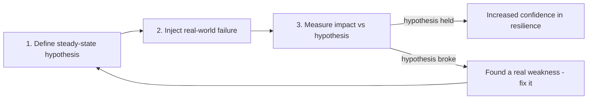

> **Real-life use case:** Netflix's Chaos Monkey randomly terminates production instances during business hours (when engineers are around to respond), forcing every service to be built assuming instances can and will disappear at any time - this cultural and technical discipline is a major reason Netflix's architecture tolerates routine instance failures, deployments, and even full AWS regional incidents with minimal customer-visible impact.

**Java: a simple chaos-injection wrapper for testing resilience**

```java
import java.util.Random;
import java.util.concurrent.Callable;

public class ChaosInjector<T> {

    private final Random random = new Random();
    private final double failureProbability;
    private final int extraLatencyMs;
    private volatile boolean enabled = false;

    public ChaosInjector(double failureProbability, int extraLatencyMs) {
        this.failureProbability = failureProbability;
        this.extraLatencyMs = extraLatencyMs;
    }

    public void enable() { this.enabled = true; }
    public void disable() { this.enabled = false; }

    public T callWithChaos(Callable<T> realCall) throws Exception {
        if (!enabled) {
            return realCall.call();
        }

        if (extraLatencyMs > 0) {
            Thread.sleep(extraLatencyMs); // simulate network latency injection
        }

        if (random.nextDouble() < failureProbability) {
            throw new RuntimeException("Chaos-injected failure: simulated dependency outage");
        }

        return realCall.call();
    }
}
```

**Interview Q&A**

- **Q: Why does Netflix run Chaos Monkey during business hours instead of at night?**
    A: Running controlled failure injection while engineers are actively working means any real weakness it exposes can be investigated and fixed immediately with full context, rather than discovering the same weakness during an uncontrolled 3 AM outage when fewer people are available and the business impact of an actual failure is unmanaged.
- **Q: Isn't deliberately breaking production systems risky? How is blast radius controlled?**
    A: Experiments start with a very small, contained scope (e.g. affecting 1% of traffic or a single non-critical instance), include automatic abort conditions if key metrics degrade beyond a safe threshold, and are only expanded in scope once smaller experiments consistently prove the system handles them safely - the goal is controlled, reversible failures, not reckless ones.
- **Q: How does chaos engineering relate to the other topics on this page, like circuit breakers and redundancy?**
    A: Chaos engineering is the verification layer for everything else on this page - it's how you actually prove that your circuit breakers trip correctly, your failover completes within the expected RTO, your redundant replicas truly serve traffic when the primary dies, and your health checks eject unhealthy instances in time - rather than just assuming these mechanisms work because they were configured.
