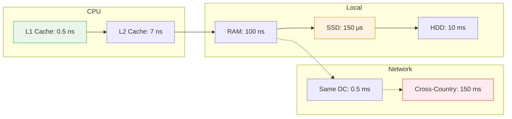
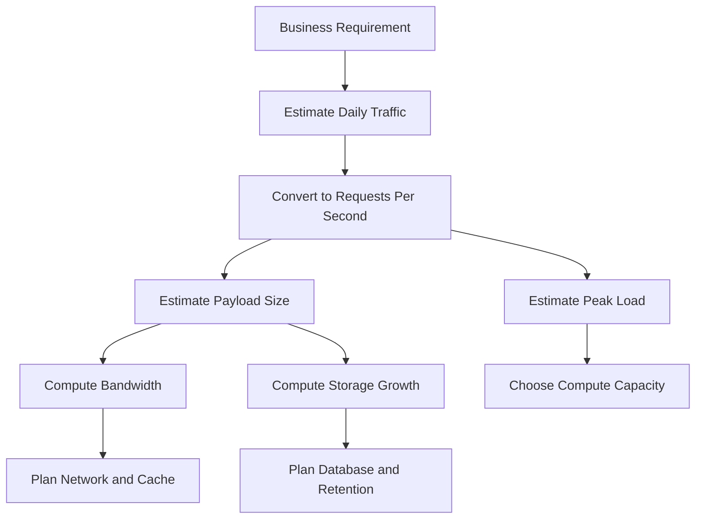
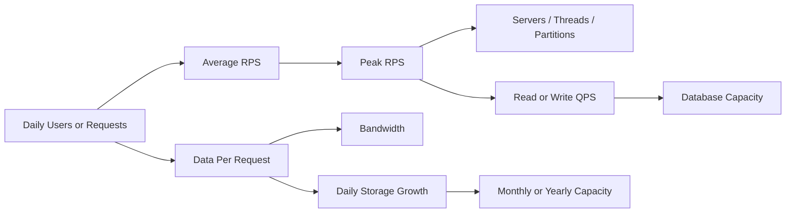
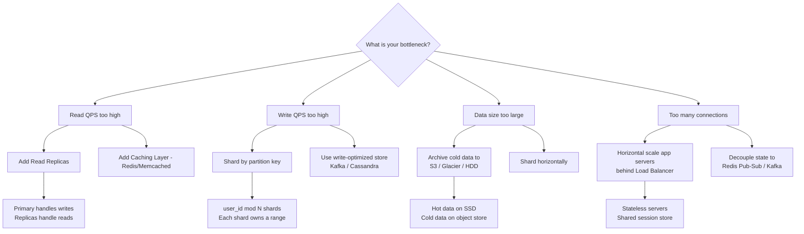
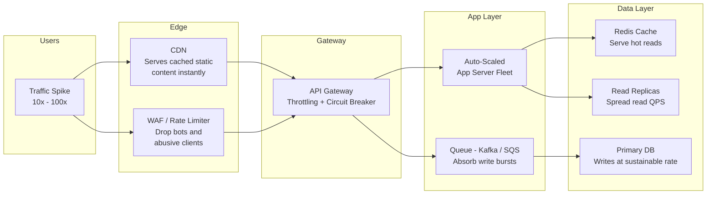
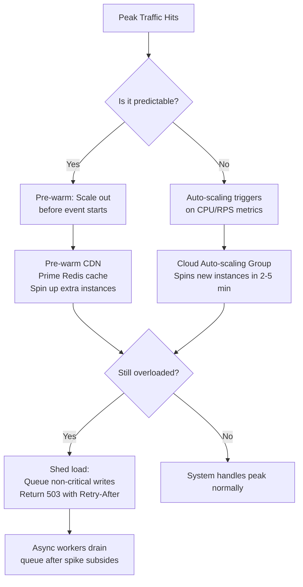

# Back-of-the-Envelope Calculations

## Blogs and websites

- [Back-of-the-envelope Estimation](https://bytebytego.com/courses/system-design-interview/back-of-the-envelope-estimation)

## Medium

## Youtube

- [Back of Envelope Calculation - System Design Concept](https://www.youtube.com/watch?v=DwqTon7ZS_s)
- [8. Back-Of-The-Envelope Estimation for System Design Interview | Capacity Planning of Facebook | HLD](https://www.youtube.com/watch?v=WZjSFNPS9Lo)

## Theory

Quick estimations for system design.

**Key Numbers:**
- 1 million requests/day ≈ 12 requests/second
    - Why it matters: interview problems and early design discussions often give traffic in daily numbers, while infrastructure decisions need per-second numbers.
    - Quick math: $1{,}000{,}000 \div 86{,}400 \approx 11.57$, which is usually rounded to $12$ requests/second.
    - Practical use: if a service handles 10 million requests/day, it is about $120$ requests/second on average. If peak traffic is 5 times the average, the system should be sized for about $600$ requests/second.
    - Example: if each request reads 20 KB, then average read throughput is $12 \times 20\text{ KB} = 240\text{ KB/s}$ for 1 million requests/day.
- 86,400 seconds in a day
    - This is the base conversion for moving between daily, hourly, and per-second traffic estimates.
    - Formula: $24 \times 60 \times 60 = 86{,}400$.
    - Approximation: in rough calculations, many engineers round it to $100{,}000$ to do fast mental math. That introduces some error, but is often acceptable for order-of-magnitude estimates.
    - Example: 500,000 events/day is about $500{,}000 \div 100{,}000 = 5$ events/second using the approximation, or about $5.8$ events/second using the exact value.
- 1 KB = 1,000 bytes
    - In system design interviews, storage and bandwidth are usually estimated using decimal units because cloud/network pricing is often expressed that way.
    - This keeps the math simple: 250 KB/request at 2,000 requests/second means roughly $500{,}000$ KB/s, or about $500$ MB/s.
    - Note: operating systems sometimes use binary units where 1 KiB = 1,024 bytes. For quick capacity planning, decimal units are usually close enough.
- 1 MB = 1,000 KB
    - This helps convert application-level payload sizes into service-level throughput.
    - Example: if image uploads are 3 MB each and users upload 100 images/second, the incoming traffic is about $300$ MB/s.
    - This number is immediately useful for estimating network capacity, object storage writes, and replication costs.
- 1 GB = 1,000 MB
    - This is the usual next step when daily storage accumulation becomes large.
    - Example: 5 million video metadata writes/day at 2 KB each produces about $10{,}000$ MB/day, which is about $10$ GB/day.
    - Over a year, that becomes roughly $3.65$ TB before replication, indexing overhead, and backups are added.

**Latency Numbers:**
- L1 cache: 0.5 ns
    - This is the fastest memory a CPU core can usually access.
    - Design implication: algorithms that fit hot data into CPU cache can be dramatically faster than ones that repeatedly fetch from main memory.
    - Example: tight loops over small arrays often perform much better than pointer-heavy structures with poor locality.
- L2 cache: 7 ns
    - Still extremely fast, but noticeably slower than L1.
    - Design implication: even within one machine, data placement and access patterns matter.
    - Example: a high-frequency matching engine or metrics aggregator may benefit from cache-friendly data structures.
- RAM: 100 ns
    - Main memory is much slower than CPU cache, but still far faster than disk or network calls.
    - Design implication: serving reads from an in-memory cache like Redis or a process-local cache is usually much cheaper than hitting a database on disk.
    - Example: moving a frequently read user profile from disk-backed storage to memory can cut response latency by orders of magnitude.
- SSD: 150 μs
    - SSDs are fast persistent storage, but still far slower than RAM.
    - Design implication: databases on SSD can provide strong performance, but repeated random reads are still expensive compared with memory caching.
    - Example: if a query requires 10 SSD lookups, storage latency alone can approach $1.5$ ms before any CPU or network overhead.
- HDD: 10 ms
    - Hard drives are much slower, especially for random I/O.
    - Design implication: HDD-backed systems are often acceptable for archival or sequential workloads, but are usually poor for low-latency online reads.
    - Example: a log archive can live on HDD, while a hot recommendation index likely should not.
- Network (same datacenter): 0.5 ms
    - A remote call inside the same datacenter is still much slower than local memory access.
    - Design implication: microservice boundaries are not free. Splitting one request across many services can accumulate latency quickly.
    - Example: five sequential service-to-service calls can add a few milliseconds even before business logic runs.
- Network (cross-country): 150 ms
    - Geographical distance dominates user experience for globally distributed systems.
    - Design implication: edge caching, CDNs, regional replication, and read locality become essential for international products.
    - Example: loading a static page from a nearby CDN edge is much faster than fetching it from a distant origin server.

#### Latency Hierarchy Visualization

To conceptualize how drastically latency increases as we move away from the CPU, consider this approximate hierarchy:

---

### Back of Envelope Calculation

Back of envelope calculation is a technique used to quickly estimate values and check the feasibility of a system design. It involves making reasonable approximations and simplifying assumptions to get rough, order-of-magnitude answers.

The purpose is not to be perfectly accurate. The purpose is to answer questions like:

- Can a single database likely handle this workload?
- Do we need caching to keep latency reasonable?
- How much storage will this feature consume in a month or a year?
- Is the expected bandwidth small enough for one region, or large enough to require CDN or multi-region planning?

In practice, back-of-the-envelope calculations help narrow the solution space before deeper design work begins.

### A Simple Process

1. Start from a product number such as daily active users, requests/day, uploads/day, or messages/day.
    - **Why it matters:** It is easier to reason about human behaviors (e.g., "users post 2 times a day") than server-level operations.
    - **Example:** 10 million Daily Active Users (DAU) where each views 5 pages means 50 million page views per day.
2. Convert it into requests/second or events/second.
    - **Why it matters:** System throughput metrics, load balancers, and auto-scaling groups are governed by Requests Per Second (RPS) or Queries Per Second (QPS), not daily metrics.
    - **Example:** $50{,}000{,}000 \div 86{,}400 \approx 580$ RPS.
3. Estimate peak traffic using a multiplier such as 3x, 5x, or 10x.
    - **Why it matters:** Systems crash during peak spikes (like a sudden viral event or ticket sale). Designing only for average load leads to outages.
    - **Example:** For an average of 580 RPS, a standard consumer app might see a 3x peak of $1{,}740$ RPS during prime time.
4. Add payload size to estimate bandwidth.
    - **Why it matters:** High bandwidth can saturate Network Interface Cards (NICs), incur massive cloud egress costs, or necessitate Content Delivery Networks (CDNs).
    - **Example:** $1{,}740$ RPS $\times$ 50 KB per page $\approx 87$ MB/s peak bandwidth.
5. Add data retention duration to estimate storage.
    - **Why it matters:** Short-term data lives in RAM/caches, active data on SSDs, and historical data on cheaper HDDs. Projecting over 1 to 5 years determines your database sharding and cold-storage strategies.
    - **Example:** $50\text{ million} \times 1\text{ KB record} \approx 50\text{ GB/day}$. Kept for 5 years: $50 \times 365 \times 5 \approx 91\text{ TB}$.
6. Compare the result with known system limits to decide whether the design is small, moderate, or internet-scale.
    - **Why it matters:** Prevents over-engineering. If total data fits in a single modern SSD (e.g., 2 TB) and RPS is low (e.g., 500 RPS), a single relational database like PostgreSQL is highly efficient.

Some common approximations:

- **Seconds in a day:**  
    $24 \times 60 \times 60 = 86,400 \approx 100,000$ (1 Lakh)
    - Why this approximation is useful: dividing by 100,000 is easy to do mentally.
    - Example: 25 million page views/day is about $250$ page views/second using the approximation.
    - Trade-off: the estimate is intentionally rough. It is good for feasibility checks, not billing-grade calculations.

- **Bytes and Bits:**  
    $1$ Byte $= 8$ bits (sometimes approximated as $10$ bits for easier calculations)
    - Why this matters: network links are often described in bits/second, while payload sizes are usually described in bytes.
    - Example: if every request transfers 50 KB, then each request moves about $400$ Kb of data. At 1,000 requests/second, that is about $400$ Mb/s.
    - Why some people use 10 bits per byte in rough math: it gives a quick way to account for protocol overhead, headers, and framing without doing detailed packet analysis.

### Worked Examples

#### Example 1: Estimating API Throughput

Suppose a service receives 20 million requests/day.

- Average requests/second:
    $$\frac{20{,}000{,}000}{86{,}400} \approx 231\text{ requests/second}$$
- If peak traffic is 5x average:
    $$231 \times 5 \approx 1{,}155\text{ requests/second}$$
- If each response is 10 KB:
    $$1{,}155 \times 10\text{ KB} = 11{,}550\text{ KB/s} \approx 11.5\text{ MB/s}$$

This immediately suggests that the service is not huge, but it is large enough that caching, connection pooling, and database indexing should be considered.

#### Example 2: Estimating Storage Growth

Suppose a chat application stores 50 million messages/day and each message record averages 500 bytes.

- Daily data:
    $$50{,}000{,}000 \times 500 = 25{,}000{,}000{,}000\text{ bytes} \approx 25\text{ GB/day}$$
- Monthly data:
    $$25\text{ GB/day} \times 30 = 750\text{ GB/month}$$
- Yearly data:
    $$25\text{ GB/day} \times 365 \approx 9.1\text{ TB/year}$$

This estimate is still incomplete because production systems also need indexes, replication, metadata, backups, and space for compaction. A more realistic total might be 2x to 4x the raw data size.

#### Example 3: Estimating Media Upload Bandwidth

Suppose users upload 2 million photos/day, and each photo is 4 MB.

- Daily ingest:
    $$2{,}000{,}000 \times 4\text{ MB} = 8{,}000{,}000\text{ MB} = 8\text{ TB/day}$$
- Average bandwidth:
    $$\frac{8\text{ TB}}{86{,}400\text{ s}} \approx 92.6\text{ MB/s}$$
- Peak bandwidth at 4x average:
    $$92.6 \times 4 \approx 370\text{ MB/s}$$

This result implies that object storage, upload gateways, CDN integration, and background image processing pipelines will likely be required.

### Rules of Thumb

- Use exact numbers only when a small error changes the design decision.
- Use rounded numbers when the goal is to compare options quickly.
- Always estimate peak load, not just average load.
- Add overhead for replication, indexes, metadata, and retries.
- Separate read traffic from write traffic because they often scale differently.
- Revisit the math if assumptions change, such as file size, retention period, or geographic distribution.

These quick calculations help engineers estimate storage, bandwidth, or processing requirements without needing precise numbers. The goal is to validate ideas and catch obvious issues early in the design process.

If the estimate says a problem is small, the design can stay simple. If the estimate says the scale is large, the team can justify techniques such as partitioning, caching, asynchronous processing, or regional distribution much earlier in the design process.

### Hardware Impact on Throughput

When estimating capacity, the underlying hardware directly determines what a single node can sustain before horizontal scaling becomes necessary. The table below covers both raw hardware specs and how typical cloud instance sizes map to real-world throughput.

#### Hardware Resource Bottlenecks

| Resource | IOPS / Throughput | Primary Bottleneck | Typical Impact | Notes |
| :--- | :--- | :--- | :--- | :--- |
| **HDD** | ~100–200 random IOPS, ~150 MB/s sequential | Random I/O latency (10 ms) | Poor for databases with random reads. Fine for append-only log segments. | Kafka on HDD is viable because it does sequential writes. PostgreSQL on HDD is painful. |
| **SSD (SATA)** | ~5,000–50,000 IOPS, ~500 MB/s sequential | Throughput ceiling for mid-range DBs | Suitable for most production databases. | Most cloud general-purpose instances (e.g., `gp2`) are SATA SSD. |
| **NVMe SSD** | ~100,000–1,000,000 IOPS, ~3,500 MB/s sequential | CPU and network become the bottleneck before disk | Ideal for high-frequency trading, OLTP, time-series DBs. | Costs 3–5x more than SATA SSD per GB. |
| **RAM** | ~10–50 GB/s bandwidth, ~100 ns latency | Working set size | Every GB of RAM that holds hot data eliminates equivalent disk reads. | Redis relies entirely on RAM. PostgreSQL `shared_buffers` should be 25–40% of total RAM. |
| **CPU (4 cores)** | ~2,000–5,000 RPS (REST), ~500–2,000 TPS (DB) | Compute-bound workloads | Limits JSON serialization, SSL handshakes, and query planning. | 1 core ≈ ~500–1,000 lightweight concurrent requests with Go/Node. Java/Python apps are 3–10x heavier. |
| **CPU (16+ cores)** | ~20,000–50,000 RPS (REST), ~5,000–15,000 TPS (DB) | Network I/O becomes next bottleneck | Good for parallelizable read workloads, multi-threaded query processing. | Kafka brokers and Elasticsearch nodes benefit greatly from high core count. |
| **Network (1 Gbps)** | ~125 MB/s bandwidth | Bandwidth for large payloads | Limits video streaming, bulk file transfers, and replication traffic. | At 100 KB/response, a 1 Gbps link saturates at ~1,250 concurrent requests/sec. |
| **Network (10 Gbps)** | ~1,250 MB/s bandwidth | Connection count for micro-payloads | Standard in cloud datacenters (e.g., AWS `c5.4xlarge`). Rarely the bottleneck for API workloads. | Becomes critical for inter-node Kafka replication or Cassandra gossip. |

#### Instance Size vs. Read/Write Throughput (AWS Equivalents)

These are representative estimates assuming a moderately optimized application on SSD-backed storage.

| Instance Profile | vCPU | RAM | Disk Type | REST API RPS | PostgreSQL Read QPS | PostgreSQL Write TPS | Redis QPS | Kafka Msgs/sec |
| :--- | :---: | :---: | :---: | :---: | :---: | :---: | :---: | :---: |
| **Small** (t3.medium) | 2 | 4 GB | gp2 SSD | ~1,000–2,000 | ~1,000–3,000 | ~300–600 | ~50,000–80,000 | ~20,000–50,000 |
| **Medium** (c5.xlarge) | 4 | 8 GB | gp3 SSD | ~5,000–10,000 | ~5,000–10,000 | ~1,000–2,000 | ~100,000–150,000 | ~100,000–200,000 |
| **Large** (c5.4xlarge) | 16 | 32 GB | gp3 SSD | ~20,000–40,000 | ~15,000–30,000 | ~3,000–6,000 | ~300,000–500,000 | ~300,000–600,000 |
| **XLarge** (c5.18xlarge) | 72 | 144 GB | NVMe SSD | ~80,000–150,000 | ~40,000–80,000 | ~8,000–15,000 | ~800,000+ | ~800,000–1,500,000 |
| **Memory-Optimized** (r5.8xlarge) | 32 | 256 GB | NVMe SSD | ~30,000–60,000 | ~80,000–150,000 (from buffer cache) | ~5,000–10,000 | ~1,000,000+ | ~500,000–1,000,000 |

> **Key insight:** For read-heavy workloads (e.g., social feeds), a memory-optimized instance with large RAM dramatically outperforms a compute-optimized instance by keeping the working set in the buffer pool, eliminating disk I/O almost entirely.

---

### Technology Scale Benchmarks (Per Single Node / Partition)

Use these numbers to answer the core interview question: *"Can this technology handle my estimated QPS on a single node, or do I need a cluster?"*

| Technology | Category | Read Throughput (single node) | Write Throughput (single node) | Primary Bottleneck | Scale Strategy |
| :--- | :--- | :--- | :--- | :--- | :--- |
| **REST API Server** (Node/Go) | App Server | 5,000–20,000 RPS | 5,000–20,000 RPS | CPU (serialization), Network | Horizontal scale behind LB |
| **REST API Server** (Java/Python) | App Server | 1,000–5,000 RPS | 1,000–5,000 RPS | CPU (GC / GIL), Thread pool | Horizontal scale; consider async frameworks |
| **WebSocket Server** | App Server | 10K–500K concurrent connections | 10K–50,000 msg/sec | RAM (connection state), OS file descriptors | Stateless + Redis Pub/Sub across nodes |
| **SSE Server** | App Server | 10K–200K concurrent streams | N/A (server push only) | RAM, Network bandwidth | Same as WebSocket; SSE is simpler (HTTP/1.1) |
| **Nginx / HAProxy** | API Gateway / LB | 50,000–200,000 RPS | 50,000–200,000 RPS | Network I/O, CPU (SSL) | Scale up cores; SSL termination offload |
| **Envoy / Kong** | API Gateway | 10,000–50,000 RPS | 10,000–50,000 RPS | CPU (plugins, Lua/WASM filters) | Horizontal scale; avoid heavy plugins on hot path |
| **Redis** (single-threaded) | Cache / KV Store | 100,000–300,000 QPS | 100,000–200,000 QPS | RAM capacity, Network bandwidth | Redis Cluster for data sharding; replicas for reads |
| **Redis** (multi-threaded, v6+) | Cache / KV Store | 500,000–1,000,000 QPS | 300,000–600,000 QPS | RAM capacity | Redis Cluster shards data across nodes |
| **Memcached** | Cache | 200,000–500,000 QPS | 200,000–500,000 QPS | RAM, Network | Multi-threaded; scales better than Redis for pure cache |
| **PostgreSQL** | Relational DB | 5,000–30,000 QPS (with buffer cache) | 1,000–5,000 TPS | IOPS, WAL write latency, ACID locks | Read replicas for reads; PgBouncer for connection pooling |
| **MySQL / Aurora** | Relational DB | 5,000–50,000 QPS | 2,000–10,000 TPS | IOPS, Row locks | Aurora auto-scales read replicas; ProxySQL for pooling |
| **Kafka** (per broker) | Event Streaming | 500,000–1,000,000 msg/sec read | 100,000–500,000 msg/sec write | Sequential disk I/O, Network | Add brokers; increase partition count to fan out throughput |
| **RabbitMQ** | Message Queue | 20,000–50,000 msg/sec | 10,000–30,000 msg/sec | RAM (in-memory queue), CPU | Quorum queues for HA; not designed for millions/sec |
| **Elasticsearch** | Search Engine | 1,000–5,000 search req/sec | 1,000–5,000 index req/sec | CPU (query parsing), RAM (JVM heap), I/O | Shard data across nodes; index lifecycle policies |
| **Apache Solr** | Search Engine | 500–3,000 search req/sec | 500–2,000 index req/sec | JVM heap, Disk I/O | Sharding via SolrCloud |
| **Cassandra** (per node) | Wide-Column NoSQL | 10,000–50,000 QPS | 10,000–40,000 QPS | Network (gossip), Disk I/O | Add nodes to ring; consistent hashing distributes load |
| **DynamoDB** (per partition) | NoSQL | ~3,000 RCU/sec | ~1,000 WCU/sec | Partition key hot spots | Use composite keys to spread load; enable auto-scaling |
| **MongoDB** (primary) | Document DB | 5,000–20,000 QPS | 2,000–10,000 QPS | RAM (working set size), IOPS | Replica sets for HA; sharding for horizontal scale |
| **S3 / GCS** | Object Storage | 5,500 GET/sec per prefix | 3,500 PUT/sec per prefix | Prefix-level rate limit | Randomize key prefixes to spread across partitions |
| **CloudFront / CDN** | Edge Cache | Millions of req/sec globally | N/A (cache invalidation only) | Origin pull rate | Cache TTL tuning; use S3 as origin |

> **Reading the table:** If your estimated peak QPS exceeds the single-node write throughput of your chosen technology, you must either shard, add brokers/nodes, or introduce a write buffer (like Kafka in front of a database).

---

### When to Use Replication, Partitioning, and Sharding

As traffic grows, there are three distinct levers to pull. Choosing the wrong one wastes engineering effort and adds unnecessary complexity.

#### Decision Flowchart

#### Thresholds: When to Pull Each Lever

| Trigger Condition | Strategy | Mechanism | Trade-off |
| :--- | :--- | :--- | :--- |
| Read QPS > 10,000/sec on a single DB node | **Read Replication** | Add 1–5 read replicas. Route SELECT queries to replicas. | Replication lag. Replicas may serve stale data by milliseconds to seconds. |
| Write QPS > 5,000/sec or TPS > 2,000/sec on a single DB node | **Write Sharding** | Partition data by a hash or range of a key (e.g., `user_id`). Each shard is an independent DB. | No cross-shard JOINs. Resharding is expensive. Requires application-level routing. |
| Dataset > 2–5 TB on a single node | **Horizontal Sharding** | Split by range (e.g., date ranges) or hash across N shards. | Same as write sharding. Maintenance windows for re-balancing. |
| p99 read latency > 10 ms on hot data | **Caching Layer** | Place Redis/Memcached in front of the database. Cache hot keys with a TTL. | Cache invalidation complexity. Cache stampedes during cold starts. |
| Millions of write events/sec (e.g., IoT, analytics) | **Event Streaming Buffer** | Place Kafka between producers and the DB. DB consumes at its own pace. | Adds operational complexity. Data is eventually consistent with DB. |
| Concurrent connections > 100,000 per app server | **Connection Scaling** | Add stateless app servers behind a load balancer. Store session state in Redis. | Load balancer becomes SPOF. Sticky sessions can cause uneven distribution. |
| Data older than N days rarely accessed | **Tiered Storage** | Archive to cold object storage (S3 Glacier, GCS Nearline). Keep hot data on NVMe. | Higher retrieval latency for cold data (minutes to hours for Glacier). |
| Multi-region user base | **Geographic Replication** | Multi-master or active-passive replication across regions. CDN for static content. | Conflict resolution for multi-master writes. Higher operational cost. |

#### Replication vs. Sharding vs. Partitioning: Conceptual Differences

- **Replication** copies the *same data* to multiple nodes. Solves *read throughput* and *availability* (failover). Does **not** reduce write load on the primary.
- **Sharding** splits *different data* across multiple nodes. Each shard is authoritative for its slice. Solves *write throughput* and *storage capacity*. Increases operational complexity significantly.
- **Partitioning** is a logical concept — it is how data is divided within a single node (e.g., Postgres table partitioning by date range). It improves query performance by pruning irrelevant data but does not distribute load to another machine.
- **Sharding = horizontal partitioning across machines.** Partitioning without sharding stays on one machine.

---

### Handling Peak Load (Black Friday / Flash Sale Scenarios)

Regular traffic estimation is straightforward. The harder problem is designing for **transient spikes** that are 10x or 100x of the baseline — events like Black Friday sales, viral posts, sports finals, or ticket drops. These spikes are short-lived (minutes to hours), but they are the events that cause outages and make the news.

#### Why Spikes Are Dangerous

If your baseline is 1,000 RPS and peak is 100,000 RPS, your system needs to handle a 100x spike. The danger is not just throughput — it is the **cascade effect**:

1. App servers saturate → response times increase.
2. Slow responses keep connections open longer → connection pool exhausts.
3. Retries amplify traffic → 100x real demand becomes 300x apparent demand.
4. Database connections overflow → timeouts and errors compound.
5. Users rage-refresh → traffic multiplies again.

A system that degrades gracefully under overload recovers quickly. A system that crashes takes minutes or hours to come back, because every component must restart, warm caches, and re-establish connections simultaneously.

#### Estimation: Sizing for a Spike

If baseline is 1,000 RPS and you expect 10x peak on Black Friday:

$$\text{Peak RPS} = 1{,}000 \times 10 = 10{,}000\text{ RPS}$$

At 10 KB per response:
$$\text{Peak Bandwidth} = 10{,}000 \times 10\text{ KB} = 100\text{ MB/s}$$

If each app server handles 2,000 RPS:
$$\text{Servers needed at peak} = \frac{10{,}000}{2{,}000} = 5\text{ servers}$$

But add a safety buffer of 30–50% headroom to avoid operating at 100% utilization:
$$\text{Actual servers to provision} = 5 \times 1.4 \approx 7\text{ servers}$$

For a 100x spike (100,000 RPS), scale this linearly: 70 servers. This is where auto-scaling and cloud elasticity become critical — pre-provisioning 70 servers permanently is prohibitively expensive.

#### Architecture: Layers of Defence

#### Strategy: Predictable vs. Unpredictable Spikes

#### Techniques by Layer

| Layer | Technique | How it Helps | Trade-off |
| :--- | :--- | :--- | :--- |
| **DNS / Edge** | CDN caching for static assets (HTML, JS, CSS, images) | Offloads 60–90% of total requests at the edge before they hit origin servers. | Stale content risk. Cache invalidation requires careful design. |
| **Edge** | WAF rate limiting per IP / user token | Eliminates bot traffic and scraper floods that amplify peak by 2–5x. | Legitimate burst users (e.g., shared office IP) may get throttled. |
| **API Gateway** | Request throttling (token bucket / leaky bucket) | Returns `429 Too Many Requests` before the request reaches app servers. Protects downstream. | Users get errors instead of slow responses. Requires client retry logic with backoff. |
| **API Gateway** | Circuit breaker | When downstream services are slow, the gateway fails fast instead of holding connections open. Prevents cascade. | Must tune error thresholds carefully. Overly sensitive breakers cause false outages. |
| **App Layer** | Horizontal auto-scaling (AWS ASG, GKE HPA) | Spins up new instances within 2–5 minutes of a spike being detected. | Cold start latency. Instances are not immediately warm (empty caches, JVM warmup). |
| **App Layer** | Pre-scaling for predictable events | Manually or scheduled scale-out 30–60 minutes before a known event (e.g., Black Friday 00:00 UTC). | Costs money for pre-provisioned idle capacity. Usually still worth it. |
| **App Layer** | Graceful degradation (feature flags) | Disable expensive non-critical features under load (e.g., hide recommendation panels, skip analytics events). | Requires instrumentation. Users get a reduced experience. |
| **Write Path** | Async queue (Kafka, SQS, RabbitMQ) in front of DB | Smooths out write bursts. DB consumes at a sustainable rate. Prevents write TPS from spiking the primary. | Eventual consistency. Order confirmations may be delayed by seconds. |
| **Read Path** | Redis / Memcached hot cache warming | Pre-load top products, homepage content, and session data into cache before the event starts. | Cache invalidation must be handled. Stale cache can show wrong prices during flash sales. |
| **Read Path** | Read replicas | Spread SELECT load across 3–5 replicas. Keeps the primary free for writes. | Replication lag means replicas may show slightly old inventory counts. |
| **Database** | Connection pooling (PgBouncer, ProxySQL) | Each new app server does not open a new DB connection. Pool is shared. Prevents the DB from hitting its `max_connections` limit. | Misconfigured pools can cause timeouts during pool saturation. |
| **Database** | Read-through / write-behind cache | Writes land in Redis first, asynchronously flushed to DB. Reads from cache. DB sees only a fraction of the traffic. | Risk of data loss if Redis goes down before flush. Not suitable for financial writes. |

#### Load Shedding: The Last Resort

When traffic exceeds all capacity, a system must **actively refuse work** instead of trying to process everything slowly (which causes cascading failures). Load shedding strategies:

- **Return `503 Service Unavailable` with `Retry-After` header.** Clients know to back off. Better than a silent timeout.
- **Queue overflow with a ticket / estimated wait time.** Used by Ticketmaster, Shopify during launches. Users see a virtual queue instead of errors.
- **Prioritize paid/authenticated users.** Shed anonymous or low-priority requests first. Protect revenue-generating paths.
- **Shed writes before reads.** If inventory updates are delayed by a few seconds, that is acceptable. Failing a checkout is not.

#### Black Friday: Concrete Sizing Example

| Metric | Normal Day | Black Friday (10x) | Flash Sale (100x) |
| :--- | ---: | ---: | ---: |
| RPS | 1,000 | 10,000 | 100,000 |
| DB Read QPS | 5,000 | 50,000 | 500,000 |
| DB Write TPS | 500 | 5,000 | 50,000 |
| App Servers (2K RPS each) | 1 | 7 (with buffer) | 70 |
| Redis Cache Hit Rate needed | 70% | 95%+ | 99%+ |
| Read Replicas | 1 | 3–5 | 10–20 |
| CDN offload required | Optional | Essential | Mandatory |
| Async write queue | Optional | Recommended | Mandatory |

> **Key insight for 100x spikes:** At 100x load, you cannot realistically auto-scale all 70 servers in time unless pre-scaled. The only practical way to survive a 100x spike without pre-provisioning is to push the vast majority of traffic to the CDN/cache and degrade gracefully for the remainder. At 99% cache hit rate, your origin servers see only 1% of the peak traffic — which is 1,000 RPS, identical to your baseline.