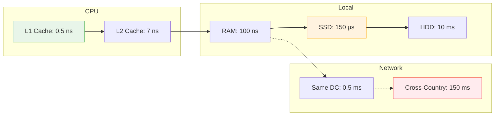
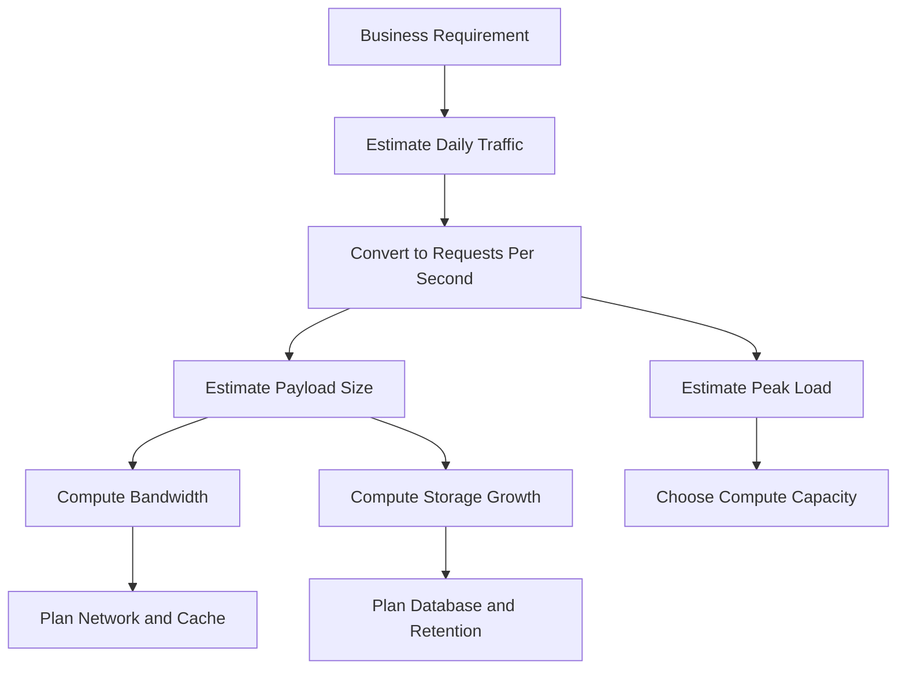
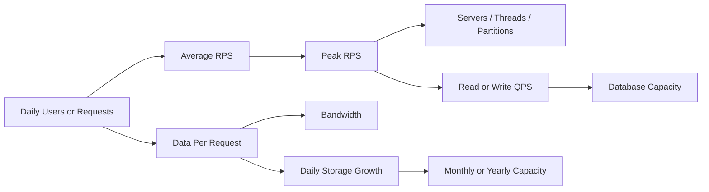
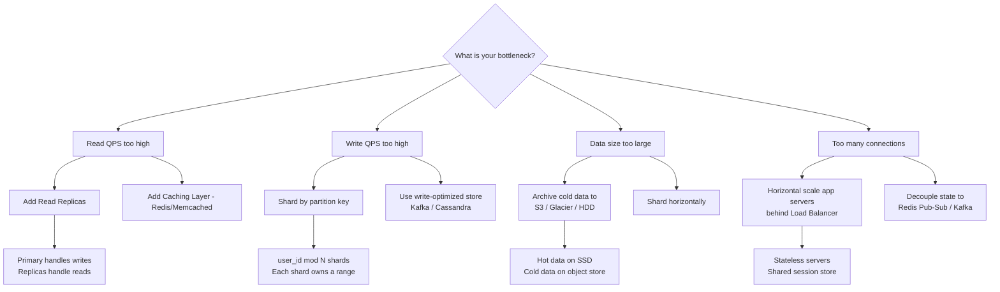
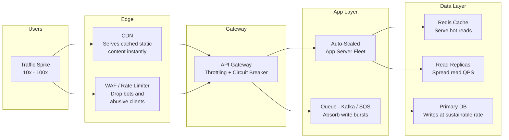
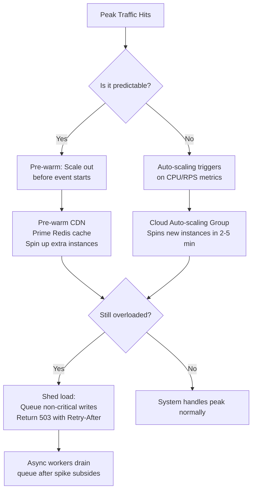

# Back-of-the-Envelope Calculations

## Blogs and websites

- [Back-of-the-envelope Estimation](https://bytebytego.com/courses/system-design-interview/back-of-the-envelope-estimation)

## Medium


## Youtube

- [Back of Envelope Calculation - System Design Concept](https://www.youtube.com/watch?v=DwqTon7ZS_s)
- [8. Back-Of-The-Envelope Estimation for System Design Interview | Capacity Planning of Facebook | HLD](https://www.youtube.com/watch?v=WZjSFNPS9Lo)

## Theory

Quick estimations for system design.

### Topics Covered in This Guide

1. [Key Numbers: Traffic and Size Conversions](#key-numbers-traffic-and-size-conversions)
2. [Latency Numbers Every Engineer Should Know](#latency-numbers-every-engineer-should-know)
3. [The Back-of-the-Envelope Process](#back-of-envelope-calculation)
4. [Worked Numerical Examples](#worked-examples)
5. [Rules of Thumb](#rules-of-thumb)
6. [Hardware Impact on Throughput](#hardware-impact-on-throughput)
7. [Technology Scale Benchmarks](#technology-scale-benchmarks-per-single-node--partition)
8. [Replication vs. Partitioning vs. Sharding](#when-to-use-replication-partitioning-and-sharding)
9. [Handling Peak Load (Black Friday / Flash Sale Scenarios)](#handling-peak-load-black-friday--flash-sale-scenarios)

Each topic below walks through the underlying concept, a real-world use case, common interview questions with answers, at least one diagram, and a small Java example that turns the math into runnable code.

### Key Numbers: Traffic and Size Conversions

- 1 million requests/day ≈ 12 requests/second
    - Why it matters: interview problems and early design discussions often give traffic in daily numbers, while infrastructure decisions need per-second numbers.
    - Quick math: $1{,}000{,}000 \div 86{,}400 \approx 11.57$, which is usually rounded to $12$ requests/second.
    - Practical use: if a service handles 10 million requests/day, it is about $120$ requests/second on average. If peak traffic is 5 times the average, the system should be sized for about $600$ requests/second.
    - Example: if each request reads 20 KB, then average read throughput is $12 \times 20\text{ KB} = 240\text{ KB/s}$ for 1 million requests/day.
- 86,400 seconds in a day
    - This is the base conversion for moving between daily, hourly, and per-second traffic estimates.
    - Formula: $24 \times 60 \times 60 = 86{,}400$.
    - Approximation: in rough calculations, many engineers round it to $100{,}000$ to do fast mental math. That introduces some error, but is often acceptable for order-of-magnitude estimates.
    - Example: 500,000 events/day is about $500{,}000 \div 100{,}000 = 5$ events/second using the approximation, or about $5.8$ events/second using the exact value.
- 1 KB = 1,000 bytes
    - In system design interviews, storage and bandwidth are usually estimated using decimal units because cloud/network pricing is often expressed that way.
    - This keeps the math simple: 250 KB/request at 2,000 requests/second means roughly $500{,}000$ KB/s, or about $500$ MB/s.
    - Note: operating systems sometimes use binary units where 1 KiB = 1,024 bytes. For quick capacity planning, decimal units are usually close enough.
- 1 MB = 1,000 KB
    - This helps convert application-level payload sizes into service-level throughput.
    - Example: if image uploads are 3 MB each and users upload 100 images/second, the incoming traffic is about $300$ MB/s.
    - This number is immediately useful for estimating network capacity, object storage writes, and replication costs.
- 1 GB = 1,000 MB
    - This is the usual next step when daily storage accumulation becomes large.
    - Example: 5 million video metadata writes/day at 2 KB each produces about $10{,}000$ MB/day, which is about $10$ GB/day.
    - Over a year, that becomes roughly $3.65$ TB before replication, indexing overhead, and backups are added.

#### Real-World Use Case

A product manager asks whether a new "daily digest" email feature can be built on the existing notification service. The service currently handles 2 million notifications/day. Converting to a rate, that is about 23 notifications/second on average. Adding the digest feature triples daily volume to 6 million/day (about 70/second average, 350/second at a 5x peak during the digest send window). Since 350/second is still well within a single notification worker's capacity, the team can confirm the feature is safe to build without a redesign, purely from this conversion step.

#### Interview Questions and Answers

**Q: Why do system design interviews convert daily active users or daily requests into requests per second?**
A: Infrastructure sizing decisions (server count, connection pool size, load balancer capacity, thread pool size) are governed by concurrent, per-second load, not daily totals. A per-second number tells you how many requests must be served simultaneously, which is what actually determines how many application instances and database connections are needed.

**Q: A service handles 50 million requests/day. What is the average RPS, and why might the real peak be much higher?**
A: $50{,}000{,}000 \div 86{,}400 \approx 579$ RPS average. Real traffic is rarely uniform: usage clusters around specific hours (lunchtime, evenings) and can spike 3 to 10x due to marketing campaigns, push notifications, or viral moments. Interviewers expect candidates to apply a peak multiplier rather than sizing only for the average.

**Q: Why use 1 KB = 1,000 bytes instead of 1,024 bytes in these estimates?**
A: Storage and network billing from cloud providers is typically expressed in decimal (SI) units, and the difference between decimal and binary units (about 2.4% at the KB level, growing toward 7 to 10% at the TB/PB level) is far smaller than the margin of error already built into a back-of-envelope estimate, so the simpler decimal unit is preferred for speed.

#### Java: Converting Daily Traffic to Capacity Numbers

```java
public final class TrafficEstimator {

    private static final long SECONDS_PER_DAY = 86_400L;

    private TrafficEstimator() {
    }

    /** Converts daily request volume into an average requests-per-second rate. */
    public static double averageRequestsPerSecond(long requestsPerDay) {
        return requestsPerDay / (double) SECONDS_PER_DAY;
    }

    /** Applies a peak multiplier (commonly 3x-10x) on top of the average rate. */
    public static double peakRequestsPerSecond(long requestsPerDay, double peakMultiplier) {
        return averageRequestsPerSecond(requestsPerDay) * peakMultiplier;
    }

    /** Estimates sustained bandwidth in KB/s for a given average payload size. */
    public static double bandwidthKbPerSecond(long requestsPerDay, double payloadSizeKb) {
        return averageRequestsPerSecond(requestsPerDay) * payloadSizeKb;
    }

    public static void main(String[] args) {
        long dailyRequests = 10_000_000L;

        double avgRps = averageRequestsPerSecond(dailyRequests);
        double peakRps = peakRequestsPerSecond(dailyRequests, 5.0);
        double bandwidth = bandwidthKbPerSecond(dailyRequests, 20.0);

        System.out.printf("Average RPS: %.2f%n", avgRps);
        System.out.printf("Peak RPS (5x multiplier): %.2f%n", peakRps);
        System.out.printf("Average bandwidth: %.2f KB/s%n", bandwidth);
    }
}
```

Running this prints an average of about 115.74 RPS, a peak of about 578.70 RPS, and an average bandwidth of about 2,314.81 KB/s for 10 million requests/day with a 20 KB payload.

### Latency Numbers Every Engineer Should Know

- L1 cache: 0.5 ns
    - This is the fastest memory a CPU core can usually access.
    - Design implication: algorithms that fit hot data into CPU cache can be dramatically faster than ones that repeatedly fetch from main memory.
    - Example: tight loops over small arrays often perform much better than pointer-heavy structures with poor locality.
- L2 cache: 7 ns
    - Still extremely fast, but noticeably slower than L1.
    - Design implication: even within one machine, data placement and access patterns matter.
    - Example: a high-frequency matching engine or metrics aggregator may benefit from cache-friendly data structures.
- RAM: 100 ns
    - Main memory is much slower than CPU cache, but still far faster than disk or network calls.
    - Design implication: serving reads from an in-memory cache like Redis or a process-local cache is usually much cheaper than hitting a database on disk.
    - Example: moving a frequently read user profile from disk-backed storage to memory can cut response latency by orders of magnitude.
- SSD: 150 μs
    - SSDs are fast persistent storage, but still far slower than RAM.
    - Design implication: databases on SSD can provide strong performance, but repeated random reads are still expensive compared with memory caching.
    - Example: if a query requires 10 SSD lookups, storage latency alone can approach $1.5$ ms before any CPU or network overhead.
- HDD: 10 ms
    - Hard drives are much slower, especially for random I/O.
    - Design implication: HDD-backed systems are often acceptable for archival or sequential workloads, but are usually poor for low-latency online reads.
    - Example: a log archive can live on HDD, while a hot recommendation index likely should not.
- Network (same datacenter): 0.5 ms
    - A remote call inside the same datacenter is still much slower than local memory access.
    - Design implication: microservice boundaries are not free. Splitting one request across many services can accumulate latency quickly.
    - Example: five sequential service-to-service calls can add a few milliseconds even before business logic runs.
- Network (cross-country): 150 ms
    - Geographical distance dominates user experience for globally distributed systems.
    - Design implication: edge caching, CDNs, regional replication, and read locality become essential for international products.
    - Example: loading a static page from a nearby CDN edge is much faster than fetching it from a distant origin server.

#### Latency Hierarchy Visualization

To conceptualize how drastically latency increases as we move away from the CPU, consider this approximate hierarchy:


```mermaid
flowchart LR
    subgraph CPU
    A[L1 Cache: 0.5 ns] --> B[L2 Cache: 7 ns]
    end
    subgraph Local
    B --> C[RAM: 100 ns]
    C --> D[SSD: 150 μs]
    D --> E[HDD: 10 ms]
    end
    subgraph Network
    C -.-> F[Same DC: 0.5 ms]
    F -.-> G[Cross-Country: 150 ms]
    end
    
    style A fill:#e8f5e9,stroke:#4caf50
    style D fill:#fff3e0,stroke:#ff9800
    style G fill:#ffebee,stroke:#f44336
```


```mermaid
flowchart TD
        A[Business Requirement] --> B[Estimate Daily Traffic]
        B --> C[Convert to Requests Per Second]
        C --> D[Estimate Payload Size]
        D --> E[Compute Bandwidth]
        D --> F[Compute Storage Growth]
        C --> G[Estimate Peak Load]
        G --> H[Choose Compute Capacity]
        E --> I[Plan Network and Cache]
        F --> J[Plan Database and Retention]
```

#### Real-World Use Case

A checkout service needs to look up a user's cart, apply a discount, and confirm inventory before returning a response. If the cart and inventory checks each require a network hop to a service in another region (150 ms each), the request already costs 300 ms before any business logic runs, likely violating a 200 ms latency SLA. Recognizing this from the latency table motivates moving inventory data into a regionally replicated cache and colocating the cart service in the same datacenter, cutting the two cross-country hops down to two same-datacenter hops (about 1 ms total).

#### Interview Questions and Answers

**Q: Why does a single cross-country network call dominate an entire request's latency budget?**
A: A cross-country network call (about 150 ms) is roughly 300,000x slower than an L1 cache access (0.5 ns) and about 1,000x slower than an SSD read (150 μs). Even one such hop overshadows any number of in-process memory operations, so reducing cross-region hops (through regional deployment, caching, or CDNs) yields far bigger latency wins than micro-optimizing in-memory code.

**Q: If a request needs data from 3 microservices in the same datacenter, called sequentially, roughly how much latency does that add, and how would you reduce it?**
A: About $3 \times 0.5\text{ ms} = 1.5\text{ ms}$ just for network hops, before any processing. It can be reduced by calling the services in parallel instead of sequentially, batching the calls, or merging services that are always invoked together into one call.

**Q: Why is SSD access (150 μs) still considered slow compared to RAM (100 ns), even though both feel instantaneous to a human?**
A: SSD is roughly 1,500x slower than RAM. At high QPS, that difference compounds: a service doing 10 SSD-backed lookups per request pays about 1.5 ms of storage latency alone, which can be the difference between meeting or missing a 5 to 10 ms p99 latency SLA.

#### Java: Modeling a Request's Latency Budget

```java
import java.util.LinkedHashMap;
import java.util.Map;

public final class LatencyBudget {

    // Representative order-of-magnitude latencies, in nanoseconds.
    public static final long RAM_NS = 100L;
    public static final long SSD_NS = 150_000L;                 // 150 microseconds
    public static final long HDD_NS = 10_000_000L;              // 10 milliseconds
    public static final long SAME_DC_NETWORK_NS = 500_000L;     // 0.5 milliseconds
    public static final long CROSS_COUNTRY_NETWORK_NS = 150_000_000L; // 150 milliseconds

    private LatencyBudget() {
    }

    public static void main(String[] args) {
        Map<String, Long> callChain = new LinkedHashMap<>();
        callChain.put("API gateway -> auth service (same DC)", SAME_DC_NETWORK_NS);
        callChain.put("auth service -> Redis session lookup (RAM)", RAM_NS);
        callChain.put("order service -> Postgres cart lookup (SSD)", SSD_NS);
        callChain.put("order service -> payment provider (cross-country)", CROSS_COUNTRY_NETWORK_NS);

        long totalNs = 0;
        for (Map.Entry<String, Long> hop : callChain.entrySet()) {
            System.out.printf("%-55s %,12d ns%n", hop.getKey(), hop.getValue());
            totalNs += hop.getValue();
        }
        System.out.printf("Total estimated latency: %.2f ms%n", totalNs / 1_000_000.0);
    }
}
```

The output shows the cross-country payment call alone accounts for over 99% of the roughly 150.5 ms total, which is exactly the kind of insight this table is meant to surface quickly.

---

### Back of Envelope Calculation

Back of envelope calculation is a technique used to quickly estimate values and check the feasibility of a system design. It involves making reasonable approximations and simplifying assumptions to get rough, order-of-magnitude answers.

The purpose is not to be perfectly accurate. The purpose is to answer questions like:

- Can a single database likely handle this workload?
- Do we need caching to keep latency reasonable?
- How much storage will this feature consume in a month or a year?
- Is the expected bandwidth small enough for one region, or large enough to require CDN or multi-region planning?

In practice, back-of-the-envelope calculations help narrow the solution space before deeper design work begins.

### A Simple Process

1. Start from a product number such as daily active users, requests/day, uploads/day, or messages/day.
    - **Why it matters:** It is easier to reason about human behaviors (e.g., "users post 2 times a day") than server-level operations.
    - **Example:** 10 million Daily Active Users (DAU) where each views 5 pages means 50 million page views per day.
2. Convert it into requests/second or events/second.
    - **Why it matters:** System throughput metrics, load balancers, and auto-scaling groups are governed by Requests Per Second (RPS) or Queries Per Second (QPS), not daily metrics.
    - **Example:** $50{,}000{,}000 \div 86{,}400 \approx 580$ RPS.
3. Estimate peak traffic using a multiplier such as 3x, 5x, or 10x.
    - **Why it matters:** Systems crash during peak spikes (like a sudden viral event or ticket sale). Designing only for average load leads to outages.
    - **Example:** For an average of 580 RPS, a standard consumer app might see a 3x peak of $1{,}740$ RPS during prime time.
4. Add payload size to estimate bandwidth.
    - **Why it matters:** High bandwidth can saturate Network Interface Cards (NICs), incur massive cloud egress costs, or necessitate Content Delivery Networks (CDNs).
    - **Example:** $1{,}740$ RPS $\times$ 50 KB per page $\approx 87$ MB/s peak bandwidth.
5. Add data retention duration to estimate storage.
    - **Why it matters:** Short-term data lives in RAM/caches, active data on SSDs, and historical data on cheaper HDDs. Projecting over 1 to 5 years determines your database sharding and cold-storage strategies.
    - **Example:** $50\text{ million} \times 1\text{ KB record} \approx 50\text{ GB/day}$. Kept for 5 years: $50 \times 365 \times 5 \approx 91\text{ TB}$.
6. Compare the result with known system limits to decide whether the design is small, moderate, or internet-scale.
    - **Why it matters:** Prevents over-engineering. If total data fits in a single modern SSD (e.g., 2 TB) and RPS is low (e.g., 500 RPS), a single relational database like PostgreSQL is highly efficient.


```mermaid
flowchart LR
        A[Daily Users or Requests] --> B[Average RPS]
        B --> C[Peak RPS]
        C --> D[Servers / Threads / Partitions]
        C --> E[Read or Write QPS]
        E --> F[Database Capacity]
        A --> G[Data Per Request]
        G --> H[Bandwidth]
        G --> I[Daily Storage Growth]
        I --> J[Monthly or Yearly Capacity]
```

Some common approximations:

- **Seconds in a day:**  
    $24 \times 60 \times 60 = 86,400 \approx 100,000$ (1 Lakh)
    - Why this approximation is useful: dividing by 100,000 is easy to do mentally.
    - Example: 25 million page views/day is about $250$ page views/second using the approximation.
    - Trade-off: the estimate is intentionally rough. It is good for feasibility checks, not billing-grade calculations.

- **Bytes and Bits:**  
    $1$ Byte $= 8$ bits (sometimes approximated as $10$ bits for easier calculations)
    - Why this matters: network links are often described in bits/second, while payload sizes are usually described in bytes.
    - Example: if every request transfers 50 KB, then each request moves about $400$ Kb of data. At 1,000 requests/second, that is about $400$ Mb/s.
    - Why some people use 10 bits per byte in rough math: it gives a quick way to account for protocol overhead, headers, and framing without doing detailed packet analysis.

#### Real-World Use Case

During a system design interview for a URL shortener, a candidate is told the service must support 100 million new short links/month and 10x as many redirects. Applying the 6-step process: 100 million/month is about 3.3 million/day for writes and 33 million/day for reads, which converts to roughly 38 write RPS and 382 read RPS on average. At a 5x peak multiplier, that is about 190 write RPS and 1,910 read RPS. This single pass through the process immediately tells the candidate that reads dominate by 10x, which justifies prioritizing a read-through cache (such as Redis) and read replicas over optimizing the write path.

#### Interview Questions and Answers

**Q: Walk me through how you would approach a system design estimation question in an interview.**
A: Start with a business-level number (daily active users, uploads/day, or messages/day), convert it to a per-second rate, apply a peak multiplier, then branch into bandwidth (payload size times RPS) and storage (record size times daily volume times retention period), and finally compare the results against known single-node limits to decide whether a distributed architecture is even necessary yet.

**Q: Why is it important to compare the final estimate to known system limits rather than stopping at the raw numbers?**
A: An estimate on its own does not drive a decision. Comparing 500 RPS and 50 GB of total data to a single PostgreSQL instance's typical capacity (thousands of QPS, terabytes of storage) tells you immediately that no sharding or specialized data store is needed yet, which saves significant design and interview time.

**Q: What is the risk of skipping the peak multiplier step?**
A: A system sized only for average load will fail during real-world traffic spikes (flash sales, breaking news, viral posts), which is exactly when reliability matters most. Most production outages are peak-load failures, not average-load failures.

#### Java: Implementing the Six-Step Estimation Pipeline

```java
public final class EstimationPipeline {

    private static final long SECONDS_PER_DAY = 86_400L;

    public static final class Result {
        public final double averageRps;
        public final double peakRps;
        public final double bandwidthMbPerSec;
        public final double dailyStorageGb;
        public final double storageOverNYearsGb;

        Result(double averageRps, double peakRps, double bandwidthMbPerSec,
                double dailyStorageGb, double storageOverNYearsGb) {
            this.averageRps = averageRps;
            this.peakRps = peakRps;
            this.bandwidthMbPerSec = bandwidthMbPerSec;
            this.dailyStorageGb = dailyStorageGb;
            this.storageOverNYearsGb = storageOverNYearsGb;
        }
    }

    private EstimationPipeline() {
    }

    public static Result estimate(long requestsPerDay, double peakMultiplier,
            double payloadSizeKb, double recordSizeKb, int retentionYears) {
        double averageRps = requestsPerDay / (double) SECONDS_PER_DAY;
        double peakRps = averageRps * peakMultiplier;
        double bandwidthMbPerSec = (averageRps * payloadSizeKb) / 1000.0;
        double dailyStorageGb = (requestsPerDay * recordSizeKb) / 1_000_000.0;
        double storageOverNYearsGb = dailyStorageGb * 365 * retentionYears;

        return new Result(averageRps, peakRps, bandwidthMbPerSec, dailyStorageGb, storageOverNYearsGb);
    }

    public static void main(String[] args) {
        Result result = estimate(50_000_000L, 3.0, 50.0, 1.0, 5);

        System.out.printf("Average RPS: %.2f%n", result.averageRps);
        System.out.printf("Peak RPS: %.2f%n", result.peakRps);
        System.out.printf("Bandwidth: %.2f MB/s%n", result.bandwidthMbPerSec);
        System.out.printf("Daily storage: %.2f GB%n", result.dailyStorageGb);
        System.out.printf("Storage over 5 years: %.2f GB%n", result.storageOverNYearsGb);
    }
}
```

### Worked Examples

#### Example 1: Estimating API Throughput

Suppose a service receives 20 million requests/day.

- Average requests/second:
    $$\frac{20{,}000{,}000}{86{,}400} \approx 231\text{ requests/second}$$
- If peak traffic is 5x average:
    $$231 \times 5 \approx 1{,}155\text{ requests/second}$$
- If each response is 10 KB:
    $$1{,}155 \times 10\text{ KB} = 11{,}550\text{ KB/s} \approx 11.5\text{ MB/s}$$

This immediately suggests that the service is not huge, but it is large enough that caching, connection pooling, and database indexing should be considered.

#### Example 2: Estimating Storage Growth

Suppose a chat application stores 50 million messages/day and each message record averages 500 bytes.

- Daily data:
    $$50{,}000{,}000 \times 500 = 25{,}000{,}000{,}000\text{ bytes} \approx 25\text{ GB/day}$$
- Monthly data:
    $$25\text{ GB/day} \times 30 = 750\text{ GB/month}$$
- Yearly data:
    $$25\text{ GB/day} \times 365 \approx 9.1\text{ TB/year}$$

This estimate is still incomplete because production systems also need indexes, replication, metadata, backups, and space for compaction. A more realistic total might be 2x to 4x the raw data size.

#### Example 3: Estimating Media Upload Bandwidth

Suppose users upload 2 million photos/day, and each photo is 4 MB.

- Daily ingest:
    $$2{,}000{,}000 \times 4\text{ MB} = 8{,}000{,}000\text{ MB} = 8\text{ TB/day}$$
- Average bandwidth:
    $$\frac{8\text{ TB}}{86{,}400\text{ s}} \approx 92.6\text{ MB/s}$$
- Peak bandwidth at 4x average:
    $$92.6 \times 4 \approx 370\text{ MB/s}$$

This result implies that object storage, upload gateways, CDN integration, and background image processing pipelines will likely be required.

#### Example 4: Estimating Notification Fan-out Load

Suppose a social app sends push notifications to followers whenever a user posts, and on average 200 posts/day come from accounts with 1 million followers each.

- Total notifications/day:
    $$200 \times 1{,}000{,}000 = 200{,}000{,}000\text{ notifications/day}$$
- Average notifications/second:
    $$\frac{200{,}000{,}000}{86{,}400} \approx 2{,}315\text{ notifications/second}$$
- Peak during a fan-out burst (4x average, since large posts often cluster in specific hours):
    $$2{,}315 \times 4 \approx 9{,}260\text{ notifications/second}$$
- At 1 KB per notification payload:
    $$9{,}260 \times 1\text{ KB} \approx 9.26\text{ MB/s}$$

A single "celebrity post" can create a bursty write-amplification problem that dwarfs the app's regular per-user traffic. This is why large-scale fan-out systems typically push notification jobs through an asynchronous queue (Kafka or SQS) and switch to fan-out-on-read for accounts above a follower-count threshold, rather than fan-out-on-write for every follower.

#### Real-World Use Case

A payments team is asked whether their transaction log service can support a new fraud-detection feature that re-reads the last 90 days of transactions per user on every checkout. Using Example 2's method, 50 million transactions/day at 500 bytes each is about 25 GB/day, or roughly 2.25 TB for a 90-day window before replication overhead. Multiplying by a realistic 3x replication and index factor puts the working set at about 6.75 TB, which no longer fits comfortably in a single node's RAM or SSD cache. This worked estimate is what justifies introducing a dedicated read-optimized store (such as a columnar OLAP index) instead of querying the primary transactional database directly.

#### Interview Questions and Answers

**Q: Why do interviewers ask candidates to work through 2 to 3 concrete numerical examples instead of just stating formulas?**
A: Concrete examples reveal whether a candidate can translate abstract formulas into decisions. Getting the arithmetic in the right order of magnitude is far less important than correctly identifying, from the result, whether caching, sharding, or a queue is now required. Interviewers are grading judgment, not calculator accuracy.

**Q: In Example 3, why does the estimate call out object storage and CDN integration specifically, rather than a relational database?**
A: The workload is large binary blobs (4 MB photos) at high daily volume (8 TB/day), which relational databases are not designed to store efficiently or cheaply. Object storage (S3-like) is built for exactly this pattern, and a CDN is needed because photo reads are likely to be geographically distributed and highly cacheable.

**Q: How would Example 4 change if the platform decided to batch notifications into a maximum of 1 digest per user per hour instead of sending on every single post?**
A: Batching would smooth the 9,260/second burst into a steadier background job scheduled across the hour, dramatically lowering the peak notification-service load (potentially by an order of magnitude) at the cost of up to an hour of delivery delay, a classic latency-versus-throughput trade-off worth calling out explicitly in an interview.

#### Java: Reusable Storage Growth Calculator

```java
public final class StorageGrowthCalculator {

    private StorageGrowthCalculator() {
    }

    public static double dailyGb(long recordsPerDay, double avgRecordBytes) {
        return (recordsPerDay * avgRecordBytes) / 1_000_000_000.0;
    }

    public static double monthlyGb(double dailyGb) {
        return dailyGb * 30;
    }

    public static double yearlyTb(double dailyGb) {
        return (dailyGb * 365) / 1000.0;
    }

    public static void main(String[] args) {
        double dailyGb = dailyGb(50_000_000L, 500.0);

        System.out.printf("Daily: %.2f GB%n", dailyGb);
        System.out.printf("Monthly: %.2f GB%n", monthlyGb(dailyGb));
        System.out.printf("Yearly (raw): %.2f TB%n", yearlyTb(dailyGb));

        // A realistic system needs headroom for replication and index overhead.
        double replicationFactor = 3.0;
        double indexOverhead = 1.3;
        double realisticYearlyTb = yearlyTb(dailyGb) * replicationFactor * indexOverhead;
        System.out.printf("Realistic yearly footprint (3x replicas, 1.3x index overhead): %.2f TB%n",
                realisticYearlyTb);
    }
}
```

### Rules of Thumb

- Use exact numbers only when a small error changes the design decision.
- Use rounded numbers when the goal is to compare options quickly.
- Always estimate peak load, not just average load.
- Add overhead for replication, indexes, metadata, and retries.
- Separate read traffic from write traffic because they often scale differently.
- Revisit the math if assumptions change, such as file size, retention period, or geographic distribution.

These quick calculations help engineers estimate storage, bandwidth, or processing requirements without needing precise numbers. The goal is to validate ideas and catch obvious issues early in the design process.

If the estimate says a problem is small, the design can stay simple. If the estimate says the scale is large, the team can justify techniques such as partitioning, caching, asynchronous processing, or regional distribution much earlier in the design process.

#### Real-World Use Case

Before a design review, a team estimates their new service needs 600 RPS. Someone provisions exactly 2 servers rated at 300 RPS each. Applying the rules of thumb catches the problem immediately: 600 RPS is already described as the number the system should be sized for after a peak multiplier, so provisioning exactly to that number leaves zero headroom for anything above the assumed peak, let alone normal variance, retries, or a slightly wrong traffic estimate. The rule "always estimate peak load, not just average load, and then add headroom on top of the peak" would have caught this before the review.

#### Interview Questions and Answers

**Q: An interviewer says "you calculated 500 RPS, is a single server enough?" What extra factors should you mention before answering?**
A: Whether that 500 RPS is average or peak, whether reads and writes are separated, what replication and index overhead applies to storage, and whether the number already accounts for retries. A raw number without those adjustments can be off by a factor of 2x to 5x in either direction.

**Q: Why do interviewers care more about your reasoning process than the exact final number?**
A: Back-of-envelope math is meant to validate an architectural decision (single node vs. distributed, cache vs. no cache), not to produce a precise billing figure. Showing the right approximations and sanity checks demonstrates engineering judgment, which is what is actually being evaluated.

**Q: Why is it recommended to separate read traffic from write traffic when estimating capacity?**
A: Reads and writes usually scale very differently: reads can often be offloaded to caches and replicas that scale horizontally with little added complexity, while writes are typically bound to a primary node and require sharding or a queue to scale. Estimating them together hides which side is actually the bottleneck.

#### Java: A Simple Estimation Sanity Checker

```java
public final class EstimationSanityChecker {

    private EstimationSanityChecker() {
    }

    /** Flags an estimate that only accounts for average load without enough peak headroom. */
    public static void checkPeakCoverage(double averageRps, double provisionedRps) {
        double impliedMultiplier = provisionedRps / averageRps;
        if (impliedMultiplier < 2.0) {
            System.out.printf("WARNING: provisioned capacity covers only a %.2fx peak multiplier. "
                    + "Add more headroom for real-world spikes.%n", impliedMultiplier);
        } else {
            System.out.printf("OK: provisioned capacity covers a %.1fx peak multiplier.%n", impliedMultiplier);
        }
    }

    /** Adjusts a raw storage estimate for replication and index overhead. */
    public static double withOverhead(double rawStorageGb, double replicationFactor, double indexOverhead) {
        return rawStorageGb * replicationFactor * indexOverhead;
    }

    public static void main(String[] args) {
        checkPeakCoverage(580, 600);   // triggers a warning: only about 1.03x
        checkPeakCoverage(580, 2900);  // OK: 5.0x

        double adjusted = withOverhead(50, 3.0, 1.3);
        System.out.printf("50 GB raw becomes %.2f GB with 3x replication and 30%% index overhead.%n", adjusted);
    }
}
```

### Hardware Impact on Throughput

When estimating capacity, the underlying hardware directly determines what a single node can sustain before horizontal scaling becomes necessary. The table below covers both raw hardware specs and how typical cloud instance sizes map to real-world throughput.

#### Hardware Resource Bottlenecks

| Resource | IOPS / Throughput | Primary Bottleneck | Typical Impact | Notes |
| :--- | :--- | :--- | :--- | :--- |
| **HDD** | ~100–200 random IOPS, ~150 MB/s sequential | Random I/O latency (10 ms) | Poor for databases with random reads. Fine for append-only log segments. | Kafka on HDD is viable because it does sequential writes. PostgreSQL on HDD is painful. |
| **SSD (SATA)** | ~5,000–50,000 IOPS, ~500 MB/s sequential | Throughput ceiling for mid-range DBs | Suitable for most production databases. | Most cloud general-purpose instances (e.g., `gp2`) are SATA SSD. |
| **NVMe SSD** | ~100,000–1,000,000 IOPS, ~3,500 MB/s sequential | CPU and network become the bottleneck before disk | Ideal for high-frequency trading, OLTP, time-series DBs. | Costs 3–5x more than SATA SSD per GB. |
| **RAM** | ~10–50 GB/s bandwidth, ~100 ns latency | Working set size | Every GB of RAM that holds hot data eliminates equivalent disk reads. | Redis relies entirely on RAM. PostgreSQL `shared_buffers` should be 25–40% of total RAM. |
| **CPU (4 cores)** | ~2,000–5,000 RPS (REST), ~500–2,000 TPS (DB) | Compute-bound workloads | Limits JSON serialization, SSL handshakes, and query planning. | 1 core ≈ ~500–1,000 lightweight concurrent requests with Go/Node. Java/Python apps are 3–10x heavier. |
| **CPU (16+ cores)** | ~20,000–50,000 RPS (REST), ~5,000–15,000 TPS (DB) | Network I/O becomes next bottleneck | Good for parallelizable read workloads, multi-threaded query processing. | Kafka brokers and Elasticsearch nodes benefit greatly from high core count. |
| **Network (1 Gbps)** | ~125 MB/s bandwidth | Bandwidth for large payloads | Limits video streaming, bulk file transfers, and replication traffic. | At 100 KB/response, a 1 Gbps link saturates at ~1,250 concurrent requests/sec. |
| **Network (10 Gbps)** | ~1,250 MB/s bandwidth | Connection count for micro-payloads | Standard in cloud datacenters (e.g., AWS `c5.4xlarge`). Rarely the bottleneck for API workloads. | Becomes critical for inter-node Kafka replication or Cassandra gossip. |

#### Instance Size vs. Read/Write Throughput (AWS Equivalents)

These are representative estimates assuming a moderately optimized application on SSD-backed storage.

| Instance Profile | vCPU | RAM | Disk Type | REST API RPS | PostgreSQL Read QPS | PostgreSQL Write TPS | Redis QPS | Kafka Msgs/sec |
| :--- | :---: | :---: | :---: | :---: | :---: | :---: | :---: | :---: |
| **Small** (t3.medium) | 2 | 4 GB | gp2 SSD | ~1,000–2,000 | ~1,000–3,000 | ~300–600 | ~50,000–80,000 | ~20,000–50,000 |
| **Medium** (c5.xlarge) | 4 | 8 GB | gp3 SSD | ~5,000–10,000 | ~5,000–10,000 | ~1,000–2,000 | ~100,000–150,000 | ~100,000–200,000 |
| **Large** (c5.4xlarge) | 16 | 32 GB | gp3 SSD | ~20,000–40,000 | ~15,000–30,000 | ~3,000–6,000 | ~300,000–500,000 | ~300,000–600,000 |
| **XLarge** (c5.18xlarge) | 72 | 144 GB | NVMe SSD | ~80,000–150,000 | ~40,000–80,000 | ~8,000–15,000 | ~800,000+ | ~800,000–1,500,000 |
| **Memory-Optimized** (r5.8xlarge) | 32 | 256 GB | NVMe SSD | ~30,000–60,000 | ~80,000–150,000 (from buffer cache) | ~5,000–10,000 | ~1,000,000+ | ~500,000–1,000,000 |

> **Key insight:** For read-heavy workloads (e.g., social feeds), a memory-optimized instance with large RAM dramatically outperforms a compute-optimized instance by keeping the working set in the buffer pool, eliminating disk I/O almost entirely.

#### Real-World Use Case

A checkout service estimated at a 12,000 RPS peak needs to pick an instance size before launch. Reading the table, a single Medium instance (5,000-10,000 RPS) is not quite enough on its own, while a single Large instance (20,000-40,000 RPS) comfortably covers it but leaves the whole service as a single point of failure. The practical choice is 2 to 3 Medium instances behind a load balancer: this covers the 12,000 RPS peak with headroom, survives the loss of one instance, and can be scaled incrementally as traffic grows, instead of jumping straight to an expensive Large instance.

#### Interview Questions and Answers

**Q: A service needs to sustain 15,000 RPS on REST endpoints. Would you pick one large instance or several medium instances?**
A: Several medium instances behind a load balancer are usually preferred over one large instance, because horizontal scaling also provides fault tolerance (one instance failing does not remove 100% of capacity) and allows incremental scaling, rather than jumping straight to the next, much more expensive instance tier.

**Q: Why does a memory-optimized instance often outperform a compute-optimized instance for read-heavy workloads, even with fewer vCPUs?**
A: Because the bottleneck for read-heavy workloads is usually disk I/O, not CPU. A large buffer pool or page cache lets the database serve most reads directly from RAM (about 100 ns) instead of going to SSD (about 150 μs), which is roughly 1,500x faster and reduces both latency and IOPS pressure on the disk.

**Q: Why is Kafka on HDD considered viable while PostgreSQL on HDD is considered painful, given both use the same hardware?**
A: Kafka performs sequential appends to disk, which HDDs handle reasonably well (about 150 MB/s sequential throughput). PostgreSQL under normal OLTP load performs many small random reads and writes, and HDD random I/O latency (about 10 ms) is roughly 100,000x slower than RAM, making it a poor fit for a workload with unpredictable access patterns.

#### Java: Choosing an Instance Size from a Peak RPS Target

```java
import java.util.List;

public final class InstanceSizer {

    public record InstanceProfile(String name, int minRps, int maxRps) {
    }

    private static final List<InstanceProfile> PROFILES = List.of(
            new InstanceProfile("Small (t3.medium)", 1_000, 2_000),
            new InstanceProfile("Medium (c5.xlarge)", 5_000, 10_000),
            new InstanceProfile("Large (c5.4xlarge)", 20_000, 40_000),
            new InstanceProfile("XLarge (c5.18xlarge)", 80_000, 150_000)
    );

    private InstanceSizer() {
    }

    public static InstanceProfile smallestProfileFor(int requiredPeakRps) {
        return PROFILES.stream()
                .filter(profile -> profile.maxRps() >= requiredPeakRps)
                .findFirst()
                .orElseThrow(() -> new IllegalStateException(
                        "No single profile covers " + requiredPeakRps + " RPS; horizontal scaling required."));
    }

    public static void main(String[] args) {
        int peakRps = 12_000;
        InstanceProfile chosen = smallestProfileFor(peakRps);
        System.out.printf("For a peak of %,d RPS, the smallest single-instance fit is: %s%n", peakRps, chosen.name());
    }
}
```

---

### Technology Scale Benchmarks (Per Single Node / Partition)

Use these numbers to answer the core interview question: *"Can this technology handle my estimated QPS on a single node, or do I need a cluster?"*

| Technology | Category | Read Throughput (single node) | Write Throughput (single node) | Primary Bottleneck | Scale Strategy |
| :--- | :--- | :--- | :--- | :--- | :--- |
| **REST API Server** (Node/Go) | App Server | 5,000–20,000 RPS | 5,000–20,000 RPS | CPU (serialization), Network | Horizontal scale behind LB |
| **REST API Server** (Java/Python) | App Server | 1,000–5,000 RPS | 1,000–5,000 RPS | CPU (GC / GIL), Thread pool | Horizontal scale; consider async frameworks |
| **WebSocket Server** | App Server | 10K–500K concurrent connections | 10K–50,000 msg/sec | RAM (connection state), OS file descriptors | Stateless + Redis Pub/Sub across nodes |
| **SSE Server** | App Server | 10K–200K concurrent streams | N/A (server push only) | RAM, Network bandwidth | Same as WebSocket; SSE is simpler (HTTP/1.1) |
| **Nginx / HAProxy** | API Gateway / LB | 50,000–200,000 RPS | 50,000–200,000 RPS | Network I/O, CPU (SSL) | Scale up cores; SSL termination offload |
| **Envoy / Kong** | API Gateway | 10,000–50,000 RPS | 10,000–50,000 RPS | CPU (plugins, Lua/WASM filters) | Horizontal scale; avoid heavy plugins on hot path |
| **Redis** (single-threaded) | Cache / KV Store | 100,000–300,000 QPS | 100,000–200,000 QPS | RAM capacity, Network bandwidth | Redis Cluster for data sharding; replicas for reads |
| **Redis** (multi-threaded, v6+) | Cache / KV Store | 500,000–1,000,000 QPS | 300,000–600,000 QPS | RAM capacity | Redis Cluster shards data across nodes |
| **Memcached** | Cache | 200,000–500,000 QPS | 200,000–500,000 QPS | RAM, Network | Multi-threaded; scales better than Redis for pure cache |
| **PostgreSQL** | Relational DB | 5,000–30,000 QPS (with buffer cache) | 1,000–5,000 TPS | IOPS, WAL write latency, ACID locks | Read replicas for reads; PgBouncer for connection pooling |
| **MySQL / Aurora** | Relational DB | 5,000–50,000 QPS | 2,000–10,000 TPS | IOPS, Row locks | Aurora auto-scales read replicas; ProxySQL for pooling |
| **Kafka** (per broker) | Event Streaming | 500,000–1,000,000 msg/sec read | 100,000–500,000 msg/sec write | Sequential disk I/O, Network | Add brokers; increase partition count to fan out throughput |
| **RabbitMQ** | Message Queue | 20,000–50,000 msg/sec | 10,000–30,000 msg/sec | RAM (in-memory queue), CPU | Quorum queues for HA; not designed for millions/sec |
| **Elasticsearch** | Search Engine | 1,000–5,000 search req/sec | 1,000–5,000 index req/sec | CPU (query parsing), RAM (JVM heap), I/O | Shard data across nodes; index lifecycle policies |
| **Apache Solr** | Search Engine | 500–3,000 search req/sec | 500–2,000 index req/sec | JVM heap, Disk I/O | Sharding via SolrCloud |
| **Cassandra** (per node) | Wide-Column NoSQL | 10,000–50,000 QPS | 10,000–40,000 QPS | Network (gossip), Disk I/O | Add nodes to ring; consistent hashing distributes load |
| **DynamoDB** (per partition) | NoSQL | ~3,000 RCU/sec | ~1,000 WCU/sec | Partition key hot spots | Use composite keys to spread load; enable auto-scaling |
| **MongoDB** (primary) | Document DB | 5,000–20,000 QPS | 2,000–10,000 QPS | RAM (working set size), IOPS | Replica sets for HA; sharding for horizontal scale |
| **S3 / GCS** | Object Storage | 5,500 GET/sec per prefix | 3,500 PUT/sec per prefix | Prefix-level rate limit | Randomize key prefixes to spread across partitions |
| **CloudFront / CDN** | Edge Cache | Millions of req/sec globally | N/A (cache invalidation only) | Origin pull rate | Cache TTL tuning; use S3 as origin |

> **Reading the table:** If your estimated peak QPS exceeds the single-node write throughput of your chosen technology, you must either shard, add brokers/nodes, or introduce a write buffer (like Kafka in front of a database).

#### Real-World Use Case

A clickstream analytics pipeline needs to ingest 200,000 events/second from a mobile app. Checking the table against PostgreSQL (1,000-5,000 write TPS per node) shows the requirement is 40 to 200x beyond what a single relational node can sustain, ruling it out immediately. Kafka (100,000-500,000 msg/sec write per broker) fits with just 1 to 2 brokers, so the practical design ingests events into Kafka first, then batches them into a write-optimized store like Cassandra or a columnar warehouse, rather than writing directly to a relational database.

#### Interview Questions and Answers

**Q: You estimate 200,000 writes/sec for an IoT ingestion pipeline. Would a single PostgreSQL instance handle it?**
A: No. A single PostgreSQL node typically tops out around 1,000 to 5,000 write TPS, roughly 40 to 200x below the requirement, so the design needs a write-optimized path such as Kafka absorbing the burst, followed by batched writes to a sharded store or a wide-column database like Cassandra built for high write throughput.

**Q: Why is Kafka able to sustain hundreds of thousands of messages/sec per broker while a relational database cannot?**
A: Kafka appends messages sequentially to disk and avoids the random I/O, in-place updates, and ACID transaction overhead (locks, WAL flushes) that a relational database pays on every write. Its per-node throughput ceiling is therefore orders of magnitude higher for write-heavy, append-only workloads.

**Q: For a read-heavy product catalog with 300,000 QPS, would you reach for Redis or Elasticsearch first?**
A: Redis first, if the access pattern is simple key-based lookups, since a single Redis node can serve 100,000 to 1,000,000+ QPS from RAM. Elasticsearch is reserved for workloads that genuinely need full-text search or complex filtering, since its single-node throughput (1,000-5,000 search req/sec) is far lower and its strength is query flexibility, not raw QPS.

#### Java: Estimating Required Shard or Broker Count

```java
public final class ShardCountCalculator {

    private ShardCountCalculator() {
    }

    /** Computes how many nodes/partitions/shards are needed given a per-node throughput ceiling. */
    public static int requiredShards(long requiredThroughput, long perNodeThroughput, double safetyFactor) {
        double effectivePerNode = perNodeThroughput / safetyFactor;
        return (int) Math.ceil(requiredThroughput / effectivePerNode);
    }

    public static void main(String[] args) {
        // Need to sustain 2,000,000 Kafka messages/sec; a single broker handles ~400,000 msg/sec writes.
        int brokers = requiredShards(2_000_000L, 400_000L, 1.3);
        System.out.printf("Kafka brokers/partitions needed (with 30%% headroom): %d%n", brokers);

        // Need 120,000 PostgreSQL write TPS; a single primary handles ~3,000 TPS.
        int shards = requiredShards(120_000L, 3_000L, 1.3);
        System.out.printf("PostgreSQL write shards needed (with 30%% headroom): %d%n", shards);
    }
}
```

---

### When to Use Replication, Partitioning, and Sharding

As traffic grows, there are three distinct levers to pull. Choosing the wrong one wastes engineering effort and adds unnecessary complexity.

#### Decision Flowchart


```mermaid
flowchart TD
    A{What is your bottleneck?} --> B[Read QPS too high]
    A --> C[Write QPS too high]
    A --> D[Data size too large]
    A --> E[Too many connections]

    B --> B1[Add Read Replicas]
    B --> B2[Add Caching Layer - Redis/Memcached]
    B1 --> B3[Primary handles writes\nReplicas handle reads]

    C --> C1[Shard by partition key]
    C --> C2[Use write-optimized store\nKafka / Cassandra]
    C1 --> C3[user_id mod N shards\nEach shard owns a range]

    D --> D1[Archive cold data to\nS3 / Glacier / HDD]
    D --> D2[Shard horizontally]
    D1 --> D3[Hot data on SSD\nCold data on object store]

    E --> E1[Horizontal scale app servers\nbehind Load Balancer]
    E --> E2[Decouple state to\nRedis Pub-Sub / Kafka]
    E1 --> E3[Stateless servers\nShared session store]
```

#### Thresholds: When to Pull Each Lever

| Trigger Condition | Strategy | Mechanism | Trade-off |
| :--- | :--- | :--- | :--- |
| Read QPS > 10,000/sec on a single DB node | **Read Replication** | Add 1–5 read replicas. Route SELECT queries to replicas. | Replication lag. Replicas may serve stale data by milliseconds to seconds. |
| Write QPS > 5,000/sec or TPS > 2,000/sec on a single DB node | **Write Sharding** | Partition data by a hash or range of a key (e.g., `user_id`). Each shard is an independent DB. | No cross-shard JOINs. Resharding is expensive. Requires application-level routing. |
| Dataset > 2–5 TB on a single node | **Horizontal Sharding** | Split by range (e.g., date ranges) or hash across N shards. | Same as write sharding. Maintenance windows for re-balancing. |
| p99 read latency > 10 ms on hot data | **Caching Layer** | Place Redis/Memcached in front of the database. Cache hot keys with a TTL. | Cache invalidation complexity. Cache stampedes during cold starts. |
| Millions of write events/sec (e.g., IoT, analytics) | **Event Streaming Buffer** | Place Kafka between producers and the DB. DB consumes at its own pace. | Adds operational complexity. Data is eventually consistent with DB. |
| Concurrent connections > 100,000 per app server | **Connection Scaling** | Add stateless app servers behind a load balancer. Store session state in Redis. | Load balancer becomes SPOF. Sticky sessions can cause uneven distribution. |
| Data older than N days rarely accessed | **Tiered Storage** | Archive to cold object storage (S3 Glacier, GCS Nearline). Keep hot data on NVMe. | Higher retrieval latency for cold data (minutes to hours for Glacier). |
| Multi-region user base | **Geographic Replication** | Multi-master or active-passive replication across regions. CDN for static content. | Conflict resolution for multi-master writes. Higher operational cost. |

#### Replication vs. Sharding vs. Partitioning: Conceptual Differences

- **Replication** copies the *same data* to multiple nodes. Solves *read throughput* and *availability* (failover). Does **not** reduce write load on the primary.
- **Sharding** splits *different data* across multiple nodes. Each shard is authoritative for its slice. Solves *write throughput* and *storage capacity*. Increases operational complexity significantly.
- **Partitioning** is a logical concept — it is how data is divided within a single node (e.g., Postgres table partitioning by date range). It improves query performance by pruning irrelevant data but does not distribute load to another machine.
- **Sharding = horizontal partitioning across machines.** Partitioning without sharding stays on one machine.

#### Real-World Use Case

A multi-tenant SaaS product's user database grows from 10,000 to 5 million tenants. Read QPS on the primary climbs first (dashboards, reports), which is solved by adding 2 to 3 read replicas. Months later, write QPS also climbs past what the primary can sustain because every tenant's activity writes to the same primary. At that point the team shards by `tenant_id`, routing each tenant's data to one of N shards using consistent hashing, so that both the write load and the storage are spread across machines instead of overwhelming a single primary.

#### Interview Questions and Answers

**Q: What is the difference between database replication and database sharding, and what problem does each solve?**
A: Replication copies the same full dataset to multiple nodes to increase read throughput and availability; every replica holds all the data, so it does not help with write throughput or storage capacity. Sharding splits the dataset itself across nodes, so each shard only holds a slice of the data; this increases both write throughput and storage capacity, but adds complexity such as the loss of cross-shard joins and transactions.

**Q: Why is consistent hashing preferred over simple modulo hashing (`key % number_of_shards`) for sharding?**
A: Modulo hashing requires almost every key to be remapped when the shard count changes, causing a massive, expensive data migration. Consistent hashing only remaps a small fraction of keys (roughly 1/N of the keyspace) when a shard is added or removed, making horizontal scaling far cheaper operationally.

**Q: If your read QPS is too high but your write QPS is fine, would you add read replicas or shard the database?**
A: Add read replicas. Sharding is a heavier-weight, harder-to-reverse operation aimed at write throughput and storage limits. Since the bottleneck here is only reads, replicas solve it with far less operational complexity and no changes to the write path.

#### Java: Consistent Hashing for Shard Routing

```java
import java.util.SortedMap;
import java.util.TreeMap;
import java.util.zip.CRC32;

public final class ConsistentHashRouter {

    private final SortedMap<Long, String> ring = new TreeMap<>();
    private final int virtualNodesPerShard;

    public ConsistentHashRouter(int virtualNodesPerShard) {
        this.virtualNodesPerShard = virtualNodesPerShard;
    }

    public void addShard(String shardId) {
        for (int i = 0; i < virtualNodesPerShard; i++) {
            ring.put(hash(shardId + "#" + i), shardId);
        }
    }

    public String routeKey(String key) {
        long hash = hash(key);
        SortedMap<Long, String> tail = ring.tailMap(hash);
        long targetHash = tail.isEmpty() ? ring.firstKey() : tail.firstKey();
        return ring.get(targetHash);
    }

    private static long hash(String value) {
        CRC32 crc32 = new CRC32();
        crc32.update(value.getBytes());
        return crc32.getValue();
    }

    public static void main(String[] args) {
        ConsistentHashRouter router = new ConsistentHashRouter(100);
        router.addShard("shard-1");
        router.addShard("shard-2");
        router.addShard("shard-3");

        System.out.println("tenant-42 -> " + router.routeKey("tenant-42"));
        System.out.println("tenant-1001 -> " + router.routeKey("tenant-1001"));
        System.out.println("tenant-789 -> " + router.routeKey("tenant-789"));
    }
}
```

Each virtual node spreads a shard's ownership across many points on the ring, so adding or removing a shard only reassigns the keys that fell on that shard's virtual nodes, not the entire keyspace.

---

### Handling Peak Load (Black Friday / Flash Sale Scenarios)

Regular traffic estimation is straightforward. The harder problem is designing for **transient spikes** that are 10x or 100x of the baseline — events like Black Friday sales, viral posts, sports finals, or ticket drops. These spikes are short-lived (minutes to hours), but they are the events that cause outages and make the news.

#### Why Spikes Are Dangerous

If your baseline is 1,000 RPS and peak is 100,000 RPS, your system needs to handle a 100x spike. The danger is not just throughput — it is the **cascade effect**:

1. App servers saturate → response times increase.
2. Slow responses keep connections open longer → connection pool exhausts.
3. Retries amplify traffic → 100x real demand becomes 300x apparent demand.
4. Database connections overflow → timeouts and errors compound.
5. Users rage-refresh → traffic multiplies again.

A system that degrades gracefully under overload recovers quickly. A system that crashes takes minutes or hours to come back, because every component must restart, warm caches, and re-establish connections simultaneously.

#### Estimation: Sizing for a Spike

If baseline is 1,000 RPS and you expect 10x peak on Black Friday:

$$\text{Peak RPS} = 1{,}000 \times 10 = 10{,}000\text{ RPS}$$

At 10 KB per response:
$$\text{Peak Bandwidth} = 10{,}000 \times 10\text{ KB} = 100\text{ MB/s}$$

If each app server handles 2,000 RPS:
$$\text{Servers needed at peak} = \frac{10{,}000}{2{,}000} = 5\text{ servers}$$

But add a safety buffer of 30–50% headroom to avoid operating at 100% utilization:
$$\text{Actual servers to provision} = 5 \times 1.4 \approx 7\text{ servers}$$

For a 100x spike (100,000 RPS), scale this linearly: 70 servers. This is where auto-scaling and cloud elasticity become critical — pre-provisioning 70 servers permanently is prohibitively expensive.

#### Architecture: Layers of Defence


```mermaid
flowchart LR
    subgraph Users
    A[Traffic Spike\n10x - 100x]
    end
    subgraph Edge
    A --> B[CDN\nServes cached static\ncontent instantly]
    A --> C[WAF / Rate Limiter\nDrop bots and\nabusive clients]
    end
    subgraph Gateway
    B --> D[API Gateway\nThrottling + Circuit Breaker]
    C --> D
    end
    subgraph App Layer
    D --> E[Auto-Scaled\nApp Server Fleet]
    D --> F[Queue - Kafka / SQS\nAbsorb write bursts]
    end
    subgraph Data Layer
    E --> G[Redis Cache\nServe hot reads]
    E --> H[Read Replicas\nSpread read QPS]
    F --> I[Primary DB\nWrites at sustainable rate]
    end
```

#### Strategy: Predictable vs. Unpredictable Spikes


```mermaid
flowchart TD
    A[Peak Traffic Hits] --> B{Is it predictable?}
    B -- Yes --> C[Pre-warm: Scale out\nbefore event starts]
    B -- No --> D[Auto-scaling triggers\non CPU/RPS metrics]

    C --> E[Pre-warm CDN\nPrime Redis cache\nSpin up extra instances]
    D --> F[Cloud Auto-scaling Group\nSpins new instances in 2-5 min]

    E --> G{Still overloaded?}
    F --> G

    G -- Yes --> H[Shed load:\nQueue non-critical writes\nReturn 503 with Retry-After]
    G -- No --> I[System handles peak normally]

    H --> J[Async workers drain\nqueue after spike subsides]
```

#### Techniques by Layer

| Layer | Technique | How it Helps | Trade-off |
| :--- | :--- | :--- | :--- |
| **DNS / Edge** | CDN caching for static assets (HTML, JS, CSS, images) | Offloads 60–90% of total requests at the edge before they hit origin servers. | Stale content risk. Cache invalidation requires careful design. |
| **Edge** | WAF rate limiting per IP / user token | Eliminates bot traffic and scraper floods that amplify peak by 2–5x. | Legitimate burst users (e.g., shared office IP) may get throttled. |
| **API Gateway** | Request throttling (token bucket / leaky bucket) | Returns `429 Too Many Requests` before the request reaches app servers. Protects downstream. | Users get errors instead of slow responses. Requires client retry logic with backoff. |
| **API Gateway** | Circuit breaker | When downstream services are slow, the gateway fails fast instead of holding connections open. Prevents cascade. | Must tune error thresholds carefully. Overly sensitive breakers cause false outages. |
| **App Layer** | Horizontal auto-scaling (AWS ASG, GKE HPA) | Spins up new instances within 2–5 minutes of a spike being detected. | Cold start latency. Instances are not immediately warm (empty caches, JVM warmup). |
| **App Layer** | Pre-scaling for predictable events | Manually or scheduled scale-out 30–60 minutes before a known event (e.g., Black Friday 00:00 UTC). | Costs money for pre-provisioned idle capacity. Usually still worth it. |
| **App Layer** | Graceful degradation (feature flags) | Disable expensive non-critical features under load (e.g., hide recommendation panels, skip analytics events). | Requires instrumentation. Users get a reduced experience. |
| **Write Path** | Async queue (Kafka, SQS, RabbitMQ) in front of DB | Smooths out write bursts. DB consumes at a sustainable rate. Prevents write TPS from spiking the primary. | Eventual consistency. Order confirmations may be delayed by seconds. |
| **Read Path** | Redis / Memcached hot cache warming | Pre-load top products, homepage content, and session data into cache before the event starts. | Cache invalidation must be handled. Stale cache can show wrong prices during flash sales. |
| **Read Path** | Read replicas | Spread SELECT load across 3–5 replicas. Keeps the primary free for writes. | Replication lag means replicas may show slightly old inventory counts. |
| **Database** | Connection pooling (PgBouncer, ProxySQL) | Each new app server does not open a new DB connection. Pool is shared. Prevents the DB from hitting its `max_connections` limit. | Misconfigured pools can cause timeouts during pool saturation. |
| **Database** | Read-through / write-behind cache | Writes land in Redis first, asynchronously flushed to DB. Reads from cache. DB sees only a fraction of the traffic. | Risk of data loss if Redis goes down before flush. Not suitable for financial writes. |

#### Load Shedding: The Last Resort

When traffic exceeds all capacity, a system must **actively refuse work** instead of trying to process everything slowly (which causes cascading failures). Load shedding strategies:

- **Return `503 Service Unavailable` with `Retry-After` header.** Clients know to back off. Better than a silent timeout.
- **Queue overflow with a ticket / estimated wait time.** Used by Ticketmaster, Shopify during launches. Users see a virtual queue instead of errors.
- **Prioritize paid/authenticated users.** Shed anonymous or low-priority requests first. Protect revenue-generating paths.
- **Shed writes before reads.** If inventory updates are delayed by a few seconds, that is acceptable. Failing a checkout is not.

#### Black Friday: Concrete Sizing Example

| Metric | Normal Day | Black Friday (10x) | Flash Sale (100x) |
| :--- | ---: | ---: | ---: |
| RPS | 1,000 | 10,000 | 100,000 |
| DB Read QPS | 5,000 | 50,000 | 500,000 |
| DB Write TPS | 500 | 5,000 | 50,000 |
| App Servers (2K RPS each) | 1 | 7 (with buffer) | 70 |
| Redis Cache Hit Rate needed | 70% | 95%+ | 99%+ |
| Read Replicas | 1 | 3–5 | 10–20 |
| CDN offload required | Optional | Essential | Mandatory |
| Async write queue | Optional | Recommended | Mandatory |

#### Real-World Use Case

A concert ticketing platform expects 500,000 fans to attempt to buy tickets in the first 60 seconds after a popular show goes on sale, against a normal baseline of a few hundred RPS. Rather than trying to provision for a multi-thousand-times spike, the platform places arriving users into a virtual waiting room (a queue with an estimated wait time) at the edge, admits them into the checkout flow at a fixed rate that the database and inventory service can sustain, and serves all static assets (event pages, images) from a CDN. This mirrors the strategies used by real platforms like Ticketmaster during high-demand on-sales.

#### Interview Questions and Answers

**Q: A flash sale is expected to bring 100x normal traffic for 10 minutes. What is your strategy given you cannot pre-provision 100x capacity?**
A: Push as much traffic as possible to the CDN and edge cache so origin servers only see cache misses, pre-warm caches with hot product and homepage data before the event, apply rate limiting and circuit breakers at the API gateway to shed excess load gracefully with a 503 and a `Retry-After` header, buffer writes through a queue like Kafka so the database is not overwhelmed, and prioritize critical paths like checkout over non-critical ones like recommendations.

**Q: Why can naive client retries make a traffic spike worse instead of better?**
A: If clients retry immediately after a failure without backoff, each rejected or timed-out request effectively becomes 2 or more requests, amplifying the real demand. This is why systems should return a clear signal like a 503 with a `Retry-After` header, and clients should apply exponential backoff with jitter.

**Q: Why is rate limiting typically enforced at the API gateway or edge rather than deep inside the application?**
A: Enforcing it early prevents wasted work: a request rejected at the edge never consumes a database connection, thread, or downstream capacity, so the expensive resources stay protected. Enforcing limits only inside the application means the request has already consumed network and connection-handling resources before being rejected.

#### Java: A Token Bucket Rate Limiter for Load Shedding

```java
import java.util.concurrent.atomic.AtomicLong;

public final class TokenBucketRateLimiter {

    private final long capacity;
    private final long refillTokensPerSecond;
    private final AtomicLong availableTokens;
    private volatile long lastRefillTimestampMs;

    public TokenBucketRateLimiter(long capacity, long refillTokensPerSecond) {
        this.capacity = capacity;
        this.refillTokensPerSecond = refillTokensPerSecond;
        this.availableTokens = new AtomicLong(capacity);
        this.lastRefillTimestampMs = System.currentTimeMillis();
    }

    public synchronized boolean tryAcquire() {
        refill();
        if (availableTokens.get() > 0) {
            availableTokens.decrementAndGet();
            return true;
        }
        return false;
    }

    private void refill() {
        long now = System.currentTimeMillis();
        long elapsedMs = now - lastRefillTimestampMs;
        long tokensToAdd = (elapsedMs * refillTokensPerSecond) / 1000;
        if (tokensToAdd > 0) {
            availableTokens.updateAndGet(current -> Math.min(capacity, current + tokensToAdd));
            lastRefillTimestampMs = now;
        }
    }

    public static void main(String[] args) {
        // Allow at most 100 requests/sec at the edge, protecting the origin during a spike.
        TokenBucketRateLimiter limiter = new TokenBucketRateLimiter(100, 100);

        int accepted = 0;
        int rejected = 0;
        for (int i = 0; i < 250; i++) {
            if (limiter.tryAcquire()) {
                accepted++;
            } else {
                rejected++;
            }
        }
        System.out.printf("Accepted: %d, Rejected (503 + Retry-After): %d%n", accepted, rejected);
    }
}
```

The rejected requests in this example represent the traffic that should be shed with a `503 Service Unavailable` and a `Retry-After` header, protecting downstream services from the burst instead of letting every request queue up and time out.

> **Key insight for 100x spikes:** At 100x load, you cannot realistically auto-scale all 70 servers in time unless pre-scaled. The only practical way to survive a 100x spike without pre-provisioning is to push the vast majority of traffic to the CDN/cache and degrade gracefully for the remainder. At 99% cache hit rate, your origin servers see only 1% of the peak traffic — which is 1,000 RPS, identical to your baseline.