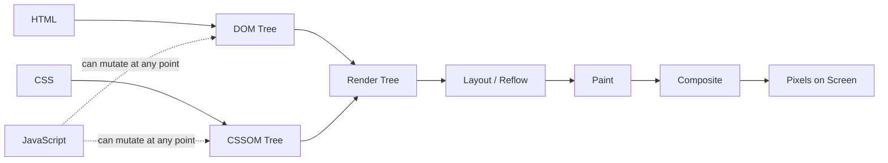
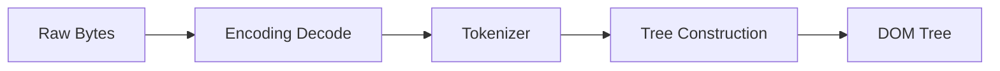
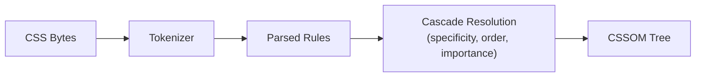
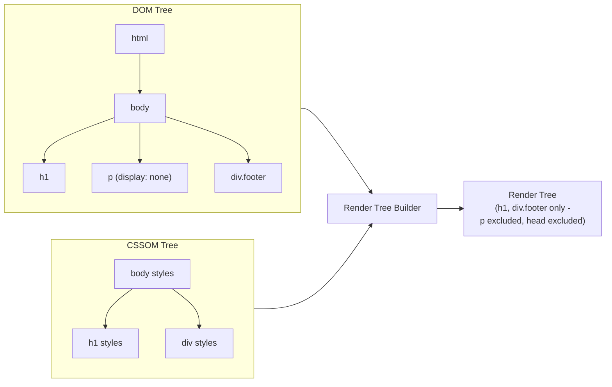
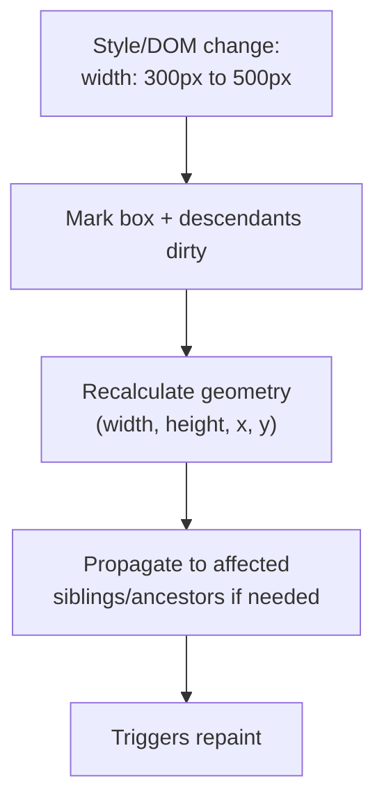
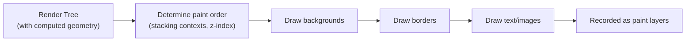
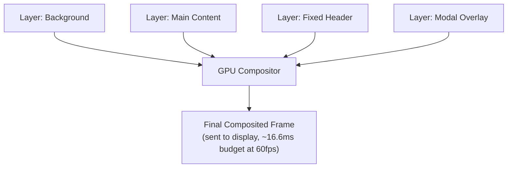
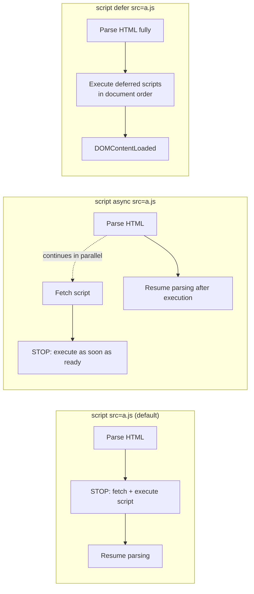
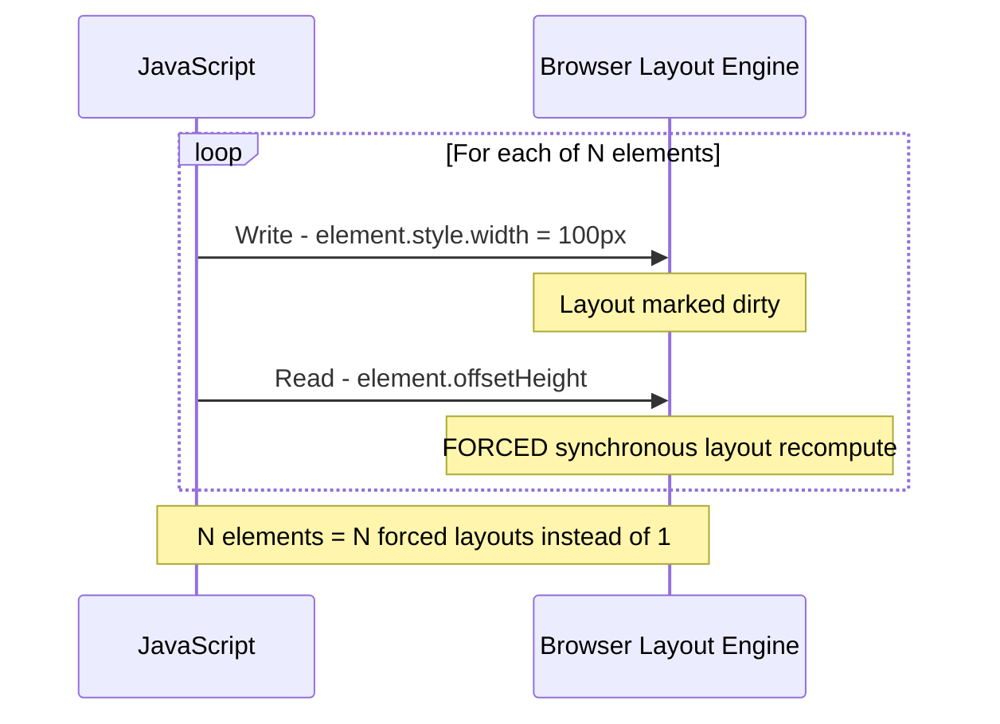

# Browser Rendering Pipeline

## Blogs and websites


## Medium


## Youtube


## Theory

### Topics Covered

- **What Is the Browser Rendering Pipeline?** - the six-stage journey from HTML/CSS/JS to pixels on screen.
- **HTML Parsing & DOM Construction** - how raw bytes become a tree of nodes.
- **CSS Parsing & CSSOM Construction** - how style rules become a queryable style tree.
- **Render Tree Construction** - merging DOM and CSSOM into only what is visible.
- **Layout (Reflow)** - computing exact geometry (position and size) for every box.
- **Paint** - filling in pixels for every visible box.
- **Composite & GPU Layers** - combining painted layers on the GPU for the final frame.
- **JavaScript Parsing, Execution & Render-Blocking Behavior** - how scripts pause or unblock the pipeline.
- **Layout Thrashing & Forced Synchronous Layout** - the anti-pattern that repeats layout unnecessarily.
- **Core Web Vitals & The Critical Rendering Path** - the metrics that measure real user rendering performance and how to optimize for them.

Each topic below covers the detailed theory, a diagram, a real-life use case, a Java code example (using Selenium/Java to observe or simulate the concept), and interview questions with answers.

### What Is the Browser Rendering Pipeline?

The browser rendering pipeline is the sequence of steps a browser engine (Blink, Gecko, WebKit) takes to convert HTML, CSS, and JavaScript into pixels on the screen. Understanding it is essential because every millisecond of perceived page performance developers try to shave off maps directly onto one of these stages.

**The six stages, in order:**



1. **Parse HTML -> DOM Tree** - build a tree of nodes from the markup.
2. **Parse CSS -> CSSOM Tree** - build a tree of computed style rules.
3. **Combine -> Render Tree** - merge DOM + CSSOM, keeping only visible nodes.
4. **Layout (Reflow)** - calculate the exact position and size of every box.
5. **Paint** - fill in the pixels (colors, borders, shadows, text).
6. **Composite** - combine painted layers in the right order and hand off to the GPU.

Every one of these stages costs time, and later stages are progressively more expensive to redo. This is why the pipeline is usually drawn as a funnel: cheap changes (compositing only) are fast and frequent, while expensive changes (layout) cascade through every stage after it.

> **Real-life use case:** When a user opens a news article, the browser must parse potentially megabytes of HTML/CSS/JS, build the DOM/CSSOM, and paint the first visible content in well under a second to avoid the user bouncing. Research from Google shows that as page load time goes from 1s to 3s, the probability of a mobile user abandoning the page increases by 32%, directly motivating why engineering teams instrument and optimize every stage of this pipeline.

**Java: measuring the end-to-end pipeline with Selenium**

```java
import org.openqa.selenium.JavascriptExecutor;
import org.openqa.selenium.WebDriver;
import org.openqa.selenium.chrome.ChromeDriver;

public class RenderingPipelineTimings {

    public static void main(String[] args) {
        WebDriver driver = new ChromeDriver();
        try {
            driver.get("https://example.com");

            JavascriptExecutor js = (JavascriptExecutor) driver;
            // Navigation Timing Level 2 exposes every stage of the pipeline in milliseconds
            Object timings = js.executeScript(
                "const nav = performance.getEntriesByType('navigation')[0];" +
                "return {" +
                "  domInteractive: nav.domInteractive," +
                "  domContentLoaded: nav.domContentLoadedEventEnd," +
                "  domComplete: nav.domComplete," +
                "  firstPaint: performance.getEntriesByName('first-paint')[0]?.startTime," +
                "  firstContentfulPaint: performance.getEntriesByName('first-contentful-paint')[0]?.startTime" +
                "};"
            );
            System.out.println("Pipeline timings: " + timings);
        } finally {
            driver.quit();
        }
    }
}
```

**Interview Questions**

**1. Why is the rendering pipeline modeled as a sequence of stages rather than one single step?**

Because each stage produces an input the next stage depends on: layout cannot compute box positions until it has both DOM structure and the computed styles supplied by CSSOM (merged into the render tree), and paint cannot fill pixels until it knows the exact geometry layout produced. Modeling it as stages also lets browser engines optimize each stage independently and, critically, lets them skip stages entirely when a change doesn't affect them (e.g. an `opacity` change never needs to redo layout).

**2. What is the difference between the DOM and the render tree?**

The DOM is a complete structural representation of every element in the HTML, including invisible ones (`<head>`, `<script>`, elements with `display: none`). The render tree only contains nodes that will actually be painted - it is the DOM merged with computed CSSOM styles, with all non-visual nodes filtered out. This distinction matters because layout and paint only operate on the render tree, not the raw DOM.

**3. Can JavaScript affect every stage of the pipeline?**

Yes. JavaScript can mutate the DOM (`appendChild`, `innerHTML`), mutate CSSOM (`style.color = 'red'`, toggling classes), read layout geometry (`offsetHeight`, forcing a synchronous layout), and even influence compositing (toggling `transform`/`opacity`, using `will-change`). This is why long-running or poorly scheduled JavaScript is one of the most common causes of rendering performance problems.

---

### HTML Parsing & DOM Construction

The HTML parser converts a raw byte stream into a tree of DOM nodes. This happens incrementally, in a single top-to-bottom pass, using an algorithm standardized by the WHATWG HTML spec (tokenization, then tree construction).

**How it works:**
1. **Byte stream -> characters**: bytes are decoded using the detected encoding (e.g. UTF-8).
2. **Characters -> tokens**: the tokenizer emits start tags, end tags, attributes, text, and comments.
3. **Tokens -> DOM nodes**: the tree construction stage uses a stack of open elements to build the node tree, handling implicit tag closing (e.g. `<p>` auto-closes an open `<p>`) and malformed markup recovery.

```
<html>
  <body>
    <h1>Hello</h1>
    <p>World</p>
  </body>
</html>

becomes:

Document
 └─ html
     └─ body
         ├─ h1 -> "Hello"
         └─ p  -> "World"
```



**Key blocking behavior:**
- The parser works incrementally and top-to-bottom, so it can start rendering before the whole document has arrived.
- A `<script>` tag **pauses HTML parsing** entirely (unless `async` or `defer` is used) because the script might call `document.write()` and change what comes next.
- A `<link rel="stylesheet">` does **not** block parsing, but it does block rendering (see the CSSOM and Critical Rendering Path topics).

> **Real-life use case:** Server-rendered e-commerce pages (e.g. Amazon product pages) deliberately place the product title and hero image early in the HTML byte stream so the parser builds - and can render - that portion of the DOM before slower parts of the page (recommendations, reviews) have even arrived over the network, improving perceived load time even though the full page is still downloading.

**Java: simulating a minimal DOM tree builder**

```java
import java.util.ArrayDeque;
import java.util.ArrayList;
import java.util.Deque;
import java.util.List;

public class MiniDomBuilder {

    static class Node {
        String tag;
        String text;
        List<Node> children = new ArrayList<>();

        Node(String tag) { this.tag = tag; }
    }

    /** A drastically simplified tree-construction stage: no attributes, no malformed-markup recovery. */
    public Node build(List<String> tokens) {
        Node root = new Node("#document");
        Deque<Node> openElements = new ArrayDeque<>();
        openElements.push(root);

        for (String token : tokens) {
            if (token.startsWith("</")) {
                openElements.pop(); // close current element
            } else if (token.startsWith("<")) {
                Node node = new Node(token.substring(1, token.length() - 1));
                openElements.peek().children.add(node);
                openElements.push(node);
            } else {
                openElements.peek().text = token; // text node
            }
        }
        return root;
    }
}
```

**Interview Questions**

**1. Why does a `<script>` tag block HTML parsing by default?**

Because the script might call `document.write()` or otherwise synchronously modify the DOM in a way that changes what the parser should build next; the browser cannot safely continue parsing ahead of a script until the script has finished running (and, if it's an external script, until it has finished downloading). `async` and `defer` opt out of this by guaranteeing the script does not need to interleave with parsing at that exact point.

**2. What is the difference between `async` and `defer`?**

Both let the HTML parser continue without waiting for the script to download. `async` scripts execute as soon as they finish downloading, potentially interrupting the parser at an arbitrary point and in a non-deterministic order relative to other async scripts. `defer` scripts are guaranteed to execute in document order, only after parsing has fully completed and just before `DOMContentLoaded` fires, making `defer` the safer default for scripts that depend on the full DOM or a specific execution order.

**3. Why can browsers start parsing before the entire HTML file has been downloaded?**

Because HTML parsing is a streaming, incremental process: the tokenizer and tree builder consume bytes as they arrive over the network and can construct nodes for the parts of the document that have already arrived, without waiting for the full response body. This is why the "preload scanner" can also look ahead in the arriving HTML to start fetching CSS, images, and scripts before the main parser even reaches those tags.

---

### CSS Parsing & CSSOM Construction

CSS is parsed independently from HTML into the CSSOM (CSS Object Model) - a tree of style rules where every node inherits computed properties from its parent unless overridden.

```
body { font-size: 16px; }
h1 { color: blue; }

CSSOM:
  body (font-size: 16px)
   ├─ h1 (color: blue, font-size: 16px  <- inherited)
   └─ p  (font-size: 16px  <- inherited)
```

**Key points:**
- CSSOM construction requires the **entire stylesheet** to be parsed before it can be considered complete - there is no incremental "partial CSSOM" the way there is a partial DOM, because a later rule can override an earlier one (or a media query might not match yet).
- CSS is **render-blocking**: the browser will not paint anything until CSSOM is fully built, specifically to avoid a "flash of unstyled content" (FOUC) where users briefly see raw, unstyled HTML.
- The **cascade** resolves conflicting rules using origin, specificity, source order, and `!important`, producing one final computed value per property per element.



> **Real-life use case:** A large e-commerce site shipping one giant 500KB global stylesheet blocks first paint on every page until that entire file downloads and parses, even if the visible above-the-fold content only needs 5KB of it. This is why performance audits (Lighthouse) flag "Eliminate render-blocking resources" and why teams extract and inline critical CSS for above-the-fold content while deferring the rest.

**Java: a minimal specificity calculator**

```java
public class CssSpecificityCalculator {

    record Specificity(int ids, int classes, int elements) implements Comparable<Specificity> {
        @Override
        public int compareTo(Specificity o) {
            if (ids != o.ids) return Integer.compare(ids, o.ids);
            if (classes != o.classes) return Integer.compare(classes, o.classes);
            return Integer.compare(elements, o.elements);
        }
    }

    /** Very simplified: counts #id, .class/[attr]/:pseudo-class, and bare element selectors. */
    public Specificity calculate(String selector) {
        int ids = countMatches(selector, "#");
        int classes = countMatches(selector, ".") + countMatches(selector, "[") + countMatches(selector, ":");
        int elements = selector.replaceAll("[#.\\[:][^ >+~]*", "").trim().split("\\s+").length;
        return new Specificity(ids, classes, elements);
    }

    private int countMatches(String s, String token) {
        return (int) s.chars().filter(c -> c == token.charAt(0)).count();
    }
}
```

**Interview Questions**

**1. Why is CSS render-blocking while HTML parsing is not?**

Rendering (painting pixels) requires a complete, final computed style for every element, and any CSS rule anywhere in the stylesheet - even one appearing near the end of the file - can override earlier rules or match via specificity. Painting before CSSOM is complete risks showing incorrect or flickering styles (FOUC), so browsers intentionally hold off on the first paint until CSSOM construction finishes, even though they're happy to build the DOM incrementally as bytes arrive.

**2. How does the cascade decide which of two conflicting CSS rules wins?**

First by **origin and importance** (user `!important` beats author `!important` beats author normal beats user normal beats browser default), then within the same importance tier by **specificity** (inline styles beat ID selectors beat class/attribute/pseudo-class selectors beat element selectors), and finally, if specificity is tied, by **source order** - the rule that appears later in the stylesheet (or in a later linked stylesheet) wins.

**3. What's a practical technique to avoid CSS blocking the first paint of above-the-fold content?**

Inline the small amount of "critical CSS" needed to style the above-the-fold content directly in a `<style>` tag in the `<head>`, and load the rest of the stylesheet asynchronously (e.g. `<link rel="preload" as="style" onload="this.rel='stylesheet'">` or a `media` attribute trick), so the browser can paint the visible viewport immediately without waiting on the full, larger stylesheet to download and parse.

---

### Render Tree Construction

The render tree is built by walking the DOM tree and, for every visible node, attaching its computed style from the CSSOM. It is the direct input to layout.

**What gets excluded:**
- Non-visual nodes: `<head>`, `<script>`, `<meta>`, `<title>`.
- Any node (or its ancestor) with `display: none` - it and its subtree are fully excluded from the render tree (unlike `visibility: hidden`, which is still laid out and takes up space, just invisible).



> **Real-life use case:** A single-page app that toggles a modal by switching `display: none` to `display: block` (rather than mounting/unmounting the DOM node) avoids DOM parsing/construction cost on every open, but the browser still has to rebuild the render tree and rerun layout for that subtree every time visibility toggles - which is why frameworks often recommend `visibility`/`opacity`-based show-hide for frequently toggled elements when layout shift must be avoided, or fully unmounting for rarely toggled ones.

**Java: building a simplified render tree by filtering a DOM+CSSOM pairing**

```java
import java.util.List;
import java.util.Map;
import java.util.stream.Collectors;

public class RenderTreeBuilder {

    record DomNode(String tag, Map<String, String> computedStyle, List<DomNode> children) {}

    private static final List<String> NON_VISUAL_TAGS = List.of("head", "script", "meta", "title", "style");

    public DomNode buildRenderTree(DomNode node) {
        if (NON_VISUAL_TAGS.contains(node.tag())) return null;
        if ("none".equals(node.computedStyle().get("display"))) return null;

        List<DomNode> visibleChildren = node.children().stream()
                .map(this::buildRenderTree)
                .filter(child -> child != null)
                .collect(Collectors.toList());

        return new DomNode(node.tag(), node.computedStyle(), visibleChildren);
    }
}
```

**Interview Questions**

**1. Why is `display: none` excluded from the render tree while `visibility: hidden` is not?**

`display: none` removes the element from the layout flow entirely - it has no box, occupies no space, and is skipped by layout and paint, so it is correctly excluded from the render tree. `visibility: hidden` still participates in layout (it reserves space, siblings are positioned as if it were visible), it's just not painted, so it must remain in the render tree so layout can still account for its geometry.

**2. Does the render tree include pseudo-elements like `::before` and `::after`?**

Yes - if a pseudo-element has `content` defined and is not `display: none`, it is generated and included in the render tree as if it were a real (anonymous) box, because it will actually be laid out and painted.

**3. If an element is positioned off-screen (e.g. `position: absolute; left: -9999px`), is it in the render tree?**

Yes. Being positioned outside the visible viewport does not remove an element from layout or the render tree - it still has computed geometry and could theoretically be painted (e.g. if scrolled into view or read by screen readers), unlike `display: none` which removes it from the flow altogether. This is actually a common technique for visually hiding content while keeping it accessible to screen readers.

---

### Layout (Reflow)

Layout ("reflow") walks the render tree and computes the exact pixel position and size of every box, based on the CSS box model, containing block sizes, and flow rules (block, inline, flex, grid).

```
Viewport: 1200px wide

<div style="width: 50%">        -> 600px wide
  <p style="font-size: 16px">   -> line breaks and height computed from font metrics and container width
```

**Why layout is expensive:**
- It's **cascading**: changing one element's size or position can force recalculation of its children, its following siblings, and sometimes its ancestors (if the ancestor's size depends on its children, e.g. `height: auto` with intrinsic sizing).
- Some properties trigger layout for the **entire document** (e.g. changing the `<html>` font-size affects every `em`-based measurement on the page).
- Modern browsers try to scope layout to the smallest "dirty" subtree possible, but many common patterns (resizing a flex/grid container, adding items to a growing list) still force large-scale recalculation.



> **Real-life use case:** Infinite-scroll social media feeds (Twitter/X, Instagram) that append many DOM nodes at once can trigger a large, expensive layout pass across the whole feed if not carefully virtualized. Production feeds instead use windowing/virtualization libraries that only keep a small number of DOM nodes mounted at a time, dramatically shrinking the size of the render tree layout has to process on each scroll event.

**Java: computing a simplified box model layout**

```java
public class BoxModelLayout {

    record Box(double contentWidth, double padding, double border, double margin) {
        double borderBoxWidth() { return contentWidth + 2 * padding + 2 * border; }
        double marginBoxWidth() { return borderBoxWidth() + 2 * margin; }
    }

    /** Distributes available container width across a row of block-level children (simplified flow layout). */
    public double[] layoutRow(double containerWidth, double[] childWidthPercentages) {
        double[] resolvedWidths = new double[childWidthPercentages.length];
        for (int i = 0; i < childWidthPercentages.length; i++) {
            resolvedWidths[i] = containerWidth * (childWidthPercentages[i] / 100.0);
        }
        return resolvedWidths;
    }
}
```

**Interview Questions**

**1. Why is layout considered the most expensive stage of the rendering pipeline?**

Because a single geometry change can invalidate the computed geometry of many other elements - children, following siblings, and sometimes ancestors - requiring the browser to recompute positions and sizes for a potentially large subtree (or the whole document) rather than a single box, unlike paint or composite which can often be scoped to just the changed element/layer.

**2. What is "layout thrashing" and how does it relate to reading properties like `offsetHeight`?**

Covered in detail in the dedicated Layout Thrashing topic below - in short, it's forcing the browser to synchronously recompute layout multiple times in a single frame by interleaving DOM writes (which invalidate layout) with layout-dependent reads (like `offsetHeight`, which force an immediate synchronous recalculation to return an up-to-date value).

**3. Does changing `transform: translateX()` trigger layout?**

No - `transform` is applied after layout, purely as a visual transformation during compositing. This is precisely why `transform` (and `opacity`) are recommended for animations: moving an element with `transform: translateX(100px)` never touches layout or paint, only compositing, which is GPU-accelerated and far cheaper.

---

### Paint

Paint fills in the actual pixels for every box in the render tree - background colors, borders, text, shadows, images - based on the geometry layout computed.

```
For each render tree node (in paint order):
  -> Draw background color
  -> Draw border
  -> Draw text glyphs
  -> Draw box-shadow / other visual effects
```

**Paint order and stacking contexts:**
- Paint follows the **stacking context** rules: `z-index`, `position`, `opacity < 1`, and `transform` can all create new stacking contexts that change paint order relative to a naive DOM-order painting.
- Modern browser engines split the page into multiple **paint layers** so that repainting one layer (e.g. a blinking cursor, a video element) doesn't require repainting the entire page.



> **Real-life use case:** A chat application with a blinking "typing..." indicator or an auto-updating timestamp isolates that small element onto its own paint layer (often by giving it `will-change` or a `transform`), so the browser only repaints that tiny region on every tick instead of repainting the entire message list, keeping scroll performance smooth even while the indicator updates continuously.

**Java: simulating paint order via a simplified stacking context sort**

```java
import java.util.Comparator;
import java.util.List;

public class PaintOrderSimulator {

    record PaintableBox(String label, int zIndex, int domOrder) {}

    /** Approximates paint order: lower z-index paints first; ties broken by DOM order. */
    public List<PaintableBox> paintOrder(List<PaintableBox> boxes) {
        return boxes.stream()
                .sorted(Comparator.comparingInt(PaintableBox::zIndex)
                        .thenComparingInt(PaintableBox::domOrder))
                .toList();
    }
}
```

**Interview Questions**

**1. What causes an element to be painted on its own layer instead of being merged into its parent's layer?**

Certain CSS properties and situations act as layer-promotion triggers: `will-change: transform/opacity`, 3D transforms (`translateZ(0)`, `transform: translate3d(...)`), `<video>`/`<canvas>` elements, elements with `opacity` animations, and elements with `position: fixed` in some engines. Browsers use heuristics to promote elements likely to animate independently onto their own compositor layer so that repainting them doesn't force repainting everything around them.

**2. Why can changing `background-color` be cheaper than changing `width`?**

Changing `background-color` only requires a repaint of the affected box (it doesn't change geometry, so layout is skipped entirely), whereas changing `width` invalidates the box's geometry, forcing layout to recompute size/position for that box and potentially its siblings/children, which then also forces a repaint. Fewer pipeline stages triggered means less work.

**3. What is the risk of creating too many compositor layers?**

Each layer consumes GPU memory and requires the browser to manage and composite it separately; excessive layer creation ("layer explosion") can actually hurt performance by increasing memory pressure and compositing overhead, especially on memory-constrained mobile devices, so layer promotion should be applied selectively (elements that actually animate), not blanket-applied to every element via `will-change`.

---

### Composite & GPU Layers

Compositing is the final stage: previously painted layers are combined in the correct stacking order and handed to the GPU to produce the final on-screen frame.

```
Layer 1: Background
Layer 2: Main content
Layer 3: Fixed header
Layer 4: Modal overlay
  -> GPU composites layers -> Screen pixels
```

- Compositing is the **cheapest** pipeline stage because it runs on the GPU and can reuse already-painted layer bitmaps without re-painting them.
- Animating `transform` and `opacity` only touches compositing - the browser can slide, scale, rotate, or fade an already-painted layer bitmap without recomputing layout or repainting pixels.
- The `will-change` CSS property is a hint telling the browser to promote this element to its own layer in advance, trading memory for avoiding a layer-promotion hiccup at animation start time.



> **Real-life use case:** Smooth 60fps drawer/sidebar animations in mobile web apps (e.g. sliding a navigation menu in from the left) are implemented with `transform: translateX()` rather than animating `left`/`margin-left`, specifically so the animation runs entirely on the compositor thread and stays smooth even while the main JavaScript thread is busy doing other work.

**Java: modeling a frame budget check for 60fps compositing**

```java
public class FrameBudgetChecker {

    private static final double FRAME_BUDGET_MS = 1000.0 / 60; // approximately 16.6ms per frame at 60fps

    /** Returns how much budget remains after layout+paint work, for compositing + browser overhead. */
    public double remainingBudgetMs(double layoutMs, double paintMs) {
        double remaining = FRAME_BUDGET_MS - (layoutMs + paintMs);
        return Math.max(remaining, 0);
    }

    public boolean willDropFrame(double layoutMs, double paintMs, double compositeMs) {
        return (layoutMs + paintMs + compositeMs) > FRAME_BUDGET_MS;
    }
}
```

**Interview Questions**

**1. Why is compositing described as "GPU-accelerated" while layout and paint are typically CPU-bound?**

Layout and paint require understanding document semantics (box model math, text shaping, glyph rasterization) which is done on the CPU by the browser's layout/paint engines. Compositing, by contrast, is just combining already-rasterized bitmaps (textures) in the right order and position, a task GPUs are purpose-built for via texture blending, which is why it's both faster and offloadable to a separate thread/process from the main thread.

**2. What is the "compositor thread" and why does it matter for scroll performance?**

The compositor thread is a separate thread from the main JavaScript/layout/paint thread that owns already-painted layers and can reposition, scale, or fade them (and handle scrolling) independently, without needing the main thread to be free. This is why a page can often still scroll smoothly even while a long-running JavaScript task is blocking the main thread, because scrolling is handled by the compositor thread operating on layers that were already painted.

**3. If `will-change` reduces layer-promotion cost, why not apply it to every animatable element by default?**

Every layer promoted via `will-change` consumes additional GPU memory and must be tracked/managed by the compositor, so indiscriminately promoting many elements ("layer explosion") can increase memory pressure and actually slow down compositing, especially on memory-constrained mobile devices. `will-change` should be applied narrowly, ideally only shortly before an animation starts and removed after it ends.

---

### JavaScript Parsing, Execution & Render-Blocking Behavior

JavaScript sits outside the DOM/CSSOM/layout/paint pipeline but can interact with (and block) every stage of it, because the browser must assume any running script might synchronously mutate the DOM or CSSOM.

**Script loading strategies:**



- **Default `<script>`**: blocks HTML parsing entirely until the script downloads (if external) and executes.
- **`async`**: downloads in parallel with parsing but executes as soon as it's ready, interrupting the parser at an arbitrary point; order relative to other scripts is not guaranteed.
- **`defer`**: downloads in parallel and executes only after parsing completes, in document order, right before `DOMContentLoaded`.
- **`type="module"`**: deferred by default.

**Why long JavaScript tasks hurt rendering:** the browser's main thread is single-threaded for JS execution, layout, and paint. A JavaScript task running longer than roughly 50ms (a "long task") delays the browser from processing input, running layout, or painting the next frame, directly hurting responsiveness metrics like INP.

> **Real-life use case:** Google's guidance for third-party analytics/ad scripts is to always load them with `async` (never a blocking default `<script>`), because a slow-loading third-party domain (analytics vendor having an outage) should never be allowed to stall the parsing - and therefore the perceived load - of the publisher's own primary content.

**Java: measuring render-blocking script impact with Selenium**

```java
import org.openqa.selenium.JavascriptExecutor;
import org.openqa.selenium.WebDriver;
import org.openqa.selenium.chrome.ChromeDriver;
import java.util.List;
import java.util.Map;

public class RenderBlockingScriptCheck {

    public static void main(String[] args) {
        WebDriver driver = new ChromeDriver();
        try {
            driver.get("https://example.com");
            JavascriptExecutor js = (JavascriptExecutor) driver;

            @SuppressWarnings("unchecked")
            List<Map<String, Object>> resources = (List<Map<String, Object>>) js.executeScript(
                "return performance.getEntriesByType('resource')" +
                "  .filter(r => r.initiatorType === 'script')" +
                "  .map(r => ({ name: r.name, duration: r.duration, renderBlockingStatus: r.renderBlockingStatus }));"
            );
            resources.forEach(System.out::println);
        } finally {
            driver.quit();
        }
    }
}
```

**Interview Questions**

**1. Why does a plain `<script>` tag block HTML parsing but a `<script async>` tag not?**

A plain script might call `document.write()` or read/mutate DOM state that the parser hasn't produced yet, so the browser must pause parsing and run it immediately, in its exact document position, to guarantee correctness. `async` explicitly opts out of that guarantee - the developer promises the script doesn't depend on being interleaved at that exact parse position - so the browser can keep parsing in parallel and only pause briefly to execute once the script is downloaded.

**2. When should you prefer `defer` over `async`?**

Prefer `defer` when script execution order matters (e.g. a library script must run before code that depends on it) or when the script needs the full DOM to exist - `defer` guarantees document-order execution after parsing completes. Prefer `async` for independent scripts with no dependencies and no DOM requirements, like most third-party analytics/ad tags, where earliest-possible, unordered execution is fine.

**3. What is a "long task" and why does it matter for user-perceived performance?**

A long task is any single unit of JavaScript work on the main thread that takes longer than roughly 50ms. Because the main thread is single-threaded, a long task blocks the browser from responding to user input, running layout, or painting the next frame until it finishes, which is why long tasks are the primary driver of poor INP (Interaction to Next Paint) scores; the fix is typically breaking work into smaller chunks (`requestIdleCallback`, `setTimeout(0)`, `scheduler.yield()`) or moving it off the main thread entirely with a Web Worker.

---

### Layout Thrashing & Forced Synchronous Layout

Layout thrashing is a performance anti-pattern where JavaScript repeatedly interleaves DOM **writes** (which invalidate layout) with layout-dependent **reads** (like `offsetHeight`, `getBoundingClientRect()`), forcing the browser to synchronously recompute layout many times in a single frame instead of once.

**The anti-pattern:**



- **Bad**: looping through elements and, for each one, writing a style then immediately reading `offsetHeight` - every iteration forces a full synchronous layout because the read needs an up-to-date value right after a write.
- **Good**: batch all reads first (into an array), then apply all writes afterward - only one layout pass is forced (for the reads), and the writes are deferred to the browser's normal next layout.

> **Real-life use case:** A drag-and-drop UI library (e.g. reordering a Kanban board) that reads each card's `getBoundingClientRect()` immediately after moving another card can cause severe jank with dozens of cards, because every read-after-write pair forces layout; libraries like `react-beautiful-dnd` and FLIP-animation techniques explicitly batch all measurement reads before applying any style writes to avoid this.

**Java: detecting forced synchronous layout patterns via Selenium's performance trace**

```java
import org.openqa.selenium.JavascriptExecutor;
import org.openqa.selenium.WebDriver;
import org.openqa.selenium.chrome.ChromeDriver;

public class LayoutThrashingDetector {

    public static void main(String[] args) {
        WebDriver driver = new ChromeDriver();
        try {
            driver.get("https://example.com");
            JavascriptExecutor js = (JavascriptExecutor) driver;

            // PerformanceObserver 'measure' entries can be used by app code to bracket
            // suspect read/write loops and report their cumulative duration back to Java.
            Object thrashingDurationMs = js.executeScript(
                "return performance.getEntriesByType('measure')" +
                "  .filter(e => e.name === 'layout-thrash-suspect')" +
                "  .reduce((sum, e) => sum + e.duration, 0);"
            );
            System.out.println("Cumulative suspect layout time (ms): " + thrashingDurationMs);
        } finally {
            driver.quit();
        }
    }
}
```

**Interview Questions**

**1. What exactly forces a "synchronous" layout, as opposed to the browser's normal, batched layout?**

Normally the browser batches all pending style/DOM changes and runs layout once per frame, right before paint. But certain JavaScript reads - `offsetWidth`, `offsetHeight`, `getBoundingClientRect()`, `getComputedStyle()`, `scrollTop`, and similar - require an up-to-date geometry value at the moment they're called. If there are pending DOM/style writes since the last layout, the browser must synchronously run layout immediately, out of its normal batched schedule, purely to satisfy that read.

**2. How do you fix a layout-thrashing loop?**

Separate all reads from all writes: perform every measurement read first and cache the results, then perform every write afterward. This way only one forced layout happens (for the batch of reads, if anything was already dirty), rather than one forced layout per read/write pair. Libraries like FastDOM formalize this pattern by scheduling reads and writes into separate queues automatically.

**3. Does `requestAnimationFrame` alone prevent layout thrashing?**

No - `requestAnimationFrame` only guarantees your callback runs before the next repaint; it does nothing to prevent thrashing if the callback itself interleaves reads and writes across many elements. You still need to explicitly batch reads before writes inside the callback (or across multiple `rAF` callbacks) to actually avoid forced synchronous layout.

---

### Core Web Vitals & The Critical Rendering Path

The **Critical Rendering Path (CRP)** is the minimum sequence of steps - parsing, style computation, layout, paint - required to render the first meaningful pixels for the currently visible viewport. Optimizing it means minimizing three things: the number of critical resources, the number of critical bytes, and the length of the critical path (round trips).

**Core Web Vitals** are Google's standardized, field-measurable metrics for real user rendering performance:

| Metric | Measures | Good threshold |
|---|---|---|
| **FCP** (First Contentful Paint) | When the first text/image is painted | < 1.8s |
| **LCP** (Largest Contentful Paint) | When the largest above-the-fold element is painted | < 2.5s |
| **CLS** (Cumulative Layout Shift) | Visual stability - unexpected layout shifts | < 0.1 |
| **INP** (Interaction to Next Paint) | Responsiveness - time from user input to next paint | < 200ms |


**Common optimizations mapped to pipeline stages:**
- **Reduce TTFB/critical bytes**: server-side caching/CDN, HTTP/2+ multiplexing, compressing responses.
- **Reduce render-blocking resources**: inline critical CSS, `async`/`defer` scripts, `preload` key fonts/images.
- **Improve LCP**: prioritize the hero image/text with `fetchpriority="high"`, avoid lazy-loading above-the-fold images.
- **Improve CLS**: always reserve space (explicit `width`/`height`, `aspect-ratio`) for images/ads/embeds before they load.
- **Improve INP**: break up long JavaScript tasks, avoid layout thrashing, defer non-critical JS off the main thread.

> **Real-life use case:** Core Web Vitals became a confirmed Google Search ranking signal in 2021, so e-commerce and publisher sites treat these metrics as both a UX and an SEO/revenue lever; Walmart has reported that every 1 second of improvement in page load time increased conversions by up to 2%, directly tying rendering pipeline optimization to revenue.

**Java: capturing Core Web Vitals with Selenium for CI performance regression checks**

```java
import org.openqa.selenium.JavascriptExecutor;
import org.openqa.selenium.WebDriver;
import org.openqa.selenium.chrome.ChromeDriver;
import java.util.Map;

public class CoreWebVitalsCheck {

    private static final double LCP_BUDGET_MS = 2500;
    private static final double CLS_BUDGET = 0.1;

    public static void main(String[] args) {
        WebDriver driver = new ChromeDriver();
        try {
            driver.get("https://example.com");

            JavascriptExecutor js = (JavascriptExecutor) driver;
            @SuppressWarnings("unchecked")
            Map<String, Object> vitals = (Map<String, Object>) js.executeAsyncScript(
                "const callback = arguments[arguments.length - 1];" +
                "let lcp = 0, cls = 0;" +
                "new PerformanceObserver(list => {" +
                "  const entries = list.getEntries();" +
                "  lcp = entries[entries.length - 1].startTime;" +
                "}).observe({ type: 'largest-contentful-paint', buffered: true });" +
                "new PerformanceObserver(list => {" +
                "  list.getEntries().forEach(e => { if (!e.hadRecentInput) cls += e.value; });" +
                "}).observe({ type: 'layout-shift', buffered: true });" +
                "setTimeout(() => callback({ lcp, cls }), 3000);"
            );

            double lcp = (double) vitals.get("lcp");
            double cls = (double) vitals.get("cls");
            if (lcp > LCP_BUDGET_MS || cls > CLS_BUDGET) {
                throw new AssertionError("Performance budget exceeded: LCP=" + lcp + "ms, CLS=" + cls);
            }
        } finally {
            driver.quit();
        }
    }
}
```

**Interview Questions**

**1. Why did Google replace First Input Delay (FID) with Interaction to Next Paint (INP) as a Core Web Vital?**

FID only measured the delay before an event handler started running in response to the very first user interaction, ignoring how long that handler took to run or how the page responded to later interactions. INP measures the full latency from any interaction to the next visual update, across the entire page lifetime, giving a much more complete picture of real, sustained interactivity and responsiveness rather than just a single best-case first click.

**2. What's the most common cause of poor CLS, and how do you fix it?**

The most common cause is content (images, ads, embedded iframes, web fonts) loading and rendering with a different size than the space initially reserved for it, pushing the rest of the page's content down. The fix is to always specify explicit dimensions (`width`/`height` attributes or `aspect-ratio` in CSS) for any element whose final size is known ahead of time, and to reserve placeholder space for anything that loads asynchronously (like ads).

**3. Is optimizing LCP purely about images, or does it involve earlier pipeline stages too?**

It involves the whole path leading up to it: TTFB (server response speed), whether the LCP resource is discoverable early by the HTML preload scanner (not hidden behind JavaScript that must execute first), render-blocking CSS/JS that delays paint, and resource priority (`fetchpriority="high"`, avoiding `loading="lazy"` on the LCP image itself). Improving LCP often means optimizing the entire critical rendering path, not just compressing one image.
