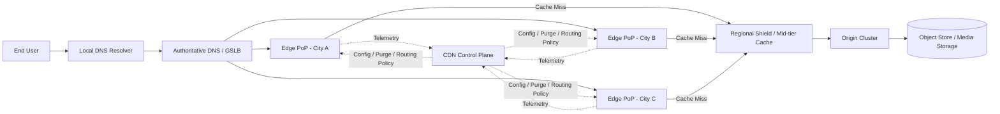
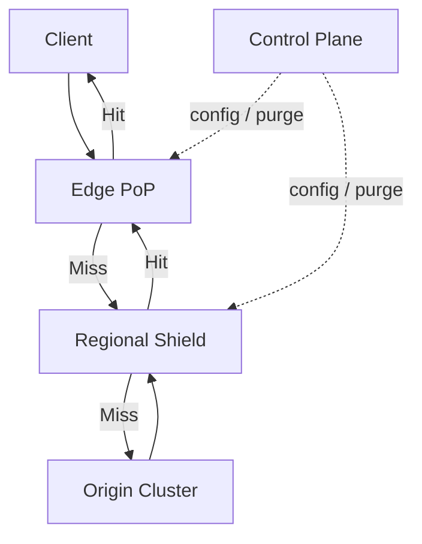
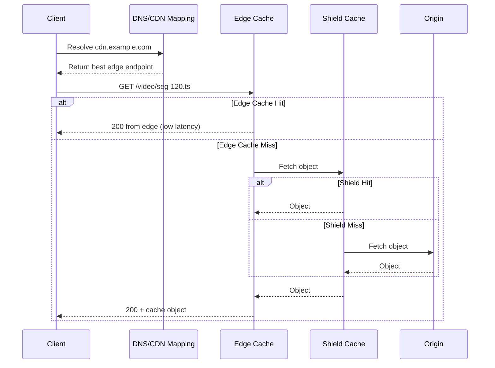
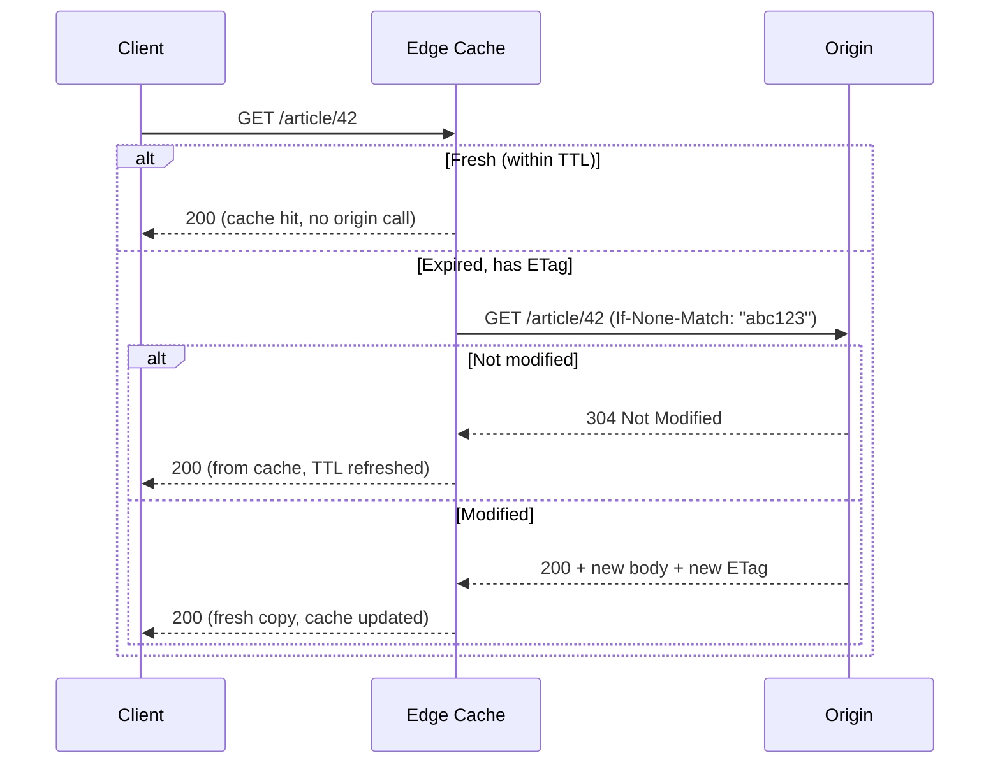
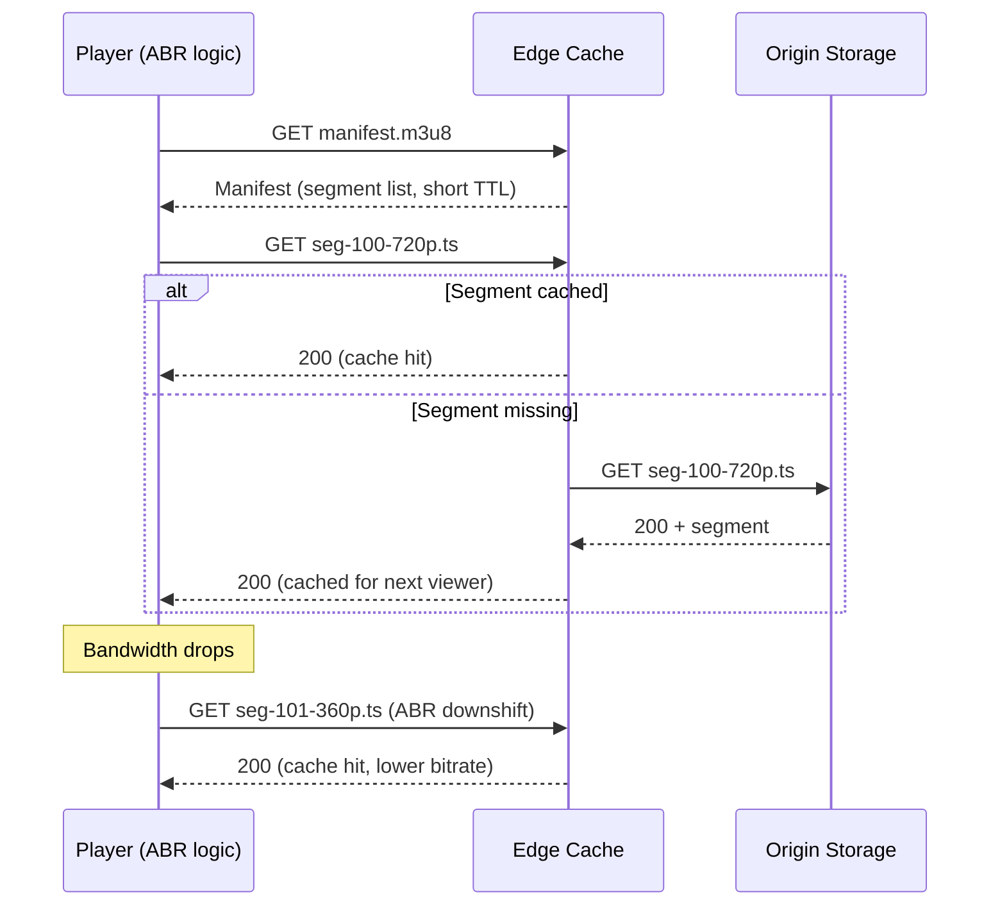
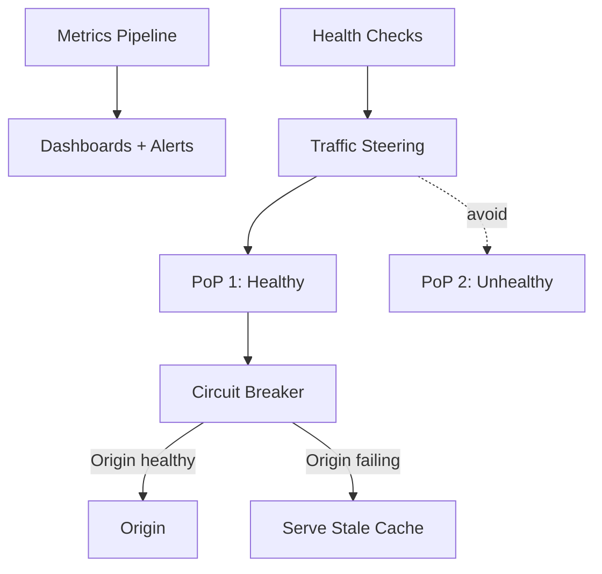
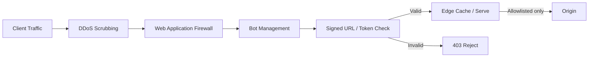
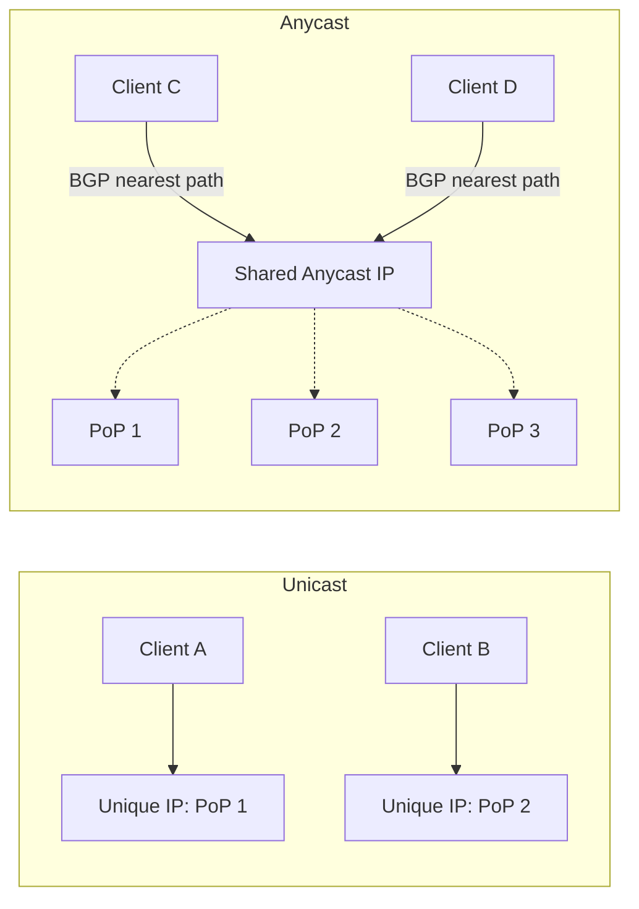
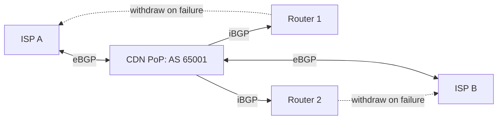
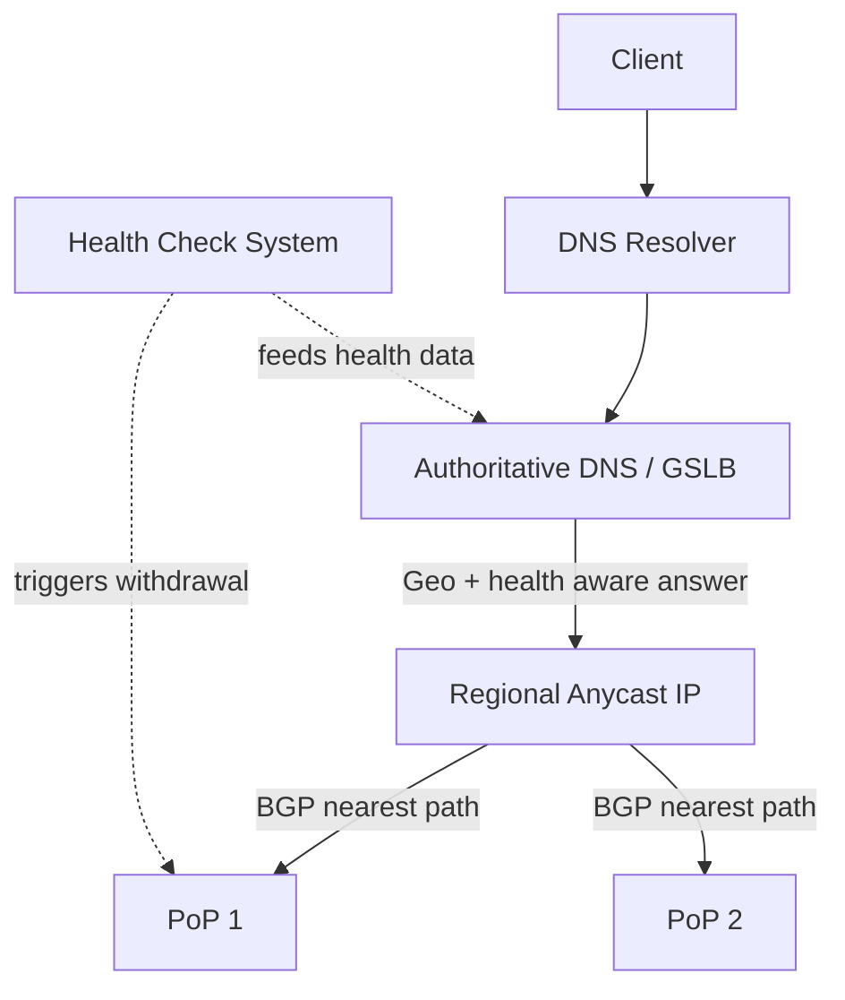

# CDN (Content Delivery Network)

## Blogs and websites


## Medium


## Youtube

### Introduction

- [How pros build truly resilient systems](https://www.youtube.com/watch?v=W6iMPAGY36c)
- [How a CDN Works | System Design](https://www.youtube.com/watch?v=5mYSQvflpKA)
- [How does Netflix's CDN scale to over 100TB/s? | System Design](https://www.youtube.com/watch?v=pdPSLm629yk)

- [Building YouTube-Scale Content Infrastructure (It's EASY)](https://www.youtube.com/watch?v=HT1-3bIOT2w)
- [Anycast vs Unicast Architecture Explained](https://www.youtube.com/watch?v=HT1-3bIOT2w)

## Theory

A **CDN (Content Delivery Network)** is a geographically distributed network of proxy servers ("edge" or "PoP" - Point of Presence - servers) that cache and serve content from a location physically or topologically closer to the requesting user, instead of every request travelling all the way back to a single origin server.

**How it Works (detailed):**

1. **User requests content** - the client (browser, mobile app, video player) issues an HTTP(S)/QUIC request for an asset such as `image.png`, an API response, or a video segment.
2. **DNS routes to nearest edge server** - the CDN's authoritative DNS (or an Anycast IP) resolves the hostname to the edge PoP considered "best" for that client, based on geographic proximity, network latency, and current PoP health/load.
3. **Edge server returns cached content or fetches from origin** - if the edge already holds a fresh copy of the object (a "cache hit"), it responds immediately. If not (a "cache miss"), it pulls the object from a regional shield/mid-tier cache or the origin server, then serves it to the client.
4. **Content cached for future requests** - the fetched object is stored at the edge (subject to `Cache-Control`/TTL rules) so that subsequent requests from nearby users are served without hitting the origin again, improving both latency and origin offload over time.

**Benefits (detailed):**

- **Reduced latency** - by serving bytes from a PoP that is network-close to the user, round-trip time drops sharply compared to a single, centralized origin, especially for geographically distant users.
- **Lower bandwidth costs** - origin egress traffic is reduced because most repeat requests are answered from edge caches; bandwidth bills shift to (typically cheaper, bulk-negotiated) CDN traffic instead of origin egress.
- **Improved availability** - if the origin becomes slow or briefly unreachable, edges can continue serving cached content ("serve stale on error"), and traffic can be shifted away from unhealthy PoPs or regions.
- **DDoS protection** - the CDN's large, distributed edge footprint absorbs and filters volumetric and application-layer attacks before they ever reach the origin, and origin IPs can be hidden entirely behind the CDN.
- **Offload origin servers** - a high cache-hit ratio means the origin only needs to handle cache misses and dynamic/uncacheable requests, letting it be provisioned far smaller than total user traffic would otherwise require.

**Use Cases (detailed):**

- **Static assets (images, CSS, JS)** - highly cacheable, rarely change per-request, and make up the bulk of typical web page weight, so they benefit the most from edge caching.
- **Video streaming** - large binary segments (HLS/DASH chunks) are ideal for edge caching; popular segments get very high hit ratios while long-tail content falls back to shield/origin.
- **Software downloads** - large files (installers, game patches, OS images) benefit from parallel, geographically distributed delivery to avoid single-origin bandwidth bottlenecks.
- **Gaming assets** - textures, patches, and matchmaking/telemetry endpoints benefit from low-latency edge delivery, especially for global player bases.

**Popular CDNs:**

- **Cloudflare** - broad free tier, strong security/WAF/DDoS features, large Anycast network.
- **Akamai** - one of the oldest and largest CDNs, deep enterprise and media-streaming footprint.
- **AWS CloudFront** - tightly integrated with the AWS ecosystem (S3, Lambda@Edge, Shield).
- **Fastly** - developer-friendly, fast cache purges, popular for API and edge-compute use cases.

### Topics Covered in This Guide

This page goes deep on the following CDN topics. Each topic below includes a detailed explanation, characteristics, components, patterns, pros/benefits, cons/challenges, best practices, when-to-use guidance, a diagram, a real-life use case, a Java code example, and interview questions with answers:

1. [CDN Architecture & Core Components](#cdn-architecture-core-components-deep-dive)
2. [Caching Fundamentals & Strategies](#caching-fundamentals-strategies-deep-dive)
3. [CDN for Video Streaming (Adaptive Bitrate Streaming)](#cdn-for-video-streaming-deep-dive)
4. [Unicast vs Anycast IP](#unicast-vs-anycast-ip-deep-dive)
5. [BGP Routing for CDN](#bgp-routing-for-cdn-deep-dive)
6. [DNS-Based vs Anycast Steering](#dns-based-vs-anycast-steering-deep-dive)
7. [Security at the Edge](#security-at-the-edge-deep-dive)
8. [Performance Metrics, Scaling & Reliability Patterns](#performance-metrics-scaling-reliability-patterns-deep-dive)

---

### Design Content Delivery Network

### What Is a CDN?

A **Content Delivery Network (CDN)** is a globally distributed system of servers that delivers content from locations closer to end users.

Core goals:

- Reduce latency (faster page/video/API asset loads)
- Reduce origin server load
- Improve availability and fault tolerance
- Improve throughput for large-scale traffic spikes
- Add security controls at the edge (DDoS mitigation, WAF, bot filtering)

Typical content served by a CDN:

- Static assets: images, CSS, JS, fonts
- Video/audio segments (HLS/DASH)
- Software downloads
- Dynamic/API responses (with careful caching rules)

### Why CDN Is Needed

Without CDN, every user request goes to a central origin region, causing:

- High RTT for distant users
- Congested long-haul links
- Hotspots and origin overload during traffic peaks
- Reduced resilience when one region fails

With CDN, users are served from nearby edge PoPs (Points of Presence), which can return cached content immediately or fetch from origin/shield when needed.

### High-Level CDN Architecture



Main components:

- **User + Resolver**: user browser/app asks DNS resolver for CDN hostname IP
- **DNS / GSLB layer**: steers user to best PoP (latency, health, policy)
- **Edge PoP**: first serving layer near users
- **Mid-tier / Shield**: protects origin from repetitive misses
- **Origin**: source of truth for content
- **Control plane**: config distribution, purge/invalidation, analytics, routing policies

#### CDN Architecture & Core Components: Deep Dive

The architecture diagram above shows the physical/logical layers a request travels through. Understanding each layer's role, and the trade-offs of adding more layers, is central to designing a CDN or reasoning about one in an interview.

##### CDN Architecture: Characteristics

- **Hierarchical caching tiers**: requests flow from client to edge, optionally to a regional shield, and only then to origin, so each tier absorbs load before it reaches the next, more expensive tier.
- **Geographically distributed PoPs**: hundreds to thousands of edge locations exist so that most users have a "close" PoP in network terms, not just geographic distance.
- **Stateless edge nodes**: edge servers typically hold only cached copies of data, not the source of truth, so any edge node can be added, removed, or fail without permanent data loss.
- **Centralized control plane, decentralized data plane**: configuration, purge commands, and routing policy are managed centrally, but the actual request serving happens independently at each edge, avoiding a single point of failure for traffic serving.
- **Pull-based population by default**: most CDNs populate caches lazily (on first miss) rather than pre-loading all content everywhere, trading a "cold" first request for massive storage savings.

##### CDN Architecture: Components

- **Edge PoP (Point of Presence)**: the first-hop server that terminates the client's TCP/TLS/QUIC connection and either serves from cache or forwards the request upstream.
- **Regional shield / mid-tier cache**: an intermediate caching layer that sits between many edge PoPs and the origin, deduplicating misses so the origin only sees one request per object per region instead of one per edge.
- **Origin cluster**: the authoritative source of content, often a set of application servers or an object store, protected from direct internet traffic by the CDN.
- **Control plane**: the management system that pushes configuration (cache rules, routing policy, TLS certificates), issues purge/invalidation commands, and collects telemetry from every edge node.
- **DNS / GSLB (Global Server Load Balancer)**: the layer that maps a hostname to the "best" edge IP for a given client, using health checks, latency measurements, and load data.

##### CDN Architecture: Patterns

- **Tiered/hierarchical caching**: edge to shield to origin, so that a single popular object is fetched from origin only once per shield region, no matter how many edges request it.
- **Request coalescing (a.k.a. "cache stampede protection")**: when many clients request the same missing object simultaneously, the edge sends only one upstream request and lets the others wait on the in-flight fetch.
- **Origin shielding**: designating one specific PoP (or a small set) as the only ones allowed to talk to origin, so origin only sees a small, predictable number of source IPs.
- **Anycast ingress with unicast backhaul**: the client-facing side uses Anycast for resilient routing, while PoP-to-shield-to-origin backhaul uses stable unicast links for predictable performance.

##### CDN Architecture: Pros / Benefits

- **Reduced origin load**: with tiered caching, origin traffic can be orders of magnitude lower than total client traffic, since most requests never reach it.
- **Localized fault isolation**: a problem at one edge PoP (hardware failure, local network issue) does not take down the whole service, because DNS/Anycast can route around it.
- **Elastic capacity**: adding more edge PoPs scales serving capacity without redesigning the origin, since edges are largely stateless and horizontally scalable.
- **Simplified origin security posture**: origin can be locked down to accept traffic only from CDN IP ranges or shield nodes, shrinking its attack surface drastically.

##### CDN Architecture: Cons / Challenges

- **Cache invalidation complexity**: with many independent caching tiers, purging a stale object everywhere (edge and shield, globally) is slower and harder to guarantee than with a single cache.
- **Debugging difficulty**: a request that "should" be cached but isn't might be failing at any of several tiers, requiring good per-tier logging and trace headers to diagnose.
- **Cold-start latency**: the very first request for a rarely-accessed object still pays full origin round-trip latency, since nothing was pre-populated.
- **Consistency vs freshness trade-off**: aggressive caching improves performance but risks serving stale content if TTLs and purge processes are not tuned correctly.

##### CDN Architecture: Best Practices

- Use a regional shield/mid-tier layer for any CDN deployment with high fan-out (many edges), not just direct edge-to-origin, to protect the origin from thundering herds.
- Enable request coalescing so that a viral/trending object does not generate thousands of simultaneous origin requests during its first few seconds of popularity.
- Tag cached objects with clear cache keys and versioned URLs (e.g., `/v2/asset.js`) so invalidation can often be avoided entirely by publishing a new URL instead of purging the old one.
- Restrict the origin's firewall/security group to only accept traffic from the CDN's published IP ranges or a shared secret header, so it cannot be reached by bypassing the CDN.

##### CDN Architecture: When to Use

- Any public-facing web/mobile application serving static or semi-static assets to a geographically spread audience.
- Video/audio streaming platforms where object sizes and traffic volumes would overwhelm a single-region origin.
- APIs with cacheable, read-heavy endpoints (e.g., product catalogs, public content feeds) that can tolerate a short TTL.
- Software/game distribution where large binaries must reach millions of users quickly without saturating a single origin's egress bandwidth.

##### CDN Architecture: Diagram



##### CDN Architecture: Real-Life Use Case

A news website publishes breaking-news images that suddenly go viral. Without a shield layer, thousands of edge PoPs around the world would each independently miss and hit the origin at once, overwhelming it. With a regional shield in front of the origin, only a handful of shield-layer requests (one per region) reach the origin, while all edge PoPs in that region share the single shield-cached copy - keeping origin load flat even as traffic spikes 100x.

##### CDN Architecture: Java Code Example

```java
import java.util.concurrent.ConcurrentHashMap;
import java.util.concurrent.CompletableFuture;

// Simplified tiered cache showing edge -> shield -> origin lookups with
// request coalescing so concurrent misses for the same key only hit origin once.
public class TieredCdnCache {

    private final ConcurrentHashMap<String, String> edgeCache = new ConcurrentHashMap<>();
    private final ConcurrentHashMap<String, String> shieldCache = new ConcurrentHashMap<>();
    private final ConcurrentHashMap<String, CompletableFuture<String>> inFlight = new ConcurrentHashMap<>();

    public String getFromOrigin(String key) {
        // Simulates a slow origin fetch.
        return "origin-value-for-" + key;
    }

    public String get(String key) {
        String edgeHit = edgeCache.get(key);
        if (edgeHit != null) {
            return edgeHit; // edge cache hit, fastest path
        }

        String shieldHit = shieldCache.get(key);
        if (shieldHit != null) {
            edgeCache.put(key, shieldHit);
            return shieldHit; // shield cache hit
        }

        // Coalesce concurrent misses for the same key into a single origin fetch.
        CompletableFuture<String> future = inFlight.computeIfAbsent(key,
                k -> CompletableFuture.supplyAsync(() -> getFromOrigin(k)));
        String origin = future.join();
        inFlight.remove(key);
        shieldCache.put(key, origin);
        edgeCache.put(key, origin);
        return origin;
    }

    public static void main(String[] args) {
        TieredCdnCache cache = new TieredCdnCache();
        System.out.println(cache.get("image.png"));
        System.out.println(cache.get("image.png")); // now served from edge
    }
}
```

##### CDN Architecture: Interview Questions and Answers

**Q1. Why introduce a regional shield layer instead of connecting all edge PoPs directly to origin?**
A: Without a shield, every edge PoP independently misses on the first request for an object, so a single popular object can generate one origin request per PoP (hundreds or thousands). A shield deduplicates this to roughly one request per region, protecting the origin from thundering-herd traffic during traffic spikes.

**Q2. What is request coalescing and why does it matter?**
A: Request coalescing ensures that when many concurrent clients miss on the same cache key, only one upstream fetch is issued, and all waiting clients share its result once it completes. Without it, a "stampede" of identical requests can hit the origin simultaneously the moment a popular object's cache entry expires.

**Q3. How does a CDN keep the origin secure while still being globally reachable?**
A: The CDN terminates all public traffic at its edge PoPs, and the origin is configured to accept connections only from the CDN's published IP ranges (or a shared authentication header/mTLS). This means the origin is never directly exposed to the public internet, drastically shrinking its attack surface.

**Q4. What is the trade-off of adding more caching tiers?**
A: Each additional tier improves origin offload and fault isolation but adds latency for cache misses (extra hop) and complexity for invalidation (a purge must now propagate through every tier). Most CDNs strike a balance with exactly two tiers: edge and shield.

### Request Flow (Cache Hit vs Cache Miss)



### CDN Caching Fundamentals

Important cache concepts:

- **TTL (Time To Live)**: how long object can stay fresh
- **Cache-Control** headers:
	- `max-age`, `s-maxage`, `public`, `private`, `no-store`, `must-revalidate`
- **ETag / Last-Modified** for revalidation (`If-None-Match`, `If-Modified-Since`)
- **Cache key**: host + path + selected query params + selected headers/cookies
- **Purge/Invalidate**: remove outdated objects before TTL expiry
- **Negative caching**: cache 404/5xx briefly to protect origin (careful tuning)

Cache strategies:

- **Cache-aside (pull CDN)**: fetch on miss
- **Push CDN / pre-warm**: proactively load expected hot objects
- **Tiered caching**: edge -> regional shield -> origin

#### Caching Fundamentals & Strategies: Deep Dive

Caching correctness (serving fresh content, invalidating stale content on time) is usually the hardest and most bug-prone part of running a CDN. This section expands on TTLs, cache keys, and invalidation strategies.

##### Caching: Characteristics

- **Freshness vs staleness trade-off**: every cached object has a window (TTL) during which it is considered fresh; after that window, the edge must revalidate or refetch it before serving.
- **Cache key determines identity**: two requests are treated as "the same object" only if they produce the same cache key (commonly host + path + a defined subset of query params/headers); differing keys mean separate cache entries even for logically identical content.
- **Revalidation avoids full re-transfer**: using `ETag`/`Last-Modified` with conditional requests (`If-None-Match`/`If-Modified-Since`) lets the edge confirm freshness with a cheap `304 Not Modified` instead of re-downloading the full object.
- **Negative caching protects origin**: briefly caching error responses (e.g., 404s) prevents a broken or missing resource from being hammered repeatedly at the origin.
- **Cache scope varies by privacy**: `public` responses can be cached by any shared cache (CDN), while `private` responses should only be cached by the end user's browser, not the CDN.

##### Caching: Components

- **TTL engine**: computes how long an object should remain fresh, from `max-age`/`s-maxage` headers, CDN-level default rules, or per-path configuration overrides.
- **Cache key builder**: a configurable rule set that decides which parts of the request (path, selected query params, `Vary` headers, cookies) contribute to the cache key.
- **Purge/invalidation API**: an interface (often HTTP API or dashboard) that lets publishers evict specific URLs, path prefixes, or cache tags immediately, ahead of TTL expiry.
- **Revalidation client**: the logic at the edge that issues conditional requests to origin/shield to check freshness without re-downloading the full payload.
- **Negative cache store**: a separate, usually short-TTL cache bucket for error responses, keeping them isolated from normal object caching rules.

##### Caching: Patterns

- **Cache-aside (pull)**: the default CDN behavior; objects are fetched and cached lazily on first miss, which is simple and works for arbitrarily large content catalogs.
- **Push / pre-warming**: publishers proactively push expected hot content (e.g., an upcoming product launch image) to edge caches before user traffic arrives, avoiding first-hit latency entirely.
- **Tiered caching**: edge to shield to origin, described in the architecture section above, reduces origin load for popular content.
- **Cache tagging / surrogate keys**: objects are tagged with logical keys (e.g., `product:123`) so a single purge call can invalidate every cached representation of that entity across all edges, without needing to know every exact URL.
- **Stale-while-revalidate**: the edge serves a slightly stale object immediately while asynchronously refreshing it in the background, hiding backend latency from the user entirely.

##### Caching: Pros / Benefits

- **Massive latency reduction**: a cache hit avoids the full origin round trip, often turning a 100+ ms request into a single-digit millisecond one.
- **Origin cost reduction**: fewer requests and less bandwidth reach the origin, directly reducing compute and egress costs.
- **Resilience to origin slowness/outages**: with `stale-if-error`/serve-stale policies, users can keep getting (slightly old) responses even if the origin is temporarily down.
- **Fine-grained control**: modern cache-key and surrogate-key systems let teams cache aggressively while still being able to invalidate precisely when content changes.

##### Caching: Cons / Challenges

- **Stale content risk**: an overly long TTL or a missed purge means users can see outdated content (wrong price, old article, stale image) for longer than intended.
- **Cache key misconfiguration**: including too many query params/headers in the cache key fragments the cache (low hit ratio); including too few can leak one user's personalized response to another (a serious security bug).
- **Purge propagation delay**: invalidation is not always instantaneous across thousands of global edge nodes; there is often a propagation window of seconds.
- **Debugging opacity**: without cache-status response headers (e.g., `X-Cache: HIT/MISS`), it can be hard to tell whether a given response came from edge, shield, or origin.

##### Caching: Best Practices

- Prefer **versioned/immutable URLs** (e.g., content-hashed filenames like `app.3f2a1c.js`) for static assets so they can be cached with a very long TTL and never need purging - a new deploy simply uses a new URL.
- Set `Cache-Control` explicitly on every response instead of relying on CDN defaults, and use `s-maxage` to control shared-cache TTL independently from browser TTL (`max-age`).
- Use surrogate keys/cache tags for dynamic content so a single logical entity change triggers one targeted purge instead of a broad, expensive wildcard purge.
- Always test cache-key configuration for endpoints that return personalized/authenticated data, to guarantee private responses are never marked cacheable by a shared cache.
- Monitor `X-Cache` (or equivalent) headers and cache hit ratio dashboards continuously, and alert when hit ratio drops unexpectedly, which often signals a cache-key or TTL misconfiguration.

##### Caching: When to Use

- Long TTL + immutable URLs: static assets that never change once published (JS/CSS bundles, images, fonts).
- Short TTL + revalidation: semi-dynamic content (article pages, product listings) that changes occasionally but benefits from being served fast.
- No caching (`no-store`): strictly private/sensitive data (account details, payment forms) that must always hit the origin.
- Stale-while-revalidate: high-traffic endpoints where a few seconds of staleness is an acceptable trade for consistently low latency.

##### Caching: Diagram



##### Caching: Real-Life Use Case

An e-commerce site caches product listing pages with `Cache-Control: public, s-maxage=300` (5-minute shared cache TTL) and tags each page with a surrogate key like `product:SKU123`. When a merchant updates that product's price, the backend calls the CDN's purge API with `product:SKU123` instead of waiting for the 5-minute TTL to expire or guessing every URL variant (category page, search results, product page) that shows that SKU - all of them are invalidated in one call, and users see the correct price within seconds.

##### Caching: Java Code Example

```java
import java.util.concurrent.ConcurrentHashMap;
import java.time.Instant;

// Minimal cache entry with TTL and ETag-based revalidation, modeling a CDN edge cache.
public class EdgeCacheEntry {
    final String body;
    final String etag;
    final Instant expiresAt;

    EdgeCacheEntry(String body, String etag, long ttlSeconds) {
        this.body = body;
        this.etag = etag;
        this.expiresAt = Instant.now().plusSeconds(ttlSeconds);
    }

    boolean isFresh() {
        return Instant.now().isBefore(expiresAt);
    }
}

public class SimpleEdgeCache {
    private final ConcurrentHashMap<String, EdgeCacheEntry> store = new ConcurrentHashMap<>();

    // Simulates origin revalidation: returns null if origin says "304 Not Modified".
    private String revalidateWithOrigin(String key, String etag) {
        boolean unchanged = key.hashCode() % 2 == 0; // simulated origin decision
        return unchanged ? null : "fresh-body-for-" + key;
    }

    public String get(String key) {
        EdgeCacheEntry entry = store.get(key);
        if (entry != null && entry.isFresh()) {
            return entry.body; // cache hit
        }
        if (entry != null) {
            // Expired but we have an ETag: try cheap revalidation first.
            String updatedBody = revalidateWithOrigin(key, entry.etag);
            if (updatedBody == null) {
                store.put(key, new EdgeCacheEntry(entry.body, entry.etag, 60));
                return entry.body; // 304: still valid, TTL refreshed
            }
            store.put(key, new EdgeCacheEntry(updatedBody, "etag-" + updatedBody.hashCode(), 60));
            return updatedBody;
        }
        // Full cache miss.
        String freshBody = "origin-body-for-" + key;
        store.put(key, new EdgeCacheEntry(freshBody, "etag-" + freshBody.hashCode(), 60));
        return freshBody;
    }

    public static void main(String[] args) {
        SimpleEdgeCache cache = new SimpleEdgeCache();
        System.out.println(cache.get("/product/123"));
        System.out.println(cache.get("/product/123")); // cache hit
    }
}
```

##### Caching: Interview Questions and Answers

**Q1. What is the difference between `max-age` and `s-maxage`?**
A: `max-age` controls how long any cache (including the end user's browser) may treat the response as fresh. `s-maxage` overrides that specifically for shared caches (CDNs, reverse proxies), letting you set a different, often shorter or longer, TTL for the CDN than for the browser.

**Q2. Why can an incorrectly built cache key be a security problem?**
A: If the cache key omits something that differentiates responses (e.g., an `Authorization` header or a `Vary: Cookie` for personalized content), the CDN may serve User A's personalized/authenticated response to User B, leaking private data. Cache keys must include every dimension that changes the response body.

**Q3. What is stale-while-revalidate and why is it useful?**
A: It is a `Cache-Control` directive that tells the cache it may serve a stale response immediately while it asynchronously fetches a fresh one in the background. This hides backend latency and origin hiccups from users, at the cost of occasionally serving slightly outdated content.

**Q4. How do surrogate keys (cache tags) improve invalidation compared to plain TTLs?**
A: Surrogate keys let you tag many different cached URLs with a shared logical identifier (e.g., all pages referencing `product:123`). A single purge call on that tag invalidates every associated cache entry across all edges, instead of relying on TTL expiry or needing to enumerate every affected URL manually.

### CDN for Video Streaming

For platforms like YouTube/Netflix:

- Video is split into chunks/segments (e.g., 2-6 seconds each)
- Player uses adaptive bitrate (ABR) manifests (`.m3u8`, `.mpd`)
- CDN caches most requested segments close to users
- Popular content gets very high edge hit ratio
- Long-tail content may be served via shield/origin more often

Design focus:

- Segment size and startup latency
- ABR ladder quality selection
- Origin shielding and pre-positioning of trending content

#### CDN for Video Streaming: Deep Dive

Video is the single biggest driver of internet traffic volume, and it has caching characteristics (huge objects, sequential access, adaptive quality) that are different enough from typical web assets to deserve their own deep dive.

##### Video Streaming: Characteristics

- **Segmented delivery**: video is chunked into small files (2-10 seconds each) rather than streamed as one giant file, so each segment can be cached, retried, and quality-switched independently.
- **Adaptive Bitrate (ABR)**: the player continuously measures available bandwidth and switches between multiple pre-encoded quality "renditions" (e.g., 360p, 720p, 1080p, 4K) segment by segment.
- **Highly skewed popularity distribution**: a small fraction of titles/videos (trending content) account for a large fraction of total requests, giving very high cache hit ratios for popular content and much lower ones for long-tail content.
- **Manifest-driven playback**: a manifest file (`.m3u8` for HLS, `.mpd` for DASH) lists available renditions and segment URLs; the player fetches and re-fetches this manifest to know what to request next.
- **Large payloads, high throughput requirements**: unlike small web assets, video segments can be megabytes each, so aggregate CDN throughput (Gbps/Tbps) matters as much as per-request latency.

##### Video Streaming: Components

- **Encoder/packager**: converts source video into multiple bitrate renditions and packages them into segments plus a manifest (HLS/DASH).
- **Origin/storage for segments**: object storage holding all encoded segments and manifests, acting as the source of truth.
- **CDN edge cache**: caches individual segments (and manifests, with very short TTLs since manifests update frequently for live content) close to viewers.
- **ABR player logic**: client-side logic (in the video player/SDK) that measures throughput/buffer health and picks the next segment's quality rendition.
- **Origin shield for video**: a mid-tier cache dedicated to video that absorbs simultaneous segment requests for trending content before they reach storage/origin.

##### Video Streaming: Patterns

- **Pre-positioning / pre-warming**: known high-demand content (a new episode release, a live event) is pushed to edge caches ahead of the expected traffic spike.
- **Manifest short-TTL, segment long-TTL**: manifests (which can change, especially for live streams) get very short cache TTLs, while immutable segments get long TTLs since they never change once encoded.
- **Multi-CDN for video**: large streaming platforms often use several CDN providers simultaneously and dynamically steer traffic to whichever is performing best per region at a given moment.
- **Chunked/low-latency streaming**: for live content, segments are made available before fully encoded (CMAF chunked transfer) to reduce end-to-end glass-to-glass latency.

##### Video Streaming: Pros / Benefits

- **Smooth playback under varying network conditions**: ABR means users on poor connections still get continuous (if lower-quality) playback instead of buffering or failing outright.
- **High cache efficiency for popular content**: because segments are immutable and popularity is skewed, edge hit ratios for trending video can exceed 95%+, dramatically reducing origin/storage egress.
- **Global reach without a single video server bottleneck**: segment-based delivery over a CDN scales to millions of concurrent viewers without funneling all bandwidth through one video server.
- **Resilience through quality degradation**: instead of stopping playback entirely during network trouble, the system degrades gracefully to a lower bitrate.

##### Video Streaming: Cons / Challenges

- **Long-tail content has low hit ratios**: rarely watched videos are effectively "cold" at most edges, meaning frequent (relatively expensive) shield/origin fetches.
- **Manifest freshness for live streaming is tricky**: too-long a manifest TTL means players miss new segments; too-short a TTL increases origin/shield load from constant manifest re-fetching.
- **ABR quality oscillation**: naive ABR algorithms can switch quality up and down too aggressively, creating a visibly jarring viewing experience.
- **Storage and encoding cost**: storing and serving many bitrate renditions of every video multiplies storage footprint and encoding compute versus storing one copy.

##### Video Streaming: Best Practices

- Use short segment durations (2-6 seconds) to balance ABR responsiveness (faster quality switches) against per-segment request overhead.
- Set very long, effectively immutable cache TTLs on segment files (they never change once encoded) and much shorter TTLs on manifests.
- Pre-warm edge caches ahead of known high-demand events (major releases, live sports) instead of relying purely on reactive cache-miss population.
- Monitor rebuffering ratio and startup time as first-class metrics, not just cache hit ratio, since a high hit ratio does not guarantee a good viewing experience.
- Consider multi-CDN strategies for large-scale platforms so traffic can be shifted away from an underperforming or outage-affected provider in near real time.

##### Video Streaming: When to Use

- On-demand video platforms (movies, TV episodes, user-generated content) where segment caching and ABR give the best cost/quality trade-off.
- Live streaming and events (sports, concerts) where low-latency chunked delivery and manifest freshness matter most.
- Large-scale software/game patch distribution, which shares many of the same "big immutable segment" caching characteristics as video.

##### Video Streaming: Diagram



##### Video Streaming: Real-Life Use Case

A streaming platform releases a highly anticipated new episode at a fixed time. Anticipating a traffic spike, the platform pre-warms edge caches in every major region with all bitrate renditions of the first several minutes (where most viewers start) hours before release. When the episode goes live, the vast majority of viewers get an instant cache hit on their first segments, avoiding a "thundering herd" of simultaneous cache misses that would otherwise overwhelm the origin storage tier at the exact moment traffic peaks.

##### Video Streaming: Java Code Example

```java
import java.util.List;
import java.util.Comparator;

// Simplified ABR (Adaptive Bitrate) rendition selector: given measured
// throughput, pick the highest quality rendition the network can sustain.
public class AbrSelector {

    public record Rendition(String label, int bitrateKbps) {}

    private final List<Rendition> ladder = List.of(
            new Rendition("360p", 800),
            new Rendition("480p", 1500),
            new Rendition("720p", 3000),
            new Rendition("1080p", 6000)
    );

    public Rendition selectRendition(double measuredThroughputKbps) {
        // Use ~70% of measured throughput as a safety margin against jitter.
        double safeBudget = measuredThroughputKbps * 0.7;

        return ladder.stream()
                .filter(r -> r.bitrateKbps() <= safeBudget)
                .max(Comparator.comparingInt(Rendition::bitrateKbps))
                .orElse(ladder.get(0)); // fall back to lowest quality
    }

    public static void main(String[] args) {
        AbrSelector selector = new AbrSelector();
        System.out.println(selector.selectRendition(5000));  // likely 720p
        System.out.println(selector.selectRendition(1000));  // likely 360p
        System.out.println(selector.selectRendition(10000)); // likely 1080p
    }
}
```

##### Video Streaming: Interview Questions and Answers

**Q1. Why is video content split into small segments instead of served as one file?**
A: Segmenting allows the player to switch bitrate quality mid-stream (ABR), lets the CDN cache and parallelize delivery of individual pieces, enables faster recovery from a failed download (retry one segment, not the whole video), and supports live streaming where the full file does not exist yet.

**Q2. Why do manifests typically get much shorter cache TTLs than segments?**
A: Segments are immutable once encoded, so they can be cached (almost) forever. Manifests, especially for live content, are updated frequently as new segments become available, so a stale cached manifest would make the player miss new content; a short TTL keeps manifests fresh while still saving some origin load.

**Q3. What causes ABR quality oscillation and how is it mitigated?**
A: Oscillation happens when the player reacts too quickly to short-lived throughput fluctuations, switching quality up and down rapidly. It is mitigated by smoothing bandwidth estimates over a longer window, adding hysteresis (require a sustained improvement before upgrading quality), and applying a safety margin before selecting a higher bitrate.

**Q4. Why might a large streaming service use multiple CDN providers simultaneously?**
A: Multi-CDN improves resilience (traffic shifts away from an underperforming or outage-affected provider) and lets the platform continuously route each region's traffic to whichever CDN is currently fastest/cheapest there, based on real-time performance measurements.

### Performance Metrics to Track

- **Cache Hit Ratio (CHR)** and **Byte Hit Ratio (BHR)**
- p50/p95/p99 latency by geography/ISP
- Origin offload percentage
- Error rate by status class (4xx/5xx)
- Throughput (Gbps/Tbps), concurrent connections
- Time-to-first-byte (TTFB)

### Scaling and Reliability Patterns

- Multi-PoP deployment across geographies
- Health-based traffic steering
- Anycast ingress + regional failover
- Graceful degradation (serve stale on error)
- Circuit breakers and request coalescing on hot misses
- Rate limiting and bot controls at edge

#### Performance Metrics, Scaling & Reliability Patterns: Deep Dive

##### Metrics & Scaling: Characteristics

- **Multi-dimensional health signal**: no single metric tells the whole story; cache hit ratio, latency percentiles, error rates, and throughput must be viewed together to understand real user experience.
- **Percentile-based latency, not averages**: p95/p99 latency exposes the experience of the worst-affected users (often on poor networks or far from any PoP), which averages hide.
- **Elastic, horizontally scalable edge capacity**: because edge nodes are largely stateless caches, adding more of them (or more PoPs) scales serving capacity roughly linearly, unlike a stateful origin database.
- **Graceful degradation over hard failure**: a well-designed CDN prefers serving slightly stale or lower-quality content over returning an outright error when the origin is unavailable.
- **Failure isolation through redundancy**: multi-PoP, multi-path, and (for critical services) multi-CDN deployments ensure no single point of failure can take down the whole service.

##### Metrics & Scaling: Components

- **Real-user monitoring (RUM)**: collects performance data (load time, TTFB) directly from real client sessions, capturing the actual experience across diverse networks/devices.
- **Synthetic monitoring**: scripted, scheduled probes from multiple geographies that continuously validate latency and availability, independent of real traffic patterns.
- **Health-check and traffic-steering system**: continuously evaluates PoP/origin health and feeds routing decisions (DNS answers, Anycast withdrawal, load balancer pool membership).
- **Circuit breaker**: a component that stops sending requests to a failing dependency (e.g., a struggling origin) for a cooldown period, preventing cascading overload.
- **Metrics/telemetry pipeline**: aggregates per-PoP counters (hits, misses, errors, bytes served) into dashboards and alerting systems.

##### Metrics & Scaling: Patterns

- **Multi-PoP deployment**: spreading edge capacity across many geographies so no single PoP or region bears disproportionate load, and so regional failures have limited blast radius.
- **Health-based traffic steering**: continuously routing traffic away from unhealthy or overloaded PoPs/origins toward healthy ones, using both DNS and Anycast-layer mechanisms.
- **Serve-stale-on-error**: when the origin cannot be reached (or errors), the edge serves the last known good cached copy instead of propagating the error to users.
- **Circuit breaking + request coalescing on hot misses**: combining these two patterns prevents a single failing or overloaded origin path from being hit repeatedly by both retries and duplicate concurrent misses.

##### Metrics & Scaling: Pros / Benefits

- **Predictable capacity growth**: elastic edge scaling means traffic growth can largely be handled by adding more edge capacity, without redesigning the origin for every order-of-magnitude increase.
- **Resilience to partial failures**: multi-PoP and serve-stale patterns mean a regional outage or a temporary origin issue degrades the experience gracefully instead of causing a full outage.
- **Early warning through metrics**: tracking hit ratio, error rate, and latency percentiles continuously catches regressions (bad deploys, misconfigurations) before they become major incidents.
- **Better user experience under load**: circuit breakers and request coalescing keep response times more stable during traffic spikes, instead of degrading uniformly for all users.

##### Metrics & Scaling: Cons / Challenges

- **Metric overload / alert fatigue**: tracking too many metrics without clear priority can bury the signals that actually matter (e.g., p99 latency, error rate) in noise.
- **Serve-stale risk**: showing stale content during an outage is a deliberate trade-off; for some content (real-time prices, live scores), stale data may be worse than a clear error.
- **Complexity of multi-region health decisions**: determining "is this PoP actually unhealthy" reliably (avoiding both false positives that needlessly reduce capacity and false negatives that keep bad routes active) is nontrivial.
- **Cost of redundancy**: multi-PoP and multi-CDN strategies add operational and financial cost compared to a single-provider, single-region setup.

##### Metrics & Scaling: Best Practices

- Track and alert on p95/p99 latency and error rate by geography, not just global averages, since regional issues can hide inside a healthy-looking global aggregate.
- Combine real-user monitoring (actual traffic) with synthetic monitoring (scripted, predictable probes) for a complete picture of both real experience and baseline availability.
- Explicitly decide, per content type, whether serve-stale-on-error is acceptable (static assets: usually yes; real-time data: usually no) and configure accordingly.
- Implement circuit breakers around origin calls so a failing or slow origin does not get hammered by every edge PoP retrying simultaneously.
- Regularly review and prune monitored metrics/alerts to keep the signal-to-noise ratio high for on-call engineers.

##### Metrics & Scaling: When to Use

- Any production CDN deployment should track cache hit ratio, latency percentiles, error rate, and origin offload as baseline metrics from day one.
- Multi-PoP and health-based steering are essential for any service with a global or multi-region user base.
- Serve-stale-on-error and circuit breakers are most valuable for services where origin availability cannot be guaranteed at 100% (which is effectively all services).
- Multi-CDN is typically reserved for large-scale, revenue-critical services where the cost of added complexity is justified by the resilience/performance gains.

##### Metrics & Scaling: Diagram



##### Metrics & Scaling: Real-Life Use Case

During a regional cloud provider outage, a CDN's health checks detect that origin servers in one region are timing out. The circuit breaker for that origin path trips, so edge PoPs stop sending new requests to the failing origin and instead serve the last known good cached response ("serve stale on error") for the affected content. Simultaneously, health-based traffic steering routes new user sessions away from the affected region's PoPs. Users experience slightly outdated content and marginally reduced capacity in the affected region, rather than a full outage, while the metrics pipeline surfaces the elevated error rate to the on-call team within seconds.

##### Metrics & Scaling: Java Code Example

```java
import java.util.concurrent.atomic.AtomicInteger;
import java.time.Instant;

// Minimal circuit breaker: after too many consecutive origin failures, it "opens"
// and serves stale cached content instead of calling the failing origin.
public class OriginCircuitBreaker {

    private final int failureThreshold;
    private final long cooldownSeconds;
    private final AtomicInteger consecutiveFailures = new AtomicInteger(0);
    private volatile Instant openedAt = null;

    public OriginCircuitBreaker(int failureThreshold, long cooldownSeconds) {
        this.failureThreshold = failureThreshold;
        this.cooldownSeconds = cooldownSeconds;
    }

    private boolean isOpen() {
        if (openedAt == null) return false;
        if (Instant.now().isAfter(openedAt.plusSeconds(cooldownSeconds))) {
            openedAt = null; // cooldown elapsed, allow a retry
            consecutiveFailures.set(0);
            return false;
        }
        return true;
    }

    public String fetch(String key, String staleCachedValue) {
        if (isOpen()) {
            return staleCachedValue + " (served stale: circuit open)";
        }
        try {
            String result = callOrigin(key); // may throw
            consecutiveFailures.set(0);
            return result;
        } catch (RuntimeException e) {
            if (consecutiveFailures.incrementAndGet() >= failureThreshold) {
                openedAt = Instant.now();
            }
            return staleCachedValue + " (served stale: origin error)";
        }
    }

    private String callOrigin(String key) {
        throw new RuntimeException("simulated origin timeout for " + key);
    }

    public static void main(String[] args) {
        OriginCircuitBreaker breaker = new OriginCircuitBreaker(3, 30);
        for (int i = 0; i < 5; i++) {
            System.out.println(breaker.fetch("/video/seg-1.ts", "cached-seg-1"));
        }
    }
}
```

##### Metrics & Scaling: Interview Questions and Answers

**Q1. Why track p95/p99 latency instead of just average latency?**
A: Averages can hide the experience of a meaningful minority of users (e.g., those on poor networks or far from any edge PoP). p95/p99 percentiles expose "tail latency," the slower end of the distribution, which is where user-visible performance problems typically live even when the average looks healthy.

**Q2. What is the purpose of "serve stale on error" and when might it be a bad idea?**
A: It lets the edge continue serving the last known good cached response when the origin is failing, trading strict freshness for continued availability. It is a good trade-off for content where slightly outdated data is acceptable (a product description) but a poor choice for content where staleness is actively harmful or misleading (real-time stock prices, live sports scores).

**Q3. How does a circuit breaker prevent cascading failures in a CDN context?**
A: When an origin starts failing or timing out, a circuit breaker stops sending new requests to it after a failure threshold is crossed, instead immediately serving a fallback (like stale cache) for a cooldown period. This prevents every edge PoP from repeatedly retrying a struggling origin, which would otherwise pile on more load and delay its recovery.

**Q4. Why might a company choose to use multiple CDN providers (multi-CDN) despite the added complexity?**
A: Multi-CDN protects against a single provider's regional or global outage, and allows continuous, real-time routing of traffic to whichever provider currently performs best (lowest latency, highest availability) in each region. For revenue-critical, large-scale services, this resilience and performance gain often outweighs the added operational complexity of managing multiple providers.

### Security in CDN

Common security capabilities:

- DDoS absorption at edge
- Web Application Firewall (WAF)
- TLS termination and certificate management
- Tokenized URLs / signed cookies for private content
- Geo/IP allowlists-denylists
- Origin protection (only CDN can access origin)

#### Security at the Edge: Deep Dive

##### Edge Security: Characteristics

- **Defense at the perimeter**: security controls are applied at the edge PoP, as close to the attacker/client as possible, so malicious traffic is filtered before it consumes origin resources.
- **Massive absorption capacity**: because a CDN's aggregate edge capacity (across hundreds/thousands of PoPs) is far larger than any single origin, it can absorb volumetric attacks that would instantly overwhelm the origin alone.
- **Layered controls**: edge security typically combines network-layer (DDoS scrubbing), transport-layer (TLS termination), and application-layer (WAF, bot detection) defenses together.
- **Origin cloaking**: when only the CDN is allowed to reach the origin, the origin's real IP becomes effectively hidden from attackers who only ever see the CDN's edge IPs.
- **Access control via tokens, not just network rules**: signed URLs/cookies let content be restricted per-user or per-time-window even though the content itself is cached and served from a shared edge location.

##### Edge Security: Components

- **DDoS scrubbing layer**: detects and drops/absorbs volumetric and protocol-level attack traffic before it reaches application logic.
- **Web Application Firewall (WAF)**: inspects HTTP requests for known attack patterns (SQL injection, XSS, path traversal) and blocks or challenges suspicious requests.
- **TLS termination and certificate management**: edge PoPs terminate client TLS connections, offloading certificate handling and encryption/decryption from the origin.
- **Bot management**: distinguishes legitimate automated traffic (search engine crawlers) from malicious bots (credential stuffing, scraping) using behavioral and fingerprinting signals.
- **Token/signature validator**: verifies signed URLs or signed cookies against an expiry time and a shared secret before serving protected content.

##### Edge Security: Patterns

- **Origin allowlisting**: the origin firewall only accepts connections from the CDN's published IP ranges (or requires a shared secret/mTLS), blocking any direct-to-origin traffic that bypasses the CDN.
- **Signed URLs / tokenized access**: content URLs embed an expiry timestamp and a cryptographic signature; the edge validates the signature and rejects expired or tampered URLs without needing to call the origin.
- **Rate limiting at the edge**: per-IP or per-token request rate limits are enforced at the edge, stopping abusive clients before they generate origin load.
- **Challenge-response for suspicious traffic**: CAPTCHA or JavaScript challenges are presented to traffic that looks automated/malicious, filtering out bots while letting legitimate users through.

##### Edge Security: Pros / Benefits

- **Reduced origin attack surface**: with origin allowlisting, the origin is unreachable to the public internet entirely, eliminating a huge class of direct attacks.
- **Attack absorption at scale**: large CDNs can absorb terabit-scale DDoS attacks using their combined edge capacity, something virtually no single origin deployment could withstand alone.
- **Consistent security policy enforcement**: WAF rules and bot management are applied uniformly across all edge PoPs, so origin teams do not need to implement and maintain their own equivalent protections.
- **Low-latency access control**: signed URL/token validation happens at the edge, so unauthorized requests are rejected in milliseconds without any origin round trip.

##### Edge Security: Cons / Challenges

- **False positives from WAF/bot rules**: overly aggressive rules can block legitimate users or automated integrations (e.g., legitimate API clients mistaken for bots).
- **Key/secret management complexity**: signed URL schemes require careful secret rotation and expiry-window tuning; a leaked signing secret compromises the whole access-control scheme.
- **Shared responsibility confusion**: teams sometimes assume the CDN handles all security, neglecting application-level protections (input validation, authentication) that must still exist at origin.
- **Latency/complexity added by challenges**: CAPTCHA or JS challenges add friction and latency for legitimate users caught in false positives.

##### Edge Security: Best Practices

- Restrict the origin to only accept traffic from the CDN (IP allowlist and/or a shared authentication header/mTLS) so it can never be reached by bypassing the edge.
- Use short-lived signed URLs/cookies for any protected content (private videos, paid downloads), rotating signing secrets periodically.
- Tune WAF and bot-management rules iteratively, starting in "monitor/log only" mode before moving to "block," to catch false positives before they affect real users.
- Keep application-level security controls (auth, input validation, authorization checks) intact at the origin; treat edge security as an additional layer, not a replacement.

##### Edge Security: When to Use

- Any publicly reachable service that could be targeted by DDoS or scraping, especially high-profile or high-traffic sites.
- Paid or access-restricted content (private videos, licensed downloads) that needs per-user, time-limited access control at scale.
- APIs exposed to third parties, where rate limiting and bot management at the edge protect backend capacity.

##### Edge Security: Diagram



##### Edge Security: Real-Life Use Case

A streaming platform sells time-limited rental access to a movie. When a user rents it, the backend generates a signed URL with an expiry timestamp and a signature computed with a private key. The CDN edge validates this signature on every segment request without contacting the origin: requests with a valid, unexpired signature are served from cache, while expired or tampered URLs are rejected immediately at the edge, preventing link-sharing abuse after the rental period ends, all without adding load to the origin.

##### Edge Security: Java Code Example

```java
import javax.crypto.Mac;
import javax.crypto.spec.SecretKeySpec;
import java.nio.charset.StandardCharsets;
import java.util.Base64;
import java.time.Instant;

// Simplified signed-URL validator: an edge node checks an HMAC signature and
// expiry timestamp before serving protected content, without calling origin.
public class SignedUrlValidator {

    private final String secretKey;

    public SignedUrlValidator(String secretKey) {
        this.secretKey = secretKey;
    }

    public String sign(String path, long expiresAtEpochSeconds) throws Exception {
        String payload = path + ":" + expiresAtEpochSeconds;
        Mac mac = Mac.getInstance("HmacSHA256");
        mac.init(new SecretKeySpec(secretKey.getBytes(StandardCharsets.UTF_8), "HmacSHA256"));
        byte[] sig = mac.doFinal(payload.getBytes(StandardCharsets.UTF_8));
        return Base64.getUrlEncoder().withoutPadding().encodeToString(sig);
    }

    public boolean isValid(String path, long expiresAtEpochSeconds, String providedSignature) {
        try {
            if (Instant.now().getEpochSecond() > expiresAtEpochSeconds) {
                return false; // expired
            }
            String expectedSignature = sign(path, expiresAtEpochSeconds);
            return expectedSignature.equals(providedSignature); // constant-time compare recommended in production
        } catch (Exception e) {
            return false;
        }
    }

    public static void main(String[] args) throws Exception {
        SignedUrlValidator validator = new SignedUrlValidator("super-secret-key");
        long expiry = Instant.now().getEpochSecond() + 3600; // valid for 1 hour
        String signature = validator.sign("/movies/rental-42.mp4", expiry);

        System.out.println("Valid before expiry: "
                + validator.isValid("/movies/rental-42.mp4", expiry, signature));
        System.out.println("Invalid after tampering: "
                + validator.isValid("/movies/rental-99.mp4", expiry, signature));
    }
}
```

##### Edge Security: Interview Questions and Answers

**Q1. Why does restricting the origin to only accept CDN traffic improve security?**
A: If the origin's firewall only allows connections from the CDN's known IP ranges (or requires mutual TLS/a shared secret from the CDN), attackers cannot reach the origin directly even if they discover its IP address. All traffic must pass through the CDN's edge security layers (WAF, rate limiting, DDoS scrubbing) first.

**Q2. How do signed URLs protect paid/private content without per-request origin checks?**
A: A signed URL embeds an expiry time and a cryptographic signature computed with a secret key known only to the origin/CDN. The edge can independently verify the signature and check the expiry locally, rejecting invalid or expired requests without ever needing to ask the origin, which keeps access control both fast and scalable.

**Q3. Why is a large CDN's edge network particularly effective against DDoS attacks?**
A: A CDN's combined capacity across hundreds or thousands of geographically distributed PoPs is far larger than any single origin could provision. Attack traffic gets naturally spread across many PoPs (especially with Anycast), and each PoP only absorbs a fraction of the total attack, while legitimate traffic continues to be served.

**Q4. What is a risk of over-aggressive WAF/bot-management rules?**
A: Overly strict rules can produce false positives, blocking legitimate users or automated clients (like partner API integrations) that happen to resemble malicious traffic patterns. This is why WAF rules are typically rolled out in a monitor-only mode first, then tuned before enforcing blocks.

### Unicast vs Anycast IP

#### Unicast IP

**Unicast** means one IP belongs to one specific server endpoint.

- Routing picks the path to that exact destination node
- If users are globally distributed, many are far from the endpoint
- Good for direct point-to-point delivery
- Less ideal for globally distributed, low-latency edge ingress

In CDN context:

- Different PoPs may have different IPs
- DNS chooses which unicast IP user gets
- Failover and load balancing rely heavily on DNS decisions

#### Anycast IP

**Anycast** means the same IP prefix is advertised from multiple PoPs.

- Routers forward user traffic to the "nearest" advertisement by BGP policy
- Nearest here means best routing path, not always geographic distance
- Improves latency and resilience
- If one PoP fails, route can shift to next-best PoP

In CDN context:

- One anycast service IP can front many edge sites
- Traffic naturally distributes by network topology
- Excellent for DNS services, edge proxy ingress, and DDoS absorption

#### Unicast vs Anycast IP: Deep Dive

##### Unicast vs Anycast: Characteristics

- **One-to-one vs one-to-nearest addressing**: Unicast maps an IP to exactly one physical destination; Anycast advertises the same IP from many physical destinations and lets routing pick the "nearest" one per client.
- **Routing-layer load distribution**: Anycast traffic distribution is a side effect of internet routing topology (which path is shortest/cheapest by BGP policy), not an explicit load-balancing decision made by the CDN.
- **Transparent failover for Anycast**: if a PoP announcing an Anycast prefix goes down, routers converge on the next-best PoP automatically, without any client-visible IP change (though existing TCP connections to the failed PoP still break).
- **DNS still matters for Unicast**: since each Unicast PoP has a distinct IP, DNS must actively choose which IP to hand to which client; Anycast shifts much of that decision to the network layer instead.
- **Connection-affinity risk with Anycast**: mid-connection route changes (e.g., BGP re-convergence) can redirect a client's packets to a different PoP than where the connection started, breaking stateful TCP sessions.

##### Unicast vs Anycast: Components

- **Unicast**: per-PoP dedicated IP addresses, DNS-based mapping/GSLB, health-checked DNS responses.
- **Anycast**: a shared IP prefix, BGP announcements from every participating PoP, router-level nearest-path selection, coordinated route withdrawal for failover.
- **Hybrid deployments**: many CDNs use Anycast for the initial ingress/ DNS layer and Unicast (stable, predictable) links for shield-to-origin backhaul.

##### Unicast vs Anycast: Patterns

- **Anycast for stateless, latency-sensitive ingress**: DNS resolvers, TLS-terminating edge proxies, and DDoS-absorbing entry points benefit most from Anycast's automatic nearest-path routing.
- **Unicast for session-affine or debug-sensitive paths**: services that need a guaranteed, stable destination (e.g., a specific debugging endpoint, a stateful backhaul link) often stick with Unicast.
- **Anycast + local load balancer**: an Anycast IP routes traffic to the nearest PoP, then a local load balancer within that PoP distributes across many physical servers, combining network-level and server-level load distribution.

##### Unicast vs Anycast: Pros / Benefits

- **Anycast pros**: fast failover at the network layer, natural latency-based routing, a single IP to publish/protect (simpler for clients, DDoS mitigation, and TLS certs), strong for absorbing volumetric attacks by spreading them across many PoPs.
- **Unicast pros**: predictable, simple to reason about (one IP, one destination), easier to debug (you always know exactly which server you are talking to), no risk of mid-connection route flaps changing destination.

##### Unicast vs Anycast: Cons / Challenges

- **Anycast cons**: mid-connection re-routing can break long-lived TCP connections during BGP re-convergence; harder to debug ("which PoP actually served this request?" requires extra telemetry); fine-grained, business-rule-based routing (e.g., per-customer routing) is harder than with DNS/app-layer control.
- **Unicast cons**: DNS-based failover is slower (bounded by DNS TTL and resolver caching behavior); requires explicit, active health-check-driven DNS updates to route around a failed PoP; users far from all available Unicast endpoints get comparatively higher latency.

##### Unicast vs Anycast: Best Practices

- Use Anycast for the client-facing edge/ingress layer where failover speed and DDoS resilience matter most.
- Add sufficient per-PoP server-side telemetry (e.g., a response header identifying the serving PoP) so ops teams can trace "which Anycast site handled this request" during incident response.
- Avoid relying on Anycast for very long-lived stateful connections where a mid-stream route change would be especially disruptive; consider Unicast or session resumption strategies for those.
- Combine Anycast ingress with DNS-based steering for cases needing finer-grained, policy-based routing (e.g., routing specific customers to specific regions for compliance reasons).

##### Unicast vs Anycast: When to Use

- **Anycast**: DNS services, edge proxy/TLS termination, DDoS-facing ingress, any latency-critical, largely stateless traffic.
- **Unicast**: stable backhaul links, debugging/monitoring endpoints, services requiring guaranteed destination stability across a connection's lifetime.

##### Unicast vs Anycast: Diagram



##### Unicast vs Anycast: Real-Life Use Case

A CDN's public DNS resolver service is advertised via a single Anycast IP (similar to how `1.1.1.1` or `8.8.8.8` operate) from dozens of PoPs worldwide. A user in Tokyo and a user in Berlin both query the exact same IP address, but BGP routes each of them to their respective nearest PoP transparently. If the Tokyo PoP fails, routers simply stop hearing its announcement and traffic shifts to the next-nearest PoP (e.g., Singapore) within the normal BGP convergence time, without any DNS change or client reconfiguration.

##### Unicast vs Anycast: Java Code Example

```java
import java.util.List;
import java.util.Map;

// Simplified simulation contrasting Unicast (DNS-chosen fixed IP) vs
// Anycast (routing-layer "nearest PoP" selection) resolution logic.
public class UnicastVsAnycastResolver {

    record Pop(String id, String region, boolean healthy) {}

    private final List<Pop> pops = List.of(
            new Pop("pop-nrt", "asia", true),
            new Pop("pop-fra", "europe", true),
            new Pop("pop-iad", "us-east", false) // simulated outage
    );

    // Unicast: DNS must actively pick a specific, healthy IP for the client's region.
    public String resolveUnicast(String clientRegion) {
        return pops.stream()
                .filter(p -> p.region().equals(clientRegion) && p.healthy())
                .findFirst()
                .map(Pop::id)
                .orElse("pop-fra"); // fallback if the regional PoP is down
    }

    // Anycast: model "nearest healthy PoP by network path" as region match + health.
    public String resolveAnycast(String clientRegion, Map<String, Integer> pathCostByPop) {
        return pops.stream()
                .filter(Pop::healthy)
                .min((a, b) -> pathCostByPop.getOrDefault(a.id(), 999)
                        - pathCostByPop.getOrDefault(b.id(), 999))
                .map(Pop::id)
                .orElseThrow();
    }

    public static void main(String[] args) {
        UnicastVsAnycastResolver resolver = new UnicastVsAnycastResolver();
        System.out.println("Unicast pick: " + resolver.resolveUnicast("us-east")); // falls back
        System.out.println("Anycast pick: " + resolver.resolveAnycast("us-east",
                Map.of("pop-nrt", 150, "pop-fra", 120, "pop-iad", 10)));
    }
}
```

##### Unicast vs Anycast: Interview Questions and Answers

**Q1. What is the core difference between Unicast and Anycast addressing?**
A: Unicast maps one IP address to exactly one destination server/site. Anycast advertises the same IP address from multiple sites simultaneously, and internet routing (BGP) delivers each client's packets to whichever advertising site is "nearest" by routing metrics, not necessarily geographic distance.

**Q2. Why is Anycast good for DDoS mitigation?**
A: Because the same IP is announced from many geographically distributed PoPs, attack traffic aimed at that IP naturally gets spread across all the PoPs nearest to the attack sources, rather than concentrating on a single target. Each PoP only has to absorb a fraction of the total attack volume.

**Q3. What is a known risk of using Anycast for long-lived TCP connections?**
A: If BGP routes change mid-connection (e.g., due to network failure or re-convergence), a client's packets might start arriving at a different PoP than the one that originally accepted the TCP connection, which does not have that connection's state, breaking the session.

**Q4. How does failover differ between Unicast and Anycast?**
A: Unicast failover typically relies on DNS: health checks detect a failure and DNS starts returning a different (healthy) PoP's IP, but clients only pick this up after their cached DNS TTL expires. Anycast failover happens at the routing layer: when a failed PoP stops announcing its route, traffic shifts to the next-best PoP as BGP converges, often faster and without any DNS cache dependency.

### BGP Protocol (Border Gateway Protocol)

**BGP** is the Internet's inter-domain routing protocol used between Autonomous Systems (AS).

What BGP does for CDN:

- Announces CDN IP prefixes (often anycast prefixes) from many locations
- Lets ISPs choose paths based on BGP attributes and policies
- Enables traffic engineering through route announcements

Key ideas:

- **AS (Autonomous System)**: network under one admin policy
- **AS Path**: sequence of AS hops to destination
- **Local Preference, MED, Communities**: influence route selection
- **Convergence**: time taken for route changes to propagate after failures

Simplified route selection intuition:

1. Prefer higher local preference (policy)
2. Prefer shorter AS path (often, but not always)
3. Apply additional tie-breakers (MED, eBGP/iBGP, IGP metrics)

For anycast CDN, BGP determines which PoP a client reaches. During outages or congestion, routing can shift as announcements/health policies change.

#### BGP Routing for CDN: Deep Dive

##### BGP: Characteristics

- **Path-vector protocol**: BGP routers exchange full AS-path information (not just distance), letting each router make policy-based decisions rather than purely shortest-path ones.
- **Policy over pure distance**: route selection is influenced by business/peering agreements (local preference, communities) as much as by path length, so "nearest" in BGP terms is not always geographically nearest.
- **Slow(er) convergence than internal routing**: because BGP operates between independently administered networks (ASes), propagating a route withdrawal/failure globally can take seconds, much slower than routing changes within a single data center.
- **Prefix announcement drives reachability**: a network is only reachable via BGP if some AS is actively announcing a route to its prefix; withdrawing an announcement (e.g., because a PoP is unhealthy) removes it from consideration everywhere that withdrawal has propagated.
- **Route flapping risk**: an unstable link that repeatedly goes up/down can cause frequent re-announcements/withdrawals ("flapping"), which many routers dampen (temporarily ignore) to protect global routing table stability.

##### BGP: Components

- **Autonomous System (AS)**: a network (or group of networks) under one administrative routing policy, identified by a unique AS number.
- **eBGP / iBGP sessions**: eBGP peers between different ASes (e.g., a CDN and an ISP); iBGP distributes routes learned externally to routers within the same AS.
- **Route attributes**: AS-path, local preference, MED (Multi-Exit Discriminator), and communities, all used as inputs to the best-path selection algorithm.
- **Route reflectors**: within large ASes, route reflectors distribute iBGP routes efficiently without requiring a full mesh of iBGP sessions between every router.
- **Anycast announcement points**: the specific routers/PoPs from which a CDN announces its Anycast prefixes to upstream ISPs/IXPs.

##### BGP: Patterns

- **Simplified best-path selection order**: prefer higher local preference to prefer shorter AS path to apply MED/other tie-breakers to prefer eBGP over iBGP-learned routes.
- **Traffic engineering via prepending/communities**: a CDN can make a path look "less attractive" (AS-path prepending) to shift traffic away from a congested PoP, or use BGP communities to signal routing preferences to upstream ISPs.
- **Graceful route withdrawal**: proactively withdrawing an announcement from a PoP being taken down for maintenance, rather than waiting for it to fail, gives BGP time to converge traffic elsewhere before impact.
- **Multi-homing**: a PoP peers with multiple upstream providers/IXPs simultaneously, so a single upstream failure does not disconnect the PoP entirely.

##### BGP: Pros / Benefits

- **Global reachability without central coordination**: BGP lets thousands of independently operated networks interconnect and route traffic to each other without any single controlling authority.
- **Policy flexibility**: network operators can express complex business preferences (which peer to prefer, which paths to avoid) directly through route attributes.
- **Foundation for Anycast resilience**: BGP is what makes Anycast's "nearest healthy PoP" behavior possible at internet scale.

##### BGP: Cons / Challenges

- **Convergence delay during failures**: after a route withdrawal, it can take seconds (sometimes longer during large-scale events) for all affected routers globally to converge on a new best path, causing transient packet loss.
- **Susceptible to misconfiguration and hijacks**: a misconfigured or malicious AS can announce a prefix it does not own (BGP hijack), potentially black-holing or intercepting traffic meant for the legitimate owner.
- **Limited real-time performance awareness**: BGP's route selection is based on relatively static policy attributes, not live latency/loss measurements, so the "best" BGP path is not always the lowest-latency path in practice.
- **Operational complexity at scale**: running BGP peering with many ISPs/IXPs, tuning local preference/MED, and monitoring route health requires specialized network engineering expertise.

##### BGP: Best Practices

- Use **route origin validation (RPKI)** to reduce the risk of accidentally or maliciously announcing prefixes that are not actually owned by your AS.
- Multi-home each PoP to more than one upstream provider/IXP so a single upstream failure does not take the PoP offline.
- Proactively withdraw routes before planned maintenance rather than simply shutting a PoP down, to let BGP converge traffic away gracefully.
- Combine BGP-level resilience with application/DNS-level health checks, since BGP alone does not know if the application on a reachable PoP is actually healthy.

##### BGP: When to Use

- Any CDN, cloud provider, or large network operator that needs internet-scale reachability across multiple independently operated networks.
- Anycast-based services (DNS, edge ingress, DDoS scrubbing) that depend on BGP-driven nearest-path routing for both performance and failover.
- Multi-homed data centers/PoPs that need resilience against a single upstream ISP failure.

##### BGP: Diagram



##### BGP: Real-Life Use Case

A CDN PoP peers with two different upstream ISPs (multi-homing) and announces its Anycast prefix to both via eBGP. When one upstream ISP suffers a regional outage, that ISP's BGP sessions with the PoP go down, and the PoP's routes are withdrawn from that path automatically. Traffic that would have used the failed ISP re-routes through the second upstream ISP within the normal BGP convergence window, keeping the PoP reachable without any manual intervention.

##### BGP: Java Code Example

```java
import java.util.*;

// Simplified BGP best-path selection: given several candidate routes to the
// same prefix, pick the best one using local preference, then AS-path length.
public class BgpBestPathSelector {

    record Route(String peer, int localPreference, List<String> asPath) {}

    public Route selectBestPath(List<Route> candidates) {
        return candidates.stream()
                .max(Comparator
                        .comparingInt(Route::localPreference)          // higher wins
                        .thenComparing(r -> -r.asPath().size()))       // shorter AS path wins
                .orElseThrow(() -> new NoSuchElementException("No routes available"));
    }

    public static void main(String[] args) {
        BgpBestPathSelector selector = new BgpBestPathSelector();

        List<Route> candidates = List.of(
                new Route("ISP-A", 100, List.of("65010", "65020")),
                new Route("ISP-B", 100, List.of("65010", "65030", "65040")),
                new Route("ISP-C", 150, List.of("65010", "65020", "65099"))
        );

        Route best = selector.selectBestPath(candidates);
        System.out.println("Best path via: " + best.peer()
                + " (local-pref=" + best.localPreference() + ")");
    }
}
```

##### BGP: Interview Questions and Answers

**Q1. Why does BGP convergence take longer than routing within a single data center?**
A: BGP operates across independently administered networks (ASes) that must exchange and re-process route updates, apply policy, and propagate changes hop by hop across the internet. This inter-domain coordination is inherently slower than intra-domain routing protocols (like OSPF) that operate within a single, centrally managed network.

**Q2. How does BGP make Anycast possible?**
A: BGP lets the same IP prefix be announced from multiple physically distinct locations. Each router along the path independently computes its "best path" to that prefix based on policy and path attributes, effectively routing each client to whichever announcing site is closest by the network's routing metrics, without any explicit central coordination.

**Q3. What is a BGP route hijack and why is it dangerous?**
A: A route hijack occurs when an AS announces a prefix it does not legitimately own, causing some or all internet traffic destined for that prefix to be misrouted to the hijacking AS. This can cause outages, traffic interception, or man-in-the-middle scenarios, and is mitigated with route origin validation techniques like RPKI.

**Q4. Why might a CDN prefer AS-path prepending on one of its routes?**
A: Prepending artificially lengthens the advertised AS path for a specific route, making it look less attractive to BGP's best-path selection. This is a traffic engineering technique used to discourage traffic from taking a particular path (e.g., a congested or lower-capacity link) without fully withdrawing the route.

### DNS-Based Steering vs Anycast Steering

- **DNS steering**:
	- CDN DNS returns different IPs by client location, resolver location, health, load
	- Limited by DNS cache TTL and resolver behavior
- **Anycast steering**:
	- Network-level path selection via BGP
	- Faster path adaptation in some failure modes
	- Less granular for per-user business rules than DNS/app-layer routing

Most large CDNs combine both:

- DNS for macro placement and policy
- Anycast for robust ingress and fast network-level failover

#### DNS-Based vs Anycast Steering: Deep Dive

##### DNS vs Anycast Steering: Characteristics

- **Application-layer awareness (DNS) vs network-layer awareness (Anycast)**: DNS steering can incorporate business logic (which country/customer gets which endpoint, A/B testing) because it operates at the application layer; Anycast steering only sees network topology, not application context.
- **Granularity difference**: DNS can return different answers per resolver/geo-IP/subscriber, enabling fine-grained per-user or per-region policy; Anycast routes based on aggregate network path cost, the same for all traffic to that prefix.
- **Propagation delay difference**: DNS changes are bounded by record TTL and resolver caching, often tens of seconds to minutes; Anycast route changes propagate at BGP convergence speed, often faster for failover but not instant either.
- **Failure domain difference**: a DNS-level failure (e.g., a broken health check causing bad answers) affects only future resolutions; an Anycast/BGP failure (e.g., a bad announcement) can affect all in-flight traffic to that prefix immediately.
- **Layering**: most large CDNs do not choose one exclusively; they use both together, DNS for macro-level, policy-aware placement, and Anycast for fast, resilient network-level ingress.

##### DNS vs Anycast Steering: Components

- **Authoritative DNS / GSLB**: resolves hostnames differently based on client location (via EDNS Client Subnet or resolver IP), health checks, and load data.
- **Health-check system**: continuously probes each PoP/endpoint and feeds results into DNS answer selection (removing unhealthy endpoints from rotation) or into BGP route withdrawal decisions.
- **Anycast route announcer**: the BGP-speaking component at each PoP responsible for announcing (or withdrawing) the shared Anycast prefix.
- **Client resolver behavior**: caching TTL adherence, EDNS Client Subnet support, and resolver-to-CDN proximity all affect how well DNS steering actually works for a given client.

##### DNS vs Anycast Steering: Patterns

- **DNS for coarse geographic/policy routing, Anycast for ingress resilience**: e.g., DNS sends European users to a European regional cluster's Anycast IP; within that cluster, Anycast/BGP picks the specific nearest PoP.
- **Low TTL DNS for faster failover**: shortening DNS TTLs trades a small amount of extra query volume for faster propagation of endpoint changes.
- **EDNS Client Subnet (ECS)**: passes a portion of the client's IP to the authoritative DNS server so it can make a location-aware decision even when the client uses a third-party public resolver far from the client itself.
- **Anycast as the "always-on" fallback layer**: even if DNS-level steering logic has an issue, Anycast still provides basic reachability and network-level failover as a safety net.

##### DNS vs Anycast Steering: Pros / Benefits

- **DNS pros**: fine-grained, business-rule-aware routing; easy to reason about and change (update a record) without touching network infrastructure; works well for macro-level (regional) placement.
- **Anycast pros**: very fast, network-level failover; resilient to individual PoP failures without depending on DNS caches expiring; naturally distributes load by network topology.

##### DNS vs Anycast Steering: Cons / Challenges

- **DNS cons**: subject to caching by resolvers and clients beyond the CDN's control, so changes are not instantaneous; some resolvers do not support ECS, reducing location accuracy; "sticky" misbehaving resolvers can keep sending users to a suboptimal or failed endpoint until their own cache expires.
- **Anycast cons**: cannot easily express business-specific routing rules (e.g., "send this customer's traffic only to compliant regions"); mid-connection route changes can disrupt long-lived sessions; debugging "why did this request land here" is harder without extra telemetry.

##### DNS vs Anycast Steering: Best Practices

- Use short (but not excessively short) DNS TTLs for endpoints that need to fail over quickly, balancing propagation speed against added DNS query load.
- Support EDNS Client Subnet where possible to improve DNS-based geo-routing accuracy for clients behind third-party public resolvers.
- Layer both techniques: use DNS/GSLB for macro placement and policy, and rely on Anycast within each macro region for resilient, low-latency ingress.
- Continuously validate health-check accuracy; a false "healthy" signal for a broken PoP undermines both DNS-based and Anycast-based failover.

##### DNS vs Anycast Steering: When to Use

- **DNS steering**: when routing decisions need business logic (compliance/data-residency rules, per-customer routing, A/B testing of infrastructure changes).
- **Anycast steering**: when the priority is fast, network-level failover and resilience for latency-sensitive, largely uniform (non-personalized) traffic, such as DNS resolution itself or TLS-terminating edge ingress.
- **Both together**: the common choice for large-scale, global CDN deployments that need both policy flexibility and network-level resilience.

##### DNS vs Anycast Steering: Diagram



##### DNS vs Anycast Steering: Real-Life Use Case

A global CDN uses DNS/GSLB to send users in the EU to a `eu.cdn.example.com` regional Anycast IP and users in the US to a separate `us.cdn.example.com` Anycast IP, satisfying a data-residency policy that requires EU user traffic to stay within EU infrastructure. Within each region, the regional Anycast IP is announced from several PoPs, so if one EU PoP fails, BGP-level Anycast routing shifts traffic to another EU PoP automatically, without ever needing to touch the DNS layer or violate the data-residency requirement.

##### DNS vs Anycast Steering: Java Code Example

```java
import java.util.Map;
import java.util.List;

// Simplified two-layer steering: DNS chooses a compliant regional Anycast IP,
// then Anycast (simulated by nearest-path cost) picks the specific PoP.
public class TwoLayerSteering {

    record RegionalEndpoint(String region, String anycastIp, List<String> pops) {}

    private final Map<String, RegionalEndpoint> regionEndpoints = Map.of(
            "EU", new RegionalEndpoint("EU", "203.0.113.10", List.of("pop-fra", "pop-ams")),
            "US", new RegionalEndpoint("US", "203.0.113.20", List.of("pop-iad", "pop-sjc"))
    );

    // DNS layer: pick the compliant regional Anycast IP for the client's region.
    public String resolveDns(String clientRegion) {
        RegionalEndpoint endpoint = regionEndpoints.get(clientRegion);
        if (endpoint == null) {
            throw new IllegalArgumentException("Unsupported region: " + clientRegion);
        }
        return endpoint.anycastIp();
    }

    // Anycast layer: pick nearest healthy PoP within the resolved region (simulated).
    public String resolveAnycastPop(String clientRegion, Map<String, Integer> pathCost) {
        return regionEndpoints.get(clientRegion).pops().stream()
                .min((a, b) -> pathCost.getOrDefault(a, 999) - pathCost.getOrDefault(b, 999))
                .orElseThrow();
    }

    public static void main(String[] args) {
        TwoLayerSteering steering = new TwoLayerSteering();
        System.out.println("DNS resolves EU client to: " + steering.resolveDns("EU"));
        System.out.println("Anycast routes to PoP: "
                + steering.resolveAnycastPop("EU", Map.of("pop-fra", 20, "pop-ams", 35)));
    }
}
```

##### DNS vs Anycast Steering: Interview Questions and Answers

**Q1. Why would a CDN use both DNS steering and Anycast instead of just one?**
A: DNS steering enables business-aware routing decisions (compliance regions, A/B tests, per-customer policy) that Anycast cannot express, while Anycast provides fast, network-level failover and resilience that plain DNS (bounded by TTL/caching) cannot match. Combining them gets the benefits of both.

**Q2. What is EDNS Client Subnet (ECS) and why does it matter for DNS steering?**
A: ECS lets a resolver forward a portion of the original client's IP address to the authoritative DNS server, so the CDN can make a location-aware decision based on the actual client's location rather than the (potentially distant) public resolver's location. Without ECS, users behind resolvers like public DNS providers can get suboptimal regional routing.

**Q3. Why is DNS-based failover generally slower than Anycast-based failover?**
A: DNS answers are cached by resolvers and clients for the record's TTL; even after a health check detects a failure and updates the DNS answer, existing cached entries continue to point clients at the failed endpoint until their TTL expires. Anycast failover happens at the routing layer once a route is withdrawn, without depending on DNS caches at all.

**Q4. What kind of routing decision can DNS steering do that Anycast cannot?**
A: DNS steering can apply arbitrary application-level business logic, for example, ensuring an EU user's traffic never leaves EU-based endpoints for regulatory reasons, or splitting a percentage of traffic to a new experimental cluster for A/B testing. Anycast only sees network path cost and has no concept of these policies.

### Common CDN Trade-Offs

- Lower latency vs cache consistency freshness
- Higher CHR vs personalization complexity
- Aggressive caching vs fast content updates
- Anycast simplicity vs traffic engineering precision
- Global footprint cost vs performance gains

### Example: End-to-End Lifecycle

1. User requests `cdn.example.com/image.png`
2. DNS maps user to best edge PoP
3. Edge checks cache key and TTL
4. On hit, response returns immediately
5. On miss, edge fetches from shield/origin, caches, returns response
6. Publisher updates content and triggers purge/invalidation
7. New requests pull fresh object and repopulate caches

### Interview-Style Summary

- CDN is a distributed edge caching and delivery system for performance, reliability, and security.
- Anycast + BGP provide scalable network-level ingress routing to nearest healthy PoP.
- Unicast is one-destination addressing; Anycast is one-to-nearest-of-many addressing.
- Good CDN design balances cache efficiency, freshness, routing control, and origin protection.
