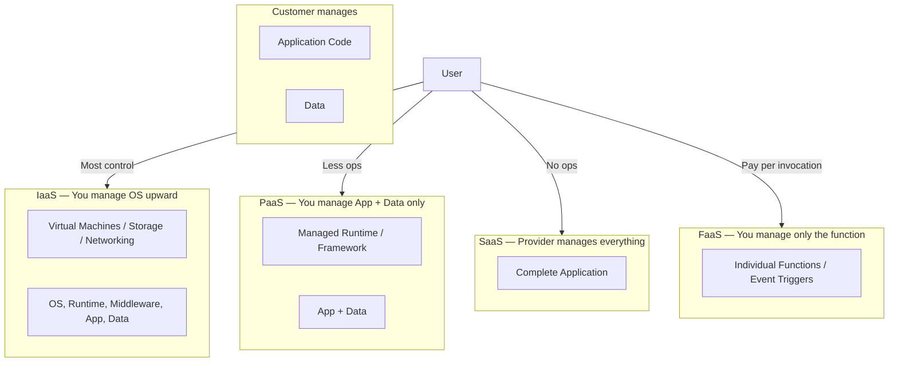
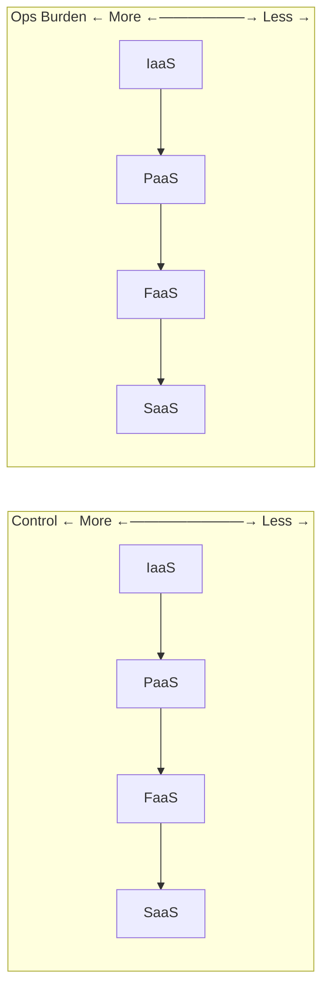
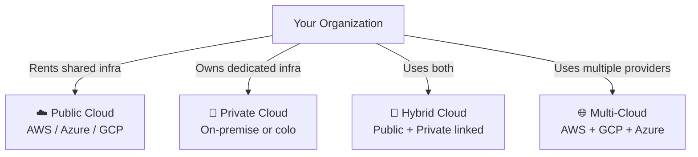
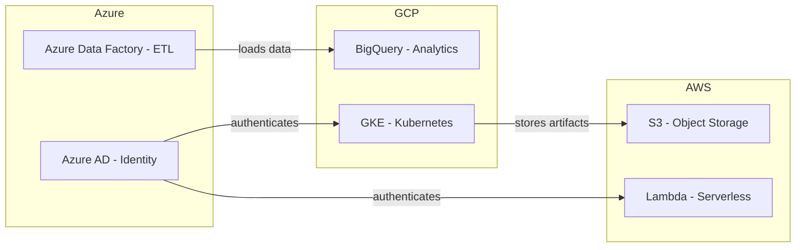
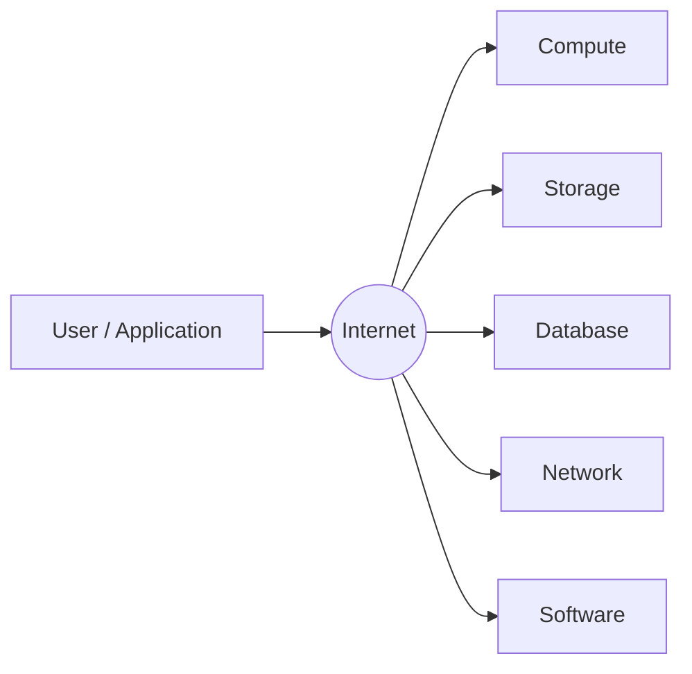
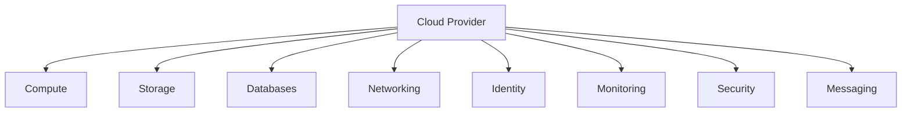

# Cloud Computing

## Blogs and websites


## Medium


## Youtube


## Theory

On-demand delivery of computing resources (servers, storage, databases, networking, software) over the internet, billed on a pay-as-you-go basis. Instead of owning physical hardware, you rent capacity from a provider and scale up or down as needed.

**Key benefits:** Elasticity, no upfront capital expenditure, global reach, managed maintenance.

### Topics Covered

1. [Introduction to Cloud Computing](#introduction-to-cloud-computing)
2. [Characteristics](#characteristics)
3. [Pros](#pros)
4. [Cons](#cons)
5. [Use Cases](#use-cases)
6. [Components](#components)
7. [Architectural Patterns](#architectural-patterns)
8. [Benefits](#benefits)
9. [Challenges](#challenges)
10. [Best Practices](#best-practices)
11. [When to Use Cloud Computing](#when-to-use-cloud-computing)

---

## Service Models

Cloud services are offered in layers of abstraction. The higher the layer, the less infrastructure the customer manages.



### IaaS — Infrastructure as a Service

You rent raw compute infrastructure: virtual machines, block storage, virtual networks, and load balancers. You are responsible for everything above the hypervisor — operating system, patches, runtime, middleware, and your application.

**When to use:** When you need full control over the OS, custom software stacks, or are lifting-and-shifting existing on-premise workloads.

**Examples:** AWS EC2, Azure Virtual Machines, Google Compute Engine, DigitalOcean Droplets.

**Responsibility split:**

| Layer | Managed by |
|---|---|
| Physical hardware, hypervisor | Provider |
| OS, patches, runtime | **You** |
| Middleware, app, data | **You** |

**Typical flow:**
1. Provision a VM (e.g., `t3.large` on EC2).
2. SSH in, install your stack (Nginx, Node.js, PostgreSQL).
3. Deploy your application manually or via CI/CD.
4. You handle OS updates, security patches, backups.

---

### PaaS — Platform as a Service

The provider manages the OS, runtime, and middleware. You push your application code and data; the platform handles deployment, scaling, and patching underneath.

**When to use:** When you want to focus on application code without managing servers. Ideal for web apps, APIs, and background workers.

**Examples:** Heroku, Google App Engine, AWS Elastic Beanstalk, Azure App Service, Render.

**Responsibility split:**

| Layer | Managed by |
|---|---|
| Hardware, OS, runtime, middleware | Provider |
| Application code, data | **You** |

**Typical flow:**
1. `git push heroku main` — Heroku detects your buildpack (e.g., Node.js).
2. Platform installs dependencies, starts the process, sets up routing.
3. You configure env vars and connection strings; scaling is a slider.

---

### SaaS — Software as a Service

A fully managed application delivered over the internet. The provider handles everything — infrastructure, platform, security, and the application itself. Users interact via a browser or API with no installation required.

**When to use:** Off-the-shelf business tools where you don't need custom logic or data ownership at the infrastructure level.

**Examples:** Gmail, Salesforce, Slack, Notion, GitHub, Zoom, Jira.

**Responsibility split:**

| Layer | Managed by |
|---|---|
| Hardware, OS, runtime, app | Provider |
| Your data & user configuration | **You** |

---

### FaaS — Functions as a Service (Serverless)

You deploy individual functions triggered by events (HTTP request, queue message, cron schedule, file upload). The provider provisions compute on demand for the duration of the function call, then reclaims it. There are no servers to manage and billing is per invocation + execution time.

**When to use:** Event-driven workloads, lightweight APIs, data processing pipelines, and tasks with spiky or unpredictable traffic.

**Examples:** AWS Lambda, Azure Functions, Google Cloud Functions, Cloudflare Workers.

**Responsibility split:**

| Layer | Managed by |
|---|---|
| Hardware, OS, runtime, scaling | Provider |
| Function code & triggers | **You** |

**Example — AWS Lambda triggered by S3 upload:**

```python
import json

def handler(event, context):
    bucket = event["Records"][0]["s3"]["bucket"]["name"]
    key    = event["Records"][0]["s3"]["object"]["key"]
    print(f"New file uploaded: s3://{bucket}/{key}")
    # run processing logic...
    return {"statusCode": 200, "body": json.dumps("OK")}
```

**Cold start:** When a function hasn't been invoked recently, the provider must spin up a new container, adding ~100ms–1s latency. Mitigation: provisioned concurrency, keep-warm pings.

---

### Service Model Comparison



| | IaaS | PaaS | FaaS | SaaS |
|---|---|---|---|---|
| Control | High | Medium | Low | None |
| Ops burden | High | Medium | Very low | None |
| Scaling | Manual | Semi-auto | Auto | Auto |
| Cost model | Per VM-hour | Per instance-hour | Per invocation | Per seat/month |
| Best for | Custom stacks | Web apps/APIs | Event processing | Business tools |

---

## Deployment Models

Where does the cloud infrastructure physically run, and who has access to it?



---

### Public Cloud

Infrastructure is owned and operated by a third-party cloud provider and shared across many customers (tenants) using virtualization and strict isolation.

**Characteristics:**
- No upfront hardware cost — pure OpEx.
- Instant global availability across dozens of regions.
- Provider handles all physical maintenance.
- Shared responsibility model: provider secures hardware; you secure your app and data.

**Examples:** AWS, Microsoft Azure, Google Cloud Platform, Alibaba Cloud.

**Ideal for:** Startups, SaaS products, variable workloads, global reach without physical presence.

---

### Private Cloud

Infrastructure is dedicated exclusively to one organization. It can be hosted on-premise in the organization's own data center, or in a colocation facility, but it is not shared with anyone else.

**Characteristics:**
- Full control over hardware, networking, and security posture.
- Meets strict compliance requirements (HIPAA, PCI-DSS, government regulations).
- Higher upfront CapEx; the organization manages all ops.
- Can use private cloud software stacks: VMware vSphere, OpenStack, Nutanix.

**Examples:** A bank running its own OpenStack cluster; a hospital's on-premise VMware environment.

**Ideal for:** Regulated industries (finance, healthcare, defense) or organizations with predictable, large-scale workloads.

---

### Hybrid Cloud

A mix of public and private cloud connected via a secure network (VPN or dedicated link like AWS Direct Connect / Azure ExpressRoute). Workloads can move between environments based on policy, load, or cost.

**Characteristics:**
- Sensitive data stays on-premise; burst traffic shifts to public cloud ("cloud bursting").
- Enables gradual migration from on-premise to cloud.
- Requires careful network design, identity federation (SSO), and consistent tooling (Terraform, Kubernetes).

**Example scenario:**

```
[ On-Premise Private Cloud ]          [ AWS Public Cloud ]
  - Patient records (HIPAA)    <--->    - ML model training (burst)
  - Core banking transactions           - Static asset CDN
  - Legacy mainframe apps               - Dev/Test environments
```

**Ideal for:** Enterprises mid-migration, organizations with regulatory data residency requirements, and those needing disaster recovery in the cloud.

---

### Multi-Cloud

Using two or more public cloud providers simultaneously (e.g., AWS + GCP + Azure), either for different workloads, to avoid vendor lock-in, or for redundancy.

**Characteristics:**
- Avoids dependence on a single provider's pricing or availability.
- Use best-of-breed services: GCP BigQuery for analytics, AWS S3 for storage, Azure AD for identity.
- Increases operational complexity: multiple consoles, billing, IAM models, and networking.
- Requires cloud-agnostic tooling: Terraform, Kubernetes, Crossplane.

**Example architecture:**



**Ideal for:** Large enterprises, avoiding lock-in, regulatory geo-distribution, and maximum resilience.

---

### Deployment Model Comparison

| | Public | Private | Hybrid | Multi-Cloud |
|---|---|---|---|---|
| Cost model | OpEx (pay-as-you-go) | CapEx (upfront hardware) | Both | OpEx (multiple bills) |
| Control | Low | High | Medium | Medium |
| Compliance fit | General | Regulated industries | Regulated + scale | Varies |
| Scalability | Virtually unlimited | Limited by hardware | Elastic burst | High |
| Complexity | Low | Medium | High | Very High |
| Vendor lock-in risk | High | None | Medium | Low |

---

### Introduction to Cloud Computing

Cloud computing is the on-demand delivery of computing resources over the internet. Instead of buying and maintaining physical servers, organizations rent compute, storage, databases, networking, and software from a provider and pay only for what they use.

The three main service models are IaaS, PaaS, and SaaS. Deployment models include public, private, hybrid, and multi-cloud. Cloud computing enables global reach, elastic scaling, and managed operations.



**Real-life use cases**

- **Startups**: launch products without buying servers by using AWS, GCP, or Azure.
- **Streaming services**: use cloud storage and CDN to deliver video globally.
- **Enterprises**: migrate on-premises data centers to managed cloud infrastructure.
- **Data analytics**: run large-scale analytics using cloud data warehouses.
- **Disaster recovery**: replicate workloads to another cloud region.

**Interview questions and answers**

- **Q: What is cloud computing?**
  **A:** Cloud computing is the delivery of computing resources such as servers, storage, databases, and software over the internet with pay-as-you-go pricing.

- **Q: What is the difference between on-premises and cloud infrastructure?**
  **A:** On-premises infrastructure is owned and operated by the organization, requiring upfront capital and maintenance. Cloud infrastructure is rented from a provider, reducing upfront costs and operational burden.

---

### Characteristics

- **On-demand self-service**
  Users can provision resources such as VMs, storage, and databases through a portal or API without manual provider intervention.

- **Broad network access**
  Cloud resources are reachable over the internet from many device types and locations.

- **Resource pooling**
  Providers pool physical resources and serve multiple customers through multi-tenancy and virtualization.

- **Rapid elasticity**
  Resources can scale up or down quickly to match demand, often automatically.

- **Measured service**
  Usage is metered, and customers pay for what they consume.

- **Global availability**
  Providers operate data centers across multiple regions and availability zones worldwide.

- **Managed infrastructure**
  The provider handles hardware, networking, power, cooling, and physical security.

- **Programmable infrastructure**
  APIs, infrastructure as code tools, and automation enable reproducible provisioning.

- **Shared responsibility**
  The provider secures the underlying infrastructure while the customer secures applications and data.

- **Service abstractions**
  Cloud services range from raw infrastructure to fully managed software, letting customers choose their level of control.

---

### Pros

- **No upfront capital cost**
  Organizations avoid purchasing servers, networking gear, and data center space.

- **Elastic scalability**
  Resources can grow or shrink with demand, avoiding overprovisioning.

- **Global reach**
  Applications can be deployed close to users without building physical data centers.

- **Managed services**
  Providers handle hardware failures, patching, and some software operations.

- **High availability**
  Multiple regions and availability zones support resilient architectures.

- **Fast time to market**
  Teams can launch infrastructure in minutes rather than weeks.

- **Cost transparency**
  Pay-as-you-go and usage metering help teams understand spending.

- **Disaster recovery**
  Backups and replicas can be placed in separate regions or clouds.

- **Innovation speed**
  Managed databases, machine learning, and analytics services accelerate development.

---

### Cons

- **Ongoing operating cost**
  Cloud bills can grow quickly without careful monitoring and cost controls.

- **Vendor lock-in**
  Proprietary services and APIs can make migration difficult.

- **Reduced direct control**
  Customers cannot access the physical hardware or underlying hypervisor.

- **Network dependency**
  Cloud applications require reliable internet connectivity.

- **Data security and compliance concerns**
  Data stored off-premises may raise regulatory or privacy issues.

- **Shared responsibility confusion**
  Customers sometimes assume the provider handles security for everything, leaving applications exposed.

- **Unexpected cost spikes**
  Auto-scaling and misconfigured resources can generate large bills.

- **Latency variability**
  Shared infrastructure and cross-region traffic can introduce unpredictable latency.

- **Complexity at scale**
  Multi-cloud and hybrid environments increase operational complexity.

---

### Use Cases

- **Web and API hosting**
  Applications run on cloud VMs, containers, or platform services and scale behind load balancers.

- **Data storage and backup**
  Object storage and managed databases provide durable, scalable storage.

- **Big data and analytics**
  Cloud data warehouses and analytics services process large datasets on demand.

- **Machine learning**
  Cloud GPU instances and managed ML platforms train and serve models.

- **Disaster recovery**
  Organizations replicate data and workloads to another region or cloud.

- **Dev/test environments**
  Teams spin up and tear down isolated environments quickly.

- **Content delivery**
  Cloud storage integrates with CDNs for global media distribution.

- **Serverless event processing**
  Functions run in response to events such as uploads, queues, or schedules.

- **Enterprise SaaS**
  Providers build and operate SaaS products on cloud infrastructure.

---

### Components

- **Compute services**
  Virtual machines, containers, and serverless functions.

- **Storage services**
  Object storage, block storage, and file storage.

- **Database services**
  Relational, NoSQL, in-memory, and data warehouse databases.

- **Networking**
  Virtual networks, subnets, load balancers, VPN, and DNS.

- **Identity and access management**
  Users, roles, policies, and service accounts.

- **Monitoring and logging**
  Metrics, logs, traces, and alerting.

- **Security services**
  Key management, secrets, firewalls, and threat detection.

- **Messaging and events**
  Queues, pub/sub, and event buses.

- **Management and automation**
  Console, CLI, SDKs, and infrastructure-as-code tools.

- **Regions and availability zones**
  Physical and logical data center boundaries for resilience.



---

### Architectural Patterns

- **Lift-and-shift**
  Move existing on-premises applications to cloud VMs with minimal changes.

- **Cloud-native**
  Design applications using containers, microservices, and managed services.

- **Serverless**
  Run event-driven functions without managing servers.

- **Event-driven**
  Use queues and event buses to decouple producers and consumers.

- **Multi-region active-active**
  Serve traffic from multiple regions simultaneously for resilience and low latency.

- **Multi-region active-passive**
  Keep a standby region for failover and disaster recovery.

- **Hybrid cloud**
  Connect on-premises systems with public cloud services.

- **Multi-cloud**
  Use services from multiple providers to avoid lock-in and improve resilience.

- **Infrastructure as code**
  Define infrastructure using Terraform, CloudFormation, or Pulumi.

- **Autoscaling**
  Automatically add or remove compute capacity based on demand.

---

### Benefits

- **Elasticity**
  Scale resources up and down with demand.

- **Cost efficiency**
  Convert capital expenses into variable operating expenses.

- **Speed**
  Provision resources and experiment faster.

- **Reliability**
  Use regions, zones, backups, and replication.

- **Security**
  Leverage provider-managed security controls and compliance certifications.

- **Global performance**
  Deploy near users with CDN and multi-region architecture.

- **Operational focus**
  Teams spend less time on infrastructure and more on product features.

---

### Challenges

- **Cost management**
  Monitoring and optimizing cloud spending requires discipline.

- **Security**
  Misconfigured storage or identity policies can expose data.

- **Compliance**
  Meeting data residency and regulatory requirements across regions is complex.

- **Vendor lock-in**
  Proprietary services reduce portability.

- **Migration complexity**
  Moving existing workloads and data can be difficult and risky.

- **Network latency**
  Cross-region and internet traffic can add latency.

- **Skill gaps**
  Teams need cloud architecture, security, and cost optimization expertise.

- **Outage risk**
  Provider outages can affect many customers simultaneously.

---

### Best Practices

- **Use infrastructure as code**
  Define and version all infrastructure changes.

- **Apply least-privilege IAM**
  Grant only the permissions required for each user or service.

- **Enable monitoring and alerting**
  Track spend, errors, latency, and security events.

- **Tag resources**
  Use tags for cost allocation, ownership, and automation.

- **Encrypt data**
  Encrypt data at rest and in transit.

- **Automate backups**
  Schedule regular backups and test restores.

- **Design for failure**
  Distribute workloads across availability zones and regions.

- **Set budgets and alerts**
  Detect unusual spending before bills grow.

- **Use managed services where appropriate**
  Avoid managing databases and infrastructure when a managed service fits.

- **Review security posture regularly**
  Audit public access, credentials, and compliance.

---

### When to Use Cloud Computing

- **Use cloud computing when** you want to launch quickly without buying hardware.
- **Use cloud computing when** demand is variable or unpredictable.
- **Use cloud computing when** you need global reach and multi-region availability.
- **Use cloud computing when** you prefer managed services over operating infrastructure.
- **Use cloud computing when** you need elastic scalability for growth or bursts.
- **Use cloud computing when** you want disaster recovery and business continuity.

**Reconsider when**

- Strict data residency or compliance rules require on-premises control.
- Workloads are stable and predictable, and on-premises may be cheaper long term.
- Network connectivity is unreliable or bandwidth is limited.
- Existing hardware investments are recent and underutilized.

---

### Java and Spring Boot Examples

#### 1. Using AWS SDK for S3

```java
import software.amazon.awssdk.services.s3.S3Client;
import software.amazon.awssdk.services.s3.model.PutObjectRequest;
import software.amazon.awssdk.services.s3.model.GetObjectRequest;

import java.nio.file.Path;

public class CloudStorageService {

    private final S3Client s3Client;

    public CloudStorageService(S3Client s3Client) {
        this.s3Client = s3Client;
    }

    public void upload(String bucket, String key, Path file) {
        s3Client.putObject(
            PutObjectRequest.builder()
                .bucket(bucket)
                .key(key)
                .build(),
            file
        );
    }

    public byte[] download(String bucket, String key) {
        return s3Client.getObjectAsBytes(
            GetObjectRequest.builder()
                .bucket(bucket)
                .key(key)
                .build()
        ).asByteArray();
    }
}
```

#### 2. Cloud configuration with Spring Cloud

```yaml
spring:
  config:
    import: optional:configserver:http://localhost:8888
```

```java
import org.springframework.beans.factory.annotation.Value;
import org.springframework.web.bind.annotation.GetMapping;
import org.springframework.web.bind.annotation.RestController;

@RestController
public class CloudConfigController {

    private final String environment;

    public CloudConfigController(@Value("${app.environment:default}") String environment) {
        this.environment = environment;
    }

    @GetMapping("/environment")
    public String environment() {
        return environment;
    }
}
```

#### 3. Autoscaling-aware health endpoint

```java
import org.springframework.boot.actuate.health.Health;
import org.springframework.boot.actuate.health.HealthIndicator;
import org.springframework.stereotype.Component;

@Component
public class CloudHealthIndicator implements HealthIndicator {

    @Override
    public Health health() {
        return Health.up()
            .withDetail("cloud", "aws")
            .withDetail("status", "healthy")
            .build();
    }
}
```

#### 4. Serverless-style function handler

```java
import org.springframework.stereotype.Component;

import java.util.Map;
import java.util.function.Function;

@Component("processEvent")
public class CloudEventHandler implements Function<Map<String, Object>, String> {

    @Override
    public String apply(Map<String, Object> event) {
        return "Processed event: " + event.get("type");
    }
}
```

**Interview questions and answers**

- **Q: How do you make a Spring Boot application cloud-native?**
  **A:** Externalize configuration, use managed services, expose health and metrics endpoints, containerize the application, and deploy on Kubernetes or a PaaS.

- **Q: What is the shared responsibility model?**
  **A:** The cloud provider secures the underlying infrastructure, while the customer secures their applications, data, identity, and access policies.

- **Q: How do you control cloud costs in a Java/Spring Boot application?**
  **A:** Use appropriate instance sizes, enable autoscaling, monitor usage, tag resources, and optimize dependencies such as database connections and caches.
