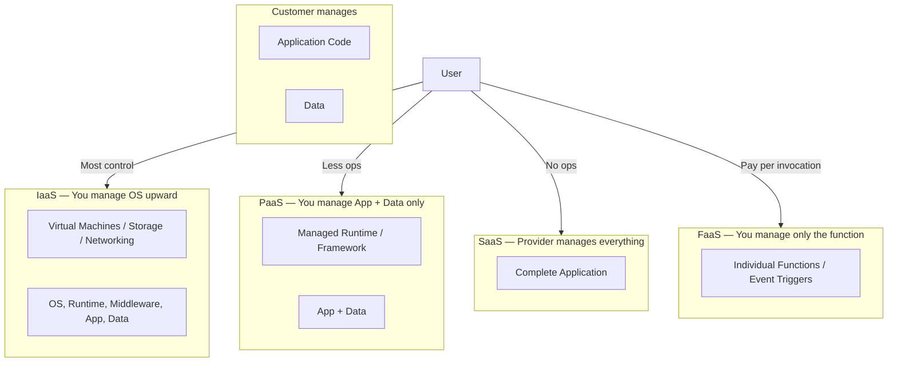
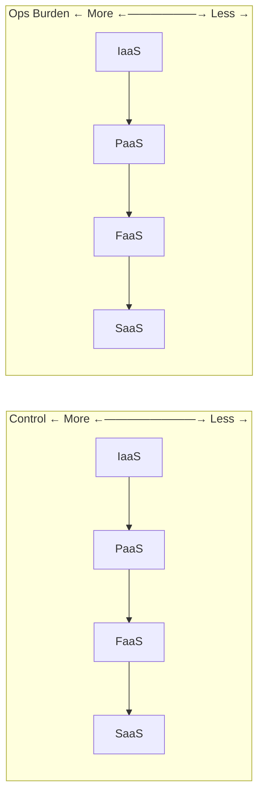
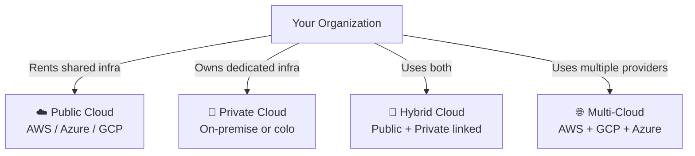
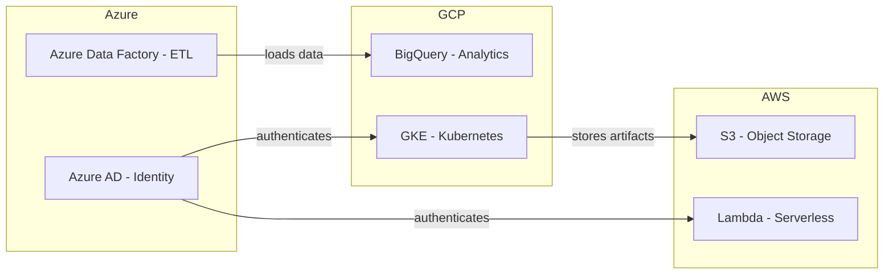

# Cloud Computing

## Blogs and websites


## Medium


## Youtube


## Theory

On-demand delivery of computing resources (servers, storage, databases, networking, software) over the internet, billed on a pay-as-you-go basis. Instead of owning physical hardware, you rent capacity from a provider and scale up or down as needed.

**Key benefits:** Elasticity, no upfront capital expenditure, global reach, managed maintenance.

---

## Service Models

Cloud services are offered in layers of abstraction. The higher the layer, the less infrastructure the customer manages.



### IaaS — Infrastructure as a Service

You rent raw compute infrastructure: virtual machines, block storage, virtual networks, and load balancers. You are responsible for everything above the hypervisor — operating system, patches, runtime, middleware, and your application.

**When to use:** When you need full control over the OS, custom software stacks, or are lifting-and-shifting existing on-premise workloads.

**Examples:** AWS EC2, Azure Virtual Machines, Google Compute Engine, DigitalOcean Droplets.

**Responsibility split:**

| Layer | Managed by |
|---|---|
| Physical hardware, hypervisor | Provider |
| OS, patches, runtime | **You** |
| Middleware, app, data | **You** |

**Typical flow:**
1. Provision a VM (e.g., `t3.large` on EC2).
2. SSH in, install your stack (Nginx, Node.js, PostgreSQL).
3. Deploy your application manually or via CI/CD.
4. You handle OS updates, security patches, backups.

---

### PaaS — Platform as a Service

The provider manages the OS, runtime, and middleware. You push your application code and data; the platform handles deployment, scaling, and patching underneath.

**When to use:** When you want to focus on application code without managing servers. Ideal for web apps, APIs, and background workers.

**Examples:** Heroku, Google App Engine, AWS Elastic Beanstalk, Azure App Service, Render.

**Responsibility split:**

| Layer | Managed by |
|---|---|
| Hardware, OS, runtime, middleware | Provider |
| Application code, data | **You** |

**Typical flow:**
1. `git push heroku main` — Heroku detects your buildpack (e.g., Node.js).
2. Platform installs dependencies, starts the process, sets up routing.
3. You configure env vars and connection strings; scaling is a slider.

---

### SaaS — Software as a Service

A fully managed application delivered over the internet. The provider handles everything — infrastructure, platform, security, and the application itself. Users interact via a browser or API with no installation required.

**When to use:** Off-the-shelf business tools where you don't need custom logic or data ownership at the infrastructure level.

**Examples:** Gmail, Salesforce, Slack, Notion, GitHub, Zoom, Jira.

**Responsibility split:**

| Layer | Managed by |
|---|---|
| Hardware, OS, runtime, app | Provider |
| Your data & user configuration | **You** |

---

### FaaS — Functions as a Service (Serverless)

You deploy individual functions triggered by events (HTTP request, queue message, cron schedule, file upload). The provider provisions compute on demand for the duration of the function call, then reclaims it. There are no servers to manage and billing is per invocation + execution time.

**When to use:** Event-driven workloads, lightweight APIs, data processing pipelines, and tasks with spiky or unpredictable traffic.

**Examples:** AWS Lambda, Azure Functions, Google Cloud Functions, Cloudflare Workers.

**Responsibility split:**

| Layer | Managed by |
|---|---|
| Hardware, OS, runtime, scaling | Provider |
| Function code & triggers | **You** |

**Example — AWS Lambda triggered by S3 upload:**

```python
import json

def handler(event, context):
    bucket = event["Records"][0]["s3"]["bucket"]["name"]
    key    = event["Records"][0]["s3"]["object"]["key"]
    print(f"New file uploaded: s3://{bucket}/{key}")
    # run processing logic...
    return {"statusCode": 200, "body": json.dumps("OK")}
```

**Cold start:** When a function hasn't been invoked recently, the provider must spin up a new container, adding ~100ms–1s latency. Mitigation: provisioned concurrency, keep-warm pings.

---

### Service Model Comparison



| | IaaS | PaaS | FaaS | SaaS |
|---|---|---|---|---|
| Control | High | Medium | Low | None |
| Ops burden | High | Medium | Very low | None |
| Scaling | Manual | Semi-auto | Auto | Auto |
| Cost model | Per VM-hour | Per instance-hour | Per invocation | Per seat/month |
| Best for | Custom stacks | Web apps/APIs | Event processing | Business tools |

---

## Deployment Models

Where does the cloud infrastructure physically run, and who has access to it?



---

### Public Cloud

Infrastructure is owned and operated by a third-party cloud provider and shared across many customers (tenants) using virtualization and strict isolation.

**Characteristics:**
- No upfront hardware cost — pure OpEx.
- Instant global availability across dozens of regions.
- Provider handles all physical maintenance.
- Shared responsibility model: provider secures hardware; you secure your app and data.

**Examples:** AWS, Microsoft Azure, Google Cloud Platform, Alibaba Cloud.

**Ideal for:** Startups, SaaS products, variable workloads, global reach without physical presence.

---

### Private Cloud

Infrastructure is dedicated exclusively to one organization. It can be hosted on-premise in the organization's own data center, or in a colocation facility, but it is not shared with anyone else.

**Characteristics:**
- Full control over hardware, networking, and security posture.
- Meets strict compliance requirements (HIPAA, PCI-DSS, government regulations).
- Higher upfront CapEx; the organization manages all ops.
- Can use private cloud software stacks: VMware vSphere, OpenStack, Nutanix.

**Examples:** A bank running its own OpenStack cluster; a hospital's on-premise VMware environment.

**Ideal for:** Regulated industries (finance, healthcare, defense) or organizations with predictable, large-scale workloads.

---

### Hybrid Cloud

A mix of public and private cloud connected via a secure network (VPN or dedicated link like AWS Direct Connect / Azure ExpressRoute). Workloads can move between environments based on policy, load, or cost.

**Characteristics:**
- Sensitive data stays on-premise; burst traffic shifts to public cloud ("cloud bursting").
- Enables gradual migration from on-premise to cloud.
- Requires careful network design, identity federation (SSO), and consistent tooling (Terraform, Kubernetes).

**Example scenario:**

```
[ On-Premise Private Cloud ]          [ AWS Public Cloud ]
  - Patient records (HIPAA)    <--->    - ML model training (burst)
  - Core banking transactions           - Static asset CDN
  - Legacy mainframe apps               - Dev/Test environments
```

**Ideal for:** Enterprises mid-migration, organizations with regulatory data residency requirements, and those needing disaster recovery in the cloud.

---

### Multi-Cloud

Using two or more public cloud providers simultaneously (e.g., AWS + GCP + Azure), either for different workloads, to avoid vendor lock-in, or for redundancy.

**Characteristics:**
- Avoids dependence on a single provider's pricing or availability.
- Use best-of-breed services: GCP BigQuery for analytics, AWS S3 for storage, Azure AD for identity.
- Increases operational complexity: multiple consoles, billing, IAM models, and networking.
- Requires cloud-agnostic tooling: Terraform, Kubernetes, Crossplane.

**Example architecture:**



**Ideal for:** Large enterprises, avoiding lock-in, regulatory geo-distribution, and maximum resilience.

---

### Deployment Model Comparison

| | Public | Private | Hybrid | Multi-Cloud |
|---|---|---|---|---|
| Cost model | OpEx (pay-as-you-go) | CapEx (upfront hardware) | Both | OpEx (multiple bills) |
| Control | Low | High | Medium | Medium |
| Compliance fit | General | Regulated industries | Regulated + scale | Varies |
| Scalability | Virtually unlimited | Limited by hardware | Elastic burst | High |
| Complexity | Low | Medium | High | Very High |
| Vendor lock-in risk | High | None | Medium | Low |
