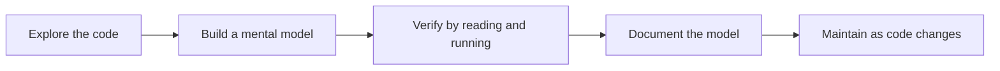
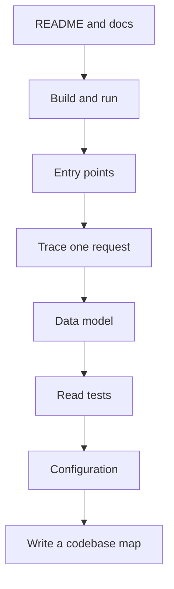
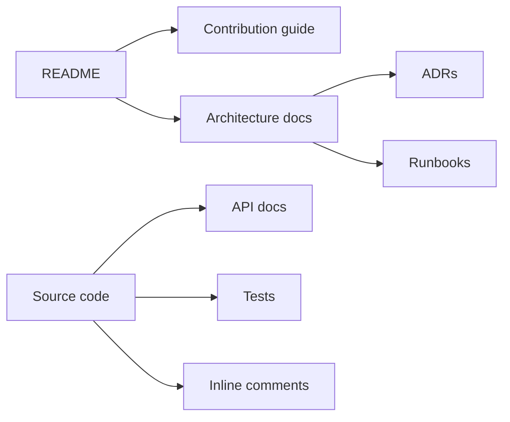

# Learning a new codebase and code documentation

## Blogs and websites


## Medium


## Youtube

- [My Favorite Way to Learn a New Codebase](https://www.youtube.com/watch?v=jqHXJ3O7WGw)
- [How to Document Your Code Like a Pro](https://www.youtube.com/watch?v=L7Ry-Fiij-M)

## Theory

### Topics Covered

1. [Introduction](#introduction)
2. [Learning a New Codebase](#learning-a-new-codebase)
3. [Code Documentation](#code-documentation)
4. [Characteristics](#characteristics)
5. [Pros](#pros)
6. [Cons](#cons)
7. [Use Cases](#use-cases)
8. [Components](#components)
9. [Patterns](#patterns)
10. [Benefits](#benefits)
11. [Challenges](#challenges)
12. [Best Practices](#best-practices)
13. [When to Use](#when-to-use)
14. [Java and Spring Boot Examples](#java-and-spring-boot-examples)

---

### Introduction

Learning a new codebase is the process of building a working mental model of a software system: its structure, domain concepts, data flow, entry points, and conventions. Code documentation is the persistent artifact of that understanding. The two skills reinforce each other: the best way to document a system is often to first learn it, and the best way to preserve that learning is to write it down.



**Real-life use cases**

- **Onboarding**: new engineers use documentation to reach productivity faster.
- **Incident response**: runbooks and architecture docs shorten time to diagnosis.
- **Handover**: teams transfer ownership without losing tribal knowledge.
- **Code review**: reviewers use context docs to understand intent.
- **Technical decision records (ADRs)**: teams preserve why a decision was made.

**Interview questions and answers**

- **Q: How do you approach an unfamiliar codebase?**
  **A:** Start from the entry points and public interfaces, follow one end-to-end request, map the data model, read the tests, and write down what I learn.

- **Q: What belongs in a README?**
  **A:** What the project does, how to run it, how to test it, the high-level architecture, and pointers to deeper documentation.

- **Q: What is the difference between code comments and documentation?**
  **A:** Comments explain why code does what it does at a specific location; documentation explains what the system does and how it fits together.

---

### Learning a New Codebase

A structured approach beats random file-hopping. The goal is to understand the system well enough to change it safely.

**A practical reading order:**

1. **README and docs** — start with the project's own description and any architecture diagrams.
2. **Build and run** — get the system running locally; a running system is a living spec.
3. **Entry points** — find `main`, controllers, message handlers, and scheduled jobs.
4. **Follow one request** — trace a single path from input to output, end to end.
5. **Data model** — read entities, tables, schemas, and repositories; data reveals domain structure.
6. **Tests** — read unit and integration tests; they document expected behavior.
7. **Configuration** — inspect environment variables, feature flags, and external dependencies.
8. **Write it down** — produce a short map of modules, responsibilities, and gotchas.



**Techniques for building a mental model:**

- **Draw the module graph**: who imports whom, who depends on what.
- **Name the boundaries**: identify layers, domains, and anti-corruption boundaries.
- **Look for conventions**: naming, package structure, error handling, and testing style.
- **Find the seams**: locate interfaces and extension points where behavior is plugged in.
- **Use the tests as executable documentation**: failing a test on purpose reveals behavior.

**Common pitfalls:**

- Starting deep in a utility file instead of the top-level flow.
- Assuming a method does what its name suggests without reading it.
- Ignoring configuration and feature flags that change behavior at runtime.
- Trying to memorize every file instead of building a navigable map.

**Interview questions and answers**

- **Q: What is the fastest way to understand how a request is handled in a new service?**
  **A:** Start at the controller or listener, follow the call into services and repositories, and trace the same path in a test. One complete path usually reveals the layering and conventions.

- **Q: Why are tests valuable when learning a codebase?**
  **A:** Tests encode expected behavior and often show how components are instantiated, mocked, and invoked, which is a shortcut to understanding contracts.

- **Q: What is a codebase map?**
  **A:** A short living document that lists modules, their responsibilities, key entry points, and cross-module dependencies so newcomers can navigate quickly.

---

### Code Documentation

Documentation is a contract between the code and the people who read it. It should be close to the code, correct at the time of reading, and cheap to keep fresh.

**Types of documentation:**

- **README**: entry point for the repository.
- **Architecture docs**: system context, components, and data flow.
- **API docs**: endpoints, parameters, errors, and examples.
- **ADRs**: the "why" behind significant decisions.
- **Runbooks**: operational procedures for incidents and recovery.
- **Inline comments**: the "why" for non-obvious code.
- **Tests**: executable examples of intended behavior.

**What good documentation does:**

- Answers "what is this", "how do I run it", and "why does it exist".
- Stays close to the code it describes.
- Uses concrete examples rather than vague descriptions.
- Gets updated when behavior changes.

**What good documentation avoids:**

- Repeating the code verbatim.
- Writing "what" comments that are obvious.
- Drifting out of sync with the implementation.
- Explaining intent in a place far from the code.

**Interview questions and answers**

- **Q: What makes documentation maintainable?**
  **A:** Keeping it close to code, generating API docs from annotations, treating docs as part of the definition of done, and reviewing doc changes with code changes.

- **Q: When should you write a comment?**
  **A:** When the code explains *what* but not *why* — for example, a workaround, a subtle invariant, or a non-obvious trade-off.

- **Q: What is a good structure for a README?**
  **A:** Overview, prerequisites, quick start, configuration, testing, architecture summary, and links to deeper docs.

---

### Characteristics

- **Exploratory**
  Learning a codebase is an investigation, not a linear read.

- **Model-driven**
  The outcome is a mental model of components, boundaries, and data flow.

- **Iterative**
  Understanding deepens by alternating between reading, running, and modifying.

- **Convention-sensitive**
  Naming, layering, and style choices carry much of the system's meaning.

- **Test-influenced**
  Tests serve as executable specifications of expected behavior.

- **Context-dependent**
  Configuration and runtime environment can change what the code does.

- **Progressive**
  Starting from entry points and following one flow is more effective than reading files in arbitrary order.

- **Durable when documented**
  Writing down findings turns personal knowledge into shared knowledge.

- **Dependency-aware**
  A codebase is understood through its module and dependency graph.

- **Risk-aware**
  Focus goes to the areas most likely to change or fail.

---

### Pros

- **Faster onboarding**
  Good documentation reduces the time for new engineers to contribute.

- **Shared understanding**
  A codebase map aligns the team on architecture and boundaries.

- **Safer changes**
  Understanding dependencies and behavior reduces the risk of regressions.

- **Lower support load**
  Runbooks and READMEs answer common questions without human intervention.

- **Preserved decisions**
  ADRs capture why a choice was made, preventing repeated debate.

- **Better reviews**
  Context and intent help reviewers evaluate changes correctly.

- **Improved maintainability**
  Documentation exposes coupling and complexity that can then be reduced.

- **Faster incident recovery**
  Runbooks and architecture diagrams shorten diagnosis time.

---

### Cons

- **Time and effort**
  Learning a codebase and writing good docs takes meaningful effort.

- **Risk of staleness**
  Documentation drifts from code if it is not maintained.

- **Misleading when wrong**
  Outdated or incorrect docs are worse than no docs.

- **Over-documentation**
  Documenting obvious code adds noise and maintenance burden.

- **Single-author bias**
  One person's mental model may miss important alternative views.

- **Requires discipline**
  Keeping docs current requires process and review culture.

- **Tooling complexity**
  Doc generation pipelines can add build and maintenance overhead.

---

### Use Cases

- **Engineer onboarding**
  New hires use the README and codebase map to get oriented.

- **Code review**
  Reviewers consult architecture docs and ADRs for context.

- **Incident response**
  On-call engineers follow runbooks to diagnose and recover.

- **Technical decision making**
  ADRs record and communicate architectural choices.

- **Knowledge transfer**
  Handover docs preserve context when owners leave.

- **Open source**
  READMEs and contribution guides enable external contributors.

- **Audit and compliance**
  Architecture and security docs provide evidence of controls.

- **Refactoring**
  A documented dependency graph reveals safe seams and hidden coupling.

---

### Components

- **README**
  The repository's entry point with overview, setup, and links.

- **Architecture diagram**
  A visual map of components and their relationships.

- **Module map**
  A list of packages or modules with responsibilities.

- **API reference**
  Endpoint, parameter, response, and error documentation.

- **ADR**
  A record of a decision, its context, options, and consequences.

- **Runbook**
  Step-by-step operational procedures.

- **Contribution guide**
  Instructions for setting up and submitting changes.

- **Tests**
  Executable examples of expected behavior.

- **Inline comments**
  Local explanations of non-obvious code.



---

### Patterns

- **Living documentation**
  Treat documentation as a product that evolves with the code.

- **Docs-as-code**
  Store docs in the repository and review them with code changes.

- **Generated API docs**
  Derive API references from annotations or schemas.

- **ADR process**
  Record significant decisions in a lightweight, versioned format.

- **Executable examples**
  Use tests and runnable snippets to document behavior.

- **Single source of truth**
  Keep each fact documented in exactly one place.

- **Contextual links**
  Link from code or README to the deeper explanation rather than duplicating it.

- **Progressive disclosure**
  Start with a summary and link to details on demand.

---

### Benefits

- **Productivity**
  Engineers spend less time rediscovering context.

- **Consistency**
  Documented conventions keep code style and architecture coherent.

- **Reduced risk**
  Better understanding leads to safer modifications.

- **Resilience**
  Runbooks make recovery faster and less error-prone.

- **Knowledge retention**
  Documentation preserves institutional memory.

- **Transparency**
  ADRs make the reasoning behind decisions visible.

- **Onboarding speed**
  A good README and map compress ramp-up time.

---

### Challenges

- **Keeping docs current**
  Documentation decays unless maintenance is part of the workflow.

- **Balancing depth and brevity**
  Too little is unhelpful; too much becomes noise.

- **Avoiding duplication**
  Repeating the same fact in many places invites inconsistency.

- **Capturing implicit knowledge**
  The most valuable knowledge is often the hardest to articulate.

- **Tooling selection**
  Choosing doc generators and hosting can add friction.

- **Measuring value**
  The benefit of documentation is clear but hard to quantify.

- **Overcoming inertia**
  Writing docs is often deprioritized against shipping features.

---

### Best Practices

- **Write documentation close to the code**
  Keep docs in the same repository and review them together.

- **Start with a README**
  Cover overview, prerequisites, quick start, testing, and configuration.

- **Document the "why", not the "what"**
  Reserve comments for non-obvious intent and invariants.

- **Follow one request end to end**
  Build the mental model from a concrete flow before broad exploration.

- **Use tests as documentation**
  Read and write tests that express intended behavior.

- **Keep ADRs for significant decisions**
  Record context, options considered, and consequences.

- **Generate API docs where possible**
  Derive references from annotations and schemas to reduce drift.

- **Review docs with code**
  Treat outdated documentation as a review blocker.

- **Prefer diagrams for structure**
  Use architecture and sequence diagrams to make relationships visible.

- **Update docs when behavior changes**
  Make doc updates part of the definition of done.

---

### When to Use

- **Use code documentation when** onboarding new engineers.
- **Use code documentation when** transferring ownership of a service.
- **Use code documentation when** an architectural decision is significant.
- **Use code documentation when** incident response needs runbooks.
- **Use code documentation when** a project is open source.
- **Use code documentation when** a system is large or has many moving parts.

**Do not over-document when**

- The code is trivial and self-explanatory.
- The documentation would immediately go stale.
- A comment would merely repeat the code.
- The team has no process to keep docs updated.

---

### Java and Spring Boot Examples

#### 1. Self-describing service with Javadoc

```java
import org.springframework.stereotype.Service;

/**
 * Resolves product prices after applying active promotions.
 *
 * <p>The price pipeline is deliberately separated from persistence so the
 * promotion rules can change independently of the product repository.</p>
 */
@Service
public class PriceService {

    /**
     * Calculates the final price for a product.
     *
     * @param productId the product identifier
     * @return the final price after promotions, or the base price if none apply
     */
    public Price calculate(long productId) {
        // Promotions are intentionally applied after tax rules, matching the
        // business requirement that discounts apply to the pre-tax subtotal.
        return new Price(productId, applyPromotions(productId));
    }

    private Money applyPromotions(long productId) {
        return Money.of("0.00");
    }

    public record Price(long productId, Money amount) {
    }

    public record Money(String value) {
        public static Money of(String value) {
            return new Money(value);
        }
    }
}
```

#### 2. Documented configuration via a `@ConfigurationProperties` bean

```java
import org.springframework.boot.context.properties.ConfigurationProperties;
import org.springframework.stereotype.Component;

/**
 * Externalized settings for the order service.
 *
 * <p>All values are injected from the {@code app.order} property namespace so
 * behavior can be changed per environment without rebuilding the application.</p>
 */
@Component
@ConfigurationProperties(prefix = "app.order")
public class OrderProperties {

    /** Maximum number of items allowed in a single order. */
    private int maxItems = 100;

    /** Currency used for order totals, for example {@code USD}. */
    private String currency = "USD";

    public int getMaxItems() {
        return maxItems;
    }

    public void setMaxItems(int maxItems) {
        this.maxItems = maxItems;
    }

    public String getCurrency() {
        return currency;
    }

    public void setCurrency(String currency) {
        this.currency = currency;
    }
}
```

#### 3. OpenAPI annotations for generated API documentation

```java
import io.swagger.v3.oas.annotations.Operation;
import io.swagger.v3.oas.annotations.responses.ApiResponse;
import org.springframework.web.bind.annotation.GetMapping;
import org.springframework.web.bind.annotation.PathVariable;
import org.springframework.web.bind.annotation.RequestMapping;
import org.springframework.web.bind.annotation.RestController;

@RestController
@RequestMapping("/api/products")
public class ProductController {

    @Operation(summary = "Get a product by id")
    @ApiResponse(responseCode = "200", description = "Product found")
    @ApiResponse(responseCode = "404", description = "Product not found")
    @GetMapping("/{id}")
    public Product getProduct(@PathVariable long id) {
        return new Product(id, "Sample Product");
    }

    public record Product(long id, String name) {
    }
}
```

#### 4. Architectural decision recorded as a documented enum

```java
/**
 * Represents the supported order fulfillment strategies.
 *
 * <p>ADR-012 chose strategy-based dispatch over a single monolithic
 * {@code switch} so new strategies can be added without modifying the
 * order processing service.</p>
 */
public enum FulfillmentStrategy {

    STANDARD,
    EXPRESS,
    SAME_DAY
}
```

**Interview questions and answers**

- **Q: What is the value of an ADR?**
  **A:** An ADR captures the context, options, and consequences of a decision so future maintainers understand why the system is shaped a certain way and do not repeat past debates.

- **Q: How do you keep documentation from going stale?**
  **A:** Store it as code, review it with changes, generate API docs from annotations, and make outdated docs a review blocker.

- **Q: What is the difference between a README and an architecture document?**
  **A:** A README is a quick-start entry point; an architecture document explains components, data flow, and design decisions in depth.
