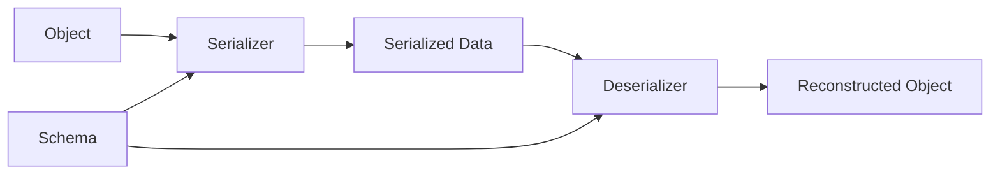

# Data Serialization

## Blogs and websites


## Medium

- [JSON is incredibly slow: Here's What's Faster!](https://medium.com/data-science-community-srm/json-is-incredibly-slow-heres-what-s-faster-ca35d5aaf9e8)

## Youtube


## Theory

### Topics Covered

1. [What is Data Serialization?](#what-is-data-serialization)
2. [Characteristics](#characteristics)
3. [Pros](#pros)
4. [Cons](#cons)
5. [Use Cases](#use-cases)
6. [Components](#components)
7. [Serialization Patterns](#serialization-patterns)
8. [Benefits](#benefits)
9. [Challenges](#challenges)
10. [Best Practices](#best-practices)
11. [When to Use Serialization Formats](#when-to-use-serialization-formats)
12. [Java and Spring Boot Examples](#java-and-spring-boot-examples)

---

### What is Data Serialization?

**Data serialization** is the process of converting structured data (objects, data structures) into a format that can be stored, transmitted, and reconstructed later. **Deserialization** is the reverse — converting the stored/transmitted format back into usable data structures.

**Why It Matters:**
```
Application A (Python)                    Application B (Java)
  user = {name: "Alice", age: 30}
           ↓ serialize
      {"name":"Alice","age":30}  ──network──→  deserialize ↓
                                              User(name="Alice", age=30)
```
Different systems, languages, and services need to agree on a common format to exchange data. Serialization is the bridge.

### Common Serialization Formats

**1. JSON (JavaScript Object Notation)**
```json
{
  "name": "Alice",
  "age": 30,
  "active": true,
  "tags": ["admin", "user"]
}
```
- **Type**: Text-based
- **Human-readable**: Yes
- **Size**: Medium (verbose due to field names)
- **Speed**: Medium (text parsing)
- **Schema**: None (self-describing)
- **Use case**: REST APIs, configuration files, browser communication
- **Supported by**: Every language natively

**2. Protocol Buffers (Protobuf)**
```protobuf
message User {
  string name = 1;
  int32 age = 2;
  bool active = 3;
  repeated string tags = 4;
}
```
```
Binary output: [0A 05 41 6C 69 63 65 10 1E 18 01 ...]
→ ~60-80% smaller than JSON
```
- **Type**: Binary
- **Human-readable**: No
- **Size**: Small (field numbers instead of names, varint encoding)
- **Speed**: Very fast (compiled serializers/deserializers)
- **Schema**: Required (.proto files, code generation)
- **Use case**: gRPC, microservices, high-performance APIs
- **Created by**: Google

**3. MessagePack**
```
Same JSON structure → binary encoding
→ ~30-50% smaller than JSON, faster to parse
```
- **Type**: Binary
- **Human-readable**: No
- **Schema**: None (like binary JSON)
- **Use case**: When you want JSON-like flexibility but faster/smaller
- **Example users**: Redis (internal), Fluentd

**4. Avro**
```json
Schema: {"type": "record", "name": "User", "fields": [
  {"name": "name", "type": "string"},
  {"name": "age", "type": "int"}
]}
```
- **Type**: Binary (with JSON schema)
- **Schema**: Required (embedded in data or stored separately)
- **Schema evolution**: Excellent (add/remove fields without breaking)
- **Use case**: Kafka, Hadoop, data pipelines
- **Created by**: Apache (Hadoop ecosystem)

**5. XML**
```xml
<user>
  <name>Alice</name>
  <age>30</age>
</user>
```
- **Type**: Text-based
- **Human-readable**: Yes (but verbose)
- **Size**: Large (opening + closing tags)
- **Use case**: Legacy systems, SOAP APIs, configuration (Maven, Android)
- **Status**: Being replaced by JSON/YAML in most new systems

**6. YAML**
```yaml
name: Alice
age: 30
active: true
tags:
  - admin
  - user
```
- **Type**: Text-based
- **Human-readable**: Very (designed for humans)
- **Use case**: Configuration files (Docker Compose, Kubernetes, CI/CD)
- **Gotcha**: Indentation-sensitive, implicit type coercion (`"no"` → `false`)

**7. CSV**
```csv
name,age,active
Alice,30,true
Bob,25,false
```
- **Type**: Text-based
- **Use case**: Data export/import, spreadsheets, simple tabular data
- **Limitation**: No nested structures, no types, delimiter conflicts

### Format Comparison

| Format | Type | Size | Speed | Schema | Human-Readable | Best For |
|--------|------|------|-------|--------|----------------|----------|
| **JSON** | Text | Medium | Medium | No | Yes | REST APIs, config |
| **Protobuf** | Binary | Small | Fast | Required | No | gRPC, microservices |
| **Avro** | Binary | Small | Fast | Required | No | Kafka, data pipelines |
| **MessagePack** | Binary | Small | Fast | No | No | Perf-sensitive JSON alternative |
| **XML** | Text | Large | Slow | Optional (XSD) | Yes | Legacy, SOAP |
| **YAML** | Text | Medium | Medium | No | Very | Config files |
| **CSV** | Text | Small | Fast | No | Yes | Tabular data |

### When to Choose What

```
Building a public REST API?          → JSON (universal, self-documenting)
Microservices talking to each other? → Protobuf/gRPC (fast, typed, small)
Kafka event streaming?               → Avro (schema evolution, compact)
Configuration files?                 → YAML or JSON
Need maximum performance?            → Protobuf or FlatBuffers
Working with legacy enterprise?      → XML/SOAP
Exporting tabular data?              → CSV or Parquet
```

### Serialization Trade-offs

**Text vs Binary:**
- Text (JSON, XML): Easy to debug, larger, slower
- Binary (Protobuf, Avro): Hard to inspect, smaller, faster

**Schema vs Schema-less:**
- Schema (Protobuf, Avro): Type safety, validation, code generation, but less flexible
- Schema-less (JSON, MessagePack): Flexible, quick iteration, but no compile-time checks

**Size vs Readability:**
- JSON: 100 bytes → human can read it
- Protobuf: 40 bytes → need tooling to decode

### Security Considerations
- **Deserialization attacks**: Never deserialize untrusted data with language-native serializers (e.g., Python's `pickle`, Java's `ObjectInputStream`)
- **Use safe formats**: JSON, Protobuf, MessagePack are safe by design (no code execution)
- **Validate schemas**: Reject data that doesn't match expected schema
- **Size limits**: Set max payload sizes to prevent memory exhaustion

---

### Characteristics

- **Text or binary representation**
  Serialization formats are either human-readable text such as JSON, XML, and YAML, or compact binary such as Protobuf, Avro, and MessagePack.

- **Schema presence**
  Some formats require an explicit schema (Protobuf, Avro), while others are self-describing or schema-less (JSON, MessagePack).

- **Cross-language support**
  Serialization lets systems written in different languages exchange data through a common representation.

- **Reversibility**
  Serialization is followed by deserialization, which reconstructs an equivalent data structure or object.

- **Encoding efficiency**
  Formats differ in size, parsing speed, and CPU overhead. Binary formats are generally smaller and faster than text formats.

- **Schema evolution support**
  Formats such as Avro and Protobuf support backward and forward compatibility when schemas change.

- **Human readability**
  Text formats are easy to inspect and debug. Binary formats require tooling.

- **Type fidelity**
  Formats vary in how well they preserve types, precision, and complex structures across languages.

- **Tooling and ecosystem**
  Mature formats provide libraries, code generators, validators, and integrations with frameworks.

- **Security sensitivity**
  Deserialization of untrusted input can be dangerous, especially for language-native serializers.

---

### Pros

- **Interoperability**
  Data can be exchanged across languages, platforms, and services.

- **Persistence**
  Data can be stored in files, databases, or message brokers and restored later.

- **Transmission efficiency**
  Binary formats reduce payload size and network cost.

- **Language independence**
  The wire format is not tied to one programming language's object model.

- **Schema validation**
  Schema-based formats catch malformed or incompatible data early.

- **Tooling support**
  Formats such as JSON and Protobuf have broad library and framework support.

- **Flexibility**
  Schema-less formats allow rapid iteration without code generation.

- **Cache friendliness**
  Serialized representations can be cached, stored, and replayed.

---

### Cons

- **Performance overhead**
  Serialization and deserialization consume CPU and memory, especially for text formats.

- **Size overhead**
  Text formats are verbose compared with binary formats.

- **Debugging difficulty**
  Binary formats are not human-readable and require decoding tools.

- **Schema management complexity**
  Schema-based formats require schema versioning and code generation.

- **Type mismatch risk**
  Different languages may represent numbers, dates, and null values differently.

- **Deserialization vulnerabilities**
  Unsafe deserializers can execute arbitrary code or cause denial of service.

- **Breaking changes**
  Renaming or removing fields can break consumers unless compatibility rules are followed.

- **Tooling and learning curve**
  Formats such as Avro and Protobuf require additional build steps and tooling.

---

### Use Cases

- **REST APIs**
  JSON is the default payload format for public and internal HTTP APIs.

- **Microservices communication**
  Protobuf and gRPC provide typed, efficient service-to-service communication.

- **Event streaming**
  Avro and Protobuf serialize events in Kafka and other streaming platforms.

- **Configuration files**
  YAML and JSON store application, deployment, and CI/CD configuration.

- **Logging**
  Structured JSON logs are machine-parseable and searchable.

- **Caching**
  Serialized objects are stored in Redis or Memcached.

- **Data pipelines**
  Avro, Parquet, and Protobuf encode data in Hadoop and Spark pipelines.

- **Browser-server communication**
  JSON is used by JavaScript clients and web APIs.

- **Legacy enterprise integration**
  XML and SOAP remain common in older systems and standards.

- **Message queues**
  JSON, Avro, and MessagePack encode messages in RabbitMQ, Kafka, and SQS.

---

### Components

- **Serializer**
  Converts objects or data structures into the target format.

- **Deserializer**
  Converts the serialized format back into objects or data structures.

- **Schema**
  Defines the structure and types of the data, when required.

- **Code generator**
  Produces typed classes from a schema, as in Protobuf and Avro.

- **Wire format**
  The encoded bytes or text that travel over the network or are stored.

- **Validation layer**
  Checks that data conforms to the schema or expected structure.

- **Encoding library**
  The runtime that performs serialization, such as Jackson, Gson, or protobuf-java.

- **Versioning and compatibility rules**
  Rules that allow schemas to evolve without breaking consumers.



---

### Serialization Patterns

- **Text serialization**
  Uses human-readable formats such as JSON, XML, and YAML.

- **Binary serialization**
  Uses compact binary formats such as Protobuf, Avro, and MessagePack.

- **Schema-first**
  Defines the schema before writing data, enabling code generation and validation.

- **Schema-less**
  Serializes arbitrary data without a predefined schema, favoring flexibility.

- **Contract-first API**
  Services agree on a serialized contract, such as a Protobuf definition or JSON Schema.

- **Schema registry**
  Stores and versions schemas centrally, common in Kafka ecosystems.

- **Backward-compatible evolution**
  Adds optional fields and avoids renaming existing fields so older consumers continue working.

- **Forward-compatible evolution**
  Consumers ignore unknown fields so newer producers do not break older readers.

- **Content negotiation**
  HTTP services select a format based on `Accept` and `Content-Type` headers.

- **Streaming serialization**
  Serializes large data incrementally rather than loading everything into memory.

---

### Benefits

- **Portability**
  Data can move across different systems and languages.

- **Efficiency**
  Binary formats reduce payload size and processing cost.

- **Type safety**
  Schema-based formats catch type errors at build time.

- **Maintainability**
  A well-defined schema serves as documentation for the data contract.

- **Scalability**
  Compact formats reduce network and storage usage in high-throughput systems.

- **Interoperability**
  Open formats allow different teams and organizations to integrate.

- **Versioning**
  Schema evolution enables systems to change independently.

---

### Challenges

- **Choosing the right format**
  The best format depends on performance, readability, ecosystem, and compatibility needs.

- **Schema evolution**
  Managing backward and forward compatibility requires discipline.

- **Cross-language type differences**
  Dates, decimals, and unsigned integers can map inconsistently between languages.

- **Security**
  Deserializing untrusted data can be dangerous.

- **Performance tuning**
  Large payloads or frequent serialization can become a bottleneck.

- **Debugging binary data**
  Binary formats need decoding tools or schema access.

- **Toolchain complexity**
  Code generation and schema registries add build and operational overhead.

---

### Best Practices

- **Choose the format based on the use case**
  Use JSON for public APIs, Protobuf for internal microservices, and Avro for event streams.

- **Define and version schemas**
  Treat schemas as contracts and version them carefully.

- **Never remove or reuse field numbers in Protobuf**
  Field numbers are part of the wire format and must remain stable.

- **Add new fields as optional**
  Preserve backward compatibility when evolving schemas.

- **Set payload size limits**
  Prevent memory exhaustion from oversized messages.

- **Avoid unsafe native deserialization**
  Do not deserialize untrusted data with Java `ObjectInputStream` or similar mechanisms.

- **Use compression for large text payloads**
  Apply gzip or another compression where appropriate.

- **Validate untrusted input**
  Validate against schemas and reject malformed data.

- **Monitor serialization performance**
  Profile CPU and memory usage in hot paths.

- **Document formats**
  Provide schemas, examples, and compatibility notes.

---

### When to Use Serialization Formats

- **Use JSON when** you need broad compatibility, human readability, and REST API support.
- **Use Protobuf when** you need compact, fast, typed communication between services.
- **Use Avro when** you need schema evolution in streaming and data pipelines.
- **Use MessagePack when** you want JSON-like flexibility with smaller, faster binary encoding.
- **Use YAML when** you are writing human-maintained configuration.
- **Use XML when** you must integrate with legacy or SOAP systems.
- **Use CSV when** exchanging simple tabular data.
- **Use Parquet or ORC when** storing analytical columnar data.

---

### Java and Spring Boot Examples

#### 1. JSON serialization with Jackson

```java
import com.fasterxml.jackson.databind.ObjectMapper;

public class JsonSerializationExample {

    private record User(String name, int age, boolean active) {}

    public static void main(String[] args) throws Exception {
        ObjectMapper mapper = new ObjectMapper();

        User user = new User("Alice", 30, true);
        String json = mapper.writeValueAsString(user);
        System.out.println("JSON: " + json);

        User deserialized = mapper.readValue(json, User.class);
        System.out.println("Name: " + deserialized.name());
    }
}
```

#### 2. Protobuf usage in a Spring Boot service

```protobuf
syntax = "proto3";

message User {
  string name = 1;
  int32 age = 2;
  bool active = 3;
}
```

```java
import org.springframework.stereotype.Service;

@Service
public class ProtobufUserService {

    public UserProto.User toProto(String name, int age, boolean active) {
        return UserProto.User.newBuilder()
            .setName(name)
            .setAge(age)
            .setActive(active)
            .build();
    }

    public String fromProto(UserProto.User user) {
        return user.getName() + " is " + user.getAge() + " years old";
    }
}
```

#### 3. Spring MVC content negotiation

```java
import org.springframework.http.MediaType;
import org.springframework.http.ResponseEntity;
import org.springframework.web.bind.annotation.*;

@RestController
@RequestMapping("/api/data")
public class SerializationController {

    @GetMapping(value = "/user", produces = {
        MediaType.APPLICATION_JSON_VALUE,
        MediaType.APPLICATION_XML_VALUE
    })
    public ResponseEntity<User> getUser() {
        return ResponseEntity.ok(new User("Alice", 30, true));
    }
}
```

#### 4. XML serialization with Jackson

```java
import com.fasterxml.jackson.dataformat.xml.XmlMapper;

public class XmlSerializationExample {

    public static void main(String[] args) throws Exception {
        XmlMapper xmlMapper = new XmlMapper();
        String xml = xmlMapper.writeValueAsString(new User("Alice", 30, true));
        System.out.println(xml);
    }

    private record User(String name, int age, boolean active) {}
}
```

#### 5. Custom serializer with Jackson

```java
import com.fasterxml.jackson.core.JsonGenerator;
import com.fasterxml.jackson.databind.SerializerProvider;
import com.fasterxml.jackson.databind.annotation.JsonSerialize;
import com.fasterxml.jackson.databind.ser.std.StdSerializer;

import java.io.IOException;

@JsonSerialize(using = MaskedUserSerializer.class)
public record User(String name, String email) {}

class MaskedUserSerializer extends StdSerializer<User> {

    public MaskedUserSerializer() {
        super(User.class);
    }

    @Override
    public void serialize(User value, JsonGenerator gen, SerializerProvider provider)
            throws IOException {
        gen.writeStartObject();
        gen.writeStringField("name", value.name());
        gen.writeStringField("email", value.email().replaceAll("(?<=.).(?=.*@)", "*"));
        gen.writeEndObject();
    }
}
```

**Interview questions and answers**

- **Q: What is the difference between serialization and deserialization?**
  **A:** Serialization converts an object or data structure into a storable or transmittable format. Deserialization reconstructs the original object from that format.

- **Q: Why is Protobuf faster and smaller than JSON?**
  **A:** Protobuf is binary and uses field numbers rather than field names, along with compact varint encoding. JSON requires text parsing and includes verbose field names and punctuation.

- **Q: How do you handle schema evolution safely?**
  **A:** Add new optional fields, avoid renaming or reusing existing field numbers, and make consumers tolerate unknown fields.

- **Q: Why is Java's native `ObjectInputStream` dangerous for untrusted data?**
  **A:** It can instantiate arbitrary classes and invoke methods during deserialization, potentially leading to remote code execution. Use safe formats such as JSON or Protobuf for untrusted input.
