# Domain Name System (DNS)

## Blogs and websites

- [DNS Record Types: Defined and Explained](https://www.site24x7.com/learn/dns-record-types.html)

## Medium


## Youtube

- [How DNS works? | System Design of Domain Name System](https://www.youtube.com/watch?v=QVdX34quUgU)

- [Build Your Own DNS Server - Beginner Friendly](https://www.youtube.com/watch?v=Ui66W7zeAbI)
- [Build Your Own DNS Server](https://www.youtube.com/watch?v=52wnTsBI_HE)
- [I created an AI Based DNS Server - Toying with DNS](https://www.youtube.com/watch?v=Sgk0yy8rJ8M)

## Theory

### Topics Covered

This page is organized into the following topics. Each topic includes a detailed explanation, its characteristics, components, patterns, pros/benefits, cons/challenges, best practices, when to use it, a real-life use case, a diagram, a Java/Spring Boot code example, and interview questions with answers.

1. [What is DNS: The Internet's Phone Book](#the-internets-phone-book)
2. [How DNS Resolution Works: The Complete Journey](#how-dns-resolution-works-the-complete-journey)
3. [DNS Record Types: The Complete Reference](#dns-record-types-the-complete-reference)
4. [A Record (Address Record)](#a-record-address-record)
5. [AAAA Record (IPv6 Address)](#aaaa-record-ipv6-address)
6. [CNAME Record (Canonical Name)](#cname-record-canonical-name)
7. [MX Record (Mail Exchange)](#mx-record-mail-exchange)
8. [TXT Record (Text Information)](#txt-record-text-information)
9. [NS Record (Name Server)](#ns-record-name-server)
10. [Other Important Records: SRV and CAA](#other-important-records-srv-and-caa)
11. [DNS Caching: The Speed Secret](#dns-caching-the-speed-secret)
12. [GeoDNS: Multi-Region Routing](#geodns-multi-region-routing)
13. [Blue-Green Deployment via DNS](#blue-green-deployment-via-dns)
14. [CDN Configuration via DNS](#cdn-configuration-via-dns)
15. [DNS Failover Configuration](#dns-failover-configuration)
16. [DNS Commands & Tools](#dns-commands-tools)
17. [DNS Security: DNSSEC and Encrypted DNS](#dns-security)
18. [Common DNS Issues](#common-dns-issues)
19. [DNS Best Practices](#dns-best-practices)
20. [Designing a DNS Server (System Design Deep Dive)](#designing-a-dns-server-system-design-deep-dive)
21. [Domain Name System (DNS): Characteristics, Pros, Cons, Use Cases, Components, Patterns, Benefits, Challenges, Best Practices and When to Use](#domain-name-system-dns-characteristics-pros-cons-use-cases-components-patterns-benefits-challenges-best-practices-and-when-to-use)

### The Internet's Phone Book

DNS translates human-readable domain names (www.example.com) to machine-readable IP addresses (93.184.216.34). Without DNS, you'd need to memorize IP addresses for every website - the same way a phone book lets you look up "Alice" instead of memorizing her phone number.

At its core, DNS is a **globally distributed, hierarchical, and heavily cached key-value store** that maps names to records (most commonly IP addresses, but also mail servers, text metadata, and more). It is one of the oldest still-in-use pieces of internet infrastructure (designed in 1983, RFC 882/883, refined in RFC 1034/1035) and one of the best examples of a massively distributed system that quietly handles trillions of queries a day with very high availability.

**Why DNS exists:**

- **Human memory is bad at numbers, good at names.** `www.google.com` is far easier to remember than `142.250.194.100` (and even harder for IPv6: `2607:f8b0:4005:80a::2004`).
- **IP addresses change, names shouldn't have to.** Servers get replaced, IPs get reassigned by cloud providers, and load balancers rotate machines in and out - DNS provides a stable name that can point to a changing set of addresses.
- **It enables indirection at global scale.** Indirection (a name that resolves to an address) is what allows load balancing, failover, CDNs, and multi-region deployments to work transparently to the end user.

#### DNS: Characteristics

- **Hierarchical namespace**: Domain names are organized as a tree (root `.`, then top-level domains like `.com`, then second-level `example.com`, then subdomains `www.example.com`). Each level of the tree can be delegated to a different administrative owner.
- **Distributed and decentralized**: No single server holds all DNS data. Responsibility is split across 13 root server clusters, thousands of TLD servers, and millions of authoritative name servers run by individual domain owners.
- **Heavily cached**: Every layer (browser, OS, router, ISP resolver) caches answers using a TTL, which is why DNS can serve enormous query volumes with very few round trips to authoritative servers.
- **Eventually consistent**: When you change a DNS record, it does not propagate instantly - it becomes visible everywhere only after caches respect the TTL and refresh, which can take from seconds to days.
- **UDP-first, TCP-fallback protocol**: Most queries use UDP port 53 for speed (small packets, no handshake); DNS falls back to TCP for large responses (zone transfers, DNSSEC signatures, responses over 512 bytes/4096 with EDNS0).

#### DNS: Components

- **Stub resolver**: The tiny DNS client built into your OS/browser that sends queries and returns answers to applications; it does not do the recursive walking itself, it just asks a resolver.
- **Recursive resolver**: A server (e.g., your ISP's resolver, Google `8.8.8.8`, Cloudflare `1.1.1.1`) that does the full work of walking the DNS hierarchy on behalf of the client and caches the result.
- **Root name servers**: 13 logical root server identities (`a` to `m`, anycasted across hundreds of physical machines) that know which server is authoritative for each TLD.
- **TLD name servers**: Servers responsible for a top-level domain (`.com`, `.org`, `.io`) that know which authoritative servers are responsible for each registered domain under them.
- **Authoritative name servers**: The "source of truth" servers for a specific domain (e.g., `example.com`), run by the domain owner or their DNS provider (Route 53, Cloudflare, Google Cloud DNS), holding the actual records.
- **Zone file**: The actual data file (or database-backed equivalent) an authoritative server uses, containing all the records for a zone (domain) in a structured, line-based format.

#### DNS: Patterns

- **Delegation via NS records**: A parent zone points to child zone's name servers, allowing ownership of subdomains to be handed off to a different team or provider without involving the parent.
- **Caching with TTL-based expiry**: Every answer carries a TTL so resolvers know how long they may reuse it, trading off freshness against load on authoritative servers.
- **Anycast routing**: The same IP address is announced from many physical locations (used by root servers and public resolvers like 1.1.1.1); BGP routing sends the client to the nearest healthy instance.
- **Split-horizon / split-brain DNS**: The same domain name resolves differently depending on who is asking (internal corporate network vs. public internet), used for internal services.

#### DNS: Pros / Benefits

- **Decouples names from infrastructure**: Servers, IPs, and data centers can change freely without users needing to learn a new address.
- **Enables load balancing and failover** at the naming layer, before any traffic even reaches your infrastructure.
- **Scales to the entire internet**: The hierarchical, delegated, cached design lets DNS handle trillions of daily queries with no central bottleneck.
- **Human-friendly and brandable**: Company names, memorable subdomains (`checkout.shop.com`), and email addresses all depend on this readability.

#### DNS: Cons / Challenges

- **Propagation delay**: Changes are not instant; TTL-based caching means stale answers can persist for minutes to days.
- **Eventual consistency, not strong consistency**: Different resolvers around the world may briefly return different answers during a change.
- **Attack surface**: DNS is a frequent target for spoofing, cache poisoning, amplification DDoS attacks, and domain hijacking (see the [DNS Security](#dns-security) topic).
- **Operational complexity at scale**: Running your own authoritative infrastructure (zone transfers, secondary servers, monitoring, DNSSEC key rotation) is non-trivial; most companies use managed DNS providers instead.

#### DNS: Best Practices

- Use a reputable managed DNS provider (Route 53, Cloudflare, Google Cloud DNS) instead of self-hosting unless you have specific compliance/control requirements.
- Always configure at least two independent, geographically separated name servers (redundancy against outages).
- Set TTLs deliberately: low (60-300s) before planned changes, higher (3600s+) once stable, to balance freshness against load.
- Enable DNSSEC and monitor certificate/record changes to detect hijacking early.

#### DNS: When to Use

- DNS should back **every** externally reachable service - it is not optional infrastructure, it is the entry point for virtually all internet communication (HTTP, email, and most other protocols).
- Use **public DNS** for anything the internet needs to reach, and **private/split-horizon DNS** for internal-only services (databases, internal APIs) that should never be resolvable externally.

#### Diagram: The DNS Hierarchy

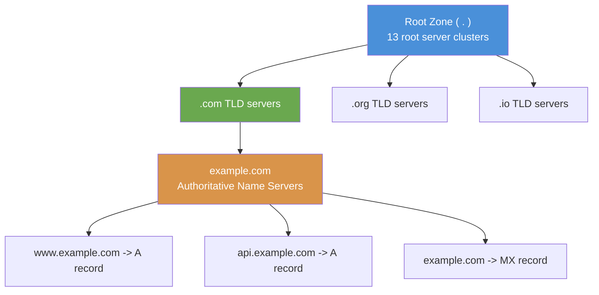
```mermaid
graph TD
    Root["Root Zone ( . )<br/>13 root server clusters"]
    Root --> ComTLD[".com TLD servers"]
    Root --> OrgTLD[".org TLD servers"]
    Root --> IoTLD[".io TLD servers"]
    ComTLD --> Example["example.com<br/>Authoritative Name Servers"]
    Example --> WWW["www.example.com -> A record"]
    Example --> API["api.example.com -> A record"]
    Example --> Mail["example.com -> MX record"]

    style Root fill:#4a90d9,color:#fff
    style ComTLD fill:#6aa84f,color:#fff
    style Example fill:#d9944a,color:#fff
```

This diagram shows why DNS scales: the root only needs to know about a few hundred TLDs, each TLD only needs to know about its registered domains' name servers, and each domain's authoritative server owns the full detail for just that one zone. No single server needs global knowledge of every record on the internet.

#### Real-Life Use Case: Why Companies Don't Hardcode IPs

Consider a mobile banking app. If it hardcoded the bank's server IP address, any data center migration, cloud provider switch, or IP re-assignment would require an app store update and force every user to update before the app worked again - taking weeks and stranding users on old versions. Instead, the app is built to call `api.bank.com`. When the bank migrates from on-premises servers to AWS, they simply update the DNS `A`/`CNAME` record. Every app instance, without any code change or app update, starts talking to the new infrastructure the next time its cached DNS answer expires.

#### Java/Spring Boot Code: A Minimal DNS Lookup Service

A small Spring Boot REST controller that performs a live DNS lookup for a given hostname, demonstrating how applications consume DNS programmatically.

```java
import org.springframework.web.bind.annotation.*;
import javax.naming.directory.InitialDirContext;
import javax.naming.directory.Attributes;
import java.util.*;

@RestController
@RequestMapping("/api/dns")
public class DnsLookupController {

    // GET /api/dns/resolve?host=example.com&type=A
    @GetMapping("/resolve")
    public Map<String, Object> resolve(@RequestParam String host,
                                        @RequestParam(defaultValue = "A") String type) throws Exception {
        Hashtable<String, String> env = new Hashtable<>();
        env.put("java.naming.factory.initial", "com.sun.jndi.dns.DnsContextFactory");

        InitialDirContext ctx = new InitialDirContext(env);
        Attributes attrs = ctx.getAttributes(host, new String[]{type});

        List<String> answers = new ArrayList<>();
        var attr = attrs.get(type);
        if (attr != null) {
            for (int i = 0; i < attr.size(); i++) {
                answers.add(String.valueOf(attr.get(i)));
            }
        }

        Map<String, Object> result = new LinkedHashMap<>();
        result.put("host", host);
        result.put("type", type);
        result.put("answers", answers);
        return result;
    }
}
```

This mirrors what every HTTP client library does under the hood before it can open a socket: resolve the name to an address, then connect. In production, prefer caching the resolver client and setting explicit timeouts, since a slow/unreachable DNS server can otherwise block request threads.

#### Interview Questions and Answers

**Q1. What problem does DNS solve, in one sentence?**
A: It maps human-friendly domain names to the machine-usable addresses (and other metadata) needed to actually reach a service, while allowing that mapping to change without breaking clients.

**Q2. Is DNS a single database or a distributed system? Explain.**
A: It is a distributed, hierarchical system. No server has the full picture; the root delegates to TLD servers, which delegate to each domain's authoritative servers. This delegation is what allows DNS to scale globally without a central bottleneck.

**Q3. Why does DNS mostly use UDP instead of TCP?**
A: UDP has no handshake, so a query and response can complete in a single round trip, which matters enormously given how many queries happen per user session. DNS falls back to TCP only when the response is too large for a single UDP packet (e.g., zone transfers, DNSSEC-signed responses).

**Q4. What is the practical impact of DNS being "eventually consistent"?**
A: After you change a record, different users around the world may see the old or new value for up to the record's TTL, since resolvers cache answers. This is why teams lower TTLs before planned migrations, so changes propagate faster.

**Q5. Why do most companies use a managed DNS provider instead of running their own?**
A: Running authoritative DNS well requires redundant, globally distributed, DDoS-resistant infrastructure with very high availability - the exact problem managed providers (Route 53, Cloudflare, Google Cloud DNS) have already solved at scale, so it's rarely worth reinventing except for education or specialized/air-gapped needs.

### How DNS Resolution Works: The Complete Journey

**The 8-Step Resolution Process:**

```
User types: www.example.com in browser

1. Browser Cache Check
   ┌──────────────────┐
   │ Browser Cache    │ → "Do I know this?"
   └──────────────────┘    ↓ Cache miss

2. Operating System Cache
   ┌──────────────────┐
   │ OS DNS Cache     │ → "Do I know this?"
   └──────────────────┘    ↓ Cache miss

3. Router Cache
   ┌──────────────────┐
   │ Router Cache     │ → "Do I know this?"
   └──────────────────┘    ↓ Cache miss

4. ISP DNS Resolver (Recursive Resolver)
   ┌──────────────────┐
   │ ISP Resolver     │ → "Let me find out!"
   │ 8.8.8.8          │
   └──────────────────┘
         ↓
         ↓ Query: www.example.com?
         ↓

5. Root DNS Server
   ┌──────────────────┐
   │ Root Server      │ → "Ask .com server at 192.5.6.30"
   │ a.root-servers   │
   └──────────────────┘
         ↓
         ↓ Query: www.example.com?
         ↓

6. TLD (Top-Level Domain) Server
   ┌──────────────────┐
   │ .com TLD Server  │ → "Ask example.com's NS at 1.2.3.4"
   │ 192.5.6.30       │
   └──────────────────┘
         ↓
         ↓ Query: www.example.com?
         ↓

7. Authoritative Name Server
   ┌──────────────────┐
   │ example.com NS   │ → "www.example.com = 93.184.216.34"
   │ 1.2.3.4          │
   └──────────────────┘
         ↓
         ↓ Returns IP
         ↓

8. Back to User
   ┌──────────────────┐
   │ Browser          │ ← "93.184.216.34"
   └──────────────────┘
         ↓
   Connects to 93.184.216.34:443 (HTTPS)
```

**Timing Example:**
```
First Visit (no cache):
  Browser cache:     0ms (miss)
  OS cache:          0ms (miss)
  ISP resolver:      2ms (miss)
  Root server:       20ms
  TLD server:        30ms
  Authoritative:     25ms
  Total:            ~77ms

Second Visit (cached):
  Browser cache:     0ms (hit!)
  Total:             0ms (instant)
```

There are two distinct resolution strategies used at different points in the chain: **recursive** queries (client asks a resolver to do all the work and return only the final answer) and **iterative** queries (the resolver itself asks each server in turn, following referrals). Your device always makes a recursive query to its configured resolver; that resolver then performs iterative queries against root, TLD, and authoritative servers on your behalf.

#### DNS Resolution: Characteristics

- **Recursive vs. iterative split**: End devices always ask recursively ("give me the final answer or an error"); resolvers talk to authoritative infrastructure iteratively ("here's a referral, ask this next server").
- **Referral-based walking**: Each server in the chain (root, TLD, authoritative) doesn't know the final answer itself except the last one - it only knows *who to ask next*, which keeps each server's knowledge small and local.
- **Multi-layer caching**: A resolution can be short-circuited at any layer - browser, OS, router, or ISP resolver - if a cached, unexpired answer already exists.
- **Latency dominated by cold cache**: A full 8-step walk (root -> TLD -> authoritative) typically costs tens of milliseconds, but a warm cache hit anywhere in the chain reduces this to near zero.
- **Negative caching**: Resolvers also cache "this name does not exist" (NXDOMAIN) responses for a TTL specified in the zone's SOA record, to avoid repeatedly querying for typos or deleted records.

#### DNS Resolution: Components

- **Stub resolver**: OS-level component (e.g., `getaddrinfo()` on Linux/macOS) that apps call; it just forwards the query recursively to a configured resolver.
- **Recursive resolver**: Does the actual walking of the hierarchy; examples include ISP resolvers, Google Public DNS (`8.8.8.8`), Cloudflare (`1.1.1.1`), and Quad9 (`9.9.9.9`).
- **Root hints file**: A small, rarely-changing file every recursive resolver ships with, listing the IPs of the 13 root server identities, used as the starting point of every fresh walk.
- **Referral chain**: The sequence of "ask this server next" responses that guides the resolver from root, to TLD, to the authoritative server.

#### DNS Resolution: Patterns

- **Iterative resolution with caching at every hop**: The classic pattern described above; each hop's answer is cached according to its own TTL so future queries (even for different names under the same TLD) are faster.
- **Forwarding resolvers**: Many home routers and corporate networks run a small local resolver that simply forwards all queries to an upstream recursive resolver (like 8.8.8.8), adding a local caching layer without implementing the full recursive-resolution logic itself.
- **Anycast for root/public resolvers**: Root servers and public DNS resolvers (1.1.1.1, 8.8.8.8) are anycast, so "the root server" you reach is actually the nearest of hundreds of physical machines, keeping the first hop of every fresh resolution fast worldwide.

#### DNS Resolution: Pros / Benefits

- **Small, focused responsibility per server**: No single server needs to know every domain on the internet, which is what makes DNS horizontally scalable.
- **Caching turns a globally distributed lookup into a near-instant local one** for the overwhelming majority of real-world queries (cache hit rates at public resolvers are typically well above 95%).
- **Fully deterministic and debuggable**: Tools like `dig +trace` can replay the exact referral chain a resolver would follow, which makes DNS issues unusually easy to diagnose compared to other distributed systems.

#### DNS Resolution: Cons / Challenges

- **Cold-cache latency**: A cache miss at every layer means a user's very first request to a new domain pays the full round-trip cost (~20-80ms) before any actual application traffic can start.
- **Amplification risk**: Because a small UDP query can trigger relatively large recursive work, open resolvers have historically been abused for DNS amplification DDoS attacks (see [DNS Security](#dns-security)).
- **Dependency chain fragility**: If a recursive resolver, or any authoritative server high in the chain (e.g., the domain's own NS records), is unreachable, resolution for the entire subtree below it fails.

#### DNS Resolution: Best Practices

- Configure multiple resolvers (primary + fallback) on servers and routers so a single resolver outage does not take down name resolution.
- Prefer resolvers with strong cache hit rates and anycast presence (1.1.1.1, 8.8.8.8) for public-facing infrastructure.
- Use `dig +trace <domain>` during incident response to see exactly which hop in the chain is failing or returning unexpected data.
- Keep the number of NS records per zone reasonable (2-4) and geographically diverse, since every resolution ultimately depends on reaching one of them.

#### DNS Resolution: When to Use

- This resolution model applies to essentially every DNS query; there's no alternative to choose here, but you *can* choose which recursive resolver your infrastructure uses (ISP default, or a public resolver like 1.1.1.1/8.8.8.8 for consistent performance and privacy).
- For internal/private services, consider running an internal recursive resolver so internal-only names never leak an iterative query to the public internet.

#### Diagram: Recursive vs. Iterative Queries

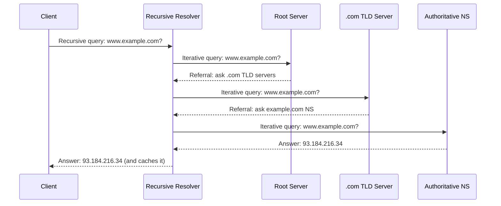
```mermaid
sequenceDiagram
    participant Client
    participant Resolver as Recursive Resolver
    participant Root as Root Server
    participant TLD as .com TLD Server
    participant Auth as Authoritative NS

    Client->>Resolver: Recursive query: www.example.com?
    Resolver->>Root: Iterative query: www.example.com?
    Root-->>Resolver: Referral: ask .com TLD servers
    Resolver->>TLD: Iterative query: www.example.com?
    TLD-->>Resolver: Referral: ask example.com NS
    Resolver->>Auth: Iterative query: www.example.com?
    Auth-->>Resolver: Answer: 93.184.216.34
    Resolver-->>Client: Answer: 93.184.216.34 (and caches it)
```

#### Real-Life Use Case: Why Your First Page Load Feels Slower

Ever notice the very first request after opening a browser feels slightly slower than subsequent ones, even on a fast connection? Part of that is a cold DNS cache: the OS, browser, and local network have no cached answer for the domain, so the full recursive/iterative walk has to happen before the browser can even open a TCP connection. This is why performance-sensitive sites use `<link rel="dns-prefetch">` hints in HTML to kick off DNS resolution for third-party domains (analytics, fonts, ad networks) before the browser actually needs to connect to them, hiding this latency behind other page-load work.

#### Java/Spring Boot Code: Measuring Resolution Latency

A Spring Boot service endpoint that times a DNS lookup, useful for building internal dashboards that watch for DNS latency regressions.

```java
import org.springframework.web.bind.annotation.*;
import java.net.InetAddress;
import java.util.*;

@RestController
@RequestMapping("/api/dns")
public class DnsLatencyController {

    // GET /api/dns/latency?host=example.com
    @GetMapping("/latency")
    public Map<String, Object> latency(@RequestParam String host) throws Exception {
        long start = System.nanoTime();
        InetAddress[] addresses = InetAddress.getAllByName(host);
        long elapsedMs = (System.nanoTime() - start) / 1_000_000;

        Map<String, Object> result = new LinkedHashMap<>();
        result.put("host", host);
        result.put("resolvedIps", Arrays.stream(addresses).map(InetAddress::getHostAddress).toList());
        result.put("latencyMs", elapsedMs);
        // A very low latencyMs (~0-1ms) usually means the OS/JVM already had this cached.
        return result;
    }
}
```

#### Interview Questions and Answers

**Q1. What is the difference between a recursive and an iterative DNS query?**
A: A recursive query asks the server to return the final answer (or an authoritative error), doing all the follow-up work itself. An iterative query asks a server "what do you know?" and accepts a referral to another server as a valid response. Client devices always query recursively; recursive resolvers then perform iterative queries against the DNS hierarchy.

**Q2. Walk through what happens when a browser resolves `www.example.com` with a completely empty cache.**
A: The stub resolver asks the recursive resolver recursively. The recursive resolver asks a root server (iteratively), gets referred to the `.com` TLD servers, asks them and gets referred to `example.com`'s authoritative name servers, then asks them directly and receives the final IP address, which it returns to the client and caches at every level it can (per each answer's TTL).

**Q3. Why do root and TLD servers only return referrals instead of the final answer?**
A: Because they don't have the final answer - they only track which server owns the next level down. This keeps their data sets small and stable (a few hundred TLDs, a few thousand large registrars) even though the internet has hundreds of millions of registered domains.

**Q4. How does negative caching help performance and security?**
A: When a name doesn't exist, the resolver caches that NXDOMAIN result (per the zone's SOA-defined negative TTL) so repeated queries for the same non-existent name (common with typos or probing/scanning tools) don't repeatedly hit authoritative servers.

**Q5. What tool would you use to debug a DNS resolution problem step by step, and why?**
A: `dig +trace <domain>` replays the entire referral chain manually, starting from the root, showing exactly which server returns which answer - this quickly reveals whether the problem is a broken NS delegation, a missing record, or a caching/propagation delay.

### DNS Record Types: The Complete Reference

Every zone file is made of **resource records (RRs)**, each with the format `name TTL class type value`. The `type` field is what most engineers mean by "record type" - it tells resolvers and applications how to interpret the value (an IP address, a hostname, arbitrary text, a priority-weighted list, and so on). The next several topics cover each commonly-used record type in depth; this section gives the map before the detail.

| Type | Maps to | Common use |
|------|---------|------------|
| A | IPv4 address | Point a name at a server |
| AAAA | IPv6 address | Same as A, for IPv6 |
| CNAME | Another name | Alias a subdomain to another domain |
| MX | Mail server + priority | Route email for the domain |
| TXT | Arbitrary text | SPF/DKIM/DMARC, domain verification |
| NS | Name server hostname | Delegate a zone/subdomain |
| SRV | Host + port + priority/weight | Locate a specific service |
| CAA | Certificate authority name | Restrict who can issue TLS certs |

#### DNS Record Types: Characteristics

- **Typed and strongly structured**: Every record has an explicit type that determines how resolvers and clients parse and use its value; a resolver never has to guess.
- **Independently cacheable**: Each record (even multiple records of different types for the same name) carries its own TTL and is cached independently.
- **Coexistence rules**: Some record types cannot coexist for the same name (e.g., CNAME cannot share a name with any other record type), which is enforced by the DNS protocol itself, not just convention.
- **Priority/weight fields for some types**: MX and SRV records include a priority (and sometimes weight) so multiple candidate targets can be ranked and load-balanced.

#### DNS Record Types: Components

- **Zone file**: The authoritative source of all records for a domain, typically edited through a DNS provider's UI/API rather than a raw text file today.
- **SOA (Start of Authority) record**: A special record every zone must have, defining the primary name server, admin contact, zone serial number, and refresh/retry/expire/negative-cache timers.
- **Resource Record Set (RRset)**: The group of all records sharing the same name and type (e.g., all the A records for `www.example.com`), which DNS treats as a single cacheable unit.

#### DNS Record Types: Patterns

- **Multiple A/AAAA records for simple load balancing**: Returning several IPs for one name lets clients round-robin between them without any load balancer hardware.
- **CNAME chaining to third-party infrastructure**: Pointing a subdomain at a CDN or SaaS-provided hostname (`d123.cloudfront.net`) instead of a raw IP, so the third party can change their infrastructure without you updating DNS.
- **TXT records as an out-of-band verification/config channel**: Many providers (Google, AWS ACM, Let's Encrypt) use TXT records purely to prove domain ownership, since it requires no visible change to the site.

#### DNS Record Types: Pros / Benefits

- **One namespace, many kinds of metadata**: A single domain name can simultaneously describe where to send web traffic (A/AAAA), where to send email (MX), and who is allowed to issue certificates for it (CAA).
- **Extensible without breaking clients**: New record types (like CAA, added in 2013) can be introduced without requiring changes to unrelated infrastructure - resolvers simply return "no such record" if a client asks for a type that doesn't exist.

#### DNS Record Types: Cons / Challenges

- **Easy to misconfigure**: A missing MX record silently breaks email; a CNAME at the zone apex silently breaks the whole zone; these mistakes often aren't caught until users report problems.
- **Propagation and coexistence rules add cognitive load**: Engineers must remember rules like "CNAME can't coexist with other records" and "changes take up to the old TTL to fully propagate," which are easy to overlook under deadline pressure.

#### DNS Record Types: Best Practices

- Document what every record in your zone is for; it is very easy to accumulate stale/orphaned records over the years (dangling CNAMEs are a common subdomain-takeover vector).
- Automate DNS record management with infrastructure-as-code (Terraform, Pulumi, CDK) instead of manual console edits, so changes are reviewed and auditable.
- Regularly audit zones for unused records, especially CNAMEs pointing at deprovisioned third-party services.

#### DNS Record Types: When to Use

- Use this reference whenever you're deciding *which* record type solves a specific problem: routing web traffic (A/AAAA), aliasing (CNAME), email (MX), verification/security policy (TXT), delegation (NS), service discovery (SRV), or certificate restriction (CAA).

#### Diagram: Record Types for One Domain

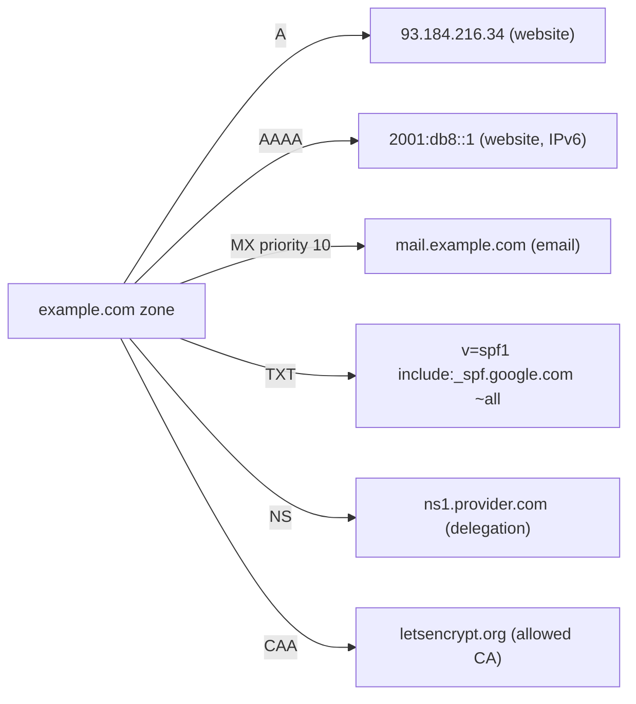
```mermaid
graph LR
    D["example.com zone"]
    D -->|A| Web["93.184.216.34 (website)"]
    D -->|AAAA| Web6["2001:db8::1 (website, IPv6)"]
    D -->|MX priority 10| Mail["mail.example.com (email)"]
    D -->|TXT| Verify["v=spf1 include:_spf.google.com ~all"]
    D -->|NS| Deleg["ns1.provider.com (delegation)"]
    D -->|CAA| CA["letsencrypt.org (allowed CA)"]
```

#### Real-Life Use Case: One Domain, Many Responsibilities

A single company domain, `acme.com`, typically has an A/AAAA record pointing to its marketing website, a CNAME (`www`) aliasing to the same, MX records routing mail to Google Workspace, TXT records proving domain ownership to Google, GitHub, and their SSL certificate authority, an NS delegation for `app.acme.com` to a separate product team's DNS zone, and a CAA record restricting certificate issuance to Let's Encrypt only. All of this lives under one domain name, managed by different teams, without any of them interfering with each other - a direct benefit of DNS's typed record system.

#### Java/Spring Boot Code: Fetching Multiple Record Types

```java
import org.springframework.web.bind.annotation.*;
import javax.naming.directory.InitialDirContext;
import javax.naming.directory.Attributes;
import java.util.*;

@RestController
@RequestMapping("/api/dns")
public class DnsRecordTypesController {

    private static final List<String> TYPES = List.of("A", "AAAA", "MX", "TXT", "NS", "CAA");

    // GET /api/dns/all-records?host=example.com
    @GetMapping("/all-records")
    public Map<String, List<String>> allRecords(@RequestParam String host) throws Exception {
        Hashtable<String, String> env = new Hashtable<>();
        env.put("java.naming.factory.initial", "com.sun.jndi.dns.DnsContextFactory");
        InitialDirContext ctx = new InitialDirContext(env);

        Map<String, List<String>> results = new LinkedHashMap<>();
        for (String type : TYPES) {
            List<String> values = new ArrayList<>();
            try {
                Attributes attrs = ctx.getAttributes(host, new String[]{type});
                var attr = attrs.get(type);
                if (attr != null) {
                    for (int i = 0; i < attr.size(); i++) {
                        values.add(String.valueOf(attr.get(i)));
                    }
                }
            } catch (Exception ignored) {
                // No record of this type for this host - expected and fine.
            }
            results.put(type, values);
        }
        return results;
    }
}
```

#### Interview Questions and Answers

**Q1. Why can't a CNAME record coexist with other records for the same name?**
A: A CNAME says "this name is an alias, go look up records under this other name instead." If an MX or TXT record also existed for the same name, resolvers wouldn't know whether to follow the alias or use the record directly - so the DNS protocol simply forbids the ambiguity.

**Q2. What is a zone's SOA record, and why does it matter even though it's rarely discussed?**
A: SOA (Start of Authority) defines the zone's serial number (used by secondary servers to detect changes) and the refresh/retry/expire/negative-cache TTL timers that govern how the whole zone replicates and how long "this record doesn't exist" answers are cached.

**Q3. How would you verify domain ownership to a third-party service without changing your live website?**
A: Add a TXT record with the verification token the provider gives you (e.g., `google-site-verification=...`). It's purely metadata, has no effect on web/email traffic, and can be removed later without any user-facing impact.

**Q4. What's a real risk of leaving old CNAME records in your zone after decommissioning a third-party service?**
A: Subdomain takeover - if the CNAME still points at a service (like an old S3 bucket, Heroku app, or SaaS subdomain) that no one owns anymore, an attacker can often claim that same third-party resource and effectively hijack your subdomain.

**Q5. Why does CAA matter even though it doesn't affect availability of your site?**
A: CAA restricts which certificate authorities may legally issue TLS certificates for your domain. Without it, any publicly trusted CA could be tricked (via social engineering or a compromised account) into issuing a valid certificate for your domain to an attacker; CAA makes that a protocol-level policy violation that compliant CAs must refuse.

### A Record (Address Record)
**Purpose**: Map domain to IPv4 address

```
DNS Query:
  example.com. IN A

DNS Response:
  example.com.  3600  IN  A  93.184.216.34
               ↑ TTL      ↑ IP Address

Meaning: "example.com is at 93.184.216.34 for 3600 seconds"
```

**Use Cases:**
```
# Main website
www.example.com → 93.184.216.34

# Subdomain for API
api.example.com → 93.184.216.35

# Multiple IPs for load balancing
www.example.com → 93.184.216.34
www.example.com → 93.184.216.35
www.example.com → 93.184.216.36
```

#### A Record: Characteristics

- **Simplest and most common record type**: A raw 32-bit IPv4 address, resolved with no indirection or alias-following required.
- **Supports multiple values per name**: A name can have any number of A records; resolvers return all of them (often in rotated order) for simple client-side load balancing.
- **Directly cacheable by TTL**: Since the value is a plain address with no further lookups needed, A records are the cheapest record type to resolve and cache.

#### A Record: Components

- **Zone file entry**: `name TTL IN A ip-address` - the record itself, stored in the domain's authoritative zone.
- **RRset (multiple A records)**: When several A records share a name, resolvers treat them as one set and can shuffle the order returned to each client (round-robin DNS).

#### A Record: Patterns

- **Round-robin DNS load balancing**: Multiple A records for one name spread traffic across several backend IPs without a dedicated load balancer, at the cost of no health-awareness (a dead IP keeps getting served until manually removed).
- **Direct mapping for simple/small deployments**: A single A record pointing straight at one server, appropriate for low-traffic or internal services that don't need CDN/load-balancer indirection.

#### A Record: Pros / Benefits

- **Fastest possible resolution**: No alias-following (unlike CNAME), so it's a single-hop lookup.
- **Works everywhere**: Every DNS-aware system supports A records; there is no compatibility concern.
- **Simple free load balancing**: Multiple A records give basic traffic distribution with zero additional infrastructure.

#### A Record: Cons / Challenges

- **No health checking**: Plain round-robin A records don't know if a backend is down; some clients will keep getting routed to a dead IP until the record is manually fixed or a health-check-aware DNS product (e.g., Route 53 health checks) is used instead.
- **IPv4 exhaustion**: Public IPv4 addresses are scarce/costly, which is part of why AAAA (IPv6) and shared infrastructure (load balancers, CDNs) are increasingly preferred over dedicating an A record per server.

#### A Record: Best Practices

- Use A records for the origin/entry point of your infrastructure (often a load balancer's IP) rather than for every backend server directly.
- Pair with health-check-aware DNS (Route 53, Cloudflare Load Balancing) instead of static round-robin when uptime matters.
- Keep TTLs low (60-300s) if the underlying IP is expected to change (e.g., before a migration).

#### A Record: When to Use

- Use an A record whenever you need to point a name directly at a specific IPv4 address - typically your load balancer, reverse proxy, or a single origin server. Prefer CNAME when pointing at another *name* (like a CDN endpoint) whose IP you don't control.

#### Diagram: A Record Resolution

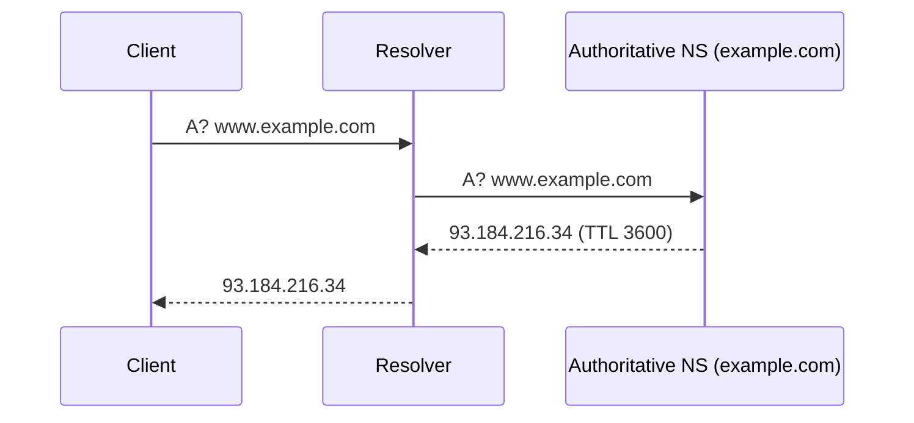
```mermaid
sequenceDiagram
    participant Client
    participant Resolver
    participant Auth as Authoritative NS (example.com)

    Client->>Resolver: A? www.example.com
    Resolver->>Auth: A? www.example.com
    Auth-->>Resolver: 93.184.216.34 (TTL 3600)
    Resolver-->>Client: 93.184.216.34
```

#### Real-Life Use Case: Simple Round-Robin Load Balancing

A small SaaS startup runs three identical web servers behind no load balancer to save cost. They add three A records for `www.startup.com`, one per server IP. Roughly a third of visitors land on each server due to DNS round-robin. When traffic outgrows this simple setup, they replace it with a single A record pointing at a proper load balancer, which then fans out to the same three servers with health checking - a common evolution path many small companies follow.

#### Java/Spring Boot Code: Resolving and Displaying A Records

```java
import org.springframework.web.bind.annotation.*;
import java.net.InetAddress;
import java.util.*;

@RestController
@RequestMapping("/api/dns")
public class ARecordController {

    // GET /api/dns/a-records?host=example.com
    @GetMapping("/a-records")
    public List<String> aRecords(@RequestParam String host) throws Exception {
        InetAddress[] addresses = InetAddress.getAllByName(host);
        List<String> ipv4Only = new ArrayList<>();
        for (InetAddress addr : addresses) {
            if (addr.getAddress().length == 4) { // IPv4 addresses are 4 bytes; IPv6 are 16
                ipv4Only.add(addr.getHostAddress());
            }
        }
        return ipv4Only;
    }
}
```

#### Interview Questions and Answers

**Q1. What does an A record store, and how is it different from a CNAME?**
A: An A record maps a name directly to an IPv4 address. A CNAME maps a name to *another name*, which then must be resolved further (possibly to an A record). A records are a single-hop lookup; CNAMEs add an extra hop.

**Q2. How does round-robin DNS load balancing work with multiple A records, and what's its main weakness?**
A: The authoritative server returns multiple IPs for the same name, often in rotated order, so different clients (or repeated lookups) get different IPs, spreading load. Its main weakness is no health awareness - a downed server keeps receiving traffic until the record is manually updated or a smarter (health-check-based) DNS product is used.

**Q3. Why would you point an A record at a load balancer's IP instead of giving every backend server its own A record?**
A: A load balancer's IP is stable and health-aware; backend servers can be added, removed, or replaced without ever touching DNS, and the load balancer actively avoids sending traffic to unhealthy backends, which plain DNS round-robin cannot do.

### AAAA Record (IPv6 Address)
**Purpose**: Map domain to IPv6 address

```
example.com.  3600  IN  AAAA  2001:db8:85a3::8a2e:370:7334
```

**Modern Setup:**
```
# Dual-stack (both IPv4 and IPv6)
example.com.  IN  A     93.184.216.34
example.com.  IN  AAAA  2001:db8:85a3::8a2e:370:7334

Browser behavior:
1. Checks for AAAA (IPv6) first
2. Falls back to A (IPv4) if unavailable
```

#### AAAA Record: Characteristics

- **128-bit address space**: IPv6 addresses are vastly larger than IPv4's 32-bit space, effectively eliminating address exhaustion concerns.
- **Functionally identical to A records otherwise**: Same TTL semantics, same ability to have multiple values per name, same zone-file structure - only the address format and byte-length differ.
- **Preferred by modern clients when present**: Most operating systems and browsers implement "Happy Eyeballs" (RFC 8305), racing IPv6 and IPv4 connections and preferring whichever succeeds first, with a slight bias toward IPv6.

#### AAAA Record: Components

- **Dual-stack zone configuration**: Publishing both A and AAAA records for the same name so clients can use whichever protocol they support.
- **Happy Eyeballs client logic**: Built into modern OS network stacks and browsers, this determines which of the returned A/AAAA addresses is actually tried first and how quickly it falls back.

#### AAAA Record: Patterns

- **Dual-stack deployment**: Publish both A and AAAA for the same name during an IPv4-to-IPv6 transition period, letting old and new clients both connect.
- **IPv6-only internal networks**: Some large cloud/container networks use IPv6-only internally (e.g., certain Kubernetes cluster networking modes) purely to avoid IPv4 address exhaustion inside the cluster.

#### AAAA Record: Pros / Benefits

- **No address scarcity**: IPv6's address space (2^128) makes running out of addresses a non-issue, unlike IPv4.
- **Simplified routing in some networks**: IPv6 was designed with simpler header processing and native support for features like address auto-configuration.
- **Future-proofing**: As ISPs and mobile carriers increasingly default to IPv6, having AAAA records ensures your service is reachable without a NAT/translation layer.

#### AAAA Record: Cons / Challenges

- **Uneven adoption**: Some networks, corporate proxies, and older infrastructure still don't support IPv6 properly, so relying on AAAA-only is risky for public-facing services.
- **Harder to read/type**: IPv6 addresses are long and hex-based, making manual debugging (typing addresses, reading logs) more error-prone than IPv4.
- **Duplicated operational surface**: Every firewall rule, monitoring check, and security policy usually needs to be maintained for both IPv4 and IPv6 in a dual-stack setup.

#### AAAA Record: Best Practices

- Always run dual-stack (both A and AAAA) for public-facing services rather than IPv6-only, until IPv6 adoption is universal.
- Test connectivity over both protocols in CI/monitoring, since an IPv6 misconfiguration can silently break access for the growing share of IPv6-preferring clients.
- Keep firewall/security group rules in sync across both address families - a very common source of "it works on IPv4 but not IPv6" bugs.

#### AAAA Record: When to Use

- Add an AAAA record alongside your A record for any public-facing service to support IPv6-only or IPv6-preferring clients (increasingly common on mobile networks). Skip it only for purely internal/legacy systems with no IPv6 requirement.

#### Diagram: Dual-Stack Resolution

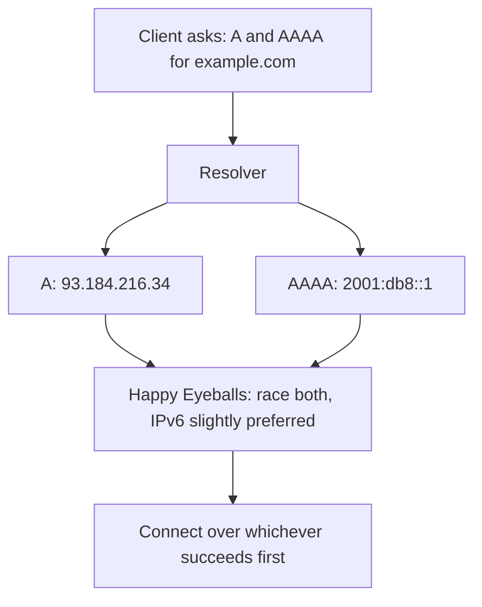
```mermaid
graph TD
    Q["Client asks: A and AAAA for example.com"] --> R[Resolver]
    R --> A4["A: 93.184.216.34"]
    R --> A6["AAAA: 2001:db8::1"]
    A4 --> HE["Happy Eyeballs: race both, IPv6 slightly preferred"]
    A6 --> HE
    HE --> Conn["Connect over whichever succeeds first"]
```

#### Real-Life Use Case: Mobile Carrier IPv6-First Networks

Many mobile carriers (T-Mobile US, Reliance Jio in India) run IPv6-only or IPv6-mostly networks internally, using NAT64/DNS64 to translate for IPv4-only destinations. A website that only publishes an A record still works for these users, but through an extra translation hop; a site that also publishes an AAAA record lets these (often majority-share) mobile users connect natively over IPv6, typically with lower latency and no translation overhead.

#### Java/Spring Boot Code: Detecting IPv6 Support for a Host

```java
import org.springframework.web.bind.annotation.*;
import java.net.InetAddress;
import java.util.*;

@RestController
@RequestMapping("/api/dns")
public class AaaaRecordController {

    // GET /api/dns/ipv6-support?host=example.com
    @GetMapping("/ipv6-support")
    public Map<String, Object> ipv6Support(@RequestParam String host) throws Exception {
        InetAddress[] addresses = InetAddress.getAllByName(host);
        boolean hasIpv6 = Arrays.stream(addresses).anyMatch(a -> a.getAddress().length == 16);
        boolean hasIpv4 = Arrays.stream(addresses).anyMatch(a -> a.getAddress().length == 4);

        Map<String, Object> result = new LinkedHashMap<>();
        result.put("host", host);
        result.put("hasIpv4", hasIpv4);
        result.put("hasIpv6", hasIpv6);
        result.put("dualStack", hasIpv4 && hasIpv6);
        return result;
    }
}
```

#### Interview Questions and Answers

**Q1. What is the practical difference between an A and an AAAA record?**
A: Both map a name to an IP address; A stores a 32-bit IPv4 address, AAAA stores a 128-bit IPv6 address. They're otherwise handled identically by DNS (same TTL rules, can both exist for the same name).

**Q2. What is "dual-stack" and why do most production services use it instead of switching to IPv6-only?**
A: Dual-stack means publishing both A and AAAA records (and supporting both protocols on the server) so both IPv4-only and IPv6-capable clients can connect. Most services stay dual-stack because a meaningful fraction of the internet (older networks, some corporate environments) still can't reach IPv6-only destinations.

**Q3. What is "Happy Eyeballs" and why does it matter for AAAA records?**
A: It's an algorithm (RFC 8305) clients use to race IPv4 and IPv6 connection attempts in parallel (with IPv6 given a small head start), so users get the fastest working connection automatically rather than waiting for a slow/broken protocol to time out before falling back.

### CNAME Record (Canonical Name)
**Purpose**: Alias one domain to another

```
www.example.com.  IN  CNAME  example.com.

Resolution:
www.example.com → (CNAME) → example.com → (A) → 93.184.216.34
```

**Real-World Examples:**
```
# CDN Setup
static.example.com.  IN  CNAME  d111111abcdef8.cloudfront.net.

# Subdomain aliasing
blog.example.com.    IN  CNAME  myblog.wordpress.com.

# Environment-specific
staging.example.com. IN  CNAME  staging-server.aws.example.com.

# Load balancer
www.example.com.     IN  CNAME  lb-12345.us-east-1.elb.amazonaws.com.
```

**CNAME Limitations:**
```
✗ Can't use at root domain (example.com)
  (RFC violation, but some providers allow it)

✗ Can't coexist with other records
  example.com. CNAME  other.com.  ← Invalid
  example.com. MX     mail.com.   ← Conflict!

✓ Perfect for subdomains
  www.example.com. CNAME other.com.  ← Valid
```

#### CNAME Record: Characteristics

- **Alias, not an address**: A CNAME's value is another domain name, not an IP - the resolver must perform an additional lookup to get the final answer.
- **Transparent to the client**: Applications never see the CNAME chain; the stub resolver silently follows it and returns only the final IP address.
- **Exclusive at a name**: Per RFC 1034, if a name has a CNAME record, it cannot have any other record type at that same name (no MX, no TXT, nothing).
- **Chains add latency and fragility**: Each CNAME hop is an extra DNS lookup, and if any hop in the chain breaks (e.g., the target domain is deleted), the whole chain fails.

#### CNAME Record: Components

- **Alias record**: The CNAME entry itself, e.g. `www.example.com. CNAME example.com.`.
- **Canonical target**: The domain name being aliased to, which must itself eventually resolve to an A/AAAA record (or another CNAME).
- **CNAME flattening / ALIAS record**: A provider-specific extension (Cloudflare "CNAME flattening", Route 53 "Alias records") that lets you use CNAME-like aliasing at the zone apex, working around the standard's root-domain restriction.

#### CNAME Record: Patterns

- **CDN fronting**: Point a subdomain at a CDN-provided hostname (`d123.cloudfront.net`) so the CDN can freely change its edge IPs without you ever touching DNS.
- **SaaS/third-party integration**: Point a subdomain at a vendor's hostname (`myblog.wordpress.com`, `pages.github.io`) to use their infrastructure under your own domain.
- **Environment aliasing**: Use CNAMEs like `staging.example.com` to point at environment-specific infrastructure that may change frequently, without needing to know or update raw IPs.

#### CNAME Record: Pros / Benefits

- **Decouples your zone from a third party's changing IPs**: The third party (CDN, SaaS provider) can rotate their infrastructure freely; your CNAME target hostname stays the same.
- **Simplifies multi-environment / multi-vendor setups**: One place (the CNAME target) to update if you switch providers, instead of hunting down every IP reference.

#### CNAME Record: Cons / Challenges

- **Cannot be used at the zone apex** (the bare domain, e.g. `example.com`) under the standard, since the apex must also hold NS/SOA records, which can't coexist with a CNAME.
- **Extra resolution hop**: Every CNAME adds one more DNS lookup before the client gets a usable IP, adding latency, especially with long chains.
- **Dangling CNAME risk (subdomain takeover)**: If the third-party resource the CNAME points to is deleted/deprovisioned but the DNS record is left behind, an attacker can sometimes claim that same resource name and hijack your subdomain.

#### CNAME Record: Best Practices

- Use CNAME flattening / ALIAS records (Cloudflare, Route 53) if you need CDN-style aliasing at the root domain.
- Keep CNAME chains as short as possible (ideally one hop) to minimize latency.
- Audit and remove CNAME records pointing at decommissioned third-party services promptly, to close subdomain-takeover risk.

#### CNAME Record: When to Use

- Use a CNAME whenever a subdomain should point at another *name* whose IP you don't control or that may change (CDN endpoints, SaaS platforms, load balancer DNS names). Use an A/AAAA record instead when you control the IP directly or need a record at the zone apex.

#### Diagram: CNAME Resolution Chain

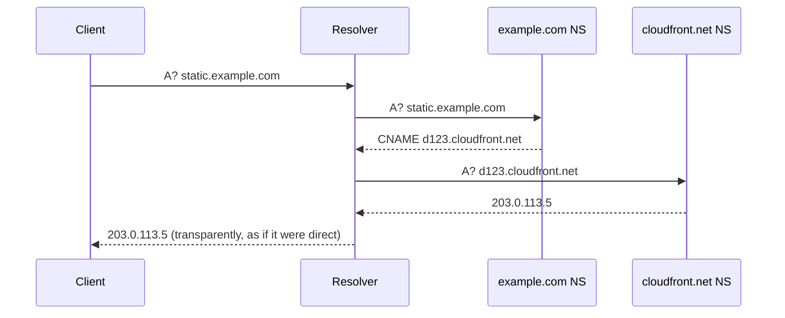
```mermaid
sequenceDiagram
    participant Client
    participant Resolver
    participant AuthYou as example.com NS
    participant AuthCDN as cloudfront.net NS

    Client->>Resolver: A? static.example.com
    Resolver->>AuthYou: A? static.example.com
    AuthYou-->>Resolver: CNAME d123.cloudfront.net
    Resolver->>AuthCDN: A? d123.cloudfront.net
    AuthCDN-->>Resolver: 203.0.113.5
    Resolver-->>Client: 203.0.113.5 (transparently, as if it were direct)
```

#### Real-Life Use Case: Migrating CDN Providers Without Downtime

A media company serving images via `static.example.com` currently CNAMEs to `d123.cloudfront.net` (AWS CloudFront). They decide to switch to Cloudflare for cost reasons. The migration is a single DNS change: update the CNAME target from `d123.cloudfront.net` to `example.static.cloudflare.net`. No application code changes, no client-side updates - once the change propagates (after the old TTL expires), all traffic silently starts flowing through the new CDN.

#### Java/Spring Boot Code: Following a CNAME Chain Manually

```java
import org.springframework.web.bind.annotation.*;
import javax.naming.directory.InitialDirContext;
import javax.naming.directory.Attributes;
import java.util.*;

@RestController
@RequestMapping("/api/dns")
public class CnameChainController {

    // GET /api/dns/cname-chain?host=static.example.com
    @GetMapping("/cname-chain")
    public List<String> cnameChain(@RequestParam String host) throws Exception {
        Hashtable<String, String> env = new Hashtable<>();
        env.put("java.naming.factory.initial", "com.sun.jndi.dns.DnsContextFactory");
        InitialDirContext ctx = new InitialDirContext(env);

        List<String> chain = new ArrayList<>();
        String current = host;
        for (int hop = 0; hop < 10; hop++) { // guard against pathological/looping chains
            chain.add(current);
            Attributes attrs = ctx.getAttributes(current, new String[]{"CNAME"});
            var cname = attrs.get("CNAME");
            if (cname == null) {
                break; // reached a name with no CNAME - it should have an A/AAAA record
            }
            current = String.valueOf(cname.get()).replaceAll("\\.$", "");
        }
        return chain;
    }
}
```

#### Interview Questions and Answers

**Q1. Why can't you put a CNAME record at the root/apex of a domain (e.g., `example.com` itself)?**
A: The zone apex must hold the SOA and NS records that make the zone valid. Since a CNAME can't coexist with any other record type at the same name, putting a CNAME there would conflict with those mandatory records - so the DNS standard forbids it.

**Q2. What is a 'dangling CNAME' and why is it a security risk?**
A: It's a CNAME record still pointing at a third-party resource (an S3 bucket, a SaaS subdomain, a Heroku app) that has since been deleted or deprovisioned. Because DNS still resolves the alias, an attacker who claims that same resource name at the provider can effectively take over your subdomain and serve their own content under your domain.

**Q3. How do CDN/cloud providers let you use alias-style behavior at the zone apex despite the CNAME restriction?**
A: They offer a proprietary record type that behaves like a CNAME to the DNS provider internally but is presented to the outside world as an A/AAAA record (Route 53 'Alias', Cloudflare 'CNAME flattening'), satisfying the protocol rule while still giving you the flexibility of pointing at a changing target.

**Q4. What's the downside of chaining several CNAMEs together (A to B to C to D)?**
A: Every hop is an additional DNS lookup and round trip before the client gets a final address, adding latency; it also adds more points of failure - if any intermediate domain's DNS breaks, the whole chain fails.

### MX Record (Mail Exchange)
**Purpose**: Specify mail servers for domain

```
example.com.  IN  MX  10  mail1.example.com.
example.com.  IN  MX  20  mail2.example.com.
                   ↑ Priority (lower = preferred)

Email to: user@example.com
  ↓
DNS lookup: example.com MX records
  ↓
Try mail1 (priority 10) first
If fails, try mail2 (priority 20)
```

**Google Workspace Example:**
```
example.com.  IN  MX  1   aspmx.l.google.com.
example.com.  IN  MX  5   alt1.aspmx.l.google.com.
example.com.  IN  MX  5   alt2.aspmx.l.google.com.
example.com.  IN  MX  10  alt3.aspmx.l.google.com.
example.com.  IN  MX  10  alt4.aspmx.l.google.com.
```

#### MX Record: Characteristics

- **Priority-ordered**: Each MX record has a numeric preference; lower numbers are tried first, letting a domain define primary and backup mail servers.
- **Points to a hostname, not an IP**: Like CNAME, the value is a domain name, which must itself resolve to an A/AAAA record before mail can actually be delivered.
- **Multiple equal-priority records enable load balancing**: Mail servers with the same priority number are tried in random order, spreading inbound mail load.
- **Zone apex only in practice**: MX records are almost always set on the bare domain (`example.com`), since email addresses are `user@example.com`, not `user@www.example.com`.

#### MX Record: Components

- **Preference/priority value**: The numeric ranking (e.g., 10, 20) that sending mail servers use to pick which target to try first.
- **Mail exchanger hostname**: The target server's name (e.g., `mail1.example.com` or `aspmx.l.google.com`), which must resolve to a real, reachable SMTP server.
- **Fallback chain**: The full set of MX records for a domain, tried in priority order until one accepts the message.

#### MX Record: Patterns

- **Primary/backup mail routing**: A low-priority primary server and one or more higher-priority backups, so mail keeps flowing if the primary is temporarily down.
- **Outsourced email (Google Workspace / Microsoft 365)**: Pointing MX records entirely at a third-party provider's mail infrastructure instead of running your own mail servers.
- **Split mail routing**: Some organizations route mail through a security/filtering gateway first (lowest priority MX), which then forwards to the real mailbox provider.

#### MX Record: Pros / Benefits

- **Built-in failover for email delivery**: Sending servers automatically try the next MX record if the preferred one is unreachable, with no application-level logic required.
- **Decouples your domain's email identity from the actual mail infrastructure**: You can switch mail providers entirely by updating MX records, keeping the same `@example.com` addresses.

#### MX Record: Cons / Challenges

- **Misconfiguration silently breaks all email**: A missing or wrong MX record doesn't produce a visible error to end users; senders' mail servers simply queue, retry, and eventually bounce messages, often taking hours to surface as a problem.
- **No verification that the target is reachable**: DNS doesn't check that an MX target actually runs a working mail server; that's discovered only when mail delivery is attempted (and fails).

#### MX Record: Best Practices

- Always configure at least two MX records (different priorities) for redundancy, unless using a provider that already guarantees this internally.
- Pair MX records with SPF, DKIM, and DMARC TXT records to prevent your domain from being spoofed in phishing emails.
- Monitor mail deliverability (bounce rates, blacklist status) separately from DNS health, since MX records being 'correct' doesn't guarantee mail is actually delivered.

#### MX Record: When to Use

- Configure MX records whenever a domain needs to receive email at `@yourdomain.com` addresses, whether through self-hosted mail servers or a provider like Google Workspace/Microsoft 365.

#### Diagram: MX Priority Fallback

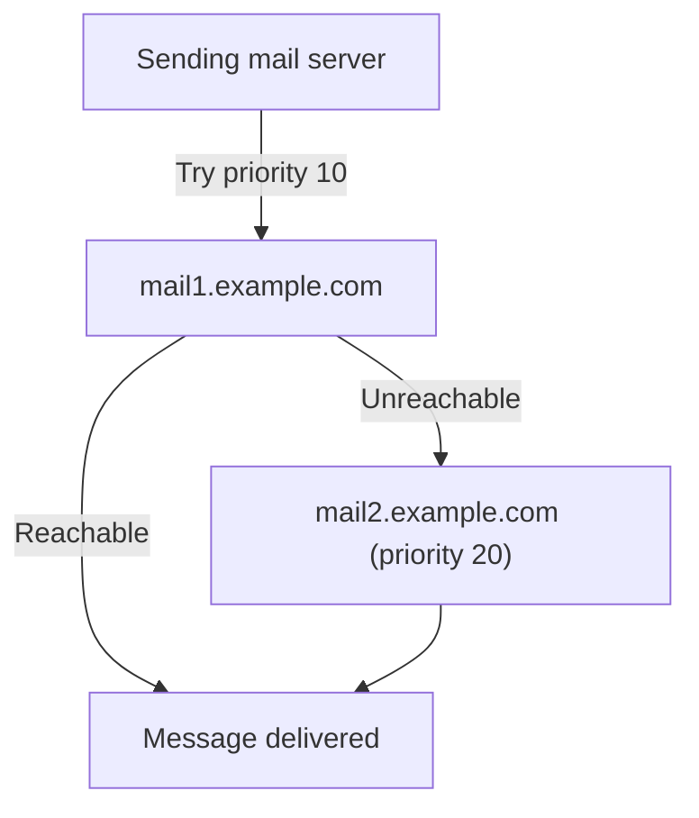
```mermaid
graph TD
    Sender["Sending mail server"] -->|"Try priority 10"| MX1["mail1.example.com"]
    MX1 -->|"Unreachable"| MX2["mail2.example.com (priority 20)"]
    MX1 -->|"Reachable"| Delivered["Message delivered"]
    MX2 --> Delivered
```

#### Real-Life Use Case: Migrating to Google Workspace

A company running its own on-premises mail server decides to migrate to Google Workspace. The entire migration for inbound mail routing is: update the domain's MX records to point at Google's `aspmx.l.google.com` servers (with the documented priorities), then wait for mail senders' caches to pick up the change. No change is needed to email addresses, client configuration (beyond IMAP/SMTP server settings), or the rest of the domain's DNS - MX records isolate 'who handles email' from everything else the domain does.

#### Java/Spring Boot Code: Checking a Domain's Mail Configuration

```java
import org.springframework.web.bind.annotation.*;
import javax.naming.directory.InitialDirContext;
import javax.naming.directory.Attributes;
import java.util.*;

@RestController
@RequestMapping("/api/dns")
public class MxRecordController {

    // GET /api/dns/mx-records?host=example.com
    @GetMapping("/mx-records")
    public List<String> mxRecords(@RequestParam String host) throws Exception {
        Hashtable<String, String> env = new Hashtable<>();
        env.put("java.naming.factory.initial", "com.sun.jndi.dns.DnsContextFactory");
        InitialDirContext ctx = new InitialDirContext(env);

        Attributes attrs = ctx.getAttributes(host, new String[]{"MX"});
        var mx = attrs.get("MX");
        List<String> results = new ArrayList<>();
        if (mx != null) {
            for (int i = 0; i < mx.size(); i++) {
                results.add(String.valueOf(mx.get(i))); // e.g. "10 mail1.example.com."
            }
        }
        // Sort by priority (the leading number) so callers see the preferred server first.
        results.sort(Comparator.comparingInt(s -> Integer.parseInt(s.split(" ")[0])));
        return results;
    }
}
```

#### Interview Questions and Answers

**Q1. What does the priority number in an MX record actually control?**
A: It tells sending mail servers the order to try targets in - lower numbers are preferred. If the lowest-priority server is unreachable, the sender falls back to the next-lowest, and so on, giving built-in redundancy for mail delivery.

**Q2. Why must an MX record's value be a hostname rather than an IP address directly?**
A: The DNS specification requires MX values to be domain names, which are then resolved separately to A/AAAA records. This indirection lets the mail server's IP change without needing to update the MX record itself.

**Q3. A company reports 'some emails are being delayed by hours but eventually arrive.' What MX-related cause would you investigate?**
A: Check whether the primary (lowest-priority) MX target is intermittently unreachable, forcing senders to time out and retry the secondary server - this produces exactly this delayed-but-eventually-delivered pattern, since SMTP retries are typically spaced out over hours.

**Q4. Why do you need SPF/DKIM/DMARC in addition to MX records?**
A: MX only controls where *inbound* mail for your domain goes. SPF/DKIM/DMARC (TXT records) control who is allowed to send mail claiming to be *from* your domain, preventing spoofing/phishing - they solve a completely different problem and are both necessary for a trustworthy mail setup.

### TXT Record (Text Information)
**Purpose**: Store arbitrary text, verification, security policies

**SPF (Sender Policy Framework) - Prevent Email Spoofing:**
```
example.com.  IN  TXT  "v=spf1 include:_spf.google.com ~all"

Meaning:
  v=spf1          → Version 1
  include:...     → Allow Google's mail servers
  ~all            → Soft fail others (probably spam)
```

**DKIM (DomainKeys Identified Mail) - Email Signature:**
```
default._domainkey.example.com.  IN  TXT  "v=DKIM1; k=rsa; p=MIGfMA0GCS..."
                                             ↑ Public key for verification
```

**DMARC (Domain-based Message Authentication):**
```
_dmarc.example.com.  IN  TXT  "v=DMARC1; p=reject; rua=mailto:dmarc@example.com"

Meaning:
  p=reject        → Reject emails that fail SPF/DKIM
  rua=mailto:...  → Send reports to this email
```

**Domain Verification:**
```
# Google Search Console
example.com.  IN  TXT  "google-site-verification=abc123..."

# SSL Certificate Validation
_acme-challenge.example.com.  IN  TXT  "validation-token-here"
```

#### TXT Record: Characteristics

- **Free-form value**: Unlike every other record type, TXT has no structured meaning of its own - the format (SPF syntax, DKIM key, arbitrary verification token) is defined entirely by convention between the consumer and the string content.
- **Multi-purpose by design**: The same record type is reused for email anti-spoofing (SPF/DKIM/DMARC), domain ownership verification, and even service configuration, distinguished only by a naming convention (`_dmarc.`, `_domainkey.`, plain root, etc.).
- **Multiple TXT records can coexist**: A single name can have several TXT records simultaneously (e.g., SPF and a site-verification token both at the root), unlike CNAME's exclusivity rule.
- **Size-limited per string**: Each TXT string is capped at 255 bytes by the DNS wire format, though multiple strings can be concatenated (and most resolvers handle this automatically).

#### TXT Record: Components

- **SPF policy string**: Declares which mail servers are authorized to send mail as your domain.
- **DKIM public key**: Published under a selector subdomain (`default._domainkey`), used by receiving mail servers to verify a cryptographic signature added to outgoing mail.
- **DMARC policy string**: Declares what receivers should do (`none`, `quarantine`, `reject`) when SPF/DKIM checks fail, plus where to send aggregate reports.
- **Verification tokens**: Arbitrary strings issued by third parties (Google, AWS, Let's Encrypt) purely to prove you control the DNS zone.

#### TXT Record: Patterns

- **Domain ownership proof (ACME/site verification)**: A provider issues a random token; you publish it as a TXT record; the provider re-queries DNS to confirm you have write access to the zone, proving ownership without any visible change to your website.
- **Layered email authentication (SPF + DKIM + DMARC)**: The three mechanisms are combined - SPF checks sending IP, DKIM checks a cryptographic signature, DMARC ties them together and defines enforcement policy - because no single one is sufficient alone.
- **Machine-readable service config**: Some tools (e.g., certain service discovery or workspace verification systems) use TXT records purely as a configuration channel outside of any web/email traffic.

#### TXT Record: Pros / Benefits

- **No visible/production impact**: Verification and email-policy TXT records don't affect your website or any user-facing traffic, so they're low-risk to add.
- **Strong anti-spoofing when fully configured**: SPF + DKIM + DMARC together make it dramatically harder for attackers to send convincing phishing emails that appear to come from your domain.
- **Universally supported, out-of-band channel**: Because every DNS provider supports TXT, it has become the de facto standard for 'prove you own this domain' flows across the industry.

#### TXT Record: Cons / Challenges

- **Easy to get SPF/DMARC syntax wrong**: A single malformed SPF string can cause legitimate mail to fail delivery (too strict) or fail to stop spoofing (too permissive) - the syntax is unforgiving and not validated until mail actually flows.
- **SPF has a lookup limit**: SPF restricts to 10 DNS lookups per check; deeply nested `include:` chains (common with many marketing/email tools) can silently exceed this and break validation.
- **No structure enforcement**: Because TXT is free-form, there's nothing stopping accumulation of stale, forgotten, or duplicate verification records over the life of a domain.

#### TXT Record: Best Practices

- Set DMARC policy incrementally: start at `p=none` (monitor only) and move to `p=quarantine` then `p=reject` once you've confirmed legitimate mail passes SPF/DKIM.
- Periodically audit and remove stale verification TXT records for services you no longer use.
- Keep SPF `include:` chains shallow to stay under the 10-lookup limit; use tools that report the current lookup count.

#### TXT Record: When to Use

- Use TXT records for domain ownership verification (required by nearly every cloud/SaaS provider), and for email authentication (SPF/DKIM/DMARC) on any domain that sends or receives email, to prevent spoofing.

#### Diagram: SPF/DKIM/DMARC Working Together

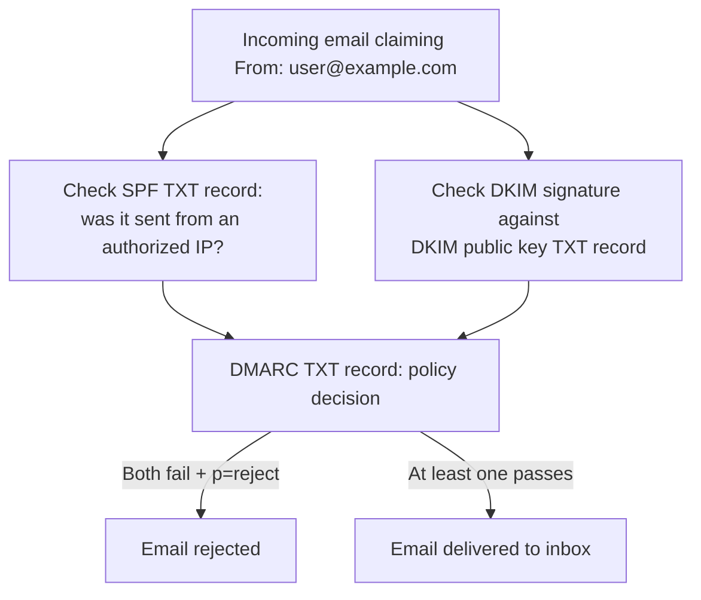
```mermaid
graph TD
    Mail["Incoming email claiming From: user@example.com"] --> SPF["Check SPF TXT record:<br/>was it sent from an authorized IP?"]
    Mail --> DKIM["Check DKIM signature against<br/>DKIM public key TXT record"]
    SPF --> DMARC["DMARC TXT record: policy decision"]
    DKIM --> DMARC
    DMARC -->|"Both fail + p=reject"| Reject["Email rejected"]
    DMARC -->|"At least one passes"| Deliver["Email delivered to inbox"]
```

#### Real-Life Use Case: Stopping a Phishing Campaign Impersonating Your Company

A company notices customers receiving phishing emails that appear to come from `billing@company.com`, asking for payment details. Investigation shows the company had never configured DMARC, so receiving mail servers had no policy to enforce even though SPF was misconfigured to allow too many senders. The fix: tighten the SPF record to list only actual authorized senders, add DKIM signing, and publish a DMARC TXT record with `p=reject`. After propagation, mail servers worldwide start rejecting spoofed messages claiming to be from the domain before they ever reach a victim's inbox.

#### Java/Spring Boot Code: Checking SPF and DMARC Configuration

```java
import org.springframework.web.bind.annotation.*;
import javax.naming.directory.InitialDirContext;
import javax.naming.directory.Attributes;
import java.util.*;

@RestController
@RequestMapping("/api/dns")
public class TxtRecordController {

    // GET /api/dns/email-security?host=example.com
    @GetMapping("/email-security")
    public Map<String, Object> emailSecurity(@RequestParam String host) throws Exception {
        Hashtable<String, String> env = new Hashtable<>();
        env.put("java.naming.factory.initial", "com.sun.jndi.dns.DnsContextFactory");
        InitialDirContext ctx = new InitialDirContext(env);

        Map<String, Object> result = new LinkedHashMap<>();
        result.put("hasSpf", findTxtStartingWith(ctx, host, "v=spf1"));
        result.put("hasDmarc", findTxtStartingWith(ctx, "_dmarc." + host, "v=DMARC1"));
        return result;
    }

    private boolean findTxtStartingWith(InitialDirContext ctx, String name, String prefix) {
        try {
            Attributes attrs = ctx.getAttributes(name, new String[]{"TXT"});
            var txt = attrs.get("TXT");
            if (txt == null) return false;
            for (int i = 0; i < txt.size(); i++) {
                if (String.valueOf(txt.get(i)).replace("\"", "").startsWith(prefix)) return true;
            }
        } catch (Exception ignored) {
            // No TXT records at all for this name - treat as "not configured".
        }
        return false;
    }
}
```

#### Interview Questions and Answers

**Q1. Why is TXT used for so many unrelated purposes (email policy, domain verification) instead of dedicated record types?**
A: TXT stores arbitrary text with no protocol-level structure, so it was the natural, already-standardized place to add new conventions (SPF, DKIM, DMARC, ownership tokens) without needing to update the DNS protocol itself or get every resolver upgraded to understand a brand-new record type.

**Q2. Explain how SPF, DKIM, and DMARC work together.**
A: SPF authorizes which sending IPs/servers may send mail for your domain. DKIM adds a cryptographic signature to outgoing mail so receivers can verify it wasn't altered and came from a holder of your private key. DMARC ties the two together, telling receivers what policy to apply (monitor, quarantine, reject) when a message fails SPF and/or DKIM, and where to send reports.

**Q3. What is the SPF 10-lookup limit, and why does it matter operationally?**
A: SPF validation must not exceed 10 DNS lookups (counting nested `include:` mechanisms). Domains using many third-party mail tools (each adding an `include:`) can silently exceed this limit, causing SPF to return a 'permerror' and effectively fail - a subtle, hard-to-notice misconfiguration.

**Q4. How does a cloud provider use a TXT record to verify you own a domain, without ever touching your website?**
A: The provider generates a unique token and asks you to publish it as a TXT record on your domain. Since only someone with DNS write access to the zone could do that, the provider re-queries DNS for that exact token; a match proves ownership, entirely out-of-band from your web/email traffic.

### NS Record (Name Server)
**Purpose**: Delegate domain to specific DNS servers

```
example.com.  IN  NS  ns1.nameserver.com.
example.com.  IN  NS  ns2.nameserver.com.

Meaning: "Ask these servers for example.com records"
```

**Subdomain Delegation:**
```
# Main domain managed by Cloudflare
example.com.      IN  NS  ns1.cloudflare.com.

# Blog subdomain managed by WordPress
blog.example.com. IN  NS  ns1.wordpress.com.
                           ns2.wordpress.com.
```

#### NS Record: Characteristics

- **Defines authority, not data**: NS records don't hold application data themselves - they tell resolvers *which servers* to ask for the actual records of a zone.
- **Exists both in the parent and the child zone**: The `.com` TLD holds NS 'glue' records pointing at `example.com`'s name servers, and `example.com`'s own zone also republishes the same NS records - the two are expected to match (a mismatch is a common misconfiguration).
- **Enables clean administrative delegation**: Different teams, business units, or even companies can independently manage different subdomains of the same parent domain.
- **Requires glue records for circular dependencies**: If a zone's own NS record is a subdomain of itself (e.g., `example.com`'s name server is `ns1.example.com`), the parent zone must also publish that name server's IP directly ('glue'), since you can't resolve `ns1.example.com`'s IP without already knowing it.

#### NS Record: Components

- **Delegation record (in parent zone)**: Held by the parent (e.g., the `.com` registry) pointing to the child zone's authoritative servers.
- **Zone's own NS records**: Republished inside the child zone itself, which should exactly match what the parent delegates to.
- **Glue record**: An A/AAAA record for a name server hosted within the zone it serves, published by the parent to break the circular dependency.

#### NS Record: Patterns

- **Subdomain delegation to a different provider/team**: E.g., delegating `app.example.com` to a product team's own DNS provider, letting them manage their records fully independently of the main company zone.
- **Multi-provider redundancy**: Some organizations run NS records across two independent DNS providers (e.g., Route 53 and Cloudflare simultaneously) so an outage at one provider doesn't take down resolution entirely.
- **Registrar-to-DNS-provider handoff**: The most common real-world use - your domain registrar's NS records point at your chosen DNS provider's name servers (Cloudflare, Route 53), delegating all record management to that provider.

#### NS Record: Pros / Benefits

- **Decentralized administration**: Ownership of different parts of a domain's namespace can be split across teams or companies without any of them needing access to each other's systems.
- **Enables switching DNS providers**: Because delegation happens via NS records, moving a domain's DNS management from one provider to another is a well-defined, standard operation.
- **Foundation of DNS's scalability**: Delegation via NS records is precisely what lets the root and TLD servers stay small and stable despite the internet having hundreds of millions of domains.

#### NS Record: Cons / Challenges

- **Mismatched NS records cause confusing partial outages**: If the parent zone's delegation and the child zone's self-published NS records disagree, some resolvers may get inconsistent answers depending on caching state.
- **A wrong or unreachable NS record breaks the entire subtree below it**: Since NS records are 'the entry point' to a zone, an error here doesn't just affect one record type - it can make the whole domain (and every subdomain under it) unresolvable.
- **Glue record management is easy to get wrong**: Forgetting to update glue records when changing a name server's IP can cause resolution failures that are hard to diagnose because they only affect resolvers with a stale cache.

#### NS Record: Best Practices

- Always use at least two, ideally geographically and topologically diverse, name servers for any zone.
- Verify parent-zone delegation matches your zone's own NS records after any DNS provider migration (a common source of 'my new DNS records aren't showing up' tickets).
- Keep NS record TTLs relatively high and stable (they change far less often than A/CNAME records), since NS changes are inherently slow to propagate and disruptive if done incorrectly.

#### NS Record: When to Use

- Use NS records whenever you need to delegate authority for a domain or subdomain to a specific set of name servers - either delegating your entire domain to a DNS provider, or delegating a specific subdomain to a different team/vendor.

#### Diagram: Delegation via NS Records

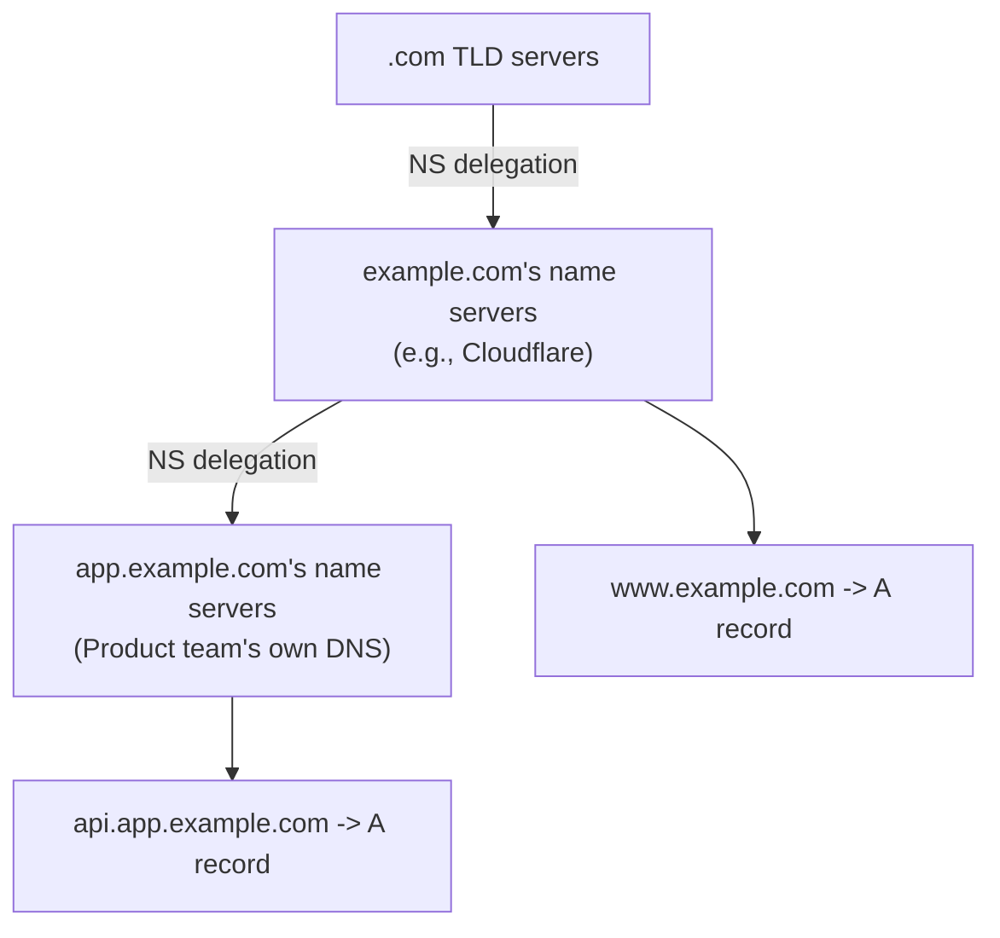
```mermaid
graph TD
    TLD[".com TLD servers"] -->|"NS delegation"| MainNS["example.com's name servers<br/>(e.g., Cloudflare)"]
    MainNS -->|"NS delegation"| AppNS["app.example.com's name servers<br/>(Product team's own DNS)"]
    MainNS --> WWWRec["www.example.com -> A record"]
    AppNS --> ApiRec["api.app.example.com -> A record"]
```

#### Real-Life Use Case: Letting a Product Team Self-Serve DNS

A large company's central IT team manages `company.com`, but a fast-moving product team needs to add and change DNS records for `product.company.com` several times a week for feature flags and A/B test infrastructure, which would otherwise bottleneck on IT ticket queues. Central IT delegates `product.company.com` to the product team's own DNS provider account via an NS record. The product team can now add/change records instantly through their own tooling, while central IT retains full control of the rest of the domain.

#### Java/Spring Boot Code: Checking a Domain's Name Servers

```java
import org.springframework.web.bind.annotation.*;
import javax.naming.directory.InitialDirContext;
import javax.naming.directory.Attributes;
import java.util.*;

@RestController
@RequestMapping("/api/dns")
public class NsRecordController {

    // GET /api/dns/name-servers?host=example.com
    @GetMapping("/name-servers")
    public List<String> nameServers(@RequestParam String host) throws Exception {
        Hashtable<String, String> env = new Hashtable<>();
        env.put("java.naming.factory.initial", "com.sun.jndi.dns.DnsContextFactory");
        InitialDirContext ctx = new InitialDirContext(env);

        Attributes attrs = ctx.getAttributes(host, new String[]{"NS"});
        var ns = attrs.get("NS");
        List<String> servers = new ArrayList<>();
        if (ns != null) {
            for (int i = 0; i < ns.size(); i++) {
                servers.add(String.valueOf(ns.get(i)));
            }
        }
        return servers;
    }
}
```

#### Interview Questions and Answers

**Q1. What is the difference between an NS record and an A record?**
A: An NS record identifies which servers are *authoritative for a zone* (who to ask for any record in that zone); it doesn't hold application data. An A record is the actual data - a name-to-IPv4-address mapping - that lives inside a zone the NS records point to.

**Q2. What is a glue record and when is it required?**
A: A glue record is an A/AAAA record for a name server that is itself a subdomain of the zone it serves (e.g., `ns1.example.com` serving `example.com`). It's published in the *parent* zone to break the circular dependency: you can't resolve `ns1.example.com`'s IP through normal delegation because that would require already knowing where to ask, which is exactly what you're trying to find out.

**Q3. How would you delegate a subdomain to a different team without giving them access to the parent domain's DNS account?**
A: Add NS records in the parent zone for the subdomain, pointing at the child team's chosen name servers. Once that delegation is in place, the child team manages all records under that subdomain independently, through their own DNS provider account, with no access needed to the parent zone.

**Q4. A domain's DNS provider was migrated last week, but changes made in the new provider's dashboard don't seem to take effect. What would you check first?**
A: Check whether the domain's NS records at the registrar actually point to the new provider's name servers - if the registrar-level delegation wasn't updated, the world is still asking the old provider's servers, so changes in the new provider's dashboard have no effect until that delegation is fixed.

### Other Important Records: SRV and CAA

**SRV Record (Service Location):**
```
_service._proto.name.  TTL  IN  SRV  priority weight port target

Example (Minecraft server):
_minecraft._tcp.example.com.  IN  SRV  0 5 25565  mc.example.com.
                                       ↑ ↑   ↑      ↑
                                     Pri Wt Port  Host
```

**CAA Record (Certificate Authority Authorization):**
```
example.com.  IN  CAA  0 issue "letsencrypt.org"

Meaning: "Only Let's Encrypt can issue SSL certs for this domain"
```

#### SRV and CAA: Characteristics

- **SRV is structured for service discovery**: Unlike A/CNAME, its name encodes the service and protocol (`_service._proto.name`), and its value carries priority, weight, port, and target host all in one record.
- **CAA is a security policy record, not a routing record**: It doesn't affect where traffic goes at all; it only restricts which certificate authorities are permitted to issue TLS certificates for the domain.
- **Both are less universally deployed than A/MX/TXT**: SRV is mostly used by specific protocols (SIP, XMPP, Minecraft, Microsoft services); CAA adoption has grown steadily since CAA-checking became mandatory for CAs in 2017.

#### SRV and CAA: Components

- **SRV fields**: priority (lower preferred), weight (load-share among equal priorities), port, and target hostname.
- **CAA tag**: `issue` (allowed to issue standard certs), `issuewild` (allowed to issue wildcard certs), or `iodef` (where to report policy violations).
- **CAA property value**: The authorized CA's domain (e.g., `letsencrypt.org`, `digicert.com`), or an empty value (`;`) to forbid issuance entirely.

#### SRV and CAA: Patterns

- **Service discovery via SRV**: Protocols like SIP (VoIP), XMPP (chat), and Microsoft Exchange/Teams autodiscovery use SRV records so clients can find the right server and port automatically, without hardcoded configuration.
- **CA pinning via CAA**: Restricting issuance to a single CA (e.g., only Let's Encrypt or only DigiCert) reduces the blast radius if any other CA is compromised or socially engineered.

#### SRV and CAA: Pros / Benefits

- **SRV enables zero-configuration service discovery**: Clients (VoIP phones, chat clients) can locate the right server/port for a domain automatically, simplifying deployment.
- **CAA closes a real certificate-issuance security gap**: Without it, any of the hundreds of publicly trusted CAs worldwide could be tricked into issuing a valid cert for your domain; CAA makes that a protocol violation that compliant CAs must refuse to do.

#### SRV and CAA: Cons / Challenges

- **SRV isn't used by the most common protocols**: HTTP/HTTPS notably ignore SRV records entirely (for historical reasons), so it's only relevant for the specific protocols that support it.
- **CAA gives a false sense of security if misconfigured**: An overly broad CAA policy (or none at all) provides no protection; and CAA doesn't stop DNS-based attacks (like BGP hijacking) that could redirect ACME validation traffic itself.

#### SRV and CAA: Best Practices

- Add a CAA record for every production domain, restricted to the actual CA(s) you use - this is a low-effort, meaningful security improvement.
- Use SRV records for any protocol that supports them (SIP, XMPP, Minecraft, Microsoft 365 autodiscover) instead of hardcoding hostnames/ports in client configuration.
- Include an `iodef` CAA property so you're notified if a non-authorized CA attempts (and is refused) issuance for your domain.

#### SRV and CAA: When to Use

- Use CAA on essentially every domain that serves HTTPS traffic - it's cheap insurance against certificate mis-issuance.
- Use SRV specifically when integrating with a protocol that supports it (VoIP/SIP systems, XMPP servers, Microsoft services, some game servers); it's not applicable to plain HTTP/HTTPS routing.

#### Diagram: SRV Service Discovery

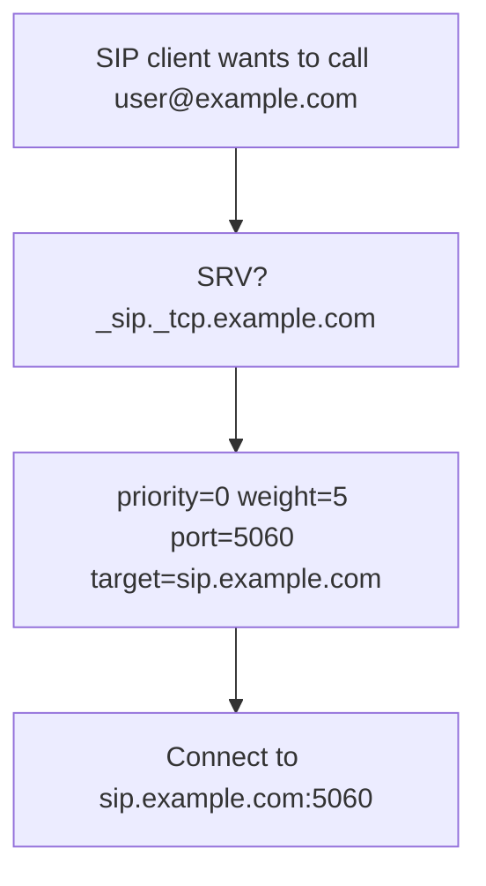
```mermaid
graph TD
    Client["SIP client wants to call user@example.com"] --> Query["SRV? _sip._tcp.example.com"]
    Query --> Answer["priority=0 weight=5 port=5060 target=sip.example.com"]
    Answer --> Connect["Connect to sip.example.com:5060"]
```

#### Real-Life Use Case: Locking Down Certificate Issuance After a Near-Miss

A security audit at a mid-size company reveals that, in theory, any of dozens of publicly trusted certificate authorities could issue a valid HTTPS certificate for their domain, since no CAA record existed. Although no actual mis-issuance occurred, the team adds a CAA record restricting issuance to only the CA they actually use (`digicert.com`) plus an `iodef` reporting address. From that point on, if any other CA is ever asked (accidentally or maliciously) to issue a certificate for the domain, it's obligated to refuse and the company gets notified of the attempt.

#### Java/Spring Boot Code: Checking a Domain's CAA Policy

```java
import org.springframework.web.bind.annotation.*;
import javax.naming.directory.InitialDirContext;
import javax.naming.directory.Attributes;
import java.util.*;

@RestController
@RequestMapping("/api/dns")
public class CaaRecordController {

    // GET /api/dns/caa-policy?host=example.com
    @GetMapping("/caa-policy")
    public Map<String, Object> caaPolicy(@RequestParam String host) throws Exception {
        Hashtable<String, String> env = new Hashtable<>();
        env.put("java.naming.factory.initial", "com.sun.jndi.dns.DnsContextFactory");
        InitialDirContext ctx = new InitialDirContext(env);

        Attributes attrs = ctx.getAttributes(host, new String[]{"CAA"});
        var caa = attrs.get("CAA");
        List<String> policies = new ArrayList<>();
        if (caa != null) {
            for (int i = 0; i < caa.size(); i++) {
                policies.add(String.valueOf(caa.get(i))); // e.g. "0 issue \"letsencrypt.org\""
            }
        }

        Map<String, Object> result = new LinkedHashMap<>();
        result.put("host", host);
        result.put("caaPolicies", policies);
        result.put("restricted", !policies.isEmpty());
        return result;
    }
}
```

#### Interview Questions and Answers

**Q1. Why does HTTP/HTTPS not use SRV records the way SIP or XMPP does?**
A: When HTTP was standardized, the convention of using port 80/443 by default and specifying a host directly was already entrenched; adding SRV support later would have broken compatibility with the enormous existing installed base, so browsers simply never adopted it, unlike newer protocols that were designed with SRV in mind from the start.

**Q2. What real-world attack does a CAA record protect against?**
A: It protects against a rogue, compromised, or socially-engineered certificate authority issuing a valid TLS certificate for your domain without your knowledge, which could then be used for man-in-the-middle attacks. CAA makes it a policy violation for any CA not listed in the record to issue a cert for that domain.

**Q3. What do the priority and weight fields in an SRV record control, respectively?**
A: Priority determines the order clients should try targets (lower first, like MX); weight is used to load-balance between records that share the same priority, with higher-weight targets receiving proportionally more of the client requests.

### DNS Caching: The Speed Secret

**TTL (Time To Live):**
```
example.com.  3600  IN  A  93.184.216.34
              ↑ Cache for 3600 seconds (1 hour)

TTL Strategy:
Static content:    86400  (24 hours)
Dynamic content:   300    (5 minutes)
Before migration:  60     (1 minute) ← Quick updates
After migration:   3600   (1 hour)   ← Stable
```

**Cache Hierarchy:**
```
┌─────────────────┐  TTL: Varies
│ Browser Cache   │  (respects TTL)
└────────┬────────┘
         ↓
┌─────────────────┐  TTL: Varies
│ OS Cache        │  (respects TTL)
└────────┬────────┘
         ↓
┌─────────────────┐  TTL: Varies
│ ISP Resolver    │  (might ignore TTL)
└────────┬────────┘
         ↓
┌─────────────────┐  Authoritative
│ DNS Server      │  (source of truth)
└─────────────────┘
```

#### DNS Caching: Characteristics

- **TTL-driven expiry, not push-based invalidation**: DNS has no mechanism to tell caches "this record just changed" - every cache simply keeps its answer until the TTL it was given expires, then re-queries.
- **Independent caches at every layer**: The browser, OS resolver, router, and ISP/public resolver each maintain their own cache with their own expiry clock, so the same record can be simultaneously fresh in one cache and stale in another.
- **Some resolvers don't fully respect TTL**: A minority of ISP resolvers or misbehaving middleboxes cache answers longer than the TTL specifies, which is one reason DNS changes can sometimes take longer to propagate than expected.
- **Negative caching uses a separate TTL**: 'This name doesn't exist' (NXDOMAIN) answers are cached according to the zone's SOA minimum/negative-cache TTL, which is independent of individual record TTLs.

#### DNS Caching: Components

- **TTL field**: A per-record value (in seconds) set by the zone administrator, defining the maximum time any cache may reuse that answer.
- **SOA minimum TTL**: The negative-caching duration, defined once per zone in its SOA record, governing how long NXDOMAIN responses are cached.
- **Cache stores at each layer**: Browser DNS cache (in-process, short-lived), OS resolver cache (e.g., `systemd-resolved`, `dscacheutil` on macOS), and recursive resolver cache (the biggest, shared across all of that resolver's users).

#### DNS Caching: Patterns

- **TTL lowering before planned changes**: Proactively drop TTL to 60s well before a migration so that when the actual record change happens, caches worldwide pick it up almost immediately, then raise TTL back afterward for efficiency.
- **Long TTL for stable infrastructure**: Records that rarely change (NS records, MX records for a stable mail provider) use high TTLs (24h+) to minimize load on authoritative servers and speed up average resolution time for everyone.
- **Short TTL for dynamic/failover-sensitive records**: Records behind active failover or frequent IP rotation use low TTLs (60-300s) to keep the window of 'wrong answer cached' as short as possible.

#### DNS Caching: Pros / Benefits

- **Enormous performance win**: The overwhelming majority of DNS queries are served from cache, turning what would be a multi-hop global lookup into a local, sub-millisecond operation.
- **Reduces load on authoritative infrastructure**: Without caching, root/TLD/authoritative servers would need to handle every single query from every client on earth directly, which is not feasible at any reasonable cost.
- **Tunable per record**: Because TTL is set per-record, operators can independently trade off freshness vs. performance for each part of their DNS footprint.

#### DNS Caching: Cons / Challenges

- **Propagation delay is inherent, not a bug**: Because there's no push-invalidation, every DNS change is subject to a 'worst case' delay of up to the old TTL before all caches worldwide have the new value.
- **Debugging is confusing across caching layers**: 'It works from my phone but not my laptop' is frequently just two different caches with the same record at different freshness, which can mislead engineers into thinking there's a server-side bug.
- **Some resolvers ignore/override TTL**: A small number of resolvers cache longer than instructed (for load-reduction reasons), making 'the TTL says 300s so it should be updated in 5 minutes' not a 100% guarantee.

#### DNS Caching: Best Practices

- Lower TTL to 60-300s at least 24 hours before any planned migration or IP change, then raise it back afterward.
- Use long TTLs (3600s or more) for stable records to minimize unnecessary load and maximize the cache-hit speed benefit for users.
- When debugging a 'DNS still shows old value' issue, always check `dig` against the authoritative server directly (bypassing caches) first, to confirm whether the record itself or just propagation is the problem.

#### DNS Caching: When to Use

- Caching is always active in DNS - the real decision is choosing the right TTL per record: short (dynamic/soon-to-change records, failover targets) vs. long (stable infrastructure, NS/MX records) based on how much propagation delay you can tolerate.

#### Diagram: TTL Expiry Across Cache Layers

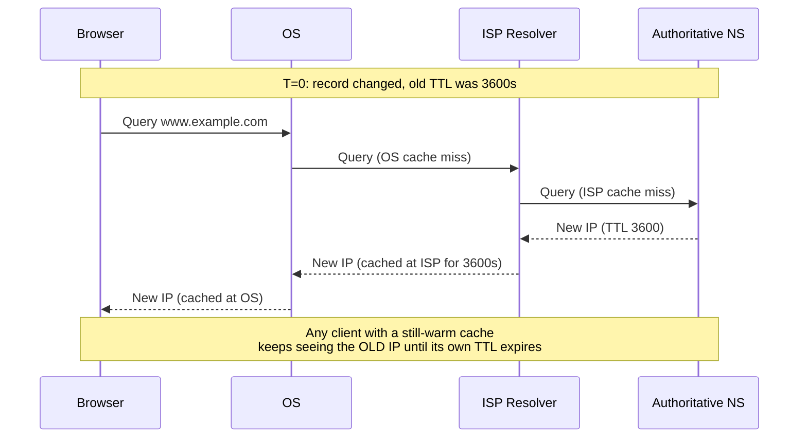
```mermaid
sequenceDiagram
    participant Browser
    participant OS
    participant ISP as ISP Resolver
    participant Auth as Authoritative NS

    Note over Browser,Auth: T=0: record changed, old TTL was 3600s
    Browser->>OS: Query www.example.com
    OS->>ISP: Query (OS cache miss)
    ISP->>Auth: Query (ISP cache miss)
    Auth-->>ISP: New IP (TTL 3600)
    ISP-->>OS: New IP (cached at ISP for 3600s)
    OS-->>Browser: New IP (cached at OS)
    Note over Browser,Auth: Any client with a still-warm cache<br/>keeps seeing the OLD IP until its own TTL expires
```

#### Real-Life Use Case: A Botched Migration Without TTL Planning

A team migrates their API server to a new IP without first lowering the record's TTL (left at the default 86400s / 24 hours). After the cutover, roughly half of users experience errors for up to a full day, because their ISP resolvers had cached the old IP and won't re-query until their TTL expires - even though the DNS record itself was updated correctly the moment the migration happened. The postmortem action item: always lower TTL to 300s at least a day in advance of any planned IP change, confirm the low TTL has propagated, make the change, verify, then raise TTL back to normal.

#### Java/Spring Boot Code: Checking a Record's TTL

```java
import org.springframework.web.bind.annotation.*;
import javax.naming.directory.InitialDirContext;
import javax.naming.directory.Attributes;
import javax.naming.directory.DirContext;
import java.util.*;

@RestController
@RequestMapping("/api/dns")
public class DnsTtlController {

    // GET /api/dns/ttl?host=example.com&type=A
    // Note: the plain JNDI DNS provider doesn't expose TTL directly, so this
    // demonstrates the concept via two lookups timed apart; production code
    // should use a library like dnsjava that exposes TTL natively.
    @GetMapping("/ttl")
    public Map<String, Object> checkTtl(@RequestParam String host,
                                         @RequestParam(defaultValue = "A") String type) throws Exception {
        Hashtable<String, String> env = new Hashtable<>();
        env.put("java.naming.factory.initial", "com.sun.jndi.dns.DnsContextFactory");
        DirContext ctx = new InitialDirContext(env);

        Attributes attrs = ctx.getAttributes(host, new String[]{type});
        var attr = attrs.get(type);

        Map<String, Object> result = new LinkedHashMap<>();
        result.put("host", host);
        result.put("type", type);
        result.put("value", attr != null ? String.valueOf(attr.get()) : null);
        result.put("note", "Use dnsjava's Record.getTTL() for exact TTL values in production");
        return result;
    }
}
```

#### Interview Questions and Answers

**Q1. What does a record's TTL actually control, precisely?**
A: The maximum number of seconds any cache (browser, OS, resolver) is allowed to reuse that answer before it must re-query the authoritative server. It does not guarantee the cache will hold the record for exactly that long - only that it won't hold it *longer* (in a well-behaved resolver).

**Q2. Why can't DNS just push updates to caches instead of relying on TTL expiry?**
A: DNS was designed as a stateless, connectionless (mostly UDP) protocol where authoritative servers have no persistent connection to, or even knowledge of, every cache that has ever queried them - there's no channel to push an invalidation through. TTL-based expiry avoids needing that infrastructure entirely, at the cost of eventual (not immediate) consistency.

**Q3. You're about to migrate a service to a new IP. What DNS step should you take first, and why?**
A: Lower the record's TTL well in advance (e.g., a day before) so that by the time you actually make the IP change, all caches worldwide are already re-querying frequently, minimizing how long any client sees the old IP after cutover.

**Q4. What is negative caching, and why does it matter for propagation testing?**
A: It's the caching of "this name doesn't exist" (NXDOMAIN) responses, governed by the zone's SOA negative-cache TTL. If you test a *new* record before it exists and get NXDOMAIN cached, you may keep seeing "not found" for that negative TTL even after you add the record, confusing propagation testing.

### GeoDNS: Multi-Region Routing

```
GeoDNS Routing:

User in US → DNS returns: 52.1.1.1  (US East server)
User in EU → DNS returns: 18.1.1.1  (EU West server)
User in Asia → DNS returns: 13.1.1.1 (Asia Pacific server)

Configuration (Route 53 example):
www.example.com
  ├─ US-EAST-1:  52.1.1.1   (for North America)
  ├─ EU-WEST-1:  18.1.1.1   (for Europe)
  └─ AP-SOUTHEAST-1: 13.1.1.1 (for Asia)
```

GeoDNS (also called latency-based or geolocation-based routing) answers the same query differently depending on where the asker is located, letting a single domain name transparently route users to their nearest (or otherwise best) region.

#### GeoDNS: Characteristics

- **Answer varies by requester location**: The same name (`www.example.com`) resolves to different IPs for different resolvers, based on the resolver's (usually the ISP's) geographic or network location.
- **Uses the *resolver's* location, not the end client's**: Because clients query through a recursive resolver, GeoDNS typically routes based on where that resolver is, which is usually close enough to the actual client to be a good proxy (though not perfect, especially with resolvers like 8.8.8.8 that aren't geographically pinned to the user).
- **Two flavors**: pure geolocation (route by country/continent) and latency-based routing (route by measured network latency from the DNS provider's monitored regions), which is more accurate but requires the provider to maintain latency measurements.

#### GeoDNS: Components

- **Geo/latency database**: The DNS provider's mapping of resolver IP ranges to geographic regions or measured latencies, used to decide which answer to give.
- **Per-region record sets**: Different A/AAAA record sets configured for each region, each pointing at that region's local infrastructure.
- **Health checks (often combined with GeoDNS)**: Many providers layer health checking on top, so a region is skipped entirely if its servers are down, combining GeoDNS with failover.

#### GeoDNS: Patterns

- **Nearest-region routing for latency reduction**: Route each user to the closest data center purely to minimize network latency for global applications.
- **Data residency / compliance routing**: Route EU users specifically to EU-hosted infrastructure to satisfy data residency requirements (e.g., GDPR), regardless of latency.
- **Capacity-aware regional routing**: Combine GeoDNS with weighted records to steer a portion of traffic in a region toward a secondary data center when the primary is near capacity.

#### GeoDNS: Pros / Benefits

- **Lower latency for users worldwide**: Directing users to their nearest region can cut round-trip time dramatically compared to a single global endpoint.
- **Enables data residency compliance** without any application-level logic - purely a DNS-layer routing decision.
- **Improves perceived reliability**: Localized traffic means a regional outage or network problem affects a smaller, contained portion of users.

#### GeoDNS: Cons / Challenges

- **Imprecise when resolver location differs from client location**: Users of geographically-distributed public resolvers (like 8.8.8.8, which uses anycast) may get routed based on the nearest Google resolver node, not their actual location, occasionally producing a suboptimal region choice.
- **Adds configuration complexity**: Requires maintaining per-region record sets and, for true latency-based routing, ongoing latency measurement infrastructure.
- **Still subject to normal DNS caching/TTL behavior**: A user who travels to a different region may keep getting routed to their old region until their local cache's TTL expires.

#### GeoDNS: Best Practices

- Use latency-based routing over pure geolocation when precision matters, since actual measured network paths are more accurate than coarse geographic assumptions.
- Combine GeoDNS with health checks so a region automatically falls out of rotation if unhealthy, rather than just routing by geography blindly.
- Keep TTLs moderate (not too long) for GeoDNS records, since stale answers keep users pinned to a region longer than intended.

#### GeoDNS: When to Use

- Use GeoDNS for any service with users spread across multiple continents/regions and infrastructure deployed in more than one region, where reducing latency or satisfying data-residency rules matters. Skip it for single-region deployments, where there's nothing to route between.

#### Diagram: GeoDNS Routing Decision

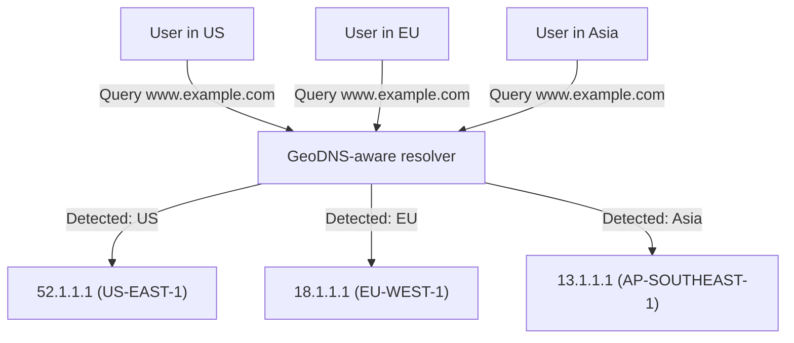
```mermaid
graph TD
    US[User in US] -->|Query www.example.com| DNS[GeoDNS-aware resolver]
    EU[User in EU] -->|Query www.example.com| DNS
    Asia[User in Asia] -->|Query www.example.com| DNS
    DNS -->|"Detected: US"| USIP["52.1.1.1 (US-EAST-1)"]
    DNS -->|"Detected: EU"| EUIP["18.1.1.1 (EU-WEST-1)"]
    DNS -->|"Detected: Asia"| AsiaIP["13.1.1.1 (AP-SOUTHEAST-1)"]
```

#### Real-Life Use Case: Global Video Streaming Service

A video streaming platform serves users on every continent from three regional data centers. Using GeoDNS (AWS Route 53 latency-based routing), a viewer in Tokyo resolving `stream.example.com` is automatically routed to the AP-SOUTHEAST-1 data center rather than the US-EAST-1 one, cutting startup latency from roughly 200ms to under 30ms - a meaningful difference for video start times and rebuffering rates, achieved with zero client-side logic.

#### Java/Spring Boot Code: Simulating Region Selection by Client IP

```java
import org.springframework.web.bind.annotation.*;
import java.util.*;

@RestController
@RequestMapping("/api/geodns")
public class GeoDnsController {

    // A tiny illustrative mapping; production systems use a real GeoIP database (e.g., MaxMind).
    private static final Map<String, String> REGION_BY_COUNTRY = Map.of(
            "US", "us-east-1", "CA", "us-east-1",
            "DE", "eu-west-1", "FR", "eu-west-1", "GB", "eu-west-1",
            "JP", "ap-southeast-1", "IN", "ap-southeast-1"
    );

    private static final Map<String, String> REGION_IP = Map.of(
            "us-east-1", "52.1.1.1",
            "eu-west-1", "18.1.1.1",
            "ap-southeast-1", "13.1.1.1"
    );

    // GET /api/geodns/resolve?countryCode=JP
    @GetMapping("/resolve")
    public Map<String, String> resolve(@RequestParam String countryCode) {
        String region = REGION_BY_COUNTRY.getOrDefault(countryCode.toUpperCase(), "us-east-1");
        Map<String, String> result = new LinkedHashMap<>();
        result.put("countryCode", countryCode);
        result.put("routedRegion", region);
        result.put("ip", REGION_IP.get(region));
        return result;
    }
}
```

#### Interview Questions and Answers

**Q1. How does GeoDNS decide which IP to return for a given query?**
A: It looks at the location (geographic or measured latency) associated with the querying recursive resolver's IP address, then returns the record set configured for the closest/best matching region.

**Q2. What's a key limitation of GeoDNS that engineers should know about?**
A: It routes based on the resolver's location, not necessarily the actual end user's location. Users of geographically distributed public resolvers can occasionally be routed to a suboptimal region if the resolver node handling their query isn't near them.

**Q3. How does GeoDNS combine with health checks in practice?**
A: Providers like Route 53 let you attach a health check to each regional record; if a region's health check fails, GeoDNS automatically stops returning that region's IP (even to users who'd normally be routed there) and falls back to another healthy region, blending geographic routing with failover.

### Blue-Green Deployment via DNS

```
Before deployment:
www.example.com → 10.0.1.50 (blue environment - v1.0)

During deployment:
1. Deploy v2.0 to green: 10.0.1.51
2. Test green environment
3. Update DNS:
   www.example.com → 10.0.1.51 (green environment - v2.0)
4. Wait for TTL to expire
5. All traffic now on v2.0
6. Keep blue as rollback option

Rollback (if needed):
www.example.com → 10.0.1.50 (back to blue - v1.0)
```

Blue-green deployment keeps two identical, fully-provisioned environments ('blue' = currently live, 'green' = the new version), and uses a DNS record change as the single switch that moves all traffic from one to the other.

#### Blue-Green via DNS: Characteristics

- **Whole-environment cutover, not gradual**: Once the DNS record changes (and caches catch up), essentially all new traffic moves to the new environment at once, rather than a percentage at a time.
- **Instant rollback capability**: Because the old environment (blue) is left running untouched, rolling back is just reverting the DNS record - no redeploying or rebuilding is required.
- **Cutover speed is bounded by TTL**: Unlike a load balancer config change (near-instant), a DNS-based cutover takes as long as the record's TTL to reach all users, which must be planned for.

#### Blue-Green via DNS: Components

- **Two parallel environments**: Blue (current production) and green (new version), fully independent, usually with their own IPs/load balancers.
- **Low-TTL DNS record**: The record being flipped, pre-configured with a short TTL before the deployment window to make the cutover fast.
- **Smoke tests / synthetic checks**: Automated validation run against the green environment directly (by IP, bypassing DNS) before the record is switched, to catch issues before real users are affected.

#### Blue-Green via DNS: Patterns

- **DNS-level blue-green**: The pattern described here - simplest to implement, requires no special infrastructure, but is bounded by DNS TTL/propagation speed.
- **Load-balancer-level blue-green**: An alternative where a load balancer (not DNS) switches target groups, giving instant cutover/rollback with no propagation delay - preferred when available, since it avoids DNS caching entirely.

#### Blue-Green via DNS: Pros / Benefits

- **Very low deployment risk**: The new version is fully tested in a real, production-like environment before receiving any real traffic.
- **Instant, reliable rollback**: Reverting is just a DNS record change back to the previous value - no need to redeploy old code under pressure during an incident.
- **Simple to reason about**: There is no gradual traffic-shifting logic to get wrong; it's fully on the old version, or fully on the new one.

#### Blue-Green via DNS: Cons / Challenges

- **Doubles infrastructure cost during the transition**: Both environments must be fully provisioned and running simultaneously.
- **Cutover isn't instantaneous for all users**: Because of caching, some users keep hitting the old environment for up to the old TTL after the DNS change, so blue must stay healthy and available during that window.
- **Not suitable for very frequent deployments**: The TTL wait time and dual-environment cost make this a poor fit for teams deploying many times per day; canary/rolling deployments at the load-balancer or orchestrator level are usually better there.

#### Blue-Green via DNS: Best Practices

- Lower the record's TTL well before the deployment window, not during it, so the low TTL has already propagated by cutover time.
- Run comprehensive smoke tests against the green environment's IP directly (not through the public DNS name) before flipping the record.
- Keep the blue environment running and healthy for a defined 'bake time' after cutover in case an immediate rollback is needed.

#### Blue-Green via DNS: When to Use

- Use DNS-based blue-green for infrequent, high-risk releases (major version upgrades, database migrations, less frequent deploy cadences) where the simplicity and reliability of a full-environment switch outweighs the cost of running two environments and the TTL-bounded cutover time. Prefer load-balancer or orchestrator-level blue-green/canary for frequent deployments.

#### Diagram: Blue-Green Cutover

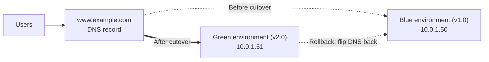
```mermaid
graph LR
    Users --> DNS["www.example.com<br/>DNS record"]
    DNS -.->|"Before cutover"| Blue["Blue environment (v1.0)<br/>10.0.1.50"]
    DNS ==>|"After cutover"| Green["Green environment (v2.0)<br/>10.0.1.51"]
    Green -.->|"Rollback: flip DNS back"| Blue
```

#### Real-Life Use Case: Safely Rolling Out a Major Platform Rewrite

An e-commerce company rewrites its checkout service from a monolith to microservices - too risky for a gradual canary rollout given how different the new architecture is. They deploy the new version as a fully separate 'green' environment, run their entire automated test suite plus a day of internal dogfooding against its IP directly, then flip the `checkout.example.com` DNS record (pre-lowered to a 60s TTL) to point at green. Within minutes, all customer traffic is on the new architecture. When a subtle payment-processing bug is discovered two hours later, they instantly revert the DNS record back to blue while the bug is fixed, with zero customer-facing downtime either direction.

#### Java/Spring Boot Code: Blue-Green Cutover Controller

```java
import org.springframework.web.bind.annotation.*;
import java.util.concurrent.atomic.AtomicReference;

@RestController
@RequestMapping("/api/deploy")
public class BlueGreenCutoverController {

    // In real life this would call your DNS provider's API (e.g., Route 53 ChangeResourceRecordSets).
    private final AtomicReference<String> activeEnvironment = new AtomicReference<>("blue");

    @GetMapping("/status")
    public String status() {
        return "Currently serving traffic from: " + activeEnvironment.get();
    }

    @PostMapping("/cutover")
    public String cutover(@RequestParam String target) {
        if (!target.equals("blue") && !target.equals("green")) {
            throw new IllegalArgumentException("target must be 'blue' or 'green'");
        }
        activeEnvironment.set(target);
        // updateDnsRecord("www.example.com", ipFor(target)); // call out to DNS provider API here
        return "Cutover complete. Now serving traffic from: " + target;
    }
}
```

#### Interview Questions and Answers

**Q1. Why is DNS TTL the critical constraint when planning a blue-green deployment via DNS?**
A: Because the cutover isn't instant - every cache holding the old answer keeps using it until its TTL expires. If TTL is 3600s, some users could hit the old environment for up to an hour after the record change, which must be accounted for when deciding how long to keep 'blue' running and healthy.

**Q2. How does DNS-based blue-green compare to load-balancer-based blue-green?**
A: DNS-based is simpler to set up (just a record change) but bounded by TTL/caching, so cutover/rollback take minutes, not seconds. Load-balancer-based blue-green switches target groups instantly with no caching delay, but requires that load-balancing infrastructure to already exist.

**Q3. What must you verify before flipping the DNS record to green?**
A: That the green environment is fully healthy and correct when accessed directly by IP (bypassing DNS) - since after the flip, real user traffic will hit it, and any bug found post-cutover means either a fast rollback or an urgent hotfix under pressure.

### CDN Configuration via DNS

```
Setup:
┌──────────────────────────────────────┐
│ Origin Server: origin.example.com    │
│ IP: 93.184.216.34                    │
└──────────────────────────────────────┘
         ↑
         │ Pulls content
         │
┌──────────────────────────────────────┐
│ CDN: d123.cloudfront.net             │
│ Edge Locations: 200+ globally        │
└──────────────────────────────────────┘
         ↑
         │ CNAME
         │
┌──────────────────────────────────────┐
│ Public DNS:                          │
│ www.example.com → d123.cloudfront.net│
│ static.example.com → d123.cloudfront │
└──────────────────────────────────────┘
```

A CDN (Content Delivery Network) uses DNS - typically CNAME records - to insert a globally distributed network of edge caches between users and your origin server, without requiring any change to your application.

#### CDN via DNS: Characteristics

- **CNAME (or ALIAS at apex) as the integration point**: Adopting a CDN is almost entirely a DNS change - point your hostname at the CDN's provided domain, and the CDN handles routing users to their nearest edge location.
- **CDN's own DNS/anycast handles edge selection**: Once the CNAME resolves to the CDN's hostname, the CDN's own infrastructure (often anycast or GeoDNS internally) picks the actual nearest edge server IP for that user.
- **Origin fetches are transparent to users**: Edge caches pull content from your origin server only on a cache miss; users only ever talk to the nearest edge.

#### CDN via DNS: Components

- **Origin server**: Your actual application/content server, which the CDN pulls from on a cache miss.
- **CDN edge network**: Hundreds of globally distributed cache/proxy servers operated by the CDN provider.
- **CNAME record**: The DNS glue connecting your domain name to the CDN's routing infrastructure.

#### CDN via DNS: Patterns

- **Static asset offloading**: Point only a `static.` or `assets.` subdomain at the CDN, leaving dynamic application traffic going straight to origin.
- **Full-site CDN (including dynamic content)**: Point the main domain itself at the CDN, which proxies and selectively caches even dynamic requests, adding DDoS protection and TLS termination at the edge.
- **Multi-CDN**: Use weighted or health-checked DNS records pointing at two different CDN providers for redundancy against a CDN-wide outage.

#### CDN via DNS: Pros / Benefits

- **Dramatically reduced latency for static content**: Content is served from an edge location near the user instead of a single origin, often located far away.
- **Reduced origin load**: Cache hits at the edge never reach your origin server at all, letting a modest origin handle enormous traffic.
- **Built-in DDoS absorption**: Most CDNs absorb volumetric attacks at the edge, far from your origin infrastructure.

#### CDN via DNS: Cons / Challenges

- **Cache invalidation complexity**: Updating content requires either waiting out cache TTLs at the edge or explicitly purging the CDN cache, adding an operational step beyond just updating the origin.
- **CNAME can't be used at the zone apex** in the standard, requiring CNAME flattening/ALIAS records if you want the CDN on your bare domain.
- **Additional vendor dependency**: A CDN outage (rare, but it happens) can take down your whole site even if your own origin is healthy.

#### CDN via DNS: Best Practices

- Use separate subdomains for CDN-fronted static assets versus your dynamic application, so cache behavior and invalidation only affect what needs it.
- Set explicit cache-control headers at origin so the CDN caches content for the intended duration, rather than relying on defaults.
- Consider a multi-CDN setup with DNS-level failover for very high-availability requirements.

#### CDN via DNS: When to Use

- Use a CDN whenever you serve static assets (images, JS/CSS, video) to a geographically distributed audience, or want DDoS protection and TLS termination at the edge. Less valuable for purely internal APIs with a co-located, low-latency user base.

#### Diagram: CDN Request Flow

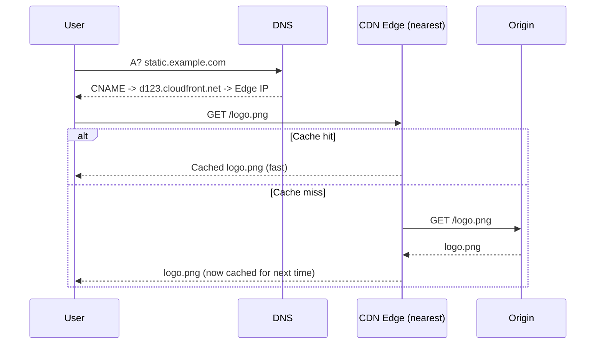
```mermaid
sequenceDiagram
    participant User
    participant DNS
    participant Edge as CDN Edge (nearest)
    participant Origin

    User->>DNS: A? static.example.com
    DNS-->>User: CNAME -> d123.cloudfront.net -> Edge IP
    User->>Edge: GET /logo.png
    alt Cache hit
        Edge-->>User: Cached logo.png (fast)
    else Cache miss
        Edge->>Origin: GET /logo.png
        Origin-->>Edge: logo.png
        Edge-->>User: logo.png (now cached for next time)
    end
```

#### Real-Life Use Case: Handling a Traffic Spike from a Viral Post

A news site's article goes viral, generating 50x normal traffic in minutes. Because their images and static assets are served through a CDN (via a `static.example.com` CNAME), the CDN's edge caches absorb the vast majority of the load, serving cached copies from locations near each reader. The origin server, which would have fallen over under 50x direct load, only sees a small fraction of requests (cache misses), keeping the site up throughout the spike.

#### Java/Spring Boot Code: Setting Cache-Control Headers for CDN Caching

```java
import org.springframework.http.CacheControl;
import org.springframework.http.ResponseEntity;
import org.springframework.web.bind.annotation.*;
import java.util.concurrent.TimeUnit;

@RestController
@RequestMapping("/assets")
public class CdnCacheControlController {

    // Origin endpoint; the CDN edge will cache this response per the Cache-Control header.
    @GetMapping("/{fileName}")
    public ResponseEntity<byte[]> getAsset(@PathVariable String fileName) {
        byte[] content = loadAssetBytes(fileName); // loads from disk/object storage

        return ResponseEntity.ok()
                .cacheControl(CacheControl.maxAge(1, TimeUnit.DAYS).cachePublic())
                .body(content);
    }

    private byte[] loadAssetBytes(String fileName) {
        return new byte[0]; // placeholder for actual asset loading logic
    }
}
```

#### Interview Questions and Answers

**Q1. What DNS record type is typically used to integrate a CDN, and why?**
A: CNAME - you point your subdomain at the CDN provider's hostname (e.g., `d123.cloudfront.net`), which lets the CDN change its own edge IPs freely without you ever needing to update your DNS.

**Q2. Why can adopting a CDN sometimes complicate 'why isn't my content update showing up' debugging?**
A: Because there are now two caching layers to consider - normal DNS/browser caching, plus the CDN's own edge cache with its own TTL/invalidation rules. An old asset might be served from the edge cache even though the origin has the new version, until the edge TTL expires or a purge is issued.

**Q3. How does a CDN help absorb a DDoS attack even though your origin server has limited capacity?**
A: The CDN's edge network has vastly more aggregate capacity and is often purpose-built with DDoS mitigation, so a volumetric attack is absorbed across hundreds of edge locations before it ever reaches your origin, which only needs to handle regular, legitimate traffic volume.

### DNS Failover Configuration

```
Health Check Based Failover:

Primary:
www.example.com → 10.0.1.100 (primary server)
  ↓ Health check fails!
  ↓
Automatic Failover:
www.example.com → 10.0.2.100 (backup server)

Route 53 Config:
www.example.com
  Primary:  10.0.1.100 (healthy check every 30s)
  Secondary: 10.0.2.100 (used if primary fails)
```

DNS failover uses active health checks against your infrastructure to automatically change which record a DNS provider serves, redirecting traffic away from an unhealthy target without any human intervention.

#### DNS Failover: Characteristics

- **Health-check driven, not just static configuration**: Unlike plain round-robin A records, failover setups actively probe (HTTP, TCP, or ICMP checks) each target on a schedule (e.g., every 10-30s) to decide what's healthy.
- **Automatic, no manual intervention required**: Once configured, the DNS provider itself flips the served answer when a health check fails, with no on-call engineer needing to make a change.
- **Detection + propagation both add delay**: Total failover time is health-check detection time (a few failed checks in a row, to avoid flapping on a single blip) plus DNS TTL/caching propagation time - both must be tuned together for a target recovery time.

#### DNS Failover: Components

- **Health checker**: The DNS provider's monitoring system that repeatedly probes an endpoint (often over HTTP, checking for a 200 status) and tracks its up/down state.
- **Primary and secondary record configuration**: The provider-specific setup declaring which target is preferred and which is the fallback.
- **Low TTL on the failover record**: Necessary so that once a health check trips, the new answer reaches users quickly.

#### DNS Failover: Patterns

- **Active-passive failover**: A secondary/backup server sits idle (or serving a maintenance page) and only receives traffic when the primary's health check fails.
- **Active-active with failover**: Multiple healthy targets share load normally (weighted or round-robin), with DNS automatically removing any target whose health check fails, rather than a strict primary/secondary split.
- **Multi-region failover**: Combine with GeoDNS so each region has its own primary/secondary pair, providing both latency optimization and resilience.

#### DNS Failover: Pros / Benefits

- **Fully automated recovery from server/region outages** without needing a human to notice and manually update DNS.
- **No extra client-side or application logic required** - failover is entirely handled by the DNS layer.
- **Works across regions/providers**, unlike a load balancer, which typically only fails over within its own pool of backend targets in one location.

#### DNS Failover: Cons / Challenges

- **Not instantaneous**: Detection takes at least a few health-check intervals (to avoid false positives from a single missed check), and propagation still takes up to the record's TTL - so failover typically takes anywhere from tens of seconds to a few minutes, not milliseconds.
- **Health checks can have blind spots**: A check that only verifies 'is port 443 open' might not catch a server that's up but serving broken responses to real user requests; checks should probe a meaningful health endpoint.
- **Split-brain risk during flapping**: If health checks are too sensitive, a server experiencing brief blips can cause DNS to flip back and forth repeatedly, potentially causing user-visible instability.

#### DNS Failover: Best Practices

- Use a low but reasonable TTL for failover-enabled records (e.g., 60s) to balance fast failover against excessive query load on your DNS provider.
- Configure health checks against a meaningful endpoint (an actual health/readiness endpoint that verifies downstream dependencies), not just a raw TCP port check.
- Require multiple consecutive failed checks before failing over, to avoid flapping on transient network blips.
- Combine DNS failover with load-balancer-level failover for the fastest possible recovery within a single region, reserving DNS failover for cross-region/datacenter-level failures.

#### DNS Failover: When to Use

- Use DNS failover specifically for cross-region or cross-datacenter resilience, where a load balancer (which only operates within one location) can't help. For within-region failover between backend instances, a load balancer's health checking is faster and should be preferred.

#### Diagram: DNS Failover Sequence

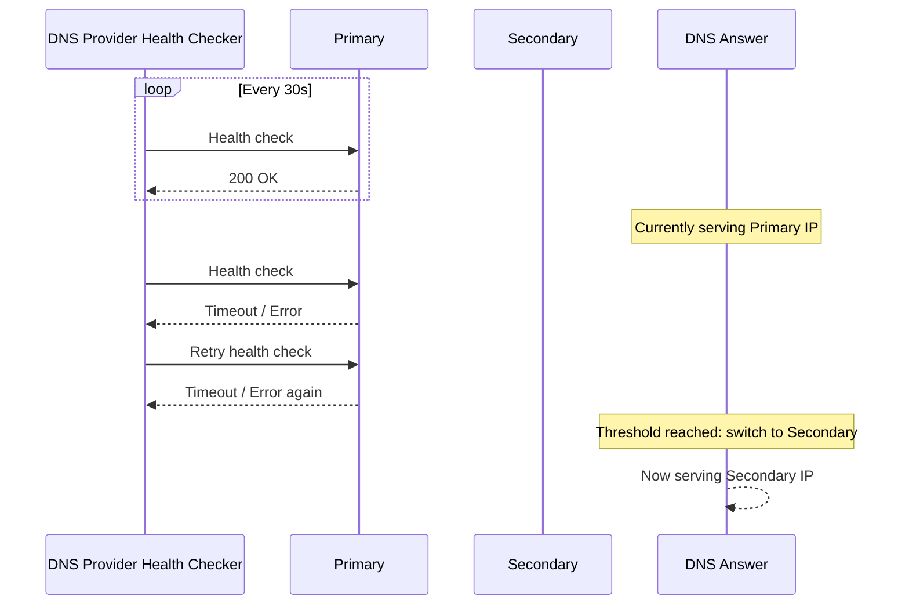
```mermaid
sequenceDiagram
    participant HealthChecker as DNS Provider Health Checker
    participant Primary
    participant Secondary
    participant DNS as DNS Answer

    loop Every 30s
        HealthChecker->>Primary: Health check
        Primary-->>HealthChecker: 200 OK
    end
    Note over DNS: Currently serving Primary IP

    HealthChecker->>Primary: Health check
    Primary-->>HealthChecker: Timeout / Error
    HealthChecker->>Primary: Retry health check
    Primary-->>HealthChecker: Timeout / Error again
    Note over DNS: Threshold reached: switch to Secondary
    DNS-->>DNS: Now serving Secondary IP
```

#### Real-Life Use Case: Surviving a Data Center Outage

An online banking platform runs its primary data center on the East Coast and a fully synced standby on the West Coast. When a regional power outage takes down the East Coast data center entirely, Route 53's health checks (probing an `/health` endpoint every 30 seconds) detect three consecutive failures and automatically switch the `www.bank.com` record to the West Coast standby's IP. Combined with a pre-configured 60-second TTL, most users are redirected to the working data center within about two to three minutes of the outage starting, with no engineer needing to be paged to make the DNS change themselves (though they are paged to investigate the underlying outage).

#### Java/Spring Boot Code: A Simple Health-Check-Driven Failover Simulator

```java
import org.springframework.web.bind.annotation.*;
import org.springframework.web.client.RestTemplate;
import java.util.concurrent.atomic.AtomicInteger;

@RestController
@RequestMapping("/api/failover")
public class DnsFailoverSimulator {

    private final RestTemplate restTemplate = new RestTemplate();
    private final AtomicInteger consecutiveFailures = new AtomicInteger(0);
    private volatile String currentTarget = "primary";
    private static final int FAILURE_THRESHOLD = 3;

    // Called on a schedule (e.g., every 30s via @Scheduled) in a real system.
    public void runHealthCheck(String primaryHealthUrl, String secondaryIp) {
        boolean healthy = isHealthy(primaryHealthUrl);
        if (!healthy) {
            int failures = consecutiveFailures.incrementAndGet();
            if (failures >= FAILURE_THRESHOLD && "primary".equals(currentTarget)) {
                currentTarget = "secondary";
                // updateDnsRecord("www.example.com", secondaryIp); // call DNS provider API
            }
        } else {
            consecutiveFailures.set(0);
        }
    }

    private boolean isHealthy(String url) {
        try {
            return restTemplate.getForEntity(url, String.class).getStatusCode().is2xxSuccessful();
        } catch (Exception e) {
            return false;
        }
    }

    @GetMapping("/status")
    public String status() {
        return "Currently routing to: " + currentTarget + " (consecutive failures: " + consecutiveFailures.get() + ")";
    }
}
```

#### Interview Questions and Answers

**Q1. Why isn't DNS failover instantaneous, even with a well-configured setup?**
A: Two delays stack: health-check detection time (requiring several consecutive failed checks to avoid false positives from transient blips) plus DNS propagation time (bounded by the record's TTL). Together these typically add up to somewhere between tens of seconds and a few minutes.

**Q2. Why require multiple consecutive failed health checks instead of failing over on the first failure?**
A: A single failed check could be a transient network blip, not a real outage. Requiring several consecutive failures (e.g., 3 in a row) avoids 'flapping' - rapidly switching back and forth - which can be more disruptive to users than a slightly slower, more confident failover decision.

**Q3. When would you choose DNS-based failover over load-balancer-based failover?**
A: When the failover needs to happen *across* regions or entire data centers, since a load balancer only fails over between targets within its own pool at one location. DNS failover is the layer that can redirect users to an entirely different geographic location/data center.

**Q4. What's a common mistake teams make when configuring health checks for DNS failover?**
A: Checking only that a port is open (TCP-level) instead of an actual application health endpoint. A server can accept TCP connections while returning 500 errors or serving broken pages; a proper health check should verify the application (and its critical dependencies) is actually functioning correctly.

### DNS Commands & Tools

**Query DNS Records:**
```bash
# Using dig (most detailed)
dig example.com
dig example.com A
dig example.com MX
dig @8.8.8.8 example.com  # Query specific DNS server

# Using nslookup
nslookup example.com
nslookup -type=MX example.com

# Using host
host example.com
host -t MX example.com
```

**Example dig output:**
```bash
$ dig example.com

; <<>> DiG 9.10.6 <<>> example.com
;; ANSWER SECTION:
example.com.    3600    IN    A    93.184.216.34
                ↑ TTL        ↑ Type  ↑ IP

;; Query time: 23 msec
;; SERVER: 8.8.8.8#53(8.8.8.8)
;; WHEN: Sat Jan 25 10:30:00 PST 2026
```

**Flush DNS Cache:**
```bash
# macOS
sudo dscacheutil -flushcache
sudo killall -HUP mDNSResponder

# Windows
ipconfig /flushdns

# Linux
sudo systemd-resolve --flush-caches
sudo /etc/init.d/nscd restart

# Chrome browser
chrome://net-internals/#dns → Clear host cache
```

**Check DNS Propagation:**
```bash
# Query multiple DNS servers worldwide
dig @8.8.8.8 example.com      # Google (US)
dig @1.1.1.1 example.com      # Cloudflare (Global)
dig @208.67.222.222 example.com  # OpenDNS (US)

# Online tools:
# https://www.whatsmydns.net
# https://dnschecker.org
```

#### DNS Tools: Characteristics

- **`dig` is the detailed, scriptable tool of choice**: It exposes the full response (answer section, authority section, additional section, flags, timing) and supports advanced modes like `+trace` and `+short`.
- **`nslookup` is legacy but still ubiquitous**: Present on virtually every OS by default (including Windows), useful for quick interactive checks even though its output is less detailed than `dig`.
- **`host` is the minimal, quick-glance tool**: Terse one-line-per-record output, good for fast sanity checks in scripts.
- **Cache flushing is OS/browser-specific**: Every layer (OS resolver, browser) maintains its own cache with its own flush command, so a full 'reset' during debugging requires clearing multiple caches, not just one.

#### DNS Tools: Components

- **Resolver targeting (`@server`)**: Nearly every DNS tool lets you specify which server to query directly (bypassing your configured default resolver), which is essential for comparing an authoritative server's answer against what's cached elsewhere.
- **Trace mode (`dig +trace`)**: Performs the full iterative walk from root to authoritative server itself, printing every hop, which is invaluable for diagnosing delegation problems.
- **Global propagation checkers**: Third-party services (whatsmydns.net, dnschecker.org) that query dozens of resolvers around the world simultaneously, useful for visually confirming how far a DNS change has propagated.

#### DNS Tools: Patterns

- **Compare authoritative vs. cached answer**: Query the domain's actual authoritative server directly (`dig @ns1.example.com example.com`) and compare against a public resolver (`dig @8.8.8.8 example.com`) to determine whether an issue is at the source or just propagation delay.
- **Trace-first debugging**: When resolution fails unexpectedly, run `dig +trace` before anything else, since it will usually immediately reveal whether the problem is a broken delegation, a missing record, or something else entirely.
- **Scripted health checks**: Wrapping `dig +short` in monitoring scripts to alert if a critical record's value unexpectedly changes or disappears.

#### DNS Tools: Pros / Benefits

- **Deterministic, reproducible debugging**: Unlike many distributed systems, you can query the exact same chain of servers a real resolver would use and get a faithful, repeatable picture of what's happening.
- **No special access required**: Any engineer, anywhere, can query public and authoritative DNS servers directly - no need for internal access or special credentials to diagnose most DNS issues.

#### DNS Tools: Cons / Challenges

- **Results can differ from what real users see**: Your terminal's query might hit a resolver/cache state different from an affected user's, especially with caching involved - a working `dig` result doesn't always mean the user's issue is resolved.
- **Cache flushing is easy to forget a layer of**: Engineers sometimes flush the OS cache but forget the browser's separate cache, leading to confusing 'I flushed DNS but still see the old value' reports.

#### DNS Tools: Best Practices

- Default to `dig` for anything beyond a trivial check - its `+trace`, `+short`, and `@server` options cover the overwhelming majority of debugging needs.
- When investigating a user-reported DNS issue, ask what resolver/network they're on, and try to reproduce against the same public resolver they use (many ISPs use specific default resolvers).
- Use propagation-checker websites to get a global view before assuming a change 'isn't working' - it may simply not have reached all regions yet.

#### DNS Tools: When to Use

- Use these tools any time you need to verify what a DNS change actually looks like from the outside, debug an unexpected resolution result, or confirm propagation status during/after a migration.

#### Diagram: Debugging Workflow with dig

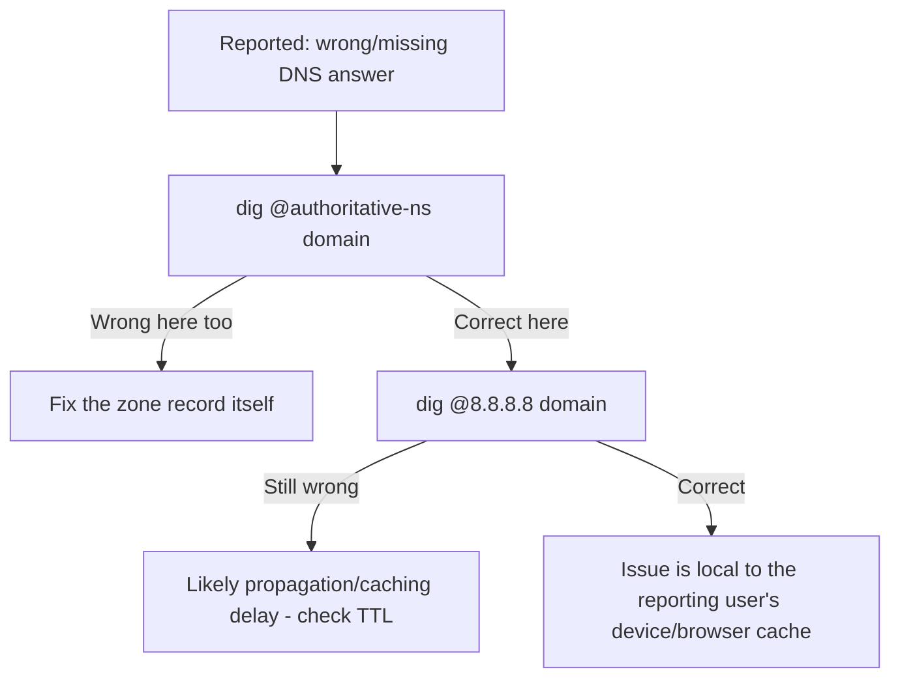
```mermaid
graph TD
    Issue["Reported: wrong/missing DNS answer"] --> Auth["dig @authoritative-ns domain"]
    Auth -->|"Wrong here too"| FixZone["Fix the zone record itself"]
    Auth -->|"Correct here"| Public["dig @8.8.8.8 domain"]
    Public -->|"Still wrong"| Propagation["Likely propagation/caching delay - check TTL"]
    Public -->|"Correct"| ClientCache["Issue is local to the reporting user's device/browser cache"]
```

#### Real-Life Use Case: Diagnosing 'DNS Change Isn't Working' During an Incident

During a migration, a customer reports the new site isn't loading and the old error page still appears. The on-call engineer runs `dig @ns1.example.com example.com` and confirms the authoritative server already has the correct new IP - ruling out a zone misconfiguration. They then run `dig @8.8.8.8 example.com` and see the old IP still cached, with a TTL counting down. This immediately tells them it's a propagation/caching issue, not a broken deployment, so they can confidently tell the customer the fix is already live and will reach them within the remaining TTL window, avoiding an unnecessary rollback.

#### Java/Spring Boot Code: A DNS Diagnostics Endpoint

```java
import org.springframework.web.bind.annotation.*;
import javax.naming.directory.InitialDirContext;
import javax.naming.directory.Attributes;
import java.util.*;

@RestController
@RequestMapping("/api/dns")
public class DnsDiagnosticsController {

    // GET /api/dns/diagnose?host=example.com&dnsServer=8.8.8.8
    @GetMapping("/diagnose")
    public Map<String, Object> diagnose(@RequestParam String host,
                                         @RequestParam(defaultValue = "8.8.8.8") String dnsServer) throws Exception {
        Hashtable<String, String> env = new Hashtable<>();
        env.put("java.naming.factory.initial", "com.sun.jndi.dns.DnsContextFactory");
        env.put("java.naming.provider.url", "dns://" + dnsServer);

        InitialDirContext ctx = new InitialDirContext(env);
        Attributes attrs = ctx.getAttributes(host, new String[]{"A"});
        var a = attrs.get("A");

        Map<String, Object> result = new LinkedHashMap<>();
        result.put("host", host);
        result.put("queriedServer", dnsServer);
        result.put("answer", a != null ? String.valueOf(a.get()) : "no answer");
        return result;
    }
}
```

#### Interview Questions and Answers

**Q1. What's the fastest way to determine whether a DNS problem is a zone misconfiguration versus a caching/propagation delay?**
A: Query the domain's authoritative name server directly (`dig @ns1.example.com domain`). If the correct answer is there, the zone itself is fine and the issue is caching/propagation elsewhere; if it's wrong there too, the zone configuration itself needs fixing.

**Q2. Why might `dig` and a user's browser show different results for the same domain?**
A: They may be hitting different resolvers with different cache states - your terminal might query a fresh public resolver while the user's device has a warm OS or browser cache with an older, not-yet-expired answer.

**Q3. What does `dig +trace` do differently from a normal `dig` query, and when would you use it?**
A: It performs the full iterative resolution itself, starting from the root servers and following each referral down to the authoritative server, printing every hop. It's the go-to tool for diagnosing delegation problems (e.g., NS records pointing at the wrong or unreachable server).

**Q4. Besides command-line tools, how would you check DNS propagation across many regions at once?**
A: Use a global propagation checker website (whatsmydns.net, dnschecker.org), which queries dozens of resolvers in different countries simultaneously and shows a map/table of what each one currently returns.

### DNS Security

**DNSSEC (DNS Security Extensions):**
```
Problem: DNS responses can be spoofed

Solution: Cryptographic signatures

1. DNS server signs responses with private key
2. Client verifies with public key (DS/DNSKEY records)
3. Chain of trust from root to your domain

Example:
example.com.  IN  DNSKEY  257 3 8 AwEAAa...
                              ↑ Public key

example.com.  IN  RRSIG   A 8 2 3600 20260201000000 ...
                              ↑ Signature
```

**DNS over HTTPS (DoH) / DNS over TLS (DoT):**
```
Traditional DNS: Plain text (can be intercepted)
  User → ISP DNS (port 53, unencrypted)

DoH/DoT: Encrypted
  User → Cloudflare 1.1.1.1 (HTTPS/TLS, encrypted)

Benefits:
  ✓ Privacy (ISP can't see queries)
  ✓ Integrity (can't be modified)
  ✓ Bypasses censorship
```

#### DNS Security: Characteristics

- **DNS was designed without security in mind**: The original protocol (1980s) assumed a trusted network and has no built-in authentication - any host that can send a UDP packet claiming to be from port 53 can attempt to answer a query, which is the root cause of most DNS attacks.
- **DNSSEC adds authentication, not encryption**: It cryptographically proves a response came from the legitimate authoritative server and wasn't tampered with in transit, but the query/response content itself is still visible to anyone observing the network.
- **DoH/DoT add confidentiality, not authentication of the answer's origin**: They encrypt the query/response between client and resolver (hiding it from network eavesdroppers/ISPs), but don't by themselves prove the resolver's answer is authentic - DNSSEC and DoH/DoT solve complementary problems.
- **Chain of trust requires participation at every level**: DNSSEC only works end-to-end if the root, the TLD, and the domain's zone are all signed - a single unsigned link breaks the chain of validation for everything below it.

#### DNS Security: Components

- **DNSKEY record**: Publishes the zone's public key, used by resolvers to verify signatures.
- **RRSIG record**: The cryptographic signature over a specific RRset, proving it was signed by the zone's private key and hasn't been altered.
- **DS (Delegation Signer) record**: Published in the *parent* zone, it's a hash of the child zone's DNSKEY, forming the link in the chain of trust from parent to child.
- **DoH/DoT transport**: An encrypted channel (HTTPS or TLS) between the client/stub resolver and a supporting recursive resolver, hiding query content from on-path observers.

#### DNS Security: Patterns

- **Full DNSSEC chain of trust**: Sign every zone from root down to your domain so resolvers can cryptographically validate that no response was forged or altered anywhere in the chain.
- **Encrypted DNS via a trusted public resolver**: Configure devices/browsers to use a DoH/DoT-supporting resolver (Cloudflare 1.1.1.1, Google 8.8.8.8) instead of an unencrypted ISP default, protecting query privacy on untrusted networks (public Wi-Fi).
- **Rate limiting and response validation to prevent amplification abuse**: Authoritative and recursive resolvers apply rate limits and disable open recursion for unknown clients to avoid being used as reflectors in DDoS amplification attacks.

#### DNS Security: Pros / Benefits

- **DNSSEC prevents cache poisoning and response forgery**: A resolver that validates signatures will reject any tampered or forged response, closing off a whole class of attacks (like the famous 2008 Kaminsky cache-poisoning vulnerability).
- **DoH/DoT protect user privacy on hostile networks**: On public Wi-Fi or under a surveilling ISP, encrypted DNS prevents queries (which reveal exactly what sites you're about to visit) from being read or logged in transit.
- **CAA (covered earlier) complements this by restricting certificate issuance**, closing a related but distinct attack surface.

#### DNS Security: Cons / Challenges

- **DNSSEC adds operational complexity**: Key rotation, signing automation, and keeping DS records in sync with the parent zone are all extra operational burden compared to plain DNS.
- **DNSSEC doesn't hide query content**: It only proves authenticity; an eavesdropper can still see exactly which domains you're querying unless DoH/DoT is also used.
- **DoH can complicate network-level security policies**: Corporate networks that rely on inspecting/filtering plain DNS traffic (for malware domain blocking, parental controls, etc.) lose that visibility if clients switch to DoH pointed at a third-party resolver, which is a genuine ongoing debate in the industry.
- **Amplification attacks remain a risk for misconfigured open resolvers**: A resolver that answers recursive queries from any IP on the internet can be abused to reflect and amplify traffic at a victim.

#### DNS Security: Best Practices

- Enable DNSSEC on any domain where response integrity matters (which is effectively all production domains), and monitor for signature expiration, a common cause of DNSSEC-related outages.
- Prefer resolvers that support DoH/DoT for client devices on untrusted networks, while being mindful of any organizational policy that depends on DNS-level filtering/monitoring.
- Disable open recursion on any authoritative or resolver infrastructure you operate - only answer recursive queries from known, trusted clients.
- Add CAA records (see the [Other Important Records](#other-important-records-srv-and-caa) topic) as a complementary certificate-issuance safeguard.

#### DNS Security: When to Use

- Enable DNSSEC on every production domain by default - most managed DNS providers make this a single toggle with no meaningful downside beyond minor operational overhead.
- Prefer DoH/DoT for client-side DNS configuration whenever privacy on untrusted networks matters, balanced against any organizational need for DNS-level visibility/filtering.

#### Diagram: DNSSEC Chain of Trust

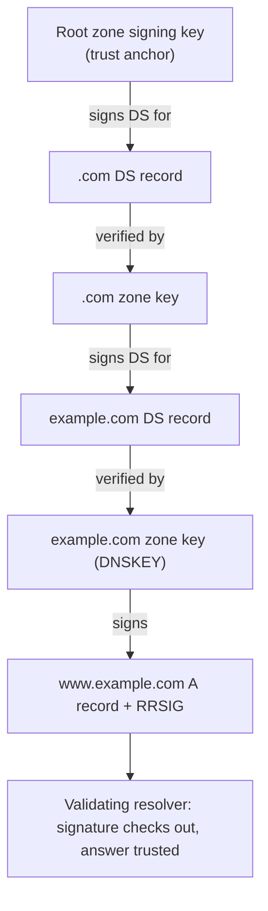
```mermaid
graph TD
    RootKey["Root zone signing key<br/>(trust anchor)"] -->|signs DS for| ComDS[".com DS record"]
    ComDS -->|verified by| ComKey[".com zone key"]
    ComKey -->|signs DS for| ExampleDS["example.com DS record"]
    ExampleDS -->|verified by| ExampleKey["example.com zone key (DNSKEY)"]
    ExampleKey -->|signs| ARecord["www.example.com A record + RRSIG"]
    ARecord --> Resolver["Validating resolver: signature checks out, answer trusted"]
```

#### Real-Life Use Case: Preventing a Cache-Poisoning Attack

Before DNSSEC was widely deployed, security researcher Dan Kaminsky demonstrated in 2008 that an attacker on the same network path could race a legitimate DNS response with a forged one, and if the forged one arrived first (guessing a 16-bit transaction ID), the resolver would cache the attacker's answer - silently redirecting all future traffic for that domain to a server the attacker controls. A DNSSEC-validating resolver defeats this attack outright: even if the forged response wins the race, it fails signature validation (since the attacker doesn't have the zone's private key) and is discarded, protecting users even on a compromised or adversarial network path.

#### Java/Spring Boot Code: Checking Whether a Domain Has DNSSEC Enabled

```java
import org.springframework.web.bind.annotation.*;
import javax.naming.directory.InitialDirContext;
import javax.naming.directory.Attributes;
import java.util.*;

@RestController
@RequestMapping("/api/dns")
public class DnsSecurityController {

    // GET /api/dns/dnssec-status?host=example.com
    @GetMapping("/dnssec-status")
    public Map<String, Object> dnssecStatus(@RequestParam String host) throws Exception {
        Hashtable<String, String> env = new Hashtable<>();
        env.put("java.naming.factory.initial", "com.sun.jndi.dns.DnsContextFactory");
        InitialDirContext ctx = new InitialDirContext(env);

        boolean hasDnskey = hasRecord(ctx, host, "DNSKEY");

        Map<String, Object> result = new LinkedHashMap<>();
        result.put("host", host);
        result.put("dnssecLikelyEnabled", hasDnskey);
        result.put("note", "Full validation requires checking DS/RRSIG chain, not just DNSKEY presence");
        return result;
    }

    private boolean hasRecord(InitialDirContext ctx, String host, String type) {
        try {
            Attributes attrs = ctx.getAttributes(host, new String[]{type});
            return attrs.get(type) != null;
        } catch (Exception e) {
            return false;
        }
    }
}
```

#### Interview Questions and Answers

**Q1. What problem does DNSSEC solve, and what does it explicitly NOT solve?**
A: DNSSEC cryptographically proves a DNS response is authentic and unaltered (preventing spoofing/cache poisoning). It does not encrypt the query or response - the content is still visible to network observers, which is what DoH/DoT address instead.

**Q2. Explain the DNSSEC chain of trust from root to a specific domain.**
A: The root zone's key signs a DS record for each TLD, which is a hash of that TLD's DNSKEY. The TLD's key then signs a DS record for each domain under it, hashing that domain's own DNSKEY. Each domain's DNSKEY then signs RRSIG records over its actual data (A, MX, etc.). A validating resolver follows this chain, verifying each signature, so trust flows unbroken from the root down to your specific record.

**Q3. What's the difference between what DNSSEC and DoH/DoT each protect against?**
A: DNSSEC protects against a forged/tampered *answer* (integrity and authenticity), regardless of who is looking at the traffic. DoH/DoT protect against *eavesdropping* on the query itself (confidentiality) between the client and its chosen resolver, but don't by themselves prove the resolver's answer wasn't forged.

**Q4. Why is disabling open recursion important for DNS security?**
A: An open resolver that answers recursive queries from any internet host can be abused in DNS amplification DDoS attacks - an attacker sends a small spoofed query (appearing to come from a victim's IP) and the resolver sends a much larger response to the victim, amplifying the attacker's traffic significantly.

### Common DNS Issues

**Issue 1: Propagation Delay**
```
Problem:
  Changed DNS record, but old IP still appears

Cause:
  TTL not expired, caches still have old value

Solution:
  1. Lower TTL before changes (24 hours in advance)
  2. Make changes
  3. Wait for old TTL to expire
  4. Raise TTL back to normal
```

**Issue 2: CNAME at Root**
```
Problem:
  example.com. CNAME other.com.  ← Not allowed!

Reason:
  RFC violation (conflicts with NS, MX records)

Solution:
  Use A/AAAA record at root
  Or use ALIAS/ANAME record (provider-specific)
```

**Issue 3: Multiple CNAMEs**
```
Problem:
  www → cdn → lb → server (too many hops)

Impact:
  Multiple DNS lookups = slower

Solution:
  Minimize CNAME chain depth
  Use A records when possible
```

#### Common DNS Issues: Characteristics

- **Most DNS issues are self-inflicted misconfigurations, not protocol bugs**: Propagation delay, invalid CNAME placement, and excessive chaining are all outcomes of not accounting for how DNS's caching and record rules actually work, rather than defects in DNS itself.
- **Symptoms often appear far from the root cause**: A missing MX record shows up as 'customers say emails bounce,' not as an obvious DNS error - making DNS issues notoriously indirect to diagnose without the right tools.
- **Time-delayed feedback loop**: Because of caching, a DNS fix might not be visibly confirmed as working for minutes to hours, which can tempt teams into making a second, unnecessary change while the first one simply hasn't propagated yet.

#### Common DNS Issues: Components

- **TTL misjudgment**: The most common root cause - not lowering TTL far enough in advance of a planned change.
- **Zone validation rules**: RFC-level rules (like CNAME exclusivity) that, when violated, cause records to be rejected or behave unpredictably depending on the provider.
- **CNAME chain depth**: Each additional hop from name to name adds a full extra DNS round trip before resolution completes.

#### Common DNS Issues: Patterns

- **Pre-migration TTL lowering**: The standard mitigation for propagation delay - lower TTL 24+ hours before any planned change.
- **ALIAS/ANAME/CNAME-flattening for apex aliasing**: The standard workaround for wanting CNAME-like behavior at a domain's root.
- **Direct A/AAAA records instead of chained CNAMEs where possible**: Reduces lookup hops by pointing directly at a stable IP rather than through several intermediate aliases.

#### Common DNS Issues: Pros / Benefits (of understanding and avoiding them)

- **Fewer surprise outages during migrations**: Teams that plan TTLs properly rarely experience the 'half our users still see the old site' problem.
- **Faster, more reliable resolution**: Avoiding unnecessary CNAME chains keeps every lookup as fast as possible.
- **Fewer subtle, hard-to-diagnose production issues**: Understanding these common pitfalls in advance avoids costly incident-response time spent rediscovering them under pressure.

#### Common DNS Issues: Cons / Challenges (if not addressed)

- **Propagation delay surprises**: Teams that don't lower TTL in advance can face hours (or, worst case, days with very high default TTLs) of inconsistent behavior across their user base after a change.
- **Rejected or broken zone configuration**: Attempting an invalid CNAME-at-apex setup on a provider that strictly enforces the RFC will simply reject the change, blocking a deployment until fixed.
- **Creeping latency from CNAME sprawl**: Over time, well-meaning incremental changes (adding one more layer of indirection each time) can accumulate into a needlessly long resolution chain.

#### Common DNS Issues: Best Practices

- Build a pre-migration checklist that always starts with 'lower TTL N hours in advance' as the first step.
- Use your DNS provider's apex-aliasing feature (Route 53 Alias, Cloudflare CNAME flattening) instead of fighting the CNAME-at-root restriction.
- Periodically review CNAME chains in your zone and collapse unnecessary hops back to direct A/AAAA records where the target is stable.

#### Common DNS Issues: When to Use (this checklist)

- Review this list before any DNS change tied to a migration, provider switch, or CDN/service integration - most real-world DNS incidents fall into one of these three categories.

#### Diagram: Root Cause Triage for DNS Complaints

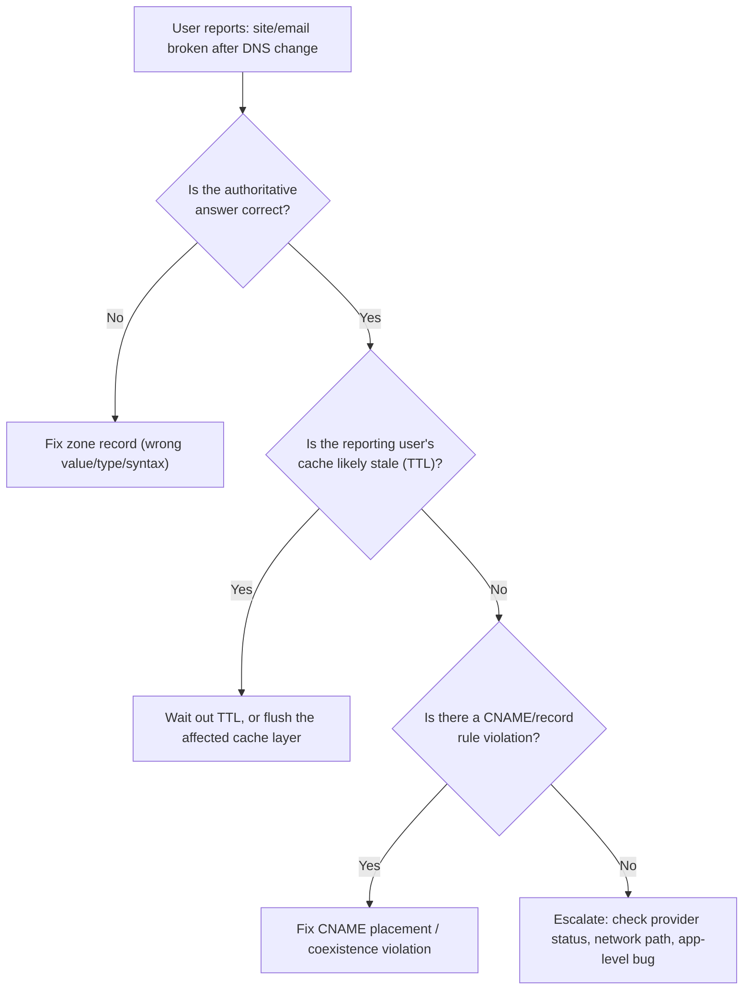
```mermaid
graph TD
    Complaint["User reports: site/email broken after DNS change"] --> Q1{"Is the authoritative\nanswer correct?"}
    Q1 -->|No| FixZone["Fix zone record (wrong value/type/syntax)"]
    Q1 -->|Yes| Q2{"Is the reporting user's\ncache likely stale (TTL)?"}
    Q2 -->|Yes| WaitOrFlush["Wait out TTL, or flush the affected cache layer"]
    Q2 -->|No| Q3{"Is there a CNAME/record\nrule violation?"}
    Q3 -->|Yes| FixRules["Fix CNAME placement / coexistence violation"]
    Q3 -->|No| DeepDive["Escalate: check provider status, network path, app-level bug"]
```

#### Real-Life Use Case: A Failed Domain Migration Post-Mortem

A startup migrating domain registrars accidentally left TTL at the default 24 hours and switched name servers immediately, expecting an instant cutover. For the next day, roughly half of visitors (whoever had a warm cache) kept hitting the old, soon-to-be-decommissioned hosting provider, which they'd already shut down - resulting in a broken site for a significant chunk of users during a product launch. The post-mortem's top action item became a mandatory pre-migration checklist requiring TTL to be lowered to 300s at least 24 hours before any future NS/record changes.

#### Java/Spring Boot Code: A Pre-Migration DNS Checklist Validator

```java
import org.springframework.web.bind.annotation.*;
import javax.naming.directory.InitialDirContext;
import javax.naming.directory.Attributes;
import java.util.*;

@RestController
@RequestMapping("/api/dns")
public class DnsMigrationChecklistController {

    // GET /api/dns/migration-check?host=example.com
    @GetMapping("/migration-check")
    public Map<String, Object> migrationCheck(@RequestParam String host) throws Exception {
        Hashtable<String, String> env = new Hashtable<>();
        env.put("java.naming.factory.initial", "com.sun.jndi.dns.DnsContextFactory");
        InitialDirContext ctx = new InitialDirContext(env);

        List<String> warnings = new ArrayList<>();

        Attributes cnameAttrs = ctx.getAttributes(host, new String[]{"CNAME"});
        boolean hasCname = cnameAttrs.get("CNAME") != null;
        if (hasCname && isApex(host)) {
            warnings.add("CNAME present at apex domain - invalid per RFC, use ALIAS/flattening instead");
        }

        Map<String, Object> result = new LinkedHashMap<>();
        result.put("host", host);
        result.put("warnings", warnings);
        result.put("ready", warnings.isEmpty());
        return result;
    }

    private boolean isApex(String host) {
        return host.chars().filter(c -> c == '.').count() == 1; // crude heuristic: e.g. example.com
    }
}
```

#### Interview Questions and Answers

**Q1. A team reports 'our DNS change isn't working' three minutes after making it. What's the first question you'd ask?**
A: What was the TTL on the old record, and has that much time passed yet? The overwhelming majority of 'DNS isn't working' reports shortly after a change are simply expected propagation delay, not a real misconfiguration.

**Q2. Why does a provider reject a CNAME record at the zone apex, and what's the standard workaround?**
A: The apex must hold SOA and NS records, which cannot coexist with a CNAME per RFC 1034. The standard workaround is a provider-specific 'ALIAS' or 'ANAME' record (or 'CNAME flattening'), which behaves like a CNAME internally but is presented externally as an A/AAAA record, satisfying the protocol rule.

**Q3. Why is a long CNAME chain (name -> name -> name -> IP) worse than a direct A record, beyond just 'it's slower'?**
A: Each hop is both extra latency (an additional round trip) and an additional point of failure - if any intermediate domain's DNS breaks or its own record is misconfigured, the entire chain fails, even if your own zone is perfectly correct.

### DNS Best Practices

```
✓ Use low TTL (300s) before making changes
✓ Use high TTL (3600s+) for stable records
✓ Implement DNSSEC for security
✓ Use multiple NS records (redundancy)
✓ Monitor DNS health (uptime, latency)
✓ Use GeoDNS for global applications
✓ Enable health-check based failover

✗ Don't use single DNS provider (SPOF)
✗ Don't set TTL too low permanently (load on DNS)
✗ Don't forget to update NS records when changing providers
✗ Don't use CNAME at root domain
```

This checklist condenses everything covered so far into a single operational reference. Each line maps back to a specific topic above: TTL strategy ties to [DNS Caching](#dns-caching-the-speed-secret), DNSSEC to [DNS Security](#dns-security), redundancy and GeoDNS/failover to their own dedicated topics.

#### DNS Best Practices: Characteristics

- **Cross-cutting, not topic-specific**: Unlike the record-type or use-case topics, these practices apply across the whole DNS footprint of an organization, spanning caching, security, redundancy, and operational hygiene simultaneously.
- **Mix of proactive and reactive guidance**: Some items (lowering TTL before changes) are proactive planning; others (monitoring DNS health) are reactive/ongoing operational practices.
- **Provider-agnostic**: These practices apply whether you use Route 53, Cloudflare, Google Cloud DNS, or self-hosted BIND/PowerDNS infrastructure.

#### DNS Best Practices: Components

- **TTL policy**: A documented, team-wide convention for what TTL to use for stable vs. soon-to-change records.
- **Redundant NS setup**: At least two, ideally provider-diverse, name servers per zone.
- **DNSSEC signing pipeline**: Automated key rotation and signature renewal, usually handled by the managed DNS provider.
- **DNS health monitoring**: Synthetic checks (from multiple geographic vantage points) verifying that authoritative answers are correct and resolvers can reach your infrastructure.

#### DNS Best Practices: Patterns

- **Infrastructure-as-code for DNS zones**: Manage zone files through Terraform/Pulumi/CDK with code review, rather than manual console changes, to get an audit trail and prevent accidental misconfiguration.
- **Multi-provider DNS redundancy**: Some very high-availability organizations run their zone on two independent DNS providers simultaneously, so a full outage at one provider doesn't take down name resolution.
- **Scheduled DNS audits**: Periodic (e.g., quarterly) reviews of the zone for stale/orphaned records, expired verification tokens, and dangling CNAMEs.

#### DNS Best Practices: Pros / Benefits

- **Fewer migration-related incidents**: Proper TTL planning alone prevents the majority of 'DNS change broke things for some users' incidents.
- **Stronger security posture**: DNSSEC plus CAA plus SPF/DKIM/DMARC together close off cache poisoning, certificate mis-issuance, and email spoofing as attack vectors.
- **Higher availability**: Redundant name servers, health-check-based failover, and (optionally) multi-provider setups remove single points of failure from the naming layer itself.

#### DNS Best Practices: Cons / Challenges

- **Requires ongoing discipline, not a one-time setup**: TTLs need to be revisited before every migration; DNSSEC keys need rotation; zones need periodic audits - none of this is 'set and forget.'
- **Some practices trade off against each other**: Very low TTLs everywhere improve change-agility but increase load on authoritative infrastructure and slightly increase average resolution latency for users (more frequent cache misses).

#### DNS Best Practices: Best Practices (Meta)

- Document your organization's DNS conventions (TTL defaults, who can make changes, review process) so best practices survive team turnover.
- Treat DNS zone changes with the same rigor as other production infrastructure changes: code review, staged rollout (lower TTL first), and monitoring.
- Revisit this checklist whenever onboarding a new service, migrating providers, or after any DNS-related incident, as a lightweight retrospective tool.

#### DNS Best Practices: When to Use

- Treat this as a standing checklist to consult before any DNS-related change (migrations, new domains, provider switches) and during periodic infrastructure reviews - not a one-time setup task.

#### Diagram: DNS Best Practices at a Glance

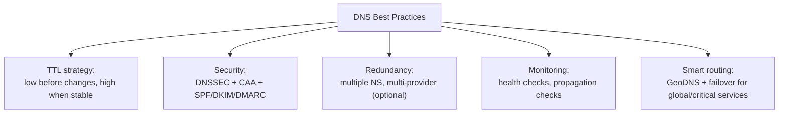
```mermaid
graph TD
    BP["DNS Best Practices"] --> TTL["TTL strategy:<br/>low before changes, high when stable"]
    BP --> Sec["Security:<br/>DNSSEC + CAA + SPF/DKIM/DMARC"]
    BP --> Redundancy["Redundancy:<br/>multiple NS, multi-provider (optional)"]
    BP --> Monitoring["Monitoring:<br/>health checks, propagation checks"]
    BP --> Routing["Smart routing:<br/>GeoDNS + failover for global/critical services"]
```

#### Real-Life Use Case: A DNS Health Checklist Catching a Problem Before Customers Do

An engineering team runs a quarterly DNS audit as part of their best-practices checklist. During one review, they discover a CAA record was never configured on a newly launched product domain, an expired DKIM key that had been silently failing for weeks (with no one noticing because DMARC was still set to `p=none`), and a CNAME pointing at a decommissioned staging environment. None of these had caused a customer-visible outage yet, but each was a latent risk (certificate mis-issuance exposure, silently degrading email deliverability, and a subdomain-takeover opportunity respectively). Fixing all three during the scheduled audit avoided what could have become three separate future incidents.

#### Java/Spring Boot Code: An Automated DNS Best-Practices Auditor

```java
import org.springframework.web.bind.annotation.*;
import javax.naming.directory.InitialDirContext;
import javax.naming.directory.Attributes;
import java.util.*;

@RestController
@RequestMapping("/api/dns")
public class DnsBestPracticesAuditController {

    // GET /api/dns/audit?host=example.com
    @GetMapping("/audit")
    public Map<String, Object> audit(@RequestParam String host) throws Exception {
        Hashtable<String, String> env = new Hashtable<>();
        env.put("java.naming.factory.initial", "com.sun.jndi.dns.DnsContextFactory");
        InitialDirContext ctx = new InitialDirContext(env);

        List<String> findings = new ArrayList<>();

        int nsCount = countRecords(ctx, host, "NS");
        if (nsCount < 2) {
            findings.add("Fewer than 2 NS records - no redundancy against a single name server outage");
        }

        if (!hasRecord(ctx, host, "CAA")) {
            findings.add("No CAA record - any publicly trusted CA could issue a certificate for this domain");
        }

        if (!hasRecord(ctx, host, "DNSKEY")) {
            findings.add("DNSSEC does not appear to be enabled");
        }

        Map<String, Object> result = new LinkedHashMap<>();
        result.put("host", host);
        result.put("findings", findings);
        result.put("passed", findings.isEmpty());
        return result;
    }

    private int countRecords(InitialDirContext ctx, String host, String type) throws Exception {
        Attributes attrs = ctx.getAttributes(host, new String[]{type});
        var attr = attrs.get(type);
        return attr == null ? 0 : attr.size();
    }

    private boolean hasRecord(InitialDirContext ctx, String host, String type) {
        try {
            Attributes attrs = ctx.getAttributes(host, new String[]{type});
            return attrs.get(type) != null;
        } catch (Exception e) {
            return false;
        }
    }
}
```

#### Interview Questions and Answers

**Q1. Why is 'use a single DNS provider' called out as an anti-pattern even though it's the simplest setup?**
A: A single provider is a single point of failure - if that provider suffers an outage (as has happened historically to major DNS providers), every domain relying solely on them becomes unresolvable, taking down the site/email/everything for all affected customers simultaneously, regardless of how healthy your own infrastructure is.

**Q2. Why shouldn't TTLs be set very low permanently, rather than just temporarily before changes?**
A: Very low TTLs mean caches expire constantly, forcing far more queries to reach your authoritative servers, increasing load and (very slightly) increasing average resolution latency for users, since more requests miss the cache. Low TTL should be a temporary state around planned changes, not a permanent default.

**Q3. What's the most commonly overlooked DNS best practice, in your experience, and why does it get missed?**
A: Updating/removing DNS records tied to decommissioned services (dangling CNAMEs, stale verification TXT records) is easy to overlook because it has no immediate visible impact - the problem (subdomain takeover risk, zone clutter) only surfaces much later, often during a security audit or an actual incident.

---

### Designing a DNS Server (System Design Deep Dive)

This is a classic system design interview question: "Design a DNS service" (either an authoritative name server for a domain, or a recursive resolver like 8.8.8.8). It's a great exercise because it combines caching, replication, consistency trade-offs, and massive read-heavy scale into one bounded problem.

**Functional requirements:**

- Resolve a domain name (and record type) to its current value(s).
- Allow zone owners to create/update/delete records (A, AAAA, CNAME, MX, TXT, NS, and so on).
- Support standard record semantics: TTL-based expiry, multiple values per name, priority ordering (MX/SRV).

**Non-functional requirements:**

- **Extremely low read latency** (single-digit milliseconds), since DNS resolution sits on the critical path of nearly every network request.
- **Very high read throughput**: public resolvers handle tens of thousands to millions of queries per second at their scale; even a single company's authoritative servers must handle bursts (viral traffic, DDoS).
- **High availability**: DNS being down means the entire service behind it becomes unreachable, even if the actual servers are healthy.
- **Eventual consistency is acceptable**: unlike a financial ledger, a DNS record can take up to its TTL to propagate everywhere; strict consistency is not required and would be far too slow at this scale.
- **Read-heavy, write-light workload**: reads (queries) outnumber writes (record changes) by many orders of magnitude, which should heavily influence the storage and caching design.

**Back-of-envelope capacity estimate (authoritative server for a large domain):**

```
Assume: 10,000 unique record names, average 3 records per name (A, AAAA, TXT, etc.)
Assume: 50,000 queries/sec at peak (a large, popular domain)

Storage: 10,000 names * 3 records * ~200 bytes/record ≈ 6 MB
  → Trivially fits in memory on every server; disk/DB is only for durability, not the hot path.

Query load: 50,000 qps, each answer served from an in-memory hash map lookup
  → Sub-millisecond per query; a single modern server could theoretically handle this,
    but multiple servers are still required for redundancy and geographic distribution.

Bandwidth: 50,000 qps * (~80 bytes query + ~150 bytes response) ≈ 11.5 MB/s
  → Modest; DNS's small message sizes are part of why it scales so well.
```

The takeaway: DNS's data volume is tiny and easily cached in memory; the design challenge is almost entirely about **availability, geographic distribution, and defending against abuse/DDoS**, not raw data or compute scale.

#### Designing a DNS Server: Characteristics

- **Read-dominated, append-friendly workload**: The vast majority of operations are lookups; writes (record changes) are comparatively rare, which should shape the whole architecture (optimize reads aggressively, writes can be slightly slower/heavier).
- **Small working set, huge query volume**: Total record data is usually tiny (kilobytes to a few megabytes even for large zones), but query rates can be enormous - the bottleneck is network/query throughput, not storage.
- **Geographic distribution is a first-class requirement**: Unlike many backend services, a DNS server's usefulness depends heavily on being physically close to querying resolvers worldwide (via anycast or explicit multi-region deployment).
- **Must gracefully tolerate and survive abuse**: Because DNS is UDP-based and often publicly reachable, any authoritative or recursive server must be designed assuming it will be targeted by amplification/DDoS attempts.

#### Designing a DNS Server: Components

- **Query listener (UDP/TCP on port 53)**: Accepts incoming DNS wire-format packets, parses the query name/type, and falls back to TCP for oversized responses.
- **In-memory record cache/store**: The hot path data structure (typically a hash map keyed by name+type) holding the actual records for fast lookup; kept in sync with the durable backing store.
- **Durable zone storage**: A database or replicated log (not on the query hot path) that is the actual source of truth for records, with the in-memory store as a read-optimized cache/projection of it.
- **Replication layer**: Propagates record changes from a primary (or from an admin API) to all serving nodes, either via classic zone transfers (AXFR/IXFR) or a modern replicated data store/pub-sub mechanism.
- **Admin/management API**: A separate, authenticated interface (not exposed on port 53) for zone owners to create/update/delete records.
- **Rate limiter / abuse protection**: Detects and throttles abusive query patterns (a key defense against being used in amplification attacks).
- **Health/monitoring layer**: Tracks query latency, error rates, and replication lag across all serving nodes.

#### Designing a DNS Server: Patterns

- **Read replicas with async replication**: Many serving nodes hold a read-only, eventually-consistent copy of the zone data, updated asynchronously from a primary store - matching DNS's own tolerance for eventual consistency.
- **Anycast deployment**: Announce the same server IP from many physical locations (like real root/public resolvers), so BGP routing naturally sends each query to the nearest healthy instance with zero client-side logic.
- **Sharding by zone/domain**: For a multi-tenant DNS provider (like Route 53 or Cloudflare), zones are sharded across many backend clusters, so no single cluster needs to hold every customer's records.
- **Write-through cache invalidation**: When a record changes via the admin API, the change is written to durable storage first, then pushed/pulled into the in-memory serving cache, ensuring the fast path never serves data that was never durably committed.

#### Designing a DNS Server: Pros / Benefits (of this architecture)

- **Extremely fast reads**: Serving from an in-memory structure keyed by name+type gives sub-millisecond lookup latency, which is essential given how many queries sit on critical request paths.
- **Scales horizontally with ease**: Because the workload is read-heavy and eventually consistent, adding more read replicas/serving nodes requires no coordination protocol, unlike a strongly consistent system.
- **Naturally resilient to regional failures**: With anycast or multi-region replicas, losing an entire data center just means BGP/routing sends traffic to the next-nearest healthy instance.

#### Designing a DNS Server: Cons / Challenges

- **Replication lag can (briefly) serve stale answers**: A record change might not be visible on every serving node instantly; this is normally masked by TTL semantics (clients are expected to tolerate a TTL-bounded staleness anyway), but it must be accounted for in the design.
- **DDoS/amplification resistance requires real engineering effort**: Rate limiting, response size minimization, and anycast absorption all add complexity beyond 'just serve the records.'
- **Operating your own authoritative infrastructure at high availability is genuinely hard**: This is precisely why most organizations use a managed provider (Route 53, Cloudflare) rather than building this system themselves, reserving custom DNS server design for education, specialized/air-gapped environments, or building the managed provider itself.

#### Designing a DNS Server: Best Practices

- Keep the hot-path query handler entirely in-memory and lock-free/lock-minimal; never let a query block on a database round trip.
- Separate the admin/write API completely from the public query port, both in code and in network exposure (never expose zone-editing endpoints on port 53).
- Build in rate limiting and response-size awareness from day one, since any publicly reachable UDP service is a potential DDoS amplification vector.
- Instrument replication lag explicitly (not just query latency), since it's the metric that determines how 'fresh' answers are across your fleet.

#### Designing a DNS Server: When to Use (i.e., when to build vs. buy)

- Build your own only for learning/interview practice, a specialized internal-only resolver (e.g., CoreDNS for Kubernetes service discovery), or if you're literally building a managed DNS *product*. For virtually all other cases, use a managed provider (Route 53, Cloudflare, Google Cloud DNS) - the operational bar for globally available, DDoS-resistant, highly available DNS is very high, and it's already been solved well at scale.

#### Diagram: High-Level DNS Server Architecture

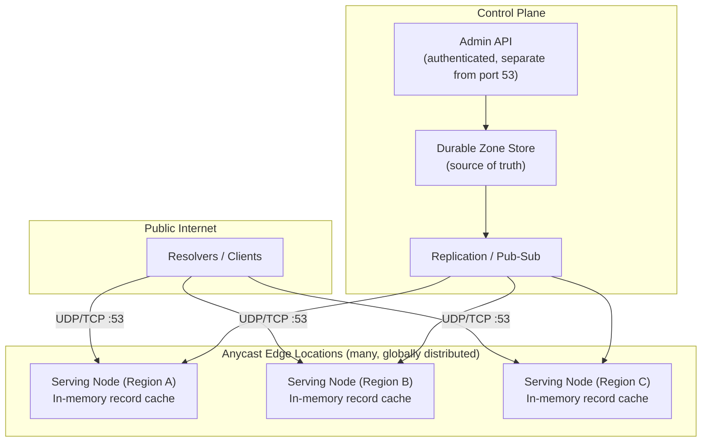
```mermaid
graph TD
    subgraph "Public Internet"
        Clients["Resolvers / Clients"]
    end

    subgraph "Anycast Edge Locations (many, globally distributed)"
        Edge1["Serving Node (Region A)<br/>In-memory record cache"]
        Edge2["Serving Node (Region B)<br/>In-memory record cache"]
        Edge3["Serving Node (Region C)<br/>In-memory record cache"]
    end

    subgraph "Control Plane"
        AdminAPI["Admin API<br/>(authenticated, separate from port 53)"]
        Primary["Durable Zone Store<br/>(source of truth)"]
        Replicator["Replication / Pub-Sub"]
    end

    Clients -->|"UDP/TCP :53"| Edge1
    Clients -->|"UDP/TCP :53"| Edge2
    Clients -->|"UDP/TCP :53"| Edge3

    AdminAPI --> Primary
    Primary --> Replicator
    Replicator --> Edge1
    Replicator --> Edge2
    Replicator --> Edge3
```

#### Real-Life Use Case: Building an Internal Service-Discovery DNS Layer

A large microservices platform (hundreds of services, thousands of instances) needs internal service discovery: `payments-service.internal` should resolve to a currently-healthy instance IP. Rather than using a heavyweight service mesh for this alone, the platform team runs an internal-only DNS layer (conceptually similar to CoreDNS in Kubernetes): each service registers/deregisters its instances through an admin API as it scales up/down or fails health checks, a durable store holds the canonical registry, and lightweight in-memory serving nodes (one per availability zone) answer queries from application containers with very short TTLs (5-10 seconds) so scaling events and instance failures are reflected almost immediately. This reuses the well-understood DNS query/response model and existing client-side DNS libraries in every language, instead of requiring every service to integrate a bespoke service-discovery client.

#### Java/Spring Boot Code: A Minimal In-Memory Authoritative DNS Record Store

A simplified illustrative implementation of the "serving node" and "admin API" from the diagram above, showing the separation between the fast read path and the write path. (A production system would pair this with a real DNS wire-protocol listener, e.g. using the `dnsjava` library, rather than only exposing REST.)

```java
import org.springframework.web.bind.annotation.*;
import java.util.concurrent.ConcurrentHashMap;
import java.util.*;

// The in-memory "serving node" cache: optimized purely for fast, concurrent reads.
class RecordStore {
    // Key: "name:type" (e.g. "www.example.com:A"), Value: list of record values with their TTL.
    private final Map<String, List<String>> records = new ConcurrentHashMap<>();
    private final Map<String, Integer> ttls = new ConcurrentHashMap<>();

    List<String> lookup(String name, String type) {
        return records.getOrDefault(key(name, type), List.of());
    }

    void upsert(String name, String type, List<String> values, int ttlSeconds) {
        records.put(key(name, type), values);
        ttls.put(key(name, type), ttlSeconds);
    }

    void delete(String name, String type) {
        records.remove(key(name, type));
        ttls.remove(key(name, type));
    }

    int ttlFor(String name, String type) {
        return ttls.getOrDefault(key(name, type), 300);
    }

    private String key(String name, String type) {
        return name.toLowerCase() + ":" + type.toUpperCase();
    }
}

// The public, read-only query path - mirrors what a real port-53 listener would call internally.
@RestController
@RequestMapping("/dns/query")
class DnsQueryController {
    private final RecordStore store;

    DnsQueryController(RecordStore store) {
        this.store = store;
    }

    // GET /dns/query?name=www.example.com&type=A
    @GetMapping
    public Map<String, Object> query(@RequestParam String name, @RequestParam String type) {
        List<String> values = store.lookup(name, type);
        Map<String, Object> response = new LinkedHashMap<>();
        response.put("name", name);
        response.put("type", type);
        response.put("values", values);
        response.put("ttl", store.ttlFor(name, type));
        return response;
    }
}

// The separate, authenticated admin/write path - never exposed on the public query port.
@RestController
@RequestMapping("/dns/admin/records")
class DnsAdminController {
    private final RecordStore store;

    DnsAdminController(RecordStore store) {
        this.store = store;
    }

    @PostMapping
    public String upsert(@RequestParam String name, @RequestParam String type,
                          @RequestBody List<String> values, @RequestParam(defaultValue = "300") int ttl) {
        store.upsert(name, type, values, ttl);
        // In production: also write to the durable store, then trigger/await replication.
        return "Upserted " + type + " record for " + name;
    }

    @DeleteMapping
    public String delete(@RequestParam String name, @RequestParam String type) {
        store.delete(name, type);
        return "Deleted " + type + " record for " + name;
    }
}
```

#### Interview Questions and Answers

**Q1. How would you design a DNS server to handle very high query throughput with very little data?**
A: Keep the entire record set in memory on every serving node (the data is small - kilobytes to low megabytes even for large zones), so every query is served by a single in-memory lookup with no disk or network round trip on the hot path. Use a durable backing store only as the source of truth for writes and for rebuilding the in-memory cache, not for serving reads directly.

**Q2. Why is eventual consistency an acceptable (even natural) choice for this system, unlike, say, a payments ledger?**
A: DNS clients are already expected to tolerate staleness up to a record's TTL under normal operation - that's the entire point of caching in DNS. Since eventual consistency is baked into the client-side contract already, there's no need for the server-side replication to be strongly consistent either; it only needs to converge within a reasonable bound (well under the TTL, ideally).

**Q3. How would you make this DNS server resilient to a full regional outage?**
A: Deploy serving nodes in multiple regions, either using anycast (so the same IP is announced from every region and network routing automatically sends traffic to the nearest healthy one) or explicit multi-region DNS-based failover/GeoDNS at a layer above. Combine with async replication so every region has its own up-to-date-enough copy of the zone data to serve reads independently.

**Q4. What's the biggest non-functional risk for a publicly reachable DNS server, and how do you mitigate it?**
A: DDoS, especially amplification attacks, since DNS is UDP-based and a small query can trigger a larger response. Mitigations include rate limiting per source IP, response-size minimization/truncation, disabling open recursion for untrusted clients, and anycast, which spreads attack traffic across many physical locations instead of concentrating it on one.

**Q5. Why would you separate the admin/write API completely from the public query port, both logically and at the network level?**
A: The query port (53) is intentionally exposed to the entire internet and optimized purely for fast, anonymous reads. The admin API performs sensitive, authenticated writes (changing what the world resolves for your domain) and must never be reachable through the same unauthenticated, public-facing surface - conflating them would turn a read-only public endpoint into a potential record-tampering attack vector.

### Domain Name System (DNS): Characteristics, Pros, Cons, Use Cases, Components, Patterns, Benefits, Challenges, Best Practices and When to Use

This final section consolidates the entire page into one reference view, pulling together the recurring threads across all 20 topics above.

#### Characteristics (Consolidated)

DNS is a hierarchical, delegated, heavily-cached, eventually-consistent, mostly-UDP naming system. Every one of its properties traces back to a single design goal: let an enormous, ever-changing internet be navigated by stable names instead of volatile addresses, without requiring any single server to know everything. Hierarchy (root -> TLD -> authoritative) keeps any one server's knowledge small; caching (TTL-based) keeps the vast majority of queries fast and local; eventual consistency is the deliberate price paid for that caching, accepted because DNS data (unlike, say, financial state) tolerates being briefly stale.

#### Components (Consolidated)

The moving parts across this page form one coherent picture: stub resolvers and recursive resolvers on the query side; root, TLD, and authoritative name servers on the serving side; zone files/records (A, AAAA, CNAME, MX, TXT, NS, SRV, CAA) as the actual data; TTL and SOA timers as the consistency/caching knobs; and DNSSEC/CAA/SPF-DKIM-DMARC as the security layer wrapped around all of it.

#### Patterns (Consolidated)

The recurring architectural patterns seen throughout - delegation, caching with TTL, anycast, round-robin load balancing, CNAME aliasing, GeoDNS, health-check-based failover, and blue-green cutovers - are all, at their core, applications of one idea: use DNS's layer of indirection (a name that can point to different or changing things) to solve routing, scaling, and availability problems without touching application code.

#### Pros / Benefits (Consolidated)

- Decouples names from ever-changing infrastructure, letting servers/IPs/providers change freely.
- Scales to internet-wide query volume through hierarchy and caching, with no central bottleneck.
- Provides load balancing, geographic routing, and failover 'for free' at the naming layer.
- Extensible (new record types, DNSSEC, CAA) without breaking existing clients.

#### Cons / Challenges (Consolidated)

- Eventual consistency means changes are never instantaneous - propagation delay is inherent, not a bug to be fixed.
- A large, historically insecure-by-default attack surface (spoofing, cache poisoning, amplification DDoS, subdomain takeover) that requires deliberate hardening (DNSSEC, CAA, rate limiting, zone hygiene).
- Misconfigurations are common and often silent (missing MX, invalid CNAME placement, dangling records), surfacing far from their root cause.

#### Use Cases (Consolidated)

Every internet-facing service depends on DNS for basic reachability; beyond that baseline, DNS actively powers multi-region routing (GeoDNS), CDN integration, blue-green deployments, health-check-based failover, email delivery and anti-spoofing (MX/SPF/DKIM/DMARC), domain ownership verification, and certificate-issuance restriction (CAA) - making it one of the most quietly load-bearing pieces of infrastructure in any system design.

#### Best Practices (Consolidated)

- Plan TTLs deliberately around change windows; lower before, raise after.
- Use a reputable managed DNS provider with redundant, geographically diverse name servers.
- Enable DNSSEC, CAA, and full SPF/DKIM/DMARC as a baseline security posture for any production domain.
- Automate zone management as code, and audit zones periodically for stale/dangling records.
- Reserve building your own DNS server for education, specialized internal service discovery, or building a DNS product itself - not general application infrastructure.

#### When to Use DNS-Based Solutions

Reach for DNS-layer solutions (GeoDNS, failover, blue-green via DNS) when the problem is fundamentally about *where a name should currently point*, especially across regions or entire environments, and when a propagation-delay-bounded cutover time (seconds to minutes, governed by TTL) is acceptable. Reach for load-balancer- or orchestrator-level solutions instead when you need sub-second cutover, fine-grained percentage-based traffic shifting, or very frequent deployments - DNS is the right tool for coarse-grained, infrequent, high-leverage routing decisions, not fine-grained real-time traffic engineering.
