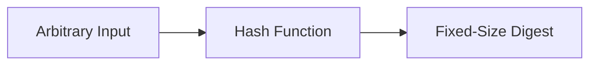
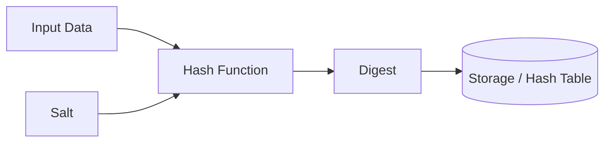

# Hashing

## Blogs and websites


## Medium


## Youtube

- [99% of Developers Don't Get Hashing](https://www.youtube.com/watch?v=R_mOWu3s6y4)

## Theory

### Topics Covered

1. [Introduction to Hashing](#introduction-to-hashing)
2. [Characteristics](#characteristics)
3. [Pros](#pros)
4. [Cons](#cons)
5. [Use Cases](#use-cases)
6. [Components](#components)
7. [Hashing Patterns](#hashing-patterns)
8. [Benefits](#benefits)
9. [Challenges](#challenges)
10. [Best Practices](#best-practices)
11. [When to Use Hashing](#when-to-use-hashing)
12. [Java and Spring Boot Examples](#java-and-spring-boot-examples)

---

### Introduction to Hashing

Hashing is the process of converting input data of arbitrary size into a fixed-size value, usually called a hash, digest, or checksum. The transformation is performed by a hash function.

Hashing is a one-way operation for cryptographic hash functions, meaning the original input cannot be recovered from the hash. It is used for data integrity, lookup acceleration, password storage, and distributed data placement.



**Real-life use cases**

- **Password storage**: systems store password hashes, not plaintext passwords.
- **Data integrity**: checksums detect accidental file corruption.
- **Caching**: hash maps and caches store key-value pairs.
- **Distributed systems**: consistent hashing places keys across nodes.
- **Digital signatures**: hashes are signed to prove data authenticity.

**Interview questions and answers**

- **Q: What is hashing?**
  **A:** Hashing maps arbitrary input to a fixed-size value using a hash function.

- **Q: What is the difference between hashing and encryption?**
  **A:** Hashing is one-way and irreversible, while encryption is reversible with the correct key.

- **Q: What is a hash collision?**
  **A:** A collision occurs when two different inputs produce the same hash value.

---

### Characteristics

- **Deterministic**
  The same input always produces the same hash output.

- **Fixed output size**
  Regardless of input length, the hash has a consistent length. SHA-256 always produces 256 bits.

- **Fast computation**
  General-purpose hash functions are designed to be computationally efficient.

- **Avalanche effect**
  A tiny change in the input produces a dramatically different hash.

- **Preimage resistance**
  Given a hash, it is computationally infeasible to find the original input.

- **Second-preimage resistance**
  Given an input and its hash, it is infeasible to find another input with the same hash.

- **Collision resistance**
  It is infeasible to find any two distinct inputs that produce the same hash.

- **One-way for cryptographic hashes**
  The input cannot be practically recovered from the output.

- **Uniform distribution**
  Good hash functions spread outputs evenly across the possible output space.

- **Irreversibility**
  Cryptographic hashes cannot be reversed to reveal the original data.

---

### Pros

- **Fast lookups**
  Hash tables provide average O(1) insertion and retrieval.

- **Integrity verification**
  A changed hash reveals that data was modified or corrupted.

- **Password protection**
  Storing hashes avoids exposing plaintext credentials.

- **Efficient storage**
  Fixed-size digests are compact compared with arbitrary input.

- **Uniform data distribution**
  Hash-based partitioning spreads data evenly across nodes.

- **Digital signatures**
  Hashing reduces large messages to fixed-size values that can be signed efficiently.

- **Deduplication**
  Identical inputs produce identical hashes, enabling duplicate detection.

- **Deterministic behavior**
  The same input always maps to the same output.

---

### Cons

- **Collisions**
  Different inputs may map to the same hash, requiring collision-handling strategies.

- **Irreversibility**
  Hashed data cannot be recovered, which is problematic when the original value is needed.

- **Vulnerability to weak algorithms**
  Legacy algorithms such as MD5 and SHA-1 have known collision attacks.

- **Rainbow table attacks**
  Unsalted password hashes can be reversed using precomputed tables.

- **Performance cost for strong hashing**
  Password-specific functions such as bcrypt and Argon2 are intentionally slow.

- **No ordering information**
  Hash values do not preserve the ordering of the original inputs.

- **Potential for denial of service**
  Poorly designed hash tables may degrade badly under adversarial collision attacks.

---

### Use Cases

- **Password storage**
  Systems store bcrypt or Argon2 hashes instead of plaintext passwords.

- **File integrity**
  Download sites publish SHA-256 checksums so users can verify files.

- **Digital signatures**
  A hash of a document is signed to prove authenticity without signing the full document.

- **Caching and hash tables**
  Hash maps, sets, and caches use hashing for fast access.

- **Consistent hashing**
  Distributed databases and caches use hashing to assign keys to nodes.

- **Deduplication**
  Storage systems detect duplicate blocks by comparing hashes.

- **Merkle trees**
  Blockchain and version control systems use hashes to build tamper-evident structures.

- **Bloom filters**
  Probabilistic membership checks use multiple hash functions.

- **API keys and tokens**
  Services store hashes of API keys so leaked storage does not reveal usable keys.

---

### Components

- **Hash function**
  The algorithm that converts input into a fixed-size digest.

- **Input data**
  The original value to be hashed, such as a password, file, or key.

- **Digest**
  The fixed-size output produced by the hash function.

- **Salt**
  A random value added to input before hashing to prevent precomputed attacks.

- **Hash table**
  A data structure that uses hashes to store and retrieve values efficiently.

- **Collision resolution strategy**
  Techniques such as chaining or open addressing handle collisions.

- **Key derivation function**
  A slow, salted hashing function designed for passwords, such as bcrypt, PBKDF2, or Argon2.



---

### Hashing Patterns

- **Salted password hashing**
  Add a unique random salt to each password before hashing to prevent identical passwords from producing identical hashes.

- **Key derivation**
  Use slow functions such as bcrypt, PBKDF2, or Argon2 to make brute-force attacks expensive.

- **Consistent hashing**
  Map both keys and nodes onto a ring to minimize data movement when nodes change.

- **Rendezvous hashing**
  For each key, choose the highest-ranked node by hashing key plus node identifier.

- **Hash chaining**
  Apply the hash function repeatedly to derive subsequent values or keys.

- **Merkle tree**
  Hash leaf nodes and then hash pairs of hashes upward to create a single root digest.

- **HMAC**
  Combine a secret key with a message using a hash function to provide message authentication.

- **Sharding by hash**
  Use a key's hash to determine which database shard stores the data.

- **Hash-based load balancing**
  Route requests based on a stable hash of client or request identity.

---

### Benefits

- **Speed**
  Hashing enables constant-time lookups and fast integrity checks.

- **Security**
  Password hashing and HMAC protect sensitive data and message integrity.

- **Scalability**
  Hash-based partitioning distributes load and data across many nodes.

- **Simplicity**
  Hash functions are simple to implement and reason about.

- **Tamper detection**
  Any change in data produces a different hash.

- **Space efficiency**
  Fixed-size digests represent large inputs compactly.

- **Determinism**
  Consistent outputs simplify caching, routing, and deduplication.

---

### Challenges

- **Collision handling**
  Hash tables and cryptographic systems must handle or resist collisions.

- **Algorithm selection**
  Choosing the wrong algorithm can weaken security or performance.

- **Salt and key management**
  Salts must be unique, and keys must be stored securely.

- **Adversarial inputs**
  Attackers can exploit predictable hashes to create collisions or overload systems.

- **Hash function evolution**
  Older algorithms become insecure as computing power grows.

- **No reversibility**
  Applications that need to recover original data cannot use one-way hashing.

---

### Best Practices

- **Use strong cryptographic hashes**
  Prefer SHA-256, SHA-3, or BLAKE3 for integrity and security.

- **Use dedicated password hashing**
  Use bcrypt, Argon2, or PBKDF2 with unique salts for passwords.

- **Always salt passwords**
  Add a cryptographically random salt to each password before hashing.

- **Use constant-time comparison**
  Compare HMACs and signatures using constant-time methods to avoid timing attacks.

- **Avoid MD5 and SHA-1**
  These algorithms are broken for collision resistance.

- **Store API keys as hashes**
  Hash secrets before storing them to limit exposure if storage is compromised.

- **Handle collisions properly**
  Use proven collision-resolution strategies in hash tables.

- **Monitor for hash table DoS**
  Use randomized seeds or modern collision-resistant implementations.

---

### When to Use Hashing

- **Use hashing when** you need fast key-based lookups.
- **Use hashing when** you need to verify data integrity or authenticity.
- **Use hashing when** storing passwords or secrets.
- **Use hashing when** distributing data across nodes.
- **Use hashing when** detecting duplicates.
- **Use hashing when** building digital signatures or message authentication.

**Do not use one-way hashing when**

- You need to recover the original value.
- You need to sort or search by range.
- You need encryption with reversible access.

---

### Java and Spring Boot Examples

#### 1. SHA-256 hashing

```java
import org.springframework.stereotype.Service;

import java.nio.charset.StandardCharsets;
import java.security.MessageDigest;
import java.util.HexFormat;

@Service
public class HashingService {

    public String sha256(String input) {
        try {
            MessageDigest digest = MessageDigest.getInstance("SHA-256");
            byte[] hash = digest.digest(input.getBytes(StandardCharsets.UTF_8));
            return HexFormat.of().formatHex(hash);
        } catch (Exception e) {
            throw new IllegalStateException("Unable to hash input", e);
        }
    }
}
```

#### 2. Password hashing with bcrypt

```java
import org.springframework.security.crypto.bcrypt.BCryptPasswordEncoder;
import org.springframework.stereotype.Service;

@Service
public class PasswordService {

    private final BCryptPasswordEncoder encoder = new BCryptPasswordEncoder();

    public String hashPassword(String rawPassword) {
        return encoder.encode(rawPassword);
    }

    public boolean matches(String rawPassword, String hashedPassword) {
        return encoder.matches(rawPassword, hashedPassword);
    }
}
```

#### 3. HMAC for message authentication

```java
import org.springframework.stereotype.Service;

import javax.crypto.Mac;
import javax.crypto.spec.SecretKeySpec;
import java.nio.charset.StandardCharsets;
import java.util.Base64;

@Service
public class HmacService {

    public String sign(String message, String secret) {
        try {
            Mac mac = Mac.getInstance("HmacSHA256");
            mac.init(new SecretKeySpec(secret.getBytes(StandardCharsets.UTF_8), "HmacSHA256"));
            byte[] signature = mac.doFinal(message.getBytes(StandardCharsets.UTF_8));
            return Base64.getEncoder().encodeToString(signature);
        } catch (Exception e) {
            throw new IllegalStateException("Unable to sign message", e);
        }
    }
}
```

#### 4. Consistent hashing

```java
import org.springframework.beans.factory.annotation.Value;
import org.springframework.stereotype.Service;

import java.util.List;
import java.util.SortedMap;
import java.util.TreeMap;

@Service
public class ConsistentHashingService {

    private final SortedMap<Integer, String> ring = new TreeMap<>();
    private final int virtualNodes;

    public ConsistentHashingService(
            @Value("${hashing.consistent-hash.virtual-nodes:128}") int virtualNodes,
            @Value("${hashing.consistent-hash.nodes}") List<String> nodes) {
        this.virtualNodes = virtualNodes;
        for (String node : nodes) {
            addNode(node);
        }
    }

    public void addNode(String node) {
        for (int i = 0; i < virtualNodes; i++) {
            ring.put(hash(node + "#" + i), node);
        }
    }

    public String getNode(String key) {
        if (ring.isEmpty()) {
            return null;
        }
        int keyHash = hash(key);
        SortedMap<Integer, String> tail = ring.tailMap(keyHash);
        Integer nodeHash = tail.isEmpty() ? ring.firstKey() : tail.firstKey();
        return ring.get(nodeHash);
    }

    private int hash(String key) {
        return Math.abs(key.hashCode());
    }
}
```

#### 5. HMAC-based API key hashing

```java
import org.springframework.stereotype.Service;

import java.security.MessageDigest;
import java.util.HexFormat;

@Service
public class ApiKeyService {

    public String hashApiKey(String rawKey) {
        try {
            MessageDigest digest = MessageDigest.getInstance("SHA-256");
            return HexFormat.of().formatHex(digest.digest(rawKey.getBytes()));
        } catch (Exception e) {
            throw new IllegalStateException("Unable to hash API key", e);
        }
    }
}
```

**Interview questions and answers**

- **Q: What is the difference between a hash function and a hash table?**
  **A:** A hash function is the algorithm that maps input to a fixed-size value. A hash table is a data structure that uses a hash function to store and retrieve values by key.

- **Q: Why should passwords be salted before hashing?**
  **A:** Salting ensures identical passwords produce different hashes and defeats precomputed rainbow-table attacks.

- **Q: How do you choose between SHA-256 and bcrypt?**
  **A:** Use SHA-256 for fast integrity checks and general hashing. Use bcrypt, Argon2, or PBKDF2 for passwords because they are deliberately slow and resist brute-force attacks.
