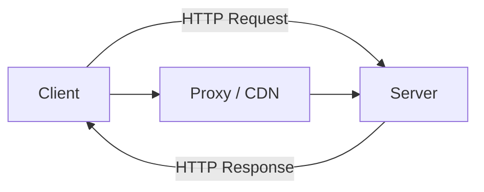

# HTTP / HTTPS (HyperText Transfer Protocol)

## Blogs and websites

- [HTTP/2 vs. HTTP/1.1: How do they affect web performance?](https://www.cloudflare.com/learning/performance/http2-vs-http1.1/)


## Medium

- [Understanding CORS](https://itnext.io/understanding-cors-4157bf640e11)


## Youtube

- [Why HTTP 2 is faster?](https://www.youtube.com/watch?v=4HqpvUtK00g)


## Theory

### Topics Covered

1. [HTTP and REST Fundamentals](#http-and-rest-fundamentals)
2. [HTTPS: Security Through Encryption](#https-security-through-encryption)
3. [HTTP/1.1 vs HTTP/2 vs HTTP/3](#http11-vs-http2-vs-http3)
4. [HTTP: Advantages & Disadvantages](#http-advantages--disadvantages)
5. [Alternatives to HTTP](#alternatives-to-http)
6. [Decision Matrix: Which Protocol?](#decision-matrix-which-protocol)
7. [When NOT to Use HTTP](#when-not-to-use-http)
8. [HTTP Best Practices](#http-best-practices)
9. [HTTP Characteristics](#http-characteristics)
10. [HTTP Pros](#http-pros)
11. [HTTP Cons](#http-cons)
12. [HTTP Use Cases](#http-use-cases)
13. [HTTP Components](#http-components)
14. [HTTP Patterns](#http-patterns)
15. [HTTP Benefits](#http-benefits)
16. [HTTP Challenges](#http-challenges)
17. [Java and Spring Boot Examples](#java-and-spring-boot-examples)

---

### HTTP and REST Fundamentals

**HTTP (HyperText Transfer Protocol)** is the foundation of data communication on the web. It's a **request-response**, **stateless**, **application-layer** protocol that defines how clients (browsers, apps) and servers exchange information.

**How HTTP Works:**
```
1. Client opens a TCP connection to the server
2. Client sends an HTTP request (method, URL, headers, body)
3. Server processes the request
4. Server sends an HTTP response (status code, headers, body)
5. Connection may be reused (keep-alive) or closed
```

**Key Characteristics:**
- **Stateless**: Each request is independent. The server doesn't remember previous requests. State is managed via cookies, tokens, or sessions.
- **Text-based** (HTTP/1.1): Human-readable headers and messages. HTTP/2+ uses binary framing.
- **Extensible**: Custom headers and content types allow flexible communication.

**REST (Representational State Transfer)** is an architectural style built on top of HTTP. It treats everything as a **resource** identified by a URL, manipulated through standard HTTP methods.

**REST Principles:**
- **Resources**: Everything is a resource (`/users`, `/products/123`)
- **HTTP Methods as Verbs**: GET (read), POST (create), PUT (update), DELETE (remove)
- **Stateless**: Server holds no client context between requests
- **Uniform Interface**: Consistent URL patterns and response formats
- **Cacheable**: Responses declare cacheability via headers

**HTTP Request Anatomy:**
```http
GET /api/users/123 HTTP/1.1
Host: api.example.com
Authorization: Bearer eyJhbG...
Accept: application/json
```

**HTTP Response Anatomy:**
```http
HTTP/1.1 200 OK
Content-Type: application/json
Cache-Control: max-age=3600

{"id": 123, "name": "John", "email": "john@example.com"}
```

**HTTPS** is HTTP over TLS/SSL. It encrypts all communication between client and server, preventing eavesdropping, tampering, and impersonation. HTTPS is mandatory for any production system.

---

Application layer protocol for web communication.

**HTTP Methods:**
- **GET**: Retrieve data
- **POST**: Submit data
- **PUT**: Update/replace resource
- **PATCH**: Partial update
- **DELETE**: Remove resource
- **HEAD**: Get headers only
- **OPTIONS**: Get supported methods

**HTTP Status Codes:**

**1xx - Informational** (Request received, processing)
```
100 Continue          → "Keep sending request body"
101 Switching Protocols → "Upgrading to WebSocket"
```

**2xx - Success** (Request succeeded)
```
200 OK                → "Success, here's your data"
201 Created           → "Resource created successfully"
202 Accepted          → "Request accepted, processing async"
204 No Content        → "Success, but no data to return"
206 Partial Content   → "Here's part of the file (resume download)"
```

**3xx - Redirection** (Further action needed)
```
301 Moved Permanently → "Resource moved, update bookmarks"
302 Found            → "Temporary redirect, try this URL"
304 Not Modified     → "Use your cached version"
307 Temporary Redirect → "Temporary, keep using original URL"
308 Permanent Redirect → "Permanent, change all references"
```

**4xx - Client Errors** (Client messed up)
```
400 Bad Request      → "Your request is malformed"
401 Unauthorized     → "You need to authenticate"
403 Forbidden        → "Authenticated but not allowed"
404 Not Found        → "Resource doesn't exist"
405 Method Not Allowed → "Can't POST to this endpoint"
409 Conflict         → "Resource state conflict"
429 Too Many Requests → "Rate limit exceeded"
```

**5xx - Server Errors** (Server messed up)
```
500 Internal Server Error → "Something broke on our end"
502 Bad Gateway          → "Upstream server error"
503 Service Unavailable  → "Temporarily down/overloaded"
504 Gateway Timeout      → "Upstream server didn't respond"
```

**Real API Example:**
```http
# Success flow
POST /api/users HTTP/1.1
Host: api.example.com
Content-Type: application/json

{"name": "John", "email": "john@example.com"}

↓ Response:
HTTP/1.1 201 Created
Location: /api/users/123
Content-Type: application/json

{"id": 123, "name": "John", "email": "john@example.com"}

# Error flow
POST /api/users HTTP/1.1
{"name": "John"}  ← Missing email

↓ Response:
HTTP/1.1 400 Bad Request

{"error": "email is required"}
```

### HTTPS: Security Through Encryption

**HTTP vs HTTPS:**
```
HTTP (Insecure):
Client ←─────plaintext─────→ Server
       "password123"  ← Anyone can read!
       
HTTPS (Secure):
Client ←───encrypted───→ Server
       "8x$mK9#..."  ← Gibberish to eavesdroppers
```

**TLS Handshake (How HTTPS Works):**
```
1. Client Hello
   ┌────────┐                    ┌────────┐
   │ Client │ ──────────────────→ │ Server │
   └────────┘  "Let's use TLS 1.3"└────────┘
                "Supported ciphers: ..."

2. Server Hello + Certificate
   ┌────────┐                    ┌────────┐
   │ Client │ ←────────────────── │ Server │
   └────────┘  "Use TLS 1.3"      └────────┘
                "Here's my certificate"
                "Signed by: Let's Encrypt"

3. Client Verifies Certificate
   ┌────────┐
   │ Client │ Checks:
   └────────┘   ✓ Certificate signed by trusted CA?
                ✓ Domain matches?
                ✓ Not expired?
                ✓ Not revoked?

4. Key Exchange
   ┌────────┐                    ┌────────┐
   │ Client │ ←───────────────→  │ Server │
   └────────┘  Generate shared    └────────┘
                encryption key
                (using asymmetric crypto)

5. Encrypted Communication
   ┌────────┐                    ┌────────┐
   │ Client │ ←═════════════════→ │ Server │
   └────────┘  All data encrypted └────────┘
                with shared key
```

**What HTTPS Protects Against:**

```
✓ Eavesdropping
  Attacker: Can't read passwords, credit cards, messages

✓ Tampering
  Attacker: Can't modify requests/responses

✓ Impersonation
  Attacker: Can't pretend to be your bank

✗ Doesn't protect against
  - Server being hacked
  - Client having malware
  - DNS hijacking (before connection)
  - Trust in CA system being broken
```

**SSL Certificate Example:**
```
Certificate:
  Subject: CN=example.com
  Issuer: CN=Let's Encrypt
  Valid: 2026-01-01 to 2026-04-01 (90 days)
  Public Key: RSA 2048 bits
  Signature Algorithm: SHA256-RSA
  Subject Alternative Names:
    - example.com
    - www.example.com
    - *.example.com (wildcard)
```

**Check Certificate:**
```bash
# Using OpenSSL
openssl s_client -connect example.com:443 -servername example.com

# Using curl
curl -vI https://example.com

# Browser: Click padlock icon in address bar
```

### HTTP/1.1 vs HTTP/2 vs HTTP/3

**HTTP/1.1 (1997-2015):**
```
Limitations:
┌──────────────────────────────────────┐
│ Request 1 → Response 1               │
│ Request 2 → Response 2 (waits!)      │
│ Request 3 → Response 3 (waits!)      │
└──────────────────────────────────────┘

Problems:
- Head-of-line blocking
- 1 request at a time per connection
- Workaround: Multiple connections (6-8)
- Large headers (repeated cookies, etc.)
```

**HTTP/2 (2015):**
```
Improvements:
┌──────────────────────────────────────┐
│      Single TCP Connection           │
├─────────┬─────────┬─────────┬────────┤
│Stream 1 │Stream 2 │Stream 3 │Stream 4│
│ Request │ Request │ Request │ Request│
│Response │Response │Response │Response│
└─────────┴─────────┴─────────┴────────┘

Features:
✓ Multiplexing: Multiple requests in parallel
✓ Header Compression: HPACK algorithm
✓ Server Push: Send resources before requested
✓ Binary Protocol: More efficient parsing

Example:
Browser requests index.html
  ↓
Server pushes:
  - style.css
  - script.js
  - logo.png
Before browser even asks!
```

**HTTP/3 (2020+):**
```
Built on QUIC (over UDP, not TCP):

HTTP/2 Problem:
┌──────────────────┐
│  TCP Layer       │ ← One packet lost = all streams blocked
└──────────────────┘

HTTP/3 Solution:
┌──────────────────┐
│  QUIC (UDP)      │ ← Each stream independent
└──────────────────┘

Benefits:
✓ Faster connection setup (0-RTT)
✓ Better loss recovery (no head-of-line blocking)
✓ Connection migration (survive IP changes)
✓ Built-in encryption (TLS 1.3 mandatory)

Mobile Example:
Phone switches from WiFi to 4G
  ↓
HTTP/2: Connection drops, restart handshake (slow)
HTTP/3: Connection continues seamlessly (fast)
```

**Performance Comparison:**
```
Loading website with 100 resources:

HTTP/1.1:
├─ Connection setup: 100ms
├─ Request 1-6: parallel (200ms)
├─ Request 7-12: wait... (200ms)
├─ Request 13-18: wait... (200ms)
└─ Total: ~1.5 seconds

HTTP/2:
├─ Connection setup: 100ms
├─ All 100 requests: parallel (200ms)
└─ Total: ~300ms (5x faster!)

HTTP/3:
├─ Connection setup: 0ms (0-RTT)
├─ All 100 requests: parallel (200ms)
└─ Total: ~200ms (7.5x faster!)
```

**Adoption Status:**
```
HTTP/1.1: 100% support (fallback)
HTTP/2:   ~95% support (widely deployed)
HTTP/3:   ~70% support (growing rapidly)

Major sites using HTTP/3:
- Google
- Facebook
- Cloudflare
- Netflix
```

### HTTP: Advantages & Disadvantages

**Advantages:**
```
✓ Universal Support
  - Works on every platform
  - Every language has HTTP libraries
  - Browser native support

✓ Simple & Human-Readable
  - Text-based protocol
  - Easy to debug (curl, browser DevTools)
  - Self-documenting (headers explain themselves)

✓ Stateless
  - Each request independent
  - Easy to scale horizontally
  - Simple load balancing

✓ Firewall-Friendly
  - Ports 80/443 usually open
  - Works through corporate proxies
  - NAT traversal easier

✓ Rich Ecosystem
  - Countless tools and libraries
  - Well-understood debugging
  - Mature best practices

✓ Flexible
  - Works with any content type
  - Extensible via headers
  - Supports various auth methods
```

**Disadvantages:**
```
✗ Overhead
  - Text format larger than binary
  - Headers repeated on every request
  - Verbose for simple operations

✗ Stateless Complexity
  - Session management needed
  - Cookies/tokens for state
  - Authentication on every request

✗ Latency
  - HTTP/1.1: Head-of-line blocking
  - Multiple round trips for handshake
  - Not ideal for real-time

✗ Security Requires HTTPS
  - Plain HTTP is insecure
  - Certificate management overhead
  - TLS adds latency

✗ Not Bidirectional (HTTP/1.1)
  - Client must initiate
  - Server can't push (until HTTP/2)
  - Polling needed for updates

✗ Resource Intensive
  - Connection overhead
  - Keep-alive helps but not perfect
  - Server resources per connection
```

### Alternatives to HTTP

**1. WebSockets**
```
Use When:
  ✓ Bidirectional communication needed
  ✓ Real-time updates (chat, gaming)
  ✓ Continuous data stream
  ✓ Low latency critical

Advantages over HTTP:
  + Full-duplex (both directions)
  + Single persistent connection
  + Lower overhead (no headers per message)
  + Server can push anytime

Disadvantages:
  - More complex to implement
  - Harder to load balance
  - Firewall issues possible
  - Connection state management

Example:
  Chat application: HTTP → WebSocket
  Before: Poll every 1s for new messages
  After: Server pushes messages instantly
```

**2. gRPC**
```
Use When:
  ✓ Microservices communication
  ✓ Performance critical
  ✓ Strongly typed contracts needed
  ✓ Streaming required

Advantages over HTTP/REST:
  + Binary protocol (smaller, faster)
  + HTTP/2 multiplexing built-in
  + Code generation (type safety)
  + Bidirectional streaming
  + Better performance (10x faster)

Disadvantages:
  - Not browser-native
  - Less human-readable
  - Steeper learning curve
  - Limited tooling vs REST
  - Requires HTTP/2

Comparison:
  REST API: 1000 requests/sec
  gRPC: 10,000+ requests/sec (same hardware)
```

**3. GraphQL**
```
Use When:
  ✓ Complex data requirements
  ✓ Multiple client types (web, mobile)
  ✓ Avoid over-fetching
  ✓ Flexible queries needed

Advantages over REST:
  + Single endpoint
  + Request exactly what you need
  + No over-fetching or under-fetching
  + Strong typing
  + Real-time via subscriptions

Disadvantages:
  - Caching harder
  - Complexity for simple cases
  - Can expose too much
  - Query cost unpredictable
  - Learning curve

Example:
  REST: 3 endpoints, 2 KB response (over-fetch)
  GraphQL: 1 endpoint, 0.5 KB (exact data)
```

**4. Server-Sent Events (SSE)**
```
Use When:
  ✓ One-way updates (server → client)
  ✓ Simpler than WebSocket
  ✓ Auto-reconnect needed
  ✓ Text-based updates

Advantages over HTTP polling:
  + Real-time push
  + Automatic reconnection
  + Built-in event IDs
  + Simpler than WebSocket

Advantages over WebSocket:
  + Simpler (just HTTP)
  + Better browser support
  + HTTP/2 compatible

Disadvantages vs WebSocket:
  - One-way only (server → client)
  - Text only (no binary)
  - Less efficient than WebSocket

Example:
  Stock ticker: SSE perfect (server pushes prices)
  Chat: WebSocket better (bidirectional)
```

**5. Message Queues (Kafka, RabbitMQ)**
```
Use When:
  ✓ Asynchronous processing
  ✓ Decoupling services
  ✓ High throughput needed
  ✓ Reliability critical

Advantages over HTTP:
  + Guaranteed delivery
  + Buffering (handle spikes)
  + Replay capability
  + Decoupling
  + Higher throughput

Disadvantages:
  - More complex infrastructure
  - Not for synchronous requests
  - Eventual consistency
  - Additional latency

Example:
  Order processing:
  HTTP: Synchronous, fails if service down
  Kafka: Async, queued until service recovers
```

**6. UDP-based Protocols (QUIC, WebRTC)**
```
Use When:
  ✓ Real-time media (video, voice)
  ✓ Gaming
  ✓ IoT with packet loss tolerance
  ✓ Ultra-low latency needed

Advantages over HTTP/TCP:
  + Lower latency (no retransmission delays)
  + Better for real-time
  + Connection migration (HTTP/3)
  + No head-of-line blocking

Disadvantages:
  - Less reliable (no guaranteed delivery)
  - Firewall issues
  - More complex implementation
  - Not suitable for most APIs

Example:
  Video call: UDP (some frame loss acceptable)
  File download: TCP (every byte matters)
```

### Decision Matrix: Which Protocol?

| Need | Best Choice | Why |
|------|-------------|-----|
| **REST API** | HTTP/2 | Standard, widely supported |
| **Real-time chat** | WebSocket | Bidirectional, low latency |
| **Live notifications** | SSE | Simple, auto-reconnect |
| **Microservices** | gRPC | Performance, type safety |
| **Complex queries** | GraphQL | Flexible, avoid over-fetch |
| **Async processing** | Message Queue | Reliable, decoupled |
| **Video streaming** | WebRTC/QUIC | Low latency, packet loss OK |
| **File upload** | HTTP multipart | Simple, standard |
| **Bulk data transfer** | HTTP/2 or gRPC | Streaming, efficient |

### When NOT to Use HTTP

```
✗ Real-time gaming
  → Use UDP/WebSocket (latency critical)

✗ Video/voice calls
  → Use WebRTC (packet loss tolerable)

✗ High-frequency trading
  → Use custom binary protocol (microseconds matter)

✗ IoT sensors (millions)
  → Use MQTT (lightweight, pub/sub)

✗ Inter-service calls (microservices)
  → Consider gRPC (faster, type-safe)

✗ Large file transfers (GB+)
  → Consider BitTorrent/custom (P2P, resumable)
```

### HTTP Best Practices

**Do's:**
```
✓ Use HTTPS everywhere (even dev)
✓ Implement proper HTTP status codes
✓ Use HTTP/2 minimum (HTTP/3 when possible)
✓ Implement caching headers
✓ Compress responses (gzip, brotli)
✓ Use connection pooling
✓ Implement rate limiting
✓ Version your APIs (/v1/, /v2/)
✓ Use idempotent methods correctly
✓ Return proper error messages
```

**Don'ts:**
```
✗ Don't use GET for state changes
✗ Don't send sensitive data in URLs
✗ Don't ignore status codes (don't return 200 for errors)
✗ Don't create new connections per request
✗ Don't send uncompressed large payloads
✗ Don't use HTTP for real-time gaming
✗ Don't expose internal error details
✗ Don't use custom headers when standard ones exist

---

### HTTP Characteristics

- **Request-response model**
  The client sends a request, and the server returns a response. The client initiates every exchange.

- **Stateless**
  Each request is independent. The server does not retain session state unless cookies, tokens, or external stores are used.

- **Application-layer protocol**
  HTTP operates above TCP and defines how applications exchange structured messages.

- **Text-based in HTTP/1.1**
  HTTP/1.1 messages are human-readable. HTTP/2 and HTTP/3 use binary framing.

- **Extensible**
  Custom headers, methods, and content types allow the protocol to evolve without breaking existing systems.

- **Uniform resource identification**
  URLs identify resources, and HTTP methods define operations on those resources.

- **Status-code driven**
  Responses carry standardized status codes that communicate success, redirect, client error, or server error.

- **Cacheable**
  Responses can be cached by clients, proxies, and CDNs using cache headers.

- **Connection management**
  HTTP/1.1 supports persistent connections; HTTP/2 multiplexes multiple streams over one connection.

- **Content negotiation**
  Clients and servers agree on representation using headers such as `Accept` and `Content-Type`.

---

### HTTP Pros

- **Universal support**
  Every language, framework, browser, and device supports HTTP.

- **Human-readable**
  HTTP/1.1 messages can be inspected and debugged directly.

- **Simple mental model**
  Request, response, method, URL, status code — easy to reason about.

- **Firewall-friendly**
  Ports 80 and 443 are almost always open, making HTTP easy to deploy across networks.

- **Stateless scalability**
  Stateless servers can be replicated horizontally behind load balancers.

- **Rich ecosystem**
  Tooling, libraries, proxies, CDNs, and monitoring are mature and abundant.

- **Flexible content types**
  JSON, HTML, XML, binary, and streaming formats can all be exchanged.

- **Built-in caching**
  HTTP caching headers and conditional requests reduce bandwidth and latency.

- **HTTPS security**
  TLS provides encryption, integrity, and server authentication.

---

### HTTP Cons

- **Text overhead**
  HTTP/1.1 headers and JSON bodies are verbose compared with binary protocols.

- **Latency**
  Multiple round trips for TLS and connection setup add overhead.

- **Head-of-line blocking**
  HTTP/1.1 blocks subsequent requests on a connection; HTTP/2 can still be affected by TCP-level packet loss.

- **No built-in state**
  Applications must manage sessions, authentication, and user context.

- **Plain HTTP is insecure**
  Without TLS, traffic is visible and modifiable.

- **Not ideal for real-time**
  Bidirectional and ultra-low-latency use cases often require WebSockets or UDP-based protocols.

- **Connection overhead**
  Each connection consumes server resources, especially at high concurrency.

- **Statelessness complicates workflows**
  Re-authentication and context reconstruction are required on every request.

---

### HTTP Use Cases

- **Web pages and applications**
  Browsers request HTML, CSS, JavaScript, and assets from web servers.

- **REST APIs**
  HTTP methods map to CRUD operations on resources.

- **File upload and download**
  HTTP supports multipart uploads, range requests, and streaming responses.

- **Authentication flows**
  OAuth 2.0, OpenID Connect, and cookie-based sessions run over HTTP.

- **Microservices communication**
  Services exchange JSON or XML over HTTP, often behind an API gateway.

- **Content delivery**
  CDNs and proxies cache and serve HTTP responses.

- **Webhooks**
  Providers deliver event notifications to consumer HTTP endpoints.

- **Server-sent events**
  SSE streams server-to-client updates over HTTP.

- **Health checks and monitoring**
  Services expose HTTP endpoints for liveness and readiness probes.

---

### HTTP Components

- **Client**
  The browser, mobile app, or service that sends requests.

- **Server**
  The application that receives requests and returns responses.

- **URL**
  Identifies the requested resource.

- **HTTP method**
  Defines the operation: GET, POST, PUT, PATCH, DELETE, HEAD, OPTIONS.

- **Headers**
  Carry metadata such as content type, authentication, caching, and cookies.

- **Request body**
  Contains data sent by the client, such as JSON or form data.

- **Response status**
  Indicates success or failure with a standardized code.

- **Response body**
  Contains the resource representation returned by the server.

- **Proxy and CDN**
  Intermediaries that cache, filter, or route requests.

- **TLS layer**
  Encrypts the connection in HTTPS.



---

### HTTP Patterns

- **REST**
  Resources are identified by URLs, and HTTP methods define operations.

- **RPC over HTTP**
  APIs expose action-oriented endpoints rather than pure resources.

- **GraphQL over HTTP**
  A single endpoint accepts structured queries and mutations.

- **Webhooks**
  Servers push events to registered HTTP endpoints.

- **Server-sent events**
  Servers stream updates to clients over a long-lived HTTP response.

- **API gateway**
  A single HTTP entry point routes, authenticates, and rate-limits requests.

- **Caching and revalidation**
  ETags and `Last-Modified` support conditional requests to avoid re-sending data.

- **Content negotiation**
  Servers return different representations based on `Accept` headers.

- **Versioned APIs**
  URLs or headers identify API versions to preserve compatibility.

- **Health check endpoints**
  Services expose HTTP liveness and readiness probes for orchestration.

---

### HTTP Benefits

- **Interoperability**
  Different systems can communicate using a shared, open protocol.

- **Scalability**
  Stateless HTTP servers scale horizontally.

- **Debuggability**
  Requests and responses can be inspected with standard tools.

- **Caching**
  HTTP caching reduces latency and backend load.

- **Security**
  HTTPS provides transport-layer encryption and authentication.

- **Maturity**
  Decades of real-world use have produced reliable best practices.

- **Flexibility**
  HTTP supports many content types and communication styles.

---

### HTTP Challenges

- **Latency optimization**
  Reducing round trips, payload size, and TLS overhead requires tuning.

- **Session management**
  Statelessness forces external session storage and token handling.

- **Security hardening**
  HTTPS, headers, CORS, and rate limiting must be configured correctly.

- **API design**
  Consistent resource modeling, versioning, and error handling require discipline.

- **Backward compatibility**
  Changing an API can break existing clients.

- **Caching correctness**
  Private or personalized data must never be served from a shared cache.

- **Distributed tracing**
  Correlating requests across many HTTP services requires instrumentation.

---

### Java and Spring Boot Examples

#### 1. REST controller with proper status codes

```java
import org.springframework.http.ResponseEntity;
import org.springframework.web.bind.annotation.*;

import java.util.Map;
import java.util.Optional;
import java.util.concurrent.ConcurrentHashMap;

@RestController
@RequestMapping("/api/users")
public class UserController {

    private final Map<Long, User> users = new ConcurrentHashMap<>();

    @GetMapping("/{id}")
    public ResponseEntity<User> getUser(@PathVariable Long id) {
        return Optional.ofNullable(users.get(id))
            .map(ResponseEntity::ok)
            .orElse(ResponseEntity.notFound().build());
    }

    @PostMapping
    public ResponseEntity<User> createUser(@RequestBody User user) {
        users.put(user.id(), user);
        return ResponseEntity.status(201).body(user);
    }

    @DeleteMapping("/{id}")
    public ResponseEntity<Void> deleteUser(@PathVariable Long id) {
        return users.remove(id) != null
            ? ResponseEntity.noContent().build()
            : ResponseEntity.notFound().build();
    }
}
```

#### 2. Global exception handler

```java
import org.springframework.http.HttpStatus;
import org.springframework.http.ResponseEntity;
import org.springframework.web.bind.annotation.*;

import java.util.Map;

@RestControllerAdvice
public class GlobalExceptionHandler {

    @ExceptionHandler(IllegalArgumentException.class)
    public ResponseEntity<Map<String, String>> handleBadRequest(IllegalArgumentException e) {
        return ResponseEntity.badRequest().body(Map.of("error", e.getMessage()));
    }

    @ExceptionHandler(Exception.class)
    public ResponseEntity<Map<String, String>> handleServerError(Exception e) {
        return ResponseEntity.status(HttpStatus.INTERNAL_SERVER_ERROR)
            .body(Map.of("error", "Internal server error"));
    }
}
```

#### 3. HTTP client with RestClient

```java
import org.springframework.stereotype.Service;
import org.springframework.web.client.RestClient;

@Service
public class ExternalApiClient {

    private final RestClient restClient = RestClient.create("https://api.example.com");

    public User getUser(Long id) {
        return restClient.get()
            .uri("/api/users/{id}", id)
            .retrieve()
            .body(User.class);
    }

    public User createUser(User user) {
        return restClient.post()
            .uri("/api/users")
            .body(user)
            .retrieve()
            .body(User.class);
    }
}
```

#### 4. Caching with ETag and cache headers

```java
import org.springframework.http.CacheControl;
import org.springframework.http.ResponseEntity;
import org.springframework.web.bind.annotation.*;

import java.util.concurrent.TimeUnit;

@RestController
@RequestMapping("/api/products")
public class ProductController {

    @GetMapping("/{id}")
    public ResponseEntity<Product> getProduct(@PathVariable Long id) {
        Product product = new Product(id, "Sample Product");
        return ResponseEntity.ok()
            .cacheControl(CacheControl.maxAge(5, TimeUnit.MINUTES).cachePublic())
            .eTag("\"product-" + id + "\"")
            .body(product);
    }
}
```

**Interview questions and answers**

- **Q: Why is HTTP considered stateless?**
  **A:** Each request contains all the information needed to process it, and the server does not retain client state between requests unless external mechanisms are used.

- **Q: What is the difference between PUT and PATCH?**
  **A:** PUT replaces the entire resource, while PATCH applies a partial update.

- **Q: How do you secure a Spring Boot HTTP API?**
  **A:** Use HTTPS, validate all input, apply authentication and authorization, return proper status codes, and implement rate limiting.
```
