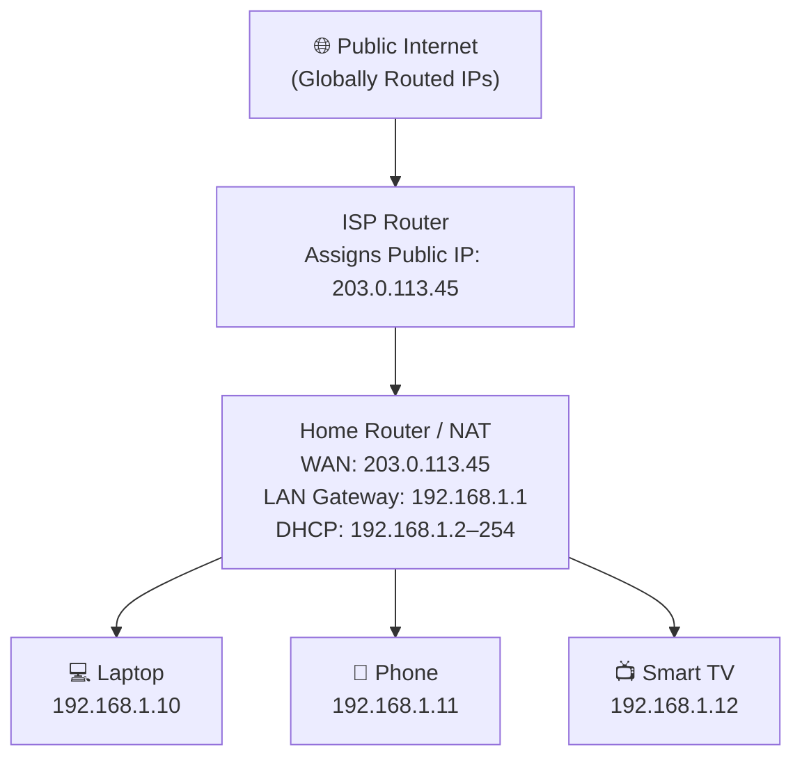
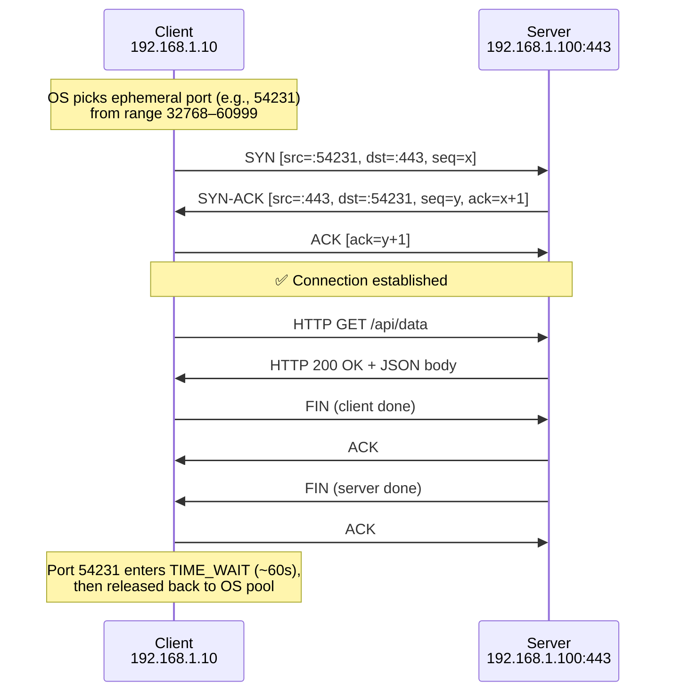
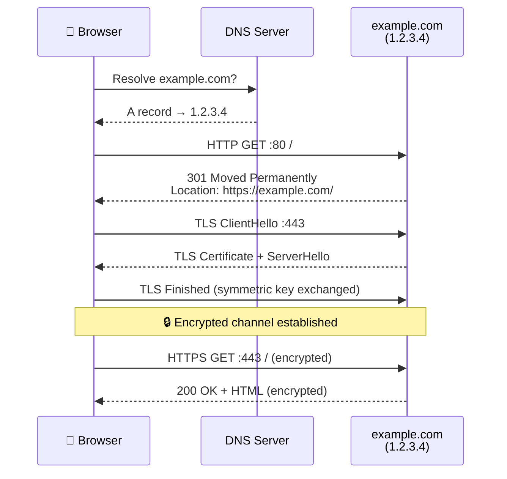
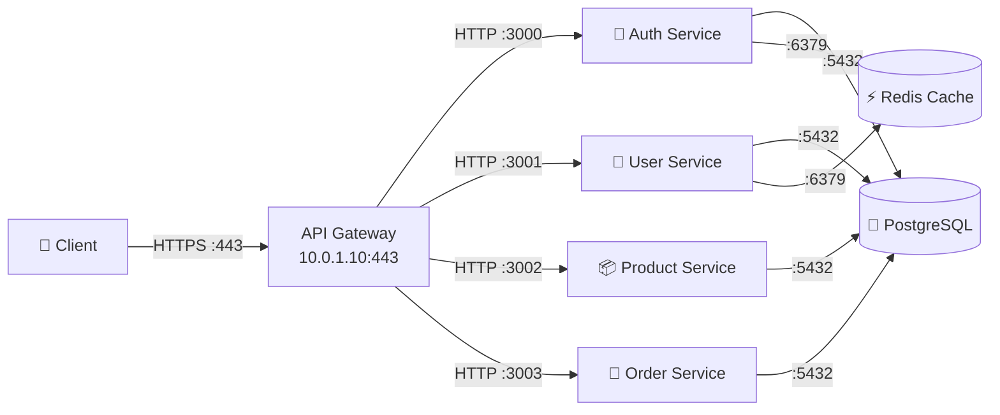
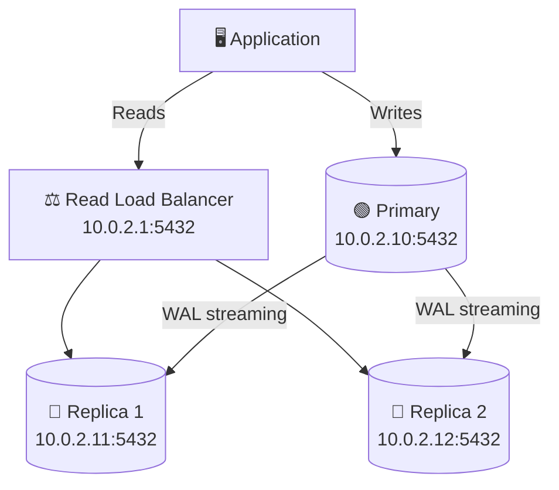
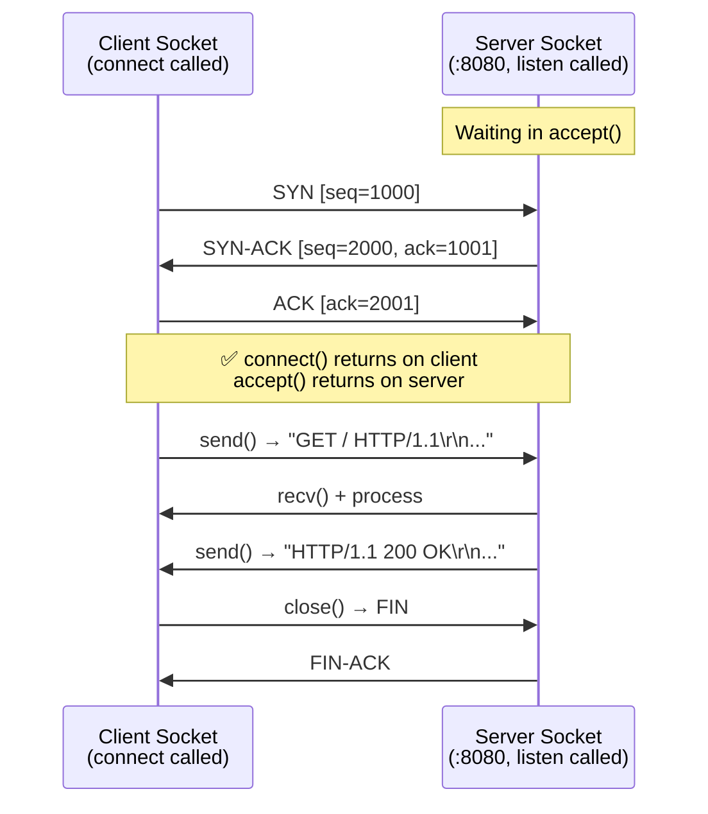
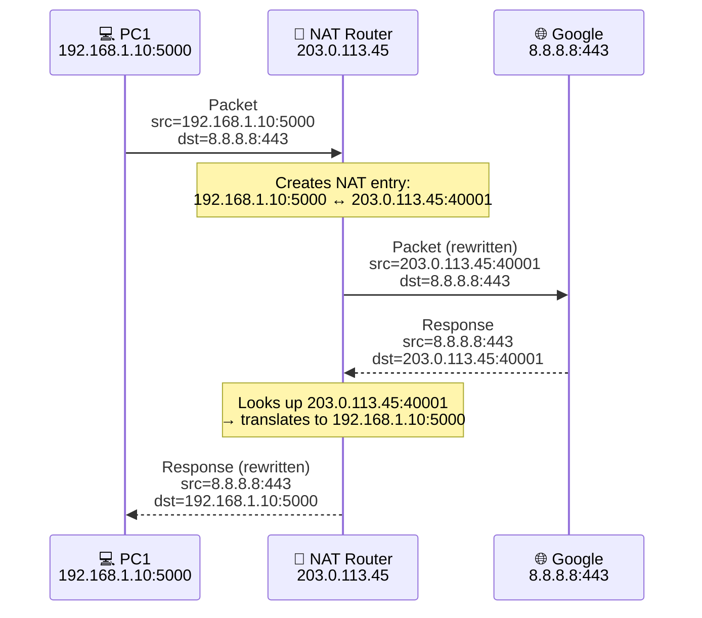
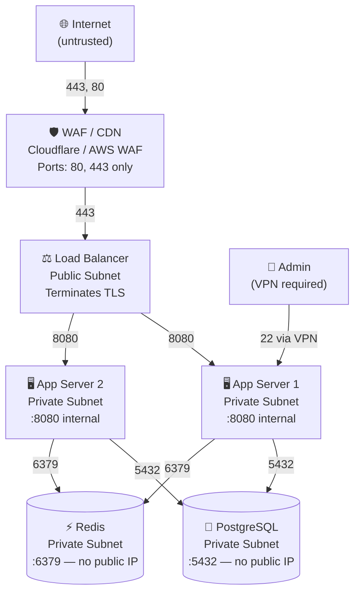

# IP Addresses & Ports

## Blogs and websites


## Medium


## Youtube


## Theory

### IP Addresses: The Internet's Postal System

**IP Address**: A unique numerical label assigned to every device on a network that uses the Internet Protocol (IP) for communication. Think of it exactly like a postal address — without one, data packets have no destination to route towards.

Every packet sent over the internet contains two IP addresses in its header:
- **Source IP** — where the packet came from
- **Destination IP** — where the packet should go

Routers read these headers and forward packets hop-by-hop until they reach the destination.

#### IPv4 Architecture

**Format**: 32-bit address (4 bytes), written as dotted decimal notation. Each of the 4 "octets" is a number from 0–255.

```
192  .  168  .   1   .  100
 ↓       ↓       ↓       ↓
 8 bits  8 bits  8 bits  8 bits  =  32 bits total

Binary representation:
11000000 . 10101000 . 00000001 . 01100100
   192   .    168   .     1    .    100

Each octet:
  00000000 = 0
  11111111 = 255
  Range per octet: 0–255

Total unique IPv4 addresses: 2^32 = 4,294,967,296 (~4.3 billion)
```

**Address Classes (Classful Networking):**

The original IP addressing scheme divided the 32-bit space into fixed classes. While largely superseded by CIDR (below), classes explain why you'll commonly see `10.x.x.x`, `172.16–31.x.x`, and `192.168.x.x` as private network addresses.

```
Class A: 0.0.0.0      to 127.255.255.255
         Network: 8 bits  |  Host: 24 bits  →  16,777,214 hosts/network
         First bit always 0
         Example: 10.1.2.3  (Network=10, Host=1.2.3)
         Users: ISPs, huge enterprises (APNIC, MIT, etc.)

Class B: 128.0.0.0    to 191.255.255.255
         Network: 16 bits  |  Host: 16 bits  →  65,534 hosts/network
         First two bits always 10
         Example: 172.16.1.100  (Network=172.16, Host=1.100)
         Users: Medium-large organizations, universities

Class C: 192.0.0.0    to 223.255.255.255
         Network: 24 bits  |  Host: 8 bits  →  254 hosts/network
         First three bits always 110
         Example: 192.168.1.50  (Network=192.168.1, Host=50)
         Users: Small offices, home networks

Special ranges:
  127.0.0.0   – 127.255.255.255  →  Loopback (localhost/self, never leaves NIC)
  169.254.0.0 – 169.254.255.255  →  APIPA / Link-local (auto-assigned when DHCP fails)
  0.0.0.0                        →  "This host" / wildcard listen address
  255.255.255.255                →  Limited broadcast (all devices on local segment)
```

**CIDR Notation (Modern Approach):**

CIDR (Classless Inter-Domain Routing, RFC 1519) replaced classful addressing. You specify the network with a slash and a prefix length — the number of bits that form the "network" portion. This allows flexible, efficient IP allocation.

```
192.168.1.0/24  →  prefix length 24

Breakdown:
  IP address:   192.168.1.0    = 11000000.10101000.00000001.00000000
  Subnet mask: /24             = 11111111.11111111.11111111.00000000
                                  ←────── network ──────────→ ←hosts→

  Network address:  192.168.1.0    (all host bits = 0, not assignable)
  Broadcast:        192.168.1.255  (all host bits = 1, not assignable)
  Usable host range: 192.168.1.1 – 192.168.1.254  (254 hosts)

Common subnet sizes:
  /8   →  16,777,214 hosts   mask: 255.0.0.0       (e.g., 10.0.0.0/8)
  /16  →      65,534 hosts   mask: 255.255.0.0      (e.g., 172.16.0.0/16)
  /24  →         254 hosts   mask: 255.255.255.0    (e.g., 192.168.1.0/24)
  /28  →          14 hosts   mask: 255.255.255.240  (small cloud subnet)
  /30  →           2 hosts   mask: 255.255.255.252  (point-to-point links)
  /32  →           1 host    mask: 255.255.255.255  (single host route)
```

**Private vs Public IP Addresses:**

RFC 1918 defines three address blocks permanently reserved for private/internal use. These are free to reuse inside any organization but are never forwarded by public internet routers.

```
Private IP Ranges (RFC 1918):
┌───────────────────────────────────────────────────────────────┐
│ Range                           CIDR        Class   # Hosts   │
├───────────────────────────────────────────────────────────────┤
│ 10.0.0.0  – 10.255.255.255     10.0.0.0/8    A     16.7M     │
│ 172.16.0.0 – 172.31.255.255   172.16.0.0/12  B     1.05M     │
│ 192.168.0.0 – 192.168.255.255 192.168.0.0/16 C     65K       │
└───────────────────────────────────────────────────────────────┘

Why private IPs exist:
  → IPv4 has ~4.3 billion addresses total — not enough for every device
  → Organizations reuse private ranges internally (no global uniqueness needed)
  → Only the edge router needs a globally unique public IP
  → NAT bridges private ↔ public worlds

Public IPs:
  → Globally unique, managed by IANA → RIRs (ARIN, RIPE, APNIC, etc.)
  → Routable across the entire Internet
  → Assigned by your ISP (dynamic) or cloud provider (static EIP, floating IP, etc.)
```

**Real-World Example — Home Network:**
```
Your Home Network:
┌─────────────────────────────────────────────────────────────┐
│ Public IP: 203.0.113.45  (assigned by ISP via DHCP/PPPoE)  │
│                                                              │
│  Modem + Router (NAT + DHCP server)                        │
│    └─ Private LAN: 192.168.1.0/24                          │
│         ├─ Router gateway:  192.168.1.1                    │
│         ├─ Laptop:          192.168.1.10  (DHCP lease)     │
│         ├─ Phone:           192.168.1.11  (DHCP lease)     │
│         └─ Smart TV:        192.168.1.12  (DHCP lease)     │
└─────────────────────────────────────────────────────────────┘

What happens when your laptop visits google.com:
  1. Laptop sends packet: src=192.168.1.10:54231  dst=142.250.80.46:443
  2. Router NAT rewrites: src=203.0.113.45:54231  dst=142.250.80.46:443
  3. Google responds to:  dst=203.0.113.45:54231
  4. Router translates back and delivers to 192.168.1.10:54231
```

**Network Hierarchy Diagram:**



---

#### IPv6: The Future (and Present)

**Format**: 128-bit address (16 bytes), written as 8 groups of 4 hexadecimal digits separated by colons.

```
Full form (128 bits, 32 hex digits):
  2001:0db8:85a3:0000:0000:8a2e:0370:7334

Simplification Rule 1 — Drop leading zeros in each group:
  2001:db8:85a3:0:0:8a2e:370:7334

Simplification Rule 2 — Replace one longest run of all-zero groups with :::
  2001:db8:85a3::8a2e:370:7334

Important: :: can appear only ONCE (otherwise the address is ambiguous)
  VALID:    ::1            (loopback — all zeros except last bit)
  VALID:    2001:db8::1
  INVALID:  2001::db8::1  ← rejected, ambiguous

IPv6 in URLs — wrap in square brackets to distinguish : from port separator:
  http://[2001:db8::1]:8080/path
```

**Why IPv6?**

```
IPv4 Problem:
  → 2^32 = ~4.3 billion addresses — exhausted by IANA in February 2011
  → ARIN (North America) ran out in 2015
  → NAT is a workaround that breaks end-to-end connectivity
  → NAT complicates P2P, VoIP, online gaming, IoT

IPv6 Solution:
  → 2^128 = 340,282,366,920,938,463,463,374,607,431,768,211,456
  → ~340 undecillion — effectively unlimited
  → ~50 octillion addresses per person on Earth
  → Built-in IPSec support
  → Stateless Address Autoconfiguration (SLAAC) — no DHCP needed
  → No NAT required: every device can have a globally unique address
  → Better multicast, no broadcast storms
```

**IPv6 Address Types:**

```
Type            Prefix      IPv4 Equivalent      Scope
──────────────────────────────────────────────────────────────────────
Global Unicast  2000::/3    Public IP            Internet-wide
Link-Local      fe80::/10   169.254.0.0/16       Single network segment
Loopback        ::1         127.0.0.1            Self only
Unique Local    fc00::/7    RFC1918 private       Organization-internal
Multicast       ff00::/8    224.0.0.0/4          One-to-many group
Anycast         (any GUA)   —                    Nearest of a group
```

**Global Unicast Address Structure:**

```
2001:db8:85a3:1234:5678:8a2e:370:7334
│◄──────── 48 bits ────────►│◄16b►│◄────── 64 bits ──────────►│
    Global Routing Prefix    Subnet    Interface ID
    (assigned by ISP/RIR)    (your    (often derived from MAC
                              subnet)  via EUI-64 or random)

Example breakdown:
  2001:0db8   → Assigned to your ISP by IANA
  85a3        → ISP assigns this prefix to your org
  1234        → Your subnet ID (you choose)
  5678:8a2e:0370:7334 → Interface ID (auto-generated from MAC or random)
```

**Dual-Stack (IPv4 + IPv6 coexistence):**

```
Most production servers today run both protocols simultaneously.

example.com DNS records:
  A    record → 93.184.216.34            (IPv4)
  AAAA record → 2606:2800:220:1:248:...  (IPv6)

Browser behavior (Happy Eyeballs - RFC 8305):
  1. Query both A and AAAA simultaneously
  2. Try IPv6 first (slight preference)
  3. If IPv6 fails after 250ms, race with IPv4
  4. Use whichever connects first

Transition mechanisms:
  → Dual-stack: server speaks both (preferred)
  → 6to4: encapsulate IPv6 in IPv4 tunnels
  → NAT64: translate IPv6 ↔ IPv4 at border
```

---

### Ports: Doorways to Applications

**Concept**: An IP address gets you to the right server (the building). A port number gets you to the right application on that server (the apartment). Multiple services can run simultaneously on the same server because each binds to a unique port.

```
Server: 192.168.1.100
┌─────────────────────────────────────────────────────┐
│ Port 22:    SSH Daemon         ← ssh user@server    │
│ Port 80:    Nginx (HTTP)       ← http://server      │
│ Port 443:   Nginx (HTTPS)      ← https://server     │
│ Port 3000:  Node.js App        ← http://server:3000 │
│ Port 5432:  PostgreSQL DB      ← postgres://server  │
│ Port 6379:  Redis Cache        ← redis://server     │
│ Port 27017: MongoDB            ← mongodb://server   │
└─────────────────────────────────────────────────────┘

Port number facts:
  → 16-bit unsigned integer → range: 0 to 65,535
  → Stored in the transport layer header (TCP/UDP)

A TCP/UDP connection is uniquely identified by a 5-tuple:
  (Protocol, Source IP, Source Port, Destination IP, Destination Port)

  This means the same client IP can have thousands of simultaneous
  connections to the same server port, each with a different source port.
```

**TCP vs UDP Ports:**

```
TCP (Transmission Control Protocol):
  ✓ Connection-oriented: requires 3-way handshake before data transfer
  ✓ Reliable: guarantees delivery, ordering, and error detection
  ✓ Flow control and congestion control built-in
  ✓ Used by: HTTP/HTTPS, SSH, FTP, SMTP, PostgreSQL, MySQL, Redis
  → OS maintains per-connection state machine

  TCP States: LISTEN → SYN_RCVD → ESTABLISHED → FIN_WAIT → TIME_WAIT → CLOSED

UDP (User Datagram Protocol):
  ✓ Connectionless: no handshake, send and forget
  ✓ Lower latency (no setup overhead)
  ✓ No guaranteed delivery or ordering
  ✓ Used by: DNS, NTP, DHCP, video streaming (WebRTC), VoIP, QUIC (HTTP/3)
  → No per-connection state maintained by OS

Same port number, different protocols:
  TCP 53 = DNS for large responses (>512 bytes) and zone transfers
  UDP 53 = DNS for standard queries (faster, stateless)
  TCP 443 = HTTPS (TLS over TCP)
  UDP 443 = HTTPS via QUIC/HTTP3 (TLS over UDP)
```

**TCP Connection Port Lifecycle:**



#### Port Ranges and Their Purposes

**Well-Known Ports (0–1023):** Assigned by IANA; require root/administrator to bind.

```
Port     Protocol  Transport  Description
──────────────────────────────────────────────────────────────────────────────
20       FTP-data  TCP        File Transfer — data channel (active mode)
21       FTP-ctrl  TCP        File Transfer — command/control channel
22       SSH       TCP        Secure Shell: encrypted remote login + tunneling
23       Telnet    TCP        Unencrypted remote login — NEVER use in production
25       SMTP      TCP        Email relay between mail servers
53       DNS       TCP/UDP    Domain Name resolution (UDP standard, TCP for large)
67       DHCP      UDP        DHCP server (IP lease offers)
68       DHCP      UDP        DHCP client (IP lease requests)
80       HTTP      TCP        Unencrypted web traffic
110      POP3      TCP        Email retrieval (downloads + deletes from server)
143      IMAP      TCP        Email access with sync (multi-device friendly)
443      HTTPS     TCP/UDP    Encrypted web (TLS/TCP or QUIC/UDP)
465      SMTPS     TCP        SMTP over implicit TLS (email submission)
587      SMTP      TCP        SMTP with STARTTLS (preferred submission port)
993      IMAPS     TCP        IMAP over TLS
995      POP3S     TCP        POP3 over TLS
3306     MySQL     TCP        MySQL/MariaDB database connections
5432     PostgreSQL TCP       PostgreSQL database connections
6379     Redis     TCP        Redis in-memory data store
27017    MongoDB   TCP        MongoDB document database
```

**Registered Ports (1024–49151):** Application-specific; no root required to bind.

```
Port     Service                Common Use
────────────────────────────────────────────────────────────────────────
3000     Node.js / Grafana      Express/React dev server, Grafana dashboard
4200     Angular CLI            Angular development server
5000     Flask / .NET           Python Flask default, ASP.NET Kestrel
5173     Vite                   Modern frontend dev server (Vite, SvelteKit)
5601     Kibana                 Elasticsearch visualization dashboard
8000     Django / SimpleHTTP    Django dev server, Python's http.server
8080     HTTP alt               Tomcat, Jenkins, proxy servers, dev APIs
8443     HTTPS alt              Alternative HTTPS for non-root dev/proxy
9090     Prometheus             Metrics scraping endpoint
9200     Elasticsearch          Elasticsearch HTTP REST API
15672    RabbitMQ mgmt          RabbitMQ management web UI
2181     ZooKeeper              Kafka/ZooKeeper coordination port
9092     Kafka                  Kafka broker (producer/consumer connections)
```

**Dynamic/Ephemeral Ports (49152–65535):** Auto-assigned by the OS for outgoing connections.

```
When your browser makes a request:
  Your OS picks a temporary "ephemeral" port from its available pool.

Example — browser visits https://google.com:
  Source:      192.168.1.10:54231   ← OS-assigned ephemeral port
  Destination: 142.250.80.46:443    ← well-known HTTPS port

After the connection closes, port 54231 is returned to the pool
and can be reused for the next connection.

Linux ephemeral range (default): 32768–60999
  Check: cat /proc/sys/net/ipv4/ip_local_port_range

Why this matters at scale:
  → A single server on port 443 can serve millions of clients
    because each client pair is unique by (client IP, client port)
  → If a client exhausts its ephemeral range (~28K ports), new
    connections fail with "Cannot assign requested address"
  → Solution: use multiple source IPs or tune the port range

Visualized:
  Client 192.168.1.10:54231 ──→ Server 1.2.3.4:443   ✓ connection 1
  Client 192.168.1.10:54232 ──→ Server 1.2.3.4:443   ✓ connection 2
  Client 192.168.1.10:54233 ──→ Server 1.2.3.4:443   ✓ connection 3
  (all three are distinct 5-tuples — OS tracks them independently)
```

#### Real-World Use Cases

**Use Case 1: Web Server with HTTPS Redirect**

When a user types `http://example.com`, their browser connects to port 80. The server redirects them to HTTPS (port 443), where all subsequent communication is encrypted.

```
Server setup (Nginx):
┌──────────────────────────────────────────────────────────────┐
│ example.com (1.2.3.4)                                        │
│   Port 80  → Nginx: receive HTTP, issue 301 redirect        │
│   Port 443 → Nginx: TLS termination + serve content         │
└──────────────────────────────────────────────────────────────┘
```



**Use Case 2: Microservices with API Gateway**

In a microservices architecture, each service owns its own port. The API gateway is the single external entry point, routing requests to the correct service internally. Only ports 80/443 are exposed to the internet.

```
External traffic (port 443 only — everything else blocked by firewall)
        ↓
┌─────────────────────────────────────────────────────────┐
│  API Gateway: 10.0.1.10:443                             │
│  Routing rules:                                         │
│    POST /auth/login    → Auth Service :3000             │
│    GET  /users/{id}    → User Service :3001             │
│    GET  /products      → Product Service :3002          │
│    POST /orders        → Order Service :3003            │
└─────────────────────────────────────────────────────────┘
        ↓  Internal private network (firewall blocks direct access)
┌─────────────────────────────────────────────────────────────────┐
│ App Server: 10.0.1.50                                           │
│   :3000  Auth Service    — JWT validation, login/logout         │
│   :3001  User Service    — User CRUD operations                 │
│   :3002  Product Service — Catalog, search, pricing             │
│   :3003  Order Service   — Order lifecycle, payments            │
│   :6379  Redis           — Session store, rate-limit counters   │
│   :5432  PostgreSQL      — Primary data persistence             │
└─────────────────────────────────────────────────────────────────┘
```



**Use Case 3: Database Read Replica Cluster**

Write traffic goes to the primary. Read traffic is spread across replicas to scale read throughput. The replicas stay in sync via WAL (Write-Ahead Log) streaming replication.

```
Application:
  → Writes → Primary  (10.0.2.10:5432)
  → Reads  → Read Load Balancer (10.0.2.1:5432) → Replica 1 or 2

PostgreSQL Cluster:
┌──────────────────────────────────────────────────────────┐
│ Primary:   10.0.2.10:5432  (accepts reads + writes)     │
│      │                                                   │
│      │──── WAL streaming replication ───────────────┐   │
│      ↓                                               ↓   │
│ Replica 1: 10.0.2.11:5432  (read-only)              │   │
│ Replica 2: 10.0.2.12:5432  (read-only)  ← ─────────┘   │
└──────────────────────────────────────────────────────────┘
  Replication lag: typically <1 second (async) or 0 (synchronous mode)
```



```python
# Application config — separate write and read connections
from sqlalchemy import create_engine
import random

write_engine = create_engine("postgresql://10.0.2.10:5432/mydb",
                              pool_size=10, max_overflow=20)

read_replicas = [
    "postgresql://10.0.2.11:5432/mydb",
    "postgresql://10.0.2.12:5432/mydb",
]

def get_read_engine():
    # Simple random replica selection (or use a proper load balancer)
    return create_engine(random.choice(read_replicas), pool_size=20)
```

#### Code Example: Socket Programming

Sockets are the OS API between your application code and the network stack. Understanding sockets reveals exactly how IP addresses and port numbers work at runtime.

**How a socket works at the OS level:**

```
Server side:                          Client side:
  socket()    ← create endpoint         socket()    ← create endpoint
  bind()      ← assign IP:port          connect()   ← initiate 3-way handshake
  listen()    ← mark as passive              ↕
  accept()    ← block, wait for client   send()/recv() ← exchange data
  send()/recv() ← exchange data          close()
  close()
```

**TCP 3-Way Handshake (what happens under the hood during `connect()`):**



**Python TCP Server (handles multiple clients using threads):**

```python
import socket
import threading

def handle_client(client_socket, addr):
    """Handle one client connection — runs in its own thread."""
    print(f"[+] Connected: {addr[0]}:{addr[1]}")
    try:
        # recv() blocks until data arrives or connection closes
        data = client_socket.recv(4096)
        if not data:
            return
        print(f"[<] Received {len(data)} bytes")

        # Build minimal HTTP response
        response = (
            "HTTP/1.1 200 OK\r\n"
            "Content-Type: text/plain\r\n"
            "Connection: close\r\n"
            "\r\n"
            "Hello from Python socket server!"
        )
        client_socket.sendall(response.encode())
    finally:
        client_socket.close()
        print(f"[-] Disconnected: {addr[0]}:{addr[1]}")

# AF_INET = IPv4  |  AF_INET6 = IPv6
# SOCK_STREAM = TCP  |  SOCK_DGRAM = UDP
server = socket.socket(socket.AF_INET, socket.SOCK_STREAM)

# SO_REUSEADDR: avoids "Address already in use" error on quick restart
server.setsockopt(socket.SOL_SOCKET, socket.SO_REUSEADDR, 1)

# '0.0.0.0' = listen on ALL interfaces (loopback + ethernet + Wi-Fi)
# Use '127.0.0.1' to restrict to loopback only (localhost)
server.bind(('0.0.0.0', 8080))

# backlog=5: OS queues up to 5 pending connections before refusing new ones
server.listen(5)
print("[*] Listening on 0.0.0.0:8080")

while True:
    conn, addr = server.accept()       # blocks until a client connects
    t = threading.Thread(target=handle_client, args=(conn, addr))
    t.daemon = True
    t.start()
```

**Python TCP Client:**

```python
import socket

# Create IPv4 TCP socket
client = socket.socket(socket.AF_INET, socket.SOCK_STREAM)

# Set a timeout so connect() doesn't block forever
client.settimeout(5)

server_ip   = '127.0.0.1'   # Use actual server IP in production
server_port = 8080

# This triggers the 3-way TCP handshake
client.connect((server_ip, server_port))
print(f"[*] Connected to {server_ip}:{server_port}")
print(f"[*] Our local address: {client.getsockname()}")  # shows ephemeral port

# sendall() ensures all bytes are sent (unlike send() which may send partial)
request = "GET / HTTP/1.1\r\nHost: localhost\r\nConnection: close\r\n\r\n"
client.sendall(request.encode())

# Read all response data until server closes the connection
chunks = []
while True:
    chunk = client.recv(4096)
    if not chunk:
        break
    chunks.append(chunk)

response = b"".join(chunks).decode()
print(response)
client.close()
```

**UDP Socket Example (connectionless — DNS-style):**

```python
import socket

# ── UDP SERVER ──────────────────────────────────────────────────────
server = socket.socket(socket.AF_INET, socket.SOCK_DGRAM)
server.bind(('0.0.0.0', 5353))
print("[*] UDP server listening on :5353")

while True:
    # recvfrom returns (data, (client_ip, client_port))
    data, addr = server.recvfrom(512)   # 512 bytes = DNS UDP max
    print(f"[<] Query from {addr}: {data}")
    server.sendto(b"response_data", addr)   # no connect() needed

# ── UDP CLIENT ──────────────────────────────────────────────────────
client = socket.socket(socket.AF_INET, socket.SOCK_DGRAM)
client.settimeout(2)    # UDP has no built-in timeout

client.sendto(b"my_query", ('192.168.1.100', 5353))
response, server_addr = client.recvfrom(512)
print(f"[<] Response from {server_addr}: {response}")
client.close()
# Note: no connection teardown — UDP is stateless
```

#### Network Address Translation (NAT)

NAT solves the IPv4 exhaustion problem by allowing many private IP devices to share a single public IP address. The router acts as a translator, rewriting packet headers on the fly.

**Three Types of NAT:**

```
SNAT (Source NAT / Masquerade):
  Direction: Outbound (private → internet)
  Action:    Rewrites the SOURCE IP (and port) of outgoing packets
  Use case:  Home routers, cloud instances with private IPs accessing internet
  Example:   192.168.1.10:5000 → 203.0.113.45:40001 → 8.8.8.8:443

DNAT (Destination NAT / Port Forwarding):
  Direction: Inbound (internet → private)
  Action:    Rewrites the DESTINATION IP (and optionally port) of incoming packets
  Use case:  Expose an internal server to the internet
  Example:   203.0.113.45:80 → 192.168.1.50:80 (home web server)

PAT (Port Address Translation / NAT Overload):
  The combination of SNAT + port remapping used by virtually all home routers
  One public IP → many private IPs, differentiated by port numbers
```

**How PAT Works in Detail:**

```
Internal Network                    NAT Router (PAT)              Internet
                                    WAN: 203.0.113.45
┌───────────────────────┐          ┌─────────────────┐         ┌──────────────┐
│ PC1: 192.168.1.10     │──┐       │  Translation    │         │ 8.8.8.8 DNS  │
│ PC2: 192.168.1.11     │──┼──────▶│  Table (PAT)    │────────▶│ 1.1.1.1 CF   │
│ PC3: 192.168.1.12     │──┘       │                 │◀────────│ 93.1.1.1 etc │
└───────────────────────┘          └─────────────────┘         └──────────────┘

PAT Translation Table:
┌───────────────────────────────────────────────────────────────────────┐
│ Internal (private)       │ External (NATed)          │ Destination    │
├───────────────────────────────────────────────────────────────────────┤
│ 192.168.1.10:5000        │ 203.0.113.45:40001        │ 8.8.8.8:53     │
│ 192.168.1.11:5000  ←same port!│ 203.0.113.45:40002  │ 1.1.1.1:443    │
│ 192.168.1.12:5000  ←same port!│ 203.0.113.45:40003  │ 93.1.1.1:80    │
└───────────────────────────────────────────────────────────────────────┘

Key insight: All three PCs use source port 5000 internally — PAT remaps
each to a unique external port so the router knows who to send replies to.
```

**Full Outbound NAT Flow:**



**Port Forwarding (DNAT) — Exposing Internal Services:**

```
Goal: Make your home server (192.168.1.50:80) reachable from the internet.

Router DNAT rule:
  "Incoming traffic on 203.0.113.45:80 → forward to 192.168.1.50:80"

External user → 203.0.113.45:80
                      ↓ DNAT rewrites destination IP
               192.168.1.50:80 (internal web server)

Common port forwarding use cases:
  → Self-hosted websites or APIs
  → Home lab Minecraft/game server
  → Self-hosted VPN endpoint (WireGuard on 51820/UDP)
  → NAS remote access (e.g., Synology DSM on 5001)
  → SSH access from outside (forward external 2222 → internal 22)
```

**NAT Limitations (why IPv6 matters):**

```
NAT breaks:
  → End-to-end connectivity (can't initiate inbound without port forwarding)
  → Protocols that embed IPs in payload (FTP active mode, SIP/VoIP)
  → P2P applications need NAT traversal (STUN/TURN/ICE)
  → Increases complexity and state in routers (stateful NAT tables)
  → Each NAT entry consumes router memory; large tables = performance hit

IPv6 eliminates the need for NAT by giving every device a globally unique IP.
```

#### Common Networking Commands

**Find your IP address:**

```bash
# ── Linux ─────────────────────────────────────────────────────────────
ip addr show                        # all interfaces with IPs (modern)
ip addr show eth0                   # specific interface
hostname -I                         # just the primary IP(s), no labels

ifconfig                            # traditional (may need net-tools)
ifconfig eth0 | grep 'inet '        # just IPv4 of eth0

# ── macOS ─────────────────────────────────────────────────────────────
ipconfig getifaddr en0              # Wi-Fi IP
ipconfig getifaddr en1              # Ethernet IP
networksetup -getinfo Wi-Fi         # IP, subnet, router for Wi-Fi

# ── Windows ───────────────────────────────────────────────────────────
ipconfig /all                       # full details: IP, MAC, DNS, DHCP
ipconfig /displaydns                # show cached DNS entries
ipconfig /flushdns                  # clear DNS resolver cache

# ── Any OS — public IP (what the internet sees) ──────────────────────
curl ifconfig.me
curl ipinfo.io/ip

# Example output (ip addr show):
# 2: eth0: <BROADCAST,MULTICAST,UP,LOWER_UP> mtu 1500
#     inet  192.168.1.100/24  brd 192.168.1.255  scope global  eth0
#     inet6 fe80::1/64  scope link
#             ↑ IPv4                              ↑ IPv6 link-local
```

**Check which process is using a port:**

```bash
# ── Linux ─────────────────────────────────────────────────────────────
sudo lsof -i :8080                  # which process uses port 8080
sudo lsof -i TCP -P -n              # all TCP listeners, numeric IPs
sudo ss -tlnp | grep 8080           # ss: faster modern netstat alternative
sudo netstat -tuln | grep 8080      # traditional netstat

# Kill a process occupying a port
sudo fuser -k 8080/tcp              # kill by port

# ── macOS ─────────────────────────────────────────────────────────────
sudo lsof -i :8080 -sTCP:LISTEN    # TCP listeners on 8080
lsof -nP -iTCP:8080                # numeric, no port name resolution

# ── Windows ───────────────────────────────────────────────────────────
netstat -ano | findstr :8080        # find PID using port 8080
tasklist | findstr <PID>            # find process name from PID

# Sample output (lsof):
# COMMAND   PID   USER  FD  TYPE  NODE NAME
# node     1234   dev   21u IPv4 12345 TCP *:8080 (LISTEN)
#                                          ↑ listening on all interfaces
```

**Test connectivity to an IP:Port:**

```bash
# ── TCP reachability ─────────────────────────────────────────────────
nc -zv 192.168.1.100 8080           # netcat: -z scan, -v verbose
nc -zv -w 3 192.168.1.100 8080      # with 3-second timeout
telnet 192.168.1.100 8080           # interactive, old-school

# ── UDP reachability ─────────────────────────────────────────────────
nc -zuv 192.168.1.100 53            # UDP (-u) check

# ── HTTP endpoint testing ─────────────────────────────────────────────
curl -v http://192.168.1.100:8080/health      # verbose: see headers
curl -o /dev/null -sw "%{http_code}" http://192.168.1.100:8080/  # just status code
curl -k https://192.168.1.100:8443/health     # -k = ignore TLS cert errors

# ── Port scanning ─────────────────────────────────────────────────────
nmap 192.168.1.100 -p 80,443,8080   # scan specific ports
nmap 192.168.1.100 -p 1-1024        # scan first 1024 ports
nmap 192.168.1.0/24 -p 22 --open   # find SSH hosts on subnet
nmap -sU 192.168.1.100 -p 53       # UDP scan (DNS)

# ── Trace network path ────────────────────────────────────────────────
traceroute google.com               # Linux/Mac: shows each hop/router
tracert google.com                  # Windows equivalent
mtr google.com                      # interactive, combines ping + traceroute
```

**View active connections:**

```bash
# All established TCP connections (no DNS lookup for speed)
ss -tn                              # modern, fast
netstat -tn                         # traditional

# All listening ports with process names
ss -tlnp
netstat -tlnp

# Watch connections in real-time
watch -n 1 "ss -tn | grep ESTABLISHED | wc -l"  # count connections per second

# Output format (ss -tn):
# State    Recv-Q  Send-Q  Local Address:Port    Peer Address:Port
# ESTAB    0       0       192.168.1.10:54231    142.250.80.46:443
```

#### Security Considerations

**Principle of Least Exposure:**

Every open port is a potential attack surface. Only expose ports that external users or services genuinely need. Everything else should be blocked at the firewall.

**Firewall Rules:**

```bash
# ── iptables (Linux — low-level) ──────────────────────────────────────
# Default-deny: allow only what's explicitly permitted
sudo iptables -P INPUT DROP           # block all incoming by default
sudo iptables -P FORWARD DROP         # block forwarding by default
sudo iptables -P OUTPUT ACCEPT        # allow all outgoing

# Allow established connections to return (critical — don't forget this!)
sudo iptables -A INPUT -m state --state ESTABLISHED,RELATED -j ACCEPT

# Allow loopback (localhost communication)
sudo iptables -A INPUT -i lo -j ACCEPT

# Allow HTTPS and HTTP from anywhere
sudo iptables -A INPUT -p tcp --dport 443 -j ACCEPT
sudo iptables -A INPUT -p tcp --dport 80  -j ACCEPT

# Allow SSH only from a specific IP (your admin IP)
sudo iptables -A INPUT -p tcp --dport 22 -s 10.0.0.5/32 -j ACCEPT

# ── UFW (Ubuntu/Debian — simpler) ────────────────────────────────────
sudo ufw default deny incoming
sudo ufw default allow outgoing
sudo ufw allow 80/tcp
sudo ufw allow 443/tcp
sudo ufw allow from 10.0.0.5 to any port 22   # SSH from specific IP
sudo ufw enable
sudo ufw status verbose

# ── Cloud Security Group (AWS-style) ────────────────────────────────
Inbound Rules:
┌────────────┬──────────┬─────────────┬─────────────────────────────────┐
│ Type       │ Protocol │ Port        │ Source                          │
├────────────┼──────────┼─────────────┼─────────────────────────────────┤
│ HTTPS      │ TCP      │ 443         │ 0.0.0.0/0  (entire internet)   │
│ HTTP       │ TCP      │ 80          │ 0.0.0.0/0  (redirect to HTTPS) │
│ SSH        │ TCP      │ 22          │ 203.0.113.1/32  (your IP only) │
│ PostgreSQL │ TCP      │ 5432        │ 10.0.0.0/16  (VPC internal)    │
│ Redis      │ TCP      │ 6379        │ 10.0.0.0/16  (VPC internal)    │
│ Custom App │ TCP      │ 8080        │ 10.0.1.0/24  (app tier only)   │
└────────────┴──────────┴─────────────┴─────────────────────────────────┘
Note: Databases never have a 0.0.0.0/0 rule. Ever.
```

**Secure Architecture Diagram:**



**Best Practices with Rationale:**

```
┌────────────────────────────────────────────────────────────────────────────┐
│ DO                                          WHY                            │
├────────────────────────────────────────────────────────────────────────────┤
│ ✓ Default-deny firewall posture            Block unexpected services       │
│ ✓ Expose only 80/443 publicly             Minimize internet-facing surface │
│ ✓ Use non-standard SSH port (e.g., 2222)  Reduces automated scanner noise  │
│ ✓ Restrict SSH to specific IP/CIDR        Prevent brute-force from internet│
│ ✓ Use VPN for internal service access     Encrypted, authenticated tunnel  │
│ ✓ Put DBs in private subnets (no pub IP)  No direct internet route exists  │
│ ✓ Bind dev services to 127.0.0.1          Prevent accidental LAN exposure  │
│ ✓ Regularly audit open ports (nmap)       Detect unauthorized changes      │
│ ✓ Use fail2ban or similar on SSH          Auto-block repeated failures      │
│ ✓ Prefer key-based SSH over passwords     Passwords bruteforceable          │
├────────────────────────────────────────────────────────────────────────────┤
│ DON'T                                       RISK                           │
├────────────────────────────────────────────────────────────────────────────┤
│ ✗ Expose DB ports (3306, 5432) publicly   Direct database compromise       │
│ ✗ Use Telnet (port 23)                    Credentials in plaintext         │
│ ✗ Bind services to 0.0.0.0 in prod       Accidentally exposed to network   │
│ ✗ Allow 0.0.0.0/0 SSH                    Internet can attempt login        │
│ ✗ Use Redis without requirepass           Unauthenticated data access       │
│ ✗ Leave MongoDB with no auth on :27017    Historic mass exploitations       │
└────────────────────────────────────────────────────────────────────────────┘
```

**Common Port-Based Attacks and Mitigations:**

```
Attack                      Port(s)      Mitigation
──────────────────────────────────────────────────────────────────────────────
SSH Brute Force             22           fail2ban, key-only auth, non-std port
SQL Injection (via API)     80/443       WAF, parameterized queries, input validation
Unauthenticated Redis       6379         Bind to 127.0.0.1, set requirepass
MongoDB NoAuth Exploit      27017        Enable auth, bind to private IP
Elasticsearch Data Leak     9200         Bind to private IP, enable X-Pack security
SSRF → Internal Ports       various      Validate/block internal IPs in user input
Port Scanning               all          IDS/IPS (Snort/Suricata), block repeated SYN
```
