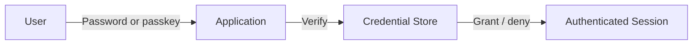
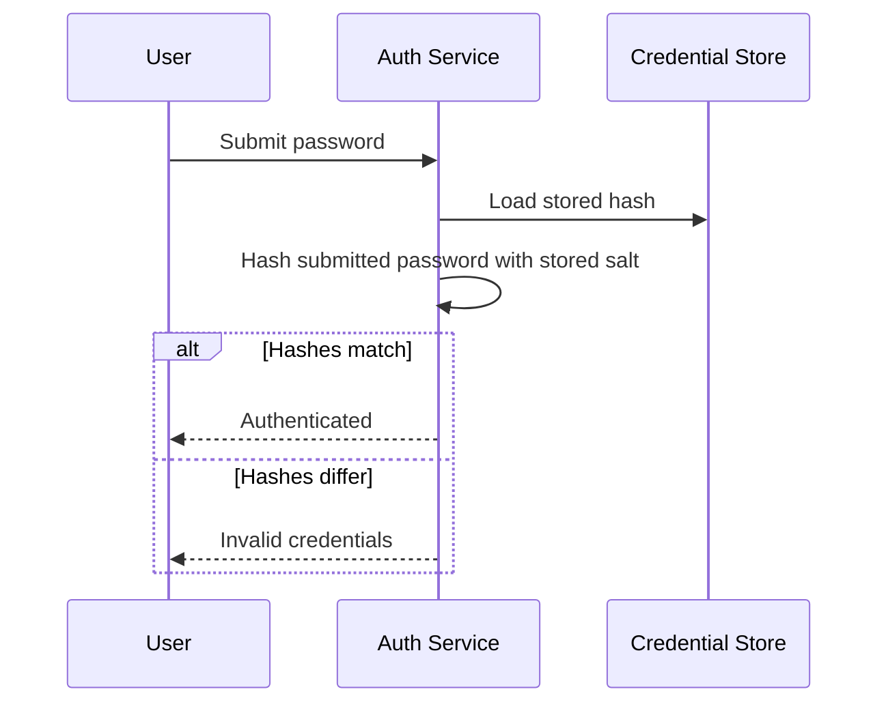
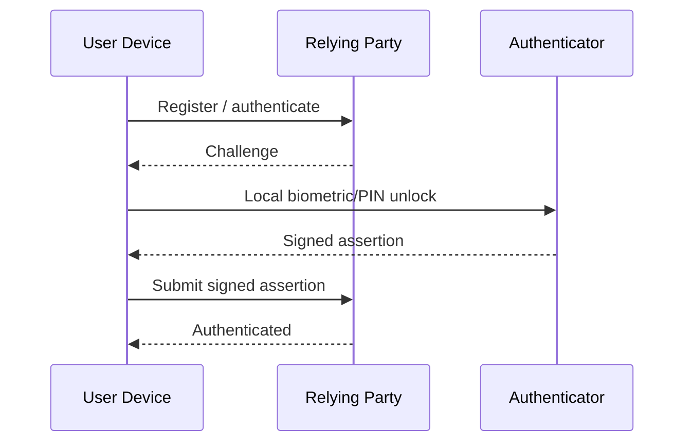
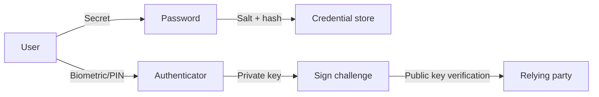

# Passwords and Passkeys

## Blogs and websites


## Medium


## Youtube

- [How Databases Store Passwords Securely](https://www.youtube.com/watch?v=TuNvdQUVkto)
- [Passkeys Explained | Why Apple, Google & Microsoft Want to KILL Passwords](https://www.youtube.com/watch?v=6Dq4Z8Nk1z8)

## Theory

### Topics Covered

1. [Introduction](#introduction)
2. [Password Storage](#password-storage)
3. [Password Attacks](#password-attacks)
4. [Passkeys and WebAuthn](#passkeys-and-webauthn)
5. [Characteristics](#characteristics)
6. [Pros](#pros)
7. [Cons](#cons)
8. [Use Cases](#use-cases)
9. [Components](#components)
10. [Patterns](#patterns)
11. [Benefits](#benefits)
12. [Challenges](#challenges)
13. [Best Practices](#best-practices)
14. [When to Use](#when-to-use)
15. [Java and Spring Boot Examples](#java-and-spring-boot-examples)

---

### Introduction

Password and passkey authentication is the first line of defense for most systems. A password proves *something you know*; a passkey proves *something you have* and *something you are* through public-key cryptography and local biometric or device verification.



**Real-life use cases**

- **Web application login**: users authenticate with a username and password.
- **Mobile app login**: devices use biometrics backed by passkeys.
- **Password recovery**: systems verify identity through email or security questions.
- **Single sign-on (SSO)**: an identity provider authenticates once for many apps.
- **Administrative access**: privileged accounts use strong passwords and MFA.

**Interview questions and answers**

- **Q: What is the difference between a password and a passkey?**
  **A:** A password is a shared secret the server stores; a passkey is a public-key credential where only the user's device holds the private key.

- **Q: Why should passwords never be stored in plaintext?**
  **A:** A database breach would expose every credential, allowing attackers to reuse passwords across services.

- **Q: What is the purpose of a salt?**
  **A:** A salt is a random value added to each password before hashing so identical passwords produce different hashes and precomputed attacks become infeasible.

---

### Password Storage

Passwords must be stored as salted, slow hashes, never in plaintext or with reversible encryption.

**Why general-purpose hashes are wrong:**

- SHA-256 and MD5 are designed to be fast.
- Fast hashing lets attackers try billions of guesses per second.
- Unsalted hashes allow rainbow-table and duplicate-password detection.

**Password hashing algorithms:**

- **bcrypt**: battle-tested, tunable cost factor.
- **Argon2id**: modern winner of the Password Hashing Competition.
- **PBKDF2**: NIST-approved and widely supported.
- **scrypt**: memory-hard by design.

**Storage flow:**

1. Generate a unique random salt.
2. Hash the password with the salt using a slow algorithm.
3. Store the algorithm identifier, cost parameters, salt, and digest together.
4. On login, hash the submitted password with the stored parameters and compare.



**Interview questions and answers**

- **Q: Why is Argon2 preferred over bcrypt today?**
  **A:** Argon2 is memory-hard and CPU-hard, making both GPU and memory-efficient attacks more expensive, and it has tunable time, memory, and parallelism parameters.

- **Q: Can a salt be public?**
  **A:** Yes, a salt is not a secret; its job is to make each hash unique and defeat precomputed tables.

- **Q: Why do password hashes need to be slow?**
  **A:** Slow hashing multiplies the cost of brute force. A login can afford a few hundred milliseconds; an attacker cannot afford that cost billions of times.

---

### Password Attacks

Understanding attacks clarifies why storage and policy rules exist.

- **Brute force**: try every possible combination.
- **Dictionary attack**: try common passwords and leaked wordlists.
- **Credential stuffing**: reuse leaked username/password pairs across sites.
- **Rainbow table**: precompute hash-to-password mappings for unsalted hashes.
- **Phishing**: trick a user into revealing credentials on a fake site.
- **Keylogging**: capture keystrokes with malware.
- **Traffic sniffing**: read credentials sent over plaintext HTTP.

**Defenses:**

- Slow salted hashes for storage.
- Multi-factor authentication for login.
- Rate limiting and account lockout.
- Breached-password checking.
- HTTPS everywhere.
- Phishing-resistant passkeys.
- Monitoring for leaked credentials.

**Interview questions and answers**

- **Q: How does rate limiting help password security?**
  **A:** It caps the number of guesses an attacker can make in a time window, making online brute force impractical.

- **Q: Why is credential stuffing effective?**
  **A:** Many users reuse passwords, so a breach at one site yields valid credentials at another.

- **Q: What is breached-password checking?**
  **A:** Rejecting or flagging passwords that appear in known breach corpora, reducing the value of leaked credentials.

---

### Passkeys and WebAuthn

Passkeys replace shared secrets with asymmetric key pairs. A user registers a device, which generates a public/private key pair. The server stores only the public key. Sign-in is a cryptographic challenge signed by the private key, unlocked locally by a biometric or PIN.

**WebAuthn flow:**

1. Registration: client generates a key pair and sends the public key to the server.
2. Authentication: server sends a challenge.
3. Client signs the challenge with the private key after local user verification.
4. Server verifies the signature with the stored public key.



**Why passkeys are stronger:**

- No shared secret for a server breach to expose.
- Phishing-resistant because the credential is bound to the origin.
- No password reuse across sites.
- Local biometrics never leave the device.

**Interview questions and answers**

- **Q: What makes passkeys phishing-resistant?**
  **A:** The private key never leaves the authenticator and the signature is bound to the relying party's origin, so a fake site cannot reuse the credential.

- **Q: Where is the passkey private key stored?**
  **A:** In a secure element, TPM, or the platform's hardware-backed credential store, protected by local user verification.

- **Q: What does the server store for a passkey?**
  **A:** Only the public key, credential ID, and associated metadata, so a server breach does not yield usable secrets.

---

### Characteristics

- **Secret-based for passwords**
  A password is a shared secret known to the user and stored by the server.

- **Key-based for passkeys**
  A passkey uses an asymmetric key pair; the server holds only the public key.

- **Verifiable**
  Authentication proves possession of the secret or private key.

- **Hashable**
  Passwords can be stored as one-way salted hashes.

- **Phishing-susceptible for passwords**
  Users can be tricked into revealing passwords.

- **Phishing-resistant for passkeys**
  Passkey assertions are bound to the relying party's origin.

- **Revocable**
  Both passwords and passkeys can be reset or removed.

- **Policy-driven**
  Length, complexity, expiry, and MFA rules govern password systems.

- **Cross-device for passkeys**
  Passkeys can sync across a user's devices through a platform account.

- **Latency-sensitive**
  Password hashing intentionally introduces a controlled delay.

---

### Pros

- **Ubiquitous passwords**
  Passwords are universally understood and require no special hardware.

- **Strong phishing resistance with passkeys**
  Passkeys eliminate shared secrets and credential theft.

- **No plaintext exposure**
  Proper storage means a breach does not reveal usable credentials.

- **MFA compatibility**
  Passwords combine well with additional factors for defense in depth.

- **Recoverable passwords**
  Lost passwords can be reset through verified recovery channels.

- **Passkey convenience**
  Passkeys remove the need to remember secrets.

- **Hardware-backed passkeys**
  Private keys stay in a secure element or TPM.

- **Scalable verification**
  Hash comparison and public-key signature checks are fast and stateless.

---

### Cons

- **Password reuse**
  Users often reuse passwords across services.

- **Weak passwords**
  Users choose easy-to-guess secrets.

- **Phishing exposure**
  Passwords are vulnerable to convincing fake sites.

- **Breach risk**
  Even hashed passwords can be attacked if the algorithm or salt is weak.

- **Recovery complexity**
  Password reset flows are themselves a security surface.

- **Passkey portability friction**
  Moving passkeys between ecosystems can be challenging.

- **Passkey recovery model**
  If a user loses all enrolled devices, recovery depends on the platform.

- **User education required**
  Both passwords and passkeys demand user understanding to use safely.

---

### Use Cases

- **Web and mobile login**
  Username and password for traditional sign-in.

- **Consumer passkey login**
  Passwordless sign-in using device biometrics.

- **Multi-factor authentication**
  A password as one factor plus a passkey or OTP.

- **Enterprise SSO**
  An identity provider authenticates users across many applications.

- **Privileged access**
  Administrative accounts use strong passwords and hardware keys.

- **Password recovery**
  Email or security-question verification resets credentials.

- **Breached-credential screening**
  Rejecting known-compromised passwords at sign-up or login.

- **API and service authentication**
  Machine credentials use high-entropy secrets or keys.

---

### Components

- **User secret**
  The password or PIN the user knows.

- **Salt**
  A unique random value mixed into the password before hashing.

- **Hash**
  The stored one-way digest of the salted password.

- **Credential store**
  The database or directory holding hashes and public keys.

- **Authenticator**
  A hardware or platform component that creates and signs passkey assertions.

- **Relying party**
  The service that verifies credentials.

- **Challenge**
  A random nonce used in passkey authentication to prevent replay.

- **Public/private key pair**
  The asymmetric credentials behind a passkey.

- **Policy engine**
  Rules for complexity, expiry, lockout, and MFA.



---

### Patterns

- **Salted slow hashing**
  Store each password with a unique salt and a tunable-cost algorithm.

- **Peppering**
  Add a server-side secret to the hash for additional defense in depth.

- **Breached-password screening**
  Check new passwords against known compromise lists.

- **Rate limiting and lockout**
  Slow or block repeated failed attempts.

- **MFA layering**
  Combine something you know, have, and are.

- **Passkey registration**
  Register a device-bound public key as a first-class credential.

- **Passwordless bootstrap**
  Send a one-time link or code as the primary credential.

- **Credential rotation**
  Expire and rotate passwords and machine secrets periodically.

---

### Benefits

- **Confidentiality**
  Salted hashes and public keys avoid exposing usable credentials.

- **Stronger authentication**
  Passkeys and MFA raise the bar against common attacks.

- **Reduced reuse risk**
  Breached-password checks push users toward unique passwords.

- **Phishing resistance**
  Passkeys bind authentication to the correct origin.

- **Compliance**
  Proper credential handling satisfies security standards and regulations.

- **User trust**
  Visible security controls reassure users about data protection.

- **Operational resilience**
  Well-designed recovery and lockout prevent account takeover.

---

### Challenges

- **Balancing security and usability**
  Strict rules frustrate users and encourage weak workarounds.

- **Handling legacy systems**
  Many existing systems store hashes with outdated algorithms.

- **Credential recovery**
  Recovery flows are frequently the weakest link.

- **Key management**
  Peppers, signing keys, and recovery secrets must be protected.

- **Passkey ecosystem fragmentation**
  Sync and portability vary across platforms.

- **Ongoing algorithm evolution**
  Algorithms weaken over time as hardware improves.

- **Detecting compromise**
  Distinguishing a legitimate login from a stolen credential is hard.

---

### Best Practices

- **Use Argon2id, bcrypt, or PBKDF2**
  Store passwords with a slow, salted, memory-hard algorithm.

- **Never store plaintext or reversible encryption**
  Passwords are one-way values.

- **Enforce a reasonable length floor**
  Prefer long passphrases over complex short passwords.

- **Check passwords against breach corpora**
  Reject known-compromised secrets.

- **Enable multi-factor authentication**
  Add a second factor for high-value accounts.

- **Use HTTPS everywhere**
  Protect credentials in transit.

- **Rate limit login attempts**
  Prevent online brute force.

- **Offer passkeys as the default**
  Move users toward phishing-resistant passwordless authentication.

- **Rotate machine secrets**
  Expire API keys and service credentials regularly.

- **Log authentication events securely**
  Record failures and anomalies without logging secrets.

---

### When to Use

- **Use passwords when** broad compatibility and simple sign-up are required.
- **Use passkeys when** phishing resistance and user experience are priorities.
- **Use MFA when** the account is high-value or privileged.
- **Use breached-password screening when** accepting new passwords.
- **Use slow salted hashing when** storing any password.
- **Use hardware keys when** protecting administrative or critical access.

**Do not use shared-secret passwords when**

- Phishing resistance is a hard requirement.
- The user base expects passwordless sign-in.
- The credential will be handled by automated systems that can use keys instead.

---

### Java and Spring Boot Examples

#### 1. Password hashing with BCrypt

```java
import org.springframework.security.crypto.bcrypt.BCryptPasswordEncoder;
import org.springframework.stereotype.Service;

@Service
public class PasswordService {

    private final BCryptPasswordEncoder encoder = new BCryptPasswordEncoder();

    public String hash(String rawPassword) {
        return encoder.encode(rawPassword);
    }

    public boolean matches(String rawPassword, String storedHash) {
        return encoder.matches(rawPassword, storedHash);
    }
}
```

#### 2. Argon2 password hashing with externalized parameters

```java
import org.springframework.beans.factory.annotation.Value;
import org.springframework.security.crypto.argon2.Argon2PasswordEncoder;
import org.springframework.stereotype.Service;

@Service
public class Argon2PasswordService {

    private final Argon2PasswordEncoder encoder;

    public Argon2PasswordService(
            @Value("${app.auth.argon2.salt-length:16}") int saltLength,
            @Value("${app.auth.argon2.hash-length:32}") int hashLength,
            @Value("${app.auth.argon2.parallelism:1}") int parallelism,
            @Value("${app.auth.argon2.memory:65536}") int memory,
            @Value("${app.auth.argon2.iterations:3}") int iterations) {
        this.encoder = new Argon2PasswordEncoder(saltLength, hashLength, parallelism, memory, iterations);
    }

    public String hash(String rawPassword) {
        return encoder.encode(rawPassword);
    }

    public boolean matches(String rawPassword, String storedHash) {
        return encoder.matches(rawPassword, storedHash);
    }
}
```

#### 3. Login attempt rate limiting

```java
import org.springframework.stereotype.Service;

import java.time.Duration;
import java.time.Instant;
import java.util.Map;
import java.util.concurrent.ConcurrentHashMap;
import java.util.concurrent.atomic.AtomicInteger;

@Service
public class LoginRateLimiter {

    private static final int MAX_ATTEMPTS = 5;
    private static final Duration WINDOW = Duration.ofMinutes(15);

    private final Map<String, Attempt> attemptsByUser = new ConcurrentHashMap<>();

    public boolean isAllowed(String username) {
        Instant now = Instant.now();
        Attempt attempt = attemptsByUser.computeIfAbsent(username, u -> new Attempt(now));
        synchronized (attempt) {
            if (attempt.windowStart().plus(WINDOW).isBefore(now)) {
                attempt.reset(now);
            }
            return attempt.count() < MAX_ATTEMPTS;
        }
    }

    public void recordFailure(String username) {
        attemptsByUser.computeIfAbsent(username, u -> new Attempt(Instant.now())).increment();
    }

    public void clear(String username) {
        attemptsByUser.remove(username);
    }

    private static final class Attempt {

        private Instant windowStart;
        private AtomicInteger count;

        private Attempt(Instant start) {
            this.windowStart = start;
            this.count = new AtomicInteger();
        }

        private void reset(Instant start) {
            this.windowStart = start;
            this.count.set(0);
        }

        private int count() {
            return count.get();
        }

        private void increment() {
            count.incrementAndGet();
        }

        private Instant windowStart() {
            return windowStart;
        }
    }
}
```

#### 4. Passkey verification with a public key

```java
import org.springframework.stereotype.Service;

import java.security.PublicKey;
import java.security.Signature;
import java.util.Base64;

@Service
public class PasskeyVerificationService {

    public boolean verify(PublicKey publicKey, byte[] challenge, byte[] signature) {
        try {
            Signature verifier = Signature.getInstance("SHA256withECDSA");
            verifier.initVerify(publicKey);
            verifier.update(challenge);
            return verifier.verify(signature);
        } catch (Exception e) {
            return false;
        }
    }

    public byte[] decode(String base64Signature) {
        return Base64.getUrlDecoder().decode(base64Signature);
    }
}
```

**Interview questions and answers**

- **Q: What is the difference between hashing and encryption for passwords?**
  **A:** Hashing is one-way and irreversible; encryption is reversible with a key. Passwords should be hashed so they cannot be recovered.

- **Q: Why is a salt necessary even with a strong hash algorithm?**
  **A:** The salt makes identical passwords produce unique hashes and defeats rainbow-table and precomputed attacks.

- **Q: How do passkeys improve security?**
  **A:** They eliminate shared secrets, bind credentials to the origin, resist phishing, and keep private keys on the user's device.

- **Q: What is the role of a pepper?**
  **A:** A pepper is a secret applied to all hashes in addition to the salt. It adds protection if only the database is leaked, but complicates rotation and verification.
