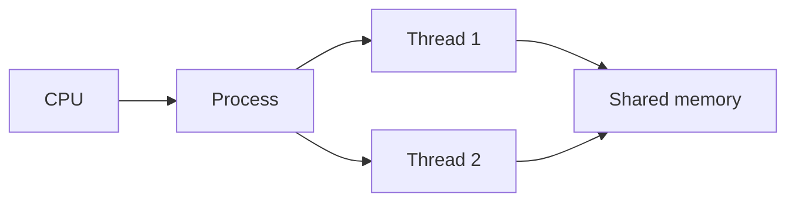
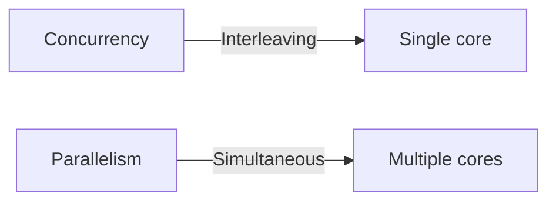
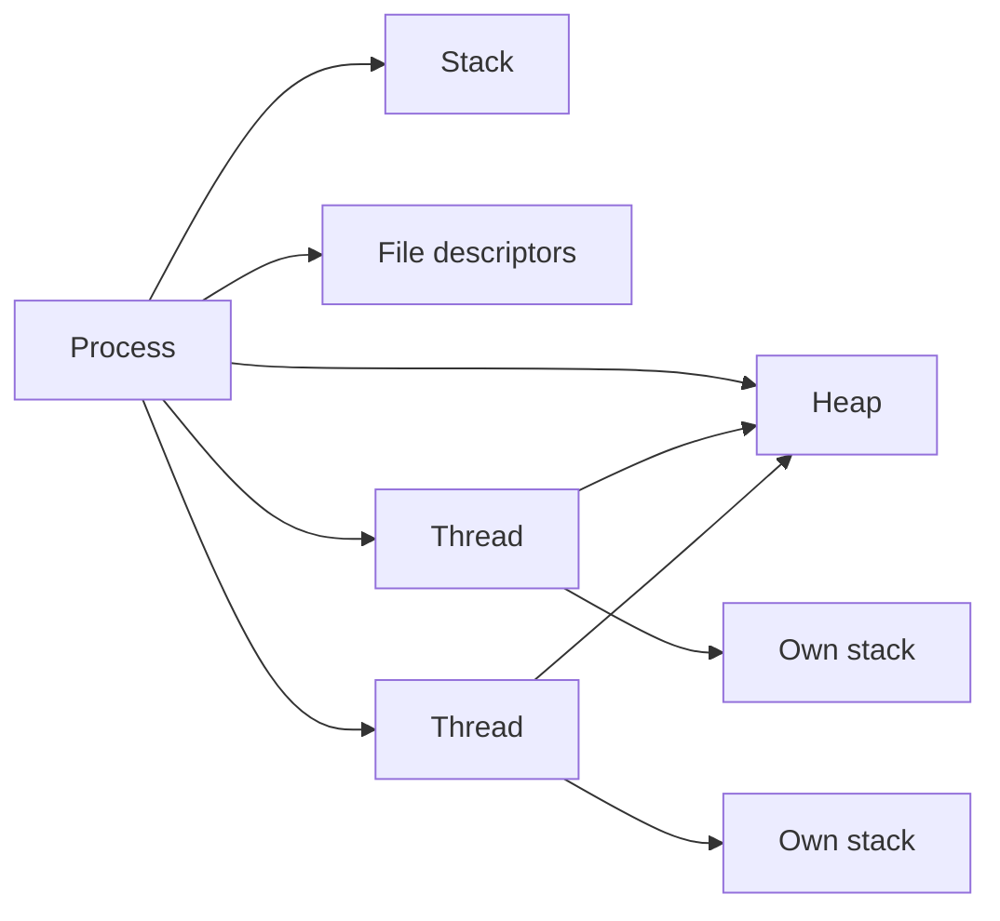

# Process related things

## Blogs and websites


## Medium


## Youtube

### Single Videos

- [Multithreading vs Multiprocessing | System Design](https://www.youtube.com/watch?v=PgDaJEjlBuI)

## Theory

### Topics Covered

1. [Introduction](#introduction)
2. [Processes vs Threads](#processes-vs-threads)
3. [Concurrency and Parallelism](#concurrency-and-parallelism)
4. [Inter-Process Communication](#inter-process-communication)
5. [Characteristics](#characteristics)
6. [Pros](#pros)
7. [Cons](#cons)
8. [Use Cases](#use-cases)
9. [Components](#components)
10. [Patterns](#patterns)
11. [Benefits](#benefits)
12. [Challenges](#challenges)
13. [Best Practices](#best-practices)
14. [When to Use](#when-to-use)
15. [Java and Spring Boot Examples](#java-and-spring-boot-examples)

---

### Introduction

A process is an independent execution unit with its own memory space, while a thread is a lighter execution unit that shares the memory of its parent process. Choosing between processes and threads, and between concurrency and parallelism, is central to building performant and resilient systems.



**Real-life use cases**

- **Web servers**: handle many requests with thread pools.
- **Data pipelines**: use multiple processes for CPU-bound work.
- **Databases**: parallelize queries with worker threads and processes.
- **Machine learning**: distribute training across processes and machines.
- **Operating systems**: isolate applications in separate processes.

**Interview questions and answers**

- **Q: What is a process?**
  **A:** A process is a running program with its own memory, file descriptors, and execution state.

- **Q: What is the key difference between a process and a thread?**
  **A:** Processes have isolated memory; threads within a process share memory but have their own stacks and registers.

- **Q: What is a context switch?**
  **A:** The OS saving one execution context and restoring another, which is cheaper for threads than processes.

---

### Processes vs Threads

| Aspect | Process | Thread |
|--------|---------|--------|
| **Memory** | Isolated address space | Shared address space |
| **Creation cost** | Higher | Lower |
| **Communication** | IPC (pipes, sockets, queues) | Shared memory |
| **Crash impact** | Isolated | Can crash the process |
| **Scheduling** | OS process scheduler | OS thread scheduler |
| **Parallelism** | True across cores | True across cores |

**When to prefer processes:**

- Strong isolation is required.
- The workload is CPU-bound and benefits from multiple cores.
- A crash in one unit must not affect others.

**When to prefer threads:**

- Work is I/O-bound and benefits from many concurrent tasks.
- Tasks need frequent shared-state access.
- Startup and memory overhead must be low.

**Interview questions and answers**

- **Q: Why are threads cheaper to create than processes?**
  **A:** Threads share the process's memory and resources, so the OS does not need to allocate a full address space and duplicate resources.

- **Q: What is the danger of shared memory in threads?**
  **A:** Concurrent access without synchronization can cause race conditions and data corruption.

- **Q: When is multiprocessing better than multithreading?**
  **A:** For CPU-bound work or when isolation and fault tolerance matter more than shared-state convenience.

---

### Concurrency and Parallelism

- **Concurrency** is about managing multiple tasks that overlap in time.
- **Parallelism** is about executing multiple tasks simultaneously on multiple cores.

A single core can be concurrent by interleaving tasks but cannot be parallel. A multi-core machine can be both.



**Common abstractions:**

- Threads and thread pools.
- Executor services.
- Futures and completable futures.
- Virtual threads.
- Reactive streams.
- Processes and worker pools.

**Interview questions and answers**

- **Q: Can a program be concurrent but not parallel?**
  **A:** Yes, a single core can interleave tasks so they progress over the same period without running at the same instant.

- **Q: What are virtual threads?**
  **A:** Lightweight JVM-managed threads that make blocking I/O cheap by decoupling OS threads from application tasks.

- **Q: Why does adding threads not always improve performance?**
  **A:** Context switching, contention, and shared-resource bottlenecks can negate the benefit of extra threads.

---

### Inter-Process Communication

Processes need mechanisms to exchange data despite isolated memory.

- **Pipes**: unidirectional byte streams.
- **Unix domain sockets**: local bidirectional channels.
- **Network sockets**: communication across hosts.
- **Message queues**: durable, asynchronous delivery.
- **Shared memory**: high-speed but requires synchronization.
- **Signals**: lightweight notifications.
- **Memory-mapped files**: shared file-backed memory.

**Choosing an IPC mechanism:**

| Need | Mechanism |
|------|-----------|
| **Simple local stream** | Pipe |
| **Local bidirectional** | Unix socket |
| **Cross-host** | Network socket |
| **Decoupled async** | Message queue |
| **Lowest latency** | Shared memory |

**Interview questions and answers**

- **Q: Why is shared memory fast but dangerous?**
  **A:** It avoids copying data between processes, but concurrent access requires careful synchronization to prevent corruption.

- **Q: What problem do message queues solve?**
  **A:** They decouple producers and consumers, buffer load, and enable asynchronous, reliable communication.

- **Q: When would you choose a message queue over a socket?**
  **A:** When durability, delivery guarantees, or decoupling are more important than low-latency synchronous interaction.

---

### Characteristics

- **Isolated memory**
  Each process has its own address space.

- **Shared memory within threads**
  Threads share the process heap and static data.

- **Schedulable**
  The OS schedules processes and threads on CPUs.

- **Resource-backed**
  Processes hold file descriptors, memory, and execution state.

- **Communicating**
  Processes exchange data via IPC; threads via shared memory.

- **Crash-contained for processes**
  A process failure does not directly corrupt other processes.

- **Lightweight for threads**
  Threads have lower creation and context-switch costs.

- **Concurrent or parallel**
  Multiple execution units can interleave or run simultaneously.

- **Managed by the runtime**
  Languages and frameworks provide thread pools and schedulers.

---

### Pros

- **Isolation with processes**
  Faults in one process do not take down others.

- **Efficient shared state with threads**
  Threads access shared memory without IPC serialization.

- **Resource utilization**
  Parallel execution uses multiple CPU cores.

- **Responsiveness**
  Concurrency keeps systems interactive under I/O wait.

- **Scalability**
  Worker pools and processes handle many tasks.

- **Flexible communication**
  IPC and shared memory cover a wide range of use cases.

- **Crash recovery**
  Supervisors restart failed processes independently.

- **Hardware exploitation**
  Parallelism leverages modern multi-core machines.

---

### Cons

- **Synchronization complexity**
  Shared state requires locks or atomics.

- **Race conditions**
  Concurrent access can corrupt data if unsynchronized.

- **Deadlocks**
  Cyclic lock dependencies halt progress.

- **Context-switch overhead**
  Too many threads waste CPU.

- **Resource consumption**
  Processes duplicate memory and resources.

- **Debugging difficulty**
  Timing-dependent bugs are hard to reproduce.

- **IPC complexity**
  Cross-process communication adds serialization and latency.

- **Overhead of isolation**
  Starting and managing many processes costs more than threads.

---

### Use Cases

- **CPU-bound workloads**
  Use multiple processes or a parallel thread pool.

- **I/O-bound workloads**
  Use many threads or virtual threads.

- **Web request handling**
  Use a thread pool or non-blocking event loop.

- **Background jobs**
  Run independent workers in separate processes.

- **Data processing**
  Parallelize map-reduce style workloads.

- **Microservices**
  Each service runs as one or more processes.

- **Database engines**
  Use processes for isolation and threads for query parallelism.

- **Real-time systems**
  Use threads for low-latency concurrent tasks.

---

### Components

- **Program counter**
  Tracks the current instruction.

- **Stack**
  Stores function call frames and local variables.

- **Heap**
  Holds dynamically allocated memory shared by threads.

- **Registers**
  Store the CPU's current execution context.

- **File descriptors**
  Reference open files, sockets, and devices.

- **Scheduler**
  Decides which process or thread runs next.

- **Synchronization primitives**
  Locks, semaphores, and condition variables.

- **Thread pool**
  A bounded set of reusable worker threads.

- **Executor service**
  Submits and manages asynchronous tasks.



---

### Patterns

- **Thread pool**
  Reuse a fixed set of threads to bound resource usage.

- **Worker pool**
  Distribute jobs among a pool of processes or threads.

- **Producer-consumer**
  Decouple task generation from execution with a queue.

- **Fork-join**
  Split work into subtasks and join results.

- **Actor model**
  Isolate state in message-passing actors.

- **Reactor / event loop**
  Handle many I/O events on a small thread set.

- **Circuit breaker**
  Stop calling a failing dependency to prevent cascading failure.

- **Backpressure**
  Slow producers when consumers cannot keep up.

---

### Benefits

- **Performance**
  Parallelism reduces wall-clock time.

- **Throughput**
  Concurrent processing handles more work per unit time.

- **Responsiveness**
  UI and request threads stay available during I/O.

- **Fault isolation**
  Processes limit the blast radius of failures.

- **Resource efficiency**
  Thread pools avoid per-task startup costs.

- **Scalability**
  Work can be distributed across cores and machines.

- **Modularity**
  Processes and actors create natural boundaries.

---

### Challenges

- **Correctness**
  Concurrent code is harder to reason about.

- **Deadlocks and livelocks**
  Lock ordering and contention can stall progress.

- **Memory visibility**
  Threads may see stale values without proper synchronization.

- **Resource limits**
  Threads and processes consume memory and descriptors.

- **Performance tuning**
  Pool sizes and parallelism settings require benchmarking.

- **Observability**
  Cross-thread and cross-process tracing is complex.

- **Error propagation**
  Failures in workers must be surfaced reliably.

---

### Best Practices

- **Match the model to the workload**
  Threads for I/O, processes for CPU, or a hybrid.

- **Use thread pools instead of unbounded threads**
  Bound concurrency to avoid resource exhaustion.

- **Prefer high-level abstractions**
  Use executors, futures, and reactive libraries over raw threads.

- **Minimize shared mutable state**
  Immutability avoids many synchronization bugs.

- **Use appropriate locks**
  Prefer atomics and read-write locks over coarse global locks.

- **Avoid blocking in hot paths**
  Blocking ties up workers and hurts throughput.

- **Set timeouts everywhere**
  Prevent tasks from hanging indefinitely.

- **Monitor pool queues and latency**
  Detect contention before it becomes an outage.

- **Use structured concurrency**
  Group and manage related tasks as a unit.

---

### When to Use

- **Use multiple processes when** you need isolation or CPU-bound parallelism.
- **Use threads when** tasks are I/O-bound or share data frequently.
- **Use a thread pool when** handling many similar tasks.
- **Use virtual threads when** you have many blocking I/O tasks.
- **Use message queues when** decoupling producers and consumers.

**Do not spawn unbounded threads when**

- The workload is CPU-bound on a small number of cores.
- Shared-state contention dominates.
- A higher-level framework or queue already manages concurrency.

---

### Java and Spring Boot Examples

#### 1. Thread pool with `ExecutorService`

```java
import org.springframework.stereotype.Service;

import java.util.List;
import java.util.concurrent.Callable;
import java.util.concurrent.ExecutorService;
import java.util.concurrent.Executors;
import java.util.concurrent.Future;

@Service
public class BatchProcessingService {

    private final ExecutorService executor = Executors.newFixedThreadPool(4);

    public List<String> process(List<Callable<String>> tasks) throws InterruptedException {
        List<Future<String>> futures = executor.invokeAll(tasks);
        return futures.stream()
                .map(this::resultOf)
                .toList();
    }

    private String resultOf(Future<String> future) {
        try {
            return future.get();
        } catch (Exception e) {
            Thread.currentThread().interrupt();
            throw new IllegalStateException("Task failed", e);
        }
    }
}
```

#### 2. Configurable thread pool

```java
import org.springframework.beans.factory.annotation.Value;
import org.springframework.context.annotation.Bean;
import org.springframework.context.annotation.Configuration;

import java.util.concurrent.ExecutorService;
import java.util.concurrent.Executors;

@Configuration
public class ConcurrencyConfig {

    @Bean(destroyMethod = "shutdown")
    public ExecutorService workerPool(
            @Value("${app.worker.pool-size:8}") int poolSize) {
        return Executors.newFixedThreadPool(poolSize);
    }
}
```

#### 3. Asynchronous processing with `@Async`

```java
import org.springframework.scheduling.annotation.Async;
import org.springframework.stereotype.Service;

import java.util.concurrent.CompletableFuture;

@Service
public class NotificationService {

    @Async
    public CompletableFuture<String> send(String recipient) {
        return CompletableFuture.completedFuture("sent to " + recipient);
    }
}
```

#### 4. Fork-join for parallel computation

```java
import java.util.concurrent.RecursiveTask;
import java.util.concurrent.ForkJoinPool;

public class SumTask extends RecursiveTask<Long> {

    private static final int THRESHOLD = 1_000;
    private final long[] values;
    private final int start;
    private final int end;

    public SumTask(long[] values, int start, int end) {
        this.values = values;
        this.start = start;
        this.end = end;
    }

    @Override
    protected Long compute() {
        if (end - start <= THRESHOLD) {
            long sum = 0;
            for (int i = start; i < end; i++) {
                sum += values[i];
            }
            return sum;
        }
        int mid = start + (end - start) / 2;
        SumTask left = new SumTask(values, start, mid);
        SumTask right = new SumTask(values, mid, end);
        left.fork();
        return right.compute() + left.join();
    }

    public static long sum(long[] values) {
        try (ForkJoinPool pool = new ForkJoinPool()) {
            return pool.invoke(new SumTask(values, 0, values.length));
        }
    }
}
```

**Interview questions and answers**

- **Q: What is the difference between concurrency and parallelism?**
  **A:** Concurrency is interleaving multiple tasks; parallelism is running them at the same time on multiple cores.

- **Q: How do you choose a thread pool size?**
  **A:** For CPU-bound work, size it near the core count; for I/O-bound work, allow more threads based on expected blocking and latency.

- **Q: What is a deadlock?**
  **A:** A state where two or more threads wait indefinitely for locks held by each other.

- **Q: Why is shared mutable state dangerous?**
  **A:** Unsynchronized concurrent access can create race conditions and violate memory visibility.
