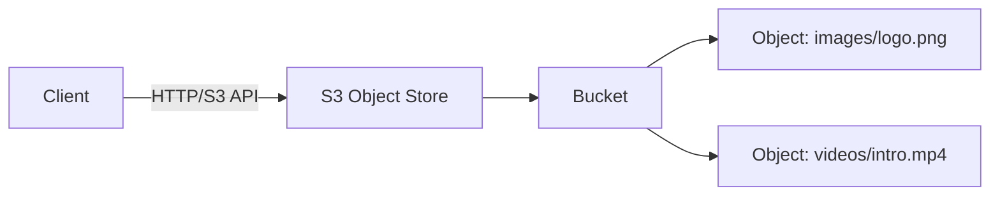
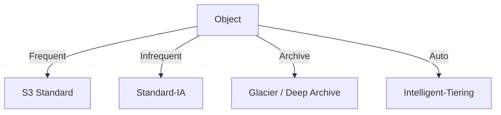
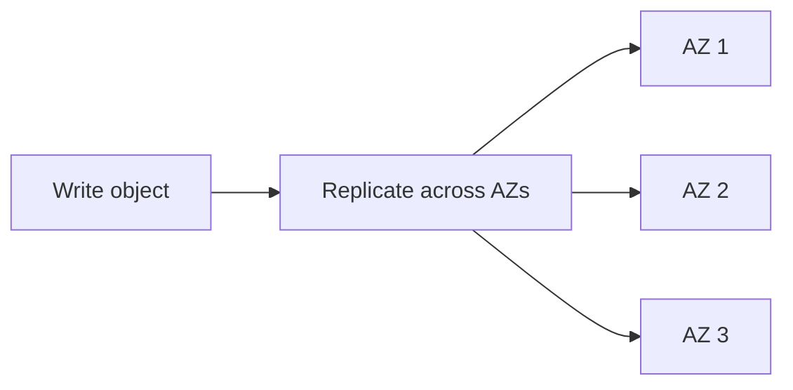
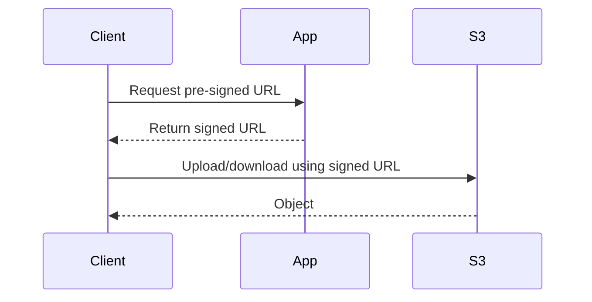
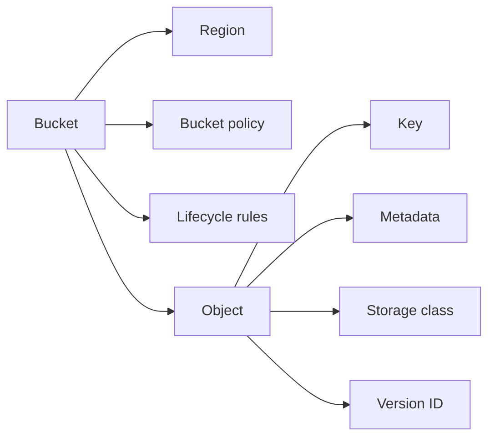

# S3 (Simple Storage Service)

## Blogs and websites


## Medium


## Youtube

- [You don't know about S3 as a Protocol](https://www.youtube.com/watch?v=nomgFESEYZI)
- [Amazon S3 (Object Stores) - In Practice | Distributed Systems Deep Dives With Ex-Google SWE](https://www.youtube.com/watch?v=zplIwqWBhwg)


- [How AWS S3 Hit 1PB/s Using Hard Drives… This Is WILD!](https://www.youtube.com/watch?v=J1vEUTe4gi0)


## Theory

### Topics Covered

1. [Introduction](#introduction)
2. [Core Concepts](#core-concepts)
3. [Consistency and Durability](#consistency-and-durability)
4. [Security and Access Control](#security-and-access-control)
5. [Characteristics](#characteristics)
6. [Pros](#pros)
7. [Cons](#cons)
8. [Use Cases](#use-cases)
9. [Components](#components)
10. [Patterns](#patterns)
11. [Benefits](#benefits)
12. [Challenges](#challenges)
13. [Best Practices](#best-practices)
14. [When to Use](#when-to-use)
15. [Java and Spring Boot Examples](#java-and-spring-boot-examples)

---

### Introduction

S3 is an object storage service that stores data as objects in buckets. Unlike a filesystem, it has no directory hierarchy at the storage layer; the "folders" users see are key prefixes. S3 provides high durability, virtually unlimited scale, and an HTTP-based API.



**Real-life use cases**

- **Static website hosting**: serve HTML, CSS, and JavaScript directly.
- **Backup and archival**: store durable copies of data.
- **Data lake storage**: hold raw analytical datasets.
- **Media storage**: store images, video, and audio.
- **Application assets**: persist uploads and generated files.

**Interview questions and answers**

- **Q: What is object storage?**
  **A:** Storage that manages data as discrete objects with data, metadata, and a unique key, rather than as a filesystem hierarchy.

- **Q: What is a bucket?**
  **A:** A top-level container for objects. Bucket names are globally unique and define a namespace.

- **Q: What is the durability guarantee of S3?**
  **A:** S3 is designed for 99.999999999% (11 nines) durability, meaning data is replicated across multiple facilities.

---

### Core Concepts

**Buckets:**

- Top-level containers for objects.
- Globally unique names.
- Configurable region, versioning, logging, and lifecycle rules.

**Objects:**

- Data plus metadata.
- Identified by a key within a bucket.
- Up to 5 TB in size.
- Immutable by default; updates replace the entire object.

**Keys and prefixes:**

- Keys are the full object name, for example `images/2024/logo.png`.
- Prefixes are the part of a key before the object name, used for grouping and listing.

**Storage classes:**

- **S3 Standard**: frequent access, low latency.
- **Intelligent-Tiering**: moves data between tiers based on access.
- **Standard-IA**: infrequent access, lower storage cost.
- **One Zone-IA**: infrequent access, single availability zone.
- **Glacier / Deep Archive**: archival, minutes-to-hours retrieval.



**Interview questions and answers**

- **Q: Why is S3 not a filesystem?**
  **A:** It stores objects with flat keys, not a hierarchical directory tree, and operations are HTTP API calls rather than POSIX file operations.

- **Q: What does "key" mean in S3?**
  **A:** The unique identifier of an object within a bucket, including any logical prefixes.

- **Q: How do storage classes reduce cost?**
  **A:** They trade retrieval latency and availability for lower storage prices, matching cost to access frequency.

---

### Consistency and Durability

S3 replicates objects across multiple devices and facilities within a region. It is designed for very high durability, though availability is a separate concern.

**Consistency model:**

- Read-after-write for new object creation.
- Eventual consistency for some metadata and overwrite operations.
- Object operations are atomic; no partial writes are visible.

**Durability mechanisms:**

- Replication across multiple availability zones.
- Checksums to detect corruption.
- Versioning to preserve previous versions.
- Cross-region replication for disaster recovery.



**Interview questions and answers**

- **Q: What is the difference between durability and availability?**
  **A:** Durability is the probability data is not lost; availability is the probability the service is operational when accessed.

- **Q: Why is S3 highly durable?**
  **A:** It stores multiple redundant copies across separate facilities and continuously verifies integrity.

- **Q: What is S3 versioning?**
  **A:** A feature that retains multiple versions of an object so overwrites and deletions can be recovered.

---

### Security and Access Control

S3 security combines identity, bucket policies, and network controls.

- **IAM policies**: control who can call which S3 actions.
- **Bucket policies**: control access at the bucket and object level.
- **Access control lists (ACLs)**: legacy per-object grants.
- **Pre-signed URLs**: grant time-limited access without credentials.
- **Encryption**: SSE-S3, SSE-KMS, or client-side encryption.
- **Block public access**: prevent accidental public exposure.

**Pre-signed URL flow:**

1. The client requests upload access from the application.
2. The application generates a signed URL with an expiry.
3. The client uploads or downloads directly to/from S3 using that URL.
4. S3 validates the signature and expiry.



**Interview questions and answers**

- **Q: What is a pre-signed URL?**
  **A:** A URL that grants temporary access to an S3 object using the signer's credentials and an expiry time.

- **Q: How do you prevent a bucket from being public?**
  **A:** Enable block public access, apply least-privilege bucket policies, and audit with tools like S3 Access Analyzer.

- **Q: What encryption options does S3 provide?**
  **A:** Server-side encryption with S3-managed keys (SSE-S3), KMS-managed keys (SSE-KMS), or client-side encryption.

---

### Characteristics

- **Object-based**
  Data is stored as objects, not blocks or files.

- **Flat namespace**
  Objects are identified by keys within buckets.

- **Highly durable**
  Data is replicated across multiple facilities.

- **Scalable**
  Buckets can store virtually unlimited objects.

- **HTTP-native**
  Access uses a REST-style API.

- **Eventually consistent for some operations**
  Overwrites and metadata may lag briefly.

- **Region-scoped**
  Buckets reside in a specific geographic region.

- **Immutable by default**
  Updates replace entire objects rather than mutating in place.

- **Policy-driven**
  Access, lifecycle, and versioning are configuration-controlled.

---

### Pros

- **High durability**
  Data loss is extraordinarily unlikely.

- **Virtually unlimited scale**
  No capacity planning for storage growth.

- **Simple API**
  HTTP operations make integration easy.

- **Cost-effective**
  Pay for what you store and transfer.

- **Multiple storage classes**
  Optimize cost for hot, warm, and cold data.

- **Strong ecosystem**
  Deep integration with analytics, CDN, and compute services.

- **Security controls**
  IAM, encryption, and bucket policies protect data.

- **Event notifications**
  Object changes can trigger Lambda, queues, or topics.

---

### Cons

- **Not a filesystem**
  No POSIX semantics, locks, or in-place updates.

- **Eventual consistency caveats**
  Overwrites and deletes may not be immediately visible.

- **Latency**
  Higher latency than local or block storage.

- **Cost of egress and requests**
  Data transfer and many small requests add cost.

- **Bucket-name constraints**
  Names are globally unique and must follow rules.

- **No direct append**
  Modifying an object requires rewriting it.

- **Region boundaries**
  Cross-region access adds latency and cost.

- **Vendor lock-in**
  S3-specific APIs and semantics can reduce portability.

---

### Use Cases

- **Static website hosting**
  Serve static assets directly from S3.

- **Backup and disaster recovery**
  Store durable copies and replicas.

- **Data lakes**
  Hold raw analytics data for processing.

- **Media storage and delivery**
  Store images, video, and audio behind a CDN.

- **Application uploads**
  Persist user-generated content.

- **Log storage**
  Archive application and access logs.

- **Machine learning datasets**
  Host training and feature data.

- **Software distribution**
  Distribute installers and packages.

---

### Components

- **Bucket**
  Top-level container for objects.

- **Object**
  Data plus metadata and a unique key.

- **Key**
  The identifier of an object within a bucket.

- **Metadata**
  System and user-defined information about an object.

- **Region**
  The geographic location where a bucket resides.

- **Storage class**
  The durability, availability, and cost tier of an object.

- **Bucket policy**
  Resource-based access rules.

- **Lifecycle rule**
  Automates transitions and expiration.

- **Version ID**
  Identifies a specific version of an object.



---

### Patterns

- **Pre-signed upload/download**
  Move large transfers off the application server.

- **Versioning for recovery**
  Preserve prior object versions.

- **Lifecycle tiering**
  Move data to cheaper classes as it ages.

- **Cross-region replication**
  Copy objects to another region for resilience.

- **Event-driven processing**
  Trigger compute on object creation or change.

- **Static site hosting**
  Serve web content directly from S3.

- **Multipart upload**
  Upload large objects in parallel parts.

- **Glacier archiving**
  Move rarely accessed data to archival tiers.

---

### Benefits

- **Reliability**
  Redundant storage protects against hardware failure.

- **Scale**
  Storage grows without provisioning.

- **Cost efficiency**
  Tiering and lifecycle policies reduce spend.

- **Simplicity**
  Managed storage removes operational overhead.

- **Security**
  Encryption, IAM, and policies provide fine-grained control.

- **Integration**
  Works with CDNs, analytics, and serverless compute.

- **Durability**
  11 nines of durability is suitable for critical data.

---

### Challenges

- **Cost management**
  Egress, requests, and storage can grow unexpectedly.

- **Consistency handling**
  Applications must tolerate eventual consistency for overwrites.

- **Access control complexity**
  Misconfigured policies can expose data.

- **Latency**
  Object storage is slower than local disk.

- **Migration**
  Moving large datasets between regions or providers is slow.

- **Naming constraints**
  Globally unique bucket names complicate automation.

- **Performance with many small objects**
  High request counts and list operations can be slow.

---

### Best Practices

- **Block public access by default**
  Prevent accidental exposure.

- **Apply least-privilege policies**
  Grant only the required S3 actions.

- **Enable versioning**
  Protect against accidental overwrites and deletions.

- **Encrypt objects**
  Use SSE-S3 or SSE-KMS by default.

- **Use lifecycle rules**
  Automatically tier and expire data.

- **Use pre-signed URLs for large transfers**
  Avoid routing big payloads through the application.

- **Monitor costs and access**
  Use CloudTrail, metrics, and budgets.

- **Prefix keys for performance**
  Distribute keys to avoid hot prefixes.

- **Replicate critical buckets**
  Enable cross-region replication for disaster recovery.

- **Validate public exposure**
  Run S3 Access Analyzer and public-access reports.

---

### When to Use

- **Use S3 when** you need durable, scalable object storage.
- **Use S3 when** serving static assets or hosting a static site.
- **Use S3 when** building a data lake or archiving data.
- **Use S3 when** storing user uploads and media.
- **Use S3 when** decoupling large transfers with pre-signed URLs.

**Prefer a filesystem or database when**

- Low-latency random access is required.
- Applications need POSIX file semantics or in-place updates.
- Data must support frequent, small mutations with transactional guarantees.

---

### Java and Spring Boot Examples

#### 1. Upload and download with AWS SDK

```java
import org.springframework.beans.factory.annotation.Value;
import org.springframework.stereotype.Service;
import software.amazon.awssdk.core.sync.RequestBody;
import software.amazon.awssdk.services.s3.S3Client;
import software.amazon.awssdk.services.s3.model.GetObjectRequest;
import software.amazon.awssdk.services.s3.model.PutObjectRequest;

@Service
public class ObjectStorageService {

    private final S3Client s3Client;
    private final String bucket;

    public ObjectStorageService(
            S3Client s3Client,
            @Value("${app.s3.bucket}") String bucket) {
        this.s3Client = s3Client;
        this.bucket = bucket;
    }

    public void upload(String key, byte[] content) {
        s3Client.putObject(
                PutObjectRequest.builder()
                        .bucket(bucket)
                        .key(key)
                        .build(),
                RequestBody.fromBytes(content));
    }

    public byte[] download(String key) {
        return s3Client.getObjectAsBytes(
                GetObjectRequest.builder()
                        .bucket(bucket)
                        .key(key)
                        .build()).asByteArray();
    }
}
```

#### 2. Pre-signed URL generation

```java
import org.springframework.beans.factory.annotation.Value;
import org.springframework.stereotype.Service;
import software.amazon.awssdk.services.s3.model.GetObjectRequest;
import software.amazon.awssdk.services.s3.presigner.S3Presigner;
import software.amazon.awssdk.services.s3.presigner.model.GetObjectPresignRequest;
import software.amazon.awssdk.services.s3.presigner.model.PresignedGetObjectRequest;

import java.time.Duration;

@Service
public class PreSignedUrlService {

    private final S3Presigner presigner;
    private final String bucket;

    public PreSignedUrlService(
            S3Presigner presigner,
            @Value("${app.s3.bucket}") String bucket) {
        this.presigner = presigner;
        this.bucket = bucket;
    }

    public String downloadUrl(String key, Duration validity) {
        GetObjectRequest request = GetObjectRequest.builder()
                .bucket(bucket)
                .key(key)
                .build();

        PresignedGetObjectRequest presigned = presigner.presignGetObject(
                GetObjectPresignRequest.builder()
                        .getObjectRequest(request)
                        .signatureDuration(validity)
                        .build());

        return presigned.url().toString();
    }
}
```

#### 3. Event-driven processing with S3 notifications

```java
import org.springframework.stereotype.Service;

@Service
public class ObjectEventProcessor {

    public void handleObjectCreated(String bucket, String key) {
        // S3 can publish creation events to SQS, SNS, or Lambda,
        // which then invoke this processor for asynchronous work.
        System.out.printf("Processing created object %s/%s%n", bucket, key);
    }
}
```

#### 4. Multipart upload simulation

```java
import java.util.List;

public class MultipartUploader {

    public record Part(int number, String etag) {}

    public String complete(String uploadId, List<Part> parts) {
        // In a real implementation, each part is uploaded independently
        // and the parts are assembled with a CompleteMultipartUpload call.
        return "completed-" + uploadId + "-with-" + parts.size() + "-parts";
    }
}
```

**Interview questions and answers**

- **Q: What is the difference between S3 and EBS?**
  **A:** S3 is object storage for scalable, HTTP-accessible data; EBS is block storage attached to a single instance with lower latency.

- **Q: How do pre-signed URLs improve scalability?**
  **A:** They let clients transfer data directly to and from S3, removing the application server from the bandwidth-heavy path.

- **Q: What are S3 lifecycle rules?**
  **A:** Rules that automatically transition objects between storage classes or expire them after a configured time.

- **Q: Why would you enable versioning?**
  **A:** To recover from accidental deletes or overwrites by keeping prior object versions.
