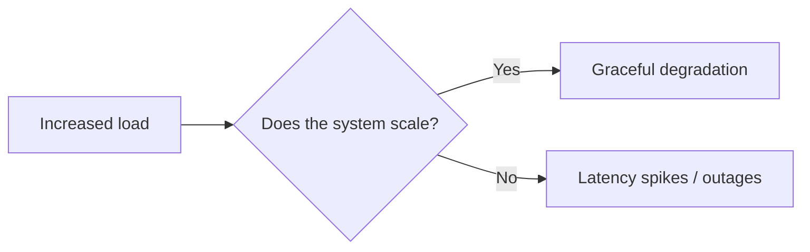
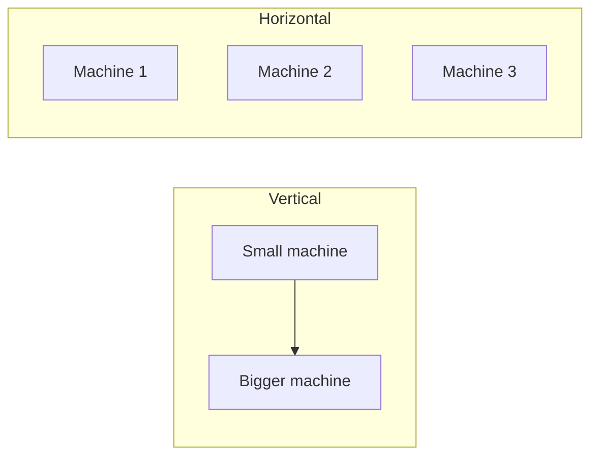
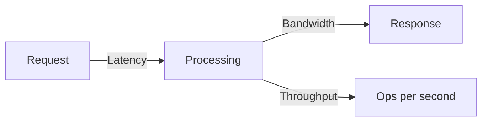
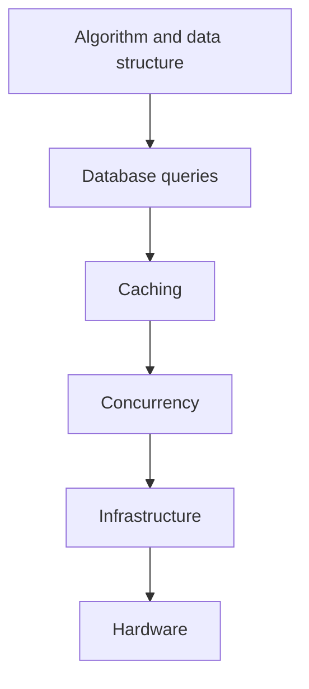
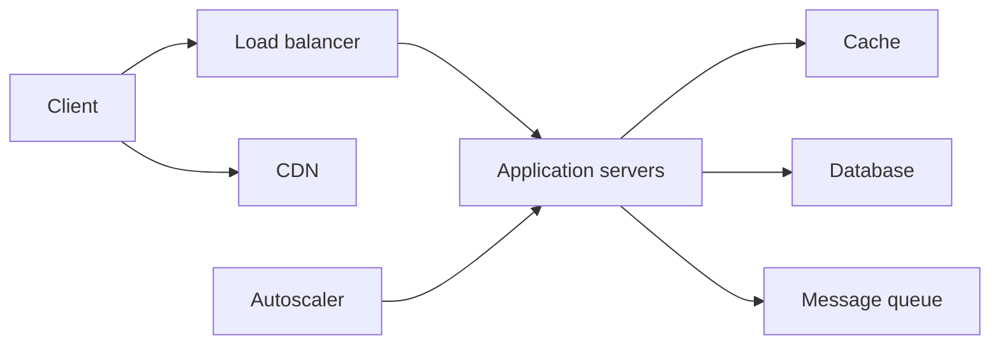

# Scalability & Performance

## Blogs and websites


## Medium

- [How I Redesigned The Backend To Quickly Handle Millions Of Reads (And Writes)](https://blog.bitsrc.io/how-i-redesigned-the-backend-to-quickly-handle-millions-of-reads-and-writes-58cfe989e6f8)
- [Horizontal vs Vertical Scaling: Scalability (System Design)](https://medium.com/@ayush_mittal/horizontal-vs-vertical-scaling-scalability-system-design-d10658b7f94e)

## Youtube


## Theory

### Topics Covered

1. [Introduction](#introduction)
2. [Vertical vs Horizontal Scaling](#vertical-vs-horizontal-scaling)
3. [Latency, Bandwidth and Throughput](#latency-bandwidth-and-throughput)
4. [Performance Optimization](#performance-optimization)
5. [Characteristics](#characteristics)
6. [Pros](#pros)
7. [Cons](#cons)
8. [Use Cases](#use-cases)
9. [Components](#components)
10. [Patterns](#patterns)
11. [Benefits](#benefits)
12. [Challenges](#challenges)
13. [Best Practices](#best-practices)
14. [When to Use](#when-to-use)
15. [Java and Spring Boot Examples](#java-and-spring-boot-examples)

---

### Introduction

Scalability is the ability of a system to handle a growing amount of work by adding resources. Performance is how well the system responds under a given load. Together they determine whether your system can serve 100 users or 100 million.

**The Core Question:** If traffic doubles tomorrow, does your system handle it gracefully — or does it fall over?



**Real-life use cases**

- **E-commerce checkouts**: survive flash sales and holiday spikes.
- **Social feeds**: serve millions of reads with low latency.
- **Streaming platforms**: scale bandwidth and concurrent viewers.
- **Payment systems**: process growing transaction volume.
- **APIs**: handle increasing request rates without degradation.

**Interview questions and answers**

- **Q: What is scalability?**
  **A:** The ability of a system to maintain acceptable performance as load increases by adding resources.

- **Q: What is the difference between scalability and performance?**
  **A:** Performance is the system's speed under a given load; scalability is its ability to sustain that performance as load grows.

- **Q: Why is statelessness important for scaling?**
  **A:** Stateless services can be replicated horizontally and any instance can handle any request.

---

### Vertical vs Horizontal Scaling

**Vertical Scaling (Scale Up):**

Add more resources to a single machine (CPU, RAM, SSD).

```
Small Server → Bigger Server
✓ Simple, no code changes
✗ Hard limit (biggest machine available)
✗ Single point of failure
✗ Exponentially expensive
```

**Horizontal Scaling (Scale Out):**

Add more machines.

```
1 Server → 10 Servers → 100 Servers
✓ Virtually unlimited
✓ Fault tolerant
✓ Cost-effective commodity hardware
✗ Requires stateless design
✗ Distributed system complexity
```



**Factors to consider:**

- Stateless services are easier to scale.
- Database sharding distributes writes.
- Load balancing spreads traffic.
- Caching reduces backend load.
- Async processing absorbs spikes.

**Interview questions and answers**

- **Q: What is the main limit of vertical scaling?**
  **A:** A single machine has a physical ceiling, and bigger hardware is increasingly expensive and still a single point of failure.

- **Q: What is the main challenge of horizontal scaling?**
  **A:** Coordinating state and data across many machines and handling distributed-system concerns such as consistency and partitioning.

- **Q: When is vertical scaling the right choice?**
  **A:** For small or monolithic workloads where operational simplicity matters and growth is bounded.

---

### Latency, Bandwidth and Throughput

**Latency** is the time for data to travel from source to destination.

- Network latency.
- Disk I/O latency.
- Database query latency.
- API response time.

**Bandwidth** is the amount of data transferred per unit time.

- Measured in Mbps or Gbps.
- Affects how much data can move in parallel.

**Throughput** is the number of operations completed per unit time.

- Requests per second (RPS).
- Queries per second (QPS).
- Transactions per second (TPS).



**Optimization:**

- Reduce round trips.
- Use a CDN.
- Compress data.
- Optimize queries.
- Use caching.
- Add connection pooling.
- Batch operations.
- Use asynchronous processing.

**Interview questions and answers**

- **Q: How do latency and throughput differ?**
  **A:** Latency is the time for one operation; throughput is the number of operations completed per unit time.

- **Q: Can a system have high throughput and high latency?**
  **A:** Yes, if many slow operations run concurrently, total completed work can be high even though each operation is slow.

- **Q: How do you reduce latency?**
  **A:** Cache results, reduce round trips, optimize queries, compress payloads, and place data closer to users.

---

### Performance Optimization

Optimize in this order — each level has the highest ROI at the top:

1. **Algorithm & Data Structure**: O(n²) → O(n log n) is the biggest win possible.
2. **Database Queries**: Add indexes, avoid N+1 queries, optimize slow queries.
3. **Caching**: Reduce repeated work (Redis, CDN, browser cache).
4. **Concurrency**: Async I/O, connection pooling, parallel processing.
5. **Infrastructure**: Load balancing, auto-scaling, CDN.
6. **Hardware**: Vertical scaling as a last resort.



**Measurement first:**

- Profile CPU, memory, and I/O.
- Identify the bottleneck before optimizing.
- Use percentiles, not just averages.
- Benchmark before and after changes.

**Interview questions and answers**

- **Q: Why should algorithm improvements come before hardware?**
  **A:** Algorithmic improvements can reduce work by orders of magnitude and are often cheaper than adding hardware.

- **Q: What is an N+1 query problem?**
  **A:** A pattern where one query fetches a list and then one additional query runs for each item, causing many round trips.

- **Q: Why are percentiles important for performance?**
  **A:** Averages hide tail latency; p95/p99 reveal the slowest user experiences.

---

### Characteristics

- **Load-responsive**
  Scalability describes how a system reacts to growing demand.

- **Resource-driven**
  Adding CPU, memory, storage, or nodes increases capacity.

- **Performance-coupled**
  Scalability is measured through response time and throughput under load.

- **Architecture-dependent**
  Stateless and partitioned designs scale better.

- **Trade-off-laden**
  Consistency, cost, and complexity trade against scale.

- **Measurable**
  RPS, QPS, TPS, latency percentiles, and error rates quantify it.

- **Elastic**
  Cloud systems can add and remove capacity automatically.

- **Bottleneck-bound**
  A system scales only as well as its slowest component.

- **Eventually constrained**
  Coordination, networking, and data consistency set limits.

---

### Pros

- **Growth readiness**
  A scalable system survives traffic increases.

- **Better user experience**
  Consistent latency under load keeps users satisfied.

- **Cost efficiency**
  Horizontal scaling uses commodity hardware.

- **Fault tolerance**
  Multiple nodes tolerate individual failures.

- **Elasticity**
  Cloud autoscaling matches capacity to demand.

- **Competitive advantage**
  Systems that scale capture demand spikes without outage.

- **Incremental growth**
  Capacity can be added without redesign.

- **Reusability**
  Patterns such as caching and sharding apply across systems.

---

### Cons

- **Complexity**
  Distributed systems are harder to build and operate.

- **Cost**
  More nodes, bandwidth, and tooling increase spend.

- **Consistency challenges**
  Partitioning and replication complicate data consistency.

- **Latency overhead**
  Network hops and coordination add latency.

- **Operational burden**
  Monitoring, tracing, and deployment grow more difficult.

- **Risk of premature optimization**
  Building for scale before it is needed wastes effort.

- **Failure modes multiply**
  Partial failures and network partitions become common.

- **Hard to reason about**
  Emergent behavior can be difficult to predict.

---

### Use Cases

- **High-traffic web applications**
  Serve millions of concurrent users.

- **APIs and microservices**
  Handle growing request volumes.

- **E-commerce platforms**
  Survive seasonal and flash-sale spikes.

- **Streaming and media**
  Scale bandwidth and concurrent viewers.

- **Social networks**
  Support large read and write fan-out.

- **Payment systems**
  Process growing transaction throughput.

- **Analytics platforms**
  Ingest and query expanding datasets.

- **IoT backends**
  Absorb data from millions of devices.

---

### Components

- **Load balancer**
  Distributes traffic across instances.

- **Application servers**
  Stateless workers that handle requests.

- **Cache**
  Stores frequently accessed data close to consumers.

- **Database**
  Persists and queries state.

- **Message queue**
  Buffers and decouples asynchronous work.

- **CDN**
  Serves static and edge-cached content.

- **Autoscaler**
  Adjusts instance count based on load.

- **Object storage**
  Stores large and unstructured data.

- **Monitoring and tracing**
  Measures performance and identifies bottlenecks.



---

### Patterns

- **Stateless services**
  Keep request state external so any instance can serve any request.

- **Caching**
  Store hot data in Redis, CDN, or memory.

- **Sharding**
  Partition data across many nodes.

- **Replication**
  Duplicate data for reads and failover.

- **Queueing**
  Decouple producers from consumers.

- **Autoscaling**
  Scale capacity dynamically with load.

- **Backpressure**
  Slow producers when consumers lag.

- **Graceful degradation**
  Shed low-priority work before failing.

- **Bulkheading**
  Isolate failures to prevent cascade.

---

### Benefits

- **Sustained performance**
  Users experience stable latency as load grows.

- **Higher availability**
  Redundancy keeps the system up during failures.

- **Cost control**
  Autoscaling provisions only what is needed.

- **Faster time to market**
  Teams can launch without over-building, then scale later.

- **Business continuity**
  Systems survive spikes and regional failures.

- **Operational insight**
  Monitoring and tracing reveal bottlenecks.

- **Incremental evolution**
  Capacity and architecture can evolve step by step.

---

### Challenges

- **Identifying the real bottleneck**
  Guessing instead of measuring wastes effort.

- **Managing state**
  Sessions, caches, and databases complicate horizontal scaling.

- **Consistency under partitioning**
  Sharding and replication introduce trade-offs.

- **Cost of over-provisioning**
  Idle capacity wastes money.

- **Hot spots**
  Uneven data or traffic distribution overwhelms single nodes.

- **Tail latency**
  The slowest requests often dominate user experience.

- **Operational complexity**
  Many nodes require robust deployment and observability.

- **Premature scaling**
  Adding infrastructure before fixing code inefficiencies.

---

### Best Practices

- **Measure before optimizing**
  Use profiling, metrics, and tracing to find bottlenecks.

- **Design stateless services**
  Store session state externally.

- **Cache aggressively but carefully**
  Respect invalidation and freshness.

- **Shard and replicate data**
  Distribute writes and reads.

- **Use queues for spikes**
  Decouple and buffer bursty work.

- **Apply backpressure**
  Bound queues and shed load gracefully.

- **Autoscale with safety margins**
  Scale on both load and saturation signals.

- **Monitor percentiles**
  Track p50, p95, and p99 latency.

- **Test at production-like load**
  Load test before releases.

- **Optimize the highest ROI first**
  Follow the performance optimization hierarchy.

---

### When to Use

- **Use scalability techniques when** traffic is expected to grow.
- **Use horizontal scaling when** you need fault tolerance and elasticity.
- **Use caching when** reads dominate and data tolerates staleness.
- **Use sharding when** a single database cannot handle writes.
- **Use queues when** workload is bursty and asynchronous.
- **Use autoscaling when** demand is variable.

**Do not over-engineer for scale when**

- The user base is small and growth is unlikely.
- The bottleneck is a single slow query that indexing would fix.
- A simple vertical upgrade is sufficient and cheaper.
- The added complexity outweighs the likely benefit.

---

### Java and Spring Boot Examples

#### 1. Cache-aside service with Redis

```java
import org.springframework.cache.annotation.CacheEvict;
import org.springframework.cache.annotation.Cacheable;
import org.springframework.stereotype.Service;

@Service
public class ProductService {

    @Cacheable(value = "products", key = "#id")
    public Product getProduct(long id) {
        // Expensive database lookup.
        return new Product(id, "Product " + id);
    }

    @CacheEvict(value = "products", key = "#product.id")
    public Product updateProduct(Product product) {
        // Update database, then evict cache.
        return product;
    }

    public record Product(long id, String name) {
    }
}
```

#### 2. Configurable cache TTL

```java
import org.springframework.boot.autoconfigure.cache.RedisCacheManagerBuilderCustomizer;
import org.springframework.context.annotation.Bean;
import org.springframework.context.annotation.Configuration;
import org.springframework.data.redis.cache.RedisCacheConfiguration;

import java.time.Duration;

@Configuration
public class CacheConfig {

    @Bean
    public RedisCacheManagerBuilderCustomizer cacheCustomizer() {
        return builder -> builder
                .withCacheConfiguration("products",
                        RedisCacheConfiguration.defaultCacheConfig()
                                .entryTtl(Duration.ofMinutes(5)));
    }
}
```

#### 3. Asynchronous queue producer

```java
import org.springframework.amqp.rabbit.core.RabbitTemplate;
import org.springframework.stereotype.Service;

@Service
public class JobProducer {

    private final RabbitTemplate rabbitTemplate;

    public JobProducer(RabbitTemplate rabbitTemplate) {
        this.rabbitTemplate = rabbitTemplate;
    }

    public void enqueue(String routingKey, Object message) {
        rabbitTemplate.convertAndSend("jobs.exchange", routingKey, message);
    }
}
```

#### 4. Database connection pooling with HikariCP

```java
import org.springframework.boot.context.properties.ConfigurationProperties;
import org.springframework.stereotype.Component;

@Component
@ConfigurationProperties(prefix = "app.datasource")
public class DataSourceProperties {

    /** Maximum number of connections in the pool. */
    private int maxPoolSize = 20;

    /** Minimum number of idle connections to keep. */
    private int minIdle = 5;

    public int getMaxPoolSize() {
        return maxPoolSize;
    }

    public void setMaxPoolSize(int maxPoolSize) {
        this.maxPoolSize = maxPoolSize;
    }

    public int getMinIdle() {
        return minIdle;
    }

    public void setMinIdle(int minIdle) {
        this.minIdle = minIdle;
    }
}
```

**Interview questions and answers**

- **Q: What is the difference between vertical and horizontal scaling?**
  **A:** Vertical adds resources to one machine; horizontal adds more machines to distribute load.

- **Q: How does caching improve scalability?**
  **A:** It reduces expensive backend work by serving frequent reads from fast storage.

- **Q: Why are stateless services easier to scale?**
  **A:** Any instance can serve any request, so load balancers can freely add or remove replicas.

- **Q: What is cache invalidation?**
  **A:** The process of removing or refreshing stale cache entries when the underlying data changes.
