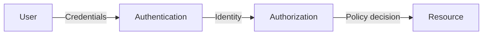
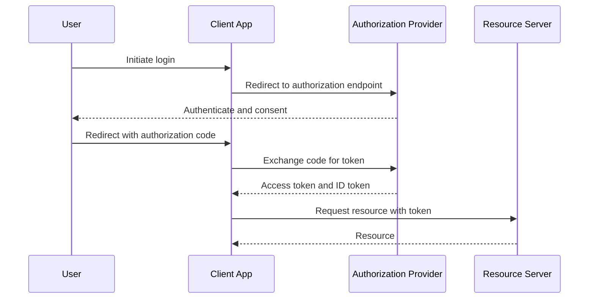
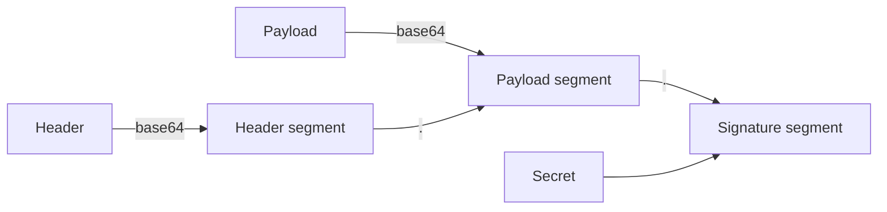
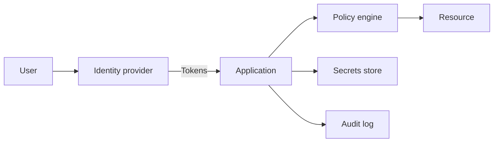

# Security

## Blogs and websites


## Medium


## Youtube


## Theory

### Topics Covered

1. [Introduction](#introduction)
2. [Authentication vs Authorization](#authentication-vs-authorization)
3. [OAuth and OpenID Connect](#oauth-and-openid-connect)
4. [JWT](#jwt-json-web-token)
5. [Characteristics](#characteristics)
6. [Pros](#pros)
7. [Cons](#cons)
8. [Use Cases](#use-cases)
9. [Components](#components)
10. [Patterns](#patterns)
11. [Benefits](#benefits)
12. [Challenges](#challenges)
13. [Best Practices](#best-practices)
14. [When to Use](#when-to-use)
15. [Java and Spring Boot Examples](#java-and-spring-boot-examples)

---

### Introduction

Security is a cross-cutting concern that protects systems and data from unauthorized access, modification, and disruption. Authentication establishes identity; authorization determines what that identity may do. Together with transport security, input validation, and monitoring, they form a defense-in-depth posture.



**Real-life use cases**

- **Web and mobile login**: authenticate users with credentials.
- **API access**: authorize clients with tokens and scopes.
- **Single sign-on**: authenticate once across many applications.
- **Service-to-service calls**: authenticate machine identities.
- **Data protection**: encrypt sensitive data in transit and at rest.

**Interview questions and answers**

- **Q: What is the difference between authentication and authorization?**
  **A:** Authentication verifies identity; authorization determines what an authenticated identity can do.

- **Q: What is defense in depth?**
  **A:** Layering multiple independent security controls so a failure in one layer does not compromise the system.

- **Q: Why is HTTPS mandatory for security?**
  **A:** It encrypts traffic and authenticates the server, preventing eavesdropping and tampering.

---

### Authentication vs Authorization

Authentication and authorization are two distinct but related security concepts that are often confused.

**Authentication (AuthN)** answers: *"Who are you?"*
It is the process of verifying a user's identity. When you log in with a username and password, the system authenticates you. Think of it as showing your ID card at the entrance of a building — the guard checks that you are who you claim to be.

**Authorization (AuthZ)** answers: *"What are you allowed to do?"*
It determines what resources or actions an authenticated user can access. After showing your ID, the building lets you into floor 3 but not the server room — that's authorization.

**Key Differences:**

| Aspect | Authentication | Authorization |
|--------|---------------|---------------|
| **Question** | Who are you? | What can you access? |
| **Happens** | First (before authorization) | After authentication |
| **Mechanism** | Passwords, tokens, biometrics, MFA | Roles, policies, ACLs, scopes |
| **Fails with** | 401 Unauthorized | 403 Forbidden |
| **Visible to user** | Yes (login screen) | Often invisible |
| **Example** | Logging into Gmail | Accessing a shared doc vs owner settings |

**How They Work Together:**

```
User enters credentials
  → Authentication: "Is this user real?" (validates identity)
    → YES → Authorization: "What can this user do?" (checks permissions)
      → Grant/deny access to specific resources
    → NO → 401 Unauthorized
```

**Common Authentication Methods:**

- **Password-based**: Traditional username + password.
- **Token-based**: JWT, session tokens.
- **OAuth/OIDC**: Delegated auth via third-party (Google, GitHub).
- **SAML**: Enterprise SSO (XML-based federation).
- **Biometrics**: Fingerprint, face recognition.
- **MFA**: Combines two or more factors (something you know + have + are).

**Common Authorization Models:**

- **RBAC (Role-Based)**: Permissions assigned to roles, users assigned to roles.
- **ABAC (Attribute-Based)**: Policies based on user/resource/environment attributes.
- **ACL (Access Control Lists)**: Explicit list of who can access what.
- **ReBAC (Relationship-Based)**: Permissions based on relationships (Google Zanzibar).

**Real-World Example — E-commerce App:**

```
Customer logs in (Authentication)
  → Can view products, place orders (Authorization: customer role)
  → Cannot access admin dashboard (Authorization: denied)

Admin logs in (Authentication)
  → Can manage products, view analytics (Authorization: admin role)
  → Cannot delete other admins (Authorization: super-admin only)
```

**Interview questions and answers**

- **Q: Which HTTP status codes distinguish authentication from authorization failures?**
  **A:** 401 means authentication failed or is missing; 403 means the identity is authenticated but not allowed.

- **Q: What is RBAC?**
  **A:** Role-based access control assigns permissions to roles and roles to users, simplifying permission management.

- **Q: What is the benefit of MFA?**
  **A:** It requires multiple independent factors, so a stolen password alone is not enough to gain access.

---

### OAuth and OpenID Connect

OAuth is an open standard for delegated authorization. OpenID Connect (OIDC) adds an identity layer on top of OAuth to standardize authentication.

**OAuth Authorization Code flow:**

1. User clicks "Login with Google".
2. Redirect to OAuth provider.
3. User approves.
4. Redirect back with code.
5. Exchange code for access token.
6. Use token to access resources.

**OAuth 2.0 Grant Types:**

- Authorization Code (server-side apps).
- Implicit (deprecated).
- Client Credentials (service-to-service).
- Resource Owner Password (legacy).
- PKCE (mobile/SPA apps).



**OAuth vs OIDC:**

- OAuth grants access; OIDC proves identity.
- OAuth issues access tokens; OIDC also issues ID tokens.

**Interview questions and answers**

- **Q: What is PKCE?**
  **A:** Proof Key for Code Exchange, which prevents authorization-code interception by binding the code to a client-generated verifier.

- **Q: What is the difference between an access token and an ID token?**
  **A:** An access token authorizes access to resources; an ID token contains identity claims about the user.

- **Q: When should you use the client credentials grant?**
  **A:** For server-to-server communication where no end user is involved.

---

### JWT (JSON Web Token)

A compact, self-contained token for secure information transfer.

**Structure:**

```
Header.Payload.Signature
```

**Parts:**

- **Header**: Algorithm and type.
- **Payload**: Claims (user data).
- **Signature**: Verify authenticity.



**Pros:**

- Stateless.
- Cross-domain.
- Self-contained.
- Scalable.

**Cons:**

- Cannot revoke (until expiry).
- Size (larger than session ID).
- Vulnerable if stolen.

**Best Practices:**

- Short expiration.
- HTTPS only.
- Secure storage.
- Refresh tokens for long sessions.
- Validate signature and claims on every request.

**Interview questions and answers**

- **Q: What should never be stored in a JWT?**
  **A:** Sensitive data such as passwords or secrets; a JWT is only base64-encoded, not encrypted.

- **Q: How do you mitigate JWT theft?**
  **A:** Use short lifetimes, refresh tokens, HTTPS, secure storage, and revocation checks when needed.

- **Q: Is a JWT encrypted?**
  **A:** Not by default; it is signed. Encryption requires JWE, which is a separate specification.

---

### Characteristics

- **Identity-centric**
  Authentication establishes who a user or service is.

- **Policy-driven**
  Authorization is governed by roles, scopes, or attributes.

- **Layered**
  Security uses multiple independent controls.

- **Token-based**
  JWTs and OAuth tokens carry identity and permissions.

- **Stateless in common designs**
  Tokens reduce server-side session state.

- **Context-sensitive**
  Authorization depends on resource, action, and environment.

- **Continuous**
  Security is a process, not a one-time feature.

- **Trade-off-laden**
  Stronger controls often add latency and usability friction.

- **Observable**
  Logs and monitoring are essential for detection.

---

### Pros

- **Confidentiality**
  Encryption protects data at rest and in transit.

- **Integrity**
  Signatures and checksums detect tampering.

- **Accountability**
  Authentication links actions to identities.

- **Least privilege**
  Authorization limits access to what is necessary.

- **Scalability**
  Stateless tokens scale across services.

- **Interoperability**
  OAuth, OIDC, and JWT are widely supported.

- **Defense in depth**
  Multiple layers reduce single points of failure.

- **Compliance**
  Strong controls satisfy regulatory requirements.

---

### Cons

- **Complexity**
  Security integration and configuration are error-prone.

- **Latency**
  TLS, token validation, and policy checks add overhead.

- **Usability friction**
  MFA and strict rules burden users.

- **Token management**
  Expiry, rotation, and revocation add operational work.

- **False sense of security**
  Over-reliance on one control can leave gaps.

- **Evolving threats**
  Security must be continuously updated.

- **Performance cost**
  Encryption and hashing consume CPU.

- **Integration challenges**
  Legacy systems may not support modern standards.

---

### Use Cases

- **User authentication**
  Login with passwords, biometrics, or SSO.

- **API authorization**
  Protect endpoints with tokens and scopes.

- **Single sign-on**
  One identity across multiple applications.

- **Service-to-service communication**
  Client credentials and mTLS secure internal calls.

- **Data protection**
  Encrypt sensitive data in transit and at rest.

- **Privileged access**
  Enforce MFA and strong credentials for admins.

- **Audit and compliance**
  Log access and security events.

- **Threat detection**
  Monitor for anomalies and intrusion attempts.

---

### Components

- **Identity provider**
  Authenticates users and issues tokens.

- **Authentication service**
  Validates credentials and sessions.

- **Authorization service**
  Evaluates access policies.

- **Credentials**
  Passwords, keys, and biometrics.

- **Tokens**
  JWTs, opaque tokens, and refresh tokens.

- **Secrets store**
  Manages API keys and signing keys.

- **TLS certificates**
  Secure transport.

- **Policy engine**
  Enforces roles, scopes, and attributes.

- **Audit log**
  Records security-relevant events.



---

### Patterns

- **OAuth authorization code**
  Delegate authorization with tokens.

- **OIDC**
  Add identity to OAuth.

- **JWT bearer tokens**
  Pass signed claims between services.

- **RBAC**
  Assign permissions via roles.

- **ABAC**
  Evaluate attributes for fine-grained access.

- **Zero trust**
  Verify every request regardless of network origin.

- **Defense in depth**
  Layer controls across network, application, and data.

- **Secure by default**
  Deny access unless explicitly granted.

- **Secrets rotation**
  Periodically replace keys and credentials.

---

### Benefits

- **Reduced breach impact**
  Least privilege and encryption limit damage.

- **Regulatory compliance**
  Controls satisfy SOC 2, PCI, and GDPR requirements.

- **Trust**
  Users trust systems that protect their data.

- **Resilience**
  Defense in depth survives individual control failures.

- **Scalability**
  Stateless security scales with distributed systems.

- **Visibility**
  Logs and monitoring detect threats early.

- **Business continuity**
  Security controls prevent disruptive incidents.

---

### Challenges

- **Key and secret management**
  Rotating and protecting keys is difficult.

- **Token revocation**
  Stateless JWTs are hard to revoke.

- **Policy complexity**
  ABAC and RBAC rules can become unwieldy.

- **Usability vs security**
  Strong controls may frustrate users.

- **Threat evolution**
  Attackers continuously find new methods.

- **Legacy integration**
  Older systems may lack modern security support.

- **False positives**
  Aggressive controls can block legitimate users.

- **Observability burden**
  Security events are high-volume and noisy.

---

### Best Practices

- **Use HTTPS everywhere**
  Encrypt all traffic.

- **Hash passwords with strong algorithms**
  Use Argon2, bcrypt, or PBKDF2 with salts.

- **Adopt OAuth/OIDC over custom auth**
  Use battle-tested standards.

- **Apply least privilege**
  Grant only required permissions.

- **Enforce MFA**
  Add a second factor for high-value accounts.

- **Validate all input**
  Prevent injection and malformed data.

- **Use short-lived tokens**
  Limit the impact of token theft.

- **Rotate secrets**
  Regularly replace keys and credentials.

- **Log and monitor**
  Detect anomalies and investigate incidents.

- **Run security reviews**
  Threat-model and test continuously.

---

### When to Use

- **Use authentication when** verifying user or service identity.
- **Use authorization when** controlling access to resources.
- **Use OAuth/OIDC when** integrating third-party login or delegating access.
- **Use JWT when** passing stateless claims between services.
- **Use MFA when** protecting sensitive or privileged accounts.
- **Use encryption when** protecting data at rest and in transit.

**Do not rely solely on client-side checks when**

- The resource can be accessed directly without the client.
- The input originates from an untrusted source.
- A policy decision must be enforced at a shared boundary.

---

### Java and Spring Boot Examples

#### 1. Securing endpoints with Spring Security

```java
import org.springframework.context.annotation.Bean;
import org.springframework.context.annotation.Configuration;
import org.springframework.security.config.annotation.web.builders.HttpSecurity;
import org.springframework.security.web.SecurityFilterChain;

@Configuration
public class SecurityConfig {

    @Bean
    public SecurityFilterChain securityFilterChain(HttpSecurity http) throws Exception {
        return http
                .authorizeHttpRequests(auth -> auth
                        .requestMatchers("/public/**").permitAll()
                        .requestMatchers("/admin/**").hasRole("ADMIN")
                        .anyRequest().authenticated())
                .build();
    }
}
```

#### 2. JWT validation service

```java
import io.jsonwebtoken.Claims;
import io.jsonwebtoken.Jwts;
import org.springframework.beans.factory.annotation.Value;
import org.springframework.stereotype.Service;

import javax.crypto.SecretKey;
import javax.crypto.spec.SecretKeySpec;
import java.nio.charset.StandardCharsets;

@Service
public class JwtService {

    private final SecretKey key;

    public JwtService(@Value("${app.security.jwt-secret}") String secret) {
        this.key = new SecretKeySpec(secret.getBytes(StandardCharsets.UTF_8), "HmacSHA256");
    }

    public String username(String token) {
        return claims(token).getSubject();
    }

    public boolean isValid(String token) {
        try {
            claims(token);
            return true;
        } catch (Exception e) {
            return false;
        }
    }

    private Claims claims(String token) {
        return Jwts.parser()
                .verifyWith(key)
                .build()
                .parseSignedClaims(token)
                .getPayload();
    }
}
```

#### 3. OAuth resource server configuration

```java
import org.springframework.context.annotation.Bean;
import org.springframework.context.annotation.Configuration;
import org.springframework.security.config.annotation.web.builders.HttpSecurity;
import org.springframework.security.web.SecurityFilterChain;

@Configuration
public class ResourceServerConfig {

    @Bean
    public SecurityFilterChain resourceServer(HttpSecurity http) throws Exception {
        return http
                .authorizeHttpRequests(auth -> auth
                        .requestMatchers("/api/**").authenticated()
                        .anyRequest().permitAll())
                .oauth2ResourceServer(oauth2 -> oauth2.jwt(jwt -> {
                }))
                .build();
    }
}
```

#### 4. Role-based authorization on a controller method

```java
import org.springframework.security.access.prepost.PreAuthorize;
import org.springframework.web.bind.annotation.GetMapping;
import org.springframework.web.bind.annotation.RequestMapping;
import org.springframework.web.bind.annotation.RestController;

@RestController
@RequestMapping("/api/reports")
public class ReportController {

    @GetMapping("/sensitive")
    @PreAuthorize("hasRole('ADMIN')")
    public String sensitiveReport() {
        return "sensitive report";
    }
}
```

**Interview questions and answers**

- **Q: What is the purpose of a refresh token?**
  **A:** It lets a client obtain new access tokens without re-authenticating, enabling short access-token lifetimes and long sessions.

- **Q: What is the difference between `401` and `403`?**
  **A:** `401` indicates missing or invalid authentication; `403` indicates the authenticated identity is not permitted.

- **Q: Why should you validate JWT signatures on every request?**
  **A:** Otherwise an attacker could forge or tamper with tokens and impersonate users or escalate privileges.

- **Q: What is zero trust?**
  **A:** A security model that verifies every request and device, regardless of whether it originates inside or outside the network perimeter.
