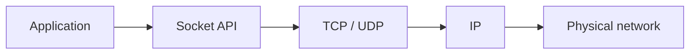
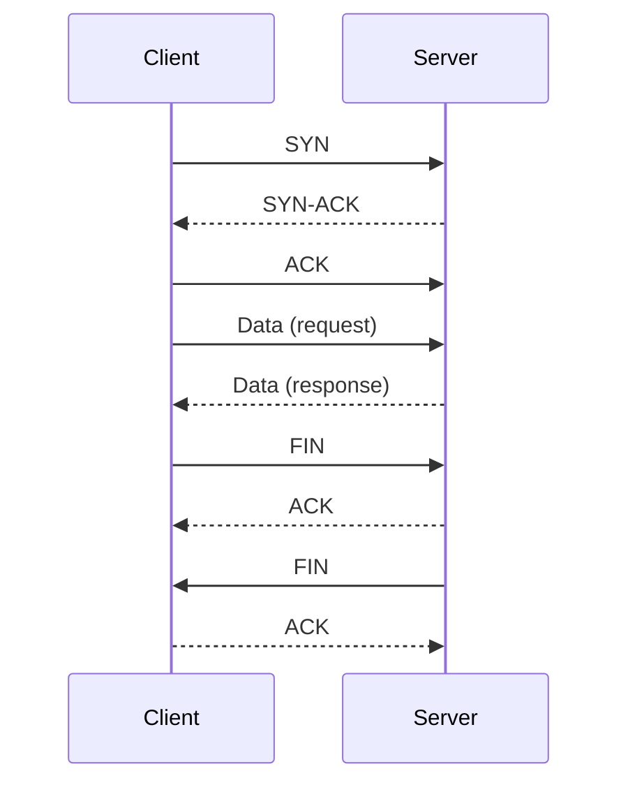
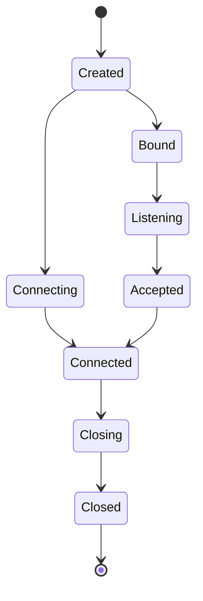
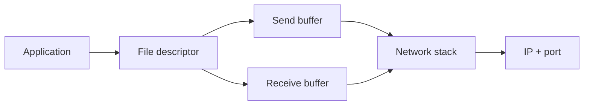

# Sockets

## Blogs and websites


## Medium


## Youtube

- [99% of Developers Don't Get Sockets](https://www.youtube.com/watch?v=D26sUZ6DHNQ)
- [How Sockets Actually Work - From Your Browser to the Backend](https://www.youtube.com/watch?v=NvZEZ-mZsuI)

## Theory

### Topics Covered

1. [Introduction](#introduction)
2. [How Sockets Work](#how-sockets-work)
3. [Socket Types](#socket-types)
4. [Connection Lifecycle](#connection-lifecycle)
5. [Characteristics](#characteristics)
6. [Pros](#pros)
7. [Cons](#cons)
8. [Use Cases](#use-cases)
9. [Components](#components)
10. [Patterns](#patterns)
11. [Benefits](#benefits)
12. [Challenges](#challenges)
13. [Best Practices](#best-practices)
14. [When to Use](#when-to-use)
15. [Java and Spring Boot Examples](#java-and-spring-boot-examples)

---

### Introduction

A socket is an endpoint for communication between two processes. It is identified by an IP address and a port, and it lets applications exchange bytes over the network without implementing the underlying transport protocol themselves.



**Real-life use cases**

- **Web servers**: accept client connections on ports 80 and 443.
- **Browsers**: open sockets to fetch web pages and APIs.
- **Databases**: clients connect to database servers over TCP sockets.
- **Chat applications**: maintain persistent socket connections.
- **Game servers**: exchange real-time packets with players.

**Interview questions and answers**

- **Q: What is a socket?**
  **A:** A socket is a communication endpoint identified by an IP address and port, through which an application sends and receives data.

- **Q: What is the difference between a listening socket and a connected socket?**
  **A:** A listening socket accepts incoming connections on a port; a connected socket represents one established connection between two endpoints.

- **Q: What transport protocols are commonly used with sockets?**
  **A:** TCP for reliable, ordered streams and UDP for connectionless, low-latency datagrams.

---

### How Sockets Work

Sockets sit between the application and the transport layer. For TCP, the operating system handles the three-way handshake, retransmissions, ordering, and flow control; the application simply writes and reads bytes through the socket.

**TCP connection establishment:**

1. Server creates a listening socket bound to an address and port.
2. Client creates a socket and initiates a connection.
3. The operating systems complete the SYN, SYN-ACK, ACK handshake.
4. The server accepts the connection, producing a connected socket.
5. Both sides exchange data as ordered byte streams.



**Interview questions and answers**

- **Q: What happens during the TCP three-way handshake?**
  **A:** The client sends SYN, the server replies SYN-ACK, and the client sends ACK, establishing a reliable connection.

- **Q: How does the OS know which process to deliver data to?**
  **A:** The destination port in each packet identifies the socket, and therefore the process, that should receive the data.

- **Q: Why does a server need a separate connected socket for each client?**
  **A:** The listening socket only accepts connections; a connected socket tracks the state of each individual client session.

---

### Socket Types

- **Stream sockets (TCP)**
  Provide a reliable, ordered, byte-stream connection.

- **Datagram sockets (UDP)**
  Provide connectionless, unordered, best-effort delivery.

- **Raw sockets**
  Allow access to lower-level protocols for specialized tools.

- **Unix domain sockets**
  Provide high-performance communication between processes on the same host.

**TCP vs UDP:**

| Aspect | TCP socket | UDP socket |
|--------|-----------|-----------|
| **Connection** | Connection-oriented | Connectionless |
| **Reliability** | Guaranteed delivery | Best effort |
| **Ordering** | Ordered | Not ordered |
| **Overhead** | Higher | Lower |
| **Use case** | Web, databases | DNS, gaming, streaming |

**Interview questions and answers**

- **Q: When would you use a UDP socket?**
  **A:** When low latency matters more than reliability, such as DNS, voice, video, and real-time games.

- **Q: What is a Unix domain socket?**
  **A:** A socket that communicates between processes on the same machine using filesystem paths instead of network IP addresses.

---

### Connection Lifecycle

A TCP socket passes through several states: created, bound, listening, connecting, connected, closing, and closed. Understanding these states helps diagnose connection leaks and port exhaustion.



**Common states:**

- **LISTEN**: server socket waiting for connections.
- **SYN-SENT / SYN-RECEIVED**: handshake in progress.
- **ESTABLISHED**: active data connection.
- **FIN-WAIT / CLOSE-WAIT / TIME-WAIT**: connection teardown.

**Interview questions and answers**

- **Q: What is the TIME-WAIT state?**
  **A:** After a socket closes, it briefly waits to ensure delayed packets are not mistaken for a new connection, preventing data corruption.

- **Q: Why can a server run out of ports?**
  **A:** Each connection consumes a port, and sockets in TIME-WAIT hold ports briefly; high connection churn can exhaust them.

- **Q: What is a half-open connection?**
  **A:** A connection where one side has closed but the other still believes it is open.

---

### Characteristics

- **Endpoint-oriented**
  A socket combines an IP address and port to identify a communication endpoint.

- **Transport-protocol abstraction**
  Sockets hide transport details behind read/write operations.

- **Full-duplex**
  A TCP socket can send and receive data in both directions.

- **Stateful for TCP**
  Connected sockets track sequence numbers, buffers, and connection state.

- **Stateless for UDP**
  Datagram sockets send independent messages without connection state.

- **Resource-backed**
  Each socket consumes file descriptors, buffers, and port numbers.

- **Blocking or non-blocking**
  Sockets can block on I/O or operate in non-blocking mode.

- **Concurrency-sensitive**
  Servers must manage many simultaneous sockets carefully.

- **Platform-standard**
  The socket API is available across operating systems and languages.

---

### Pros

- **Universal**
  Sockets work across platforms, languages, and devices.

- **Flexible**
  The same API supports TCP, UDP, and local IPC.

- **High performance**
  Direct byte streaming avoids application-layer overhead.

- **Bidirectional**
  Connected sockets support two-way communication.

- **Precise control**
  Applications control buffering, timeouts, and message boundaries.

- **Foundation of the internet**
  Every networked service ultimately relies on sockets.

- **Composable**
  Higher-level protocols can be built on top of raw sockets.

- **Well understood**
  Decades of tooling and best practices exist.

---

### Cons

- **Low-level complexity**
  Applications must handle partial writes, buffering, and framing.

- **Error-prone**
  Connection failures, timeouts, and resource leaks are common.

- **Manual concurrency**
  Servers must manage threads, pools, or event loops.

- **No message boundaries in TCP**
  A stream socket delivers a continuous byte stream, not discrete messages.

- **Blocking pitfalls**
  Blocking I/O can stall an entire thread.

- **Port exhaustion risk**
  Many short-lived connections can exhaust available ports.

- **Security surface**
  Sockets must be protected with TLS, authentication, and input validation.

- **Platform differences**
  Behavior and tuning can vary across operating systems.

---

### Use Cases

- **Web and API servers**
  Accept HTTP requests over TCP sockets.

- **Database connections**
  Clients connect to databases over persistent TCP sockets.

- **Real-time chat**
  WebSockets and messaging protocols run over TCP sockets.

- **DNS resolution**
  Queries often use UDP sockets for speed.

- **Online gaming**
  Game state exchanges use UDP or low-latency TCP sockets.

- **Voice and video**
  Streaming media uses UDP to tolerate packet loss.

- **Inter-process communication**
  Unix domain sockets connect local processes.

- **Network utilities**
  Tools like `curl`, `netcat`, and port scanners use sockets.

---

### Components

- **IP address**
  Identifies the host on the network.

- **Port**
  Identifies the specific process or service on the host.

- **File descriptor**
  The OS handle through which the application reads and writes.

- **Send buffer**
  Holds outgoing data before transmission.

- **Receive buffer**
  Holds incoming data before the application reads it.

- **Protocol control block**
  Tracks connection state, sequence numbers, and options.

- **Socket options**
  Configure timeouts, buffer sizes, reuse, and keep-alive.

- **Backlog queue**
  Holds pending connections waiting to be accepted.



---

### Patterns

- **Thread-per-connection**
  A dedicated thread handles each socket; simple but does not scale well.

- **Thread pool**
  A fixed pool of threads serves many connections.

- **Event loop**
  A single thread multiplexes many non-blocking sockets.

- **Reactor**
  Dispatches I/O events to handlers when sockets become ready.

- **Connection pooling**
  Reuses open sockets to avoid repeated handshakes.

- **Backpressure**
  Slows producers when the receive buffer fills.

- **Keep-alive**
  Maintains idle connections to avoid re-establishment overhead.

- **Load-balanced fan-out**
  Distributes accepted sockets across workers.

---

### Benefits

- **Scalability**
  Event loops and pools enable thousands of concurrent connections.

- **Efficiency**
  Direct byte streaming minimizes overhead.

- **Interoperability**
  Different systems communicate through a shared standard.

- **Low latency**
  Persistent sockets avoid repeated handshakes.

- **Real-time capability**
  Bidirectional sockets enable push-based communication.

- **Controllability**
  Fine-grained tuning of buffers, timeouts, and behavior.

- **Portability**
  Socket code ports across environments with minimal changes.

---

### Challenges

- **Handling many connections**
  Naive thread-per-connection designs exhaust resources.

- **Message framing**
  Applications must delimit messages in a TCP stream.

- **Partial I/O**
  Reads and writes may not complete in a single call.

- **Resource leaks**
  Sockets not closed promptly leak descriptors and ports.

- **Backpressure management**
  Unbounded buffers can exhaust memory under slow consumers.

- **Security**
  Raw sockets need TLS and input validation.

- **Debugging**
  Network issues are hard to reproduce and trace.

---

### Best Practices

- **Set connect and read timeouts**
  Avoid indefinite blocking.

- **Close sockets in `finally`**
  Ensure resources are released.

- **Use non-blocking I/O for scale**
  Prefer event loops or reactive stacks for many connections.

- **Add TLS for security**
  Encrypt socket traffic in production.

- **Validate all input**
  Treat socket data as untrusted.

- **Use connection pools**
  Reuse sockets for databases and HTTP clients.

- **Apply backpressure**
  Bound buffers and slow producers when consumers lag.

- **Monitor descriptor and port usage**
  Alert before exhaustion.

- **Handle partial writes**
  Loop until all bytes are sent.

- **Prefer higher-level abstractions**
  Use Netty, WebSocket, or an HTTP client unless raw sockets are necessary.

---

### When to Use

- **Use raw sockets when** building custom network protocols.
- **Use sockets when** performance and control outweigh convenience.
- **Use sockets when** real-time bidirectional communication is required.
- **Use sockets when** connecting to databases and message brokers.
- **Use sockets when** implementing servers or network utilities.

**Prefer a higher-level abstraction when**

- HTTP or WebSockets already meet the need.
- Message boundaries, serialization, and reliability are complex.
- TLS, retries, and connection pooling are required out of the box.

---

### Java and Spring Boot Examples

#### 1. TCP echo server

```java
import java.io.BufferedReader;
import java.io.IOException;
import java.io.InputStreamReader;
import java.io.PrintWriter;
import java.net.ServerSocket;
import java.net.Socket;

public class EchoServer {

    private final int port;

    public EchoServer(int port) {
        this.port = port;
    }

    public void start() throws IOException {
        try (ServerSocket serverSocket = new ServerSocket(port)) {
            while (true) {
                Socket client = serverSocket.accept();
                handle(client);
            }
        }
    }

    private void handle(Socket client) {
        try (client;
             BufferedReader in = new BufferedReader(new InputStreamReader(client.getInputStream()));
             PrintWriter out = new PrintWriter(client.getOutputStream(), true)) {
            String line;
            while ((line = in.readLine()) != null) {
                out.println("echo: " + line);
            }
        } catch (IOException e) {
            System.err.println("Connection error: " + e.getMessage());
        }
    }
}
```

#### 2. TCP client

```java
import java.io.BufferedReader;
import java.io.IOException;
import java.io.InputStreamReader;
import java.io.PrintWriter;
import java.net.Socket;

public class EchoClient {

    private final String host;
    private final int port;

    public EchoClient(String host, int port) {
        this.host = host;
        this.port = port;
    }

    public String send(String message) throws IOException {
        try (Socket socket = new Socket(host, port);
             PrintWriter out = new PrintWriter(socket.getOutputStream(), true);
             BufferedReader in = new BufferedReader(new InputStreamReader(socket.getInputStream()))) {
            out.println(message);
            return in.readLine();
        }
    }
}
```

#### 3. Non-blocking server with Java NIO

```java
import java.io.IOException;
import java.net.InetSocketAddress;
import java.nio.ByteBuffer;
import java.nio.channels.SelectionKey;
import java.nio.channels.Selector;
import java.nio.channels.ServerSocketChannel;
import java.nio.channels.SocketChannel;
import java.util.Iterator;

public class NioEchoServer {

    private final int port;

    public NioEchoServer(int port) {
        this.port = port;
    }

    public void start() throws IOException {
        try (ServerSocketChannel server = ServerSocketChannel.open();
             Selector selector = Selector.open()) {
            server.bind(new InetSocketAddress(port));
            server.configureBlocking(false);
            server.register(selector, SelectionKey.OP_ACCEPT);

            ByteBuffer buffer = ByteBuffer.allocate(1024);
            while (true) {
                selector.select();
                Iterator<SelectionKey> keys = selector.selectedKeys().iterator();
                while (keys.hasNext()) {
                    SelectionKey key = keys.next();
                    keys.remove();
                    if (key.isAcceptable()) {
                        SocketChannel client = server.accept();
                        client.configureBlocking(false);
                        client.register(selector, SelectionKey.OP_READ);
                    } else if (key.isReadable()) {
                        SocketChannel client = (SocketChannel) key.channel();
                        buffer.clear();
                        int read = client.read(buffer);
                        if (read == -1) {
                            client.close();
                        } else {
                            buffer.flip();
                            client.write(buffer);
                        }
                    }
                }
            }
        }
    }
}
```

#### 4. Spring Boot WebSocket endpoint

```java
import org.springframework.stereotype.Component;
import org.springframework.web.socket.TextMessage;
import org.springframework.web.socket.WebSocketSession;
import org.springframework.web.socket.handler.TextWebSocketHandler;

@Component
public class EchoWebSocketHandler extends TextWebSocketHandler {

    @Override
    protected void handleTextMessage(WebSocketSession session, TextMessage message) throws Exception {
        session.sendMessage(new TextMessage("echo: " + message.getPayload()));
    }
}
```

**Interview questions and answers**

- **Q: Why do TCP sockets need application-level message framing?**
  **A:** TCP delivers a byte stream without message boundaries, so the application must delimit messages using lengths or separators.

- **Q: What is the difference between blocking and non-blocking sockets?**
  **A:** Blocking sockets pause the calling thread until I/O completes; non-blocking sockets return immediately and notify readiness through an event loop or selector.

- **Q: How does a server scale to many connections?**
  **A:** By using non-blocking I/O, event loops, or thread pools rather than one thread per connection.

- **Q: Why should socket data be validated?**
  **A:** Socket input originates from external systems and must be treated as untrusted to prevent injection, buffer overflow, and malformed-data attacks.
