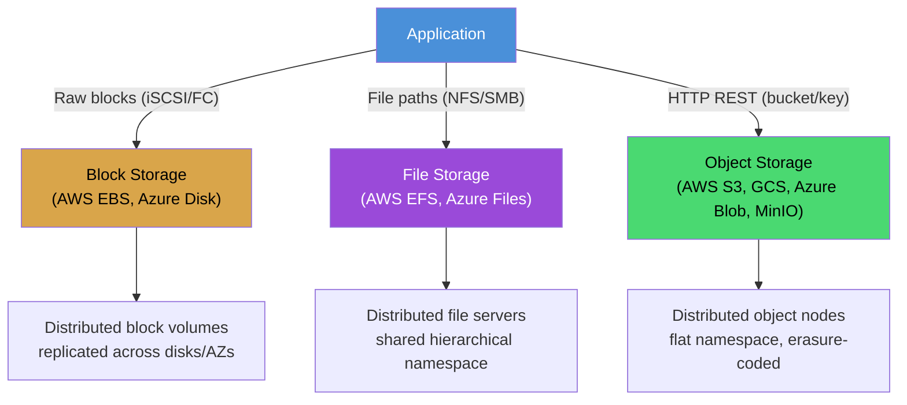
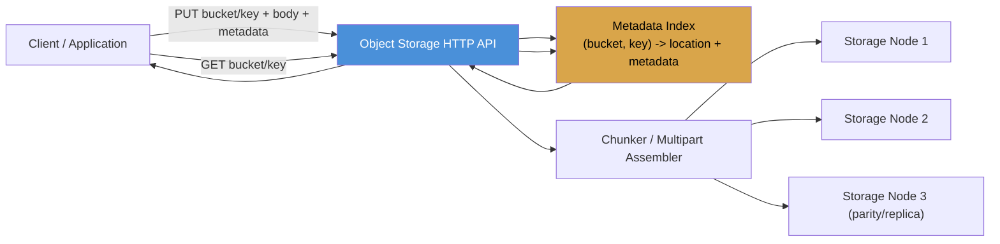
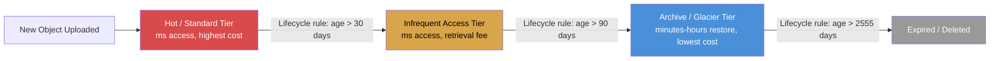
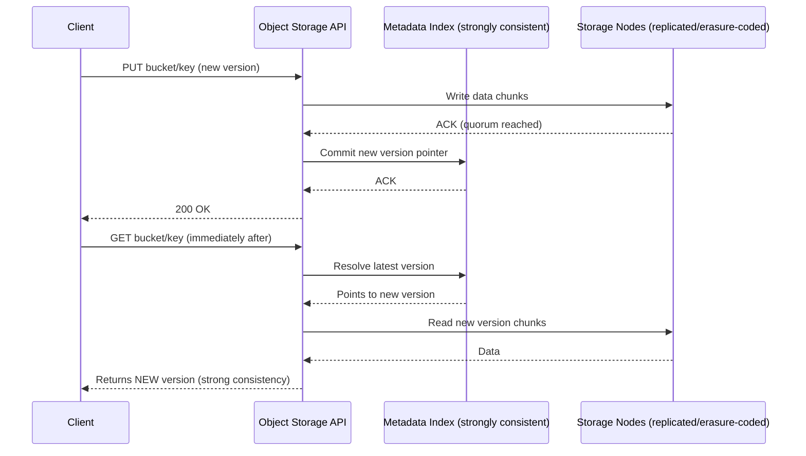
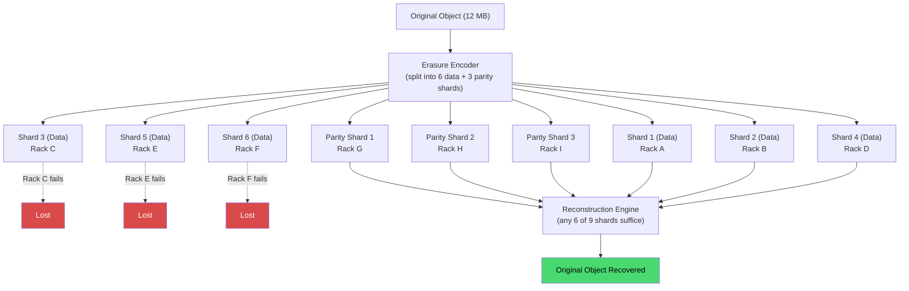
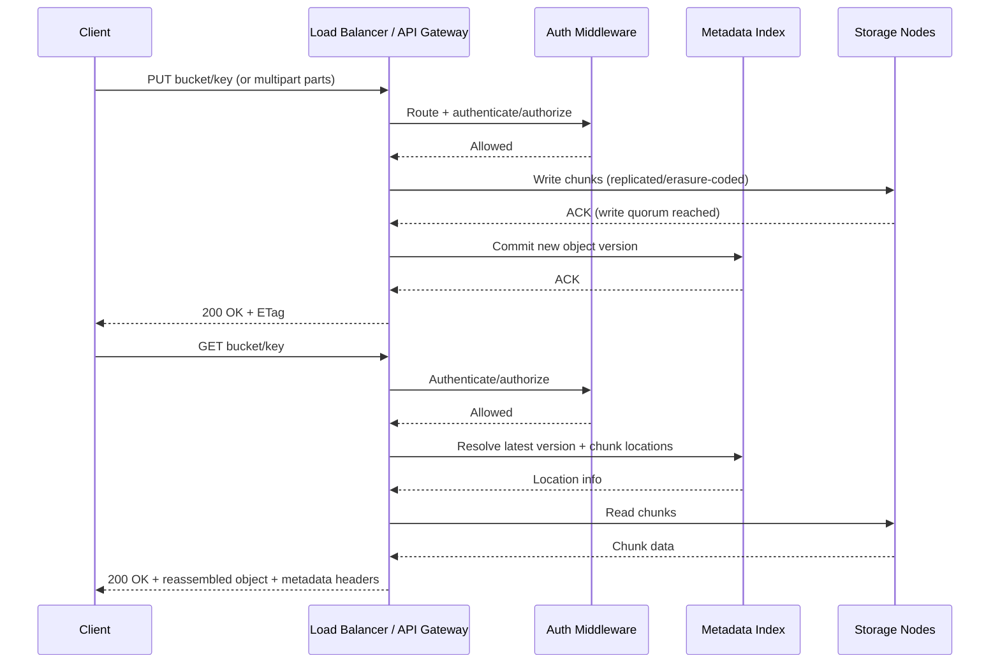
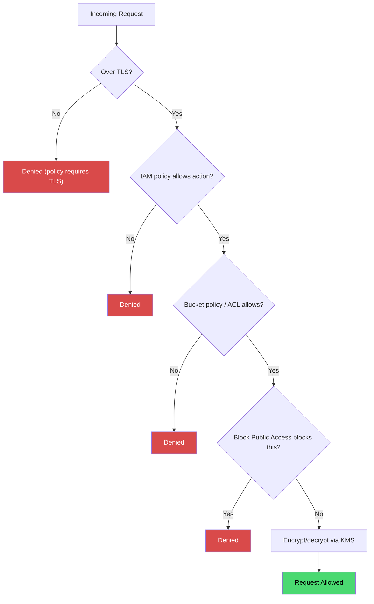

# Object Storage / Blob Storage

## Blogs and websites


## Medium


## Youtube

### Single Videos

- [File Storage VS Object Storage | System Design](https://www.youtube.com/watch?v=AV4Ei1qW89o)
- [Design a Scalable BLOB Store | System Design](https://www.youtube.com/watch?v=lWnQtOIWiUY)
- [How do BLOB Stores Scale? (S3, GCS, MinIO) | System Design](https://www.youtube.com/watch?v=gzUJ0N6jIb4)

## Theory

### Topics Covered

This page is organized into the following topics. Each topic includes a detailed explanation, its characteristics, components, patterns, pros/benefits, cons/challenges, best practices, when to use it, a real-life use case, a diagram, a Java code example, and interview questions with answers.

1. [Distributed Storage: Block vs File vs Object Storage](#distributed-storage-block-vs-file-vs-object-storage)
2. [Object Storage Data Model: Object = Key + Data + Metadata](#object-storage-data-model-object--key--data--metadata)
3. [Storage Classes and Lifecycle Management](#storage-classes-and-lifecycle-management)
4. [Consistency Models in Object Storage](#consistency-models-in-object-storage)
5. [Durability and Replication](#durability-and-replication)
6. [Process Related Things: Upload (PUT) and Download (GET) Request Flow](#process-related-things-upload-put-and-download-get-request-flow)
7. [Security: Access Control, Bucket Policies, and Encryption](#security-access-control-bucket-policies-and-encryption)
8. [Object Storage / Blob Storage: Characteristics, Pros, Cons, Use Cases, Components, Patterns, Benefits, Challenges, Best Practices and When to Use](#object-storage--blob-storage-characteristics-pros-cons-use-cases-components-patterns-benefits-challenges-best-practices-and-when-to-use)

### Distributed Storage: Block vs File vs Object Storage

Distributed storage systems spread data across multiple machines or data centers, providing scalability, fault tolerance, and high availability that a single server cannot achieve. Instead of writing every byte to one disk on one host, the system splits, replicates, and/or erasure-codes data across a cluster of nodes so that the loss of any single disk, node, rack, or even data center does not result in data loss or downtime.

**Types of Storage Systems:**
```
Block Storage:
  └─ Raw disk blocks, low-level
  └─ Used by: VMs, databases
  └─ Examples: AWS EBS, Azure Disk

File Storage:
  └─ Hierarchical directory structure
  └─ Used by: Shared file systems, NAS
  └─ Examples: AWS EFS, Azure Files, NFS

Object Storage:
  └─ Flat namespace, key-value with metadata
  └─ Used by: Media, backups, data lakes
  └─ Examples: AWS S3, Azure Blob, GCS, MinIO
```

**Why Object Storage Dominates Modern Systems:**
- **Virtually unlimited scale**: S3-class systems handle exabytes of data across millions of buckets and trillions of objects, because the namespace is flat and horizontally partitioned rather than tied to a single filesystem tree.
- **Cheap**: Pennies per GB per month, made possible by storage tiers (hot, warm, cold, archive) and erasure coding instead of full 3x replication.
- **Durable**: Commonly quoted at 99.999999999% (11 nines) durability, meaning data is erasure-coded or replicated across multiple disks, racks, and facilities so that no single failure domain can destroy the only copy.
- **Simple API**: PUT, GET, DELETE, and HEAD over plain HTTP REST, which makes object storage trivial to integrate from any language or platform without a special client driver.
- **Metadata-rich**: Arbitrary custom key-value metadata (content type, checksums, tags, application-specific fields) can be attached to every object and returned alongside it.

**Block vs File vs Object, at a glance:**

| Aspect | Block Storage | File Storage | Object Storage |
|---|---|---|---|
| Unit of storage | Fixed-size block | File in a directory | Object (blob + metadata) |
| Namespace | None (raw addresses) | Hierarchical (paths) | Flat (bucket + key) |
| Access protocol | iSCSI, Fibre Channel | NFS, SMB | HTTP REST (S3 API, etc.) |
| Mutability | In-place block overwrite | In-place file edit | Whole-object replace (no partial in-place edits) |
| Typical latency | Lowest (sub-ms) | Low (ms) | Higher (tens of ms) |
| Scale ceiling | Single volume/LUN size | Single filesystem/namespace | Effectively unlimited, horizontally sharded |
| Best for | Databases, boot volumes, VM disks | Shared home directories, legacy apps | Media, backups, logs, data lakes, static assets |

#### Distributed Storage: Characteristics

- **Horizontal partitioning of data**: Data is split (sharded) across many nodes by a hash or range of the key, so no single node stores the entire dataset and no single node is a bottleneck for the whole system.
- **Replication or erasure coding for fault tolerance**: Every chunk of data has redundant copies (or parity fragments) on independent nodes, so the failure of any one disk, node, or rack does not cause data loss.
- **Location transparency**: Clients address data by a logical identifier (a block address, file path, or object key) and never need to know which physical machine actually holds the bytes; a metadata/lookup layer resolves that mapping.
- **Different storage types trade structure for flexibility**: Block storage is the lowest-level and fastest but has no built-in metadata or sharing; file storage adds a hierarchical namespace and POSIX semantics; object storage flattens the namespace and adds rich metadata, trading strict consistency and low latency for virtually unlimited scale.

#### Distributed Storage: Components

- **Storage nodes**: The physical or virtual machines that actually persist bytes to disk (HDD/SSD/NVMe), each responsible for a subset of the overall data.
- **Metadata/placement service**: A service (often itself a small strongly consistent store, e.g. based on Raft or Paxos) that tracks which node(s) hold which block, file, or object, and drives rebalancing when nodes join or leave.
- **Client library or gateway**: The SDK or HTTP gateway that translates application requests (read block, open file, GET object) into the internal protocol used to talk to storage nodes.
- **Replication/erasure-coding engine**: The background component that creates and repairs redundant copies or parity fragments after every write and after every node failure.

#### Distributed Storage: Patterns

- **Sharding by consistent hashing**: Keys are mapped to nodes using consistent hashing so that adding or removing a node only reshuffles a small fraction of the keyspace, instead of the entire dataset.
- **Primary-replica (leader-follower) replication**: A primary node accepts writes and asynchronously or synchronously ships them to replica nodes, used heavily in block and file storage for read scaling and failover.
- **Quorum-based replication**: Writes and reads only need to succeed on a majority of replicas (W + R > N), which is the pattern most object stores use internally to balance durability and latency.
- **Tiered storage pattern**: Data automatically migrates between hot, warm, and cold tiers based on access frequency, a pattern that is native to object storage and increasingly bolted onto file and block systems too.

#### Distributed Storage: Pros / Benefits

- **Scales far beyond a single machine**: Because data and load are distributed, capacity and throughput grow by adding nodes rather than being capped by the biggest single server you can buy.
- **Survives hardware failure by design**: Disks and nodes fail regularly at scale; distributing and replicating data means individual failures are routine, invisible events instead of outages.
- **Matches storage type to workload**: Having block, file, and object as distinct options lets architects pick the right latency/consistency/cost trade-off per workload instead of forcing everything through one storage model.
- **Enables independent scaling of compute and storage**: Especially with object storage, compute nodes can be stateless and disposable while data safely lives in a separate, independently scaled storage tier.

#### Distributed Storage: Cons / Challenges

- **Operational complexity**: Running a distributed storage cluster means managing rebalancing, replica placement, failure detection, and repair, which is significantly more complex than managing a single disk or NAS box.
- **Network becomes the new bottleneck**: Once storage is distributed, network bandwidth and latency between nodes (or between client and object store) often dominate performance instead of raw disk speed.
- **Consistency trade-offs**: Distributing data across nodes forces explicit choices about consistency (as in CAP theorem trade-offs), which can surprise application developers who expect single-machine, strongly consistent semantics by default.
- **Cost of redundancy**: Replication factors of 3x (or erasure coding overhead) mean real usable capacity is meaningfully lower than raw disk capacity purchased.

#### Distributed Storage: Best Practices

- Choose the storage type (block, file, object) based on the access pattern first (random low-latency IO, shared hierarchical access, or bulk write-once/read-many) rather than defaulting to whichever is most familiar.
- Use block storage for anything requiring low, predictable latency and in-place random writes, such as database data files and VM root volumes.
- Use object storage as the default for anything that is written once and read many times, especially media, backups, logs, and analytics data, because of its cost and scale advantages.
- Avoid using a hierarchical file storage mental model (deep folder trees) on object storage; treat the "path-like" prefix in a key as a display convenience, not a real directory structure.

#### Distributed Storage: When to Use

- Use **block storage** when an application (a database engine, a VM) needs to manage its own filesystem and requires the lowest possible latency for random reads/writes.
- Use **file storage** when multiple machines need POSIX-style shared access to the same hierarchical namespace, such as shared home directories or legacy applications that only understand file paths.
- Use **object storage** when data volume is large, access is mostly whole-object PUT/GET, and you need virtually unlimited scale at low cost, such as media libraries, backups, static websites, and data lakes.

#### Distributed Storage: Diagram



#### Distributed Storage: Real-Life Use Case

A video streaming platform uses all three storage types for different parts of its system: block storage (EBS-like volumes) backs the metadata database that stores video titles, users, and playback state, because that database needs low-latency random reads and writes; file storage (an NFS share) is used by the video transcoding cluster so multiple worker machines can read and write intermediate transcoding artifacts through a shared directory; and object storage (S3-like) holds the actual finished video files and thumbnails, since videos are written once, read millions of times, and need to scale to petabytes at low cost. Choosing one storage type for everything (e.g., putting finished videos on block storage) would either be far more expensive or would not scale to the required volume.

#### Distributed Storage: Java Code Example

```java
import java.util.Map;
import java.util.concurrent.ConcurrentHashMap;

// A minimal illustration of how block, file, and object storage differ in their addressing model.
public class StorageModelComparison {

    // Block storage: addressed by raw numeric block offsets, no metadata.
    static class BlockDevice {
        private final Map<Long, byte[]> blocks = new ConcurrentHashMap<>();

        void writeBlock(long blockNumber, byte[] data) {
            blocks.put(blockNumber, data);
        }

        byte[] readBlock(long blockNumber) {
            return blocks.get(blockNumber);
        }
    }

    // File storage: addressed by a hierarchical path.
    static class FileSystem {
        private final Map<String, byte[]> filesByPath = new ConcurrentHashMap<>();

        void writeFile(String path, byte[] data) {
            filesByPath.put(path, data); // e.g. "/videos/raw/clip1.mp4"
        }

        byte[] readFile(String path) {
            return filesByPath.get(path);
        }
    }

    // Object storage: flat namespace, key + data + metadata, addressed by bucket/key.
    static class ObjectStore {
        static class StoredObject {
            final byte[] data;
            final Map<String, String> metadata;

            StoredObject(byte[] data, Map<String, String> metadata) {
                this.data = data;
                this.metadata = metadata;
            }
        }

        private final Map<String, StoredObject> objectsByKey = new ConcurrentHashMap<>();

        void putObject(String key, byte[] data, Map<String, String> metadata) {
            objectsByKey.put(key, new StoredObject(data, metadata)); // key looks like a path but is just a string
        }

        StoredObject getObject(String key) {
            return objectsByKey.get(key);
        }
    }

    public static void main(String[] args) {
        BlockDevice disk = new BlockDevice();
        disk.writeBlock(42, "raw-bytes".getBytes());

        FileSystem nfs = new FileSystem();
        nfs.writeFile("/videos/raw/clip1.mp4", "video-bytes".getBytes());

        ObjectStore s3 = new ObjectStore();
        s3.putObject("videos/finished/clip1.mp4", "final-video-bytes".getBytes(),
                Map.of("content-type", "video/mp4", "uploaded-by", "encoder-worker-7"));

        System.out.println("Object metadata: " + s3.getObject("videos/finished/clip1.mp4").metadata);
    }
}
```

#### Distributed Storage: Interview Questions and Answers

**Q1. What is the fundamental difference between block, file, and object storage?**
A: Block storage exposes raw, fixed-size addressable blocks with no built-in structure or metadata, and the client (usually an OS or database) imposes a filesystem or its own layout on top. File storage adds a hierarchical namespace (directories and files) and POSIX-like semantics for shared access. Object storage flattens the namespace into a flat key space, stores each object as an opaque blob plus rich metadata, and is accessed exclusively over an HTTP-based API rather than a block or POSIX file protocol.

**Q2. Why can't you efficiently do small, in-place random writes to an object in object storage the way you can to a file?**
A: Object storage APIs are designed around whole-object PUT/GET semantics: updating an object generally means uploading a brand-new version that replaces the old one (or using a versioned key), rather than patching a few bytes in the middle. This design choice is what allows objects to be sharded, replicated, and served from many nodes without coordinating fine-grained partial writes, which is essential to reaching object storage's massive scale.

**Q3. Why do distributed storage systems replicate or erasure-code data instead of just using one large reliable disk?**
A: At scale, individual disk and node failures are a statistical certainty, not an edge case. Even a very reliable disk has a nonzero annual failure rate, and with thousands of disks the expected number of failures per day is significant. Replication or erasure coding ensures that any single failure (or even several, depending on replication factor) does not result in data loss, and the system can be repaired in the background without an outage.

**Q4. When would you choose file storage over object storage, given that object storage is cheaper and scales further?**
A: When multiple machines need POSIX-compliant shared access to the same files, with directory semantics, byte-range in-place writes, or file locking, e.g. a legacy application, a shared build directory, or a rendering farm reading and writing intermediate files. Object storage is not designed for that access pattern; forcing it there usually requires an extra translation layer (like a FUSE mount) that adds latency and complexity.

### Object Storage Data Model: Object = Key + Data + Metadata

An object in object storage is not just a file; it is a single, versionable unit made of three parts: a unique **key** (its identifier within a bucket/container), the **data** itself (an opaque binary blob, from a few bytes up to multiple terabytes depending on the provider), and **metadata** (a set of key-value pairs describing the object, both system-defined like content type and size, and user-defined custom fields). Because there is no real directory tree, "folders" you see in a console (e.g. `images/profile/`) are purely a display convenience built by splitting keys on `/`; internally, the store just sees one flat string key.

```
Object = Key + Data + Metadata

PUT object:
  Key:      "images/profile/user-123.jpg"
  Data:     <binary image data>
  Metadata: {content-type: "image/jpeg", uploaded-by: "user-123"}

GET object:
  GET https://bucket.s3.amazonaws.com/images/profile/user-123.jpg
  → Returns the image with metadata in headers
```

#### Object Storage Data Model: Characteristics

- **Flat namespace, prefix-simulated hierarchy**: There are no real directories; a key like `a/b/c.png` is just one string, and list operations use the `/` delimiter to simulate folder-like browsing (e.g. "list all keys under prefix `a/b/`").
- **Whole-object versioning**: Updating an object typically creates a brand-new version (if bucket versioning is enabled) rather than patching bytes in place, which makes objects naturally immutable once written and simplifies caching and replication.
- **Rich, queryable metadata**: Both system metadata (content-type, size, ETag/checksum, last-modified) and custom user metadata travel with the object and are returned on every GET/HEAD without a separate database lookup.
- **Content-addressable integrity**: Most object stores compute and expose a checksum (an ETag, often an MD5 or a multipart-aware hash) so clients can verify that the bytes received exactly match the bytes uploaded.

#### Object Storage Data Model: Components

- **Bucket/container**: The top-level namespace that owns a set of keys, has its own access policy, region, and configuration (versioning, lifecycle rules, encryption defaults).
- **Key**: The unique string identifier for an object within a bucket; effectively the primary key in a giant distributed key-value store.
- **Object body/data**: The actual bytes, stored as an opaque blob, split into chunks internally for large objects (multipart upload).
- **Metadata store**: An internal, usually strongly-consistent, index that maps bucket + key to the physical location(s) of the object's data chunks and to its metadata, often backed by a distributed database (e.g. a Dynamo-style or B-tree-based index) separate from the bulk data nodes.

#### Object Storage Data Model: Patterns

- **Key design for parallel access**: Prefixing keys with a hash or random string (instead of a purely sequential timestamp) is a well-known pattern to avoid hot-partition bottlenecks when a system's internal sharding is prefix-based.
- **Metadata-driven processing**: Attaching custom metadata (e.g. `processing-status: pending`) at upload time and having downstream services react to metadata rather than parsing the object body itself.
- **Content-addressable storage**: Using a hash of the object's content as its key (deduplication pattern), so identical content uploaded twice is only stored once.
- **Multipart upload for large objects**: Splitting a large object into multiple parts, uploading them in parallel, and having the store assemble them into one logical object on completion.

#### Object Storage Data Model: Pros / Benefits

- **Simple, uniform access model**: Every object, regardless of size or type, is accessed with the same PUT/GET/DELETE/HEAD verbs, which keeps client code simple compared to negotiating a stateful protocol.
- **Metadata travels with the object**: Applications do not need a separate metadata database for basic attributes like content type or custom tags, since the store returns them with every request.
- **Natural fit for immutable, versioned data**: Because updates create new versions rather than in-place edits, object storage pairs well with event-driven and audit-friendly architectures.
- **Easy horizontal scaling of the key space**: A flat key space with no directory tree to rebalance means adding capacity is a matter of adding more storage nodes and rebalancing key ranges, not restructuring a filesystem tree.

#### Object Storage Data Model: Cons / Challenges

- **No partial in-place updates**: Modifying even one byte of a large object generally requires re-uploading the whole object (or a full new part in a multipart upload), which is inefficient for workloads that need small, frequent, in-place edits.
- **Listing large "directories" is not free**: Because folders are simulated via prefixes, listing millions of keys under a common prefix can be slow and paginated, unlike a real filesystem directory read.
- **Metadata is usually immutable without a new PUT**: Changing an object's metadata alone often still requires a copy/re-upload operation (a "copy object to itself with new metadata"), which is a subtlety that catches teams off guard.
- **Eventually consistent listings in some systems**: Even where individual object reads are strongly consistent, bucket listings (e.g. "list all objects") can lag slightly behind the very latest writes on some implementations.

#### Object Storage Data Model: Best Practices

- Design keys with access patterns in mind: use hashed or random prefixes for high-throughput uniform writes, and human-readable prefixes only where "folder-style" browsing in a console genuinely matters.
- Store frequently-changing attributes (like a "view count") in a separate fast database rather than as object metadata, since metadata updates require rewriting the object.
- Always verify uploads using the returned checksum/ETag, especially for large or critical files, to catch corruption in transit.
- Use multipart upload for any object above a few tens of megabytes to get parallelism, resumability, and better failure isolation.

#### Object Storage Data Model: When to Use

- Use this data model whenever the natural unit of work is "a whole file/blob", such as images, videos, backups, log files, and data lake files (Parquet/ORC/CSV), rather than data needing byte-range in-place mutation.
- Use custom metadata when you want basic descriptive attributes to travel with the object itself and be available without an extra database round trip.
- Reach for a companion database (not object metadata) when you need to query, filter, or frequently update attributes about many objects at once.

#### Object Storage Data Model: Diagram



#### Object Storage Data Model: Real-Life Use Case

A photo-sharing application uploads a user's photo as an object with key `users/123/photos/2026/08/photo-456.jpg`, attaching custom metadata such as `camera-model`, `taken-at`, and `uploader-id`. A background image-processing pipeline listens for new-object events, reads the metadata to decide which resize presets to generate (e.g. skip generating a "portrait crop" for landscape photos based on width/height already present in metadata), and writes new derived objects (thumbnails) as separate keys. No separate metadata database call is needed to make that first triage decision, since the essential attributes travel with the object itself.

#### Object Storage Data Model: Java Code Example

```java
import java.util.HashMap;
import java.util.Map;
import java.util.concurrent.ConcurrentHashMap;
import java.security.MessageDigest;
import java.util.HexFormat;

// A simplified in-memory object store demonstrating the Key + Data + Metadata model.
public class SimpleObjectStore {

    static class ObjectRecord {
        final byte[] data;
        final Map<String, String> metadata;
        final String etag; // content checksum, used to verify integrity

        ObjectRecord(byte[] data, Map<String, String> metadata, String etag) {
            this.data = data;
            this.metadata = metadata;
            this.etag = etag;
        }
    }

    private final Map<String, ObjectRecord> store = new ConcurrentHashMap<>();

    public String put(String key, byte[] data, Map<String, String> userMetadata) throws Exception {
        Map<String, String> fullMetadata = new HashMap<>(userMetadata);
        fullMetadata.put("content-length", String.valueOf(data.length));

        MessageDigest md5 = MessageDigest.getInstance("MD5");
        String etag = HexFormat.of().formatHex(md5.digest(data));

        store.put(key, new ObjectRecord(data, fullMetadata, etag));
        return etag; // caller can compare this to the checksum of the bytes they sent
    }

    public ObjectRecord get(String key) {
        return store.get(key);
    }

    public static void main(String[] args) throws Exception {
        SimpleObjectStore s3 = new SimpleObjectStore();
        String etag = s3.put(
                "images/profile/user-123.jpg",
                "fake-jpeg-bytes".getBytes(),
                Map.of("content-type", "image/jpeg", "uploaded-by", "user-123"));

        ObjectRecord record = s3.get("images/profile/user-123.jpg");
        System.out.println("ETag: " + etag);
        System.out.println("Metadata: " + record.metadata);
    }
}
```

#### Object Storage Data Model: Interview Questions and Answers

**Q1. What three components make up an object in object storage?**
A: A unique key (the identifier within a bucket), the data (the opaque binary payload), and metadata (system-defined fields like content type and size, plus optional user-defined custom key-value pairs). All three are returned together on a GET/HEAD request.

**Q2. If object storage has a "flat namespace," why do consoles like the AWS S3 console show folders?**
A: The console simulates folders by splitting keys on the `/` delimiter and grouping common prefixes for display purposes only. Internally there is no directory inode or tree structure; `photos/2026/img.jpg` is simply one string key, and "listing a folder" is really "listing keys with a given prefix."

**Q3. How would you update just the metadata of an object without changing its data?**
A: In most object stores, this requires a copy operation: copying the object to the same key (or a new key) while specifying the new metadata, because metadata is treated as immutable once written, alongside the object's data, in a single versioned unit.

**Q4. Why is content-addressable storage (using a hash of the data as the key) a useful pattern?**
A: It provides automatic deduplication, since uploading the same bytes twice produces the same key and can be recognized as already stored, and it provides built-in integrity verification, since the key itself proves what the content should hash to.

### Storage Classes and Lifecycle Management

Object stores let you place the same logical object into different **storage classes** that trade access latency and retrieval cost for a much lower per-GB storage price, and **lifecycle rules** let objects move between those classes (or get deleted) automatically as they age, without any application code change.

**Storage Tiers (Cost vs Access Speed):**
- **Hot/Standard**: Frequent access, highest cost, no retrieval fee, millisecond access.
- **Infrequent Access**: Lower storage cost, retrieval fee per GB accessed, still millisecond access but intended for data read less than once a month.
- **Archive/Glacier**: Cheapest storage, minutes-to-hours retrieval (a restore request must be issued before the object can be read).

#### Storage Classes: Characteristics

- **Same API, different economics**: Switching an object's storage class does not change how it is addressed or read (still the same bucket/key GET), only how much it costs to store and how long/expensive it is to retrieve.
- **Retrieval friction increases as storage cost decreases**: Archive tiers require an explicit "restore" step (which can take minutes to hours) before the object becomes readable again, a direct trade-off for the lowest possible storage price.
- **Automated via lifecycle policies**: Rules declared once at the bucket or prefix level (e.g. "move to Infrequent Access after 30 days, Archive after 90 days, delete after 365 days") run continuously in the background with no per-object intervention.
- **Minimum storage duration charges**: Cheaper tiers often bill a minimum retention period (e.g. 30, 90, or 180 days) even if you delete or transition the object sooner, to discourage using them for short-lived data.

#### Storage Classes: Components

- **Storage class metadata field**: Each object carries a storage-class attribute that the store's placement engine uses to decide which physical media/tier actually holds the bytes.
- **Lifecycle rule engine**: A background service that periodically scans bucket/prefix rules and transitions or expires objects that match age or tag conditions.
- **Restore/rehydration service**: For archive tiers, the component that accepts a restore request, retrieves data from cold media (e.g. tape-like or deep-archive storage), and makes it temporarily available in a faster tier.
- **Analytics/inventory reports**: Tooling that reports on object age and access patterns, which teams use to tune lifecycle rules based on actual usage rather than guesses.

#### Storage Classes: Patterns

- **Age-based tiering**: The most common pattern, moving objects to progressively cheaper tiers purely based on how many days have passed since creation.
- **Access-based tiering**: Some object stores offer an "intelligent tiering" class that automatically moves individual objects between hot and infrequent-access tiers based on observed access patterns, rather than a fixed age schedule.
- **Write-once, tier-immediately pattern**: For data known in advance to be rarely read (e.g. compliance backups), objects are written directly into an archive tier instead of starting in the hot tier and transitioning later.
- **Expiration as a cost-control pattern**: Combining tiering with a hard expiration rule (e.g. delete after 7 years) to bound long-term storage cost for data with a known required retention period.

#### Storage Classes: Pros / Benefits

- **Meaningful cost savings with no code changes**: Storage class transitions and expirations are declared as policy, so cost optimization happens automatically as data ages, without touching application code.
- **Pay-for-what-you-use economics**: Rarely accessed data (old backups, completed project archives) costs a fraction of hot-tier pricing, which can reduce storage bills by an order of magnitude for the "long tail" of aging data.
- **Compliance-friendly retention**: Lifecycle rules make it easy to enforce "keep for exactly N years, then delete" policies required by many regulatory regimes.
- **No manual cleanup burden**: Expiration rules remove old, unneeded objects automatically, avoiding the classic problem of buckets growing without bound because nobody remembers to delete old data.

#### Storage Classes: Cons / Challenges

- **Retrieval costs and delays can surprise teams**: Restoring many archived objects at once (e.g. a full-archive restore during an incident) can be slow (hours) and can carry a nontrivial retrieval bill if not planned for.
- **Misconfigured rules can delete data unintentionally**: An overly broad lifecycle expiration rule (e.g. wrong prefix) can silently delete objects that were still needed; this is a common, painful misconfiguration.
- **Minimum duration penalties**: Moving an object to a cheap tier and then deleting it before the minimum storage duration elapses can cost more, in early-deletion fees, than simply leaving it in a warmer tier.
- **Added complexity in access patterns**: Application code (or at least operational runbooks) must account for the possibility that a "read" is not instantaneous if the object happens to be archived.

#### Storage Classes: Best Practices

- Start new data in the hot/standard tier and let lifecycle rules demote it automatically; only write directly to a cold tier when the access pattern is confidently known in advance.
- Tag objects by data classification (e.g. "compliance-archive", "user-media") so lifecycle rules can target the right subsets precisely instead of relying on fragile key-prefix matching alone.
- Model retrieval cost and latency for archive tiers into your disaster-recovery and incident-response runbooks, so an "restore from archive" step is never a surprise during an actual incident.
- Regularly review storage-class analytics/inventory reports and adjust lifecycle thresholds based on observed access patterns rather than a one-time guess made at design time.

#### Storage Classes: When to Use

- Use hot/standard storage for actively served content: current product images, active application data, and anything read on every page load.
- Use infrequent-access tiers for data accessed occasionally but that must still be readable within milliseconds, such as older backups that might be restored during an incident.
- Use archive tiers for compliance retention, long-term backups, and cold data where minutes-to-hours retrieval latency is acceptable in exchange for the lowest possible cost.

#### Storage Classes: Diagram



#### Storage Classes: Real-Life Use Case

A hospital system stores patient imaging scans (MRI/CT files) in object storage. Scans are accessed frequently in the first few weeks after a diagnosis (hot tier), occasionally over the next two years for follow-up care (infrequent-access tier), and then must be retained for regulatory compliance for another 20 years but are almost never accessed (archive tier). A lifecycle policy automatically moves each scan through these tiers based on age, cutting long-term storage cost dramatically compared to keeping every scan in the hot tier indefinitely, while lifecycle-driven deletion after the mandated retention period keeps the organization compliant without manual audits.

#### Storage Classes: Java Code Example

```java
import java.time.LocalDate;
import java.time.temporal.ChronoUnit;

// A simplified simulation of a lifecycle rule engine that transitions objects between tiers by age.
public class LifecycleTieringSimulator {

    enum StorageClass { HOT, INFREQUENT_ACCESS, ARCHIVE, DELETED }

    static class ManagedObject {
        final String key;
        final LocalDate createdOn;
        StorageClass currentClass;

        ManagedObject(String key, LocalDate createdOn) {
            this.key = key;
            this.createdOn = createdOn;
            this.currentClass = StorageClass.HOT;
        }
    }

    // Applies age-based lifecycle rules, similar to a real object store's lifecycle engine.
    static void applyLifecycleRules(ManagedObject obj, LocalDate today) {
        long ageInDays = ChronoUnit.DAYS.between(obj.createdOn, today);

        if (ageInDays > 2555) { // ~7 years
            obj.currentClass = StorageClass.DELETED;
        } else if (ageInDays > 90) {
            obj.currentClass = StorageClass.ARCHIVE;
        } else if (ageInDays > 30) {
            obj.currentClass = StorageClass.INFREQUENT_ACCESS;
        } else {
            obj.currentClass = StorageClass.HOT;
        }
    }

    public static void main(String[] args) {
        ManagedObject scan = new ManagedObject("scans/patient-42/mri-1.dcm", LocalDate.of(2026, 1, 1));
        applyLifecycleRules(scan, LocalDate.of(2026, 8, 8));
        System.out.println(scan.key + " is now in tier: " + scan.currentClass);
    }
}
```

#### Storage Classes: Interview Questions and Answers

**Q1. Why would an archive storage tier require you to "restore" an object before reading it, instead of just serving it directly?**
A: Archive tiers use much cheaper, higher-latency storage media (often optimized for extreme density rather than random access), so the store must first rehydrate the object into faster storage before it can be served with normal GET latency. This restore step is what allows the tier to offer its very low per-GB price.

**Q2. What is a lifecycle policy and how does it reduce storage cost?**
A: A lifecycle policy is a bucket or prefix-level rule set that automatically transitions objects to cheaper storage classes (or deletes them) based on conditions like object age or tags, without any application code involvement. It reduces cost by ensuring aging, rarely accessed data is not left sitting in the most expensive hot tier indefinitely.

**Q3. What is a risk of misconfigured lifecycle rules, and how do you mitigate it?**
A: An overly broad or incorrect rule (e.g. matching the wrong prefix, or an expiration rule applied to the wrong bucket) can silently delete data that was still needed, since expirations run automatically in the background. Mitigations include scoping rules narrowly with tags/prefixes, enabling versioning or MFA-delete for critical buckets, and reviewing rules in a staging environment before applying them to production.

**Q4. How would you decide the age thresholds for transitioning objects between tiers?**
A: By analyzing actual access patterns (using storage analytics/inventory reports) rather than guessing, looking at how access frequency drops off over an object's lifetime, and balancing the storage savings of moving to a colder tier against the tier's retrieval cost and minimum-duration penalties for the expected access frequency at that age.

### Consistency Models in Object Storage

Because objects are physically replicated (or erasure-coded) across many nodes for durability, every object store must define what a client sees when it reads an object shortly after (or concurrently with) a write to it. Historically, most object stores offered only **eventual consistency** for certain operations (most notably, bucket listing after an overwrite or delete), but modern object stores increasingly guarantee **strong read-after-write consistency** for individual object operations.

```
Eventual consistency (older/weaker model):
  PUT object (new version) -> ack
  GET object (immediately after) -> may return OLD version briefly
  ... time passes ...
  GET object -> now returns NEW version (guaranteed eventually)

Strong read-after-write consistency (modern default, e.g. S3 since Dec 2020):
  PUT object (new version) -> ack
  GET object (immediately after) -> always returns NEW version
  LIST objects (immediately after) -> always reflects the change
```

#### Consistency Models: Characteristics

- **Per-object strong consistency is now common**: Modern large-scale object stores (e.g. Amazon S3 since December 2020) guarantee that a GET immediately following a successful PUT, or a LIST immediately following a successful write, always reflects the latest change, for both new objects and overwrites/deletes.
- **Consistency is still a per-provider, per-operation guarantee, not universal**: Some self-hosted or older systems, and some specific operations (e.g. cross-region replication lag, some list-after-delete edge cases in third-party implementations), can still be eventually consistent, so the exact guarantee must be checked per system.
- **Achieved via quorum writes internally**: Even "strongly consistent" object stores typically achieve this using a quorum-based internal replication protocol (a write is acknowledged to the client only once enough internal replicas/metadata updates have committed), rather than truly synchronous replication to every copy.
- **Consistency scope is usually per-key, not cross-key transactional**: Reading object A immediately after writing it is strongly consistent, but there is normally no cross-object transaction guarantee (e.g. writing objects A and B "atomically together" is not natively supported).

#### Consistency Models: Components

- **Metadata/index layer**: The strongly consistent component (often backed by a consensus protocol) that records the current authoritative version and location of each key; consistency guarantees are enforced here first.
- **Write quorum coordinator**: Logic that ensures a write is only acknowledged to the client after enough replicas (or enough of the metadata index) have durably recorded it, so a subsequent read cannot land on a stale replica.
- **Read path router**: The component that decides, on a GET, which replica(s) to read from, and whether a quorum read is required to guarantee the latest data is returned.
- **Replication lag monitor**: For cross-region replication (a separate feature from core object consistency), a monitor that tracks and exposes how far a secondary region's copy lags behind the primary, since cross-region reads are commonly only eventually consistent.

#### Consistency Models: Patterns

- **Read-your-writes via quorum overlap**: Ensuring the set of nodes acknowledging a write and the set of nodes consulted on a read always overlap by at least one node (W + R > N), guaranteeing the read sees the latest write.
- **Single authoritative metadata record**: Routing all reads and writes for a given key's metadata through one logical, strongly consistent record (even if the underlying data itself is spread across many storage nodes) so "what is the current version of this key" is never ambiguous.
- **Conditional writes (compare-and-swap)**: Using an "If-Match" / "If-None-Match" style precondition on PUT so a write only succeeds if the object is still in the expected state, avoiding silent lost updates from concurrent writers.
- **Eventual consistency accepted for cross-region replicas**: Treating same-region reads as strongly consistent, but explicitly documenting and monitoring cross-region replicas as eventually consistent, since synchronous cross-region writes would be far too slow.

#### Consistency Models: Pros / Benefits

- **Simplifies application logic**: With strong read-after-write consistency, developers do not need to build retry loops or "wait and re-read" workarounds after writing an object, which was a common historical pain point.
- **Safer for critical workflows**: Use cases like "upload a file, then immediately trigger processing that reads it back" work correctly by default, without race conditions.
- **Improved correctness for list-then-read workflows**: Listing a bucket and then reading the objects found is guaranteed to reflect a consistent view, avoiding "phantom" missing-object errors right after a write.
- **Reduces the need for custom consistency workarounds**: Teams no longer need to build their own metadata database purely to work around eventual consistency, reducing system complexity.

#### Consistency Models: Cons / Challenges

- **Strong consistency has an internal coordination cost**: Achieving it requires the metadata layer to coordinate (quorum or consensus), which adds some write-side latency and system complexity compared to a naively eventually consistent design, even if that cost is hidden from the client.
- **Cross-region replication is typically still eventually consistent**: Applications relying on cross-region disaster-recovery copies must still design for replication lag and cannot assume a secondary region reflects the very latest write.
- **No native cross-object transactions**: Applications needing atomic multi-object updates (e.g. "update object A and object B together, or neither") must build that coordination themselves, since object storage guarantees consistency per key, not across keys.
- **Legacy systems and some self-hosted deployments may only offer eventual consistency**: Teams evaluating or migrating between object stores must verify the specific consistency guarantees of the target system rather than assuming S3-equivalent behavior everywhere.

#### Consistency Models: Best Practices

- Verify and document the exact consistency guarantee of your chosen object store (per-region, per-operation) rather than assuming "S3-like" behavior applies universally, especially for self-hosted systems like MinIO or older on-premises stores.
- Use conditional writes (ETag preconditions) for any workflow where two clients might write the same key concurrently, to avoid silently losing one writer's update.
- Treat cross-region replicas as eventually consistent in disaster-recovery design, and build explicit lag monitoring/alerting rather than assuming zero replication delay.
- Avoid designing features that depend on cross-object atomicity in object storage; use a database transaction (or a documented two-phase workflow with idempotent retries) for those cases instead.

#### Consistency Models: When to Use

- Rely on strong read-after-write consistency for same-region workflows like "upload, then immediately process" or "overwrite a config object, then immediately reload it," which is safe on modern object stores.
- Explicitly design around eventual consistency when working with cross-region replication, some legacy on-premises object stores, or any documented eventually-consistent operation of your specific provider.
- Use conditional writes when multiple producers might write the same key concurrently and losing an update silently would be a correctness bug.

#### Consistency Models: Diagram



#### Consistency Models: Real-Life Use Case

A CI/CD pipeline uploads a newly built application artifact to an object storage bucket, then immediately triggers a deployment job that downloads and deploys that exact artifact. With strong read-after-write consistency, the deployment job is guaranteed to receive the just-uploaded artifact, never a stale previous build; a decade ago, on an eventually consistent object store, teams had to add explicit polling/retry logic (or a separate strongly consistent "pointer" record) to avoid deploying a stale artifact, purely to work around the storage layer's weaker guarantee.

#### Consistency Models: Java Code Example

```java
import java.util.Map;
import java.util.concurrent.ConcurrentHashMap;

// Demonstrates a conditional PUT (compare-and-swap) that prevents a lost update
// when two clients try to modify the same key concurrently.
public class ConditionalWriteObjectStore {

    static class Versioned {
        final byte[] data;
        final String etag;

        Versioned(byte[] data, String etag) {
            this.data = data;
            this.etag = etag;
        }
    }

    private final Map<String, Versioned> store = new ConcurrentHashMap<>();

    public String putIfMatch(String key, byte[] newData, String expectedEtag) {
        Versioned current = store.get(key);
        String currentEtag = (current == null) ? null : current.etag;

        // Conditional write: only succeed if the caller's expected ETag matches reality.
        if (expectedEtag != null && !expectedEtag.equals(currentEtag)) {
            throw new IllegalStateException("Precondition failed: object was modified by another writer");
        }

        String newEtag = Integer.toHexString(java.util.Arrays.hashCode(newData));
        store.put(key, new Versioned(newData, newEtag));
        return newEtag;
    }

    public static void main(String[] args) {
        ConditionalWriteObjectStore store = new ConditionalWriteObjectStore();
        String etag1 = store.putIfMatch("config/app.json", "{\"v\":1}".getBytes(), null);
        System.out.println("First write succeeded, etag=" + etag1);

        try {
            // Simulates a second writer using a stale ETag; correctly rejected.
            store.putIfMatch("config/app.json", "{\"v\":2}".getBytes(), "stale-etag");
        } catch (IllegalStateException e) {
            System.out.println("Second write correctly rejected: " + e.getMessage());
        }
    }
}
```

#### Consistency Models: Interview Questions and Answers

**Q1. What is read-after-write consistency, and does S3-style object storage guarantee it?**
A: Read-after-write consistency means that a read immediately following a successful write always returns the value just written, never a stale prior version. Modern large-scale object stores like Amazon S3 (since December 2020) guarantee this for both new object PUTs and overwrites/deletes, within a single region.

**Q2. Is cross-region replication in object storage strongly consistent?**
A: No. Cross-region replication is typically asynchronous and eventually consistent; the secondary region's copy of an object can lag behind the primary region by some measurable delay, so applications relying on a DR region must account for that lag.

**Q3. How can two clients avoid overwriting each other's changes to the same object without a database transaction?**
A: By using conditional writes (compare-and-swap), where a PUT specifies the expected current ETag/version of the object, and the store rejects the write if the object was modified since the client last read it, preventing silent lost updates.

**Q4. Why doesn't object storage support atomic transactions across multiple objects?**
A: Object storage is designed for massive horizontal scale, where each key can be independently sharded, replicated, and served by different nodes; enforcing cross-key atomicity would require expensive, latency-heavy distributed transactions across those independent shards, which would undermine the scalability object storage is built for. Applications needing multi-object atomicity should use a database transaction or an explicit saga/two-phase workflow instead.

---

### Durability and Replication

**Durability** measures the probability that a stored object survives over time without being lost or corrupted; it is a completely different metric from **availability**, which measures whether the object can be successfully read *right now*. An object store can be extremely durable (data is never lost) while briefly unavailable (a request times out), and vice versa. Object stores achieve their famous "11 nines" (99.999999999%) durability primarily through **replication** (storing multiple full copies) or **erasure coding** (storing data split into fragments plus parity fragments, so any subset of the fragments can reconstruct the original).

```
Replication (3x copies):
  Object -> [Copy 1: Node A] [Copy 2: Node B] [Copy 3: Node C]
  Storage overhead: 3x raw data size
  Can lose any 2 of 3 copies and still recover

Erasure Coding (e.g. 6 data + 3 parity shards, "6+3"):
  Object -> split into 6 data shards + 3 computed parity shards -> 9 total shards across 9 nodes
  Storage overhead: 1.5x raw data size (vs 3x for replication)
  Can lose any 3 of 9 shards and still reconstruct the full object
```

#### Durability and Replication: Characteristics

- **Durability is probabilistic, expressed as "nines"**: 99.999999999% (11 nines) durability for a given year means the expected annual object loss rate is about 0.000000001%, i.e., losing one object out of roughly 10 billion stored objects, assuming the stated failure model holds.
- **Erasure coding trades CPU for storage efficiency**: Reconstructing a lost fragment requires reading several surviving fragments and running an erasure-decoding computation, which costs more CPU than simply copying a full replica, but uses far less raw disk capacity for the same durability target.
- **Failure domains matter more than raw copy count**: Three replicas on three disks in the same rack are far less durable than three replicas across three different racks or availability zones, because correlated failures (a rack losing power, a whole AZ going down) can take out multiple replicas at once.
- **Background scrubbing and repair are continuous**: Durable systems continuously verify checksums on stored data (bit-rot detection) and automatically re-replicate or re-encode data the moment a copy or fragment is found missing or corrupted, without waiting for a read to reveal the problem.

#### Durability and Replication: Components

- **Placement/failure-domain-aware scheduler**: The component that decides which physical nodes, racks, or availability zones will hold each replica or shard, explicitly spreading them across independent failure domains.
- **Erasure coding engine**: The library/service that splits data into data and parity shards on write, and reconstructs missing shards from surviving ones on read or during repair.
- **Background scrubber/auditor**: A continuously running process that reads back stored data, verifies checksums, and flags or repairs any corruption or missing copies it finds, independent of application read traffic.
- **Repair/re-replication queue**: A work queue that tracks under-replicated or under-protected objects (e.g. after a disk failure) and prioritizes restoring them to full redundancy.

#### Durability and Replication: Patterns

- **N-way replication**: The simplest pattern; store N full copies across N independent failure domains (commonly N=3), trading storage efficiency for simplicity and fast reconstruction (a straight copy, no computation).
- **Erasure coding (k data + m parity shards)**: Store k data shards and m parity shards across k+m nodes; any k of the k+m shards can reconstruct the object, tolerating up to m simultaneous shard failures at a much lower storage overhead than full replication.
- **Geo-replication across regions**: In addition to intra-region redundancy, asynchronously copying objects to a second geographic region to survive a full regional disaster, at the cost of that copy being only eventually consistent.
- **Continuous background integrity scanning**: Proactively scrubbing stored data on a schedule rather than only checking integrity when a client happens to read the object, so silent corruption ("bit rot") is caught and repaired before it can compound.

#### Durability and Replication: Pros / Benefits

- **Extremely low probability of permanent data loss**: With well-designed replication or erasure coding across independent failure domains, the odds of losing an object due to simultaneous failures are vanishingly small.
- **Erasure coding significantly reduces storage cost versus full replication**: A "6+3" erasure coding scheme provides similar or better fault tolerance than 3x replication while only using 1.5x the raw data size, a major cost saving at exabyte scale.
- **Self-healing**: Because repair is automatic and continuous, a single disk or node failure is a routine, invisible event handled by the system, not an incident requiring human intervention.
- **Tunable protection level**: Operators can choose the replication factor or erasure coding scheme (e.g. "10+4" vs "6+3") to match the desired durability target and cost budget for different data classes.

#### Durability and Replication: Cons / Challenges

- **Erasure coding adds CPU and latency overhead**: Reconstructing a shard (needed on every read if a shard happens to be temporarily unavailable, and always needed during repair) is more computationally expensive than simply serving a full replica.
- **Rebuild time grows with data volume**: Repairing a failed large-capacity disk under erasure coding can take a long time (reading many surviving shards across the cluster), during which the data has reduced redundancy and is more exposed to a second failure.
- **Durability does not imply availability**: A perfectly durable object can still be temporarily unreadable during a network partition, node maintenance, or an incident, a distinction that is often confused in casual conversation but matters a great deal operationally.
- **Correlated failures undermine naive redundancy**: If replicas or shards are not deliberately spread across independent failure domains (power, network, physical location), a single correlated event (e.g. a data-center fire) can defeat the intended protection.

#### Durability and Replication: Best Practices

- Spread replicas or erasure-coded shards across independent failure domains (disks, racks, availability zones, and ideally regions for critical data), not just across different physical disks in the same rack.
- Choose erasure coding for large-scale, cost-sensitive bulk storage, and reserve full replication for smaller, latency-sensitive datasets where the CPU cost of reconstruction is not acceptable.
- Monitor and alert on the number of "under-protected" objects (objects currently below their target redundancy after a failure) and prioritize their repair, since a second failure during that window is the real risk.
- Enable and regularly test cross-region replication for genuinely critical data, and periodically run failover drills rather than assuming the replication and failover path works untested.

#### Durability and Replication: When to Use

- Use higher replication factors or stronger erasure coding schemes (more parity shards) for data whose loss would be catastrophic or irreversible (compliance archives, financial records, unique user-generated content with no other copy).
- Use erasure coding by default for large-scale bulk storage (backups, data lakes, media libraries) where storage efficiency at scale matters more than the marginal CPU cost of reconstruction.
- Use cross-region replication when the business requires surviving a full regional outage or disaster, and accept the eventual-consistency trade-off for that secondary copy.

#### Durability and Replication: Diagram



#### Durability and Replication: Real-Life Use Case

A national archive digitizes millions of historical documents and stores the scanned images in object storage with a "10 data + 4 parity" erasure coding scheme spread across multiple data centers in different cities. Over several years, individual disks fail regularly and are transparently replaced; on one occasion, an entire data center loses power for two days during a storm. Because the erasure coding scheme spreads shards across data centers and can tolerate up to 4 simultaneous shard losses, every single document remains fully reconstructable and readable (once traffic fails over to the surviving centers), even though one of the physical facilities holding a portion of the shards was completely offline.

#### Durability and Replication: Java Code Example

```java
import java.util.HashMap;
import java.util.Map;

// A simplified XOR-based erasure coding simulation: 3 data shards + 1 parity shard,
// demonstrating how a single lost shard can be reconstructed from the others.
public class SimpleErasureCoding {

    // Computes a parity shard as the XOR of all data shards (a minimal Reed-Solomon-like scheme).
    static byte[] computeParity(byte[][] dataShards) {
        int len = dataShards[0].length;
        byte[] parity = new byte[len];
        for (byte[] shard : dataShards) {
            for (int i = 0; i < len; i++) {
                parity[i] ^= shard[i];
            }
        }
        return parity;
    }

    // Reconstructs a missing data shard using the surviving shards and the parity shard.
    static byte[] reconstructMissingShard(byte[][] survivingShards, byte[] parity) {
        int len = parity.length;
        byte[] reconstructed = parity.clone();
        for (byte[] shard : survivingShards) {
            for (int i = 0; i < len; i++) {
                reconstructed[i] ^= shard[i];
            }
        }
        return reconstructed;
    }

    public static void main(String[] args) {
        byte[] shard1 = "AAA".getBytes();
        byte[] shard2 = "BBB".getBytes();
        byte[] shard3 = "CCC".getBytes(); // this shard will be "lost"

        byte[][] allDataShards = {shard1, shard2, shard3};
        byte[] parity = computeParity(allDataShards);

        // Simulate losing shard3, reconstruct it from shard1, shard2, and parity.
        byte[][] survivors = {shard1, shard2};
        byte[] reconstructed = reconstructMissingShard(survivors, parity);

        System.out.println("Original shard3:      " + new String(shard3));
        System.out.println("Reconstructed shard3:  " + new String(reconstructed));
        System.out.println("Match: " + java.util.Arrays.equals(shard3, reconstructed));
    }
}
```

#### Durability and Replication: Interview Questions and Answers

**Q1. What is the difference between durability and availability in the context of object storage?**
A: Durability is the probability that data is never permanently lost over time (a property of how many redundant copies/fragments exist and how independent their failure domains are). Availability is whether a request to read that data succeeds right now (a property of whether enough nodes are currently reachable and responsive). Data can be durable but temporarily unavailable (e.g., during a network partition), or, in a badly designed system, briefly available but not actually durable.

**Q2. How does erasure coding achieve similar durability to 3x replication with less storage overhead?**
A: Erasure coding splits an object into k data shards and computes m additional parity shards, storing all k+m shards across independent nodes; any k of the k+m shards are sufficient to reconstruct the original object. This tolerates up to m simultaneous shard losses using roughly (k+m)/k times the raw data size, e.g. 1.5x for a "6+3" scheme, versus 3x for full triple replication offering comparable fault tolerance.

**Q3. Why does the physical placement of replicas or shards matter as much as the number of copies?**
A: If all copies are stored in the same failure domain (same rack, same power circuit, same data center), a single correlated event can destroy all of them simultaneously, defeating the purpose of redundancy. Spreading copies or shards across independent racks, availability zones, or regions ensures that no single failure event can take out enough copies to cause data loss.

**Q4. What is "bit rot" and how do object stores protect against it?**
A: Bit rot refers to silent, gradual data corruption on physical storage media that is not caused by an obvious hardware failure (e.g. a single flipped bit due to media degradation or a cosmic ray event). Object stores protect against it with checksums computed at write time, verified continuously by a background scrubbing process, so a corrupted copy is detected and repaired from a healthy replica or reconstructed via erasure coding before an application ever reads the bad data.

### Process Related Things: Upload (PUT) and Download (GET) Request Flow

This section walks through what actually happens, end to end, when a client uploads (PUT) or downloads (GET) an object, including how large uploads are split into parts and how the system decides a write is durable enough to acknowledge.

```
Upload (PUT) flow, simplified:
  1. Client sends PUT bucket/key with the object body (or initiates a multipart upload for large objects)
  2. Load balancer / API gateway routes the request to an available API front-end node
  3. Front-end authenticates and authorizes the request (IAM policy, bucket policy, ACL)
  4. Front-end splits data into chunks/shards, computes checksums
  5. Chunks are written to storage nodes (replicated or erasure-coded) in parallel
  6. Once a write quorum of chunks is durably stored, metadata index is updated with new object version
  7. Front-end returns 200 OK with ETag to the client

Download (GET) flow, simplified:
  1. Client sends GET bucket/key
  2. Front-end authenticates/authorizes the request
  3. Front-end resolves the key to its current version and physical chunk locations via the metadata index
  4. Front-end reads chunks from storage nodes (reconstructing via erasure coding if needed)
  5. Front-end reassembles the object and streams it back to the client with metadata in headers

Multipart upload (for large objects):
  1. Client calls "initiate multipart upload" -> receives an upload ID
  2. Client uploads parts (e.g. 5 MB - 5 GB each) in parallel, each part gets its own ETag
  3. Client calls "complete multipart upload" with the list of part ETags
  4. Server validates and assembles the parts into one logical object, computes a combined ETag
```

#### Upload/Download Flow: Characteristics

- **Stateless, horizontally scaled front-end tier**: The API layer that accepts PUT/GET requests is typically stateless, so any front-end node can serve any request, and the tier scales horizontally behind a load balancer.
- **Chunking happens transparently below the object abstraction**: Even a single PUT for a modestly sized object is usually still split into fixed-size chunks internally for replication/erasure coding, invisible to the client, who only sees one logical object.
- **Multipart upload enables parallelism and resumability**: Large uploads are explicitly split by the client into independent parts that can be uploaded in parallel, retried individually on failure, and even uploaded out of order, then assembled server-side on completion.
- **Acknowledgment is tied to write-quorum durability, not just receipt**: A PUT is not acknowledged as successful until enough replicas or shards have durably committed the data, which is what allows the system to promise strong durability immediately after a 200 OK response.

#### Upload/Download Flow: Components

- **Load balancer / API gateway**: Distributes incoming HTTP requests across many stateless front-end nodes and terminates TLS.
- **Authentication/authorization middleware**: Validates request signatures (e.g. AWS SigV4) and evaluates IAM/bucket policies before any data is read or written.
- **Chunking/erasure-coding engine**: Splits object data into chunks and computes replicas or parity shards as described in the durability topic above.
- **Metadata index**: The strongly consistent component that is updated only after a write quorum succeeds, making the new object version "official" and visible to subsequent reads.
- **Multipart upload coordinator**: Tracks in-progress multipart uploads, their uploaded parts, and assembles/finalizes the object once the client signals completion.

#### Upload/Download Flow: Patterns

- **Parallel multipart upload/download**: Splitting large transfers into independent parts uploaded or downloaded concurrently (using HTTP range requests for downloads) to maximize throughput over a single connection's limits.
- **Presigned URLs for direct client uploads**: The application server generates a short-lived, signed URL that lets a client (e.g. a browser) upload or download directly to/from the object store, bypassing the application server as a data-transfer bottleneck.
- **Retry with idempotent part upload**: Because each part in a multipart upload is independently identified and retryable, transient network failures only require re-uploading the failed part, not the entire object.
- **Streaming reassembly on download**: Large objects are streamed back to the client as chunks are read and reconstructed, rather than fully buffering the object server-side first, to keep memory usage bounded and reduce time-to-first-byte.

#### Upload/Download Flow: Pros / Benefits

- **High throughput for large objects**: Multipart upload/download parallelism allows a single large file transfer to saturate available network bandwidth far better than one single-threaded HTTP request could.
- **Resilience to transient failures**: Failure of one part during a multipart upload only requires retrying that specific part, not restarting the entire multi-gigabyte transfer.
- **Reduced load on application servers**: Presigned URLs let clients talk directly to the object store for the actual data transfer, keeping the application server free to only handle authorization decisions.
- **Predictable, auditable durability guarantee**: Because acknowledgment is tied to write-quorum success, an application receiving a 200 OK can rely on the store's stated durability guarantee starting immediately.

#### Upload/Download Flow: Cons / Challenges

- **Incomplete multipart uploads can silently accumulate cost**: If a client starts a multipart upload and never completes or aborts it, the uploaded parts can remain stored (and billed) until a lifecycle rule cleans them up.
- **Presigned URLs require careful expiry and scope management**: A presigned URL that is too long-lived, or scoped too broadly, can become a security liability if leaked (e.g. logged, cached, or shared unintentionally).
- **Chunk/part size tuning matters for performance**: Too many small parts adds request overhead; too few large parts loses parallelism benefits and makes failures more expensive to retry; the right size is workload- and network-dependent.
- **Cross-region or high-latency clients see the network as the bottleneck**: No amount of internal parallelism fixes a client that is geographically far from the storage region; a CDN or transfer-acceleration feature is usually needed for that case.

#### Upload/Download Flow: Best Practices

- Use multipart upload for any object above the provider's recommended threshold (commonly around 100 MB), and tune part size and concurrency based on measured throughput rather than a default guess.
- Always issue an "abort incomplete multipart upload" lifecycle rule so abandoned uploads do not accumulate storage cost indefinitely.
- Prefer presigned URLs with short expirations and the narrowest possible scope (specific key, specific HTTP method) for direct client uploads/downloads, rather than long-lived credentials.
- Verify uploaded content using the returned ETag/checksum, especially for multipart uploads, since the assembled object's ETag has a different format than a single-part upload's ETag and needs to be validated correctly by client code.

#### Upload/Download Flow: When to Use

- Use simple single-PUT uploads for small objects (well under the multipart threshold) where the overhead of coordinating multiple parts is not justified.
- Use multipart upload for large files (backups, videos, database dumps) to gain parallelism, resumability, and per-part retry.
- Use presigned URLs whenever end-user devices (browsers, mobile apps) need to upload or download directly, to avoid routing large payloads through the application server.

#### Upload/Download Flow: Diagram



#### Upload/Download Flow: Real-Life Use Case

A mobile app lets users upload short videos directly from their phones. Instead of routing the video through the application's backend servers (which would double network cost and add a scaling bottleneck), the backend generates a short-lived presigned PUT URL scoped to one specific key, and the phone uploads the video directly to the object store using that URL, in multiple parts uploaded in parallel for faster upload on a mobile network. Once the multipart upload completes, the object store fires a notification event that the backend consumes to trigger transcoding, keeping the backend entirely out of the actual data path.

#### Upload/Download Flow: Java Code Example

```java
import java.util.ArrayList;
import java.util.List;
import java.util.concurrent.*;

// Simulates a multipart upload: parts are uploaded in parallel, then assembled in order.
public class MultipartUploadSimulator {

    static class UploadedPart {
        final int partNumber;
        final String etag;
        final byte[] data;

        UploadedPart(int partNumber, String etag, byte[] data) {
            this.partNumber = partNumber;
            this.etag = etag;
            this.data = data;
        }
    }

    // Simulates uploading one part and returns its ETag (checksum-derived identifier).
    static UploadedPart uploadPart(int partNumber, byte[] data) {
        String etag = Integer.toHexString(java.util.Arrays.hashCode(data));
        return new UploadedPart(partNumber, etag, data);
    }

    public static void main(String[] args) throws Exception {
        byte[][] parts = {
                "part-one-bytes--".getBytes(),
                "part-two-bytes--".getBytes(),
                "part-three-bytes".getBytes()
        };

        ExecutorService pool = Executors.newFixedThreadPool(3);
        List<Future<UploadedPart>> futures = new ArrayList<>();

        // Upload all parts in parallel, exactly as a real multipart upload client would.
        for (int i = 0; i < parts.length; i++) {
            int partNumber = i + 1;
            byte[] data = parts[i];
            futures.add(pool.submit(() -> uploadPart(partNumber, data)));
        }

        List<UploadedPart> uploaded = new ArrayList<>();
        for (Future<UploadedPart> f : futures) {
            uploaded.add(f.get());
        }
        pool.shutdown();

        // "Complete multipart upload": assemble parts in order by part number.
        uploaded.sort((a, b) -> Integer.compare(a.partNumber, b.partNumber));
        StringBuilder assembled = new StringBuilder();
        for (UploadedPart part : uploaded) {
            assembled.append(new String(part.data));
            System.out.println("Part " + part.partNumber + " ETag: " + part.etag);
        }

        System.out.println("Assembled object: " + assembled);
    }
}
```

#### Upload/Download Flow: Interview Questions and Answers

**Q1. Why does object storage split large uploads into multiple parts instead of sending the whole object in one HTTP request?**
A: Multipart upload allows parts to be uploaded in parallel (better throughput over network latency-bound connections), allows an individual failed part to be retried without re-uploading the entire object, and lets very large objects (beyond a single request's practical size limit) be transferred reliably.

**Q2. What is a presigned URL and why is it useful?**
A: A presigned URL is a time-limited, cryptographically signed URL that grants temporary permission to perform a specific operation (e.g. PUT to one specific key) directly against the object store, without needing the caller to have or use long-lived credentials. It is useful because it lets clients (browsers, mobile apps) upload or download directly to/from storage, keeping large payloads off the application server.

**Q3. When is a PUT request considered "durable" and safe to acknowledge to the client?**
A: Once the object's data (and its associated metadata update) has been committed to enough replicas or erasure-coded shards to satisfy the store's write-quorum/durability policy, typically before the object is visible to reads. Acknowledging earlier than that would risk telling the client "success" for data that could still be lost by a single node failure.

**Q4. What can go wrong if a multipart upload is never completed or aborted, and how do you prevent it?**
A: The individual uploaded parts remain stored (and billed) indefinitely since the object is never finalized, silently wasting storage cost. The standard prevention is a lifecycle rule that automatically aborts and cleans up incomplete multipart uploads after a set number of days.

### Security: Access Control, Bucket Policies, and Encryption

Object storage is internet-reachable by design (that is what makes presigned URLs and direct browser uploads possible), which makes access control the single most consequential security surface for this storage type. Security in object storage layers three mechanisms: **identity and access management (IAM)** for who can call the API at all, **bucket/object policies and ACLs** for fine-grained per-resource rules, and **encryption** (at rest and in transit) for protecting the data itself even if a lower layer is compromised.

```
Request authorization decision (simplified):
  1. Is the request signed by a valid, authenticated identity? (IAM)
  2. Does that identity's IAM policy allow this action on this resource?
  3. Does the bucket policy / object ACL explicitly allow (or deny) this identity?
  4. Is the request over TLS, and does the bucket require encryption at rest?
  -> Only if every applicable check passes is the request allowed
```

#### Security: Characteristics

- **Default-deny posture**: Well-configured object storage denies all access by default; every allowed operation must be explicitly granted via IAM policy, bucket policy, or ACL, rather than being open unless explicitly blocked.
- **Layered authorization**: Access decisions combine identity-based policies (attached to a user/role) and resource-based policies (attached to the bucket), and an explicit "deny" in either layer overrides any "allow" elsewhere.
- **Encryption at rest is typically transparent to the application**: Server-side encryption (using keys managed by the provider, or customer-managed keys) encrypts data on disk automatically, with decryption happening transparently on authorized reads, requiring no application-level crypto code.
- **Public access is opt-in, not a misconfigurable default that "just happens"**: Modern object stores default new buckets to fully private, and require explicit, auditable configuration changes to allow any public access, specifically to prevent the historically common "accidentally public bucket" data leak.

#### Security: Components

- **IAM (Identity and Access Management)**: Manages users, roles, and policies that define which API actions a given identity may perform, independent of any specific bucket.
- **Bucket policy**: A resource-based JSON policy attached directly to a bucket, defining who (which identities, or the public) may perform which actions on that bucket/its objects.
- **Access Control Lists (ACLs)**: A legacy, coarser-grained mechanism for granting read/write access to specific objects or buckets, largely superseded by bucket policies and IAM in modern designs but still supported for compatibility.
- **Encryption key management (KMS)**: The service that generates, stores, rotates, and controls access to the encryption keys used for server-side encryption at rest.
- **Access logging and audit trail**: Logs of every request (who, what action, on which object, when, from where) used for security monitoring, compliance, and incident investigation.

#### Security: Patterns

- **Least-privilege IAM policies**: Granting only the specific actions (e.g. `GetObject` on one prefix) an identity needs, rather than broad wildcard permissions, to limit blast radius if credentials are compromised.
- **Bucket policy as the resource-level guardrail**: Using a bucket policy to enforce organization-wide rules (e.g. "deny any request not using TLS", "deny any request without server-side encryption specified") regardless of which IAM identity is calling.
- **Block Public Access as a safety net**: Enabling an account or bucket-level setting that overrides any accidental public-granting ACL or policy, so a misconfiguration cannot actually expose data publicly.
- **Envelope encryption with customer-managed keys**: Using a KMS-managed customer key to encrypt a per-object data key, which in turn encrypts the object, giving the customer control over key rotation and revocation without re-encrypting all data directly with the master key.
- **Time-boxed, scope-limited temporary credentials**: Issuing short-lived, narrowly scoped credentials (via a security token service) to applications instead of long-lived static access keys.

#### Security: Pros / Benefits

- **Fine-grained, auditable access control**: Combining IAM and bucket policies lets teams express precise rules ("only this service role may write to this prefix") and produces a clear, reviewable policy document rather than implicit trust.
- **Encryption at rest with minimal application effort**: Server-side encryption protects data on physical media and backup tapes without requiring every application to implement its own encryption logic correctly.
- **Strong default protection against accidental exposure**: Features like default-private buckets and account-level "block public access" settings have measurably reduced the historically common class of "leaky S3 bucket" incidents.
- **Centralized audit trail**: Comprehensive access logs make it possible to detect anomalous access patterns and reconstruct exactly what happened during a security investigation.

#### Security: Cons / Challenges

- **Policy complexity and misconfiguration risk**: The interaction between IAM policies, bucket policies, and ACLs can be genuinely difficult to reason about, and a subtle misconfiguration (e.g. an overly broad wildcard) can grant unintended access.
- **Public access is still possible if deliberately enabled**: Safety nets like "block public access" can themselves be turned off, so organizational policy and monitoring, not just default settings, are needed to prevent intentional-but-risky changes.
- **Server-side encryption alone does not protect against authorization bugs**: Encryption at rest protects against someone stealing the physical disk; it does nothing to stop a legitimately authenticated but overly permissioned identity from reading data it should not have access to.
- **Key management adds operational overhead**: Customer-managed encryption keys require careful rotation, backup, and access-control policies of their own; losing access to the key can make the encrypted data permanently unrecoverable.

#### Security: Best Practices

- Enable "block public access" at the account level by default, and require an explicit, reviewed exception process for any bucket that genuinely needs public objects (e.g. static website assets).
- Write IAM and bucket policies using least privilege: grant specific actions on specific prefixes/resources rather than wildcard `*` permissions, and review them periodically.
- Require encryption in transit (deny non-TLS requests via bucket policy) and enable default server-side encryption at rest for every bucket, even for supposedly "non-sensitive" data.
- Use short-lived, scoped temporary credentials (via a security token service) for application workloads instead of long-lived static access keys, and rotate any static keys that must exist.
- Continuously monitor access logs and configuration changes (e.g. via automated policy-change alerts) rather than relying solely on preventive controls.

#### Security: When to Use

- Apply strict least-privilege IAM and bucket policies for any bucket containing sensitive, regulated, or business-critical data, which in practice should be treated as the default posture for nearly every bucket.
- Use customer-managed encryption keys (rather than provider-default keys) when compliance requirements mandate control over key rotation, access, and revocation independent of the storage provider.
- Enable public access (with narrow bucket policies scoped only to specific prefixes, like `public/`) only for genuinely public content such as static website assets or public downloads, never as a shortcut to avoid configuring proper access control.

#### Security: Diagram



#### Security: Real-Life Use Case

A healthcare company stores patient records as objects and must comply with strict privacy regulations. They configure the bucket to deny any request that is not over TLS, deny any request that does not specify server-side encryption, and scope IAM policies so that only the specific microservice role responsible for a given department can read that department's prefix (e.g. `radiology/` vs `billing/`). All access is logged to a separate, access-restricted audit bucket. When a security audit is performed, the team can demonstrate exactly which identities accessed which records and when, and a penetration test confirms that no bucket is publicly accessible, satisfying the compliance requirement.

#### Security: Java Code Example

```java
import java.util.*;

// A simplified policy evaluator illustrating layered IAM + bucket-policy + block-public-access checks.
public class ObjectStorageAccessControl {

    record Request(String identity, String action, String key, boolean overTls) {}

    static class PolicyEngine {
        private final Map<String, Set<String>> iamAllowedActions = new HashMap<>(); // identity -> allowed actions
        private final Set<String> publicReadPrefixes = new HashSet<>();
        private boolean blockPublicAccess = true;

        void grantIamAction(String identity, String action) {
            iamAllowedActions.computeIfAbsent(identity, k -> new HashSet<>()).add(action);
        }

        void allowPublicReadForPrefix(String prefix) {
            publicReadPrefixes.add(prefix);
        }

        void setBlockPublicAccess(boolean block) {
            this.blockPublicAccess = block;
        }

        boolean isAllowed(Request req) {
            if (!req.overTls()) {
                return false; // deny any non-TLS request outright
            }
            boolean iamAllows = iamAllowedActions.getOrDefault(req.identity(), Set.of()).contains(req.action());
            boolean bucketPolicyAllowsPublic = publicReadPrefixes.stream().anyMatch(req.key()::startsWith)
                    && req.action().equals("GetObject");

            if (bucketPolicyAllowsPublic && blockPublicAccess) {
                return false; // block public access overrides an otherwise-public bucket policy
            }
            return iamAllows || bucketPolicyAllowsPublic;
        }
    }

    public static void main(String[] args) {
        PolicyEngine engine = new PolicyEngine();
        engine.grantIamAction("radiology-service", "GetObject");
        engine.allowPublicReadForPrefix("public/");
        engine.setBlockPublicAccess(true);

        System.out.println(engine.isAllowed(new Request("radiology-service", "GetObject", "radiology/scan1.dcm", true))); // true
        System.out.println(engine.isAllowed(new Request("billing-service", "GetObject", "radiology/scan1.dcm", true))); // false
        System.out.println(engine.isAllowed(new Request("anonymous", "GetObject", "public/logo.png", true))); // false, blocked by Block Public Access
        System.out.println(engine.isAllowed(new Request("radiology-service", "GetObject", "radiology/scan1.dcm", false))); // false, no TLS
    }
}
```

#### Security: Interview Questions and Answers

**Q1. What is the difference between an IAM policy and a bucket policy?**
A: An IAM policy is attached to an identity (a user or role) and defines what actions that identity can perform, potentially across many resources. A bucket policy is attached to the bucket itself (a resource-based policy) and defines who is allowed (or explicitly denied) to perform actions on that specific bucket and its objects, regardless of what their own IAM policy says. Access is granted only if the relevant policies align, and an explicit deny in either overrides any allow.

**Q2. How does "Block Public Access" protect against accidental data leaks?**
A: It is an account- or bucket-level setting that, when enabled, overrides any bucket policy or ACL that would otherwise make objects publicly accessible, even if such a policy is mistakenly applied later. It acts as a safety net specifically to prevent the common failure mode of an engineer accidentally granting public read access.

**Q3. What is the difference between encryption at rest and encryption in transit, and why do you need both?**
A: Encryption at rest protects data stored on physical disks (so a stolen disk or improperly decommissioned drive does not expose readable data), while encryption in transit (TLS) protects data as it travels over the network between the client and the storage service (so a network eavesdropper cannot read it). Both are needed because they protect against different threat models: physical media compromise versus network interception.

**Q4. What is envelope encryption, and why is it used instead of encrypting every object directly with a single master key?**
A: Envelope encryption generates a unique data key for each object, encrypts the object with that data key, and then encrypts the (much smaller) data key itself with a master key managed in a key management service. This way, the expensive/sensitive master key is never used to encrypt bulk data directly, key rotation only requires re-encrypting small data keys (not entire objects), and access to different objects can be independently revoked by controlling access to their specific data keys.

---

### Quick Reference

Store unstructured data as objects.

**Features:**
- Flat namespace (no hierarchy)
- Metadata attached to objects
- REST API access
- Highly scalable
- Eventually consistent

**Popular Services:**
- AWS S3
- Azure Blob Storage
- Google Cloud Storage
- MinIO (self-hosted)

**Use Cases:**
- Media files (images, videos)
- Backups and archives
- Data lakes
- Static website hosting

---

### Object Storage / Blob Storage: Characteristics, Pros, Cons, Use Cases, Components, Patterns, Benefits, Challenges, Best Practices and When to Use

This section summarizes object/blob storage as a whole design choice, pulling together the individual topics above, with a detailed explanation for every point.

#### Characteristics

- **Flat namespace addressed by bucket and key**: Unlike file storage's directory tree, an object store is logically a single, giant key-value map per bucket; any apparent "folder structure" is a display convenience built from `/`-delimited prefixes, not a real hierarchy the system understands or has to traverse.
- **Objects are immutable, whole-unit values**: An object's data and metadata are written and read as a single unit; there is no concept of an in-place partial byte-range write the way a block device or POSIX file supports, so updates are really "replace the whole object" operations.
- **Accessed exclusively over HTTP-based APIs**: Object storage is not mounted like a filesystem or attached like a block device; every operation (PUT, GET, DELETE, HEAD, LIST) is an HTTP request, which is what makes it trivially accessible from any language, any network location, and any client, including a plain web browser via a presigned URL.
- **Designed for massive, horizontal, multi-tenant scale**: The architecture (flat keyspace, quorum-based replication/erasure coding, stateless API front-ends) specifically targets scaling to exabytes and trillions of objects across many customers/tenants sharing the same underlying infrastructure, which is fundamentally different from a single-tenant NAS or SAN design.
- **Rich metadata and storage-class tagging travel with the object**: Every object carries system and custom metadata plus a storage class, which downstream systems and lifecycle rules can act on without needing a separate lookup.

#### Pros / Benefits

- **Virtually unlimited, pay-as-you-go scalability**: Because storage nodes and the flat keyspace scale horizontally and independently of compute, applications can store effectively unbounded amounts of data without pre-provisioning capacity or hitting a filesystem size ceiling.
- **Very low cost per GB, especially at scale**: Combining erasure coding (instead of full replication) with tiered storage classes and automated lifecycle transitions routinely brings effective storage cost to a small fraction of block or file storage for the same data.
- **Extremely high durability by design**: Multi-node, multi-failure-domain replication or erasure coding, combined with continuous background integrity scrubbing, delivers durability figures (commonly "11 nines") that would be extremely difficult and expensive to achieve with a single server or simple RAID array.
- **Simple, uniform, language-agnostic API**: A small set of HTTP verbs covers essentially all use cases, meaning any team, in any language, on any platform, can integrate with the store without a specialized driver or protocol stack.
- **Decouples compute from storage**: Stateless application/compute layers can scale, restart, or be replaced independently of the data they operate on, since the data lives durably in the object store rather than on local or attached disks.
- **Built-in lifecycle and tiering automation**: Storage cost optimization (moving cold data to cheaper tiers, expiring old data) happens automatically via policy, without ongoing manual intervention.

#### Cons / Challenges

- **Not a drop-in replacement for a POSIX filesystem or a database**: Applications expecting in-place byte-range writes, file locking, directory renames, or transactional multi-object updates will not get that behavior natively from object storage and may need significant redesign or a translation layer.
- **Higher and more variable latency than block storage**: Because every operation is an HTTP request potentially traversing a load balancer, authentication layer, and quorum-based backend, object storage latency (tens of milliseconds, and much higher for archive-tier retrieval) is not suitable for latency-sensitive random I/O like an active database's data files.
- **Consistency and durability guarantees vary by provider and by operation**: While modern large providers offer strong per-object read-after-write consistency, teams evaluating a new or self-hosted provider must explicitly verify these guarantees rather than assume they match the best-known implementations.
- **Security is entirely policy-driven, and policy mistakes are a leading cause of real-world data breaches**: Because the store is internet-reachable by design, a single misconfigured bucket policy, ACL, or disabled "block public access" setting can expose data publicly; this has been one of the most common classes of cloud security incidents in the industry.
- **Cost model complexity**: Between storage-class pricing, retrieval fees, request-count charges, data-transfer-out charges, and minimum-storage-duration penalties, understanding and predicting the true cost of an object storage workload requires more nuanced modeling than the simple "$/GB/month" headline number.
- **No native cross-object transactions**: Applications that need atomic guarantees across multiple objects must build that coordination themselves (a database transaction, a saga, or a two-phase workflow), since the store guarantees consistency per key, not across keys.

#### Use Cases

- **Media storage and delivery**: Images, videos, and audio files served to end users, often paired with a CDN in front of the object store to reduce latency and repeated retrieval cost.
- **Backups and disaster recovery**: Database backups, VM snapshots, and configuration exports written once and rarely read, benefiting heavily from tiered storage classes and lifecycle-driven retention/expiration.
- **Data lakes and big-data analytics**: Storing raw and processed data (Parquet, ORC, CSV, JSON) that is queried directly by analytics engines (e.g. Spark, Presto/Trino, Athena-style query services) without needing to load it into a separate database first.
- **Static website and content hosting**: Serving static HTML/CSS/JS/assets directly from a bucket configured for public (or CDN-fronted) website hosting, entirely avoiding a traditional web server for content delivery.
- **Application build artifacts and container image layers**: CI/CD pipelines storing build outputs, deployment artifacts, and even backing storage for container registries.
- **Compliance archives and long-term retention**: Regulated industries (healthcare, finance, government) storing records for legally mandated retention periods, using archive storage classes and lifecycle-enforced deletion after the retention period.
- **Data lakehouse and event/log storage**: Application logs, audit trails, and event streams landed in object storage for durable, cost-effective long-term storage and later batch analysis.

#### Components

- **Buckets/containers**: The top-level namespaces owning a set of keys, region, access policy, versioning, and lifecycle configuration.
- **Stateless API front-end/gateway tier**: Handles HTTP request routing, TLS termination, authentication, and authorization ahead of the actual data path.
- **Strongly consistent metadata index**: Maps bucket+key to the current object version and its physical chunk/shard locations; the source of truth for "what does this key currently point to."
- **Storage nodes with replication/erasure-coding engine**: The layer that actually persists data chunks or shards, redundantly, across independent failure domains.
- **Lifecycle rule engine**: Continuously evaluates age/tag-based rules to transition objects between storage classes or expire them.
- **IAM, bucket policy, and encryption/KMS layer**: The security stack that authorizes every request and manages encryption keys for data at rest.
- **Background scrubber/repair service**: Continuously verifies data integrity and proactively repairs under-replicated or corrupted data.
- **Event notification system**: Publishes events (object created, deleted, restored) that downstream services (processing pipelines, search indexers) can subscribe to, enabling event-driven architectures on top of the store.

#### Patterns

- **Direct client upload/download via presigned URLs**: Offloading data transfer from the application server directly to the object store, using short-lived signed URLs, to reduce backend load and improve throughput for end-user uploads/downloads.
- **Event-driven processing pipelines**: Using object-created notifications to trigger downstream processing (thumbnail generation, virus scanning, ETL jobs) instead of polling the bucket for new data.
- **CDN in front of object storage**: Fronting a bucket with a content delivery network to cache frequently accessed objects at edge locations, reducing latency and offloading repeated-read traffic from the origin store.
- **Data lake table formats over raw object storage**: Layering a table format (Delta Lake, Iceberg, Hudi) on top of raw files in object storage to get versioning, schema evolution, and ACID-like semantics for analytics workloads, without needing a traditional database.
- **Content-addressable storage for deduplication**: Keying objects by a hash of their content so identical uploads are automatically deduplicated and easily integrity-checked.
- **Tiered lifecycle management**: Automatically aging data through hot to cold storage classes based on access recency, balancing cost and retrieval latency without manual intervention.
- **Multi-region replication for disaster recovery**: Asynchronously replicating buckets to a second region so the system can fail over if an entire region becomes unavailable.

#### Benefits

- **Operational simplicity at scale**: Teams do not need to provision, partition, or manage physical disks/filesystems themselves; the object store's control plane handles all of that transparently.
- **Elastic cost aligned with actual usage**: Storage cost scales directly and automatically with data actually stored and its access pattern (via tiering), rather than requiring capacity to be purchased and provisioned in advance.
- **Strong ecosystem and tooling support**: Because the API is a de-facto standard (S3-compatible APIs are widely implemented, including by MinIO and other providers), a vast ecosystem of SDKs, analytics engines, backup tools, and monitoring integrations already exists.
- **Resilience against regional and facility-level failures**: With cross-region replication and multi-AZ redundancy, well-configured object storage can survive failures at a scale (an entire data center) that would be catastrophic for a traditional single-site storage system.

#### Challenges

- **Bridging the gap for legacy applications**: Applications built assuming a POSIX filesystem (in-place writes, directory semantics) require either significant rework or a compatibility layer (like a FUSE-based mount) that reintroduces complexity and performance limitations.
- **Guarding against misconfiguration at scale**: As the number of buckets, policies, and lifecycle rules grows across an organization, ensuring none of them accidentally expose or delete data requires deliberate governance (policy linting, automated audits, mandatory reviews), not just careful individual engineers.
- **Balancing cost optimization against retrieval risk**: Aggressively tiering data to archive storage classes to save cost can create unexpected delays or retrieval charges exactly when that data is needed urgently, such as during a security incident or a customer's urgent data request.
- **Right-sizing multipart/part configuration and concurrency for varied network conditions**: Getting good throughput for a global user base with widely varying network quality requires nontrivial tuning of upload/download part sizes and parallelism, and one-size-fits-all defaults are often suboptimal.

#### Best Practices

- Default every new bucket to private, enable account-level "block public access," and require an explicit, reviewed process for any bucket that genuinely needs public objects.
- Use least-privilege IAM and bucket policies, short-lived credentials, mandatory TLS, and default encryption at rest for every bucket, treating this as the baseline configuration rather than an opt-in hardening step.
- Design object keys for your actual access pattern (hashed/random prefixes for high-throughput uniform writes; human-readable prefixes only where console browsing convenience matters), and never model application logic around folder-style traversal.
- Use lifecycle rules to automatically tier and expire data based on real observed access patterns (from storage analytics), and always pair incomplete-multipart-upload cleanup with any multipart upload workflow.
- Use presigned URLs and direct client upload/download for end-user-facing transfers, and use event notifications to drive downstream processing instead of polling.
- Verify the specific consistency, durability, and security guarantees of your chosen provider (especially for self-hosted or newer providers) rather than assuming universal, S3-equivalent behavior.
- Front frequently read, publicly cacheable content with a CDN to reduce both latency and the number of direct requests hitting the origin store.

#### When to Use

- Choose object storage as the default location for unstructured or semi-structured data that is written once (or infrequently updated) and read many times: media files, backups, logs, data lake files, and static assets.
- Choose object storage when you need virtually unlimited scale and want to decouple storage growth from compute capacity planning entirely.
- Choose object storage when cost efficiency at scale matters more than sub-millisecond, in-place random access latency.
- Avoid object storage (favor block storage) when an application needs low-latency, in-place random reads/writes, such as an active relational database's primary data files or a VM's boot volume.
- Avoid object storage (favor file storage) when multiple machines need POSIX-compliant shared, hierarchical access with file locking and in-place edits, such as a legacy shared application directory.
- Reach for object storage's event notifications, presigned URLs, and lifecycle policies specifically when building event-driven, cost-optimized, or directly-client-facing upload/download architectures, rather than routing all data transfer and orchestration through custom application code.
