# TCP Protocol (Transmission Control Protocol)

## Blogs and websites


## Medium


## Youtube


## Theory

> **Network Protocols** are rules and standards for network communication.
> **Layer Models:** OSI Model (7 layers) | TCP/IP Model (4 layers: Network Access, Internet, Transport, Application)

### Topics Covered

This page is organized into the following topics. Each major topic includes a detailed explanation, its characteristics, components, patterns, pros/benefits, cons/challenges, best practices, when to use it, a real-life use case, a diagram, a Java code example, and interview questions with answers.

1. [Introduction: The Reliable Foundation of the Internet](#the-reliable-foundation-of-the-internet)
2. [The Three-Way Handshake: Establishing Truth](#the-three-way-handshake-establishing-truth)
3. [Guaranteed Delivery: The Acknowledgment Dance](#guaranteed-delivery-the-acknowledgment-dance)
4. [Flow Control: Respecting the Receiver](#flow-control-respecting-the-receiver)
5. [Congestion Control: Respecting the Network](#congestion-control-respecting-the-network)
6. [Ordered Delivery: Sequence Numbers Save the Day](#ordered-delivery-sequence-numbers-save-the-day)
7. [Connection Termination: Graceful Goodbye](#connection-termination-graceful-goodbye)
8. [TCP Header: Every Bit Matters](#tcp-header-every-bit-matters)
9. [Performance Characteristics: Latency, Throughput and Bandwidth-Delay Product](#performance-characteristics)
10. [When TCP Shines and When TCP Struggles](#when-tcp-shines)
11. [TCP Variants and Evolution](#tcp-variants-and-evolution)
12. [TCP vs UDP: The Trade-offs](#the-trade-offs)
13. [The Wisdom: Choosing and Living With TCP](#the-wisdom)
14. [TCP Protocol: Characteristics, Pros, Cons, Use Cases, Components, Patterns, Benefits, Challenges, Best Practices and When to Use](#tcp-protocol-characteristics-pros-cons-use-cases-components-patterns-benefits-challenges-best-practices-and-when-to-use)

### The Reliable Foundation of the Internet

TCP is one of the **crown jewels of computer science** - a protocol so elegant and robust that it has powered the internet for over 40 years. Invented by Vint Cerf and Bob Kahn in 1974 and formally standardized in [RFC 793](https://www.rfc-editor.org/rfc/rfc793) (1981), TCP represents the solution to one of computing's hardest problems: **how to guarantee reliable, ordered, byte-accurate delivery over a network that offers no such guarantee by itself**. It sits at Layer 4 (Transport) of the OSI model and at the Transport layer of the TCP/IP model, riding on top of IP (which only promises 'best-effort' delivery) and underneath application protocols like HTTP, SMTP, and SSH.

### The Deep Theory: Solving the Impossible

**The Problem TCP Solves:**
The internet is fundamentally **unreliable**:
- Packets get lost (router failures, congestion)
- Packets get corrupted (bit flips, interference)
- Packets arrive out of order (different routes)
- Network speed varies wildly (congestion, routing changes)

Yet applications need **reliability**:
- Every byte must arrive
- Bytes must be in the correct order
- No duplicates, no corruption

TCP creates **reliability from unreliability** - an almost magical transformation, built entirely from four primitives: sequence numbers, acknowledgments, timers, and checksums, layered on top of IP which itself guarantees nothing beyond 'I will try to move this packet closer to its destination'.

**Why this matters for system design:** Every distributed system that needs correctness (a database replicating writes, two microservices exchanging an order confirmation, a browser downloading a file) is standing on top of this same trick. Understanding TCP deeply means understanding the baseline reliability that almost every higher-level protocol (HTTP, gRPC, database wire protocols) assumes it does not have to re-implement itself.

#### Introduction: Diagram

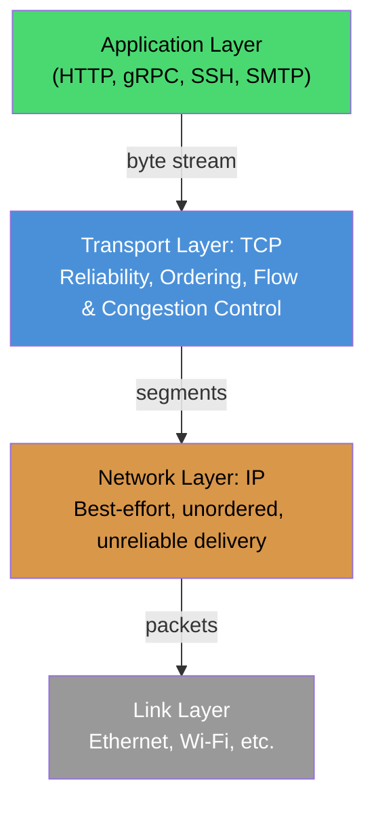

The diagram shows why TCP exists at all: IP only promises to try to deliver a packet once, with no ordering or retry guarantee. TCP is the layer that turns that weak promise into the strong guarantee applications actually need, without requiring every application to reinvent retransmission, sequencing, and flow control itself.

#### Introduction: Real-Life Use Case

Consider transferring a 50 MB file over Wi-Fi from a laptop to a cloud storage bucket. The Wi-Fi link alone drops roughly 1-2% of packets due to interference, and the path crosses several routers that can reorder or momentarily queue packets under load. Without TCP, the uploaded file would arrive with missing chunks, corrupted bytes, and scrambled ordering - unusable. TCP transparently detects every lost segment, retransmits it, reorders anything that arrived out of sequence, and only hands the application a byte stream once it is complete and in order. The uploader's code never has to think about any of this; it just calls `write()` and later `read()` on a socket.

#### Introduction: Interview Questions and Answers

**Q1. What layer does TCP operate at, and what does it rely on from the layer below it?**
A: TCP operates at Layer 4 (Transport) of the OSI model. It relies on IP (Layer 3) purely for best-effort packet delivery between hosts; IP does not guarantee ordering, delivery, or freedom from duplication. TCP is entirely responsible for turning that weak guarantee into a reliable, ordered byte stream.

**Q2. Why is TCP described as connection-oriented while IP is connectionless?**
A: IP treats every packet independently with no memory of prior packets (connectionless). TCP maintains state (sequence numbers, window sizes, timers, socket buffers) for the lifetime of a connection between two specific endpoints, which is why it is described as connection-oriented; this state is exactly what makes reliability, ordering, and flow control possible.

**Q3. What four core mechanisms does TCP use to build reliability on top of an unreliable network?**
A: Sequence numbers (to detect gaps and duplicates and to reorder data), acknowledgments (to confirm receipt), retransmission timers (to resend unacknowledged data), and checksums (to detect corruption). Together these let TCP detect every possible failure mode of the underlying network (loss, duplication, reordering, corruption) and correct for it.

### The Three-Way Handshake: Establishing Truth

```
Client                                Server
  |                                      |
  |-------SYN (seq=100)----------------->|
  |  "I want to talk, my sequence is 100"
  |                                      |
  |<------SYN-ACK (seq=300, ack=101)-----|
  |  "OK, my sequence is 300, I got your 100"
  |                                      |
  |-------ACK (ack=301)----------------->|
  |  "Got it, let's begin"
  |                                      |
  |  <Connection established>            |
```

**Why Three Steps?**
- **Two steps aren't enough**: Server needs to know client received its SYN-ACK
- **Prevents ghost connections**: Old duplicate packets can't create false connections
- **Synchronizes sequence numbers**: Both sides agree on starting point
- **Allocates resources**: Both sides commit to the connection

**The Philosophy:**
The handshake embodies **mutual agreement**. Both parties must explicitly agree to communicate before resources are committed. This prevents:
- SYN flood attacks (partially mitigated)
- Resource exhaustion
- Ambiguous connection state

#### Three-Way Handshake: Characteristics

- **Bidirectional sequence number exchange**: Each side proposes its own Initial Sequence Number (ISN) independently (client picks one for its send direction, server picks one for its send direction), so the connection is really two independent sequence spaces synchronized in one exchange.
- **Randomized ISNs**: Modern stacks pick the ISN pseudo-randomly (not a simple counter) specifically to prevent an attacker from guessing sequence numbers and injecting or hijacking a session.
- **Stateful from the first packet**: The moment a SYN is received, the server allocates a Transmission Control Block (TCB) and places the connection in a `SYN_RECEIVED` state, even though the handshake is not complete, this is what makes SYN flood attacks possible.
- **Symmetric completion, asymmetric initiation**: Either side can technically send the first SYN (simultaneous open is even possible, though rare), but in the overwhelming majority of real traffic the client initiates.
- **Options negotiated during the handshake**: MSS (Maximum Segment Size), window scaling, SACK permitted, and timestamps are all negotiated only in the SYN and SYN-ACK segments, they cannot be renegotiated later in the connection.

#### Three-Way Handshake: Components

- **SYN flag and ISN**: The bit that signals 'I want to open a connection' plus the random starting sequence number for that direction of the stream.
- **SYN-ACK flag combination**: A single segment that simultaneously acknowledges the client's SYN and proposes the server's own ISN, saving a full round trip compared to two separate segments.
- **TCB (Transmission Control Block)**: The kernel-level data structure tracking connection state, sequence numbers, window sizes, and timers for this specific socket pair.
- **SYN queue / accept queue**: Two kernel queues, one for half-open connections (`SYN_RECEIVED`) and one for fully-established connections waiting for the application to call `accept()`. Both have finite size and are central to how SYN flood attacks and defenses work.
- **TCP options field**: Carries MSS, window scale factor, SACK-permitted flag, and timestamp values negotiated only during setup.

#### Three-Way Handshake: Patterns

- **Passive open / active open**: The server performs a passive open (`listen()` then `accept()`), while the client performs an active open (`connect()`), a pattern mirrored in virtually every client-server protocol built on TCP.
- **SYN cookies**: Instead of allocating a TCB for every incoming SYN, the server encodes the connection state into the SYN-ACK's sequence number itself and only allocates real state when the final ACK returns with that value reflected back, allowing it to survive SYN floods without keeping per-connection state.
- **TCP Fast Open (TFO)**: A pattern that piggybacks the first request's data on the SYN segment itself (using a previously issued cryptographic cookie), saving a full RTT for repeat connections to the same server.
- **Connection pooling / keep-alive**: Because the handshake costs a full RTT, high-throughput systems (browsers, HTTP clients, database drivers) reuse already-established TCP connections across multiple requests instead of paying the handshake cost every time.

#### Three-Way Handshake: Pros / Benefits

- **Mutual confirmation before data flows**: Both sides know, with certainty, that the other side is reachable and willing to communicate before either commits application-level resources.
- **Sequence number synchronization**: Both directions of the stream start from an agreed, known point, which is a prerequisite for every later reliability and ordering mechanism.
- **Defense against stale/duplicate segments**: A very old, delayed duplicate SYN from a previous, already-closed connection cannot accidentally establish a new connection, because its sequence numbers will not match what the current handshake negotiates.
- **Negotiation point for capabilities**: Window scaling, SACK, and MSS are cleanly negotiated once, up front, rather than needing to be renegotiated mid-stream.

#### Three-Way Handshake: Cons / Challenges

- **One full RTT of pure latency before any data moves**: For short-lived, latency-sensitive requests (a single small API call), the handshake can dominate total request time, this is exactly the problem TCP Fast Open and HTTP connection reuse try to solve.
- **SYN flood vulnerability**: An attacker can send a flood of SYNs with spoofed source addresses, exhausting the server's half-open connection queue and denying service to legitimate clients, mitigated but not eliminated by SYN cookies.
- **No application-layer authentication**: The handshake proves the two TCP stacks can exchange packets, it says nothing about whether the client or server is who it claims to be; that trust has to be built at a higher layer (TLS, application auth).
- **Simultaneous open edge cases**: Rare but real scenarios where both sides send SYNs at the same time require extra state-machine handling that is easy to get wrong in custom TCP-like implementations.

#### Three-Way Handshake: Best Practices

- Keep the SYN backlog (`somaxconn` / listen backlog) sized appropriately for expected connection burst rates, and enable SYN cookies on internet-facing servers to survive SYN floods.
- Reuse connections (HTTP keep-alive, connection pools, gRPC channels) instead of opening a new TCP connection per request, to amortize the one-RTT handshake cost across many requests.
- Enable TCP Fast Open where the client/server stack and use case support it (idempotent requests only, since a replayed SYN+data could duplicate a non-idempotent operation).
- Monitor `SYN_RECEIVED` and half-open connection counts in production; a sudden spike is one of the earliest signals of a SYN flood in progress.

#### Three-Way Handshake: When to Use

- Any time two hosts need a bidirectional, reliable, ordered channel and are willing to pay a one-time RTT cost to establish it, this is the default connection setup for essentially all TCP-based communication (HTTP/1.1, HTTP/2, database connections, SSH, SMTP).
- Prefer connection reuse over repeated handshakes when many requests will flow between the same two endpoints in a short time window.
- Consider TCP Fast Open specifically for latency-critical, idempotent, repeat-connection workloads (e.g., a mobile app repeatedly reconnecting to the same API host).

#### Three-Way Handshake: Diagram

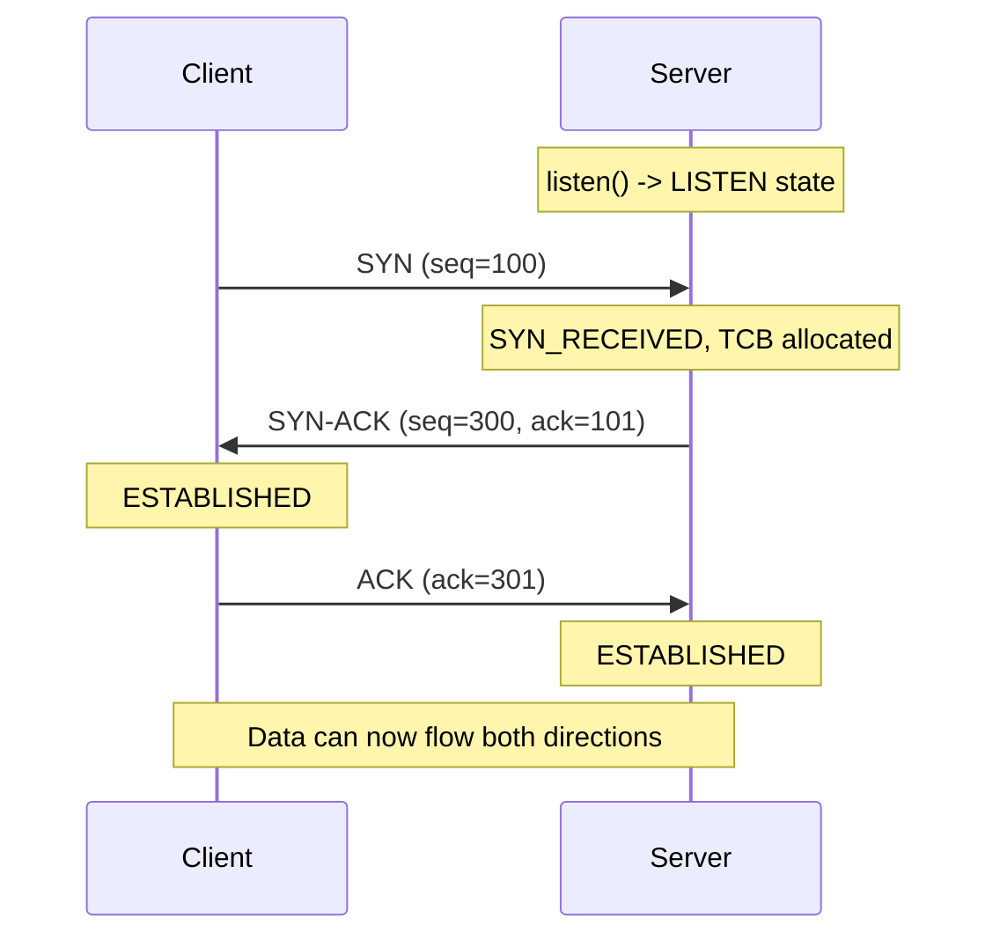

#### Three-Way Handshake: Real-Life Use Case

A mobile banking app opens a fresh TCP connection to the bank's API gateway every time the user opens the app on a cellular network with 150ms RTT to the nearest data center. That single handshake costs 150ms before a single byte of the login request can be sent, on top of the TLS handshake layered on top of it. To reduce this, the bank's mobile SDK maintains a persistent, pooled connection to the gateway (keep-alive) so that after the very first request, subsequent requests (balance check, transaction history) reuse the already-established TCP connection and skip the handshake entirely, cutting perceived latency dramatically.

#### Three-Way Handshake: Java Code Example

The snippet below shows the handshake from the application's point of view: the server side blocks in `accept()` until a handshake completes, and the client side's `connect()` call is exactly where the SYN / SYN-ACK / ACK exchange happens under the hood.

```java
import java.io.*;
import java.net.*;

public class HandshakeDemo {

    // Server: passive open. accept() only returns after the full 3-way handshake completes.
    static void runServer(int port) throws IOException {
        try (ServerSocket serverSocket = new ServerSocket(port)) {
            System.out.println("Server listening, SYN queue backlog=50");
            while (true) {
                Socket client = serverSocket.accept(); // blocks until SYN, SYN-ACK, ACK all complete
                System.out.println("Handshake complete with " + client.getRemoteSocketAddress());
                client.close();
            }
        }
    }

    // Client: active open. connect() sends the SYN and blocks until SYN-ACK and ACK complete.
    static void runClient(String host, int port) throws IOException {
        try (Socket socket = new Socket()) {
            long start = System.nanoTime();
            socket.connect(new InetSocketAddress(host, port), 5000); // performs the 3-way handshake
            long rttMillis = (System.nanoTime() - start) / 1_000_000;
            System.out.println("Handshake took ~" + rttMillis + " ms (approx. 1 RTT)");
        }
    }

    public static void main(String[] args) throws Exception {
        int port = 5010;
        Thread serverThread = new Thread(() -> {
            try { runServer(port); } catch (IOException e) { e.printStackTrace(); }
        });
        serverThread.setDaemon(true);
        serverThread.start();
        Thread.sleep(200); // let the server start listening
        runClient("localhost", port);
    }
}
```

#### Three-Way Handshake: Interview Questions and Answers

**Q1. Why does TCP use three steps instead of two for connection establishment?**
A: A two-step handshake (SYN, then ACK) would let the client know the server is reachable, but the server would have no confirmation that the client actually received the server's sequence number. The third step (final ACK) closes that gap, confirming both directions are synchronized before data is exchanged.

**Q2. What is a SYN flood attack, and how does the handshake design make it possible?**
A: An attacker sends a large volume of SYN segments, often with spoofed source IPs, and never completes the handshake. Each SYN causes the server to allocate state (a TCB, an entry in the SYN queue) while waiting for the final ACK, which never comes. With enough spoofed SYNs, the server's half-open connection queue fills up and it can no longer accept legitimate connections.

**Q3. How do SYN cookies defend against SYN floods without changing the wire protocol?**
A: Instead of storing per-connection state upon receiving a SYN, the server encodes the necessary state (a hash of source/destination address and port, plus a timestamp and negotiated MSS) into the sequence number it sends back in the SYN-ACK. It only allocates a real TCB when the client's final ACK arrives with that encoded value reflected back correctly, meaning no state is held for connections that never complete.

**Q4. What information is negotiated during the handshake that cannot be changed later?**
A: Maximum Segment Size (MSS), window scaling factor, and whether Selective Acknowledgments (SACK) are permitted are all negotiated exclusively in the SYN and SYN-ACK segments. If a path's actual MTU changes mid-connection, the segment size cannot be renegotiated without tearing down and re-establishing the connection (or relying on Path MTU Discovery adjustments).

**Q5. Can a TCP connection be established without a client explicitly calling connect()?**
A: Yes, in the rare 'simultaneous open' case, both sides send a SYN to each other at roughly the same time without either having called `accept()` first. Both stacks recognize the incoming SYN as being for a connection they are also trying to open and complete the handshake with a four-segment exchange instead of three. This is uncommon in practice but is part of the formal TCP state machine.

### Guaranteed Delivery: The Acknowledgment Dance

**How It Works:**
```
Sender                               Receiver
  |                                     |
  |----Packet 1 (seq=100, data="Hello")-|
  |                                     |
  |<---ACK 105 ("Got bytes 100-104")---|
  |                                     |
  |----Packet 2 (seq=105, data="World")-|
  |                                     |
  |  (packet lost!)                     |
  |                                     |
  |  <timeout expires>                  |
  |                                     |
  |----Packet 2 (seq=105, RETRANSMIT)---|
  |                                     |
  |<---ACK 110 ("Got bytes 105-109")---|
```

**The Mechanisms:**

1. **Sequence Numbers**: Every byte has a number
   - Allows detection of gaps (missing data)
   - Enables reordering (out-of-order arrival)
   - Prevents duplicates (ignore old sequences)

2. **Acknowledgments (ACKs)**: Receiver confirms receipt
   - **Cumulative**: ACK 1000 means "got everything up to 999"
   - **Selective** (SACK): Can acknowledge non-contiguous ranges

3. **Retransmission**: If no ACK, resend
   - **Timeout-based**: Wait for ACK, resend if timeout
   - **Adaptive timeout**: Learn network RTT, adjust timeout
   - **Fast retransmit**: Three duplicate ACKs trigger immediate resend

#### Guaranteed Delivery: Characteristics

- **Positive acknowledgment with retransmission (PAR)**: The core reliability strategy in one phrase, the sender assumes loss unless it hears otherwise, and the receiver's only job is to confirm what it actually got.
- **Cumulative acknowledgment semantics**: An ACK for byte 1000 means 'I have every byte up to 999 contiguously', it says nothing about bytes beyond a gap even if some of them arrived, which is why SACK exists as an extension.
- **Byte-stream, not message-oriented**: TCP acknowledges and retransmits bytes, not application-level messages, a single 'message' from the application can be split across many segments or several messages can be coalesced into one segment.
- **Retransmission Timeout (RTO) is adaptive, not fixed**: RTO is computed continuously from measured RTT samples (via Jacobson/Karels algorithm using smoothed RTT and RTT variance), so it naturally lengthens on high-latency or jittery paths and shortens on stable, fast ones.
- **Fast retransmit bypasses the timer entirely**: Three duplicate ACKs for the same byte are treated as strong evidence of loss (not just delay), so the sender retransmits immediately rather than waiting for the (much slower) timeout.

#### Guaranteed Delivery: Components

- **Send buffer**: Holds every byte that has been sent but not yet acknowledged, because it might need to be retransmitted at any time.
- **Receive buffer / reassembly queue**: Holds out-of-order segments that arrived early, waiting for the missing gap to be filled before handing contiguous data to the application.
- **Retransmission Timer (RTO)**: A per-connection timer, recalculated on every RTT sample, that triggers a retransmission if no ACK arrives in time.
- **Duplicate ACK counter**: Tracks repeated ACKs for the same sequence number to trigger fast retransmit after the third duplicate.
- **SACK (Selective Acknowledgment) blocks**: Optional TCP option carrying up to four non-contiguous received byte ranges, letting the sender retransmit precisely the missing gaps instead of everything from the gap onward.

#### Guaranteed Delivery: Patterns

- **Go-Back-N-like cumulative ACK (classic TCP)**: Without SACK, a single loss can force retransmission of everything sent after it, since the receiver can only acknowledge the last contiguous byte.
- **Selective retransmission (with SACK)**: The sender retransmits only the specific missing ranges the receiver reports, dramatically reducing wasted bandwidth on lossy, high-bandwidth links.
- **Fast retransmit / fast recovery**: A pattern that treats duplicate ACKs as an early-warning signal, avoiding the much larger delay of waiting for a full timeout.
- **Karn's algorithm**: A rule that ignores RTT samples from retransmitted segments when computing RTO (because you cannot tell if the ACK is for the original or the retransmit), preventing RTO from being poisoned by ambiguous measurements.

#### Guaranteed Delivery: Pros / Benefits

- **Byte-perfect delivery guarantee**: The application is guaranteed to receive every byte exactly once, in order, or to be told the connection failed, it never has to detect loss or corruption itself.
- **Self-healing under transient loss**: A single dropped packet on an otherwise healthy path is invisible to the application, TCP repairs it automatically within roughly one RTT (fast retransmit) or one RTO (timeout).
- **Adaptive to network conditions**: Because RTO is computed from live RTT measurements, the same TCP implementation behaves correctly on a 1ms LAN and a 300ms satellite link without configuration changes.
- **Efficient repair with SACK**: Selective acknowledgment means only genuinely missing data is resent, not everything after the first gap, which matters enormously on high-bandwidth, high-loss paths.

#### Guaranteed Delivery: Cons / Challenges

- **Head-of-line blocking**: Even with SACK, the application cannot read bytes past a gap until the gap is filled, one lost segment can stall delivery of already-received, later data.
- **Retransmission adds latency**: A lost segment costs at least one extra RTT (fast retransmit) or a full RTO (timeout, which can be hundreds of milliseconds to seconds), directly hurting tail latency for affected connections.
- **Timeout misestimation risk**: Without care (see Karn's algorithm), RTT sampling can be corrupted by ambiguous retransmissions, leading to an RTO that is too short (spurious retransmissions, wasted bandwidth) or too long (slow recovery from real loss).
- **Buffer memory cost**: Both the unacknowledged send buffer and the out-of-order receive buffer consume kernel memory per connection, which matters at scale (tens of thousands of concurrent connections on a busy server).

#### Guaranteed Delivery: Best Practices

- Enable SACK (on by default in virtually all modern OS TCP stacks) especially for high-bandwidth-delay-product paths, where a single lost segment without SACK can cause large, unnecessary retransmission bursts.
- Do not disable or hack around Karn's algorithm or RTT smoothing at the application layer, let the OS TCP stack manage RTO, application-layer 'reliability' hacks on top of TCP usually duplicate work TCP already does correctly.
- Size socket send/receive buffers (`SO_SNDBUF` / `SO_RCVBUF`) to match the bandwidth-delay product of the path for high-throughput workloads, undersized buffers throttle throughput regardless of how good the retransmission logic is.
- For latency-sensitive applications, monitor retransmission rates (via `netstat`, `ss -i`, or APM tools) as a proxy for path quality, rising retransmits often precede visible latency or throughput problems.

#### Guaranteed Delivery: When to Use

- Any time correctness of every byte matters more than raw speed, this is the default and correct choice for file transfer, APIs, database connections, and anything where a missing or corrupted byte is unacceptable.
- Favor SACK-aware, modern TCP stacks (default on Linux, Windows, macOS) over legacy configurations for any path with non-trivial loss or bandwidth-delay product.
- If an application cannot tolerate even the small latency cost of retransmission-based reliability (live audio/video, gaming), consider a protocol built on UDP with application-level, latency-aware loss handling instead.

#### Guaranteed Delivery: Diagram

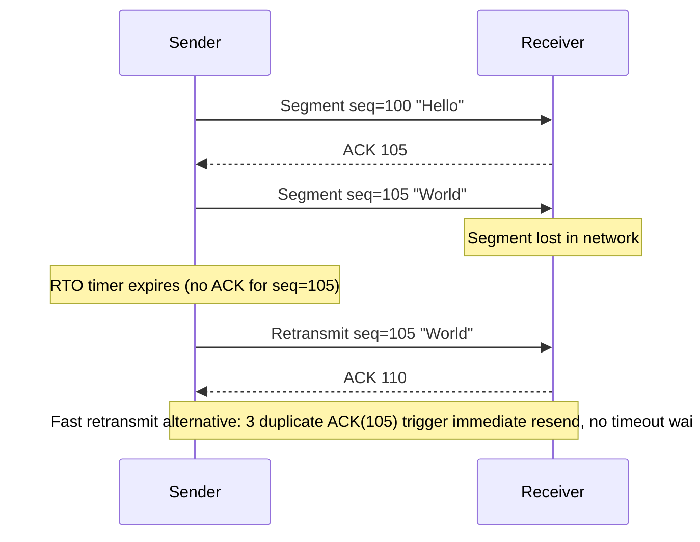

#### Guaranteed Delivery: Real-Life Use Case

A payment service posts a transaction confirmation over a TCP connection to a downstream ledger service inside the same data center. During a brief top-of-rack switch hiccup, one segment carrying part of the JSON payload is dropped. Because three duplicate ACKs arrive at the sender almost immediately (the receiver keeps ACKing the last good byte as later segments arrive), fast retransmit kicks in within a few milliseconds, well before the multi-hundred-millisecond RTO timer would have fired. The ledger service receives the complete, correctly ordered payload with no application-level retry logic and no double-processing, exactly the guarantee the transaction depends on.

#### Guaranteed Delivery: Java Code Example

The snippet below does not reimplement TCP (the OS kernel does that), it demonstrates the guarantee from the application's perspective: `OutputStream.write()` either succeeds (data is durably queued for delivery, retransmission handled transparently) or throws, and `InputStream.read()` never delivers out-of-order or corrupted bytes.

```java
import java.io.*;
import java.net.*;

public class ReliableStreamDemo {

    static void runServer(int port) throws IOException {
        try (ServerSocket serverSocket = new ServerSocket(port);
             Socket client = serverSocket.accept();
             InputStream in = client.getInputStream()) {
            byte[] buffer = new byte[1024];
            int total = 0;
            int n;
            // read() only ever returns bytes in order, exactly as sent, gaps are repaired before we see them
            while ((n = in.read(buffer)) != -1) {
                total += n;
            }
            System.out.println("Server received " + total + " bytes, byte-perfect and in order");
        }
    }

    static void runClient(String host, int port) throws IOException {
        try (Socket socket = new Socket(host, port);
             OutputStream out = socket.getOutputStream()) {
            byte[] payload = new byte[64 * 1024]; // 64KB payload
            for (int i = 0; i < payload.length; i++) payload[i] = (byte) (i % 256);
            out.write(payload); // TCP handles seq numbers, ACKs, and retransmission internally
            out.flush();
        }
    }

    public static void main(String[] args) throws Exception {
        int port = 5011;
        Thread serverThread = new Thread(() -> {
            try { runServer(port); } catch (IOException e) { e.printStackTrace(); }
        });
        serverThread.setDaemon(true);
        serverThread.start();
        Thread.sleep(200);
        runClient("localhost", port);
    }
}
```

#### Guaranteed Delivery: Interview Questions and Answers

**Q1. What is the difference between a timeout-based retransmission and a fast retransmit?**
A: A timeout-based retransmission waits for the Retransmission Timeout (RTO), computed from smoothed RTT and RTT variance, before resending unacknowledged data; this can take hundreds of milliseconds or more. A fast retransmit is triggered as soon as the sender sees three duplicate ACKs for the same sequence number, which is strong evidence of loss (not just delay), and resends immediately without waiting for the timer, typically recovering in about one RTT.

**Q2. Why can't cumulative acknowledgment alone tell the sender exactly which bytes are missing when there are multiple gaps?**
A: A cumulative ACK only reports the last contiguous byte received, if segments 3 and 5 are lost but 4 and 6 arrived, the ACK still only advances to just before segment 3, giving no information about whether 4 or 6 were received. SACK (Selective Acknowledgment) solves this by explicitly listing the non-contiguous ranges that were received, letting the sender retransmit only the true gaps.

**Q3. What problem does Karn's algorithm solve?**
A: When a segment is retransmitted, an ACK could be responding to either the original transmission or the retransmission, there's no way to tell which. If the sender assumed it was the original, it might compute a wildly inaccurate RTT sample and corrupt RTO estimation. Karn's algorithm says: do not use RTT samples from retransmitted segments for RTO calculation at all, and instead exponentially back off the RTO on repeated retransmissions until a clean (non-retransmitted) sample is available again.

**Q4. Why does TCP guarantee delivery of bytes, not messages?**
A: TCP presents a byte-stream abstraction: the sender's writes and the receiver's reads are not guaranteed to correspond one-to-one. The kernel may coalesce several small writes into one segment (Nagle's algorithm) or split one large write across several segments (MSS limits). Reliability guarantees apply to the byte stream as a whole, applications needing message boundaries must add their own framing (length prefixes, delimiters) on top.

**Q5. What happens to unacknowledged data if a process crashes right after calling write()?**
A: The data was already handed to the kernel's send buffer, so the OS continues trying to deliver and retransmit it independently of the crashed process, up to the connection's timeout limits. However, if the whole machine crashes (not just the process), that buffered data is lost since it was never durably persisted, this is exactly why application-level acknowledgment (e.g., an HTTP 200 response, a database commit ACK) is still necessary on top of TCP's transport-level guarantee.

### Flow Control: Respecting the Receiver

**The Problem:**
Sender can produce data faster than receiver can consume it.

**The Solution: Sliding Window**
```
Receiver: "I have 10KB buffer available" (window size = 10KB)
Sender: "Got it, I'll send max 10KB unacknowledged data"
  ↓
Sender: Sends 8KB
Receiver: Processes 3KB, ACKs and says "window = 5KB now"
Sender: "OK, I can send 5KB more"
```

**Window Size = 0:**
- Receiver buffer is full
- Sender must stop sending
- Waits for window update
- **Prevents**: Buffer overflow, data loss

**The Elegance:**
Flow control is **receiver-driven**. The receiver controls the pace, ensuring it's never overwhelmed.

#### Flow Control: Characteristics

- **Receiver-advertised, not sender-guessed**: The window size is explicitly stated by the receiver in every ACK's Window field, the sender never has to estimate the receiver's buffer capacity.
- **Purely about the receiver, not the network**: Flow control protects a slow or busy *receiver* from being overwhelmed, this is distinct from congestion control, which protects the *network* from being overwhelmed, they operate independently and the sender obeys whichever window (receive window or congestion window) is smaller.
- **Dynamic and continuous**: The advertised window changes on every ACK as the receiver's application drains its buffer, so the effective send rate constantly adapts to how fast the receiving application is actually reading data.
- **Window scaling for modern high-speed links**: The original 16-bit window field caps advertisable window at 65,535 bytes, the Window Scale option (negotiated at handshake time) multiplies this to support windows up to about 1 GB, essential for high-bandwidth-delay-product paths.
- **Zero window is a valid, expected state**: A window size of 0 is not an error condition, it is the receiver correctly signaling 'my buffer is full, stop sending until I say otherwise.'

#### Flow Control: Components

- **Receive window (rwnd)**: The value advertised by the receiver in the TCP header, representing free space in its receive buffer at that moment.
- **Receive buffer**: The actual kernel memory (sized by `SO_RCVBUF`) that holds bytes that have arrived but have not yet been read by the application.
- **Window scale option**: A handshake-negotiated multiplier applied to the 16-bit window field to support windows larger than 64KB.
- **Zero Window Probe**: A small keep-alive-like segment the sender periodically sends when it sees a zero window, to check whether the receiver's window has opened back up (since the ACK that would announce a reopened window could itself be lost).
- **Silly Window Syndrome avoidance logic**: Algorithms (Clark's solution on the receiver side, Nagle's algorithm on the sender side) that prevent the connection from degenerating into exchanging tiny, inefficient segments when the window opens up only a little at a time.

#### Flow Control: Patterns

- **Sliding window protocol**: The general pattern (used far beyond TCP, e.g., in many application-level protocols) of allowing a bounded amount of unacknowledged data in flight, sliding the allowed range forward as ACKs arrive.
- **Zero-window probing**: Sender periodically 'pings' a zero-window receiver with a 1-byte probe rather than assuming the window will reopen and blindly waiting, since a window-update ACK could be lost.
- **Backpressure propagation**: A slow consumer (e.g., a slow-reading application thread) naturally throttles the sender all the way back to its source through flow control, a foundational idea reused in reactive-streams and message-queue backpressure designs.

#### Flow Control: Pros / Benefits

- **Prevents receiver buffer overflow and dropped data**: Without flow control, a fast sender would overrun a slow receiver's buffer, forcing the receiver to silently drop data that then has to be detected and retransmitted, wasting bandwidth and adding latency.
- **Fully automatic, no application involvement required**: Application code never manages window sizes directly, the kernel handles it transparently based on how quickly the application reads from the socket.
- **Scales from slow to fast receivers**: The same mechanism correctly throttles a sender talking to a resource-constrained IoT device and a sender talking to a powerful server with a huge receive buffer, just with very different window sizes.
- **Natural backpressure for the whole pipeline**: If an application is slow to read (e.g., stuck processing), that slowness propagates backward through the receive window all the way to the sender, preventing unbounded memory growth anywhere in the pipeline.

#### Flow Control: Cons / Challenges

- **Zero-window stalls hurt throughput and latency**: If the receiving application is slow to drain its buffer (e.g., due to a slow disk write or GC pause), the whole connection can stall at a zero window until it recovers.
- **Silly Window Syndrome**: Without mitigation, a receiver that opens its window by just a few bytes at a time can cause the sender to transmit many tiny, inefficient segments, wasting header overhead.
- **Interacts non-trivially with Nagle's algorithm**: Nagle's algorithm (batching small writes) combined with delayed ACKs (receiver waiting before ACKing) can occasionally combine to add up to a few hundred milliseconds of latency in specific request/response patterns, a classic and often-debugged interaction.
- **Legacy 16-bit window limits require explicit negotiation**: Without window scaling successfully negotiated at handshake time (some middleboxes strip TCP options), a connection is capped at a 64KB window, badly limiting throughput on high-bandwidth-delay-product paths.

#### Flow Control: Best Practices

- Size the receive buffer (`SO_RCVBUF`) appropriately for the expected bandwidth-delay product of the path, undersized buffers cap the advertisable window and thus throughput no matter how fast the network is.
- Ensure window scaling is enabled and not stripped by intermediate firewalls/middleboxes, verify with a packet capture if throughput seems capped near 64KB × (RTT-independent) on a high-latency link.
- For latency-sensitive request/response protocols, be aware of the Nagle's-algorithm-plus-delayed-ACK interaction, disabling Nagle's algorithm (`TCP_NODELAY`) is common for RPC-style traffic where small, frequent messages matter more than header efficiency.
- Keep the receiving application's read loop fast and non-blocking where possible, since application-level slowness is what actually shrinks the advertised window and triggers stalls.

#### Flow Control: When to Use

- Flow control is always active for every TCP connection, it is not optional or something you 'turn on', but you tune its effectiveness through buffer sizing and window scaling.
- Pay particular attention to it when one side of a connection is resource-constrained (embedded devices, mobile clients) or when the receiving application does slow, blocking work (synchronous disk writes, heavy processing per received message).
- Revisit buffer sizing whenever moving a connection to a materially different network path (e.g., from same-datacenter to cross-region), since the optimal window size depends directly on the bandwidth-delay product of that specific path.

#### Flow Control: Diagram

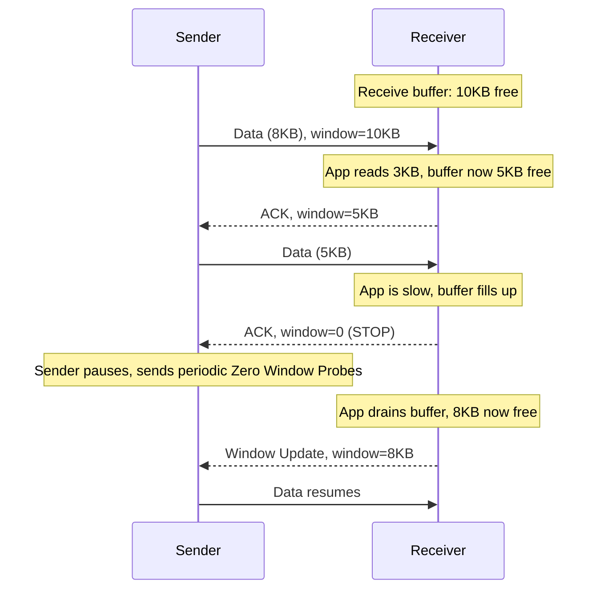

#### Flow Control: Real-Life Use Case

A log-shipping agent streams application logs over TCP to a centralized log aggregator. The aggregator occasionally falls behind during a disk I/O spike (its indexing step is momentarily slow). Its TCP receive buffer fills up and it advertises a shrinking, then zero, window. The log-shipping agent automatically pauses sending (governed entirely by the kernel's TCP stack, no application code involved) instead of overwhelming the aggregator or silently dropping logs. Once the aggregator's indexer catches up and drains its buffer, the window reopens and log shipping resumes exactly where it left off, no logs lost, no manual backpressure logic needed in either application.

#### Flow Control: Java Code Example

The example below deliberately makes the receiver slow (simulating a busy consumer) and sets a small receive buffer, then shows the sender's `write()` calls blocking once the receive window fills, this blocking *is* flow control made visible at the application layer.

```java
import java.io.*;
import java.net.*;

public class FlowControlDemo {

    static void runServer(int port) throws Exception {
        try (ServerSocket serverSocket = new ServerSocket()) {
            serverSocket.setReceiveBufferSize(4 * 1024); // small receive buffer -> small window
            serverSocket.bind(new InetSocketAddress(port));
            try (Socket client = serverSocket.accept();
                 InputStream in = client.getInputStream()) {
                byte[] buffer = new byte[1024];
                long total = 0;
                int n;
                while ((n = in.read(buffer)) != -1) {
                    total += n;
                    Thread.sleep(50); // simulate a slow consumer draining the buffer slowly
                }
                System.out.println("Server read " + total + " bytes total");
            }
        }
    }

    static void runClient(String host, int port) throws IOException {
        try (Socket socket = new Socket(host, port);
             OutputStream out = socket.getOutputStream()) {
            byte[] chunk = new byte[16 * 1024]; // 16KB chunk, larger than the receiver's window
            long start = System.currentTimeMillis();
            for (int i = 0; i < 10; i++) {
                out.write(chunk); // will block once the receive window fills, that IS flow control
            }
            out.flush();
            System.out.println("Client finished sending in " + (System.currentTimeMillis() - start) + " ms");
        }
    }

    public static void main(String[] args) throws Exception {
        int port = 5012;
        Thread serverThread = new Thread(() -> {
            try { runServer(port); } catch (Exception e) { e.printStackTrace(); }
        });
        serverThread.setDaemon(true);
        serverThread.start();
        Thread.sleep(200);
        runClient("localhost", port);
    }
}
```

#### Flow Control: Interview Questions and Answers

**Q1. What is the difference between flow control and congestion control?**
A: Flow control protects the *receiver*, it prevents a fast sender from overwhelming a slow receiver's buffer, and is governed by the receive window advertised by the receiver. Congestion control protects the *network*, it prevents a sender from overwhelming routers and links between the two endpoints, and is governed by the congestion window computed by the sender based on observed packet loss and delay. The sender always uses the smaller of the two windows.

**Q2. What does it mean when a receiver advertises a window size of zero, and what does the sender do?**
A: A zero window means the receiver's buffer is completely full and it cannot accept more data right now. The sender stops sending new data but does not simply wait passively, it periodically sends small Zero Window Probes to check whether the window has reopened, because the ACK that would normally announce a reopened window could itself be lost in transit.

**Q3. Why was TCP window scaling introduced, and what problem does it solve?**
A: The original TCP header's window field is 16 bits, capping the advertisable window at 65,535 bytes. On high-bandwidth, high-latency paths (satellite links, cross-continental fiber), 64KB is far smaller than the bandwidth-delay product, capping throughput well below the link's real capacity. The Window Scale option, negotiated during the handshake, applies a multiplying factor to the window field, allowing windows up to roughly 1GB.

**Q4. What is Silly Window Syndrome and how is it avoided?**
A: It's a degenerate pattern where a receiver, as its buffer slowly drains, keeps advertising tiny window increases (a few bytes at a time), causing the sender to transmit many small, header-heavy segments instead of a few efficient ones. It is avoided by the receiver withholding a window update until a meaningful amount of space (e.g., a full MSS or half the buffer) has freed up (Clark's solution), combined with the sender similarly avoiding sending tiny segments (Nagle's algorithm).

**Q5. How does flow control create backpressure through an entire processing pipeline?**
A: If the application reading from a socket is slow (e.g., waiting on a slow database write for each message), it stops calling `read()` as quickly, the receive buffer fills up, the advertised window shrinks toward zero, and the sender's kernel throttles or blocks writes. If the sender's application is itself reading from another upstream source, that same slowdown can propagate further upstream, this end-to-end throttling without explicit coordination is exactly the mechanism reactive-streams and queue-based backpressure systems intentionally emulate at the application layer.

### Congestion Control: Respecting the Network

**The Problem:**
Sending too fast causes network congestion:
- Routers drop packets
- Retransmissions increase load
- Network collapse (congestion collapse)

**The Solution: Adaptive Rate Control**

TCP dynamically adjusts sending rate based on network conditions.

**Algorithms:**

1. **Slow Start** (Exponential Growth):
   ```
   Start: Send 1 packet
   Got ACK: Send 2 packets
   Got ACKs: Send 4 packets
   ... (doubles each RTT until threshold)
   ```
   - **Fast growth** from slow start
   - **Goal**: Quickly find network capacity

2. **Congestion Avoidance** (Linear Growth):
   ```
   After threshold: Increase by 1 packet per RTT
   Got ACKs: Window += 1/window
   ```
   - **Careful growth** near capacity
   - **Goal**: Avoid triggering congestion

3. **Fast Recovery** (After Packet Loss):
   ```
   Packet loss detected
   → Reduce window by half (multiplicative decrease)
   → Continue sending (don't stop)
   → Slowly increase again (additive increase)
   ```
   - **AIMD**: Additive Increase, Multiplicative Decrease
   - **Fairness**: Converges to fair share among flows

**Modern Algorithms:**
- **TCP Reno**: Classic AIMD
- **TCP Cubic**: Optimized for high-bandwidth, high-latency networks
- **TCP BBR** (Bottleneck Bandwidth and RTT): Google's modern algorithm, models network

**The Philosophy:**
Congestion control is **network-respectful**. TCP backs off when it senses congestion, preventing collapse and ensuring fairness.

#### Congestion Control: Characteristics

- **Sender-side and inferred, not signaled**: Unlike flow control (explicitly told by the receiver), classic congestion control infers network state indirectly, from packet loss or, in newer algorithms, from measured delay and delivery rate, because routers historically gave no direct feedback.
- **Governed by the congestion window (cwnd)**: A sender-maintained value, separate from the receive window, representing how much unacknowledged data the sender believes the *network* (not the receiver) can currently handle; the sender always transmits at most `min(cwnd, rwnd)`.
- **Phase-based behavior**: A connection moves through distinct phases (slow start, then congestion avoidance, then fast recovery after loss) rather than using one constant rate-adjustment formula throughout its life.
- **AIMD favors fairness over maximum individual throughput**: Additive Increase / Multiplicative Decrease is deliberately asymmetric (grow slowly, shrink fast) so that many competing flows converge toward roughly equal shares of a bottleneck link over time.
- **Algorithm choice is a kernel/OS decision, not a wire protocol difference**: TCP Reno, Cubic, and BBR are all valid TCP implementations from the receiver's point of view, the algorithm only changes how the *sender* decides its rate, it is not negotiated in the handshake.

#### Congestion Control: Components

- **Congestion window (cwnd)**: The sender's own estimate of safe-to-send-without-acknowledgment data, grown or shrunk by the active algorithm.
- **Slow start threshold (ssthresh)**: The cwnd value at which the sender switches from the fast, exponential slow-start growth to the slower, linear congestion-avoidance growth; reset (typically halved) after a loss event.
- **Loss/delay/delivery-rate detector**: The signal source, classic algorithms (Reno, Cubic) key off packet loss (a dropped or duplicate-ACK'd segment implies congestion), while BBR instead continuously models bottleneck bandwidth and round-trip time from ACK timing.
- **RTT and bandwidth estimator**: Used both for computing RTO (see Guaranteed Delivery) and, in modern algorithms like BBR, for directly modeling the path's capacity rather than reacting only after a drop occurs.
- **Explicit Congestion Notification (ECN)**: An optional, router-cooperative mechanism where routers mark (rather than drop) packets approaching congestion, letting TCP react before an actual loss occurs.

#### Congestion Control: Patterns

- **Slow start (exponential growth)**: `cwnd` doubles roughly every RTT until `ssthresh` or a loss is hit, quickly discovering how much capacity is available without a lengthy linear ramp-up.
- **Congestion avoidance (linear growth, AIMD)**: Past `ssthresh`, `cwnd` grows by roughly one segment per RTT, cautious growth near the estimated capacity ceiling.
- **Multiplicative decrease on loss**: On detecting loss, `cwnd` (and `ssthresh`) is cut, classically halved, an aggressive, fast reaction that protects the network from sustained overload.
- **Fast recovery**: After a multiplicative decrease triggered by fast retransmit (not a full timeout), the sender continues sending at the new, lower rate instead of dropping all the way back to slow start, preserving throughput better than a full restart would.
- **Model-based pacing (BBR)**: Instead of reacting to loss, continuously estimate the bottleneck bandwidth and minimum RTT, and pace sending to match that model directly, avoiding filling up router buffers (bufferbloat) in the first place.

#### Congestion Control: Pros / Benefits

- **Prevents congestion collapse**: Without congestion control, competing flows on a shared link can spiral into a state where nearly all bandwidth is consumed by retransmissions of already-lost data, congestion control is the mechanism that keeps the internet from collapsing under its own retry traffic, a real problem observed and fixed in the late 1980s.
- **Approximate fairness among flows**: AIMD's math causes competing connections sharing a bottleneck to converge toward roughly equal bandwidth shares over time, without any central coordinator.
- **Self-tuning to unknown, changing network conditions**: The same algorithm adapts a connection's rate whether it is running on a stable 10Gbps datacenter link or a variable, sometimes-congested Wi-Fi network, no manual configuration needed per path.
- **Newer algorithms (BBR) substantially reduce bufferbloat-induced latency**: By modeling the path directly instead of waiting for a router buffer to overflow and drop a packet, BBR can achieve high throughput with much lower queuing delay than loss-based algorithms on some paths.

#### Congestion Control: Cons / Challenges

- **Loss-based algorithms treat all loss as congestion**: On genuinely lossy links (e.g., Wi-Fi with interference, satellite links), classic Reno/Cubic misinterpret non-congestion packet loss as a congestion signal and needlessly throttle throughput, hurting performance on inherently lossy but uncongested paths.
- **Slow start can be too aggressive for very lossy or thin links**: Doubling every RTT can quickly overshoot a constrained path's real capacity, causing a burst of loss right as the connection is trying to ramp up.
- **Fairness is approximate, not exact, especially across different algorithms**: Reno-family flows and BBR flows competing for the same bottleneck do not necessarily share bandwidth equally, BBR has faced real-world criticism for being 'too aggressive' against classic loss-based competitors on shared links.
- **Recovery after a real loss event still costs throughput**: Even with fast recovery, a multiplicative decrease is a real, immediate cut to sending rate, on long, high-bandwidth-delay-product connections, that lost throughput can take many RTTs to fully recover via linear growth.

#### Congestion Control: Best Practices

- Prefer modern, actively maintained congestion control implementations (Cubic is the Linux default, BBR is widely used by large-scale services) over hand-tuning legacy Reno-style parameters.
- On networks known to have non-congestion loss (satellite, some wireless links), evaluate algorithms or extensions designed to distinguish congestion loss from corruption/interference loss, rather than accepting Reno/Cubic's default 'any loss means back off' assumption.
- Enable ECN where the whole path (both endpoints and intermediate routers) supports it, to react to incipient congestion before an actual drop is needed.
- Monitor `cwnd` behavior and retransmission rates in production for long-lived, high-throughput connections (e.g., via `ss -i` on Linux) to catch congestion-related throughput ceilings early.

#### Congestion Control: When to Use

- Congestion control is mandatory and always active for TCP, it is not something an application opts into, but the underlying algorithm (Cubic, BBR, etc.) is often selectable at the OS level and worth tuning for high-throughput, long-lived connections.
- Favor BBR-style, model-based congestion control specifically for high-bandwidth, high-latency paths (video streaming backbones, cross-region replication) where minimizing queuing delay while maximizing throughput both matter.
- Stick with well-tested defaults (Cubic) for typical, general-purpose traffic where no specific throughput or latency problem has been observed, changing congestion control algorithms without a measured problem is rarely worth the operational complexity.

#### Congestion Control: Diagram

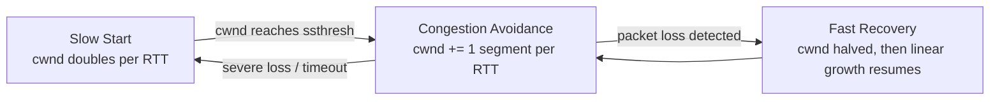

#### Congestion Control: Real-Life Use Case

A video analytics company replicates large batches of processed footage nightly from its US data center to an EU data center over a long-haul, high-bandwidth-delay-product link (150ms RTT, 10Gbps capacity). Using the classic Cubic algorithm, the transfer took a long time to ramp up to full throughput after any brief loss event, because linear congestion-avoidance growth on such a large bandwidth-delay-product path recovers very slowly. After switching the sending servers to BBR, which models the path's actual bandwidth and minimum RTT directly instead of only reacting to loss, the same nightly transfer recovered to full throughput within a few RTTs after a loss blip instead of tens of seconds, materially shortening the nightly replication window.

#### Congestion Control: Java Code Example

Congestion control lives in the OS kernel's TCP stack, not in application code, so this example demonstrates the effect indirectly: it selects a congestion control algorithm via the socket's underlying channel options (where supported by the platform) and measures achieved throughput, showing that the same application code experiences different ramp-up behavior purely based on the kernel's algorithm choice.

```java
import java.io.*;
import java.net.*;
import java.nio.channels.*;

public class CongestionControlDemo {

    static void runServer(int port) throws Exception {
        try (ServerSocketChannel serverChannel = ServerSocketChannel.open()) {
            serverChannel.bind(new InetSocketAddress(port));
            try (SocketChannel client = serverChannel.accept();
                 InputStream in = Channels.newInputStream(client)) {
                byte[] buffer = new byte[8192];
                long total = 0;
                int n;
                while ((n = in.read(buffer)) != -1) total += n;
                System.out.println("Server received " + total + " bytes");
            }
        }
    }

    static void runClient(String host, int port) throws Exception {
        try (SocketChannel channel = SocketChannel.open(new InetSocketAddress(host, port))) {
            // Congestion control algorithm (Cubic, BBR, etc.) is a kernel/OS-level setting,
            // not something Java's standard socket API can select directly; this call is a
            // placeholder to illustrate where such tuning would occur on platforms that expose it.
            OutputStream out = Channels.newOutputStream(channel);
            byte[] payload = new byte[1024 * 1024]; // 1MB payload
            long start = System.currentTimeMillis();
            out.write(payload); // cwnd growth (slow start -> congestion avoidance) governs pacing
            out.flush();
            long elapsedMs = System.currentTimeMillis() - start;
            System.out.println("Sent 1MB in " + elapsedMs + " ms (rate depends on cwnd growth)");
        }
    }

    public static void main(String[] args) throws Exception {
        int port = 5013;
        Thread serverThread = new Thread(() -> {
            try { runServer(port); } catch (Exception e) { e.printStackTrace(); }
        });
        serverThread.setDaemon(true);
        serverThread.start();
        Thread.sleep(200);
        runClient("localhost", port);
    }
}
```

#### Congestion Control: Interview Questions and Answers

**Q1. What is the difference between the congestion window (cwnd) and the receive window (rwnd)?**
A: `rwnd` is advertised by the receiver and reflects the receiver's available buffer space (flow control, protects the receiver). `cwnd` is computed entirely by the sender based on inferred network conditions (congestion control, protects the network). The sender is only allowed to have `min(cwnd, rwnd)` bytes of unacknowledged data in flight at any time.

**Q2. Why does slow start grow the congestion window exponentially instead of starting at full speed?**
A: At the start of a connection, the sender has no information about the path's actual capacity. Starting at full speed could immediately overwhelm the path and cause a burst of loss. Exponential growth (doubling roughly every RTT) is a fast way to discover approximately how much capacity is available, while still starting conservatively enough to avoid an immediate large-scale loss event.

**Q3. What is AIMD and why is the increase additive but the decrease multiplicative?**
A: AIMD stands for Additive Increase, Multiplicative Decrease, the pattern where cwnd grows slowly and linearly (add roughly one segment per RTT) during congestion avoidance, but is cut sharply (typically halved) the moment loss is detected. This asymmetry is intentional, it makes the algorithm react fast and strongly to real congestion (protecting the network) while probing for more available bandwidth only cautiously, this combination is what causes multiple competing AIMD flows to mathematically converge toward a fair bandwidth split over time.

**Q4. How does TCP BBR differ fundamentally from TCP Reno or Cubic?**
A: Reno and Cubic are loss-based, they keep increasing their sending rate until a packet is actually lost, treating loss as the primary congestion signal, this often means filling up router buffers first (bufferbloat) before backing off. BBR is model-based, it continuously estimates the path's actual bottleneck bandwidth and minimum RTT from ACK timing, and paces its sending rate to match that estimate directly, aiming to achieve high throughput without needing to induce loss or excessive queuing delay to find the right rate.

**Q5. What is the practical difference between a timeout-triggered congestion event and a fast-retransmit-triggered one?**
A: A timeout implies a more severe problem (the sender heard nothing back at all for a while), so TCP responds conservatively by resetting `cwnd` all the way back to its initial small value and restarting slow start from scratch. A fast retransmit (triggered by duplicate ACKs) implies the network is still delivering *some* segments successfully, just not one particular one, so TCP responds less drastically via fast recovery, halving `cwnd` and resuming linear growth from there rather than restarting from the very beginning.

### Ordered Delivery: Sequence Numbers Save the Day

**The Challenge:**
Packets take different routes, arrive out of order.

**The Solution:**
```
Received: Packet 3, Packet 1, Packet 5, Packet 2, Packet 4
TCP: Reorders to 1, 2, 3, 4, 5
Application: Sees data in correct order
```

Sequence numbers allow TCP to:
- **Reorder**: Hold out-of-order packets until gaps fill
- **Detect gaps**: Know when packets are missing
- **Remove duplicates**: Ignore packets we've already seen

#### Ordered Delivery: Characteristics

- **Reassembly happens below the application**: The application's `read()` call only ever sees bytes in the original send order, the kernel's reassembly queue silently holds and reorders anything that arrived early or out of sequence.
- **Sequence numbers are per-byte, not per-packet**: Because TCP numbers every byte in the stream (not every segment), reordering and gap detection work correctly even when segment sizes differ between the original transmission and any retransmissions.
- **Duplicate detection is automatic**: If a segment is retransmitted and both the original and the retransmission eventually arrive (a common false-positive-loss scenario), the receiver recognizes the duplicate sequence range and discards the extra copy, the application never sees duplicated bytes.
- **Bounded reordering buffer**: The reassembly queue is not unlimited, it is bounded by the receive buffer, an extremely out-of-order or badly delayed segment can eventually be evicted or force the connection to stall waiting for the true gap.

#### Ordered Delivery: Components

- **Reassembly (out-of-order) queue**: Holds segments that arrived ahead of a gap, indexed by sequence number, until the missing bytes fill the gap.
- **Sequence number space (32-bit, wrapping)**: The numeric space every byte is counted in, it wraps around at 2^32 bytes, which matters for extremely long-lived, high-throughput connections (addressed by the PAWS - Protect Against Wrapped Sequence numbers - mechanism using timestamps).
- **Duplicate segment detector**: Logic that compares incoming sequence ranges against already-acknowledged ranges to silently drop true duplicates.

#### Ordered Delivery: Patterns

- **Buffer-and-wait reassembly**: Rather than delivering data to the application as soon as any bytes arrive, TCP buffers out-of-order segments and only delivers a contiguous run, trading a small amount of latency for a strict ordering guarantee.
- **PAWS (Protect Against Wrapped Sequence numbers)**: Uses TCP timestamps to disambiguate old, wrapped-around sequence numbers from new ones on very long-lived or very fast connections, preventing a stale segment from being misinterpreted as new data.

#### Ordered Delivery: Pros / Benefits

- **Applications never handle reordering logic**: Every application built on TCP inherits correct ordering for free, a massive simplification compared to protocols (like raw UDP) where the application must implement its own sequencing if order matters.
- **Correctness even across asymmetric or changing routes**: Even if packets from the same stream travel different physical paths and arrive wildly out of order, the final byte stream handed to the application is always correctly ordered.

#### Ordered Delivery: Cons / Challenges

- **Head-of-line blocking**: A single missing segment blocks delivery of all later, already-received data until the gap is filled, this is the single biggest reason latency-sensitive, loss-tolerant applications (real-time video, gaming) often avoid plain TCP.
- **Reassembly buffer consumes memory per connection**: Servers handling many connections with any meaningful reordering or loss need proportionally larger receive buffers, a real capacity-planning consideration at scale.

#### Ordered Delivery: Best Practices

- Do not build a custom reordering/sequencing layer on top of TCP, it is redundant, TCP already guarantees order; if you need ordering guarantees over UDP instead, look at purpose-built protocols (QUIC) rather than hand-rolling one.
- For applications sensitive to head-of-line blocking (e.g., multiplexed request/response protocols), consider a protocol designed to avoid single-stream HOL blocking, such as HTTP/3 over QUIC, which multiplexes independent streams so one stream's loss doesn't stall others.

#### Ordered Delivery: When to Use

- Use plain TCP's ordering guarantee whenever the application semantics require strict in-order delivery, file transfer, page loads, database protocols, and most RPC.
- When multiple independent logical streams are multiplexed over one connection and head-of-line blocking across unrelated streams is unacceptable (e.g., many parallel HTTP requests), consider protocols that decouple ordering per-stream (HTTP/2's stream multiplexing still shares one TCP connection and can suffer HOL blocking, HTTP/3/QUIC solves this at the transport level).

#### Ordered Delivery: Diagram

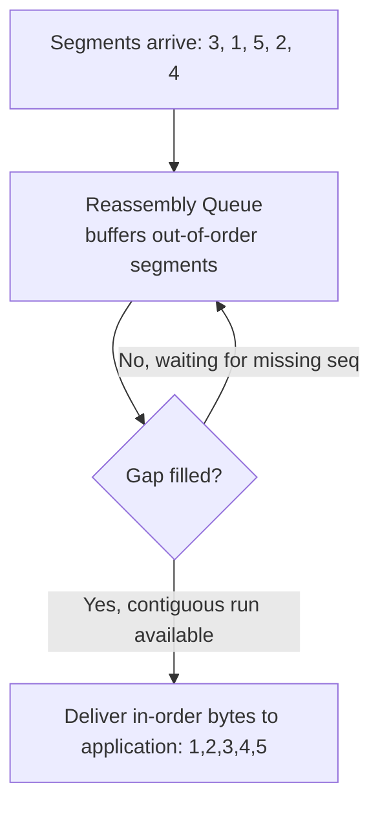

#### Ordered Delivery: Real-Life Use Case

A video-on-demand platform serves file segments over TCP through a CDN with many parallel network paths between origin and edge. Packets for a single HTTP response routinely take different physical routes and arrive out of order at the edge server. Because TCP's ordered-delivery guarantee reassembles them transparently, the CDN's application code (and the browser downloading the file) only ever sees a clean, sequential byte stream, no custom reordering logic is needed anywhere in the stack, even though the underlying packets never traveled the same route.

#### Ordered Delivery: Interview Questions and Answers

**Q1. Where does TCP reassemble out-of-order segments, the kernel or the application?**
A: Entirely in the kernel's TCP stack (in the receive/reassembly buffer). The application-level `read()` call only ever returns bytes in correct, contiguous order, it has no visibility into, or need to handle, out-of-order arrival.

**Q2. What happens to a duplicate segment that arrives after a retransmission was already successful?**
A: The receiver recognizes that the incoming sequence range has already been received and acknowledged, and silently discards the duplicate. It does not deliver the bytes twice to the application and does not send a new, different ACK for it, it simply re-ACKs the already-current cumulative position.

**Q3. What is PAWS and why is it needed on very fast or long-lived connections?**
A: PAWS (Protect Against Wrapped Sequence numbers) uses the TCP timestamp option to tell apart an old segment whose 32-bit sequence number has wrapped around and now numerically collides with a new segment's sequence number. On very high-throughput connections, the 4GB sequence space can wrap within the lifetime of a single connection, without PAWS, a very old, delayed duplicate segment could be mistaken for new data.

### Connection Termination: Graceful Goodbye

**Four-Way Handshake:**
```
Client                              Server
  |                                    |
  |-------FIN ("I'm done sending")---->|
  |                                    |
  |<------ACK ("OK, got it")----------|
  |                                    |
  |<------FIN ("I'm done too")---------|
  |                                    |
  |-------ACK ("Acknowledged")-------->|
  |                                    |
  <Both sides closed>                  
```

**Why Four Steps?**
- Connection is **bidirectional**
- Each side must close independently
- Allows half-close (one side done, other still sending)

**TIME_WAIT State:**
- Client waits 2×MSL (Maximum Segment Lifetime) before full close
- **Why**: Ensure final ACK arrives; handle delayed packets
- **Trade-off**: Sockets remain in use temporarily

#### Connection Termination: Characteristics

- **Independent, bidirectional closure**: Because a TCP connection is really two independent byte streams (one each direction), each side sends its own FIN when *it* is done sending, one side can finish sending while still receiving (half-close).
- **Graceful vs abrupt termination**: A FIN-based close is graceful, ensuring all previously sent data is delivered before the connection fully closes. An RST (reset) is abrupt, immediately tearing down the connection and discarding any unacknowledged or buffered data, used for error conditions rather than normal shutdown.
- **TIME_WAIT is a deliberate, protocol-mandated delay**: The side that sends the final ACK (typically the active closer) enters TIME_WAIT for 2×MSL, this is not a bug or inefficiency, it is a required safety margin so any stray, delayed duplicate segment from this connection expires before a new connection could reuse the same address/port pair.
- **Simultaneous close is a valid, if rare, variant**: Both sides can send FIN at nearly the same time, resulting in a slightly different state-machine path than the classic sequential four-way exchange, but converging to the same properly-closed end state.

#### Connection Termination: Components

- **FIN flag**: Signals 'I have no more data to send' for that direction of the stream, it is itself a sequenced, acknowledged event, not a special out-of-band signal.
- **RST flag**: An abrupt, immediate connection-abort signal, used when a segment arrives for a connection the receiver has no record of, or when an application explicitly aborts (rather than gracefully closes) a socket.
- **TIME_WAIT state and timer**: A kernel-tracked state, held by whichever side sent the final ACK, that keeps the (source-ip, source-port, dest-ip, dest-port) tuple reserved for 2×MSL before it can be reused.
- **Half-close capability**: The `shutdown()` socket call (as opposed to `close()`) allows sending a FIN for one direction while still being able to read data arriving from the other direction.

#### Connection Termination: Patterns

- **Active close / passive close**: The side that initiates termination (calls `close()` first) is the active closer and ends up in TIME_WAIT, the other side is the passive closer.
- **Half-close for one-directional completion signaling**: A client sends all its request data, then half-closes (FIN) to signal 'done sending' while still reading the server's full response, common in some batch/streaming protocols.
- **`SO_REUSEADDR` / `SO_LINGER` tuning**: Server-side patterns to allow quick rebinding to a port still cycling through TIME_WAIT connections (`SO_REUSEADDR`), or to control whether `close()` blocks until buffered data is sent or is discarded immediately (`SO_LINGER`).

#### Connection Termination: Pros / Benefits

- **Guarantees no data loss on a normal close**: Because FIN is itself sequenced and acknowledged like any other segment, all data sent before the FIN is guaranteed to be delivered (or the close reveals a genuine error) before the connection is considered fully closed.
- **Half-close supports flexible, one-directional shutdown semantics**: Protocols that need 'I'm done sending, but still listening' (some RPC and streaming patterns) get this for free from TCP's independent-direction closure model.
- **TIME_WAIT prevents dangerous connection tuple reuse**: Without it, a new connection reusing the same 4-tuple shortly after an old one closed could receive a stray, delayed segment from the *old* connection and misinterpret it as belonging to the new one.

#### Connection Termination: Cons / Challenges

- **TIME_WAIT accumulation on high-churn servers**: A server that opens and closes huge numbers of short-lived connections (as the active closer) can accumulate large numbers of sockets stuck in TIME_WAIT, consuming ephemeral ports and kernel memory, a well-known operational issue for busy HTTP servers and load balancers.
- **RST-based aborts can silently drop unacknowledged data**: If an application or the OS sends an RST (e.g., due to a crash, a full receive buffer being closed abruptly, or an explicit abort), any data still in flight or buffered is discarded without delivery, and the peer sees a connection-reset error rather than a clean EOF.
- **Four-way handshake is still an extra RTT-scale cost**: Closing a connection is not free, on very short-lived, high-frequency connections, both handshake and teardown overhead add up, another reason connection reuse (keep-alive) is preferred over open/close per request.
- **Simultaneous close and other edge cases complicate the state machine**: Implementing or debugging a from-scratch TCP-like stack has to correctly handle simultaneous FINs, retransmitted FINs, and out-of-order termination segments, a common source of subtle bugs in custom implementations.

#### Connection Termination: Best Practices

- Prefer graceful close (`close()` / `shutdown()`) over abrupt abort (setting `SO_LINGER` to force RST) unless you specifically need to discard in-flight data (e.g., aborting a hung connection during shutdown).
- On servers that churn through many short connections, tune `net.ipv4.tcp_tw_reuse` (Linux) or equivalent, and design for connection reuse (HTTP keep-alive, connection pooling) to reduce TIME_WAIT pressure in the first place, rather than only tuning kernel parameters after the fact.
- Use half-close (`shutdown(SHUT_WR)`) explicitly when a protocol needs to signal 'done sending' without losing the ability to read the remaining response, rather than closing the whole socket and losing incoming data.
- Distinguish between an expected clean close (EOF on read) and a peer-sent RST (connection reset exception) in error handling, they mean very different things: graceful completion versus abnormal termination.

#### Connection Termination: When to Use

- Use the standard graceful four-way close for essentially all normal application-level connection teardown, it is the default and correct choice.
- Use half-close specifically when a protocol's semantics require signaling 'finished sending' while still needing to receive a complete response afterward.
- Reserve RST/abort for genuine error conditions (crash recovery, deliberately discarding a misbehaving or hung connection), not as a shortcut for normal shutdown, since it can cause the peer to lose unacknowledged data and surface as an error rather than a clean close.

#### Connection Termination: Diagram

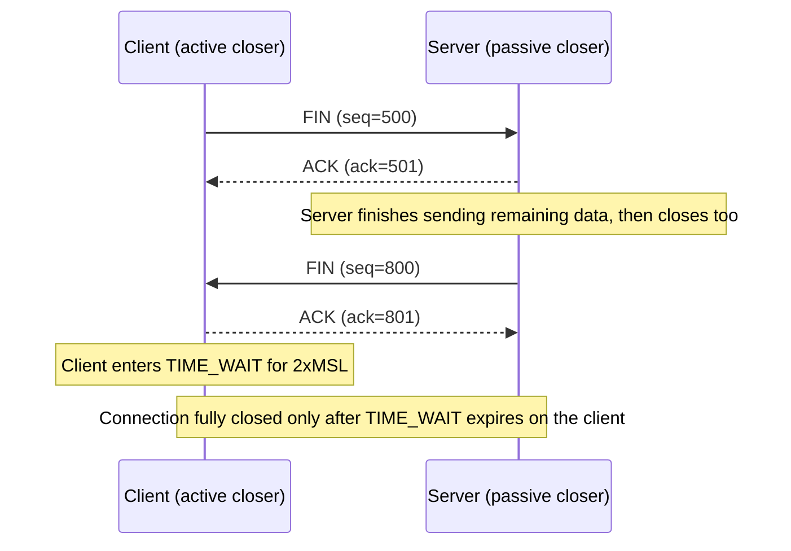

#### Connection Termination: Real-Life Use Case

A high-traffic load balancer terminates hundreds of thousands of short-lived client connections per hour, always acting as the active closer once it has forwarded the final byte of the response. Without tuning, this causes a very large number of sockets to sit in TIME_WAIT (each for roughly 60 seconds, 2xMSL on many systems), eventually exhausting the ephemeral port range and causing new connection failures. The operations team addresses this by enabling `tcp_tw_reuse`, increasing the ephemeral port range, and, more importantly, encouraging upstream services to use persistent, pooled connections instead of opening a new one per request, directly reducing the rate of connection churn that causes the TIME_WAIT buildup in the first place.

#### Connection Termination: Java Code Example

The example demonstrates a graceful, half-close-based shutdown: the client signals it is done sending by shutting down output, while still reading the server's full response.

```java
import java.io.*;
import java.net.*;

public class GracefulCloseDemo {

    static void runServer(int port) throws IOException {
        try (ServerSocket serverSocket = new ServerSocket(port);
             Socket client = serverSocket.accept()) {
            BufferedReader in = new BufferedReader(new InputStreamReader(client.getInputStream()));
            PrintWriter out = new PrintWriter(client.getOutputStream(), true);
            String line;
            while ((line = in.readLine()) != null) {
                System.out.println("Server got: " + line);
            }
            // Client half-closed (FIN for its direction); server finishes replying, then closes fully.
            out.println("ack: all data received");
            out.flush();
        } // try-with-resources triggers a graceful close() here, sending the server's FIN
    }

    static void runClient(String host, int port) throws IOException {
        try (Socket socket = new Socket(host, port)) {
            PrintWriter out = new PrintWriter(socket.getOutputStream(), true);
            out.println("request line 1");
            out.println("request line 2");
            out.flush();
            socket.shutdownOutput(); // half-close: sends FIN, but socket can still read the response

            BufferedReader in = new BufferedReader(new InputStreamReader(socket.getInputStream()));
            String response = in.readLine();
            System.out.println("Client received: " + response);
        } // full close() here, completing the four-way termination
    }

    public static void main(String[] args) throws Exception {
        int port = 5014;
        Thread serverThread = new Thread(() -> {
            try { runServer(port); } catch (IOException e) { e.printStackTrace(); }
        });
        serverThread.setDaemon(true);
        serverThread.start();
        Thread.sleep(200);
        runClient("localhost", port);
    }
}
```

#### Connection Termination: Interview Questions and Answers

**Q1. Why does TCP connection termination take four steps instead of two?**
A: A TCP connection consists of two independent byte streams, one in each direction. Each side must send its own FIN when *it* has no more data to send, and each FIN must be independently acknowledged. Because one side can be done sending while still receiving (half-close), the two directions cannot always be closed with a single combined FIN-ACK, hence the four-step exchange in the general case (though a FIN-ACK combination can sometimes save a step when the passive closer has no more data to send either).

**Q2. What is the TIME_WAIT state for, and why can't it just be skipped?**
A: TIME_WAIT is held by whichever side sends the final ACK, for a duration of 2xMSL (Maximum Segment Lifetime). It exists to guarantee that any old, delayed, or duplicated segment from this now-closed connection has fully expired in the network before the same (source IP, source port, destination IP, destination port) tuple could be reused by a new connection. Skipping it risks a stray old segment being misdelivered into a brand-new, unrelated connection using the same address/port combination.

**Q3. What is the practical operational problem with TIME_WAIT, and how is it commonly mitigated?**
A: Servers that are the active closer for very large numbers of short-lived connections (e.g., load balancers, busy HTTP servers) can accumulate huge numbers of sockets in TIME_WAIT, consuming ephemeral ports and kernel memory, potentially exhausting available ports for new connections. Common mitigations include enabling safe TIME_WAIT reuse settings (like `tcp_tw_reuse` on Linux, with important caveats), increasing the ephemeral port range, and, most effectively, reducing connection churn altogether via connection pooling and keep-alive.

**Q4. What is the difference between closing a connection with FIN versus aborting it with RST?**
A: A FIN-based close is graceful: it is sequenced and acknowledged, guarantees all previously sent data is delivered, and lets each direction close independently. An RST is an abrupt abort: it immediately tears down the connection, discards any unacknowledged or buffered data without delivering it, and signals an error condition to the peer (e.g., 'connection reset') rather than a clean end-of-stream.

**Q5. What is a half-close, and give a scenario where it is useful?**
A: A half-close (via the `shutdown()` system call, distinct from `close()`) sends a FIN for only one direction of the connection, signaling 'I am done sending' while the socket remains open for reading data from the peer. It is useful when a client needs to send a complete request and then indicate it is finished sending (so the server knows to stop expecting more input and can send a complete response), all without losing the ability to read that response back on the same socket.

### TCP Header: Every Bit Matters

```
 0                   1                   2                   3
 0 1 2 3 4 5 6 7 8 9 0 1 2 3 4 5 6 7 8 9 0 1 2 3 4 5 6 7 8 9 0 1
+-+-+-+-+-+-+-+-+-+-+-+-+-+-+-+-+-+-+-+-+-+-+-+-+-+-+-+-+-+-+-+-+
|          Source Port          |       Destination Port        |
+-+-+-+-+-+-+-+-+-+-+-+-+-+-+-+-+-+-+-+-+-+-+-+-+-+-+-+-+-+-+-+-+
|                        Sequence Number                        |
+-+-+-+-+-+-+-+-+-+-+-+-+-+-+-+-+-+-+-+-+-+-+-+-+-+-+-+-+-+-+-+-+
|                    Acknowledgment Number                      |
+-+-+-+-+-+-+-+-+-+-+-+-+-+-+-+-+-+-+-+-+-+-+-+-+-+-+-+-+-+-+-+-+
|  Data |       |C|E|U|A|P|R|S|F|                               |
| Offset| Rsrvd |W|C|R|C|S|S|Y|I|            Window             |
|       |       |R|E|G|K|H|T|N|N|                               |
+-+-+-+-+-+-+-+-+-+-+-+-+-+-+-+-+-+-+-+-+-+-+-+-+-+-+-+-+-+-+-+-+
|           Checksum            |         Urgent Pointer        |
+-+-+-+-+-+-+-+-+-+-+-+-+-+-+-+-+-+-+-+-+-+-+-+-+-+-+-+-+-+-+-+-+
```

**Key Fields:**
- **Sequence Number**: Byte stream position
- **ACK Number**: Next expected byte
- **Window**: Available buffer space
- **Flags**: SYN, ACK, FIN, RST, PSH
- **Checksum**: Data integrity

#### TCP Header: Characteristics

- **Fixed 20-byte minimum, extensible via options**: The base header is exactly 20 bytes, the Data Offset field indicates how much larger it actually is (up to 60 bytes) once options (MSS, window scale, SACK-permitted, timestamps) are included.
- **Ports identify applications, not the header's own routing**: Source/Destination Port plus the IP layer's source/destination address together form the 4-tuple (or 5-tuple with protocol) that uniquely identifies a single connection on a host, this is how a server can serve thousands of simultaneous connections on one port.
- **Flags are independent bits, often combined**: SYN, ACK, FIN, RST, PSH, URG, plus the newer ECE and CWR (for ECN) can be combined in a single segment, e.g., a SYN-ACK segment has both the SYN and ACK bits set simultaneously.
- **Checksum covers a pseudo-header, not just the TCP segment**: The checksum calculation includes a 'pseudo-header' built from parts of the IP header (source/destination IP, protocol number, segment length), this is specifically so that a segment misdelivered to the wrong IP address, or with a corrupted protocol field, is also caught.
- **Window field is one number applied per ACK**: There is no separate 'per data type' window, one 16-bit (or scaled) value governs the sender's entire allowed unacknowledged-data budget for that connection.

#### TCP Header: Components

- **Source Port / Destination Port (16 bits each)**: Identify the sending and receiving application/socket.
- **Sequence Number (32 bits)**: The byte-stream position of the first data byte in this segment (or the ISN during the handshake).
- **Acknowledgment Number (32 bits)**: The next byte the sender of this segment expects to receive, valid only when the ACK flag is set.
- **Data Offset (4 bits)**: Header length in 32-bit words, tells the receiver where the header ends and payload begins.
- **Flags (control bits)**: SYN (open), ACK (valid ack number), FIN (done sending), RST (abort), PSH (push buffered data to the application now), URG (urgent pointer valid), plus ECE/CWR for ECN.
- **Window (16 bits, optionally scaled)**: The receiver's advertised flow-control window.
- **Checksum (16 bits)**: Error-detection code over the pseudo-header, TCP header, and payload.
- **Urgent Pointer (16 bits)**: Offset to urgent data, when the URG flag is set (rarely used in modern applications).
- **Options (variable, up to 40 bytes)**: MSS, window scale factor, SACK-permitted and SACK blocks, and timestamps, all negotiated primarily at handshake time (except SACK blocks, which appear throughout the connection).

#### TCP Header: Patterns

- **Options negotiated once, used throughout**: MSS, window scale, and SACK-permitted are examples of the 'negotiate once at handshake, apply for connection lifetime' pattern common in many protocols (also seen in TLS cipher suite negotiation).
- **Piggybacking ACKs on data segments**: Rather than sending a separate, dedicated ACK segment for every received segment, TCP commonly rides the ACK number and window fields on an outgoing data segment already headed in that direction, reducing packet count.
- **Checksum-and-drop, not checksum-and-correct**: TCP's checksum can only detect corruption, not repair it, a corrupted segment is simply dropped (as if lost), relying on the same retransmission mechanism used for genuine packet loss.

#### TCP Header: Pros / Benefits

- **Compact given its capability**: A 20-byte base header carries everything needed for connection identification, ordering, acknowledgment, flow control, and basic integrity checking, remarkably little overhead for what it enables.
- **Extensible without breaking compatibility**: The options mechanism let TCP gain major capabilities (window scaling, SACK, timestamps) over decades without changing the base header format or breaking older implementations that simply ignore unknown options.
- **Self-describing framing**: The Data Offset field lets a receiver always correctly locate the payload regardless of how many options are present, no external framing information is needed.

#### TCP Header: Cons / Challenges

- **Overhead adds up for small payloads**: For a protocol carrying tiny messages (a few bytes), the 20+ byte TCP header (plus 20-byte IPv4/40-byte IPv6 header) can be larger than the payload itself, a real efficiency concern for very chatty, small-message protocols.
- **Checksum is weak by modern standards**: TCP's 16-bit checksum can miss certain classes of corruption (some documented weaknesses with specific bit-flip patterns), most real integrity guarantees in modern systems come from stronger checksums/hashes at higher layers (TLS, application-level hashing) rather than relying on TCP's checksum alone.
- **Middleboxes sometimes strip or mishandle options**: Some older or misconfigured firewalls, NATs, and proxies strip TCP options like window scaling or SACK-permitted, silently degrading a connection's performance without any visible error.
- **32-bit sequence and ACK numbers wrap on very fast/long connections**: As covered under Ordered Delivery, extremely high-throughput or extremely long-lived connections can wrap the sequence space, requiring PAWS (via the timestamp option) to disambiguate correctly.

#### TCP Header: Best Practices

- Rely on TLS (or another application-layer integrity/authentication mechanism) for real data-integrity and authenticity guarantees, never treat TCP's checksum as a security or strong-integrity control, it exists only to catch accidental bit errors, not tampering.
- Verify, via packet capture, that window scaling and SACK are actually being negotiated successfully end-to-end for high-throughput connections crossing unfamiliar network paths (some middleboxes silently strip these options).
- For very small, frequent messages, consider batching or a more header-efficient protocol/encoding if the fixed TCP+IP header overhead becomes a measurable fraction of total traffic.
- When debugging connection issues, capture and inspect the actual header flags and options (e.g., with `tcpdump`/Wireshark) rather than guessing, most subtle TCP performance and correctness issues are visible directly in the header fields.

#### TCP Header: When to Use

- Understanding the header matters most when debugging real network problems (packet captures), designing very high-throughput or very latency-sensitive systems, or explaining TCP behavior precisely in a design review or interview.
- Application developers using standard socket APIs almost never need to construct or parse the header directly, the OS kernel handles this, this knowledge is primarily for network debugging, protocol design, and low-level performance tuning.

#### TCP Header: Diagram

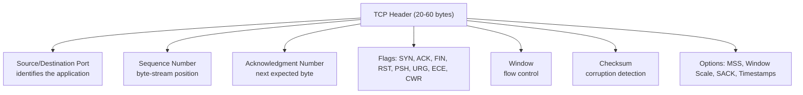

#### TCP Header: Real-Life Use Case

A platform team investigating intermittent slow file uploads from a specific corporate office captures traffic with `tcpdump` and inspects the TCP header options in the handshake. They discover the corporate firewall strips the Window Scale option from outgoing SYN packets, silently capping every connection's negotiated window at 64KB. On the office's 200ms-RTT link to the cloud provider, that caps throughput far below the available bandwidth (a direct consequence of the bandwidth-delay product, covered next). Fixing the firewall's TCP option handling immediately restores full throughput, with no application code changes at all, this diagnosis was only possible because the header's options were inspected directly.

#### TCP Header: Java Code Example

Java's standard socket API does not expose raw header fields (the OS kernel manages them), so this example uses a raw byte array to illustrate the header layout conceptually, mirroring how a packet-capture tool or a custom protocol analyzer would parse it.

```java
import java.nio.ByteBuffer;

public class TcpHeaderParser {

    // Parses just the fixed 20-byte portion of a TCP header from a raw byte array.
    static void parseHeader(byte[] segment) {
        ByteBuffer buf = ByteBuffer.wrap(segment);
        int sourcePort = buf.getShort(0) & 0xFFFF;
        int destPort = buf.getShort(2) & 0xFFFF;
        long seqNumber = buf.getInt(4) & 0xFFFFFFFFL;
        long ackNumber = buf.getInt(8) & 0xFFFFFFFFL;
        int dataOffsetAndFlags = buf.getShort(12) & 0xFFFF;
        int dataOffsetWords = (dataOffsetAndFlags >> 12) & 0xF; // header length in 32-bit words
        int flags = dataOffsetAndFlags & 0x3F; // low 6 bits: URG, ACK, PSH, RST, SYN, FIN
        int window = buf.getShort(14) & 0xFFFF;

        System.out.printf("srcPort=%d dstPort=%d seq=%d ack=%d headerLen=%d bytes window=%d flags=0x%02X%n",
                sourcePort, destPort, seqNumber, ackNumber, dataOffsetWords * 4, window, flags);
    }

    public static void main(String[] args) {
        // A minimal, illustrative 20-byte TCP header: SYN flag set, seq=100, window=65535.
        byte[] header = new byte[20];
        ByteBuffer buf = ByteBuffer.wrap(header);
        buf.putShort(0, (short) 443);      // source port
        buf.putShort(2, (short) 51000);    // destination port
        buf.putInt(4, 100);                // sequence number
        buf.putInt(8, 0);                  // ack number (unused, ACK flag not set)
        buf.putShort(12, (short) ((5 << 12) | 0x02)); // data offset=5 words (20 bytes), SYN flag
        buf.putShort(14, (short) 65535);   // window

        parseHeader(header);
    }
}
```

#### TCP Header: Interview Questions and Answers

**Q1. What determines the size of the TCP header, and what is the maximum?**
A: The base header is 20 bytes. The Data Offset field (4 bits, counting 32-bit words) indicates the actual header length, allowing room for options, MSS, window scale, SACK-permitted, timestamps, up to a maximum total header size of 60 bytes (15 words x 4 bytes).

**Q2. Why does the TCP checksum include parts of the IP header (the pseudo-header), not just the TCP segment itself?**
A: Including source/destination IP address and the protocol number in the checksum calculation ensures that a segment which was somehow misdelivered to the wrong destination address, or had its protocol field corrupted, is also detected as invalid, not just corruption within the TCP segment's own bytes. This ties the transport-layer checksum's validity to the correct network-layer addressing.

**Q3. Can two different flags be set in the same TCP segment? Give an example.**
A: Yes, flags are independent bits and are frequently combined. The clearest example is the SYN-ACK segment in the three-way handshake, which has both the SYN flag (proposing the server's own ISN) and the ACK flag (acknowledging the client's SYN) set in the same segment, saving what would otherwise be a separate round trip.

**Q4. Why might window scaling silently fail to take effect on a connection, and how would you detect it?**
A: Some middleboxes (older firewalls, certain NAT devices) strip TCP options, including the Window Scale option, from packets as they pass through, even though both real endpoints support it. This silently caps the connection's window at 65,535 bytes without any explicit error. It is detected by capturing packets (e.g., with `tcpdump` or Wireshark) at both ends of the path and comparing whether the Window Scale option is present and identical in the SYN and SYN-ACK as actually received, not just as originally sent.

### Performance Characteristics

**Latency Components:**
- **Connection Setup**: 1 RTT (Round Trip Time) for handshake
- **Data Transfer**: 1 RTT per window (with pipelining)
- **Connection Close**: 1 RTT for termination

**Throughput:**
```
Max Throughput = Window Size / RTT
```
- **Window Size**: Limited by receiver buffer and congestion window
- **RTT**: Round trip time
- **Implication**: High RTT = lower throughput (long distance problem)

**Bandwidth-Delay Product:**
```
BDP = Bandwidth × RTT
```
- **Optimal Window Size** = BDP
- **Example**: 100 Mbps, 100ms RTT → Need 1.25 MB window
- **Problem**: Default windows too small for high-speed, long-distance links
- **Solution**: TCP Window Scaling (negotiate larger windows)

#### Performance Characteristics: Characteristics

- **Throughput is fundamentally window-bound, not just bandwidth-bound**: Even on a link with abundant raw bandwidth, achievable throughput is capped by `window size / RTT`, a small window on a high-RTT path can leave most of the link's capacity unused, this is the single most common cause of 'why is my transfer so slow despite a fast internet connection' on long-distance links.
- **Bandwidth-Delay Product (BDP) sets the true optimal window**: BDP = bandwidth x RTT represents exactly how many bytes can be 'in flight' (sent but not yet acknowledged) at any instant to fully utilize the link, a window smaller than BDP under-utilizes the link, a window larger than necessary wastes buffer memory without added benefit.
- **Latency is additive across connection phases**: Setup (1 RTT), then data transfer (roughly 1 RTT per window's worth of data, less with pipelining/large windows), then teardown (roughly 1 RTT), each phase's RTT cost is a real, additive contributor to total perceived latency, especially for short-lived connections.
- **Throughput and latency trade off differently depending on congestion control phase**: During slow start, achievable throughput ramps up over multiple RTTs rather than being available immediately, so short transfers may never reach the link's true steady-state throughput at all.

#### Performance Characteristics: Components

- **RTT (Round Trip Time)**: The time for a signal to travel to the peer and an acknowledgment to travel back, the fundamental unit that most TCP performance formulas are expressed in.
- **Window size (effective)**: `min(receive window, congestion window)`, the actual amount of unacknowledged data allowed in flight at any moment.
- **Bandwidth-Delay Product calculator**: The conceptual (and sometimes literal, in tuning tools) calculation of `bandwidth x RTT` used to size buffers and windows correctly for a given path.
- **Window scaling**: The mechanism that allows windows larger than 64KB, required to actually reach the BDP-optimal window on many modern high-bandwidth or high-latency paths.

#### Performance Characteristics: Patterns

- **BDP-based buffer sizing**: Explicitly computing bandwidth x RTT for a known path and configuring send/receive buffers (and enabling window scaling) to match, rather than relying on OS defaults that may target a much smaller, generic path.
- **Connection warm-up awareness**: Recognizing that a freshly opened TCP connection needs several RTTs of slow start before reaching its steady-state throughput, and designing short-request-heavy systems (many small requests) to reuse warmed-up connections rather than opening new ones per request.
- **Pipelining requests over a single connection**: Sending multiple requests without waiting for each response individually (where the protocol supports it) to better utilize the available window instead of incurring a full RTT round-trip per request.

#### Performance Characteristics: Pros / Benefits

- **Predictable, formula-based reasoning about throughput**: `Throughput <= Window / RTT` gives system designers a concrete way to reason about and predict achievable throughput on a given path, rather than treating performance as a black box.
- **BDP calculation directly explains and fixes a very common real-world problem**: Undersized windows on long-distance links are one of the most frequently misdiagnosed performance issues in distributed systems, understanding BDP turns a mysterious slowdown into a straightforward buffer-sizing fix.
- **Window scaling extends TCP's usefulness to modern high-speed, global-scale networks**: Without it, TCP's usefulness on transcontinental, high-bandwidth links would be severely capped by the original 64KB window limit.

#### Performance Characteristics: Cons / Challenges

- **High-RTT paths fundamentally limit small-window throughput no matter how much bandwidth exists**: You cannot simply 'add more bandwidth' to fix a throughput problem caused by a too-small window on a high-latency path, the window itself must be increased (and windows scaling must actually be negotiated end-to-end).
- **Short-lived connections rarely reach steady-state throughput**: Because of slow start's ramp-up, a connection that only transfers a small amount of data may finish before congestion control ever reaches the link's true capacity, this makes benchmarking short transfers misleading if used to estimate long-transfer throughput.
- **BDP changes with the path, requiring re-tuning across environments**: A window/buffer size tuned for a same-datacenter path (low RTT) will be badly undersized for a cross-region path (high RTT) carrying the same bandwidth, tuning has to be path-aware, not a single global constant.

#### Performance Characteristics: Best Practices

- Calculate the actual Bandwidth-Delay Product for your real production paths (not assumed defaults) and size socket buffers and window scaling accordingly, especially for cross-region or cross-continent traffic.
- For latency-sensitive, short-request-heavy workloads, prioritize connection reuse and warm connections over relying on a fresh connection's slow-start ramp-up to reach adequate throughput in time.
- Benchmark throughput using transfer sizes and durations representative of real production payloads, not tiny test transfers that finish before congestion control leaves slow start.
- Periodically re-validate window scaling and buffer settings after infrastructure changes (new regions, new CDN edge locations, new peering arrangements), since BDP is path-specific and changes when the path does.

#### Performance Characteristics: When to Use

- Apply BDP-based reasoning specifically when diagnosing 'why is throughput lower than expected despite adequate raw bandwidth,' especially on cross-region, satellite, or otherwise high-RTT paths.
- Apply latency-component reasoning (setup + transfer + teardown RTTs) when estimating or optimizing total request latency for short-lived, request/response-style TCP usage, favoring connection reuse when the RTT-per-phase cost is a significant fraction of total latency.

#### Performance Characteristics: Diagram

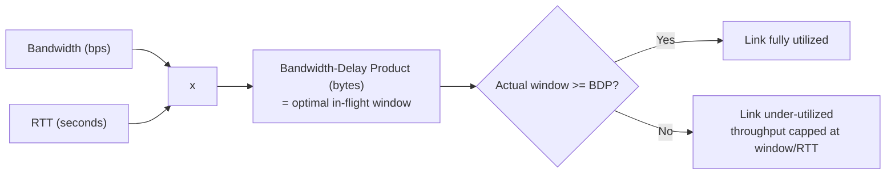

#### Performance Characteristics: Real-Life Use Case

A company replicates database backups nightly from its primary region (US-East) to a disaster-recovery region (Asia-Pacific), a path with roughly 220ms RTT and a provisioned 1 Gbps link. The BDP for this path is `1,000,000,000 bits/sec x 0.220 sec / 8 = ~27.5 MB`. With default OS socket buffers capped around 4-8MB and window scaling working correctly but buffers too small, the transfer only ever achieves a fraction of the 1 Gbps capacity, taking far longer than expected. After explicitly increasing `SO_SNDBUF`/`SO_RCVBUF` (and the corresponding kernel-wide TCP buffer limits) to comfortably exceed the ~27.5MB BDP, the nightly replication job fully utilizes the provisioned 1 Gbps link and finishes in a fraction of the previous time.

#### Performance Characteristics: Java Code Example

The example below explicitly computes the Bandwidth-Delay Product for a given path and uses it to size the socket's send buffer before establishing a connection, directly applying the formula in code.

```java
import java.io.*;
import java.net.*;

public class BdpTuningDemo {

    // Computes Bandwidth-Delay Product in bytes.
    static int computeBdpBytes(double bandwidthBitsPerSec, double rttSeconds) {
        double bitsInFlight = bandwidthBitsPerSec * rttSeconds;
        return (int) (bitsInFlight / 8.0);
    }

    static void runClient(String host, int port, double bandwidthMbps, double rttMillis) throws IOException {
        int bdpBytes = computeBdpBytes(bandwidthMbps * 1_000_000, rttMillis / 1000.0);
        System.out.println("Computed BDP: " + bdpBytes + " bytes, sizing send buffer to match");

        try (Socket socket = new Socket()) {
            socket.setSendBufferSize(bdpBytes); // aim to keep the pipe full for this path
            socket.connect(new InetSocketAddress(host, port), 5000);
            System.out.println("Actual send buffer size: " + socket.getSendBufferSize());
        }
    }

    public static void main(String[] args) throws Exception {
        // Example path: 1 Gbps link, 220ms RTT (cross-region replication scenario)
        runClient("localhost", 5015, 1000, 220);
    }
}
```

#### Performance Characteristics: Interview Questions and Answers

**Q1. Write the formula for maximum TCP throughput in terms of window size and RTT, and explain each term.**
A: `Max Throughput = Window Size / RTT`. Window Size is the amount of unacknowledged data allowed in flight (the smaller of the receive window and congestion window), RTT is the round-trip time to the peer. The formula says throughput is capped by how much data can be 'in the pipe' at once divided by how long it takes to get an acknowledgment back, more window or lower RTT both directly increase achievable throughput.

**Q2. What is the Bandwidth-Delay Product, and why does it matter for tuning TCP performance?**
A: BDP = Bandwidth x RTT, it represents the exact amount of data that can be in transit on a given path at any moment if the connection is to fully utilize the available bandwidth. It matters because the TCP window (and the underlying socket buffers) must be at least as large as the BDP, if the window is smaller, the link's true capacity is left unused no matter how much bandwidth is actually available.

**Q3. Give a concrete example of why a 100 Mbps link with 100ms RTT needs roughly a 1.25MB window.**
A: BDP = 100,000,000 bits/sec x 0.1 sec = 10,000,000 bits = 1,250,000 bytes (~1.25MB). This is the amount of data that must be 'in flight' at any given instant to keep the link continuously busy, if the negotiated window is smaller (e.g., the original un-scaled 64KB maximum), the connection will sit idle waiting for ACKs for a meaningful fraction of each RTT, achieving far less than 100 Mbps in practice.

**Q4. Why do short-lived TCP connections often fail to reach the link's true maximum throughput?**
A: Congestion control starts in slow start, where the congestion window grows exponentially from a small initial value over multiple RTTs before reaching a steady state near the link's actual capacity. A short transfer (a few RTTs' worth of data) may complete before the congestion window has grown large enough to fully utilize the link, meaning its achieved throughput reflects the ramp-up phase, not the link's true steady-state capacity.

### When TCP Shines

**Perfect For:**
- **Web browsing**: Every byte matters, order critical
- **File transfers**: Integrity non-negotiable
- **Email**: Reliability required
- **Database connections**: Transactions need guarantees
- **API calls**: Correctness over speed
- **SSH/Remote access**: Every keystroke must arrive

**The Pattern:**
When **correctness** is more important than **speed**, TCP is your friend.

### When TCP Struggles

**Problems:**

1. **Head-of-Line Blocking**:
   - One lost packet blocks entire stream
   - Application waits for retransmission
   - **Impact**: Poor for real-time (video, gaming)

2. **Overhead**:
   - Connection setup (1 RTT)
   - Headers (20-60 bytes per packet)
   - ACKs (additional packets)
   - **Impact**: Inefficient for small, one-off requests

3. **Latency Sensitivity**:
   - Retransmissions add delay
   - Congestion control slows down proactively
   - **Impact**: Poor for ultra-low latency needs

4. **Fairness Issues**:
   - Aggressive flows get more bandwidth
   - Short flows starved by long flows
   - **Impact**: Unfair resource allocation

#### When TCP Shines / Struggles: Diagram

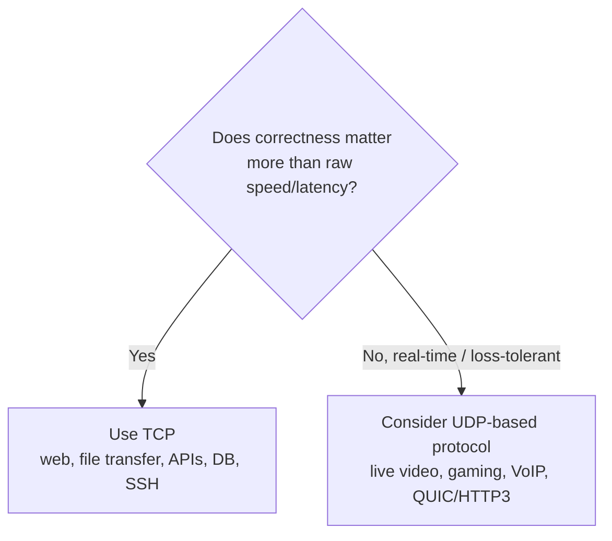

#### When TCP Shines / Struggles: Real-Life Use Case

A company builds two features on the same backend: a **file export** feature (users download a generated CSV report) and a **live multiplayer game** (players' positions update 20 times per second). The file export uses plain TCP: correctness is paramount, a corrupted or incomplete CSV is a real bug, and a little extra latency is invisible to the user. The game uses UDP with a custom, application-level partial-reliability layer: if one position update is lost, waiting for a TCP retransmission (which could take a full RTT or more, and would also block all subsequent updates behind it due to head-of-line blocking) would make the game feel laggy and unresponsive, it is far better to simply drop the stale update and send the next, current position immediately.

#### When TCP Shines / Struggles: Interview Questions and Answers

**Q1. Give three concrete examples of workloads where TCP's guarantees are essential.**
A: (1) File transfer/downloads, a missing or corrupted byte anywhere in the file is a real, visible bug. (2) Database client connections, transactions and query results must be byte-perfect and cannot be silently reordered or dropped. (3) SSH/remote terminal access, every keystroke and every byte of output must arrive, in order, or the session is unusable.

**Q2. Why does head-of-line blocking make TCP a poor fit for real-time video or gaming?**
A: TCP guarantees strictly in-order delivery, so if one segment is lost, all later, already-received data is held back until the gap is filled via retransmission. For real-time media, a video frame or game-state update from a moment ago is often worthless once a newer one exists, waiting for a stale, lost update to be retransmitted (potentially taking a full RTT or a timeout) adds visible lag that a user would rather avoid by simply skipping the lost update and moving to the current one.

**Q3. What is the practical impact of TCP's connection and header overhead on very small, frequent requests?**
A: For a request/response pattern involving only a few bytes of actual payload, the one-RTT handshake cost (if not reusing a connection) plus 20-60 bytes of TCP header (plus IP header) can dwarf the payload itself, both in bytes transferred and, more importantly, in added round-trip latency. This is why protocols expecting many small, frequent exchanges (DNS, some IoT telemetry) often prefer UDP or invest heavily in TCP connection reuse and pipelining to amortize this overhead.

### TCP Variants and Evolution

**Classic Versions:**
- **TCP Tahoe** (1988): First congestion control
- **TCP Reno** (1990): Fast retransmit and recovery
- **TCP New Reno**: Better loss handling

**Modern Versions:**
- **TCP Cubic** (Linux default): Better for high-bandwidth networks
- **TCP BBR** (Google, 2016): Model-based congestion control, higher throughput
- **TCP Fast Open**: 0-RTT connection establishment

**Optimizations:**
- **Nagle's Algorithm**: Batch small writes (reduces overhead)
- **Delayed ACK**: Wait before ACKing (reduce ACK traffic)
- **TCP Window Scaling**: Support windows > 64KB
- **Selective Acknowledgment (SACK)**: Acknowledge non-contiguous blocks

#### TCP Variants: Characteristics

- **Evolution driven by real, measured problems, not theory**: Every major TCP variant (Tahoe's congestion control, Reno's fast recovery, Cubic's scaling, BBR's model-based approach) was created in direct response to an observed real-world failure mode (congestion collapse in 1986-1988, poor performance on high-bandwidth links, bufferbloat), not designed speculatively.
- **Backward compatible at the wire level**: A host running BBR can still communicate correctly with a host running Cubic, the congestion control algorithm only governs the sender's own pacing decisions, it is invisible to the receiver and not part of the negotiated protocol.
- **Pluggable at the OS level**: Modern operating systems (Linux especially, via `sysctl net.ipv4.tcp_congestion_control`) let the congestion control algorithm be selected or even changed per-connection, without any application code changes.
- **Optimizations address distinct, specific inefficiencies**: Nagle's algorithm (too many tiny packets from the sender), Delayed ACK (too many tiny ACK-only packets from the receiver), Window Scaling (window too small for high-BDP paths), and SACK (imprecise loss reporting) each solve one narrow, well-defined problem rather than being general-purpose tweaks.

#### TCP Variants: Components

- **Congestion control module (pluggable)**: The specific algorithm (Reno, Cubic, BBR, etc.) implementing how `cwnd` grows and shrinks, selectable per-OS or even per-socket on Linux.
- **Nagle's algorithm toggle (`TCP_NODELAY`)**: Controls whether small writes are batched before sending (default, reduces packet count) or sent immediately (lower latency for small, latency-sensitive messages).
- **Delayed ACK timer**: Controls how long the receiver waits, hoping to piggyback an ACK on outgoing data or combine multiple ACKs, before sending a dedicated ACK segment.
- **TCP Fast Open cookie cache**: Client and server-side state that allows a repeat connection to skip a full RTT by including a previously issued cryptographic cookie in the initial SYN.

#### TCP Variants: Patterns

- **Loss-based congestion control (Tahoe, Reno, New Reno, Cubic)**: React primarily to detected packet loss as the congestion signal, conceptually simple but can perform poorly on lossy-but-uncongested links and can build up queueing delay (bufferbloat) before reacting.
- **Model-based congestion control (BBR)**: Continuously estimate the path's actual bottleneck bandwidth and minimum RTT and pace sending to match, aiming to avoid inducing loss or excess queueing delay in the first place.
- **0-RTT resumption (TCP Fast Open)**: Cache a cryptographic cookie from a prior connection to skip the round trip normally spent waiting for a SYN-ACK before sending data, trading a small replay-attack risk (mitigated by requiring idempotent-safe use) for reduced latency on repeat connections.

#### TCP Variants: Pros / Benefits

- **Continuous improvement without breaking the ecosystem**: Because congestion control lives entirely at the sender and isn't part of the wire-visible protocol contract, decades of algorithmic research (Reno to Cubic to BBR) have been deployed incrementally without requiring a flag-day upgrade of the entire internet.
- **Right algorithm for the right network**: Cubic is well-tuned for typical high-bandwidth wired networks, BBR often performs better on paths with bufferbloat or higher loss unrelated to congestion, having options lets operators choose what fits their actual traffic.
- **Small optimizations compound into meaningful efficiency gains at scale**: Nagle's algorithm and Delayed ACK, while individually minor, meaningfully reduce total packet counts (and thus CPU and bandwidth overhead) across billions of daily TCP connections.

#### TCP Variants: Cons / Challenges

- **Algorithm choice can create inter-flow fairness problems**: A BBR flow and a Cubic flow competing for the same bottleneck link do not necessarily share bandwidth fairly, this has been a genuine, debated concern as BBR has been deployed at large scale by some providers.
- **Nagle's algorithm plus Delayed ACK can interact to add latency**: A classic, well-documented pitfall, small writes waiting to batch (Nagle) combined with the receiver waiting to piggyback an ACK (Delayed ACK) can occasionally add up to ~200ms of avoidable latency for specific request/response patterns, this is why `TCP_NODELAY` is commonly set for latency-sensitive RPC.
- **TCP Fast Open has real security caveats**: Because the 0-RTT data is sent before the full handshake completes, it is vulnerable to replay if not carefully restricted to idempotent operations, this limits where it can be safely used.
- **Not every OS/network defaults to the newest, best-performing option**: Many systems still default to older algorithms or have Fast Open disabled, meaning real-world benefit depends on explicit configuration, not just on the algorithm existing.

#### TCP Variants: Best Practices

- Default to Cubic for general-purpose traffic (the Linux default and a solid, well-tested choice), and specifically evaluate BBR for high-bandwidth, latency-sensitive, or bufferbloat-prone paths (video delivery, cross-region replication) with real before/after measurement.
- Set `TCP_NODELAY` for latency-sensitive request/response protocols (RPC, interactive APIs) where small, frequent messages matter more than minimizing packet count, but leave Nagle's algorithm enabled by default for bulk, throughput-oriented transfers.
- Only enable TCP Fast Open for genuinely idempotent request types, and understand the replay-risk trade-off before adopting it broadly.
- Treat congestion control algorithm changes as an operational change requiring measurement (before/after throughput, latency, fairness with existing traffic), not a 'free' drop-in performance win.

#### TCP Variants: When to Use

- Use the OS default (typically Cubic) unless you have a measured, specific problem (bufferbloat-induced latency, poor performance on a particular high-BDP path) that a different algorithm (like BBR) is known to address.
- Use `TCP_NODELAY` for interactive, latency-sensitive, small-message protocols, and leave Nagle's algorithm on for bulk transfer workloads where packet efficiency matters more than per-message latency.
- Consider TCP Fast Open specifically for latency-critical, idempotent, high-repeat-connection-rate clients (e.g., mobile apps reconnecting to the same API frequently).

#### TCP Variants: Diagram

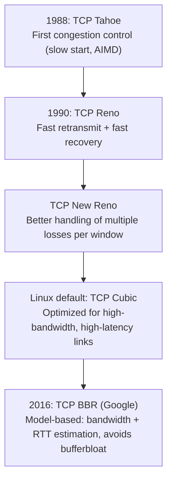

#### TCP Variants: Real-Life Use Case

A large streaming video provider serving content globally switches its edge servers from Cubic to BBR after observing that Cubic-based connections were experiencing significant queuing delay (bufferbloat) on last-mile residential broadband links, hurting startup latency and rebuffering rates for viewers on congested home networks. After the switch, median time-to-first-frame and rebuffering events measurably improve on affected networks because BBR paces sending based on a direct estimate of the path's actual bandwidth and RTT rather than waiting for a router buffer to fill up and drop a packet before backing off.

#### TCP Variants: Java Code Example

Java's standard socket API does not expose congestion control algorithm selection directly (it is an OS/kernel-level setting), so this example demonstrates the two variant-related knobs Java *does* expose directly: `TCP_NODELAY` (Nagle's algorithm) and buffer sizing, along with a comment on how congestion control itself would be selected at the OS level.

```java
import java.net.*;
import java.io.*;

public class TcpVariantsDemo {

    static void runLowLatencyClient(String host, int port) throws IOException {
        try (Socket socket = new Socket()) {
            socket.connect(new InetSocketAddress(host, port), 5000);
            socket.setTcpNoDelay(true); // disable Nagle's algorithm: send small writes immediately
            // Congestion control algorithm (Cubic vs BBR) is chosen at the OS level, e.g. on Linux:
            //   sysctl -w net.ipv4.tcp_congestion_control=bbr
            // Java's Socket API has no cross-platform way to select it per-connection.
            OutputStream out = socket.getOutputStream();
            out.write("PING".getBytes());
            out.flush();
            System.out.println("Sent small message immediately (TCP_NODELAY=true), no Nagle batching delay");
        }
    }

    public static void main(String[] args) throws Exception {
        runLowLatencyClient("localhost", 5016);
    }
}
```

#### TCP Variants: Interview Questions and Answers

**Q1. Why can two hosts using different congestion control algorithms (say, one using Cubic, one using BBR) still communicate correctly?**
A: Congestion control governs only how the *sender* decides its own sending rate (via `cwnd`), it is a purely local, sender-side decision that is not encoded in or negotiated through the TCP wire protocol itself. The receiver just sees data and ACKs as normal, it has no visibility into or dependency on which congestion control algorithm the sender is running.

**Q2. What is the difference between Nagle's algorithm and Delayed ACK, and how can combining them cause added latency?**
A: Nagle's algorithm is a sender-side optimization that batches multiple small writes into fewer, larger segments instead of sending many tiny packets. Delayed ACK is a receiver-side optimization that waits briefly before sending a dedicated ACK, hoping to piggyback it on outgoing data instead. When both are active in a request/response pattern with small messages, the sender may wait to batch more data (Nagle) while the receiver is simultaneously waiting to piggyback an ACK (Delayed ACK), and each side is effectively waiting on the other, adding measurable, avoidable latency, commonly up to around 200ms in the worst documented cases.

**Q3. What real-world problem motivated the creation of TCP BBR, and how does it address that problem differently than Cubic?**
A: Loss-based algorithms like Cubic keep increasing their sending rate until a router's buffer overflows and a packet is dropped, they use loss as their primary congestion signal. On paths with large router buffers (bufferbloat), this means the algorithm fills up that buffer, adding significant queuing delay, before it ever detects congestion. BBR instead continuously estimates the path's actual bottleneck bandwidth and minimum RTT from ACK timing and paces sending to match that model, aiming to achieve high throughput without needing to induce a large queue or an actual packet drop to find the right rate.

**Q4. When would you explicitly disable Nagle's algorithm (`TCP_NODELAY`), and why?**
A: For latency-sensitive, small-message, request/response protocols, such as RPC calls, interactive terminal sessions, or real-time control messages, where waiting to batch a small write with future writes (Nagle's default behavior) adds unacceptable, avoidable latency. In these cases, the small increase in packet count and header overhead from disabling Nagle's algorithm is a worthwhile trade for lower, more predictable per-message latency.

### The Trade-offs

| Aspect | TCP | UDP |
|--------|-----|-----|
| **Reliability** | Guaranteed | Best-effort |
| **Order** | Maintained | Not guaranteed |
| **Latency** | Higher (retransmissions) | Lower (no retries) |
| **Overhead** | 20-60 bytes + ACKs | 8 bytes |
| **Connection** | Required (3-way handshake) | Connectionless |
| **Use Case** | Correctness critical | Speed critical |

#### TCP vs UDP: Diagram

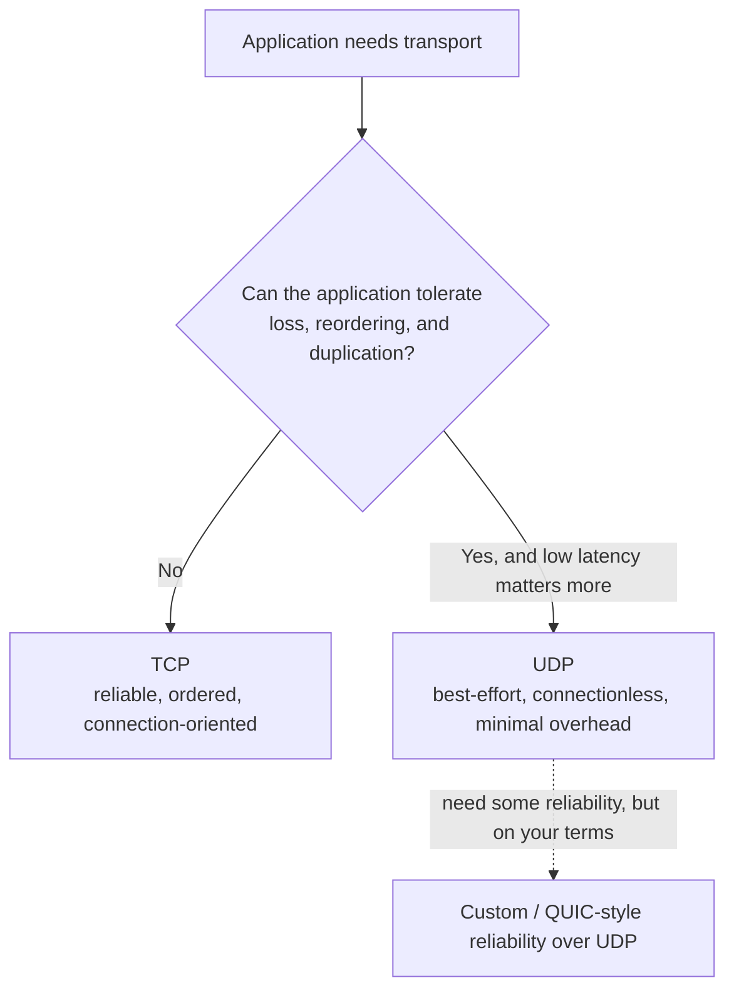

#### TCP vs UDP: Real-Life Use Case

A company builds a DNS resolver and a file synchronization client in the same product. DNS queries use UDP: a single small request/response, if the response is lost, the resolver simply retries the whole query after a short timeout, which is faster overall than paying for a TCP handshake for a single tiny message (DNS does fall back to TCP for large or specific response types, like zone transfers, but the common case is UDP). The file synchronization client uses TCP: files must arrive byte-perfect and in order, and the connection is long-lived enough (many files, many megabytes) that the one-time handshake cost is negligible compared to the total transfer time.

#### TCP vs UDP: Interview Questions and Answers

**Q1. If UDP has lower overhead and lower latency, why isn't it used for everything?**
A: UDP's lower overhead comes precisely from omitting the guarantees TCP provides: no handshake, no acknowledgment, no retransmission, no ordering. Any application using UDP that actually needs reliability or ordering has to reimplement those mechanisms itself at the application layer (as QUIC does), which is significant, easy-to-get-wrong engineering effort, TCP is preferred by default because it provides these guarantees correctly and for free.

**Q2. Why is DNS traditionally sent over UDP instead of TCP?**
A: A DNS query and response are typically small, single request/response exchanges. Paying for a full TCP handshake (one RTT) before even sending the actual (tiny) query would often cost more time than the query itself. If a UDP-based query's response is lost, the resolver simply retries after a timeout, for such a lightweight exchange, this is more efficient overall than maintaining connection state for a one-shot request. DNS does use TCP for larger responses (e.g., those exceeding a single UDP datagram, or the initial size negotiated via EDNS) and specific operations like zone transfers.

**Q3. How does QUIC (used by HTTP/3) get 'the best of both worlds'?**
A: QUIC is built on top of UDP but reimplements TCP-like reliability, ordering, and congestion control itself, at the application/library layer instead of the kernel. Crucially, it multiplexes multiple independent streams within one QUIC connection such that a lost packet only blocks the specific stream it belonged to, not all other streams, solving TCP's classic head-of-line blocking problem at the transport level while still providing reliability.

### The Wisdom

**Why TCP Won the Internet:**
1. **Reliability**: Just works, hides network complexity
2. **Fairness**: Plays nice with other flows
3. **Adaptability**: Adjusts to any network
4. **Simplicity**: Applications don't worry about loss

**The Golden Rule:**
*"Use TCP unless you have a specific reason not to. The reason is usually: real-time, multicast, or you're implementing your own reliability."*

**Modern Reality:**
- **HTTP/1.1, HTTP/2**: Over TCP (reliability matters)
- **HTTP/3**: Over QUIC/UDP (reinvents TCP at application layer)
- **Databases**: Over TCP (data integrity critical)
- **APIs**: Over TCP (correctness over speed)

**The Paradox:**
TCP's reliability mechanisms (retransmissions, ordering) can cause **more latency** than the loss they're compensating for. This is why real-time applications avoid it.

**The Legacy:**
TCP is a testament to brilliant protocol design. It's survived 40+ years because it solves fundamental problems elegantly, adapts to changing networks, and hides complexity from applications. It's not perfect, but it's **remarkably good** at what it does.

#### The Wisdom: Interview Questions and Answers

**Q1. If TCP has known weaknesses (head-of-line blocking, handshake latency, fairness issues), why hasn't it been replaced?**
A: TCP's weaknesses matter mainly for specific, latency-sensitive or loss-tolerant workloads (real-time media, ultra-low-latency messaging), while the vast majority of internet traffic (web pages, APIs, file transfer, databases) genuinely needs exactly the guarantees TCP provides. Rather than replacing TCP outright, the industry has built targeted alternatives (UDP-based real-time protocols, QUIC/HTTP3) for the specific cases where TCP's trade-offs are a poor fit, while TCP remains the correct default everywhere else.

**Q2. What does it mean that 'HTTP/3 reinvents TCP at the application layer'?**
A: HTTP/3 runs over QUIC, which itself runs over UDP. Because UDP provides no reliability, ordering, or congestion control, QUIC has to implement its own versions of exactly those mechanisms (its own sequence numbering, acknowledgment, retransmission, and congestion control) inside a user-space/application-layer library rather than relying on the kernel's TCP stack. This gives QUIC the flexibility to solve TCP's head-of-line blocking problem (via independent per-stream reliability) while still providing the same fundamental guarantees TCP is known for.

**Q3. What is the core lesson from TCP's design that generalizes to other distributed systems problems?**
A: That reliability can be built as a layer on top of an inherently unreliable substrate, using a small number of general primitives (numbering, acknowledgment, retry with backoff, flow/congestion-aware pacing) rather than needing the substrate itself to be reliable. The same pattern (assume the layer below can fail, add explicit acknowledgment and retry, back off under contention) reappears throughout distributed systems design: message queues, distributed consensus protocols, and application-level retry logic all borrow this exact idea from TCP.

### TCP Protocol: Characteristics, Pros, Cons, Use Cases, Components, Patterns, Benefits, Challenges, Best Practices and When to Use

This section summarizes TCP as a whole protocol (as opposed to the individual mechanisms detailed above), with a detailed explanation for every point.

#### Characteristics

- **Connection-oriented**: A TCP connection is explicitly established (three-way handshake) and explicitly torn down (four-way close) before and after data transfer, unlike connectionless protocols where every packet is independent.
- **Reliable, byte-stream oriented**: TCP guarantees every byte sent is delivered exactly once, in order, or the connection reports an error, it does not preserve application-level message boundaries, only the raw byte sequence.
- **Full-duplex**: Both directions of a connection are independent byte streams with their own sequence numbers, flow control, and (conceptually) congestion state, either side can send data at any time without waiting for the other.
- **Self-clocking and adaptive**: TCP continuously adapts its sending rate (via congestion control) and retransmission timing (via RTT estimation) to the actual, currently observed network conditions rather than using fixed, hardcoded parameters.
- **Stateful at both endpoints**: Each side maintains a Transmission Control Block tracking sequence numbers, window sizes, timers, and connection state for the lifetime of the connection, this state is what makes reliability and ordering possible, and also what makes TCP more resource-intensive per-connection than a connectionless protocol.

#### Pros / Benefits

- **Correctness by default**: Every mechanism covered above (handshake, ACKs, retransmission, ordering, flow control, congestion control) exists to guarantee applications receive exactly the bytes that were sent, in order, without the application needing to implement any of that logic itself.
- **Universally supported and deeply battle-tested**: Over 40+ years of production use across every kind of network (LAN, satellite, mobile, transcontinental fiber) means TCP's edge cases are extremely well understood, and virtually every platform, firewall, and network device supports it correctly.
- **Network-respectful by design**: Congestion control ensures TCP flows share bandwidth fairly with other flows and back off under contention, rather than each flow greedily consuming as much bandwidth as it can regardless of others.
- **Transparent to the application**: A well-designed application built on TCP sockets does not need to think about packet loss, reordering, or retransmission at all, this is a substantial reduction in application-level complexity compared to building the same guarantees on top of UDP.

#### Cons / Challenges

- **Head-of-line blocking**: Strict in-order delivery means one lost segment stalls all later, already-received data until the gap is filled, a poor fit for real-time, loss-tolerant workloads.
- **Setup and teardown overhead**: The handshake and close each cost roughly one RTT, for very short-lived or very small exchanges, this overhead can dominate total transfer time unless connections are reused.
- **Retransmission and congestion control add latency under loss**: While these mechanisms provide correctness and fairness, they inherently trade some latency for that correctness, exactly the wrong trade-off for ultra-low-latency, loss-tolerant applications like live video or gaming.
- **Per-connection resource cost**: Maintaining sequence numbers, buffers, and timers per connection means TCP scales less cheaply, in terms of server memory and CPU, to extremely high connection counts than a connectionless protocol would.

#### Use Cases

- **Web and API traffic**: HTTP/1.1 and HTTP/2 run over TCP because correctness of every response byte matters more than shaving off milliseconds of latency.
- **File transfer and synchronization**: FTP, SFTP, rsync-style tools, and cloud storage uploads/downloads depend on byte-perfect, ordered delivery.
- **Database and RPC connections**: Query results, transaction acknowledgments, and RPC responses must never be silently corrupted, dropped, or reordered.
- **Remote access and email**: SSH sessions and SMTP/IMAP traffic require every byte (every keystroke, every message) to arrive intact and in order.
- **Anything explicitly correctness-critical over speed-critical**: The general heuristic covered under 'The Wisdom', if being wrong is worse than being a little slow, TCP is very likely the right choice.

#### Components

- **Transmission Control Block (TCB)**: Per-connection kernel state tracking sequence numbers, window sizes, timers, and connection status.
- **Send and receive buffers**: Memory holding unacknowledged sent data and out-of-order/unread received data respectively.
- **Timers**: Retransmission Timeout (RTO), TIME_WAIT timer (2xMSL), and keep-alive timers governing various aspects of connection lifecycle and reliability.
- **Congestion and flow control state**: The congestion window (`cwnd`), slow-start threshold (`ssthresh`), and the peer's advertised receive window (`rwnd`), together governing how much data can be in flight at once.
- **TCP header and options**: The wire-format structure (sequence/ack numbers, flags, window, checksum, and negotiated options like SACK and window scaling) that carries all of the above information between the two endpoints.

#### Patterns

- **Reliable byte-stream abstraction over an unreliable packet network**: The foundational pattern underlying every mechanism in this document, sequence numbers plus acknowledgment plus retransmission, reused throughout distributed systems wherever reliability must be layered on top of an unreliable substrate.
- **Sliding window (for both flow and congestion control)**: A bounded amount of unacknowledged data in flight, with the boundary continuously sliding forward as acknowledgments arrive, one mechanism, applied with two different governing values (`rwnd` and `cwnd`), for two different problems (protecting the receiver vs protecting the network).
- **AIMD (Additive Increase, Multiplicative Decrease)**: Grow sending rate slowly and cautiously, cut it sharply on detected trouble, a pattern that produces both stability and approximate fairness among competing flows.
- **Connection reuse / pooling**: Because setup and teardown cost real RTT-scale latency, virtually every high-performance system built on TCP (browsers, HTTP clients, database drivers, RPC frameworks) reuses established connections rather than opening a new one per operation.

#### Benefits (Consolidated)

- Eliminates an entire category of application-level bugs (partial writes, corrupted data, out-of-order delivery) by guaranteeing correctness at the transport layer.
- Provides predictable, well-understood, formula-based performance characteristics (throughput bound by window/RTT, BDP-based tuning) that system designers can reason about and optimize directly.
- Plays fairly with other network traffic through congestion control, preventing any single flow (or a poorly-designed application) from starving others of bandwidth.
- Benefits from decades of continuous improvement (SACK, window scaling, BBR, TCP Fast Open) that applications receive automatically just by using standard OS sockets, with no code changes required.

#### Challenges (Consolidated)

- Latency-sensitive, real-time, and loss-tolerant workloads are fundamentally at odds with TCP's in-order, retransmission-based guarantees, and are usually better served by UDP-based or QUIC-based alternatives.
- Achieving good throughput on high-bandwidth, high-latency (high-BDP) paths requires active tuning (window scaling, buffer sizing), it is not automatic with naive default configuration.
- Operational issues like SYN floods, TIME_WAIT accumulation, and the Nagle/Delayed-ACK interaction are real, recurring production concerns that require explicit understanding and tuning to avoid or mitigate.
- Congestion control algorithm choice (Cubic vs BBR, etc.) is not risk-free, it can introduce inter-flow fairness questions and requires measurement, not blind adoption of 'the newest algorithm.'

#### Best Practices (Consolidated)

- Reuse TCP connections wherever possible (HTTP keep-alive, connection pools, persistent RPC channels) to amortize handshake and slow-start ramp-up costs across many operations.
- Size socket buffers and enable window scaling based on the actual Bandwidth-Delay Product of your production network paths, not generic OS defaults, especially for cross-region or long-distance traffic.
- Enable SYN cookies and monitor half-open connection counts on internet-facing servers to defend against and detect SYN flood conditions.
- Set `TCP_NODELAY` for latency-sensitive, small-message protocols, and leave Nagle's algorithm enabled for bulk, throughput-oriented transfers.
- Choose and validate a congestion control algorithm (Cubic by default, BBR for specific high-bandwidth or bufferbloat-prone paths) based on measurement, not assumption.
- Reserve UDP-based or QUIC-based protocols specifically for workloads where TCP's ordering and retransmission guarantees would actively hurt user experience (real-time media, gaming, ultra-low-latency messaging).

#### When to Use (Consolidated)

- Use TCP as the default choice for any workload where correctness, completeness, and ordering of data matter more than shaving off the last few milliseconds of latency, this covers the overwhelming majority of application traffic: web, APIs, file transfer, databases, remote access, and email.
- Move to a UDP-based approach (or a protocol like QUIC that reimplements TCP-like guarantees on top of UDP with per-stream isolation) specifically when head-of-line blocking, handshake latency, or strict in-order delivery would actively degrade the user experience, real-time audio/video, competitive gaming, or ultra-low-latency telemetry.
- Revisit TCP-level tuning (buffers, window scaling, congestion control algorithm, `TCP_NODELAY`) whenever deploying to a materially different network path (new region, new class of client device, new peering arrangement), since the optimal configuration is path-dependent, not a one-time global setting.
