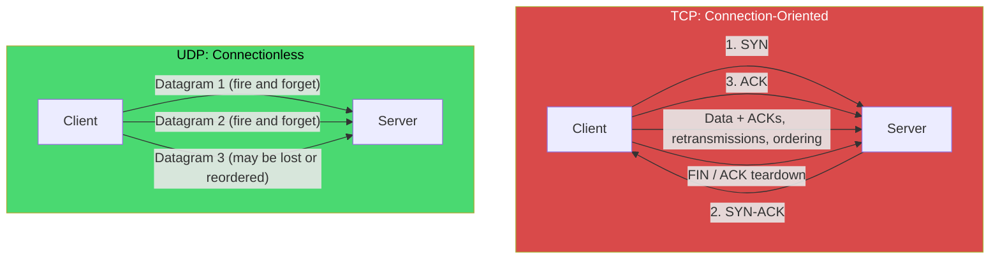
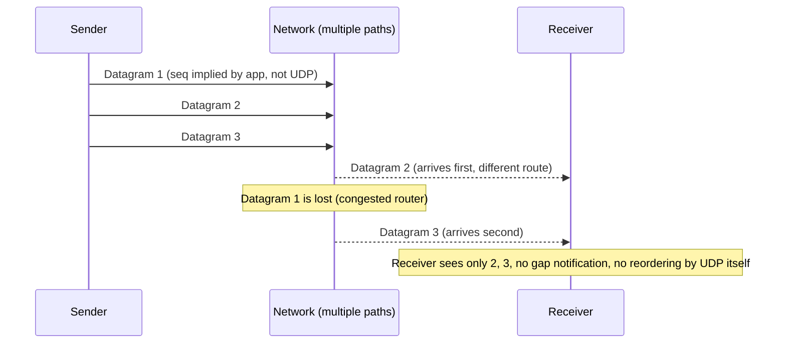
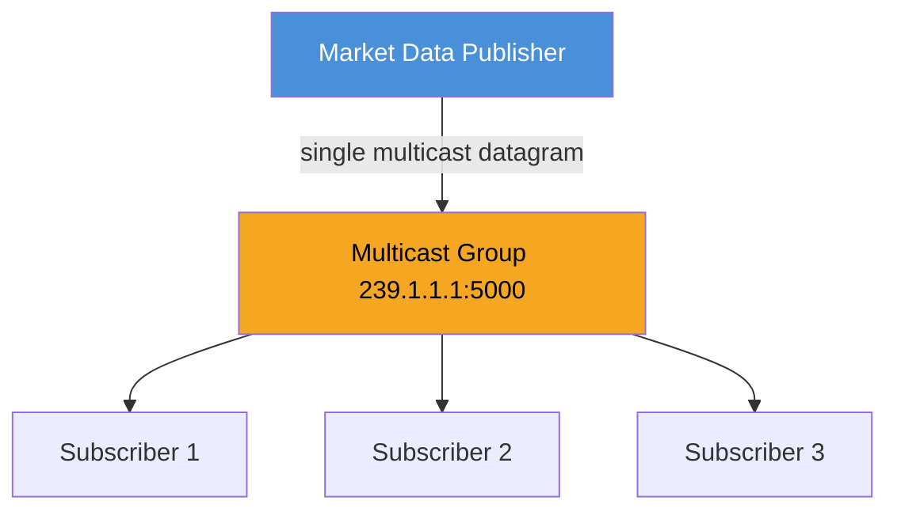
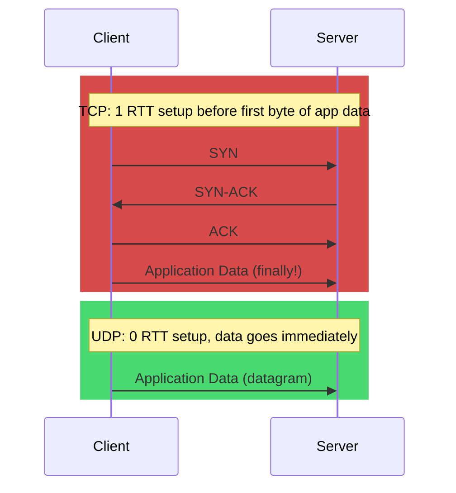
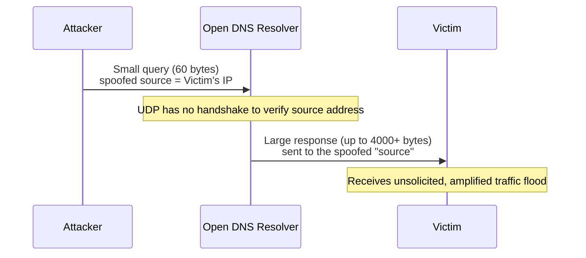
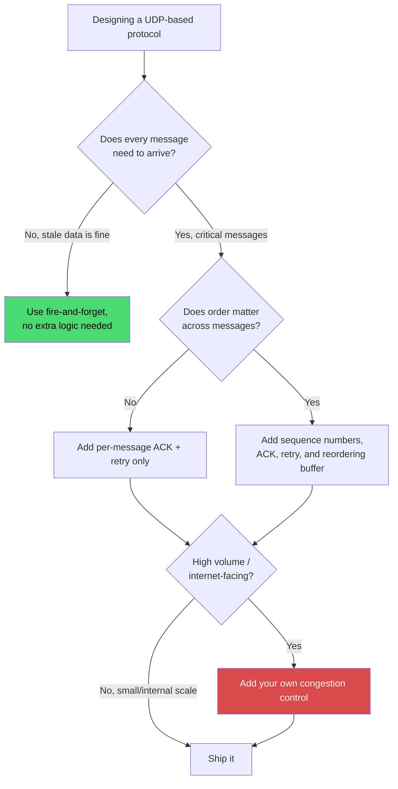
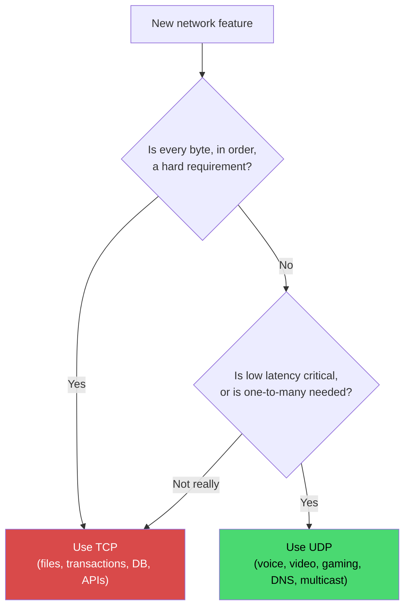
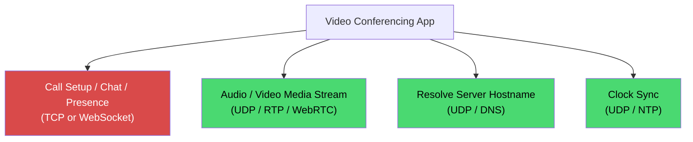

# UDP Protocol (User Datagram Protocol)

## Blogs and websites


## Medium


## Youtube


## Theory

> **Network Protocols** are rules and standards for network communication.
> **Layer Models:** OSI Model (7 layers) | TCP/IP Model (4 layers: Network Access, Internet, Transport, Application). UDP, like TCP, lives at the **Transport Layer**.

### Topics Covered

This page is organized into the following topics. Each topic includes a detailed explanation, its characteristics, components, patterns, pros/benefits, cons/challenges, best practices, when to use it, a real-life use case, a diagram, a Java code example, and interview questions with answers.

1. [Introduction: The Fire-and-Forget Protocol](#introduction-the-fire-and-forget-protocol)
2. [UDP Datagram Header Structure](#udp-datagram-header-structure)
3. [Characteristics of UDP](#characteristics-of-udp)
4. [Components of UDP Communication](#components-of-udp-communication)
5. [Common UDP Design Patterns](#common-udp-design-patterns)
6. [Pros and Benefits of UDP](#pros-and-benefits-of-udp)
7. [Cons and Challenges of UDP](#cons-and-challenges-of-udp)
8. [Best Practices for Using UDP](#best-practices-for-using-udp)
9. [When to Use UDP](#when-to-use-udp)
10. [Real-World Use Cases of UDP](#real-world-use-cases-of-udp)
11. [UDP vs TCP: The Trade-offs](#udp-vs-tcp-the-trade-offs)
12. [UDP Protocol: Characteristics, Pros, Cons, Use Cases, Components, Patterns, Benefits, Challenges, Best Practices and When to Use](#udp-protocol-characteristics-pros-cons-use-cases-components-patterns-benefits-challenges-best-practices-and-when-to-use)

### Introduction: The Fire-and-Forget Protocol

UDP (User Datagram Protocol), defined in **RFC 768** (1980), is the deliberately minimal counterpart to TCP. Where TCP spends effort proving every byte arrived, in order, exactly once, UDP does none of that. It takes a chunk of application data, wraps it in an 8-byte header, hands it to IP, and moves on. There is no connection setup, no acknowledgment, no retransmission, and no memory of what was sent before.

This is not a limitation that engineers tolerate, it is a **deliberate design choice**. Some problems are better solved by an unreliable, low-latency transport than by a reliable, higher-latency one:

- A video call frame that arrives 300ms late is worse than useless, retransmitting it only makes things worse. It is better to drop it and show the next frame.
- A DNS query is small enough that the cost of retrying the whole query (from the application layer) is cheaper than the cost of TCP's per-connection state on millions of resolvers.
- A multiplayer game only cares about the **most recent** position of a player. An old, retransmitted position update is actively wrong information.

**The Philosophy:**
UDP pushes the responsibility for reliability, ordering, and congestion control **up to the application**. This is sometimes summarized as the **end-to-end principle**: only the endpoints truly know what "correct" and "reliable enough" mean for their use case, so the network core (and the transport protocol) should stay simple, and any additional guarantees should be implemented where they are actually needed.

#### Diagram: UDP vs TCP Communication Model



The diagram highlights the core distinction: TCP invests multiple round trips in handshakes and bookkeeping so it can *guarantee* delivery and order, while UDP sends independent datagrams with no setup and no guarantee that any particular one arrives, or arrives in the order it was sent.

#### Real-Life Use Case: DNS Resolution

Every time a browser resolves `example.com` to an IP address, it typically sends a single UDP datagram (~40-60 bytes) to a DNS resolver and waits for a single UDP datagram back. Using TCP here would mean a 3-way handshake (1 RTT) before even sending the actual 60-byte query, more than doubling the latency for what is often the very first network operation of a page load. If the UDP response is lost, the resolver library simply retries the query after a short timeout, an application-level reliability mechanism that is far cheaper than maintaining a TCP connection per lookup across millions of clients.

#### Java Code: A Minimal UDP Echo (Client and Server)

```java
import java.net.DatagramPacket;
import java.net.DatagramSocket;
import java.net.InetAddress;

public class UdpEchoServer {
    public static void main(String[] args) throws Exception {
        try (DatagramSocket socket = new DatagramSocket(9876)) {
            byte[] buffer = new byte[1024];
            System.out.println("UDP echo server listening on port 9876");

            while (true) {
                // Block until a datagram arrives - no connection to accept, just packets.
                DatagramPacket request = new DatagramPacket(buffer, buffer.length);
                socket.receive(request);

                String message = new String(request.getData(), 0, request.getLength());
                System.out.println("Received: " + message);

                // Echo the same bytes back to the sender's address and port.
                byte[] responseData = message.getBytes();
                DatagramPacket response = new DatagramPacket(
                        responseData, responseData.length,
                        request.getAddress(), request.getPort());
                socket.send(response);
            }
        }
    }
}

class UdpEchoClient {
    public static void main(String[] args) throws Exception {
        try (DatagramSocket socket = new DatagramSocket()) {
            socket.setSoTimeout(2000); // application-level timeout, UDP has none built in

            byte[] messageData = "Hello over UDP".getBytes();
            InetAddress serverAddress = InetAddress.getByName("localhost");
            DatagramPacket request = new DatagramPacket(
                    messageData, messageData.length, serverAddress, 9876);
            socket.send(request);

            byte[] buffer = new byte[1024];
            DatagramPacket response = new DatagramPacket(buffer, buffer.length);
            try {
                socket.receive(response);
                System.out.println("Server replied: " +
                        new String(response.getData(), 0, response.getLength()));
            } catch (java.net.SocketTimeoutException e) {
                // Because UDP gives no delivery guarantee, the application must
                // implement its own timeout and retry logic if it needs one.
                System.out.println("No response received, datagram may have been lost");
            }
        }
    }
}
```

#### Interview Questions and Answers

**Q1: Why does UDP exist if TCP already provides reliable delivery?**
A: TCP's reliability mechanisms (handshakes, acknowledgments, retransmissions, congestion control) add latency and per-connection state. Some applications, real-time media, DNS, multicast, care more about low latency, low overhead, or delivering to many receivers at once, and can tolerate or better handle loss themselves. UDP exists to serve exactly those cases by giving applications a minimal transport with no built-in overhead, letting them add only the guarantees they actually need.

**Q2: Is UDP "less reliable" than TCP in an absolute sense, or just structured differently?**
A: UDP itself provides no reliability, but reliability can still be built on top of it at the application layer (as QUIC, TFTP, and custom game networking stacks do). So it is not that data over UDP is inherently more likely to be corrupted, both ride on the same unreliable IP layer, it is that UDP does not automatically detect and recover from loss/reordering the way TCP does. The application decides how much reliability it needs and implements exactly that, no more, no less.

**Q3: What happens if a UDP datagram is larger than the network's MTU?**
A: IP fragmentation kicks in, the datagram is split into multiple IP fragments and reassembled at the destination. If any single fragment is lost, the entire datagram is discarded (UDP has no partial-delivery concept). This is why performance-sensitive UDP applications (like QUIC or RTP-based media) try to keep datagrams under the path MTU (commonly ~1200-1400 bytes) to avoid fragmentation entirely.

### UDP Datagram Header Structure

Every UDP datagram carries a fixed **8-byte header**, far smaller than TCP's minimum 20 bytes, followed by the application data.

```
 0                   1                   2                   3
 0 1 2 3 4 5 6 7 8 9 0 1 2 3 4 5 6 7 8 9 0 1 2 3 4 5 6 7 8 9 0 1
+-+-+-+-+-+-+-+-+-+-+-+-+-+-+-+-+-+-+-+-+-+-+-+-+-+-+-+-+-+-+-+-+
|          Source Port          |       Destination Port        |
+-+-+-+-+-+-+-+-+-+-+-+-+-+-+-+-+-+-+-+-+-+-+-+-+-+-+-+-+-+-+-+-+
|             Length            |            Checksum           |
+-+-+-+-+-+-+-+-+-+-+-+-+-+-+-+-+-+-+-+-+-+-+-+-+-+-+-+-+-+-+-+-+
|                                                                |
|                       Application Data                       |
|                                                                |
+-+-+-+-+-+-+-+-+-+-+-+-+-+-+-+-+-+-+-+-+-+-+-+-+-+-+-+-+-+-+-+-+
```

**Key Fields:**
- **Source Port (16 bits)**: The sending application's port. Can be zero if no reply is expected.
- **Destination Port (16 bits)**: The port the receiving application is listening on, this is how the OS demultiplexes incoming datagrams to the correct process/socket.
- **Length (16 bits)**: Total length of the header plus data, in bytes. Limits a single UDP datagram to 65,507 bytes of payload over IPv4 (65,535 minus 8-byte UDP header minus 20-byte IP header).
- **Checksum (16 bits)**: An optional (in IPv4, mandatory in IPv6) checksum covering the header, data, and a pseudo-header derived from the IP addresses. It only detects corruption, it does not fix it, corrupted datagrams are simply dropped, not retransmitted by UDP itself.

**Why so small?** Every byte of header is overhead repeated on every single packet. For a protocol whose entire value proposition is "minimal overhead, low latency," an 8-byte fixed header (versus TCP's 20+ bytes with options) is a deliberate, meaningful saving, especially for tiny payloads like DNS queries or game state updates where the header can otherwise dominate the packet size.

### Characteristics of UDP

Each defining characteristic below is a direct consequence of UDP's "do less, guarantee less" design philosophy.

- **Connectionless (no handshake)**: There is no setup phase like TCP's SYN/SYN-ACK/ACK exchange. The very first datagram sent *is* the communication, there is no prior negotiation of sequence numbers, window sizes, or capabilities. This eliminates the 1 RTT (round-trip time) cost of connection establishment, which matters enormously for latency-sensitive, short-lived exchanges such as a single DNS query. The trade-off is that neither side inherently knows if the other is even listening until data actually flows (or fails to).

- **No guaranteed delivery ("fire and forget")**: Once a datagram is handed to the OS, UDP does not track whether it arrived. There is no acknowledgment, so the sender has no built-in way to know if a datagram was lost, delayed, or duplicated by the underlying network. If the application needs to know "did this arrive?", it must build its own acknowledgment scheme on top (as game engines and QUIC do), or it must decide it simply does not care (as with old sensor telemetry pings).

- **No ordering guarantees**: Because each datagram is routed independently by IP and UDP keeps no sequence numbers, datagrams sent in order 1, 2, 3 may arrive as 2, 1, 3, or 3 may never arrive at all. Applications that care about order (like a video stream that must play frames sequentially) must add their own sequence numbers and either reorder, interpolate, or simply discard out-of-order data.

- **Lower overhead than TCP**: The fixed 8-byte header, absence of acknowledgment packets, and absence of retransmitted data all add up to significantly less bytes-on-the-wire and CPU work per useful byte delivered, especially valuable for high-frequency small messages (game state ticks, metric samples, VoIP frames) where TCP's overhead (ACKs, headers, retransmission) can exceed the payload size itself.

- **No congestion control**: UDP does not slow down when the network is congested, it will keep sending datagrams at whatever rate the application chooses, unaware of collateral packet loss it might be causing to itself or to other flows sharing the same link. This is powerful for latency-critical traffic that would rather lose a packet than slow down, but it also means a poorly-behaved UDP application can be unfair to TCP flows sharing the same bottleneck link (part of why real-world UDP protocols like QUIC implement their *own* congestion control at the application layer).

- **Message-oriented, not stream-oriented**: TCP delivers an undifferentiated stream of bytes; UDP delivers discrete, self-contained datagrams. Each `send()` call on a socket corresponds to exactly one `receive()` call on the other end (message boundaries are preserved), which is a much more natural fit for protocols that are naturally transaction-like (one query, one response) rather than continuous byte streams.

- **Supports multicast and broadcast**: Unlike TCP, which is strictly point-to-point, UDP can be used to send a single datagram to multiple recipients at once (multicast to a group address, or broadcast to an entire subnet). This makes UDP the natural transport for one-to-many distribution such as service discovery, video conferencing fan-out at the network level, or stock-price ticks to many subscribers.

#### Diagram: Why Ordering and Delivery Are Not Guaranteed



#### Real-Life Use Case: Live Sports Streaming

A live sports broadcast sent over UDP-based streaming (e.g. RTP) will occasionally show a brief glitch or pixelation, that is a lost or corrupted datagram simply being skipped, rather than the stream freezing to wait for a retransmission the way a TCP-based download would stall. Viewers overwhelmingly prefer the brief glitch to a multi-second freeze, which is exactly the trade-off UDP's characteristics are optimized for.

#### Java Code: Observing Out-of-Order and Lost Datagrams

```java
import java.net.DatagramPacket;
import java.net.DatagramSocket;
import java.net.InetAddress;
import java.util.concurrent.ThreadLocalRandom;

public class UdpOutOfOrderDemo {
    public static void main(String[] args) throws Exception {
        try (DatagramSocket sender = new DatagramSocket();
             DatagramSocket receiver = new DatagramSocket(9877)) {

            InetAddress local = InetAddress.getByName("localhost");

            // Send 5 datagrams, each carrying its own application-level sequence number,
            // because UDP itself will not track or guarantee their order.
            for (int seq = 1; seq <= 5; seq++) {
                byte[] data = ("seq=" + seq).getBytes();
                sender.send(new DatagramPacket(data, data.length, local, 9877));
                // Simulate network jitter delaying some sends relative to others.
                Thread.sleep(ThreadLocalRandom.current().nextInt(0, 5));
            }

            byte[] buffer = new byte[64];
            for (int i = 0; i < 5; i++) {
                DatagramPacket packet = new DatagramPacket(buffer, buffer.length);
                receiver.receive(packet);
                // The application, not UDP, must parse and reason about "seq=" to detect gaps/reordering.
                System.out.println("Received: " + new String(packet.getData(), 0, packet.getLength()));
            }
        }
    }
}
```

#### Interview Questions and Answers

**Q1: If UDP has "no ordering," how do protocols like DNS work correctly with a single request/response?**
A: With exactly one datagram each way, there is nothing to reorder, ordering only becomes a concern when multiple datagrams belong to one logical exchange. DNS sidesteps the issue entirely by keeping each query/response as a single, independent datagram.

**Q2: Does "no congestion control" mean UDP can never be network-friendly?**
A: No. UDP itself provides no congestion control, but well-designed UDP-based protocols (like QUIC, or WebRTC's media transport) implement their own congestion control in the application/transport-shim layer, giving developers the flexibility to design congestion behavior suited to the traffic (e.g. reducing video bitrate instead of retransmitting), rather than being forced into TCP's generic algorithm.

**Q3: What is the practical maximum size for a UDP datagram, and why does it matter?**
A: In theory up to 65,507 bytes of payload over IPv4, but in practice applications keep datagrams under the network path's MTU (typically ~1500 bytes on Ethernet, often ~1200-1400 bytes to be safe across VPNs/tunnels) to avoid IP fragmentation, since losing a single fragment discards the whole datagram, one large lost fragment is worse than several small lost datagrams.

### Components of UDP Communication

- **Datagram**: The atomic unit of UDP communication, a self-contained packet with its own header and payload that is sent independently of any other datagram. There is no shared "connection object" holding state between datagrams, each one stands alone, which is what allows UDP sockets to talk to many different peers without per-peer connection setup.

- **Ports (source and destination)**: Just like TCP, UDP uses 16-bit port numbers so the OS can demultiplex incoming datagrams to the correct application/socket on a host. Well-known UDP ports include 53 (DNS), 67/68 (DHCP), 123 (NTP), and 500 (IKE/IPsec). Because UDP is connectionless, a single UDP socket bound to one port can receive datagrams from many different remote addresses.

- **Socket (DatagramSocket in Java)**: The application's handle to send and receive datagrams. Unlike a TCP `Socket`, a `DatagramSocket` is not tied to a single remote peer, `send()` and `receive()` each explicitly carry the remote address, so one socket can converse with an arbitrary number of peers.

- **Checksum**: A lightweight integrity check (computed over the UDP header, payload, and an IP pseudo-header) that lets the receiving stack detect corrupted datagrams and silently drop them. It only detects, never corrects. Checksums are optional in IPv4 (a value of zero means "not used") but mandatory in IPv6.

- **Application-layer reliability logic**: Since UDP does not provide acknowledgments, retransmission, or ordering, any application that needs these must implement them itself. Common building blocks include sequence numbers, application-level ACKs, timeouts and retries, jitter buffers (to reorder/smooth out arrival timing), and forward error correction (sending redundant data so the receiver can reconstruct a lost packet without needing a retransmission).

- **Multicast/broadcast group membership**: For one-to-many UDP, hosts join a multicast group (e.g. via IGMP for IPv4) or rely on subnet broadcast addresses. Routers and switches use this membership information to decide which network segments actually need a copy of each multicast datagram, rather than flooding it everywhere.

#### Diagram: UDP Component Interaction

```mermaid
graph LR
    App["Application"] -->|"send(data, destIP, destPort)"| Socket["DatagramSocket"]
    Socket --> UDPLayer["UDP Layer<br/>(adds src/dst port, length, checksum)"]
    UDPLayer --> IPLayer["IP Layer<br/>(adds source/dest IP, routing)"]
    IPLayer --> Network["Physical Network"]
    Network --> IPLayer2["IP Layer (receiver)"]
    IPLayer2 --> UDPLayer2["UDP Layer<br/>(checksum verify, port demux)"]
    UDPLayer2 --> Socket2["DatagramSocket (receiver)"]
    Socket2 --> App2["Application (receiver)"]

    style UDPLayer fill:#4a90d9,color:#fff
    style UDPLayer2 fill:#4a90d9,color:#fff
```



#### Real-Life Use Case: NTP (Network Time Protocol)

NTP uses UDP port 123 to synchronize clocks across the internet. Each request/response pair is a single small datagram, timestamped on both send and receive. Because clock sync needs to be fast and lightweight (run periodically on millions of devices) and an occasional lost or duplicate sync attempt is harmless (the client just tries again on its next interval), UDP's minimal-component model, one datagram out, one datagram back, no persistent connection, is a perfect fit.

#### Java Code: Demultiplexing by Port with Multiple Sockets

```java
import java.net.DatagramPacket;
import java.net.DatagramSocket;

public class UdpPortDemuxDemo {
    public static void main(String[] args) throws Exception {
        // Two independent sockets on two different ports, each is its own
        // "component" the OS uses to route incoming datagrams to the right listener.
        try (DatagramSocket metricsSocket = new DatagramSocket(9001);
             DatagramSocket alertsSocket = new DatagramSocket(9002)) {

            Thread metricsListener = new Thread(() -> listen(metricsSocket, "METRICS"));
            Thread alertsListener = new Thread(() -> listen(alertsSocket, "ALERTS"));
            metricsListener.start();
            alertsListener.start();
            metricsListener.join();
            alertsListener.join();
        }
    }

    private static void listen(DatagramSocket socket, String label) {
        byte[] buffer = new byte[512];
        try {
            DatagramPacket packet = new DatagramPacket(buffer, buffer.length);
            socket.receive(packet); // Each socket only ever sees datagrams sent to its own port.
            System.out.println("[" + label + "] " + new String(packet.getData(), 0, packet.getLength()));
        } catch (Exception e) {
            System.out.println("[" + label + "] no datagram received: " + e.getMessage());
        }
    }
}
```

#### Interview Questions and Answers

**Q1: Why doesn't UDP need a "connection" component the way TCP does?**
A: TCP's connection object exists to hold shared state, sequence numbers, window sizes, timers, that both sides must agree on to guarantee reliable, ordered delivery. Since UDP guarantees none of that, there is nothing to keep in sync between sender and receiver, so no persistent connection object is required, each datagram is self-sufficient.

**Q2: How does the OS know which application should receive a given UDP datagram?**
A: Via the destination port number in the UDP header. The OS's networking stack maintains a table mapping locally bound ports to open `DatagramSocket` (or raw socket) handles, and delivers each incoming datagram to the socket bound to its destination port (and address, if the socket is connected to a specific peer).

**Q3: Can a single UDP socket communicate with multiple different remote hosts?**
A: Yes. Because UDP is connectionless, one bound `DatagramSocket` can send to, and receive from, any number of different remote IP/port pairs, each `send()`/`receive()` call carries the specific peer address, unlike a TCP `Socket` which is permanently associated with exactly one peer for its lifetime.

### Common UDP Design Patterns

- **Request-Response (simple query/answer)**: The client sends one datagram and waits, with an application-level timeout, for one datagram back. If no response arrives in time, the client simply resends the request. This is the pattern used by DNS and NTP: stateless, simple, and cheap to scale on the server because there is no per-client connection to hold open.

- **Fire-and-Forget (one-way telemetry)**: The sender pushes data (metrics, logs, sensor readings) without expecting or waiting for any response at all. If a datagram is lost, the next one simply supersedes it. This pattern favors throughput and simplicity over completeness, common in high-volume monitoring pipelines (e.g. StatsD-style metrics) where losing an occasional sample is an acceptable trade for never blocking the sender.

- **Publish-Subscribe via Multicast/Broadcast**: A single sender transmits one datagram that is delivered to many receivers simultaneously (IP multicast group, or a subnet broadcast), rather than the sender having to open and maintain a separate TCP connection per subscriber. This scales far better for one-to-many distribution, such as market-data ticks or service discovery announcements, because the network (not the application) handles the fan-out.

- **Custom Reliability Layer on Top of UDP**: When an application needs some, but not all, of TCP's guarantees, it implements just enough of them itself: application-defined sequence numbers, selective acknowledgments, retransmission of only the packets that matter, and its own congestion/flow control tuned to the traffic. QUIC (which underlies HTTP/3) and most competitive multiplayer game engines follow this pattern, they get to choose exactly which guarantees to pay for, rather than inheriting all of TCP's guarantees (and all of its overhead) as a package deal.

- **Heartbeat / Keep-Alive Pattern**: Because UDP has no connection state, peers that need to know "is the other side still alive" send small periodic datagrams (heartbeats) and consider the peer disconnected only after several are missed in a row. This is common in real-time multiplayer games and VoIP clients to detect a dropped peer without relying on any transport-level connection teardown signal (since UDP has none).

- **Jitter Buffering for Streaming Media**: Real-time audio/video receivers intentionally buffer a small window (tens of milliseconds) of incoming UDP packets before playback, using timestamps in the payload to reorder slightly out-of-order packets and smooth out variable network delay ("jitter"), while dropping packets that arrive too late to be useful. This pattern accepts UDP's lack of ordering/delivery guarantees and compensates for them only to the extent the application's latency budget allows.

#### Diagram: Publish-Subscribe via UDP Multicast



#### Real-Life Use Case: Multiplayer Game State Synchronization

Competitive online games (e.g. first-person shooters) send player position/action updates dozens of times per second over UDP, using the custom-reliability-layer pattern: each update carries a sequence number, the receiver only cares about the *latest* one (an older, delayed update is discarded, not queued), and only a small subset of "important" events (like a kill confirmation) get an explicit application-level acknowledgment and retry, everything else follows the fire-and-forget pattern because a missed movement update is instantly superseded by the next one.

#### Java Code: Simple Application-Level Reliability Pattern (ACK + Retry)

```java
import java.net.DatagramPacket;
import java.net.DatagramSocket;
import java.net.InetAddress;
import java.net.SocketTimeoutException;

public class UdpReliableSendPattern {

    // Sends a datagram and retries with a timeout until an ACK is received or attempts run out.
    static boolean sendReliably(DatagramSocket socket, byte[] data, InetAddress addr, int port,
                                int maxAttempts, int timeoutMs) throws Exception {
        socket.setSoTimeout(timeoutMs);
        byte[] ackBuffer = new byte[16];

        for (int attempt = 1; attempt <= maxAttempts; attempt++) {
            socket.send(new DatagramPacket(data, data.length, addr, port));
            try {
                DatagramPacket ack = new DatagramPacket(ackBuffer, ackBuffer.length);
                socket.receive(ack); // Waits up to timeoutMs for an application-level ACK.
                String reply = new String(ack.getData(), 0, ack.getLength());
                if ("ACK".equals(reply)) {
                    return true; // Delivery confirmed by the application protocol, not by UDP itself.
                }
            } catch (SocketTimeoutException e) {
                System.out.println("Attempt " + attempt + " timed out, retrying...");
            }
        }
        return false; // Gave up after maxAttempts, caller decides what "giving up" means.
    }
}
```

#### Interview Questions and Answers

**Q1: Why would a game engine build its own reliability layer instead of just using TCP?**
A: TCP guarantees strict in-order delivery of every byte, which causes head-of-line blocking: a single lost packet stalls delivery of everything sent after it until the retransmission arrives. For a game, most state updates are only useful if they are the freshest data available, an old, delayed position update is worse than no update. A custom layer over UDP lets the game selectively acknowledge and retry only the handful of messages (like "player fired weapon") that truly must not be lost, while letting stale position updates be silently superseded.

**Q2: What problem does multicast solve that a request-response pattern cannot solve efficiently?**
A: One-to-many distribution. With request-response (or any point-to-point transport like TCP), the sender must open a separate connection and transmit the data once per receiver, cost scales linearly with subscriber count. With multicast, the sender transmits the datagram once, and network devices replicate it only to segments that have interested subscribers, so cost is largely independent of subscriber count.

**Q3: Is jitter buffering a UDP feature, or something applications add?**
A: It is entirely an application/library responsibility. UDP delivers packets whenever they arrive, in whatever order, with no smoothing. Real-time media stacks (e.g. WebRTC) add a jitter buffer on the receiving side purely in application logic, to trade a small amount of extra latency for smoother, more consistently-timed playback.

### Pros and Benefits of UDP

- **Lower latency**: With no handshake and no waiting for acknowledgments before the "next" logical unit of data can be considered sent, UDP delivers data with the minimum latency the network path allows. This is the single biggest reason real-time applications choose it, every extra round trip TCP spends on setup or retransmission is round-trip time UDP does not spend.

- **Lower overhead per packet**: An 8-byte header (versus TCP's 20+ bytes), no acknowledgment packets flowing back for every segment, and no retransmitted duplicate data all reduce the total bytes moved across the network for a given amount of useful payload, important both for network cost and for CPU time spent processing packets on both ends.

- **Simplicity of implementation**: Without connection state machines, sequence number tracking, retransmission timers, or congestion control algorithms to implement, a minimal UDP sender/receiver can be written in a few dozen lines of code. This simplicity also means fewer edge cases and less can go wrong in the transport layer itself.

- **Natural fit for one-to-many communication**: UDP supports multicast and broadcast, letting a single transmission reach many receivers without the sender managing a connection per recipient, something TCP structurally cannot do since every TCP connection is strictly one-to-one.

- **No head-of-line blocking**: Because datagrams are independent, one lost or delayed datagram never blocks the delivery of subsequent, unrelated datagrams to the application (unlike TCP, where a single lost segment stalls the entire in-order byte stream until it is retransmitted). This matters enormously for applications where "newer is better than older," like live video.

- **Scales well for stateless, high-volume, small-message workloads**: Because there is no per-client connection to hold open, a UDP-based server (like a DNS resolver) can serve enormously more concurrent clients from a single socket than a TCP server could, since there is no per-connection kernel buffer/state to maintain between requests.

- **Gives applications full control over reliability trade-offs**: Rather than forcing every byte to be reliable and in-order, UDP lets the application decide, per message, whether it is worth retrying, reordering, or simply discarding, enabling far more nuanced and efficient reliability strategies tailored to the actual data (e.g. "retry critical events, drop stale position updates").

#### Diagram: Latency Comparison, TCP Handshake vs UDP



#### Real-Life Use Case: Voice over IP (VoIP)

VoIP calls are extremely latency-sensitive; humans notice audio delay above roughly 150ms as awkward, unnatural conversation. VoIP protocols (e.g. RTP over UDP) accept that some audio packets will be lost, and rely on codecs that can conceal small gaps (packet loss concealment) rather than retransmitting missed audio, since a retransmitted, late audio packet is useless once its moment in the conversation has passed. UDP's low-latency, no-retransmission behavior is precisely what makes real-time voice communication feel natural.

#### Java Code: Measuring Round-Trip Latency Savings

```java
import java.net.DatagramPacket;
import java.net.DatagramSocket;
import java.net.InetAddress;

public class UdpLatencyDemo {
    public static void main(String[] args) throws Exception {
        try (DatagramSocket socket = new DatagramSocket()) {
            InetAddress addr = InetAddress.getByName("localhost");
            byte[] ping = "ping".getBytes();

            long start = System.nanoTime();
            // A single send with no prior handshake, latency is just one network trip, not three.
            socket.send(new DatagramPacket(ping, ping.length, addr, 9999));
            long elapsedMicros = (System.nanoTime() - start) / 1000;

            System.out.println("Datagram dispatched with zero connection setup overhead in "
                    + elapsedMicros + " microseconds (application-level send time only)");
        }
    }
}
```

#### Interview Questions and Answers

**Q1: What is the single biggest benefit UDP offers over TCP, and why?**
A: Lower latency, primarily from eliminating connection setup (no 3-way handshake) and from never blocking delivery of new data behind retransmission of old, lost data. For real-time interactive applications (voice, video, gaming), that latency reduction directly determines whether the experience feels responsive or laggy.

**Q2: How does UDP's lack of overhead translate into a concrete cost saving at scale?**
A: At high message rates (e.g. millions of small metric/telemetry packets per second), TCP's per-segment ACKs and larger headers add meaningfully more bytes transmitted and more CPU cycles spent managing connection state, than the equivalent UDP traffic. For a large fleet emitting small, frequent messages, this reduces both network bandwidth cost and server-side CPU/memory needed to track connections.

**Q3: Why is "no head-of-line blocking" specifically valuable for video streaming?**
A: In a live video stream, a lost packet only affects a small portion of a single frame at worst, and the receiver can simply skip or conceal it and continue playing subsequent, newer frames. With TCP, that same lost packet would stall the entire stream until retransmitted and received in order, potentially causing a much more noticeable and disruptive freeze.

### Cons and Challenges of UDP

- **No delivery guarantee**: Datagrams can silently vanish, dropped by a congested router, discarded due to a checksum failure, or lost to a flaky link, and neither sender nor receiver is automatically informed. Any application that cares whether its data actually arrived must build detection and recovery (acknowledgments, retries) itself, adding real design and testing complexity.

- **No ordering guarantee**: Datagrams can arrive in a different order than they were sent, since each is routed independently and may take a different path. Applications that need ordered data (e.g. a file transfer or ordered event log) must implement sequence numbering and reordering logic themselves, essentially reinventing part of what TCP already provides for free.

- **No built-in congestion control**: A UDP sender that blasts data as fast as it can may worsen congestion on a shared link, hurting itself (more packet loss) and other flows (including well-behaved TCP flows that back off while the UDP flow does not). This "unfairness" is a real operational risk and is why RFC 8085 (UDP Usage Guidelines) strongly recommends implementing congestion control in any UDP-based protocol intended for wide internet deployment.

- **No flow control**: There is no mechanism to prevent a fast sender from overwhelming a slow receiver's buffer. If the receiving application (or the OS's receive buffer) cannot keep up, excess datagrams are simply dropped, again silently, unless the application adds its own back-pressure signaling.

- **Susceptible to spoofing and amplification attacks**: Because UDP is connectionless, there is no handshake to verify that the claimed source address of a datagram is genuine, making UDP-based protocols a favorite vector for IP-spoofed traffic and for DNS/NTP-style **amplification DDoS attacks** (a small spoofed request triggers a much larger response sent to the victim's spoofed address). Defending against this requires measures like ingress/egress filtering, rate limiting, and protocol-level response-size limits.

- **More application complexity when reliability is needed**: Any application-level guarantee, ordering, retries, congestion control, effectively means re-implementing a subset of what TCP already solved, correctly handling edge cases like duplicate detection, timeout tuning, and fairness is genuinely hard, which is why protocols like QUIC represent years of engineering effort even though they are "built on UDP."

- **Harder to reason about and debug**: Because there is no persistent connection object, tools and mental models built around "the TCP connection between A and B" do not directly apply, engineers must reconstruct logical sessions from a sequence of independent datagrams, which complicates monitoring, tracing, and troubleshooting.

- **No congestion collapse protection at internet scale**: If large volumes of unmanaged UDP traffic were to become common without any congestion control, the shared internet infrastructure itself could suffer congestion collapse (a scenario TCP's congestion control was specifically designed to prevent). This is a systemic concern, not just a per-application one, hence RFC guidance pushing UDP protocol designers toward implementing their own fairness-aware congestion control.

#### Diagram: Amplification Attack Using a Spoofed UDP Source



#### Real-Life Use Case: DNS Amplification DDoS Attacks

Attackers have historically abused open DNS resolvers by sending small UDP queries with a spoofed source IP address matching a victim's server. Because UDP performs no handshake to validate that the claimed sender actually requested anything, the resolver sends its (much larger) response directly to the victim, achieving significant traffic amplification (often 50x or more) from a small amount of attacker-controlled bandwidth. This class of attack directly stems from UDP's connectionless, no-verification design, and defenses (response rate limiting, DNS Cookie, BCP38 source-address filtering) exist specifically to mitigate it.

#### Java Code: Handling Silent Packet Loss with a Timeout

```java
import java.net.DatagramPacket;
import java.net.DatagramSocket;
import java.net.SocketTimeoutException;

public class UdpLossHandlingDemo {
    public static void main(String[] args) throws Exception {
        try (DatagramSocket socket = new DatagramSocket(9999)) {
            // Without an application-level timeout, a lost datagram would cause
            // receive() to block forever, since UDP never signals "this was lost".
            socket.setSoTimeout(1500);
            byte[] buffer = new byte[512];

            try {
                DatagramPacket packet = new DatagramPacket(buffer, buffer.length);
                socket.receive(packet);
                System.out.println("Received: " + new String(packet.getData(), 0, packet.getLength()));
            } catch (SocketTimeoutException e) {
                // The application must infer loss from silence, UDP gives no explicit notification.
                System.out.println("No datagram arrived in time, assuming it was lost");
            }
        }
    }
}
```

#### Interview Questions and Answers

**Q1: Why is UDP considered a popular vector for DDoS amplification attacks specifically?**
A: Because UDP has no handshake, there is no step where the destination confirms it actually sent the request that produced a large response. Attackers exploit this by spoofing a victim's IP address as the source of small requests to services like DNS or NTP, causing much larger unsolicited responses to flood the victim, something TCP's 3-way handshake makes far harder because the attacker would need to complete a handshake using the victim's address, which requires seeing the SYN-ACK, that they generally cannot.

**Q2: If an engineer needs ordering and reliability but also wants low latency, what is the real cost of building this on UDP versus just using TCP?**
A: The cost is genuine engineering effort: implementing sequence numbers, selective acknowledgment, retransmission timers, congestion control, and handling duplicate/out-of-order edge cases correctly. It can pay off when the application needs *different* trade-offs than TCP provides (e.g. selective reliability instead of total ordering, as QUIC/HTTP/3 do to avoid head-of-line blocking across independent streams), but for applications that just want "reliable and ordered," reusing TCP is almost always simpler and less error-prone.

**Q3: What is the difference between "no flow control" and "no congestion control" in UDP, and why do both matter?**
A: Flow control protects the *receiver* (preventing a fast sender from overwhelming a slow receiver's buffer); congestion control protects the *network* (preventing senders from overwhelming shared links). UDP has neither built in, so a fast UDP sender can both overrun a slow receiver's buffer (causing local packet drops) and contribute to network-wide congestion (causing drops for itself and other flows), unless the application explicitly adds mechanisms addressing each concern separately.

### Best Practices for Using UDP

- **Keep datagrams under the path MTU**: Design payloads to fit within roughly 1200-1400 bytes (safely under the common 1500-byte Ethernet MTU, accounting for tunneling/VPN overhead) to avoid IP fragmentation, since losing a single fragment discards the entire datagram, negating any latency benefit UDP was chosen for.

- **Always implement application-level timeouts**: Never assume a response will arrive. Every UDP request/response exchange should have an explicit timeout after which the application decides to retry, give up, or take a fallback action, since UDP itself will never signal that a response is not coming.

- **Add sequence numbers if order or duplicate detection matters**: If the application logic depends on knowing "is this newer than what I already have" or "have I already processed this," embed a monotonically increasing sequence number (or timestamp) in the payload, since UDP provides neither ordering nor de-duplication itself.

- **Implement your own congestion control for high-volume or internet-facing UDP traffic**: Per RFC 8085 guidance, any UDP-based protocol expected to carry meaningful traffic volumes over the general internet should back off its sending rate under loss, similarly in spirit to TCP's congestion avoidance, to remain network-friendly and avoid worsening congestion for itself and others.

- **Validate and rate-limit inputs to prevent amplification abuse**: If running a UDP server that could be abused for reflection/amplification (like a DNS or NTP-style responder), enforce response-size limits relative to request size, apply rate limiting per source, and avoid trusting the claimed source address at face value for any privileged action.

- **Use checksums and, where relevant, add application-layer integrity/authentication**: Rely on the UDP/IP checksum for basic corruption detection, but for security-sensitive data, add cryptographic integrity and authentication (e.g. via DTLS, the UDP equivalent of TLS) since the UDP checksum is not designed to resist malicious tampering.

- **Choose the right pattern for the workload**: Use simple request-response with retries for stateless queries (DNS-like), fire-and-forget for high-volume telemetry where occasional loss is acceptable, multicast for genuine one-to-many fan-out, and a custom reliability layer only for the specific subset of messages that truly need it, do not build a full reliable layer if the workload does not need it.

- **Monitor loss and jitter, not just throughput**: Because UDP hides delivery problems from the transport layer, application-level metrics (datagram loss rate, out-of-order rate, jitter) are essential to detect degraded network conditions that would otherwise go unnoticed until users complain.

#### Diagram: Decision Flow for Adding Reliability on Top of UDP



#### Real-Life Use Case: QUIC / HTTP/3

QUIC is the textbook example of "best practices for UDP" applied at scale: it runs over UDP but layers in its own connection identifiers, per-stream sequence numbers, selective acknowledgment, encryption (mandatory, unlike plain UDP), and its own congestion control (based on TCP-proven algorithms like CUBIC or BBR). Browsers and CDNs adopted it precisely because it lets them fix TCP's head-of-line blocking problem while still being a responsible, congestion-aware citizen of the shared internet, exactly the balance the best practices above describe.

#### Java Code: Applying Sequence Numbers and a Retry Loop Together

```java
import java.net.DatagramPacket;
import java.net.DatagramSocket;
import java.net.InetAddress;
import java.nio.ByteBuffer;

public class UdpBestPracticeSender {
    public static void main(String[] args) throws Exception {
        try (DatagramSocket socket = new DatagramSocket()) {
            socket.setSoTimeout(1000); // Never wait forever for a response.
            InetAddress addr = InetAddress.getByName("localhost");

            int sequence = 1;
            String payload = "sensor-reading:22.5C";
            byte[] payloadBytes = payload.getBytes();

            // Prefix every datagram with a sequence number so the receiver can
            // detect duplicates or gaps, since UDP itself provides neither.
            ByteBuffer buffer = ByteBuffer.allocate(4 + payloadBytes.length);
            buffer.putInt(sequence);
            buffer.put(payloadBytes);
            byte[] data = buffer.array();

            for (int attempt = 1; attempt <= 3; attempt++) {
                socket.send(new DatagramPacket(data, data.length, addr, 8000));
                try {
                    byte[] ackBuf = new byte[4];
                    socket.receive(new DatagramPacket(ackBuf, ackBuf.length));
                    System.out.println("Delivery confirmed on attempt " + attempt);
                    break;
                } catch (java.net.SocketTimeoutException e) {
                    System.out.println("No ACK for seq=" + sequence + ", retrying (" + attempt + "/3)");
                }
            }
        }
    }
}
```

#### Interview Questions and Answers

**Q1: Why is "keep datagrams under the MTU" considered a best practice rather than an optimization detail?**
A: Because IP fragmentation turns one lost fragment into a lost entire datagram, undermining UDP's low-latency value proposition (the receiver waits, then discovers the whole message is gone) and adding reassembly overhead on routers/hosts. Staying under the MTU avoids fragmentation entirely, keeping loss failures isolated to single, small datagrams instead of larger multi-fragment messages.

**Q2: Why should UDP protocols implement their own congestion control instead of just sending as fast as possible?**
A: Because UDP has none built in, an unconstrained sender can worsen congestion for itself and unfairly starve other flows, including well-behaved TCP connections, sharing the same bottleneck link. RFC 8085 recommends UDP applications behave in a TCP-friendly manner (backing off under loss) specifically to avoid this kind of network harm at scale.

**Q3: Why does QUIC choose to build on top of UDP instead of extending TCP directly?**
A: TCP's ordering and congestion control live in the OS kernel and are extremely difficult to change or deploy new features for across the entire internet's middleboxes and OS versions. UDP is minimal enough, and widely enough supported unmodified by existing network equipment, that QUIC can implement its own connection semantics, multiplexed streams, and congestion control entirely in user-space, evolving independently of the OS kernel and avoiding TCP's head-of-line blocking limitation.

### When to Use UDP

- **When "newer beats older" is the correct behavior**: If a stale piece of data is worthless or actively wrong once superseded (live video frames, player positions, sensor readings), UDP's fire-and-forget model is a better match than TCP's insistence on delivering every byte in order, since retransmitting old data just delays delivery of the fresher data that actually matters.

- **When latency is more important than completeness**: Real-time voice/video/gaming applications would rather lose a small amount of data than wait for it, a human ear or eye can tolerate a brief gap far better than it can tolerate noticeable lag or stutter, making UDP's zero-setup, no-retransmission behavior the right trade-off.

- **When the exchange is small and short-lived**: For a single query/response (DNS, NTP, simple RPC-style pings), the 1 RTT cost of a TCP handshake can be a large fraction, sometimes the majority, of the total exchange time. UDP with a simple retry-on-timeout mechanism achieves the same result with less overhead and lower latency.

- **When you need one-to-many delivery**: If the same data must reach many receivers simultaneously (service discovery, market data feeds, video conferencing infrastructure), UDP's support for multicast/broadcast is the only transport-layer option, TCP structurally cannot multicast since every connection is one-to-one.

- **When you are building (or already using) a protocol with its own reliability layer**: If the application needs a different reliability/ordering model than TCP's "everything reliable, everything ordered" (e.g. per-stream reliability without cross-stream head-of-line blocking, as in QUIC/HTTP/3), building that custom layer on top of UDP gives full control that TCP cannot offer since TCP's guarantees are fixed and non-negotiable.

- **When operating in constrained or high-scale environments**: IoT sensors sending periodic readings, or servers needing to serve millions of stateless small requests, benefit from UDP's lack of per-connection state, dramatically reducing memory and CPU overhead compared to maintaining millions of concurrent TCP connections.

- **When NOT to use UDP**: Avoid UDP (or budget significant effort to reimplement TCP-like guarantees) for file transfers, financial transactions, database connections, or any workload where every byte, in order, without loss, is a hard requirement and where the added engineering complexity of a custom reliability layer is not justified by a genuine latency or scale need. In these cases, TCP already solves the problem correctly and is far less error-prone to rely on.

#### Diagram: Choosing Between UDP and TCP



#### Real-Life Use Case: Online Multiplayer Racing Game

A racing game sends the position, speed, and steering angle of every car roughly 20-60 times per second. Choosing UDP here is correct because: the exchange is small and frequent (favoring low overhead), a missed update is instantly superseded by the next one only tens of milliseconds later (favoring "newer beats older"), and latency is critical for fair, responsive gameplay (a delayed update actively harms the experience). Choosing TCP would introduce retransmission-induced lag spikes exactly when the network hiccups, the worst possible moment for a competitive racing game.

#### Java Code: Choosing Protocol Based on Requirements (Illustrative)

```java
import java.net.DatagramSocket;
import java.net.Socket;

public class ProtocolChoiceDemo {

    // Illustrates the decision in code: does this exchange need TCP's
    // guarantees, or can it tolerate UDP's lack of them for lower latency?
    static AutoCloseable openTransportFor(String workloadType, String host, int port) throws Exception {
        return switch (workloadType) {
            case "file-transfer", "financial-transaction", "database" ->
                    new Socket(host, port); // Needs reliability and ordering: use TCP.
            case "voice-call", "multiplayer-game-state", "dns-query" ->
                    new DatagramSocket(); // Latency-critical, tolerates loss: use UDP.
            default -> throw new IllegalArgumentException("Unclassified workload: " + workloadType);
        };
    }
}
```

#### Interview Questions and Answers

**Q1: A candidate says "always use UDP for real-time apps and TCP for everything else." Is that accurate?**
A: It is a reasonable starting heuristic but oversimplified. Some "real-time" needs (e.g. financial trading order submission) require guaranteed, ordered delivery despite being latency-sensitive, and would still use TCP (or a custom reliable protocol) rather than plain UDP. Conversely, some non-real-time protocols use UDP anyway for its low per-message overhead (DNS). The right question is always: "what specific guarantees does this workload need, and at what cost?"

**Q2: Why might a system use both TCP and UDP for the same overall application?**
A: Different parts of an application often have different guarantee needs. A video conferencing app typically uses TCP (or WebSocket over TCP) for signaling/chat, where correctness matters more than latency, and UDP for the actual audio/video media stream, where latency matters more than occasional loss. Splitting by requirement rather than picking one protocol for the whole application gets the best trade-off for each part.

**Q3: When would you choose UDP even though the data is important and loss would be a real problem?**
A: When you need a reliability model that TCP cannot provide, e.g. multiplexed independent streams where one stream's loss should not stall other streams (TCP's single ordered byte stream cannot do this; QUIC's multiple UDP-based streams can), or when you need multicast delivery to many receivers, which TCP structurally cannot support at all. In these cases you build the necessary reliability yourself on top of UDP rather than accepting TCP's all-or-nothing ordering model.

### Real-World Use Cases of UDP

- **Video Streaming (live and low-latency)**: Live streams (sports, video calls, IPTV) use UDP-based protocols (RTP, or QUIC-based transports) so a lost or corrupted frame is simply skipped or concealed instead of stalling playback while waiting for a retransmission. On-demand video (e.g. Netflix-style VOD), by contrast, often runs over TCP/HTTP since it is buffered ahead of time and correctness matters more than the extra buffering latency, showing that "streaming" alone does not automatically mean UDP, the live/interactive requirement is what tips the decision.

- **Online Gaming**: Multiplayer games send frequent, small state updates (player position, actions) where an old, delayed update is worse than no update. UDP lets the game engine implement exactly the reliability it needs (e.g. guaranteed delivery only for critical hit/kill events, best-effort for continuous position updates), minimizing input lag which directly affects competitive fairness and player experience.

- **DNS Queries**: The vast majority of DNS lookups are single request/response exchanges of a few dozen to a few hundred bytes. UDP avoids the 1 RTT connection setup cost of TCP for what is often the first network operation before any other traffic can even begin, and the resolver library's simple retry-on-timeout behavior is sufficient reliability for this workload. (DNS does fall back to TCP for large responses, like zone transfers or DNSSEC-heavy answers, that exceed UDP's practical size limits.)

- **VoIP (Voice over IP)**: Real-time voice traffic (RTP over UDP) tolerates small amounts of packet loss via codec-level concealment far better than it tolerates the latency spikes retransmission would introduce. A "gap" of a few milliseconds in audio is far less disruptive to a conversation than the call visibly stuttering while waiting for TCP to catch up.

- **IoT Sensors and Telemetry**: Battery- and bandwidth-constrained devices sending periodic readings (temperature, humidity, GPS pings) benefit from UDP's minimal header overhead and lack of connection state, both of which translate directly into lower power consumption and lower data costs, especially over constrained networks like LPWAN, where an occasional lost reading is inconsequential since the next reading arrives shortly after.

- **DHCP (Dynamic Host Configuration Protocol)**: A device requesting a network address does not yet have a fully configured network stack (and may not even have an IP address yet), making UDP's connectionless, broadcast-capable nature essential, the request is literally broadcast to the whole subnet since the client does not know the server's address in advance.

- **Network Time Protocol (NTP)**: Precise, frequent clock synchronization across the internet needs a lightweight, low-latency exchange; an occasional lost sync attempt simply gets retried on the next interval, an acceptable trade for the low overhead needed to synchronize enormous numbers of devices.

#### Diagram: A Modern Application Mixing UDP and TCP by Use Case



#### Real-Life Use Case: A Complete Video Call

Opening a video call touches nearly every UDP use case at once: the client resolves the calling service's hostname via **DNS** (UDP), synchronizes its clock via **NTP** (UDP) so timestamps line up correctly, negotiates the call over a signaling channel (often TCP/WebSocket for reliability of control messages), and then streams audio/video over **RTP/WebRTC** (UDP) for the actual real-time media, with a jitter buffer smoothing out arrival timing and codec-level concealment handling any lost packets.

#### Java Code: A Minimal Telemetry Sender (IoT-style Fire-and-Forget)

```java
import java.net.DatagramPacket;
import java.net.DatagramSocket;
import java.net.InetAddress;

public class IotTelemetrySender {
    public static void main(String[] args) throws Exception {
        try (DatagramSocket socket = new DatagramSocket()) {
            InetAddress collector = InetAddress.getByName("telemetry.example.com");

            for (int i = 0; i < 5; i++) {
                double temperatureC = 20 + Math.random() * 5;
                String reading = String.format("device=sensor-42;tempC=%.1f", temperatureC);
                byte[] data = reading.getBytes();

                // No handshake, no ACK expected, the next reading in a few seconds
                // will make this one obsolete anyway, so loss is an acceptable cost.
                socket.send(new DatagramPacket(data, data.length, collector, 5683));
                Thread.sleep(1000);
            }
        }
    }
}
```

#### Interview Questions and Answers

**Q1: Why does DNS use UDP, and under what circumstances does it use TCP instead?**
A: UDP for the common case: small queries/responses where minimizing latency (no handshake) matters, especially since DNS resolution often precedes all other network activity for a request. DNS falls back to TCP when the response would exceed UDP's practical size (large records, DNSSEC signatures, zone transfers between name servers), since TCP handles arbitrarily large, reliable transfers correctly where a single large UDP datagram risks fragmentation and loss of the entire response.

**Q2: Why do video calls typically use TCP for signaling but UDP for media, rather than one protocol for everything?**
A: Signaling messages (call setup, "user joined," chat) are infrequent and must be reliable and ordered, dropping a "call ended" message would be a real bug, so TCP's guarantees fit well and the extra latency is irrelevant for these occasional messages. Media (audio/video) is frequent, latency-critical, and can tolerate loss via concealment, so UDP's low-latency, no-retransmission behavior fits better. Using the same protocol for both would force an unnecessary trade-off on one of the two.

**Q3: Why is UDP particularly well-suited to battery-powered IoT sensors?**
A: Establishing and maintaining a TCP connection costs extra radio airtime (handshake packets, keep-alives, graceful teardown), each of which consumes battery. UDP's connectionless, fire-and-forget model lets a sensor wake up, send one small datagram, and go back to sleep immediately, minimizing radio-on time and therefore power consumption, at the acceptable cost of occasionally losing a reading that will be superseded by the next one shortly after.

### UDP vs TCP: The Trade-offs

| Aspect | UDP | TCP |
|--------|-----|-----|
| **Connection** | Connectionless, no handshake | Connection-oriented, 3-way handshake |
| **Reliability** | Best-effort, no guarantee | Guaranteed delivery via ACKs and retransmission |
| **Ordering** | Not guaranteed | Strictly maintained |
| **Header size** | 8 bytes (fixed) | 20-60 bytes |
| **Congestion control** | None built in (must be added by the application if needed) | Built in (slow start, AIMD, etc.) |
| **Flow control** | None | Sliding window |
| **Latency** | Lower (no setup, no waiting for ACKs) | Higher (handshake, retransmission delays) |
| **One-to-many delivery** | Supported (multicast/broadcast) | Not supported (strictly point-to-point) |
| **Message boundaries** | Preserved (datagram-oriented) | Not preserved (byte-stream-oriented) |
| **Typical use cases** | DNS, VoIP, video/gaming, IoT, multicast | Web, file transfer, databases, APIs, email |

**The Wisdom:** Neither protocol is "better," they optimize for opposite priorities. TCP optimizes for **correctness**: every byte, in order, guaranteed. UDP optimizes for **speed and simplicity**: minimal overhead, minimal latency, and full control left to the application. The right choice, and increasingly the right answer is "both, for different parts of the same system", depends entirely on which guarantees the specific workload actually needs, and which it can safely live without.

### UDP Protocol: Characteristics, Pros, Cons, Use Cases, Components, Patterns, Benefits, Challenges, Best Practices and When to Use

**Characteristics**: Connectionless with no handshake, no guaranteed delivery, no ordering, minimal 8-byte header overhead, no congestion control, message-oriented (preserves datagram boundaries), and natively supports multicast/broadcast.

**Components**: Self-contained datagrams, source/destination ports for demultiplexing, the `DatagramSocket` API, an optional/lightweight checksum for corruption detection, and, when needed, application-built reliability logic (sequence numbers, ACKs, timeouts, jitter buffers).

**Patterns**: Request-response with client-side retries, fire-and-forget telemetry, publish-subscribe via multicast, custom reliability layers for selectively-important messages, heartbeat/keep-alive liveness checks, and jitter buffering for smooth media playback.

**Pros/Benefits**: Lower latency (no handshake, no head-of-line blocking), lower per-packet overhead, implementation simplicity, native one-to-many delivery, and full application control over exactly which reliability trade-offs to make.

**Cons/Challenges**: No delivery or ordering guarantee, no congestion or flow control by default, higher susceptibility to spoofing and amplification attacks, more application-side complexity when reliability is genuinely needed, and less familiar debugging/monitoring model than a persistent TCP connection.

**Use Cases**: Live video/audio streaming, online multiplayer gaming, DNS queries, VoIP, IoT telemetry, DHCP, and NTP, virtually anywhere "fresh, fast, best-effort" beats "complete, ordered, guaranteed."

**Best Practices**: Stay under the path MTU to avoid fragmentation, always add application-level timeouts and retries, add sequence numbers when order/duplication matters, implement TCP-friendly congestion control for high-volume or internet-facing traffic, rate-limit and validate inputs to prevent amplification abuse, and monitor loss/jitter explicitly since UDP hides these problems from the transport layer.

**When to Use**: Choose UDP when newer data supersedes older data, when latency matters more than completeness, when exchanges are small and short-lived, when one-to-many delivery is required, or when building a custom protocol that needs different guarantees than TCP's fixed reliable-and-ordered model, and avoid it (or invest deliberately in a reliability layer) when every byte, in order, without loss, is a hard requirement.

**The Core Trade-off**: UDP trades away guarantees (delivery, ordering, congestion control, flow control) in exchange for minimal overhead and minimal latency, then hands the choice of which guarantees to add back to the application. This is precisely why it remains the foundation for both the oldest internet protocols (DNS, DHCP, NTP) and the newest ones (QUIC/HTTP/3), it is not that UDP has become more reliable over time, it is that more applications have learned to build exactly the reliability they need on top of it, rather than accepting TCP's one-size-fits-all guarantees.
