# Webhooks

## Blogs and websites


## Medium


## Youtube


## Theory

### Topics Covered

This page is organized into the following topics. Each topic includes a detailed explanation, its characteristics, components, patterns, pros/benefits, cons/challenges, best practices, when to use it, a real-life use case, a diagram, a Java code example, and interview questions with answers.

1. [What Is a Webhook: The Reverse API](#what-is-a-webhook-the-reverse-api)
2. [Characteristics of Webhooks](#characteristics-of-webhooks)
3. [Advantages of Webhooks (Pros and Benefits)](#advantages-of-webhooks-pros-and-benefits)
4. [Disadvantages of Webhooks (Cons and Challenges)](#disadvantages-of-webhooks-cons-and-challenges)
5. [Webhook Security: Verifying Signatures](#webhook-security-verifying-signatures)
6. [Reliability: Retries, Idempotency and Ordering](#reliability-retries-idempotency-and-ordering)
7. [Webhooks vs Alternatives: Polling, WebSockets, SSE and Message Queues](#webhooks-vs-alternatives-polling-websockets-sse-and-message-queues)
8. [Designing a Webhook Delivery System (Producer Side)](#designing-a-webhook-delivery-system-producer-side)
9. [Consuming Webhooks Reliably (Consumer Side)](#consuming-webhooks-reliably-consumer-side)
10. [Real-World Use Cases of Webhooks](#real-world-use-cases-of-webhooks)
11. [Best Practices for Building and Operating Webhooks](#best-practices-for-building-and-operating-webhooks)
12. [Webhooks: Characteristics, Pros, Cons, Use Cases, Components, Patterns, Benefits, Challenges, Best Practices and When to Use](#webhooks-characteristics-pros-cons-use-cases-components-patterns-benefits-challenges-best-practices-and-when-to-use)

### What Is a Webhook: The Reverse API

A webhook is a user-defined HTTP callback: instead of a client repeatedly asking a server "has anything changed yet?" (polling), the client registers a URL with the server once, and the server calls that URL with an HTTP request the moment something interesting happens. This is why webhooks are often called a "reverse API" or "inverted API" - the roles of client and server are flipped for the purpose of that one notification. The system that owns the event (for example, a payment processor, a Git hosting service, or a SaaS platform) becomes the caller, and the system that wants to be notified (your application) becomes the callee, exposing an HTTP endpoint purely so it can receive a push instead of running a poll loop.

The idea is deliberately simple and reuses infrastructure everyone already has: a webhook is nothing more than an outbound HTTP request (almost always a `POST`) with a JSON (or sometimes XML/form-encoded) body describing the event, sent to a URL that was registered ahead of time, typically through a dashboard or a "create webhook subscription" API call. There is no special protocol, no persistent connection, and no client library required to receive one; any HTTP server that can accept a `POST` request can be a webhook consumer.

**How Webhooks Work (the delivery lifecycle):**

```
1. Registration (once, ahead of time)
   Client  --  POST /webhooks  (url, events, secret)  -->  Provider
   Provider -- 201 Created (subscription id)          -->  Client

2. Event occurs on the provider's side
   e.g. a payment succeeds, a commit is pushed, a build finishes

3. Provider sends the callback
   Provider -- POST https://client.com/webhook-endpoint  -->  Client
               Headers: X-Signature: <hmac>, X-Event-Id: <id>
               Body:    { "event": "payment.succeeded", "data": {...} }

4. Client acknowledges quickly
   Client  -- 200 OK  -->  Provider   (within a few seconds)

5. Client processes the payload asynchronously
   Client enqueues the payload and returns immediately,
   then a worker verifies the signature, checks for duplicates,
   and applies the business logic in the background.
```

Step by step, this is what happens end to end:

1. **Client registers a webhook URL with the provider**: This is usually a one-time setup step, done through a web dashboard (e.g., a Stripe or GitHub settings page) or a management API call, specifying the callback URL, the subset of event types to receive, and often receiving a shared secret used later to verify authenticity.
2. **An event occurs on the provider's side**: Something happens inside the provider's system that the client cares about, a card is charged, a branch is pushed, a pipeline finishes, a support ticket is updated, completely independent of anything the client is doing at that moment.
3. **The provider sends an HTTP `POST` to the registered URL**: The provider's own infrastructure (often a dedicated "webhook dispatcher" service) builds a payload describing the event, signs it, and sends it as the body of an HTTP request to the client's endpoint, exactly as if the provider were a client calling an API the client's server happens to expose.
4. **The client's endpoint responds quickly with a 2xx status**: The receiving endpoint should do the absolute minimum synchronous work needed (verify the signature, hand the payload off to a queue) and reply with `200 OK` (or `202 Accepted`) as fast as possible, because the provider is waiting on this HTTP response and will typically time out and retry if it takes too long.
5. **The client processes the payload asynchronously**: The real business logic (updating a database, sending a confirmation email, triggering a downstream workflow) happens after the HTTP response has already been sent, decoupling "acknowledging receipt" from "acting on the event," which is what makes the endpoint resilient to slow downstream processing.

**Use Cases:**
- **Payment confirmations (Stripe, PayPal)**: The payment provider notifies the merchant's backend the instant a charge succeeds, fails, or is refunded, so order fulfillment can proceed without the merchant having to poll "is this payment done yet?" on every checkout.
- **Git push notifications (GitHub, GitLab, Bitbucket)**: A push, pull request, or issue comment on a repository triggers a webhook to CI/CD systems, chat integrations (Slack), or custom automation, the moment the event happens, rather than a scheduled job checking the repository every few minutes.
- **CI/CD triggers**: A webhook from a source control system kicks off a build/test/deploy pipeline the instant code is pushed, which is what makes "push to deploy" workflows feel instantaneous instead of running on a fixed polling schedule.
- **Real-time integrations**: SaaS platforms (CRMs, support desks, e-commerce platforms) use webhooks to keep third-party systems (analytics, marketing automation, data warehouses) in sync the moment a record changes, instead of each integration running its own polling job against the same API.

#### Components

- **Event source**: The part of the provider's system that detects "something happened" (a charge succeeded, a row changed, a job finished) and is responsible for producing a well-defined event with enough data to describe what occurred.
- **Webhook dispatcher / delivery service**: A dedicated service (often decoupled from the core application via a queue) that takes an event, looks up every subscriber registered for that event type, builds the signed HTTP request, and sends it, tracking delivery success or failure per subscriber.
- **Subscription registry**: The persisted list of "who wants to be notified about what," storing each client's callback URL, the event types they subscribed to, their signing secret, and their current status (active, disabled after repeated failures, etc.).
- **Retry/backoff engine**: The component that decides what to do when a delivery attempt fails (connection refused, timeout, non-2xx response), scheduling subsequent attempts with increasing delay and eventually giving up (dead-lettering) after a configured number of attempts.
- **Receiving endpoint**: The HTTP handler on the client side that accepts the incoming `POST`, and whose only synchronous job is to validate the request and enqueue it, never to perform the full business logic inline.
- **Signature/secret store**: The shared secret (or public key, for asymmetric signing schemes) used to compute and verify an HMAC signature on each payload, proving the request actually came from the provider and was not forged or tampered with in transit.

#### Patterns

- **Fire-and-forget push pattern**: The provider does not wait for the client to finish processing, only for an HTTP acknowledgment, which is the defining pattern that separates webhooks from synchronous request/response APIs.
- **At-least-once delivery with retries**: Because networks and receivers are unreliable, providers commit to retrying a failed delivery rather than silently dropping it, which means consumers must be built to tolerate the same event arriving more than once.
- **Queue-then-process pattern**: On the receiving side, the incoming payload is placed on an internal queue (in-memory, Redis, SQS, Kafka) immediately, decoupling "acknowledge the HTTP request" from "run the business logic," so a slow downstream step never causes the provider to see a timeout.
- **Fan-out to multiple subscribers**: A single event on the provider side can trigger deliveries to many independently registered webhook URLs (different customers, different integrations), each tracked and retried independently of the others.
- **Dead-letter / disablement pattern**: After a configured number of consecutive failures, a webhook subscription is marked unhealthy or automatically disabled, and the failed events are moved to a dead-letter store so they are not lost and can be inspected or manually replayed later.

#### Best Practices

- Verify the webhook signature on every request before trusting the payload, since anyone who discovers the endpoint URL can otherwise send forged events to it.
- Return a `2xx` response within a few seconds by doing only validation and enqueuing synchronously, then process the actual business logic asynchronously in a background worker.
- Treat every event as possibly a duplicate (design handlers to be idempotent), because "at-least-once" delivery guarantees mean the same event can legitimately arrive more than once.
- Store the raw payload (and its event id) before processing, so a failure partway through business logic can be retried from persisted data rather than relying on the provider to redeliver.

#### When to Use

- Use webhooks when the consumer needs to react to events from a third-party or internal system in near real time, and both sides are willing to expose/consume plain HTTP endpoints without needing a persistent bidirectional connection.
- Prefer webhooks over polling whenever events are relatively infrequent or bursty and unpredictable, since polling on a fixed schedule either wastes requests (nothing changed) or adds latency (waiting for the next poll), while a webhook fires exactly when needed.

#### Diagram

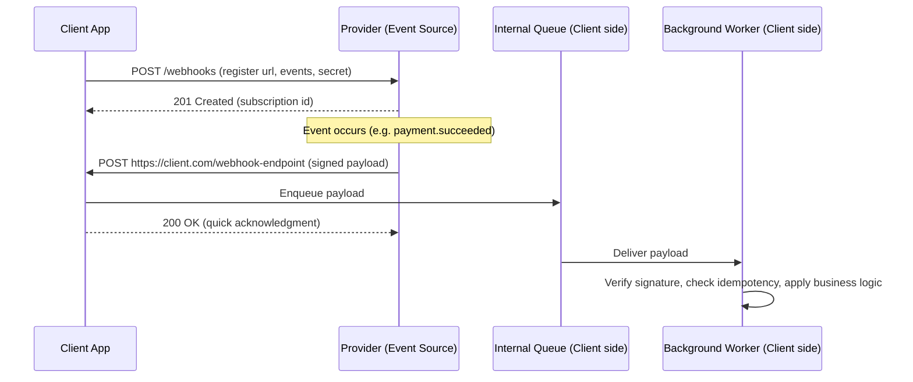

#### Real-Life Use Case

An e-commerce platform integrates Stripe for payments. Instead of polling Stripe's API every few seconds to ask "has this payment completed yet?" for every open checkout session, the platform registers a webhook endpoint once. When a customer's card is charged, Stripe's dispatcher sends a signed `POST` request to the platform's `/webhooks/stripe` endpoint within a second or two of the charge completing. The platform's endpoint verifies the signature, enqueues the event, responds `200 OK` immediately, and a background worker then marks the order as paid and triggers fulfillment, all without the platform ever needing to ask Stripe "is it done yet?"

#### Java Code Example

```java
import com.sun.net.httpserver.HttpExchange;
import com.sun.net.httpserver.HttpHandler;
import com.sun.net.httpserver.HttpServer;
import java.io.IOException;
import java.io.InputStream;
import java.net.InetSocketAddress;
import java.util.concurrent.BlockingQueue;
import java.util.concurrent.LinkedBlockingQueue;

// Minimal webhook receiving endpoint: acknowledge fast, process later.
public class WebhookReceiver implements HttpHandler {

    private final BlockingQueue<String> incomingEvents = new LinkedBlockingQueue<>();

    @Override
    public void handle(HttpExchange exchange) throws IOException {
        if (!"POST".equalsIgnoreCase(exchange.getRequestMethod())) {
            exchange.sendResponseHeaders(405, -1);
            return;
        }

        String payload = readBody(exchange.getRequestBody());

        // Only fast, synchronous work happens here: hand off and acknowledge.
        incomingEvents.offer(payload);

        byte[] response = "OK".getBytes();
        exchange.sendResponseHeaders(200, response.length);
        exchange.getResponseBody().write(response);
        exchange.close();
    }

    private String readBody(InputStream in) throws IOException {
        return new String(in.readAllBytes());
    }

    public static void main(String[] args) throws IOException {
        HttpServer server = HttpServer.create(new InetSocketAddress(8080), 0);
        server.createContext("/webhooks/stripe", new WebhookReceiver());
        server.start();
        System.out.println("Webhook receiver listening on port 8080");
    }
}
```

#### Interview Questions and Answers

**Q1. What is a webhook, and how does it differ from a regular API call?**
A: A webhook is an HTTP callback that the event source initiates towards a URL the consumer registered in advance, so the direction of the call is reversed compared to a normal API request. In a regular API call, the client asks the server for data on its own schedule (pull); with a webhook, the server pushes data to the client the moment an event occurs (push), without the client needing to ask.

**Q2. Why are webhooks sometimes called a "reverse API"?**
A: Because the usual client/server relationship is inverted for the purpose of the notification: the provider (normally the one being called) becomes the caller, and the consumer (normally the one calling) exposes an endpoint and becomes the callee, purely so it can be notified proactively instead of polling.

**Q3. Why must a webhook receiving endpoint respond quickly, and what should it do before responding?**
A: Providers typically enforce a short timeout (often a few seconds) on the delivery request and treat a slow or missing response as a failure worth retrying. The endpoint should therefore only verify the signature and enqueue the payload for asynchronous processing before responding `2xx`, deferring the actual business logic to a background worker so it never blocks the HTTP response.

**Q4. What happens if the client's webhook endpoint is temporarily down when an event occurs?**
A: A well-built provider does not drop the event; it records the delivery as failed and retries with a backoff schedule (e.g., exponential backoff over minutes to hours) for a bounded number of attempts, eventually dead-lettering the event if the endpoint never recovers, so the client can still recover the missed event later.

**Q5. Can a webhook payload be trusted just because it arrived on the registered endpoint?**
A: No. The endpoint is a public URL, and anyone who discovers it can send a forged request that looks like a legitimate event. The payload must be verified using a signature (typically HMAC-SHA256 over the raw body using a shared secret) before any of its contents are trusted or acted upon.

### Characteristics of Webhooks

Webhooks derive all of their properties from one design choice: the event source initiates a plain HTTP request towards a URL the consumer registered ahead of time, instead of the consumer polling for changes.

- **Push-based, not pull-based**: The provider decides when to send data, based purely on when the event occurs, so the consumer never has to guess a polling interval or waste requests asking "anything new?"
- **Event-driven**: Each delivery corresponds to a specific, discrete event (a payment succeeded, a record changed) rather than a snapshot of current state, so the payload is naturally small and focused.
- **Built on plain HTTP**: A webhook is just an HTTP request (usually `POST`) with a body, which means it reuses existing infrastructure, load balancers, firewalls, TLS, logging, without any special protocol or persistent connection.
- **Stateless per delivery**: Unlike WebSockets, there is no persistent connection between provider and consumer; each event is an entirely independent HTTP request that succeeds or fails on its own.
- **At-least-once delivery semantics**: A responsible provider retries failed deliveries, which means the same event can be delivered more than once, so consumers must be designed to tolerate duplicates.
- **Asynchronous from the provider's perspective**: The provider does not wait for the consumer to finish processing the event, only for an HTTP acknowledgment, so slow consumer-side processing does not block the provider's own workflow.
- **Requires a publicly reachable endpoint**: The consumer must expose an HTTP(S) endpoint the provider can reach over the internet (or a shared network), which is a meaningfully different operational requirement than a purely outbound-only API client.
- **Ordering is not guaranteed by default**: Because each event is delivered as an independent request (and retries can be interleaved with new events), consumers generally cannot assume events arrive in the exact order they occurred unless the provider explicitly guarantees and the consumer explicitly enforces ordering (e.g., via a sequence number).

#### Diagram

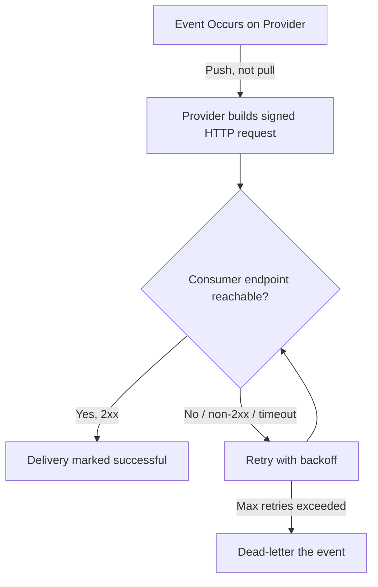

#### Real-Life Use Case

A subscription billing platform sends a `subscription.renewed` webhook every time a recurring charge succeeds. Because delivery is push-based and event-driven, the merchant's backend learns about the renewal within seconds, without ever needing to run a nightly job that pulls every subscription's current status from the billing platform's API just to see what changed.

#### Java Code Example

```java
import java.security.MessageDigest;
import java.util.Objects;

// Demonstrates the "requires a publicly reachable endpoint that verifies each
// independent, stateless request" characteristic: no session or connection state
// is kept between deliveries, each request is verified entirely on its own.
public class StatelessWebhookRequest {

    private final String eventId;
    private final String payload;
    private final String signatureHeader;

    public StatelessWebhookRequest(String eventId, String payload, String signatureHeader) {
        this.eventId = eventId;
        this.payload = payload;
        this.signatureHeader = signatureHeader;
    }

    public boolean isSelfContainedAndVerifiable(String sharedSecret) throws Exception {
        // Every field needed to verify this single request is present in the
        // request itself; no prior connection or session state is required.
        String expected = hmacSha256Hex(payload, sharedSecret);
        return Objects.equals(expected, signatureHeader);
    }

    private String hmacSha256Hex(String data, String secret) throws Exception {
        javax.crypto.Mac mac = javax.crypto.Mac.getInstance("HmacSHA256");
        mac.init(new javax.crypto.spec.SecretKeySpec(secret.getBytes(), "HmacSHA256"));
        byte[] hash = mac.doFinal(data.getBytes());
        StringBuilder sb = new StringBuilder();
        for (byte b : hash) {
            sb.append(String.format("%02x", b));
        }
        return sb.toString();
    }
}
```

#### Interview Questions and Answers

**Q1. Is a webhook connection persistent, like a WebSocket?**
A: No. Each webhook delivery is an independent HTTP request; there is no long-lived connection kept open between the provider and consumer. This makes webhooks simpler to scale (no connection state to hold) but means each event is delivered as its own self-contained request.

**Q2. Why can't a consumer assume webhook events arrive in the order they occurred?**
A: Deliveries are made as independent HTTP requests, and retries for an earlier failed event can complete after a later event's request succeeds, so requests can arrive out of order. Consumers that care about ordering must rely on an explicit field in the payload (a sequence number or timestamp) and reorder or reconcile on their own side.

**Q3. What does "at-least-once delivery" mean for a webhook consumer?**
A: It means the provider guarantees an event will be delivered one or more times, but never guarantees exactly once, because retries after ambiguous failures (e.g., a timeout where the request may or may not have been processed) are the only safe default. Consumers must therefore be idempotent, safely handling the same event id arriving twice.

**Q4. Does a webhook consumer need a persistent server process running at all times?**
A: It needs a publicly reachable HTTP endpoint available whenever the provider might deliver an event, which in practice does mean the receiving service (or its load balancer) must be up continuously, but it does not need to hold any open connection or in-memory state between deliveries the way a WebSocket server does.

### Advantages of Webhooks (Pros and Benefits)

```
✓ Real-Time Notifications
  - Event is pushed the instant it happens
  - No polling delay
  - Typical delivery latency: 1-5 seconds

✓ Reduced Load and Cost
  - No repeated "anything new?" requests
  - Provider and consumer both save bandwidth and CPU
  - Scales independently of polling frequency

✓ Simple to Consume
  - Just a plain HTTP endpoint
  - No special client library or persistent connection needed
  - Works with any language/framework that can run a web server

✓ Decoupled Integration
  - Provider does not need to know consumer's internal architecture
  - Consumer does not need to know provider's internal architecture
  - Easy to add or remove subscribers without touching the event source

✓ Scales to Many Subscribers
  - One event can fan out to many registered endpoints
  - Each delivery tracked and retried independently
  - New integrations can subscribe without provider code changes
```

**Detailed explanation of each benefit:**

- **Real-Time Notifications**: Because the provider sends the request the moment the event occurs, the consumer typically learns about it within one to a few seconds, which is close to instantaneous compared to a polling interval that might be minutes long, and it requires no extra logic on the consumer's part to achieve that speed.
- **Reduced Load and Cost**: Polling means sending a request on a fixed schedule regardless of whether anything actually changed, most of which return "no update." Webhooks eliminate that waste entirely: a request is only ever sent when there is real data to deliver, which reduces load on both the provider's API and the consumer's infrastructure.
- **Simple to Consume**: Receiving a webhook requires nothing more than an HTTP server capable of handling a `POST` request, something every mainstream language and framework supports out of the box, so there is no SDK, no special handshake, and no persistent connection management required on the consumer side.
- **Decoupled Integration**: The provider only needs to know a URL to call; it has no visibility into (or dependency on) how the consumer stores data, what language it is written in, or how it scales. Likewise the consumer only needs to understand the payload shape, not the provider's internal event pipeline, which keeps both sides free to evolve independently.
- **Scales to Many Subscribers**: A single event (say, "order shipped") can be delivered to dozens of independently registered endpoints, an analytics service, a customer notification service, a partner's system, each tracked and retried on its own, without the event source needing any code changes to support a new subscriber; it is purely a registration/configuration change.

#### Diagram

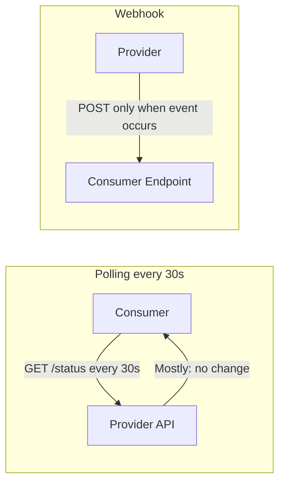

#### Real-Life Use Case

A logistics company's tracking dashboard used to poll a carrier's API every 30 seconds per shipment to check for status changes, which meant thousands of largely wasted requests per hour once they had a few thousand active shipments. Switching to the carrier's webhook for `shipment.status_changed` cut their outbound request volume by over 95% and reduced the time between an actual status change and it showing on the dashboard from up to 30 seconds to typically under 2 seconds.

#### Java Code Example

```java
import com.sun.net.httpserver.HttpExchange;
import com.sun.net.httpserver.HttpHandler;
import java.io.IOException;

// Demonstrates the "Simple to Consume" and "Decoupled Integration" benefits:
// receiving a webhook needs nothing more than a plain HTTP handler, with no
// knowledge of the provider's internal architecture required.
public class ShipmentWebhookHandler implements HttpHandler {

    @Override
    public void handle(HttpExchange exchange) throws IOException {
        String payload = new String(exchange.getRequestBody().readAllBytes());

        // In a real system: verify signature, then enqueue for async processing.
        System.out.println("Received shipment update: " + payload);

        byte[] ack = "OK".getBytes();
        exchange.sendResponseHeaders(200, ack.length);
        exchange.getResponseBody().write(ack);
        exchange.close();
    }
}
```

#### Interview Questions and Answers

**Q1. Why do webhooks reduce load compared to polling?**
A: Polling sends a request on a fixed schedule whether or not anything changed, so most polling requests return no new information. A webhook is only sent when an actual event occurs, eliminating the wasted requests entirely and reducing load on both the provider's API and the consumer's infrastructure.

**Q2. Why are webhooks considered simple to consume compared to other real-time mechanisms like WebSockets?**
A: A webhook consumer only needs a standard HTTP endpoint capable of handling a `POST` request, something any web framework supports natively. There is no special handshake, no persistent connection to maintain, and no dedicated client library required, unlike WebSockets, which need an open socket and connection lifecycle management.

**Q3. How do webhooks help decouple a provider and a consumer?**
A: The provider only needs to know the consumer's callback URL and does not need any knowledge of the consumer's tech stack, database, or internal logic. The consumer, in turn, only needs to understand the shape of the payload, not the provider's internal event pipeline, so either side can change its internal implementation freely without affecting the other.

**Q4. How do webhooks support scaling to many subscribers without changing the event source's code?**
A: Adding a new subscriber is purely a data/configuration change (registering a new URL and event type), not a code change to the event source. The dispatcher looks up all active subscriptions for an event type and fans the delivery out to each one independently, so new integrations can be added or removed without touching the system that produces the event.

### Disadvantages of Webhooks (Cons and Challenges)

```
✗ Requires a Publicly Reachable Endpoint
  - Consumer must expose an HTTP(S) URL
  - Firewalls, NAT, and local development make this harder
  - Downtime on the consumer side can mean missed events

✗ Security Risks if Unverified
  - Endpoint URL can be discovered or guessed
  - Forged requests possible without signature checks
  - Replay attacks possible without timestamp/nonce checks

✗ Duplicate and Out-of-Order Delivery
  - At-least-once delivery means duplicates happen
  - Retries can arrive after later events
  - Consumer must implement idempotency and reconciliation

✗ Harder to Debug Than a Direct API Call
  - No synchronous response with the "answer"
  - Failures happen on the provider's dispatch side, often invisible to the consumer
  - Requires logging, dashboards, or replay tooling to diagnose

✗ No Built-In Guarantee of Delivery Order or Timing
  - Provider may batch, delay, or reorder under load
  - Consumer cannot assume "just happened" timing precision
```

**Detailed explanation of each challenge:**

- **Requires a Publicly Reachable Endpoint**: Unlike an outbound-only API client, a webhook consumer must run a server that the provider can reach over the network, which means opening a port through firewalls/NAT, obtaining a valid TLS certificate, and keeping that endpoint available; local development environments often need a tunneling tool (e.g., ngrok) just to receive test events at all.
- **Security Risks if Unverified**: Because the endpoint is a public HTTP URL, anyone who discovers it (or guesses a predictable path) can send a request that looks like a legitimate event unless the consumer explicitly verifies a cryptographic signature and (ideally) a timestamp/nonce to prevent replay of a previously captured request.
- **Duplicate and Out-of-Order Delivery**: At-least-once delivery, the only safe default when a request might have been received but the acknowledgment was lost, means the same event can be delivered more than once, and independent retries mean events are not guaranteed to arrive in the order they occurred, both of which push real complexity (idempotency keys, sequence checks) onto the consumer.
- **Harder to Debug Than a Direct API Call**: A normal API call gives an immediate response indicating success or failure. A webhook failure (a dropped event, a stuck retry, a misconfigured URL) often surfaces only in the provider's dispatch logs or dashboard, so consumers typically need the provider to expose delivery logs, and ideally a manual "replay this event" tool, to diagnose and recover from problems.
- **No Built-In Guarantee of Delivery Order or Timing**: Under load, a provider's dispatcher may batch events, delay delivery, or process its internal queue out of order, so a consumer cannot safely assume that "the webhook arrived" means "this happened right now" with millisecond precision; time-sensitive logic should rely on a timestamp inside the payload, not on wall-clock arrival time.

#### Diagram

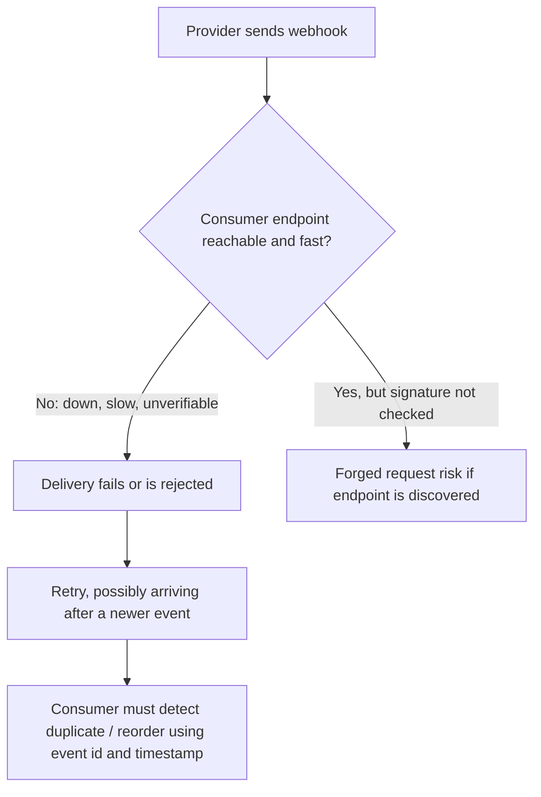

#### Real-Life Use Case

A startup's webhook consumer briefly went down during a deployment. During that window, three payment events were retried by the provider and eventually delivered together after the deployment finished, one of them a duplicate of an event that had actually been processed just before the outage (the acknowledgment was lost, not the processing). Because the team had not implemented idempotency checks keyed on the event id, the duplicate delivery caused the order to be marked as paid twice and triggered a second fulfillment email, an incident that was only caught because a customer complained, and that led directly to adding an idempotency table keyed on event id before any handler logic ran.

#### Java Code Example

```java
import java.util.concurrent.ConcurrentHashMap;
import java.util.Set;

// Demonstrates guarding against the "Duplicate and Out-of-Order Delivery"
// challenge: track processed event ids so a retried delivery is a no-op.
public class IdempotentWebhookProcessor {

    private final Set<String> processedEventIds = ConcurrentHashMap.newKeySet();

    public void handle(String eventId, String payload) {
        if (!processedEventIds.add(eventId)) {
            // add() returns false if the id was already present: safe no-op.
            System.out.println("Duplicate event ignored: " + eventId);
            return;
        }

        try {
            applyBusinessLogic(payload);
        } catch (Exception ex) {
            // Roll back so a genuine retry (after a real failure) is not skipped.
            processedEventIds.remove(eventId);
            throw ex;
        }
    }

    private void applyBusinessLogic(String payload) {
        System.out.println("Processing event payload: " + payload);
    }
}
```

#### Interview Questions and Answers

**Q1. Why is exposing a public webhook endpoint considered a security and operational challenge?**
A: The endpoint must be reachable from the provider's infrastructure over the internet, which means it needs a valid TLS certificate, has to be kept available, and is inherently discoverable/guessable by anyone, not just the intended provider. This makes it a target for forged requests unless the payload is cryptographically verified, and any downtime on the consumer side risks missed or delayed events.

**Q2. How should a consumer handle the fact that webhook delivery is at-least-once, not exactly-once?**
A: The consumer should treat its handler logic as idempotent by tracking processed event ids (in a database or cache) and skipping any event id it has already applied, so a legitimate retry after a lost acknowledgment does not double-apply the business logic.

**Q3. Why is debugging a failed webhook delivery harder than debugging a failed direct API call?**
A: A direct API call gives the caller an immediate, visible failure (an error response or exception). A webhook failure happens asynchronously on the provider's dispatch side, often minutes or attempts after the original event, so the consumer may never see it directly unless the provider exposes a delivery log or dashboard the consumer can inspect, or offers a way to manually replay a specific event.

**Q4. Can a consumer safely assume events always arrive in the order they occurred?**
A: No. Retries for an earlier failed delivery can complete after a newer event's delivery has already succeeded, and providers may batch or reorder internally under load. Consumers that need strict ordering should rely on a sequence number or timestamp embedded in the payload and reconcile or reorder on their own side rather than trusting arrival order.

### Webhook Security: Verifying Signatures

Because a webhook endpoint is a public HTTP URL, the single most important security control is proving that an incoming request actually originated from the expected provider and has not been tampered with in transit, rather than from an attacker who discovered or guessed the URL. The standard mechanism for this is an HMAC (Hash-based Message Authentication Code) signature: when the subscription is created, the provider and consumer agree on a shared secret; for every delivery, the provider computes a cryptographic hash of the raw request body (and often a timestamp) using that secret, and sends the result in a header (commonly named something like `X-Signature`, `Stripe-Signature`, or `X-Hub-Signature-256`). The consumer recomputes the same hash independently using its copy of the secret and compares it to the header; if they match, the payload is authentic and unmodified, because only someone holding the secret could have produced a matching signature.

A second, equally important control is replay protection: a captured, valid request (signature and all) could otherwise be resent by an attacker at a later time and still pass signature verification, since the signature only proves authenticity and integrity, not freshness. Providers address this by including a timestamp in the signed payload (or as part of the signed header) and consumers reject any request whose timestamp is older than a small tolerance window (commonly a few minutes), which bounds how long a captured request could be replayed even if it were somehow intercepted.

#### Components

- **Shared secret / signing key**: A high-entropy value generated when the webhook subscription is created, known only to the provider and the specific consumer, used as the HMAC key for every delivery to that consumer.
- **Signature header**: The HTTP header the provider attaches to each request, carrying the computed HMAC (and often a timestamp) so the consumer can verify it without needing any additional round trip.
- **Timestamp / nonce**: A value included in what gets signed specifically to defeat replay attacks, since the same valid payload signed at time T should be rejected if presented again well after T plus a tolerance window.
- **Constant-time comparator**: The specific string-comparison routine used to check the computed signature against the received one, deliberately built to take the same amount of time regardless of where the strings first differ, to avoid leaking information via timing side channels.

#### Patterns

- **Verify-before-parse pattern**: Compute and check the signature against the raw, unparsed request body before deserializing it into an object, since parsing first and verifying second can allow a maliciously crafted body to reach application code before it has been authenticated.
- **Rotate-without-downtime pattern**: Support two active secrets simultaneously during a rotation window (the old and the new), so an in-flight delivery signed with the about-to-be-retired secret is still accepted while the new secret takes over.
- **Fail-closed pattern**: Reject the request outright (e.g., `401 Unauthorized`) whenever the signature is missing, malformed, or does not match, rather than logging a warning and processing it anyway.

#### Best Practices

- Always compute the signature over the exact raw bytes of the request body, not a re-serialized version of the parsed object, since even whitespace or key-ordering differences will produce a different hash.
- Use a constant-time string comparison for the signature check to avoid timing attacks that could help an attacker guess the correct signature byte by byte.
- Reject requests whose embedded timestamp is outside an acceptable tolerance window (e.g., plus or minus 5 minutes) to bound the window in which a captured request could be replayed.
- Store the signing secret the same way you would store any other credential (a secrets manager, not source control or a plaintext config file), and support rotating it without downtime.

#### When to Use

- Signature verification is not optional for any webhook endpoint that triggers a meaningful side effect (charging a card, changing account state, sending a notification); skip it only for genuinely inert, non-sensitive test endpoints.
- Add timestamp-based replay protection whenever the event triggers an action that would be harmful if it could be repeated by an attacker who captured a single valid request (e.g., anything financial or account-modifying).

#### Diagram

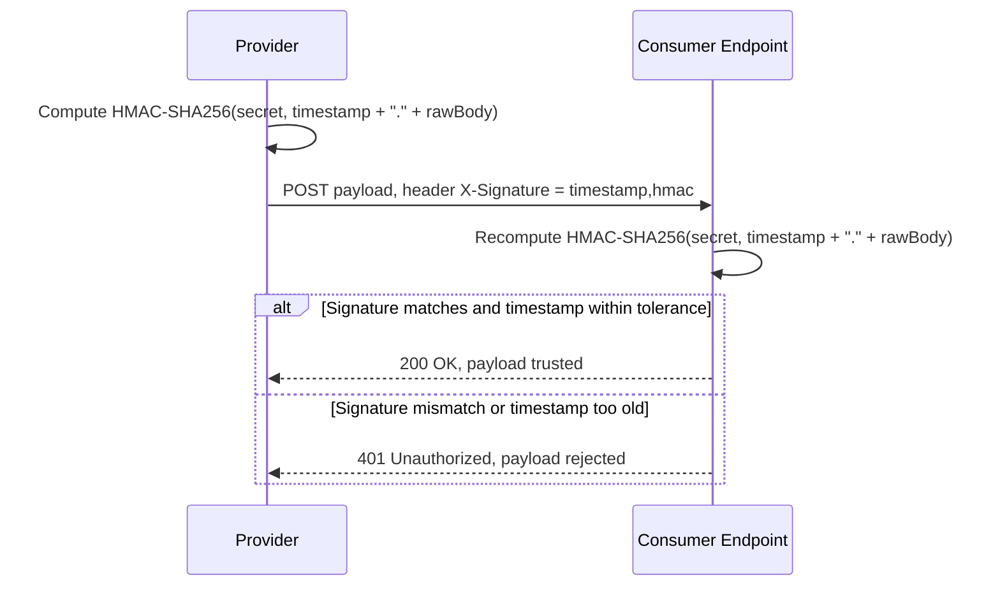

#### Real-Life Use Case

A fintech company discovered, during a security review, that their webhook endpoint validated only that the request body was well-formed JSON, not that it actually came from their payment provider. A penetration test confirmed that a forged `payment.succeeded` event, aimed at the same URL, would have been processed and would have marked an unpaid order as paid. The fix was to add HMAC-SHA256 signature verification (using the secret issued at subscription time) plus a 5-minute timestamp tolerance window, after which the same forged request was correctly rejected with a `401`.

#### Java Code Example

```java
import javax.crypto.Mac;
import javax.crypto.spec.SecretKeySpec;
import java.nio.charset.StandardCharsets;
import java.security.MessageDigest;
import java.time.Instant;

// Verifies an incoming webhook signature and rejects stale (replayed) requests.
public class WebhookSignatureVerifier {

    private static final long TOLERANCE_SECONDS = 300; // 5 minutes

    public boolean verify(String rawBody, long timestamp, String receivedSignature, String secret)
            throws Exception {

        long now = Instant.now().getEpochSecond();
        if (Math.abs(now - timestamp) > TOLERANCE_SECONDS) {
            return false; // reject replayed or clock-skewed requests
        }

        String signedContent = timestamp + "." + rawBody;
        String expectedSignature = hmacSha256Hex(signedContent, secret);

        return constantTimeEquals(expectedSignature, receivedSignature);
    }

    private String hmacSha256Hex(String data, String secret) throws Exception {
        Mac mac = Mac.getInstance("HmacSHA256");
        mac.init(new SecretKeySpec(secret.getBytes(StandardCharsets.UTF_8), "HmacSHA256"));
        byte[] hash = mac.doFinal(data.getBytes(StandardCharsets.UTF_8));
        StringBuilder sb = new StringBuilder();
        for (byte b : hash) {
            sb.append(String.format("%02x", b));
        }
        return sb.toString();
    }

    private boolean constantTimeEquals(String a, String b) {
        return MessageDigest.isEqual(
                a.getBytes(StandardCharsets.UTF_8),
                b.getBytes(StandardCharsets.UTF_8));
    }
}
```

#### Interview Questions and Answers

**Q1. How does HMAC signature verification prove a webhook request actually came from the expected provider?**
A: Both sides hold a shared secret established when the subscription was created. The provider hashes the outgoing payload (and typically a timestamp) with that secret and sends the result in a header; the consumer recomputes the same hash independently and compares it. Only someone possessing the secret could produce a matching hash, so a match proves both authenticity (it came from the provider) and integrity (the body was not modified in transit).

**Q2. Why should signature verification happen against the raw request body, not the parsed object?**
A: Any re-serialization step (different key ordering, whitespace, number formatting) produces a different byte sequence, which would produce a different hash even though the "logical" content is unchanged. Verifying against the exact raw bytes the provider signed avoids false negatives and, more importantly, ensures nothing was altered between signing and verification.

**Q3. Why is a timestamp needed in addition to the signature itself?**
A: A signature alone proves authenticity and integrity but says nothing about freshness; a valid signed request captured by an attacker could be resent (replayed) at any later time and would still pass signature verification. Including a timestamp in what is signed, and rejecting requests outside a small tolerance window, bounds how long a captured request remains replayable.

**Q4. Why use a constant-time comparison when checking the signature instead of a normal string equality check?**
A: A naive string comparison typically returns as soon as it finds the first differing character, which can leak, through response timing, how many leading bytes of a guessed signature are already correct. A constant-time comparison always takes the same amount of time regardless of where (or whether) the strings differ, removing that timing side channel.

**Q5. How should a signing secret be rotated without causing dropped or rejected webhook deliveries?**
A: Support verifying against two active secrets during a transition window, the outgoing secret and the new one, so a request signed with the old secret just before rotation is still accepted, then remove the old secret only after confirming no more deliveries are being signed with it.

### Reliability: Retries, Idempotency and Ordering

Reliable webhook delivery rests on three interlocking guarantees that the provider and consumer must each do their part to uphold: retries (the provider keeps trying until it succeeds or gives up), idempotency (the consumer safely tolerates the same event being applied more than once), and ordering (both sides agree on how, if at all, out-of-sequence delivery is detected and corrected). None of these are automatic; each requires deliberate design.

On the provider side, a delivery attempt can fail for many reasons: the consumer's endpoint is down, it returns a `5xx` error, it times out, or the network drops the connection entirely. Because a timeout in particular is ambiguous (the consumer may have processed the event and simply failed to send the response in time), the only safe choice is to retry, accepting that this can occasionally produce a duplicate. Retries are almost always scheduled with exponential backoff (e.g., 1 minute, 5 minutes, 30 minutes, 2 hours, 24 hours) rather than a fixed interval, both to give a struggling consumer time to recover and to avoid hammering an already-failing endpoint. After a bounded number of attempts (commonly somewhere between 5 and 20, spread across a day or more), the provider gives up and either dead-letters the event (storing it for manual inspection/replay) or, after enough consecutive failures across many events, disables the subscription entirely to avoid wasting resources on a permanently broken endpoint.

On the consumer side, the only reliable defense against duplicates is idempotency: persisting the unique event id (which every well-designed webhook payload includes) the first time it is successfully processed, and checking that store before applying the business logic again on any subsequent delivery of the same id. This check and the actual processing should happen together, atomically (e.g., inside the same database transaction, using a unique constraint on event id), so that a crash partway through does not leave the system in a state where the event is marked processed but the side effect never actually happened, or vice versa.

Ordering is the hardest of the three to guarantee in general. Because retries are scheduled independently per event, an event that failed and is retried later can arrive after a subsequently occurring event that succeeded on its first attempt. Consumers that genuinely need ordering (for example, applying a sequence of balance-changing events in the correct order) should rely on an explicit sequence number or timestamp embedded in the payload, buffering and reordering locally if out-of-order arrival is detected, rather than assuming HTTP arrival order reflects event order.

#### Patterns

- **Exponential backoff with jitter**: Increase the delay between retry attempts exponentially, and add a small random jitter to each delay, so that many simultaneously failing subscriptions do not all retry at exactly the same moment and overwhelm a recovering consumer.
- **Idempotency key table pattern**: Maintain a dedicated table (or cache) of processed event ids with a unique constraint, and insert the id in the same transaction as the business-logic side effect, so duplicate processing and partial failure are both structurally prevented.
- **Sequence/version reconciliation pattern**: Attach a monotonically increasing sequence number (or a "previous state version") to each event, and have the consumer detect gaps or out-of-order arrivals by comparing the incoming sequence number to the last one it successfully applied.
- **Dead-letter and manual replay pattern**: After exhausting retries, move the event to a durable dead-letter store rather than discarding it, and provide a mechanism (dashboard button or API call) to manually redeliver it once the underlying issue is fixed.

#### Best Practices

- Always key idempotency checks on the provider's event id, not on a hash of the payload content, since some legitimate events can have identical-looking payloads (e.g., two identical-amount charges) but different ids.
- Make the idempotency check and the business-logic side effect atomic (same database transaction, or a compare-and-set operation), so a crash between "check" and "apply" cannot cause either a missed update or a double-applied one.
- Use exponential backoff with jitter for outbound retries (provider side) and be prepared to receive duplicate or delayed retries indefinitely, not just for the first few attempts (consumer side).
- Expose (or consume, if you are the consumer) a way to query delivery history and manually replay a specific event id, since automated retries alone cannot fix a bug that was present in the consumer's handler at the time of the original delivery.

#### When to Use

- Idempotency handling is required for every webhook consumer without exception, since at-least-once delivery is the standard (and only safe) guarantee virtually all webhook providers offer.
- Invest in explicit sequence-based ordering only when the business logic genuinely depends on strict event order (e.g., applying a sequence of account balance changes); for most notification-style use cases (an email trigger, a cache invalidation), eventual, unordered delivery is perfectly fine.

#### Diagram

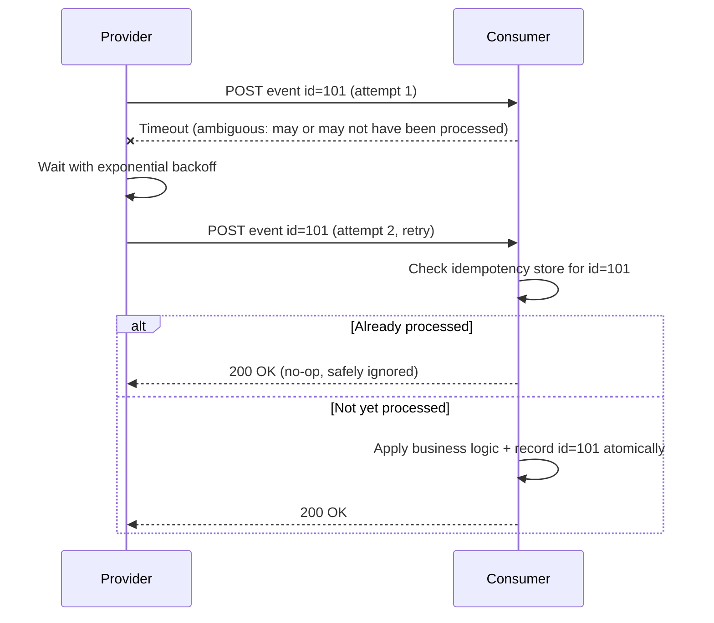

#### Real-Life Use Case

A ride-hailing platform's driver-payout service consumes a `trip.completed` webhook to calculate earnings. During a brief network blip, the provider's first delivery attempt timed out after the payout service had actually already finished processing it, so the provider retried and delivered the same event again five minutes later. Because the payout service recorded the event id inside the same transaction as crediting the driver's balance, the retried delivery was detected as a duplicate and safely ignored, preventing the driver from being paid twice for the same trip.

#### Java Code Example

```java
import java.sql.Connection;
import java.sql.PreparedStatement;
import java.sql.SQLException;

// Demonstrates the idempotency key table pattern: the unique constraint on
// event_id makes duplicate processing impossible even under concurrent retries.
public class IdempotentPayoutProcessor {

    private final Connection connection;

    public IdempotentPayoutProcessor(Connection connection) {
        this.connection = connection;
    }

    public void processTripCompleted(String eventId, String driverId, long amountCents) throws SQLException {
        connection.setAutoCommit(false);
        try {
            // Unique constraint on event_id makes this insert fail for duplicates.
            try (PreparedStatement markProcessed = connection.prepareStatement(
                    "INSERT INTO processed_events (event_id) VALUES (?)")) {
                markProcessed.setString(1, eventId);
                markProcessed.executeUpdate();
            }

            try (PreparedStatement creditDriver = connection.prepareStatement(
                    "UPDATE driver_balances SET balance_cents = balance_cents + ? WHERE driver_id = ?")) {
                creditDriver.setLong(1, amountCents);
                creditDriver.setString(2, driverId);
                creditDriver.executeUpdate();
            }

            connection.commit();
        } catch (SQLException duplicateOrError) {
            connection.rollback();
            System.out.println("Skipped duplicate or failed event: " + eventId);
        }
    }
}
```

#### Interview Questions and Answers

**Q1. Why do webhook providers use exponential backoff instead of retrying immediately or on a fixed interval?**
A: Retrying immediately or at a fixed short interval can overwhelm a consumer that is already struggling (e.g., during an outage or a deploy), making recovery harder. Exponential backoff spaces retries further apart over time, giving the consumer room to recover, and adding jitter prevents many failing subscriptions from all retrying in a synchronized burst.

**Q2. How should a consumer make its webhook handler idempotent?**
A: Persist the event id the first time it is successfully processed, in the same transaction (or atomic operation) as the actual business-logic side effect, typically using a unique constraint on event id. Before processing any incoming event, check whether that id has already been recorded, and treat a match as a safe no-op.

**Q3. Why key idempotency on the event id rather than a hash of the payload?**
A: Two distinct, legitimate events can have identical-looking payloads (e.g., two separate charges of the same amount to the same customer), so a payload hash would incorrectly treat them as duplicates. The provider-assigned event id uniquely identifies one specific occurrence of the event, which is the correct key for deduplication.

**Q4. Why can webhook events arrive out of order, and how can a consumer detect and correct that?**
A: Because failed deliveries are retried independently and on their own schedule, an event that failed and is retried later can be delivered after a subsequent event that succeeded immediately. A consumer that needs strict ordering should rely on an explicit sequence number or version embedded in the payload, detect gaps or regressions by comparing to the last applied sequence, and buffer or reconcile out-of-order arrivals rather than trusting HTTP arrival order.

**Q5. What should happen after a webhook delivery has failed the maximum number of retry attempts?**
A: The event should be moved to a durable dead-letter store rather than discarded, so it is not silently lost, and ideally surfaced through a dashboard or alert so an operator can investigate the underlying cause and manually trigger a redelivery once the issue (e.g., a bug in the consumer's handler, or a prolonged outage) has been fixed.

### Webhooks vs Alternatives: Polling, WebSockets, SSE and Message Queues

Webhooks are one of several ways two systems can exchange "something changed" information, and the right choice depends on who needs to initiate contact, how frequent events are, and whether both parties can expose network endpoints to each other.

**Polling**: The consumer repeatedly calls the provider's API on a fixed schedule ("has anything changed?"). It is the simplest option to implement (needs no inbound endpoint at all) and works even when the consumer cannot expose a public URL, but it trades off either latency (a long interval means slow reaction to changes) or load (a short interval wastes requests when nothing has changed). Webhooks remove that trade-off entirely for the provider's side, at the cost of the consumer needing a reachable endpoint.

**WebSockets**: A persistent, bidirectional TCP connection kept open between client and server, ideal when both sides need to exchange many small messages with very low latency in either direction (chat, live collaboration, gaming). Webhooks, by contrast, are a much lighter-weight mechanism for occasional, one-directional "this event happened" notifications between two independent systems (often owned by different companies), where holding an open connection per integration would be unnecessary and operationally heavier than needed.

**Server-Sent Events (SSE)**: A one-directional stream from server to a single connected client over plain HTTP, well suited when a browser client wants a continuous stream of updates from a server it is already talking to. Webhooks differ in that the "client" being notified is typically itself a backend service (not a browser tab), and the connection is not held open; each event is its own independent HTTP request, which is much better suited to server-to-server integrations that may not be actively "connected" at the moment an event occurs.

**Message queues (Kafka, SQS, RabbitMQ)**: Internal, high-throughput, ordered (with Kafka) event distribution designed for systems within the same organization or trust boundary, typically requiring both producer and consumer to speak the queue's specific protocol and share network/credential access to the broker. Webhooks are the equivalent mechanism across an organizational or trust boundary, using plain HTTP (which any external partner can consume without adopting your internal messaging stack), at the cost of weaker ordering and throughput guarantees than a dedicated broker provides.

#### When to Use

- Use webhooks specifically for cross-organization or loosely coupled integrations where the consumer only needs occasional, event-triggered notifications and can expose a plain HTTP endpoint, but does not want (or need) a persistent connection or shared internal messaging infrastructure with the provider.
- Prefer polling only when the consumer cannot expose any inbound endpoint at all (e.g., behind restrictive corporate NAT with no way to open a port), and accept the latency/load trade-off that comes with it.
- Prefer WebSockets or SSE when the interaction is with an interactive client (typically a browser) that is already connected and needs frequent, low-latency updates for as long as that session lasts.
- Prefer an internal message queue over a webhook when both producer and consumer are within the same trust boundary and need high throughput, strict ordering, or replay-from-any-point semantics that a broker provides natively.

#### Diagram

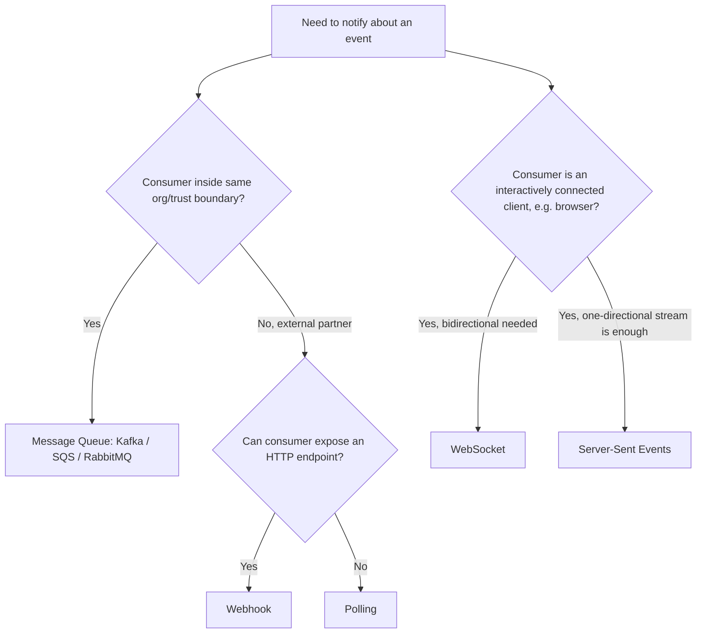

#### Real-Life Use Case

A SaaS analytics company offers three ways for customers to receive event data: an internal Kafka topic (used only by their own microservices), a webhook (used by external customers' backends to receive events in near real time), and a polling API (used as a fallback by customers whose network policy forbids any inbound connection from the internet). Most customers use the webhook, since it gives them near-real-time delivery without needing to adopt Kafka or hold open a persistent connection; only a small number of highly restricted enterprise customers fall back to polling.

#### Java Code Example

```java
// Illustrates the structural difference: a webhook handler is a passive HTTP
// endpoint (provider calls you), while a polling client actively calls out.

// Webhook side: consumer only reacts when called.
public interface WebhookHandler {
    void onEvent(String eventType, String payload);
}

// Polling side: consumer must actively ask, on its own schedule.
public class PollingClient {

    private final java.net.http.HttpClient httpClient = java.net.http.HttpClient.newHttpClient();

    public void pollForChanges(String apiUrl) throws Exception {
        java.net.http.HttpRequest request = java.net.http.HttpRequest.newBuilder()
                .uri(java.net.URI.create(apiUrl))
                .GET()
                .build();

        java.net.http.HttpResponse<String> response =
                httpClient.send(request, java.net.http.HttpResponse.BodyHandlers.ofString());

        System.out.println("Polled status: " + response.body());
        // Caller must decide how often to repeat this call, trading latency for load.
    }
}
```

#### Interview Questions and Answers

**Q1. When would you choose polling over a webhook, despite the extra latency and load?**
A: When the consumer cannot expose any publicly reachable endpoint at all, for example, behind a restrictive corporate network with no way to open an inbound port, polling is the only viable option since it requires no inbound connectivity, only the ability to make outbound requests.

**Q2. Why aren't WebSockets typically used for provider-to-customer event notifications the way webhooks are?**
A: WebSockets require holding a persistent, stateful connection open per integration, which is heavier operationally (connection management, reconnection logic, scaling considerations) than most occasional, event-triggered, cross-organization notifications need. Webhooks achieve the same "push" goal using plain, stateless HTTP requests, better suited when the consumer is a backend service rather than an interactively connected client.

**Q3. How is a webhook different from an internal message queue like Kafka, if both are "push" mechanisms?**
A: A message queue is designed for producers and consumers within the same trust boundary, requires shared access to and protocol knowledge of the broker, and typically offers strong ordering and replay guarantees. A webhook is designed to cross organizational or trust boundaries using plain HTTP, which any external partner can consume without adopting the provider's internal messaging stack, at the cost of weaker ordering and no built-in replay-from-any-point semantics.

**Q4. In what scenario would Server-Sent Events be preferred over a webhook?**
A: When the "consumer" is an interactively connected browser tab that wants a continuous one-directional stream of updates for as long as the user has the page open, SSE is simpler than webhooks because it does not require the browser to expose any inbound endpoint; the browser simply keeps a single HTTP connection open and reads events as they stream in.

### Designing a Webhook Delivery System (Producer Side)

Building the producer side of a webhook system, the part that detects events and reliably delivers them to potentially thousands of independently registered subscribers, is a distributed systems problem in its own right, distinct from simply making an outbound HTTP call. The core challenge is decoupling "an event happened inside our system" from "we successfully told every subscriber about it," since the latter can take many attempts spread over hours, must not block the former, and must not lose events even if the delivery infrastructure itself briefly fails.

The standard architecture places an internal event queue between the application that produces events and the dispatcher that delivers them: when something happens (a payment succeeds), the application publishes an internal event to the queue and moves on immediately, without waiting for any subscriber's HTTP response. A pool of dispatcher workers consumes from that queue, looks up every active subscription registered for that event type, and sends an HTTP request per subscriber, tracking each delivery's outcome independently in a deliveries table (subscription id, event id, attempt count, last status, next retry time). A separate scheduler periodically scans that table for deliveries due for retry and re-enqueues them, applying exponential backoff based on the attempt count, until the delivery succeeds or the maximum attempt count is reached, at which point the event is marked dead-lettered for that specific subscriber (other subscribers are unaffected).

#### Components

- **Internal event bus/queue**: Decouples "event happened" from "webhook delivered," so producing an event never blocks on how many subscribers exist or how fast their endpoints respond.
- **Subscription registry**: Stores every consumer's callback URL, subscribed event types, signing secret, and health status (active, degraded, disabled), consulted by the dispatcher on every event.
- **Dispatcher worker pool**: Consumes events from the internal queue, fans each one out to every matching subscription, and performs the actual signed HTTP `POST`, recording success or failure per delivery.
- **Deliveries/attempts table**: A durable record per (event, subscription) pair tracking attempt count, last HTTP status, and next scheduled retry time, which is both the audit log and the retry scheduling source of truth.
- **Retry scheduler**: A periodic job (or delayed-queue mechanism) that finds deliveries due for a retry attempt and re-enqueues them with the correct backoff delay applied.
- **Dead-letter store and replay API**: Where permanently failed deliveries land after exhausting retries, paired with a way for the provider's support team (or the consumer, via a dashboard) to manually trigger a redelivery.

#### Patterns

- **Decoupled ingestion and delivery**: Never call subscriber endpoints synchronously from the code path that detects the event; always hand off through an internal queue so a slow or hanging subscriber cannot back-pressure the core application.
- **Per-subscription circuit breaker**: Track consecutive failures per subscription and temporarily stop attempting deliveries to a consistently failing endpoint (instead of retrying every event immediately), resuming only after a cool-down period or a successful health probe.
- **Fan-out worker pool with bounded concurrency**: Limit how many concurrent HTTP requests the dispatcher makes to any single subscriber, so one slow subscriber cannot monopolize dispatcher threads/connections needed for delivering to everyone else.

#### Best Practices

- Never let the production of an internal event block on delivering it to any subscriber; always route through a queue so subscriber-side slowness cannot affect the core application.
- Set a short, strict client-side timeout (a few seconds) on every outbound delivery attempt, since a hanging subscriber connection ties up a dispatcher worker that should be serving other subscribers.
- Log every delivery attempt (success or failure, status code, latency) so both the provider's operators and (via a dashboard) the consumer can see exactly what was sent, when, and how it was received.
- Provide a manual replay mechanism for dead-lettered events, since automated retries alone cannot recover from a bug that existed in the consumer's handler at the time of original delivery.

#### When to Use

- Build a dedicated dispatcher/queue architecture like this once you have more than a handful of webhook subscribers, or once event volume is high enough that a slow or failing subscriber could otherwise impact your core application's performance.
- A simpler, direct "call the URL inline" approach is only acceptable for a low-volume internal tool with a single, trusted, well-behaved consumer, and should not be how a production, multi-tenant webhook system is built.

#### Diagram

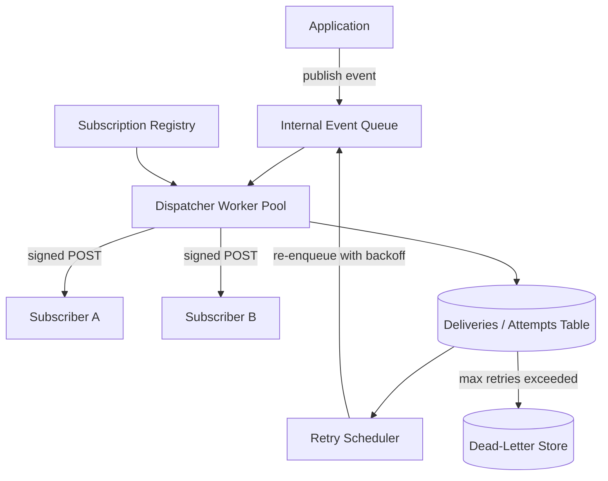

#### Real-Life Use Case

A payments platform's original webhook implementation called subscriber URLs directly from inside the same request handler that processed the charge, which meant a single slow subscriber endpoint could add seconds of latency to the checkout flow itself. Re-architecting to publish an internal event to a queue, with a separate dispatcher worker pool handling all outbound delivery asynchronously, decoupled checkout latency entirely from subscriber response times, and let the platform add per-subscriber circuit breakers so one customer's broken integration no longer risked slowing down the core payment flow for anyone.

#### Java Code Example

```java
import java.util.List;
import java.util.concurrent.ExecutorService;
import java.util.concurrent.Executors;

// Simplified dispatcher: fans an internal event out to every active subscription
// on a bounded worker pool, decoupled from the code that produced the event.
public class WebhookDispatcher {

    private final ExecutorService workerPool = Executors.newFixedThreadPool(10);
    private final SubscriptionRegistry registry;
    private final DeliveryAttemptStore deliveryStore;

    public WebhookDispatcher(SubscriptionRegistry registry, DeliveryAttemptStore deliveryStore) {
        this.registry = registry;
        this.deliveryStore = deliveryStore;
    }

    public void dispatch(String eventType, String payload) {
        List<Subscription> subscribers = registry.findActiveSubscriptions(eventType);
        for (Subscription subscription : subscribers) {
            workerPool.submit(() -> deliverToOne(subscription, payload));
        }
    }

    private void deliverToOne(Subscription subscription, String payload) {
        try {
            int statusCode = HttpDeliveryClient.postSigned(
                    subscription.callbackUrl(), payload, subscription.secret());
            deliveryStore.recordAttempt(subscription.id(), statusCode, statusCode / 100 == 2);
        } catch (Exception ex) {
            deliveryStore.recordAttempt(subscription.id(), -1, false);
        }
    }

    // Supporting types referenced above, kept minimal for illustration.
    public record Subscription(String id, String callbackUrl, String secret) {}
    public interface SubscriptionRegistry {
        List<Subscription> findActiveSubscriptions(String eventType);
    }
    public interface DeliveryAttemptStore {
        void recordAttempt(String subscriptionId, int statusCode, boolean success);
    }
    static class HttpDeliveryClient {
        static int postSigned(String url, String payload, String secret) { return 200; }
    }
}
```

#### Interview Questions and Answers

**Q1. Why should an application never call subscriber webhook URLs synchronously from the same code path that produces the event?**
A: A subscriber's endpoint could be slow, unresponsive, or down, and calling it synchronously would make the core application's operation (e.g., processing a payment) wait on an external, untrusted system's response time. Publishing the event to an internal queue and delivering it asynchronously through a separate dispatcher decouples core application latency from subscriber behavior entirely.

**Q2. How does a webhook dispatcher avoid one slow or broken subscriber from affecting delivery to all the others?**
A: By tracking delivery attempts per subscription independently and applying a per-subscription circuit breaker: after enough consecutive failures, the dispatcher stops sending new attempts to that specific subscriber for a cool-down period, while continuing to deliver normally to every other, healthy subscription. Bounded concurrency per subscriber also prevents one slow endpoint from consuming all dispatcher worker threads.

**Q3. What information should be stored per delivery attempt, and why?**
A: At minimum: the subscription id, the event id, the attempt count, the HTTP status code (or error) received, and the timestamp of the next scheduled retry. This is what allows the retry scheduler to know what is due for a retry and with what backoff delay, and it doubles as an audit trail for debugging and for any consumer-facing delivery log.

**Q4. Why is a manual replay mechanism necessary if automated retries already exist?**
A: Automated retries only help when the failure was transient (a temporary outage, a network blip). If the failure was caused by a bug in the consumer's own handler, every automated retry will fail identically until the bug is fixed; only after that fix does replaying the specific dead-lettered event(s) actually recover the lost data, which requires a manual trigger rather than another automatic attempt.

### Consuming Webhooks Reliably (Consumer Side)

Building a reliable webhook consumer is less about the language or framework used and more about discipline in how the receiving endpoint is structured: it must do the minimum possible work synchronously, verify everything before trusting it, and treat all downstream processing as something that can fail and be retried independently of the HTTP request/response cycle. A consumer that gets this wrong typically discovers it the hard way, either through duplicate side effects, lost events during a deploy, or a provider disabling the subscription after too many timeouts.

The receiving endpoint's synchronous responsibilities should be limited to exactly three things: verify the request is authentic (signature and timestamp), check whether this event id has already been recorded (idempotency), and persist the raw payload to a durable queue or table before returning a `2xx` response. Everything else, sending confirmation emails, updating multiple downstream systems, calling other internal services, belongs in a background worker that consumes from that durable queue, entirely separate from the HTTP handler. This separation is what makes the endpoint fast and reliable even when downstream processing is occasionally slow, buggy, or temporarily unavailable, since a failure in the worker does not translate into the provider seeing a timeout and needlessly retrying an event that was, in fact, safely received.

#### Best Practices

- Respond `2xx` as soon as the payload is verified and durably enqueued, never after completing the full business logic, so provider-imposed timeouts are never a factor in whether an event is considered delivered.
- Verify the signature (and timestamp, for replay protection) before doing anything else with the payload, including before parsing it into application objects.
- Persist the raw payload and event id to durable storage (a queue or a table) before returning a response, so a crash immediately after responding does not lose the event.
- Make every downstream handler idempotent and safe to run more than once for the same event id, and monitor a dead-letter/failure queue for events that repeatedly fail processing after being accepted.
- Return meaningful, distinct status codes for genuinely different failure classes (`401` for signature failure, `400` for malformed payload, `503` if temporarily unable to enqueue) so the provider's retry logic and any delivery dashboard reflect what actually happened.

#### Diagram

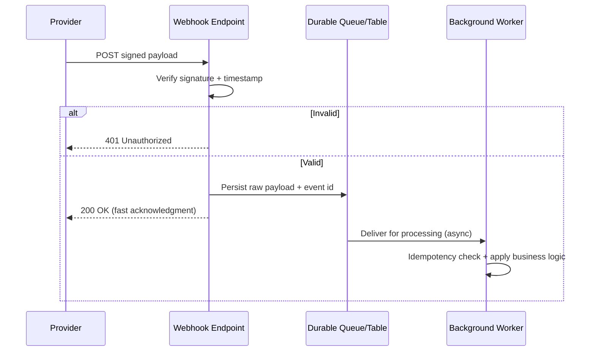

#### Real-Life Use Case

A subscription management SaaS product processed webhook payloads entirely inline inside the HTTP handler, including sending a confirmation email via a third-party email API. When that email API occasionally took eight to ten seconds to respond, the provider's webhook dispatcher (with a five-second timeout) treated the request as failed and retried it, causing the same subscription-renewed event to be processed, and the confirmation email sent, two or three times per slow request. Moving the email send (and all other business logic) into a background worker that consumed from a queue populated by a thin, fast-acknowledging endpoint eliminated the duplicate emails entirely, since the endpoint now responded in milliseconds regardless of how long downstream processing took.

#### Java Code Example

```java
import com.sun.net.httpserver.HttpExchange;
import com.sun.net.httpserver.HttpHandler;
import java.io.IOException;
import java.util.concurrent.BlockingQueue;
import java.util.concurrent.LinkedBlockingQueue;

// Reliable consumer endpoint: verify, persist, acknowledge, then process
// everything else asynchronously on a separate worker thread.
public class ReliableWebhookEndpoint implements HttpHandler {

    private final BlockingQueue<WebhookEvent> durableQueue = new LinkedBlockingQueue<>();
    private final WebhookSignatureVerifier verifier;

    public ReliableWebhookEndpoint(WebhookSignatureVerifier verifier) {
        this.verifier = verifier;
        startBackgroundWorker();
    }

    @Override
    public void handle(HttpExchange exchange) throws IOException {
        String rawBody = new String(exchange.getRequestBody().readAllBytes());
        String signature = exchange.getRequestHeaders().getFirst("X-Signature");

        boolean valid;
        try {
            valid = verifier.verify(rawBody, System.currentTimeMillis() / 1000, signature, "shared-secret");
        } catch (Exception ex) {
            valid = false;
        }

        if (!valid) {
            exchange.sendResponseHeaders(401, -1);
            exchange.close();
            return;
        }

        durableQueue.offer(new WebhookEvent(rawBody));

        byte[] ack = "OK".getBytes();
        exchange.sendResponseHeaders(200, ack.length);
        exchange.getResponseBody().write(ack);
        exchange.close();
    }

    private void startBackgroundWorker() {
        Thread worker = new Thread(() -> {
            while (true) {
                try {
                    WebhookEvent event = durableQueue.take();
                    System.out.println("Processing in background: " + event.rawBody());
                } catch (InterruptedException ignored) {
                    Thread.currentThread().interrupt();
                }
            }
        });
        worker.setDaemon(true);
        worker.start();
    }

    public record WebhookEvent(String rawBody) {}
}
```

#### Interview Questions and Answers

**Q1. What is the minimum work a webhook receiving endpoint should do before returning a response?**
A: Verify the request's signature and timestamp, check (or defer checking) idempotency, and durably persist the raw payload, typically to a queue or a database table, before responding `2xx`. Everything else, the actual business logic, belongs in a background process that consumes from that durable store.

**Q2. Why should the actual business logic never run inline inside the HTTP handler for a webhook?**
A: Providers enforce timeouts on delivery attempts, and if downstream processing (calling other services, sending emails, updating multiple systems) is occasionally slow, the handler risks exceeding that timeout, causing the provider to treat a successfully received event as failed and retry it, producing duplicate processing.

**Q3. What should a webhook endpoint return when signature verification fails, and why does that status code matter?**
A: It should return `401 Unauthorized` specifically, distinct from other failure types, so the provider's retry logic and delivery dashboards correctly classify it as an authentication problem rather than a transient server error worth retrying, since retrying a request that will always fail signature verification wastes both sides' resources.

**Q4. How does persisting the raw payload before responding protect against data loss?**
A: If the process crashes immediately after sending the `200 OK` response but before the background worker has processed the event, having already durably persisted the payload means the worker (or a restarted instance of it) can still pick it up and process it once the service recovers, rather than the event being silently lost because it only ever existed in memory.

### Real-World Use Cases of Webhooks

Webhooks show up anywhere one system needs to tell another, often independently owned, system that something happened, without either side polling. A few concrete, well-known examples illustrate the range of situations they fit.

- **Payment confirmations (Stripe, PayPal, Razorpay)**: A merchant's backend needs to know the instant a charge succeeds, fails, or is disputed, since order fulfillment, inventory decrement, and customer notification all depend on that outcome; a webhook lets the payment provider push that result the moment it is known, rather than the merchant polling a transaction status endpoint after every checkout.
- **Source control and CI/CD (GitHub, GitLab, Bitbucket)**: A push, pull request, merge, or tag triggers a webhook to a CI/CD system, kicking off a build/test/deploy pipeline within seconds of the code change, which is the mechanism that makes "push to deploy" and automated pull request checks feel instantaneous rather than running on a periodic scan of the repository.
- **Customer support and CRM integrations (Zendesk, Salesforce, HubSpot)**: When a support ticket is created, updated, or resolved, a webhook can notify a Slack channel, update an internal dashboard, or trigger a satisfaction survey email, keeping multiple systems in sync the moment a change happens rather than each one running its own polling job against the same API.
- **E-commerce and marketplace platforms (Shopify, Amazon marketplace APIs)**: Order creation, inventory changes, and shipment status updates are pushed via webhook to third-party fulfillment services, accounting systems, and analytics platforms, allowing an entire ecosystem of independently built integrations to react to the same events without the platform needing bespoke code for each one.
- **Messaging and chat platforms (Slack, Discord, Twilio)**: Incoming messages, mentions, or delivery status for an SMS/voice call are delivered via webhook to the application that needs to react, enabling chatbots and notification systems to respond to events in near real time.
- **Infrastructure and monitoring (PagerDuty, Datadog, AWS SNS/EventBridge)**: An alert firing, a threshold being breached, or a cloud resource changing state is pushed via webhook to on-call notification systems or automation scripts, so incident response can begin within seconds of a problem being detected rather than after the next scheduled health check.

#### Diagram

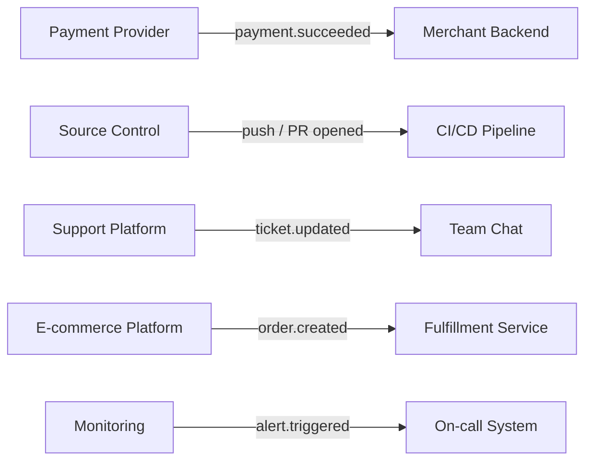

#### Real-Life Use Case

A mid-sized online retailer's tech stack integrates four separate webhook consumers against a single `order.created` event from their e-commerce platform: a fulfillment service that reserves inventory and schedules a warehouse pick, an accounting system that books revenue, an email service that sends the order confirmation, and an analytics pipeline that updates real-time sales dashboards. Each of these four systems was built and is maintained by a different team (and one, the analytics pipeline, by an external vendor), yet none of them needed to coordinate with each other or poll the e-commerce platform's API; the platform's webhook dispatcher simply fans the single event out to all four independently registered endpoints.

#### Java Code Example

```java
import java.util.List;

// Illustrates fan-out to independently owned consumers reacting to one event type.
public class OrderCreatedFanOutExample {

    public interface OrderEventConsumer {
        void onOrderCreated(String orderPayload);
    }

    static class FulfillmentService implements OrderEventConsumer {
        public void onOrderCreated(String orderPayload) {
            System.out.println("Reserving inventory for: " + orderPayload);
        }
    }

    static class AccountingService implements OrderEventConsumer {
        public void onOrderCreated(String orderPayload) {
            System.out.println("Booking revenue for: " + orderPayload);
        }
    }

    static class AnalyticsService implements OrderEventConsumer {
        public void onOrderCreated(String orderPayload) {
            System.out.println("Updating dashboard for: " + orderPayload);
        }
    }

    public static void main(String[] args) {
        List<OrderEventConsumer> subscribers = List.of(
                new FulfillmentService(), new AccountingService(), new AnalyticsService());

        String incomingOrderEvent = "{\"orderId\": \"ORD-1001\"}";

        // Each subscriber reacts independently to the same single event.
        for (OrderEventConsumer consumer : subscribers) {
            consumer.onOrderCreated(incomingOrderEvent);
        }
    }
}
```

#### Interview Questions and Answers

**Q1. Why do payment providers like Stripe rely on webhooks instead of expecting merchants to poll for payment status?**
A: Payment outcomes (success, failure, dispute, refund) can happen asynchronously and at any time, sometimes well after the initial checkout request completes (e.g., a bank's fraud check delays approval). Polling would either add latency (waiting for the next poll) or waste requests, while a webhook lets the merchant react the instant the final outcome is known.

**Q2. How do webhooks enable a "push to deploy" CI/CD workflow?**
A: A push or merge to a repository triggers a webhook from the source control platform directly to the CI/CD system, which starts the build/test/deploy pipeline within seconds of the code change, without any component needing to periodically poll the repository for new commits.

**Q3. Why is a single e-commerce event like "order created" often delivered to multiple, independently owned consumers?**
A: Different teams (or even external vendors) each own a different downstream concern, fulfillment, accounting, notifications, analytics, and none of them need to coordinate with each other or with the platform beyond registering their own webhook subscription; the platform's dispatcher fans the one event out to all registered subscribers independently.

**Q4. Why are webhooks well suited to incident alerting systems like PagerDuty or Datadog?**
A: An alert condition (a threshold breach, a service going down) needs to reach an on-call notification system within seconds for incident response to begin promptly; a webhook delivers that alert the instant it is detected, rather than the notification system needing to poll a monitoring API on some fixed interval and potentially delaying the page by that interval's length.

### Best Practices for Building and Operating Webhooks

Bringing together the practices scattered across the topics above, a production-quality webhook system, on both the provider and consumer sides, consistently follows these habits.

- **Sign every payload and verify every signature**: The provider should sign every outbound request with a per-subscriber secret (HMAC-SHA256 over the raw body, plus a timestamp), and the consumer should verify that signature, and the timestamp's freshness, before trusting anything in the payload.
- **Acknowledge fast, process asynchronously**: The receiving endpoint's only synchronous job is verification and durable enqueueing; actual business logic runs in a background worker so provider-side timeouts are never a factor in whether an event was successfully received.
- **Design for at-least-once delivery**: Assume every event can be delivered more than once and make handlers idempotent by keying on the provider's event id, checked and recorded atomically alongside the business-logic side effect.
- **Retry with exponential backoff and a bounded attempt count**: The provider should space retries out increasingly (with jitter, to avoid synchronized retry storms) and eventually dead-letter an event rather than retrying forever, giving the consumer time to recover without losing the event permanently.
- **Expose delivery visibility**: Providers should offer a delivery log/dashboard showing attempt history and status per event, and ideally a manual replay action; consumers benefit enormously from being able to see what was sent, when, and how their endpoint responded.
- **Version the payload schema**: Include a version field (or use dated API versions) in the payload so the consumer can adapt to schema changes deliberately rather than being broken by an unannounced field rename or type change.
- **Keep payloads minimal and fetch details separately if needed**: Send the essential event data and identifiers in the payload rather than the full current state of a large object, and let the consumer call back to a regular API for further detail if required, keeping webhook payloads small and delivery fast.
- **Support secret rotation without downtime**: Allow two signing secrets to be valid simultaneously during a transition window, so rotating a compromised or expiring secret does not cause a burst of failed-signature rejections.
- **Rate-limit and circuit-break per subscriber**: Prevent one slow, broken, or abusive subscriber from consuming disproportionate dispatcher resources or delaying delivery to every other subscriber.
- **Monitor both dispatch and receipt**: Track delivery success rate, latency, and retry counts on the provider side, and track processing failures and dead-lettered events on the consumer side, since a healthy-looking webhook system can still be silently dropping a subset of events without this visibility.

#### Diagram

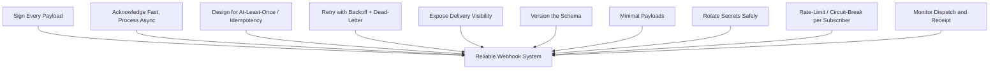

#### Real-Life Use Case

A developer-tools company audited their webhook system after a customer complained about occasional missed events, and found they were missing four of the ten practices above: payloads were unsigned, the schema had no version field (a recent field rename had silently broken several customers' integrations), retries used a fixed 1-minute interval with no cap (causing retry storms during outages), and there was no delivery dashboard for customers to self-diagnose issues. Addressing all four (HMAC signing, a `schema_version` field, exponential backoff with a 20-attempt cap, and a customer-facing delivery log) eliminated the support tickets tied to "missing" events within a month, since most had actually been delivered and processed but were invisible to the customer beforehand.

#### Java Code Example

```java
// A checklist-style validator that a delivery configuration follows the
// core best practices before a new webhook subscription is activated.
public class WebhookConfigChecklist {

    public static void validate(WebhookSubscriptionConfig config) {
        if (config.signingSecret() == null || config.signingSecret().isBlank()) {
            throw new IllegalStateException("Signing secret is required");
        }
        if (config.maxRetryAttempts() <= 0 || config.maxRetryAttempts() > 25) {
            throw new IllegalStateException("Retry attempts must be bounded (1-25)");
        }
        if (!config.usesExponentialBackoff()) {
            throw new IllegalStateException("Retries must use exponential backoff, not a fixed interval");
        }
        if (config.schemaVersion() == null) {
            throw new IllegalStateException("Payload schema must declare a version");
        }
        System.out.println("Webhook subscription config passes best-practice checklist");
    }

    public record WebhookSubscriptionConfig(
            String signingSecret,
            int maxRetryAttempts,
            boolean usesExponentialBackoff,
            String schemaVersion) {}
}
```

#### Interview Questions and Answers

**Q1. If you could only implement three webhook best practices due to time constraints, which would you prioritize and why?**
A: Signature verification (without it, the endpoint is trivially spoofable), fast acknowledgment with asynchronous processing (without it, the provider's timeouts cause needless retries and duplicate processing), and idempotency on event id (without it, the unavoidable duplicates from at-least-once delivery cause double-applied side effects). The remaining practices (schema versioning, delivery dashboards, secret rotation) matter for long-term maintainability but do not cause immediate correctness or security problems if temporarily deferred.

**Q2. Why is schema versioning important for webhook payloads specifically, more so than for a typical internal API?**
A: Webhook consumers are often external, independently maintained integrations that the provider cannot coordinate a synchronized deploy with; an unannounced field rename or type change can silently break every consumer at once. A version field lets the provider introduce changes deliberately, with consumers able to opt in on their own schedule rather than being broken without warning.

**Q3. Why should webhook payloads be kept minimal rather than including the full current state of the affected object?**
A: Smaller payloads are faster to deliver and sign, put less load on the dispatcher at high fan-out volumes, and reduce the risk of exposing more data than necessary to every subscriber. A consumer that needs the full current state can call back to a regular, authenticated API endpoint using the identifier included in the (minimal) webhook payload.

**Q4. Why does a provider need to expose delivery visibility (a dashboard or logs) to its webhook customers?**
A: Because webhook failures happen asynchronously and are otherwise invisible to the consumer, a customer who suspects a "missing" event has no way to distinguish "it was never sent," "it failed and is still retrying," or "it failed permanently and was dead-lettered" without being able to see the actual delivery attempt history, which is essential both for the customer's own debugging and for reducing support burden on the provider.

### Webhooks: Characteristics, Pros, Cons, Use Cases, Components, Patterns, Benefits, Challenges, Best Practices and When to Use

This final section consolidates the topics above into a single reference summary of webhooks as a whole.

**Characteristics**: A webhook is a push-based, event-driven HTTP callback built on plain, stateless HTTP requests rather than a persistent connection. Each delivery is an independent request carrying at-least-once delivery semantics (duplicates are possible and expected), no default ordering guarantee, and requires the consumer to expose a publicly reachable endpoint.

**Components**: A complete webhook system needs an event source (detects that something happened), a subscription registry (who wants to know about what, with their secret and callback URL), a dispatcher/delivery service (fans events out and tracks attempts), a retry/backoff engine, a signature/secret store for verification, and, on the consumer side, a receiving endpoint backed by a durable queue and background worker.

**Patterns**: The defining pattern is fire-and-forget push with at-least-once delivery and retries. Supporting patterns include queue-then-process on the consumer side (decoupling acknowledgment from business logic), fan-out to multiple subscribers, per-subscription circuit breaking on the dispatcher side, dead-letter and manual replay for permanently failed deliveries, and idempotency-key tracking plus sequence/version reconciliation for correctness under duplicates and reordering.

**Pros / Benefits**: Real-time, low-latency notifications without polling; reduced load and cost on both sides since requests are only sent when something actually happened; simple to consume (just a plain HTTP endpoint, no special client or persistent connection); decoupled integration between provider and consumer; and effortless fan-out to many independently registered subscribers without changes to the event source.

**Cons / Challenges**: Requires the consumer to expose and maintain a publicly reachable, always-available endpoint; is vulnerable to forged or replayed requests without signature and timestamp verification; delivers duplicates and out-of-order events by design, pushing idempotency and reconciliation work onto the consumer; is harder to debug than a synchronous API call since failures happen on the provider's dispatch side; and offers no built-in guarantee of exact timing or strict ordering.

**Use Cases**: Payment confirmations, source-control and CI/CD triggers, customer-support and CRM integrations, e-commerce order/inventory/shipment updates, chat and messaging platform events, and infrastructure/monitoring alerts, essentially any scenario where an external or loosely coupled system needs near-real-time notification of an event without polling or a persistent connection.

**Best Practices**: Sign every payload with a per-subscriber secret and verify signature and timestamp before trusting anything; acknowledge with `2xx` quickly and process asynchronously; design every handler to be idempotent on event id; retry with exponential backoff and jitter up to a bounded attempt count, then dead-letter; expose delivery visibility (logs, dashboards, manual replay); version the payload schema; keep payloads minimal; support secret rotation without downtime; rate-limit and circuit-break per subscriber; and monitor both dispatch and receipt as first-class metrics.

**When to Use**: Choose webhooks when a provider needs to notify a consumer of discrete, relatively infrequent-to-moderate-frequency events in near real time, and the consumer can expose a plain HTTP endpoint without needing a persistent bidirectional connection, particularly across organizational or trust boundaries where adopting the provider's internal messaging stack is not realistic. Prefer polling only when the consumer genuinely cannot accept inbound connections; prefer WebSockets or SSE when the counterpart is an interactively connected client needing frequent bidirectional or streaming updates; and prefer an internal message queue when both sides are within the same trust boundary and need stronger throughput, ordering, or replay guarantees than webhooks provide.
