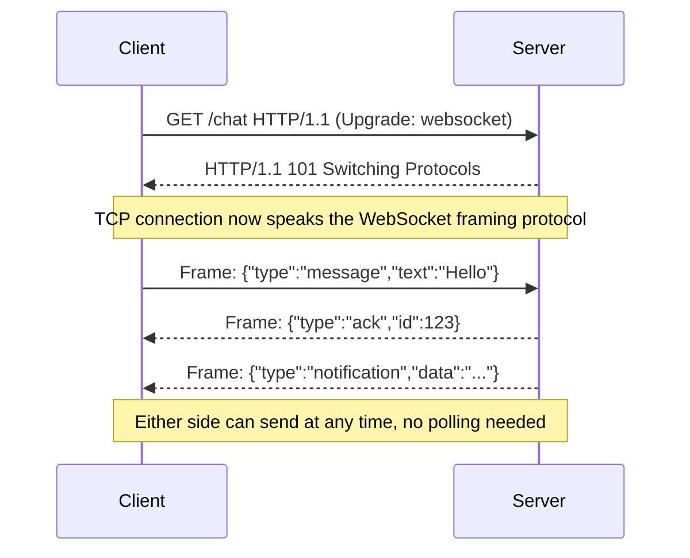
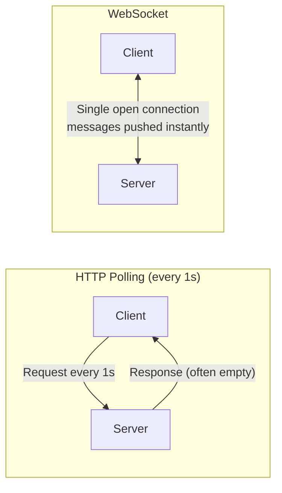
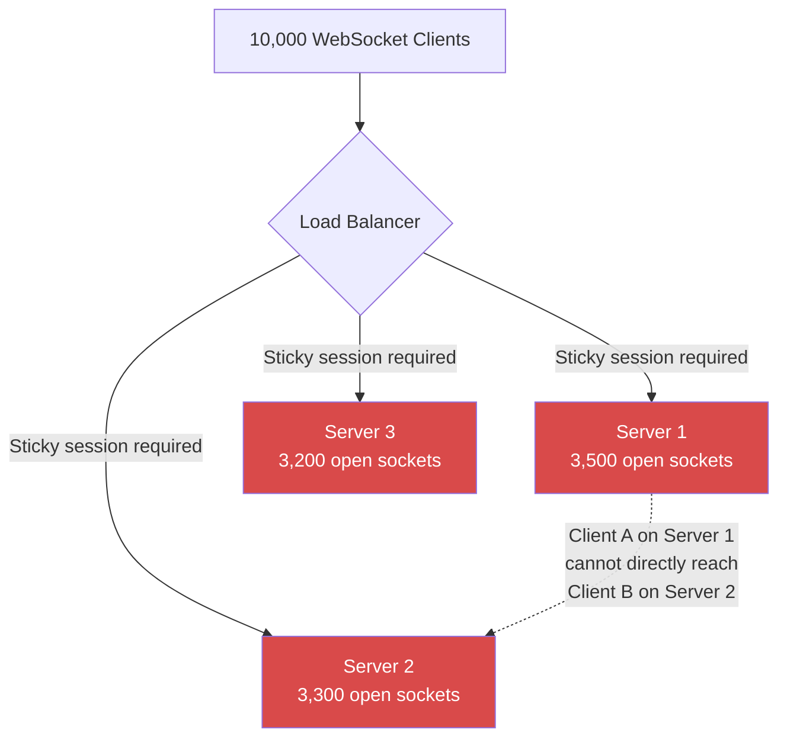
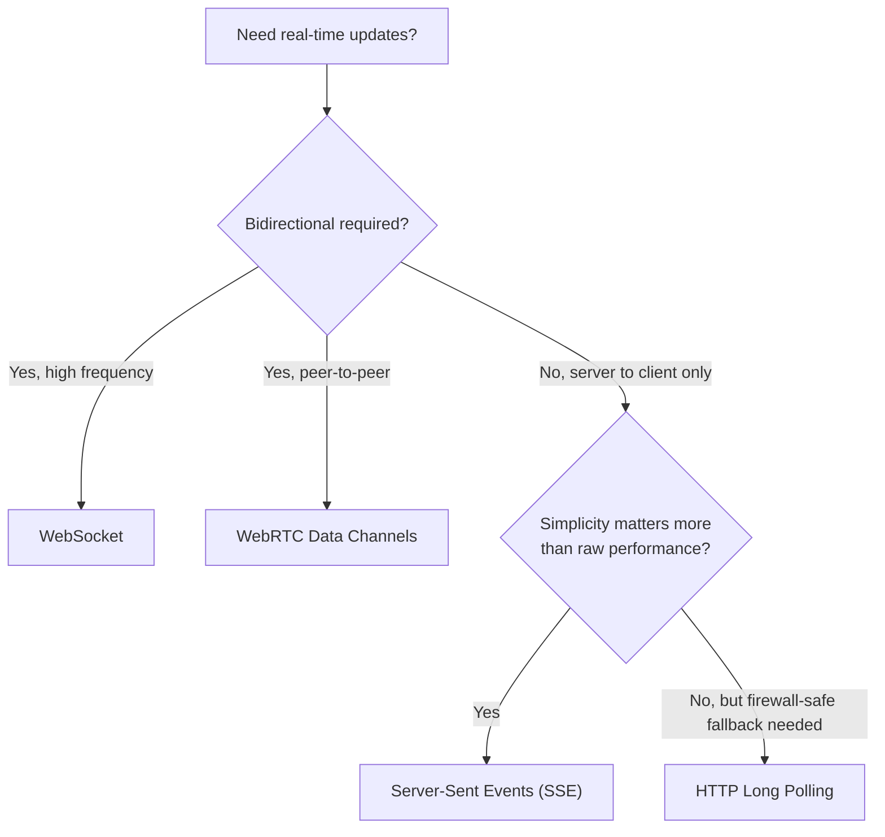
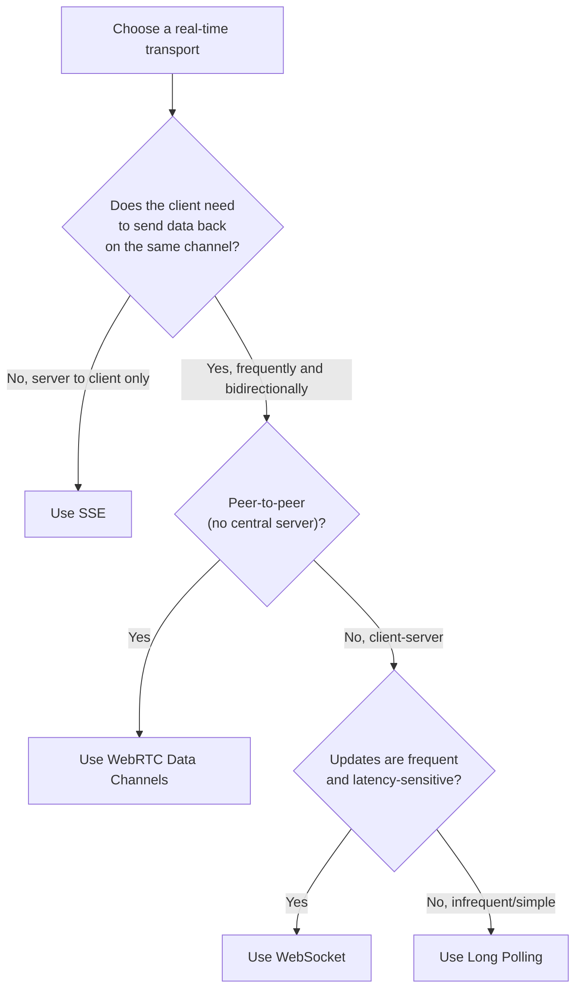
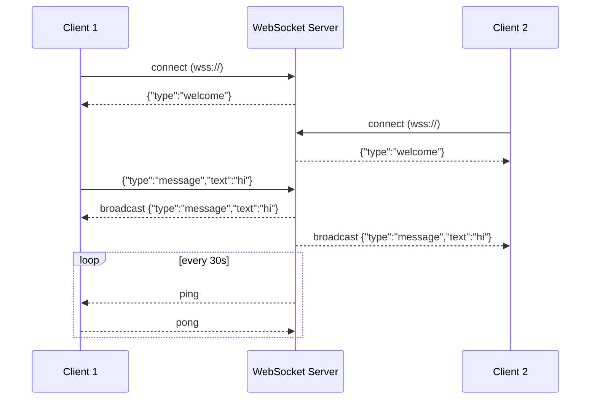
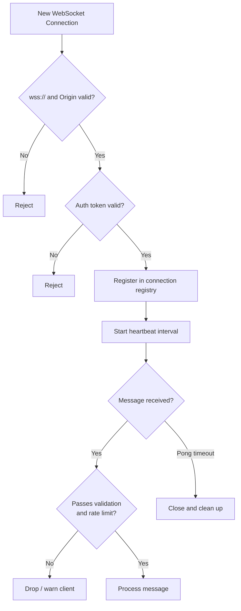
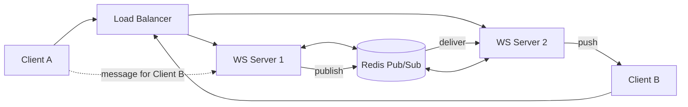
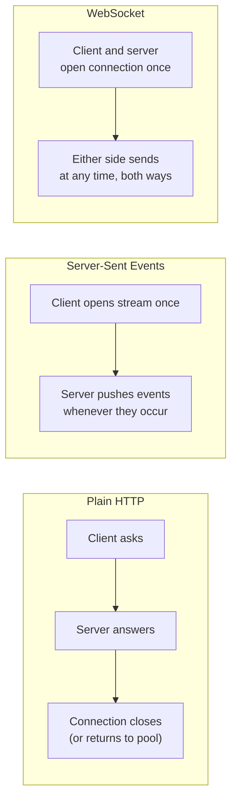

# WebSockets

## Blogs and websites


## Medium


## Youtube

- [How to horizontally scale up websocket servers](https://www.youtube.com/watch?v=hl3_MANBiyc)
- [Scaling Websockets Horizontally | SocketIo | Redis Pub\Sub | HandsOn](https://www.youtube.com/watch?v=dcroxRr8uJc)
- [How to scale WebSockets to millions of connections](https://www.youtube.com/watch?v=vXJsJ52vwAA)
- [Scaling Websockets with Redis, HAProxy and Node JS - High-availability Group Chat Application](https://www.youtube.com/watch?v=gzIcGhJC8hA)
- [WebSockets Aren’t as Reliable as You Think.. Here's Why](https://www.youtube.com/watch?v=ImzYxO3Lsvc)
- [How I would SCALE WebSocket system in 2026 (Architecture deep dive) | Hindi](https://www.youtube.com/watch?v=ORupgrqr3R0)

## Theory

### Topics Covered

This page is organized into the following topics. Each topic includes a detailed explanation, its characteristics, components, patterns, pros/benefits, cons/challenges, best practices, when to use it, a real-life use case, a diagram, a Java code example, and interview questions with answers.

1. [Introduction: The Real-Time Communication Channel](#the-real-time-communication-channel)
2. [Characteristics of WebSockets](#characteristics-of-websockets)
3. [Advantages of WebSockets (Pros and Benefits)](#advantages-of-websockets)
4. [Disadvantages of WebSockets (Cons and Challenges)](#disadvantages-of-websockets)
5. [Alternatives to WebSockets](#alternatives-to-websockets)
6. [When to Use WebSockets vs Alternatives](#when-to-use-websockets-vs-alternatives)
7. [WebSocket Implementation: Client and Server](#websocket-implementation-examples)
8. [WebSocket Best Practices](#websocket-best-practices)
9. [Scaling WebSocket Servers](#scaling-websocket-servers)
10. [WebSocket vs HTTP: The Decision](#websocket-vs-http-the-decision)
11. [WebSockets: Characteristics, Pros, Cons, Use Cases, Components, Patterns, Benefits, Challenges, Best Practices and When to Use](#websockets-characteristics-pros-cons-use-cases-components-patterns-benefits-challenges-best-practices-and-when-to-use)

### The Real-Time Communication Channel

WebSocket (defined in [RFC 6455](https://www.rfc-editor.org/rfc/rfc6455)) is a communication protocol that provides a full-duplex, persistent connection over a single TCP socket, letting a client and a server exchange messages in either direction at any time, without the request/response ceremony of plain HTTP. It starts life as a normal HTTP request so it can pass through the same ports (80/443) and infrastructure as the web, but then "upgrades" that connection into a raw, bidirectional message channel that stays open for as long as both sides want it to.

The key idea that separates WebSocket from ordinary HTTP is that after the initial handshake, there is no more request/response pattern: either side can push a message whenever it has something to say, and the other side receives it as an event. This is what makes WebSocket the protocol of choice for chat, live collaboration, gaming, and trading systems, where "server tells client something changed" needs to happen instantly instead of waiting for the client to ask again.

**Features:**
- **Bidirectional communication**: Both the client and the server can initiate a message at any time; there is no fixed "requester" and "responder" role after the handshake completes.
- **Low latency**: Once the connection is open, a message is just a small framed payload sent directly over the existing TCP socket, so there is no repeated DNS lookup, TCP handshake, TLS negotiation, or HTTP header overhead per message.
- **Persistent connection**: The underlying TCP connection is kept open for the life of the session (potentially hours), so the cost of establishing the connection is paid once, not on every interaction.
- **Works over HTTP (upgrades connection)**: Because the handshake is a normal HTTP `GET` request with an `Upgrade` header, WebSocket connections can traverse the same load balancers, reverse proxies, and firewalls that already understand HTTP/HTTPS, as long as they are configured to allow the protocol upgrade.

**How WebSocket Works:**

The handshake below is the mechanism that lets a WebSocket connection "borrow" the trust and infrastructure of HTTP (ports, proxies, TLS) while switching to a completely different wire format afterwards.

```
1. Client initiates HTTP request
   GET /chat HTTP/1.1
   Host: example.com
   Upgrade: websocket
   Connection: Upgrade
   Sec-WebSocket-Key: dGhlIHNhbXBsZSBub25jZQ==
   Sec-WebSocket-Version: 13

2. Server accepts upgrade
   HTTP/1.1 101 Switching Protocols
   Upgrade: websocket
   Connection: Upgrade
   Sec-WebSocket-Accept: s3pPLMBiTxaQ9kYGzzhZRbK+xOo=

3. Connection upgraded to WebSocket
   ┌────────────────────────────────┐
   │   Client ←───────────→ Server   │
   │                                │
   │   Bidirectional messages       │
   │   Both can send anytime        │
   └────────────────────────────────┘

4. Messages flow freely
   Client → Server: {type: "message", text: "Hello"}
   Server → Client: {type: "ack", id: 123}
   Server → Client: {type: "notification", data: ...}
```

Step by step, this is what happens on the wire:

1. **Client sends an HTTP upgrade request**: The client sends a normal-looking `GET` request but includes `Upgrade: websocket`, `Connection: Upgrade`, and a random, base64-encoded `Sec-WebSocket-Key`. This key exists purely to prove that the response actually came from a WebSocket-aware server and was not replayed or cached by an intermediary.
2. **Server computes the accept key and responds `101 Switching Protocols`**: The server concatenates the client's key with a fixed GUID (`258EAFA5-E914-47DA-95CA-C5AB0DC85B11`), SHA-1 hashes it, base64-encodes the result, and returns it as `Sec-WebSocket-Accept`. A `101` status code (instead of `200`) tells the client and any intermediaries that the protocol on this TCP connection is changing.
3. **The TCP connection is repurposed**: From this point on, the same TCP socket no longer carries HTTP messages. Both ends switch to the WebSocket framing protocol, which wraps each message in a small binary frame header (as little as 2 bytes) describing its type (text, binary, ping, pong, close) and length.
4. **Messages flow in both directions, unprompted**: Either side can send a frame at any time. There is no concept of "the client must ask before the server can answer" anymore, which is the fundamental behavioral difference from HTTP.

**Use Cases:**
- **Chat applications**: Messages must appear on every participant's screen within milliseconds of being sent, and either party can send at any time.
- **Real-time notifications**: The server needs to push an alert (a new comment, a friend request, a price alert) the instant it happens, rather than waiting for the client to poll.
- **Live sports updates**: Score and event updates must reach thousands of viewers simultaneously, in near real time, from a single authoritative source.
- **Collaborative editing**: Multiple users edit the same document simultaneously (e.g., Google Docs style), and every keystroke or cursor movement from one user must be reflected on everyone else's screen almost instantly.
- **Online gaming**: Player positions, actions, and game state changes must be exchanged with minimal delay in both directions to keep gameplay responsive and fair.
- **Stock trading platforms**: Prices change many times per second and must be pushed to traders instantly, while orders placed by the trader must reach the exchange with minimal delay.

#### Components

- **WebSocket client**: The browser or application code that opens the connection (e.g., the `WebSocket` JavaScript API, or a client library like `okhttp-ws` in Java/Android) and reacts to `open`, `message`, `error`, and `close` events.
- **WebSocket server**: The process that accepts the upgrade request, maintains the open socket per client, and can push messages proactively (e.g., `ws` in Node.js, Spring's `WebSocketHandler` in Java, or `Socket.IO` for a higher-level abstraction with fallbacks).
- **Handshake negotiator**: The part of the server (often built into the HTTP server or framework) responsible for validating the `Upgrade` request, computing `Sec-WebSocket-Accept`, and switching the connection's protocol handler.
- **Framing layer**: The component (usually part of the WebSocket library) that encodes/decodes application messages into WebSocket frames, handling fragmentation for large messages and control frames (ping/pong/close).
- **Connection registry**: An in-memory (or distributed) map from connection/user identity to the live socket, used by the server to know which sockets to write to when broadcasting or targeting a specific user.

#### Patterns

- **Upgrade-then-stream pattern**: Start as HTTP (for compatibility with existing infrastructure), then upgrade to a persistent bidirectional stream. This is the core pattern that defines WebSocket itself.
- **Heartbeat (ping/pong) pattern**: Periodically send small control frames to detect dead connections and keep intermediate proxies/NATs from silently closing an "idle" TCP connection.
- **Fan-out / broadcast pattern**: A single incoming message from one client is retransmitted to many other connected clients (used heavily in chat rooms and live dashboards).
- **Room/channel pattern**: Connections are grouped into logical channels (e.g., `chat-room-42`) so that broadcasts can be scoped to only the relevant subset of connected clients instead of everyone.

#### Best Practices

- Always negotiate and use `wss://` (WebSocket over TLS) in production so the handshake and all subsequent frames are encrypted, exactly as you would insist on HTTPS.
- Validate the `Origin` header during the handshake to prevent unauthorized cross-origin pages from opening WebSocket connections to your server (Cross-Site WebSocket Hijacking).
- Keep the handshake path authenticated (e.g., pass a short-lived token as a query parameter or cookie) since the `Upgrade` request is the only point where you can easily attach standard HTTP auth headers or cookies.
- Set sensible timeouts for the handshake itself so a slow or malicious client cannot hold a half-open connection indefinitely.

#### When to Use

- Choose the raw WebSocket protocol (over the alternatives discussed later) when you need true low-latency, bidirectional, high-frequency messaging and you control both the client and server well enough to implement reconnection and heartbeat logic.
- Prefer it when the cost of a slightly more complex implementation is clearly outweighed by the latency and bandwidth savings of avoiding repeated HTTP requests.

#### Diagram



#### Real-Life Use Case

A customer support chat widget embedded on an e-commerce site opens a WebSocket connection the moment the widget loads. When the customer types a message, it is sent instantly over the open socket. When a support agent (connected from a completely different internal dashboard, possibly on a different server) replies, the message is pushed to the customer's browser within milliseconds, without the browser ever having to ask "do you have anything new for me?" This is the behavior that HTTP polling could only approximate, at much higher latency and server cost.

#### Java Code Example

```java
import java.net.URI;
import java.net.http.HttpClient;
import java.net.http.WebSocket;
import java.util.concurrent.CompletionStage;

// Minimal WebSocket client using the built-in java.net.http.WebSocket API (Java 11+).
public class WebSocketHandshakeDemo {

    public static void main(String[] args) throws Exception {
        HttpClient httpClient = HttpClient.newHttpClient();

        WebSocket.Listener listener = new WebSocket.Listener() {
            @Override
            public CompletionStage<?> onText(WebSocket webSocket, CharSequence data, boolean last) {
                System.out.println("Received: " + data);
                webSocket.request(1); // request the next message
                return null;
            }

            @Override
            public void onOpen(WebSocket webSocket) {
                System.out.println("Handshake complete, connection open");
                WebSocket.Listener.super.onOpen(webSocket);
            }

            @Override
            public CompletionStage<?> onClose(WebSocket webSocket, int statusCode, String reason) {
                System.out.println("Closed: " + statusCode + " " + reason);
                return null;
            }
        };

        WebSocket webSocket = httpClient.newWebSocketBuilder()
                .buildAsync(URI.create("wss://example.com/chat"), listener)
                .join(); // performs the HTTP Upgrade handshake under the hood

        webSocket.sendText("{\"type\":\"message\",\"text\":\"Hello\"}", true);
    }
}
```

#### Interview Questions and Answers

**Q1. How does a WebSocket connection start, and why does it begin as an HTTP request?**
A: It begins as a normal HTTP `GET` request containing `Upgrade: websocket` and a `Sec-WebSocket-Key` header. It starts as HTTP so it can reuse existing web infrastructure (ports 80/443, TLS, proxies, load balancers, firewalls) that already understands HTTP; a `101 Switching Protocols` response then repurposes the same TCP connection for WebSocket framing.

**Q2. What is the purpose of `Sec-WebSocket-Key` and `Sec-WebSocket-Accept`?**
A: They prove that the response is coming from a server that genuinely understands the WebSocket protocol and is not a cached or misconfigured HTTP response. The server hashes the client's key with a fixed GUID and returns it as `Sec-WebSocket-Accept`; the client verifies this before treating the connection as upgraded.

**Q3. Once the handshake is done, is a WebSocket connection still "HTTP"?**
A: No. After the `101` response, the same TCP socket switches to the WebSocket framing protocol, a completely different wire format from HTTP, with its own lightweight frame headers, opcodes (text, binary, ping, pong, close), and masking rules for client-to-server frames.

**Q4. Why must client-to-server WebSocket frames be masked but not server-to-client frames?**
A: Masking (XOR-ing the payload with a random key chosen per frame) prevents certain cache-poisoning and request-smuggling attacks against intermediaries (like misbehaving proxies) that might misinterpret raw client-controlled bytes as something else, such as another HTTP request. Servers are trusted more in this model, so their frames are not required to be masked.

**Q5. Can a WebSocket connection be established without ever going through HTTP?**
A: In the standard specification, no. The handshake is defined in terms of HTTP semantics (method, headers, status code) specifically so it can traverse existing HTTP-aware infrastructure. Some non-standard raw TCP protocols exist for similar goals, but they are not "WebSocket" as defined by RFC 6455 and typically cannot reuse standard web infrastructure.

### Characteristics of WebSockets

WebSocket's defining traits all follow from one design decision: keep a single TCP connection open and let messages flow as discrete, framed events in either direction, instead of one request always producing exactly one response.

- **Full-duplex communication**: Unlike HTTP, where a request always precedes a response, WebSocket allows both parties to transmit independently and simultaneously over the same connection, similar to a phone call rather than a series of letters.
- **Single, long-lived TCP connection**: One connection is opened once and reused for the entire session, which is what removes the repeated connection-setup cost (TCP handshake, TLS negotiation) that HTTP polling would otherwise pay on every request.
- **Message-oriented, not stream-oriented, framing**: Even though it runs over a TCP byte stream, the WebSocket protocol frames data into discrete messages (text or binary), so the receiving side does not need to implement its own message boundary logic on top of raw TCP.
- **Low per-message overhead**: After the handshake, each frame carries as little as 2 bytes of header (versus dozens or hundreds of bytes for repeated HTTP headers), which matters a great deal at high message rates.
- **Protocol-level ping/pong control frames**: WebSocket defines built-in `ping` and `pong` control frames specifically to let either side verify the connection is still alive, independent of application-level messages.
- **Same-origin-agnostic by default (needs explicit protection)**: Unlike `XMLHttpRequest`/`fetch`, WebSocket connections are not restricted by the browser's same-origin policy by default, which is powerful but means servers must explicitly validate `Origin` to avoid cross-site WebSocket hijacking.
- **Stateful by nature**: A WebSocket connection is inherently tied to one server process holding an open socket, which is a sharp contrast to stateless HTTP requests that can be served by any server behind a load balancer with no memory of the previous request.

### Advantages of WebSockets

```
✓ Real-Time Bidirectional Communication
  - Both client and server can send anytime
  - No need to poll for updates
  - Instant message delivery

✓ Low Latency
  - No HTTP overhead per message
  - Just data frames
  - Typical latency: 10-50ms

✓ Lower Overhead
  - No headers per message (after handshake)
  - Smaller frame headers (2-14 bytes)
  - More efficient than HTTP polling

✓ Persistent Connection
  - Single connection for lifetime
  - No repeated handshakes
  - Less server resources

✓ Server Push
  - Server can initiate messages
  - No waiting for client poll
  - Event-driven architecture

✓ Better Mobile Performance
  - Persistent connection uses less battery
  - No repeated HTTP connections
  - Lower data usage
```

**Detailed explanation of each benefit:**

- **Real-Time Bidirectional Communication**: Because either side can write to the socket at any moment, there is no inherent delay waiting for "the next poll" or "the next request." A chat message, a game action, or a price tick is transmitted the instant it occurs, and the other side's `onmessage` handler fires almost immediately, which is what makes the experience feel instantaneous to a user.
- **Low Latency**: A plain HTTP request has to go through connection setup (or reuse a pooled connection), send full headers, and wait for a full response cycle. A WebSocket message, once the connection is open, is just a small framed payload written directly to an already-established socket, so round trips shrink from "HTTP request/response" (often 100ms+) to "single frame" (often 10-50ms, bounded mostly by network RTT).
- **Lower Overhead**: HTTP headers (cookies, user agent, auth tokens, content negotiation headers) are re-sent on every single request in a polling model. WebSocket pays that cost once, during the handshake, and then every subsequent frame only needs a minimal header (as small as 2 bytes for small payloads), which adds up to significant bandwidth savings at scale.
- **Persistent Connection**: Because the same TCP (and TLS, if using `wss://`) connection stays open, the relatively expensive parts of connection setup (TCP 3-way handshake, TLS key exchange) are paid once per session instead of once per request, saving both time and server-side CPU/resources.
- **Server Push**: In HTTP, the server can never initiate a message; it can only respond to a request. WebSocket removes that constraint entirely, so the server can proactively notify the client the moment something changes (an event-driven model) instead of the client having to guess when to ask again.
- **Better Mobile Performance**: Repeatedly opening HTTP connections (as polling does) forces a mobile device's radio to wake up, negotiate a connection, and go back to a low-power state, which drains battery. A single persistent WebSocket connection keeps the radio in a lower-power "connected" state for longer stretches, and avoids the data overhead of repeated headers, which also reduces cellular data usage.

**Performance Comparison:**
```
HTTP Polling (every 1s):
  Request:  200 bytes
  Response: 100 bytes
  Per hour: 300 bytes × 3600 = 1.08 MB
  
  Latency: 0.5-2 seconds (poll interval + network)

WebSocket:
  Handshake: 500 bytes (once)
  Message:   50 bytes (just data)
  Per hour:  50 bytes × 3600 = 180 KB + 500 bytes
  
  Latency: 10-50ms (instant)
  
Data Savings: ~80-90%
Latency Improvement: ~100x faster
```

This comparison illustrates why the choice of transport matters at scale: for a single user the difference between 1.08 MB/hour and roughly 180 KB/hour of polling traffic is negligible, but multiplied across a million concurrently connected users, it becomes the difference between a manageable bandwidth bill and a very large one, and between a 1-2 second perceived delay and something that feels instantaneous.

#### Diagram



#### Real-Life Use Case

A live sports score app initially used HTTP polling every 2 seconds to check for score updates for 500,000 concurrent viewers during a major match. This produced 250,000 requests per second at peak, most of which returned "no change." Switching the score-update channel to WebSocket meant the server only sent a message on an actual goal or event, cutting request volume by over 95% and reducing the time from "goal scored" to "score shown on screen" from an average of 1 second (half the polling interval) to under 100ms.

#### Java Code Example

```java
import javax.websocket.OnMessage;
import javax.websocket.OnOpen;
import javax.websocket.Session;
import javax.websocket.server.ServerEndpoint;
import java.io.IOException;
import java.util.Collections;
import java.util.Set;
import java.util.concurrent.ConcurrentHashMap;

// Demonstrates the "Server Push" and "Real-Time Bidirectional" advantages:
// the server can broadcast to every connected client the instant an event occurs.
@ServerEndpoint("/scores")
public class ScoreUpdateEndpoint {

    private static final Set<Session> sessions =
            Collections.newSetFromMap(new ConcurrentHashMap<>());

    @OnOpen
    public void onOpen(Session session) {
        sessions.add(session); // persistent connection registered once
    }

    @OnMessage
    public void onMessage(String message, Session session) {
        // Client could send subscription preferences here.
    }

    // Called by an internal event system whenever a real score change happens,
    // not on a timer, this is the "push" model in action.
    public static void broadcastScoreUpdate(String scoreJson) {
        for (Session session : sessions) {
            if (session.isOpen()) {
                try {
                    session.getBasicRemote().sendText(scoreJson); // instant push, no polling
                } catch (IOException e) {
                    sessions.remove(session);
                }
            }
        }
    }
}
```

#### Interview Questions and Answers

**Q1. Why is WebSocket lower latency than HTTP polling, even if the poll interval is very short?**
A: Polling latency is bounded below by the poll interval divided by two on average (you have to wait for the next scheduled poll), plus a full request/response round trip each time. WebSocket has no poll interval at all: a message is sent the instant there is something to send, so latency is bounded only by network RTT and processing time, typically 10-50ms versus 500ms-2s for 1-second polling.

**Q2. How does WebSocket reduce overhead compared to repeated HTTP requests?**
A: HTTP requires resending a full set of headers (cookies, auth tokens, user agent, etc.) on every request. WebSocket sends those once, during the handshake, and afterward each message frame only needs a minimal 2-14 byte header, which is dramatically smaller, especially at high message frequency.

**Q3. Why does a persistent connection help mobile battery life?**
A: Cellular and WiFi radios consume significant power ramping up from an idle state to an active data-transfer state. Frequent short HTTP polls force this ramp-up/ramp-down cycle repeatedly. A single long-lived WebSocket connection lets the radio stay in a more efficient connected state for longer, reducing the number of expensive radio state transitions.

**Q4. What does "server push" mean in the context of WebSocket, and why can't plain HTTP do this?**
A: Server push means the server can send data to the client without the client having first sent a request. Plain HTTP's request/response model structurally forbids this, the server can only ever reply to a request it received. WebSocket removes the request/response constraint after the handshake, allowing genuine two-way, un-prompted communication.

### Disadvantages of WebSockets

```
✗ Complex Implementation
  - Harder than HTTP request/response
  - Need to handle connection state
  - Reconnection logic required
  - Message queuing needed

✗ Connection Management
  - Keep-alive pings needed
  - Detect disconnections
  - Handle reconnections gracefully
  - State synchronization

✗ Scaling Challenges
  - Stateful connections
  - Sticky sessions required
  - Load balancer must support WebSocket
  - Connection limits per server

✗ Firewall/Proxy Issues
  - Some corporate firewalls block
  - Some proxies don't handle upgrades
  - May need fallback to polling

✗ Resource Intensive
  - One connection per client (always)
  - 10,000 clients = 10,000 connections
  - Memory per connection
  - File descriptor limits

✗ No HTTP Caching
  - Can't leverage HTTP cache
  - No CDN support
  - All traffic to origin

✗ Browser Compatibility
  - Old browsers don't support
  - Need fallback mechanism
  - Polyfills add complexity

✗ Security Considerations
  - CSRF protection needed
  - Authentication per message
  - Rate limiting complex
  - DDoS risk (connection exhaustion)
```

**Detailed explanation of each challenge:**

- **Complex Implementation**: Unlike a stateless HTTP handler where each request can be reasoned about in isolation, a WebSocket handler must track an entire connection's lifecycle (open, authenticated, idle, closing), maintain any in-flight message queues, and implement client-side reconnection with backoff, all of which is extra application logic that a simple REST endpoint never needs.
- **Connection Management**: A TCP connection can silently die (a phone loses signal, a laptop sleeps, a NAT entry expires) without either side receiving an explicit close event. Applications must send periodic ping/pong frames to detect this, and implement reconnection logic (usually with exponential backoff) to recover gracefully, along with a strategy for resynchronizing any state or messages that were missed while disconnected.
- **Scaling Challenges**: Because each client is pinned to whichever server instance accepted its connection (the connection is stateful, in-memory), a load balancer generally needs "sticky sessions" to route a reconnecting client back to the same server, or the architecture needs a shared broadcast layer (like Redis Pub/Sub) so any server can reach any client. This is fundamentally harder to scale horizontally than stateless HTTP, where any server can handle any request.
- **Firewall/Proxy Issues**: Some corporate networks, older proxies, or restrictive firewalls only permit standard HTTP request/response traffic and either block the `Upgrade` header entirely or silently strip it, which prevents the WebSocket handshake from ever completing. Applications that must support such environments often need a polling or SSE fallback.
- **Resource Intensive**: Every open WebSocket connection consumes a file descriptor and some amount of server memory (buffers, connection state) for as long as it stays open, even if no messages are flowing. At very large scale (millions of idle connections), this becomes a real constraint on how many clients a single server (or fleet) can support, and requires careful OS-level tuning (ulimits, ephemeral port ranges).
- **No HTTP Caching**: Because messages are pushed over a live socket rather than fetched via cacheable GET requests, none of the standard HTTP caching machinery (browser cache, CDN edge caching, `Cache-Control` headers) applies. Every single piece of data must be generated or fetched fresh and pushed by the origin server.
- **Browser Compatibility**: While virtually all modern browsers support WebSocket, some very old browsers or restrictive embedded webviews may not, requiring a fallback path (such as long polling) and the added complexity of feature detection and a compatible server-side implementation for both transports.
- **Security Considerations**: Because the browser's same-origin policy does not block WebSocket handshakes the way it blocks cross-origin `fetch`/XHR by default, servers must explicitly validate the `Origin` header to prevent Cross-Site WebSocket Hijacking. Rate limiting is harder because a single connection can carry an unbounded number of application-level messages, and a large volume of simultaneous connection attempts can be used as a denial-of-service vector against connection limits.

#### Diagram



#### Real-Life Use Case

A startup launched a live-auction platform using raw WebSocket connections with no reconnection logic and no Origin validation. During a popular auction, mobile users on flaky 4G connections silently lost their sockets when switching cell towers, saw no bids update, and missed the final seconds of bidding, a direct symptom of unmanaged Connection Management. Separately, a security researcher demonstrated that any external website could open a WebSocket to the auction server and place bids on a logged-in user's behalf, because the server never checked the `Origin` header, a textbook Cross-Site WebSocket Hijacking issue. Both problems were foreseeable consequences of the disadvantages listed above and were fixed by adding heartbeat-based reconnection and strict Origin validation.

#### Java Code Example

```java
import javax.websocket.OnClose;
import javax.websocket.OnOpen;
import javax.websocket.Session;
import javax.websocket.server.ServerEndpoint;
import java.util.List;

// Demonstrates two disadvantages being explicitly guarded against:
// Origin validation (Security) and rejecting a connection when a per-server
// capacity limit is reached (Resource Intensive / Scaling Challenges).
@ServerEndpoint("/secure-chat")
public class SecureChatEndpoint {

    private static final List<String> ALLOWED_ORIGINS = List.of("https://example.com");
    private static final int MAX_CONNECTIONS_PER_SERVER = 10_000;
    private static volatile int currentConnections = 0;

    @OnOpen
    public void onOpen(Session session) {
        String origin = session.getRequestParameterMap()
                .getOrDefault("origin", List.of("unknown"))
                .get(0);

        if (!ALLOWED_ORIGINS.contains(origin)) {
            closeQuietly(session, "Origin not allowed"); // guards against hijacking
            return;
        }

        if (currentConnections >= MAX_CONNECTIONS_PER_SERVER) {
            closeQuietly(session, "Server at capacity"); // guards against resource exhaustion
            return;
        }

        currentConnections++;
    }

    @OnClose
    public void onClose(Session session) {
        currentConnections--;
    }

    private void closeQuietly(Session session, String reason) {
        try {
            session.close(new javax.websocket.CloseReason(
                    javax.websocket.CloseReason.CloseCodes.VIOLATED_POLICY, reason));
        } catch (Exception ignored) {
            // best-effort close
        }
    }
}
```

#### Interview Questions and Answers

**Q1. Why is horizontal scaling harder for WebSocket servers than for stateless HTTP APIs?**
A: A WebSocket connection is pinned in memory to whichever server instance accepted it, that server is the only one that can write to that particular socket. A stateless HTTP API has no such pinning, any instance behind a load balancer can serve any request. This forces WebSocket architectures to add either sticky sessions or a shared message broker (like Redis Pub/Sub) so a message can reach a client connected to a different server.

**Q2. What is Cross-Site WebSocket Hijacking, and how do you prevent it?**
A: It is an attack where a malicious website opens a WebSocket connection to a victim server using the victim's browser (and thus their cookies/session), since the browser's same-origin policy does not block the WebSocket handshake by default. Prevention is to validate the `Origin` header on the server during the handshake and reject connections from untrusted origins, and to require an explicit auth token rather than relying solely on cookies.

**Q3. Why can't CDNs cache WebSocket traffic the way they cache HTTP GET responses?**
A: CDN caching works by storing a response to a GET request and serving it again for identical future requests. WebSocket traffic after the handshake is not a series of cacheable request/response pairs, it is an open stream of arbitrary, often unique, bidirectional messages, so there is no "response" to cache or reuse.

**Q4. What operating-system-level limits become relevant when running a WebSocket server with hundreds of thousands of connections?**
A: Each connection consumes a file descriptor and a TCP socket buffer, so the OS's per-process file descriptor limit (`ulimit -n`), the ephemeral port range, and available memory for socket buffers all become real constraints that must be tuned, unlike a typical stateless HTTP service, where connections are short-lived and quickly recycled.

### Alternatives to WebSockets

WebSocket is powerful but not free, and several alternatives exist that trade away some of its capability (usually bidirectionality or raw performance) in exchange for simplicity, better infrastructure compatibility, or a better fit for one-way data flows. Understanding these trade-offs is central to choosing the right real-time transport for a given system.

**1. HTTP Long Polling**
```
How it works:
  Client: Request to server (waits...)
  Server: Holds request until data available
  Server: Responds with data
  Client: Immediately requests again

Advantages over WebSocket:
  + Works everywhere (no upgrade needed)
  + Simpler fallback
  + Better firewall compatibility

Disadvantages:
  - Higher latency
  - More server resources
  - Not true bidirectional
  - Connection churn

When to use:
  → Simple updates
  → Legacy browser support needed
  → Corporate firewall issues
```

Long polling simulates server push using only standard HTTP: the client sends a request, and the server deliberately does not respond immediately, instead holding the connection open until either new data becomes available or a timeout is reached, at which point it responds and the client immediately opens another request. It is strictly a client-initiated technique, the server can never truly push without the client having a request currently open, and every response requires a brand-new HTTP request/response cycle, which is far more overhead than a WebSocket frame.

**2. Server-Sent Events (SSE)**
```
How it works:
  Client: Opens connection
  Server: Pushes events continuously
  
Advantages over WebSocket:
  + Simpler (just HTTP)
  + Auto-reconnection built-in
  + Event IDs for replay
  + Better browser support

Disadvantages:
  - One-way only (server → client)
  - Text only (no binary)
  - HTTP/1.1 connection limit (6 per domain)

When to use:
  → Server needs to push to client
  → Client doesn't need to send much
  → Simpler alternative to WebSocket
  
Example:
  Stock prices, news feeds, notifications
```

SSE is built entirely on top of standard HTTP: the client opens a normal GET request with `Accept: text/event-stream`, and the server keeps that single response open indefinitely, writing a new `data: ...` line every time it has something to send. Because it is plain HTTP, it works through virtually any proxy or firewall that already handles HTTP, and the browser's built-in `EventSource` API automatically reconnects and resumes from the last received event ID if the connection drops, something a raw WebSocket client would have to implement by hand. Its major limitation is direction: the client cannot send anything back over the same channel (it would need a separate normal HTTP request for that), and only text/UTF-8 data is supported, not binary frames.

**3. HTTP/2 Server Push**
```
How it works:
  Client: Requests index.html
  Server: Pushes style.css, script.js
  
Advantages:
  + No connection upgrade
  + Uses existing HTTP infrastructure
  + Multiplexed

Disadvantages:
  - Only for initial page load
  - Not for continuous updates
  - Limited browser support

When to use:
  → Optimize page load
  → Not for real-time updates
```

HTTP/2 Server Push lets a server proactively send resources it predicts the client will need (like CSS/JS referenced by an HTML page) before the client explicitly requests them, piggybacking on the same multiplexed HTTP/2 connection. This is fundamentally a page-load optimization, not a real-time messaging mechanism: it has no concept of an ongoing application-level event stream, and most major browsers have since deprecated or removed support for it in favor of other techniques (like `103 Early Hints`), so it should not be considered a serious WebSocket alternative for live data.

**4. WebRTC Data Channels**
```
How it works:
  Peer-to-peer connection
  No server in the middle (after setup)
  
Advantages over WebSocket:
  + Peer-to-peer (no server)
  + Lower latency
  + UDP-based (configurable reliability)
  + Built-in encryption

Disadvantages:
  - Complex setup (STUN/TURN)
  - Not for server communication
  - NAT traversal issues

When to use:
  → Peer-to-peer (gaming, file sharing)
  → Video/voice calls
  → Ultra-low latency needed
```

WebRTC Data Channels establish a direct connection between two peers (typically two browsers), bypassing the application server entirely once the connection is negotiated, which removes a network hop and can meaningfully cut latency for things like real-time video/voice or fast-paced multiplayer games. The cost is significant setup complexity: peers behind NATs and firewalls generally cannot connect directly without a signalling server to exchange connection metadata (SDP) and STUN/TURN servers to help discover public addresses or relay traffic when direct connection is impossible. It is not a general substitute for client-to-server communication, it solves a different problem (peer-to-peer), whereas WebSocket is fundamentally client-to-server.

**5. Message Queues (for backend)**
```
For server-to-server:
  Kafka, RabbitMQ, Redis Pub/Sub
  
Advantages:
  + Guaranteed delivery
  + Persistence
  + Buffering
  + Scalability

When to use:
  → Backend services communication
  → Not for client connections
```

Message queues and brokers (Kafka, RabbitMQ, Redis Pub/Sub) solve a related but distinct problem: reliable, durable, and scalable communication between backend services, not between a browser and a server. They are frequently used alongside WebSocket, not instead of it, a WebSocket server subscribes to a topic on the message broker so that any backend service can publish an update, and the WebSocket layer is responsible only for the "last mile" delivery to connected browser clients.

#### Diagram



#### Real-Life Use Case

A financial dashboard needs to (a) stream live price ticks to thousands of viewers, (b) let a small number of traders submit orders, and (c) fan updates out reliably across a cluster of backend pricing services. The system uses SSE for the read-only price ticker shown to anonymous visitors (simple, auto-reconnecting, one-way), a WebSocket connection for authenticated traders who need to both receive ticks and submit orders instantly, and Kafka internally to distribute price updates from the exchange feed handler to every WebSocket/SSE server in the fleet. Each alternative is used exactly where its trade-offs fit best, rather than forcing one transport to do everything.

#### Java Code Example

```java
import jakarta.servlet.annotation.WebServlet;
import jakarta.servlet.http.HttpServlet;
import jakarta.servlet.http.HttpServletRequest;
import jakarta.servlet.http.HttpServletResponse;
import java.io.IOException;
import java.io.PrintWriter;

// A minimal Server-Sent Events endpoint, illustrating the simplest WebSocket
// alternative for one-way, server-to-client streaming over plain HTTP.
@WebServlet("/prices/stream")
public class PriceStreamServlet extends HttpServlet {

    @Override
    protected void doGet(HttpServletRequest request, HttpServletResponse response) throws IOException {
        response.setContentType("text/event-stream");
        response.setCharacterEncoding("UTF-8");
        response.setHeader("Cache-Control", "no-cache");

        PrintWriter writer = response.getWriter();
        for (int tick = 0; tick < 5; tick++) {
            // Each "data:" line is one event the browser's EventSource will receive.
            writer.write("id: " + tick + "\n");
            writer.write("data: {\"symbol\":\"ACME\",\"price\":" + (100 + tick) + "}\n\n");
            writer.flush();
            try {
                Thread.sleep(1000); // simulate a new price tick every second
            } catch (InterruptedException e) {
                Thread.currentThread().interrupt();
                break;
            }
        }
    }
}
```

#### Interview Questions and Answers

**Q1. When would you choose Server-Sent Events over WebSocket?**
A: When the data only needs to flow from server to client (stock prices, notifications, live feeds) and the client does not need to send frequent messages back on the same channel. SSE is simpler to implement, works over plain HTTP (better firewall/proxy compatibility), and includes automatic reconnection and event-ID-based replay built into the browser's `EventSource` API, features you would otherwise have to build yourself for WebSocket.

**Q2. Why is long polling generally considered inferior to both WebSocket and SSE for real-time features?**
A: Long polling still requires a full new HTTP request/response cycle for every single update, so it carries the overhead of connection setup and headers repeatedly, and after every response the client must immediately issue a new request, causing connection churn. WebSocket and SSE both keep a single connection open, avoiding this repeated overhead.

**Q3. Why can't WebRTC Data Channels replace WebSocket for typical client-to-server web apps?**
A: WebRTC is designed for peer-to-peer communication, primarily between two browsers, and requires a signalling mechanism plus STUN/TURN infrastructure to establish a direct connection through NATs. It is not designed for, nor does it simplify, client-to-server communication with a central application server, which is exactly the problem WebSocket solves directly.

**Q4. How do message queues like Kafka or Redis Pub/Sub relate to WebSocket, if they are not client-facing?**
A: They solve the backend fan-out problem: getting an event from wherever it originates (a trading engine, an order service) to every WebSocket server instance that has clients interested in it. WebSocket then handles only the last-mile delivery from server to browser. The two are complementary layers in a scalable real-time architecture, not competing choices.

### When to Use WebSockets vs Alternatives

| Use Case | Best Choice | Reason |
|----------|-------------|--------|
| **Chat application** | WebSocket | Bidirectional, instant |
| **Notifications only** | SSE | Simpler, server → client |
| **Stock ticker** | SSE or WS | Server pushes updates |
| **Collaborative editing** | WebSocket | Real-time sync both ways |
| **Live dashboard** | SSE | Server pushes metrics |
| **Online gaming** | WebSocket/WebRTC | Low latency critical |
| **Video call** | WebRTC | P2P, media optimized |
| **Admin updates** | Long Polling | Simple, infrequent |
| **Live sports scores** | SSE | One-way updates |
| **IoT device control** | WebSocket/MQTT | Bidirectional control |

**Detailed reasoning behind each row:**

- **Chat application → WebSocket**: Messages flow both ways constantly (either party can type at any moment), and users expect delivery within a fraction of a second, exactly what a persistent, full-duplex connection is built for.
- **Notifications only → SSE**: The client never needs to send data back over the same channel, it only ever receives alerts, so the simpler, auto-reconnecting, plain-HTTP SSE model does the job without WebSocket's added implementation complexity.
- **Stock ticker → SSE or WS**: If the ticker is purely a passive display, SSE is simpler and sufficient; if the same connection also needs to accept the user's buy/sell orders or subscription changes instantly, a WebSocket is justified because it needs genuine bidirectionality.
- **Collaborative editing → WebSocket**: Every keystroke or cursor movement from any participant must reach every other participant, and participants also send updates just as often as they receive them, a genuinely bidirectional, high-frequency workload.
- **Live dashboard → SSE**: Dashboards typically only display metrics pushed from the server; there is rarely a need for the viewing client to send anything back on the same channel, so SSE's simplicity wins.
- **Online gaming → WebSocket/WebRTC**: Fast-paced games need both directions moving constantly (player actions up, game state down) with minimal latency; WebRTC data channels can shave off additional latency for peer-to-peer game modes by skipping the server hop entirely.
- **Video call → WebRTC**: Media streams benefit enormously from a direct peer-to-peer path and UDP-based transport with configurable reliability, exactly what WebRTC (not WebSocket, which is TCP-based and server-mediated) was designed for.
- **Admin updates → Long Polling**: Administrative changes (a config value updated, a background job finished) happen infrequently, so the simplicity and universal compatibility of long polling outweighs its higher per-update overhead.
- **Live sports scores → SSE**: Scores only flow server to client, and SSE's built-in reconnection is valuable given how many viewers may be on unreliable mobile connections during a live event.
- **IoT device control → WebSocket/MQTT**: Controlling a device (turning it on/off, adjusting settings) requires sending commands to the device and receiving status back, a bidirectional need; MQTT is often preferred over raw WebSocket in constrained IoT environments because it is a lightweight publish/subscribe protocol designed for unreliable, low-bandwidth networks (and can itself run over a WebSocket transport).

#### Diagram



#### Real-Life Use Case

A ride-hailing app uses different transports for different features on the same screen: the passenger's live map view of the driver's location is pushed via WebSocket because both the passenger app and driver app need bidirectional, sub-second updates (driver location up, ETA and route changes down); promotional banners and account notifications use SSE because they only ever flow from server to client and are infrequent; and a background "check if my payment method needs updating" check on app startup uses a single ordinary HTTP request, since it happens once and does not need to be real-time at all.

#### Java Code Example

```java
// A simple decision helper that encodes the "when to use which transport" table
// as executable logic, useful as a starting point for a routing/config layer.
public class TransportSelector {

    public enum Transport { WEBSOCKET, SSE, LONG_POLLING, WEBRTC }

    public static Transport select(boolean needsClientToServer,
                                    boolean peerToPeer,
                                    boolean highFrequencyLowLatency) {
        if (peerToPeer) {
            return Transport.WEBRTC;
        }
        if (!needsClientToServer) {
            return Transport.SSE; // server -> client only, simplest fit
        }
        if (highFrequencyLowLatency) {
            return Transport.WEBSOCKET; // genuine bidirectional, low-latency need
        }
        return Transport.LONG_POLLING; // infrequent, simple updates
    }

    public static void main(String[] args) {
        System.out.println(select(true, false, true));   // WEBSOCKET (chat)
        System.out.println(select(false, false, true));  // SSE (notifications)
        System.out.println(select(true, true, true));    // WEBRTC (video call)
        System.out.println(select(true, false, false));  // LONG_POLLING (admin updates)
    }
}
```

#### Interview Questions and Answers

**Q1. A product manager asks for "real-time updates" on a dashboard. What questions should you ask before picking WebSocket by default?**
A: Whether the client ever needs to send data back over the same channel (if not, SSE is simpler), how frequently updates occur (infrequent updates may not justify a persistent connection at all), and how many concurrent viewers are expected (which affects the scaling design regardless of transport chosen).

**Q2. Why might a live sports score app prefer SSE over WebSocket, even though scores are "real-time"?**
A: Because the data only flows server to client, there is no need for the viewer to send anything back. SSE offers the needed one-way real-time push with far less implementation complexity, and its built-in reconnection is valuable for mobile viewers with unstable connections.

**Q3. Why is WebRTC the right choice for a video call, but the wrong choice for a typical chat application backed by a central server?**
A: Video calls benefit from peer-to-peer transport (lower latency, no server bandwidth cost for media) and WebRTC's UDP-based, configurable-reliability transport suits real-time audio/video well. A typical chat application needs messages to reliably reach a central server (for persistence, moderation, offline delivery), which is exactly the client-server model WebSocket, not WebRTC, is built for.

**Q4. Why does IoT device control often favor MQTT over raw WebSocket, when both are bidirectional?**
A: MQTT is a lightweight publish/subscribe protocol purpose-built for constrained devices and unreliable, low-bandwidth networks, with features like quality-of-service levels and small message overhead. Raw WebSocket has no built-in pub/sub semantics or QoS levels, you would have to build that layer yourself, whereas MQTT (which can itself run over WebSocket as a transport) already provides it.

### WebSocket Implementation Examples

A complete WebSocket feature needs three cooperating pieces: a client that opens the connection and reacts to events, a server that accepts connections and tracks who is connected, and an agreed message format (usually JSON) that both sides understand. The examples below show the client and server halves of a simple broadcast chat, followed by an equivalent Java server implementation.

**Client (JavaScript):**
```javascript
// Create connection
const ws = new WebSocket('wss://example.com/chat');

// Connection opened
ws.onopen = (event) => {
  console.log('Connected');
  ws.send(JSON.stringify({type: 'auth', token: 'abc123'}));
};

// Receive messages
ws.onmessage = (event) => {
  const data = JSON.parse(event.data);
  console.log('Received:', data);
};

// Handle errors
ws.onerror = (error) => {
  console.error('WebSocket error:', error);
};

// Connection closed
ws.onclose = (event) => {
  console.log('Disconnected');
  // Reconnect logic
  setTimeout(() => {
    // Recreate connection
  }, 5000);
};

// Send message
function sendMessage(text) {
  if (ws.readyState === WebSocket.OPEN) {
    ws.send(JSON.stringify({type: 'message', text}));
  }
}
```

The client opens the connection, immediately authenticates over the same socket once `onopen` fires (since the handshake itself typically cannot carry a custom auth payload easily), and defines four event handlers: `onopen` (connection ready), `onmessage` (a new frame arrived), `onerror` (something went wrong at the transport level), and `onclose` (the connection ended, whether cleanly or not), the last of which is where reconnection logic belongs.

**Server (Node.js with ws library):**
```javascript
const WebSocket = require('ws');
const wss = new WebSocket.Server({ port: 8080 });

const clients = new Set();

wss.on('connection', (ws) => {
  console.log('Client connected');
  clients.add(ws);
  
  // Send welcome message
  ws.send(JSON.stringify({type: 'welcome', message: 'Connected!'}));
  
  // Receive messages
  ws.on('message', (data) => {
    const message = JSON.parse(data);
    
    // Broadcast to all clients
    clients.forEach((client) => {
      if (client.readyState === WebSocket.OPEN) {
        client.send(JSON.stringify(message));
      }
    });
  });
  
  // Handle disconnect
  ws.on('close', () => {
    console.log('Client disconnected');
    clients.delete(ws);
  });
  
  // Keep-alive ping
  const interval = setInterval(() => {
    if (ws.readyState === WebSocket.OPEN) {
      ws.ping();
    }
  }, 30000);
  
  ws.on('close', () => clearInterval(interval));
});
```

The server maintains a `Set` of currently connected sockets (the "connection registry" component described earlier), broadcasts every incoming message to all of them, cleans up the set when a client disconnects, and sends a periodic `ping` control frame so dead connections can be detected even if the underlying TCP connection never sends an explicit close event.

#### Components

- **Connection registry (`clients` set)**: The in-memory data structure mapping live sockets to whatever identity/metadata is needed; this is what makes broadcasting or targeted delivery possible.
- **Message envelope (`{type, ...}`)**: A small convention (a `type` field) that lets one WebSocket carry many different kinds of application messages (`auth`, `message`, `welcome`) while still being easy to route on both ends.
- **Heartbeat interval**: The `setInterval(... ws.ping() ..., 30000)` block, responsible for detecting half-dead connections that would otherwise sit open, undetected, consuming server resources.
- **Reconnection handler (client `onclose`)**: The client-side logic (often with exponential backoff in production) that re-establishes the connection after an unexpected drop.

#### Diagram



#### Real-Life Use Case

A team collaboration tool implements exactly this broadcast pattern for its "who's online" presence indicators: when any team member's client connects, the server adds them to the registry and broadcasts an updated presence list to everyone else; when they disconnect (either cleanly or because their laptop went to sleep and missed several ping/pong cycles), the server removes them and broadcasts the updated list again, keeping every open tab's presence indicators accurate within seconds.

#### Java Code Example

```java
import javax.websocket.*;
import javax.websocket.server.ServerEndpoint;
import java.io.IOException;
import java.util.Collections;
import java.util.Set;
import java.util.concurrent.ConcurrentHashMap;

// A Java EE / Jakarta EE equivalent of the Node.js broadcast server above,
// using the standard javax.websocket (JSR 356) API.
@ServerEndpoint("/chat")
public class ChatServerEndpoint {

    private static final Set<Session> clients =
            Collections.newSetFromMap(new ConcurrentHashMap<>());

    @OnOpen
    public void onOpen(Session session) throws IOException {
        clients.add(session);
        session.getBasicRemote().sendText("{\"type\":\"welcome\",\"message\":\"Connected!\"}");
    }

    @OnMessage
    public void onMessage(String message, Session sender) {
        // Broadcast to all connected clients, mirroring the Node.js example.
        for (Session client : clients) {
            if (client.isOpen()) {
                try {
                    client.getBasicRemote().sendText(message);
                } catch (IOException e) {
                    clients.remove(client);
                }
            }
        }
    }

    @OnClose
    public void onClose(Session session) {
        clients.remove(session);
    }

    @OnError
    public void onError(Session session, Throwable throwable) {
        clients.remove(session);
    }
}
```

#### Interview Questions and Answers

**Q1. Why does the server keep a `Set` of open sessions instead of just handling each message independently?**
A: Broadcasting requires knowing every currently connected client so a single incoming message can be forwarded to all of them. This registry is also needed for targeted delivery (sending to one specific user) and for cleanup, removing a session as soon as it closes prevents attempting to write to (and erroring on) dead sockets.

**Q2. Why does the server periodically call `ping()` rather than relying on TCP to detect a dead connection?**
A: TCP can take a long time (or, in some NAT/firewall scenarios, never) to report that a connection is dead if no data is being exchanged; a mobile client losing signal often leaves a "half-open" connection on the server with no immediate notification. Sending periodic ping frames and expecting pong replies lets the application detect and clean up dead connections proactively, well before TCP-level timeouts would.

**Q3. What is the purpose of a `type` field in every WebSocket message in this example?**
A: It lets a single WebSocket connection multiplex several different kinds of messages (authentication, chat text, presence updates, acknowledgements) through one channel, with each side using the `type` value to decide how to parse and handle the rest of the payload, similar to how different HTTP endpoints route different kinds of requests.

**Q4. In the Java example, why is `clients` a `ConcurrentHashMap`-backed set rather than a plain `HashSet`?**
A: WebSocket callback methods (`onOpen`, `onMessage`, `onClose`) can be invoked concurrently from different threads for different sessions. A plain `HashSet` is not thread-safe and could throw `ConcurrentModificationException` or corrupt its internal state under concurrent add/remove/iterate; a concurrent set handles this safely.

### WebSocket Best Practices

**Do's:**
```
✓ Use wss:// (secure WebSocket)
✓ Implement reconnection logic
✓ Send heartbeat/ping messages
✓ Authenticate connections
✓ Validate all incoming messages
✓ Implement rate limiting
✓ Handle connection limits gracefully
✓ Use message queuing for offline clients
✓ Implement proper error handling
✓ Monitor connection health
```

**Don'ts:**
```
✗ Don't assume connection is always alive
✗ Don't send huge messages (use chunking)
✗ Don't trust client-side validation
✗ Don't keep connections open indefinitely without heartbeat
✗ Don't forget to clean up resources
✗ Don't use for file uploads (use HTTP)
✗ Don't send sensitive data without encryption
✗ Don't ignore backpressure
```

**Detailed explanation of each Do:**

- **Use `wss://` (secure WebSocket)**: Just as `https://` encrypts HTTP traffic, `wss://` runs the WebSocket handshake and every subsequent frame over TLS, protecting message contents, auth tokens, and cookies from network eavesdropping or tampering, especially important on public WiFi.
- **Implement reconnection logic**: Networks are unreliable (mobile handoffs, WiFi drops, server restarts); a client that automatically reconnects (ideally with exponential backoff and jitter) turns a transient network blip into a brief pause instead of a broken feature.
- **Send heartbeat/ping messages**: Periodic pings let both sides detect a silently dead connection far sooner than relying on TCP-level timeouts, so stale sockets can be cleaned up and clients can reconnect proactively.
- **Authenticate connections**: Because the initial handshake is the only point where standard HTTP auth mechanisms (headers, cookies, query-string tokens) naturally apply, verify identity at that point, and consider re-validating longer-lived tokens periodically for long-lived connections.
- **Validate all incoming messages**: Never trust that a message's shape or values are what the client claims; parse defensively and reject or sanitize malformed or out-of-range data exactly as you would for any other untrusted network input.
- **Implement rate limiting**: Since a single open connection can carry an effectively unlimited number of application messages, cap how many messages (and how much data) a connection may send per second to prevent abuse or accidental flooding.
- **Handle connection limits gracefully**: When a server nears its maximum safe number of open sockets, reject new connections with a clear close reason (rather than crashing or degrading for existing clients) and let a load balancer route the new connection elsewhere.
- **Use message queuing for offline clients**: If a targeted user is briefly disconnected, buffer messages meant for them (in memory briefly, or in a durable queue for longer gaps) so they receive what they missed on reconnecting, instead of silently losing data.
- **Implement proper error handling**: Handle `onerror`/exception paths explicitly on both client and server, log enough detail to diagnose issues, and fail closed (close the connection) rather than leaving it in an inconsistent state.
- **Monitor connection health**: Track metrics like open connection count, message rate, ping/pong latency, and reconnect frequency; a spike in reconnects or ping latency is often the earliest signal of a network or capacity problem.

**Detailed explanation of each Don't:**

- **Don't assume connection is always alive**: A socket that was open a second ago can be dead now with no notification; always design message sending and business logic to tolerate a failed send and trigger reconnection rather than assuming delivery.
- **Don't send huge messages (use chunking)**: A single very large frame can monopolize the connection, increase memory pressure, and delay other messages queued behind it; break large payloads (like file data) into smaller chunks or use a dedicated HTTP upload instead.
- **Don't trust client-side validation**: Any validation performed only in JavaScript can be bypassed by a modified client or a direct connection to the server, so the server must independently validate every message regardless of what the client claims to have already checked.
- **Don't keep connections open indefinitely without heartbeat**: Without a heartbeat, a connection that has actually died at the network level can appear open to the server for a very long time (or forever), silently wasting a file descriptor and memory while never delivering messages.
- **Don't forget to clean up resources**: Every `onOpen` that registers a session, timer, or subscription needs a matching `onClose` that removes it; otherwise long-running servers accumulate memory leaks and stale registry entries from clients that disconnected long ago.
- **Don't use for file uploads (use HTTP)**: Regular HTTP already has mature support for large binary uploads (streaming, `multipart/form-data`, resumable uploads, CDN offload); WebSocket brings no advantage here and adds complexity (chunking, backpressure) that HTTP already solves well.
- **Don't send sensitive data without encryption**: Confirm the connection is actually `wss://` (not silently downgraded to `ws://`) before sending anything sensitive, since an unencrypted WebSocket is just as visible to network eavesdroppers as unencrypted HTTP.
- **Don't ignore backpressure**: If a client (or a slow consumer on the server side) cannot read messages as fast as they are being sent, unbounded buffering can exhaust memory; apply backpressure (slow down or drop non-critical messages) when a receiver falls behind rather than buffering without limit.

#### Diagram



#### Real-Life Use Case

A messaging platform suffered periodic memory growth on its WebSocket servers that eventually required daily restarts. Investigation found that the `onClose` handler was not always being invoked reliably due to a bug in error-path handling, so sessions from users who lost connectivity abruptly (rather than closing cleanly) stayed in the connection registry indefinitely, a direct violation of "don't forget to clean up resources." Adding a heartbeat-driven cleanup path (removing any session that misses several consecutive pong replies, independent of whether `onClose` fired) resolved the leak without needing daily restarts.

#### Java Code Example

```java
import javax.websocket.*;
import javax.websocket.server.ServerEndpoint;
import java.io.IOException;
import java.time.Instant;
import java.util.Map;
import java.util.concurrent.ConcurrentHashMap;

// Demonstrates several best practices together: heartbeat-based liveness tracking,
// basic message validation, and a simple per-connection rate limit.
@ServerEndpoint("/best-practice-chat")
public class BestPracticeChatEndpoint {

    private static final Map<Session, Instant> lastPong = new ConcurrentHashMap<>();
    private static final Map<Session, Integer> messageCountThisSecond = new ConcurrentHashMap<>();
    private static final int MAX_MESSAGES_PER_SECOND = 20;
    private static final int MAX_MESSAGE_LENGTH = 4096;

    @OnOpen
    public void onOpen(Session session) {
        lastPong.put(session, Instant.now());
    }

    @OnMessage
    public void onMessage(String message, Session session) throws IOException {
        // Reject oversized messages instead of buffering them without limit.
        if (message.length() > MAX_MESSAGE_LENGTH) {
            session.close(new CloseReason(CloseReason.CloseCodes.TOO_BIG, "Message too large"));
            return;
        }

        // Simple per-connection rate limiting.
        int count = messageCountThisSecond.merge(session, 1, Integer::sum);
        if (count > MAX_MESSAGES_PER_SECOND) {
            session.getBasicRemote().sendText("{\"type\":\"error\",\"reason\":\"rate_limited\"}");
            return;
        }

        // Never trust the client: re-validate structure/content server-side here
        // before broadcasting or persisting the message (omitted for brevity).
        session.getBasicRemote().sendText(message);
    }

    @OnMessage
    public void onPong(PongMessage pong, Session session) {
        lastPong.put(session, Instant.now()); // heartbeat received, connection still alive
    }

    @OnClose
    public void onClose(Session session) {
        lastPong.remove(session);
        messageCountThisSecond.remove(session);
    }
}
```

#### Interview Questions and Answers

**Q1. Why is client-side message validation not sufficient on its own?**
A: Client-side code is fully under the end user's control, they can bypass it with browser dev tools, a modified client, or by connecting directly to the WebSocket endpoint with a custom script. The server is the only trust boundary, so it must independently validate every message regardless of what the client claims to have checked.

**Q2. What is backpressure in the context of WebSocket, and why is ignoring it dangerous?**
A: Backpressure is the condition where a receiver (client or server) cannot process incoming messages as fast as they arrive. If the sender keeps buffering unsent data without limit, memory usage grows unbounded and can crash the process; proper handling means slowing down, dropping non-critical messages, or disconnecting slow consumers once a buffer threshold is exceeded.

**Q3. Why shouldn't large file uploads go over a WebSocket connection?**
A: WebSocket has no built-in support for resumable transfer, byte-range requests, or CDN-level offload the way HTTP does. Sending a huge frame also risks head-of-line blocking other messages on the same connection. Plain HTTP (with `multipart/form-data` or a pre-signed upload URL) already solves large uploads robustly, so WebSocket brings only added complexity with no benefit here.

**Q4. How do you detect and clean up a connection whose underlying TCP socket has silently died?**
A: Send periodic ping frames and track the timestamp of the last received pong per connection; if a connection misses a configured number of consecutive pongs (e.g., two 30-second intervals), treat it as dead, close the session server-side, and remove it from any registries, rather than waiting indefinitely for an `onClose` event that may never arrive.

### Scaling WebSocket Servers

**The Problem:**
```
10,000 concurrent connections
× 1 server
= 10,000 connections on one server (limit!)

With load balancer:
  Client A → LB → Server 1
  Client B → LB → Server 2
  
  Problem: Client A and B can't communicate!
  (Different servers)
```

The core scaling problem is that a WebSocket connection is stateful and pinned to the exact server process that accepted it. A stateless HTTP API can send request #2 from a client to a totally different server than request #1 handled, with no consequence, but a WebSocket message meant for Client B can only be delivered by whichever server Client B's socket happens to be open on. This single fact drives every scaling pattern below.

**Solutions:**

**1. Sticky Sessions (Session Affinity)**
```
Load Balancer routes same user to same server

Pros: Simple
Cons: 
  - Uneven distribution
  - No failover
  - Server restart = all clients disconnect
```

With sticky sessions, the load balancer uses something like a cookie or source IP hash to always route the same client to the same backend server for the lifetime of their session. It requires no extra infrastructure, but it means the load balancer's routing decisions directly determine each server's load (which can become uneven if some sessions are much "louder" than others), and if that specific server crashes or is redeployed, every client pinned to it is disconnected simultaneously with no other server able to take over their in-memory session state.

**2. Message Broker (Redis Pub/Sub, Kafka)**
```
  Server 1 ──┐
             ├─→ Redis Pub/Sub ←─┐
  Server 2 ──┘                   └── Broadcast to all servers
  
How it works:
  1. Client A sends to Server 1
  2. Server 1 publishes to Redis
  3. All servers (1, 2, 3) subscribe
  4. All servers broadcast to their clients
  
Pros:
  + Scales horizontally
  + Failover support
  + Clients can be on any server
  
Cons:
  - Added latency (Redis hop)
  - More complex
  - Redis is SPOF (use cluster)
```

This pattern decouples "which server received the message" from "which server needs to deliver it." Every WebSocket server subscribes to a shared channel (or topic) on a message broker; when any server receives a message intended for broadcast (or for a specific user who might be connected elsewhere), it publishes to the broker instead of trying to deliver it directly, and every server (including ones with no relevant local connections) receives the publish and forwards it only to its own locally connected matching clients. This removes the sticky-session requirement, any client can be on any server, at the cost of an extra network hop through the broker and the operational responsibility of keeping that broker (and its own failover, e.g., a Redis cluster or Kafka cluster) highly available.

**3. Dedicated WebSocket Servers**
```
Architecture:
  
  API Servers (HTTP)     WebSocket Servers
  ┌────────────┐         ┌──────────────┐
  │  Server 1  │         │   WS Server  │
  │  Server 2  │  ←────→ │   + Redis    │
  │  Server 3  │         │   Pub/Sub    │
  └────────────┘         └──────────────┘
  
Pros:
  + Separate scaling
  + Optimize each tier
  + Easier to manage
```

Separating stateless HTTP request handling from stateful WebSocket connection handling into two distinct server pools lets each be scaled, deployed, and tuned independently. The HTTP tier can be scaled purely by CPU/request-rate metrics using standard stateless autoscaling, while the WebSocket tier can be scaled and monitored by connection count and memory usage (a very different capacity model), and the two tiers communicate through the message broker described above whenever an HTTP-triggered event (like "user placed an order") needs to reach a connected WebSocket client.

#### Patterns

- **Sticky sessions (session affinity)**: Route a client to the same server for the connection's lifetime; simplest option, but limits failover and elasticity.
- **Broker-mediated fan-out (Pub/Sub)**: Decouple message origin from message delivery via a shared broker so any server can reach any connected client, the standard pattern for horizontally scalable real-time systems.
- **Dedicated tiering**: Separate stateless request-handling servers from stateful connection-handling servers so each can be scaled and reasoned about using its own relevant metrics.
- **Consistent hashing for connection lookup**: In very large deployments, a distributed registry (backed by consistent hashing across a cluster, e.g., using Redis or a custom gossip protocol) maps a user ID to the specific server node currently holding their connection, avoiding a full broadcast to every server for targeted (non-broadcast) messages.

#### Best Practices

- Prefer the message-broker pattern over sticky sessions for any system that needs graceful failover or elastic autoscaling, since sticky sessions fundamentally conflict with both.
- Run the message broker itself as a cluster (Redis Cluster/Sentinel, or a multi-broker Kafka setup) so it is not a single point of failure for the entire real-time layer.
- Track connections-per-server as a first-class scaling metric, not just CPU or memory, since a WebSocket server's capacity limit is often the number of open file descriptors and per-connection buffers, not compute.
- Design the message format to include enough routing information (e.g., a target user ID or room ID) so a receiving server can cheaply decide whether to forward a broker message to any of its local clients, without needing full central coordination for every message.

#### When to Use

- Use sticky sessions only for small-scale deployments or early-stage products where operational simplicity outweighs the cost of occasional full-session disconnects during deploys.
- Use the message broker pattern once you need to run more than a single WebSocket server, need rolling deploys without disconnecting every client at once, or need clients to be freely distributed across servers.
- Use dedicated WebSocket server tiers once your HTTP API traffic and WebSocket connection load have meaningfully different scaling characteristics (e.g., bursty request traffic vs. a large, slowly changing pool of persistent connections).

#### Diagram



#### Real-Life Use Case

A ride-hailing platform initially ran WebSocket servers with sticky sessions on a single load balancer. Every deployment (several times a week) disconnected all drivers simultaneously, causing a visible spike in "driver offline" states and support tickets each release. Migrating to a Redis Pub/Sub-based fan-out pattern, where any driver's location update could be published once and delivered by whichever server happened to hold the relevant passenger's connection, allowed rolling deployments (draining one server at a time while the rest kept serving) with zero visible disruption to active trips.

#### Java Code Example

```java
import redis.clients.jedis.JedisPool;
import redis.clients.jedis.JedisPubSub;
import javax.websocket.Session;
import java.util.Map;
import java.util.concurrent.ConcurrentHashMap;

// Illustrates the broker-mediated fan-out pattern: this server instance publishes
// every locally received message to Redis, and forwards anything Redis delivers
// back out to its own locally connected sessions.
public class BrokerBackedBroadcaster {

    private final JedisPool jedisPool;
    private final Map<String, Session> localSessionsByUserId = new ConcurrentHashMap<>();
    private static final String CHANNEL = "chat-broadcast";

    public BrokerBackedBroadcaster(JedisPool jedisPool) {
        this.jedisPool = jedisPool;
        subscribeToBroker();
    }

    // Called when a message arrives on THIS server from a locally connected client.
    public void onLocalMessage(String message) {
        try (var jedis = jedisPool.getResource()) {
            jedis.publish(CHANNEL, message); // fan out to every server, including this one
        }
    }

    private void subscribeToBroker() {
        new Thread(() -> {
            try (var jedis = jedisPool.getResource()) {
                jedis.subscribe(new JedisPubSub() {
                    @Override
                    public void onMessage(String channel, String message) {
                        // Deliver to every session THIS server currently holds open.
                        for (Session session : localSessionsByUserId.values()) {
                            if (session.isOpen()) {
                                session.getAsyncRemote().sendText(message);
                            }
                        }
                    }
                }, CHANNEL);
            }
        }).start();
    }

    public void registerSession(String userId, Session session) {
        localSessionsByUserId.put(userId, session);
    }

    public void removeSession(String userId) {
        localSessionsByUserId.remove(userId);
    }
}
```

#### Interview Questions and Answers

**Q1. Why can't you simply put a normal round-robin load balancer in front of several WebSocket servers without any other changes?**
A: Round-robin routing would send a new connection to any server, but if Client A (on Server 1) sends a message meant for Client B (whose connection happens to be on Server 2), Server 1 has no way to deliver it directly, it has no socket for Client B. You need either sticky sessions (limiting flexibility) or a shared broker/registry so any server can reach any connected client regardless of which server accepted that client's connection.

**Q2. What specific operational problem does the message-broker pattern solve that sticky sessions cannot?**
A: Graceful failover and rolling deployment. With sticky sessions, restarting or redeploying a server disconnects every client pinned to it at once. With a broker-mediated design, you can drain one server (stop routing new connections to it, let existing ones finish or reconnect elsewhere) while other servers continue delivering messages normally, since delivery does not depend on which specific server a client happens to be connected to.

**Q3. What new failure mode does introducing Redis Pub/Sub for WebSocket fan-out create, and how do you mitigate it?**
A: Redis becomes a new critical dependency and potential single point of failure, if it goes down, cross-server message delivery breaks even though individual WebSocket connections might still be technically open. Mitigate this by running Redis in a highly available configuration (Redis Sentinel or Redis Cluster) rather than a single instance, and by monitoring broker health as closely as the WebSocket servers themselves.

**Q4. Why might a large-scale system use consistent hashing instead of broadcasting every message to every server through the broker?**
A: Broadcasting every message to every server works but wastes bandwidth and CPU on servers that have no locally connected client interested in that message, this gets worse as the cluster grows. Consistent hashing (mapping a user/connection ID to a specific server node in a distributed registry) lets a sending server look up exactly which node holds the target connection and deliver directly (or via a targeted, not broadcast, broker message), which scales better for very large deployments with mostly targeted (not broadcast) traffic.

### WebSocket vs HTTP: The Decision

**Use WebSocket when:**
```
✓ Real-time updates needed (<100ms)
✓ Bidirectional communication
✓ Frequent messages (>1/second)
✓ Push notifications from server
✓ Collaborative features
✓ Live data feeds
```

**Use HTTP when:**
```
✓ Request/response pattern
✓ Infrequent updates (>10 seconds)
✓ One-time data fetch
✓ Need HTTP caching
✓ Simple CRUD operations
✓ Simpler to implement/maintain
```

**Use SSE when:**
```
✓ Only server → client updates
✓ Simpler than WebSocket
✓ Auto-reconnect important
✓ Text-based data
```

**Detailed reasoning:**

- **Real-time updates needed (<100ms) → WebSocket**: Only a persistent, already-open connection can deliver a message without paying connection-setup latency first; any protocol that opens a new connection per interaction cannot reliably hit sub-100ms delivery under load.
- **Bidirectional communication → WebSocket**: This is WebSocket's single defining structural advantage over both plain HTTP and SSE, neither of which allows the server to receive data from the client over the same channel the way WebSocket does.
- **Frequent messages (>1/second) → WebSocket**: At this frequency, the per-request overhead of HTTP (headers, connection reuse contention, TLS session considerations) starts to dominate cost; a persistent connection amortizes that overhead to near zero per message.
- **Request/response pattern → HTTP**: If the interaction is naturally "ask a question, get an answer, done," HTTP's simpler mental model, mature tooling, and universal infrastructure support make it the easier and equally effective choice.
- **Infrequent updates (>10 seconds) → HTTP**: The overhead of establishing a fresh request occasionally is trivial compared to the operational cost of keeping millions of idle persistent connections open just in case an update happens.
- **Need HTTP caching → HTTP**: Only conventional HTTP GET requests can be cached by browsers, CDNs, and intermediate proxies; anything delivered over an open WebSocket or SSE stream bypasses this entirely and must be served fresh from the origin every time.
- **Only server → client updates → SSE**: When the client never needs to talk back on the same channel, SSE delivers the real-time benefit with a much simpler implementation and free built-in reconnection.

#### Diagram



#### Real-Life Use Case

An online multiplayer trivia game uses all three transports for different parts of the same session: the initial game-room join and player profile fetch use plain HTTP (a one-time request/response), the countdown timer and question broadcast to all players use SSE (pure server-to-client push, and simplicity matters since it is shown to thousands of spectators too), and the actual answer submissions from active players, along with the live "who's leading" scoreboard which updates the instant any player answers, use WebSocket, because that is genuinely bidirectional and needs to happen with minimal delay to keep the game fair and exciting.

#### Java Code Example

```java
// A decision helper encoding the "WebSocket vs HTTP vs SSE" guidance as code,
// suitable as a starting point for routing features to the right transport.
public class RealtimeTransportDecision {

    public enum Transport { WEBSOCKET, HTTP, SSE }

    public static Transport decide(boolean bidirectional,
                                    double messagesPerSecond,
                                    boolean cacheable) {
        if (cacheable && messagesPerSecond < 0.1) {
            return Transport.HTTP; // infrequent, cacheable, simple request/response
        }
        if (!bidirectional) {
            return Transport.SSE; // server push only, simplicity wins
        }
        return Transport.WEBSOCKET; // frequent, bidirectional, low-latency need
    }

    public static void main(String[] args) {
        System.out.println(decide(false, 0.01, true));  // HTTP (profile fetch)
        System.out.println(decide(false, 5, false));    // SSE (question broadcast)
        System.out.println(decide(true, 5, false));     // WEBSOCKET (answer submission)
    }
}
```

#### Interview Questions and Answers

**Q1. A junior engineer proposes using WebSocket for every feature in a new app "to be safe for the future." What would you push back on?**
A: WebSocket brings real operational cost, connection state management, harder horizontal scaling, no HTTP caching, and more complex client reconnection logic, that is wasted for features that are naturally simple request/response or infrequent (like fetching a user's profile once on page load). The right approach is to pick the transport per feature based on its actual bidirectionality and frequency needs, not to default to the most powerful option everywhere.

**Q2. Why is "does the client need to send data back on the same channel" the single most important question when choosing between WebSocket and SSE?**
A: It is the one structural capability SSE genuinely lacks, SSE is one-way by design. If the answer is "no," SSE gives the same real-time push benefit with far less implementation complexity and free reconnection; if the answer is "yes, and frequently," only WebSocket (or WebRTC, for peer-to-peer) actually supports that requirement.

**Q3. Why would a well-designed application never choose WebSocket for its CDN-cacheable static assets or public content pages?**
A: WebSocket traffic entirely bypasses HTTP caching infrastructure (browser cache, CDN edge nodes), so every byte must be generated or fetched by the origin server for every client, which is strictly worse for static or rarely changing content than serving it over cacheable HTTP, where a CDN can serve most requests without ever reaching your origin.

**Q4. How would you decide the transport for a feature that pushes updates roughly once every 30 seconds, only from server to client?**
A: This sits below the frequency threshold where a persistent connection clearly pays for itself, and it is one-directional, so ordinary short polling or, if push semantics are still preferred for simplicity, SSE is usually the better choice over WebSocket; a full bidirectional persistent connection would be over-engineering for this frequency and direction of updates.

---

### WebSockets: Characteristics, Pros, Cons, Use Cases, Components, Patterns, Benefits, Challenges, Best Practices and When to Use

This final section consolidates the topics above into a single reference summary of WebSocket as a whole.

**Characteristics**: WebSocket is a full-duplex, message-framed protocol built on a single, long-lived TCP connection that begins as an HTTP request and upgrades in place (`101 Switching Protocols`). It is inherently stateful (each connection lives on one specific server process), carries very low per-message overhead after the handshake, includes protocol-level ping/pong control frames for liveness detection, and, unlike `fetch`/XHR, is not restricted by the browser's same-origin policy by default, so servers must validate `Origin` themselves.

**Components**: A complete implementation needs a client (opens the connection, handles `open`/`message`/`error`/`close` events, implements reconnection), a server (accepts the upgrade, tracks a connection registry, applies validation and rate limiting), a framing/handshake layer (usually provided by a library), and, at scale, a message broker (Redis Pub/Sub, Kafka) that lets any server reach any connected client.

**Patterns**: The core pattern is upgrade-then-stream (start as HTTP, become a raw bidirectional channel). Around it, common patterns include heartbeat/ping-pong for liveness, room/channel grouping for scoped broadcast, fan-out broadcast for one-to-many delivery, sticky sessions or broker-mediated fan-out for horizontal scaling, and dedicated WebSocket server tiers separated from stateless HTTP API tiers.

**Pros / Benefits**: Real-time bidirectional communication with no polling, low latency (10-50ms typical vs. 0.5-2s for 1-second polling), dramatically lower per-message overhead (2-14 byte frame headers vs. full HTTP headers), a single persistent connection that avoids repeated handshake cost, genuine server push, and better mobile battery/data efficiency than repeated short-lived HTTP connections.

**Cons / Challenges**: More complex to implement correctly than stateless HTTP (connection state, reconnection, message queuing), requires active connection management (heartbeats, disconnect detection), harder to scale horizontally (stateful, sticky sessions or a broker needed), can be blocked by restrictive firewalls/proxies, is resource-intensive per open connection at very large scale, cannot use HTTP caching or CDNs, has some legacy browser compatibility gaps, and needs deliberate security measures (`Origin` validation, authentication, rate limiting, DDoS-aware connection limits).

**Use Cases**: Chat applications, collaborative editing, online gaming, live trading platforms, ride-hailing live location tracking, and any feature needing frequent, low-latency, genuinely bidirectional updates. For one-way-only real-time needs (stock tickers, notifications, live scores, dashboards), SSE is often simpler and sufficient; for infrequent updates, long polling or plain HTTP remains adequate; for peer-to-peer media, WebRTC is the better fit.

**Best Practices**: Always use `wss://`, validate `Origin` and authenticate at the handshake, validate every incoming message server-side, implement heartbeats and client-side reconnection with backoff, apply per-connection rate limiting, monitor connection count and message throughput as first-class metrics, clean up registry/timer state on every disconnect path (not just clean closes), and prefer a message broker over sticky sessions once running more than one server.

**When to Use**: Choose WebSocket when updates must flow in both directions frequently and with low latency (chat, gaming, collaborative tools, trading), and the added implementation and scaling complexity is clearly justified by the user experience or business requirement it unlocks. Choose an alternative (SSE, long polling, WebRTC, or plain HTTP) when the interaction is naturally one-directional, infrequent, cacheable, or peer-to-peer, since each of those alternatives is simpler and better suited to those specific shapes of problem than a general-purpose bidirectional socket would be.

