# Caching

## Blogs and websites


## Medium

- [6 Cache Strategies to Save Your Database's Performance](https://levelup.gitconnected.com/6-cache-strategies-to-save-your-databases-performance-762ed2cccfa8)
- [Master the Cache: A Deep Dive into 8 Critical Caching Patterns for System Design](https://medium.com/@prakash22kumar10/master-the-cache-a-deep-dive-into-8-critical-caching-patterns-for-system-design-f5ff2228bfef)

## Youtube


## Theory

### What is Caching?

#### The Art of Remembering: The Most Powerful Optimization

Caching is arguably the **single most impactful** optimization in system design. It's based on a profound observation about data access patterns: **locality of reference**—the same data is accessed repeatedly, and recently accessed data is likely to be accessed again soon.

Without caching, every request pays the full cost of fetching data from its source. With caching, only the **first** request pays that cost — every subsequent request is free:

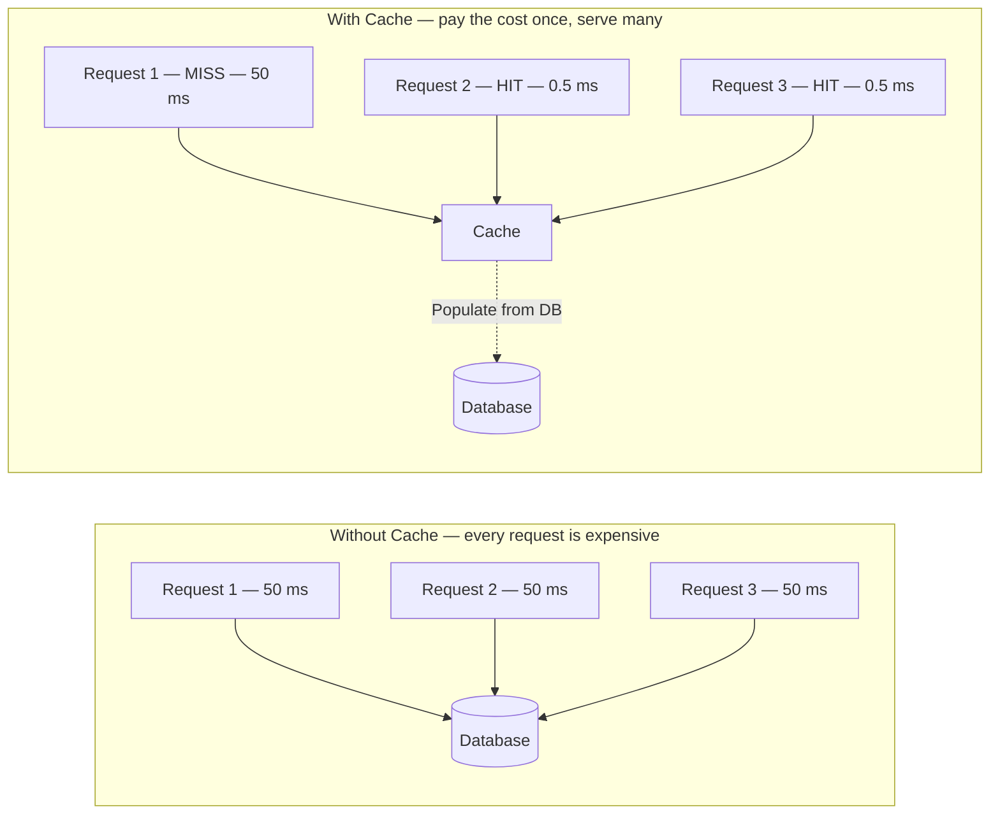

The same pattern repeats at every layer of the stack: the **browser** caches static assets, the **CDN** caches page fragments, the **application server** caches query results in Redis, and the **database engine** caches hot data pages in its buffer pool. Each layer multiplies the total effective hit rate of the system.

**Why locality of reference is universal in practice:**
- **Power-law popularity** — the top 1% of URLs, products, and user IDs receive 80%+ of all reads; a small cache intercepts most traffic
- **Habitual user behaviour** — users revisit the same dashboards, profiles, and feeds repeatedly within every session
- **Repetitive application logic** — the same config key, feature flag, or auth token is resolved on every request flowing through a service
- **Traffic clustering** — daily peaks drive the same narrow hot-key set thousands of times per second

These properties mean that a cache holding a tiny fraction of your total data can absorb the vast majority of your reads.

#### The Deep Theory: Why Caching Works

**The Fundamental Principle:**
Accessing data has a cost—in time, money, and resources. That cost varies wildly:
```
CPU L1 Cache:      0.5 nanoseconds   (baseline)
CPU L2 Cache:      7 nanoseconds     (14x slower)
RAM:               100 nanoseconds   (200x slower)
SSD:               150,000 nanoseconds (300,000x slower)
HDD:               10,000,000 nanoseconds (20 million x slower)
Network (same DC): 500,000 nanoseconds (1 million x slower)
Network (cross-continent): 150,000,000 nanoseconds (300 million x slower)
```

Each row is a potential cache tier. The further down you go, the more expensive every access becomes — and the higher the payoff from caching at a tier above it:

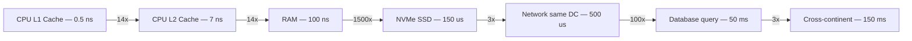

Caching **promotes** data upward in this hierarchy. A Redis cache answer for a query that would otherwise touch the database eliminates ~100x of latency for that request. A CDN hit for a resource that would have crossed a continent eliminates ~30,000x.

**The Revelation:**
If you can serve from a faster tier, you eliminate orders of magnitude of latency. Cache a database query result in Redis:
- **Before**: 50ms database query
- **After**: 0.5ms Redis lookup
- **Speedup**: 100x faster

**The Economic Argument:**
```
Database: $1,000/month for 1000 QPS
Redis: $100/month for 100,000 QPS

90% cache hit rate:
- 900 requests from Redis: cheap
- 100 requests from DB: normal load
- Result: Handle 10x traffic at same cost
```

#### The Cache Hierarchy: Layers Upon Layers

Caching exists at every level of the stack. Understanding where each tier belongs is critical.

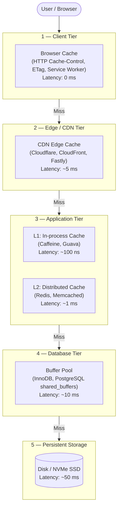

A request answered at any tier **never reaches the tiers below it**. The goal of caching system design is to ensure the highest possible fraction of requests are answered at the leftmost (cheapest) tier.

##### Browser Cache (Client-Side)
```
User requests logo.png
  ↓
Browser: "I have this from yesterday"
  ↓
Return from disk: 0ms network time
```

**Control via HTTP Headers:**
```http
Cache-Control: max-age=31536000, immutable  # 1 year
Cache-Control: no-cache  # Always validate
Cache-Control: no-store  # Never cache
ETag: "v1.23"  # Version-based validation
```

**Benefits:**
- Zero server load
- Zero network latency
- Scales infinitely (each user caches locally)

**Challenges:**
- Can't invalidate (stuck until expiry)
- Different versions across users
- Wasted bandwidth if user never returns

**Best For:**
- Static assets (CSS, JS, images)
- Infrequently changing content
- User-specific data (after login)

##### CDN Cache (Edge)
```
User in Tokyo requests image
  ↓
CDN Tokyo node: "I have this"
  ↓
Return from edge: 5ms (vs 200ms from US origin)
```

**How It Works:**
1. User requests file
2. CDN edge node checks cache
3. If miss: Fetch from origin, cache, return
4. If hit: Return immediately
5. Subsequent users in region: Served from cache

**Benefits:**
- Geographic proximity (low latency)
- Offloads origin servers (90%+ hit rates)
- Handles traffic spikes (DDoS protection)
- Bandwidth savings (serve from edge)

**Best For:**
- Static assets globally distributed
- Media files (images, videos)
- API responses (with care)
- Software downloads

**Advanced: Dynamic Content Caching**
Modern CDNs cache API responses:
```http
GET /api/products?category=shoes
Cache-Control: max-age=60, s-maxage=300
# Browser caches 60s, CDN caches 300s
```

##### Application Cache (In-Memory)
```
User requests user profile
  ↓
App server: Check Redis
  ↓ (hit)
Return from Redis: 1ms (vs 50ms from DB)
```

**Types:**

**1. Local Cache (In-Process)**
```python
# Cache in application memory
cache = {}

def get_user(user_id):
    if user_id in cache:
        return cache[user_id]  # 100 nanoseconds
    
    user = db.query(user_id)  # 50 milliseconds
    cache[user_id] = user
    return user
```

**Pros:**
- Extremely fast (nanoseconds)
- No network calls
- Simple implementation

**Cons:**
- Limited by server RAM
- Not shared across servers
- Invalidation is complex
- Lost on server restart

**When to Use:**
- Reference data (countries, config)
- Session data (if single server)
- Small datasets

**2. Distributed Cache (Redis, Memcached)**
```python
import redis

cache = redis.Redis()

def get_user(user_id):
    cached = cache.get(f"user:{user_id}")
    if cached:
        return json.loads(cached)  # 1 millisecond
    
    user = db.query(user_id)  # 50 milliseconds
    cache.setex(f"user:{user_id}", 3600, json.dumps(user))
    return user
```

**Pros:**
- Shared across all servers
- Persistent (survives app restarts)
- Large capacity (100s of GB)
- Atomic operations

**Cons:**
- Network latency (1-2ms)
- Additional infrastructure
- Cost

**When to Use:**
- Multi-server deployments
- Large datasets
- Session management
- Rate limiting counters

##### Database Cache (Query Cache)
```sql
SELECT * FROM users WHERE id = 123;
  ↓
DB: "I executed this 1 second ago"
  ↓
Return cached result: 0.1ms (vs 10ms)
```

**Built-in Database Caching:**
- **Query cache**: Cache entire query results
- **Buffer pool**: Cache data pages in RAM
- **Prepared statements**: Cache execution plans

**Limitation:**
Invalidates on ANY write to table (too aggressive)

**Better Approach:**
Manual caching at application layer (more control)

#### The Cache Hierarchy Strategy

**The Cascade Pattern:**

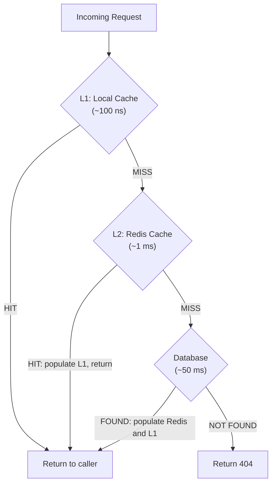

On every **write**, invalidate the affected key in reverse order (DB → Redis → Local) to prevent downstream tiers serving stale values after an update.

**Hit Rate Multiplication:**
```
Local cache: 50% hit rate
Redis cache: 40% hit rate (of local misses)
Database: 10% of requests

Result:
- 50% served in 100ns
- 40% served in 1ms
- 10% served in 50ms
Average: 5.05ms (vs 50ms without caching)
```

---

#### What a Cache Is: The Core Concept

A cache is an **intermediate fast store** that sits between a requester and a slower data source. Every access either hits the cache (fast path) or misses it and falls through to the source (slow path):

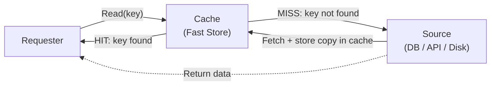

The cache intercepts **repeated identical requests** and absorbs them without touching the underlying source. It is only ever as good as its **hit rate** — the fraction of requests served from cache rather than the source.

---

#### Anatomy of a Cache Entry

Each item stored in a cache is not just the raw value — it is a small record with associated metadata:

```
┌──────────────────────────────────────────────────────────┐
│  Cache Entry                                             │
├────────────┬─────────────────────────────────────────────┤
│  Key       │  "user:42"                                  │
│  Value     │  {id:42, name:"Alice", email:"a@b.com"}     │
│  TTL       │  3600 s (expires 2026-06-30T15:00:00Z)      │
│  Created   │  2026-06-30T14:00:00Z                       │
│  Size      │  ~512 bytes                                  │
│  Hits      │  1,247 (accesses since insertion)           │
└────────────┴─────────────────────────────────────────────┘
```

**Key design matters.** A poorly designed key namespace causes collisions, unintended sharing, or cache pollution:

```java
// Bad: too generic — all users map to the same key
redis.set("user", userJson);

// Better: include entity type and ID
redis.set("user:42", userJson);

// Best: include version + tenant for multi-tenancy or schema changes
redis.set("v2:tenant:acme:user:42", userJson);
```

Key design guidelines:
- Use `entity:id` as the baseline pattern — predictable and debuggable
- Add a version prefix (`v1:`, `v2:`) so cache entries are auto-invalidated on data model changes
- Normalise before hashing (lowercase, strip trailing slashes) so `User:42` and `user:42` never create duplicate entries
- Never store secrets in keys — keys are often logged or visible in monitoring dashboards

---

#### Hit and Miss Lifecycle

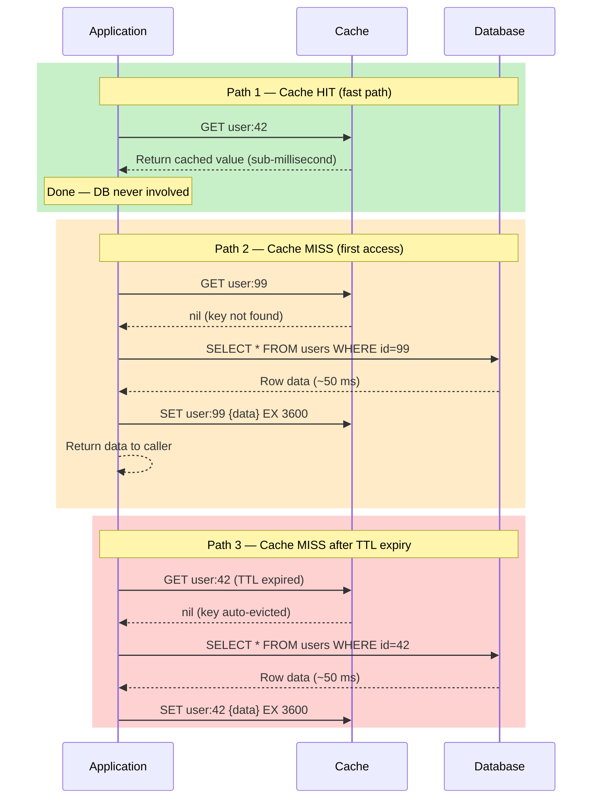

The entire purpose of every caching design decision is to maximise the fraction of requests that take **Path 1** and minimise those forced down **Path 2 / 3**.

---

#### Cache Hit Rate: The Single Most Important Metric

$$\text{Hit Rate} = \frac{\text{Cache Hits}}{\text{Cache Hits} + \text{Cache Misses}} \times 100\%$$

Hit rate directly controls how much of your traffic the database actually sees:

| Hit Rate | DB requests (at 100K req/s) | Effective DB load | Status |
|---|---|---|---|
| 50% | 50,000 req/s | Very high | Dangerous |
| 80% | 20,000 req/s | High | Needs attention |
| 90% | 10,000 req/s | Moderate | Acceptable |
| **95%** | **5,000 req/s** | **Good** | **Production target** |
| 99% | 1,000 req/s | Excellent | Well-tuned |
| 99.9% | 100 req/s | Outstanding | CDN / edge cache level |

**The non-linear effect:** going from 90% → 99% hit rate (9 percentage points) reduces database load by **10×**, not 1.1×. Tuning the last few percent of hit rate has an outsized operational impact.

**Root causes of low hit rate:**

| Root cause | Symptom | Fix |
|---|---|---|
| TTL too short | Entries expire before next read | Increase TTL |
| Cache too small | Hot keys evicted by memory pressure | Increase RAM or evict cold keys aggressively |
| Poor key design | Logical duplicates create separate entries | Normalise keys before storage |
| High write rate | Cache invalidated faster than reads | Use Write Behind; loosen consistency requirement |
| Cold start | Cache empty after restart | Pre-warm on startup (see below) |
| Thundering herd | Mass expiry at the same instant | Add TTL jitter |

---

#### Locality of Reference: Why Caching Works

Two fundamental properties of real-world access patterns make caching effective:

**1. Temporal Locality** — data accessed recently is likely to be accessed again soon.

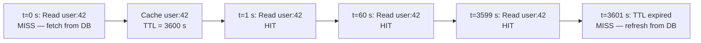

**2. Spatial Locality** — data near recently accessed data is also likely to be accessed.

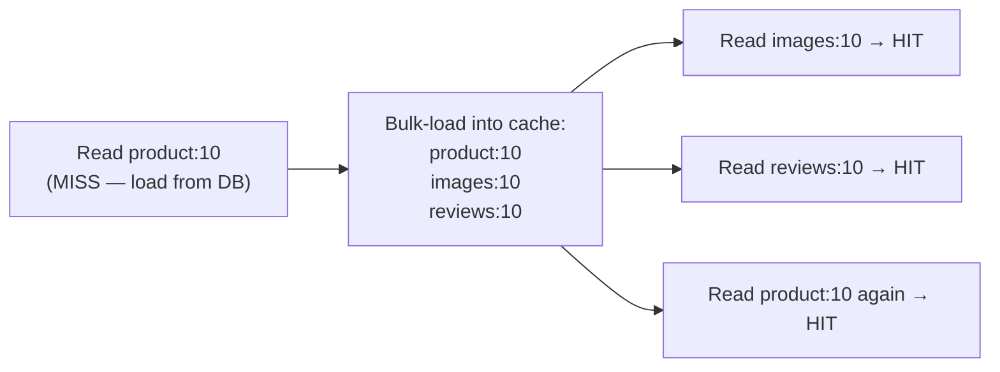

Spatial locality motivates **prefetching** (load nearby keys proactively) and **composite caching** (store a product with all its related data in one serialised blob, reducing round-trips).

**The Zipf (Power-Law) Distribution**

Real-world access patterns follow a heavy-tailed distribution — a tiny fraction of keys receives the vast majority of traffic:

```
Key rank by popularity:
─────────────────────────────────────────────────────────────
Rank 1 (most popular key)  → receives ~10% of all requests
Rank 2                     → ~5%
Rank 3                     → ~3.3%
...
Top 1% of keys             → ~80% of all requests   ← HOT TIER
Top 10% of keys            → ~95% of all requests
Bottom 90% of keys         →  ~5% of all requests   ← rarely accessed
```

This is why a cache that holds only the **top 1% of keys** can achieve an 80%+ hit rate. You do not need to cache everything — only the hot tier.

---

#### Full Request Stack: Where Each Cache Lives

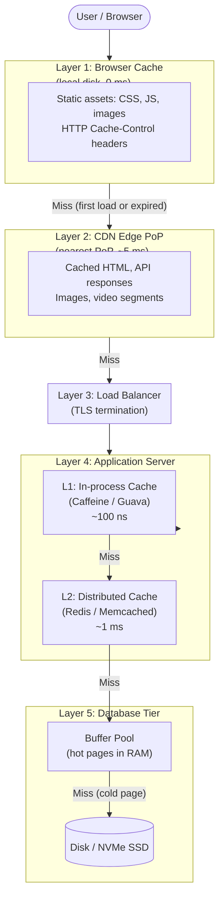

Each layer absorbs a fraction of traffic before it reaches the next. With a 95% CDN hit rate and a 90% Redis hit rate, only $0.05 \times 0.10 = 0.5\%$ of all requests ever reach the database.

---

#### Cache Warming: Solving the Cold Start Problem

When a cache starts empty — after a deployment, restart, or new node scale-out — every request misses and hits the database simultaneously. This is the **cold start problem** and can overwhelm a database that has been comfortably handling traffic for months.

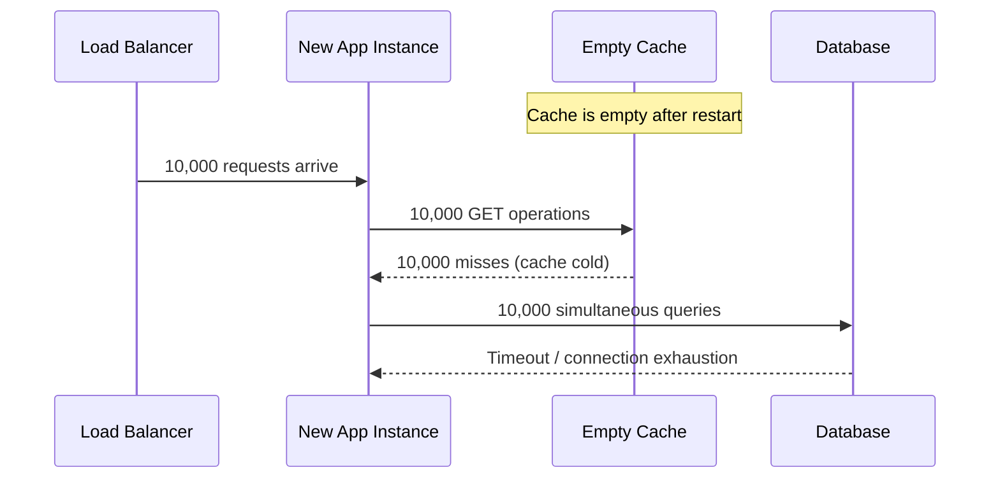

**Warming strategies:**

| Strategy | How | Best when |
|---|---|---|
| **Pre-warm on startup** | Load top-N hot keys from DB before accepting traffic | Small hot tier; predictable access pattern |
| **Snapshot restore** | Restore Redis RDB dump to new instance | Redis clusters; fastest warm start |
| **Gradual traffic ramp** | Route 1% → 10% → 50% → 100% progressively | Blue-green deploys; gives cache time to fill |
| **Lazy warm (accept cold)** | Let cache fill naturally via Cache Aside | Off-peak restarts; low initial traffic |
| **Read-replica warm** | Replay recent read queries against new cache | Predictable query patterns from analytics |

```java
// Pre-warm the hot tier on Spring Boot startup
@Component
public class CacheWarmer implements ApplicationListener<ApplicationReadyEvent> {

    private final UserRepository      userRepo;
    private final StringRedisTemplate redis;
    private final ObjectMapper        mapper;

    @Override
    public void onApplicationEvent(ApplicationReadyEvent event) {
        // Load the 10,000 most-accessed user records before
        // the load balancer routes real traffic to this instance
        userRepo.findTopNByAccessCountDesc(10_000).forEach(user -> {
            try {
                redis.opsForValue().set(
                    "user:" + user.getId(),
                    mapper.writeValueAsString(UserDto.from(user)),
                    Duration.ofHours(1));
            } catch (Exception ignored) {
                // non-fatal: missed warm entries will be populated on first miss
            }
        });
    }
}
```

---

#### What to Monitor in Production

A cache that is not monitored degrades silently — hit rate drops, evictions spike, and the database absorbs load the team never notices until an incident.

| Metric | What it tells you | Healthy value | Alert threshold |
|---|---|---|---|
| **Hit rate** | Fraction of reads served from cache | > 95% | < 90% sustained |
| **Miss rate** | Inverse — tracks cold-start and TTL tuning | < 5% | > 15% spike |
| **Eviction rate** | Keys removed due to memory pressure | 0 (steady state) | Any non-zero in production |
| **Memory usage** | Fraction of maxmemory used | < 75% | > 85% |
| **p99 latency** | 99th-percentile cache operation time | < 1 ms | > 5 ms |
| **Connected clients** | App pods connected to cache | Stable | Sudden drop = network issue |
| **Key count** | Total stored keys | Stable/bounded | Unbounded growth = TTL misconfiguration |

**Reading Redis built-in stats:**

```bash
# Run inside redis-cli
redis-cli INFO stats | grep -E "keyspace_(hits|misses)"
# keyspace_hits:  14,289,430
# keyspace_misses:    74,230
# Hit rate = 14,289,430 / (14,289,430 + 74,230) = 99.5%

redis-cli INFO memory | grep -E "used_memory_human|maxmemory_human"
# used_memory_human: 3.12G
# maxmemory_human:   4.00G   → 78% used, approaching threshold

redis-cli INFO stats | grep evicted_keys
# evicted_keys: 0            → 0 = healthy; cache not under memory pressure
```

---

### Cache Aside (Lazy Loading)

The application manages the cache **explicitly**. The cache does not interact with the database on its own — the application reads from both and is solely responsible for keeping them in sync. This is the most widely used caching pattern in practice.

#### How It Works

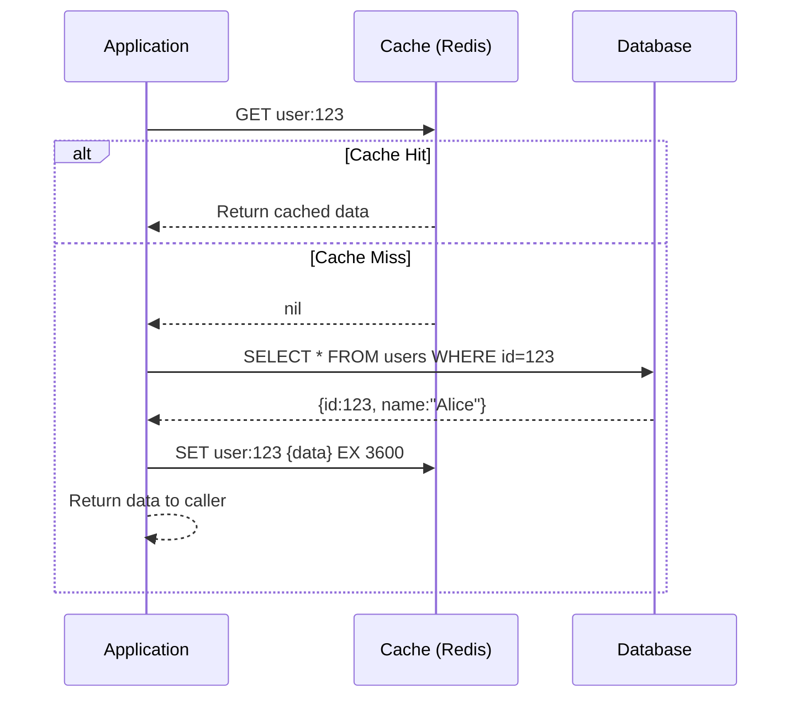

#### Read + Write Flow

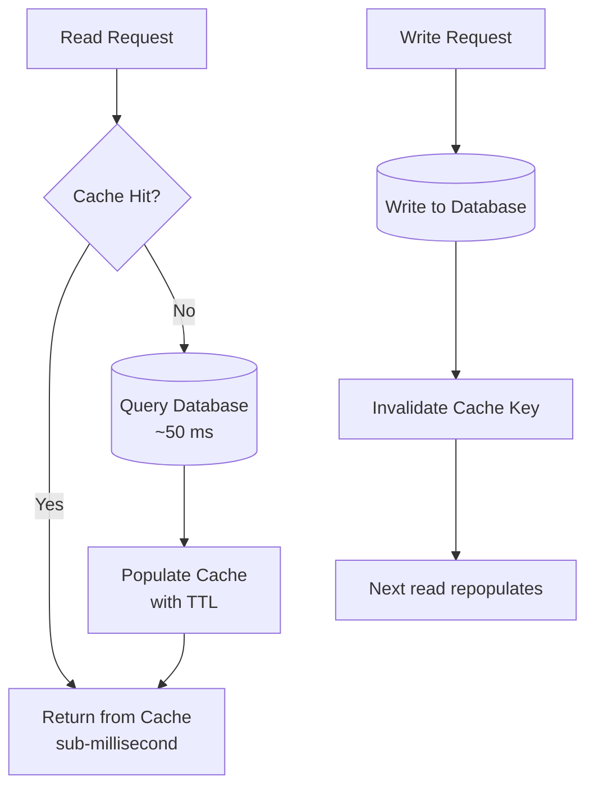

#### Code Example (Spring Boot + Redis)

```java
@Service
public class UserService {

    private final UserRepository  userRepo;
    private final StringRedisTemplate redis;
    private final ObjectMapper    mapper;

    public UserDto getUser(long userId) throws Exception {
        String key    = "user:" + userId;
        String cached = redis.opsForValue().get(key);

        if (cached != null) {
            return mapper.readValue(cached, UserDto.class);  // cache hit
        }

        // Cache miss — query DB, then populate cache
        UserDto user = userRepo.findById(userId)
            .map(UserDto::from)
            .orElseThrow(() -> new UserNotFoundException(userId));

        redis.opsForValue().set(key, mapper.writeValueAsString(user), Duration.ofHours(1));
        return user;
    }

    public void updateUser(long userId, UpdateRequest req) throws Exception {
        userRepo.save(req.applyTo(userRepo.findById(userId).orElseThrow()));
        redis.delete("user:" + userId);   // invalidate stale entry
    }
}
```

#### Thundering Herd Problem

When a hot key expires, many concurrent threads all miss simultaneously and query the database at once — multiplying load exactly when the system is most stressed.

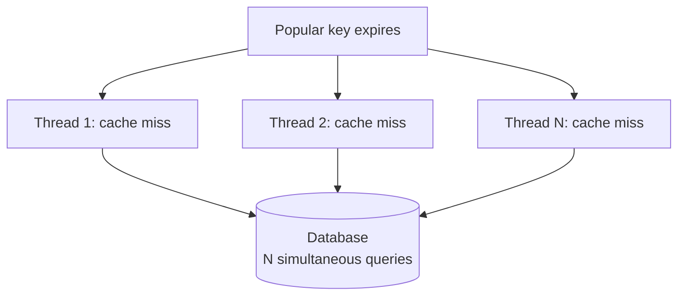

**Mitigation — distributed mutex (SETNX lock):**

```java
public UserDto getUser(long userId) throws Exception {
    String key     = "user:" + userId;
    String lockKey = "lock:user:" + userId;

    String cached = redis.opsForValue().get(key);
    if (cached != null) return mapper.readValue(cached, UserDto.class);

    // Only one thread acquires the lock and fetches from DB
    Boolean locked = redis.opsForValue()
        .setIfAbsent(lockKey, "1", Duration.ofSeconds(5));

    if (Boolean.TRUE.equals(locked)) {
        try {
            UserDto user = userRepo.findById(userId).map(UserDto::from).orElseThrow();
            redis.opsForValue().set(key, mapper.writeValueAsString(user), Duration.ofHours(1));
            return user;
        } finally {
            redis.delete(lockKey);
        }
    } else {
        Thread.sleep(50);   // wait for the lock holder to populate cache
        return getUser(userId);
    }
}
```

#### Trade-offs

| Aspect | Detail |
|---|---|
| Cache population | Lazy — only on first read miss |
| Stale data risk | Yes — if DB is updated without cache invalidation |
| Cache failure | App still works; falls back to DB |
| Cold start | High miss rate until cache warms |
| Thundering herd | Possible; mitigate with TTL jitter or mutex |

**Best for:** User profiles, product catalogs, config — data that is read often and written infrequently.

**Avoid when:** Data is updated very frequently (cache invalidation becomes the bottleneck) or when you cannot tolerate any staleness.

### Read Through Strategy

The **cache itself** handles the database fetch on a miss. The application only ever talks to the cache — it has no direct knowledge of the database on the read path. This is the key distinction from Cache Aside, where the application manages both.

#### How It Works

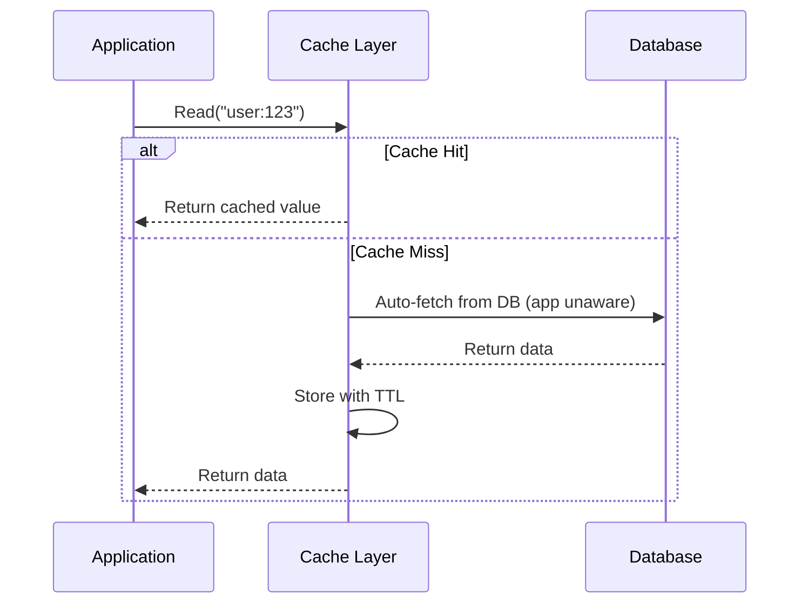

#### Flow Diagram

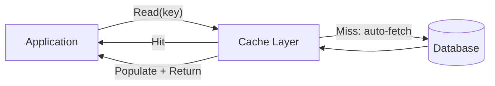

#### Code Example (Spring `@Cacheable` — Read Through)

Spring Cache backed by Redis is the canonical Read Through implementation. The framework intercepts the method call, checks Redis, and only executes the method body (which queries the DB) on a miss.

```java
@Service
public class ProductService {

    private final ProductRepository productRepo;

    // Cache hit  → method body never executes; result served from Redis.
    // Cache miss → method body runs, result stored in Redis, returned.
    @Cacheable(value = "products", key = "#productId")
    public ProductDto getProduct(long productId) {
        return productRepo.findById(productId)
            .map(ProductDto::from)
            .orElseThrow(() -> new ProductNotFoundException(productId));
    }

    // Evict on write so the next read fetches fresh data
    @CacheEvict(value = "products", key = "#productId")
    public void updateProduct(long productId, UpdateProductRequest req) {
        // update logic here
    }

    // Refresh cache entry in-place (evict + put in one step)
    @CachePut(value = "products", key = "#result.id")
    public ProductDto createProduct(CreateProductRequest req) {
        return ProductDto.from(productRepo.save(req.toEntity()));
    }
}
```

**`application.yml` (Redis-backed Spring Cache):**

```yaml
spring:
  cache:
    type: redis
    redis:
      time-to-live: 3600000   # 1 hour in milliseconds
      cache-null-values: false # do not cache null results
```

#### Trade-offs

| Aspect | Detail |
|---|---|
| Application complexity | Lower — DB fetch logic lives in the cache/framework |
| First read | Always a miss (cold start penalty) |
| Stale data | Controlled by TTL; combine with `@CacheEvict` on writes |
| Cache failure | Tightly coupled — reads may fail if cache is unavailable |
| Best pairing | Write Through (for consistent writes) or `@CacheEvict` (for invalidation) |

**Best for:** Read-heavy services where you want clean business logic without manual cache wiring. Works especially well with Spring Cache, NestJS Cache Manager, or any framework with annotation-driven caching.

**Avoid when:** You need fine-grained TTL control per object or custom cache-population logic that a framework abstraction cannot express.

### Write Through Strategy

Every write goes to **both** the cache and the database **synchronously** in the same operation. The write is only acknowledged to the caller once both succeed. This guarantees that the cache is never stale.

#### How It Works

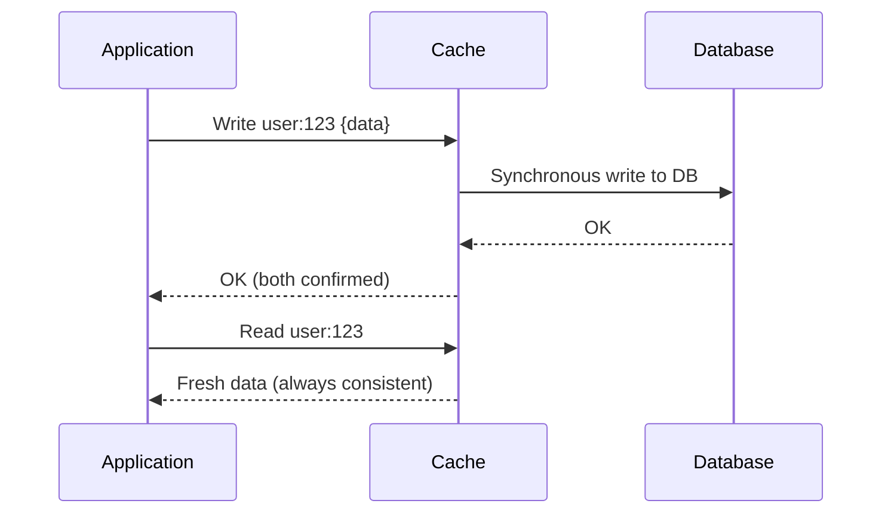

#### Flow Diagram

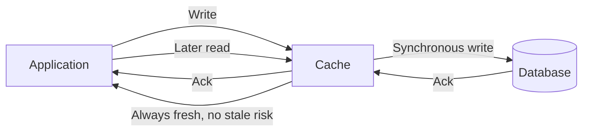

#### Code Example (Spring Boot)

```java
@Service
public class ConfigService {

    private final ConfigRepository configRepo;
    private final StringRedisTemplate redis;

    // Write Through: write to both DB and cache atomically.
    // Caller only gets OK when both succeed.
    public void saveConfig(String key, String value) throws Exception {
        // 1. Write to database (source of truth)
        configRepo.save(new ConfigEntry(key, value));

        // 2. Update cache immediately — no stale window
        redis.opsForValue().set("config:" + key, value, Duration.ofHours(24));
    }

    public String getConfig(String key) {
        // Cache is always current — no miss/stale concern on hot keys
        String cached = redis.opsForValue().get("config:" + key);
        if (cached != null) return cached;

        // Fallback: cache evicted due to memory pressure
        return configRepo.findById(key)
            .map(ConfigEntry::getValue)
            .orElse(null);
    }
}
```

**With Spring `@CachePut` (framework-managed Write Through):**

```java
// @CachePut always executes the method AND updates the cache
// Unlike @Cacheable which skips the method on hit
@CachePut(value = "configs", key = "#key")
public String saveConfig(String key, String value) {
    configRepo.save(new ConfigEntry(key, value));
    return value;   // returned value is what gets cached
}
```

#### Trade-offs

| Aspect | Detail |
|---|---|
| Consistency | Strong — cache and DB always agree |
| Write latency | Higher — waits for both writes to succeed |
| Write amplification | Every write touches both systems |
| Cache pollution | Data written but never read still occupies cache memory |
| Cache failure | Write fails if cache is unavailable (unless you degrade gracefully) |
| Read performance | Excellent — cache hit guaranteed for recently written data |

**Best for:** Config values, session data, user preferences — anything that is written and then immediately read. Pairs naturally with Read Through for a fully consistent read/write cache layer.

**Avoid when:** Write throughput is very high and most written data is never re-read (wasted cache space and double write overhead).

### Write Behind (Write Back)

Writes go to the **cache only** and return success to the caller immediately. A background process asynchronously flushes the dirty entries to the database in batches. The write path never waits for the database.

#### How It Works

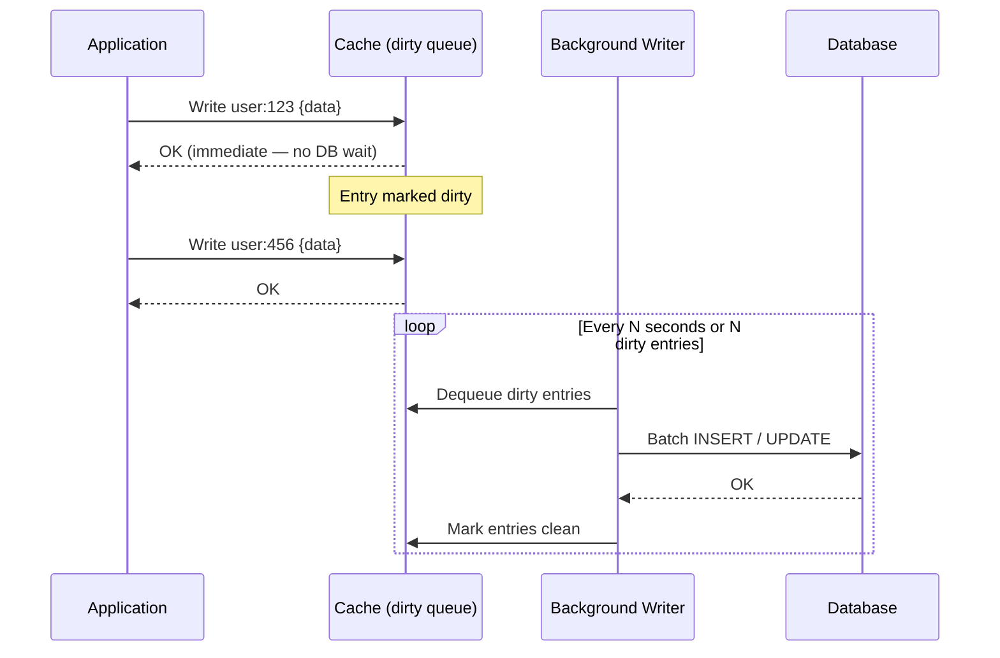

#### Batching Effect

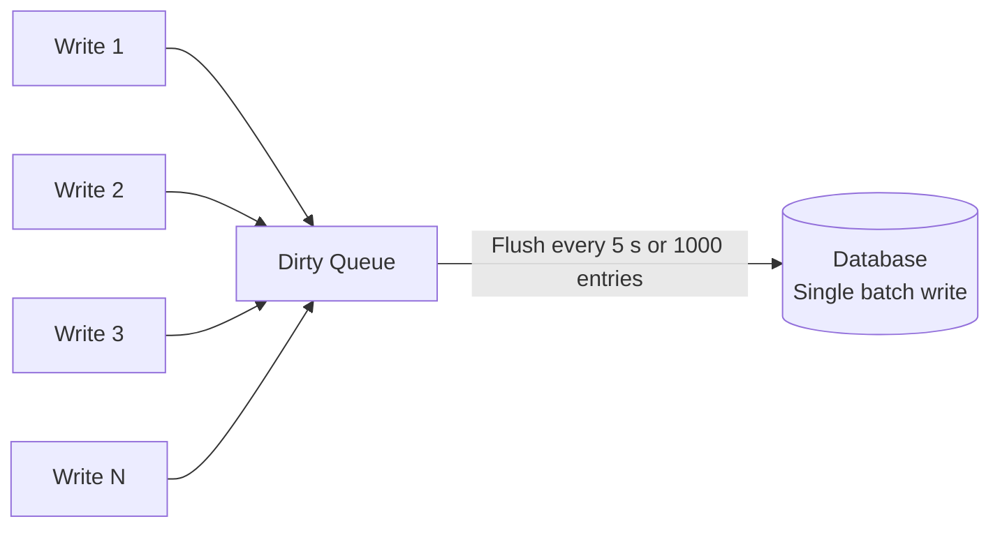

Instead of N individual DB round-trips, you get one batch write — far more efficient for high-volume, bursty workloads.

#### Flow Diagram

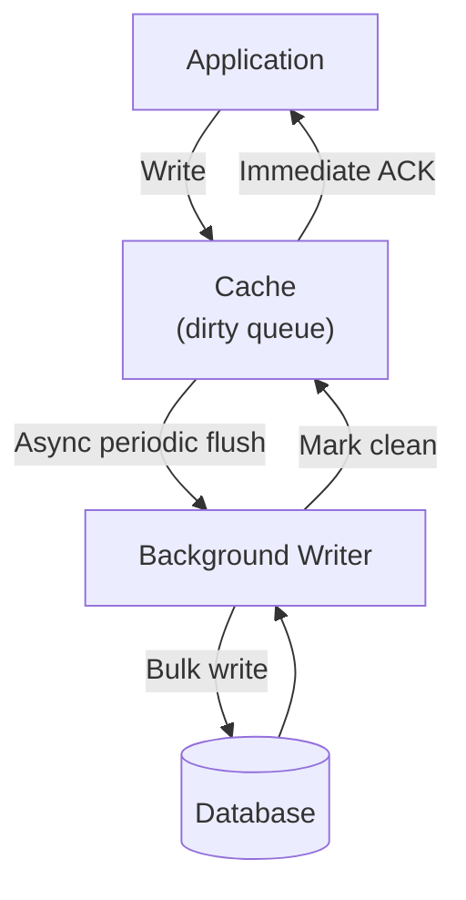

#### Code Example (View Counter with Scheduled Flush)

```java
@Service
public class ViewCountService {

    private final StringRedisTemplate redis;
    private final ArticleRepository   articleRepo;

    // Called on every page view — fast, touches only Redis
    public void incrementView(long articleId) {
        String key = "views:" + articleId;
        redis.opsForValue().increment(key);
        redis.expire(key, Duration.ofDays(1));
    }

    // Background flush — runs every 5 seconds
    @Scheduled(fixedDelay = 5_000)
    public void flushViewsToDB() {
        Set<String> keys = redis.keys("views:*");
        if (keys == null || keys.isEmpty()) return;

        for (String key : keys) {
            String raw = redis.opsForValue().get(key);
            if (raw == null) continue;

            long articleId = Long.parseLong(key.replace("views:", ""));
            long count     = Long.parseLong(raw);

            // Batch-friendly: one DB call per dirty key
            articleRepo.addViews(articleId, count);
            redis.delete(key);
        }
    }
}
```

#### Trade-offs

| Aspect | Detail |
|---|---|
| Write speed | Extremely fast — no DB round-trip on write path |
| Data durability | At risk — unflushed dirty entries are lost if cache crashes |
| DB throughput | Reduced — batch writes are far more efficient than per-request writes |
| Read consistency | May serve data from cache that the DB does not yet have |
| Complexity | Higher — need a reliable flush loop and crash-recovery strategy |

**Best for:** High-frequency writes where some data loss is acceptable — page view counters, like/upvote counts, real-time analytics, IoT sensor telemetry, leaderboard scores.

**Avoid when:** Data loss is unacceptable — financial transactions, inventory levels, order confirmations.

### Write Around

Writes go **directly to the database**, bypassing the cache entirely. The cache is only populated when the data is subsequently read (via Cache Aside or Read Through). This prevents freshly written data from evicting hot read data that is more likely to be accessed again.

#### How It Works

```mermaid
sequenceDiagram
    participant App as Application
    participant Cache as Cache
    participant DB as Database

    App->>DB: Write new record (cache bypassed)
    DB-->>App: OK
    Note over Cache: Cache untouched on write

    App->>Cache: Later read request
    Cache-->>App: Miss (not in cache yet)
    App->>DB: Fetch from DB
    DB-->>App: Data
    App->>Cache: Populate cache (TTL)
    App-->>App: Return data
```

#### Flow Diagram

```mermaid
flowchart LR
    APP[Application]
    C[Cache]
    DB[(Database)]

    APP -->|"Write: bypass cache"| DB
    APP -->|Later read| C
    C -->|Hit| APP
    C -->|Miss| DB
    DB --> C
    C --> APP
```

#### Comparison: Write Around vs Write Through vs Cache Aside on Writes

```mermaid
flowchart TD
    WR[Write Request]
    WR --> WT["Write Through\nDB + Cache together"]
    WR --> WA["Write Around\nDB only, cache skipped"]
    WR --> CA["Cache Aside\nDB write + cache DELETE"]

    WT -->|Cache always fresh| PR1[Read hits cache]
    WA -->|First read always misses| PM1[Read misses cache once]
    CA -->|Cache invalidated| PM2[Read misses cache once]
```

#### Trade-offs

| Aspect | Detail |
|---|---|
| Cache pollution | Avoided — write-heavy or one-time data does not evict hot read data |
| Write latency | Low — single write to DB only |
| First read after write | Always a cache miss (guaranteed latency hit once per object) |
| Cache efficiency | High — only data that is actually read occupies cache memory |
| Consistency | Cache catches up naturally on next read |

**Best for:** Write-heavy workloads where written data is rarely read back — log ingestion, audit trails, bulk imports, batch jobs, media uploads. Protects the cache from being flooded with data that will never be read.

**Avoid when:** Data is read immediately after it is written — the guaranteed first-read miss adds unnecessary latency for that access pattern.

### Refresh Ahead (Proactive Refresh)

Unlike every other pattern, Refresh Ahead is entirely **proactive**. It does not wait for a cache miss. A background process monitors the TTL of hot keys and reloads them from the database *before* they expire, so high-traffic keys are perpetually warm and users never experience a miss.

#### How It Works

```mermaid
flowchart TD
    BG["Background Monitor\n(runs every N seconds)"]
    BG -->|Check TTL of hot keys| C[Cache]
    C -->|"TTL < threshold (e.g. 20% remaining)"| WARN[Approaching expiry]
    WARN --> DB[(Fetch fresh data from DB)]
    DB --> C
    C --> USER[All user reads: permanent cache hit]
```

#### Sequence: Proactive Refresh vs Reactive Miss

```mermaid
sequenceDiagram
    participant BG as Background Worker
    participant C  as Cache
    participant DB as Database
    participant U  as User Request

    Note over C: Key TTL = 60 s, refresh threshold = 10 s remaining

    BG->>C: Check TTL of "scores:live"
    C-->>BG: TTL = 8 s (below threshold)
    BG->>DB: Fetch fresh live scores
    DB-->>BG: Updated data
    BG->>C: Overwrite key, reset TTL = 60 s

    U->>C: Read "scores:live"
    C-->>U: Cache hit (no miss, no DB wait)
```

With Cache Aside, that last user request would have experienced a miss and a full DB round-trip. Refresh Ahead eliminates that entirely for known-hot keys.

#### Code Example (Spring Boot Scheduled Refresh)

```java
@Service
public class LiveScoreService {

    private final ScoreRepository     scoreRepo;
    private final StringRedisTemplate redis;
    private final ObjectMapper        mapper;

    private static final String KEY               = "scores:live";
    private static final long   TTL_SECONDS       = 60L;
    private static final long   REFRESH_THRESHOLD = 10L;  // seconds remaining before refresh

    @Cacheable(value = "scores", key = "'live'")
    public ScoreDto getLiveScore() {
        return scoreRepo.fetchLatest();
    }

    // Runs every 5 seconds — refreshes the key if TTL is below threshold
    @Scheduled(fixedDelay = 5_000)
    public void proactiveRefresh() {
        Long ttl = redis.getExpire(KEY, TimeUnit.SECONDS);

        // -2 = key does not exist; skip if TTL is still comfortable
        if (ttl == null || ttl == -2 || ttl > REFRESH_THRESHOLD) return;

        try {
            ScoreDto fresh = scoreRepo.fetchLatest();
            redis.opsForValue().set(KEY,
                mapper.writeValueAsString(fresh),
                Duration.ofSeconds(TTL_SECONDS));
        } catch (Exception ignored) {
            // worst case: next user request experiences a normal cache miss
        }
    }
}
```

#### Trade-offs

| Aspect | Detail |
|---|---|
| User read latency | Zero — no user ever sees a miss on hot keys |
| Data freshness | Excellent — refreshed on a tight predictable schedule |
| Wasted DB calls | Yes — keys are refreshed even if traffic has dropped |
| Predictability | Requires knowing which keys are hot in advance |
| Complexity | Higher — needs a background scheduler and TTL monitoring |

**Best for:** Predictable, always-on high-traffic data with expensive recompute cost — live sports scores, stock tickers, homepage banners, trending product lists, currency exchange rates.

**Avoid when:** Access patterns are unpredictable (you cannot know which keys are hot ahead of time) or when data changes faster than your refresh interval can keep up.

---

### Cache Invalidation

Phil Karlton famously said: *"There are only two hard things in Computer Science: cache invalidation and naming things."* Getting invalidation wrong causes either stale reads (serving old data) or unnecessary misses (evicting data that was still valid).

#### The Problem: Stale Data

```mermaid
sequenceDiagram
    participant U1 as User A
    participant U2 as User B
    participant C  as Cache
    participant DB as Database

    U1->>C: Read user:42
    C->>DB: Miss — fetch from DB
    DB-->>C: {name: "Alice"}
    C-->>U1: "Alice" (TTL: 1 hour)

    U2->>DB: UPDATE users SET name='Alicia' WHERE id=42
    DB-->>U2: OK (cache NOT notified)

    U1->>C: Read user:42 again (30 min later)
    C-->>U1: "Alice" (STALE — DB has "Alicia")
```

---

#### Strategy 1: TTL (Time To Live)

The simplest approach. Every key has an expiry duration. Stale data exists for **at most TTL seconds**.

```mermaid
flowchart LR
    W[Write to DB] --> DB[(Database)]
    DB --> C["Cache\nTTL = 60 s"]
    C -->|"After 60 s: auto-expire"| GONE[Key deleted]
    GONE -->|Next read: miss| DB
```

```java
// Set TTL at write time
redis.opsForValue().set("user:42", userData, Duration.ofMinutes(60));

// Or apply TTL to an existing key
redis.expire("user:42", Duration.ofMinutes(60));
```

**Choosing TTL:**

| TTL | Stale window | DB load |
|---|---|---|
| Short (10 s) | Very small | High (frequent misses) |
| Medium (60 s) | Acceptable | Moderate |
| Long (1 h) | Noticeable | Low |
| None (no expiry) | Indefinite | Minimal (but stale forever) |

---

#### Strategy 2: Event-Based Invalidation

Invalidate the cache entry **at the moment of the write**, ensuring immediate consistency. Zero stale window.

```mermaid
sequenceDiagram
    participant App as Application
    participant DB  as Database
    participant C   as Cache

    App->>DB: UPDATE user:42 name='Alicia'
    DB-->>App: OK
    App->>C: DEL user:42
    C-->>App: Key removed

    App->>C: Next read
    C-->>App: Miss
    App->>DB: Fetch fresh data
    DB-->>C: {name: 'Alicia'}
    C-->>App: 'Alicia' (consistent)
```

```java
@Transactional
public void updateUser(long userId, UpdateRequest req) {
    userRepo.save(req.applyTo(userRepo.findById(userId).orElseThrow()));
    redis.delete("user:" + userId);    // invalidate immediately after DB write
}
```

> **Pitfall:** If the application crashes between the DB write and the cache delete, the cache entry remains stale. Mitigate with the **Outbox pattern** — publish an invalidation event to a message queue inside the DB transaction, and let a consumer handle the delete.

---

#### Strategy 3: Write Through (Overwrite, not Delete)

Instead of deleting the stale key, overwrite it atomically on every write. The cache entry is always fresh — no stale window, no first-read miss.

```mermaid
flowchart LR
    W[Application Write] --> DB[(Database)]
    W --> C["Cache\nOverwrite key with fresh value"]
    C --> R["Next Read: cache hit\nwith fresh data"]
```

---

#### Cache Stampede (Dog-pile Effect)

When a popular key expires, all concurrent requests miss simultaneously and storm the database at once.

```mermaid
flowchart TD
    EXP["Popular key expires"] --> M1["Thread 1: miss"]
    EXP --> M2["Thread 2: miss"]
    EXP --> M3["Thread 3: miss"]
    EXP --> MN["Thread N: miss"]
    M1 --> DB[("Database\nN simultaneous queries")]
    M2 --> DB
    M3 --> DB
    MN --> DB
```

**Mitigation techniques:**

| Technique | How |
|---|---|
| **TTL jitter** | `TTL = base ± random(0, 30 s)` — prevents mass simultaneous expiry across keys |
| **Probabilistic refresh** | Recompute slightly before expiry using remaining TTL + estimated compute time |
| **Mutex / SETNX lock** | Only one thread fetches from DB; others wait and retry from cache |
| **Background refresh** | Async job refreshes key before it expires; serves slightly stale data |

---

### Eviction Policies

When cache memory is full and a new key must be inserted, the eviction policy decides which existing key to remove.

```mermaid
flowchart TD
    MF["Memory Full — new key incoming"]
    MF --> LRU["LRU\nEvict least recently used"]
    MF --> LFU["LFU\nEvict least frequently used"]
    MF --> FIFO["FIFO\nEvict oldest inserted key"]
    MF --> RND["Random\nEvict random key"]
    MF --> VTTL["Volatile-TTL\nEvict key closest to expiry"]
```

#### LRU — Least Recently Used

Maintains an ordered list of keys by last access time. The key at the tail (longest since last use) is evicted.

```
Before (queue: most recent → least recent):
[D]  [C]  [B]  [A]    ← memory full, key E arrives

Evict A (tail — least recently used):
[E]  [D]  [C]  [B]    ← E inserted at head
```

**Good for:** General URL cache, user profiles — hot URLs naturally stay resident.

#### LFU — Least Frequently Used

Tracks access count per key. The key with the lowest count is evicted.

```
Frequency counts:
A: 100   B: 50   C: 3   D: 1    ← memory full, key E arrives

Evict D (frequency = 1, lowest):
A: 100   B: 50   C: 3   E: 1
```

**Good for:** Viral content workloads — a URL with 10,000 hits is never evicted over one with a single hit.

#### Eviction Policy Comparison

| Policy | Best For | Avoid When |
|---|---|---|
| **LRU** | General caching — hot data stays resident | Access patterns shift suddenly (old hot keys stay) |
| **LFU** | Viral / popular content | Short-lived burst events that should clear afterwards |
| **FIFO** | Rotating buffers, simple queues | Any workload with access locality |
| **Random** | Uniform access distributions | Any locality pattern (will evict hot keys) |
| **Volatile-TTL** | Mixed cache where some keys have TTL | All keys have TTL (no differentiation benefit) |

**Redis eviction policy config (`redis.conf`):**

```conf
maxmemory 4gb
maxmemory-policy allkeys-lru    # evict LRU across ALL keys when full
# alternatives:
# maxmemory-policy allkeys-lfu
# maxmemory-policy volatile-ttl
# maxmemory-policy noeviction    # return error when full (use for ID counters)
```

> **Tip:** Use two separate Redis instances (or logical databases) if you need different eviction policies — e.g. `allkeys-lru` for the URL cache and `noeviction` for the ID range counter.

---

### Popular Cache Systems Comparison

| System | Type | Persistence | Data Structures | Primary Use Case |
|---|---|---|---|---|
| **Redis** | In-memory + optional disk | RDB / AOF | Strings, Lists, Sets, Sorted Sets, Hashes, Streams, HyperLogLog | General purpose; rate limiting, pub/sub, queues, leaderboards |
| **Memcached** | Pure in-memory | None | Key-value strings only | Simple, ultra-fast string cache; multi-threaded |
| **Hazelcast** | In-memory data grid | Optional | Map, Queue, Topic, JCache | Distributed Java applications; JVM cluster caching |
| **Ehcache** | JVM heap or off-heap | Optional | JCache (JSR-107) compliant | Embedded Java cache; zero network hop |
| **Apache Ignite** | In-memory + disk | Yes | SQL, key-value, ML | Distributed compute + co-located storage |

#### Redis vs Memcached

| | Redis | Memcached |
|---|---|---|
| Data types | Rich (10+ types) | String only |
| Persistence | Yes (RDB / AOF) | No |
| Replication | Yes (primary / replica) | No |
| Pub / Sub | Yes | No |
| Lua scripting | Yes | No |
| Threading model | Single-threaded event loop | Multi-threaded |
| **Choose when** | You need rich data types, persistence, pub/sub, or atomic operations | Pure simple cache and multi-core throughput is the only concern |

---

### Distributed Cache

A distributed cache spreads data across a **cluster of coordinated nodes** instead of keeping it on a single machine. All application servers connect to the shared cluster over the network, ensuring every pod sees the same cache state regardless of which node handled the previous request.

#### Why a Single Node Is Not Enough

| Limit | Single node | Cluster |
|---|---|---|
| Capacity | Bounded by one machine's RAM (~256 GB max) | Horizontal — add nodes to increase total memory |
| Availability | Single point of failure | Replica nodes survive primary failures |
| Throughput | ~100 K ops/s (single-threaded Redis) | Millions ops/s across shards |
| Multi-pod consistency | Each pod has its own copy — diverges | All pods share one source of truth |

#### How It Works — Consistent Hashing (Redis Cluster)

```mermaid
flowchart TB
    subgraph App["Application Layer"]
        A1[App Pod 1]
        A2[App Pod 2]
        A3[App Pod 3]
    end

    subgraph Cluster["Redis Cluster (3 shards, 16 384 hash slots)"]
        N1["Primary 1\nSlots 0 – 5460"]
        N2["Primary 2\nSlots 5461 – 10922"]
        N3["Primary 3\nSlots 10923 – 16383"]
        N1R[(Replica 1)]
        N2R[(Replica 2)]
        N3R[(Replica 3)]
    end

    A1 -->|"CRC16(key) mod 16384"| N1
    A2 --> N2
    A3 --> N3
    N1 -.->|Async replication| N1R
    N2 -.-> N2R
    N3 -.-> N3R
```

- Every key is hashed to a **slot** (0–16 383).
- Each primary node owns a range of slots and its replica takes over automatically if the primary dies.
- When nodes are added or removed, only the keys in the affected slot range migrate — not the full dataset.

#### Request Routing

```mermaid
sequenceDiagram
    participant App as Application (smart client)
    participant N1  as Node 1 (slots 0–5460)
    participant N2  as Node 2 (slots 5461–10922)

    App->>N1: GET "user:42"  (slot 4231 → mine)
    N1-->>App: Data

    App->>N1: GET "product:99"  (slot 7812 → not mine)
    N1-->>App: MOVED 7812 node2:6379
    App->>App: Cache slot map update
    App->>N2: GET "product:99"
    N2-->>App: Data
```

After the first `MOVED` redirect, a smart client caches the slot map and routes future requests directly with no further redirects.

#### Two-Tier Cache (Local L1 + Distributed L2)

For maximum read throughput, front the distributed cache with a small in-process L1 cache on each pod:

```mermaid
flowchart LR
    REQ[Read Request]
    REQ --> L1["L1: Caffeine / Guava\n(in-process, nanoseconds)"]
    L1 -->|Hit| RET[Return]
    L1 -->|Miss| L2["L2: Redis Cluster\n(shared, ~1 ms)"]
    L2 -->|Hit| L1
    L2 -->|Miss| DB[(Database ~50 ms)]
    DB --> L2
    L2 --> L1
    L1 --> RET
```

```java
@Service
public class TieredUserService {

    // L1: pod-local, max 10 K entries, evict 30 s after write
    private final Cache<Long, UserDto> local = Caffeine.newBuilder()
        .maximumSize(10_000)
        .expireAfterWrite(Duration.ofSeconds(30))
        .build();

    private final StringRedisTemplate redis;
    private final UserRepository      userRepo;
    private final ObjectMapper        mapper;

    public UserDto getUser(long userId) throws Exception {
        // 1. L1 — nanoseconds
        UserDto hit = local.getIfPresent(userId);
        if (hit != null) return hit;

        // 2. L2 — Redis cluster — ~1 ms
        String raw = redis.opsForValue().get("user:" + userId);
        if (raw != null) {
            UserDto dto = mapper.readValue(raw, UserDto.class);
            local.put(userId, dto);
            return dto;
        }

        // 3. DB — ~50 ms
        UserDto dto = userRepo.findById(userId).map(UserDto::from).orElseThrow();
        redis.opsForValue().set("user:" + userId,
            mapper.writeValueAsString(dto), Duration.ofHours(1));
        local.put(userId, dto);
        return dto;
    }
}
```

> **L1 invalidation caveat:** The L1 cache on each pod is independent. When a key is updated, other pods' L1 caches will serve stale data for up to the L1 TTL (30 s in the example). Keep L1 TTL short, or use a pub/sub invalidation message broadcast over Redis to evict L1 entries cluster-wide on write.

#### Trade-offs

| Aspect | Detail |
|---|---|
| Capacity | Scales horizontally — add shards to increase total memory |
| Availability | Replica nodes auto-promote on primary failure |
| Consistency | All app pods share one cache state (no divergence) |
| Latency | ~1–2 ms network hop (vs nanoseconds for local cache) |
| Operational overhead | Cluster management, slot rebalancing, network partitions |

**Best for:** Any multi-pod deployment where cache consistency across instances matters — session management, shared rate limiting counters, feature flags, URL shortener redirect cache.

**Avoid when:** Running a single-server application with a small dataset — use an embedded in-process cache (Caffeine, Ehcache) for zero network overhead.

---

### Caching Pattern Decision Matrix

Use this matrix to quickly select the right pattern for your workload:

| Pattern | Write speed | Read speed | Consistency | Data loss risk | Cache pollution | Best fit |
|---|---|---|---|---|---|---|
| **Cache Aside** | Normal | Fast (after warm) | Eventual | None | Low (lazy) | General-purpose read-heavy APIs |
| **Read Through** | Normal | Fast (after warm) | Eventual | None | Low | Shared reads across multiple services |
| **Write Through** | Slower (dual write) | Always fast | Strong | None | Medium | Session, config, financial balances |
| **Write Behind** | Very fast | Fast | Eventual | Yes (unflushed) | Low | View counters, analytics, IoT telemetry |
| **Write Around** | Fast (DB only) | Slow (first miss) | Eventual | None | None | Audit logs, bulk imports, archive writes |
| **Refresh Ahead** | Background only | Always fast | Excellent | None | Yes (may refresh cold keys) | Live dashboards, tickers, homepage banners |
| **Distributed Cache** | Normal | Fast (shared L2) | Strong (shared) | Replica-level | Depends on strategy | Any multi-pod deployment |

#### Quick Selection Flowchart

```mermaid
flowchart TD
    START[What is your dominant workload?]
    START --> RH[Read-heavy]
    START --> WH[Write-heavy]
    START --> MIX[Mixed read + write]

    RH --> PRED{Access pattern\npredictable?}
    PRED -- Yes --> RA[Refresh Ahead\nproactively warm hot keys]
    PRED -- No  --> CA[Cache Aside\nlazy load on first miss]

    WH --> LOSS{Can tolerate\nany data loss?}
    LOSS -- Yes --> WB[Write Behind\nasync batch flush]
    LOSS -- No  --> WT[Write Through\nsynchronous dual write]

    MIX --> MULTI{Multiple services\nsharing same data?}
    MULTI -- Yes --> RT[Read Through\nshared cache gateway]
    MULTI -- No  --> WA2[Write Around\nprotect cache from cold writes]
```
