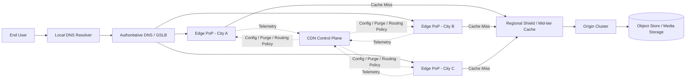
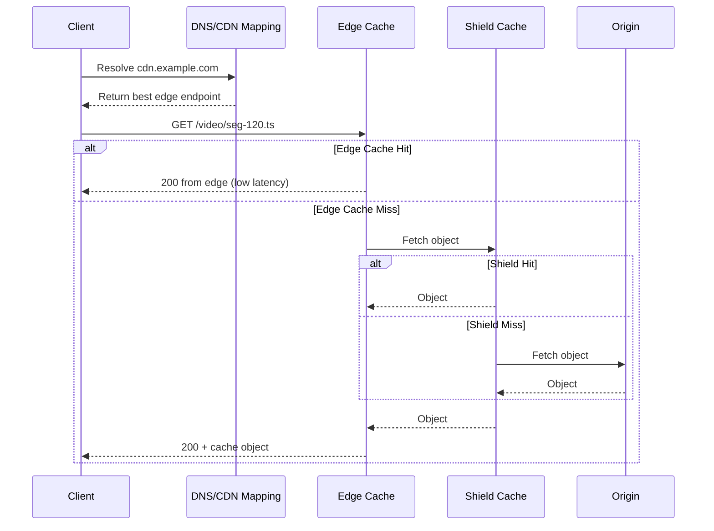

# Design Content Delivery Network

## Youtube

### Introduction

- [How a CDN Works | System Design](https://www.youtube.com/watch?v=5mYSQvflpKA)
- [How does Netflix's CDN scale to over 100TB/s? | System Design](https://www.youtube.com/watch?v=pdPSLm629yk)

- [Building YouTube-Scale Content Infrastructure (It's EASY)](https://www.youtube.com/watch?v=HT1-3bIOT2w)
- [Anycast vs Unicast Architecture Explained](https://www.youtube.com/watch?v=HT1-3bIOT2w)

## Theory

### What Is a CDN?

A **Content Delivery Network (CDN)** is a globally distributed system of servers that delivers content from locations closer to end users.

Core goals:

- Reduce latency (faster page/video/API asset loads)
- Reduce origin server load
- Improve availability and fault tolerance
- Improve throughput for large-scale traffic spikes
- Add security controls at the edge (DDoS mitigation, WAF, bot filtering)

Typical content served by a CDN:

- Static assets: images, CSS, JS, fonts
- Video/audio segments (HLS/DASH)
- Software downloads
- Dynamic/API responses (with careful caching rules)

### Why CDN Is Needed

Without CDN, every user request goes to a central origin region, causing:

- High RTT for distant users
- Congested long-haul links
- Hotspots and origin overload during traffic peaks
- Reduced resilience when one region fails

With CDN, users are served from nearby edge PoPs (Points of Presence), which can return cached content immediately or fetch from origin/shield when needed.

### High-Level CDN Architecture

Main components:

- **User + Resolver**: user browser/app asks DNS resolver for CDN hostname IP
- **DNS / GSLB layer**: steers user to best PoP (latency, health, policy)
- **Edge PoP**: first serving layer near users
- **Mid-tier / Shield**: protects origin from repetitive misses
- **Origin**: source of truth for content
- **Control plane**: config distribution, purge/invalidation, analytics, routing policies

### Request Flow (Cache Hit vs Cache Miss)

### CDN Caching Fundamentals

Important cache concepts:

- **TTL (Time To Live)**: how long object can stay fresh
- **Cache-Control** headers:
	- `max-age`, `s-maxage`, `public`, `private`, `no-store`, `must-revalidate`
- **ETag / Last-Modified** for revalidation (`If-None-Match`, `If-Modified-Since`)
- **Cache key**: host + path + selected query params + selected headers/cookies
- **Purge/Invalidate**: remove outdated objects before TTL expiry
- **Negative caching**: cache 404/5xx briefly to protect origin (careful tuning)

Cache strategies:

- **Cache-aside (pull CDN)**: fetch on miss
- **Push CDN / pre-warm**: proactively load expected hot objects
- **Tiered caching**: edge -> regional shield -> origin

### CDN for Video Streaming

For platforms like YouTube/Netflix:

- Video is split into chunks/segments (e.g., 2-6 seconds each)
- Player uses adaptive bitrate (ABR) manifests (`.m3u8`, `.mpd`)
- CDN caches most requested segments close to users
- Popular content gets very high edge hit ratio
- Long-tail content may be served via shield/origin more often

Design focus:

- Segment size and startup latency
- ABR ladder quality selection
- Origin shielding and pre-positioning of trending content

### Performance Metrics to Track

- **Cache Hit Ratio (CHR)** and **Byte Hit Ratio (BHR)**
- p50/p95/p99 latency by geography/ISP
- Origin offload percentage
- Error rate by status class (4xx/5xx)
- Throughput (Gbps/Tbps), concurrent connections
- Time-to-first-byte (TTFB)

### Scaling and Reliability Patterns

- Multi-PoP deployment across geographies
- Health-based traffic steering
- Anycast ingress + regional failover
- Graceful degradation (serve stale on error)
- Circuit breakers and request coalescing on hot misses
- Rate limiting and bot controls at edge

### Security in CDN

Common security capabilities:

- DDoS absorption at edge
- Web Application Firewall (WAF)
- TLS termination and certificate management
- Tokenized URLs / signed cookies for private content
- Geo/IP allowlists-denylists
- Origin protection (only CDN can access origin)

### Unicast vs Anycast IP

#### Unicast IP

**Unicast** means one IP belongs to one specific server endpoint.

- Routing picks the path to that exact destination node
- If users are globally distributed, many are far from the endpoint
- Good for direct point-to-point delivery
- Less ideal for globally distributed, low-latency edge ingress

In CDN context:

- Different PoPs may have different IPs
- DNS chooses which unicast IP user gets
- Failover and load balancing rely heavily on DNS decisions

#### Anycast IP

**Anycast** means the same IP prefix is advertised from multiple PoPs.

- Routers forward user traffic to the "nearest" advertisement by BGP policy
- Nearest here means best routing path, not always geographic distance
- Improves latency and resilience
- If one PoP fails, route can shift to next-best PoP

In CDN context:

- One anycast service IP can front many edge sites
- Traffic naturally distributes by network topology
- Excellent for DNS services, edge proxy ingress, and DDoS absorption

### BGP Protocol (Border Gateway Protocol)

**BGP** is the Internet's inter-domain routing protocol used between Autonomous Systems (AS).

What BGP does for CDN:

- Announces CDN IP prefixes (often anycast prefixes) from many locations
- Lets ISPs choose paths based on BGP attributes and policies
- Enables traffic engineering through route announcements

Key ideas:

- **AS (Autonomous System)**: network under one admin policy
- **AS Path**: sequence of AS hops to destination
- **Local Preference, MED, Communities**: influence route selection
- **Convergence**: time taken for route changes to propagate after failures

Simplified route selection intuition:

1. Prefer higher local preference (policy)
2. Prefer shorter AS path (often, but not always)
3. Apply additional tie-breakers (MED, eBGP/iBGP, IGP metrics)

For anycast CDN, BGP determines which PoP a client reaches. During outages or congestion, routing can shift as announcements/health policies change.

### DNS-Based Steering vs Anycast Steering

- **DNS steering**:
	- CDN DNS returns different IPs by client location, resolver location, health, load
	- Limited by DNS cache TTL and resolver behavior
- **Anycast steering**:
	- Network-level path selection via BGP
	- Faster path adaptation in some failure modes
	- Less granular for per-user business rules than DNS/app-layer routing

Most large CDNs combine both:

- DNS for macro placement and policy
- Anycast for robust ingress and fast network-level failover

### Common CDN Trade-Offs

- Lower latency vs cache consistency freshness
- Higher CHR vs personalization complexity
- Aggressive caching vs fast content updates
- Anycast simplicity vs traffic engineering precision
- Global footprint cost vs performance gains

### Example: End-to-End Lifecycle

1. User requests `cdn.example.com/image.png`
2. DNS maps user to best edge PoP
3. Edge checks cache key and TTL
4. On hit, response returns immediately
5. On miss, edge fetches from shield/origin, caches, returns response
6. Publisher updates content and triggers purge/invalidation
7. New requests pull fresh object and repopulate caches

### Interview-Style Summary

- CDN is a distributed edge caching and delivery system for performance, reliability, and security.
- Anycast + BGP provide scalable network-level ingress routing to nearest healthy PoP.
- Unicast is one-destination addressing; Anycast is one-to-nearest-of-many addressing.
- Good CDN design balances cache efficiency, freshness, routing control, and origin protection.