# Client-Server Architecture

## Blogs and websites


## Medium


## Youtube


## Theory

### The Foundational Paradigm of Distributed Computing

Client-Server architecture is not merely a pattern—it's the **fundamental organizing principle** of modern computing. It represents the first great abstraction in distributed systems: the separation of **concerns** (what you want) from **capabilities** (how it's provided).

Before client-server, software ran monolithically on a single machine: the program, the data, and the user interface were all tightly bound together. The moment we separated "the thing that asks" from "the thing that knows", we unlocked the entire modern internet. Your browser is a client. Google's search infrastructure is the server. Neither knows nor cares about the internal workings of the other—they only agree on a contract: HTTP + HTML.

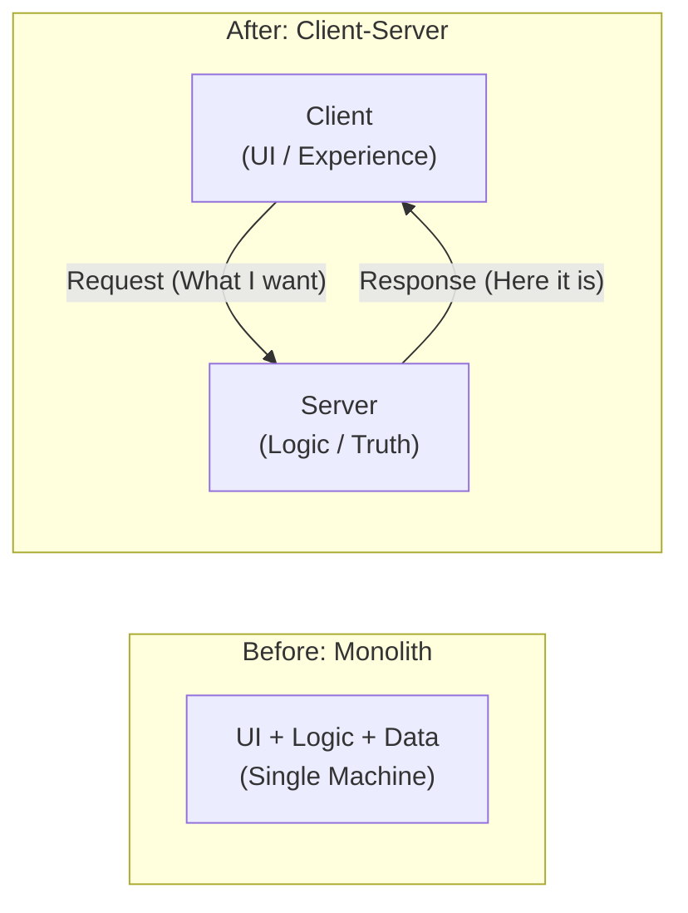

---

### The Deep Theory

#### Philosophical Foundation

At its core, client-server embodies the principle of **asymmetric responsibility**. The client owns the **interface and experience**, while the server owns the **truth and capability**.

Think of it like a restaurant:
- The **menu** (API) defines what you can order and how to ask
- The **waiter** (network) carries requests and responses
- The **kitchen** (server) has the actual capability to make food
- **You** (client) decide what you want but have no idea how it's cooked

This separation delivers four concrete benefits:

- **Specialization**: A mobile app client (Swift/Kotlin) and a web client (React) can both talk to the same backend server—each optimized for its own platform without duplicating business logic. Spotify's iOS app and the Spotify Web Player are two completely different clients consuming the same API.

- **Evolution**: Netflix rewrote their backend from a monolith to microservices over several years. Their clients (TV apps, mobile apps, website) kept working throughout because the API contract remained stable. The server implementation changed radically while clients noticed nothing.

- **Scaling**: A single PostgreSQL database server can serve thousands of simultaneous application server instances. One authoritative source of truth, many consumers.

- **Security**: Payment processing logic lives on Stripe's servers, not in your browser's JavaScript. Even if an attacker reverse-engineers the client completely, they cannot modify the payment logic—it never ran on their machine.

---

#### The Trust Boundary

The client-server split creates the first **trust boundary** in your system. Everything on the client side is **untrusted territory**—it can be modified, inspected, intercepted, or entirely replaced by a malicious actor.

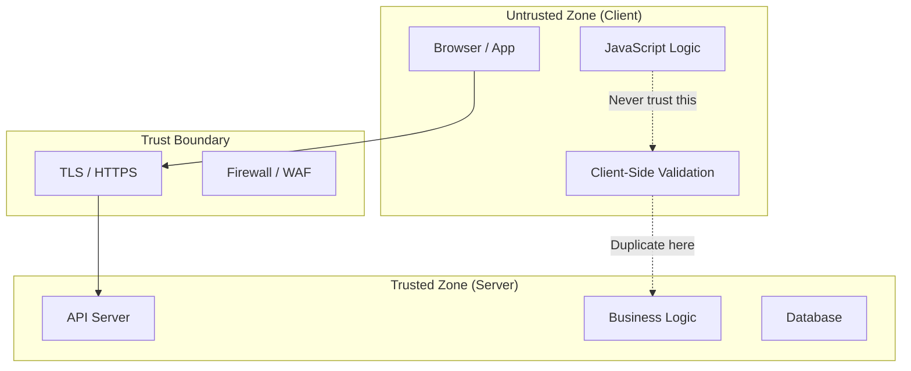

**Why each rule exists:**

- **Never trust client input (validate everything)**: In 2012, GitHub had a mass-assignment vulnerability where a Rails app trusted user-submitted JSON fields directly. An attacker sent a field that wasn't in the form, gaining admin access to the Rails repository. Server-side validation would have caught it.

- **Business logic belongs on the server**: Imagine an e-commerce app that calculates discount prices in JavaScript. An attacker opens DevTools, overrides the price calculation function, and checks out a $2,000 laptop for $0.01. The server must independently verify the price before charging.

- **Sensitive operations require server-side execution**: API keys, database credentials, encryption keys—these must never touch the client. If you embed an AWS secret key in a mobile app, it will be extracted and abused (this happens constantly; GitHub's secret scanning catches thousands of leaked keys weekly).

- **Client-side validations are for UX, not security**: Disabling the "required" attribute on an HTML input takes 2 seconds in DevTools. Client validation prevents honest mistakes; server validation prevents malicious ones. Always do both, never only the former.

---

### The State Problem

Every server must decide: **do I remember who you are between requests?**

#### Stateless Servers (The Ideal)

In a stateless design, each HTTP request carries **everything the server needs** to fulfill it—identity, context, preferences. The server holds zero memory of previous interactions.

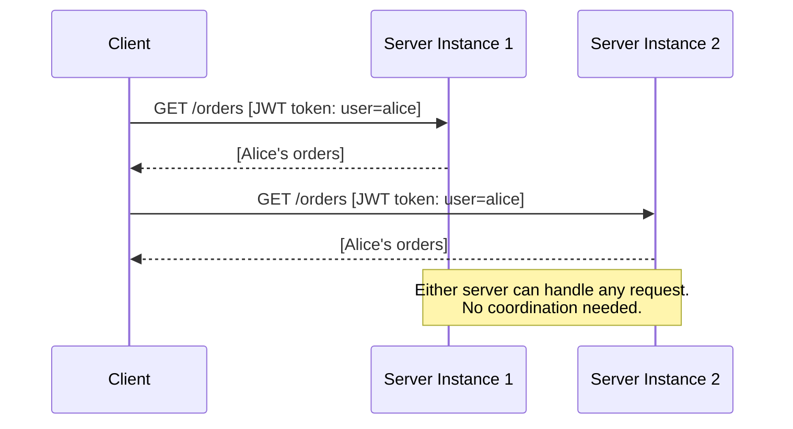

**Concrete example — JWT-based auth:**
Instead of the server storing "session_id → alice", the client carries a signed JWT containing `{ "user": "alice", "role": "admin" }`. Any server instance can verify the signature and trust the payload, with no shared session store required.

- **Pros**: Any of 100 load-balanced server instances can handle any request. Deploy a new instance in 30 seconds. Kill a bad instance with zero data loss.
- **Trade-off**: Each request is larger (carries the JWT, user preferences, etc.). Re-validating the token on every request adds a few milliseconds.

#### Stateful Servers (The Reality)

A stateful server maintains a **session**—a server-side record that maps a session ID (usually a cookie) to the current user's context.

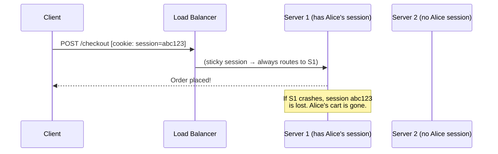

**The sticky session problem**: When session data lives in-memory on a specific server, the load balancer must always route that user to the *same* server (sticky sessions). If that server dies, the session is lost. If you want to scale to 10 servers, you need 10× the session memory.

- **Pros**: Smaller requests (server already knows the context). Marginally faster for complex session data.
- **Trade-off**: Scaling is painful. Failover requires session replication or users get logged out.

#### The Modern Solution: Hybrid Stateless Architecture

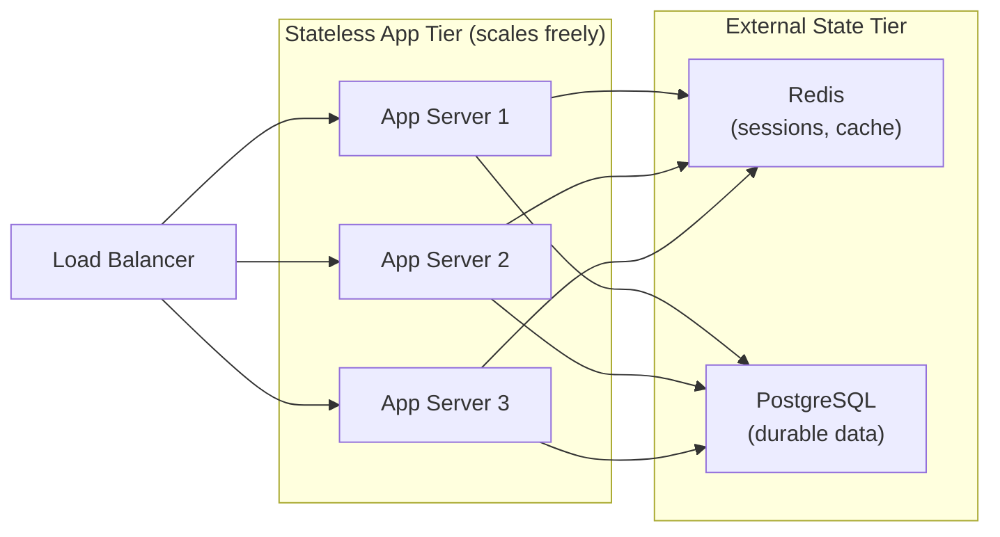

App servers are completely stateless—they read session state from Redis on every request. Redis is fast enough (~0.1ms lookup) that this adds negligible latency, but now:
- Any server can handle any request (no sticky sessions)
- Kill/restart any app server with zero impact
- Scale app servers horizontally without touching Redis
- Redis itself can be clustered for high availability

---

### Architectural Tiers: Evolution of Separation

#### Two-Tier (Client-Server)

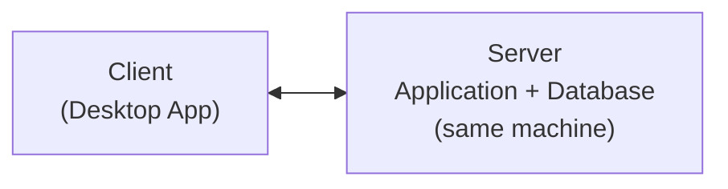

The client speaks directly to the server, which bundles both application logic and data storage.

- **Use Case**: Internal tools, MVPs, small-team line-of-business apps
- **Pros**: Simple to build and deploy, single network hop, fast development
- **Cons**: Business logic is tightly coupled to the database schema. Want to add a mobile client? It needs direct database access, which is a security nightmare. Scaling means scaling everything together.
- **Example**: A Microsoft Access app where the `.accdb` file lives on a shared network drive. Works for 5 users; collapses at 50.

#### Three-Tier (Presentation-Logic-Data)

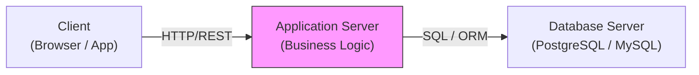

The **de-facto standard** for modern web applications. Each tier has a single responsibility and can be scaled or replaced independently.

- **Use Case**: The vast majority of SaaS apps—Notion, Linear, Shopify stores
- **Pros**:
    - **Independent scaling**: The app tier is stateless and can scale to 100 instances; the DB tier scales separately.
    - **Security isolation**: The database is not exposed to the internet. Only the app server (in a private subnet) can reach it.
    - **Tech flexibility**: Swap PostgreSQL for MySQL without touching client code. Rewrite the client from React to Vue without touching the server.
- **Cons**: Two network hops instead of one. Marginally more complex deployment.
- **The Standard**: When in doubt, start here.

#### N-Tier (Distributed Architecture)

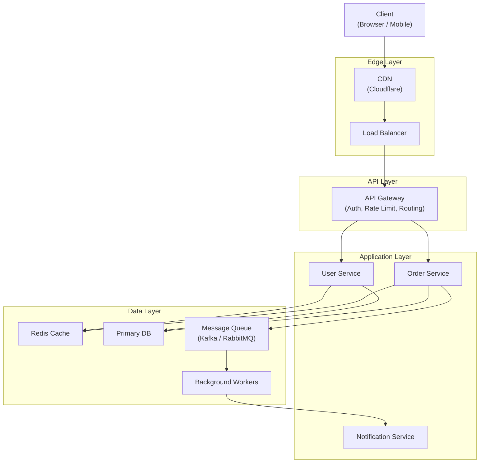

N-Tier emerges naturally as a three-tier system grows. Services get extracted, queues get introduced, caches get added—each solving a specific scaling or reliability problem.

- **Use Case**: Uber, Amazon, Netflix—systems where different components have wildly different scaling needs
- **Pros**: The Order Service can be scaled independently of the User Service. A spike in notifications doesn't affect checkout. Fault in one service doesn't cascade.
- **Cons**: A user checkout now involves 4-6 network hops across different services. Distributed tracing (Jaeger, Zipkin) becomes essential. Local development requires running 10 services simultaneously.
- **When to reach for it**: When a specific tier is the bottleneck and you cannot scale it without scaling everything else. Don't start here.

---

### The Communication Contract: APIs

The API is the **formal contract** between client and server. It defines precisely what requests are valid, what responses look like, and what guarantees are made. Violating this contract is a breaking change.

- **Syntax** (How to format): HTTP uses verbs (`GET`, `POST`, `PUT`, `DELETE`) and JSON/XML bodies. gRPC uses Protocol Buffers (binary, typed). GraphQL uses a query language.
- **Semantics** (What it means): `DELETE /users/123` means "permanently remove user 123"—not "mark inactive", not "archive". Semantics must be unambiguous.
- **Guarantees** (What you can rely on): Is `POST /orders` idempotent? (Can I safely retry if the network drops?) Is it atomic? (Does it either fully succeed or fully fail?)

#### The API as Interface

The analogy to an OOP interface is precise:

```
// Java Interface
interface UserRepository {
    User findById(Long id);
    void save(User user);
}

// REST API "Interface"
GET  /users/{id}    → User object
POST /users         → Created user
```

Both define *what* is available and *how to call it*, without exposing *how it works internally*. The Java implementation could switch from Hibernate to JDBC; the REST implementation could switch from MySQL to DynamoDB. Callers notice nothing.

**Version carefully**: Once an API is public, removing or renaming a field is a **breaking change**. Twitter removed the `contributors` field from the Tweet object in 2018 and broke dozens of third-party apps overnight. Use API versioning (`/v1/`, `/v2/`) and deprecation periods.

---

### Request-Response Patterns

#### Synchronous (Request-Response)

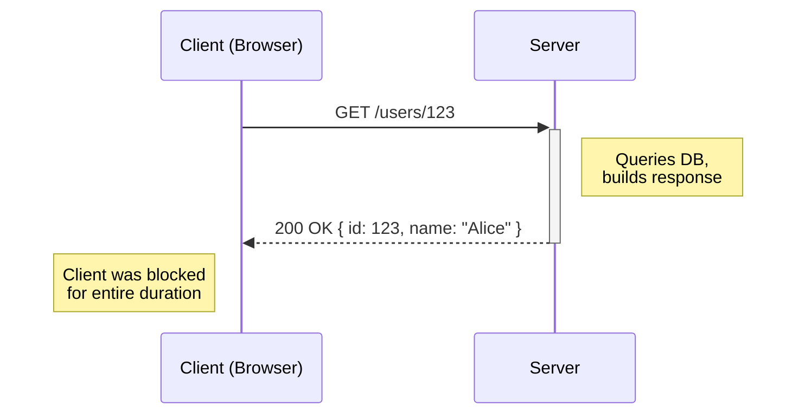

The client sends a request and **blocks**—it cannot do anything else until the server responds. This is the HTTP model most of the web runs on.

- **Use**: Read queries (`GET /products`), transactional writes (`POST /checkout`), any operation where the result is needed immediately
- **Limitation**: If the server takes 5 seconds to respond, the user stares at a spinner for 5 seconds. If the server takes 30 seconds (e.g., generating a large report), the HTTP connection may time out.
- **Real-world example**: Loading your Gmail inbox. The browser blocks until the server returns the list of emails, then renders them.

#### Asynchronous (Fire-and-Forget with Polling)

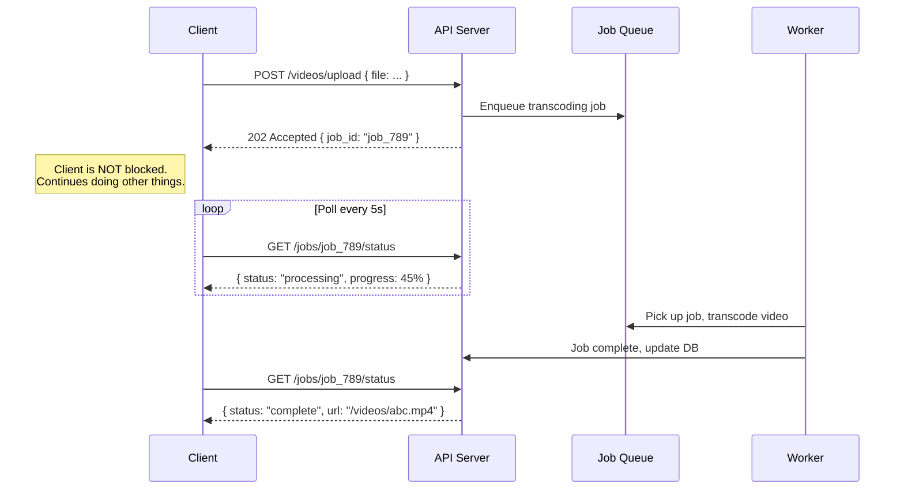

The server immediately acknowledges the request with a **job ID**, processes it in the background, and the client polls for completion.

- **Use**: Video transcoding (YouTube), email delivery, PDF generation, data exports, anything that takes more than ~2 seconds
- **Benefit**: Client never blocks on a long operation. Server can queue and throttle work. Workers can be scaled independently.
- **Example**: When you request a GDPR data export from Google, you get an email hours later—not a loading spinner for 2 hours.

#### Push (Server-Initiated)

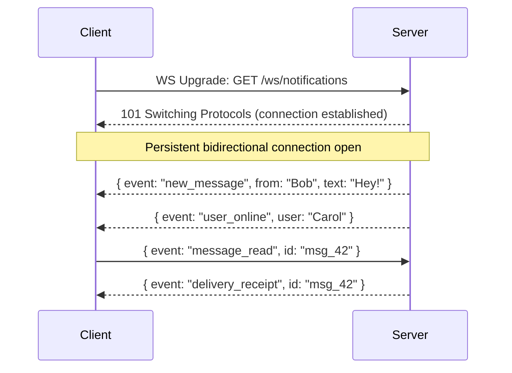

The client establishes a **persistent connection** and the server pushes data whenever it has something new—no polling required.

- **Use**: Chat apps (Slack, WhatsApp Web), live dashboards (stock tickers, sports scores), collaborative editing (Google Docs), multiplayer games
- **Technologies**:
    - **WebSockets**: Full-duplex, bidirectional. Best for chat and games where the client also sends frequently.
    - **Server-Sent Events (SSE)**: Server-to-client only, over plain HTTP. Best for live feeds (news, notifications) where the client only listens.
    - **Long Polling**: Client makes a request; server holds it open until data is available, then responds. Old-school fallback for environments that don't support WebSockets.

| Technology | Direction | Protocol | Best For |
|---|---|---|---|
| WebSocket | Bidirectional | WS / WSS | Chat, games, collaborative apps |
| SSE | Server → Client | HTTP | Live feeds, notifications |
| Long Polling | Server → Client | HTTP | Fallback compatibility |

---

### The Scalability Implications

#### Scaling Clients

Clients are **self-scaling by nature**—each user brings their own device. One million users means one million client processes running on one million different machines, each making independent requests.

The server-side concern is protecting against:
- **Rate limiting**: Prevent a single client from overwhelming the server (e.g., limit to 100 req/min per IP/token)
- **DDoS protection**: Cloudflare, AWS Shield absorb volumetric attacks before they reach your servers
- **Authentication at the edge**: Reject unauthenticated requests before they consume server resources

#### Scaling Servers

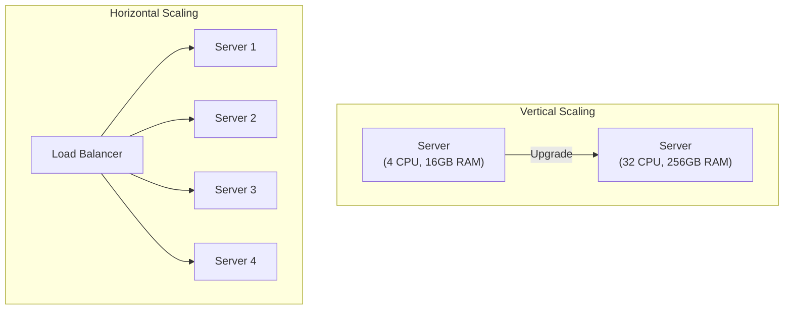

- **Vertical scaling** (scale up): Buy a bigger machine. Simple—no code changes required. Limited—you can't buy an infinitely large machine, and downtime is required for upgrades. A $20k server is 10× the cost of a $2k server but rarely 10× the performance.

- **Horizontal scaling** (scale out): Add more machines behind a load balancer. Requires **stateless servers** (any instance must be able to handle any request). Amazon, Google, and Netflix run tens of thousands of commodity servers rather than a handful of supercomputers.

- **The pattern**: Start vertical (simpler). When you hit the ceiling of a single machine, go horizontal. Most apps never need to go horizontal—premature horizontal scaling adds enormous complexity for no benefit.

---

### Modern Evolutions

#### Thin Client (Traditional Web Apps / Server-Side Rendering)

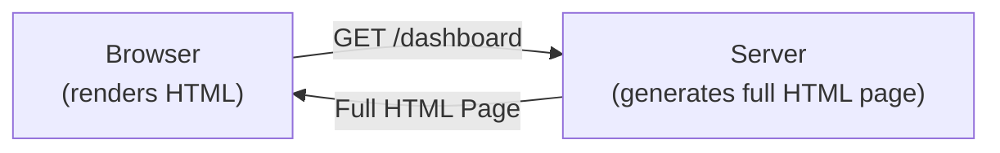

The server generates a complete HTML page and sends it to the browser. The client's only job is to render what it receives.

- **Benefit**: Dead simple client. Any device with a browser works—old phones, screen readers, search engine crawlers. Updates deploy instantly (server-side only). Consistent business logic enforced everywhere.
- **Trade-off**: Every interaction requires a round-trip to the server. Navigation feels like page reloads. Heavy server load for dynamic content.
- **Examples**: Classic PHP apps (early Facebook, Wikipedia), Django/Rails server-rendered apps, GOV.UK (deliberately thin for accessibility).

#### Thick Client (Single-Page Applications / Desktop Apps)

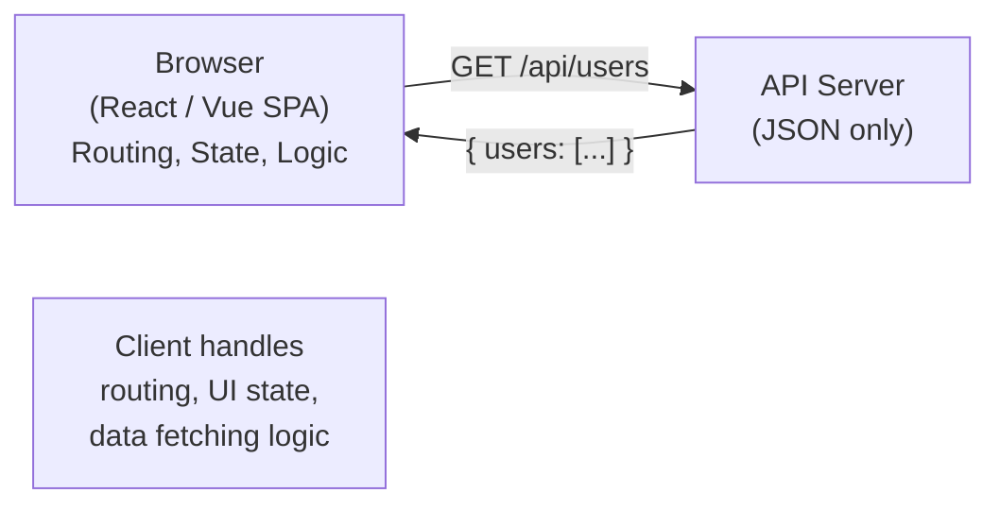

The client downloads a JavaScript application that runs entirely in the browser. The server becomes a pure **data API** returning JSON.

- **Benefit**: Instant navigation (no page reloads), rich interactive UI, can work offline with service workers, reduced server load (client does rendering).
- **Trade-off**: The initial JavaScript bundle can be megabytes large (slow first load). SEO is harder (crawlers see an empty HTML shell). Complex state management (`Redux`, `Zustand`) becomes necessary. You now maintain two codebases: the client app and the API.
- **Examples**: Gmail, Figma, Linear, Notion—all are SPAs that feel like desktop apps in the browser.

#### Hybrid (Progressive Web Apps / Islands Architecture)

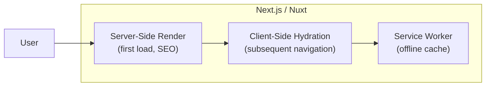

Modern frameworks (Next.js, Nuxt, SvelteKit) blend both: the **first page load** is server-rendered (fast, SEO-friendly), then the JavaScript "hydrates" the page and subsequent navigation is client-side (fast, no full reloads). Service workers cache assets for offline use.

- **Best of Both**: First-load performance of server rendering + navigation speed of SPAs + offline capability of native apps
- **Examples**: Twitter (X), Airbnb, Vercel's own dashboard

---

### The Fundamental Trade-offs

| Aspect | Client-Heavy (SPA) | Server-Heavy (SSR / Thin Client) |
|--------|-------------|-------------|
| **First Load Performance** | Slow (large JS bundle to download) | Fast (server sends ready HTML) |
| **Navigation Performance** | Fast (no round trip, instant route changes) | Slower (each page requires server request) |
| **Security** | Lower (logic is visible, inspectable) | Higher (logic never leaves the server) |
| **Server Load** | Lower (client renders, server just serves data) | Higher (server renders every page for every user) |
| **Updates** | Must invalidate client caches, deal with version skew | Instant (all users get new server code immediately) |
| **Offline Capability** | Possible with service workers + IndexedDB | Not possible (requires server for every view) |
| **SEO** | Harder (requires SSR or prerendering) | Native (search crawlers get full HTML) |
| **Consistency** | Harder (multiple client versions in the wild) | Guaranteed (single server version) |
| **Developer Experience** | Complex (state management, hydration bugs) | Simpler (one codebase, one deployment) |

---

### The Wisdom

#### Start Server-Heavy

For a new product, default to server-rendered pages with minimal JavaScript. You can always add more client-side logic later as specific UX needs demand it. The reverse—extracting logic from a bloated SPA back to the server—is painful.

- **Business logic on server**: If the pricing rule changes, you deploy once. With a thick client, you pray all users have updated their app cache.
- **Thin clients are easier to update**: A Django template change is live in seconds. An npm-published SDK update takes months to propagate across consumer apps.
- **Move to client only when you have a specific need**: The user says "this feels sluggish" (add client-side transitions). The server says "I'm overwhelmed rendering" (move rendering to client). Not before.

#### The Golden Rule

> *"Never trust the client. Always validate on the server. The client is for user experience, the server is for truth."*

This is not theoretical. The OWASP Top 10 consistently lists **Broken Access Control** and **Injection** as the top two vulnerabilities—both caused by trusting client-supplied input without server-side validation.

#### Modern Best Practice (Reference Stack)

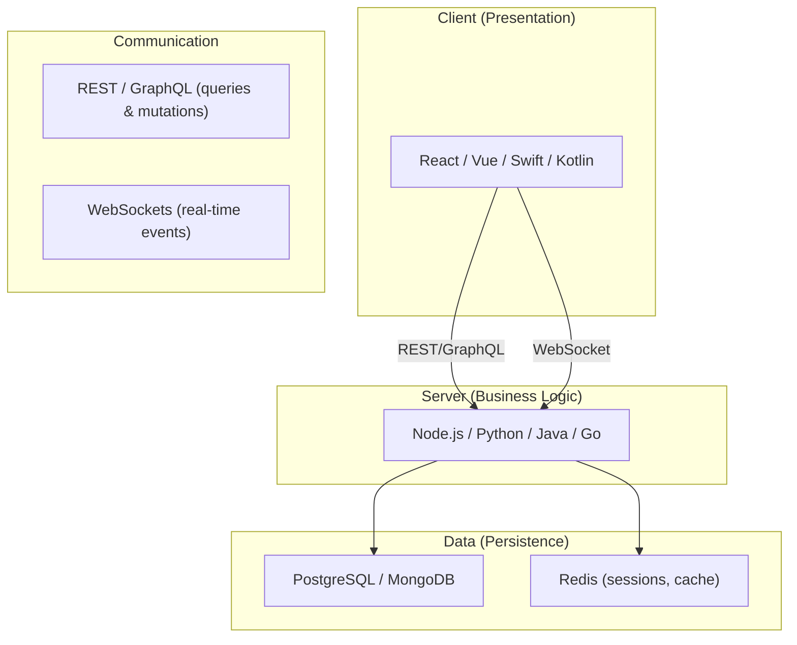

- **Presentation**: Client (React, Vue, Swift, Kotlin)—renders UI, handles user input
- **Business Logic**: Server (Node, Python, Java, Go)—validates, authorizes, orchestrates
- **Data**: Databases (PostgreSQL, MongoDB)—durable, queryable storage
- **State**: External store (Redis)—fast ephemeral state, sessions, pub/sub
- **Communication**: REST/GraphQL for request-response, WebSockets for server-push events
