# The Philosophy of System Design: A Unified Theory

## Blogs and websites


## Medium

- [6 System Design Interview Concepts](https://levelup.gitconnected.com/6-system-design-interview-concepts-1b1882506766)
- [System Design Interview Question: Design Spotify](https://levelup.gitconnected.com/system-design-interview-question-design-spotify-4a8a79697dda)

## Youtube


## Theory

### Purpose and Mindset

#### The Grand Vision

System design is not merely about connecting components or choosing technologies. It is about orchestrating complexity into harmony. At its core, system design is the art and science of **managing trade-offs** in pursuit of a singular goal: **building systems that serve human needs at scale while remaining economically viable and technically sustainable**.

In practice, that means every design conversation must connect three worlds at once: the **user experience**, the **technical architecture**, and the **business reality**. A design that is elegant but unaffordable fails. A design that is cheap but unreliable fails. A design that scales technically but ignores user needs also fails. Good system design lives in the overlap.

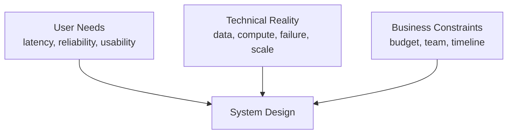

#### Why Learn System Design

System design is crucial for building scalable, reliable, and maintainable software systems. It helps you:

- Understand how large-scale systems work
- Make informed architectural decisions
- Prepare for technical interviews at top tech companies
- Design systems that can handle millions of users
- Build fault-tolerant and resilient applications

System design knowledge compounds differently from most engineering skills. A framework becomes obsolete when its ecosystem does. The ability to reason about data locality, failure modes, and capacity constraints remains relevant across technology generations.

The practical impact is immediate: most scaling bottlenecks in real systems are architectural, not algorithmic. A service that cannot handle load is rarely fixed by making the sorting function faster.

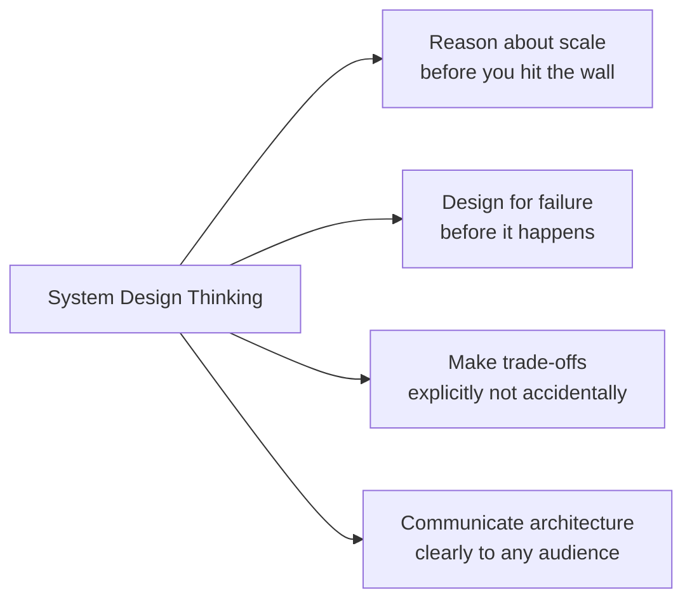

#### The Fundamental Truth: Everything Is a Trade-off

In system design, there are no perfect solutions, only optimal choices for specific contexts. Every decision involves sacrificing one quality for another:

- **Performance vs Cost**: Faster systems require more resources
- **Consistency vs Availability**: Strong guarantees limit uptime during failures
- **Simplicity vs Flexibility**: Easy-to-use systems may lack customization
- **Speed of Development vs System Quality**: Quick launches may accumulate technical debt
- **Scalability vs Complexity**: Distributed systems bring operational overhead

**The Master's Mindset**: A great system designer does not seek the "best" solution. They seek the most **appropriate** solution for the constraints, user needs, and business goals in front of them.

This is why system design answers often sound unsatisfying to beginners. The correct answer is rarely "always use microservices" or "always use PostgreSQL". The correct answer is usually closer to: "given this scale, this consistency requirement, this team size, and this release pressure, this trade-off is acceptable." Maturity in system design is the ability to make these compromises deliberately rather than accidentally.

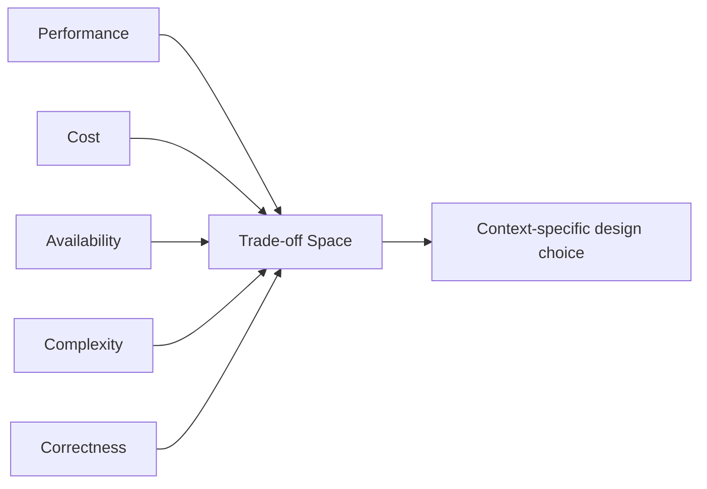

### Architectural Foundations

#### The Three Pillars of System Design

Every system, regardless of scale or domain, rests on three fundamental pillars.

These pillars are not independent silos. Data determines what computation is efficient. Computation determines what communication pattern is necessary. Communication constraints feed back into how data must be partitioned or replicated. Most real incidents come from a mismatch between these pillars rather than a failure inside only one of them.

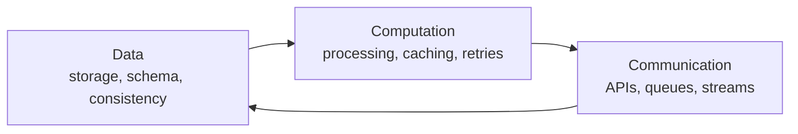

##### Data: The Foundation

- How data is **stored**: databases, file systems, caches
- How data is **structured**: schemas, models, formats
- How data is **accessed**: queries, indexes, APIs
- How data is **distributed**: replication, sharding, partitioning
- How data maintains **integrity**: consistency, transactions, validation

**Philosophy**: Data is the lifeblood of your system. Respect it, protect it, and structure it wisely. All other components exist to manipulate and transport this resource.

A read request typically traverses a chain of data tiers. Caching short-circuits this chain and avoids the most expensive hops:

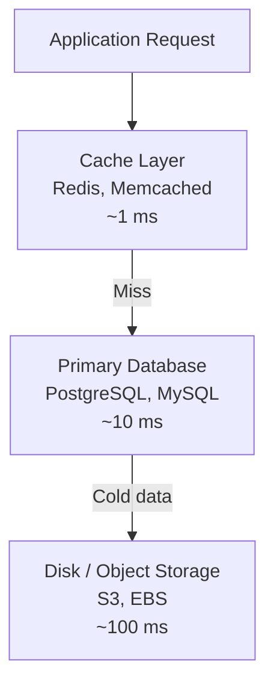

##### Computation: The Engine

- How **requests are processed**: synchronous vs asynchronous
- How **logic is organized**: monolith, microservices, serverless
- How **work is distributed**: load balancing, task queues
- How **failures are handled**: retries, circuit breakers, fallbacks
- How **performance is optimized**: caching, parallel processing, batching

**Philosophy**: Computation transforms data into value. Design the computational model to be resilient, efficient, and aligned with data access patterns.

One of the most consequential decisions in the computation layer is choosing between synchronous and asynchronous processing:

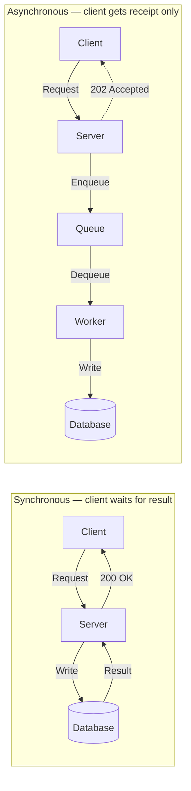

Use synchronous when the caller needs the result immediately. Use asynchronous when throughput matters more than per-request latency, or when the operation is long-running.

##### Communication: The Nervous System

- How **components connect**: APIs, message queues, event streams
- How **data flows**: request/response, pub/sub, streaming
- How **services discover** each other: DNS, service mesh, registries
- How **errors propagate**: graceful degradation, bulkheads
- How **latency is minimized**: CDN, edge computing, compression

**Philosophy**: Communication patterns define system behavior under stress. Choose protocols and interaction patterns that match consistency and latency requirements.

The three most common inter-service communication patterns serve different needs:

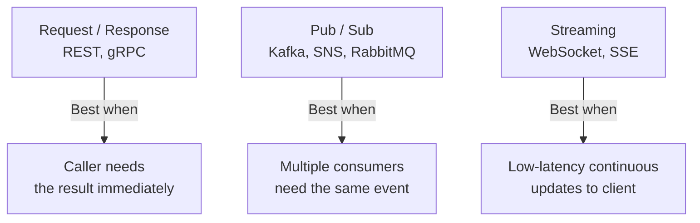

#### The Evolutionary Stages of System Design

Systems evolve through predictable stages. Understanding this lifecycle helps you make appropriate decisions for the current scale instead of prematurely designing for a future that may never arrive.

The most common architectural mistake is solving tomorrow's problem with today's complexity budget. Most systems do not fail because they started too simple; they fail because they became too complex before the product, team, or traffic justified that complexity.

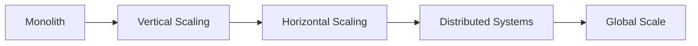

##### Stage 1: The Monolith (0-100K users)

- Single application, single database
- Simple deployment, easy debugging
- Focus: Product-market fit
- **Philosophy**: Start simple. Premature optimization is the root of all evil.

##### Stage 2: Vertical Scaling (100K-500K users)

- Bigger servers, optimized queries
- Introduce caching and CDN
- Focus: Performance optimization
- **Philosophy**: Scale up before scaling out. Extract maximum value from simplicity.

##### Stage 3: Horizontal Scaling (500K-5M users)

- Load balancers, multiple app servers
- Database replication through read replicas
- Service separation begins
- Focus: Reliability and availability
- **Philosophy**: Distribute load and eliminate single points of failure.

##### Stage 4: Distributed Systems (5M-50M users)

- Microservices architecture
- Database sharding
- Message queues and event-driven patterns
- Focus: Team autonomy and service isolation
- **Philosophy**: Embrace complexity to manage complexity. Each service is a bounded context.

##### Stage 5: Global Scale (50M+ users)

- Multi-region deployment
- Distributed caching through Redis clusters
- Advanced patterns such as CQRS and event sourcing
- Focus: Low latency and high availability worldwide
- **Philosophy**: Think globally, act locally. Bring computation close to users.

**Architecture comparison across stages:**

| Concern | Stage 1: Monolith | Stage 3: Horizontal | Stage 4: Distributed | Stage 5: Global |
|---|---|---|---|---|
| **Deployment unit** | Single app | Multiple pods | Many services | Multi-region services |
| **Database** | One instance | Read replicas | Sharded + replicated | Geo-replicated |
| **Caching** | None or local | Shared Redis | Distributed cache | CDN + regional cache |
| **Coordination** | None | Load balancer | Service mesh | Global load balancer |
| **Failure domain** | Whole app | Single pod | Single service | Single region |
| **Team model** | One team | One team | Multiple teams | Multiple teams |

The most dangerous transition is Stage 2 to Stage 4. Teams that skip Stage 3 often introduce microservices before they have the operational tooling — service discovery, distributed tracing, contract testing — to manage them safely.

### System Laws and Design Principles

#### The Hierarchy of Optimization

Optimize in this order. Deviation usually leads to wasted effort:

1. **Correctness**: Does it work? Tests, validation, monitoring
2. **Availability**: Is it reliable? Redundancy, failover, health checks
3. **Latency**: Is it fast enough? Caching, indexing, CDN
4. **Throughput**: Can it handle the load? Scaling, load balancing
5. **Cost**: Is it economical? Resource optimization, auto-scaling

**Warning**: Optimizing out of order creates fast, scalable systems that produce wrong results, or correct systems that cost millions to operate.

Another way to read this hierarchy is as a dependency chain: throughput gains do not matter if the answers are wrong, and cost optimization does not matter if the service is unreliable. The order is not arbitrary. Each layer assumes the lower layers are already good enough.

Understanding why the order is what it is makes the hierarchy easier to apply in practice:

- **Correctness first** because a system that produces wrong answers at any speed is actively harmful. Corrupted financial records or incorrect inventory counts are often irreversible. No amount of speed or availability compensates for wrong data.
- **Availability second** because a system that is occasionally slow is nearly always preferable to one that is occasionally completely down. Users and businesses can usually tolerate slowness; they cannot absorb unavailability. Redundancy, health checks, and failover belong here.
- **Latency third** because once the system is correct and up, user experience depends heavily on responsiveness. Research consistently shows that response-time degradation directly reduces engagement and conversion. Caching, indexing, and CDN placement are the primary tools.
- **Throughput fourth** because throughput is about how much work the system sustains over time under real load. Horizontal scaling, load balancing, and asynchronous processing are the levers. Optimising throughput on an incorrect system means processing more wrong answers per second.
- **Cost last** because cost optimisation on an unreliable or incorrect system is wasted effort and often introduces regressions. Right-size infrastructure and eliminate waste only once the system is in a verified good state and the traffic pattern is understood.

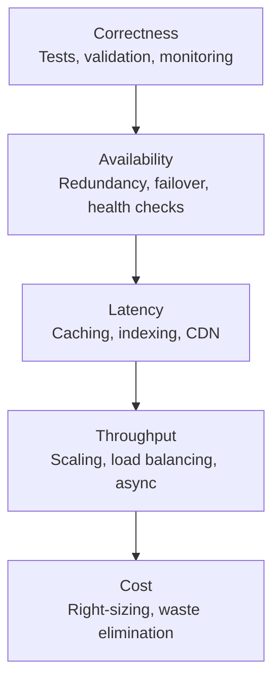

#### The CAP Theorem: The Immutable Law

The CAP theorem is not merely theoretical. It is a **fundamental law of distributed systems** that shapes design decisions.

**The Law**: In the presence of a network partition (P), you must choose between Consistency (C) and Availability (A). You cannot have all three.

**The Reality**: Network partitions are inevitable, so the practical choice is always between consistency and availability.

**The Wisdom**:

- **Choose CP** when correctness is non-negotiable: banking, inventory, booking systems
- **Choose AP** when user experience trumps immediate correctness: social feeds, recommendations, analytics

**The Nuance**: Many modern systems use **eventual consistency**. They lean toward AP but converge over time, which is often the right trade-off for product systems.

The key mistake is treating CAP as a database branding question. It is not. CAP is a **failure-mode question**. You only discover your actual CAP choice when the network is broken, not when everything is healthy.

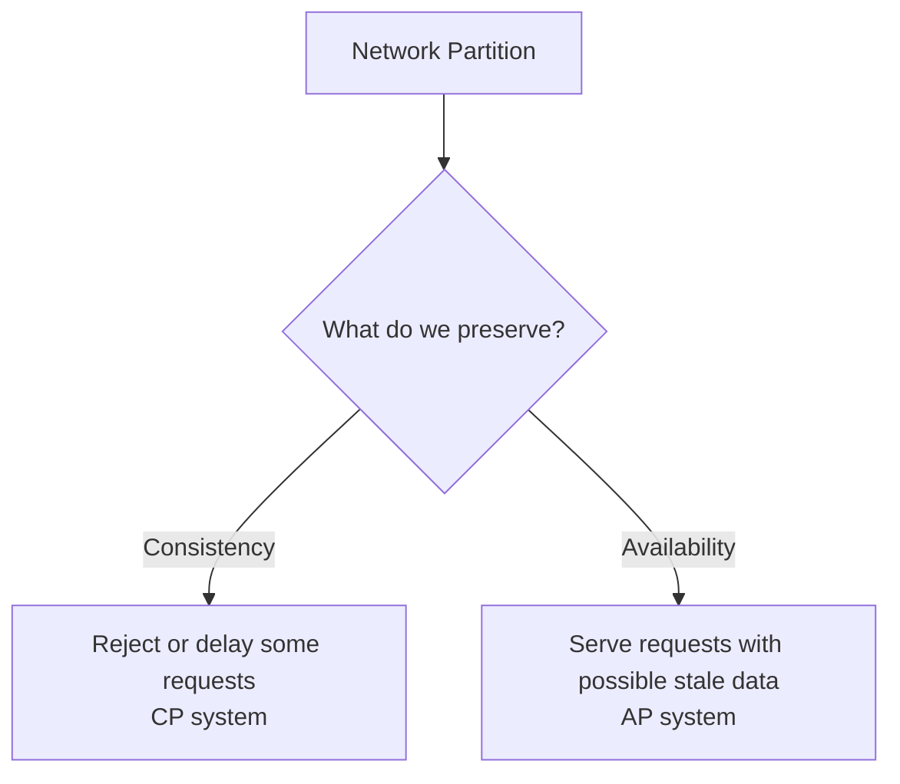

**Beyond CAP: The PACELC Extension**

CAP describes system behaviour only during a network partition. The **PACELC theorem** (Partition: choose A or C; Else: choose Latency or Consistency) extends CAP by capturing the trade-off that exists during **normal, healthy operation** as well. Even when the network is working correctly, a distributed system that replicates data must choose between serving the nearest replica immediately (lower latency, possibly stale data) or waiting for a quorum of replicas to confirm the write (higher latency, always fresh data). This latency-versus-consistency dimension is often more consequential day-to-day than the partition dimension, because partitions are rare but every request hits the normal-ops trade-off.

**How common databases make these choices:**

| System | Partition choice | Normal-ops choice | Typical use case |
|---|---|---|---|
| **PostgreSQL** (single node) | CP | Consistent | OLTP, financial records |
| **Cassandra** | AP | Latency-favoring | Time-series, user event streams |
| **DynamoDB** (default) | AP | Latency-favoring | Web-scale key-value workloads |
| **MongoDB** (default) | CP | Consistent | Documents, flexible schema |
| **Zookeeper** | CP | Consistent | Coordination, distributed config |
| **Redis** (cluster mode) | AP | Latency-favoring | Cache, session store |
| **CockroachDB** | CP | Consistent (higher latency) | Global OLTP with strong guarantees |

The takeaway is not to memorise this table but to understand that every storage system embeds a CAP and PACELC stance in its defaults. Reading the documentation section on consistency models before adopting a database is not optional — it is how you avoid discovering your system's actual guarantees during an incident.

#### The Data Gravity Principle

**Law**: Computation moves to where data lives, not the other way around.

**Why**: Moving large datasets is expensive in bandwidth, latency, and cost. In most real systems, it is cheaper to send code to data than to move data to code.

**Implications**:

- Store data close to users through CDNs and regional databases
- Process data where it is generated through edge computing
- Replicate read-heavy data and shard write-heavy data
- Use database views or materialized views instead of unnecessary movement

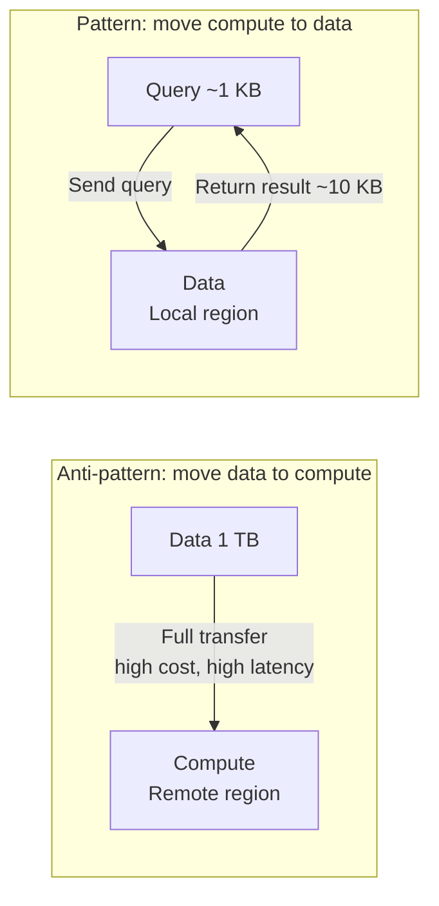

#### The Principle of Least Surprise

Systems should behave in ways that users and developers expect.

- **APIs**: Follow REST conventions or GraphQL standards
- **Status Codes**: Use HTTP codes correctly, such as 200, 404, and 500
- **Error Messages**: Be clear and actionable
- **Documentation**: Keep it accurate and current
- **Naming**: Use intuitive and consistent names

**Philosophy**: Surprises in production are bugs. Predictable systems are debuggable systems.

A common violation is inconsistent naming and behaviour across endpoints. The table below shows the difference in practice:

| Dimension | Surprising — avoid | Predictable — prefer |
|---|---|---|
| HTTP verb | `GET /deleteUser?id=42` | `DELETE /users/42` |
| Status code | `200 OK` with error body | `400 Bad Request` with error body |
| Naming convention | `getUser`, `fetch_order`, `retrieveItem` | `getUser`, `getOrder`, `getItem` |
| Error response shape | Different per endpoint | Consistent `{error, code, message}` |
| Pagination strategy | Mix of `page`, `cursor`, `offset` | One consistent strategy site-wide |

#### The Principle of Graceful Degradation

Systems should degrade gracefully, not catastrophically.

When components fail, the system should:

1. **Continue operating** with reduced functionality
2. **Provide clear feedback** about what is unavailable
3. **Maintain data integrity** even if features are offline
4. **Recover automatically** when dependencies return

**Examples**:

- Netflix continues playing already-loaded content when recommendations fail
- Twitter shows cached tweets when the live feed is down
- E-commerce sites allow browsing when checkout is degraded

**Philosophy**: A system that is 99% available with graceful degradation is often better than one that is 99.9% available but fails catastrophically.

Graceful degradation is what separates a resilient product from a brittle one. Users are often willing to tolerate a missing recommendation panel or delayed analytics widget; they are far less forgiving when the whole application becomes unusable because one dependency is slow.

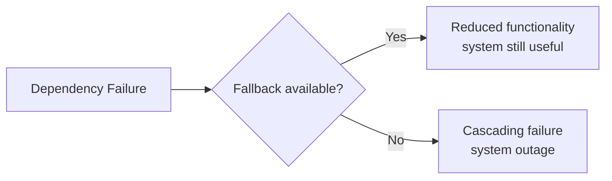

### Operational Excellence

#### The Observability Imperative

You cannot improve what you cannot measure, and you cannot fix what you cannot see.

**The Three Pillars**:

1. **Logs**: What happened? Events, errors, transactions
2. **Metrics**: How much? How fast? Counters, gauges, histograms
3. **Traces**: Where did it go? Distributed request tracking

**The Practice**:

- Log with correlation IDs
- Monitor golden signals: latency, traffic, errors, saturation
- Alert on symptoms, not causes
- Build dashboards for different audiences: business, operations, engineering

**Philosophy**: In distributed systems, observability is not optional. It is the only way to maintain sanity.

Observability is best understood as a feedback loop. Systems emit evidence, engineers interpret that evidence, and the interpretation drives design and operational changes. Without that loop, teams operate on intuition alone, which breaks down quickly at scale.

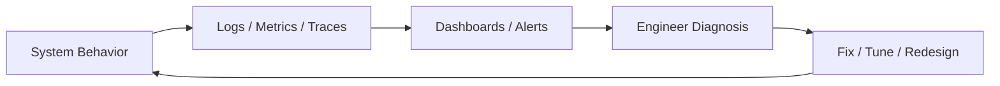

#### The Security-First Mindset

Security is not a feature. It is a foundation.

**The Layers of Defense**:

1. **Network**: Firewalls, VPCs, security groups
2. **Application**: Authentication, authorization, input validation
3. **Data**: Encryption at rest and in transit
4. **Infrastructure**: Patching, least privilege, monitoring

**The Rules**:

- Never trust user input
- Always use HTTPS
- Store passwords hashed with bcrypt or Argon2
- Implement rate limiting
- Use the principle of least privilege
- Encrypt sensitive data
- Run regular security audits

**Philosophy**: A system breach can destroy years of work in minutes. Design with paranoia.

Security should be treated as a cross-cutting property, not a final-stage checklist. The strongest teams assume compromise is possible and design multiple layers so that one control failing does not expose the whole system.

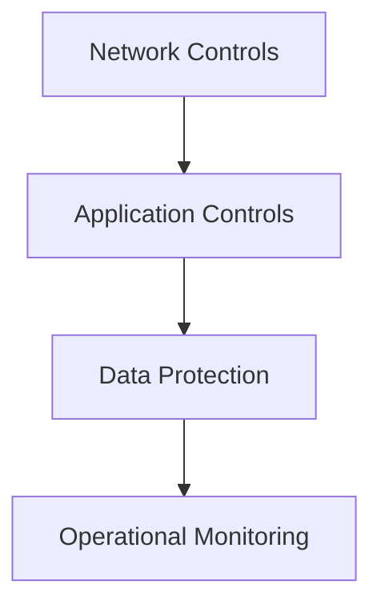

**The STRIDE Threat Model**

A practical way to reason about the attack surface before building is to enumerate threats by category. STRIDE is a structured framework for doing exactly that:

| Threat | What it means | Common example | Primary mitigation |
|---|---|---|---|
| **S — Spoofing** | Attacker impersonates a legitimate identity | Forged JWT, session fixation, IP spoofing | Strong authentication, short token TTL, mutual TLS |
| **T — Tampering** | Data is modified in transit or at rest | SQL injection, MITM request modification, file corruption | Parameterised queries, HTTPS, checksums, signed payloads |
| **R — Repudiation** | User or service denies performing an action | Disputed financial transaction, deleted audit trail | Append-only audit logs, signed events, non-repudiable receipts |
| **I — Information Disclosure** | Sensitive data is exposed to unauthorised parties | Verbose error messages leaking stack traces, unmasked PII in logs | Least privilege, data masking, scrubbed error responses |
| **D — Denial of Service** | Service is made unavailable to legitimate users | DDoS, resource exhaustion, slow loris | Rate limiting, circuit breakers, connection timeouts, auto-scaling |
| **E — Elevation of Privilege** | User gains more access than they are authorised for | IDOR (Insecure Direct Object Reference), broken access control | RBAC, per-request authorisation checks, deny-by-default ACLs |

Running a STRIDE analysis before building a new service forces the team to answer six concrete questions rather than relying on a vague commitment to "being secure". It is most effective when run as a short threat-modelling session involving at least one engineer and one person who understands the business context.

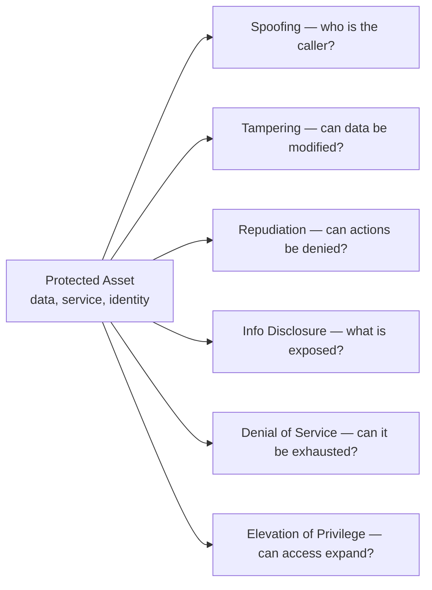

#### The Testing Pyramid: Quality Assurance

Quality is not accidental. It must be engineered deliberately.

**Structure** from bottom to top:

1. **Unit Tests** (70%): Fast, isolated, abundant
2. **Integration Tests** (20%): Components together
3. **End-to-End Tests** (10%): Full user flows

**Additional Layers**:

- **Contract Tests**: API compatibility
- **Performance Tests**: Load, stress, spike
- **Chaos Engineering**: Deliberate failure injection

**Philosophy**: Test at every layer and automate ruthlessly.

The pyramid shape is intentional. A wide base of fast unit tests gives engineers the rapid feedback loop they need to refactor with confidence. A narrow top of slow end-to-end tests gives confidence that full user journeys still work without making every commit wait minutes for test results.

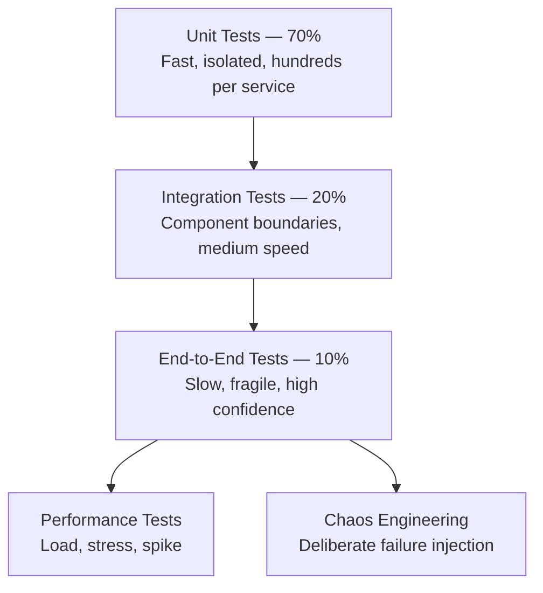

#### The Cost-Consciousness Principle

Engineering time is expensive. Infrastructure is expensive. Downtime is expensive.

**Optimize for**:

1. **Total Cost of Ownership**, not just infrastructure cost
   - Engineering time: maintenance, debugging
   - Operational overhead
   - Infrastructure costs
   - Opportunity cost
2. **ROI of Complexity**
   - Does microservices justify the operational overhead?
   - Does distributed caching justify the maintenance burden?
   - Does multi-region justify the complexity cost?

**Philosophy**: The best architecture is the simplest one that meets requirements. Complexity is a tax you pay forever.

Teams often compare architectures only by cloud bill, which is a narrow view. The more complete question is: what does this choice cost in **people**, **operational risk**, **time-to-change**, and **on-call burden**? Many expensive architectures are expensive because they demand ongoing human attention, not because the compute bill is large.

A useful exercise is to estimate the full cost of an architectural choice before committing to it. A distributed cache that saves 50 ms per request might cost $500 per month in infrastructure but $5,000 per month in the engineering time spent configuring it, diagnosing cache-invalidation bugs, and writing operational runbooks. The math may still justify it — but only if the team has done the math explicitly.

**Total Cost of Ownership comparison:**

| Cost dimension | Monolith | Microservices | Notes |
|---|---|---|---|
| **Infrastructure** | Low | Medium to High | More services require more compute and networking |
| **Developer productivity** | High initially | Lower initially | Higher upfront learning and context-switching cost |
| **Operational overhead** | Low | High | Service mesh, distributed tracing, per-service alerting |
| **Deployment complexity** | Low | High | CI/CD pipelines multiply across services |
| **Debugging time** | Low | High | Distributed tracing is required, not optional |
| **Blast radius of a bug** | High | Low | A monolith bug can affect everything; a service bug is isolated |
| **Team autonomy** | Low | High | Services enable independent release cadences |
| **Total effective cost** | **Low to Medium** | **Medium to Very High** | Justified only when team size and traffic demand it |

The microservices column is not an argument against microservices. It is an argument for making the decision deliberately, with full cost visibility, rather than by following a trend.

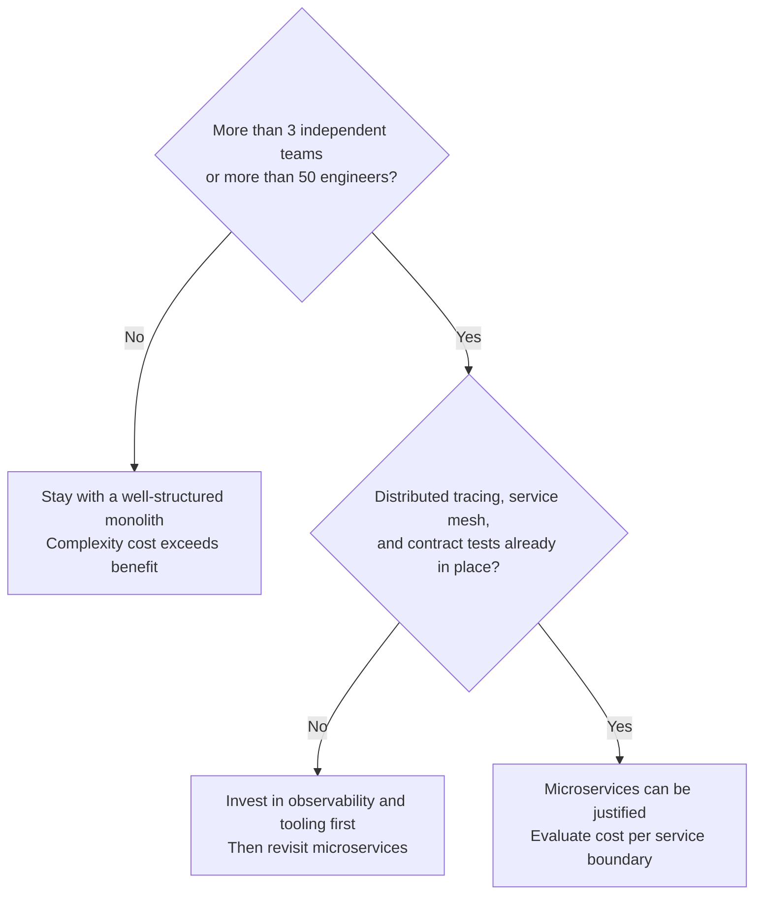

### Learning and Practice

#### How to Learn System Design

1. **Start with fundamentals**: networking, databases, operating systems
2. **Study existing systems**: analyze how popular services work
3. **Practice design exercises**: design systems like Twitter, Netflix, and Uber
4. **Read engineering blogs**: learn from companies like Netflix, Uber, and Meta
5. **Build projects**: implement scaled-down versions of real systems
6. **Review case studies**: understand trade-offs in real-world designs

The progression matters. Reading patterns before understanding the underlying problems tends to produce memorized answers. Learning sticks when you repeatedly move from fundamentals to case studies to your own design attempts.

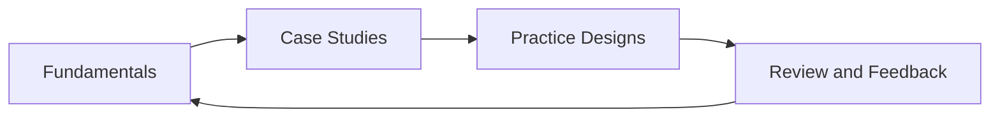

#### How to Approach System Design in Interviews

1. **Clarify requirements**: functional and non-functional
2. **Estimate scale**: users, requests, storage needs
3. **Define APIs**: key endpoints and data models
4. **Draft the high-level design**: major components and data flow
5. **Deep dive**: bottlenecks, scaling, and optimization
6. **Discuss trade-offs**: alternatives and their pros and cons

Interview performance improves when you make the structure visible. Interviewers are usually evaluating how you reason under uncertainty, not whether you guessed the same database they would have chosen.

#### The Human Element

Systems are built by humans, for humans.

**Team Considerations**:

- **Conway's Law**: System design mirrors team structure
- **Cognitive Load**: Keep systems understandable
- **On-call Burden**: Design for operational simplicity
- **Knowledge Transfer**: Document decisions and rationale

**User Considerations**:

- **Latency**: Every 100 ms delay decreases conversions
- **Reliability**: Users remember failures more than successes
- **Privacy**: Respect user data as sacred
- **Accessibility**: Design for all users

**Conway's Law in practice**: System architecture mirrors team communication structure. If you have a frontend team, a backend team, and a data team, you will end up with three services — because teams naturally coordinate through the systems they own. The *Inverse Conway Manoeuvre* is the deliberate strategy of designing team structure to match the architecture you want to produce, rather than accepting whatever the existing org chart creates.

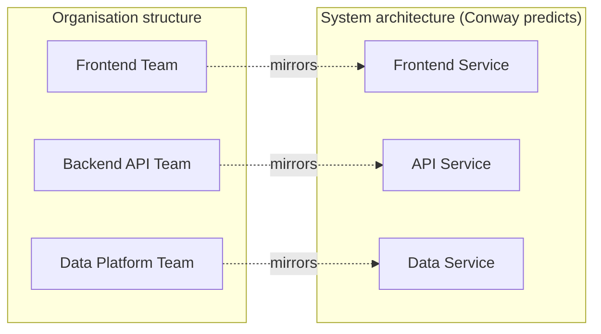

### Synthesis

#### The Unified Theory of System Design

Great system design sits at the intersection of:

1. **Technical Excellence**: Right tools, patterns, architectures
2. **Business Alignment**: Meets actual needs and delivers value
3. **Operational Reality**: Can be monitored, debugged, and maintained
4. **Human Factors**: Understandable, usable, ethical
5. **Economic Viability**: Cost-effective and sustainable

**The Meta-Principle**: Context is king. The "best" design depends entirely on:

- Scale: users, data, requests
- Requirements: latency, consistency, features
- Constraints: budget, team, timeline
- Trade-offs: what you are willing to sacrifice

**The Journey**: Mastery comes from:

1. Learning patterns and principles through theory
2. Making mistakes and learning through practice
3. Understanding trade-offs deeply through experience
4. Knowing when to break rules through mastery

The unified view is that all of system design is an attempt to balance forces that naturally conflict: correctness and speed, flexibility and simplicity, local optimization and global behavior, present constraints and future growth. The better your mental model of those tensions, the more transferable your judgment becomes across domains.

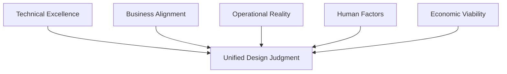


### Applied Frameworks and Professional Growth

#### The Essential Truth

System design is fundamentally about **managing complexity through principled decision-making**. Every great system is built on a foundation of:

1. **Clear Understanding**: Know your requirements deeply
2. **Appropriate Trade-offs**: Choose wisely based on context
3. **Continuous Evolution**: Adapt as needs change
4. **Measurable Outcomes**: Validate decisions with data
5. **Human Consideration**: Design for people, not just machines

Each of these foundations carries weight in practice. **Clear understanding** means spending the first portion of any design session asking questions, not drawing boxes — ambiguous requirements are the single largest source of wasted engineering effort. **Appropriate trade-offs** means documenting not just what was chosen but why it was chosen, because six months later the team that inherits the system will need that context to evaluate whether the choice is still correct. **Continuous evolution** acknowledges that requirements will change, user behaviour will surprise you, and a design that cannot be incrementally modified is a liability that compounds over time. **Measurable outcomes** closes the loop: architecture is a hypothesis, and production traffic is the experiment that validates or refutes it. **Human consideration** is the most frequently omitted foundation — latency and reliability are ultimately about whether a real person can accomplish what they came to do.

These five foundations are sequential, not parallel. A system with measurable outcomes but unclear requirements is measuring the wrong thing. A system with good trade-offs but no capacity to evolve will require a rewrite rather than a refactor. The order matters.

```mermaid
flowchart TD
    CU["Clear Understanding<br/>Ask before drawing"]
    AT["Appropriate Trade-offs<br/>Document the why, not just the what"]
    CE["Continuous Evolution<br/>Design to be changed, not just to work"]
    MO["Measurable Outcomes<br/>Production is the experiment"]
    HC["Human Consideration<br/>People are the end goal"]

    CU --> AT --> CE --> MO --> HC
```

#### The Core Trade-offs

Every system design decision involves balancing opposing forces:

| Dimension | Trade-off | Consideration |
|-----------|-----------|---------------|
| **CAP Theorem** | Consistency ↔ Availability | Can't have both during partitions |
| **Performance** | Latency ↔ Throughput | Fast response vs high volume |
| **Complexity** | Simplicity ↔ Features | Easy to maintain vs rich functionality |
| **Economics** | Cost ↔ Performance | Budget vs speed/reliability |
| **Data** | Normalization ↔ Denormalization | Consistency vs read performance |
| **Architecture** | Monolith ↔ Microservices | Simplicity vs scalability |
| **Consistency** | Strong ↔ Eventual | Immediate vs delayed consistency |
| **Caching** | Freshness ↔ Performance | Up-to-date vs fast |
| **Security** | Security ↔ Convenience | Protection vs user friction |
| **Deployment** | Speed ↔ Safety | Fast releases vs stability |

These trade-offs are not binary switches. They are spectrums, and most real systems operate somewhere in between the two poles rather than at either extreme. The skill is in identifying which dimensions are **load-bearing** for the specific use case — the ones where accepting the wrong side of the trade-off would directly harm users or the business — and which can be relaxed without visible impact.

In a payment processing system, the CAP and Data rows are non-negotiable: a split-brain database that allows double-charges is a catastrophe. In a social media recommendation feed, the Consistency and Freshness rows can both be relaxed safely — showing a post that is a few seconds old is imperceptible. In an analytics dashboard, Latency can be relaxed in exchange for Throughput, since reports are batch-processed anyway.

The failure mode is treating all trade-offs as equally important and over-engineering every dimension simultaneously. That path produces systems that are slow to build, expensive to operate, and cognitively exhausting to maintain.

```mermaid
flowchart LR
    subgraph FINANCE["Financial Systems — what matters"]
        F1["Consistency — critical"]
        F2["Security — critical"]
        F3["Availability — high"]
    end
    subgraph SOCIAL["Social or Content Systems — what matters"]
        S1["Availability — critical"]
        S2["Performance — critical"]
        S3["Consistency — relaxed"]
    end
    subgraph ANALYTICS["Analytics or Reporting — what matters"]
        A1["Throughput — critical"]
        A2["Cost — important"]
        A3["Latency — relaxed"]
    end
```

Identifying the load-bearing dimensions requires knowing the user's pain threshold: what would they notice, complain about, or stop using the product over? Anchor the architecture around those dimensions and be willing to compromise on the rest.

#### The Golden Rules of System Design

1. **Start Simple, Then Scale**
   - Begin with the simplest solution that could work
   - Add complexity only when proven necessary
   - Premature optimization wastes time and money
   - *"Make it work, make it right, make it fast"* in that order
2. **Measure Before Optimizing**
   - Intuition often misleads
   - Profile to find real bottlenecks
   - Set SLOs and SLAs based on user needs
   - Monitor continuously and alert intelligently
3. **Design for Failure**
   - Assume everything will fail
   - Build redundancy at every level
   - Implement graceful degradation
   - Test failure scenarios through chaos engineering
   - Have runbooks for common failures
4. **Embrace Eventual Consistency When Appropriate**
   - Not all data needs immediate consistency
   - AP systems often provide better user experience
   - Use strong consistency only where required
   - Understand your consistency guarantees
5. **Security Is Non-Negotiable**
   - Design security in from day one
   - Use defense in depth
   - Encrypt data at rest and in transit
   - Run regular security audits and updates
   - Apply the principle of least privilege
6. **Observability Is Essential**
   - You cannot fix what you cannot see
   - Use comprehensive logging with correlation IDs
   - Track real-time metrics and dashboards
   - Use distributed tracing for microservices
   - Prefer proactive alerting over reactive firefighting
7. **Keep It Maintainable**
   - Code is read far more than it is written
   - Clear documentation saves months of confusion
   - Standardize where possible
   - Reduce cognitive load
   - Think of the 3 AM on-call engineer
8. **Cost-Consciousness Matters**
   - Engineering time is expensive
   - Infrastructure costs add up
   - Technical debt compounds
   - Choose battles worth fighting
   - Let ROI guide technical decisions

#### The System Design Mental Model

When approaching any system design problem, use this framework:

This mental model is useful because it prevents premature deep dives. Many weak designs fail not in implementation detail, but in sequence: they jump into technology choices before requirements, or scale tactics before bottlenecks are identified.

##### Phase 1: Understanding (Requirements and Constraints)

1. Functional Requirements
   - What should the system do?
   - What are the core features?
   - What are the user flows?

2. Non-Functional Requirements
   - How many users? (Scale)
   - How fast? (Latency)
   - How reliable? (Availability)
   - How consistent? (Data guarantees)

3. Constraints
   - Budget limitations
   - Timeline (MVP vs complete)
   - Team size and expertise
   - Compliance requirements

##### Phase 2: Estimation (Back-of-the-Envelope)

1. Scale Calculations
   - DAU (Daily Active Users)
   - QPS (Queries Per Second)
   - Peak load (2-3x average)

2. Storage Calculations
   - Data per user/transaction
   - Growth rate
   - Retention period
   - Replication factor

3. Bandwidth Calculations
   - Request/response sizes
   - Traffic patterns
   - CDN needs

##### Phase 3: Design (High-Level Architecture)

1. API Design
   - Endpoints and methods
   - Request/response formats
   - Authentication mechanism

2. Data Model
   - Entities and relationships
   - Database choice (SQL vs NoSQL)
   - Partitioning strategy

3. Component Diagram
   - Client → API Gateway → Services → Databases
   - Load balancers
   - Caching layers
   - Message queues

##### Phase 4: Deep Dive (Bottlenecks and Optimization)


1. Identify Bottlenecks
   - Database (hot partitions, slow queries)
   - Network (latency, bandwidth)
   - Compute (CPU, memory)

2. Optimization Strategies
   - Caching (where and what)
   - Database optimization (indexing, sharding)
   - Async processing (queues)
   - CDN for static content

3. Resilience Patterns
   - Circuit breakers
   - Retries with exponential backoff
   - Rate limiting
   - Bulkheads


##### Phase 5: Trade-offs (Alternatives and Justification)

1. Discuss Alternatives
   - SQL vs NoSQL
   - Monolith vs Microservices
   - Push vs Pull
   - Sync vs Async

2. Justify Choices
   - Why this database?
   - Why this caching strategy?
   - Why this consistency level?

3. Address Concerns
   - Single points of failure
   - Data loss scenarios
   - Scaling limitations

```mermaid
flowchart LR
   RQ["Requirements"] --> ES["Estimation"]
   ES --> HD["High-Level Design"]
   HD --> DD["Deep Dive"]
   DD --> TR["Trade-offs"]
```

#### Interview-Specific Guidance

Interview-specific system design is a constrained form of architecture communication. The challenge is not only to design a reasonable system, but also to surface assumptions, sequence your explanation well, and show that you can reason about failure and trade-offs under time pressure.

##### The Interview Framework

**1. Clarify Requirements (5 minutes)**

- What are the core features we need to support?
- How many users do we expect?
- What is our latency requirement?
- Do we need strong or eventual consistency?
- Are there any specific constraints around budget or geography?

**2. High-Level Design (10 minutes)**

- Draw the box diagram: Client → Load Balancer → App Servers → Databases
- Define API endpoints
- Sketch the data model
- Discuss data flow

**3. Deep Dive (20 minutes)**

- Pick 2-3 interesting components
- Discuss trade-offs
- Optimize bottlenecks
- Add caching, sharding, and async flows where needed
- Discuss failure scenarios

**4. Wrap-up (5 minutes)**

- Address monitoring and alerting
- Discuss scaling strategies
- Mention security considerations
- Talk about the metrics that matter

##### Common Interview Questions and Approaches

**Social Media Feed (Twitter, Instagram)**

- Focus: Fan-out, caching, real-time updates
- Key: Push vs pull model, cache warming, ranking algorithms

**Video Streaming (YouTube, Netflix)**

- Focus: CDN, adaptive bitrate, distributed storage
- Key: Video encoding, metadata management, recommendation system

**Ride Sharing (Uber, Lyft)**

- Focus: Geo-spatial indexing, real-time matching, ETA calculation
- Key: Location updates, surge pricing, driver matching

**Messaging (WhatsApp, Telegram)**

- Focus: WebSockets, message delivery, end-to-end encryption
- Key: Online presence, message queues, read receipts

**E-commerce (Amazon)**

- Focus: Inventory management, payment processing, search
- Key: Transactions, consistency, recommendation engine

**URL Shortener (bit.ly)**

- Focus: ID generation, redirection, analytics
- Key: Base62 encoding, database choice, caching

##### Red Flags to Avoid

- Jumping to a solution without clarifying requirements
- Ignoring scale or constraints
- Not discussing trade-offs
- Overengineering a simple problem
- Underengineering a complex problem
- Forgetting about monitoring or logging
- Not handling failure scenarios
- Ignoring security concerns

##### Green Flags to Exhibit

- Ask clarifying questions
- State assumptions explicitly
- Think out loud
- Consider multiple approaches
- Discuss trade-offs honestly
- Know when to use each pattern
- Understand the reasoning behind choices
- Show both breadth and depth

#### The Path to Mastery

**Level 1: Novice**

- Understand basic patterns such as client-server and request-response
- Know common technologies such as SQL, REST, and HTTP
- Can design simple CRUD applications

**Level 2: Intermediate**

- Understand scaling strategies such as vertical and horizontal scaling
- Know caching and database optimization
- Can design medium-complexity systems such as e-commerce or blogs

**Level 3: Advanced**

- Understand distributed systems deeply
- Know consistency models and trade-offs
- Can design complex systems such as Netflix or Uber
- Are familiar with advanced patterns such as CQRS and event sourcing

**Level 4: Expert**

- Internalize trade-offs intuitively
- Design for unprecedented scale
- Innovate new patterns for novel problems
- Mentor others effectively

**Level 5: Master**

- See patterns across domains
- Predict failure modes before they occur
- Balance technical excellence with business value
- Shape industry best practices

```mermaid
flowchart LR
    N["Novice<br/>Knows components exist"]
    I["Intermediate<br/>Knows when to use patterns"]
    A["Advanced<br/>Reasons about distributed failure"]
    E["Expert<br/>Navigates trade-offs intuitively"]
    M["Master<br/>Shapes how others design"]

    N --> I --> A --> E --> M
```

The progression is not linear in time. Many engineers plateau at Intermediate for years because they work within familiar system boundaries. Moving forward requires deliberately seeking exposure to larger-scale problems and unfamiliar technical domains.

#### The Journey Continues

System design is a continuous journey of learning, adapting, and improving. Technologies change and patterns evolve, but the fundamental principles remain:

- **Understand the problem** deeply before solving it
- **Choose appropriate tools** for the context
- **Balance competing forces** through principled trade-offs
- **Build for reality**: failure, change, and growth
- **Never stop learning** from successes and failures

The best system designer is not the one who knows all the answers, but the one who asks the right questions, understands the trade-offs, and makes informed decisions that balance technical excellence with business value and human factors.

**Final Wisdom**: Every system you design reflects your understanding at that moment. Embrace mistakes as learning opportunities, stay humble in the face of complexity, and remember that you are building systems to serve people.

#### Enduring Maxims

> "There are no solutions. There are only trade-offs." — Thomas Sowell
>
> "Make it work, make it right, make it fast." — Kent Beck
>
> "Premature optimization is the root of all evil." — Donald Knuth
>
> "You can't improve what you don't measure." — Peter Drucker

These maxims endure because they compress decades of engineering experience into short rules of thumb. They should not be treated as absolute laws, but as reminders of the failure patterns teams repeatedly rediscover.

### References and Further Exploration

#### Books

- "Designing Data-Intensive Applications" by Martin Kleppmann
- "System Design Interview" by Alex Xu
- "Building Microservices" by Sam Newman
- "Site Reliability Engineering" by Google

#### Engineering Blogs

- Netflix Tech Blog
- Uber Engineering
- Meta Engineering
- AWS Architecture Blog
- Martin Fowler's Blog

#### Practice Resources

- System Design Primer (GitHub)
- LeetCode System Design
- Grokking the System Design Interview
- ByteByteGo
- HighScalability.com

#### Project Ideas

1. **URL Shortener**: Like bit.ly
2. **Pastebin**: Code sharing service
3. **Rate Limiter**: API throttling service
4. **Chat Application**: Real-time messaging
5. **News Feed**: Like Twitter/Facebook
6. **File Storage**: Like Dropbox
7. **Video Streaming**: Like YouTube/Netflix
8. **Ride-Sharing**: Like Uber/Lyft
9. **E-commerce**: Like Amazon
10. **Social Network**: Like Instagram
