# Separation of Concerns

## Blogs and websites


## Medium


## Youtube


## Theory

### What is Separation of Concerns?

**Separation of Concerns (SoC)** is a design principle that divides a system into distinct sections, where each section addresses a specific concern (responsibility). Each part should know as little as possible about the others.

**Core Idea:** A piece of code should do **one thing** and do it well. Changes to one concern should not require changes to unrelated concerns.

The term was coined by computer scientist **Edsger W. Dijkstra** in his 1974 paper *"On the role of scientific thought"*. The idea is deceptively simple: if you can cleanly separate what a system does into independent pieces, you gain the ability to understand, change, and test each piece without worrying about the rest. This applies from a single function all the way up to a distributed system.

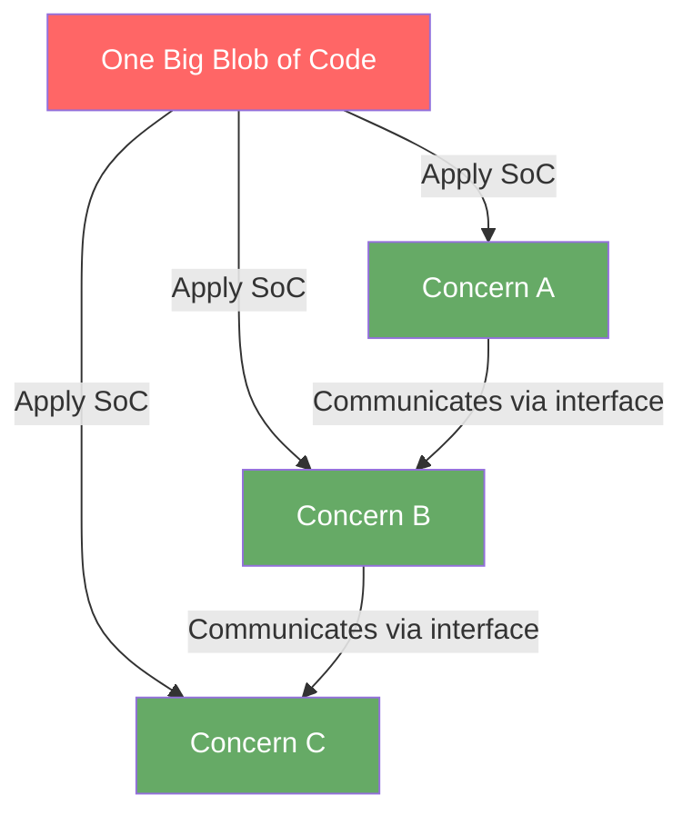

---

### Why It Matters

Without SoC, a single function accumulates responsibilities over time — a phenomenon known as **feature creep at the function level**. The function becomes a bottleneck: every developer on the team touches it, every bug lives inside it, and testing it requires simulating all its dependencies at once.

```
Without SoC (everything mixed together):
  function handleOrder(req) {
    // Validate input         ← What if validation rules change?
    // Authenticate user      ← What if auth provider changes?
    // Check inventory        ← What if inventory is a microservice tomorrow?
    // Process payment        ← What if you add a new payment gateway?
    // Send email             ← What if you switch to SMS?
    // Update analytics       ← What if analytics is optional?
    // Return response
  }
  → 500 lines, impossible to test, change, or reuse
  → One change risks breaking everything else
```

```
With SoC (separated responsibilities):
  validateInput(req)        → Validation layer
  authenticateUser(req)     → Auth middleware
  checkInventory(items)     → Inventory service
  processPayment(order)     → Payment service
  sendConfirmation(email)   → Notification service
  trackEvent(order)         → Analytics service
  → Each is testable, changeable, and reusable independently
  → Swap the payment provider → only processPayment() changes
  → Disable analytics        → remove trackEvent(), nothing else breaks
```

The key insight: **each function has exactly one reason to change**. If the payment gateway switches from Stripe to Braintree, only the payment module changes. The validation logic, the email sender, the inventory checker — they remain untouched.

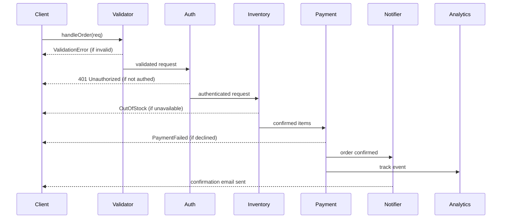

---

### Levels of Separation

SoC is not one-size-fits-all. It applies at every layer of the software stack, from a single function to an entire distributed architecture.

---

**1. Code Level — Functions and Classes**

This is the most granular level. The guiding rule here is the **Single Responsibility Principle (SRP)** from SOLID:

> *A class should have only one reason to change.*

**Why it matters at this level:** When a class mixes responsibilities, a bug in one area (e.g., formatting) can silently affect another (e.g., persistence). Unit tests become hard to write because you can't isolate the behavior you care about.

**Example — Violating SRP:**

```python
class User:
    def __init__(self, name, email):
        self.name = name
        self.email = email

    def save_to_db(self):          # ← persistence concern
        db.execute("INSERT INTO users ...")

    def send_welcome_email(self):  # ← notification concern
        smtp.send(self.email, "Welcome!")

    def validate(self):            # ← validation concern
        if "@" not in self.email:
            raise ValueError("Invalid email")
```

This class has **three reasons to change**: if the DB schema changes, if the email template changes, or if validation rules change.

**Example — Applying SRP:**

```python
class User:
    def __init__(self, name, email):
        self.name = name
        self.email = email

class UserRepository:
    def save(self, user: User):
        db.execute("INSERT INTO users ...", user.name, user.email)

class UserNotifier:
    def send_welcome(self, user: User):
        smtp.send(user.email, "Welcome!")

class UserValidator:
    def validate(self, user: User):
        if "@" not in user.email:
            raise ValueError("Invalid email")
```

Now each class has **one reason to change**. You can test `UserValidator` without a database. You can swap the email provider by only changing `UserNotifier`.

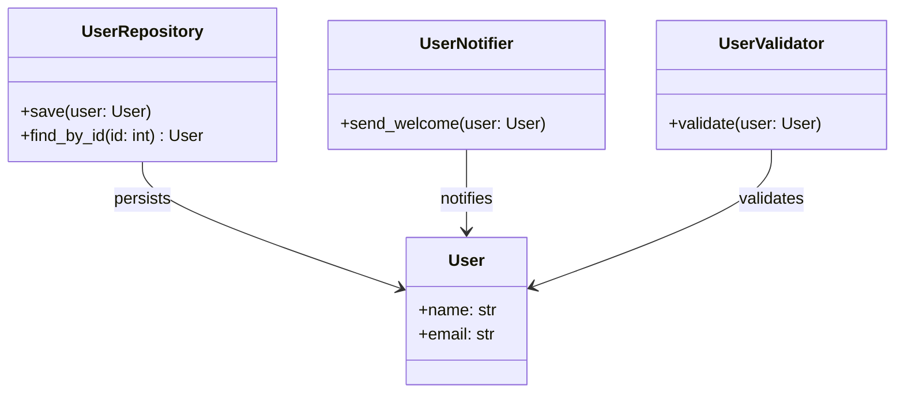

---

**2. Module/Layer Level — Layered Architecture**

As a codebase grows, individual files need to be organized into **layers**, each with a specific role. The classic N-tier model separates the application into:

```
Presentation Layer (UI, API endpoints)
        ↓
Business Logic Layer (rules, workflows)
        ↓
Data Access Layer (database queries, ORM)
        ↓
Infrastructure Layer (file system, external APIs)
```

Each layer only talks to the one directly below it. The Presentation Layer never directly issues SQL queries. The Data Access Layer never formats HTML.

**Why this matters:** Imagine you want to switch from PostgreSQL to MongoDB. With a proper Data Access Layer (a repository pattern), only that layer changes — the Business Logic and Presentation layers are completely unaware of the swap.

**Concrete example:**

```python
# Presentation Layer — only handles HTTP
@app.route("/users/<id>")
def get_user(id):
    user = user_service.get_user(id)    # calls Business Logic
    return jsonify(user.to_dict())      # formats response

# Business Logic Layer — only handles rules
class UserService:
    def get_user(self, id):
        user = user_repo.find(id)       # calls Data Access
        if user is None:
            raise NotFoundError(f"User {id} not found")
        return user

# Data Access Layer — only handles persistence
class UserRepository:
    def find(self, id):
        row = db.query("SELECT * FROM users WHERE id = ?", id)
        return User.from_row(row)       # maps DB row to domain object
```

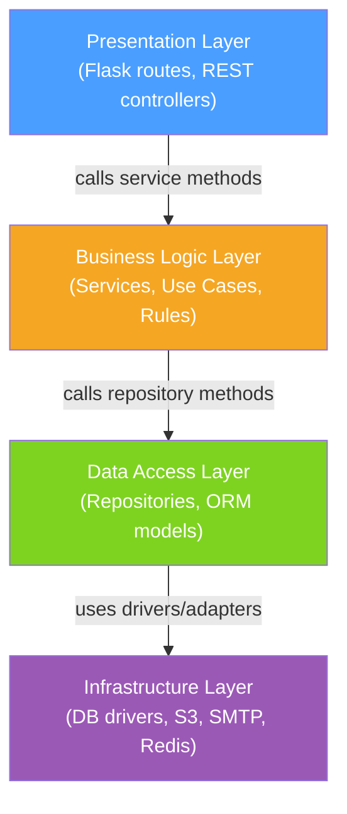

**Dependency rule:** arrows point **downward** only. The Business Logic Layer never imports from the Presentation Layer.

---

**3. Service Level — Microservices**

At scale, even well-layered monoliths become deployment bottlenecks. If the notification logic and the payment logic live in the same process, a bug in notifications can take down payments. Microservices apply SoC at the **deployment boundary**:

```
User Service         → Manages user accounts, profiles, auth
Payment Service      → Handles charges, refunds, billing
Notification Service → Sends emails, SMS, push notifications
Inventory Service    → Tracks stock levels, reservations
```

Each service:
- Has its **own database** (no shared DB schema)
- Communicates over **APIs or message queues**
- Can be **deployed, scaled, and failed** independently

**Example — Order flow across services:**

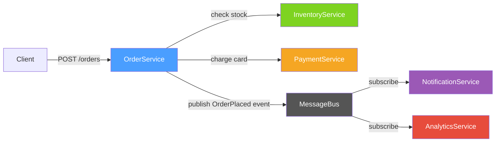

**Trade-off:** Microservices introduce network latency and operational complexity (service discovery, distributed tracing, eventual consistency). Apply this level of SoC only when the team and traffic demand it — premature microservices create "distributed monoliths" where services are too tightly coupled to be independent.

---

**4. System Level — Frontend vs Backend**

The broadest level of SoC is the split between client and server:

```
Frontend (Client):  UI rendering, user interaction, local state
Backend (Server):   Business logic, data persistence, security
Database:           Storage, querying, transactions
```

**Why this matters:** Without this separation, server-side rendering bleeds business rules into templates, making it impossible to build a mobile app without duplicating logic. The clean boundary enables:
- A React web app, iOS app, and Android app all consuming the **same REST/GraphQL API**
- The backend being replaced (e.g., Rails → Go) without changing the frontend
- The database being sharded or migrated without client awareness

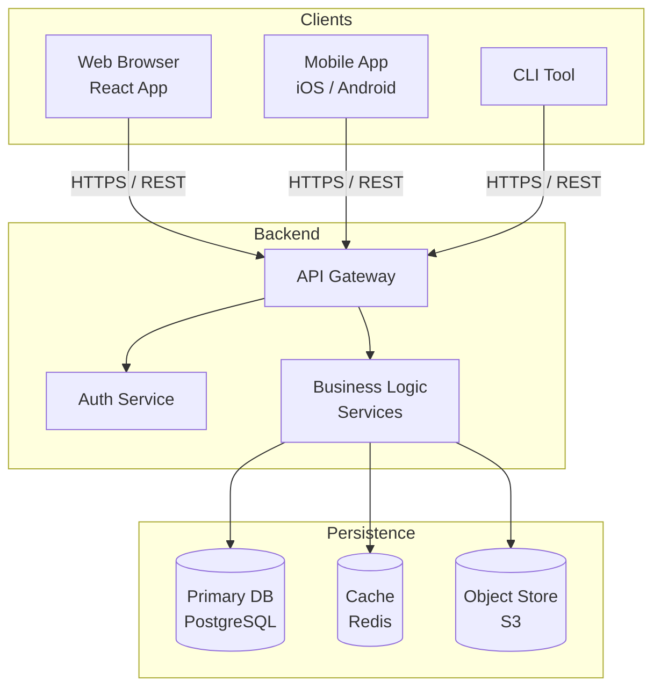

---

### Related Principles

**Don't Repeat Yourself (DRY):**

Extract shared logic into reusable components instead of duplicating code. DRY and SoC work together: if two modules share logic, that logic is its own concern and deserves its own module.

```python
# Violating DRY — email validation duplicated
class UserRegistration:
    def validate_email(self, email):
        return "@" in email and "." in email.split("@")[1]

class NewsletterSignup:
    def validate_email(self, email):
        return "@" in email and "." in email.split("@")[1]

# Applying DRY — shared validator
class EmailValidator:
    def is_valid(self, email):
        return "@" in email and "." in email.split("@")[1]
```

> **Caveat:** DRY does not mean "never write the same line twice." Sharing code creates a **coupling dependency** between the modules that use it. If the shared code needs to diverge (one caller needs stricter validation than the other), you've overcoupled them. Use DRY when the logic is **genuinely the same concern**, not just accidentally similar.

---

**Interface Segregation:**

Don't force a module to depend on interfaces it doesn't use. Keep interfaces small and focused.

```python
# Fat interface — violates Interface Segregation
class IAnimal:
    def fly(self): ...
    def swim(self): ...
    def run(self): ...

# A Dog is forced to implement fly() even though it can't
class Dog(IAnimal):
    def fly(self): raise NotImplementedError   # meaningless
    def swim(self): ...
    def run(self): ...

# Segregated interfaces
class IFlyable:
    def fly(self): ...

class ISwimmable:
    def swim(self): ...

class IRunnable:
    def run(self): ...

class Duck(IFlyable, ISwimmable, IRunnable): ...
class Dog(ISwimmable, IRunnable): ...
class Eagle(IFlyable, IRunnable): ...
```

Each animal now only depends on the capabilities it actually has. Adding a `Penguin` doesn't require touching the `Eagle` code.

---

**Dependency Inversion:**

High-level modules shouldn't depend on low-level modules. Both should depend on abstractions (interfaces).

Without DIP, the Business Logic Layer is coupled to a specific database:

```python
# Tight coupling — Business Logic knows about MySQL
class OrderService:
    def __init__(self):
        self.db = MySQLDatabase()   # ← hardcoded dependency

    def place_order(self, order):
        self.db.save(order)
```

With DIP, the dependency is inverted through an interface:

```python
# Loose coupling via abstraction
class IOrderRepository(ABC):
    @abstractmethod
    def save(self, order): ...

class MySQLOrderRepository(IOrderRepository):
    def save(self, order): ...

class MongoOrderRepository(IOrderRepository):
    def save(self, order): ...

class OrderService:
    def __init__(self, repo: IOrderRepository):   # ← depends on abstraction
        self.repo = repo

    def place_order(self, order):
        self.repo.save(order)

# At startup, inject the concrete implementation
service = OrderService(repo=MySQLOrderRepository())
```

Switching to MongoDB now requires only changing the injection at startup — `OrderService` itself is untouched.

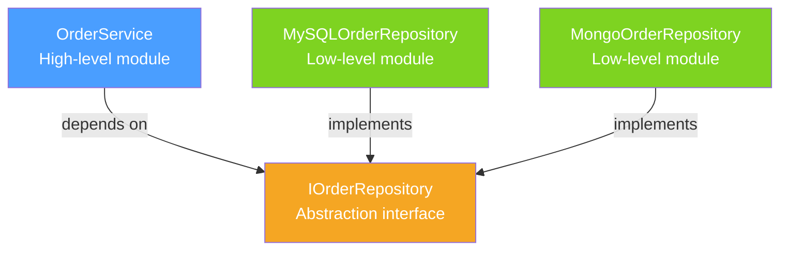

---

### Real-World Examples

**MVC Pattern (Model-View-Controller):**

MVC is one of the oldest applications of SoC in UI development. It cleanly separates data management, presentation, and user input handling:

```
Model:      Data and business logic (what the app knows)
View:       UI presentation (what the user sees)
Controller: Handles input, coordinates Model and View (what the app does in response)
```

**Example — a blog post page:**

```python
# Model — manages data, knows nothing about HTML
class Post:
    def __init__(self, id, title, content):
        self.id = id
        self.title = title
        self.content = content

class PostRepository:
    def find(self, id) -> Post:
        return db.query("SELECT * FROM posts WHERE id = ?", id)

# View — renders HTML, knows nothing about DB
def render_post(post: Post) -> str:
    return f"<h1>{post.title}</h1><p>{post.content}</p>"

# Controller — orchestrates, knows about both
@app.route("/posts/<id>")
def show_post(id):
    post = PostRepository().find(id)   # asks Model
    return render_post(post)           # passes to View
```

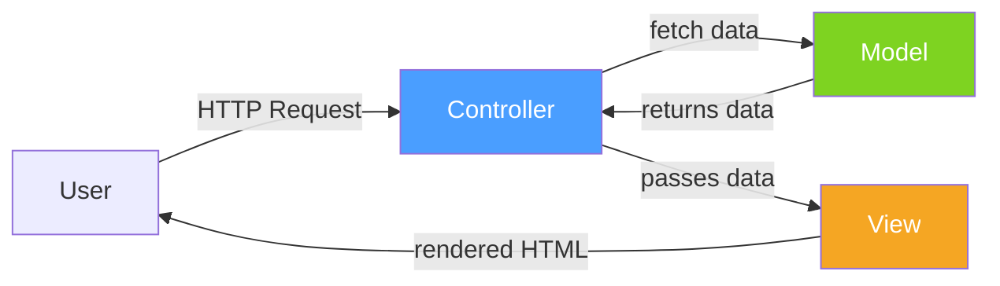

**Why it matters:** You can swap the View (HTML → JSON for an API) without touching the Model. You can test the Model without rendering anything. The Controller stays thin — it only coordinates.

---

**Clean Architecture:**

Clean Architecture (by Robert C. Martin, aka "Uncle Bob") is a more rigorous application of SoC. It organizes code into concentric circles, where the **dependency rule** states: *source code dependencies must point inward only*.

```
Entities          (core business rules — framework agnostic)
  ← Use Cases     (application-specific rules — orchestrate entities)
    ← Interface Adapters  (controllers, presenters, gateways — translate)
      ← Frameworks & Drivers  (DB, web framework, UI — the outer shell)
```

**Why the layers exist:**

| Layer | Purpose | Example |
|---|---|---|
| Entities | Pure business logic, no I/O | `Order`, `Product`, discount calculation |
| Use Cases | Orchestrates entities for a specific action | `PlaceOrderUseCase` |
| Interface Adapters | Converts between Use Case format and external format | REST controller, DB repository implementation |
| Frameworks & Drivers | The "details" — easily swappable | Flask, SQLAlchemy, React |

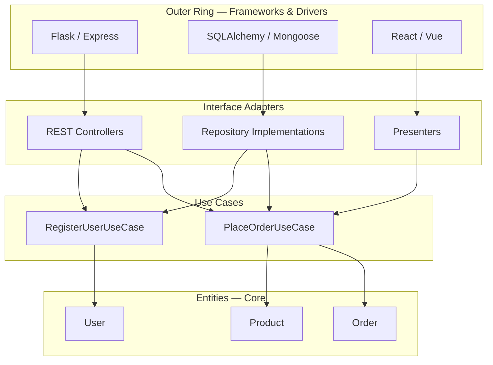

**Key test:** can you run your Use Cases and Entities in a plain Python/Node REPL with no web framework, no database, no HTTP? In Clean Architecture, the answer should be **yes**.

---

**API Design:**

SoC in API design means grouping endpoints by **domain entity** (the resource they manage), not by operation type:

```
/api/users      → User concern    (CRUD on user accounts)
/api/products   → Product concern (CRUD on product catalog)
/api/orders     → Order concern   (CRUD on orders)
```

**Violation — mixing concerns in a single endpoint:**

```
POST /api/process   → body: { type: "create_user" | "place_order" | "send_email" }
```

This is an RPC-style blob endpoint. You can't cache it, you can't apply auth policies per resource, and the handler function inevitably becomes a `switch` statement with hundreds of cases.

**Correct REST design — one concern per resource path:**

```
POST   /api/users              → create user
GET    /api/users/{id}         → read user
PUT    /api/users/{id}         → update user
DELETE /api/users/{id}         → delete user

POST   /api/orders             → place order
GET    /api/orders/{id}        → get order status
POST   /api/orders/{id}/cancel → cancel order
```

Each route group can independently have its own middleware (auth, rate limiting, caching), its own controller, and its own set of tests.

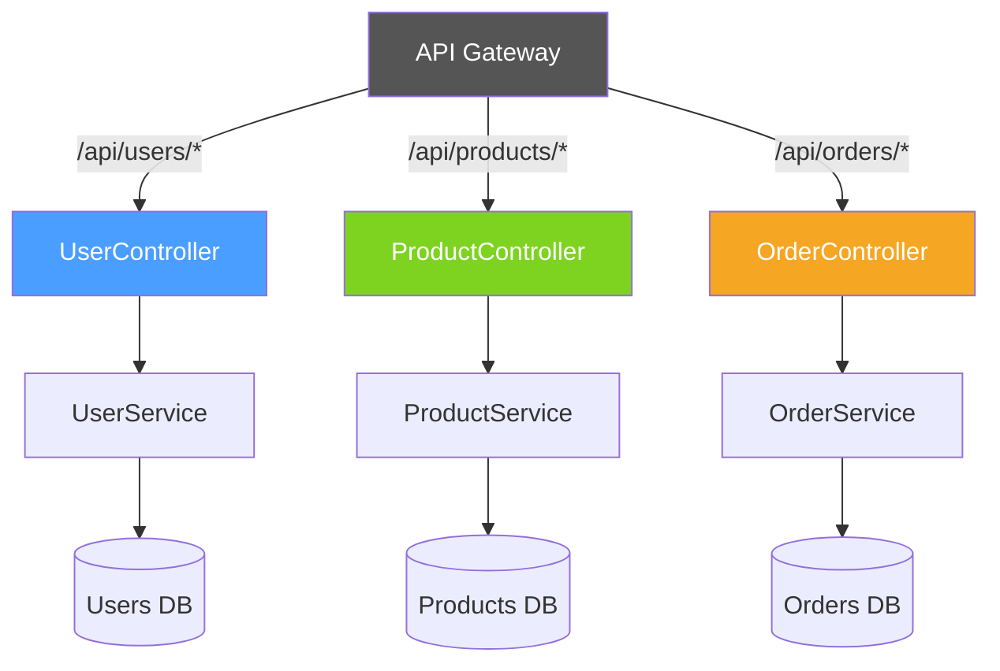

---

### Benefits

- **Maintainability**: Change one concern without breaking others.
  - *Example:* Switching from SendGrid to AWS SES only requires changing `NotificationService`. No other code is aware of the change.

- **Testability**: Test each part in isolation.
  - *Example:* Unit-test `UserValidator` by passing `User` objects directly — no database, no HTTP server needed. Mock the dependencies in `OrderService` to test payment logic without charging real cards.

- **Reusability**: Use the same module in different contexts.
  - *Example:* An `EmailValidator` extracted as its own concern can be used in registration, newsletter signup, and admin user creation flows — all without duplication.

- **Team Scalability**: Different teams can own different concerns.
  - *Example:* The Payments team owns `PaymentService` and can deploy it independently. The Notifications team can refactor their queue logic without coordinating with any other team.

- **Debuggability**: Easier to locate bugs when responsibilities are clear.
  - *Example:* If an order confirmation email fails, you know immediately the bug lives in `NotificationService`, not in `OrderService` or `PaymentService`.

---

### Anti-Patterns (Violations of SoC)

**God Object:**

One class that knows about everything and does everything. It accumulates methods over time because "it's easier to add it here."

```python
# God Object — every concern crammed into UserManager
class UserManager:
    def register(self): ...
    def login(self): ...
    def send_email(self): ...
    def generate_pdf_report(self): ...
    def charge_credit_card(self): ...
    def update_analytics_dashboard(self): ...
    def resize_profile_image(self): ...
```

This class has **7 reasons to change** and is impossible to test in isolation. Any change risks breaking an unrelated feature.

---

**Spaghetti Code:**

Logic spread across files with no clear boundaries, cross-calling each other in circular or unpredictable ways.

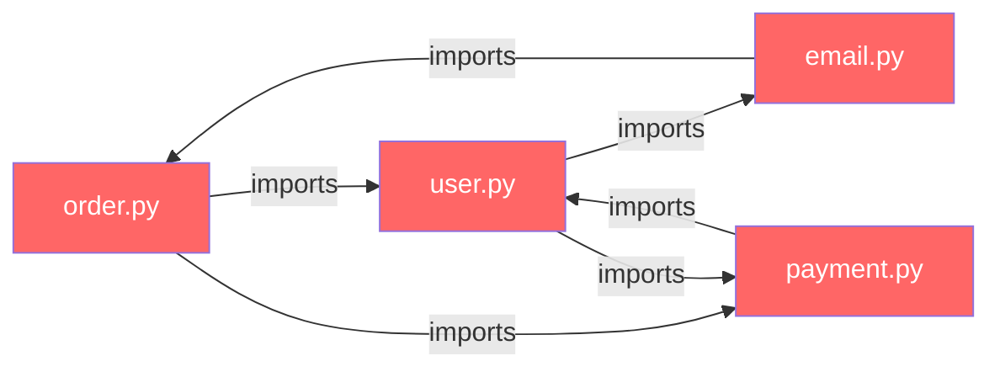

Circular imports, unpredictable initialization order, and no clear ownership. Changing `user.py` can break `payment.py` in non-obvious ways.

---

**Leaky Abstractions:**

A concern leaks into a layer that should not be aware of it. The most common example is **database queries in the presentation layer**:

```python
# Leaky — route handler directly queries the DB
@app.route("/users/<id>")
def get_user(id):
    row = db.execute("SELECT * FROM users WHERE id = ?", id)
    return jsonify(dict(row))
```

The HTTP handler now knows about the schema of the `users` table. If the table is renamed or the DB is swapped, the route handler must change — even though HTTP handling has nothing to do with storage.

**Fixed:**

```python
@app.route("/users/<id>")
def get_user(id):
    user = user_service.get_user(id)   # concern boundary: HTTP → Service
    return jsonify(user.to_dict())     # only formats the response
```

---

**Tight Coupling:**

Changing one module forces changes in many others. Typically caused by using concrete classes instead of interfaces, or by accessing internal implementation details.

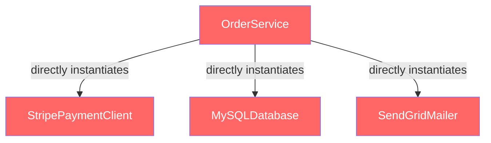

If you switch from Stripe to PayPal, `OrderService` must be rewritten. With loose coupling (Dependency Inversion), `OrderService` depends only on `IPaymentGateway`, and the concrete implementation is injected — `OrderService` never changes when the provider switches.
