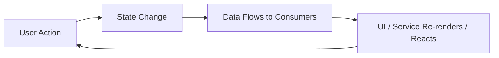
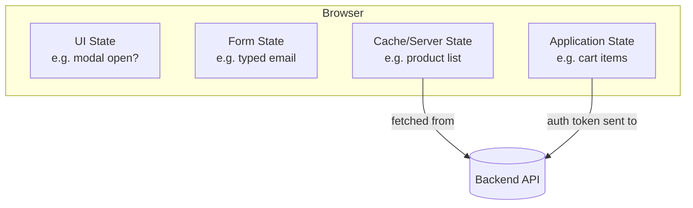
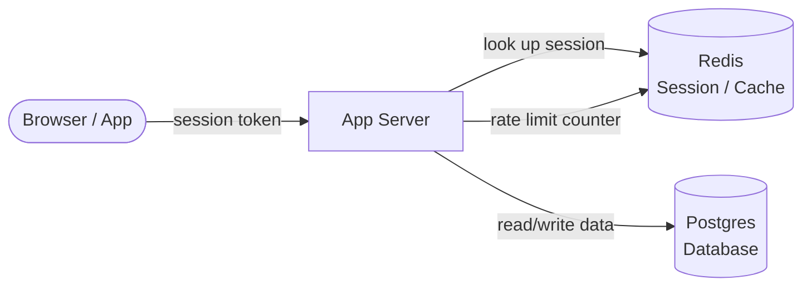
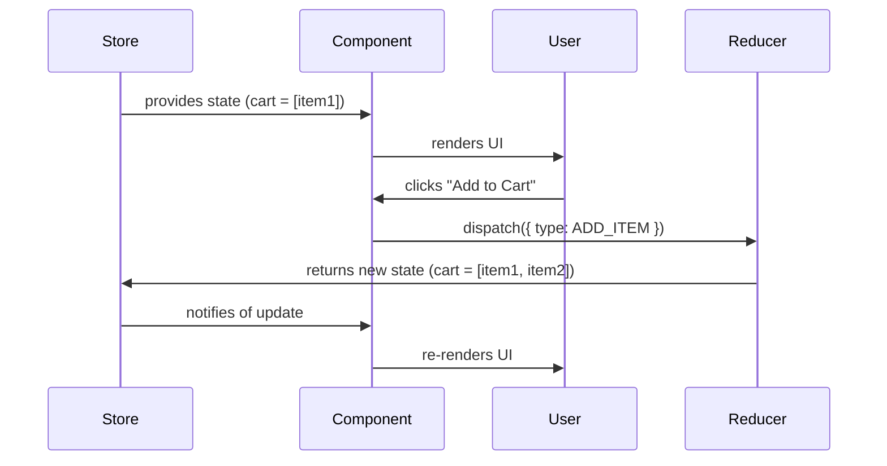
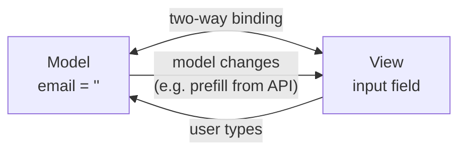
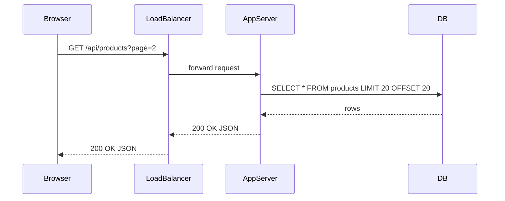
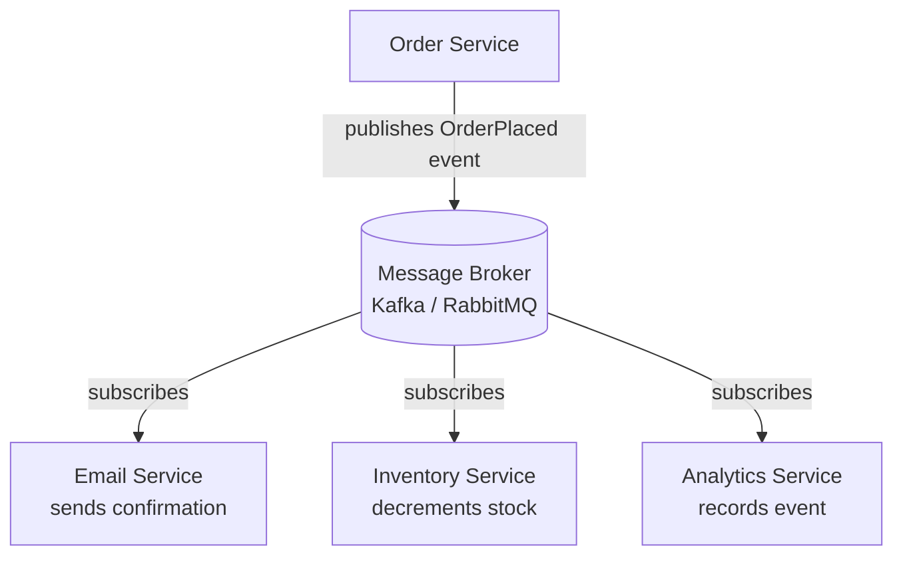
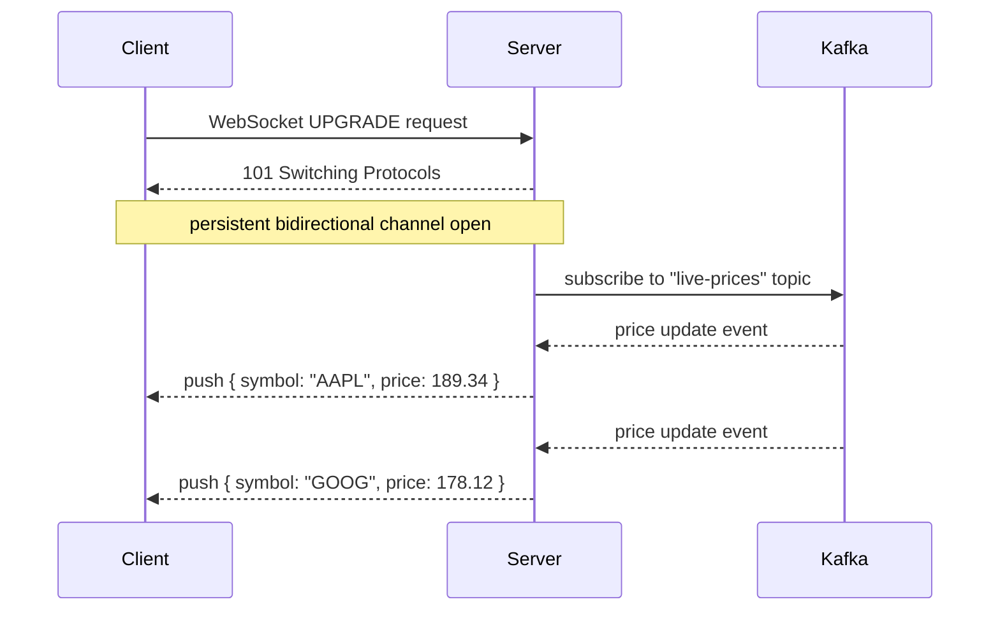
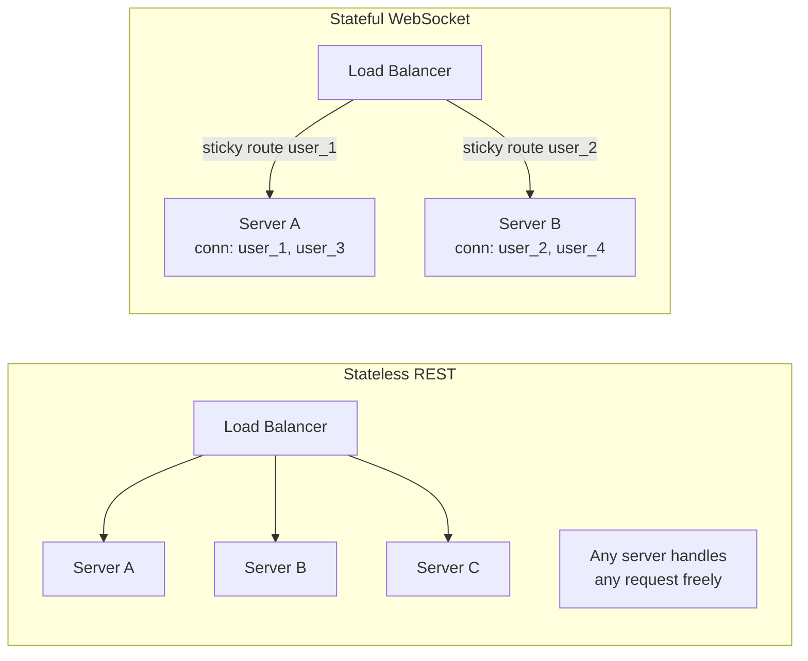
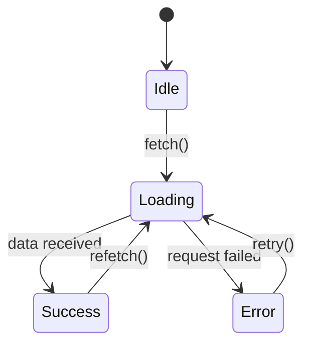

# State and Data Flow

## Blogs and websites


## Medium


## Youtube


## Theory

### What is State and Data Flow?

**State** is any data that can change over time and affects how a system behaves or what it renders. **Data flow** describes how that state moves between components, services, or layers of a system.

Think of a simple e-commerce page: the cart item count in the header, the "Add to Cart" button turning disabled after a click, the product list fetched from an API — all of these are different kinds of state. When any of them changes, parts of the UI need to react and update. The path that change travels — from where it originates to where it lands — is the data flow.

Understanding state management and data flow is critical because most bugs, performance issues, and architectural complexity come from managing state incorrectly. Bugs like "the button shows wrong count", "two tabs showing different data", or "user sees stale price" are almost always state/flow problems.



---

### What is State?

State is the **current snapshot** of a system at any point in time. It answers the question: *"What is true right now?"*

```
Examples of state:
  - Is the user logged in?           → Authentication state
  - What items are in the cart?      → Application state
  - What page is the user viewing?   → UI/navigation state
  - What data came from the server?  → Server/remote state
  - What did the user type in a form?→ Local/form state
```

**Key insight:** State is not just data stored in a database. It exists at every layer — in the browser's memory, in a server's RAM, in a Redis cache, and in a Postgres row. The challenge is keeping all of these in agreement.

---

### Types of State

#### Client-Side State

State that lives in the browser or mobile app. It is ephemeral — it resets on refresh unless explicitly persisted (e.g., `localStorage`).

- **UI State** — controls *how* the interface looks, not *what* data it shows.
    - Examples: which modal is open, which accordion tab is expanded, scroll position, loading spinners, hover/focus highlights.
    - Scope: usually local to a single component. There is no need to share "which dropdown is open" with the entire app.
    - Tool: `useState` in React, local component variables in Vue.

- **Form State** — captures what the user is actively typing or selecting before submission.
    - Examples: email field value, selected radio button, validation error messages ("Email is invalid").
    - Challenge: validation logic must run *on change* (for live feedback) and *on submit* (for final check). Both need access to the same state.
    - Tool: React Hook Form, Formik, Angular Reactive Forms.

- **Application State** — data shared across multiple parts of the app.
    - Examples: logged-in user profile, shopping cart items, notification badge count, feature flags.
    - This is the most dangerous category: it is easy to let it grow unbounded, leading to *state explosion*.
    - Tool: Redux, Zustand, Pinia (Vue), NgRx (Angular).

- **Cache/Server State** — a local copy of data that lives on the server, fetched over the network and cached to avoid redundant requests.
    - Examples: list of products fetched from `/api/products`, user details from `/api/me`.
    - The key problem: **staleness**. The cached copy may not reflect the latest server state. You need a strategy for when to re-fetch.
    - Tool: React Query (TanStack Query), SWR, Apollo Client (GraphQL).



#### Server-Side State

State that lives on the backend. Unlike client state, this is typically **persistent** and **shared** across many users.

- **Session State** — temporary, per-user data tied to an active session.
    - Example: after login, the server stores `{ userId: 42, role: "admin", cart: [...] }` in Redis keyed by a session token.
    - The browser holds only the session token (cookie). All sensitive state stays on the server.
    - Trade-off: must be replicated across servers for horizontal scaling, or requests must be *sticky-routed* to the same server.

- **Database State** — the source of truth for durable application data.
    - Examples: user accounts, orders, product catalog, transaction history.
    - Reads may be served from a replica; writes go to the primary. This creates a replication lag window where reads can be stale.

- **In-Memory State** — transient data held in application server memory.
    - Examples: rate-limit counters (`user_123: 47 requests this minute`), connection pools, active WebSocket connection maps.
    - Fastest access, but **lost on restart**. Should not be used for data that needs to survive a crash.



---

### Data Flow Patterns

#### 1. Unidirectional Data Flow (One-Way)

Data moves in a **strict single direction**: state → view → action → state. No component can reach back and mutate state directly; it must dispatch an *action* that goes through a controlled update path.

```
  State → View → Action → State (updated) → View (re-renders)
```

**Detailed React/Redux example:**

```
  Redux Store holds: { cart: [{ id: 1, qty: 2 }] }
          ↓
  <CartIcon /> reads cart.length from store → renders "1 item"
          ↓
  User clicks "Add to Cart" button
          ↓
  Component dispatches action: { type: "ADD_ITEM", payload: { id: 2, qty: 1 } }
          ↓
  Reducer receives old state + action, returns new state:
    { cart: [{ id: 1, qty: 2 }, { id: 2, qty: 1 }] }
          ↓
  Store notifies subscribers → <CartIcon /> re-renders → "2 items"
```



- **Predictable**: because state only changes through reducers, you can trace every change. Time-travel debugging (Redux DevTools) works because every state snapshot is recorded.
- **Testable**: reducers are pure functions — given the same state + action, they always return the same result.
- **Used by**: React + Redux, Vue + Vuex/Pinia, Elm, Flutter BLoC.

---

#### 2. Bidirectional Data Flow (Two-Way Binding)

The model (state) and the view are **automatically synchronized** in both directions. When the user types in an input, the model updates. When the model changes (e.g., from an API), the input field updates automatically.

```
  Model ←→ View

  Angular example:
    <input [(ngModel)]="email" />
    
    User types "abc" → email = "abc"         (View → Model)
    Code sets email = "test@example.com"
      → input shows "test@example.com"       (Model → View)
```



- **Convenient**: dramatically reduces boilerplate for forms. You don't have to write an `onChange` handler for every input.
- **Risk — update cycles**: if model update triggers view update, which triggers another model update, you get an infinite loop. Angular's change detection includes safeguards, but it requires discipline.
- **Risk — traceability**: in a large form with 20 fields, it can be hard to determine which interaction caused the model to change.
- **Used by**: Angular (`[(ngModel)]`), Svelte (`bind:value`), Vue (`v-model`).

---

#### 3. Request-Response (Client-Server)

The most fundamental pattern on the web. The client *asks* for data; the server *responds* with it. No data flows until the client initiates.

```
  Client                              Server
    |── GET /api/products?page=2 ──→ |
    |                                 |── SELECT * FROM products LIMIT 20 OFFSET 20
    |←── 200 OK { items: [...] } ───|

  Data path:
    Browser → HTTP Request → Load Balancer → App Server → DB → App Server → HTTP Response → Browser
```



- **Synchronous by nature**: the client blocks (or shows a spinner) until the response arrives.
- **Stateless**: each HTTP request carries all needed context (auth token, query params). The server does not remember the previous request.
- **Cacheable**: GET responses can be cached at CDN, proxy, or browser level, reducing server load.
- **Limitations**: not suitable for real-time data (e.g., live chat) because the client must keep polling. Use WebSockets or SSE instead.

---

#### 4. Event-Driven / Pub-Sub

Services communicate by publishing and subscribing to **events** through a message broker. The publisher does not know who consumes the event; the consumer does not know who published it.

```
  Service A (Order Service) publishes event: "OrderPlaced"
    ↓
  Message Broker (Kafka / RabbitMQ / SNS)
    ↓              ↓                 ↓
  Email Service  Inventory Service  Analytics Service
  (sends email)  (decrements stock) (records for reporting)
```



**Concrete example — what happens when a user places an order:**

1. `OrderService` inserts a row in the DB and publishes `{ type: "OrderPlaced", orderId: "X123", userId: "U42", items: [...] }` to a Kafka topic.
2. `EmailService` consumes the event and sends a confirmation email to the user.
3. `InventoryService` consumes the event and decrements stock for each item.
4. `AnalyticsService` consumes the event and writes to a data warehouse.

All three services process the event **independently and concurrently**. If `EmailService` is down, the event stays in Kafka and will be processed when it comes back up — the order is not lost.

- **Decoupled**: `OrderService` does not import or call `EmailService`. Adding a new consumer (e.g., a fraud detection service) requires zero changes to the publisher.
- **Resilient**: if a consumer crashes, the broker retains the message until the consumer recovers.
- **Eventual consistency**: consumers may lag behind the publisher. The system reaches a consistent state *eventually*, not immediately.
- **Used by**: microservices architectures, Kafka, RabbitMQ, AWS SNS/SQS, Google Pub/Sub.

---

#### 5. Streaming (Real-Time)

Instead of request-response (pull), streaming **pushes** data continuously as it is produced. This is essential for use cases where data changes faster than a polling interval can handle — live dashboards, chat, collaborative editing, financial tickers.

| Protocol | Direction | Use Case |
|----------|-----------|----------|
| **WebSocket** | Bidirectional | Chat, multiplayer game, collaborative editing |
| **SSE (Server-Sent Events)** | Server → Client only | Live feed, notifications, progress updates |
| **Kafka Streams** | Service → Service | Real-time pipeline between backend services |
| **gRPC Streaming** | Both directions | High-performance service-to-service streaming |



**WebSocket lifecycle:**
```
1. Client opens HTTP connection and sends Upgrade: websocket header
2. Server responds 101 Switching Protocols
3. A persistent TCP connection is maintained
4. Either side can send frames at any time
5. Either side can close the connection
```

**SSE vs WebSocket:**
- Use **SSE** when data only flows server → client (simpler, works over plain HTTP/2, auto-reconnects).
- Use **WebSocket** when the client also needs to *send* data back on the same channel (chat, drawing apps).

---

### Stateless vs Stateful

| Aspect | Stateless | Stateful |
|--------|-----------|----------|
| **Server remembers** | Nothing between requests | Client context across requests (session) |
| **Scaling** | Easy — any server handles any request | Hard — sticky sessions or external state store needed |
| **Failover** | Trivial — just spin up another instance | Complex — state must be replicated or recovered |
| **Performance** | Slightly more overhead per request (re-auth) | Faster for repeat interactions (context already loaded) |
| **Example** | REST API with JWT tokens | WebSocket connection, stateful gRPC stream, database connection |



**Modern Best Practice:** Keep application servers **stateless**. Push all state to external stores:

```
  Application Server (stateless)
        ↓
  ┌─────────────┬──────────────┬──────────────┐
  │  Redis       │  Postgres    │  S3 / Blob   │
  │  (sessions,  │  (user data, │  (files,     │
  │   caches,    │   orders)    │   images)    │
  │   pub-sub)   │              │              │
  └─────────────┴──────────────┴──────────────┘
```

When any server is killed and replaced, the new instance reconnects to Redis and Postgres and picks up exactly where the old one left off — **no data loss, no disruption**.

---

### State Management Challenges

#### Stale State

Cached data becomes outdated when the source of truth changes but the cache is not invalidated.

```
  Timeline:
    T=0: Client fetches product price → caches $99
    T=5: Admin updates price to $79 in DB
    T=7: Another client fetches product → gets $79 (correct)
    T=10: First client still shows $99 (stale!)
```

**Solutions:**
- **TTL (Time-To-Live)**: cache entries expire after N seconds. Simple, but causes a burst of re-fetches after expiry.
- **Cache invalidation**: when the DB is updated, explicitly purge the relevant cache key. More precise, but adds coupling between write path and cache.
- **Stale-while-revalidate**: serve the stale value immediately (fast UX), then silently re-fetch in the background. Used by HTTP `Cache-Control: stale-while-revalidate` and TanStack Query.

#### Race Conditions

Two concurrent operations read the same state, make decisions, and write back — the second write overwrites the first.

```
  Classic "lost update" race condition:

  User A reads:  balance = $100
  User B reads:  balance = $100
  User A writes: balance = $100 - $30 = $70   ← correct
  User B writes: balance = $100 - $40 = $60   ← WRONG! Should be $30
```

**Solutions:**
- **Optimistic locking**: attach a `version` column to rows. Update only succeeds if the version matches what was read. If not, retry.
- **Pessimistic locking**: `SELECT ... FOR UPDATE` — acquires a row-level DB lock before reading, blocking other writers.
- **Atomic operations**: use DB transactions or Redis `INCR`/`DECR` which are atomic by nature.

```sql
-- Optimistic locking in SQL
UPDATE accounts
SET balance = balance - 30, version = version + 1
WHERE id = 1 AND version = 5;
-- If 0 rows affected → someone else updated first → retry
```

#### State Synchronization

Keeping state consistent across multiple clients or services that all hold a copy.

```
  Example: Google Docs — 3 users editing the same paragraph simultaneously

  User 1 types "Hello"  → local state updated immediately
  User 2 types "World"  → local state updated immediately
  Server receives both  → must merge into a coherent document
```

**Solutions:**
- **Operational Transformation (OT)**: used by Google Docs. Transforms concurrent operations so they produce the same final document regardless of order.
- **CRDTs (Conflict-free Replicated Data Types)**: data structures designed so that concurrent updates can always be merged without conflict. Used by Figma, Notion.
- **Event sourcing + projections**: all changes are stored as a log of events. State is derived by replaying the log. Any consumer can rebuild their view.

#### State Explosion

Too many independent state variables make the system hard to reason about — especially when they are interdependent.

```
  Bad pattern (12 separate booleans):
    isLoading, isError, isSuccess, hasData,
    isModalOpen, isDropdownOpen, isSidebarOpen,
    isAuthenticated, isAdmin, isPremium,
    isOnline, isDirty

  When isLoading and isError are both true simultaneously — what does the UI show?
```

**Solutions:**
- Model state as an **explicit state machine** (XState) with defined transitions, so invalid combinations are impossible.
- Use **derived state** instead of storing redundant flags:
    ```js
    // Instead of storing isLoading, isError, isSuccess separately:
    const status = "idle" | "loading" | "success" | "error"
    ```
- Apply **colocation**: keep state as close as possible to where it is used. Only lift to shared store when genuinely needed by multiple parts of the app.



---

### Summary: State Management Principles

| Principle | Description |
|-----------|-------------|
| **Single source of truth** | Each piece of state has one authoritative location; all reads derive from it |
| **Immutability** | State is never mutated directly; a new copy is produced on each update |
| **Minimal state** | Store only what cannot be derived; compute everything else on the fly |
| **Colocate state** | Keep state as close as possible to where it is used; only lift when necessary |
| **Externalize server state** | Keep app servers stateless; persist state in Redis, DB, or object store |
| **Event sourcing for audit** | Store state changes as events; derive current state by replaying the log |
