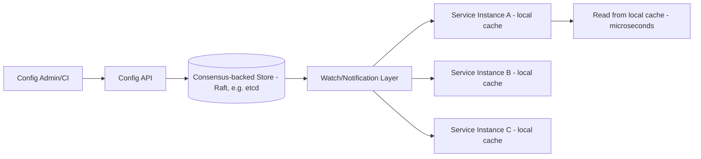

# Design a Distributed Configuration Management System

## Blogs and websites

## Medium

## Youtube

## Theory

### Problem Statement

Design a distributed configuration management system (like etcd/Consul/ZooKeeper-backed config, or a feature-flag-adjacent config service) that lets services fetch configuration values, watch for changes, and receive near-real-time updates across thousands of service instances, without a config change requiring a redeploy.

### Functional Requirements

- Store hierarchical/namespaced key-value configuration (per service, per environment)
- Serve reads with low latency from any service instance
- Push/notify subscribed clients when a watched key changes
- Support versioning and rollback of configuration changes
- Support access control over who can change which config keys

### Non-Functional Requirements

- **Scale**: Thousands of service instances polling/watching config, config change rate is low relative to read rate (read-heavy)
- **Latency**: Reads should be servable from a local cache in microseconds; propagation of a change to all watchers within a few seconds
- **Consistency**: Strong consistency for the write path (no two conflicting writes silently both "win"); eventual consistency acceptable for propagation to watchers
- **Availability**: Config reads must keep working (from cache) even if the central config store is temporarily unreachable

### High-Level Architecture

### Key Design Points

- Back the store with a consensus protocol (Raft, as used by etcd/Consul) so writes are strongly consistent and survive node failures without split-brain configuration state.
- Have every service instance keep a local in-memory cache of the config it needs, populated at startup and updated via a long-lived watch/streaming connection to the config store, so reads never leave the process and a brief config-store outage doesn't stop services from running with their last-known-good config.
- Version every config change and keep history, so a bad config push can be rolled back to a previous version instantly, and changes can be audited (who changed what, when).
- Use a watch mechanism (long-poll or streaming gRPC watch, like etcd's watch API) rather than clients polling on a fixed interval, to get near-real-time propagation without hammering the store with reads.

### Trade-offs

- Local per-instance caching trades a few seconds of propagation delay for near-total decoupling of the read-hot-path from the config store's availability - the right trade since config changes are rare relative to reads.
- A consensus-backed store (Raft) is more operationally heavy than a simple key-value DB, but is necessary to avoid split-brain configuration where two nodes each believe they hold the latest, conflicting value.
