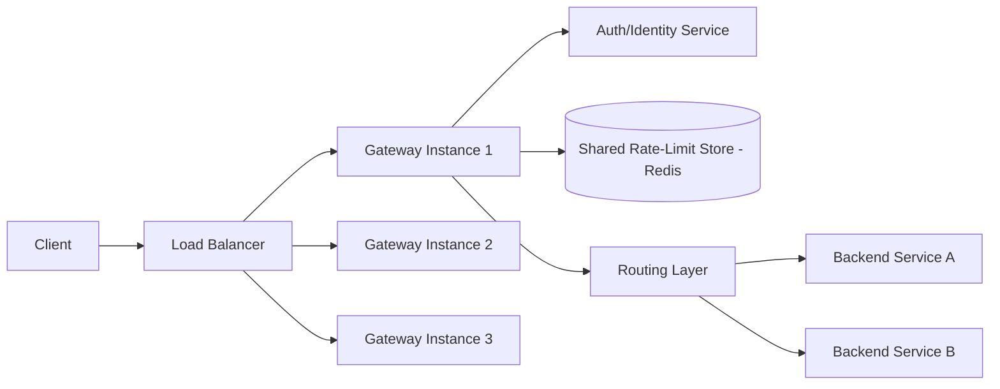

# Design a Distributed Rate-Limited API Gateway

## Blogs and websites

## Medium

## Youtube

## Theory

### Problem Statement

Design an API gateway that sits in front of many backend microservices and enforces per-client rate limits (in addition to routing, auth, and other cross-cutting concerns), consistently across a fleet of gateway instances, without becoming a bottleneck itself.

### Functional Requirements

- Route incoming requests to the correct backend service based on path/host
- Authenticate/authorize requests and identify the calling client (API key, JWT, IP)
- Enforce per-client (and optionally per-route) rate limits consistently across all gateway instances
- Return standard rate-limit headers (limit, remaining, retry-after) and a 429 response when exceeded

### Non-Functional Requirements

- **Scale**: Tens of thousands of requests/sec across many gateway instances behind a load balancer
- **Latency**: Gateway overhead (routing + auth + rate-limit check) should add only a few milliseconds
- **Consistency**: The enforced limit must be global across all gateway instances, not per-instance
- **Availability**: The gateway must not become a single point of failure; rate-limit-store outages should degrade gracefully

### High-Level Architecture

### Key Design Points

- Implement rate limiting as a gateway-level filter/plugin that runs before routing, checking a shared store (Redis with an atomic Lua script, as in the standalone distributed rate limiter design) keyed by client identity, so the limit is enforced identically no matter which gateway instance handles a given request.
- Resolve client identity (API key/JWT subject) once, early in the pipeline, and reuse it for both authorization and the rate-limit key, avoiding duplicate lookups.
- Cache authentication/authorization decisions and rate-limit-tier lookups (e.g., "this API key is on the paid tier with 1000 req/min") locally with a short TTL to avoid a network round-trip on every single request for mostly-static client metadata.
- Keep the rate-limit check on the hot path minimal (a single atomic increment-and-check call) and push logging/analytics about rejected requests to an asynchronous pipeline.

### Trade-offs

- Enforcing limits via a shared external store (rather than per-instance in-memory counters) is necessary for a globally correct limit across a horizontally scaled gateway fleet, at the cost of an extra network hop per request; caching non-volatile client metadata locally offsets most of that cost.
- Failing open (allowing traffic) versus failing closed (rejecting traffic) when the rate-limit store is unreachable is a business decision: failing open protects availability but risks temporary over-limit traffic reaching backends; failing closed protects backends but can cause a full outage from a single dependency failure.
